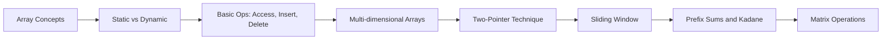
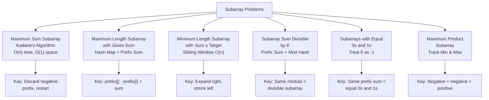

# Chapter 2: Arrays

> **Previous:** [Chapter 1: Complexity Analysis](./01-complexity.md) | **Next:** [Singly Linked List](./03-singly-linked-list.md)

## Learning Objectives

- Distinguish between static and dynamic arrays.
- Implement insertion, deletion, and traversal on arrays.
- Solve problems using the two-pointer technique.
- Manipulate 2D arrays and matrices.

<!-- Image Gallery -->
<div style="display:flex;flex-wrap:wrap;gap:4px;margin:16px 0;padding:12px;background:#f8fafc;border-radius:8px;border:1px solid #e2e8f0;">
<a href="../../../assets/images/lessons/data-structures/02-arrays/hero.svg" target="_blank" rel="noopener">
  
</a>
<a href="../../../assets/images/lessons/data-structures/02-arrays/handwritten-notes.svg" target="_blank" rel="noopener">
  
</a>
<a href="../../../assets/images/lessons/data-structures/02-arrays/sticky-notes.svg" target="_blank" rel="noopener">
  
</a>
<a href="../../../assets/images/lessons/data-structures/02-arrays/visual-explanation.svg" target="_blank" rel="noopener">
  
</a>
<a href="../../../assets/images/lessons/data-structures/02-arrays/architecture.svg" target="_blank" rel="noopener">
  
</a>
<a href="../../../assets/images/lessons/data-structures/02-arrays/workflow.svg" target="_blank" rel="noopener">
  
</a>
<a href="../../../assets/images/lessons/data-structures/02-arrays/mindmap.svg" target="_blank" rel="noopener">
  
</a>
<a href="../../../assets/images/lessons/data-structures/02-arrays/comparison.svg" target="_blank" rel="noopener">
  
</a>
<a href="../../../assets/images/lessons/data-structures/02-arrays/cheatsheet.svg" target="_blank" rel="noopener">
  
</a>
<a href="../../../assets/images/lessons/data-structures/02-arrays/interview-quiz.svg" target="_blank" rel="noopener">
  
</a>
<a href="../../../assets/images/lessons/data-structures/02-arrays/social-card.svg" target="_blank" rel="noopener">
  
</a>
</div>
<!-- End Image Gallery -->


## Why Arrays Matter

Imagine a row of cinema seats numbered 0 to n-1. Each seat holds exactly one person — just like an array slot holds one element. You can instantly tell anyone to "go to seat 7" (O(1) random access), but if a new person needs to sit in seat 2, everyone from seat 2 onward must shift right by one (O(n) insertion). If someone leaves seat 4, everyone to the right shifts left (O(n) deletion). This trade-off — instant lookup vs. costly insertion/deletion — is the defining character of arrays and the reason they power everything from image buffers to dynamic language runtimes.

## Chapter at a Glance

| Topic | Key Insight | Practical Takeaway |
|-------|-------------|-------------------|
| Static Arrays | Contiguous memory block, fixed size at allocation | Use when element count is known and constant |
| Dynamic Arrays | Grows by doubling when capacity exhausted | Default choice for general-purpose sequential data |
| Two-Pointer Technique | Two indices scan from opposite ends | Reduces pair-sum from O(n²) to O(n) on sorted arrays |
| 2D Arrays / Matrices | Row-major or column-major storage | Row-major traversal is cache-friendly in C/C++ |
| Prefix Sums | Precomputed running total for O(1) range queries | Essential for repeated subarray-sum problems |
| Sliding Window | Expand/contract window over contiguous elements | Solves max subarray and substring problems in O(n) |

## Chapter Roadmap



## 1. Array ADT (Abstract Data Type)

### Real-World Analogy

<a href="../../../assets/images/diagrams/data-structures/02-arrays/real-world-analogy-handwritten.svg" target="_blank" rel="noopener">
  
</a>
<a href="../../../assets/images/diagrams/data-structures/02-arrays/real-world-analogy-diagram.svg" target="_blank" rel="noopener">
  
</a>
<a href="../../../assets/images/diagrams/data-structures/02-arrays/real-world-analogy-sticky.svg" target="_blank" rel="noopener">
  
</a>


A **vending machine** is an array of slots. Each slot has a fixed position (index 0, 1, 2, ...) and stores one item.
- **Access**: Press B3 → instantly get the item at slot B3 → O(1)
- **Search**: Look at each slot until you find a Sprite → O(n)
- **Insert**: Staff adds a new item at position 2 — everything from 2 onward gets shifted right → O(n)
- **Delete**: An item is sold from position 4 — everything from 4 onward shifts left → O(n)

### Definition

<a href="../../../assets/images/diagrams/data-structures/02-arrays/definition-handwritten.svg" target="_blank" rel="noopener">
  
</a>
<a href="../../../assets/images/diagrams/data-structures/02-arrays/definition-diagram.svg" target="_blank" rel="noopener">
  
</a>
<a href="../../../assets/images/diagrams/data-structures/02-arrays/definition-sticky.svg" target="_blank" rel="noopener">
  
</a>


The **Array ADT** is a collection of elements of the same type stored in contiguous memory locations, providing:
- **Ordered storage**: elements have a definite position (index 0..n-1)
- **Random access**: any element can be accessed in O(1) using its index
- **Homogeneous**: all elements are the same data type

### Core Operations

<a href="../../../assets/images/diagrams/data-structures/02-arrays/core-operations-handwritten.svg" target="_blank" rel="noopener">
  
</a>
<a href="../../../assets/images/diagrams/data-structures/02-arrays/core-operations-diagram.svg" target="_blank" rel="noopener">
  
</a>
<a href="../../../assets/images/diagrams/data-structures/02-arrays/core-operations-sticky.svg" target="_blank" rel="noopener">
  
</a>


| Operation | Description | Complexity |
|-----------|-------------|------------|
| `read(i)` | Return element at index i | O(1) |
| `update(i, val)` | Set arr[i] = val | O(1) |
| `search(val)` | Find first index of val | O(n) |
| `insert(i, val)` | Insert val at index i, shift right | O(n) |
| `delete(i)` | Remove element at i, shift left | O(n) |

### Pseudocode

<a href="../../../assets/images/diagrams/data-structures/02-arrays/pseudocode-handwritten.svg" target="_blank" rel="noopener">
  
</a>
<a href="../../../assets/images/diagrams/data-structures/02-arrays/pseudocode-diagram.svg" target="_blank" rel="noopener">
  
</a>
<a href="../../../assets/images/diagrams/data-structures/02-arrays/pseudocode-sticky.svg" target="_blank" rel="noopener">
  
</a>


```
ALGORITHM read(arr, i)
    IF i < 0 OR i ≥ length(arr) THEN
        THROW IndexOutOfBounds
    RETURN arr[i]

ALGORITHM insert(arr, i, val, n, capacity)
    // n = current size, capacity = allocated size
    IF n ≥ capacity THEN
        THROW Overflow
    IF i < 0 OR i > n THEN
        THROW IndexOutOfBounds
    FOR j = n DOWNTO i+1:
        arr[j] = arr[j-1]
    arr[i] = val
    n = n + 1

ALGORITHM delete(arr, i, n)
    IF i < 0 OR i ≥ n THEN
        THROW IndexOutOfBounds
    FOR j = i TO n-2:
        arr[j] = arr[j+1]
    n = n - 1
```

### Step-by-Step Dry Run

<a href="../../../assets/images/diagrams/data-structures/02-arrays/step-by-step-dry-run-handwritten.svg" target="_blank" rel="noopener">
  
</a>
<a href="../../../assets/images/diagrams/data-structures/02-arrays/step-by-step-dry-run-diagram.svg" target="_blank" rel="noopener">
  
</a>
<a href="../../../assets/images/diagrams/data-structures/02-arrays/step-by-step-dry-run-sticky.svg" target="_blank" rel="noopener">
  
</a>


**Insert** — Insert value 25 at index 2 in arr = [10, 20, 30, 40, 50], n=5, capacity=6

| Step | Operation | Array State | n |
|------|-----------|-------------|---|
| 0 | Initial | [10, 20, 30, 40, 50, _] | 5 |
| 1 | Shift j=5→2 : arr[5]=arr[4] | [10, 20, 30, 40, 50, 50] | 5 |
| 2 | Shift j=4→2 : arr[4]=arr[3] | [10, 20, 30, 40, 40, 50] | 5 |
| 3 | Shift j=3→2 : arr[3]=arr[2] | [10, 20, 30, 30, 40, 50] | 5 |
| 4 | arr[2] = 25 | [10, 20, 25, 30, 40, 50] | 5 |
| 5 | n = n + 1 | [10, 20, 25, 30, 40, 50] | 6 |

**Delete** — Delete element at index 1 from arr = [10, 20, 30, 40, 50], n=5

| Step | Operation | Array State | n |
|------|-----------|-------------|---|
| 0 | Initial | [10, 20, 30, 40, 50] | 5 |
| 1 | Shift j=1→3 : arr[1]=arr[2] | [10, 30, 30, 40, 50] | 5 |
| 2 | Shift j=2→3 : arr[2]=arr[3] | [10, 30, 40, 40, 50] | 5 |
| 3 | Shift j=3→3 : arr[3]=arr[4] | [10, 30, 40, 50, 50] | 5 |
| 4 | n = n - 1 | [10, 30, 40, 50, 50] | 4 |

### C++ Implementation

<a href="../../../assets/images/diagrams/data-structures/02-arrays/c-implementation-handwritten.svg" target="_blank" rel="noopener">
  
</a>
<a href="../../../assets/images/diagrams/data-structures/02-arrays/c-implementation-diagram.svg" target="_blank" rel="noopener">
  
</a>
<a href="../../../assets/images/diagrams/data-structures/02-arrays/c-implementation-sticky.svg" target="_blank" rel="noopener">
  
</a>


```cpp
#include <iostream>
using namespace std;

class ArrayADT {
private:
    int* arr;
    int n;
    int capacity;
public:
    ArrayADT(int cap) : capacity(cap), n(0) {
        arr = new int[capacity];
    }
    ~ArrayADT() { delete[] arr; }

    int read(int i) {
        if (i < 0 || i >= n) throw out_of_range("Index out of bounds");
        return arr[i];
    }

    void update(int i, int val) {
        if (i < 0 || i >= n) throw out_of_range("Index out of bounds");
        arr[i] = val;
    }

    void insert(int i, int val) {
        if (n >= capacity) throw overflow_error("Array full");
        if (i < 0 || i > n) throw out_of_range("Index out of bounds");
        for (int j = n; j > i; --j)
            arr[j] = arr[j - 1];
        arr[i] = val;
        n++;
    }

    int remove(int i) {
        if (i < 0 || i >= n) throw out_of_range("Index out of bounds");
        int val = arr[i];
        for (int j = i; j < n - 1; ++j)
            arr[j] = arr[j + 1];
        n--;
        return val;
    }

    int search(int val) {
        for (int i = 0; i < n; ++i)
            if (arr[i] == val) return i;
        return -1;
    }

    void print() {
        for (int i = 0; i < n; ++i) cout << arr[i] << " ";
        cout << "\n";
    }
};

int main() {
    ArrayADT a(6);
    for (int i = 0; i < 5; ++i) a.insert(i, (i + 1) * 10);
    a.print();                       // 10 20 30 40 50
    cout << a.read(2) << "\n";       // 30
    a.insert(2, 25);
    a.print();                       // 10 20 25 30 40 50
    a.remove(1);
    a.print();                       // 10 25 30 40 50
    return 0;
}
```

### Python Implementation

<a href="../../../assets/images/diagrams/data-structures/02-arrays/python-implementation-handwritten.svg" target="_blank" rel="noopener">
  
</a>
<a href="../../../assets/images/diagrams/data-structures/02-arrays/python-implementation-diagram.svg" target="_blank" rel="noopener">
  
</a>
<a href="../../../assets/images/diagrams/data-structures/02-arrays/python-implementation-sticky.svg" target="_blank" rel="noopener">
  
</a>


```python
class ArrayADT:
    def __init__(self, capacity: int):
        self.arr = [None] * capacity
        self.n = 0
        self.capacity = capacity

    def read(self, i: int):
        if i < 0 or i >= self.n:
            raise IndexError("Index out of bounds")
        return self.arr[i]

    def update(self, i: int, val):
        if i < 0 or i >= self.n:
            raise IndexError("Index out of bounds")
        self.arr[i] = val

    def insert(self, i: int, val):
        if self.n >= self.capacity:
            raise OverflowError("Array full")
        if i < 0 or i > self.n:
            raise IndexError("Index out of bounds")
        for j in range(self.n, i, -1):
            self.arr[j] = self.arr[j - 1]
        self.arr[i] = val
        self.n += 1

    def remove(self, i: int):
        if i < 0 or i >= self.n:
            raise IndexError("Index out of bounds")
        val = self.arr[i]
        for j in range(i, self.n - 1):
            self.arr[j] = self.arr[j + 1]
        self.n -= 1
        return val

    def search(self, val):
        for i in range(self.n):
            if self.arr[i] == val:
                return i
        return -1

    def print_all(self):
        print([self.arr[i] for i in range(self.n)])

arr = ArrayADT(6)
for i in range(5):
    arr.insert(i, (i + 1) * 10)
arr.print_all()      # [10, 20, 30, 40, 50]
print(arr.read(2))   # 30
arr.insert(2, 25)
arr.print_all()      # [10, 20, 25, 30, 40, 50]
arr.remove(1)
arr.print_all()      # [10, 25, 30, 40, 50]
```

### Java Implementation

<a href="../../../assets/images/diagrams/data-structures/02-arrays/java-implementation-handwritten.svg" target="_blank" rel="noopener">
  
</a>
<a href="../../../assets/images/diagrams/data-structures/02-arrays/java-implementation-diagram.svg" target="_blank" rel="noopener">
  
</a>
<a href="../../../assets/images/diagrams/data-structures/02-arrays/java-implementation-sticky.svg" target="_blank" rel="noopener">
  
</a>


```java
public class ArrayADT {
    private int[] arr;
    private int n;
    private int capacity;

    public ArrayADT(int capacity) {
        this.capacity = capacity;
        this.n = 0;
        this.arr = new int[capacity];
    }

    public int read(int i) {
        if (i < 0 || i >= n) throw new IndexOutOfBoundsException();
        return arr[i];
    }

    public void update(int i, int val) {
        if (i < 0 || i >= n) throw new IndexOutOfBoundsException();
        arr[i] = val;
    }

    public void insert(int i, int val) {
        if (n >= capacity) throw new RuntimeException("Array full");
        if (i < 0 || i > n) throw new IndexOutOfBoundsException();
        for (int j = n; j > i; j--)
            arr[j] = arr[j - 1];
        arr[i] = val;
        n++;
    }

    public int remove(int i) {
        if (i < 0 || i >= n) throw new IndexOutOfBoundsException();
        int val = arr[i];
        for (int j = i; j < n - 1; j++)
            arr[j] = arr[j + 1];
        n--;
        return val;
    }

    public int search(int val) {
        for (int i = 0; i < n; i++)
            if (arr[i] == val) return i;
        return -1;
    }

    public void print() {
        for (int i = 0; i < n; i++) System.out.print(arr[i] + " ");
        System.out.println();
    }

    public static void main(String[] args) {
        ArrayADT a = new ArrayADT(6);
        for (int i = 0; i < 5; i++) a.insert(i, (i + 1) * 10);
        a.print();                  // 10 20 30 40 50
        System.out.println(a.read(2)); // 30
        a.insert(2, 25);
        a.print();                  // 10 20 25 30 40 50
        a.remove(1);
        a.print();                  // 10 25 30 40 50
    }
}
```

### Complexity Analysis — Why?

<a href="../../../assets/images/diagrams/data-structures/02-arrays/complexity-analysis-why-handwritten.svg" target="_blank" rel="noopener">
  
</a>
<a href="../../../assets/images/diagrams/data-structures/02-arrays/complexity-analysis-why-diagram.svg" target="_blank" rel="noopener">
  
</a>
<a href="../../../assets/images/diagrams/data-structures/02-arrays/complexity-analysis-why-sticky.svg" target="_blank" rel="noopener">
  
</a>


| Operation | Time | Space | Why? |
|-----------|------|-------|------|
| `read(i)` | O(1) | O(1) | Address computed directly as base + i × sizeof(element). No loops. |
| `update(i, val)` | O(1) | O(1) | Same direct-address computation as read. |
| `search(val)` | O(n) | O(1) | Worst case: val at last index or absent; must visit all n elements. |
| `insert(i, val)` | O(n) | O(1) | Worst case (i=0): all n elements shift right by 1. |
| `delete(i)` | O(n) | O(1) | Worst case (i=0): all n elements shift left by 1. |

### Advantages & Disadvantages

<a href="../../../assets/images/diagrams/data-structures/02-arrays/advantages-disadvantages-handwritten.svg" target="_blank" rel="noopener">
  
</a>
<a href="../../../assets/images/diagrams/data-structures/02-arrays/advantages-disadvantages-diagram.svg" target="_blank" rel="noopener">
  
</a>
<a href="../../../assets/images/diagrams/data-structures/02-arrays/advantages-disadvantages-sticky.svg" target="_blank" rel="noopener">
  
</a>


| Advantages | Disadvantages |
|------------|---------------|
| O(1) random access by index | Fixed capacity (static) or amortized-cost resize (dynamic) |
| Excellent cache locality — contiguous memory | O(n) insertion/deletion in middle |
| Minimal memory overhead (no pointers) | O(n) search in unsorted array |
| Simple, familiar interface | Size must be known or guessable at allocation |
| Language-native in C/C++/Java/Python | Wasted space when capacity > size (dynamic) |

### Edge Cases

<a href="../../../assets/images/diagrams/data-structures/02-arrays/edge-cases-handwritten.svg" target="_blank" rel="noopener">
  
</a>
<a href="../../../assets/images/diagrams/data-structures/02-arrays/edge-cases-diagram.svg" target="_blank" rel="noopener">
  
</a>
<a href="../../../assets/images/diagrams/data-structures/02-arrays/edge-cases-sticky.svg" target="_blank" rel="noopener">
  
</a>


1. **Empty array** (n = 0) — read/delete/search on empty array throws IndexOutOfBounds or returns -1
2. **Single element** (n = 1) — insert at end works, delete at 0 leaves empty array
3. **Full array** (n = capacity) — insert raises overflow; resize needed in dynamic arrays
4. **Index out of bounds** — insert i &lt; 0 or i &gt; n, delete/read i &lt; 0 or i &gt;= n
5. **Insert at end** (i = n) — valid, no elements shift; best-case insertion
6. **Insert at front** (i = 0) — worst case, all n elements shift right
7. **Delete from end** (i = n-1) — valid, no elements shift
8. **Duplicate values** — search returns first match; insertion creates duplicates

---

## 2. Static vs Dynamic Arrays

### Real-World Analogy

<a href="../../../assets/images/diagrams/data-structures/02-arrays/real-world-analogy-handwritten.svg" target="_blank" rel="noopener">
  
</a>
<a href="../../../assets/images/diagrams/data-structures/02-arrays/real-world-analogy-diagram.svg" target="_blank" rel="noopener">
  
</a>
<a href="../../../assets/images/diagrams/data-structures/02-arrays/real-world-analogy-sticky.svg" target="_blank" rel="noopener">
  
</a>


**Static array** = a parking lot with exactly 20 painted spots. If 21 cars arrive, overflow.
**Dynamic array** = a parking lot that, when it fills up, buys the adjacent lot, doubles its spots, and moves all cars across. Each individual move costs O(n), but on average over many arrivals, each car costs O(1).

### Static Array

<a href="../../../assets/images/diagrams/data-structures/02-arrays/static-array-handwritten.svg" target="_blank" rel="noopener">
  
</a>
<a href="../../../assets/images/diagrams/data-structures/02-arrays/static-array-diagram.svg" target="_blank" rel="noopener">
  
</a>
<a href="../../../assets/images/diagrams/data-structures/02-arrays/static-array-sticky.svg" target="_blank" rel="noopener">
  
</a>


A static array is a fixed-size block of contiguous memory. Size is set at compile time or via `new[]` and cannot change after allocation.

```cpp
int arr[10];          // Stack-allocated, size 10, fixed forever
int* arr2 = new int[20]; // Heap-allocated, fixed at 20
```

### Dynamic Array

<a href="../../../assets/images/diagrams/data-structures/02-arrays/dynamic-array-handwritten.svg" target="_blank" rel="noopener">
  
</a>
<a href="../../../assets/images/diagrams/data-structures/02-arrays/dynamic-array-diagram.svg" target="_blank" rel="noopener">
  
</a>
<a href="../../../assets/images/diagrams/data-structures/02-arrays/dynamic-array-sticky.svg" target="_blank" rel="noopener">
  
</a>


A dynamic array (also called *resizeable array*, *vector*, *ArrayList*) starts with a small capacity and grows by a **growth factor** (typically ×2) when full.

**Growth Pattern (capacity doubling):**

| Insertion # | Size (n) | Capacity | Resize Cost |
|------------|---------|----------|-------------|
| 1 | 1 | 1 | — |
| 2 | 2 | 2 | Copy 1 element |
| 3 | 3 | 4 | Copy 2 elements |
| 4 | 4 | 4 | — |
| 5 | 5 | 8 | Copy 4 elements |
| ... | ... | ... | ... |
| 9 | 9 | 16 | Copy 8 elements |

### Amortized Cost Analysis

<a href="../../../assets/images/diagrams/data-structures/02-arrays/amortized-cost-analysis-handwritten.svg" target="_blank" rel="noopener">
  
</a>
<a href="../../../assets/images/diagrams/data-structures/02-arrays/amortized-cost-analysis-diagram.svg" target="_blank" rel="noopener">
  
</a>
<a href="../../../assets/images/diagrams/data-structures/02-arrays/amortized-cost-analysis-sticky.svg" target="_blank" rel="noopener">
  
</a>


Total copies after n insertions (where n = 2^k + 1):
1 + 2 + 4 + 8 + ... + 2^k = 2^(k+1) - 1 ≈ 2n

**Amortized cost per insertion** = Total work / n ≈ 2n / n = **O(1)**

### C++ Implementation (std::vector behavior)

<a href="../../../assets/images/diagrams/data-structures/02-arrays/c-implementation-std-vector-behavior-handwritten.svg" target="_blank" rel="noopener">
  
</a>
<a href="../../../assets/images/diagrams/data-structures/02-arrays/c-implementation-std-vector-behavior-diagram.svg" target="_blank" rel="noopener">
  
</a>
<a href="../../../assets/images/diagrams/data-structures/02-arrays/c-implementation-std-vector-behavior-sticky.svg" target="_blank" rel="noopener">
  
</a>


```cpp
#include <iostream>
using namespace std;

template <typename T>
class DynamicArray {
private:
    T* arr;
    int n;
    int cap;
    void resize() {
        cap = cap == 0 ? 1 : cap * 2;
        T* newArr = new T[cap];
        for (int i = 0; i < n; ++i) newArr[i] = arr[i];
        delete[] arr;
        arr = newArr;
    }
public:
    DynamicArray() : arr(nullptr), n(0), cap(0) {}

    void pushBack(T val) {
        if (n >= cap) resize();
        arr[n++] = val;
    }

    T popBack() {
        if (n == 0) throw underflow_error("Empty");
        return arr[--n];
    }

    T& operator[](int i) { return arr[i]; }
    int size() { return n; }
    int capacity() { return cap; }
};

int main() {
    DynamicArray<int> v;
    for (int i = 0; i < 10; ++i) v.pushBack(i * 10);
    for (int i = 0; i < v.size(); ++i) cout << v[i] << " ";
    cout << "\nSize: " << v.size() << ", Cap: " << v.capacity() << "\n";
    return 0;
}
```

### Python Implementation (simulating dynamic array)

<a href="../../../assets/images/diagrams/data-structures/02-arrays/python-implementation-simulating-dynamic-array-handwritten.svg" target="_blank" rel="noopener">
  
</a>
<a href="../../../assets/images/diagrams/data-structures/02-arrays/python-implementation-simulating-dynamic-array-diagram.svg" target="_blank" rel="noopener">
  
</a>
<a href="../../../assets/images/diagrams/data-structures/02-arrays/python-implementation-simulating-dynamic-array-sticky.svg" target="_blank" rel="noopener">
  
</a>


```python
class DynamicArray:
    def __init__(self):
        self.arr = [None]   # start with capacity 1
        self.n = 0
        self.cap = 1

    def _resize(self):
        self.cap *= 2
        new_arr = [None] * self.cap
        for i in range(self.n):
            new_arr[i] = self.arr[i]
        self.arr = new_arr

    def append(self, val):
        if self.n >= self.cap:
            self._resize()
        self.arr[self.n] = val
        self.n += 1

    def pop(self):
        if self.n == 0:
            raise IndexError("pop from empty array")
        self.n -= 1
        return self.arr[self.n]

    def __getitem__(self, i):
        if i < 0 or i >= self.n:
            raise IndexError("Index out of bounds")
        return self.arr[i]

    def __len__(self):
        return self.n

    def capacity(self):
        return self.cap

v = DynamicArray()
for i in range(10):
    v.append(i * 10)
print([v[i] for i in range(len(v))])
print(f"Size: {len(v)}, Cap: {v.capacity()}")
```

### Java Implementation

<a href="../../../assets/images/diagrams/data-structures/02-arrays/java-implementation-handwritten.svg" target="_blank" rel="noopener">
  
</a>
<a href="../../../assets/images/diagrams/data-structures/02-arrays/java-implementation-diagram.svg" target="_blank" rel="noopener">
  
</a>
<a href="../../../assets/images/diagrams/data-structures/02-arrays/java-implementation-sticky.svg" target="_blank" rel="noopener">
  
</a>


```java
import java.util.Arrays;

public class DynamicArray<T> {
    private Object[] arr;
    private int n;
    private int cap;

    public DynamicArray() {
        this.cap = 1;
        this.n = 0;
        this.arr = new Object[cap];
    }

    public void append(T val) {
        if (n >= cap) {
            cap *= 2;
            arr = Arrays.copyOf(arr, cap);
        }
        arr[n++] = val;
    }

    @SuppressWarnings("unchecked")
    public T pop() {
        if (n == 0) throw new RuntimeException("Empty");
        return (T) arr[--n];
    }

    @SuppressWarnings("unchecked")
    public T get(int i) {
        if (i < 0 || i >= n) throw new IndexOutOfBoundsException();
        return (T) arr[i];
    }

    public int size() { return n; }
    public int capacity() { return cap; }

    public static void main(String[] args) {
        DynamicArray<Integer> v = new DynamicArray<>();
        for (int i = 0; i < 10; i++) v.append(i * 10);
        for (int i = 0; i < v.size(); i++) System.out.print(v.get(i) + " ");
        System.out.println();
        System.out.println("Size: " + v.size() + ", Cap: " + v.capacity());
    }
}
```

### Static vs Dynamic — Comparison

<a href="../../../assets/images/diagrams/data-structures/02-arrays/static-vs-dynamic-comparison-handwritten.svg" target="_blank" rel="noopener">
  
</a>
<a href="../../../assets/images/diagrams/data-structures/02-arrays/static-vs-dynamic-comparison-diagram.svg" target="_blank" rel="noopener">
  
</a>
<a href="../../../assets/images/diagrams/data-structures/02-arrays/static-vs-dynamic-comparison-sticky.svg" target="_blank" rel="noopener">
  
</a>


| Feature | Static Array | Dynamic Array |
|---------|-------------|---------------|
| Size | Fixed at compile/alloc | Grows on demand |
| Memory allocation | Stack or heap (once) | Heap (resized when full) |
| Insert end O(1)? | Yes (if space) | Yes (amortized) |
| Insert end worst-case | O(1) | O(n) during resize |
| Index access | O(1) | O(1) |
| Memory overhead | None | cap - n unused slots |
| Use case | Known, constant size | Unknown or growing data |

### Complexity — Why?

<a href="../../../assets/images/diagrams/data-structures/02-arrays/complexity-why-handwritten.svg" target="_blank" rel="noopener">
  
</a>
<a href="../../../assets/images/diagrams/data-structures/02-arrays/complexity-why-diagram.svg" target="_blank" rel="noopener">
  
</a>
<a href="../../../assets/images/diagrams/data-structures/02-arrays/complexity-why-sticky.svg" target="_blank" rel="noopener">
  
</a>


- **Static array: Access O(1)** — arithmetic: base + i * sizeof(T), one multiplication, one addition.
- **Dynamic array: push_back amortized O(1)** — the rare O(n) resize cost is spread across all insertions. Each element is copied at most log₂(n) times during its lifetime.
- **Dynamic array: pop_back O(1)** — just decrement n, no resize (some implementations shrink at cap/4).

### Advantages & Disadvantages

<a href="../../../assets/images/diagrams/data-structures/02-arrays/advantages-disadvantages-handwritten.svg" target="_blank" rel="noopener">
  
</a>
<a href="../../../assets/images/diagrams/data-structures/02-arrays/advantages-disadvantages-diagram.svg" target="_blank" rel="noopener">
  
</a>
<a href="../../../assets/images/diagrams/data-structures/02-arrays/advantages-disadvantages-sticky.svg" target="_blank" rel="noopener">
  
</a>


| Advantages | Disadvantages |
|------------|---------------|
| Cache-friendly contiguous layout | Resize copies all elements (O(n)) |
| Amortized O(1) end insertion | May waste up to 50% capacity (growth factor 2) |
| O(1) index access | Insert/delete in middle is O(n) |
| Simpler than linked list | Growth pauses execution during resize |

### Edge Cases

<a href="../../../assets/images/diagrams/data-structures/02-arrays/edge-cases-handwritten.svg" target="_blank" rel="noopener">
  
</a>
<a href="../../../assets/images/diagrams/data-structures/02-arrays/edge-cases-diagram.svg" target="_blank" rel="noopener">
  
</a>
<a href="../../../assets/images/diagrams/data-structures/02-arrays/edge-cases-sticky.svg" target="_blank" rel="noopener">
  
</a>


- **Empty dynamic array**: push_back works (if cap=0, resize to 1); pop_back throws
- **Single element**: push_back triggers first resize; pop_back leaves empty
- **Very large growth**: capacity doubling can cause memory exhaustion (growth factor 1.5 is more memory-efficient)
- **Shrinking**: Repeated pop_back does not reduce capacity — some implementations shrink at n ≤ cap/4

---

## 3. Array Operations: Insertion, Deletion, Traversal

### Real-World Analogy

<a href="../../../assets/images/diagrams/data-structures/02-arrays/real-world-analogy-handwritten.svg" target="_blank" rel="noopener">
  
</a>
<a href="../../../assets/images/diagrams/data-structures/02-arrays/real-world-analogy-diagram.svg" target="_blank" rel="noopener">
  
</a>
<a href="../../../assets/images/diagrams/data-structures/02-arrays/real-world-analogy-sticky.svg" target="_blank" rel="noopener">
  
</a>


**Insertion** = A line of people at a ticket counter. A VIP arrives and wants position 3, so everyone from position 3 onward steps back by one.
**Deletion** = Person at position 5 leaves the queue, so everyone behind steps forward by one.
**Traversal** = The guard walks from the first person to the last, checking each ticket.

### Insertion

<a href="../../../assets/images/diagrams/data-structures/02-arrays/insertion-handwritten.svg" target="_blank" rel="noopener">
  
</a>
<a href="../../../assets/images/diagrams/data-structures/02-arrays/insertion-diagram.svg" target="_blank" rel="noopener">
  
</a>
<a href="../../../assets/images/diagrams/data-structures/02-arrays/insertion-sticky.svg" target="_blank" rel="noopener">
  
</a>


Insert value `val` at position `pos`, shifting all elements from `pos` to `n-1` right by one.

**Algorithm Steps:**
1. Check if array is full (n ≥ capacity) — if so, report overflow
2. Check if pos is valid (0 ≤ pos ≤ n) — if not, report out of bounds
3. Shift all elements from index n-1 down to pos by one position right
4. Place val at arr[pos]
5. Increment n

**Pseudocode:**
```
ALGORITHM insert(arr, n, capacity, pos, val)
    IF n ≥ capacity THEN
        PRINT "Array full"
        RETURN
    IF pos < 0 OR pos > n THEN
        PRINT "Invalid position"
        RETURN
    FOR i = n DOWNTO pos + 1:
        arr[i] = arr[i - 1]
    arr[pos] = val
    n = n + 1
```

**Dry Run:** Insert 25 at pos=2, arr=[10,20,30,40,50], n=5, cap=6

| Step | Operation | Array | n |
|------|-----------|-------|---|
| 0 | Initial | [10, 20, 30, 40, 50, _] | 5 |
| 1 | arr[5] = arr[4] | [10, 20, 30, 40, 50, 50] | 5 |
| 2 | arr[4] = arr[3] | [10, 20, 30, 40, 40, 50] | 5 |
| 3 | arr[3] = arr[2] | [10, 20, 30, 30, 40, 50] | 5 |
| 4 | arr[2] = 25 | [10, 20, 25, 30, 40, 50] | 5 |
| 5 | n = n + 1 | [10, 20, 25, 30, 40, 50] | 6 |

### Deletion

<a href="../../../assets/images/diagrams/data-structures/02-arrays/deletion-handwritten.svg" target="_blank" rel="noopener">
  
</a>
<a href="../../../assets/images/diagrams/data-structures/02-arrays/deletion-diagram.svg" target="_blank" rel="noopener">
  
</a>
<a href="../../../assets/images/diagrams/data-structures/02-arrays/deletion-sticky.svg" target="_blank" rel="noopener">
  
</a>


Remove element at position `pos`, shifting all elements from `pos+1` to `n-1` left by one.

**Algorithm Steps:**
1. Check if array is empty — if so, report underflow
2. Check if pos is valid (0 ≤ pos &lt; n) — if not, report out of bounds
3. Shift all elements from pos+1 to n-1 by one position left
4. Decrement n

**Pseudocode:**
```
ALGORITHM delete(arr, n, pos)
    IF n == 0 THEN
        PRINT "Array empty"
        RETURN NULL
    IF pos < 0 OR pos ≥ n THEN
        PRINT "Invalid position"
        RETURN NULL
    val = arr[pos]
    FOR i = pos TO n - 2:
        arr[i] = arr[i + 1]
    n = n - 1
    RETURN val
```

**Dry Run:** Delete at pos=1, arr=[10,20,30,40,50], n=5

| Step | Operation | Array | n |
|------|-----------|-------|---|
| 0 | Initial | [10, 20, 30, 40, 50] | 5 |
| 1 | arr[1] = arr[2] | [10, 30, 30, 40, 50] | 5 |
| 2 | arr[2] = arr[3] | [10, 30, 40, 40, 50] | 5 |
| 3 | arr[3] = arr[4] | [10, 30, 40, 50, 50] | 5 |
| 4 | n = n - 1 | [10, 30, 40, 50, 50] | 4 |

### Traversal

<a href="../../../assets/images/diagrams/data-structures/02-arrays/traversal-handwritten.svg" target="_blank" rel="noopener">
  
</a>
<a href="../../../assets/images/diagrams/data-structures/02-arrays/traversal-diagram.svg" target="_blank" rel="noopener">
  
</a>
<a href="../../../assets/images/diagrams/data-structures/02-arrays/traversal-sticky.svg" target="_blank" rel="noopener">
  
</a>


Visit each element from index 0 to n-1 exactly once, performing an operation (print, sum, transform, search).

**Algorithm Steps:**
1. Initialize i = 0
2. While i &lt; n: process arr[i], then i = i + 1
3. Done

**Pseudocode:**
```
ALGORITHM traverse(arr, n)
    FOR i = 0 TO n - 1:
        PROCESS(arr[i])
```

**Dry Run:** Traverse arr=[10,20,30,40,50] to print each element

| Step | i | arr[i] | Output |
|------|---|--------|--------|
| 0 | 0 | 10 | 10 |
| 1 | 1 | 20 | 10 20 |
| 2 | 2 | 30 | 10 20 30 |
| 3 | 3 | 40 | 10 20 30 40 |
| 4 | 4 | 50 | 10 20 30 40 50 |

### C++ Implementation

<a href="../../../assets/images/diagrams/data-structures/02-arrays/c-implementation-handwritten.svg" target="_blank" rel="noopener">
  
</a>
<a href="../../../assets/images/diagrams/data-structures/02-arrays/c-implementation-diagram.svg" target="_blank" rel="noopener">
  
</a>
<a href="../../../assets/images/diagrams/data-structures/02-arrays/c-implementation-sticky.svg" target="_blank" rel="noopener">
  
</a>


```cpp
#include <iostream>
using namespace std;

void insert(int arr[], int& n, int capacity, int pos, int val) {
    if (n >= capacity) { cout << "Array full\n"; return; }
    if (pos < 0 || pos > n) { cout << "Invalid position\n"; return; }
    for (int i = n; i > pos; --i) arr[i] = arr[i - 1];
    arr[pos] = val;
    n++;
}

int remove(int arr[], int& n, int pos) {
    if (n == 0) { cout << "Array empty\n"; return -1; }
    if (pos < 0 || pos >= n) { cout << "Invalid position\n"; return -1; }
    int val = arr[pos];
    for (int i = pos; i < n - 1; ++i) arr[i] = arr[i + 1];
    n--;
    return val;
}

void traverse(int arr[], int n) {
    for (int i = 0; i < n; ++i) cout << arr[i] << " ";
    cout << "\n";
}

int main() {
    int arr[6], n = 5, cap = 6;
    for (int i = 0; i < n; ++i) arr[i] = (i + 1) * 10;
    traverse(arr, n);                 // 10 20 30 40 50
    insert(arr, n, cap, 2, 25);
    traverse(arr, n);                 // 10 20 25 30 40 50
    remove(arr, n, 1);
    traverse(arr, n);                 // 10 25 30 40 50
    return 0;
}
```

### Python Implementation

<a href="../../../assets/images/diagrams/data-structures/02-arrays/python-implementation-handwritten.svg" target="_blank" rel="noopener">
  
</a>
<a href="../../../assets/images/diagrams/data-structures/02-arrays/python-implementation-diagram.svg" target="_blank" rel="noopener">
  
</a>
<a href="../../../assets/images/diagrams/data-structures/02-arrays/python-implementation-sticky.svg" target="_blank" rel="noopener">
  
</a>


```python
def insert_arr(arr, n, capacity, pos, val):
    if n >= capacity:
        print("Array full")
        return n
    if pos < 0 or pos > n:
        print("Invalid position")
        return n
    for i in range(n, pos, -1):
        arr[i] = arr[i - 1]
    arr[pos] = val
    return n + 1

def delete_arr(arr, n, pos):
    if n == 0:
        print("Array empty")
        return None, n
    if pos < 0 or pos >= n:
        print("Invalid position")
        return None, n
    val = arr[pos]
    for i in range(pos, n - 1):
        arr[i] = arr[i + 1]
    return val, n - 1

def traverse(arr, n):
    for i in range(n):
        print(arr[i], end=" ")
    print()

arr = [0] * 6
n = 5
for i in range(n):
    arr[i] = (i + 1) * 10
traverse(arr, n)               # 10 20 30 40 50
n = insert_arr(arr, n, 6, 2, 25)
traverse(arr, n)               # 10 20 25 30 40 50
val, n = delete_arr(arr, n, 1)
traverse(arr, n)               # 10 25 30 40 50
```

### Java Implementation

<a href="../../../assets/images/diagrams/data-structures/02-arrays/java-implementation-handwritten.svg" target="_blank" rel="noopener">
  
</a>
<a href="../../../assets/images/diagrams/data-structures/02-arrays/java-implementation-diagram.svg" target="_blank" rel="noopener">
  
</a>
<a href="../../../assets/images/diagrams/data-structures/02-arrays/java-implementation-sticky.svg" target="_blank" rel="noopener">
  
</a>


```java
public class ArrayOps {
    static int insert(int[] arr, int n, int cap, int pos, int val) {
        if (n >= cap) { System.out.println("Array full"); return n; }
        if (pos < 0 || pos > n) { System.out.println("Invalid"); return n; }
        for (int i = n; i > pos; i--) arr[i] = arr[i - 1];
        arr[pos] = val;
        return n + 1;
    }

    static int remove(int[] arr, int n, int pos) {
        if (n == 0) { System.out.println("Empty"); return n; }
        if (pos < 0 || pos >= n) { System.out.println("Invalid"); return n; }
        for (int i = pos; i < n - 1; i++) arr[i] = arr[i + 1];
        return n - 1;
    }

    static void traverse(int[] arr, int n) {
        for (int i = 0; i < n; i++) System.out.print(arr[i] + " ");
        System.out.println();
    }

    public static void main(String[] args) {
        int[] arr = new int[6];
        int n = 5;
        for (int i = 0; i < n; i++) arr[i] = (i + 1) * 10;
        traverse(arr, n);                   // 10 20 30 40 50
        n = insert(arr, n, 6, 2, 25);
        traverse(arr, n);                   // 10 20 25 30 40 50
        n = remove(arr, n, 1);
        traverse(arr, n);                   // 10 25 30 40 50
    }
}
```

### Complexity — Why?

<a href="../../../assets/images/diagrams/data-structures/02-arrays/complexity-why-handwritten.svg" target="_blank" rel="noopener">
  
</a>
<a href="../../../assets/images/diagrams/data-structures/02-arrays/complexity-why-diagram.svg" target="_blank" rel="noopener">
  
</a>
<a href="../../../assets/images/diagrams/data-structures/02-arrays/complexity-why-sticky.svg" target="_blank" rel="noopener">
  
</a>


| Operation | Time | Space | Why |
|-----------|------|-------|-----|
| Insert at end | O(1) | O(1) | No shifting needed; arr[n] = val |
| Insert at front | O(n) | O(1) | All n elements shift right by 1 |
| Insert at middle | O(n) | O(1) | On average n/2 elements shift |
| Delete at end | O(1) | O(1) | Just decrement n |
| Delete at front | O(n) | O(1) | All n-1 elements shift left by 1 |
| Traversal | O(n) | O(1) | Visit each of n elements once |

### Advantages & Disadvantages

<a href="../../../assets/images/diagrams/data-structures/02-arrays/advantages-disadvantages-handwritten.svg" target="_blank" rel="noopener">
  
</a>
<a href="../../../assets/images/diagrams/data-structures/02-arrays/advantages-disadvantages-diagram.svg" target="_blank" rel="noopener">
  
</a>
<a href="../../../assets/images/diagrams/data-structures/02-arrays/advantages-disadvantages-sticky.svg" target="_blank" rel="noopener">
  
</a>


| Advantages | Disadvantages |
|------------|---------------|
| Insert/delete at end is O(1) | Insert/delete at front or middle is O(n) |
| Same element type enables SIMD optimization | Resizing (dynamic) is expensive O(n) |
| Contiguous memory = cache-friendly traversal | Traversal visits all elements even when not needed |

### Edge Cases

<a href="../../../assets/images/diagrams/data-structures/02-arrays/edge-cases-handwritten.svg" target="_blank" rel="noopener">
  
</a>
<a href="../../../assets/images/diagrams/data-structures/02-arrays/edge-cases-diagram.svg" target="_blank" rel="noopener">
  
</a>
<a href="../../../assets/images/diagrams/data-structures/02-arrays/edge-cases-sticky.svg" target="_blank" rel="noopener">
  
</a>


- **Insert at n (end)**: arr[n] = val, n++, O(1) — simplest case
- **Insert at 0 (front)**: worst case, all n shift right
- **Delete at n-1 (last)**: just n--, O(1)
- **Insert into empty array** (n=0): pos must be 0; arr[0] = val
- **Delete from single-element array**: n becomes 0
- **Insert when n = capacity**: overflow — caller must resize first
- **Delete invalid index**: pos ≥ n or pos &lt; 0 → throw/return error

---

## 4. Array Rotation

### Real-World Analogy

<a href="../../../assets/images/diagrams/data-structures/02-arrays/real-world-analogy-handwritten.svg" target="_blank" rel="noopener">
  
</a>
<a href="../../../assets/images/diagrams/data-structures/02-arrays/real-world-analogy-diagram.svg" target="_blank" rel="noopener">
  
</a>
<a href="../../../assets/images/diagrams/data-structures/02-arrays/real-world-analogy-sticky.svg" target="_blank" rel="noopener">
  
</a>


A **revolving door** has four compartments. When the door rotates by one position, what was in compartment 0 moves to compartment 1, 1→2, 2→3, 3→0. Rotating an array works the same way: elements cycle around.

### Problem

<a href="../../../assets/images/diagrams/data-structures/02-arrays/problem-handwritten.svg" target="_blank" rel="noopener">
  
</a>
<a href="../../../assets/images/diagrams/data-structures/02-arrays/problem-diagram.svg" target="_blank" rel="noopener">
  
</a>
<a href="../../../assets/images/diagrams/data-structures/02-arrays/problem-sticky.svg" target="_blank" rel="noopener">
  
</a>


Given an array `arr` of size n and integer `k`, rotate the array **left** by k positions.
- Left rotation by 1: `[1,2,3,4,5]` → `[2,3,4,5,1]`
- Left rotation by k is equivalent to left rotation by k % n

### Algorithm (Reversal Method — O(n) time, O(1) space)

<a href="../../../assets/images/diagrams/data-structures/02-arrays/algorithm-reversal-method-o-n-time-o-1-space-handwritten.svg" target="_blank" rel="noopener">
  
</a>
<a href="../../../assets/images/diagrams/data-structures/02-arrays/algorithm-reversal-method-o-n-time-o-1-space-diagram.svg" target="_blank" rel="noopener">
  
</a>
<a href="../../../assets/images/diagrams/data-structures/02-arrays/algorithm-reversal-method-o-n-time-o-1-space-sticky.svg" target="_blank" rel="noopener">
  
</a>


1. k = k % n (handle k ≥ n)
2. Reverse the first k elements (0 to k-1)
3. Reverse the remaining n-k elements (k to n-1)
4. Reverse the entire array (0 to n-1)

### Pseudocode

<a href="../../../assets/images/diagrams/data-structures/02-arrays/pseudocode-handwritten.svg" target="_blank" rel="noopener">
  
</a>
<a href="../../../assets/images/diagrams/data-structures/02-arrays/pseudocode-diagram.svg" target="_blank" rel="noopener">
  
</a>
<a href="../../../assets/images/diagrams/data-structures/02-arrays/pseudocode-sticky.svg" target="_blank" rel="noopener">
  
</a>


```
ALGORITHM rotateLeft(arr, n, k)
    k = k % n
    IF k == 0 THEN RETURN

    reverse(arr, 0, k - 1)
    reverse(arr, k, n - 1)
    reverse(arr, 0, n - 1)

ALGORITHM reverse(arr, left, right)
    WHILE left < right:
        SWAP(arr[left], arr[right])
        left = left + 1
        right = right - 1
```

### Step-by-Step Dry Run

<a href="../../../assets/images/diagrams/data-structures/02-arrays/step-by-step-dry-run-handwritten.svg" target="_blank" rel="noopener">
  
</a>
<a href="../../../assets/images/diagrams/data-structures/02-arrays/step-by-step-dry-run-diagram.svg" target="_blank" rel="noopener">
  
</a>
<a href="../../../assets/images/diagrams/data-structures/02-arrays/step-by-step-dry-run-sticky.svg" target="_blank" rel="noopener">
  
</a>


Rotate left by k=3, arr=[1, 2, 3, 4, 5, 6, 7], n=7, k=3

| Phase | Operation | Array State |
|-------|-----------|-------------|
| 0 | Initial | [1, 2, 3, 4, 5, 6, 7] |
| 1 | Reverse 0..2 | [**3, 2, 1**, 4, 5, 6, 7] |
| 2 | Reverse 3..6 | [3, 2, 1, **7, 6, 5, 4**] |
| 3 | Reverse 0..6 | [**4, 5, 6, 7, 1, 2, 3**] |

**Reversal Step 1 in detail (reverse 0..2):**

| i | j | Swap arr[i]↔arr[j] | Array |
|---|---|--------------------|-------|
| 0 | 2 | 1 ↔ 3 | **[3**, 2, **1**, 4, 5, 6, 7] |
| 1 | 1 | (i≥j, stop) | [3, 2, 1, 4, 5, 6, 7] |

**Reversal Step 3 in detail (reverse 0..6):**

| i | j | Swap arr[i]↔arr[j] | Array |
|---|---|--------------------|-------|
| 0 | 6 | 3 ↔ 4 | [**4**, 2, 1, 7, 6, 5, **3**] |
| 1 | 5 | 2 ↔ 5 | [4, **5**, 1, 7, 6, **2**, 3] |
| 2 | 4 | 1 ↔ 6 | [4, 5, **6**, 7, **1**, 2, 3] |
| 3 | 3 | (i≥j, stop) | [4, 5, 6, 7, 1, 2, 3] ✓ |

### C++ Implementation

<a href="../../../assets/images/diagrams/data-structures/02-arrays/c-implementation-handwritten.svg" target="_blank" rel="noopener">
  
</a>
<a href="../../../assets/images/diagrams/data-structures/02-arrays/c-implementation-diagram.svg" target="_blank" rel="noopener">
  
</a>
<a href="../../../assets/images/diagrams/data-structures/02-arrays/c-implementation-sticky.svg" target="_blank" rel="noopener">
  
</a>


```cpp
#include <iostream>
#include <vector>
#include <algorithm>
using namespace std;

void rotateLeft(vector<int>& arr, int k) {
    int n = arr.size();
    if (n == 0) return;
    k = k % n;
    reverse(arr.begin(), arr.begin() + k);
    reverse(arr.begin() + k, arr.end());
    reverse(arr.begin(), arr.end());
}

void rotateRight(vector<int>& arr, int k) {
    int n = arr.size();
    if (n == 0) return;
    k = k % n;
    reverse(arr.begin(), arr.end());
    reverse(arr.begin(), arr.begin() + k);
    reverse(arr.begin() + k, arr.end());
}

int main() {
    vector<int> arr = {1, 2, 3, 4, 5, 6, 7};
    rotateLeft(arr, 3);
    for (int x : arr) cout << x << " ";   // 4 5 6 7 1 2 3
    cout << "\n";
    vector<int> arr2 = {1, 2, 3, 4, 5, 6, 7};
    rotateRight(arr2, 2);
    for (int x : arr2) cout << x << " ";  // 6 7 1 2 3 4 5
    cout << "\n";
    return 0;
}
```

### Python Implementation

<a href="../../../assets/images/diagrams/data-structures/02-arrays/python-implementation-handwritten.svg" target="_blank" rel="noopener">
  
</a>
<a href="../../../assets/images/diagrams/data-structures/02-arrays/python-implementation-diagram.svg" target="_blank" rel="noopener">
  
</a>
<a href="../../../assets/images/diagrams/data-structures/02-arrays/python-implementation-sticky.svg" target="_blank" rel="noopener">
  
</a>


```python
def reverse(arr, left, right):
    while left < right:
        arr[left], arr[right] = arr[right], arr[left]
        left += 1
        right -= 1

def rotate_left(arr, k):
    n = len(arr)
    if n == 0:
        return
    k %= n
    reverse(arr, 0, k - 1)
    reverse(arr, k, n - 1)
    reverse(arr, 0, n - 1)

def rotate_right(arr, k):
    n = len(arr)
    if n == 0:
        return
    k %= n
    reverse(arr, 0, n - 1)
    reverse(arr, 0, k - 1)
    reverse(arr, k, n - 1)

arr = [1, 2, 3, 4, 5, 6, 7]
rotate_left(arr, 3)
print(arr)  # [4, 5, 6, 7, 1, 2, 3]

arr2 = [1, 2, 3, 4, 5, 6, 7]
rotate_right(arr2, 2)
print(arr2)  # [6, 7, 1, 2, 3, 4, 5]
```

### Java Implementation

<a href="../../../assets/images/diagrams/data-structures/02-arrays/java-implementation-handwritten.svg" target="_blank" rel="noopener">
  
</a>
<a href="../../../assets/images/diagrams/data-structures/02-arrays/java-implementation-diagram.svg" target="_blank" rel="noopener">
  
</a>
<a href="../../../assets/images/diagrams/data-structures/02-arrays/java-implementation-sticky.svg" target="_blank" rel="noopener">
  
</a>


```java
import java.util.Arrays;

public class ArrayRotation {
    static void reverse(int[] arr, int l, int r) {
        while (l < r) {
            int tmp = arr[l];
            arr[l] = arr[r];
            arr[r] = tmp;
            l++; r--;
        }
    }

    static void rotateLeft(int[] arr, int k) {
        int n = arr.length;
        if (n == 0) return;
        k %= n;
        reverse(arr, 0, k - 1);
        reverse(arr, k, n - 1);
        reverse(arr, 0, n - 1);
    }

    static void rotateRight(int[] arr, int k) {
        int n = arr.length;
        if (n == 0) return;
        k %= n;
        reverse(arr, 0, n - 1);
        reverse(arr, 0, k - 1);
        reverse(arr, k, n - 1);
    }

    public static void main(String[] args) {
        int[] arr = {1, 2, 3, 4, 5, 6, 7};
        rotateLeft(arr, 3);
        System.out.println(Arrays.toString(arr));  // [4, 5, 6, 7, 1, 2, 3]

        int[] arr2 = {1, 2, 3, 4, 5, 6, 7};
        rotateRight(arr2, 2);
        System.out.println(Arrays.toString(arr2)); // [6, 7, 1, 2, 3, 4, 5]
    }
}
```

### Complexity — Why?

<a href="../../../assets/images/diagrams/data-structures/02-arrays/complexity-why-handwritten.svg" target="_blank" rel="noopener">
  
</a>
<a href="../../../assets/images/diagrams/data-structures/02-arrays/complexity-why-diagram.svg" target="_blank" rel="noopener">
  
</a>
<a href="../../../assets/images/diagrams/data-structures/02-arrays/complexity-why-sticky.svg" target="_blank" rel="noopener">
  
</a>


| Approach | Time | Space | Why |
|----------|------|-------|-----|
| Brute (shift 1 by 1, k times) | O(n×k) | O(1) | Each of k rotations shifts n elements |
| Extra array | O(n) | O(n) | Copy to new array at rotated positions |
| **Reversal** | **O(n)** | **O(1)** | Each element is swapped exactly twice |
| Juggling (GCD) | O(n) | O(1) | Cycle decomposition; tricky to implement |

The reversal method is optimal: each element is visited and swapped exactly twice (once in a partial reverse, once in the full reverse). No extra memory beyond a single temp variable for swaps.

### Advantages & Disadvantages

<a href="../../../assets/images/diagrams/data-structures/02-arrays/advantages-disadvantages-handwritten.svg" target="_blank" rel="noopener">
  
</a>
<a href="../../../assets/images/diagrams/data-structures/02-arrays/advantages-disadvantages-diagram.svg" target="_blank" rel="noopener">
  
</a>
<a href="../../../assets/images/diagrams/data-structures/02-arrays/advantages-disadvantages-sticky.svg" target="_blank" rel="noopener">
  
</a>


| Advantages | Disadvantages |
|------------|---------------|
| O(n) time, O(1) space — optimal | Not stable (relative order within segments is reversed, then restored) |
| Elegant — three lines of logic | Modulo arithmetic complexity for beginners |
| Works in-place without extra array | Left and right rotation are inverses; easy to confuse |

### Edge Cases

<a href="../../../assets/images/diagrams/data-structures/02-arrays/edge-cases-handwritten.svg" target="_blank" rel="noopener">
  
</a>
<a href="../../../assets/images/diagrams/data-structures/02-arrays/edge-cases-diagram.svg" target="_blank" rel="noopener">
  
</a>
<a href="../../../assets/images/diagrams/data-structures/02-arrays/edge-cases-sticky.svg" target="_blank" rel="noopener">
  
</a>


- **k = 0**: no rotation, array unchanged
- **k = n**: rotation by full size returns original array (k % n = 0)
- **k > n**: k % n handles it; e.g., k = 10, n = 7 → k = 3
- **Empty array** (n = 0): return immediately, nothing to rotate
- **Single element** (n = 1): any k returns same array
- **Negative k**: treat as right rotation = left rotation by n - |k|

---

## 5. Array Reversal

### Real-World Analogy

<a href="../../../assets/images/diagrams/data-structures/02-arrays/real-world-analogy-handwritten.svg" target="_blank" rel="noopener">
  
</a>
<a href="../../../assets/images/diagrams/data-structures/02-arrays/real-world-analogy-diagram.svg" target="_blank" rel="noopener">
  
</a>
<a href="../../../assets/images/diagrams/data-structures/02-arrays/real-world-analogy-sticky.svg" target="_blank" rel="noopener">
  
</a>


A **deck of cards** held face-down. You flip the entire deck: the top card becomes the bottom, the second becomes second-last, etc. Array reversal is exactly this — mirror the array around its center.

### Algorithm (Two-Pointer Swap)

<a href="../../../assets/images/diagrams/data-structures/02-arrays/algorithm-two-pointer-swap-handwritten.svg" target="_blank" rel="noopener">
  
</a>
<a href="../../../assets/images/diagrams/data-structures/02-arrays/algorithm-two-pointer-swap-diagram.svg" target="_blank" rel="noopener">
  
</a>
<a href="../../../assets/images/diagrams/data-structures/02-arrays/algorithm-two-pointer-swap-sticky.svg" target="_blank" rel="noopener">
  
</a>


1. Initialize left = 0, right = n - 1
2. While left &lt; right: swap arr[left] and arr[right], then left++, right--
3. When left ≥ right, stop (middle element stays in place for odd n)

### Pseudocode

<a href="../../../assets/images/diagrams/data-structures/02-arrays/pseudocode-handwritten.svg" target="_blank" rel="noopener">
  
</a>
<a href="../../../assets/images/diagrams/data-structures/02-arrays/pseudocode-diagram.svg" target="_blank" rel="noopener">
  
</a>
<a href="../../../assets/images/diagrams/data-structures/02-arrays/pseudocode-sticky.svg" target="_blank" rel="noopener">
  
</a>


```
ALGORITHM reverse(arr, n)
    left = 0
    right = n - 1
    WHILE left < right:
        SWAP(arr[left], arr[right])
        left = left + 1
        right = right - 1
```

### Step-by-Step Dry Run

<a href="../../../assets/images/diagrams/data-structures/02-arrays/step-by-step-dry-run-handwritten.svg" target="_blank" rel="noopener">
  
</a>
<a href="../../../assets/images/diagrams/data-structures/02-arrays/step-by-step-dry-run-diagram.svg" target="_blank" rel="noopener">
  
</a>
<a href="../../../assets/images/diagrams/data-structures/02-arrays/step-by-step-dry-run-sticky.svg" target="_blank" rel="noopener">
  
</a>


Reverse arr = [1, 2, 3, 4, 5, 6]

| Step | left | right | arr[left] | arr[right] | Array after swap |
|------|------|-------|-----------|------------|------------------|
| 0 | 0 | 5 | 1 | 6 | [**6**, 2, 3, 4, 5, **1**] |
| 1 | 1 | 4 | 2 | 5 | [6, **5**, 3, 4, **2**, 1] |
| 2 | 2 | 3 | 3 | 4 | [6, 5, **4**, **3**, 2, 1] |
| 3 | 3 | 2 | — | — | Stop (left ≥ right) |

Result: [6, 5, 4, 3, 2, 1]

**Odd-length case** — Reverse arr = [1, 2, 3, 4, 5]

| Step | left | right | Swap | Array |
|------|------|-------|------|-------|
| 0 | 0 | 4 | 1↔5 | [**5**, 2, 3, 4, **1**] |
| 1 | 1 | 3 | 2↔4 | [5, **4**, 3, **2**, 1] |
| 2 | 2 | 2 | Stop | [5, 4, 3, 2, 1] |

Middle element (3) stays in place.

### C++ Implementation

<a href="../../../assets/images/diagrams/data-structures/02-arrays/c-implementation-handwritten.svg" target="_blank" rel="noopener">
  
</a>
<a href="../../../assets/images/diagrams/data-structures/02-arrays/c-implementation-diagram.svg" target="_blank" rel="noopener">
  
</a>
<a href="../../../assets/images/diagrams/data-structures/02-arrays/c-implementation-sticky.svg" target="_blank" rel="noopener">
  
</a>


```cpp
#include <iostream>
#include <vector>
using namespace std;

void reverse(vector<int>& arr) {
    int left = 0, right = arr.size() - 1;
    while (left < right) {
        swap(arr[left], arr[right]);
        left++;
        right--;
    }
}

int main() {
    vector<int> arr = {1, 2, 3, 4, 5, 6};
    reverse(arr);
    for (int x : arr) cout << x << " ";  // 6 5 4 3 2 1
    cout << "\n";
    return 0;
}
```

### Python Implementation

<a href="../../../assets/images/diagrams/data-structures/02-arrays/python-implementation-handwritten.svg" target="_blank" rel="noopener">
  
</a>
<a href="../../../assets/images/diagrams/data-structures/02-arrays/python-implementation-diagram.svg" target="_blank" rel="noopener">
  
</a>
<a href="../../../assets/images/diagrams/data-structures/02-arrays/python-implementation-sticky.svg" target="_blank" rel="noopener">
  
</a>


```python
def reverse(arr):
    left, right = 0, len(arr) - 1
    while left < right:
        arr[left], arr[right] = arr[right], arr[left]
        left += 1
        right -= 1

arr = [1, 2, 3, 4, 5, 6]
reverse(arr)
print(arr)  # [6, 5, 4, 3, 2, 1]
```

### Java Implementation

<a href="../../../assets/images/diagrams/data-structures/02-arrays/java-implementation-handwritten.svg" target="_blank" rel="noopener">
  
</a>
<a href="../../../assets/images/diagrams/data-structures/02-arrays/java-implementation-diagram.svg" target="_blank" rel="noopener">
  
</a>
<a href="../../../assets/images/diagrams/data-structures/02-arrays/java-implementation-sticky.svg" target="_blank" rel="noopener">
  
</a>


```java
import java.util.Arrays;

public class ArrayReverse {
    static void reverse(int[] arr) {
        int left = 0, right = arr.length - 1;
        while (left < right) {
            int tmp = arr[left];
            arr[left] = arr[right];
            arr[right] = tmp;
            left++;
            right--;
        }
    }

    public static void main(String[] args) {
        int[] arr = {1, 2, 3, 4, 5, 6};
        reverse(arr);
        System.out.println(Arrays.toString(arr));  // [6, 5, 4, 3, 2, 1]
    }
}
```

### Complexity

<a href="../../../assets/images/diagrams/data-structures/02-arrays/complexity-handwritten.svg" target="_blank" rel="noopener">
  
</a>
<a href="../../../assets/images/diagrams/data-structures/02-arrays/complexity-diagram.svg" target="_blank" rel="noopener">
  
</a>
<a href="../../../assets/images/diagrams/data-structures/02-arrays/complexity-sticky.svg" target="_blank" rel="noopener">
  
</a>


| Metric | Value | Why |
|--------|-------|-----|
| Time | O(n) | Exactly n/2 swaps, each O(1) |
| Space | O(1) | Only two integer variables (left, right) + one temp per swap |

### Advantages & Disadvantages

<a href="../../../assets/images/diagrams/data-structures/02-arrays/advantages-disadvantages-handwritten.svg" target="_blank" rel="noopener">
  
</a>
<a href="../../../assets/images/diagrams/data-structures/02-arrays/advantages-disadvantages-diagram.svg" target="_blank" rel="noopener">
  
</a>
<a href="../../../assets/images/diagrams/data-structures/02-arrays/advantages-disadvantages-sticky.svg" target="_blank" rel="noopener">
  
</a>


| Advantages | Disadvantages |
|------------|---------------|
| O(n) time, O(1) space — optimal | Modifies input array (in-place) |
| Simple, intuitive logic | Does not work on singly linked lists (bidirectional needed) |
| Cache-friendly sequential access | Must reverse entire array; no partial-reverse shortcut |

### Edge Cases

<a href="../../../assets/images/diagrams/data-structures/02-arrays/edge-cases-handwritten.svg" target="_blank" rel="noopener">
  
</a>
<a href="../../../assets/images/diagrams/data-structures/02-arrays/edge-cases-diagram.svg" target="_blank" rel="noopener">
  
</a>
<a href="../../../assets/images/diagrams/data-structures/02-arrays/edge-cases-sticky.svg" target="_blank" rel="noopener">
  
</a>


- **Empty array**: loop not entered, returns immediately
- **Single element**: left = right = 0, condition false, no-op
- **Two elements**: one swap, done
- **Even n**: n/2 swaps, clean pairing
- **Odd n**: (n-1)/2 swaps, middle element untouched

---

## 6. Prefix Sum

### Real-World Analogy

<a href="../../../assets/images/diagrams/data-structures/02-arrays/real-world-analogy-handwritten.svg" target="_blank" rel="noopener">
  
</a>
<a href="../../../assets/images/diagrams/data-structures/02-arrays/real-world-analogy-diagram.svg" target="_blank" rel="noopener">
  
</a>
<a href="../../../assets/images/diagrams/data-structures/02-arrays/real-world-analogy-sticky.svg" target="_blank" rel="noopener">
  
</a>


A **cash register receipt tape** shows running totals. If you want to know how much you spent between Tuesday and Friday, you subtract Monday's running total from Friday's. The prefix sum does the same: precompute running totals so any subarray sum is a single subtraction.

### Definition

<a href="../../../assets/images/diagrams/data-structures/02-arrays/definition-handwritten.svg" target="_blank" rel="noopener">
  
</a>
<a href="../../../assets/images/diagrams/data-structures/02-arrays/definition-diagram.svg" target="_blank" rel="noopener">
  
</a>
<a href="../../../assets/images/diagrams/data-structures/02-arrays/definition-sticky.svg" target="_blank" rel="noopener">
  
</a>


The **prefix sum array** `prefix` is defined as:
- `prefix[0] = arr[0]`
- `prefix[i] = prefix[i-1] + arr[i]` for i ≥ 1

Subarray sum from `l` to `r`:
- `sum(l, r) = prefix[r] - prefix[l-1]` (if l > 0)
- `sum(0, r) = prefix[r]`

### Algorithm

<a href="../../../assets/images/diagrams/data-structures/02-arrays/algorithm-handwritten.svg" target="_blank" rel="noopener">
  
</a>
<a href="../../../assets/images/diagrams/data-structures/02-arrays/algorithm-diagram.svg" target="_blank" rel="noopener">
  
</a>
<a href="../../../assets/images/diagrams/data-structures/02-arrays/algorithm-sticky.svg" target="_blank" rel="noopener">
  
</a>


1. Create prefix array of size n
2. prefix[0] = arr[0]
3. For i = 1 to n-1: prefix[i] = prefix[i-1] + arr[i]
4. Query: sum(l, r) = prefix[r] - (l > 0 ? prefix[l-1] : 0)

### Pseudocode

<a href="../../../assets/images/diagrams/data-structures/02-arrays/pseudocode-handwritten.svg" target="_blank" rel="noopener">
  
</a>
<a href="../../../assets/images/diagrams/data-structures/02-arrays/pseudocode-diagram.svg" target="_blank" rel="noopener">
  
</a>
<a href="../../../assets/images/diagrams/data-structures/02-arrays/pseudocode-sticky.svg" target="_blank" rel="noopener">
  
</a>


```
ALGORITHM buildPrefixSum(arr, n)
    prefix = new array[n]
    prefix[0] = arr[0]
    FOR i = 1 TO n - 1:
        prefix[i] = prefix[i - 1] + arr[i]
    RETURN prefix

ALGORITHM rangeSum(prefix, l, r)
    IF l == 0:
        RETURN prefix[r]
    RETURN prefix[r] - prefix[l - 1]
```

### Step-by-Step Dry Run

<a href="../../../assets/images/diagrams/data-structures/02-arrays/step-by-step-dry-run-handwritten.svg" target="_blank" rel="noopener">
  
</a>
<a href="../../../assets/images/diagrams/data-structures/02-arrays/step-by-step-dry-run-diagram.svg" target="_blank" rel="noopener">
  
</a>
<a href="../../../assets/images/diagrams/data-structures/02-arrays/step-by-step-dry-run-sticky.svg" target="_blank" rel="noopener">
  
</a>


Build prefix sum for arr = [3, 1, 4, 1, 5, 9, 2, 6]

| i | arr[i] | prefix[i] = prefix[i-1] + arr[i] | prefix array |
|---|--------|----------------------------------|--------------|
| 0 | 3 | prefix[0] = 3 | [3, _, _, _, _, _, _, _] |
| 1 | 1 | prefix[1] = 3 + 1 = 4 | [3, 4, _, _, _, _, _, _] |
| 2 | 4 | prefix[2] = 4 + 4 = 8 | [3, 4, 8, _, _, _, _, _] |
| 3 | 1 | prefix[3] = 8 + 1 = 9 | [3, 4, 8, 9, _, _, _, _] |
| 4 | 5 | prefix[4] = 9 + 5 = 14 | [3, 4, 8, 9, 14, _, _, _] |
| 5 | 9 | prefix[5] = 14 + 9 = 23 | [3, 4, 8, 9, 14, 23, _, _] |
| 6 | 2 | prefix[6] = 23 + 2 = 25 | [3, 4, 8, 9, 14, 23, 25, _] |
| 7 | 6 | prefix[7] = 25 + 6 = 31 | [3, 4, 8, 9, 14, 23, 25, 31] |

**Query: Sum of subarray [2, 5]** = arr[2] + arr[3] + arr[4] + arr[5] = 4 + 1 + 5 + 9 = 19
= prefix[5] - prefix[1] = 23 - 4 = 19 ✓

**Query: Sum of subarray [0, 4]** = arr[0..4] = 3 + 1 + 4 + 1 + 5 = 14
= prefix[4] = 14 ✓

### C++ Implementation

<a href="../../../assets/images/diagrams/data-structures/02-arrays/c-implementation-handwritten.svg" target="_blank" rel="noopener">
  
</a>
<a href="../../../assets/images/diagrams/data-structures/02-arrays/c-implementation-diagram.svg" target="_blank" rel="noopener">
  
</a>
<a href="../../../assets/images/diagrams/data-structures/02-arrays/c-implementation-sticky.svg" target="_blank" rel="noopener">
  
</a>


```cpp
#include <iostream>
#include <vector>
using namespace std;

vector<int> buildPrefixSum(const vector<int>& arr) {
    int n = arr.size();
    vector<int> prefix(n);
    if (n == 0) return prefix;
    prefix[0] = arr[0];
    for (int i = 1; i < n; ++i)
        prefix[i] = prefix[i - 1] + arr[i];
    return prefix;
}

int rangeSum(const vector<int>& prefix, int l, int r) {
    if (l == 0) return prefix[r];
    return prefix[r] - prefix[l - 1];
}

int main() {
    vector<int> arr = {3, 1, 4, 1, 5, 9, 2, 6};
    vector<int> pref = buildPrefixSum(arr);
    cout << "Sum [2,5]: " << rangeSum(pref, 2, 5) << "\n";  // 19
    cout << "Sum [0,4]: " << rangeSum(pref, 0, 4) << "\n";  // 14
    return 0;
}
```

### Python Implementation

<a href="../../../assets/images/diagrams/data-structures/02-arrays/python-implementation-handwritten.svg" target="_blank" rel="noopener">
  
</a>
<a href="../../../assets/images/diagrams/data-structures/02-arrays/python-implementation-diagram.svg" target="_blank" rel="noopener">
  
</a>
<a href="../../../assets/images/diagrams/data-structures/02-arrays/python-implementation-sticky.svg" target="_blank" rel="noopener">
  
</a>


```python
def build_prefix_sum(arr):
    n = len(arr)
    if n == 0:
        return []
    prefix = [0] * n
    prefix[0] = arr[0]
    for i in range(1, n):
        prefix[i] = prefix[i - 1] + arr[i]
    return prefix

def range_sum(prefix, l, r):
    if l == 0:
        return prefix[r]
    return prefix[r] - prefix[l - 1]

arr = [3, 1, 4, 1, 5, 9, 2, 6]
pref = build_prefix_sum(arr)
print(f"Sum [2,5]: {range_sum(pref, 2, 5)}")   # 19
print(f"Sum [0,4]: {range_sum(pref, 0, 4)}")   # 14
```

### Java Implementation

<a href="../../../assets/images/diagrams/data-structures/02-arrays/java-implementation-handwritten.svg" target="_blank" rel="noopener">
  
</a>
<a href="../../../assets/images/diagrams/data-structures/02-arrays/java-implementation-diagram.svg" target="_blank" rel="noopener">
  
</a>
<a href="../../../assets/images/diagrams/data-structures/02-arrays/java-implementation-sticky.svg" target="_blank" rel="noopener">
  
</a>


```java
import java.util.Arrays;

public class PrefixSum {
    static int[] buildPrefixSum(int[] arr) {
        int n = arr.length;
        if (n == 0) return new int[0];
        int[] prefix = new int[n];
        prefix[0] = arr[0];
        for (int i = 1; i < n; i++)
            prefix[i] = prefix[i - 1] + arr[i];
        return prefix;
    }

    static int rangeSum(int[] prefix, int l, int r) {
        if (l == 0) return prefix[r];
        return prefix[r] - prefix[l - 1];
    }

    public static void main(String[] args) {
        int[] arr = {3, 1, 4, 1, 5, 9, 2, 6};
        int[] pref = buildPrefixSum(arr);
        System.out.println("Sum [2,5]: " + rangeSum(pref, 2, 5)); // 19
        System.out.println("Sum [0,4]: " + rangeSum(pref, 0, 4)); // 14
    }
}
```

### Complexity — Why?

<a href="../../../assets/images/diagrams/data-structures/02-arrays/complexity-why-handwritten.svg" target="_blank" rel="noopener">
  
</a>
<a href="../../../assets/images/diagrams/data-structures/02-arrays/complexity-why-diagram.svg" target="_blank" rel="noopener">
  
</a>
<a href="../../../assets/images/diagrams/data-structures/02-arrays/complexity-why-sticky.svg" target="_blank" rel="noopener">
  
</a>


| Operation | Time | Space | Why |
|-----------|------|-------|-----|
| Build prefix sum | O(n) | O(n) | One pass through array to compute; store n values |
| Range sum query | O(1) | O(1) | Single subtraction prefix[r] - prefix[l-1] |
| Naive range sum | O(n) | O(1) | Loop from l to r each time |

Without prefix sums, each range query costs O(n). For q queries, total = O(n×q). With prefix sums: O(n + q).

### Advantages & Disadvantages

<a href="../../../assets/images/diagrams/data-structures/02-arrays/advantages-disadvantages-handwritten.svg" target="_blank" rel="noopener">
  
</a>
<a href="../../../assets/images/diagrams/data-structures/02-arrays/advantages-disadvantages-diagram.svg" target="_blank" rel="noopener">
  
</a>
<a href="../../../assets/images/diagrams/data-structures/02-arrays/advantages-disadvantages-sticky.svg" target="_blank" rel="noopener">
  
</a>


| Advantages | Disadvantages |
|------------|---------------|
| O(1) range sum queries after O(n) build | Extra O(n) space |
| Simple — one pass, one formula | Does not handle updates well (update at i = O(n) rebuild) |
| Extends to 2D (prefix sum matrix) | Prefix sum values can overflow for large arrays |

### Edge Cases

<a href="../../../assets/images/diagrams/data-structures/02-arrays/edge-cases-handwritten.svg" target="_blank" rel="noopener">
  
</a>
<a href="../../../assets/images/diagrams/data-structures/02-arrays/edge-cases-diagram.svg" target="_blank" rel="noopener">
  
</a>
<a href="../../../assets/images/diagrams/data-structures/02-arrays/edge-cases-sticky.svg" target="_blank" rel="noopener">
  
</a>


- **Empty array**: return empty prefix array
- **Single element**: prefix[0] = arr[0]; rangeSum(0, 0) = prefix[0]
- **l = 0**: return prefix[r] directly (prefix[l-1] is undefined)
- **Negative numbers**: prefix sum works fine; can be smaller than previous
- **Very large sums**: use long (64-bit) to avoid integer overflow

### 2D Prefix Sum

<a href="../../../assets/images/diagrams/data-structures/02-arrays/2d-prefix-sum-handwritten.svg" target="_blank" rel="noopener">
  
</a>
<a href="../../../assets/images/diagrams/data-structures/02-arrays/2d-prefix-sum-diagram.svg" target="_blank" rel="noopener">
  
</a>
<a href="../../../assets/images/diagrams/data-structures/02-arrays/2d-prefix-sum-sticky.svg" target="_blank" rel="noopener">
  
</a>


For a matrix, `prefix[i][j] = sum of all elements in submatrix (0,0) to (i,j)`.

```
prefix[i][j] = arr[i][j]
             + prefix[i-1][j]   // sum above
             + prefix[i][j-1]   // sum left
             - prefix[i-1][j-1] // overlap subtracted
```

---

## 7. Two-Pointer Technique

### Real-World Analogy

<a href="../../../assets/images/diagrams/data-structures/02-arrays/real-world-analogy-handwritten.svg" target="_blank" rel="noopener">
  
</a>
<a href="../../../assets/images/diagrams/data-structures/02-arrays/real-world-analogy-diagram.svg" target="_blank" rel="noopener">
  
</a>
<a href="../../../assets/images/diagrams/data-structures/02-arrays/real-world-analogy-sticky.svg" target="_blank" rel="noopener">
  
</a>


Two friends on opposite ends of a **sorted bookshelf** want to find two books whose combined thickness equals exactly 30 mm. The left friend starts at the thinnest book, the right at the thickest. If the sum is too small, the left friend moves to a thicker book (right). If too large, the right friend moves to a thinner book (left). They converge toward the target in one pass.

### Problem

<a href="../../../assets/images/diagrams/data-structures/02-arrays/problem-handwritten.svg" target="_blank" rel="noopener">
  
</a>
<a href="../../../assets/images/diagrams/data-structures/02-arrays/problem-diagram.svg" target="_blank" rel="noopener">
  
</a>
<a href="../../../assets/images/diagrams/data-structures/02-arrays/problem-sticky.svg" target="_blank" rel="noopener">
  
</a>


Given a **sorted** array and a target sum, find a pair (i, j) such that arr[i] + arr[j] = target.

### Algorithm

<a href="../../../assets/images/diagrams/data-structures/02-arrays/algorithm-handwritten.svg" target="_blank" rel="noopener">
  
</a>
<a href="../../../assets/images/diagrams/data-structures/02-arrays/algorithm-diagram.svg" target="_blank" rel="noopener">
  
</a>
<a href="../../../assets/images/diagrams/data-structures/02-arrays/algorithm-sticky.svg" target="_blank" rel="noopener">
  
</a>


1. Initialize left = 0, right = n - 1
2. While left &lt; right:
   - sum = arr[left] + arr[right]
   - If sum == target: return (left, right)
   - If sum &lt; target: left++ (need larger sum)
   - If sum > target: right-- (need smaller sum)
3. If loop ends: no pair found

### Pseudocode

<a href="../../../assets/images/diagrams/data-structures/02-arrays/pseudocode-handwritten.svg" target="_blank" rel="noopener">
  
</a>
<a href="../../../assets/images/diagrams/data-structures/02-arrays/pseudocode-diagram.svg" target="_blank" rel="noopener">
  
</a>
<a href="../../../assets/images/diagrams/data-structures/02-arrays/pseudocode-sticky.svg" target="_blank" rel="noopener">
  
</a>


```
ALGORITHM twoSumSorted(arr, n, target)
    left = 0
    right = n - 1
    WHILE left < right:
        sum = arr[left] + arr[right]
        IF sum == target:
            RETURN (left, right)
        ELSE IF sum < target:
            left = left + 1
        ELSE:
            right = right - 1
    RETURN (-1, -1)     // no pair found
```

### Step-by-Step Dry Run

<a href="../../../assets/images/diagrams/data-structures/02-arrays/step-by-step-dry-run-handwritten.svg" target="_blank" rel="noopener">
  
</a>
<a href="../../../assets/images/diagrams/data-structures/02-arrays/step-by-step-dry-run-diagram.svg" target="_blank" rel="noopener">
  
</a>
<a href="../../../assets/images/diagrams/data-structures/02-arrays/step-by-step-dry-run-sticky.svg" target="_blank" rel="noopener">
  
</a>


Find pair summing to 12 in arr = [1, 3, 5, 7, 9, 11]

| Step | left | right | arr[left] | arr[right] | sum | Action |
|------|------|-------|-----------|------------|-----|--------|
| 0 | 0 | 5 | 1 | 11 | 12 | ✅ Found! |

Quick success. Let's try target = 10:

| Step | left | right | arr[left] | arr[right] | sum | Action |
|------|------|-------|-----------|------------|-----|--------|
| 0 | 0 | 5 | 1 | 11 | 12 | sum > 10 → right-- |
| 1 | 0 | 4 | 1 | 9 | 10 | ✅ Found! |

Now try target = 16 with arr = [1, 2, 3, 4, 5, 6, 7]:

| Step | left | right | arr[left] | arr[right] | sum | Action |
|------|------|-------|-----------|------------|-----|--------|
| 0 | 0 | 6 | 1 | 7 | 8 | sum &lt; 16 → left++ |
| 1 | 1 | 6 | 2 | 7 | 9 | sum &lt; 16 → left++ |
| 2 | 2 | 6 | 3 | 7 | 10 | sum &lt; 16 → left++ |
| 3 | 3 | 6 | 4 | 7 | 11 | sum &lt; 16 → left++ |
| 4 | 4 | 6 | 5 | 7 | 12 | sum &lt; 16 → left++ |
| 5 | 5 | 6 | 6 | 7 | 13 | sum &lt; 16 → left++ |
| 6 | 6 | 6 | left ≥ right → stop, no pair |

### C++ Implementation

<a href="../../../assets/images/diagrams/data-structures/02-arrays/c-implementation-handwritten.svg" target="_blank" rel="noopener">
  
</a>
<a href="../../../assets/images/diagrams/data-structures/02-arrays/c-implementation-diagram.svg" target="_blank" rel="noopener">
  
</a>
<a href="../../../assets/images/diagrams/data-structures/02-arrays/c-implementation-sticky.svg" target="_blank" rel="noopener">
  
</a>


```cpp
#include <iostream>
#include <vector>
#include <utility>
using namespace std;

pair<int, int> twoSumSorted(const vector<int>& arr, int target) {
    int left = 0, right = arr.size() - 1;
    while (left < right) {
        int sum = arr[left] + arr[right];
        if (sum == target) return {left, right};
        if (sum < target) ++left;
        else --right;
    }
    return {-1, -1};
}

int main() {
    vector<int> arr = {1, 3, 5, 7, 9, 11};
    auto [i, j] = twoSumSorted(arr, 12);
    cout << "[" << i << "," << j << "] -> "
         << arr[i] << " + " << arr[j] << " = 12\n";
    return 0;
}
```

### Python Implementation

<a href="../../../assets/images/diagrams/data-structures/02-arrays/python-implementation-handwritten.svg" target="_blank" rel="noopener">
  
</a>
<a href="../../../assets/images/diagrams/data-structures/02-arrays/python-implementation-diagram.svg" target="_blank" rel="noopener">
  
</a>
<a href="../../../assets/images/diagrams/data-structures/02-arrays/python-implementation-sticky.svg" target="_blank" rel="noopener">
  
</a>


```python
def two_sum_sorted(arr, target):
    left, right = 0, len(arr) - 1
    while left < right:
        curr_sum = arr[left] + arr[right]
        if curr_sum == target:
            return (left, right)
        elif curr_sum < target:
            left += 1
        else:
            right -= 1
    return (-1, -1)

arr = [1, 3, 5, 7, 9, 11]
i, j = two_sum_sorted(arr, 12)
print(f"[{i},{j}] -> {arr[i]} + {arr[j]} = 12")
```

### Java Implementation

<a href="../../../assets/images/diagrams/data-structures/02-arrays/java-implementation-handwritten.svg" target="_blank" rel="noopener">
  
</a>
<a href="../../../assets/images/diagrams/data-structures/02-arrays/java-implementation-diagram.svg" target="_blank" rel="noopener">
  
</a>
<a href="../../../assets/images/diagrams/data-structures/02-arrays/java-implementation-sticky.svg" target="_blank" rel="noopener">
  
</a>


```java
import java.util.Arrays;

public class TwoPointer {
    static int[] twoSumSorted(int[] arr, int target) {
        int left = 0, right = arr.length - 1;
        while (left < right) {
            int sum = arr[left] + arr[right];
            if (sum == target) return new int[]{left, right};
            if (sum < target) left++;
            else right--;
        }
        return new int[]{-1, -1};
    }

    public static void main(String[] args) {
        int[] arr = {1, 3, 5, 7, 9, 11};
        int[] res = twoSumSorted(arr, 12);
        System.out.println("[" + res[0] + "," + res[1] + "] -> "
            + arr[res[0]] + " + " + arr[res[1]] + " = 12");
    }
}
```

### Complexity — Why?

<a href="../../../assets/images/diagrams/data-structures/02-arrays/complexity-why-handwritten.svg" target="_blank" rel="noopener">
  
</a>
<a href="../../../assets/images/diagrams/data-structures/02-arrays/complexity-why-diagram.svg" target="_blank" rel="noopener">
  
</a>
<a href="../../../assets/images/diagrams/data-structures/02-arrays/complexity-why-sticky.svg" target="_blank" rel="noopener">
  
</a>


| Metric | Value | Why |
|--------|-------|-----|
| Time | O(n) | Each step moves left or right by 1; at most n steps total |
| Space | O(1) | Only two integer variables (left, right) |

**Why O(n) and not O(n²)?** Unlike the naive nested-loop approach (for each i, try all j > i), the two-pointer technique exploits sorting: the monotonic property means we never revisit a pair. Each step excludes either an entire row or column from the search space.

### Advantages & Disadvantages

<a href="../../../assets/images/diagrams/data-structures/02-arrays/advantages-disadvantages-handwritten.svg" target="_blank" rel="noopener">
  
</a>
<a href="../../../assets/images/diagrams/data-structures/02-arrays/advantages-disadvantages-diagram.svg" target="_blank" rel="noopener">
  
</a>
<a href="../../../assets/images/diagrams/data-structures/02-arrays/advantages-disadvantages-sticky.svg" target="_blank" rel="noopener">
  
</a>


| Advantages | Disadvantages |
|------------|---------------|
| Reduces O(n²) nested loops to O(n) | Requires sorted array (otherwise sort first = O(n log n)) |
| O(1) space | Only for pairwise or triplet problems |
| Elegant and simple to code | Cannot handle duplicates without modification |
| Extends to 3-sum, container-with-most-water | Not applicable for arbitrary sets (use hash map) |

### Edge Cases

<a href="../../../assets/images/diagrams/data-structures/02-arrays/edge-cases-handwritten.svg" target="_blank" rel="noopener">
  
</a>
<a href="../../../assets/images/diagrams/data-structures/02-arrays/edge-cases-diagram.svg" target="_blank" rel="noopener">
  
</a>
<a href="../../../assets/images/diagrams/data-structures/02-arrays/edge-cases-sticky.svg" target="_blank" rel="noopener">
  
</a>


- **Empty array**: loop not entered, return (-1, -1)
- **Single element**: left = right = 0, loop not entered
- **Target smaller than any pair**: left moves toward right until left ≥ right
- **Target larger than any pair**: right moves toward left until left ≥ right
- **Exactly one pair**: algorithm finds it; early exit
- **Multiple pairs**: returns the first (leftmost) pair found
- **Duplicate values**: works, but may return adjacent duplicates if they form the sum

---

## Array vs Linked List — Detailed Comparison

| Feature | Array | Linked List |
|---------|-------|-------------|
| **Memory layout** | Contiguous block | Scattered nodes (each with pointer) |
| **Random access** | O(1) — compute address directly | O(n) — traverse from head |
| **Insert at front** | O(n) — shift all elements right | O(1) — update head pointer |
| **Insert at middle** | O(n) — shift half the array avg | O(1) — update 2 pointers (if node known) |
| **Insert at end** | O(1) static / O(1) amortized dynamic | O(1) with tail ptr, O(n) without |
| **Delete at front** | O(n) — shift all left | O(1) — update head, free node |
| **Delete at middle** | O(n) — shift | O(1) — update 2 pointers (if node known) |
| **Search** | O(n) unsorted, O(log n) sorted (binary search) | O(n) always |
| **Memory per element** | Size of element only | Size of element + pointer(s) |
| **Cache locality** | Excellent — sequential cache lines | Poor — nodes scattered across heap |
| **CPU cache misses** | Rare (prefetch-friendly) | Frequent (pointer chasing) |
| **Size flexibility** | Fixed (static) or doubling (dynamic) | Grows/shrinks one node at a time |
| **Memory fragmentation** | Minimal (one contiguous block) | High (many small allocations) |
| **Reverse traversal** | Implicit (index backward) | Needs doubly linked or O(n) reversal |
| **When to use** | Random access, cache-sensitive, known/stable size | Frequent front insert/delete, unknown total size |

---

## Interview Corner

### Problem 1: Kadane's Algorithm (Maximum Subarray Sum)

<a href="../../../assets/images/diagrams/data-structures/02-arrays/problem-1-kadane-s-algorithm-maximum-subarray-sum-handwritten.svg" target="_blank" rel="noopener">
  
</a>
<a href="../../../assets/images/diagrams/data-structures/02-arrays/problem-1-kadane-s-algorithm-maximum-subarray-sum-diagram.svg" target="_blank" rel="noopener">
  
</a>
<a href="../../../assets/images/diagrams/data-structures/02-arrays/problem-1-kadane-s-algorithm-maximum-subarray-sum-sticky.svg" target="_blank" rel="noopener">
  
</a>


**Problem:** Find the contiguous subarray with the largest sum in O(n).

**Real-world analogy:** A stock trader wants the best consecutive days to buy and sell — the period with the maximum cumulative profit.

**Logic:** Keep a running `current_sum`. If it drops below 0, reset to 0 (starting fresh is better than carrying negative). Track the maximum ever seen.

**Algorithm:**
1. Initialize max_sum = arr[0], curr_sum = 0
2. For each element x in arr:
   - curr_sum = curr_sum + x
   - If curr_sum > max_sum: max_sum = curr_sum
   - If curr_sum &lt; 0: curr_sum = 0
3. Return max_sum

**Dry Run:** arr = [-2, 1, -3, 4, -1, 2, 1, -5, 4]

| Step | x | curr_sum (before) | curr_sum + x | curr_sum (after) | max_sum | curr_sum &lt; 0? |
|------|---|-------------------|-------------|-----------------|---------|---------------|
| 0 | -2 | 0 | -2 | 0 | -2 | Reset to 0 |
| 1 | 1 | 0 | 1 | 1 | 1 | No |
| 2 | -3 | 1 | -2 | 0 | 1 | Reset to 0 |
| 3 | 4 | 0 | 4 | 4 | 4 | No |
| 4 | -1 | 4 | 3 | 3 | 4 | No |
| 5 | 2 | 3 | 5 | 5 | 5 | No |
| 6 | 1 | 5 | 6 | 6 | 6 | No |
| 7 | -5 | 6 | 1 | 1 | 6 | No |
| 8 | 4 | 1 | 5 | 5 | 6 | No |

Result: max_sum = 6 (subarray [4, -1, 2, 1])

**Implementation:**
```cpp
int kadane(const vector<int>& arr) {
    int max_sum = arr[0], curr = 0;
    for (int x : arr) {
        curr += x;
        if (curr > max_sum) max_sum = curr;
        if (curr < 0) curr = 0;
    }
    return max_sum;
}
```

**Complexity:** O(n) time, O(1) space.

---

### Problem 2: Trapping Rain Water

<a href="../../../assets/images/diagrams/data-structures/02-arrays/problem-2-trapping-rain-water-handwritten.svg" target="_blank" rel="noopener">
  
</a>
<a href="../../../assets/images/diagrams/data-structures/02-arrays/problem-2-trapping-rain-water-diagram.svg" target="_blank" rel="noopener">
  
</a>
<a href="../../../assets/images/diagrams/data-structures/02-arrays/problem-2-trapping-rain-water-sticky.svg" target="_blank" rel="noopener">
  
</a>


**Problem:** Given n non-negative integers representing elevation heights, compute how much water can be trapped after rain.

**Real-world analogy:** After a rainstorm, water collects in valleys between mountain peaks. The water level in each column is determined by the shorter of the tallest wall to its left and right.

**Logic (Two-Pointer):**
1. left = 0, right = n-1, left_max = right_max = 0, water = 0
2. While left ≤ right:
   - If height[left] ≤ height[right]:
     - If height[left] ≥ left_max: update left_max
     - Else: water += left_max - height[left]
     - left++
   - Else:
     - If height[right] ≥ right_max: update right_max
     - Else: water += right_max - height[right]
     - right--

**Dry Run:** height = [0,1,0,2,1,0,1,3,2,1,2,1]

| Step | left | right | h[l] | h[r] | l_max | r_max | Water added | Total |
|------|------|-------|------|------|-------|-------|-------------|-------|
| 0 | 0 | 11 | 0 | 1 | 0 | 1 | 0 | 0 |
| 1 | 1 | 11 | 1 | 1 | 1 | 1 | 0 | 0 |
| 2 | 2 | 11 | 0 | 1 | 1 | 1 | 1 | 1 |
| 3 | 3 | 11 | 2 | 1 | 2 | 1 | 0 | 1 |
| 4 | 3 | 10 | 2 | 2 | 2 | 2 | 0 | 1 |
| 5 | 4 | 10 | 1 | 2 | 2 | 2 | 1 | 2 |
| 6 | 5 | 10 | 0 | 2 | 2 | 2 | 2 | 4 |
| 7 | 6 | 10 | 1 | 2 | 2 | 2 | 1 | 5 |
| 8 | 7 | 10 | 3 | 2 | 3 | 2 | 0 | 5 |
| 9 | 7 | 9 | 3 | 1 | 3 | 1 | 0 | 5 |
| 10 | 7 | 8 | 3 | 2 | 3 | 2 | 0 | 5 |
| 11 | 8 | 8 | left ≥ right → stop | | | | | 6 |

Total water trapped = 6 ✓

**Complexity:** O(n) time, O(1) space.

---

### Problem 3: Container With Most Water

<a href="../../../assets/images/diagrams/data-structures/02-arrays/problem-3-container-with-most-water-handwritten.svg" target="_blank" rel="noopener">
  
</a>
<a href="../../../assets/images/diagrams/data-structures/02-arrays/problem-3-container-with-most-water-diagram.svg" target="_blank" rel="noopener">
  
</a>
<a href="../../../assets/images/diagrams/data-structures/02-arrays/problem-3-container-with-most-water-sticky.svg" target="_blank" rel="noopener">
  
</a>


**Problem:** Given n vertical lines where the i-th line has height height[i], find two lines that together with the x-axis form a container holding the most water.

**Real-world analogy:** You have wooden planks of different heights. Pick two to form a water container — capacity is limited by the shorter plank, and wider spacing increases capacity.

**Logic (Two-Pointer):**
1. left = 0, right = n-1, max_area = 0
2. While left &lt; right:
   - area = min(height[left], height[right]) × (right - left)
   - max_area = max(max_area, area)
   - If height[left] &lt; height[right]: left++ (move the shorter wall)
   - Else: right--
3. Return max_area

**Dry Run:** height = [1,8,6,2,5,4,8,3,7]

| Step | left | right | h[l] | h[r] | min(h) | width | area | max_area | Move |
|------|------|-------|------|------|--------|-------|------|----------|------|
| 0 | 0 | 8 | 1 | 7 | 1 | 8 | 8 | 8 | left++ |
| 1 | 1 | 8 | 8 | 7 | 7 | 7 | 49 | 49 | right-- |
| 2 | 1 | 7 | 8 | 3 | 3 | 6 | 18 | 49 | right-- |
| 3 | 1 | 6 | 8 | 8 | 8 | 5 | 40 | 49 | left++ |
| 4 | 2 | 6 | 6 | 8 | 6 | 4 | 24 | 49 | left++ |
| 5 | 3 | 6 | 2 | 8 | 2 | 3 | 6 | 49 | left++ |
| 6 | 4 | 6 | 5 | 8 | 5 | 2 | 10 | 49 | left++ |
| 7 | 5 | 6 | 4 | 8 | 4 | 1 | 4 | 49 | left++ |
| 8 | 6 | 6 | left ≥ right → stop | | | | | 49 | |

Max area = 49 (lines at indices 1 and 8, height 8 and 7, width 7)

**Complexity:** O(n) time, O(1) space.

---

### Problem 4: Rotate Array (LeetCode 189)

<a href="../../../assets/images/diagrams/data-structures/02-arrays/problem-4-rotate-array-leetcode-189-handwritten.svg" target="_blank" rel="noopener">
  
</a>
<a href="../../../assets/images/diagrams/data-structures/02-arrays/problem-4-rotate-array-leetcode-189-diagram.svg" target="_blank" rel="noopener">
  
</a>
<a href="../../../assets/images/diagrams/data-structures/02-arrays/problem-4-rotate-array-leetcode-189-sticky.svg" target="_blank" rel="noopener">
  
</a>


**Problem:** Rotate array right by k steps in O(1) extra space.

Uses the same reversal method from Section 4:

```python
def rotate(arr, k):
    n = len(arr)
    k %= n
    arr.reverse()
    arr[:k] = reversed(arr[:k])
    arr[k:] = reversed(arr[k:])
```

**Complexity:** O(n) time, O(1) space.

---

### Problem 5: Two Sum (Unsorted — LeetCode 1)

<a href="../../../assets/images/diagrams/data-structures/02-arrays/problem-5-two-sum-unsorted-leetcode-1-handwritten.svg" target="_blank" rel="noopener">
  
</a>
<a href="../../../assets/images/diagrams/data-structures/02-arrays/problem-5-two-sum-unsorted-leetcode-1-diagram.svg" target="_blank" rel="noopener">
  
</a>
<a href="../../../assets/images/diagrams/data-structures/02-arrays/problem-5-two-sum-unsorted-leetcode-1-sticky.svg" target="_blank" rel="noopener">
  
</a>


**Problem:** Given an unsorted array, find two indices such that their values sum to target.

**Logic (Hash Map):** Store each element's value → index. For each element, check if (target - element) exists in the map.

```python
def two_sum(arr, target):
    seen = {}
    for i, val in enumerate(arr):
        complement = target - val
        if complement in seen:
            return [seen[complement], i]
        seen[val] = i
    return [-1, -1]
```

**Dry Run:** arr = [2, 7, 11, 15], target = 9

| Step | i | val | complement | In seen? | seen before | seen after |
|------|---|-----|-----------|----------|-------------|------------|
| 0 | 0 | 2 | 7 | No | {} | {2: 0} |
| 1 | 1 | 7 | 2 | Yes! | {2: 0, 7: 1} | Return [0, 1] |

**Complexity:** O(n) time, O(n) space.

---

## Applications in Real Systems

### 1. Image Processing (Pixel Buffers)

<a href="../../../assets/images/diagrams/data-structures/02-arrays/1-image-processing-pixel-buffers-handwritten.svg" target="_blank" rel="noopener">
  
</a>
<a href="../../../assets/images/diagrams/data-structures/02-arrays/1-image-processing-pixel-buffers-diagram.svg" target="_blank" rel="noopener">
  
</a>
<a href="../../../assets/images/diagrams/data-structures/02-arrays/1-image-processing-pixel-buffers-sticky.svg" target="_blank" rel="noopener">
  
</a>


Digital images are stored as 2D arrays (matrices) of pixels. Each pixel is an RGB triple stored in a contiguous buffer.

```cpp
// Grayscale image as 2D array — row-major stride
struct Image {
    int width, height;
    std::vector<unsigned char> pixels; // size = width × height

    unsigned char& at(int row, int col) {
        return pixels[row * width + col];
    }
};
```

**Why arrays?** Fixed dimensions, dense data, O(1) pixel access, cache-friendly convolution kernels.

### 2. Dynamic Array Implementations in Language Runtimes

<a href="../../../assets/images/diagrams/data-structures/02-arrays/2-dynamic-array-implementations-in-language-runtimes-handwritten.svg" target="_blank" rel="noopener">
  
</a>
<a href="../../../assets/images/diagrams/data-structures/02-arrays/2-dynamic-array-implementations-in-language-runtimes-diagram.svg" target="_blank" rel="noopener">
  
</a>
<a href="../../../assets/images/diagrams/data-structures/02-arrays/2-dynamic-array-implementations-in-language-runtimes-sticky.svg" target="_blank" rel="noopener">
  
</a>


| Language | Dynamic Array | Growth Factor | Key Implementation Detail |
|----------|--------------|---------------|--------------------------|
| C++ | `std::vector` | 2 (MSVC), 1.5 (GCC/Clang) | Guarantees contiguous storage since C++11 |
| Java | `ArrayList<E>` | 1.5 (rounds up) | Backed by Object[] array |
| Python | `list` | ~1.125 (approx.) | Array of PyObject* pointers |
| C# | `List<T>` | 2 | Generic, typed array |

### 3. Matrix Storage and Linear Algebra

<a href="../../../assets/images/diagrams/data-structures/02-arrays/3-matrix-storage-and-linear-algebra-handwritten.svg" target="_blank" rel="noopener">
  
</a>
<a href="../../../assets/images/diagrams/data-structures/02-arrays/3-matrix-storage-and-linear-algebra-diagram.svg" target="_blank" rel="noopener">
  
</a>
<a href="../../../assets/images/diagrams/data-structures/02-arrays/3-matrix-storage-and-linear-algebra-sticky.svg" target="_blank" rel="noopener">
  
</a>


Dense and sparse matrices power everything from 3D graphics to machine learning.

```python
# Dense matrix as 2D array
mat = [[1, 2, 3],
       [4, 5, 6],
       [7, 8, 9]]

# Sparse matrix CSR format in Python
class CSRSparseMatrix:
    def __init__(self):
        self.values = []      # non-zero values
        self.col_indices = [] # column of each value
        self.row_ptr = [0]    # start index of each row
```

### 4. CPU Cache Line Optimization

<a href="../../../assets/images/diagrams/data-structures/02-arrays/4-cpu-cache-line-optimization-handwritten.svg" target="_blank" rel="noopener">
  
</a>
<a href="../../../assets/images/diagrams/data-structures/02-arrays/4-cpu-cache-line-optimization-diagram.svg" target="_blank" rel="noopener">
  
</a>
<a href="../../../assets/images/diagrams/data-structures/02-arrays/4-cpu-cache-line-optimization-sticky.svg" target="_blank" rel="noopener">
  
</a>


Modern CPUs load memory in 64-byte cache lines. Consecutive array access causes hardware prefetching to predict and load future data before it is requested — giving near-L1-cache speeds even for main-memory arrays.

```
Cache line (64 bytes) — holds 16 ints:
| arr[0] | arr[1] | ... | arr[15] |  ← loaded in ~10ns
```

Row-major traversal of a 2D array accesses adjacent memory addresses → prefetcher hits. Column-major traversal jumps by stride = row count → cache misses on every access → 10-100× slower.

### 5. Buffer and Stream I/O

<a href="../../../assets/images/diagrams/data-structures/02-arrays/5-buffer-and-stream-i-o-handwritten.svg" target="_blank" rel="noopener">
  
</a>
<a href="../../../assets/images/diagrams/data-structures/02-arrays/5-buffer-and-stream-i-o-diagram.svg" target="_blank" rel="noopener">
  
</a>
<a href="../../../assets/images/diagrams/data-structures/02-arrays/5-buffer-and-stream-i-o-sticky.svg" target="_blank" rel="noopener">
  
</a>


Network and file I/O reads data into fixed-size byte arrays (buffers):

```c
#define BUFFER_SIZE 4096
char buffer[BUFFER_SIZE];
ssize_t bytes = read(fd, buffer, BUFFER_SIZE);
// Process bytes from buffer
```

### 6. Hash Table Bucket Arrays

<a href="../../../assets/images/diagrams/data-structures/02-arrays/6-hash-table-bucket-arrays-handwritten.svg" target="_blank" rel="noopener">
  
</a>
<a href="../../../assets/images/diagrams/data-structures/02-arrays/6-hash-table-bucket-arrays-diagram.svg" target="_blank" rel="noopener">
  
</a>
<a href="../../../assets/images/diagrams/data-structures/02-arrays/6-hash-table-bucket-arrays-sticky.svg" target="_blank" rel="noopener">
  
</a>


Hash tables use an array as the primary bucket structure — the hash function maps keys to array indices in O(1):

```
Bucket array: [0: list, 1: list, 2: list, ..., M-1: list]
                         ↓
           Each bucket is a linked list (chaining)
```

---

## Pro Tips

- **Prefer `std::vector` over raw arrays**: C++ vectors provide dynamic resizing, bounds checking in debug mode, and STL algorithm compatibility. Raw arrays are error-prone and inflexible.
- **Row-major vs column-major traversal order** can make a 10× performance difference on large 2D arrays due to CPU cache line behavior.
- **Cache-friendly traversal**: Iterate 2D arrays in row-major order (outer loop = row, inner loop = column). Column-major traversal causes cache misses that can slow access by 10-100×.
- **Two-pointer is your secret weapon**: For sorted arrays, two pointers from opposite ends can solve pair-sum, triplet, and container-with-most-water problems in O(n) instead of O(n²).
- **Prefix sums turn range queries into O(1)**: Precompute prefix sums once (O(n)), then any subarray sum is prefix[r] - prefix[l-1].
- **Kadane's algorithm** is the classic O(n) solution for maximum subarray — memorize it for interviews.
- **The reversal method** for rotation is the only O(1)-space approach — three reverses and you're done.

## One-Sentence Takeaways

- Static arrays provide O(1) random access with O(n) insertion/deletion in the middle.
- Dynamic arrays amortize resizing cost to O(1) per push_back.
- Two-pointer technique reduces nested loops to linear time on sorted arrays.
- Row-major order stores rows contiguously; column-major stores columns contiguously.
- Prefix sums enable constant-time subarray sum queries.
- Sliding window solves contiguous subarray problems in O(n).
- Kadane's algorithm finds max subarray sum in one pass with O(1) memory.

## Concept Comparison Table

| Feature | Static Array | Dynamic Array | Linked List |
|---------|-------------|---------------|-------------|
| Random access | O(1) | O(1) | O(n) |
| Insert at end | O(1) | O(1) amortized | O(1) |
| Insert at front | O(n) | O(n) | O(1) |
| Insert in middle | O(n) | O(n) | O(1) (if node known) |
| Memory overhead | None | Some (capacity > size) | Pointer per node |
| Cache locality | Excellent | Excellent | Poor |

## Quick Reference: Common Array Patterns

| Pattern | Time | Space | Use Case |
|---------|------|-------|----------|
| Two-pointer | O(n) | O(1) | Pair sum, palindrome check |
| Sliding window | O(n) | O(1) | Max subarray, substring problems |
| Prefix sum | O(n) build, O(1) query | O(n) | Range sum queries |
| Kadane's algorithm | O(n) | O(1) | Maximum subarray sum |
| Dutch flag partition | O(n) | O(1) | Sort 3 distinct values |
| Reversal rotation | O(n) | O(1) | Rotate array left/right |

## Cross-Application Matrix

| Application | Array Type | Reason |
|-------------|-----------|--------|
| Image pixels | 2D static array | Fixed dimensions, dense data |
| Game entity list | Dynamic array | Entities added/removed at end |
| Undo history | Array as stack | LIFO operations on recent actions |
| Lookup table | Static array | Fixed-size, O(1) access |
| Adjacency matrix | 2D array of booleans | Dense graphs, O(1) edge queries |
| Python list | Dynamic array (PyObject*) | General purpose, amortized O(1) append |
| Java ArrayList | Dynamic array (Object[]) | General purpose, growth factor 1.5 |
| Network buffer | Static byte array | Fixed-size, sequential read/write |
| Hash table buckets | Static array of lists | O(1) hash index, per-bucket chaining |

## Common Mistakes & Pitfalls (GFG-Style)

| Mistake | Why It's Wrong | Correct Approach |
|---------|----------------|------------------|
| Confusing static and dynamic array capacity | Static arrays cannot grow; dynamic arrays resize | Use `std::vector` / `ArrayList` when size is unknown |
| Off-by-one in prefix sum queries | `sum(l, r) = prefix[r] - prefix[l-1]` fails for l=0 | Handle l=0 separately: return `prefix[r]` directly |
| Forgetting that two-pointer requires sorted array | Unsorted arrays break the monotonic property | Sort first (O(n log n)) or use hash map for unsorted |
| Modifying array while iterating | Insertions/deletions during traversal shift indices | Iterate backward or use a temporary list |
| Assuming dynamic array `size()` equals `capacity()` | Capacity is allocated space; size is element count | Use `size()` for logical length, `capacity()` for allocated space |

## GFG Interview Corner: TypeScript Array Patterns

### TypeScript Dynamic Array Implementation

```typescript
class DynamicArray<T> {
    private data: (T | undefined)[];
    private _size: number = 0;
    private _capacity: number;

    constructor(capacity: number = 4) {
        this._capacity = capacity;
        this.data = new Array(capacity);
    }

    get size(): number { return this._size; }
    get capacity(): number { return this._capacity; }

    push(val: T): void {
        if (this._size >= this._capacity) {
            this._capacity *= 2;
            const newData = new Array(this._capacity);
            for (let i = 0; i < this._size; i++) newData[i] = this.data[i];
            this.data = newData;
        }
        this.data[this._size++] = val;
    }

    pop(): T | undefined {
        if (this._size === 0) return undefined;
        return this.data[--this._size];
    }

    get(index: number): T | undefined {
        if (index < 0 || index >= this._size) return undefined;
        return this.data[index];
    }

    insert(index: number, val: T): void {
        if (index < 0 || index > this._size) return;
        if (this._size >= this._capacity) this.push(val); // triggers resize
        for (let i = this._size; i > index; i--) this.data[i] = this.data[i - 1];
        this.data[index] = val;
        this._size++;
    }
}
```

### TypeScript Prefix Sum & Range Queries

```typescript
class PrefixSum {
    private prefix: number[];

    constructor(private arr: number[]) {
        this.prefix = new Array(arr.length);
        if (arr.length > 0) {
            this.prefix[0] = arr[0];
            for (let i = 1; i < arr.length; i++) {
                this.prefix[i] = this.prefix[i - 1] + arr[i];
            }
        }
    }

    rangeSum(l: number, r: number): number | null {
        if (l < 0 || r >= this.arr.length || l > r) return null;
        return l === 0 ? this.prefix[r] : this.prefix[r] - this.prefix[l - 1];
    }

    // 2D prefix sum for matrices
    static build2D(matrix: number[][]): number[][] {
        const rows = matrix.length, cols = matrix[0].length;
        const ps: number[][] = Array.from({ length: rows + 1 },
            () => new Array(cols + 1).fill(0));
        for (let i = 1; i <= rows; i++)
            for (let j = 1; j <= cols; j++)
                ps[i][j] = matrix[i - 1][j - 1] + ps[i - 1][j]
                    + ps[i][j - 1] - ps[i - 1][j - 1];
        return ps; // query: ps[r2+1][c2+1] - ps[r1][c2+1] - ps[r2+1][c1] + ps[r1][c1]
    }
}
```

### Additional MCQs (GFG Pattern)

<a href="../../../assets/images/diagrams/data-structures/02-arrays/additional-mcqs-gfg-pattern-handwritten.svg" target="_blank" rel="noopener">
  
</a>
<a href="../../../assets/images/diagrams/data-structures/02-arrays/additional-mcqs-gfg-pattern-diagram.svg" target="_blank" rel="noopener">
  
</a>
<a href="../../../assets/images/diagrams/data-structures/02-arrays/additional-mcqs-gfg-pattern-sticky.svg" target="_blank" rel="noopener">
  
</a>


9. **What is the worst-case time complexity of inserting at the beginning of a dynamic array?**
   - a) O(1)
   - b) O(log n)
   - c) O(n) ✓
   - d) O(n²)

10. **The prefix sum technique is most useful for:**
    - a) Sorting arrays faster
    - b) Answering multiple range sum queries efficiently ✓
    - c) Finding duplicates
    - d) Rotating arrays

11. **What is the space complexity of a 2D prefix sum matrix for an m×n input?**
    - a) O(1)
    - b) O(m + n)
    - c) O(m × n) ✓
    - d) O(max(m, n))

12. **Which of the following is NOT a valid growth factor for dynamic arrays?**
    - a) 1.5
    - b) 2
    - c) 1 ✓ (no growth)
    - d) 3

13. **Sliding window technique is most appropriate for:**
    - a) Unsorted array pair sum
    - b) Contiguous subarray problems with monotonic property ✓
    - c) Finding median
    - d) Sorting

14. **What is the minimum number of swaps required to reverse an array of n elements?**
    - a) n
    - b) n/2 ✓
    - c) log n
    - d) n²

**Answers:** 9-c, 10-b, 11-c, 12-c, 13-b, 14-b

### Additional Exercises (GFG Pattern)

<a href="../../../assets/images/diagrams/data-structures/02-arrays/additional-exercises-gfg-pattern-handwritten.svg" target="_blank" rel="noopener">
  
</a>
<a href="../../../assets/images/diagrams/data-structures/02-arrays/additional-exercises-gfg-pattern-diagram.svg" target="_blank" rel="noopener">
  
</a>
<a href="../../../assets/images/diagrams/data-structures/02-arrays/additional-exercises-gfg-pattern-sticky.svg" target="_blank" rel="noopener">
  
</a>


16. **Find the equilibrium index**: An index where the sum of elements to its left equals the sum to its right. Solve in O(n) time.

17. **Maximum subarray sum with at least K elements**: Extend Kadane's algorithm to enforce a minimum subarray length of k.

18. **Sort an array of 0s, 1s, and 2s** (Dutch National Flag): Implement the three-pointer technique in O(n) time.

19. **Given an array, find the maximum j - i such that arr[j] > arr[i]** where j > i. Solve in O(n).

20. **Longest subarray with sum divisible by K**: Use prefix sum with modulo arithmetic. O(n) solution expected.

21. **Given two sorted arrays, find their median in O(log(m+n))** using binary search on the smaller array.

22. **Maximum product subarray**: Similar to Kadane's but tracking both max and min (due to negative numbers).

23. **Find the smallest subarray whose sum is ≥ target** (minimum size subarray sum). Use sliding window.

24. **Merge two sorted arrays without extra space**: Use insertion-sort style merging from the end.

25. **Find all pairs with a given sum in an unsorted array**: Use hash map for O(n) average time.

26. **Subarray with given XOR**: Use prefix XOR with hash map for O(n) solution.

---

## 8. Subarray Problems (Advanced Techniques)

### Real-World Analogy

<a href="../../../assets/images/diagrams/data-structures/02-arrays/real-world-analogy-handwritten.svg" target="_blank" rel="noopener">
  
</a>
<a href="../../../assets/images/diagrams/data-structures/02-arrays/real-world-analogy-diagram.svg" target="_blank" rel="noopener">
  
</a>
<a href="../../../assets/images/diagrams/data-structures/02-arrays/real-world-analogy-sticky.svg" target="_blank" rel="noopener">
  
</a>


A **conveyor belt** in a factory moves products past inspection stations. You want to find the longest section of the belt where every product passes quality checks. This is a subarray problem — finding a contiguous segment satisfying a property.

### Subarray Problem Taxonomy

<a href="../../../assets/images/diagrams/data-structures/02-arrays/subarray-problem-taxonomy-handwritten.svg" target="_blank" rel="noopener">
  
</a>
<a href="../../../assets/images/diagrams/data-structures/02-arrays/subarray-problem-taxonomy-diagram.svg" target="_blank" rel="noopener">
  
</a>
<a href="../../../assets/images/diagrams/data-structures/02-arrays/subarray-problem-taxonomy-sticky.svg" target="_blank" rel="noopener">
  
</a>




### Maximum Product Subarray (LeetCode 152)

<a href="../../../assets/images/diagrams/data-structures/02-arrays/maximum-product-subarray-leetcode-152-handwritten.svg" target="_blank" rel="noopener">
  
</a>
<a href="../../../assets/images/diagrams/data-structures/02-arrays/maximum-product-subarray-leetcode-152-diagram.svg" target="_blank" rel="noopener">
  
</a>
<a href="../../../assets/images/diagrams/data-structures/02-arrays/maximum-product-subarray-leetcode-152-sticky.svg" target="_blank" rel="noopener">
  
</a>


**Problem:** Find the contiguous subarray with the largest product.

**Logic:** Unlike Kadane's (which only tracks max), the product version must track *both* maximum and minimum because a negative number can flip the smallest negative into the largest positive.

**Algorithm:**
1. Initialize `maxProd = arr[0]`, `currMax = arr[0]`, `currMin = arr[0]`
2. For each element `x` from index 1:
   - If `x` is negative, swap `currMax` and `currMin`
   - `currMax = max(x, currMax * x)`
   - `currMin = min(x, currMin * x)`
   - Update `maxProd = max(maxProd, currMax)`

**Dry Run:** arr = [2, 3, -2, 4]

| i | x | currMax (before) | currMin (before) | Swapped? | currMax (after) | currMin (after) | maxProd |
|---|---|-----------------|-----------------|----------|----------------|----------------|---------|
| 0 | 2 | — | — | — | 2 | 2 | 2 |
| 1 | 3 | 2 | 2 | No | max(3, 6)=6 | min(3, 6)=3 | 6 |
| 2 | -2 | 6 | 3 | Yes | max(-2, -12)=-2 | min(-2, -4)=-4 | 6 |
| 3 | 4 | -2 | -4 | No | max(4, -8)=4 | min(4, -16)=-16 | max(6, 4)=6 |

Result: 6 (subarray [2, 3])

### TypeScript — Maximum Product Subarray

```typescript
function maxProduct(nums: number[]): number {
    let maxProd = nums[0];
    let currMax = nums[0];
    let currMin = nums[0];

    for (let i = 1; i < nums.length; i++) {
        const x = nums[i];

        // Negative flips min and max
        if (x < 0) {
            [currMax, currMin] = [currMin, currMax];
        }

        currMax = Math.max(x, currMax * x);
        currMin = Math.min(x, currMin * x);
        maxProd = Math.max(maxProd, currMax);
    }

    return maxProd;
}

// Test cases
console.log(maxProduct([2, 3, -2, 4]));    // 6
console.log(maxProduct([-2, 0, -1]));      // 0
console.log(maxProduct([-2, 3, -4]));      // 24
```

---

## 9. Array Partitioning and Quick Select

### Real-World Analogy

<a href="../../../assets/images/diagrams/data-structures/02-arrays/real-world-analogy-handwritten.svg" target="_blank" rel="noopener">
  
</a>
<a href="../../../assets/images/diagrams/data-structures/02-arrays/real-world-analogy-diagram.svg" target="_blank" rel="noopener">
  
</a>
<a href="../../../assets/images/diagrams/data-structures/02-arrays/real-world-analogy-sticky.svg" target="_blank" rel="noopener">
  
</a>


You need to find the **median** score from 1 million exam results. Sorting all 1 million takes O(n log n), but Quick Select uses partitioning to find the k-th smallest element in O(n) average time — like repeatedly dividing a phone book in half until you reach the right page.

### Quick Select Algorithm

<a href="../../../assets/images/diagrams/data-structures/02-arrays/quick-select-algorithm-handwritten.svg" target="_blank" rel="noopener">
  
</a>
<a href="../../../assets/images/diagrams/data-structures/02-arrays/quick-select-algorithm-diagram.svg" target="_blank" rel="noopener">
  
</a>
<a href="../../../assets/images/diagrams/data-structures/02-arrays/quick-select-algorithm-sticky.svg" target="_blank" rel="noopener">
  
</a>


**Goal:** Find the k-th smallest element in an unsorted array (where k is 0-indexed).

**Algorithm:**
1. Pick a pivot element (typically the last element).
2. Partition the array so elements < pivot go left, elements > pivot go right.
3. If pivot's final position `p` equals `k`, return arr[p].
4. If `k < p`, recurse on the left partition.
5. If `k > p`, recurse on the right partition.

### Step-by-Step Dry Run

<a href="../../../assets/images/diagrams/data-structures/02-arrays/step-by-step-dry-run-handwritten.svg" target="_blank" rel="noopener">
  
</a>
<a href="../../../assets/images/diagrams/data-structures/02-arrays/step-by-step-dry-run-diagram.svg" target="_blank" rel="noopener">
  
</a>
<a href="../../../assets/images/diagrams/data-structures/02-arrays/step-by-step-dry-run-sticky.svg" target="_blank" rel="noopener">
  
</a>


Find the 3rd smallest (k=2) in arr = [7, 2, 1, 6, 8, 5, 3, 4]

| Step | Subarray | Pivot | Partitioned | pivotIndex | Action |
|------|----------|-------|-------------|------------|--------|
| 1 | [7,2,1,6,8,5,3,4] | 4 | [2,1,3,4,8,5,7,6] | 3 | k=2 < 3 → go left |
| 2 | [2,1,3] | 3 | [2,1,3] | 2 | k=2 < 2 → go left |
| 3 | [2,1] | 1 | [1,2] | 1 | k=2 > 1 → go right |
| 4 | [2] | — | — | — | Return 2 |

Result: 3rd smallest element = 3 ✓

### TypeScript — Quick Select

```typescript
function quickSelect(arr: number[], left: number, right: number, k: number): number {
    if (left === right) return arr[left];

    // Partition around last element
    const pivot = arr[right];
    let i = left;

    for (let j = left; j < right; j++) {
        if (arr[j] <= pivot) {
            [arr[i], arr[j]] = [arr[j], arr[i]];
            i++;
        }
    }
    [arr[i], arr[right]] = [arr[right], arr[i]];
    const pivotIndex = i;

    if (k === pivotIndex) return arr[k];
    if (k < pivotIndex) return quickSelect(arr, left, pivotIndex - 1, k);
    return quickSelect(arr, pivotIndex + 1, right, k);
}

function findKthSmallest(arr: number[], k: number): number {
    const copy = [...arr]; // avoid mutating original
    return quickSelect(copy, 0, copy.length - 1, k - 1); // k is 1-indexed
}

console.log(findKthSmallest([7, 2, 1, 6, 8, 5, 3, 4], 3)); // 3
console.log(findKthSmallest([7, 2, 1, 6], 2));              // 2
```

### Complexity Analysis

<a href="../../../assets/images/diagrams/data-structures/02-arrays/complexity-analysis-handwritten.svg" target="_blank" rel="noopener">
  
</a>
<a href="../../../assets/images/diagrams/data-structures/02-arrays/complexity-analysis-diagram.svg" target="_blank" rel="noopener">
  
</a>
<a href="../../../assets/images/diagrams/data-structures/02-arrays/complexity-analysis-sticky.svg" target="_blank" rel="noopener">
  
</a>


| Metric | Time | Space | Why |
|--------|------|-------|-----|
| Average case | O(n) | O(log n) | Each partition halves expected search space; recursion depth log n |
| Worst case | O(n²) | O(n) | Bad pivot choice (already sorted array, pivot is always extreme) |
| Optimized (median-of-3) | O(n) | O(log n) | Choose pivot as median of first, middle, last elements |

**Why O(n) average?** The expected partition size decreases geometrically: n + n/2 + n/4 + ... = 2n = O(n).

### Additional MCQs (GFG Pattern)

<a href="../../../assets/images/diagrams/data-structures/02-arrays/additional-mcqs-gfg-pattern-handwritten.svg" target="_blank" rel="noopener">
  
</a>
<a href="../../../assets/images/diagrams/data-structures/02-arrays/additional-mcqs-gfg-pattern-diagram.svg" target="_blank" rel="noopener">
  
</a>
<a href="../../../assets/images/diagrams/data-structures/02-arrays/additional-mcqs-gfg-pattern-sticky.svg" target="_blank" rel="noopener">
  
</a>


27. **Maximum product subarray must track both max and min because:**
    - a) Min values are always negative
    - b) A negative number can flip min into new max ✓
    - c) The answer is always positive
    - d) Kadane's algorithm doesn't work for products

28. **Quick Select average time complexity is:**
    - a) O(n log n)
    - b) O(n) ✓
    - c) O(log n)
    - d) O(n²)

29. **For an array of 1 million elements, finding the median using Quick Select vs sorting:**
    - a) Quick Select is faster by ~log n factor ✓
    - b) Sorting is always faster
    - c) Both are O(n log n)
    - d) Quick Select is O(n²) worst-case

30. **What is the key property that makes Maximum Product Subarray different from Maximum Sum Subarray?**
    - a) Multiplication is commutative
    - b) Negative × negative yields positive ✓
    - c) Products grow faster than sums
    - d) Division is not allowed

**Answers:** 27-b, 28-b, 29-a, 30-b

### Additional Exercises (GFG Pattern)

<a href="../../../assets/images/diagrams/data-structures/02-arrays/additional-exercises-gfg-pattern-handwritten.svg" target="_blank" rel="noopener">
  
</a>
<a href="../../../assets/images/diagrams/data-structures/02-arrays/additional-exercises-gfg-pattern-diagram.svg" target="_blank" rel="noopener">
  
</a>
<a href="../../../assets/images/diagrams/data-structures/02-arrays/additional-exercises-gfg-pattern-sticky.svg" target="_blank" rel="noopener">
  
</a>


27. **Maximum sum subarray with at most K elements**: Given an array of integers, find the subarray with the maximum sum whose length does not exceed K. Solve in O(n) using prefix sums with a deque.

28. **Subarray sum equals K**: Count the number of subarrays whose sum equals a given target K. Use a hash map of prefix sums. O(n) time, O(n) space.

29. **Find all subarrays with zero sum**: Given an array, print all (i, j) pairs where sum of subarray arr[i..j] = 0. Use prefix sum + hash map of indices.

30. **K-th largest element in an array**: Modify Quick Select to find the k-th largest element (instead of k-th smallest). What change do you need?

31. **Sort a nearly sorted array**: Given an array where each element is at most K positions away from its sorted position, sort it in O(n log K) time using a min-heap.

32. **Median of two sorted arrays**: Given two sorted arrays of sizes m and n, find their median in O(log(min(m, n))) time using binary search on the smaller array.

33. **Longest increasing subsequence (LIS)**: Find the length of the longest increasing subsequence (not necessarily contiguous) in O(n log n) using patience sorting.

### Complexity Master Table: Array Operations

<a href="../../../assets/images/diagrams/data-structures/02-arrays/complexity-master-table-array-operations-handwritten.svg" target="_blank" rel="noopener">
  
</a>
<a href="../../../assets/images/diagrams/data-structures/02-arrays/complexity-master-table-array-operations-diagram.svg" target="_blank" rel="noopener">
  
</a>
<a href="../../../assets/images/diagrams/data-structures/02-arrays/complexity-master-table-array-operations-sticky.svg" target="_blank" rel="noopener">
  
</a>


- **Array ADT**: Abstract data type providing O(1) random access, O(n) search/insert/delete.
- **Static vs Dynamic**: Static arrays have fixed size; dynamic arrays grow by a factor (typically 2) when full, giving amortized O(1) push_back.
- **Operations**: Insert/delete at end cost O(1); in the middle cost O(n) due to shifting.
- **Rotation**: Reversal method — three reverses achieve O(n) time, O(1) space.
- **Reversal**: Two-pointer swap from ends — O(n) time, O(1) space.
- **Prefix Sum**: Build once (O(n)), query any range sum in O(1).
- **Two-Pointer**: Reduce pair-sum from O(n²) to O(n) on sorted arrays.
- **Interview Corner**: Kadane's algorithm (max subarray), trapping rain water, container with most water, rotate array, two-sum — all O(n) or O(n log n) solutions.

## Exercises

### Review Questions

1. Why is array access O(1)?
2. What is the amortized cost of push_back on a dynamic array? Explain the math.
3. How does row-major order affect cache performance compared to column-major traversal?
4. Explain the reversal method for array rotation. Why does three reverses work?
5. What is the key invariant of the two-pointer technique? Why does it guarantee correctness?

### Application Problems

6. **Merge sorted arrays**: Implement a function to merge two sorted arrays into one sorted array in O(n + m) time.
7. **Majority element**: Write a program to find the majority element (appears more than n/2 times) in O(n) time and O(1) space (Boyer-Moore voting algorithm).
8. **Matrix multiplication**: Implement a function for two m×n and n×p matrices.
9. **Remove duplicates from sorted array**: Write an O(n) in-place algorithm.
10. **Move zeros to end**: Move all zeros in an array to the end while preserving relative order of non-zero elements.

### Challenge Problems

11. **Maximum Subarray** (Kadane's): Given an integer array, find the contiguous subarray with the largest sum. Implement in O(n) time.
12. **Trapping Rain Water**: Given elevation heights, compute total trapped water. Solve in O(n) time with O(1) space.
13. **First Missing Positive**: Find the smallest positive integer not present in the array. O(n) time, O(1) space.
14. **Next Permutation**: Rearrange numbers into the lexicographically next greater permutation. O(n) time.
15. **Product of Array Except Self**: Compute array where output[i] = product of all elements except arr[i]. O(n) time, no division.
