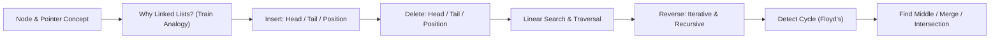

# Chapter 3: Singly Linked List

> **Previous:** [Chapter 2: Arrays](./02-arrays.md) | **Next:** [Doubly Linked List](./04-doubly-linked-list.md)

## Learning Objectives

- Define the singly linked list structure, node anatomy, and pointer mechanics.
- Implement insertion at head, tail, and arbitrary position with correct pointer rewiring.
- Implement deletion, traversal, linear search, and iterative/recursive reversal.
- Analyze time and space complexity of every operation with "why" explanation.
- Apply sentinel/dummy node technique to eliminate edge-case branches.
- Master Floyd's cycle detection, finding the middle, and merging sorted lists.
- Recognise real-world systems that rely on singly linked lists.

## Why Linked Lists Matter

Imagine a train. Each car carries cargo (data) and is coupled to the next car via a single coupler (pointer). The engine is the **head**. To add a new car at the front, you just unhook the coupler, attach the new car, and hook it back → **O(1)**. To reach the last car, the conductor must walk from the engine all the way to the end → **O(n)**.

An **array** is like a fixed parking lot: every slot has a numbered address you can jump to instantly (**O(1)** random access), but inserting a new car at the front means shuffling every other car down one spot (**O(n)**).

Linked lists trade random-access speed for **constant-time insertions and deletions at known positions** → a trade-off that makes them indispensable in memory allocators, hash-table collision chains, undo/redo stacks, and file-system indexing.

```
Train (Linked List) analogy:
   Engine → [Car A] → [Car B] → [Car C] → nullptr
   head      data|next  data|next  data|next
```

## Chapter at a Glance

| Topic | Key Insight | Practical Takeaway |
|-------|-------------|-------------------|
| Node Structure | Each node holds data + pointer to next | Use `struct Node` with `data` and `next` fields |
| Head Insertion | O(1) since no elements need shifting | Use `pushFront` for LIFO / stack behaviour |
| Tail Insertion | O(1) with tail pointer, O(n) without | Always maintain a tail pointer for efficiency |
| Iterative Reversal | Three pointers rewire links in one pass | O(n) time, O(1) space → no recursion overhead |
| Recursive Reversal | Implicit stack; elegant but risky | O(n) space due to call stack; avoid for long lists |
| Cycle Detection | Floyd Tortoise and Hare algorithm | Slow + fast pointer meet if cycle exists; O(n) time, O(1) space |
| Sentinel / Dummy Node | Placeholder node eliminates edge cases | Simplifies insertion/deletion code significantly |
| Find Middle | Slow + fast (fast moves 2×) | O(n) time, O(1) space; one-pass |

## Chapter Roadmap



## Theory


### Node Anatomy

A singly linked list node has exactly two fields:

```
┌──────────┬──────────┐
│   Data   │   Next   │
│  (value) │ (pointer)│
└──────────┴──────────┘
```

- **Data** → the actual value stored (int, char, object, etc.).
- **Next** → a reference/pointer to the next node in the sequence; `nullptr` (or `None`) marks the end.

The list itself is identified solely by a **head** pointer → the first node. If `head == nullptr`, the list is empty.

```
head → [10|●] → [20|●] → [30|●] → nullptr
```

### Why Not Always Use Arrays?

| Operation | Singly Linked List | Dynamic Array | Winner |
|-----------|-------------------|---------------|--------|
| Access by index | O(n) → must walk | O(1) → direct index | **Array** |
| Insert at head | O(1) → rewired pointer | O(n) → shift all | **Linked List** |
| Insert at tail | O(1) with tail ptr / O(n) without | O(1) amortised | **Linked List** (with tail ptr) |
| Delete at head | O(1) | O(n) | **Linked List** |
| Memory overhead | 1 pointer per element | 0 overhead (contiguous) | **Array** |
| Cache locality | Poor → nodes scattered | Excellent → contiguous block | **Array** |
| Dynamic size | Naturally grows | Needs resize + copy | **Linked List** |

---

## Operations → In Depth

Every operation below follows the same template: *Real-World Analogy → Algorithm Steps → Pseudocode → Dry Run (trace table) → C++ Implementation → Python Implementation → Java Implementation → Complexity (WHY) → Advantages & Disadvantages → Edge Cases.*

---

### 1. Insert at Head (pushFront)

**Real-World Analogy** → Adding a new car at the very front of a train. The engine's coupler is disconnected, the new car is placed in front, and its coupler is attached to the old first car.

**Algorithm Steps:**

1. Create a new node with the given value.
2. Point the new node's `next` to the current `head`.
3. Update `head` to point to the new node.
4. If the list was empty, also set `tail` to the new node.
5. Increment size.

**Pseudocode:**

```
function insertAtHead(value):
    newNode = new Node(value)
    newNode.next = head
    head = newNode
    if tail is null:
        tail = newNode
    size = size + 1
```

**Dry Run (trace table) → Insert 5 at head of [10, 20, 30]:**

| Step | Action | head ptr | newNode ptr | newNode.next | tail ptr | List State |
|------|--------|----------|-------------|--------------|----------|------------|
| 0 | Initial | →10 | null | → | →30 | 10→20→30 |
| 1 | Create node(5) | →10 | →5 | null | →30 | 10→20→30 |
| 2 | newNode.next = head | →10 | →5 | →10 | →30 | 5→10→20→30 |
| 3 | head = newNode | →5 | →5 | →10 | →30 | 5→10→20→30 |
| 4 | size++ | →5 | → | → | →30 | 5→10→20→30 |

**C++ Implementation:**

```cpp
void pushFront(const T& value) {
    Node<T>* newNode = new Node<T>(value);
    newNode->next = head;
    head = newNode;
    if (!tail) tail = head;
    ++count;
}
```

**Python Implementation:**

```python
def push_front(self, value):
    new_node = Node(value)
    new_node.next = self.head
    self.head = new_node
    if not self.tail:
        self.tail = new_node
    self.count += 1
```

**Java Implementation:**

```java
public void pushFront(T value) {
    Node<T> newNode = new Node<>(value);
    newNode.next = head;
    head = newNode;
    if (tail == null) tail = newNode;
    count++;
}
```

**Time & Space Complexity:**

| Metric | Value | Why? |
|--------|-------|------|
| Time | O(1) | Only pointer assignments → no traversal, no shifting. The number of operations is constant regardless of list size. |
| Space | O(1) | One new node is allocated; no auxiliary data structures or recursion. |

**Advantages & Disadvantages:**

| Advantages | Disadvantages |
|------------|--------------|
| Fastest possible insertion → constant time | Loses reference to old head if overwritten carelessly |
| No shifting of elements | Requires updating tail pointer when inserting into empty list |
| Simple implementation | Every insert allocates heap memory (potential fragmentation) |

**Edge Cases:**

| Case | Behaviour |
|------|-----------|
| **Empty list** (`head == null`) | New node becomes both head and tail. Works correctly because `if (!tail)` catches it. |
| **Single node list** | New node becomes head; old head (now second) is linked correctly. |
| **Very large list** | Performance unaffected → O(1) always. |

---

### 2. Insert at Tail (pushBack)

**Real-World Analogy** → Adding a new car at the end of a train. Using a tail pointer is like the conductor already standing at the last car; without one, the conductor must walk the entire train to find the end.

**Algorithm Steps (with tail pointer):**

1. Create a new node with the given value.
2. If the list is empty, set both `head` and `tail` to the new node.
3. Otherwise, set `tail.next` to the new node, then update `tail` to point to the new node.
4. Increment size.

**Pseudocode:**

```
function insertAtTail(value):
    newNode = new Node(value)
    if head is null:
        head = tail = newNode
    else:
        tail.next = newNode
        tail = newNode
    size = size + 1
```

**Dry Run (trace table) → Insert 40 at tail of [10, 20, 30]:**

| Step | Action | head ptr | tail ptr | tail.next | List State |
|------|--------|----------|----------|-----------|------------|
| 0 | Initial | →10 | →30 | null | 10→20→30→null |
| 1 | Create node(40) | →10 | →30 | null | 10→20→30→null |
| 2 | tail.next = newNode | →10 | →30 | →40 | 10→20→30→40 |
| 3 | tail = newNode | →10 | →40 | →40 | 10→20→30→40 |
| 4 | size++ | →10 | →40 | → | 10→20→30→40 |

**C++ Implementation:**

```cpp
void pushBack(const T& value) {
    Node<T>* newNode = new Node<T>(value);
    if (!head) {
        head = tail = newNode;
    } else {
        tail->next = newNode;
        tail = newNode;
    }
    ++count;
}
```

**Python Implementation:**

```python
def push_back(self, value):
    new_node = Node(value)
    if not self.head:
        self.head = self.tail = new_node
    else:
        self.tail.next = new_node
        self.tail = new_node
    self.count += 1
```

**Java Implementation:**

```java
public void pushBack(T value) {
    Node<T> newNode = new Node<>(value);
    if (head == null) {
        head = tail = newNode;
    } else {
        tail.next = newNode;
        tail = newNode;
    }
    count++;
}
```

**Time & Space Complexity:**

| Metric | Value | Why? |
|--------|-------|------|
| Time | O(1) with tail ptr; O(n) without | With tail: direct access to last node. Without tail: must traverse entire list (n steps) to find end. |
| Space | O(1) | One new node allocated. |

**Advantages & Disadvantages:**

| Advantages | Disadvantages |
|------------|--------------|
| O(1) if tail pointer is maintained (most practical implementations) | Without tail pointer, degrades to O(n) → a common pitfall |
| Natural for FIFO / queue behaviour (pushBack + popFront) | Tail pointer must be updated on every mutation (delete, insert) |
| Simple logic | Extra memory for the tail pointer variable |

**Edge Cases:**

| Case | Behaviour |
|------|-----------|
| **Empty list** | `head == null` branch sets both head and tail. |
| **Single node** | tail.next is null initially; set to newNode, tail = newNode. |
| **Insert after many pushFront calls** | Tail pointer still points to original last node; works correctly. |

**Without Tail Pointer (O(n) variant):**

```cpp
void pushBackNoTail(const T& value) {
    Node<T>* newNode = new Node<T>(value);
    if (!head) { head = newNode; return; }
    Node<T>* current = head;
    while (current->next) current = current->next;
    current->next = newNode;
}
```
**Warning:** Every call traverses the entire list → O(n).

---

### 3. Insert at Position (insertAt)

**Real-World Analogy** → Inserting a carriage at a specific position in a train. The conductor walks from the engine counting cars, then uncouples at the desired spot and inserts the new car.

**Algorithm Steps:**

1. If `index == 0`, delegate to `pushFront`.
2. If `index == count`, delegate to `pushBack`.
3. Create a new node.
4. Traverse to the node just before the insertion point (`index - 1`).
5. Rewire: `newNode.next = current.next; current.next = newNode`.
6. Increment size.

**Pseudocode:**

```
function insertAt(index, value):
    if index < 0 or index > size: return
    if index == 0: pushFront(value); return
    if index == size: pushBack(value); return

    newNode = new Node(value)
    current = head
    for i = 0 to index - 2:
        current = current.next
    newNode.next = current.next
    current.next = newNode
    size = size + 1
```

**Dry Run (trace table) → Insert 15 at position 2 in [10, 20, 30, 40]:**

Initial: 10→20→30→40→null (positions 0,1,2,3)

| Step | Action | current ptr | current.data | newNode.next | current.next | List State |
|------|--------|-------------|-------------|--------------|--------------|------------|
| 0 | Initial | →10 | 10 | null | →20 | 10→20→30→40→null |
| 1 | current = head; i=0→1 | →10 | 10 | null | →20 | 10→20→30→40→null |
| 2 | current = current.next (i=0 to index-2=0, once) | →20 | 20 | null | →30 | 10→20→30→40→null |
| 3 | Create node(15) | →20 | 20 | →15 | →30 | 10→20→30→40→null |
| 4 | newNode.next = current.next | →20 | 20 | →30 | →30 | 10→20→15→30→40 |
| 5 | current.next = newNode | →20 | 20 | →30 | →15 | 10→20→15→30→40 |
| 6 | size++ (now 5) | → | → | → | → | 10→20→15→30→40→null |

**C++ Implementation:**

```cpp
void insertAt(int index, const T& value) {
    if (index < 0 || index > count) return;
    if (index == 0) { pushFront(value); return; }
    if (index == count) { pushBack(value); return; }

    Node<T>* newNode = new Node<T>(value);
    Node<T>* current = head;
    for (int i = 0; i < index - 1; ++i)
        current = current->next;
    newNode->next = current->next;
    current->next = newNode;
    ++count;
}
```

**Python Implementation:**

```python
def insert_at(self, index, value):
    if index < 0 or index > self.count:
        return
    if index == 0:
        self.push_front(value)
        return
    if index == self.count:
        self.push_back(value)
        return

    new_node = Node(value)
    current = self.head
    for _ in range(index - 1):
        current = current.next
    new_node.next = current.next
    current.next = new_node
    self.count += 1
```

**Java Implementation:**

```java
public void insertAt(int index, T value) {
    if (index < 0 || index > count) return;
    if (index == 0) { pushFront(value); return; }
    if (index == count) { pushBack(value); return; }

    Node<T> newNode = new Node<>(value);
    Node<T> current = head;
    for (int i = 0; i < index - 1; i++)
        current = current.next;
    newNode.next = current.next;
    current.next = newNode;
    count++;
}
```

**Time & Space Complexity:**

| Metric | Value | Why? |
|--------|-------|------|
| Time | O(n) | Must traverse from head to `index-1` → worst case is tail insertion (walk n nodes). |
| Space | O(1) | Single node allocated, no recursion. |

**Advantages & Disadvantages:**

| Advantages | Disadvantages |
|------------|--------------|
| No shifting of elements (unlike array O(n) shift) | Must still traverse to find position → O(n) |
| Uniform approach → works at any valid index | Index bounds must be validated |
| Works with both head and tail delegates | Double pointer rewiring can be confusing for beginners |

**Edge Cases:**

| Case | Behaviour |
|------|-----------|
| **index == 0** | Delegates to `pushFront` → O(1). |
| **index == count** | Delegates to `pushBack` → O(1) with tail ptr. |
| **Empty list, index 0** | Delegated to `pushFront`, which handles empty list. |
| **index &lt; 0 or index &gt; count** | Returns immediately → no operation. |
| **Single node, index 1** | Delegated to `pushBack`; tail pointer updated. |

---

### 4. Delete from Head (popFront)

**Real-World Analogy** → Unhooking and removing the first car of a train. The engine (head) is disconnected from the first car, and the next car becomes the new first car.

**Algorithm Steps:**

1. If list is empty, return.
2. Save reference to the current head node.
3. Move the head pointer to `head.next`.
4. If head becomes null (list now empty), set tail to null too.
5. Delete (free) the old head node.
6. Decrement size.

**Pseudocode:**

```
function deleteHead():
    if head is null: return
    temp = head
    head = head.next
    if head is null:
        tail = null
    delete temp
    size = size - 1
```

**Dry Run (trace table) → Delete head from [10, 20, 30]:**

| Step | Action | head ptr | temp ptr | head after | tail ptr | List State |
|------|--------|----------|----------|------------|----------|------------|
| 0 | Initial | →10 | null | →10 | →30 | 10→20→30 |
| 1 | temp = head | →10 | →10 | →10 | →30 | 10→20→30 |
| 2 | head = head.next | →20 | →10 | →20 | →30 | 10→20→30 |
| 3 | delete temp | →20 | (freed) | →20 | →30 | 20→30 |
| 4 | count-- (now 2) | →20 | → | →20 | →30 | 20→30 |

**C++ Implementation:**

```cpp
void popFront() {
    if (!head) return;
    Node<T>* temp = head;
    head = head->next;
    if (!head) tail = nullptr;
    delete temp;
    --count;
}
```

**Python Implementation:**

```python
def pop_front(self):
    if not self.head:
        return
    self.head = self.head.next
    if not self.head:
        self.tail = None
    self.count -= 1
```

**Note:** Python's garbage collector handles deallocation automatically. In CPython, the old head node becomes unreachable and is collected. Manual deletion is not required.

**Java Implementation:**

```java
public void popFront() {
    if (head == null) return;
    head = head.next;
    if (head == null) tail = null;
    count--;
}
```

**Note:** Java's GC handles unreferenced objects automatically.

**Time & Space Complexity:**

| Metric | Value | Why? |
|--------|-------|------|
| Time | O(1) | Only pointer reassignment → no traversal. The head is directly accessible. |
| Space | O(1) | No new allocations; only a temporary pointer. |

**Advantages & Disadvantages:**

| Advantages | Disadvantages |
|------------|--------------|
| Fastest deletion → O(1) | Loses reference to original head (must save before moving) |
| Enables FIFO queue (popFront + pushBack) | Tail pointer must be checked (list may become empty) |
| Simple two-line logic | Memory leak if old node not freed (C++) |

**Edge Cases:**

| Case | Behaviour |
|------|-----------|
| **Empty list** | Returns immediately → no crash. |
| **Single node** | head becomes null; tail catch `if (!head)` sets tail = null. List becomes empty. |
| **Two+ nodes** | Standard path; tail unaffected. |

---

### 5. Delete at Position / Delete by Value

**Real-World Analogy** → Removing a specific car from the middle of a train. The conductor walks to the car just before the target, uncouples it from the target, and couples it directly to the car after the target, bypassing the removed car.

**Algorithm Steps (by position):**

1. If index is out of bounds or list empty, return.
2. If index == 0, delegate to `popFront`.
3. Traverse to node at `index - 1` (the node before the target).
4. Save reference to the target node (`current.next`).
5. Rewire: `current.next = target.next`.
6. If `target == tail`, update tail to current.
7. Delete the target node.
8. Decrement size.

**Pseudocode:**

```
function deleteAt(index):
    if index < 0 or index >= size or head is null: return
    if index == 0: deleteHead(); return

    current = head
    for i = 0 to index - 2:
        current = current.next
    target = current.next
    current.next = target.next
    if target == tail:
        tail = current
    delete target
    size = size - 1
```

**Dry Run (trace table) → Delete at position 2 from [10, 20, 30, 40]:**

| Step | Action | current ptr | current.data | target ptr | current.next | List State |
|------|--------|-------------|-------------|------------|--------------|------------|
| 0 | Initial | →10 | 10 | null | →20 | 10→20→30→40 |
| 1 | Traverse i=0 to 0 (once), current→20 | →20 | 20 | null | →30 | 10→20→30→40 |
| 2 | target = current.next | →20 | 20 | →30 | →30 | 10→20→30→40 |
| 3 | current.next = target.next | →20 | 20 | →30 | →40 | 10→20→40→null |
| 4 | target != tail (tail→40) | →20 | 20 | →30 | →40 | 10→20→40→null |
| 5 | delete target | →20 | 20 | (freed)| →40 | 10→20→40→null |
| 6 | count-- (now 3) | → | → | → | → | 10→20→40→null |

**C++ Implementation:**

```cpp
void removeAt(int index) {
    if (index < 0 || index >= count || !head) return;
    if (index == 0) { popFront(); return; }

    Node<T>* current = head;
    for (int i = 0; i < index - 1; ++i)
        current = current->next;
    Node<T>* target = current->next;
    current->next = target->next;
    if (!current->next) tail = current;
    delete target;
    --count;
}

// Delete by value (first occurrence):
bool removeValue(const T& value) {
    if (!head) return false;
    if (head->data == value) { popFront(); return true; }
    Node<T>* current = head;
    while (current->next && current->next->data != value)
        current = current->next;
    if (!current->next) return false;
    Node<T>* target = current->next;
    current->next = target->next;
    if (!current->next) tail = current;
    delete target;
    --count;
    return true;
}
```

**Python Implementation:**

```python
def remove_at(self, index):
    if index < 0 or index >= self.count or not self.head:
        return
    if index == 0:
        self.pop_front()
        return

    current = self.head
    for _ in range(index - 1):
        current = current.next
    target = current.next
    current.next = target.next
    if not current.next:
        self.tail = current
    self.count -= 1

def remove_value(self, value):
    if not self.head:
        return False
    if self.head.data == value:
        self.pop_front()
        return True
    current = self.head
    while current.next and current.next.data != value:
        current = current.next
    if not current.next:
        return False
    target = current.next
    current.next = target.next
    if not current.next:
        self.tail = current
    self.count -= 1
    return True
```

**Java Implementation:**

```java
public void removeAt(int index) {
    if (index < 0 || index >= count || head == null) return;
    if (index == 0) { popFront(); return; }

    Node<T> current = head;
    for (int i = 0; i < index - 1; i++)
        current = current.next;
    Node<T> target = current.next;
    current.next = target.next;
    if (current.next == null) tail = current;
    count--;
}

public boolean removeValue(T value) {
    if (head == null) return false;
    if (head.data.equals(value)) { popFront(); return true; }
    Node<T> current = head;
    while (current.next != null && !current.next.data.equals(value))
        current = current.next;
    if (current.next == null) return false;
    Node<T> target = current.next;
    current.next = target.next;
    if (current.next == null) tail = current;
    count--;
    return true;
}
```

**Time & Space Complexity:**

| Metric | Value | Why? |
|--------|-------|------|
| Time (removeAt) | O(n) | Must traverse to `index-1` → worst case is deleting the last node. Each step is a pointer dereference. |
| Time (removeValue) | O(n) | Linear scan to find the value; worst case is value at the end (or absent). |
| Space | O(1) | One temporary pointer; no recursion or auxiliary structures. |

**Advantages & Disadvantages:**

| Advantages | Disadvantages |
|------------|--------------|
| No shifting (unlike array O(n) shift) | Must traverse to deletion point |
| Tail pointer simplified with `if (!current.next) tail = current` | Extra complexity: need node *before* target, not target itself |
| Can delete by value or index | Two-pass for `removeValue`: one to find, one to delete (combined in single traversal above) |

**Edge Cases:**

| Case | Behaviour |
|------|-----------|
| **Empty list** | Returns immediately. |
| **index == 0 (head)** | Delegates to `popFront`. |
| **Remove last node (tail)** | `current.next` becomes null → `if (!current.next)` catches and updates tail. |
| **Single node, remove index 0** | Delegates to `popFront` which sets head=tail=null. |
| **Value not found** | `removeValue` returns false; list unchanged. |

---

### 6. Search (Linear Search)

**Real-World Analogy** → A train conductor walking from the engine to the caboose, peeking into each car, looking for a specific passenger.

**Algorithm Steps:**

1. Start at `head`.
2. Walk through each node comparing `current.data` with the target.
3. If match found, return the index (or the node pointer).
4. If the end is reached (null), return -1 (or null) → value not found.

**Pseudocode:**

```
function search(value):
    current = head
    index = 0
    while current is not null:
        if current.data == value:
            return index
        current = current.next
        index = index + 1
    return -1
```

**Dry Run (trace table) → Search for 30 in [10, 20, 30, 40]:**

| Iteration | current ptr | current.data | target | Match? | index | Next ptr |
|-----------|-------------|-------------|--------|--------|-------|----------|
| 0 (init) | →10 | 10 | 30 | No | 0 | →20 |
| 1 | →20 | 20 | 30 | No | 1 | →30 |
| 2 | →30 | 30 | 30 | **Yes** | 2 | Return 2 |

**C++ Implementation:**

```cpp
int search(const T& value) const {
    Node<T>* current = head;
    int idx = 0;
    while (current) {
        if (current->data == value) return idx;
        current = current->next;
        ++idx;
    }
    return -1;
}

// Return node pointer variant:
Node<T>* find(const T& value) const {
    Node<T>* current = head;
    while (current && current->data != value)
        current = current->next;
    return current;  // nullptr if not found
}
```

**Python Implementation:**

```python
def search(self, value):
    current = self.head
    idx = 0
    while current:
        if current.data == value:
            return idx
        current = current.next
        idx += 1
    return -1

def find(self, value):
    current = self.head
    while current and current.data != value:
        current = current.next
    return current  # None if not found
```

**Java Implementation:**

```java
public int search(T value) {
    Node<T> current = head;
    int idx = 0;
    while (current != null) {
        if (current.data.equals(value)) return idx;
        current = current.next;
        idx++;
    }
    return -1;
}

public Node<T> find(T value) {
    Node<T> current = head;
    while (current != null && !current.data.equals(value))
        current = current.next;
    return current;
}
```

**Time & Space Complexity:**

| Metric | Value | Why? |
|--------|-------|------|
| Time (worst) | O(n) | Must scan every node when value is at the end or not present. Each comparison is O(1), but there are n nodes. |
| Time (best) | O(1) | Value is at head → match on first comparison. |
| Time (average) | O(n/2) = O(n) | Uniform distribution: on average, check n/2 nodes. |
| Space | O(1) | Single current pointer → no recursion, no stack, no hash table. |

**Advantages & Disadvantages:**

| Advantages | Disadvantages |
|------------|--------------|
| Simple, intuitive logic | No binary search possible (no random access) |
| No extra space | O(n) for every lookup → arrays share this cost |
| Returns position or pointer | Value comparison may require `equals()` in Java (object semantics) |

**Edge Cases:**

| Case | Behaviour |
|------|-----------|
| **Empty list** | Loop never enters; returns -1. |
| **Value at head** | Returns 0 immediately → O(1). |
| **Value at tail** | Traverses entire list → O(n). |
| **Value not present** | Traverses entire list, returns -1. |
| **Duplicate values** | Returns index of first occurrence only. |

---

### 7. Reverse (Iterative)

**Real-World Analogy** → Flipping the direction of every coupler on a train. Each car that was pointing to the next car now points to the previous one. The engine ends up at the back; the caboose becomes the new engine.

**Algorithm Steps (3-pointer technique):**

1. Initialize three pointers: `prev = null`, `current = head`, `next = null`.
2. Set `tail = head` (the current head will become the tail after reversal).
3. While `current` is not null:
   a. Save `next = current.next` (preserve the forward reference before breaking it).
   b. Reverse the link: `current.next = prev`.
   c. Advance `prev` to `current`.
   d. Advance `current` to `next`.
4. Set `head = prev` (the last non-null node becomes the new head).

**Pseudocode:**

```
function reverse():
    prev = null
    current = head
    tail = head
    while current is not null:
        next = current.next
        current.next = prev
        prev = current
        current = next
    head = prev
```

**Dry Run (trace table) → Reverse [10, 20, 30]:**

| Step | prev ptr | current ptr | next ptr | current.next (after) | List State (logical) |
|------|----------|-------------|----------|---------------------|----------------------|
| 0 | null | →10 | null | → | 10→20→30→null |
| 1 | null | →10 | →20 | null | 10/→null; 20→30→null |
| 2 | →10 | →20 | →30 | →10 | 10→null; 20→10; 30→null |
| 3 | →20 | →30 | null | →20 | 10→null; 20→10; 30→20 |
| 4 | →30 | null | → | → | **30→20→10→null** |
| 5 head=prev(=→30) | → | → | → | → | **head=30** |

**C++ Implementation:**

```cpp
void reverse() {
    Node<T>* prev = nullptr;
    Node<T>* current = head;
    tail = head;
    while (current) {
        Node<T>* next = current->next;
        current->next = prev;
        prev = current;
        current = next;
    }
    head = prev;
}
```

**Python Implementation:**

```python
def reverse(self):
    prev = None
    current = self.head
    self.tail = self.head
    while current:
        next_temp = current.next
        current.next = prev
        prev = current
        current = next_temp
    self.head = prev
```

**Java Implementation:**

```java
public void reverse() {
    Node<T> prev = null;
    Node<T> current = head;
    tail = head;
    while (current != null) {
        Node<T> next = current.next;
        current.next = prev;
        prev = current;
        current = next;
    }
    head = prev;
}
```

**Time & Space Complexity:**

| Metric | Value | Why? |
|--------|-------|------|
| Time | O(n) | Exactly one pass through all n nodes. Each node's pointer is rewired exactly once. |
| Space | O(1) | Three pointers (prev, current, next) → no recursion, no call stack, no auxiliary array. This is the optimal space. |

**Advantages & Disadvantages:**

| Advantages | Disadvantages |
|------------|--------------|
| O(n) time, O(1) space → optimal | Modifies the list in-place (destructive to original order) |
| No recursion → no stack overflow risk | Cannot reverse a portion only without extra logic |
| Simple, stable three-pointer loop | Must update `tail` separately |
| Easily extended to reverse in groups | → |

**Edge Cases:**

| Case | Behaviour |
|------|-----------|
| **Empty list** | `current = null` initially; loop doesn't run; `head = prev = null`. |
| **Single node** | `next = null`, `current.next = null`; prev becomes the node; head points to same node. List unchanged (reversal of one is identity). |
| **Two nodes** | Single iteration: A→B becomes B→A. |
| **List with cycle** | **Danger:** Loop never terminates because `next` never becomes null. Always check for cycles before reversing. |

**Recursive Reverse (for reference):**

```cpp
// Elegant but O(n) space due to call stack
Node<T>* reverseRecursive(Node<T>* node) {
    if (!node || !node->next) return node;
    Node<T>* rest = reverseRecursive(node->next);
    node->next->next = node;  // reverse the link
    node->next = nullptr;
    return rest;
}
// Usage: head = reverseRecursive(head);
```

**⚠️ Warning:** For a list of 100,000 nodes, the recursive version uses ~100,000 stack frames (~8 MB). The iterative version uses exactly 3 pointers. Prefer iterative in production.

---

### 8. Detect Cycle (Floyd's Tortoise & Hare)

**Real-World Analogy** → Two runners on a circular track. The fast runner (hare) runs twice as fast as the slow runner (tortoise). If the track is a straight line, the hare finishes first and stops. If the track has a loop, the hare will eventually lap the tortoise → they will meet.

**Algorithm Steps:**

1. Initialize `slow = head`, `fast = head`.
2. While `fast` and `fast.next` are not null:
   a. Move `slow` one step: `slow = slow.next`.
   b. Move `fast` two steps: `fast = fast.next.next`.
   c. If `slow == fast`, a cycle exists → return true.
3. If loop exits (fast reached null), no cycle → return false.

**Pseudocode:**

```
function hasCycle():
    if head is null: return false
    slow = head
    fast = head
    while fast and fast.next:
        slow = slow.next
        fast = fast.next.next
        if slow == fast:
            return true
    return false
```

**Dry Run (trace table) → Cycle at node(30) in [10→20→30→40→30 (cycle)]:**

| Step | slow ptr | fast ptr | Condition | Notes |
|------|----------|----------|-----------|-------|
| 0 | →10 | →10 | → | Initialise both at head |
| 1 | →20 | →30 | slow≠fast | fast moves 2× |
| 2 | →30 | →50 (→30) | slow≠fast | fast wraps around |
| 3 | →40 | →40 | **slow==fast** | **Cycle detected!** |

**C++ Implementation:**

```cpp
bool hasCycle() const {
    if (!head) return false;
    Node<T>* slow = head;
    Node<T>* fast = head;
    while (fast && fast->next) {
        slow = slow->next;
        fast = fast->next->next;
        if (slow == fast) return true;
    }
    return false;
}

// Find the start of the cycle (Floyd's full algorithm):
Node<T>* detectCycleStart() const {
    if (!head) return nullptr;
    Node<T>* slow = head;
    Node<T>* fast = head;
    bool hasCycle = false;
    while (fast && fast->next) {
        slow = slow->next;
        fast = fast->next->next;
        if (slow == fast) { hasCycle = true; break; }
    }
    if (!hasCycle) return nullptr;
    slow = head;
    while (slow != fast) {
        slow = slow->next;
        fast = fast->next;
    }
    return slow;  // start of cycle
}
```

**Python Implementation:**

```python
def has_cycle(self):
    if not self.head:
        return False
    slow = self.head
    fast = self.head
    while fast and fast.next:
        slow = slow.next
        fast = fast.next.next
        if slow is fast:
            return True
    return False

def detect_cycle_start(self):
    if not self.head:
        return None
    slow = fast = self.head
    cycle_found = False
    while fast and fast.next:
        slow = slow.next
        fast = fast.next.next
        if slow is fast:
            cycle_found = True
            break
    if not cycle_found:
        return None
    slow = self.head
    while slow is not fast:
        slow = slow.next
        fast = fast.next
    return slow  # start of cycle
```

**Java Implementation:**

```java
public boolean hasCycle() {
    if (head == null) return false;
    Node<T> slow = head;
    Node<T> fast = head;
    while (fast != null && fast.next != null) {
        slow = slow.next;
        fast = fast.next.next;
        if (slow == fast) return true;
    }
    return false;
}

public Node<T> detectCycleStart() {
    if (head == null) return null;
    Node<T> slow = head, fast = head;
    boolean hasCycle = false;
    while (fast != null && fast.next != null) {
        slow = slow.next;
        fast = fast.next.next;
        if (slow == fast) { hasCycle = true; break; }
    }
    if (!hasCycle) return null;
    slow = head;
    while (slow != fast) {
        slow = slow.next;
        fast = fast.next;
    }
    return slow;
}
```

**Time & Space Complexity:**

| Metric | Value | Why? |
|--------|-------|------|
| Time | O(n) | In the worst case, fast traverses the entire list (and possibly the cycle). The meeting occurs within O(n) steps. Floyd proved that if a cycle exists, slow and fast meet in at most the length of the list. |
| Space | O(1) | Only two pointer variables → no hash set, no marking, no recursion. This is the key advantage over hash-based detection (which is O(n) space). |

**Why It Works (mathematical intuition):**
When slow enters the cycle, fast is already inside it. The relative speed is 1 (fast gains 1 node per step), so fast will catch slow within the cycle length.

**Advantages & Disadvantages:**

| Advantages | Disadvantages |
|------------|--------------|
| O(1) space → no hash table needed | Modifies nothing, but cannot detect *which* node is the problem without extra step |
| Works on read-only lists | Does not work on lists with partial corruption (non-circular broken links) |
| Simple, well-understood, interview favourite | Cannot detect cycle length without second phase |

**Edge Cases:**

| Case | Behaviour |
|------|-----------|
| **Empty list** | Returns false immediately. |
| **Single node, no cycle** | `fast.next` is null; loop condition fails; returns false. |
| **Single node pointing to itself** | `fast == fast.next` (after one step); slow == fast; returns true. |
| **Full cycle (last→head)** | Detected correctly → both eventually meet. |
| **No cycle, large list** | Fast reaches null; returns false. **Crucially, fast must check both `fast` and `fast.next` to avoid null pointer dereference.** |

---

### 9. Find Middle (Slow & Fast Pointer)

**Real-World Analogy** → Two people walking the train from the engine. One walks one car per minute, the other walks two cars per minute. When the fast walker reaches the end, the slow walker is exactly at the middle.

**Algorithm Steps:**

1. Initialize `slow = head`, `fast = head`.
2. While `fast` and `fast.next` are not null:
   a. Move `slow` one step.
   b. Move `fast` two steps.
3. Return `slow` → it points to the middle node.

**Note:** For even-length lists (e.g., 4 nodes), this returns the second middle node (node at index 2). To get the first middle, stop when `fast.next` is null instead.

**Pseudocode:**

```
function findMiddle():
    if head is null: return null
    slow = head
    fast = head
    while fast and fast.next:
        slow = slow.next
        fast = fast.next.next
    return slow
```

**Dry Run (trace table) → Find middle in [10, 20, 30, 40, 50]:**

| Step | slow ptr | fast ptr | Condition |
|------|----------|----------|-----------|
| 0 | →10 | →10 | → |
| 1 | →20 | →30 | fast≠null, fast.next≠null |
| 2 | →30 | →50 (end) | fast.next=null → stop |
| Result: **slow→30 (middle)** |

Even-length example [10, 20, 30, 40]:

| Step | slow ptr | fast ptr |
|------|----------|----------|
| 0 | →10 | →10 |
| 1 | →20 | →30 |
| 2 | →30 | null (fast = 40.next) → stop |
| Result: **slow→30** (second middle) |

**C++ Implementation:**

```cpp
// Returns second middle for even length; first middle for odd.
Node<T>* findMiddle() const {
    if (!head) return nullptr;
    Node<T>* slow = head;
    Node<T>* fast = head;
    while (fast && fast->next) {
        slow = slow->next;
        fast = fast->next->next;
    }
    return slow;
}

// Returns first middle for even length:
Node<T>* findMiddleFirst() const {
    if (!head) return nullptr;
    Node<T>* slow = head;
    Node<T>* fast = head;
    while (fast->next && fast->next->next) {
        slow = slow->next;
        fast = fast->next->next;
    }
    return slow;
}
```

**Python Implementation:**

```python
def find_middle(self):
    if not self.head:
        return None
    slow = self.head
    fast = self.head
    while fast and fast.next:
        slow = slow.next
        fast = fast.next.next
    return slow
```

**Java Implementation:**

```java
public Node<T> findMiddle() {
    if (head == null) return null;
    Node<T> slow = head;
    Node<T> fast = head;
    while (fast != null && fast.next != null) {
        slow = slow.next;
        fast = fast.next.next;
    }
    return slow;
}
```

**Time & Space Complexity:**

| Metric | Value | Why? |
|--------|-------|------|
| Time | O(n) | Fast pointer traverses the entire list once (n steps; slow does n/2). |
| Space | O(1) | Two pointers only. Alternative: count then traverse = O(n) time + O(1) space too, but this does it in one pass. |

**Advantages & Disadvantages:**

| Advantages | Disadvantages |
|------------|--------------|
| Single pass → efficient | Even vs odd middle ambiguity can cause bugs |
| O(1) space | Not applicable for circular lists without cycle check |
| Foundation for palindrome check, binary search on LL | Slightly harder to reason about than two-pass |

**Edge Cases:**

| Case | Behaviour |
|------|-----------|
| **Empty list** | Returns null. |
| **Single node** | Loop never enters; returns the only node. |
| **Two nodes** | `slow → node2` (second node) → for `findMiddleFirst`, returns node1. |
| **List with cycle** | **Infinite loop!** Fast never reaches null. Always check for cycles first. |

---

### 10. Merge Two Sorted Lists

**Real-World Analogy** → Two sorted train lines merging into a single track. At each junction, the dispatcher picks the smaller front car from either line and moves it onto the merged track.

**Algorithm Steps (iterative with dummy node):**

1. Create a dummy node (sentinel) to serve as the starting point for the merged list.
2. Maintain a `tail` pointer starting at dummy.
3. While both lists are non-empty:
   a. Compare `l1.data` and `l2.data`.
   b. Attach the smaller node to `tail.next`.
   c. Advance the chosen list's pointer.
   d. Advance tail.
4. Attach the remaining nodes of the non-empty list.
5. Return `dummy.next` (the actual head of the merged list).

**Pseudocode:**

```
function mergeSorted(l1, l2):
    dummy = new Node(null)
    tail = dummy
    while l1 and l2:
        if l1.data <= l2.data:
            tail.next = l1
            l1 = l1.next
        else:
            tail.next = l2
            l2 = l2.next
        tail = tail.next
    tail.next = l1 if l1 else l2
    return dummy.next
```

**Dry Run (trace table) → Merge [10, 30, 50] and [20, 40, 60]:**

| Step | l1 ptr | l2 ptr | tail ptr | tail.next | Merged List So Far |
|------|--------|--------|----------|-----------|-------------------|
| 0 | →10 | →20 | dummy | null | (empty) |
| 1 | →30 | →20 | →10 | →10 | 10 |
| 2 | →30 | →40 | →20 | →20 | 10→20 |
| 3 | →50 | →40 | →30 | →30 | 10→20→30 |
| 4 | →50 | →60 | →40 | →40 | 10→20→30→40 |
| 5 | null | →60 | →50 | →50 | 10→20→30→40→50 |
| 6 | null | →60 | →60 | →60 | 10→20→30→40→50→60 |

**C++ Implementation:**

```cpp
// Static method merging two sorted lists:
static Node<T>* mergeSorted(Node<T>* l1, Node<T>* l2) {
    Node<T> dummy;
    Node<T>* tail = &dummy;
    while (l1 && l2) {
        if (l1->data <= l2->data) {
            tail->next = l1;
            l1 = l1->next;
        } else {
            tail->next = l2;
            l2 = l2->next;
        }
        tail = tail->next;
    }
    tail->next = l1 ? l1 : l2;
    return dummy.next;
}

// Recursive (elegant but O(n) space):
static Node<T>* mergeSortedRecursive(Node<T>* l1, Node<T>* l2) {
    if (!l1) return l2;
    if (!l2) return l1;
    if (l1->data <= l2->data) {
        l1->next = mergeSortedRecursive(l1->next, l2);
        return l1;
    } else {
        l2->next = mergeSortedRecursive(l1, l2->next);
        return l2;
    }
}
```

**Python Implementation:**

```python
@staticmethod
def merge_sorted(l1, l2):
    dummy = Node(None)
    tail = dummy
    while l1 and l2:
        if l1.data <= l2.data:
            tail.next = l1
            l1 = l1.next
        else:
            tail.next = l2
            l2 = l2.next
        tail = tail.next
    tail.next = l1 or l2
    return dummy.next
```

**Java Implementation:**

```java
public static <T extends Comparable<T>> Node<T> mergeSorted(Node<T> l1, Node<T> l2) {
    Node<T> dummy = new Node<>(null);
    Node<T> tail = dummy;
    while (l1 != null && l2 != null) {
        if (l1.data.compareTo(l2.data) <= 0) {
            tail.next = l1;
            l1 = l1.next;
        } else {
            tail.next = l2;
            l2 = l2.next;
        }
        tail = tail.next;
    }
    tail.next = (l1 != null) ? l1 : l2;
    return dummy.next;
}
```

**Time & Space Complexity:**

| Metric | Value | Why? |
|--------|-------|------|
| Time | O(n + m) | Through each node of both lists exactly once. |
| Space (iterative) | O(1) | Only the dummy and tail pointers → no new nodes allocated, just pointer rewiring. |
| Space (recursive) | O(n + m) | Call stack depth equals total merged nodes. |

**Advantages & Disadvantages:**

| Advantages | Disadvantages |
|------------|--------------|
| In-place → no new node allocations | Destructive: original lists are consumed/modified |
| O(1) space (iterative) | Dummy node requires cleanup |
| Linear time → optimal | Only works on pre-sorted lists |

**Edge Cases:**

| Case | Behaviour |
|------|-----------|
| **Both empty** | `l1 && l2` fails; `tail.next = null` (since both null); returns null. |
| **One empty** | `while` loop skipped; `tail.next = non-empty list`; returns that list's head. |
| **Duplicate values** | `<=` ensures stability → left list's duplicate comes first. |
| **Single node each** | Single comparison, then one tail attach. |

---

### 11. Find Intersection of Two Lists

**Real-World Analogy** → Two train lines that merge into a single track at some point (e.g., two branches of a metro system converging). Before the merge, the lines are completely separate; after the merge, they share the same cars.

**Algorithm Steps (two-pointer technique):**

1. Compute length of both lists.
2. Advance the pointer of the longer list by the difference in lengths.
3. Now move both pointers in tandem. The node where they meet is the intersection.
4. If they reach null without meeting, there is no intersection.

**Pseudocode:**

```
function getIntersection(l1, l2):
    len1 = length(l1), len2 = length(l2)
    diff = |len1 - len2|
    
    ptr1 = l1, ptr2 = l2
    if len1 > len2:
        advance ptr1 by diff
    else:
        advance ptr2 by diff
    
    while ptr1 and ptr2:
        if ptr1 == ptr2: return ptr1
        ptr1 = ptr1.next
        ptr2 = ptr2.next
    return null
```

**C++ Implementation:**

```cpp
static Node<T>* getIntersectionNode(Node<T>* l1, Node<T>* l2) {
    int len1 = 0, len2 = 0;
    for (Node<T>* c = l1; c; c = c->next) ++len1;
    for (Node<T>* c = l2; c; c = c->next) ++len2;

    Node<T>* ptr1 = l1;
    Node<T>* ptr2 = l2;

    int diff = std::abs(len1 - len2);
    if (len1 > len2)
        for (int i = 0; i < diff; ++i) ptr1 = ptr1->next;
    else
        for (int i = 0; i < diff; ++i) ptr2 = ptr2->next;

    while (ptr1 && ptr2) {
        if (ptr1 == ptr2) return ptr1;
        ptr1 = ptr1->next;
        ptr2 = ptr2->next;
    }
    return nullptr;
}
```

**Python Implementation:**

```python
@staticmethod
def get_intersection(l1, l2):
    def length(head):
        count = 0
        while head:
            head = head.next
            count += 1
        return count

    len1, len2 = length(l1), length(l2)
    ptr1, ptr2 = l1, l2

    diff = abs(len1 - len2)
    if len1 > len2:
        for _ in range(diff):
            ptr1 = ptr1.next
    else:
        for _ in range(diff):
            ptr2 = ptr2.next

    while ptr1 and ptr2:
        if ptr1 is ptr2:
            return ptr1
        ptr1 = ptr1.next
        ptr2 = ptr2.next
    return None
```

**Java Implementation:**

```java
public static <T> Node<T> getIntersectionNode(Node<T> l1, Node<T> l2) {
    int len1 = 0, len2 = 0;
    for (Node<T> c = l1; c != null; c = c.next) len1++;
    for (Node<T> c = l2; c != null; c = c.next) len2++;

    Node<T> ptr1 = l1, ptr2 = l2;
    int diff = Math.abs(len1 - len2);
    if (len1 > len2)
        for (int i = 0; i < diff; i++) ptr1 = ptr1.next;
    else
        for (int i = 0; i < diff; i++) ptr2 = ptr2.next;

    while (ptr1 != null && ptr2 != null) {
        if (ptr1 == ptr2) return ptr1;
        ptr1 = ptr1.next;
        ptr2 = ptr2.next;
    }
    return null;
}
```

**Time & Space Complexity:**

| Metric | Value | Why? |
|--------|-------|------|
| Time | O(n + m) | Two passes: one for lengths (O(n+m)), one for alignment + search (O(n+m)). Total O(n+m). |
| Space | O(1) | Only pointers and integer lengths. The hash-set alternative uses O(n) space. |

**Advantages & Disadvantages:**

| Advantages | Disadvantages |
|------------|--------------|
| O(1) space | Two-pass → reads each list twice |
| Works on read-only lists | Requires lists to be acyclic (cycles break length logic) |
| Pointer comparison is O(1) | Only finds first intersection, not all shared nodes |

**Edge Cases:**

| Case | Behaviour |
|------|-----------|
| **No intersection** | Pointers reach null simultaneously (if equal length) or after diff; returns null. |
| **One list empty** | Returns null → cannot intersect. |
| **Identical lists** | Intersection is the head of both. `ptr1 == ptr2` at first comparison. |
| **Intersection at head of both** | Caught immediately. |

---

## Singly vs Doubly vs Circular

| Feature | Singly Linked List | Doubly Linked List | Circular Linked List |
|---------|-------------------|-------------------|---------------------|
| **Pointer per node** | 1 (next) | 2 (prev + next) | 1 (singly) or 2 (doubly) |
| **Traversal direction** | Forward only | Both directions | Forward (infinite loop) |
| **Head insert/delete** | O(1) | O(1) | O(1) |
| **Tail insert/delete** | O(1) with tail ptr or O(n) | O(1) (prev pointer) | O(1) with tail ptr |
| **Delete by node ref** | O(n) (need prev) | O(1) (prev pointer) | O(n) or O(1) if doubly circular |
| **Memory overhead** | Low (1 pointer) | Moderate (2 pointers) | Same as singly or doubly |
| **Used for** | Stack, queue, hash chains, free lists | LRU cache, undo/redo, navigation | Round-robin, media playlists, queue |
| **Sentinel benefit** | Simplifies head/tail cases | Simplifies all insertion/deletion | Simplifies circular boundary |
| **Cycle detection** | Floyd's works | Floyd's works | Always has a cycle (intentional) |

**When to Choose:**

| Use Case | Best Choice | Why? |
|----------|-------------|------|
| Stack or simple queue | Singly | Lower memory, simpler code |
| LRU cache | Doubly | O(1) delete from any position |
| Round-robin scheduler | Circular | No null tail → wraps naturally |
| Hash-table chaining | Singly | Head insertion is O(1) |
| Text editor undo/redo | Doubly | Need bidirectional navigation |
| Browser back/forward | Doubly | Natural stack of visited pages |

---

## Interview Corner

The following problems are the most commonly asked singly linked list questions in technical interviews at FAANG and top-tier companies.

### 1. Floyd's Cycle Detection (Detect + Remove Cycle)

**Problem:** Detect if a linked list has a cycle and remove it if present.

**Key Insight:** After finding the meeting point, move `slow` to head, keep `fast` at meeting point, move both one step each. Their new meeting point is the start of the cycle. To remove the cycle, traverse from the cycle start until `node.next == cycleStart`, then set `node.next = null`.

```cpp
void removeCycle() {
    if (!head) return;
    Node<T>* slow = head;
    Node<T>* fast = head;

    // Phase 1: detect cycle
    while (fast && fast->next) {
        slow = slow->next;
        fast = fast->next->next;
        if (slow == fast) break;
    }
    if (slow != fast) return;  // no cycle

    // Phase 2: find cycle start
    slow = head;
    while (slow->next != fast->next) {
        slow = slow->next;
        fast = fast->next;
    }
    // Phase 3: break the cycle
    fast->next = nullptr;  // or fast->next = null if you want to keep the node
}
```

**Time:** O(n) **Space:** O(1)

---

### 2. Reverse in Groups of Size K

**Problem:** Given a linked list and an integer k, reverse every group of k nodes. If the last group has fewer than k nodes, leave it as is.

**Key Insight:** Apply the standard 3-pointer reverse to each group of k nodes. Use a dummy head and a `prevGroupEnd` pointer to chain the reversed groups back together.

```cpp
Node<T>* reverseKGroup(Node<T>* head, int k) {
    if (!head || k <= 1) return head;

    // Count nodes
    int count = 0;
    for (Node<T>* c = head; c; c = c->next) ++count;

    Node<T> dummy;
    Node<T>* prevGroupEnd = &dummy;
    prevGroupEnd->next = head;
    Node<T>* curr = head;

    while (count >= k) {
        // Reverse k nodes
        Node<T>* groupStart = curr;
        Node<T>* prev = nullptr;
        for (int i = 0; i < k; ++i) {
            Node<T>* next = curr->next;
            curr->next = prev;
            prev = curr;
            curr = next;
        }
        // prev is now the new head of this group
        prevGroupEnd->next = prev;
        groupStart->next = curr;
        prevGroupEnd = groupStart;
        count -= k;
    }
    return dummy.next;
}
```

**Time:** O(n) **Space:** O(1)

---

### 3. Palindrome Check

**Problem:** Check if a singly linked list is a palindrome (e.g., `1→2→3→2→1`).

**Key Insight:** Find the middle, reverse the second half, compare with the first half, then restore (optional).

```cpp
bool isPalindrome() const {
    if (!head || !head->next) return true;

    // Find middle
    Node<T>* slow = head;
    Node<T>* fast = head;
    while (fast->next && fast->next->next) {
        slow = slow->next;
        fast = fast->next->next;
    }
    // slow is at (first) middle; reverse from slow->next
    Node<T>* secondHalf = reverseList(slow->next);
    Node<T>* firstHalf = head;

    // Compare
    bool result = true;
    Node<T>* p1 = firstHalf;
    Node<T>* p2 = secondHalf;
    while (p2) {
        if (p1->data != p2->data) { result = false; break; }
        p1 = p1->next;
        p2 = p2->next;
    }
    // Optional: restore second half
    slow->next = reverseList(secondHalf);
    return result;
}

static Node<T>* reverseList(Node<T>* node) {
    Node<T>* prev = nullptr;
    while (node) {
        Node<T>* next = node->next;
        node->next = prev;
        prev = node;
        node = next;
    }
    return prev;
}
```

**Time:** O(n) **Space:** O(1)

---

### 4. Merge K Sorted Lists

**Problem:** Merge k sorted linked lists into one sorted list.

**Key Insight:** Use a min-heap (priority queue) of size k. Pop the smallest, attach to result, push its next.

```cpp
static Node<T>* mergeKLists(std::vector<Node<T>*>& lists) {
    auto cmp = [](Node<T>* a, Node<T>* b) { return a->data > b->data; };
    std::priority_queue<Node<T>*, std::vector<Node<T>*>, decltype(cmp)> pq(cmp);

    for (Node<T>* list : lists)
        if (list) pq.push(list);

    Node<T> dummy;
    Node<T>* tail = &dummy;
    while (!pq.empty()) {
        Node<T>* smallest = pq.top();
        pq.pop();
        tail->next = smallest;
        tail = tail->next;
        if (smallest->next) pq.push(smallest->next);
    }
    return dummy.next;
}
```

**Time:** O(n log k) where n = total nodes, k = number of lists. **Space:** O(k) for the heap.

---

### 5. LRU Cache Using Doubly Linked List + HashMap

**Problem:** Design an LRU (Least Recently Used) cache that supports `get` and `put` in O(1) average time.

**Key Insight:** A doubly linked list maintains the access order; a hash map provides O(1) lookup from key to node. The most recently used item is at the head; the least recently used is at the tail.

```cpp
template <typename K, typename V>
class LRUCache {
    struct Node {
        K key;
        V value;
        Node* prev;
        Node* next;
    };

    int capacity;
    Node* head;
    Node* tail;
    std::unordered_map<K, Node*> map;

    void moveToHead(Node* node) {
        remove(node);
        addToHead(node);
    }

    void remove(Node* node) {
        node->prev->next = node->next;
        node->next->prev = node->prev;
    }

    void addToHead(Node* node) {
        node->next = head->next;
        node->prev = head;
        head->next->prev = node;
        head->next = node;
    }

    Node* removeTail() {
        Node* node = tail->prev;
        remove(node);
        return node;
    }

public:
    LRUCache(int cap) : capacity(cap) {
        head = new Node();
        tail = new Node();
        head->next = tail;
        tail->prev = head;
    }

    V get(const K& key) {
        if (!map.count(key)) return V();
        Node* node = map[key];
        moveToHead(node);
        return node->value;
    }

    void put(const K& key, const V& value) {
        if (map.count(key)) {
            Node* node = map[key];
            node->value = value;
            moveToHead(node);
        } else {
            Node* node = new Node{key, value, nullptr, nullptr};
            map[key] = node;
            addToHead(node);
            if (map.size() > capacity) {
                Node* removed = removeTail();
                map.erase(removed->key);
                delete removed;
            }
        }
    }
};
```

**Note:** While the LRU cache typically uses a **doubly** linked list for O(1) tail removal, understanding why singly fails here (O(n) to find predecessor) is itself an important interview insight.

---

## Applications in Real Systems

### Browser History
Modern browsers use a singly linked list to implement the back-button history. Each page visited is a node; clicking "Back" moves to the previous node (which requires a "previous" link → handled via the browser's doubly-linked navigation stack in practice, but the forward-only traversal pattern of singly linked lists maps to forward/back navigation when combined).

### Undo / Redo in Editors
Text editors (Vim, VS Code, Photoshop) use a linked list of edit states. Each edit creates a new node appended to the "current" state. Undo moves to the previous node; redo moves forward. Head insertion for new actions is O(1); the singly linked structure works naturally for linear undo (though doubly linked provides the full undo/redo stack).

### Memory Management (Free Lists)
Operating system kernels (Linux slab allocator, buddy allocator) maintain **free lists** of available memory blocks as singly linked lists. Allocating a block = `popFront()` → O(1). Deallocating = `pushFront()` → O(1). The low memory overhead (one pointer per block) is critical in kernel space.

### Hash Table Chaining
In separate chaining (C++ `std::unordered_map`, Java `HashMap`), each bucket is a singly linked list of key-value pairs. Collisions are resolved by inserting new entries at the head of the bucket's list (O(1)). Searching a bucket is O(n/k) on average where k is the number of buckets. Singly linked is preferred over doubly because buckets rarely need tail deletion.

### Polynomial Arithmetic
Representing a polynomial `3x^5 + 2x^2 + 7` as a linked list where each node stores `(coefficient, exponent)` allows O(1) insertion during addition and multiplication. Terms can be inserted in sorted order without shifting.

### Music / Video Playlist
A music player's "Play Next" and "Add to Queue" operations map to head and tail insertion of a singly linked list. The "Skip to Next" operation traverses one node forward. Removing the currently playing song from the queue is `popFront()`.

### File System Indexing
Some file systems use linked allocation where each file block points to the next block. Though largely replaced by extents and indexed allocation, linked allocation's simplicity is still used in educational OS designs and embedded file systems.

### Adjacency Lists for Graphs
Graph representations use an array of singly linked lists → one list per vertex storing its neighbours. Adding an edge is O(1) head insertion; listing neighbours is O(degree). This is the standard representation for sparse graphs.

---

## Pro Tips

> **Remember:** Always draw the pointer changes before coding linked list operations → a quick diagram prevents the most common pointer-mangling bugs.

- **Iterative reversal is cleaner than recursive**: Three pointers (prev, curr, next) in a while loop → no call stack overhead, no risk of stack overflow for long lists.
- **Always consider the empty list edge case**: Every linked list function must handle `head == nullptr`. A surprising number of bugs come from forgetting this.
- **Floyd's cycle detection is your debugger**: If your linked code hangs, implement Tortoise and Hare. If it never terminates, there's a cycle. This catches 90% of linked-list bugs.
- **Sentinel/dummy nodes simplify edge cases**: A dummy head node eliminates special-case code for empty lists and single-element lists in insertion and deletion functions.
- **Draw, don't guess**: Before writing a single line of code for any linked list problem, draw boxes and arrows on paper or a whiteboard. The visual representation prevents ~80% of common bugs.
- **Check for cycles before any traversal-based algorithm**: Reversing, finding middle, or merging a cyclic list will infinite-loop. Always validate acyclic structure first.

---

## One-Sentence Takeaways

- Singly linked lists chain nodes with single forward pointers; access is linear.
- Head insertion and deletion are O(1); tail insertion is O(1) only with a tail pointer.
- Iterative reversal uses three pointers in a single O(n) pass.
- Cycle detection with Floyd's algorithm uses fast/slow pointers with O(1) space.
- Merging two sorted linked lists is O(n+m) with no extra space.
- The dummy/sentinel node pattern eliminates edge-case branches across insert, delete, and merge.
- Singly linked lists trade O(1) random access for O(1) structural changes at known positions.

---

## Concept Comparison Table

| Operation | Array (Dynamic) | Singly Linked List | Doubly Linked List |
|-----------|----------------|-------------------|-------------------|
| Access by index | O(1) | O(n) | O(n) |
| Insert at head | O(n) (shift) | O(1) | O(1) |
| Insert at tail | O(1) amortised | O(1) with tail ptr | O(1) |
| Insert in middle | O(n) (shift) | O(n) (traversal) | O(n) (traversal) |
| Insert after known node | O(n) (shift) | O(1) | O(1) |
| Delete at head | O(n) (shift) | O(1) | O(1) |
| Delete at tail | O(1) (pop_back) | O(n) or O(1) with tail ptr | O(1) |
| Delete known node | O(n) (shift) | O(n) (need prev) | O(1) |
| Search | O(n) | O(n) | O(n) |
| Memory per element | 0 overhead | 1 pointer | 2 pointers |
| Cache locality | Excellent | Poor | Poor |

---

## Quick Reference: Linked List Patterns

| Pattern | Approach | Complexity |
|---------|----------|------------|
| Reverse list | 3-pointer iteration (prev, curr, next) | O(n), O(1) |
| Detect cycle | Floyd's (slow + fast) | O(n), O(1) |
| Find middle | Slow + fast (fast 2×) | O(n), O(1) |
| Remove nth from end | Two pointers, offset by n | O(n), O(1) |
| Merge sorted lists | Dummy head + compare | O(n+m), O(1) |
| Palindrome check | Find middle → reverse second half → compare | O(n), O(1) |
| Intersection point | Compute lengths, align, walk in tandem | O(n+m), O(1) |
| Reverse in groups | Reverse k nodes, chain groups via prevGroupEnd | O(n), O(1) |

---

## Cross-Application Matrix

| Application | Why Linked List |
|-------------|----------------|
| Undo/redo editor | Insert/delete at cursor is O(1); linear traversal for undo steps |
| Hash table chaining | Head insertion for collision buckets → O(1) add, O(n/k) search |
| Polynomial arithmetic | Terms of varying degree; frequent insertion without shifting |
| Memory allocator free list | Fast allocate (popFront) / deallocate (pushFront) from head |
| Music playlist | Add/remove songs at any position; skip is pointer traversal |
| Browser back button | Back/forward navigation maps to linked traversal |
| Graph adjacency list | One SLL per vertex; add edge = O(1) head insert |
| LRU cache (doubly linked) | O(1) move-to-front, O(1) evict-from-tail via hashmap |

---

## Common Mistakes & GFG Deepening

### Common Mistakes (GFG-Style)

| Mistake | Why It's Wrong | Correct Approach |
|---------|----------------|------------------|
| Forgetting to update tail pointer on head insertion | Insert at head on empty list must also set tail | Always check `if (!tail) tail = head` after pushFront |
| Losing reference to the next node during reversal | Overwriting `current.next` before saving the forward reference | Always save `next = current.next` before rewiring |
| Infinite loop when reversing a cyclic list | Floyd's algorithm catches it, but reversal code hangs | Check for cycles before calling reverse |
| Not handling empty list before accessing `head->next` | Dereferencing nullptr causes segfault | Guard all operations with `if (!head) return` |
| Recursive reverse on large lists (stack overflow) | Each recursion level uses a stack frame | Use iterative 3-pointer reversal for production code |
| Off-by-one in insertAt: traversing to wrong node | Must stop at `index - 1` (the node before insertion point) | Loop `for (i = 0; i < index - 1; i++)` |

### TypeScript Singly Linked List Implementation

```typescript
class ListNode<T> {
    constructor(
        public data: T,
        public next: ListNode<T> | null = null
    ) {}
}

class SinglyLinkedList<T> {
    private head: ListNode<T> | null = null;
    private tail: ListNode<T> | null = null;
    private _count: number = 0;

    get count(): number { return this._count; }

    pushFront(data: T): void {
        const node = new ListNode(data, this.head);
        this.head = node;
        if (!this.tail) this.tail = node;
        this._count++;
    }

    pushBack(data: T): void {
        const node = new ListNode(data);
        if (!this.head) {
            this.head = this.tail = node;
        } else {
            this.tail!.next = node;
            this.tail = node;
        }
        this._count++;
    }

    popFront(): T | null {
        if (!this.head) return null;
        const data = this.head.data;
        this.head = this.head.next;
        if (!this.head) this.tail = null;
        this._count--;
        return data;
    }

    reverse(): void {
        let prev: ListNode<T> | null = null;
        let curr = this.head;
        this.tail = this.head;
        while (curr) {
            const next = curr.next;
            curr.next = prev;
            prev = curr;
            curr = next;
        }
        this.head = prev;
    }

    hasCycle(): boolean {
        let slow = this.head;
        let fast = this.head;
        while (fast && fast.next) {
            slow = slow!.next;
            fast = fast.next.next;
            if (slow === fast) return true;
        }
        return false;
    }

    findMiddle(): ListNode<T> | null {
        let slow = this.head;
        let fast = this.head;
        while (fast && fast.next) {
            slow = slow!.next;
            fast = fast.next.next;
        }
        return slow;
    }

    toArray(): T[] {
        const result: T[] = [];
        let curr = this.head;
        while (curr) {
            result.push(curr.data);
            curr = curr.next;
        }
        return result;
    }
}
```

### Additional MCQs (GFG Pattern)

9. **What is the space complexity of the recursive reverse function for a linked list?**
   - a) O(1)
   - b) O(log n)
   - c) O(n) ✓
   - d) O(n²)

10. **In Floyd's cycle detection algorithm, if a cycle exists, how many steps until slow and fast meet?**
    - a) At most the cycle length
    - b) At most the list length ✓
    - c) At most O(log n) steps
    - d) They may never meet

11. **Which of the following is true about a singly linked list with a tail pointer?**
    - a) pushBack is O(n)
    - b) pushBack is O(1) ✓
    - c) popBack is O(1)
    - d) Insert at middle is O(1)

12. **The dummy/sentinel node pattern helps primarily by:**
    - a) Reducing memory usage
    - b) Eliminating special-case code for empty lists ✓
    - c) Speeding up traversal
    - d) Enabling binary search

13. **What happens if you apply Floyd's algorithm to a single-node list pointing to itself?**
    - a) Returns false
    - b) Returns true ✓
    - c) Infinite loop
    - d) Null pointer error

14. **When merging two sorted lists, the dummy node technique:**
    - a) Increases space complexity
    - b) Eliminates the need to check which list is empty first ✓
    - c) Slows down the merge
    - d) Requires a circular list

**Answers:** 9-c, 10-b, 11-b, 12-b, 13-b, 14-b

### Additional Exercises (GFG Pattern)

16. **Add two numbers represented by linked lists**: Given two non-empty linked lists representing non-negative integers with digits stored in reverse order, add them and return the sum as a linked list.

17. **Remove duplicates from an unsorted linked list**: Write a function that removes duplicate nodes from an unsorted singly linked list. Solve using a hash set (O(n) time).

18. **Segregate even and odd nodes**: Given a linked list, modify it such that all even-valued nodes appear before all odd-valued nodes while preserving relative order.

19. **Nth node from the end**: Find the nth node from the end of a singly linked list in one pass using two pointers.

20. **Delete nodes with greater values on the right**: Given a linked list, delete all nodes that have a greater value on their right side.

21. **Sort a linked list of 0s, 1s, and 2s**: Sort a linked list containing only 0s, 1s, and 2s by changing links (not data).

22. **Clone a linked list with next and random pointer**: Implement deep copy of a linked list where each node has an additional random pointer.

23. **Reorder list**: Given `L0→L1→…→Ln-1→Ln`, reorder to `L0→Ln→L1→Ln-1→L2→Ln-2→…` in O(n) time and O(1) space.

24. **Flatten a linked list with next and child pointers**: Given a linked list where each node has a `child` pointer that can point to another linked list, flatten the multilevel structure.

25. **Delete N nodes after M nodes**: Given a linked list, delete N nodes after skipping M nodes. Implement in one pass.
   - c) O(log n)
   - d) O(n²)

2. **What is needed for O(1) tail insertion?**
   - a) Dummy node
   - b) Tail pointer ✅
   - c) Circular list
   - d) Doubly linked

3. **Floyd's cycle detection uses:**
   - a) Hash table
   - b) Slow + fast pointer ✅
   - c) Recursion
   - d) Binary search

4. **What is the space complexity of iterative reversal?**
   - a) O(n)
   - b) O(1) ✅
   - c) O(log n)
   - d) O(n²)

5. **A sentinel (dummy) node helps with:**
   - a) Faster search
   - b) Edge case elimination ✅
   - c) Less memory
   - d) Cycle detection

6. **Which operation is O(1) for singly linked lists but O(n) for arrays?**
   - a) Access by index
   - b) Insert at head ✅
   - c) Search
   - d) Find length

7. **What happens if you apply Floyd's algorithm to a list with no cycle?**
   - a) Infinite loop
   - b) Returns false when fast reaches null ✅
   - c) Returns true incorrectly
   - d) Segfault

8. **Why can't you delete a node in O(1) in a singly linked list if you only have a pointer to that node (not the previous one)?**
   - a) Need to update previous node's next pointer, which is inaccessible without traversal ✅
   - b) Node doesn't have a prev pointer
   - c) Both a and b
   - d) Memory constraints

**Answers:** 1-b, 2-b, 3-b, 4-b, 5-b, 6-b, 7-b, 8-c

---

## Summary

- Singly linked lists excel at head insertions and deletions (O(1)) but pay O(n) for indexed access.
- Maintaining a tail pointer makes `pushBack` O(1); omitting it makes it O(n).
- Iterative reversal rewires three pointers in a single pass → prefer it over recursive.
- Floyd's cycle detection provides O(1)-space cycle detection using two pointers.
- The dummy/sentinel node pattern dramatically reduces edge-case branches.
- Singly lists are the foundation for hash-table chaining, free lists, graph adjacency lists, and polynomial arithmetic.
- Key interview patterns: reverse, cycle detection, middle, palindrome, merge, intersection.

---

## Exercises

### Review Questions

1. Why does array insertion at index 0 cost O(n) while linked list pushFront costs O(1)?
2. What are the trade-offs of not maintaining a tail pointer?
3. Explain why a singly linked list cannot traverse backwards efficiently.
4. Why does reversing a linked list require three pointers instead of two?
5. What is the difference between detecting a cycle and finding the start of the cycle?

### Application Problems

6. Implement a function that detects and removes the middle node of a linked list in one pass.
7. Write a function to merge two sorted singly linked lists into one sorted list (iterative + recursive versions).
8. Detect a cycle in a linked list using Floyd's Tortoise and Hare algorithm, then remove it.
9. Given two linked lists, find the node at which they intersect.
10. Check if a linked list is a palindrome using O(1) extra space.

### Challenge Problem

11. Given a singly linked list, group all odd-indexed nodes together followed by even-indexed nodes in O(n) time and O(1) space. Example: `1→2→3→4→5` becomes `1→3→5→2→4`.

12. **Reverse in Groups of K:** Given a linked list `1→2→3→4→5` and `k=3`, reverse groups of 3: `3→2→1→4→5`. Implement this in O(n) time and O(1) space.

13. **Flatten a Multilevel Linked List:** Given a linked list where nodes can have a `child` pointer that points to another linked list, flatten the entire structure into a single-level linked list.

14. **Rotate List:** Given a linked list, rotate the list to the right by k places. For `1→2→3→4→5` and `k=2`, result is `4→5→1→2→3`. Implement in O(n) time and O(1) space.

15. **LRU Cache:** Implement an LRU cache with O(1) get and put operations using a doubly linked list and a hash map. Discuss why a singly linked list would not work for this use case.