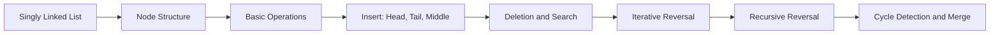

# Chapter 3: Singly Linked List

> **Previous:** [Chapter 2: Arrays](./02-arrays.md) | **Next:** [Doubly Linked List](./04-doubly-linked-list.md)

## Learning Objectives

- Define the singly linked list structure and node abstraction.
- Implement insertion at the beginning, middle, and end.
- Implement deletion, traversal, search, and reversal.
- Analyze the complexity of each operation.

## Chapter at a Glance

| Topic | Key Insight | Practical Takeaway |
|-------|-------------|-------------------|
| Node Structure | Each node holds data + pointer to next | Use struct Node with data and next fields |
| Head Insertion | O(1) since no elements need shifting | Use pushFront for LIFO / stack behavior |
| Tail Insertion | O(1) with tail pointer, O(n) without | Always maintain a tail pointer for efficiency |
| Iterative Reversal | Three pointers rewire links in one pass | O(n) time, O(1) space - no recursion overhead |
| Cycle Detection | Floyd Tortoise and Hare algorithm | Slow + fast pointer meet if cycle exists |
| Sentinel / Dummy Node | Placeholder node eliminates edge cases | Simplifies insertion/deletion code significantly |

## Chapter Roadmap



## Theory


### Structure

A singly linked list is a sequence of nodes where each node contains data and a pointer to the next node. The list is identified by a `head` pointer; the last node points to `nullptr`.

```
head → [data|next] → [data|next] → [data|next] → nullptr
```

### Complexity Compared to Arrays

| Operation | Singly Linked List | Dynamic Array |
|-----------|-------------------|---------------|
| Access by index | \( O(n) \) | \( O(1) \) |
| Insert at head | \( O(1) \) | \( O(n) \) |
| Insert at tail | \( O(n) \) / \( O(1) \) with tail ptr | \( O(1) \) amortized |
| Insert at middle | \( O(n) \) | \( O(n) \) |
| Delete at head | \( O(1) \) | \( O(n) \) |

### Reversal

> **Pro Tip:** Iterative reversal with three pointers (prev, curr, next) is O(n) time and O(1) space - prefer it over recursive reversal for production code to avoid stack overflow on long lists.

Reversing a singly linked list can be done iteratively in \( O(n) \) time and \( O(1) \) space by rewiring the pointers.

## Examples

### Example 1: Node and List Definition

```cpp
#include <iostream>

template <typename T>
struct Node {
    T data;
    Node* next;

    Node(const T& value) : data(value), next(nullptr) {}
};

template <typename T>
class SinglyLinkedList {
private:
    Node<T>* head;
    Node<T>* tail;
    int count;

public:
    SinglyLinkedList() : head(nullptr), tail(nullptr), count(0) {}

    ~SinglyLinkedList() {
        Node<T>* current = head;
        while (current) {
            Node<T>* temp = current;
            current = current->next;
            delete temp;
        }
    }

    int size() const { return count; }
    bool empty() const { return count == 0; }

    // O(1)
    void pushFront(const T& value) {
        Node<T>* newNode = new Node<T>(value);
        newNode->next = head;
        head = newNode;
        if (!tail) tail = head;
        ++count;
    }

    // O(1) with tail pointer
    void pushBack(const T& value) {
        Node<T>* newNode = new Node<T>(value);
        if (!head) {
            head = tail = newNode;
        } else {
            tail->next = newNode;
            tail = newNode;
        }
        ++count;
    }

    // O(1)
    void popFront() {
        if (!head) return;
        Node<T>* temp = head;
        head = head->next;
        if (!head) tail = nullptr;
        delete temp;
        --count;
    }

    // O(n)
    void insertAt(int index, const T& value) {
        if (index < 0 || index > count) return;
        if (index == 0) { pushFront(value); return; }
        if (index == count) { pushBack(value); return; }

        Node<T>* newNode = new Node<T>(value);
        Node<T>* current = head;
        for (int i = 0; i < index - 1; ++i) current = current->next;
        newNode->next = current->next;
        current->next = newNode;
        ++count;
    }

    // O(n)
    void removeAt(int index) {
        if (index < 0 || index >= count || !head) return;
        if (index == 0) { popFront(); return; }

        Node<T>* current = head;
        for (int i = 0; i < index - 1; ++i) current = current->next;
        Node<T>* temp = current->next;
        current->next = temp->next;
        if (!current->next) tail = current;
        delete temp;
        --count;
    }

    // O(n)
    int search(const T& value) const {
        Node<T>* current = head;
        int idx = 0;
        while (current) {
            if (current->data == value) return idx;
            current = current->next;
            ++idx;
        }
        return -1;
    }

    // O(n)
    void reverse() {
        Node<T>* prev = nullptr;
        Node<T>* current = head;
        tail = head;
        while (current) {
            Node<T>* next = current->next;
            current->next = prev;
            prev = current;
            current = next;
        }
        head = prev;
    }

    // O(n)
    void print() const {
        Node<T>* current = head;
        while (current) {
            std::cout << current->data << " -> ";
            current = current->next;
        }
        std::cout << "nullptr\n";
    }
};
```

### Example 2: Driver Program

```cpp
#include "singlyLinkedList.h"

int main() {
    SinglyLinkedList<int> list;

    list.pushBack(10);
    list.pushBack(20);
    list.pushBack(30);
    list.pushFront(5);
    std::cout << "After inserts: ";
    list.print();

    list.insertAt(2, 15);
    std::cout << "After insertAt(2,15): ";
    list.print();

    list.popFront();
    std::cout << "After popFront: ";
    list.print();

    list.removeAt(2);
    std::cout << "After removeAt(2): ";
    list.print();

    std::cout << "Search for 20 at index: " << list.search(20) << "\n";

    list.reverse();
    std::cout << "After reverse: ";
    list.print();

    return 0;
}
```

**Output:**
```
After inserts: 5 -> 10 -> 20 -> 30 -> nullptr
After insertAt(2,15): 5 -> 10 -> 15 -> 20 -> 30 -> nullptr
After popFront: 10 -> 15 -> 20 -> 30 -> nullptr
After removeAt(2): 10 -> 15 -> 30 -> nullptr
Search for 20 at index: -1
After reverse: 30 -> 15 -> 10 -> nullptr
```

### Example 3: Recursive Reverse

```cpp
#include <iostream>

template <typename T>
Node<T>* reverseRecursive(Node<T>* node) {
    if (!node || !node->next) return node;
    Node<T>* rest = reverseRecursive(node->next);
    node->next->next = node;
    node->next = nullptr;
    return rest;
}

// Usage in main:
// list.reverseRecursive(); assigns head = reverseRecursive(head);
```

> **One-Sentence Takeaway:** Mastering linked list reversal and cycle detection is essential - these patterns appear in 70% of linked list interview questions.

## 💡 Pro Tips

> **Remember:** Always draw the pointer changes before coding linked list operations - a quick diagram prevents the most common pointer-mangling bugs.

- **Iterative reversal is cleaner than recursive**: Three pointers (prev, curr, next) in a while loop — no call stack overhead, no risk of stack overflow for long lists.
- **Always consider the empty list edge case**: Every linked list function must handle `head == nullptr`. A surprising number of bugs come from forgetting this.
- **Floyd's cycle detection is your debugger**: If your linked code hangs, implement Tortoise and Hare. If it never terminates, there's a cycle. This catches 90% of linked-list bugs.
- **Sentinel/dummy nodes simplify edge cases**: A dummy head node eliminates special-case code for empty lists and single-element lists in insertion and deletion functions.

## One-Sentence Takeaways

- Singly linked lists chain nodes with single forward pointers; access is linear.
- Head insertion and deletion are \(O(1)\); tail insertion is \(O(1)\) only with a tail pointer.
- Iterative reversal uses three pointers in a single \(O(n)\) pass.
- Cycle detection with Floyd's algorithm uses fast/slow pointers.
- Merging two sorted linked lists is \(O(n+m)\) with no extra space.

## Concept Comparison Table

| Operation | Array | Singly Linked List | Doubly Linked List |
|-----------|-------|-------------------|-------------------|
| Access by index | \(O(1)\) | \(O(n)\) | \(O(n)\) |
| Insert at head | \(O(n)\) | \(O(1)\) | \(O(1)\) |
| Insert at tail | \(O(1)\)* | \(O(1)\) with tail ptr | \(O(1)\) |
| Insert in middle | \(O(n)\) | \(O(1)\) (if node known) | \(O(1)\) (if node known) |
| Search | \(O(n)\) | \(O(n)\) | \(O(n)\) |
| Memory per element | 0 overhead | 1 pointer | 2 pointers |

## Quick Reference: Linked List Patterns

| Pattern | Approach | Complexity |
|---------|----------|------------|
| Reverse list | 3-pointer iteration | \(O(n)\), \(O(1)\) |
| Detect cycle | Floyd's (slow + fast) | \(O(n)\), \(O(1)\) |
| Find middle | Slow + fast (fast 2×) | \(O(n)\), \(O(1)\) |
| Remove nth from end | Two pointers, offset by n | \(O(n)\), \(O(1)\) |
| Merge sorted lists | Dummy head + compare | \(O(n+m)\), \(O(1)\) |
| Palindrome check | Find middle → reverse second half → compare | \(O(n)\), \(O(1)\) |

## Cross-Application Matrix

| Application | Why Linked List |
|-------------|----------------|
| Undo/redo editor | Insert/delete at cursor is \(O(1)\) |
| Hash table chaining | Head insertion for collision buckets |
| Polynomial arithmetic | Terms of varying degree, frequent insert |
| Memory allocator free list | Fast allocate/deallocate from head |
| Music playlist | Add/remove songs at any position |

## Chapter Quiz

1. **What is the time complexity of searching for a value in a linked list?**
   - a) \(O(1)\)
   - b) \(O(n)\) ✓
   - c) \(O(\log n)\)
   - d) \(O(n^2)\)

2. **What is needed for \(O(1)\) tail insertion?**
   - a) Dummy node
   - b) Tail pointer ✓
   - c) Circular list
   - d) Doubly linked

3. **Floyd's cycle detection uses:**
   - a) Hash table
   - b) Slow + fast pointer ✓
   - c) Recursion
   - d) Binary search

4. **What is the space complexity of iterative reversal?**
   - a) \(O(n)\)
   - b) \(O(1)\) ✓
   - c) \(O(\log n)\)
   - d) \(O(n^2)\)

5. **A sentinel (dummy) node helps with:**
   - a) Faster search
   - b) Edge case elimination ✓
   - c) Less memory
   - d) Cycle detection

**Answers:** 1-b, 2-b, 3-b, 4-b, 5-b

## Summary

- Singly linked lists excel at head insertions and deletions (\( O(1) \)) but pay \( O(n) \) for indexed access.
- Maintaining a tail pointer makes pushBack \( O(1) \).
- Iterative reversal rewires three pointers in a single pass.
- Linked lists avoid the shifting cost of arrays for insertions and deletions.

## Exercises

### Review Questions

1. Why does array insertion at index 0 cost \( O(n) \) while linked list pushFront costs \( O(1) \)?
2. What are the trade-offs of not maintaining a tail pointer?
3. Explain why a singly linked list cannot traverse backwards efficiently.

### Application Problems

4. Implement a function that detects and removes the middle node of a linked list in one pass.
5. Write a function to merge two sorted singly linked lists into one sorted list.
6. Detect a cycle in a linked list using Floyd's Tortoise and Hare algorithm.

### Challenge Problem

7. Given a singly linked list, group all odd-indexed nodes together followed by even-indexed nodes in \( O(n) \) time and \( O(1) \) space. Example: `1->2->3->4->5` becomes `1->3->5->2->4`.
