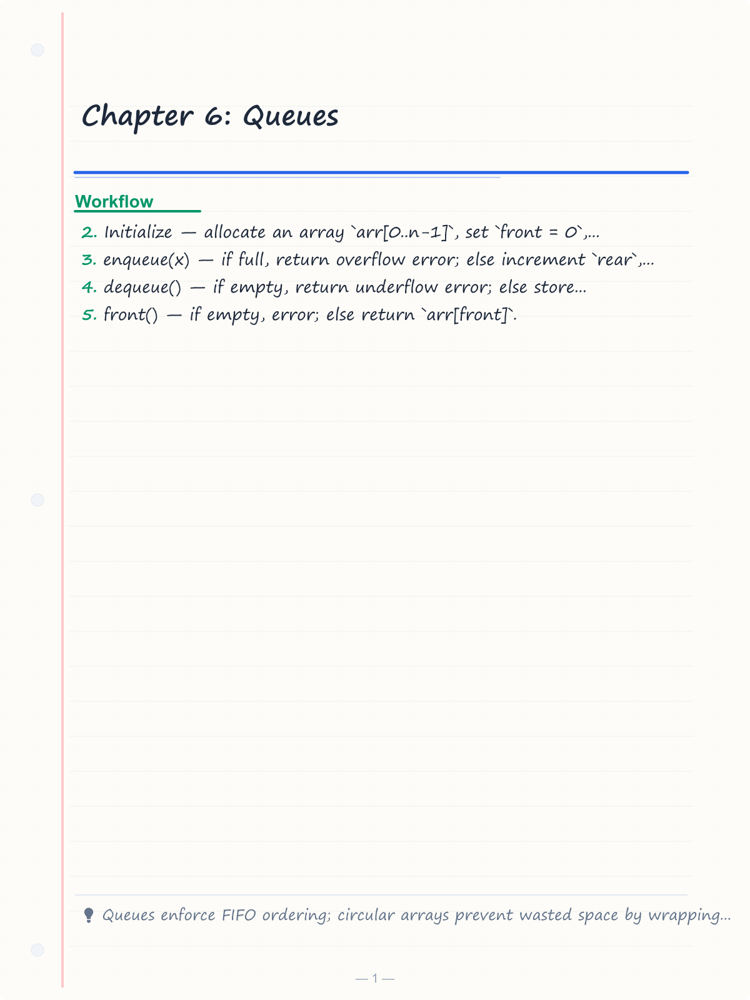
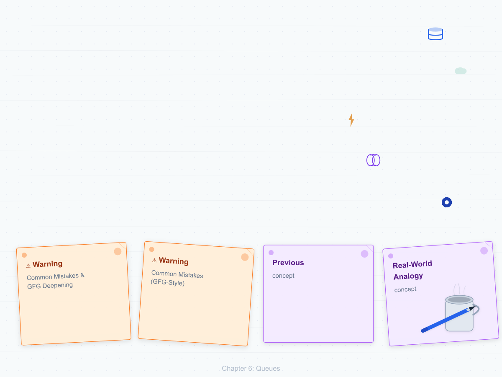
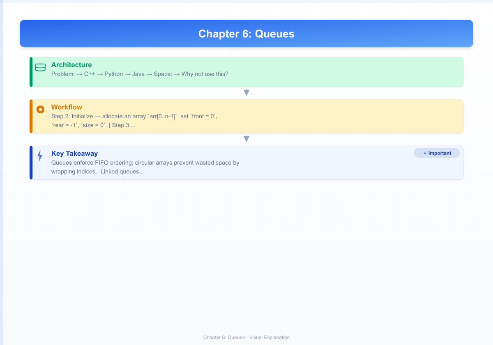

# Chapter 6: Queues

> **Previous:** [Chapter 5: Stacks](./05-stacks.md) | **Next:** [Hash Tables](./07-hash-tables.md)

## Learning Objectives

- Define the Queue ADT (First-In-First-Out).
- Implement a circular queue using arrays.
- Implement a queue using linked lists.
- Describe priority queues and deques.
- Apply queues to scheduling and breadth-first processing.
- Analyze and compare simple, circular, linked, deque, and priority queue variants.
- Solve classic interview problems using queues and deques.

<!-- Image Gallery -->
<section class="lesson-visuals" aria-label="Visual learning resources">
  <header><span>VISUAL LEARNING</span><h2>See it. Review it. Remember it.</h2></header>
  <a class="lesson-visual-card" href="../../assets/images/lessons/data-structures/06-queues/handwritten-notes.png" target="_blank" rel="noopener">
    
    <span><strong>Handwritten notes</strong>Condensed notes for deliberate review.</span>
  </a>
  <a class="lesson-visual-card" href="../../assets/images/lessons/data-structures/06-queues/sticky-notes.png" target="_blank" rel="noopener">
    
    <span><strong>Sticky-note revision</strong>Fast recall prompts for revision.</span>
  </a>
  <a class="lesson-visual-card" href="../../assets/images/lessons/data-structures/06-queues/visual-explanation.png" target="_blank" rel="noopener">
    
    <span><strong>Visual concept guide</strong>A connected explanation of the key ideas.</span>
  </a>
</section>
<!-- End Image Gallery -->


## Why Queues Matter

> **Real-World Analogy:** Imagine a ticket counter at a cinema. Customers join the line at the **rear** and are served from the **front**. The first person to arrive buys a ticket first — there is no cutting in line. This is **First-In-First-Out (FIFO)** — the defining principle of a queue.

Queues are everywhere:
- 🖨️ **Printer spooler** — documents are printed in the order they were submitted.
- ☕ **Coffee shop** — baristas take the next order from the front of the queue.
- 📨 **Message brokers** (Kafka, RabbitMQ) — producers publish messages to a queue; consumers process them in order.
- 🖥️ **CPU scheduling** — processes wait in a ready queue for their turn on the CPU.
- 🗺️ **BFS traversal** — graph nodes are explored level by level using a queue.

Without queues, life would be chaos: nobody would know who is next, fairness would vanish, and systems would lack predictable ordering.

## Chapter at a Glance

| Topic | Key Insight | Practical Takeaway |
|-------|-------------|-------------------|
| FIFO Principle | First-In-First-Out access order | Natural fit for BFS and scheduling |
| Simple Array Queue | Front fixed at 0, rear grows | Wastes space after dequeues |
| Circular Array Queue | Wrap indices modulo capacity | No wasted space from prior dequeues |
| Linked Queue | Nodes with head and tail pointers | Dynamic sizing without resizing |
| Deque | Insert/delete at both ends O(1) | Combines stack + queue capabilities |
| Priority Queue | Elements ordered by priority | Binary heap gives O(log n) ops |

## Chapter Roadmap

```mermaid
flowchart LR
    A[Queue FIFO] --> B[Circular Array vs Linked]
    B --> C[Enqueue / Dequeue O(1)]
    C --> D[Deque: Both Ends]
    D --> E[Priority Queue with Heap]
    E --> F[Applications: BFS, Sliding Window]
```

## Theory


### Queue ADT


A queue follows the **First-In-First-Out (FIFO)** discipline: elements are inserted at the **rear** and removed from the **front**.

| Operation | Description | Complexity |
|-----------|-------------|------------|
| `enqueue(x)` | Insert element at the rear | \( O(1) \) |
| `dequeue()` | Remove and return the front element | \( O(1) \) |
| `front()` | Return the front element without removing | \( O(1) \) |
| `isEmpty()` | Check if the queue is empty | \( O(1) \) |
| `size()` | Return the number of elements | \( O(1) \) |

---

### 1. Simple Array Queue (Naive)


> **Real-World Analogy:** A single-file line where the door (front) stays fixed. Everyone enters through the same door, and as people leave through the same door, the space they occupied remains empty — unusable.

#### Algorithm Steps

1. **Initialize** — allocate an array `arr[0..n-1]`, set `front = 0`, `rear = -1`, `size = 0`.
2. **enqueue(x)** — if full, return overflow error; else increment `rear`, place `x` at `arr[rear]`, increment `size`.
3. **dequeue()** — if empty, return underflow error; else store `arr[front]`, increment `front`, decrement `size`.
4. **front()** — if empty, error; else return `arr[front]`.
5. **isEmpty()** — return `size == 0`.

#### Pseudocode

```
Queue:
  arr ← array of size N
  front ← 0
  rear ← -1
  size ← 0

ENQUEUE(x):
  if size == N
    return "Overflow"
  rear ← rear + 1
  arr[rear] ← x
  size ← size + 1

DEQUEUE():
  if size == 0
    return "Underflow"
  x ← arr[front]
  front ← front + 1
  size ← size - 1
  return x

FRONT():
  if size == 0
    return "Empty"
  return arr[front]

ISEMPTY():
  return size == 0
```

#### Dry Run — Trace Table

| Operation | arr State | front | rear | size | Notes |
|-----------|-----------|-------|------|------|-------|
| Init | [ _ , _ , _ , _ , _ ] | 0 | -1 | 0 | |
| enqueue(10) | [10, _ , _ , _ , _ ] | 0 | 0 | 1 | rear→0 |
| enqueue(20) | [10, 20, _ , _ , _ ] | 0 | 1 | 2 | rear→1 |
| enqueue(30) | [10, 20, 30, _ , _ ] | 0 | 2 | 3 | rear→2 |
| dequeue() →10 | [10, 20, 30, _ , _ ] | 1 | 2 | 2 | front→1 (10 still in arr but logically gone) |
| dequeue() →20 | [10, 20, 30, _ , _ ] | 2 | 2 | 1 | front→2 |
| enqueue(40) | [10, 20, 30, 40, _ ] | 2 | 3 | 2 | rear→3 |

**Problem:** After dequeues, indices 0,1 are wasted — we cannot reuse them without shifting.

#### Implementations

**C++**
```cpp
#include <iostream>
#include <stdexcept>

template <typename T>
class SimpleArrayQueue {
private:
    T* arr;
    int capacity;
    int frontIndex;
    int rearIndex;
    int count;

public:
    SimpleArrayQueue(int cap = 8) : capacity(cap), frontIndex(0), rearIndex(-1), count(0) {
        arr = new T[capacity];
    }

    ~SimpleArrayQueue() { delete[] arr; }

    void enqueue(const T& value) {
        if (count == capacity)
            throw std::overflow_error("Queue overflow");
        rearIndex++;
        arr[rearIndex] = value;
        count++;
    }

    T dequeue() {
        if (count == 0)
            throw std::underflow_error("Queue underflow");
        T value = arr[frontIndex];
        frontIndex++;
        count--;
        return value;
    }

    T front() const {
        if (count == 0)
            throw std::underflow_error("Queue empty");
        return arr[frontIndex];
    }

    bool isEmpty() const { return count == 0; }
    int size() const { return count; }
};

int main() {
    SimpleArrayQueue<int> q(5);
    q.enqueue(10);
    q.enqueue(20);
    q.enqueue(30);
    std::cout << "Front: " << q.front() << "\n";
    std::cout << "Dequeued: " << q.dequeue() << "\n";
    q.enqueue(40);
    while (!q.isEmpty())
        std::cout << q.dequeue() << " ";
    return 0;
}
```

**Python**
```python
class SimpleArrayQueue:
    def __init__(self, capacity=8):
        self.arr = [None] * capacity
        self.capacity = capacity
        self.front = 0
        self.rear = -1
        self.count = 0

    def enqueue(self, value):
        if self.count == self.capacity:
            raise OverflowError("Queue overflow")
        self.rear += 1
        self.arr[self.rear] = value
        self.count += 1

    def dequeue(self):
        if self.count == 0:
            raise IndexError("Queue underflow")
        value = self.arr[self.front]
        self.front += 1
        self.count -= 1
        return value

    def front(self):
        if self.count == 0:
            raise IndexError("Queue empty")
        return self.arr[self.front]

    def is_empty(self):
        return self.count == 0

    def size(self):
        return self.count

q = SimpleArrayQueue(5)
q.enqueue(10)
q.enqueue(20)
q.enqueue(30)
print("Front:", q.front())
print("Dequeued:", q.dequeue())
q.enqueue(40)
while not q.is_empty():
    print(q.dequeue(), end=" ")
```

**Java**
```java
public class SimpleArrayQueue<T> {
    private T[] arr;
    private int capacity, front, rear, count;

    @SuppressWarnings("unchecked")
    public SimpleArrayQueue(int cap) {
        capacity = cap;
        arr = (T[]) new Object[capacity];
        front = 0;
        rear = -1;
        count = 0;
    }

    public void enqueue(T value) {
        if (count == capacity)
            throw new IllegalStateException("Queue overflow");
        rear++;
        arr[rear] = value;
        count++;
    }

    public T dequeue() {
        if (count == 0)
            throw new IllegalStateException("Queue underflow");
        T value = arr[front];
        front++;
        count--;
        return value;
    }

    public T front() {
        if (count == 0)
            throw new IllegalStateException("Queue empty");
        return arr[front];
    }

    public boolean isEmpty() { return count == 0; }
    public int size() { return count; }

    public static void main(String[] args) {
        SimpleArrayQueue<Integer> q = new SimpleArrayQueue<>(5);
        q.enqueue(10);
        q.enqueue(20);
        q.enqueue(30);
        System.out.println("Front: " + q.front());
        System.out.println("Dequeued: " + q.dequeue());
        q.enqueue(40);
        while (!q.isEmpty())
            System.out.print(q.dequeue() + " ");
    }
}
```

#### Complexity Analysis

| Operation | Time | Why |
|-----------|------|-----|
| enqueue | \( O(1) \) | Direct index assignment — no shifting |
| dequeue | \( O(1) \) | Just moves the front pointer forward |
| front | \( O(1) \) | Direct array access |
| isEmpty | \( O(1) \) | Single integer comparison |

**Space:** \( O(n) \) for the array.

**Why not use this?** After \( k \) dequeues, the first \( k \) slots become unusable — this is called **false overflow**. The queue appears full even though space exists at the front.

#### Advantages & Disadvantages

| Advantages | Disadvantages |
|------------|---------------|
| Simple to implement | Wastes space — false overflow |
| O(1) all operations | Fixed capacity (unless resized) |
| Good cache locality | Must shift elements if front reaches end |
| No pointer overhead | Cannot reuse freed slots |

#### Edge Cases

- **Empty queue** — dequeue/front on empty → underflow error.
- **Full queue** — enqueue on full → overflow error.
- **Single element** — front == rear; dequeue makes front > rear, queue becomes empty.
- **False overflow** — front has advanced but enqueue still fails because rear == capacity-1.

---

### 2. Circular Queue (Circular Array Queue)


> **Real-World Analogy:** A rotating sushi bar. The conveyor belt wraps around — when a plate reaches the end, it continues from the start. Similarly, a circular queue reuses empty slots at the beginning by wrapping the rear pointer back to index 0.

> **Pro Tip:** The modulo arithmetic `(rear + 1) % capacity` for circular wrap-around is both elegant and error-prone — always test edge cases where rear wraps past front.

A naive array queue wastes space because after dequeues the front pointer moves forward, leaving unused slots at the beginning. A circular queue wraps around: when the rear reaches the end, it continues at index 0 (modulo arithmetic).

#### Algorithm Steps

1. **Initialize** — allocate array `arr[0..n-1]`, set `front = 0`, `rear = 0`, `size = 0`.
2. **enqueue(x)** — if `size == capacity`, queue is full (resize or overflow); else place `x` at `arr[rear]`, set `rear = (rear + 1) % capacity`, increment `size`.
3. **dequeue()** — if `size == 0` → underflow; else store `arr[front]`, set `front = (front + 1) % capacity`, decrement `size`.
4. **front()** — if empty → error; else return `arr[front]`.
5. **isEmpty()** — return `size == 0`.

#### Pseudocode

```
CircularQueue:
  arr ← array of size N
  front ← 0
  rear ← 0
  size ← 0

ENQUEUE(x):
  if size == N
    resize() or return "Overflow"
  arr[rear] ← x
  rear ← (rear + 1) mod N
  size ← size + 1

DEQUEUE():
  if size == 0
    return "Underflow"
  x ← arr[front]
  front ← (front + 1) mod N
  size ← size - 1
  return x

FRONT():
  if size == 0 return "Empty"
  return arr[front]

ISEMPTY(): return size == 0
```

#### Dry Run — Trace Table (capacity = 5)

| Operation | arr state | front | rear | size | Notes |
|-----------|-----------|-------|------|------|-------|
| Init | [ _ , _ , _ , _ , _ ] | 0 | 0 | 0 | |
| enqueue(10) | [10, _ , _ , _ , _ ] | 0 | 1 | 1 | rear wraps to next |
| enqueue(20) | [10, 20, _ , _ , _ ] | 0 | 2 | 2 | |
| enqueue(30) | [10, 20, 30, _ , _ ] | 0 | 3 | 3 | |
| dequeue() →10 | [10, 20, 30, _ , _ ] | 1 | 3 | 2 | front→1 |
| dequeue() →20 | [10, 20, 30, _ , _ ] | 2 | 3 | 1 | front→2 |
| enqueue(40) | [10, 20, 30, 40, _ ] | 2 | 4 | 2 | |
| enqueue(50) | [10, 20, 30, 40, 50] | 2 | 0 | 3 | **Wrap:** rear = (4+1)%5 = 0 |
| enqueue(60) | [60, 20, 30, 40, 50] | 2 | 1 | 4 | overwrites index 0 |
| dequeue() →30 | [60, 20, 30, 40, 50] | 3 | 1 | 3 | front→3 |

Key observation: The circular queue reuses indices 0 and 1 that were freed by earlier dequeues. Without wrap-around, this space would be lost.

#### Implementations

**C++**
```cpp
#include <iostream>
#include <stdexcept>

template <typename T>
class CircularQueue {
private:
    T* data;
    int capacity;
    int frontIndex;
    int rearIndex;
    int count;

public:
    CircularQueue(int cap = 8) : capacity(cap), frontIndex(0), rearIndex(0), count(0) {
        data = new T[capacity];
    }

    ~CircularQueue() { delete[] data; }

    void enqueue(const T& value) {
        if (count == capacity) {
            resize();
        }
        data[rearIndex] = value;
        rearIndex = (rearIndex + 1) % capacity;
        ++count;
    }

    T dequeue() {
        if (isEmpty()) throw std::out_of_range("Queue underflow");
        T value = data[frontIndex];
        frontIndex = (frontIndex + 1) % capacity;
        --count;
        return value;
    }

    T front() const {
        if (isEmpty()) throw std::out_of_range("Queue is empty");
        return data[frontIndex];
    }

    bool isEmpty() const { return count == 0; }
    int size() const { return count; }

private:
    void resize() {
        int newCap = capacity * 2;
        T* newData = new T[newCap];
        for (int i = 0; i < count; ++i) {
            newData[i] = data[(frontIndex + i) % capacity];
        }
        delete[] data;
        data = newData;
        capacity = newCap;
        frontIndex = 0;
        rearIndex = count;
    }
};

int main() {
    CircularQueue<int> q;
    q.enqueue(1);
    q.enqueue(2);
    q.enqueue(3);

    std::cout << "Front: " << q.front() << "\n";
    std::cout << "Dequeue: " << q.dequeue() << "\n";
    std::cout << "Dequeue: " << q.dequeue() << "\n";

    q.enqueue(4);
    q.enqueue(5);
    std::cout << "Size: " << q.size() << "\n";

    while (!q.isEmpty()) {
        std::cout << q.dequeue() << " ";
    }
    std::cout << "\n";

    return 0;
}
```

**Output:**
```
Front: 1
Dequeue: 1
Dequeue: 2
Size: 3
3 4 5
```

**Python**
```python
class CircularQueue:
    def __init__(self, capacity=8):
        self.data = [None] * capacity
        self.capacity = capacity
        self.front = 0
        self.rear = 0
        self.count = 0

    def enqueue(self, value):
        if self.count == self.capacity:
            self._resize()
        self.data[self.rear] = value
        self.rear = (self.rear + 1) % self.capacity
        self.count += 1

    def dequeue(self):
        if self.is_empty():
            raise IndexError("Queue underflow")
        value = self.data[self.front]
        self.front = (self.front + 1) % self.capacity
        self.count -= 1
        return value

    def front(self):
        if self.is_empty():
            raise IndexError("Queue empty")
        return self.data[self.front]

    def is_empty(self):
        return self.count == 0

    def size(self):
        return self.count

    def _resize(self):
        new_cap = self.capacity * 2
        new_data = [None] * new_cap
        for i in range(self.count):
            new_data[i] = self.data[(self.front + i) % self.capacity]
        self.data = new_data
        self.capacity = new_cap
        self.front = 0
        self.rear = self.count

q = CircularQueue()
q.enqueue(1)
q.enqueue(2)
q.enqueue(3)
print("Front:", q.front())
print("Dequeue:", q.dequeue())
print("Dequeue:", q.dequeue())
q.enqueue(4)
q.enqueue(5)
print("Size:", q.size())
while not q.is_empty():
    print(q.dequeue(), end=" ")
```

**Java**
```java
import java.util.NoSuchElementException;

public class CircularQueue<T> {
    private T[] data;
    private int capacity, front, rear, count;

    @SuppressWarnings("unchecked")
    public CircularQueue(int cap) {
        capacity = cap;
        data = (T[]) new Object[capacity];
        front = 0;
        rear = 0;
        count = 0;
    }

    public void enqueue(T value) {
        if (count == capacity)
            resize();
        data[rear] = value;
        rear = (rear + 1) % capacity;
        count++;
    }

    public T dequeue() {
        if (isEmpty())
            throw new NoSuchElementException("Queue underflow");
        T value = data[front];
        front = (front + 1) % capacity;
        count--;
        return value;
    }

    public T front() {
        if (isEmpty())
            throw new NoSuchElementException("Queue empty");
        return data[front];
    }

    public boolean isEmpty() { return count == 0; }
    public int size() { return count; }

    @SuppressWarnings("unchecked")
    private void resize() {
        int newCap = capacity * 2;
        T[] newData = (T[]) new Object[newCap];
        for (int i = 0; i < count; i++)
            newData[i] = data[(front + i) % capacity];
        data = newData;
        capacity = newCap;
        front = 0;
        rear = count;
    }

    public static void main(String[] args) {
        CircularQueue<Integer> q = new CircularQueue<>(4);
        q.enqueue(1);
        q.enqueue(2);
        q.enqueue(3);
        System.out.println("Front: " + q.front());
        System.out.println("Dequeue: " + q.dequeue());
        q.enqueue(4);
        while (!q.isEmpty())
            System.out.print(q.dequeue() + " ");
    }
}
```

#### Complexity Analysis

| Operation | Time | Why |
|-----------|------|-----|
| enqueue (no resize) | \( O(1) \) | Single write + modulo arithmetic |
| dequeue | \( O(1) \) | Single read + modulo increment |
| front | \( O(1) \) | Direct array access |
| resize | \( O(n) \) | Must copy all elements to new array |

**Why O(1)?** Both enqueue and dequeue are simple pointer movements. Modulo arithmetic is a hardware-level operation — no loops, no shifting. The amortized cost of enqueue remains O(1) because resizing is rare (doubling strategy).

#### Advantages & Disadvantages

| Advantages | Disadvantages |
|------------|---------------|
| No false overflow — reuses freed slots | Fixed capacity (unless resize implemented) |
| O(1) all operations | Resize is O(n) and doubles memory |
| Excellent cache locality | One slot may be sacrificed to distinguish full/empty |
| Simple pointer arithmetic | Requires careful modulo boundary handling |

#### Edge Cases

- **Empty queue** — `front == rear && count == 0`.
- **Full queue** — `count == capacity`. If using sentinel-slot approach: `(rear + 1) % capacity == front`.
- **Single element** — enqueue then dequeue leaves front == rear with count == 0.
- **Wrap-around** — after many operations, front may be at index 4 and rear at index 2. Reading/wrapping correctly requires modulo.
- **Resize** — when full, all elements must be copied from (front...rear) to a new contiguous block starting at index 0.

---

### 3. Linked-List Queue


> **Real-World Analogy:** A conga line at a party. Each person holds the waist of the person in front. New people join at the back, and the front person leaves when it is their turn. The line can grow arbitrarily long — no fixed capacity.

#### Algorithm Steps

1. **Initialize** — `head = null`, `tail = null`, `size = 0`.
2. **enqueue(x)** — create a new `Node(x)`. If `head == null`, set `head = tail = newNode`; else link `tail.next = newNode`, move `tail = newNode`. Increment `size`.
3. **dequeue()** — if `head == null` → underflow. Store `head.data`, move `head = head.next`. If `head` becomes null, set `tail = null`. Decrement `size`.
4. **front()** — if empty → error; else return `head.data`.

#### Pseudocode

```
LinkedQueue:
  head ← null
  tail ← null
  size ← 0

ENQUEUE(x):
  newNode ← Node(x)
  if head == null
    head ← newNode
    tail ← newNode
  else
    tail.next ← newNode
    tail ← newNode
  size ← size + 1

DEQUEUE():
  if head == null
    return "Underflow"
  x ← head.data
  head ← head.next
  if head == null
    tail ← null
  size ← size - 1
  return x

FRONT():
  if head == null return "Empty"
  return head.data

ISEMPTY(): return size == 0
SIZE():    return size
```

#### Dry Run — Trace Table

| Operation | Queue State | head | tail | size |
|-----------|------------|------|------|------|
| Init | null | null | null | 0 |
| enqueue(A) | A → null | A | A | 1 |
| enqueue(B) | A → B → null | A | B | 2 |
| enqueue(C) | A → B → C → null | A | C | 3 |
| dequeue() →A | B → C → null | B | C | 2 |
| dequeue() →B | C → null | C | C | 1 |
| dequeue() →C | null | null | null | 0 |

#### Implementations

**C++**
```cpp
#include <iostream>
#include <stdexcept>

template <typename T>
class LinkedQueue {
private:
    struct Node {
        T data;
        Node* next;
        Node(const T& value) : data(value), next(nullptr) {}
    };
    Node* head;
    Node* tail;
    int count;

public:
    LinkedQueue() : head(nullptr), tail(nullptr), count(0) {}

    ~LinkedQueue() {
        while (head) {
            Node* temp = head;
            head = head->next;
            delete temp;
        }
    }

    void enqueue(const T& value) {
        Node* newNode = new Node(value);
        if (tail) tail->next = newNode;
        else head = newNode;
        tail = newNode;
        ++count;
    }

    T dequeue() {
        if (isEmpty()) throw std::out_of_range("Queue underflow");
        Node* temp = head;
        T value = temp->data;
        head = head->next;
        if (!head) tail = nullptr;
        delete temp;
        --count;
        return value;
    }

    T front() const {
        if (isEmpty()) throw std::out_of_range("Queue is empty");
        return head->data;
    }

    bool isEmpty() const { return count == 0; }
    int size() const { return count; }
};

int main() {
    LinkedQueue<std::string> q;
    q.enqueue("first");
    q.enqueue("second");
    q.enqueue("third");

    std::cout << q.dequeue() << "\n";
    std::cout << q.dequeue() << "\n";
    q.enqueue("fourth");
    std::cout << q.dequeue() << "\n";
    std::cout << q.dequeue() << "\n";

    return 0;
}
```

**Output:**
```
first
second
third
fourth
```

**Python**
```python
class LinkedQueue:
    class _Node:
        def __init__(self, value):
            self.data = value
            self.next = None

    def __init__(self):
        self.head = None
        self.tail = None
        self.count = 0

    def enqueue(self, value):
        new_node = self._Node(value)
        if self.tail:
            self.tail.next = new_node
        else:
            self.head = new_node
        self.tail = new_node
        self.count += 1

    def dequeue(self):
        if self.is_empty():
            raise IndexError("Queue underflow")
        value = self.head.data
        self.head = self.head.next
        if not self.head:
            self.tail = None
        self.count -= 1
        return value

    def front(self):
        if self.is_empty():
            raise IndexError("Queue empty")
        return self.head.data

    def is_empty(self):
        return self.count == 0

    def size(self):
        return self.count

q = LinkedQueue()
q.enqueue("first")
q.enqueue("second")
q.enqueue("third")
print(q.dequeue())
print(q.dequeue())
q.enqueue("fourth")
print(q.dequeue())
print(q.dequeue())
```

**Java**
```java
import java.util.NoSuchElementException;

public class LinkedQueue<T> {
    private static class Node<T> {
        T data;
        Node<T> next;
        Node(T value) { this.data = value; }
    }

    private Node<T> head, tail;
    private int count;

    public LinkedQueue() { head = tail = null; count = 0; }

    public void enqueue(T value) {
        Node<T> newNode = new Node<>(value);
        if (tail != null) tail.next = newNode;
        else head = newNode;
        tail = newNode;
        count++;
    }

    public T dequeue() {
        if (isEmpty())
            throw new NoSuchElementException("Queue underflow");
        T value = head.data;
        head = head.next;
        if (head == null) tail = null;
        count--;
        return value;
    }

    public T front() {
        if (isEmpty())
            throw new NoSuchElementException("Queue empty");
        return head.data;
    }

    public boolean isEmpty() { return count == 0; }
    public int size() { return count; }

    public static void main(String[] args) {
        LinkedQueue<String> q = new LinkedQueue<>();
        q.enqueue("first");
        q.enqueue("second");
        q.enqueue("third");
        System.out.println(q.dequeue());
        System.out.println(q.dequeue());
        q.enqueue("fourth");
        System.out.println(q.dequeue());
        System.out.println(q.dequeue());
    }
}
```

#### Complexity Analysis

| Operation | Time | Why |
|-----------|------|-----|
| enqueue | \( O(1) \) | Rear pointer gives direct tail access — no traversal needed |
| dequeue | \( O(1) \) | Head pointer gives direct front access |
| front | \( O(1) \) | Directly reads head.data |
| Space overhead | \( O(n) \) extra | Each node stores one pointer (next) |

**Why O(1) for both ends?** Unlike a singly linked list (which typically has O(n) tail operations), we maintain a separate `tail` pointer. Both head and tail are direct references — no traversal required.

#### Advantages & Disadvantages

| Advantages | Disadvantages |
|------------|---------------|
| Dynamic size — no capacity limit | Extra memory per node (pointer overhead) |
| No resizing or copying | Poor cache locality — nodes scattered in memory |
| O(1) enqueue and dequeue | Pointer manipulation required (bug-prone) |
| No false overflow | Slightly slower than array due to allocation |

#### Edge Cases

- **Empty queue** — head == null; dequeue/front → underflow.
- **Single element** — head == tail; after dequeue, both become null.
- **Many elements** — works regardless of number (heap memory permitting).
- **Memory exhaustion** — if heap is full, `new Node` may throw.

---

### 4. Deque (Double-Ended Queue)


> **Real-World Analogy:** A sliding door at a supermarket entrance. People can enter and exit from both sides. During rush hour, the store opens both doors to handle flow in both directions.

A deque allows insertion and deletion at both ends in \( O(1) \) time, combining stack and queue capabilities.

#### Algorithm Steps

1. **Initialize** — allocate array `arr[0..n-1]`, set `front = 0`, `rear = 0`, `size = 0`.
2. **pushFront(x)** — `front = (front - 1 + capacity) % capacity`, place `x` at `arr[front]`, increment `size`.
3. **pushBack(x)** — place `x` at `arr[rear]`, `rear = (rear + 1) % capacity`, increment `size`.
4. **popFront()** — store `arr[front]`, `front = (front + 1) % capacity`, decrement `size`.
5. **popBack()** — `rear = (rear - 1 + capacity) % capacity`, store `arr[rear]`, decrement `size`.
6. **front()**, **back()** — return element at front/back without removal.

#### Pseudocode

```
Deque:
  arr ← array of size N
  front ← 0
  rear ← 0
  size ← 0

PUSHFRONT(x):
  front ← (front - 1 + N) mod N
  arr[front] ← x
  size ← size + 1

PUSHBACK(x):
  arr[rear] ← x
  rear ← (rear + 1) mod N
  size ← size + 1

POPFRONT():
  x ← arr[front]
  front ← (front + 1) mod N
  size ← size - 1
  return x

POPBACK():
  rear ← (rear - 1 + N) mod N
  x ← arr[rear]
  size ← size - 1
  return x

FRONT(): return arr[front]
BACK():  return arr[(rear - 1 + N) mod N]
```

#### Dry Run — Trace Table (capacity = 5)

| Operation | arr state | front | rear | size |
|-----------|-----------|-------|------|------|
| Init | [ _ , _ , _ , _ , _ ] | 0 | 0 | 0 |
| pushBack(10) | [10, _ , _ , _ , _ ] | 0 | 1 | 1 |
| pushBack(20) | [10, 20, _ , _ , _ ] | 0 | 2 | 2 |
| pushFront(5) | [10, 20, _ , _ , 5] | 4 | 2 | 3 |
| pushFront(1) | [10, 20, _ , 1, 5] | 3 | 2 | 4 |
| popFront() →1 | [10, 20, _ , 1, 5] | 4 | 2 | 3 |
| popBack() →20 | [10, 20, _ , 1, 5] | 4 | 1 | 2 |
| popBack() →10 | [10, 20, _ , 1, 5] | 4 | 0 | 1 |

#### Implementations

**C++**
```cpp
#include <iostream>
#include <deque>

int main() {
    std::deque<int> dq;

    dq.push_back(10);
    dq.push_back(20);
    dq.push_front(5);
    dq.push_front(1);

    std::cout << "Deque: ";
    for (int x : dq) std::cout << x << " ";
    std::cout << "\n";

    std::cout << "pop_front: " << dq.front() << "\n";
    dq.pop_front();
    std::cout << "pop_back: " << dq.back() << "\n";
    dq.pop_back();

    std::cout << "Remaining: ";
    for (int x : dq) std::cout << x << " ";
    std::cout << "\n";

    return 0;
}
```

**Output:**
```
Deque: 1 5 10 20
pop_front: 1
pop_back: 20
Remaining: 5 10
```

**Python (using collections.deque)**
```python
from collections import deque

dq = deque()
dq.append(10)       # push_back
dq.append(20)
dq.appendleft(5)    # push_front
dq.appendleft(1)

print("Deque:", list(dq))
print("pop_front:", dq.popleft())
print("pop_back:", dq.pop())
print("Remaining:", list(dq))
```

**Java (using ArrayDeque)**
```java
import java.util.ArrayDeque;
import java.util.Deque;

public class DequeExample {
    public static void main(String[] args) {
        Deque<Integer> dq = new ArrayDeque<>();
        dq.addLast(10);
        dq.addLast(20);
        dq.addFirst(5);
        dq.addFirst(1);

        System.out.print("Deque: ");
        for (int x : dq) System.out.print(x + " ");
        System.out.println();

        System.out.println("pop_front: " + dq.pollFirst());
        System.out.println("pop_back: " + dq.pollLast());
        System.out.print("Remaining: ");
        for (int x : dq) System.out.print(x + " ");
    }
}
```

#### Complexity Analysis

| Operation | Time | Why |
|-----------|------|-----|
| pushFront/pushBack | \( O(1) \) | Modulo pointer arithmetic — no shifting |
| popFront/popBack | \( O(1) \) | Same — pointer adjustment only |
| front/back | \( O(1) \) | Direct array access |

**Why O(1) at both ends?** The circular array backing allows both front and back pointers to move independently. Unlike a singly linked list, no traversal is needed for the back.

#### Advantages & Disadvantages

| Advantages | Disadvantages |
|------------|---------------|
| O(1) insert/delete at both ends | More complex than simple queue |
| Combines stack + queue in one structure | Fixed capacity (array-based) |
| Useful for palindrome checking, sliding window | Two pointers to manage |
| Can mimic stack and queue | Overcommit: easy to overflow on one side |

#### Edge Cases

- **Empty** — all access methods fail.
- **Single element** — front == back index.
- **Full** — need resize or overflow check.
- **Wrap-backwards** — `(front - 1 + capacity) % capacity` handles negative modulo.

---

### 5. Priority Queue


> **Real-World Analogy:** A hospital emergency room. Patients are treated based on the severity of their condition, not their arrival time. A heart attack patient (high priority) is seen before someone with a sprained ankle (low priority), even if the latter arrived first.

In a priority queue, elements have a priority value; the element with the highest (or lowest) priority is dequeued first. Typically implemented with a binary heap (\( O(\log n) \) insert and extract).

#### Algorithm Steps (Binary Heap-based Max-Priority Queue)

1. **Insert (push)** — add element at the end of the heap array. Bubble it up while its priority is greater than its parent.
2. **Extract-Max (pop)** — swap root with last element, remove the last. Bubble the new root down while it is smaller than either child.
3. **Peek (top)** — return root element (index 0) — \( O(1) \).
4. **isEmpty** — check heap size == 0.

#### Pseudocode

```
PriorityQueue (Max-Heap based):
  heap ← array
  size ← 0

PUSH(x):
  heap[size] ← x
  i ← size
  size ← size + 1
  while i > 0 and heap[PARENT(i)] < heap[i]
    swap heap[PARENT(i)], heap[i]
    i ← PARENT(i)

POP():
  if size == 0 return "Empty"
  max ← heap[0]
  heap[0] ← heap[size-1]
  size ← size - 1
  MAXHEAPIFY(0)
  return max

TOP(): return heap[0]

MAXHEAPIFY(i):
  left ← 2*i + 1
  right ← 2*i + 2
  largest ← i
  if left < size and heap[left] > heap[largest]
    largest ← left
  if right < size and heap[right] > heap[largest]
    largest ← right
  if largest != i
    swap heap[i], heap[largest]
    MAXHEAPIFY(largest)
```

#### Dry Run — Trace Table

| Operation | Heap (array) | Structure |
|-----------|-------------|-----------|
| push(3) | [3] | 3 |
| push(10) | [10, 3] | 10 → 3 |
| push(5) | [10, 3, 5] | 10 → 3, 5 |
| push(1) | [10, 3, 5, 1] | 10 → 3, 5 → 1 |
| push(7) | [10, 7, 5, 1, 3] | 10 → 7, 5 → 1, 3 |
| pop() →10 | [7, 3, 5, 1] | 7 → 3, 5 → 1 |
| pop() →7 | [5, 3, 1] | 5 → 3, 1 |
| pop() →5 | [3, 1] | 3 → 1 |

#### Implementations

**C++**
```cpp
#include <iostream>
#include <queue>
#include <vector>

struct Task {
    std::string name;
    int priority;

    bool operator<(const Task& other) const {
        return priority < other.priority; // higher priority first
    }
};

int main() {
    std::priority_queue<Task> pq;
    pq.push({"Write report", 3});
    pq.push({"Fix critical bug", 10});
    pq.push({"Check email", 1});
    pq.push({"Review PR", 5});

    while (!pq.empty()) {
        Task t = pq.top(); pq.pop();
        std::cout << "[Priority " << t.priority << "] " << t.name << "\n";
    }

    return 0;
}
```

**Output:**
```
[Priority 10] Fix critical bug
[Priority 5] Review PR
[Priority 3] Write report
[Priority 1] Check email
```

**Python**
```python
import heapq

class Task:
    def __init__(self, name, priority):
        self.name = name
        self.priority = priority

    def __lt__(self, other):
        # heapq is min-heap; negate for max-heap behavior
        return self.priority > other.priority

pq = []
heapq.heappush(pq, Task("Write report", 3))
heapq.heappush(pq, Task("Fix critical bug", 10))
heapq.heappush(pq, Task("Check email", 1))
heapq.heappush(pq, Task("Review PR", 5))

while pq:
    t = heapq.heappop(pq)
    print(f"[Priority {t.priority}] {t.name}")
```

**Java**
```java
import java.util.PriorityQueue;

class Task implements Comparable<Task> {
    String name;
    int priority;

    Task(String name, int priority) {
        this.name = name;
        this.priority = priority;
    }

    @Override
    public int compareTo(Task other) {
        return other.priority - this.priority; // higher priority first
    }
}

public class PriorityQueueExample {
    public static void main(String[] args) {
        PriorityQueue<Task> pq = new PriorityQueue<>();
        pq.offer(new Task("Write report", 3));
        pq.offer(new Task("Fix critical bug", 10));
        pq.offer(new Task("Check email", 1));
        pq.offer(new Task("Review PR", 5));

        while (!pq.isEmpty()) {
            Task t = pq.poll();
            System.out.println("[Priority " + t.priority + "] " + t.name);
        }
    }
}
```

#### Complexity Analysis

| Operation | Time | Why |
|-----------|------|-----|
| push (insert) | \( O(\log n) \) | Bubble up: worst-case travels from leaf to root (tree height) |
| pop (extract-max) | \( O(\log n) \) | Bubble down: same — heap height is \(\log n\) |
| top (peek) | \( O(1) \) | Root of heap is always at index 0 |
| heapify | \( O(n) \) | Building heap from array |

**Why O(log n), not O(1)?** The binary heap is a complete binary tree of height \(\log_2 n\). Insertion may require the new element to rise through every level, and extraction may require the new root to sink through every level. This is the price of maintaining the heap property.

#### Advantages & Disadvantages

| Advantages | Disadvantages |
|------------|---------------|
| Guaranteed O(log n) worst-case for insert/extract | Not stable — equal-priority order not preserved |
| Efficient for dynamic priority management | Not FIFO — ordering is by priority, not arrival |
| Foundation for Dijkstra, Huffman, A* | Heap structure requires extra space |
| Memory efficient (array-backed) | Cannot find/remove arbitrary elements quickly |

#### Edge Cases

- **Empty queue** — pop/top on empty → error.
- **Single element** — one element; pop leaves heap empty.
- **Duplicate priorities** — order among equal priorities is implementation-dependent (unstable).
- **All same priority** — effectively becomes FIFO (behavior varies by implementation).
- **Resizing** — dynamic array backing needs resize when full.

---

### Queue Family Comparison


| Feature | Simple Queue | Circular Queue | Linked Queue | Deque | Priority Queue |
|---------|-------------|----------------|--------------|-------|----------------|
| Enqueue | \( O(1) \) | \( O(1) \) | \( O(1) \) | \( O(1) \) both ends | \( O(\log n) \) |
| Dequeue | \( O(1) \) | \( O(1) \) | \( O(1) \) | \( O(1) \) both ends | \( O(\log n) \) |
| Memory overhead | None (array) | None (array) | \( O(n) \) pointers | \( O(n) \) or 2 ptrs | \( O(n) \) array |
| Capacity | Fixed | Fixed (resizable) | Dynamic | Fixed/dynamic | Fixed (resizable) |
| Wasted space | Yes (false overflow) | No | No (per-node ptr ok) | No | No |
| Ordering | FIFO | FIFO | FIFO | FIFO/LIFO | Priority-based |
| Cache locality | Excellent | Excellent | Poor | Excellent | Good |
| Use case | Educational | Ring buffers | Dynamic FIFO | Sliding window | Task scheduling |

---

## 💡 Pro Tips

> **Remember:** Use a sentinel slot in circular queues to distinguish full from empty when front == rear — this is the most common off-by-one bug in queue implementations.

- **Circular array queue needs one sentinel slot**: Use front and rear indices where an empty queue has front == rear, and a full queue has `(rear + 1) % size == front`. This wastes one slot but avoids tracking separate size.
- **BFS is queue's natural domain**: Push the start node, mark visited, then repeatedly pop, process neighbors, and push unvisited ones. The queue guarantees level-by-level exploration.
- **Monotonic queue for sliding window max**: Maintain a deque where elements are in decreasing order. Before pushing, pop from the back while the back is smaller than the new element. The front is always the window max.
- **Priority queue with `decreaseKey` needs a heap index**: For Dijkstra's algorithm, maintain an array mapping vertex ID → heap position. This allows \( O(\log n) \) priority updates instead of \( O(n) \) search.

## One-Sentence Takeaways

- FIFO means the first enqueued element is the first dequeued.
- Circular arrays avoid wasted space by wrapping indices modulo capacity.
- Linked queues have no capacity limit but allocate per node.
- Deques allow insertion and deletion at both ends.
- Priority queues use a binary heap for \( O(\log n) \) insertion and extraction.
- Queues are essential for BFS, scheduling, and buffering.

## Concept Comparison Table

| Feature | Array Queue | Circular Queue | Linked Queue | Deque |
|---------|-------------|----------------|--------------|-------|
| Enqueue | \( O(1) \) | \( O(1) \) | \( O(1) \) | \( O(1) \) both ends |
| Dequeue | \( O(1) \) | \( O(1) \) | \( O(1) \) | \( O(1) \) both ends |
| Space waste | Wraparound needs free slot | 1 sentinel slot | Per-node ptr overhead | 2 ptrs per node |
| Capacity limit | Fixed | Fixed | No | No |
| Cache locality | Good | Good | Poor | Poor |

## Quick Reference: When to Use Which Queue

| Need | Best Queue Type |
|------|-----------------|
| Fixed-size buffer | Circular array queue |
| Variable-size FIFO | Linked queue |
| Insert/delete at both ends | Deque |
| Access by priority | Priority queue (binary heap) |
| Sliding window max | Monotonic deque |

## Cross-Application Matrix

| Application | Queue Type | Why |
|-------------|-----------|-----|
| BFS graph traversal | Simple FIFO queue | Level-order processing |
| CPU task scheduling | Priority queue | Higher-priority tasks first |
| Keyboard buffer | Circular queue | Fixed buffer, sequential read |
| Undo history | Deque | Limit size, add/remove from ends |
| Sliding window max | Monotonic deque | \( O(n) \) time overall |
| Packet buffering | Circular queue | Fixed capacity, overwrite oldest |

---

## Interview Corner

### Problem 1: Implement a Queue using Two Stacks

**Problem:** Implement a FIFO queue using only two stacks (push/pop).

**Approach:** Use stack1 for enqueue and stack2 for dequeue. When dequeue is called and stack2 is empty, transfer all elements from stack1 to stack2, reversing their order.

```python
class QueueUsingStacks:
    def __init__(self):
        self.s1 = []  # enqueue stack
        self.s2 = []  # dequeue stack

    def enqueue(self, x):
        self.s1.append(x)

    def dequeue(self):
        if not self.s2:
            while self.s1:
                self.s2.append(self.s1.pop())
        if not self.s2:
            raise IndexError("Queue empty")
        return self.s2.pop()

    def front(self):
        if not self.s2:
            while self.s1:
                self.s2.append(self.s1.pop())
        if not self.s2:
            raise IndexError("Queue empty")
        return self.s2[-1]

    def is_empty(self):
        return not self.s1 and not self.s2

# Test
q = QueueUsingStacks()
q.enqueue(1); q.enqueue(2); q.enqueue(3)
print(q.dequeue())  # 1
q.enqueue(4)
print(q.dequeue())  # 2
print(q.dequeue())  # 3
print(q.dequeue())  # 4
```

**Complexity:** enqueue \( O(1) \), dequeue amortized \( O(1) \) (each element moved at most twice).

### Problem 2: Sliding Window Maximum

**Problem:** Given an array and a window size k, find the maximum in every contiguous subarray of size k.

**Approach:** Use a monotonic decreasing deque. For each element, remove from back while back &lt; new element, then push. The front is the current window maximum.

```python
from collections import deque

def sliding_window_maximum(arr, k):
    dq = deque()
    result = []

    for i, val in enumerate(arr):
        # Remove elements out of window from front
        if dq and dq[0] <= i - k:
            dq.popleft()

        # Remove smaller elements from back
        while dq and arr[dq[-1]] < val:
            dq.pop()

        dq.append(i)

        # First window complete
        if i >= k - 1:
            result.append(arr[dq[0]])

    return result

print(sliding_window_maximum([1, 3, -1, -3, 5, 3, 6, 7], 3))
# Output: [3, 3, 5, 5, 6, 7]
```

**Complexity:** \( O(n) \) — each element pushed and popped at most once.

### Problem 3: First Non-Repeating Character in a Stream

**Problem:** Given a stream of characters, find the first non-repeating character at each insertion.

**Approach:** Maintain a deque of characters in order of appearance. Use a frequency map. When a character repeats, remove it from the front of the deque if it appears there.

```python
from collections import deque

def first_non_repeating(stream):
    dq = deque()
    freq = {}
    result = []

    for ch in stream:
        freq[ch] = freq.get(ch, 0) + 1

        if freq[ch] == 1:
            dq.append(ch)

        # Remove characters from front that have repeated
        while dq and freq[dq[0]] > 1:
            dq.popleft()

        result.append(dq[0] if dq else '#')

    return result

print(first_non_repeating("aabcbd"))
# Output: ['a', 'a', 'b', 'c', 'c', 'd']
```

### Problem 4: LRU Cache (Using Deque)

**Problem:** Design an LRU (Least Recently Used) cache with get(key) and put(key, value) in O(1).

**Approach:** Use a dict for O(1) lookup and a deque for order tracking. On get, move used key to the end. On put, evict from front if full.

```python
from collections import deque

class LRUCache:
    def __init__(self, capacity: int):
        self.cap = capacity
        self.cache = {}
        self.order = deque()

    def get(self, key: int) -> int:
        if key not in self.cache:
            return -1
        self.order.remove(key)
        self.order.append(key)
        return self.cache[key]

    def put(self, key: int, value: int) -> None:
        if key in self.cache:
            self.order.remove(key)
        elif len(self.cache) >= self.cap:
            oldest = self.order.popleft()
            del self.cache[oldest]
        self.cache[key] = value
        self.order.append(key)

lru = LRUCache(3)
lru.put(1, 'A'); lru.put(2, 'B'); lru.put(3, 'C')
print(lru.get(1))  # A (1 becomes most recent)
lru.put(4, 'D')    # evicts 2 (least recently used)
print(lru.get(2))  # -1 (evicted)
```

### Problem 5: Rotten Oranges (BFS with Queue)

**Problem:** Given a grid where 0=empty, 1=fresh orange, 2=rotten orange. Every minute, rotten oranges rot adjacent fresh oranges. Find the minimum time to rot all, or -1 if impossible.

**Approach:** BFS using a queue. Push all initially rotten oranges. Process level by level — each level = 1 minute.

```python
from collections import deque

def oranges_rotting(grid):
    rows, cols = len(grid), len(grid[0])
    q = deque()
    fresh = 0

    for r in range(rows):
        for c in range(cols):
            if grid[r][c] == 2:
                q.append((r, c, 0))
            elif grid[r][c] == 1:
                fresh += 1

    dirs = [(1,0), (-1,0), (0,1), (0,-1)]
    minutes = 0

    while q:
        r, c, mins = q.popleft()
        minutes = max(minutes, mins)
        for dr, dc in dirs:
            nr, nc = r + dr, c + dc
            if 0 <= nr < rows and 0 <= nc < cols and grid[nr][nc] == 1:
                grid[nr][nc] = 2
                fresh -= 1
                q.append((nr, nc, mins + 1))

    return minutes if fresh == 0 else -1

grid = [
    [2, 1, 1],
    [1, 1, 0],
    [0, 1, 1]
]
print(oranges_rotting(grid))  # 4
```

---

## Applications in Real Systems

### 1. BFS Graph Traversal

Breadth-First Search uses a queue to explore a graph level-by-level. Every node is enqueued once and dequeued once, giving \( O(V + E) \) time. Used in:
- Social networks (finding friends-of-friends)
- Web crawlers (page-by-page discovery)
- GPS navigation (shortest path in unweighted graphs)

### 2. Print Spooling

When multiple users send documents to a shared printer, the print spooler queues jobs in FIFO order. Each job waits in the queue until the printer is ready. If a job fails, it may be re-queued or discarded. Circular buffers keep the spool bounded.

### 3. Message Queues (Kafka, RabbitMQ, AWS SQS)

Message brokers use distributed queues to decouple producers from consumers:
- **Kafka** — partitioned, replicated, ordered logs. Each partition is an ordered queue.
- **RabbitMQ** — supports multiple queue types: classic (FIFO), quorum (replicated), and priority queues.
- **AWS SQS** — fully managed message queuing with at-least-once delivery.

Messages are enqueued by producers and dequeued by consumers. This architecture enables async processing, load leveling, and fault tolerance.

### 4. CPU Scheduling

Operating systems use several queue types:
- **Ready Queue** — processes ready to run; scheduled by priority (priority queue).
- **FCFS (First-Come, First-Served)** — simple FIFO queue.
- **Round Robin** — circular queue with time slices.
- **I/O Wait Queue** — processes waiting for I/O completion.

### 5. Breadth-First Search (Tree/Graph)

- **Level-order tree traversal** — process nodes level by level.
- **Shortest path** — BFS finds shortest path in unweighted graphs.
- **Topological sort** — Kahn's algorithm uses a queue of nodes with in-degree 0.

### 6. Web Server Request Queuing

Web servers use bounded queues (circular buffers) to handle incoming HTTP requests. If the queue is full, new requests are rejected (backpressure) to prevent server overload.

### 7. Undo/Redo in Editors

A deque stores edit history. The user can undo (pop from back) or redo (pop from front). Bounded to a maximum size — oldest entries are dropped from the front.

---

## Common Mistakes & GFG Deepening

### Common Mistakes (GFG-Style)

| Mistake | Why It's Wrong | Correct Approach |
|---------|----------------|------------------|
| Confusing front vs rear in circular queue | Enqueue at rear, dequeue from front — mixing them breaks ordering | Keep invariant: `front` points to oldest element, `rear` to the next insertion spot |
| Miscomputing modulo with `(rear + 1) % size` for empty check | Full and empty both have `front == rear` in circular queues | Use `count` variable or sacrifice one slot to distinguish |
| Not resizing array queue when full (array impl) | Elements are overwritten or queue rejects valid inserts | Double the capacity and copy elements from front to rear |
| Forgetting to wrap-around when dequeuing in circular queue | `front++` eventually goes out of bounds | Always update with `front = (front + 1) % capacity` |
| Assuming popFront on empty linked queue returns null gracefully | When queue is empty and `front` is null, `front.next` crashes | Check `isEmpty()` before accessing `front.next` |
| Using shift() on arrays for queue in JavaScript/TypeScript | `shift()` is O(n) because every element must re-index | Use `push()` + index pointer for O(1), or a proper `Queue` class |

### TypeScript Queue Implementation

```typescript
interface IQueue<T> {
    enqueue(item: T): void;
    dequeue(): T | undefined;
    peek(): T | undefined;
    isEmpty(): boolean;
    size(): number;
}

// Linked List Queue (O(1) all operations)
class LinkedQueue<T> implements IQueue<T> {
    private front: { data: T; next: any } | null = null;
    private rear: { data: T; next: any } | null = null;
    private _size: number = 0;

    enqueue(item: T): void {
        const node = { data: item, next: null };
        if (this.rear) this.rear.next = node;
        this.rear = node;
        if (!this.front) this.front = node;
        this._size++;
    }

    dequeue(): T | undefined {
        if (!this.front) return undefined;
        const item = this.front.data;
        this.front = this.front.next;
        if (!this.front) this.rear = null;
        this._size--;
        return item;
    }

    peek(): T | undefined { return this.front?.data; }
    isEmpty(): boolean { return this._size === 0; }
    size(): number { return this._size; }
}

// Circular Array Queue (O(1) all operations)
class CircularArrayQueue<T> implements IQueue<T> {
    private data: (T | undefined)[];
    private frontIdx: number = 0;
    private rearIdx: number = 0;
    private _size: number = 0;
    private cap: number;

    constructor(capacity: number = 10) {
        this.cap = capacity;
        this.data = new Array(capacity);
    }

    enqueue(item: T): void {
        if (this._size === this.cap) this.resize();
        this.data[this.rearIdx] = item;
        this.rearIdx = (this.rearIdx + 1) % this.cap;
        this._size++;
    }

    dequeue(): T | undefined {
        if (this._size === 0) return undefined;
        const item = this.data[this.frontIdx];
        this.frontIdx = (this.frontIdx + 1) % this.cap;
        this._size--;
        return item;
    }

    peek(): T | undefined {
        return this._size === 0 ? undefined : this.data[this.frontIdx];
    }

    isEmpty(): boolean { return this._size === 0; }
    size(): number { return this._size; }

    private resize(): void {
        const newCap = this.cap * 2;
        const newData = new Array(newCap);
        for (let i = 0; i < this._size; i++) {
            newData[i] = this.data[(this.frontIdx + i) % this.cap];
        }
        this.data = newData;
        this.frontIdx = 0;
        this.rearIdx = this._size;
        this.cap = newCap;
    }
}

// Deque with O(1) insert/delete at both ends
class Deque<T> {
    private data: (T | undefined)[] = [];
    private frontIdx: number = 0;
    private backIdx: number = -1;

    pushFront(item: T): void {
        this.frontIdx--;
        this.data[this.frontIdx] = item;
    }

    pushBack(item: T): void {
        this.backIdx++;
        this.data[this.backIdx] = item;
    }

    popFront(): T | undefined {
        if (this.frontIdx > this.backIdx) return undefined;
        const item = this.data[this.frontIdx];
        this.frontIdx++;
        return item;
    }

    popBack(): T | undefined {
        if (this.frontIdx > this.backIdx) return undefined;
        const item = this.data[this.backIdx];
        this.backIdx--;
        return item;
    }

    isEmpty(): boolean { return this.frontIdx > this.backIdx; }
}
```

### Additional MCQs (GFG Pattern)

7. **What is true about a deque (double-ended queue)?**
   - a) Elements can be inserted/deleted at both ends ✓
   - b) Elements can only be inserted at front
   - c) Elements can only be deleted at rear
   - d) Supports access to middle elements in O(1)

8. **In a circular queue of size 5, if `front = 3` and `rear = 2`, how many elements?**
   - a) 3
   - b) 4 ✓
   - c) 5
   - d) 0

9. **Which queue variant is best for implementing a sliding window maximum?**
   - a) Simple queue
   - b) Priority queue
   - c) Deque ✓
   - d) Circular queue

10. **What is the main advantage of the linked-list queue over the array queue?**
    - a) Faster enqueue
    - b) No fixed capacity ✓
    - c) Lower memory
    - d) Simpler code

11. **An application that requires serving tasks in order of arrival, then emergencies first, needs:**
    - a) Simple queue
    - b) Priority queue ✓
    - c) Deque
    - d) Circular queue

12. **The `size()` method in a linked queue implemented without a counter is:**
    - a) O(1)
    - b) O(n) ✓
    - c) O(log n)
    - d) O(n²)

**Answers:** 7-a, 8-b, 9-c, 10-b, 11-b, 12-b

### Additional Exercises (GFG Pattern)

11. **Implement a stack using queues**: Use two queues to implement all stack operations (push, pop, top, empty) with O(1) push and O(n) pop, or O(n) push and O(1) pop.

12. **Reverse the first K elements of a queue**: Given a queue and an integer K, reverse the order of the first K elements.

13. **Interleave the first half with the second half**: Given a queue of even length, interleave the first half with the second half (e.g., `[1,2,3,4,5,6]` → `[1,4,2,5,3,6]`).

14. **Generate binary numbers from 1 to N**: Given a number N, generate binary representations for all numbers from 1 to N using a queue.

15. **First non-repeating character in a stream**: Given a stream of characters, find the first non-repeating character at any point. Use a queue and a hash map.

16. **LRU cache with queue**: Design an LRU cache using a combination of a queue and a hash map. The queue tracks the order of access.

17. **Check if a given permutation is valid for a queue**: Given two arrays — the original order and the dequeued order — check if it's possible to dequeue in that order using a queue.

18. **Connect n ropes with minimum cost**: Given n ropes of varying lengths, connect them into one rope with minimum cost (cost = sum of two rope lengths at each connection).

19. **Maximum of all subarrays of size K**: Given an array and a window size K, find the maximum element in every contiguous subarray of size K. Solve in O(n) using a deque.

20. **Sliding window first negative element**: Given an array and a window size K, find the first negative integer in each subarray of size K.

### Queue Variants Comparison

| Variant | Enqueue | Dequeue | Peek | Space | Use Case |
|---------|---------|---------|------|-------|----------|
| Simply linked list (queue) | O(1) | O(1) | O(1) | O(n) | General-purpose |
| Circular array queue | O(1) amortized | O(1) | O(1) | O(n) | Bounded buffers |
| Deque | O(1) both ends | O(1) both ends | O(1) | O(n) | Sliding window |
| Priority queue | O(log n) | O(log n) | O(1) | O(n) | Scheduling |
| Monotonic queue | O(1) amortized | O(1) | O(1) | O(n) | Max/min in sliding window |
   - c) Final In, Final Out
   - d) Fixed Input, Fixed Output

2. **Why does a circular queue waste one slot?**
   - a) Implementation error
   - b) To distinguish empty from full ✓
   - c) Performance optimization
   - d) Alignment requirement

3. **Which data structure enables priority queue operations?**
   - a) Stack
   - b) Binary heap ✓
   - c) Hash table
   - d) Linked list

4. **A deque allows insertion at:**
   - a) Front only
   - b) Back only
   - c) Both ends ✓
   - d) Middle only

5. **Which algorithm uses a queue naturally?**
   - a) DFS
   - b) BFS ✓
   - c) Binary search
   - d) Merge sort

**Answers:** 1-b, 2-b, 3-b, 4-c, 5-b

## Summary

- Queues enforce FIFO ordering; circular arrays prevent wasted space by wrapping indices.
- Linked queues provide \( O(1) \) enqueue and dequeue without pre-allocated capacity.
- Deques support insertion and deletion at both ends.
- Priority queues order elements by priority, typically via a binary heap.
- Queues are fundamental to BFS, scheduling, and buffering.

## Exercises

### Review Questions

1. Why does a naive array queue waste space? How does circular addressing fix this?
2. What is the key difference between a stack and a queue?
3. When would you choose a deque over a regular queue?

### Application Problems

4. Implement a queue using two stacks.
5. Write a function to reverse the first k elements of a queue.
6. Implement a circular buffer (ring buffer) for a fixed-size data stream.

### Challenge Problem

7. Implement a **Monotonic Queue** data structure that supports `push(x)`, `pop()`, and `getMax()` in amortized \( O(1) \) time. Use it to solve the sliding window maximum problem.
8. Given an array of integers and a window size k, find the maximum of each subarray of size k using a deque.
9. Implement a **Stack using two Queues** such that push is O(1) and pop is O(n).
10. Given a stream of characters, print the first non-repeating character at every point in time.
