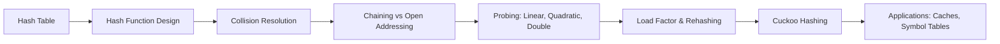

# Chapter 7: Hash Tables

> **Previous:** [Chapter 6: Queues](./06-queues.md) | **Next:** [Binary Trees](./08-binary-trees.md)

## Learning Objectives

- Define hash tables and the role of hash functions.
- Implement collision resolution via chaining and open addressing.
- Analyze load factor and rehashing strategies.
- Evaluate the complexity of search, insert, and delete.

<!-- Image Gallery -->
<div style="display:flex;flex-wrap:wrap;gap:4px;margin:16px 0;padding:12px;background:#f8fafc;border-radius:8px;border:1px solid #e2e8f0;">
<a href="../../../assets/images/lessons/data-structures/07-hash-tables/hero.svg" target="_blank" rel="noopener">
  
</a>
<a href="../../../assets/images/lessons/data-structures/07-hash-tables/handwritten-notes.svg" target="_blank" rel="noopener">
  
</a>
<a href="../../../assets/images/lessons/data-structures/07-hash-tables/sticky-notes.svg" target="_blank" rel="noopener">
  
</a>
<a href="../../../assets/images/lessons/data-structures/07-hash-tables/visual-explanation.svg" target="_blank" rel="noopener">
  
</a>
<a href="../../../assets/images/lessons/data-structures/07-hash-tables/architecture.svg" target="_blank" rel="noopener">
  
</a>
<a href="../../../assets/images/lessons/data-structures/07-hash-tables/workflow.svg" target="_blank" rel="noopener">
  
</a>
<a href="../../../assets/images/lessons/data-structures/07-hash-tables/mindmap.svg" target="_blank" rel="noopener">
  
</a>
<a href="../../../assets/images/lessons/data-structures/07-hash-tables/comparison.svg" target="_blank" rel="noopener">
  
</a>
<a href="../../../assets/images/lessons/data-structures/07-hash-tables/cheatsheet.svg" target="_blank" rel="noopener">
  
</a>
<a href="../../../assets/images/lessons/data-structures/07-hash-tables/interview-quiz.svg" target="_blank" rel="noopener">
  
</a>
<a href="../../../assets/images/lessons/data-structures/07-hash-tables/social-card.svg" target="_blank" rel="noopener">
  
</a>
</div>
<!-- End Image Gallery -->


## Why Hash Tables Matter

Imagine you have a massive **dictionary** with 100,000 words. To look up the definition of "serendipity", you could:
- **Scan every page** — O(n), takes forever.
- **Binary search** — O(log n), faster but requires sorted pages.
- **Use an index** — the word itself tells you exactly which page to open.

A **hash table** is that magical index. It answers "where do I store this?" and "where do I find this?" in near-constant time.

**Real-world analogy:** A library catalog system. Each book gets assigned a shelf number by the librarian (hash function). When you want a book, you compute its shelf number and walk directly to that shelf. If two books land on the same shelf (collision), the librarian puts one right next to the other (chaining) or shifts to the next available shelf (open addressing). Without this system, you'd walk every aisle looking for your book.

## Chapter at a Glance

| Topic | Key Insight | Practical Takeaway |
|-------|-------------|-------------------|
| Hash Function | Maps keys to bucket indices | Must be fast and uniform |
| Chaining | Linked list per bucket for collisions | Simple, O(alpha) search |
| Open Addressing | Probe sequence for next empty slot | Memory efficient, cluster-prone |
| Load Factor | n/m ratio determines performance | Rehash when alpha > threshold |
| Rehashing | Double table, reinsert all keys | O(n) cost, infrequent |
| Double Hashing | Two-step hash for probe sequence | Best clustering behavior |
| Cuckoo Hashing | Two tables, kick-out strategy | O(1) worst-case lookup |

## Chapter Roadmap



## Theory


### Hash Table Concept

<a href="../../../assets/images/diagrams/data-structures/07-hash-tables/hash-table-concept-handwritten.svg" target="_blank" rel="noopener">
  
</a>
<a href="../../../assets/images/diagrams/data-structures/07-hash-tables/hash-table-concept-diagram.svg" target="_blank" rel="noopener">
  
</a>
<a href="../../../assets/images/diagrams/data-structures/07-hash-tables/hash-table-concept-sticky.svg" target="_blank" rel="noopener">
  
</a>


A hash table maps keys to values using a **hash function** \( h(k) \) that computes an index into an array (the bucket array). The goal is \( O(1) \) average-case lookup.

**Components:**
- **Key space**: the set of all possible keys.
- **Hash function**: maps a key to an integer in \( [0, m-1] \) where \( m \) is the table size.
- **Bucket array**: stores key-value pairs at computed indices.
- **Collision resolution**: handles the case when two keys hash to the same index.

---

### Hash Function

<a href="../../../assets/images/diagrams/data-structures/07-hash-tables/hash-function-handwritten.svg" target="_blank" rel="noopener">
  
</a>
<a href="../../../assets/images/diagrams/data-structures/07-hash-tables/hash-function-diagram.svg" target="_blank" rel="noopener">
  
</a>
<a href="../../../assets/images/diagrams/data-structures/07-hash-tables/hash-function-sticky.svg" target="_blank" rel="noopener">
  
</a>


**Real-world analogy:** A postal code system. When you mail a letter, the ZIP code tells the postal service which region to send it to. A good ZIP code system spreads mail evenly across all postal workers. A bad one dumps everything on one worker — just like a bad hash function dumps all keys into one bucket.

A hash function transforms a key into an integer index within the bucket array range.

**Properties of a good hash function:**
1. **Deterministic** — same key always produces the same hash.
2. **Fast to compute** — O(len(key)) ideally.
3. **Uniform distribution** — keys spread evenly across buckets.
4. **Minimizes collisions** — different keys rarely map to the same index.

**Common hash functions:**

1. **Division method:** \( h(k) = k \bmod m \) — simple but choose m as a prime not near a power of 2.
2. **Multiplication method:** \( h(k) = \lfloor m \cdot (kA \bmod 1) \rfloor \) where \( 0 &lt; A < 1 \) (Knuth suggests \( A = (\sqrt{5} - 1)/2 \approx 0.618 \)).
3. **Polynomial rolling hash for strings:** \( h(s) = (\sum_{i=0}^{n-1} s[i] \cdot p^{i}) \bmod m \) — typical p = 31 or 131.
4. **DJB2 hash (popular for strings):** `hash = ((hash << 5) + hash) + c` — simple, good distribution.

**Pseudocode: Division Hash**

```
function hash(key, tableSize):
    return key mod tableSize
```

**Pseudocode: DJB2 String Hash**

```
function hashString(str, tableSize):
    hash = 5381
    for each character c in str:
        hash = ((hash << 5) + hash) + c
    return hash mod tableSize
```

**Dry Run:** DJB2 on "cat" with tableSize = 16

| Step | char | hash (before) | computation | hash (after) |
|------|------|---------------|-------------|--------------|
| Init | — | 5381 | — | 5381 |
| 1 | 'c' (99) | 5381 | 5381*33 + 99 | 177672 |
| 2 | 'a' (97) | 177672 | 177672*33 + 97 | 5863273 |
| 3 | 't' (116) | 5863273 | 5863273*33 + 116 | 193488125 |
| Final | — | — | 193488125 mod 16 | 13 |

**Complexity:**
- **Time:** O(len(key)) — we iterate over each character once.
- **Space:** O(1) — only a few integer variables.

**Advantages & Disadvantages**

| Advantages | Disadvantages |
|-----------|-------------|
| Deterministic — reliable | Poor choice of modulus causes clustering |
| Fast O(k) computation | Not cryptographic — reversible |
| Simple to implement | Primary/secondary clustering with bad m |
| Easy to compose for complex keys | Collisions unavoidable by pigeonhole principle |

**Python Implementation: DJB2 Hash Function**

```python
def djb2_hash(key, table_size):
    hash_val = 5381
    for c in str(key):
        hash_val = ((hash_val << 5) + hash_val) + ord(c)
    return hash_val % table_size

# Example
words = ["hello", "world", "hash", "table", "function"]
for w in words:
    print(f"{w} -> bucket {djb2_hash(w, 16)}")
```

**Java Implementation: DJB2 Hash Function**

```java
public class HashUtils {
    public static int djb2Hash(String key, int tableSize) {
        int hash = 5381;
        for (int i = 0; i < key.length(); i++) {
            hash = ((hash << 5) + hash) + key.charAt(i);
        }
        return Math.abs(hash) % tableSize;
    }

    public static void main(String[] args) {
        String[] words = {"hello", "world", "hash", "table", "function"};
        for (String w : words) {
            System.out.println(w + " -> bucket " + djb2Hash(w, 16));
        }
    }
}
```

**Edge Cases:**
- **Empty string:** hash = 5381, returns 5381 mod m — valid, maps to bucket `5381 mod m`.
- **Very long key:** O(len) cost, no special treatment needed.
- **Unicode characters:** treat as integer codepoints — behavior depends on character encoding.
- **Hash function that always returns same value (pathological):** every key maps to the same bucket — degenerates to O(n) linked list.

---

### Chaining

<a href="../../../assets/images/diagrams/data-structures/07-hash-tables/chaining-handwritten.svg" target="_blank" rel="noopener">
  
</a>
<a href="../../../assets/images/diagrams/data-structures/07-hash-tables/chaining-diagram.svg" target="_blank" rel="noopener">
  
</a>
<a href="../../../assets/images/diagrams/data-structures/07-hash-tables/chaining-sticky.svg" target="_blank" rel="noopener">
  
</a>


**Real-world analogy:** A coat check room with numbered hooks. Each hook can hold multiple coats (chained together on the same hook). When two people get the same number, the attendant hangs one coat and clips the second onto the same hook. Finding your coat means searching through the chain on that hook — fast if the hook is lightly loaded, slow if everyone gets the same number.

**Algorithm: Insert with Chaining**

1. Compute bucket index: `idx = hash(key) % tableSize`.
2. Traverse the linked list at `buckets[idx]`.
3. If key already exists, update its value and return.
4. Otherwise, append the new key-value pair to the list.
5. Increment element count.
6. If load factor exceeds threshold (typically 1.0), trigger rehash.

**Algorithm: Search with Chaining**

1. Compute bucket index: `idx = hash(key) % tableSize`.
2. Traverse the linked list at `buckets[idx]`.
3. If key found, return its value.
4. Otherwise, return not-found.

**Algorithm: Delete with Chaining**

1. Compute bucket index: `idx = hash(key) % tableSize`.
2. Traverse the linked list at `buckets[idx]`.
3. If key found, remove the node from the list and decrement count.
4. Otherwise, return not-found.

**Pseudocode: Chaining Hash Table**

```
class HashTableChaining:
    buckets: array of lists
    n: number of elements
    m: number of buckets

    function insert(key, value):
        if n / m > loadFactorThreshold:
            rehash()
        idx = hash(key) mod m
        for each pair in buckets[idx]:
            if pair.key == key:
                pair.value = value
                return
        buckets[idx].append((key, value))
        n++

    function find(key):
        idx = hash(key) mod m
        for each pair in buckets[idx]:
            if pair.key == key:
                return pair.value
        return null

    function delete(key):
        idx = hash(key) mod m
        for each pair in buckets[idx]:
            if pair.key == key:
                buckets[idx].remove(pair)
                n--
                return true
        return false
```

**Dry Run:** Insert keys [10, 22, 31, 4, 15, 28, 17, 88, 59] into table of size 7 using chaining, hash = key mod 7, threshold = 1.0.

| Step | Key | Bucket | Table State (bucket → list) |
|------|-----|--------|----------------------------|
| 0 | — | — | 0:[] 1:[] 2:[] 3:[] 4:[] 5:[] 6:[] |
| 1 | 10 | 10%7=3 | 0:[] 1:[] 2:[] 3:[10] 4:[] 5:[] 6:[] |
| 2 | 22 | 22%7=1 | 0:[] 1:[22] 2:[] 3:[10] 4:[] 5:[] 6:[] |
| 3 | 31 | 31%7=3 | 0:[] 1:[22] 2:[] 3:[10,31] 4:[] 5:[] 6:[] |
| 4 | 4 | 4%7=4 | 0:[] 1:[22] 2:[] 3:[10,31] 4:[4] 5:[] 6:[] |
| 5 | 15 | 15%7=1 | 0:[] 1:[22,15] 2:[] 3:[10,31] 4:[4] 5:[] 6:[] |
| 6 | 28 | 28%7=0 | 0:[28] 1:[22,15] 2:[] 3:[10,31] 4:[4] 5:[] 6:[] |
| 7 | 17 | 17%7=3 | 0:[28] 1:[22,15] 2:[] 3:[10,31,17] 4:[4] 5:[] 6:[] |
| 8 | 88 | 88%7=4 | 0:[28] 1:[22,15] 2:[] 3:[10,31,17] 4:[4,88] 5:[] 6:[] |
| 9 | 59 | 59%7=3 | 0:[28] 1:[22,15] 2:[] 3:[10,31,17,59] 4:[4,88] 5:[] 6:[] |

**Final load factor:** α = 9/7 ≈ 1.29 > 1.0 → rehash needed next insert.

**C++ Implementation:**

```cpp
#include <iostream>
#include <vector>
#include <list>
#include <utility>

template <typename K, typename V>
class HashTableChaining {
private:
    std::vector<std::list<std::pair<K, V>>> buckets;
    int numElements;
    int numBuckets;
    double loadFactorThreshold;

    int hash(const K& key) const {
        return std::hash<K>{}(key) % numBuckets;
    }

    void rehash() {
        std::vector<std::list<std::pair<K, V>>> oldBuckets = std::move(buckets);
        numBuckets *= 2;
        buckets.resize(numBuckets);
        numElements = 0;

        for (auto& chain : oldBuckets) {
            for (auto& kv : chain) {
                insert(kv.first, kv.second);
            }
        }
    }

public:
    HashTableChaining(int initialSize = 8, double threshold = 1.0)
        : numBuckets(initialSize), numElements(0), loadFactorThreshold(threshold) {
        buckets.resize(numBuckets);
    }

    void insert(const K& key, const V& value) {
        if ((double)numElements / numBuckets > loadFactorThreshold) rehash();

        int idx = hash(key);
        for (auto& kv : buckets[idx]) {
            if (kv.first == key) {
                kv.second = value;
                return;
            }
        }
        buckets[idx].push_back({key, value});
        ++numElements;
    }

    bool find(const K& key, V& value) const {
        int idx = hash(key);
        for (const auto& kv : buckets[idx]) {
            if (kv.first == key) {
                value = kv.second;
                return true;
            }
        }
        return false;
    }

    bool remove(const K& key) {
        int idx = hash(key);
        auto& chain = buckets[idx];
        for (auto it = chain.begin(); it != chain.end(); ++it) {
            if (it->first == key) {
                chain.erase(it);
                --numElements;
                return true;
            }
        }
        return false;
    }

    int size() const { return numElements; }
};

int main() {
    HashTableChaining<std::string, int> ht;
    ht.insert("apple", 5);
    ht.insert("banana", 3);
    ht.insert("cherry", 8);

    int val;
    if (ht.find("banana", val))
        std::cout << "banana -> " << val << "\n";

    ht.remove("banana");
    std::cout << "Size: " << ht.size() << "\n";
    return 0;
}
```

**Python Implementation:**

```python
class HashTableChaining:
    def __init__(self, initial_size=8, threshold=1.0):
        self.m = initial_size
        self.n = 0
        self.threshold = threshold
        self.table = [[] for _ in range(self.m)]

    def _hash(self, key):
        return hash(key) % self.m

    def _rehash(self):
        old = self.table
        self.m *= 2
        self.table = [[] for _ in range(self.m)]
        self.n = 0
        for chain in old:
            for k, v in chain:
                self.insert(k, v)

    def insert(self, key, value):
        if self.n / self.m > self.threshold:
            self._rehash()
        idx = self._hash(key)
        for i, (k, v) in enumerate(self.table[idx]):
            if k == key:
                self.table[idx][i] = (key, value)
                return
        self.table[idx].append((key, value))
        self.n += 1

    def find(self, key):
        idx = self._hash(key)
        for k, v in self.table[idx]:
            if k == key:
                return v
        return None

    def remove(self, key):
        idx = self._hash(key)
        for i, (k, v) in enumerate(self.table[idx]):
            if k == key:
                del self.table[idx][i]
                self.n -= 1
                return True
        return False

    def size(self):
        return self.n


ht = HashTableChaining()
ht.insert("apple", 5)
ht.insert("banana", 3)
print(ht.find("banana"))  # 3
ht.remove("banana")
print(ht.find("banana"))  # None
```

**Java Implementation:**

```java
import java.util.*;

class HashTableChaining<K, V> {
    private LinkedList<Entry<K, V>>[] buckets;
    private int numElements;
    private int numBuckets;
    private double threshold;

    private static class Entry<K, V> {
        K key;
        V value;
        Entry(K k, V v) { key = k; value = v; }
    }

    @SuppressWarnings("unchecked")
    public HashTableChaining(int initialSize, double threshold) {
        this.numBuckets = initialSize;
        this.numElements = 0;
        this.threshold = threshold;
        buckets = new LinkedList[numBuckets];
        for (int i = 0; i < numBuckets; i++)
            buckets[i] = new LinkedList<>();
    }

    public HashTableChaining() { this(8, 1.0); }

    private int hash(K key) {
        return Math.abs(key.hashCode()) % numBuckets;
    }

    private void rehash() {
        LinkedList<Entry<K, V>>[] old = buckets;
        numBuckets *= 2;
        buckets = new LinkedList[numBuckets];
        for (int i = 0; i < numBuckets; i++)
            buckets[i] = new LinkedList<>();
        numElements = 0;
        for (LinkedList<Entry<K, V>> chain : old)
            for (Entry<K, V> e : chain)
                insert(e.key, e.value);
    }

    public void insert(K key, V value) {
        if ((double) numElements / numBuckets > threshold) rehash();
        int idx = hash(key);
        for (Entry<K, V> e : buckets[idx]) {
            if (e.key.equals(key)) { e.value = value; return; }
        }
        buckets[idx].add(new Entry<>(key, value));
        numElements++;
    }

    public V find(K key) {
        int idx = hash(key);
        for (Entry<K, V> e : buckets[idx])
            if (e.key.equals(key)) return e.value;
        return null;
    }

    public boolean remove(K key) {
        int idx = hash(key);
        Iterator<Entry<K, V>> it = buckets[idx].iterator();
        while (it.hasNext()) {
            if (it.next().key.equals(key)) {
                it.remove();
                numElements--;
                return true;
            }
        }
        return false;
    }

    public int size() { return numElements; }
}
```

**Complexity Analysis:**

| Operation | Average | Worst Case | Why |
|-----------|---------|------------|-----|
| Search | O(1 + α) | O(n) | Average: chain length = α; Worst: all keys in one bucket |
| Insert | O(1) | O(n) | Average: O(1) amortized; Worst: rehash or collision chain |
| Delete | O(1 + α) | O(n) | Average: find then remove from list; Worst: full chain scan |
| Rehash | O(n) | O(n) | Must recompute hash and reinsert every element |

**Why amortized O(1)?** When load factor exceeds threshold, we double the table size and reinsert all n elements at O(n) cost. But this happens only every n inserts (geometric growth). The amortized cost per insert is O(1) because the O(n) rehash cost is spread across n prior inserts: n * O(1) + O(n) / n = O(1).

**Load Factor:** α = n/m. For chaining, typical threshold is α > 1.0 (or sometimes 0.75). Rehash when exceeded by allocating 2x the table and reinserting all entries.

**Advantages & Disadvantages**

| Advantages | Disadvantages |
|-----------|-------------|
| Simple to implement | Extra memory for pointers (overhead) |
| Safe deletion (no tombstones) | Cache-unfriendly (pointer chasing) |
| Handles high load factors well | Worst-case O(n) with bad hash |
| α &lt; 1.0 not strictly required | Linked list traversal slower than array |

**Edge Cases:**
- **All keys hash to same bucket:** degrades to singly linked list — O(n) worst-case operations.
- **Empty table:** insert works normally; find/delete return not-found.
- **Removing non-existent key:** return false / null, no side effects.
- **Collision chain length explosion:** rehash is triggered to redistribute.
- **Duplicate key insert:** must update value, not create duplicate entry.

---

### Open Addressing

<a href="../../../assets/images/diagrams/data-structures/07-hash-tables/open-addressing-handwritten.svg" target="_blank" rel="noopener">
  
</a>
<a href="../../../assets/images/diagrams/data-structures/07-hash-tables/open-addressing-diagram.svg" target="_blank" rel="noopener">
  
</a>
<a href="../../../assets/images/diagrams/data-structures/07-hash-tables/open-addressing-sticky.svg" target="_blank" rel="noopener">
  
</a>


**Real-world analogy:** A parking lot with numbered spots. If your assigned spot is taken, you drive to the next empty spot and park there. When you return, you check your assigned spot first, then check nearby spots in order until you find your car. The problem: if many people park near the same section (clustering), you may walk far before finding an empty space.

In open addressing, all entries are stored **directly in the bucket array** (no linked lists). When a collision occurs, we probe for the next available slot.

#### Linear Probing

Probe sequence: `p(k, i) = (hash(k) + i) mod m`, for i = 0, 1, 2, ...

**Algorithm: Insert with Linear Probing**

1. Compute `idx = hash(key) % tableSize`.
2. Set `i = 0`.
3. While slot at `(idx + i) % tableSize` is occupied AND not the same key:
   - Increment `i`.
4. If slot is the same key, update value.
5. Otherwise, insert key-value at this slot, mark occupied, increment count.
6. If load factor exceeds threshold (typically 0.7), rehash.

**Algorithm: Search with Linear Probing**

1. Compute `idx = hash(key) % tableSize`.
2. Set `i = 0`.
3. While slot at `(idx + i) % tableSize` is occupied (not empty):
   - If slot is the target key and not deleted, return value.
   - Increment `i`.
4. Return not-found.

**Algorithm: Delete with Linear Probing (Tombstone)**

1. Compute `idx = hash(key) % tableSize`.
2. Set `i = 0`.
3. While slot at `(idx + i) % tableSize` is occupied (not empty):
   - If slot is the target key, mark as deleted (tombstone), decrement count.
   - Increment `i`.
4. Return not-found.

**Pseudocode: Open Addressing with Linear Probing**

```
class HashTableOpen:
    table: array of Entry {key, value, occupied, deleted}
    n: count of live elements
    m: capacity

    function insert(key, value):
        if n / m > 0.7:
            rehash()
        idx = hash(key) mod m
        i = 0
        while table[(idx + i) mod m].occupied
              and table[(idx + i) mod m].key != key:
            i++
        pos = (idx + i) mod m
        if not table[pos].occupied or table[pos].deleted:
            n++
        table[pos] = Entry(key, value, occupied=true, deleted=false)

    function find(key):
        idx = hash(key) mod m
        i = 0
        while table[(idx + i) mod m].occupied:
            pos = (idx + i) mod m
            if not table[pos].deleted and table[pos].key == key:
                return table[pos].value
            i++
        return null

    function delete(key):
        idx = hash(key) mod m
        i = 0
        while table[(idx + i) mod m].occupied:
            pos = (idx + i) mod m
            if not table[pos].deleted and table[pos].key == key:
                table[pos].deleted = true
                n--
                return true
            i++
        return false
```

**Dry Run (Linear Probing):** Insert keys [10, 22, 31, 4, 15, 28, 17, 88, 59] into table of size 11, hash = key mod 11, threshold = 0.7.

| Step | Key | Hash | Probe Sequence | Slot | Table State (indices 0-10) |
|------|-----|------|---------------|------|---------------------------|
| 0 | — | — | — | — | [ ][ ][ ][ ][ ][ ][ ][ ][ ][ ][ ] |
| 1 | 10 | 10 | 10 | 10 | [ ][ ][ ][ ][ ][ ][ ][ ][ ][ ][10] |
| 2 | 22 | 0 | 0 | 0 | [22][ ][ ][ ][ ][ ][ ][ ][ ][ ][10] |
| 3 | 31 | 9 | 9 | 9 | [22][ ][ ][ ][ ][ ][ ][ ][ ][31][10] |
| 4 | 4 | 4 | 4 | 4 | [22][ ][ ][ ][4][ ][ ][ ][ ][31][10] |
| 5 | 15 | 4 | 4*→5 | 5 | [22][ ][ ][ ][4][15][ ][ ][ ][31][10] |
| 6 | 28 | 6 | 6 | 6 | [22][ ][ ][ ][4][15][28][ ][ ][31][10] |
| 7 | 17 | 6 | 6*→7 | 7 | [22][ ][ ][ ][4][15][28][17][ ][31][10] |
| 8 | 88 | 0 | 0*→1 | 1 | [22][88][ ][ ][4][15][28][17][ ][31][10] |
| 9 | 59 | 4 | 4*→5*→6*→7*→8 | 8 | [22][88][ ][ ][4][15][28][17][59][31][10] |

*Note: * indicates occupied slot, skip to next.*

Now load factor = 9/11 ≈ 0.82 > 0.7 → next insert triggers rehash.

#### Quadratic Probing

Probe sequence: `p(k, i) = (hash(k) + c₁*i + c₂*i²) mod m`, typically c₁ = c₂ = 1/2.

**Why quadratic?** Reduces primary clustering by jumping farther from the original hash with each probe. But suffers from **secondary clustering** — all keys with the same hash follow the same probe sequence.

**Pseudocode: Quadratic Probing Insert**

```
function insert(key, value):
    idx = hash(key) mod m
    i = 0
    while table[(idx + i + i*i) / 2 mod m].occupied:
        i++
        if i == m: table is full (should have rehashed)
    pos = (idx + i + i*i) / 2 mod m
    table[pos] = Entry(key, value, occupied=true)
    n++
```

#### Double Hashing

**Real-world analogy:** A warehouse with two different aisle-numbering systems. If the first system sends you to an occupied aisle, you use a second system to find a different route. This avoids the clustering problem because each key has its own unique step size.

Probe sequence: `p(k, i) = (h₁(k) + i * h₂(k)) mod m`

Where:
- `h₁(k) = k mod m` (primary hash)
- `h₂(k)` is a second hash function, typically `h₂(k) = prime - (k mod prime)` where prime &lt; m.

**Algorithm: Insert with Double Hashing**

1. Compute `idx = h₁(key) mod m`.
2. Compute `step = h₂(key)` (must be non-zero and coprime to m).
3. Set `i = 0`.
4. While slot at `(idx + i * step) mod m` is occupied AND not same key:
   - Increment `i`.
5. If slot is same key, update value.
6. Otherwise, insert at this slot, increment count.
7. Check load factor for rehash.

**Why h₂(k) must be non-zero:** If h₂(k) = 0, the probe sequence never advances — infinite loop for full table.

**Pseudocode: Double Hashing**

```
function h1(key): return key mod m
function h2(key): return prime - (key mod prime)  // prime < m

function insert(key, value):
    idx = h1(key)
    step = h2(key)
    i = 0
    while table[(idx + i * step) mod m].occupied:
        i++
        if i == m: rehash() and retry
    pos = (idx + i * step) mod m
    table[pos] = Entry(key, value, occupied=true)
    n++
```

**Dry Run (Double Hashing):** Insert keys [10, 22, 31, 4, 15, 28, 17, 88, 59] into m=11, h₁(k)=k mod 11, h₂(k)=7 - (k mod 7), threshold=0.7.

| Step | Key | h₁ | h₂ | Probe Sequence | Slot | Table State |
|------|-----|-----|-----|---------------|------|------------|
| 0 | — | — | — | — | — | [ ][ ][ ][ ][ ][ ][ ][ ][ ][ ][ ] |
| 1 | 10 | 10 | 7-3=4 | 10 | 10 | [ ][ ][ ][ ][ ][ ][ ][ ][ ][ ][10] |
| 2 | 22 | 0 | 7-1=6 | 0 | 0 | [22][ ][ ][ ][ ][ ][ ][ ][ ][ ][10] |
| 3 | 31 | 9 | 7-3=4 | 9 | 9 | [22][ ][ ][ ][ ][ ][ ][ ][ ][31][10] |
| 4 | 4 | 4 | 7-4=3 | 4 | 4 | [22][ ][ ][ ][4][ ][ ][ ][ ][31][10] |
| 5 | 15 | 4 | 7-1=6 | 4→(4+6)%11=10→(4+12)%11=5 | 5 | [22][ ][ ][ ][4][15][ ][ ][ ][31][10] |
| 6 | 28 | 6 | 7-0=7 | 6 | 6 | [22][ ][ ][ ][4][15][28][ ][ ][31][10] |
| 7 | 17 | 6 | 7-3=4 | 6→(6+4)%11=10→(6+8)%11=3 | 3 | [22][ ][ ][17][4][15][28][ ][ ][31][10] |
| 8 | 88 | 0 | 7-4=3 | 0→(0+3)%11=3→(0+6)%11=6→(0+9)%11=9→(0+12)%11=1 | 1 | [22][88][ ][17][4][15][28][ ][ ][31][10] |
| 9 | 59 | 4 | 7-3=4 | 4→(4+4)%11=8 | 8 | [22][88][ ][17][4][15][28][ ][59][31][10] |

**C++ Implementation (Double Hashing):**

```cpp
#include <iostream>
#include <vector>

template <typename K, typename V>
class HashTableDouble {
private:
    struct Entry {
        K key;
        V value;
        bool occupied;
        Entry() : occupied(false) {}
    };

    std::vector<Entry> table;
    int numElements;
    int capacity;
    int prime;  // for h2 — a prime smaller than capacity

    int h1(const K& key) const {
        return std::hash<K>{}(key) % capacity;
    }

    int h2(const K& key) const {
        return prime - (std::hash<K>{}(key) % prime);
    }

public:
    HashTableDouble(int cap = 11, int p = 7)
        : capacity(cap), prime(p), numElements(0) {
        table.resize(capacity);
    }

    void insert(const K& key, const V& value) {
        if ((double)numElements / capacity > 0.7) rehash();

        int idx = h1(key);
        int step = h2(key);
        int i = 0;

        while (table[idx].occupied && i < capacity) {
            if (table[idx].key == key) {
                table[idx].value = value;
                return;
            }
            idx = (h1(key) + i * step) % capacity;
            i++;
        }

        if (!table[idx].occupied) numElements++;
        table[idx].key = key;
        table[idx].value = value;
        table[idx].occupied = true;
    }

    bool find(const K& key, V& value) const {
        int step = h2(key);
        int i = 0;
        while (i < capacity) {
            int idx = (h1(key) + i * step) % capacity;
            if (!table[idx].occupied) return false;
            if (table[idx].key == key) {
                value = table[idx].value;
                return true;
            }
            i++;
        }
        return false;
    }

    void rehash() {
        std::vector<Entry> old = std::move(table);
        capacity *= 2;
        table.resize(capacity);
        numElements = 0;
        for (auto& e : old)
            if (e.occupied)
                insert(e.key, e.value);
    }
};

int main() {
    HashTableDouble<int, std::string> ht;
    ht.insert(10, "ten");
    ht.insert(22, "twenty-two");
    ht.insert(31, "thirty-one");
    std::string val;
    if (ht.find(22, val))
        std::cout << "22 -> " << val << "\n";
    return 0;
}
```

**Python Implementation (Double Hashing):**

```python
class HashTableDouble:
    def __init__(self, capacity=11, prime=7, threshold=0.7):
        self.capacity = capacity
        self.prime = prime
        self.threshold = threshold
        self.n = 0
        self.table = [None] * capacity

    def _h1(self, key):
        return hash(key) % self.capacity

    def _h2(self, key):
        return self.prime - (hash(key) % self.prime)

    def _rehash(self):
        old = self.table
        self.capacity *= 2
        self.table = [None] * self.capacity
        self.n = 0
        for entry in old:
            if entry:
                self.insert(entry[0], entry[1])

    def insert(self, key, value):
        if self.n / self.capacity > self.threshold:
            self._rehash()

        step = self._h2(key)
        i = 0
        while i < self.capacity:
            idx = (self._h1(key) + i * step) % self.capacity
            entry = self.table[idx]
            if entry is None:
                self.table[idx] = (key, value)
                self.n += 1
                return
            if entry[0] == key:
                self.table[idx] = (key, value)
                return
            i += 1
        self._rehash()
        self.insert(key, value)

    def find(self, key):
        step = self._h2(key)
        i = 0
        while i < self.capacity:
            idx = (self._h1(key) + i * step) % self.capacity
            entry = self.table[idx]
            if entry is None:
                return None
            if entry[0] == key:
                return entry[1]
            i += 1
        return None


ht = HashTableDouble()
ht.insert(10, "ten")
ht.insert(22, "twenty-two")
print(ht.find(22))  # twenty-two
```

**Java Implementation (Double Hashing):**

```java
class HashTableDouble<K, V> {
    private static class Entry<K, V> {
        K key;
        V value;
        boolean occupied;
        Entry() { occupied = false; }
    }

    private Entry<K, V>[] table;
    private int numElements;
    private int capacity;
    private int prime;
    private double threshold;

    @SuppressWarnings("unchecked")
    public HashTableDouble(int cap, int p, double thr) {
        capacity = cap;
        prime = p;
        threshold = thr;
        numElements = 0;
        table = new Entry[capacity];
        for (int i = 0; i < capacity; i++)
            table[i] = new Entry<>();
    }

    public HashTableDouble() { this(11, 7, 0.7); }

    private int h1(K key) {
        return Math.abs(key.hashCode()) % capacity;
    }

    private int h2(K key) {
        return prime - (Math.abs(key.hashCode()) % prime);
    }

    public void insert(K key, V value) {
        if ((double) numElements / capacity > threshold) rehash();
        int step = h2(key);
        int i = 0;
        while (i < capacity) {
            int idx = (h1(key) + i * step) % capacity;
            if (!table[idx].occupied) {
                table[idx].key = key;
                table[idx].value = value;
                table[idx].occupied = true;
                numElements++;
                return;
            }
            if (table[idx].key.equals(key)) {
                table[idx].value = value;
                return;
            }
            i++;
        }
        rehash();
        insert(key, value);
    }

    public V find(K key) {
        int step = h2(key);
        int i = 0;
        while (i < capacity) {
            int idx = (h1(key) + i * step) % capacity;
            if (!table[idx].occupied) return null;
            if (table[idx].key.equals(key)) return table[idx].value;
            i++;
        }
        return null;
    }

    private void rehash() {
        Entry<K, V>[] old = table;
        capacity *= 2;
        table = new Entry[capacity];
        for (int i = 0; i < capacity; i++)
            table[i] = new Entry<>();
        numElements = 0;
        for (Entry<K, V> e : old)
            if (e.occupied)
                insert(e.key, e.value);
    }
}
```

**C++ Implementation (Open Addressing with Linear Probing):**

```cpp
#include <iostream>
#include <vector>

template <typename K, typename V>
class HashTableOpen {
private:
    struct Entry {
        K key;
        V value;
        bool occupied;
        bool deleted;
        Entry() : occupied(false), deleted(false) {}
    };

    std::vector<Entry> table;
    int numElements;
    int capacity;

    int hash(const K& key) const {
        return std::hash<K>{}(key) % capacity;
    }

public:
    HashTableOpen(int cap = 8) : capacity(cap), numElements(0) {
        table.resize(capacity);
    }

    void insert(const K& key, const V& value) {
        if ((double)numElements / capacity > 0.7) rehash();

        int idx = hash(key);
        int start = idx;
        int i = 0;

        while (table[idx].occupied && !(table[idx].key == key) && i < capacity) {
            idx = (start + i) % capacity;
            ++i;
        }

        if (!table[idx].occupied || table[idx].deleted) ++numElements;
        table[idx].key = key;
        table[idx].value = value;
        table[idx].occupied = true;
        table[idx].deleted = false;
    }

    bool find(const K& key, V& value) const {
        int idx = hash(key);
        int start = idx;
        int i = 0;
        while (table[idx].occupied && i < capacity) {
            if (!table[idx].deleted && table[idx].key == key) {
                value = table[idx].value;
                return true;
            }
            idx = (start + i) % capacity;
            ++i;
        }
        return false;
    }

    bool remove(const K& key) {
        int idx = hash(key);
        int start = idx;
        int i = 0;
        while (table[idx].occupied && i < capacity) {
            if (!table[idx].deleted && table[idx].key == key) {
                table[idx].deleted = true;
                --numElements;
                return true;
            }
            idx = (start + i) % capacity;
            ++i;
        }
        return false;
    }

    void rehash() {
        std::vector<Entry> old = std::move(table);
        capacity *= 2;
        table.resize(capacity);
        numElements = 0;
        for (auto& entry : old) {
            if (entry.occupied && !entry.deleted) {
                insert(entry.key, entry.value);
            }
        }
    }

    int size() const { return numElements; }
};

int main() {
    HashTableOpen<int, std::string> ht;
    ht.insert(1, "one");
    ht.insert(2, "two");
    ht.insert(3, "three");
    ht.insert(11, "eleven"); // collides with 1 if capacity=8

    std::string val;
    if (ht.find(11, val))
        std::cout << "11 -> " << val << "\n";

    ht.remove(2);
    std::cout << "After removal, size: " << ht.size() << "\n";
    return 0;
}
```

**Python Implementation (Open Addressing with Linear Probing):**

```python
class HashTableOpen:
    def __init__(self, capacity=8, threshold=0.7):
        self.capacity = capacity
        self.n = 0
        self.threshold = threshold
        self.table = [None] * capacity  # None = empty, DELETED = tombstone

    DELETED = object()  # sentinel for tombstones

    def _hash(self, key):
        return hash(key) % self.capacity

    def _rehash(self):
        old = self.table
        self.capacity *= 2
        self.table = [None] * self.capacity
        self.n = 0
        for entry in old:
            if entry and entry is not self.DELETED:
                self.insert(entry[0], entry[1])

    def insert(self, key, value):
        if self.n / self.capacity > self.threshold:
            self._rehash()
        idx = self._hash(key)
        i = 0
        while self.table[(idx + i) % self.capacity] is not None:
            pos = (idx + i) % self.capacity
            entry = self.table[pos]
            if entry is not self.DELETED and entry[0] == key:
                self.table[pos] = (key, value)
                return
            i += 1
        pos = (idx + i) % self.capacity
        if not self.table[pos] or self.table[pos] is self.DELETED:
            self.n += 1
        self.table[pos] = (key, value)

    def find(self, key):
        idx = self._hash(key)
        i = 0
        while self.table[(idx + i) % self.capacity] is not None:
            pos = (idx + i) % self.capacity
            entry = self.table[pos]
            if entry is not self.DELETED and entry[0] == key:
                return entry[1]
            i += 1
        return None

    def remove(self, key):
        idx = self._hash(key)
        i = 0
        while self.table[(idx + i) % self.capacity] is not None:
            pos = (idx + i) % self.capacity
            entry = self.table[pos]
            if entry is not self.DELETED and entry[0] == key:
                self.table[pos] = self.DELETED
                self.n -= 1
                return True
            i += 1
        return False


ht = HashTableOpen()
ht.insert(1, "one")
ht.insert(2, "two")
print(ht.find(1))  # one
ht.remove(1)
print(ht.find(1))  # None
```

**Java Implementation (Open Addressing with Linear Probing):**

```java
import java.util.*;

class HashTableOpen<K, V> {
    private static class Entry<K, V> {
        K key;
        V value;
        boolean occupied;
        boolean deleted;
        Entry() { occupied = false; deleted = false; }
    }

    private Entry<K, V>[] table;
    private int numElements;
    private int capacity;
    private double threshold;

    @SuppressWarnings("unchecked")
    public HashTableOpen(int cap, double threshold) {
        this.capacity = cap;
        this.numElements = 0;
        this.threshold = threshold;
        table = new Entry[capacity];
        for (int i = 0; i < capacity; i++)
            table[i] = new Entry<>();
    }

    public HashTableOpen() { this(8, 0.7); }

    private int hash(K key) {
        return Math.abs(key.hashCode()) % capacity;
    }

    public void insert(K key, V value) {
        if ((double) numElements / capacity > threshold) rehash();
        int idx = hash(key);
        int start = idx;
        int i = 0;
        while (table[idx].occupied && !table[idx].key.equals(key) && i < capacity) {
            idx = (start + i) % capacity;
            i++;
        }
        if (!table[idx].occupied || table[idx].deleted) numElements++;
        table[idx].key = key;
        table[idx].value = value;
        table[idx].occupied = true;
        table[idx].deleted = false;
    }

    public V find(K key) {
        int idx = hash(key);
        int start = idx;
        int i = 0;
        while (table[idx].occupied && i < capacity) {
            if (!table[idx].deleted && table[idx].key.equals(key))
                return table[idx].value;
            idx = (start + i) % capacity;
            i++;
        }
        return null;
    }

    public boolean remove(K key) {
        int idx = hash(key);
        int start = idx;
        int i = 0;
        while (table[idx].occupied && i < capacity) {
            if (!table[idx].deleted && table[idx].key.equals(key)) {
                table[idx].deleted = true;
                numElements--;
                return true;
            }
            idx = (start + i) % capacity;
            i++;
        }
        return false;
    }

    private void rehash() {
        Entry<K, V>[] old = table;
        capacity *= 2;
        table = new Entry[capacity];
        for (int i = 0; i < capacity; i++)
            table[i] = new Entry<>();
        numElements = 0;
        for (Entry<K, V> e : old)
            if (e.occupied && !e.deleted)
                insert(e.key, e.value);
    }

    public int size() { return numElements; }
}
```

**Complexity Analysis (Open Addressing):**

| Operation | Average | Worst Case | Why |
|-----------|---------|------------|-----|
| Search | O(1) | O(n) | Average: α &lt; 0.7, few probes; Worst: table nearly full |
| Insert | O(1) | O(n) | Average: few probes; Worst: full probe chain |
| Delete | O(1) | O(n) | Average: similar to search; Worst: tombstone chain |
| Rehash | O(n) | O(n) | Must recompute and reinsert all entries |

**Why average-case O(1):** With load factor α &lt; 0.7, the expected number of probes for linear probing is about 1/(1-α) — at α=0.5, expected 2 probes; at α=0.7, expected ~3.3 probes. That's constant.

**Advantages & Disadvantages**

| Advantages | Disadvantages |
|-----------|-------------|
| No extra memory for pointers | Deletion requires tombstones |
| Cache-friendly (array storage) | Primary clustering (linear probing) |
| Better memory locality | Secondary clustering (quadratic probing) |
| All space used for data | Load factor must stay low (< 0.7) |
| | Cannot store more than m elements without rehash |

**Edge Cases:**
- **Deletion in open addressing:** Removing an entry by clearing it breaks probe sequences for later entries. Always use **tombstone markers** instead — mark slot as deleted (available for insert, but probe continues during search).
- **Table full:** With α capped at 0.7, shouldn't happen. But if it does, infinite loop on probe.
- **All keys same hash:** Probe sequence degrades to linear scan of every slot.
- **Clustering avalanche:** At α > 0.7, linear probing clusters grow exponentially — performance craters.

---

### Rehashing

<a href="../../../assets/images/diagrams/data-structures/07-hash-tables/rehashing-handwritten.svg" target="_blank" rel="noopener">
  
</a>
<a href="../../../assets/images/diagrams/data-structures/07-hash-tables/rehashing-diagram.svg" target="_blank" rel="noopener">
  
</a>
<a href="../../../assets/images/diagrams/data-structures/07-hash-tables/rehashing-sticky.svg" target="_blank" rel="noopener">
  
</a>


**Real-world analogy:** A growing library. When the shelves get too full (load factor too high), you move to a bigger building with more shelves. Every book gets a new shelf number because the numbering system depends on the total shelf count. Moving is expensive but infrequent.

**When to rehash:** When load factor α = n/m exceeds the chosen threshold.

**Algorithm: Rehash**

1. Allocate a new bucket array of size `m' = 2 * m` (or next prime).
2. Iterate over all entries in the old table.
3. For each live entry (not deleted), compute new hash using new table size.
4. Insert into the new table (following the chosen collision resolution).
5. Replace old table with new table.
6. Update element count.

**Pseudocode: Rehash**

```
function rehash():
    oldTable = table
    table = new array of size (2 * m)
    n = 0
    for each entry in oldTable:
        if entry.occupied and not entry.deleted:
            insert(entry.key, entry.value)
```

**Dry Run:** Table of size 5 with keys [10, 22, 31, 4], hash = key mod 5, α = 4/5 = 0.8. Rehash to size 11.

| Key | Old Index (mod 5) | New Index (mod 11) |
|-----|-------------------|-------------------|
| 10 | 0 | 10 |
| 22 | 2 | 0 |
| 31 | 1 | 9 |
| 4 | 4 | 4 |

New table: [22][ ][ ][ ][4][ ][ ][ ][ ][31][10] — all indices recomputed.

**Complexity:**
- **Time:** O(n) — must iterate and reinsert every element.
- **Amortized cost:** O(1) per insert — O(n) rehash cost spread across n inserts.
- **Space:** O(n + m') — new table plus old table briefly in memory.

**Why amortized O(1) per insert?** Consider m starts at 8. We insert 8 times (O(1) each), then rehash (O(8) → new m=16). Insert 8 more times (O(1) each), rehash (O(16) → m=32). The total cost for n inserts is O(1) per insert + occasional O(n) rehash. The rehash cost is dominated by the inserts: n * O(1) + O(n) + O(n/2) + O(n/4) + ... = O(n). Per insert: O(1).

**Advantages & Disadvantages**

| Advantages | Disadvantages |
|-----------|-------------|
| Maintains low load factor | O(n) cost when triggered |
| Amortized O(1) per insert | Doubles memory footprint |
| Simple to implement | Rehash is blocking — pauses all operations |
| Geometric growth guarantees amortization | Must handle failure gracefully |

**Edge Cases:**
- **Rehash during rehash (cascading):** If insert during rehash triggers another rehash, use threshold guard — only rehash once per insert.
- **Large table rehash:** When m is already very large (millions), doubling could OOM. Some implementations grow by smaller factor or shrink on low α.
- **Concurrent access during rehash:** Thread-safe implementations lock the table or use copy-on-write.

---

### Cuckoo Hashing

<a href="../../../assets/images/diagrams/data-structures/07-hash-tables/cuckoo-hashing-handwritten.svg" target="_blank" rel="noopener">
  
</a>
<a href="../../../assets/images/diagrams/data-structures/07-hash-tables/cuckoo-hashing-diagram.svg" target="_blank" rel="noopener">
  
</a>
<a href="../../../assets/images/diagrams/data-structures/07-hash-tables/cuckoo-hashing-sticky.svg" target="_blank" rel="noopener">
  
</a>


**Real-world analogy:** Two competing shoe stores on the same street. When a new brand arrives (key), it goes to Store A. If Store A is full, the shoe that was there gets **kicked out** and moves to Store B. If Store B is also full, that shoe kicks out Store B's occupant, which goes back to Store A. This continues until every shoe finds a spot — or a cycle is detected, meaning we need more stores (rehash). Named after the cuckoo bird that pushes other birds' eggs out of the nest.

Cuckoo hashing uses **two hash tables** (or one table with two hash functions) and guarantees O(1) **worst-case** lookup.

**Algorithm: Insert with Cuckoo Hashing**

1. Compute `pos1 = h1(key) mod m`.
2. If `table1[pos1]` is empty, place key-value there and return.
3. Otherwise, evict the existing entry `(k', v')` from `table1[pos1]`.
4. Place new entry in `table1[pos1]`.
5. Compute `pos2 = h2(k') mod m`.
6. If `table2[pos2]` is empty, place `(k', v')` there and return.
7. Otherwise, evict the entry from `table2[pos2]`, place `(k', v')` there, and repeat from step 1 with evicted entry.
8. If a cycle is detected (repeated more than a threshold, e.g., log n), **rehash** with new hash functions and/or larger table.

**Algorithm: Search with Cuckoo Hashing**

1. Check `table1[h1(key)]` — if matches, return value.
2. Check `table2[h2(key)]` — if matches, return value.
3. Return not-found (O(1) worst-case — at most 2 lookups).

**Algorithm: Delete with Cuckoo Hashing**

1. Check `table1[h1(key)]` — if matches, clear slot, return.
2. Check `table2[h2(key)]` — if matches, clear slot, return.
3. Return not-found.

**Pseudocode: Cuckoo Hashing Insert**

```
function insert(key, value):
    if table1[h1(key)] == key or table2[h2(key)] == key:
        update value, return
    for i = 1 to maxIterations:
        swap(key, value, table1[h1(key)])
        if key == null: return
        swap(key, value, table2[h2(key)])
        if key == null: return
    rehash()
    insert(key, value)
```

**Dry Run (Cuckoo Hashing):** Insert keys [20, 50, 53, 75, 100, 67, 105, 3, 36, 39] into m=10.
- h1(k) = k mod 10 (positions 0-9 in table1)
- h2(k) = (k / 10) mod 10 (positions 0-9 in table2)

| Step | Key | h1 | h2 | Action | Table1 | Table2 |
|------|-----|-----|-----|--------|--------|--------|
| 0 | — | — | — | Init | [ ][ ][ ][ ][ ][ ][ ][ ][ ][ ] | [ ][ ][ ][ ][ ][ ][ ][ ][ ][ ] |
| 1 | 20 | 0 | 2 | T1[0] empty → place | [20][ ][ ][ ][ ][ ][ ][ ][ ][ ] | [ ][ ][ ][ ][ ][ ][ ][ ][ ][ ] |
| 2 | 50 | 0 | 5 | T1[0] full, evict 20, place 50. 20→T2[2] empty | [50][ ][ ][ ][ ][ ][ ][ ][ ][ ] | [ ][ ][20][ ][ ][ ][ ][ ][ ][ ] |
| 3 | 53 | 3 | 5 | T1[3] empty → place | [50][ ][ ][53][ ][ ][ ][ ][ ][ ] | [ ][ ][20][ ][ ][ ][ ][ ][ ][ ] |
| 4 | 75 | 5 | 7 | T1[5] empty → place | [50][ ][ ][53][ ][75][ ][ ][ ][ ] | [ ][ ][20][ ][ ][ ][ ][ ][ ][ ] |
| 5 | 100 | 0 | 10 | T1[0] full, evict 50→T2[5] empty | [100][ ][ ][53][ ][75][ ][ ][ ][ ] | [ ][ ][20][ ][ ][50][ ][ ][ ][ ] |
| 6 | 67 | 7 | 6 | T1[7] empty → place | [100][ ][ ][53][ ][75][ ][67][ ][ ] | [ ][ ][20][ ][ ][50][ ][ ][ ][ ] |
| 7 | 105 | 5 | 10 | T1[5] full evict 75, place 105. 75→T2[7] empty | [100][ ][ ][53][ ][105][ ][67][ ][ ] | [ ][ ][20][ ][ ][50][ ][75][ ][ ] |
| 8 | 3 | 3 | 0 | T1[3] full evict 53, place 3. 53→T2[5] full, evict 50, place 53. 50→T1[0] full, evict 100, place 50. 100→T2[0] empty | [ 50][ ][ ][3][ ][105][ ][67][ ][ ] | [100][ ][20][ ][ ][53][ ][75][ ][ ] |
| 9 | 36 | 6 | 3 | T1[6] empty → place | [ 50][ ][ ][3][ ][105][36][67][ ][ ] | [100][ ][20][ ][ ][53][ ][75][ ][ ] |
| 10 | 39 | 9 | 3 | T1[9] empty → place | [ 50][ ][ ][3][ ][105][36][67][ ][39] | [100][ ][20][ ][ ][53][ ][75][ ][ ] |

Notice that search requires at most **2 lookups** (T1[h1(k)] then T2[h2(k)]) — true O(1) worst-case.

**C++ Implementation (Cuckoo Hashing):**

```cpp
#include <iostream>
#include <vector>
#include <optional>

template <typename K, typename V>
class CuckooHashTable {
private:
    std::vector<std::optional<std::pair<K, V>>> table1, table2;
    int capacity;
    int maxIterations;

    int h1(const K& key) const { return std::hash<K>{}(key) % capacity; }
    int h2(const K& key) const { return (std::hash<K>{}(key) / capacity) % capacity; }

    void rehash() {
        auto old1 = std::move(table1);
        auto old2 = std::move(table2);
        capacity *= 2;
        table1.resize(capacity);
        table2.resize(capacity);
        for (auto& opt : old1)
            if (opt.has_value())
                insert(opt->first, opt->second);
        for (auto& opt : old2)
            if (opt.has_value())
                insert(opt->first, opt->second);
    }

public:
    CuckooHashTable(int cap = 10) : capacity(cap), maxIterations(cap) {
        table1.resize(capacity);
        table2.resize(capacity);
    }

    void insert(const K& key, const V& value) {
        if (find(key).has_value()) { remove(key); }

        K curKey = key;
        V curVal = value;

        for (int i = 0; i < maxIterations; i++) {
            int pos1 = h1(curKey);
            if (!table1[pos1].has_value()) {
                table1[pos1] = {{curKey, curVal}};
                return;
            }
            std::swap(curKey, table1[pos1]->first);
            std::swap(curVal, table1[pos1]->second);

            int pos2 = h2(curKey);
            if (!table2[pos2].has_value()) {
                table2[pos2] = {{curKey, curVal}};
                return;
            }
            std::swap(curKey, table2[pos2]->first);
            std::swap(curVal, table2[pos2]->second);
        }

        rehash();
        insert(curKey, curVal);
    }

    std::optional<V> find(const K& key) const {
        int pos1 = h1(key);
        if (table1[pos1].has_value() && table1[pos1]->first == key)
            return table1[pos1]->second;
        int pos2 = h2(key);
        if (table2[pos2].has_value() && table2[pos2]->first == key)
            return table2[pos2]->second;
        return std::nullopt;
    }

    bool remove(const K& key) {
        int pos1 = h1(key);
        if (table1[pos1].has_value() && table1[pos1]->first == key) {
            table1[pos1].reset();
            return true;
        }
        int pos2 = h2(key);
        if (table2[pos2].has_value() && table2[pos2]->first == key) {
            table2[pos2].reset();
            return true;
        }
        return false;
    }
};

int main() {
    CuckooHashTable<int, std::string> ht;
    ht.insert(20, "twenty");
    ht.insert(50, "fifty");
    ht.insert(53, "fifty-three");

    auto val = ht.find(50);
    if (val.has_value())
        std::cout << "50 -> " << *val << "\n";

    ht.remove(50);
    std::cout << "50 present: " << ht.find(50).has_value() << "\n";
    return 0;
}
```

**Python Implementation (Cuckoo Hashing):**

```python
class CuckooHashTable:
    def __init__(self, capacity=10):
        self.capacity = capacity
        self.max_iter = capacity
        self.table1 = [None] * capacity
        self.table2 = [None] * capacity

    def _h1(self, key):
        return hash(key) % self.capacity

    def _h2(self, key):
        return (hash(key) // self.capacity) % self.capacity

    def _rehash(self):
        old1, old2 = self.table1, self.table2
        self.capacity *= 2
        self.max_iter = self.capacity
        self.table1 = [None] * self.capacity
        self.table2 = [None] * self.capacity
        for entry in old1 + old2:
            if entry:
                self.insert(entry[0], entry[1])

    def insert(self, key, value):
        if self.find(key) is not None:
            self.remove(key)

        cur_key, cur_val = key, value

        for _ in range(self.max_iter):
            pos1 = self._h1(cur_key)
            if self.table1[pos1] is None:
                self.table1[pos1] = (cur_key, cur_val)
                return
            cur_key, cur_val, self.table1[pos1] = \
                self.table1[pos1][0], self.table1[pos1][1], (cur_key, cur_val)

            pos2 = self._h2(cur_key)
            if self.table2[pos2] is None:
                self.table2[pos2] = (cur_key, cur_val)
                return
            cur_key, cur_val, self.table2[pos2] = \
                self.table2[pos2][0], self.table2[pos2][1], (cur_key, cur_val)

        self._rehash()
        self.insert(cur_key, cur_val)

    def find(self, key):
        pos1 = self._h1(key)
        if self.table1[pos1] and self.table1[pos1][0] == key:
            return self.table1[pos1][1]
        pos2 = self._h2(key)
        if self.table2[pos2] and self.table2[pos2][0] == key:
            return self.table2[pos2][1]
        return None

    def remove(self, key):
        pos1 = self._h1(key)
        if self.table1[pos1] and self.table1[pos1][0] == key:
            self.table1[pos1] = None
            return True
        pos2 = self._h2(key)
        if self.table2[pos2] and self.table2[pos2][0] == key:
            self.table2[pos2] = None
            return True
        return False


ht = CuckooHashTable()
ht.insert(20, "twenty")
ht.insert(50, "fifty")
print(ht.find(50))  # fifty
ht.remove(50)
print(ht.find(50))  # None
```

**Java Implementation (Cuckoo Hashing):**

```java
import java.util.*;

class CuckooHashTable<K, V> {
    private static class Entry<K, V> {
        K key;
        V value;
        Entry(K k, V v) { key = k; value = v; }
    }

    private Entry<K, V>[] table1, table2;
    private int capacity;
    private int maxIter;

    @SuppressWarnings("unchecked")
    public CuckooHashTable(int cap) {
        capacity = cap;
        maxIter = cap;
        table1 = new Entry[capacity];
        table2 = new Entry[capacity];
    }

    public CuckooHashTable() { this(10); }

    private int h1(K key) {
        return Math.abs(key.hashCode()) % capacity;
    }

    private int h2(K key) {
        return (Math.abs(key.hashCode()) / capacity) % capacity;
    }

    public void insert(K key, V value) {
        if (find(key) != null) remove(key);

        K curKey = key;
        V curVal = value;

        for (int i = 0; i < maxIter; i++) {
            int pos1 = h1(curKey);
            if (table1[pos1] == null) {
                table1[pos1] = new Entry<>(curKey, curVal);
                return;
            }
            K tempK = table1[pos1].key;
            V tempV = table1[pos1].value;
            table1[pos1] = new Entry<>(curKey, curVal);
            curKey = tempK;
            curVal = tempV;

            int pos2 = h2(curKey);
            if (table2[pos2] == null) {
                table2[pos2] = new Entry<>(curKey, curVal);
                return;
            }
            tempK = table2[pos2].key;
            tempV = table2[pos2].value;
            table2[pos2] = new Entry<>(curKey, curVal);
            curKey = tempK;
            curVal = tempV;
        }

        rehash();
        insert(curKey, curVal);
    }

    public V find(K key) {
        int pos1 = h1(key);
        if (table1[pos1] != null && table1[pos1].key.equals(key))
            return table1[pos1].value;
        int pos2 = h2(key);
        if (table2[pos2] != null && table2[pos2].key.equals(key))
            return table2[pos2].value;
        return null;
    }

    public boolean remove(K key) {
        int pos1 = h1(key);
        if (table1[pos1] != null && table1[pos1].key.equals(key)) {
            table1[pos1] = null;
            return true;
        }
        int pos2 = h2(key);
        if (table2[pos2] != null && table2[pos2].key.equals(key)) {
            table2[pos2] = null;
            return true;
        }
        return false;
    }

    @SuppressWarnings("unchecked")
    private void rehash() {
        Entry<K, V>[] old1 = table1, old2 = table2;
        capacity *= 2;
        maxIter = capacity;
        table1 = new Entry[capacity];
        table2 = new Entry[capacity];
        for (Entry<K, V> e : old1)
            if (e != null) insert(e.key, e.value);
        for (Entry<K, V> e : old2)
            if (e != null) insert(e.key, e.value);
    }
}
```

**Complexity:**

| Operation | Average | Worst Case | Why |
|-----------|---------|------------|-----|
| Search | O(1) | O(1) | At most 2 bucket checks, guaranteed |
| Insert | O(1) | O(n)* | Usually constant; *amortized with cycle-triggered rehash |
| Delete | O(1) | O(1) | Same as search — check 2 positions |
| Rehash | O(n) | O(n) | New hash functions, full reinsertion |

**Why O(1) worst-case search?** Unlike chaining or linear probing, cuckoo hashing places each key in exactly one of two positions. You check position 1 in table1, position 2 in table2 — if it's not there, it doesn't exist. No chains, no probe sequences.

**Advantages & Disadvantages**

| Advantages | Disadvantages |
|-----------|-------------|
| O(1) worst-case lookup | Insert can trigger long eviction chains |
| O(1) worst-case delete | Rehash complexity — new hash functions needed |
| No linked list overhead | Memory overhead (two tables) |
| Simple search (2 checks) | Only ~50% table utilization typical |

**Edge Cases:**
- **Insertion cycle:** If eviction loops infinitely, max iterations threshold triggers rehash with new hash functions.
- **High load factor:** Cuckoo hashing works well up to α ≈ 0.5 per table (50% utilization). Beyond that, cycle probability increases.
- **Duplicate key:** Must check both tables before insert to prevent duplicates.
- **Rehash with new hash functions:** Unlike standard rehashing, cuckoo rehash may need entirely new hash function families (not just larger table).

---

### Comparison: Chaining vs Open Addressing

<a href="../../../assets/images/diagrams/data-structures/07-hash-tables/comparison-chaining-vs-open-addressing-handwritten.svg" target="_blank" rel="noopener">
  
</a>
<a href="../../../assets/images/diagrams/data-structures/07-hash-tables/comparison-chaining-vs-open-addressing-diagram.svg" target="_blank" rel="noopener">
  
</a>
<a href="../../../assets/images/diagrams/data-structures/07-hash-tables/comparison-chaining-vs-open-addressing-sticky.svg" target="_blank" rel="noopener">
  
</a>


| Feature | Chaining | Open Addressing |
|---------|----------|---------------|
| Memory overhead | Pointers for linked lists (per entry) | No extra pointers |
| Cache performance | Poor (scattered linked list nodes) | Good (contiguous array) |
| Load factor limit | Can exceed 1.0 (just degrades) | Must stay &lt; 0.7-0.8 |
| Deletion | Simple — remove from list | Complex — tombstones required |
| Worst-case search | O(n) — all keys one bucket | O(n) — full probe scan |
| Clustering | None | Primary/secondary clustering |
| Implementation | Simple | Moderate |
| Rehash urgency | Low (can stay α = 1.5) | High (α > 0.8 kills performance) |
| Best for | High load, frequent deletes | Memory-constrained, cache-sensitive |

**When to choose which:**
- **Chaining:** Your hash table sees frequent deletions, or load factor may spike unpredictably.
- **Open addressing:** Memory is tight (no pointer overhead), keys are small, load factor is well-controlled.

---

## Quick Reference: Hash Table Operations

| Operation | Chaining Avg | Chaining Worst | Open Addr Avg | Open Addr Worst | Cuckoo Avg | Cuckoo Worst |
|-----------|-------------|---------------|--------------|----------------|-----------|-------------|
| Search | O(1 + α) | O(n) | O(1) | O(n) | O(1) | O(1) |
| Insert | O(1) amortized | O(n) | O(1) amortized | O(n) | O(1) amortized | O(n)* |
| Delete | O(1 + α) | O(n) | O(1) | O(n) | O(1) | O(1) |
| Rehash | O(n) | O(n) | O(n) | O(n) | O(n) | O(n) |

*\*Cuckoo worst-case insert triggers rehash on cycle detection.*

---

## Concept Comparison Table

| Feature | Chaining | Linear Probing | Quadratic Probing | Double Hashing | Cuckoo Hashing |
|---------|----------|---------------|-------------------|----------------|----------------|
| Collision resolution | Linked list at slot | Next empty slot | i² offset | i·h₂(k) offset | Evict to 2nd table |
| Worst-case lookup | O(n) | O(n) | O(n) | O(n) | O(1) |
| Cache performance | Poor (pointer chasing) | Excellent (sequential) | Good | Poor | Good |
| Clustering problem | None | Primary clustering | Secondary clustering | Minimal | None |
| Deletion | Easy (remove from list) | Tombstone needed | Tombstone needed | Tombstone needed | Easy (clear slot) |
| Max useful α | 1.0+ | 0.7 | 0.7 | 0.7 | 0.5 |

---

## Cross-Application Matrix

| Application | Why Hash Table | Technique Used |
|-------------|---------------|---------------|
| Database indexing | Fast key lookup (hash index) | Chaining / Extendible hashing |
| Symbol table (compiler) | O(1) variable lookup | Chaining |
| Cache (memcached, Redis) | Key-value storage | Open addressing |
| Spell checker | Word existence check | Bloom filter / Hash set |
| Duplicate detection | Track seen elements | Hash set |
| Password verification | Store password hashes | Cryptographic hash + salt |
| Network routing | Fast IP lookup | Cuckoo hashing |
| DNA sequence assembly | k-mer counting | Minimal perfect hashing |

---

## Pro Tips

- **Load factor is your most important metric**: Keep α &lt; 0.75 for open addressing, α < 1.0 for chaining. Rehash when the threshold is exceeded.
- **Choose the right probing strategy**: Linear probing is cache-friendly but suffers from primary clustering. Quadratic probing reduces clustering but may not find an empty slot even if one exists. Double hashing is safest for open addressing.
- **Hash functions for integers**: Use Knuth's multiplicative method: h(k) = ⌊m · (k · φ mod 1)⌋ where φ = (√5 − 1)/2. This distributes sequential keys uniformly.
- **Bloom filters save memory**: A Bloom filter uses a bit array and k hash functions. With 10 bits per element and 7 hash functions, false positive rate is ~1%. No false negatives.
- **Cuckoo hashing for real-time systems**: O(1) worst-case lookup makes it ideal for hardware routers and packet processing where latency must be bounded.

---

## One-Sentence Takeaways

- Hash tables offer average O(1) operations; worst case is O(n) with poor hashing.
- Chaining uses linked lists for collisions; open addressing probes for empty slots.
- Load factor α = n/m governs performance; rehash when α exceeds the threshold.
- A good hash function is fast, deterministic, and distributes keys uniformly.
- Double hashing minimizes clustering by using two independent hash functions.
- Cuckoo hashing guarantees O(1) worst-case lookup with two hash tables.
- Bloom filters test membership with possible false positives but no false negatives.

---

## Interview Corner

Hash tables appear in nearly every technical interview. Here are the classic problems and optimal hash-based solutions:

### Problem 1: Two Sum

**Problem:** Given an array of integers `nums` and an integer `target`, return indices of the two numbers that add up to `target`.

**Hash Table Approach:** Iterate once. For each element `x`, check if `target - x` exists in the hash table. If yes, return both indices. Otherwise, store `x` with its index.

```python
def twoSum(nums, target):
    seen = {}
    for i, x in enumerate(nums):
        complement = target - x
        if complement in seen:
            return [seen[complement], i]
        seen[x] = i
    return []
```

**Complexity:** O(n) time, O(n) space. Single pass — each lookup is O(1) average.

### Problem 2: Subarray Sum Equals K

**Problem:** Given an array of integers `nums` and an integer `k`, return the total number of continuous subarrays whose sum equals `k`.

**Hash Table Approach:** Track prefix sums in a hash map. For each prefix sum `s`, check if `s - k` exists in the map (meaning a subarray ending here sums to k).

```python
def subarraySum(nums, k):
    count = 0
    prefix_sum = 0
    sum_map = {0: 1}  # empty subarray has sum 0

    for x in nums:
        prefix_sum += x
        # subarray from (prev_index + 1) to current has sum k
        # if prefix_sum - k was seen before
        if prefix_sum - k in sum_map:
            count += sum_map[prefix_sum - k]
        sum_map[prefix_sum] = sum_map.get(prefix_sum, 0) + 1

    return count
```

**Complexity:** O(n) time, O(n) space.

**Dry Run:** `nums = [1, 2, 3, -3, 1, 1, 1], k = 3`

| i | nums[i] | prefix_sum | sum_map before | prefix_sum-k | count before | count after |
|---|---------|-----------|---------------|-------------|-------------|-------------|
| 0 | — | — | {0:1} | — | 0 | 0 |
| 1 | 1 | 1 | {0:1} | -2 → no | 0 | 0 → {0:1, 1:1} |
| 2 | 2 | 3 | {0:1, 1:1} | 0 → yes (1) | 0 | 1 → {0:1, 1:1, 3:1} |
| 3 | 3 | 6 | {0:1, 1:1, 3:1} | 3 → yes (1) | 1 | 2 → {0:1, 1:1, 3:1, 6:1} |
| 4 | -3 | 3 | {0:1, 1:1, 3:1, 6:1} | 0 → yes (1) | 2 | 3 → {0:1, 1:1, 3:2, 6:1} |
| 5 | 1 | 4 | {0:1, 1:1, 3:2, 6:1} | 1 → yes (1) | 3 | 3 → {0:1, 1:1, 3:2, 4:1, 6:1} |
| 6 | 1 | 5 | {0:1, 1:1, 3:2, 4:1, 6:1} | 2 → no | 3 | 3 → (add 5:1) |
| 7 | 1 | 6 | {0:1, 1:1, 3:2, 4:1, 5:1, 6:1} | 3 → yes (2) | 3 | 5 → (add 6:2) |

**Result:** 5 subarrays sum to 3: [1,2], [3], [1,2,3,-3], [3,-3,1,1,1], [1,1,1].

### Problem 3: Longest Consecutive Sequence

**Problem:** Given an unsorted array of integers, find the length of the longest consecutive elements sequence (O(n) time).

**Hash Table Approach:** Insert all numbers into a hash set. For each number, check if it's the **start** of a sequence (number-1 not in set). If so, count consecutive numbers.

```python
def longestConsecutive(nums):
    num_set = set(nums)
    longest = 0

    for x in num_set:
        if x - 1 not in num_set:  # start of a sequence
            current = x
            length = 1
            while current + 1 in num_set:
                current += 1
                length += 1
            longest = max(longest, length)

    return longest
```

**Complexity:** O(n) time, O(n) space. Each number is visited at most twice (once in the set, once in a sequence).

### Problem 4: First Missing Positive

**Problem:** Given an unsorted integer array, find the smallest missing positive integer.

**Hash Table Approach:** Insert all positive numbers into a hash set. Start checking from 1 upward: the first integer missing from the set is the answer.

```python
def firstMissingPositive(nums):
    num_set = set(x for x in nums if x > 0)
    i = 1
    while i in num_set:
        i += 1
    return i
```

**Complexity:** O(n) time, O(n) space.

### Problem 5: Count Frequency of Elements

**Problem:** Given an array, count the frequency of each distinct element.

```python
def countFrequencies(nums):
    freq = {}
    for x in nums:
        freq[x] = freq.get(x, 0) + 1
    return freq
```

**Complexity:** O(n) time, O(d) space where d = distinct elements.

**Follow-up:** Return top-K most frequent elements — use hash map for frequency + heap for top-K (O(n log k)).

---

## Applications in Real Systems

### Python dict

Python's dictionary (`dict`) is a hash table using **open addressing** with **pseudo-random probing** (a variant that uses the higher bits of the hash for better distribution). Key design choices:
- **Hash function:** `hash()` built-in, randomized per process start (PYTHONHASHSEED) to prevent DoS.
- **Load factor threshold:** 2/3 (≈ 0.67) — triggers resize.
- **Resize growth:** 2x or 3x depending on version; CPython 3.12 doubles then adjusts.
- **Compact dict (3.6+):** Stores indices separately from entries — preserves insertion order, reduces memory by ~25%.

### Java HashMap

Java's `HashMap` uses **chaining** with **treeification**. Key design:
- **Initial capacity:** 16 buckets.
- **Load factor threshold:** 0.75 (default).
- **Treeify threshold:** When a chain reaches 8 entries AND table size ≥ 64, the linked list converts to a **red-black tree** — O(log n) worst-case instead of O(n).
- **Resize:** Doubles capacity, rehashes all entries.
- **Hash function:** `hashCode()` XOR with higher bits (`h ^ (h >>> 16)`) to spread entropy.

### Database Indexing

Two main hash-based indexing strategies:
- **Static hash index:** Hash function maps key to a fixed bucket. Overflow chains handle collisions. Used in main-memory databases (Redis, Memcached).
- **Extendible hashing (dynamic):** Grows by splitting individual buckets when they overflow — no full rehash needed. Used in database buffer managers.
- **Linear hashing:** Another dynamic scheme that adds buckets incrementally. Used in some disk-based systems.

### Caching (Memcached / Redis)

- **Memcached:** Uses hash tables internally for O(1) key lookup in memory cache. The hash table maps key strings to cached objects with LRU eviction.
- **Redis:** Core data structures (hash, set, sorted set) are built on hash tables. The global key space is a hash table. Redis uses **lazy rehashing** (incremental rehash) to avoid blocking during resize — moves buckets from old to new table in small steps during each command.

### Bloom Filters

A **Bloom filter** is a space-efficient probabilistic hash-based data structure for membership testing.
- **Structure:** A bit array of size `m` and `k` independent hash functions.
- **Insert:** For each hash function, compute hᵢ(key) mod m, set that bit to 1.
- **Query:** For each hash function, check if all corresponding bits are 1. If any is 0, the key was **definitely not inserted**. If all are 1, the key is **probably inserted**.
- **Key property:** False positives possible; false negatives impossible.
- **Real uses:** Cassandra and HBase (bloom filters avoid disk reads for non-existent rows), Chromium (track malicious URLs), Bitcoin SPV (lightweight transaction verification), caching (avoid cache stampedes).
- **False positive rate:** Approx (1 - e^(-kn/m))^k. Optimal k = (m/n) * ln 2.

### Real-World Hash Table Configuration Summary

| System | Collision Resolution | Initial Size | Load Factor | Growth | Special Feature |
|--------|---------------------|-------------|-------------|--------|-----------------|
| CPython dict | Open addressing (random probing) | 8 | 2/3 | ~2x | Compact layout, insertion order |
| Java HashMap | Chaining + treeification | 16 | 0.75 | 2x | Tree at 8 collisions |
| Go map | Open addressing (hash-of-hash) | — | 6.5 (B) | 2x | Incremental rehash |
| Rust HashMap | Open addressing (Robin Hood) | 7 | 0.7 | 2x | Robin Hood — equalize probe lengths |
| Redis dict | Chaining | 4 | 1.0 | 2x | Lazy incremental rehash |
| Memcached | Chaining | — | — | 2x | LRU eviction integration |

---

## Common Mistakes & GFG Deepening

### Common Mistakes (GFG-Style)

| Mistake | Why It's Wrong | Correct Approach |
|---------|----------------|------------------|
| Using a non-idempotent hashCode (changes over time) | Object modified after insertion causes lookup failure | Use immutable fields for the hash code; recompute on mutation |
| Storing mutable objects as keys | If key changes, bucket lookup returns null even though object still exists | Use only immutable types (string, number) as keys |
| Ignoring load factor — allowing table to become too full | High load factor → many collisions → O(n) degenerate performance | Resize when load factor > 0.75 (or chosen threshold) |
| Custom hashCode returning a constant for all objects | Every entry lands in the same bucket → degenerate to a linked list | Distribute hash bits: use prime multipliers and mixed bit shifts |
| Using modulo with a non-prime capacity | Certain hash patterns collide more often with composite capacities | Use prime or power-of-2 capacities with proper mixing |
| Forgetting to handle `null` key/value | NullPointerException on `key.hashCode()` or `value.equals()` | Use a sentinel or special-case null key |
| Not rehashing after resize | Old entries point to wrong buckets after capacity changes | Recompute index = hashCode % newCapacity for every entry |

### TypeScript HashTable Implementation

```typescript
interface IHashTable<K, V> {
    put(key: K, value: V): void;
    get(key: K): V | undefined;
    remove(key: K): boolean;
    contains(key: K): boolean;
    size(): number;
}

class HashNode<K, V> {
    constructor(
        public key: K,
        public value: V,
        public next: HashNode<K, V> | null = null
    ) {}
}

class HashTable<K, V> implements IHashTable<K, V> {
    private buckets: (HashNode<K, V> | null)[];
    private _size: number = 0;
    private static readonly DEFAULT_CAPACITY = 16;
    private static readonly LOAD_FACTOR = 0.75;

    constructor(capacity: number = HashTable.DEFAULT_CAPACITY) {
        this.buckets = new Array(capacity).fill(null);
    }

    private hash(key: K): number {
        const str = String(key);
        let hash = 0;
        for (let i = 0; i < str.length; i++) {
            hash = (hash * 31 + str.charCodeAt(i)) | 0;
        }
        return Math.abs(hash) % this.buckets.length;
    }

    put(key: K, value: V): void {
        const index = this.hash(key);
        let node = this.buckets[index];
        while (node) {
            if (node.key === key) {
                node.value = value; // update
                return;
            }
            node = node.next;
        }
        // insert at head
        this.buckets[index] = new HashNode(key, value, this.buckets[index]);
        this._size++;
        if (this._size > this.buckets.length * HashTable.LOAD_FACTOR) {
            this.resize(this.buckets.length * 2);
        }
    }

    get(key: K): V | undefined {
        const index = this.hash(key);
        let node = this.buckets[index];
        while (node) {
            if (node.key === key) return node.value;
            node = node.next;
        }
        return undefined;
    }

    remove(key: K): boolean {
        const index = this.hash(key);
        let node = this.buckets[index];
        let prev: HashNode<K, V> | null = null;
        while (node) {
            if (node.key === key) {
                if (prev) prev.next = node.next;
                else this.buckets[index] = node.next;
                this._size--;
                return true;
            }
            prev = node;
            node = node.next;
        }
        return false;
    }

    contains(key: K): boolean { return this.get(key) !== undefined; }
    size(): number { return this._size; }

    private resize(newCapacity: number): void {
        const oldBuckets = this.buckets;
        this.buckets = new Array(newCapacity).fill(null);
        this._size = 0;
        for (const bucket of oldBuckets) {
            let node = bucket;
            while (node) {
                this.put(node.key, node.value);
                node = node.next;
            }
        }
    }
}

// Two-Sum using a hash table (classic interview problem)
function twoSum(nums: number[], target: number): [number, number] | null {
    const map = new Map<number, number>();
    for (let i = 0; i < nums.length; i++) {
        const complement = target - nums[i];
        if (map.has(complement)) {
            return [map.get(complement)!, i];
        }
        map.set(nums[i], i);
    }
    return null;
}
```

### Additional MCQs (GFG Pattern)

9. **Which of the following is NOT a collision resolution technique?**
   - a) Separate chaining
   - b) Open addressing
   - c) Double hashing
   - d) Bubble sort ✓

10. **The load factor α in a hash table is defined as:**
    - a) α = number of buckets / number of entries
    - b) α = number of entries / number of buckets ✓
    - c) α = number of collisions / number of entries
    - d) α = table size / entry size

11. **In linear probing, the primary clustering problem occurs because:**
    - a) Keys with the same hash form a cluster
    - b) Collisions cause consecutive occupied slots to coalesce ✓
    - c) The hash function is weak
    - d) The table is too large

12. **What is the worst-case time complexity for a hash table with separate chaining and a universal hash function?**
    - a) O(1)
    - b) O(log n)
    - c) O(n) ✓
    - d) O(n²)

13. **Double hashing uses a second hash function to determine:**
    - a) The bucket index
    - b) The probe step size ✓
    - c) The hash table capacity
    - d) The load factor

14. **The hashCode 31 is commonly used because:**
    - a) It is a Mersenne prime
    - b) 31 * i can be optimized as (i << 5) - i ✓
    - c) It minimizes hash collisions better than any other number
    - d) It's the smallest prime

**Answers:** 9-d, 10-b, 11-b, 12-c, 13-b, 14-b

### Additional Exercises (GFG Pattern)

15. **Design a hash map with open addressing**: Implement a hash map using linear probing with load factor handling, including `put`, `get`, `remove`, and `contains` methods.

16. **Find the first non-repeating character in a string**: Given a string, find the first character that does not repeat. Solve in O(n) using a hash table.

17. **Group anagrams**: Given a list of strings, group anagrams together. Use a hash map where the key is the sorted string.

18. **Longest consecutive sequence**: Given an unsorted array of integers, find the length of the longest consecutive elements sequence in O(n) time.

19. **Subarray sum equals K**: Given an array of integers and an integer K, find the total number of subarrays whose sum equals K. Use prefix sum + hash map.

20. **4Sum with hash map**: Given an array of integers, find all unique quadruplets that sum to a target using hashing.

21. **Longest substring without repeating characters**: Use sliding window + hash set/map for O(n) solution.

22. **Top K frequent elements**: Given an array, find the K most frequent elements. Use hash map + bucket sort or min-heap.

23. **Design a time-based key-value store**: Support `set(key, value, timestamp)` and `get(key, timestamp)` returning the value for the exact or greatest previous timestamp.

24. **Encode and decode tiny URLs**: Design a URL shortening service mapping short codes ↔ original URLs using hash maps and base62 encoding.

### Collision Resolution Comparison

| Method | Worst-case Search | Space | Deletion | Cache Performance | Clustering |
|--------|-------------------|-------|----------|-------------------|------------|
| Separate Chaining | O(n) | O(n + buckets) | Easy | Poor | None |
| Linear Probing | O(n) | O(n) | Lazy deletion needed | Good | Primary |
| Quadratic Probing | O(n) | O(n) | Harder | Moderate | Secondary |
| Double Hashing | O(n) | O(n) | Harder | Poor | Minimal |
| Cuckoo Hashing | O(1) worst-case | O(n) | Easy | Good | None (deterministic) |
   - c) O(n)
   - d) O(n²)

2. **What is load factor α?**
   - a) m/n
   - b) n/m ✓
   - c) n · m
   - d) log n / m

3. **Which collision resolution uses linked lists?**
   - a) Linear probing
   - b) Chaining ✓
   - c) Double hashing
   - d) Quadratic probing

4. **What guarantees O(1) worst-case lookup?**
   - a) Chaining
   - b) Cuckoo hashing ✓
   - c) Linear probing
   - d) Double hashing

5. **A Bloom filter can produce:**
   - a) False negatives only
   - b) False positives only ✓
   - c) Both false positives and negatives
   - d) Neither

6. **Why must open addressing use tombstones for deletion?**
   - a) To prevent memory leaks
   - b) To preserve probe sequences for existing keys ✓
   - c) To track deleted entries count
   - d) Tombstones are optional — clearing the slot works fine in all cases

7. **Which probing strategy suffers from primary clustering?**
   - a) Linear probing ✓
   - b) Quadratic probing
   - c) Double hashing
   - d) Cuckoo hashing

8. **Java's HashMap converts a chain to a tree when:**
   - a) α > 0.75
   - b) Chain length reaches 8 ✓
   - c) Table size reaches 64
   - d) Both b and c combined ✓

**Answers:** 1-a, 2-b, 3-b, 4-b, 5-b, 6-b, 7-a, 8-d

---

## Summary

- Hash tables provide average O(1) search, insert, and delete by mapping keys to array indices via hash functions.
- **Chaining** stores colliding keys in linked lists — simple, safe deletion, good at high load factors.
- **Open addressing** stores all entries in the array itself — memory-efficient but requires tombstones for deletion and low load factors.
- **Double hashing** uses a second hash for probe step size — minimizes clustering among probing strategies.
- **Cuckoo hashing** achieves O(1) worst-case lookup with two tables and an eviction-based insert.
- Load factor α = n/m drives performance; **rehashing** (doubling and reinserting) maintains a low α.
- **Interview patterns:** Two sum, subarray sum, longest consecutive sequence, first missing positive — all solvable in O(n) with hash tables.
- **Real systems:** Python dict, Java HashMap, Redis, Memcached, database indexes, and bloom filters all use hash table internals.

---

## Exercises

### Review Questions

1. What is the worst-case time complexity of hash table operations? When does it occur?
2. Compare chaining and open addressing. When is each preferable?
3. Why is load factor important? What happens if it becomes too high?
4. Why does cuckoo hashing guarantee O(1) worst-case search but chaining does not?
5. Explain why tombstones are necessary in open addressing deletion.

### Application Problems

6. Design a hash function for 2D points `(x, y)` that distributes them uniformly across buckets.
7. Implement a hash table that uses quadratic probing for collision resolution.
8. Write a program to count word frequencies in a text file using a hash table.
9. Given an array of n integers, find the largest subarray with sum 0.
10. Implement a simple Bloom filter with 3 hash functions (djb2, sdbm, murmur) and test false positive rate.

### Challenge Problems

11. Implement a **Bloom filter** — a probabilistic data structure that tests set membership with possible false positives but no false negatives. Use multiple hash functions and a bit array.

12. **Design a thread-safe hash table** that supports concurrent reads and synchronized writes. Use fine-grained locking (lock per bucket) to maximize concurrency.

13. **Implement extendible hashing** — a dynamic hash table that grows by splitting individual buckets rather than rehashing the entire table. Use a directory of pointers to buckets and a global depth counter.
