# Chapter 8: Binary Trees

> **Previous:** [Chapter 7: Hash Tables](./07-hash-tables.md) | **Next:** [Binary Search Trees](./09-bst.md)

## Learning Objectives

- Define binary trees and their terminology.
- Implement tree traversals (inorder, preorder, postorder, level-order).
- Derive tree properties from structural relations.
- Compute tree height, size, diameter, and check symmetry.
- Find the lowest common ancestor (LCA) of two nodes.
- Serialize and deserialize a binary tree.
- Describe threaded binary trees and their advantages.

## Why Binary Trees Matter

Imagine you are building the file system on your computer. Every folder can contain files or subfolders — but each folder has exactly **one parent** (except the root). That hierarchy is a tree. Now imagine an **organizational chart** of a company: the CEO at the top, VPs under them, managers under VPs, and so on. Each person reports to exactly one boss. That too is a tree.

**Binary trees** restrict this structure to at most two children per node, making them the simplest hierarchical structure that still enables powerful algorithms. They are the backbone of:

- **Expression evaluation** — compilers parse `a + b * c` into a binary expression tree.
- **Search** — binary search trees enable `O(log n)` lookup.
- **Priority queues** — binary heaps power Dijkstra's algorithm.
- **Routing protocols** — network routing tables are organized as trees.
- **Machine learning** — decision trees and random forests are built from binary splits.

Without binary trees, hierarchical data would require expensive linear scans. Trees give us the ability to **skip half the data at each step** — the core idea behind logarithmic efficiency.

## Chapter at a Glance

| Topic | Key Insight | Practical Takeaway |
|-------|-------------|-------------------|
| Tree Structure | Each node has 0-2 children | Root at top, leaves at bottom |
| Traversals | Preorder, inorder, postorder, level-order | Each serves different processing order |
| Properties | Leaves = internal nodes + 1 | Maximum nodes at level i is 2^i |
| Complete vs Full | Full: 0 or 2 children; Complete: filled left to right | Important for heap storage |
| Diameter & Height | Recursive postorder computation | Foundation for tree DP |
| LCA | Path intersection in tree | Root-to-node path comparison |
| Threaded Trees | Null pointers reused as traversal links | O(1) traversal without stack |

## Chapter Roadmap

```mermaid
flowchart LR
    A[Binary Tree] --> B[Terminology & Properties]
    B --> C[Traversals]
    C --> D[Inorder / Preorder / Postorder / Level-order]
    D --> E[Recursive & Iterative]
    E --> F[Basic Operations]
    F --> G[Size / Height / Diameter]
    G --> H[Advanced: Mirror, LCA, Serialize]
    H --> I[Threaded Binary Trees]
    I --> J[Interview Corner]
    J --> K[Real-World Applications]
```



## Theory


### Real-World Analogy

<a href="../../../assets/images/diagrams/data-structures/08-binary-trees/real-world-analogy-handwritten.svg" target="_blank" rel="noopener">
  
</a>
<a href="../../../assets/images/diagrams/data-structures/08-binary-trees/real-world-analogy-diagram.svg" target="_blank" rel="noopener">
  
</a>
<a href="../../../assets/images/diagrams/data-structures/08-binary-trees/real-world-analogy-sticky.svg" target="_blank" rel="noopener">
  
</a>


Think of a binary tree as a **company org chart** where every manager has at most two direct reports. The CEO is the **root**. Employees with no reports are **leaves**. Each person's **subtree** is the team under them. The **depth** is how many levels down from the CEO; the **height** is how deep the deepest team goes.

### Definitions

<a href="../../../assets/images/diagrams/data-structures/08-binary-trees/definitions-handwritten.svg" target="_blank" rel="noopener">
  
</a>
<a href="../../../assets/images/diagrams/data-structures/08-binary-trees/definitions-diagram.svg" target="_blank" rel="noopener">
  
</a>
<a href="../../../assets/images/diagrams/data-structures/08-binary-trees/definitions-sticky.svg" target="_blank" rel="noopener">
  
</a>


A **binary tree** is a hierarchical data structure where each node has at most two children, conventionally called **left** and **right**.

```
        1
       / \
      2   3
     / \   \
    4   5   6
```

**Terminology:**

| Term | Definition | Example (above tree) |
|------|-----------|----------------------|
| **Root** | The topmost node with no parent | Node 1 |
| **Leaf** | A node with no children | Nodes 4, 5, 6 |
| **Parent** | A node that has one or two children | Node 2 is parent of 4, 5 |
| **Child** | A node directly connected downward from a parent | Node 3 is child of 1 |
| **Sibling** | Nodes sharing the same parent | Nodes 2 and 3 are siblings |
| **Ancestor** | A node on the path from root to the node (excluding itself) | Node 1 is ancestor of 4 |
| **Descendant** | A node in the subtree of the given node | Nodes 4, 5 are descendants of 2 |
| **Height** | Number of edges on longest path from node to a leaf | Tree: h = 2 |
| **Depth** | Number of edges from root to the node | Node 6: depth = 2 |
| **Level** | depth + 1 (1-indexed) | Root at level 1 |
| **Subtree** | A node and all its descendants | Node 2 + {4, 5} is a subtree |
| **Internal node** | Any node with at least one child | Nodes 1, 2, 3 |

### Properties

<a href="../../../assets/images/diagrams/data-structures/08-binary-trees/properties-handwritten.svg" target="_blank" rel="noopener">
  
</a>
<a href="../../../assets/images/diagrams/data-structures/08-binary-trees/properties-diagram.svg" target="_blank" rel="noopener">
  
</a>
<a href="../../../assets/images/diagrams/data-structures/08-binary-trees/properties-sticky.svg" target="_blank" rel="noopener">
  
</a>


| Property | Formula | Explanation |
|----------|---------|-------------|
| Max nodes at level i | 2^i (0-indexed) | Each node can have 2 children |
| Max nodes in tree of height h | 2^(h+1) - 1 | Sum of geometric series |
| Min height given n nodes | ceil(log2(n+1)) - 1 | Perfect binary tree fills all levels |
| Max height given n nodes | n - 1 | Degenerate (skewed) tree |
| Leaves in full tree | (n + 1) / 2 | Every internal node has 2 children |
| Leaves vs internal nodes | leaves = internal + 1 | Only in full binary trees |

### Types of Binary Trees

<a href="../../../assets/images/diagrams/data-structures/08-binary-trees/types-of-binary-trees-handwritten.svg" target="_blank" rel="noopener">
  
</a>
<a href="../../../assets/images/diagrams/data-structures/08-binary-trees/types-of-binary-trees-diagram.svg" target="_blank" rel="noopener">
  
</a>
<a href="../../../assets/images/diagrams/data-structures/08-binary-trees/types-of-binary-trees-sticky.svg" target="_blank" rel="noopener">
  
</a>


| Type | Definition |
|------|-----------|
| **Full** (strict) | Every node has 0 or 2 children |
| **Complete** | All levels filled except possibly last, filled left to right |
| **Perfect** | All internal nodes have 2 children and all leaves at same level |
| **Degenerate** (skewed) | Each node has at most 1 child — effectively a linked list |
| **Balanced** | Height difference between subtrees &lt;= 1 for all nodes |

## Inorder Traversal

### Real-World Analogy

<a href="../../../assets/images/diagrams/data-structures/08-binary-trees/real-world-analogy-handwritten.svg" target="_blank" rel="noopener">
  
</a>
<a href="../../../assets/images/diagrams/data-structures/08-binary-trees/real-world-analogy-diagram.svg" target="_blank" rel="noopener">
  
</a>
<a href="../../../assets/images/diagrams/data-structures/08-binary-trees/real-world-analogy-sticky.svg" target="_blank" rel="noopener">
  
</a>


Inorder traversal is like **reading a document left to right**. If you arrange the tree so that smaller values are on the left and larger on the right (BST), inorder gives you values in **sorted order** — just like reading a dictionary from A to Z. For expression tree `a + b`, inorder gives `a + b` — the natural infix notation.

### Algorithm Steps (Recursive)

1. If the current node is `null`, return.
2. Recursively traverse the **left** subtree.
3. **Visit** (process) the current node.
4. Recursively traverse the **right** subtree.

### Algorithm Steps (Iterative)

1. Initialize an empty stack. Set `current = root`.
2. While `current` is not null or stack is not empty:
   - While `current` is not null: push `current` onto stack, set `current = current.left`.
   - Pop the top node from stack. **Visit** it.
   - Set `current = popped_node.right`.
3. Repeat until both `current` is null and stack is empty.

### Pseudocode

```
INORDER(node)
    if node == null
        return
    INORDER(node.left)
    visit(node)
    INORDER(node.right)

INORDER_ITERATIVE(root)
    stack = empty Stack
    current = root
    while current != null OR stack is not empty
        while current != null
            stack.push(current)
            current = current.left
        current = stack.pop()
        visit(current)
        current = current.right
```

### Dry Run

**Tree:**
```
        1
       / \
      2   3
     / \   \
    4   5   6
```

**Recursive execution trace:**

| Call Stack (top to bottom) | Action | Visit | Output |
|---------------------------|--------|-------|--------|
| inorder(1) | Go left to 2 | | |
| inorder(1) -> inorder(2) | Go left to 4 | | |
| inorder(1)->inorder(2)->inorder(4) | left(null) return | | |
| inorder(1)->inorder(2)->inorder(4) | Visit 4 | yes | 4 |
| inorder(1)->inorder(2)->inorder(4) | right(null) return | | |
| inorder(1) -> inorder(2) | Visit 2 | yes | 4 2 |
| inorder(1) -> inorder(2) -> inorder(5) | left(null) | | |
| inorder(1)->inorder(2)->inorder(5) | Visit 5 | yes | 4 2 5 |
| inorder(1)->inorder(2)->inorder(5) | right(null) | | |
| inorder(1) | Visit 1 | yes | 4 2 5 1 |
| inorder(1) -> inorder(3) | left(null) | | |
| inorder(1) -> inorder(3) | Visit 3 | yes | 4 2 5 1 3 |
| inorder(1) -> inorder(3) -> inorder(6) | left(null) | | |
| inorder(1)->inorder(3)->inorder(6) | Visit 6 | yes | 4 2 5 1 3 6 |
| inorder(1)->inorder(3)->inorder(6) | right(null) | | |
| **Final** | | | **4 2 5 1 3 6** |

### Implementations

```cpp
// C++ Recursive
void inorder(TreeNode* root) {
    if (!root) return;
    inorder(root->left);
    cout << root->data << " ";
    inorder(root->right);
}

// C++ Iterative
void inorderIterative(TreeNode* root) {
    stack<TreeNode*> st;
    TreeNode* curr = root;
    while (curr || !st.empty()) {
        while (curr) {
            st.push(curr);
            curr = curr->left;
        }
        curr = st.top(); st.pop();
        cout << curr->data << " ";
        curr = curr->right;
    }
}
```

```python
# Python Recursive
def inorder(root):
    if not root:
        return
    inorder(root.left)
    print(root.data, end=" ")
    inorder(root.right)

# Python Iterative
def inorder_iterative(root):
    stack = []
    curr = root
    while curr or stack:
        while curr:
            stack.append(curr)
            curr = curr.left
        curr = stack.pop()
        print(curr.data, end=" ")
        curr = curr.right
```

```java
// Java Recursive
void inorder(TreeNode root) {
    if (root == null) return;
    inorder(root.left);
    System.out.print(root.data + " ");
    inorder(root.right);
}

// Java Iterative
void inorderIterative(TreeNode root) {
    Stack<TreeNode> stack = new Stack<>();
    TreeNode curr = root;
    while (curr != null || !stack.isEmpty()) {
        while (curr != null) {
            stack.push(curr);
            curr = curr.left;
        }
        curr = stack.pop();
        System.out.print(curr.data + " ");
        curr = curr.right;
    }
}
```

### Complexity Analysis

| | Time | Space | Why |
|--|------|-------|-----|
| Recursive | O(n) | O(h) | Every node visited once; recursion stack depth = height h |
| Iterative | O(n) | O(h) | Every node visited once; explicit stack holds at most h nodes |

**Why O(n)?** Each node is pushed/popped once — constant work per node yields linear total.

**Why O(h) space?** In the worst case (skewed tree), h = n, so stack uses O(n) space. In a balanced tree, h = log n, so O(log n).

### Advantages & Disadvantages

| Advantages | Disadvantages |
|-----------|--------------|
| Produces sorted order in BST | Recursive version may overflow stack for deep trees |
| Intuitive recursive formulation | Iterative version is more complex to write |
| O(n) time is optimal | Cannot skip nodes — visits every node |

### Edge Cases

| Case | Behavior | Output |
|------|----------|--------|
| Empty tree (root = null) | Immediate return | (nothing) |
| Single node | Visit root only | 1 |
| Left-skewed | Pushes all nodes, visits rightmost first | n, ..., 2, 1 |
| Right-skewed | Iterates through right links | 1, 2, ..., n |


## Preorder Traversal

### Real-World Analogy

<a href="../../../assets/images/diagrams/data-structures/08-binary-trees/real-world-analogy-handwritten.svg" target="_blank" rel="noopener">
  
</a>
<a href="../../../assets/images/diagrams/data-structures/08-binary-trees/real-world-analogy-diagram.svg" target="_blank" rel="noopener">
  
</a>
<a href="../../../assets/images/diagrams/data-structures/08-binary-trees/real-world-analogy-sticky.svg" target="_blank" rel="noopener">
  
</a>


Preorder is like **writing a table of contents**: you first write the chapter title (root), then each section (left subtree), then each subsection before moving to the next chapter (right subtree). It mirrors how compilers **copy a directory structure**: create the folder first, then recursively copy contents.

### Algorithm Steps (Recursive)

1. If the current node is `null`, return.
2. **Visit** the current node.
3. Recursively traverse the **left** subtree.
4. Recursively traverse the **right** subtree.

### Algorithm Steps (Iterative)

1. Push root onto stack.
2. While stack is not empty:
   - Pop the top node. **Visit** it.
   - Push **right** child first (so left is processed next).
   - Push **left** child.
3. Repeat until stack is empty.

### Pseudocode

```
PREORDER(node)
    if node == null
        return
    visit(node)
    PREORDER(node.left)
    PREORDER(node.right)

PREORDER_ITERATIVE(root)
    if root == null
        return
    stack.push(root)
    while stack is not empty
        node = stack.pop()
        visit(node)
        if node.right != null
            stack.push(node.right)
        if node.left != null
            stack.push(node.left)
```

### Dry Run

**Tree:**
```
        1
       / \
      2   3
     / \   \
    4   5   6
```

| Call Stack | Action | Visit | Output |
|-----------|--------|-------|--------|
| preorder(1) | Visit 1 | yes | 1 |
| preorder(1) -> preorder(2) | Visit 2 | yes | 1 2 |
| preorder(1)->preorder(2)->preorder(4) | Visit 4 | yes | 1 2 4 |
| preorder(1)->preorder(2)->preorder(4)->left(null) | Return | | |
| preorder(1)->preorder(2)->preorder(4)->right(null) | Return | | |
| preorder(1)->preorder(2)->preorder(5) | Visit 5 | yes | 1 2 4 5 |
| preorder(1)->preorder(3) | Visit 3 | yes | 1 2 4 5 3 |
| preorder(1)->preorder(3)->preorder(6) | Visit 6 | yes | 1 2 4 5 3 6 |
| **Final** | | | **1 2 4 5 3 6** |

### Implementations

```cpp
// C++ Recursive
void preorder(TreeNode* root) {
    if (!root) return;
    cout << root->data << " ";
    preorder(root->left);
    preorder(root->right);
}

// C++ Iterative
void preorderIterative(TreeNode* root) {
    if (!root) return;
    stack<TreeNode*> st;
    st.push(root);
    while (!st.empty()) {
        TreeNode* node = st.top(); st.pop();
        cout << node->data << " ";
        if (node->right) st.push(node->right);
        if (node->left) st.push(node->left);
    }
}
```

```python
# Python Recursive
def preorder(root):
    if not root:
        return
    print(root.data, end=" ")
    preorder(root.left)
    preorder(root.right)

# Python Iterative
def preorder_iterative(root):
    if not root:
        return
    stack = [root]
    while stack:
        node = stack.pop()
        print(node.data, end=" ")
        if node.right:
            stack.append(node.right)
        if node.left:
            stack.append(node.left)
```

```java
// Java Recursive
void preorder(TreeNode root) {
    if (root == null) return;
    System.out.print(root.data + " ");
    preorder(root.left);
    preorder(root.right);
}

// Java Iterative
void preorderIterative(TreeNode root) {
    if (root == null) return;
    Stack<TreeNode> stack = new Stack<>();
    stack.push(root);
    while (!stack.isEmpty()) {
        TreeNode node = stack.pop();
        System.out.print(node.data + " ");
        if (node.right != null) stack.push(node.right);
        if (node.left != null) stack.push(node.left);
    }
}
```

### Complexity Analysis

| | Time | Space | Why |
|--|------|-------|-----|
| Recursive | O(n) | O(h) | Visit each node once; call stack depth = height |
| Iterative | O(n) | O(h) | Each node pushed/popped once; stack holds at most h nodes |

### Advantages & Disadvantages

| Advantages | Disadvantages |
|-----------|--------------|
| Natural root-first processing (copy tree structure) | Not useful for sorted order |
| Easy to serialize a tree | Recursive may overflow for skewed trees |
| Iterative version is simple with a stack | Cannot be done in O(1) space without Morris |

### Edge Cases

| Case | Behavior |
|------|----------|
| Empty tree | Nothing visited |
| Single node | Visit root once |
| Skewed left | All nodes stack up; visits root then recurses down left chain |

## Postorder Traversal

### Real-World Analogy

<a href="../../../assets/images/diagrams/data-structures/08-binary-trees/real-world-analogy-handwritten.svg" target="_blank" rel="noopener">
  
</a>
<a href="../../../assets/images/diagrams/data-structures/08-binary-trees/real-world-analogy-diagram.svg" target="_blank" rel="noopener">
  
</a>
<a href="../../../assets/images/diagrams/data-structures/08-binary-trees/real-world-analogy-sticky.svg" target="_blank" rel="noopener">
  
</a>


Postorder is like **deleting files from a folder**: you must delete all files inside a subfolder before you can delete the subfolder itself, and all subfolders before the parent. Operating systems use postorder when recursively removing directories. Compilers evaluate `a + b * c` using postorder — operands before operator.

### Algorithm Steps (Recursive)

1. If the current node is `null`, return.
2. Recursively traverse the **left** subtree.
3. Recursively traverse the **right** subtree.
4. **Visit** the current node.

### Algorithm Steps (Iterative — Two-Stack Method)

1. Push root onto stack1.
2. While stack1 is not empty:
   - Pop node from stack1. Push it onto stack2.
   - Push left child onto stack1.
   - Push right child onto stack1.
3. Pop all nodes from stack2 and visit them.

### Pseudocode

```
POSTORDER(node)
    if node == null
        return
    POSTORDER(node.left)
    POSTORDER(node.right)
    visit(node)

POSTORDER_ITERATIVE(root)
    if root == null
        return
    stack1.push(root)
    while stack1 is not empty
        node = stack1.pop()
        stack2.push(node)
        if node.left != null
            stack1.push(node.left)
        if node.right != null
            stack1.push(node.right)
    while stack2 is not empty
        visit(stack2.pop())
```

### Dry Run

**Tree:**
```
        1
       / \
      2   3
     / \   \
    4   5   6
```

| Call Stack | Action | Visit | Output |
|-----------|--------|-------|--------|
| postorder(1)->postorder(2)->postorder(4) | left(null), right(null), Visit 4 | yes | 4 |
| postorder(1)->postorder(2)->postorder(5) | left(null), right(null), Visit 5 | yes | 4 5 |
| postorder(1)->postorder(2) | Visit 2 | yes | 4 5 2 |
| postorder(1)->postorder(3)->postorder(6) | left(null), right(null), Visit 6 | yes | 4 5 2 6 |
| postorder(1)->postorder(3) | Visit 3 | yes | 4 5 2 6 3 |
| postorder(1) | Visit 1 | yes | 4 5 2 6 3 1 |
| **Final** | | | **4 5 2 6 3 1** |

### Implementations

```cpp
// C++ Recursive
void postorder(TreeNode* root) {
    if (!root) return;
    postorder(root->left);
    postorder(root->right);
    cout << root->data << " ";
}

// C++ Iterative (two-stack)
void postorderIterative(TreeNode* root) {
    if (!root) return;
    stack<TreeNode*> st1, st2;
    st1.push(root);
    while (!st1.empty()) {
        TreeNode* node = st1.top(); st1.pop();
        st2.push(node);
        if (node->left) st1.push(node->left);
        if (node->right) st1.push(node->right);
    }
    while (!st2.empty()) {
        cout << st2.top()->data << " ";
        st2.pop();
    }
}
```

```python
# Python Recursive
def postorder(root):
    if not root:
        return
    postorder(root.left)
    postorder(root.right)
    print(root.data, end=" ")

# Python Iterative (two-stack)
def postorder_iterative(root):
    if not root:
        return
    st1, st2 = [root], []
    while st1:
        node = st1.pop()
        st2.append(node)
        if node.left:
            st1.append(node.left)
        if node.right:
            st1.append(node.right)
    while st2:
        print(st2.pop().data, end=" ")
```

```java
// Java Recursive
void postorder(TreeNode root) {
    if (root == null) return;
    postorder(root.left);
    postorder(root.right);
    System.out.print(root.data + " ");
}

// Java Iterative (two-stack)
void postorderIterative(TreeNode root) {
    if (root == null) return;
    Stack<TreeNode> st1 = new Stack<>(), st2 = new Stack<>();
    st1.push(root);
    while (!st1.isEmpty()) {
        TreeNode node = st1.pop();
        st2.push(node);
        if (node.left != null) st1.push(node.left);
        if (node.right != null) st1.push(node.right);
    }
    while (!st2.isEmpty()) {
        System.out.print(st2.pop().data + " ");
    }
}
```

### Complexity Analysis

| | Time | Space | Why |
|--|------|-------|-----|
| Recursive | O(n) | O(h) | Visit each node once; call stack depth = height |
| Iterative | O(n) | O(n) | Two stacks collectively hold all nodes |

### Advantages & Disadvantages

| Advantages | Disadvantages |
|-----------|--------------|
| Child-before-parent ordering (tree deletion) | Iterative is more complex than other traversals |
| Correct order for postfix expression evaluation | Two-stack method uses extra space |
| Foundation for tree DP (height, diameter) | Single-stack iterative is error-prone |

### Edge Cases

| Case | Behavior |
|------|----------|
| Empty tree | Nothing visited |
| Single node | Visit node alone |
| Skewed tree | Processes down entire chain before visiting root |

## Level-Order Traversal (BFS)

### Real-World Analogy

<a href="../../../assets/images/diagrams/data-structures/08-binary-trees/real-world-analogy-handwritten.svg" target="_blank" rel="noopener">
  
</a>
<a href="../../../assets/images/diagrams/data-structures/08-binary-trees/real-world-analogy-diagram.svg" target="_blank" rel="noopener">
  
</a>
<a href="../../../assets/images/diagrams/data-structures/08-binary-trees/real-world-analogy-sticky.svg" target="_blank" rel="noopener">
  
</a>


Level-order is like **calling out names from a class attendance sheet row by row**. You call everyone in the front row first, then the second row, and so on. In networking, BFS finds the shortest path in an unweighted graph by exploring neighbors before going deeper.

### Algorithm Steps

1. If root is `null`, return.
2. Create an empty queue. Enqueue `root`.
3. While queue is not empty:
   - Dequeue the front node. **Visit** it.
   - Enqueue its **left** child (if exists).
   - Enqueue its **right** child (if exists).
4. Repeat until queue is empty.

### Pseudocode

```
LEVEL_ORDER(root)
    if root == null
        return
    queue.enqueue(root)
    while queue is not empty
        node = queue.dequeue()
        visit(node)
        if node.left != null
            queue.enqueue(node.left)
        if node.right != null
            queue.enqueue(node.right)
```

### Dry Run

**Tree:**
```
        1
       / \
      2   3
     / \   \
    4   5   6
```

| Step | Queue (front -> back) | Dequeue | Visit | Output |
|------|----------------------|---------|-------|--------|
| 0 | [1] | | | |
| 1 | [] | 1 | yes | 1 |
| 2 | [2, 3] | | | |
| 3 | [3] | 2 | yes | 1 2 |
| 4 | [3, 4, 5] | | | |
| 5 | [4, 5] | 3 | yes | 1 2 3 |
| 6 | [4, 5, 6] | | | |
| 7 | [5, 6] | 4 | yes | 1 2 3 4 |
| 8 | [6] | 5 | yes | 1 2 3 4 5 |
| 9 | [] | 6 | yes | 1 2 3 4 5 6 |

**Final output:** `1 2 3 4 5 6`

### Implementations

```cpp
// C++
void levelOrder(TreeNode* root) {
    if (!root) return;
    queue<TreeNode*> q;
    q.push(root);
    while (!q.empty()) {
        TreeNode* node = q.front(); q.pop();
        cout << node->data << " ";
        if (node->left) q.push(node->left);
        if (node->right) q.push(node->right);
    }
}
```

```python
# Python
from collections import deque

def level_order(root):
    if not root:
        return
    q = deque([root])
    while q:
        node = q.popleft()
        print(node.data, end=" ")
        if node.left:
            q.append(node.left)
        if node.right:
            q.append(node.right)
```

```java
// Java
void levelOrder(TreeNode root) {
    if (root == null) return;
    Queue<TreeNode> q = new LinkedList<>();
    q.offer(root);
    while (!q.isEmpty()) {
        TreeNode node = q.poll();
        System.out.print(node.data + " ");
        if (node.left != null) q.offer(node.left);
        if (node.right != null) q.offer(node.right);
    }
}
```

### Complexity Analysis

| | Time | Space | Why |
|--|------|-------|-----|
| Level-order | O(n) | O(w) | Every node visited once; queue holds max width w of tree |

**Why O(w) space?** In a perfect binary tree, the queue can hold up to n/2 nodes (all leaves at the last level). Worst case: O(n).

### Advantages & Disadvantages

| Advantages | Disadvantages |
|-----------|--------------|
| Finds shortest path (minimum depth) | Not natural for recursive implementation |
| Visits nodes by depth level | May use O(n) space for wide trees |
| Natural for serialization | Cannot skip levels |

### Edge Cases

| Case | Behavior |
|------|----------|
| Empty tree | Nothing visited |
| Single node | Visit root alone |
| Skewed tree | Queue holds at most 1 node at a time |

## Tree Traversal Comparison Table

| Property | Inorder | Preorder | Postorder | Level-order |
|----------|---------|----------|-----------|-------------|
| **Order** | left -> root -> right | root -> left -> right | left -> right -> root | by depth |
| **Data structure** | Implicit/explicit stack | Explicit stack | Two stacks | Queue |
| **Best for** | BST sorted order | Tree copy, serialization | Tree deletion, tree DP | BFS, shortest path |
| **Recursive?** | Yes, natural | Yes, natural | Yes, natural | Awkward |
| **Iterative difficulty** | Medium | Easy | Medium-hard | Easy |
| **Expression notation** | Infix | Prefix | Postfix | -- |
| **Stack space (balanced)** | O(log n) | O(log n) | O(log n) | O(n) queue |
| **Stack space (skewed)** | O(n) | O(n) | O(n) | O(1) queue |


## Count Nodes (Size)

### Real-World Analogy

<a href="../../../assets/images/diagrams/data-structures/08-binary-trees/real-world-analogy-handwritten.svg" target="_blank" rel="noopener">
  
</a>
<a href="../../../assets/images/diagrams/data-structures/08-binary-trees/real-world-analogy-diagram.svg" target="_blank" rel="noopener">
  
</a>
<a href="../../../assets/images/diagrams/data-structures/08-binary-trees/real-world-analogy-sticky.svg" target="_blank" rel="noopener">
  
</a>


Counting nodes is like **counting all employees in a company**: each manager counts everyone in their department (left + right subtrees), adds themselves, and reports the total upward.

### Algorithm

1. If node is `null`, return 0.
2. Recursively count nodes in left subtree.
3. Recursively count nodes in right subtree.
4. Return `1 + leftCount + rightCount`.

### Pseudocode

```
SIZE(node)
    if node == null
        return 0
    left = SIZE(node.left)
    right = SIZE(node.right)
    return 1 + left + right
```

### Dry Run

**Tree:**
```
        1
       / \
      2   3
     / \   \
    4   5   6
```

| Call | Action | Returns |
|------|--------|---------|
| size(1) | 1 + size(2) + size(3) | 1 + 4 + 2 = **7** |
| size(2) | 1 + size(4) + size(5) | 1 + 1 + 1 = **3** |
| size(4) | 1 + size(null) + size(null) | 1 + 0 + 0 = **1** |
| size(5) | 1 + size(null) + size(null) | 1 + 0 + 0 = **1** |
| size(3) | 1 + size(null) + size(6) | 1 + 0 + 1 = **2** |
| size(6) | 1 + size(null) + size(null) | 1 + 0 + 0 = **1** |

**Result:** 7 nodes

### Implementations

```cpp
int size(TreeNode* root) {
    if (!root) return 0;
    return 1 + size(root->left) + size(root->right);
}
```

```python
def size(root):
    if not root:
        return 0
    return 1 + size(root.left) + size(root.right)
```

```java
int size(TreeNode root) {
    if (root == null) return 0;
    return 1 + size(root.left) + size(root.right);
}
```

### Complexity

| | Time | Space | Why |
|--|------|-------|-----|
| Size | O(n) | O(h) | Visit every node exactly once |

## Height of Binary Tree

### Real-World Analogy

<a href="../../../assets/images/diagrams/data-structures/08-binary-trees/real-world-analogy-handwritten.svg" target="_blank" rel="noopener">
  
</a>
<a href="../../../assets/images/diagrams/data-structures/08-binary-trees/real-world-analogy-diagram.svg" target="_blank" rel="noopener">
  
</a>
<a href="../../../assets/images/diagrams/data-structures/08-binary-trees/real-world-analogy-sticky.svg" target="_blank" rel="noopener">
  
</a>


Height is like **finding the tallest person in a family tree**: you ask each branch how tall it is, then the tallest branch determines your height. The tree's height is the longest path from root to a leaf.

### Algorithm (Postorder)

1. If node is `null`, return `-1` (edge-based) or `0` (node-based).
2. Recursively compute left subtree height.
3. Recursively compute right subtree height.
4. Return `1 + max(leftHeight, rightHeight)`.

### Pseudocode

```
HEIGHT(node)
    if node == null
        return -1
    left = HEIGHT(node.left)
    right = HEIGHT(node.right)
    return 1 + max(left, right)
```

### Dry Run

**Tree:**
```
        1
       / \
      2   3
     / \   \
    4   5   6
```

| Call | leftH | rightH | Height = 1 + max(L,R) |
|------|-------|--------|----------------------|
| height(4) | -1 | -1 | 1 + max(-1,-1) = **0** |
| height(5) | -1 | -1 | 1 + max(-1,-1) = **0** |
| height(2) | 0 | 0 | 1 + max(0,0) = **1** |
| height(6) | -1 | -1 | 1 + max(-1,-1) = **0** |
| height(3) | -1 | 0 | 1 + max(-1,0) = **1** |
| height(1) | 1 | 1 | 1 + max(1,1) = **2** |

**Result:** height = 2 (edges: 1->2->4 or 1->3->6)

### Implementations

```cpp
int height(TreeNode* root) {
    if (!root) return -1;
    return 1 + max(height(root->left), height(root->right));
}
```

```python
def height(root):
    if not root:
        return -1
    return 1 + max(height(root.left), height(root.right))
```

```java
int height(TreeNode root) {
    if (root == null) return -1;
    return 1 + Math.max(height(root.left), height(root.right));
}
```

### Complexity

| | Time | Space | Why |
|--|------|-------|-----|
| Height | O(n) | O(h) | Postorder visits each node once; recursion depth = height |

## Diameter of Binary Tree

### Real-World Analogy

<a href="../../../assets/images/diagrams/data-structures/08-binary-trees/real-world-analogy-handwritten.svg" target="_blank" rel="noopener">
  
</a>
<a href="../../../assets/images/diagrams/data-structures/08-binary-trees/real-world-analogy-diagram.svg" target="_blank" rel="noopener">
  
</a>
<a href="../../../assets/images/diagrams/data-structures/08-binary-trees/real-world-analogy-sticky.svg" target="_blank" rel="noopener">
  
</a>


The diameter of a tree is like the **farthest distance between two cities on a road network**. The path does not have to pass through the root — it could be entirely within a subtree. It measures the tree's "spread."

### Algorithm (Postorder with Global Variable)

1. Maintain a global/class variable `diameter = 0`.
2. For each node, recursively compute left and right heights.
3. Update `diameter = max(diameter, leftHeight + rightHeight)`.
4. Return `1 + max(leftHeight, rightHeight)` as the node's height.
5. At the end, `diameter` holds the answer.

### Pseudocode

```
DIAMETER(node)
    if node == null
        return 0
    left = DIAMETER(node.left)
    right = DIAMETER(node.right)
    dia = max(dia, left + right)
    return 1 + max(left, right)
// Called as: dia = 0; DIAMETER(root); return dia
```

### Dry Run

**Tree:**
```
        1
       / \
      2   3
     / \   \
    4   5   6
```

| Call | leftH | rightH | Path (L+R) | max dia | Height returned |
|------|-------|--------|-----------|---------|-----------------|
| height(4) | 0 | 0 | 0 | 0 | 1 |
| height(5) | 0 | 0 | 0 | 0 | 1 |
| height(2) | 1 | 1 | 2 | 2 | 2 |
| height(6) | 0 | 0 | 0 | 2 | 1 |
| height(3) | 0 | 1 | 1 | 2 | 2 |
| height(1) | 2 | 2 | 4 | **4** | 3 |

**Diameter = 4** (edges). Path: 4 -> 2 -> 1 -> 3 -> 6 (4 edges).

### Implementations

```cpp
int diameter = 0;

int heightUtil(TreeNode* root) {
    if (!root) return 0;
    int l = heightUtil(root->left);
    int r = heightUtil(root->right);
    diameter = max(diameter, l + r);
    return 1 + max(l, r);
}

int getDiameter(TreeNode* root) {
    diameter = 0;
    heightUtil(root);
    return diameter;
}
```

```python
def diameterOfBinaryTree(root):
    dia = 0
    def height(node):
        nonlocal dia
        if not node:
            return 0
        l = height(node.left)
        r = height(node.right)
        dia = max(dia, l + r)
        return 1 + max(l, r)
    height(root)
    return dia
```

```java
int diameter = 0;

int heightUtil(TreeNode root) {
    if (root == null) return 0;
    int l = heightUtil(root.left);
    int r = heightUtil(root.right);
    diameter = Math.max(diameter, l + r);
    return 1 + Math.max(l, r);
}

int getDiameter(TreeNode root) {
    diameter = 0;
    heightUtil(root);
    return diameter;
}
```

### Complexity Analysis

| | Time | Space | Why |
|--|------|-------|-----|
| Diameter | O(n) | O(h) | Single postorder pass; constant work per node |

**Why not O(n^2)?** A naive approach computes height separately for each node, leading to O(n^2). Here height and diameter are computed in the same pass.

### Advantages & Disadvantages

| Advantages | Disadvantages |
|-----------|--------------|
| Single-pass O(n) solution | Edge vs. node counting causes confusion |
| Elegant use of postorder | Global variable pattern is not thread-safe |
| Foundation for tree DP patterns | Does not return the actual path, only its length |

### Edge Cases

| Case | Edge-based diameter | Node-based diameter |
|------|--------------------|--------------------|
| Empty tree | 0 | 0 |
| Single node | 0 | 1 |
| Two nodes (root + left child) | 1 | 2 |
| Skewed left (3 nodes chain) | 2 | 3 |

## Check if Two Trees are Mirrors (Symmetric Tree)

### Real-World Analogy

<a href="../../../assets/images/diagrams/data-structures/08-binary-trees/real-world-analogy-handwritten.svg" target="_blank" rel="noopener">
  
</a>
<a href="../../../assets/images/diagrams/data-structures/08-binary-trees/real-world-analogy-diagram.svg" target="_blank" rel="noopener">
  
</a>
<a href="../../../assets/images/diagrams/data-structures/08-binary-trees/real-world-analogy-sticky.svg" target="_blank" rel="noopener">
  
</a>


A symmetric tree is like a **human face**: the left half mirrors the right half. If you draw a vertical line through the root, the left subtree should be a mirror image of the right subtree.

### Algorithm

1. If both roots are `null`, return `true`.
2. If one is `null` and the other is not, return `false`.
3. If the data values differ, return `false`.
4. Recursively check: `isMirror(left.left, right.right) && isMirror(left.right, right.left)`.

### Pseudocode

```
IS_MIRROR(n1, n2)
    if n1 == null AND n2 == null
        return true
    if n1 == null OR n2 == null
        return false
    if n1.data != n2.data
        return false
    return IS_MIRROR(n1.left, n2.right)
       AND IS_MIRROR(n1.right, n2.left)

IS_SYMMETRIC(root)
    return IS_MIRROR(root.left, root.right)
```

### Dry Run

**Symmetric tree:**
```
        1
       / \
      2   2
     / \ / \
    3  4 4  3
```

| Call | Check | Result |
|------|-------|--------|
| isMirror(2, 2) | Values equal (2=2) | Continue |
| isMirror(3, 3) | Values equal | true |
| isMirror(null, null) from 3's children | Both null | true |
| isMirror(4, 4) | Values equal | true |
| isMirror(null, null) from 4's children | Both null | true |
| isMirror(null, null) from root's children | Returned from all | true |

**Final:** **true** (tree is symmetric)

### Implementations

```cpp
bool isMirror(TreeNode* a, TreeNode* b) {
    if (!a && !b) return true;
    if (!a || !b) return false;
    return (a->data == b->data)
        && isMirror(a->left, b->right)
        && isMirror(a->right, b->left);
}

bool isSymmetric(TreeNode* root) {
    return isMirror(root->left, root->right);
}
```

```python
def is_mirror(a, b):
    if not a and not b:
        return True
    if not a or not b:
        return False
    return (a.data == b.data and
            is_mirror(a.left, b.right) and
            is_mirror(a.right, b.left))

def is_symmetric(root):
    return is_mirror(root.left, root.right)
```

```java
boolean isMirror(TreeNode a, TreeNode b) {
    if (a == null && b == null) return true;
    if (a == null || b == null) return false;
    return (a.data == b.data)
        && isMirror(a.left, b.right)
        && isMirror(a.right, b.left);
}

boolean isSymmetric(TreeNode root) {
    return isMirror(root.left, root.right);
}
```

### Complexity

| | Time | Space | Why |
|--|------|-------|-----|
| Symmetric check | O(n) | O(h) | Visit each node once; stack depth = height |

### Advantages & Disadvantages

| Advantages | Disadvantages |
|-----------|--------------|
| Single-pass, elegant recursion | Recursive may stack-overflow on deep trees |
| Works on any binary tree | Iterative (queue-based) version takes more code |
| Foundation for subtree comparison | Does not work on value-mirror with different values |

### Edge Cases

| Case | Result |
|------|--------|
| Empty tree | true (vacuously symmetric) |
| Single node | true |
| Root with left child only | false |
| Values differ at mirror positions | false |

## Lowest Common Ancestor (LCA)

### Real-World Analogy

<a href="../../../assets/images/diagrams/data-structures/08-binary-trees/real-world-analogy-handwritten.svg" target="_blank" rel="noopener">
  
</a>
<a href="../../../assets/images/diagrams/data-structures/08-binary-trees/real-world-analogy-diagram.svg" target="_blank" rel="noopener">
  
</a>
<a href="../../../assets/images/diagrams/data-structures/08-binary-trees/real-world-analogy-sticky.svg" target="_blank" rel="noopener">
  
</a>


LCA in a tree is like finding the **common boss** of two employees in an org chart — the nearest person who manages both. For two cousins, their LCA is their shared grandparent. In genealogy, LCA is the most recent common ancestor.

### Algorithm

1. If root is `null`, return `null`.
2. If root matches either `p` or `q`, return root.
3. Recursively search LCA in left and right subtrees.
4. If both left and right return non-null, this node is the LCA.
5. If only one side returns non-null, the LCA is in that subtree.

### Pseudocode

```
LCA(root, p, q)
    if root == null
        return null
    if root == p OR root == q
        return root
    left = LCA(root.left, p, q)
    right = LCA(root.right, p, q)
    if left != null AND right != null
        return root
    if left != null
        return left
    else
        return right
```

### Dry Run

**Tree:**
```
        1
       / \
      2   3
     / \   \
    4   5   6
```

**Find LCA of node 4 and node 5:**

| Call | Returns | Reason |
|------|---------|--------|
| LCA(4) | 4 | root matches p=4 |
| LCA(5) | 5 | root matches q=5 |
| LCA(2) | 2 | left=4, right=5 -> both non-null -> return 2 |
| LCA(null from 3) | null | no match in right subtree |
| LCA(1) | 2 | left=2, right=null -> return left=2 |

**Result:** LCA of 4 and 5 is node **2**.

### Implementations

```cpp
TreeNode* lca(TreeNode* root, TreeNode* p, TreeNode* q) {
    if (!root || root == p || root == q) return root;
    TreeNode* left = lca(root->left, p, q);
    TreeNode* right = lca(root->right, p, q);
    if (left && right) return root;
    return left ? left : right;
}
```

```python
def lca(root, p, q):
    if not root or root == p or root == q:
        return root
    left = lca(root.left, p, q)
    right = lca(root.right, p, q)
    if left and right:
        return root
    return left if left else right
```

```java
TreeNode lca(TreeNode root, TreeNode p, TreeNode q) {
    if (root == null || root == p || root == q) return root;
    TreeNode left = lca(root.left, p, q);
    TreeNode right = lca(root.right, p, q);
    if (left != null && right != null) return root;
    return (left != null) ? left : right;
}
```

### Complexity

| | Time | Space | Why |
|--|------|-------|-----|
| LCA | O(n) | O(h) | Visit each node once; recursion stack = height |

### Advantages & Disadvantages

| Advantages | Disadvantages |
|-----------|--------------|
| Simple recursive formulation | Assumes both nodes exist in the tree |
| Works for any binary tree (not just BST) | Recursive may overflow for deep trees |
| O(n) time is optimal | Does not handle absent nodes gracefully |

### Edge Cases

| Case | Result |
|------|--------|
| p == q | Returns p (or q) |
| p is ancestor of q | Returns p |
| One or both nodes missing | Returns non-null node or null |
| Empty tree | null |

## Serialize and Deserialize

### Real-World Analogy

<a href="../../../assets/images/diagrams/data-structures/08-binary-trees/real-world-analogy-handwritten.svg" target="_blank" rel="noopener">
  
</a>
<a href="../../../assets/images/diagrams/data-structures/08-binary-trees/real-world-analogy-diagram.svg" target="_blank" rel="noopener">
  
</a>
<a href="../../../assets/images/diagrams/data-structures/08-binary-trees/real-world-analogy-sticky.svg" target="_blank" rel="noopener">
  
</a>


Serialization is like **packing furniture into a box for moving**: you disassemble it into a flat sequence of labeled pieces. Deserialization is **unpacking and reassembling**: reading the instructions and putting everything back in its original shape.

### Algorithm (Level-order with Null Markers)

**Serialize:**
1. If root is `null`, return empty string.
2. Use a queue for level-order traversal.
3. For each node: append its value (or "#" for null) to output.
4. Enqueue left and right children (even if null).

**Deserialize:**
1. Split input string by delimiter.
2. Create root node from first value.
3. Use a queue, assign children level by level.
4. For each node, read next two values as left and right children.

### Pseudocode

```
SERIALIZE(root)
    if root == null
        return ""
    result = ""
    queue.enqueue(root)
    while queue is not empty
        node = queue.dequeue()
        if node == null
            result += "#,"
        else
            result += str(node.data) + ","
            queue.enqueue(node.left)
            queue.enqueue(node.right)
    return result

DESERIALIZE(data)
    if data == ""
        return null
    values = data.split(",")
    root = new Node(int(values[0]))
    queue.enqueue(root)
    i = 1
    while queue is not empty and i < len(values)
        node = queue.dequeue()
        if values[i] != "#"
            node.left = new Node(int(values[i]))
            queue.enqueue(node.left)
        i++
        if i < len(values) && values[i] != "#"
            node.right = new Node(int(values[i]))
            queue.enqueue(node.right)
        i++
    return root
```

### Dry Run

**Serialize tree:**
```
        1
       / \
      2   3
     / \   \
    4   5   6
```

| Step | Queue | Output | Notes |
|------|-------|--------|-------|
| Start | [1] | | |
| Visit 1 | [] | "1," | Enqueue 2, 3 |
| Visit 2 | [3] | "1,2," | Enqueue 4, 5 |
| Visit 3 | [4,5] | "1,2,3," | Enqueue #, 6 |
| Visit 4 | [5,#,6] | "1,2,3,4," | Enqueue #, # |
| Visit 5 | [#,6,#,#] | "1,2,3,4,5," | Enqueue #, # |
| Visit # | [6,#,#,#,#] | "1,2,3,4,5,#," | Skip enqueue for null |
| Visit 6 | [#,#,#,#] | "1,2,3,4,5,#,6," | Enqueue #, # |
| Drain nulls | ... | "1,2,3,4,5,#,6,#,#,#,#,#,#" | |

**Serialized:** `1,2,3,4,5,#,6`

### Implementations

```cpp
// C++
string serialize(TreeNode* root) {
    if (!root) return "";
    string s;
    queue<TreeNode*> q;
    q.push(root);
    while (!q.empty()) {
        TreeNode* node = q.front(); q.pop();
        if (!node) s += "#,";
        else {
            s += to_string(node->data) + ",";
            q.push(node->left);
            q.push(node->right);
        }
    }
    return s;
}

TreeNode* deserialize(string data) {
    if (data.empty()) return nullptr;
    stringstream ss(data);
    string val;
    getline(ss, val, ',');
    TreeNode* root = new TreeNode(stoi(val));
    queue<TreeNode*> q;
    q.push(root);
    while (!q.empty()) {
        TreeNode* node = q.front(); q.pop();
        if (!getline(ss, val, ',')) break;
        if (val != "#") {
            node->left = new TreeNode(stoi(val));
            q.push(node->left);
        }
        if (!getline(ss, val, ',')) break;
        if (val != "#") {
            node->right = new TreeNode(stoi(val));
            q.push(node->right);
        }
    }
    return root;
}
```

```python
# Python
def serialize(root):
    if not root:
        return ""
    q = deque([root])
    res = []
    while q:
        node = q.popleft()
        if not node:
            res.append("#")
        else:
            res.append(str(node.data))
            q.append(node.left)
            q.append(node.right)
    return ",".join(res)

def deserialize(data):
    if not data:
        return None
    vals = data.split(",")
    root = TreeNode(int(vals[0]))
    q = deque([root])
    i = 1
    while q and i < len(vals):
        node = q.popleft()
        if vals[i] != "#":
            node.left = TreeNode(int(vals[i]))
            q.append(node.left)
        i += 1
        if i < len(vals) and vals[i] != "#":
            node.right = TreeNode(int(vals[i]))
            q.append(node.right)
        i += 1
    return root
```

```java
// Java
public String serialize(TreeNode root) {
    if (root == null) return "";
    StringBuilder sb = new StringBuilder();
    Queue<TreeNode> q = new LinkedList<>();
    q.offer(root);
    while (!q.isEmpty()) {
        TreeNode node = q.poll();
        if (node == null) sb.append("#,");
        else {
            sb.append(node.data).append(",");
            q.offer(node.left);
            q.offer(node.right);
        }
    }
    return sb.toString();
}

public TreeNode deserialize(String data) {
    if (data.isEmpty()) return null;
    String[] vals = data.split(",");
    TreeNode root = new TreeNode(Integer.parseInt(vals[0]));
    Queue<TreeNode> q = new LinkedList<>();
    q.offer(root);
    int i = 1;
    while (!q.isEmpty() && i < vals.length) {
        TreeNode node = q.poll();
        if (!vals[i].equals("#")) {
            node.left = new TreeNode(Integer.parseInt(vals[i]));
            q.offer(node.left);
        }
        i++;
        if (i < vals.length && !vals[i].equals("#")) {
            node.right = new TreeNode(Integer.parseInt(vals[i]));
            q.offer(node.right);
        }
        i++;
    }
    return root;
}
```

### Complexity

| | Time | Space | Why |
|--|------|-------|-----|
| Serialize | O(n) | O(n) | Visit each node once; output size proportional to nodes |
| Deserialize | O(n) | O(n) | Process each token once; queue holds at most n/2 nodes |

### Advantages & Disadvantages

| Advantages | Disadvantages |
|-----------|--------------|
| Handles any binary tree | Null markers double output size |
| Level-order preserves parent-child relationships | Not human-readable for large trees |
| Reconstructs exact tree structure | String parsing overhead |

### Edge Cases

| Case | Serialized | Deserialized |
|------|-----------|-------------|
| Empty tree | "" | null |
| Single node | "1," | Root with no children |
| Skewed tree (1-2-3) | "1,2,#,#,3,#,#,#" | Correctly reconstructed |

## Threaded Binary Trees

### Real-World Analogy

<a href="../../../assets/images/diagrams/data-structures/08-binary-trees/real-world-analogy-handwritten.svg" target="_blank" rel="noopener">
  
</a>
<a href="../../../assets/images/diagrams/data-structures/08-binary-trees/real-world-analogy-diagram.svg" target="_blank" rel="noopener">
  
</a>
<a href="../../../assets/images/diagrams/data-structures/08-binary-trees/real-world-analogy-sticky.svg" target="_blank" rel="noopener">
  
</a>


Threaded trees are like a **library with page cross-references**: instead of searching the entire shelf, each page directly tells you where the next topic is. Threaded trees point null child pointers to the next node in traversal order, eliminating the need for stacks entirely.

### Definition

A **threaded binary tree** replaces null pointers with special links (threads):
- A null **left** pointer points to the **inorder predecessor** of that node.
- A null **right** pointer points to the **inorder successor** of that node.

This enables O(1) space inorder traversal — no stack, no recursion.

### Types

| Type | Description |
|------|-------------|
| Single-threaded | Only right pointers are replaced (inorder successor) |
| Double-threaded | Both left and right pointers are replaced |

Boolean flags (`isLeftThread`, `isRightThread`) distinguish actual child links from threads.

### Inorder Traversal Using Threads

1. Start at the leftmost node.
2. Visit current node.
3. If right pointer is a thread, follow it.
4. Otherwise, move to the right child's leftmost node.

### Complexity

| Operation | Time | Space | Why |
|-----------|------|-------|-----|
| Inorder traversal | O(n) | O(1) | No recursion or stack needed |

### Advantages & Disadvantages

| Advantages | Disadvantages |
|-----------|--------------|
| O(1) space inorder traversal | Tree is harder to modify (extra flags) |
| No recursion overhead | Threads consume memory (boolean flags) |
| Efficient for memory-constrained (embedded) | Insert/delete operations are more complex |


## Interview Corner

Binary tree problems are among the most frequently asked in technical interviews. Mastering these patterns will prepare you for 80% of tree questions.

| Problem | Pattern | Solution Hint |
|---------|---------|--------------|
| **Diameter of Binary Tree** | Postorder + global variable | Compute height and update max diameter simultaneously |
| **Lowest Common Ancestor** | Recursive divide and conquer | LCA is first node where p and q split to different subtrees |
| **Maximum Path Sum** | Postorder + global variable | Return max branch; update global with root+both children path |
| **Vertical Order Traversal** | Level-order + column map | Use map&lt;int, vector<int&gt;> for column -> nodes; BFS with column tracking |
| **Symmetric Tree** | Mirror check recursion | isMirror(a.left, b.right) && isMirror(a.right, b.left) |
| **Right Side View** | Level-order BFS | Push rightmost node of each level |
| **Binary Tree from Inorder and Preorder** | Recursive construction | First in preorder is root; split inorder around it |
| **Zigzag Level Order** | Level-order + flip flag | Alternate deque direction each level |
| **Maximum Width** | Level-order with index | Assign index like heap: 2*i+1, 2*i+2 per level |
| **Flatten to Linked List** | Preorder + pointer rearrangement | Right pointer as next; left pointer = null |

### Problem 1: Maximum Path Sum

**Pattern:** Postorder traversal maintaining max branch sum from any node down to a leaf.

```cpp
int maxPathSum(TreeNode* root) {
    int maxSum = INT_MIN;
    maxGain(root, maxSum);
    return maxSum;
}

int maxGain(TreeNode* node, int& maxSum) {
    if (!node) return 0;
    int left = max(0, maxGain(node->left, maxSum));
    int right = max(0, maxGain(node->right, maxSum));
    maxSum = max(maxSum, left + right + node->data);
    return node->data + max(left, right);
}
```

### Problem 2: Right Side View

**Pattern:** Level-order, output the last node of each level.

```cpp
vector<int> rightSideView(TreeNode* root) {
    vector<int> res;
    if (!root) return res;
    queue<TreeNode*> q;
    q.push(root);
    while (!q.empty()) {
        int n = q.size();
        for (int i = 0; i < n; i++) {
            TreeNode* node = q.front(); q.pop();
            if (i == n - 1) res.push_back(node->data);
            if (node->left) q.push(node->left);
            if (node->right) q.push(node->right);
        }
    }
    return res;
}
```

### Problem 3: Vertical Order Traversal

```cpp
vector<vector<int>> verticalOrder(TreeNode* root) {
    map<int, vector<int>> cols;
    queue<pair<TreeNode*, int>> q;
    q.push({root, 0});
    while (!q.empty()) {
        auto [node, col] = q.front(); q.pop();
        cols[col].push_back(node->data);
        if (node->left) q.push({node->left, col - 1});
        if (node->right) q.push({node->right, col + 1});
    }
    vector<vector<int>> res;
    for (auto& [col, vec] : cols)
        res.push_back(vec);
    return res;
}
```

### Common Interview Mistakes

| Mistake | Why It Fails |
|---------|-------------|
| Forgetting base case null check | Segfault / NullPointerException on leaf children |
| Mixing edge-based vs. node-based height | Off-by-one in tree properties |
| Not resetting global variables between test cases | Artifacts from previous test |
| Using == for node comparison (value vs. reference) | Comparing by value when nodes have same data |
| Stack overflow with recursion on deep trees | Always consider iterative alternative |

## Applications in Real Systems

| Domain | How Binary Trees Are Used |
|--------|-------------------------|
| **Compilers** (Expression Trees) | `a + b * c` is parsed into a binary tree where operators are internal nodes and operands are leaves. Postorder traversal generates assembly code. |
| **Database Indexing** (B-Trees) | Binary search trees evolved into B-Trees (multi-way) for on-disk indexing in MySQL, PostgreSQL. |
| **File Systems** | Directory hierarchy is a tree. The root `/` is the root node; subdirectories are children. |
| **Web Browsers** (DOM) | The Document Object Model is a tree where each HTML tag is a node with child tags. CSS selectors traverse this tree. |
| **Network Routing** | Spanning Tree Protocol (STP) ensures loop-free topology in Ethernet networks. |
| **AI / Machine Learning** | Decision trees split data at binary decisions. Random forests are ensembles of decision trees. |
| **Compression** (Huffman Coding) | Huffman trees encode characters with variable-length prefixes for optimal compression (ZIP, JPEG). |
| **Game AI** (Minimax) | Game trees represent possible moves. Alpha-beta pruning evaluates binary decisions. |
| **Priority Queues** (Binary Heaps) | Complete binary trees power heap operations in Dijkstra's algorithm and scheduling. |
| **Wireless Networks** | Routing trees organize mesh networks and broadcast domains. |

### Expression Trees Example

An expression tree for `(3 + 4) * 5`:

```
      *
     / \
    +   5
   / \
  3   4
```

- **Inorder:** `3 + 4 * 5` (infix, needs parentheses)
- **Preorder:** `* + 3 4 5` (prefix, LISP notation)
- **Postorder:** `3 4 + 5 *` (postfix, stack-machine code)

### DOM Tree Example

```html
<html>
  <body>
    <div>
      <p>Hello</p>
      <p>World</p>
    </div>
  </body>
</html>
```

DOM tree structure:
```
        html
         |
       body
        |
       div
      /   \
    p     p
    |     |
"Hello" "World"
```

## Pro Tips

> **Pro Tip:** Always prefer iterative BFS (queue-based) for level-order traversal over recursion; recursion for level-order would require tracking depth explicitly and wastes stack frames.

- **Level-order (BFS) is iterative, not recursive**: Use a queue. While the queue is not empty, pop the front, process it, push its children. This is the natural way to visit nodes level by level.
- **Three traversals are all O(n)**: Each node is visited exactly once. The difference is the order, not the complexity. Choose the traversal that matches your processing need.
- **Reconstruct from traversals**: Given inorder + preorder (or inorder + postorder), you can uniquely reconstruct a binary tree. Inorder alone or preorder alone is insufficient.
- **Threaded trees eliminate recursion**: By reusing null right pointers as inorder successor links, a threaded binary tree can be traversed without recursion or an explicit stack — useful in memory-constrained environments.
- **Postorder is the foundation of tree DP**: Height, diameter, max path sum — all use the same postorder pattern where a node returns a computed value and updates a global variable.
- **Recursion vs. iteration trade-off**: Recursive code is cleaner but risks stack overflow on skewed trees (n = 10^5). Always consider the constraint on tree depth.

## One-Sentence Takeaways

- Binary trees are hierarchical structures with at most two children per node.
- Inorder visits left -> root -> right; preorder visits root -> left -> right; postorder visits left -> right -> root.
- Level-order traversal uses a queue to process nodes by depth.
- Tree height is the longest path from root to leaf, computed recursively in postorder.
- Tree diameter may pass through root or stay within a subtree — compute height and max in one pass.
- Two trees are mirrors if their left and right subtrees are swapped reflections.
- LCA is the first node where the paths to two nodes diverge into different subtrees.
- Serialization converts a tree to a string; deserialization reconstructs it.
- Threaded trees reuse null pointers for efficient traversal without recursion.

## Concept Comparison Table

| Traversal | Order | Stack/Queue | Use Case |
|-----------|-------|-------------|----------|
| Preorder | root -> left -> right | Implicit (recursion) | Copy tree, prefix expression |
| Inorder | left -> root -> right | Implicit (recursion) | BST sorted output |
| Postorder | left -> right -> root | Implicit (recursion) | Delete tree, postfix expression |
| Level-order | By depth | Queue | BFS, shortest path in unweighted tree |

## Quick Reference: Binary Tree Properties

| Property | Formula | Example (n nodes) |
|----------|---------|-------------------|
| Max nodes at level i | 2^i | Level 3: 8 nodes |
| Max nodes total (height h) | 2^(h+1) - 1 | Height 4: 31 nodes |
| Min height (full) | ceil(log2(n+1)) - 1 | 15 nodes: height 3 |
| Max height (degenerate) | n - 1 | 15 nodes: height 14 |
| Leaves in full binary tree | (n + 1) / 2 | 15 nodes: 8 leaves |

## Cross-Application Matrix

| Task | Traversal | Why |
|------|-----------|-----|
| Print BST in sorted order | Inorder | Natural order property |
| Compute tree height | Postorder | Need subtree heights first |
| Serialize for reconstruction | Level-order | Easier with null markers |
| Level-order print | BFS / level-order | Visually shows tree structure |
| Evaluate expression tree | Postorder | Operands before operator |
| Find deepest node | Level-order | Last node in BFS |
| Copy/clone a tree | Preorder | Create root first, then children |
| Delete a tree | Postorder | Delete children before parent |
| Find diameter | Postorder | Height + path through node combined |
| Check symmetry | Preorder mirror check | Compare left.right with right.left |

## Common Mistakes & GFG Deepening

### Common Mistakes (GFG-Style)

| Mistake | Why It's Wrong | Correct Approach |
|---------|----------------|------------------|
| Confusing height vs depth | Height = edges from node to deepest leaf; depth = edges from root to node | Height is measured downward, depth is measured upward |
| Recursive traversal on deep trees (stack overflow) | A skewed tree of depth 10,000 will overflow the call stack | Use iterative stack-based traversals for production code |
| Not handling null children in recursive traversals | Dereferencing `root.left` when `root` is null crashes | Always check `if (root == null) return` at the top of recursion |
| Building unbalanced trees when sequential data is inserted | No self-balancing leads to O(n) operations | Use AVL, Red-Black, or B-Trees for ordered data |
| Forgetting that leaf nodes have both children null | Checking only one child may mis-identify a leaf | Verify `node.left == null && node.right == null` |
| Level-order using BFS without tracking level boundaries | All nodes come out in one flat queue with no level info | Use null sentinel or inner loop based on `queue.size()` per level |
| Mistaking full binary tree (every node has 0 or 2 children) with complete binary tree (all levels filled left-to-right) | They are different — a full tree may be incomplete | Learn the 3 definitions: full, complete, perfect |

### TypeScript Binary Tree Traversals

```typescript
class TreeNode<T> {
    constructor(
        public data: T,
        public left: TreeNode<T> | null = null,
        public right: TreeNode<T> | null = null
    ) {}
}

// Depth-First: Recursive
function inOrder<T>(root: TreeNode<T> | null, result: T[] = []): T[] {
    if (!root) return result;
    inOrder(root.left, result);
    result.push(root.data);
    inOrder(root.right, result);
    return result;
}

function preOrder<T>(root: TreeNode<T> | null, result: T[] = []): T[] {
    if (!root) return result;
    result.push(root.data);
    preOrder(root.left, result);
    preOrder(root.right, result);
    return result;
}

function postOrder<T>(root: TreeNode<T> | null, result: T[] = []): T[] {
    if (!root) return result;
    postOrder(root.left, result);
    postOrder(root.right, result);
    result.push(root.data);
    return result;
}

// Depth-First: Iterative
function inOrderIterative<T>(root: TreeNode<T> | null): T[] {
    const result: T[] = [];
    const stack: TreeNode<T>[] = [];
    let curr = root;
    while (curr || stack.length > 0) {
        while (curr) {
            stack.push(curr);
            curr = curr.left;
        }
        curr = stack.pop()!;
        result.push(curr.data);
        curr = curr.right;
    }
    return result;
}

// Breadth-First (Level Order)
function levelOrder<T>(root: TreeNode<T> | null): T[][] {
    const result: T[][] = [];
    if (!root) return result;
    const queue: TreeNode<T>[] = [root];
    while (queue.length > 0) {
        const levelSize = queue.length;
        const level: T[] = [];
        for (let i = 0; i < levelSize; i++) {
            const node = queue.shift()!;
            level.push(node.data);
            if (node.left) queue.push(node.left);
            if (node.right) queue.push(node.right);
        }
        result.push(level);
    }
    return result;
}

// Tree height
function treeHeight<T>(root: TreeNode<T> | null): number {
    if (!root) return -1; // edges to deepest leaf (-1 convention) or 0 for nodes
    return 1 + Math.max(treeHeight(root.left), treeHeight(root.right));
}

// Diameter of binary tree
function treeDiameter<T>(root: TreeNode<T> | null): number {
    let max = 0;
    function height(node: TreeNode<T> | null): number {
        if (!node) return 0;
        const lh = height(node.left);
        const rh = height(node.right);
        max = Math.max(max, lh + rh);
        return 1 + Math.max(lh, rh);
    }
    height(root);
    return max;
}

// Check if tree is balanced (height diff ≤ 1)
function isBalanced<T>(root: TreeNode<T> | null): boolean {
    function check(node: TreeNode<T> | null): number {
        if (!node) return 0;
        const lh = check(node.left);
        if (lh === -1) return -1;
        const rh = check(node.right);
        if (rh === -1) return -1;
        if (Math.abs(lh - rh) > 1) return -1;
        return 1 + Math.max(lh, rh);
    }
    return check(root) !== -1;
}
```

### Additional MCQs (GFG Pattern)

9. **What is the space complexity of iterative in-order traversal using a stack?**
   - a) O(1)
   - b) O(log n)
   - c) O(h) where h = height ✓
   - d) O(n)

10. **In a complete binary tree with n nodes, the height is:**
    - a) n
    - b) n/2
    - c) ⌊log₂(n)⌋ ✓
    - d) log₂(n+1)

11. **Which traversal produces the nodes in sorted order for a BST?**
    - a) Pre-order
    - b) In-order ✓
    - c) Post-order
    - d) Level-order

12. **The diameter of a binary tree is defined as:**
    - a) The height of the tree
    - b) The longest path between any two nodes (may or may not pass through root) ✓
    - c) The maximum number of nodes in any level
    - d) The number of leaf nodes

13. **A tree where every node has either 0 or 2 children is called:**
    - a) Complete binary tree
    - b) Full (strict) binary tree ✓
    - c) Perfect binary tree
    - d) Skewed binary tree

14. **Morris traversal achieves O(1) space by:**
    - a) Using a queue
    - b) Using threaded binary tree concepts ✓
    - c) Using recursion
    - d) Using hash set

**Answers:** 9-c, 10-c, 11-b, 12-b, 13-b, 14-b

### Additional Exercises (GFG Pattern)

12. **Construct a binary tree from inorder and preorder traversals**: Given inorder and preorder arrays, rebuild the binary tree. Solve recursively.

13. **Boundary traversal of a binary tree**: Print the boundary nodes of a binary tree in anti-clockwise direction (left boundary → leaves → right boundary reversed).

14. **Maximum path sum**: Find the maximum path sum in a binary tree. A path can start and end at any node.

15. **Lowest common ancestor (LCA) in a binary tree**: Given two nodes, find their lowest common ancestor. Solve recursively in O(n).

16. **Vertical order traversal**: Print nodes of a binary tree in vertical order. Use a hash map to group nodes by horizontal distance from root.

17. **Serialize and deserialize a binary tree**: Design algorithms to convert a binary tree to a string and reconstruct it from that string.

18. **Zigzag level order traversal**: Traverse the tree in level order, alternating direction at each level (L→R, R→L, L→R, …).

19. **Check if a binary tree is symmetric (mirror of itself)**: A tree is symmetric if the left subtree is a mirror of the right subtree.

20. **Maximum width of a binary tree**: Find the maximum width (number of nodes at any level) including null nodes between nodes.

21. **Connect nodes at the same level**: Given a binary tree with an additional `next` pointer, connect each node to the next node on its level.

### Tree Types Comparison

| Property | Full Binary | Complete Binary | Perfect Binary | Balanced | Skewed |
|----------|-------------|-----------------|----------------|----------|--------|
| Every node has 0 or 2 children | Yes | No | Yes | No | No |
| Levels filled left-to-right | No | Yes | Yes | No | No |
| Height | O(n) worst | ⌊log₂n⌋ | log₂(n+1) | O(log n) | n |
| Leaves (max) | ≈ n/2 | ≈ n/2 | 2ʰ | — | 1 |
| Array representation possible | No | Yes | Yes | No | No |
| Search time | O(n) worst | O(log n) avg | O(log n) | O(log n) | O(n) |
   - c) n/2
   - d) 2^(i+1) - 1

2. **Which traversal visits root first?**
   - a) Inorder
   - b) Preorder ✓
   - c) Postorder
   - d) Level-order

3. **Level-order traversal uses what data structure?**
   - a) Stack
   - b) Queue ✓
   - c) Priority queue
   - d) Hash table

4. **Which two traversals uniquely reconstruct a binary tree?**
   - a) Preorder + postorder
   - b) Inorder + preorder ✓
   - c) Inorder + level-order
   - d) Any two

5. **What does a threaded tree reuse?**
   - a) Node values
   - b) Null pointers ✓
   - c) Leaf nodes
   - d) Memory allocator

6. **Which traversal computes tree height most naturally?**
   - a) Preorder
   - b) Inorder
   - c) Postorder ✓
   - d) Level-order

7. **What is the time complexity of checking if a binary tree is symmetric?**
   - a) O(log n)
   - b) O(n) ✓
   - c) O(n^2)
   - d) O(1)

8. **The diameter of a tree is computed in a single pass by combining height with:**
   - a) A queue
   - b) A global variable ✓
   - c) A stack
   - d) A hash set

**Answers:** 1-b, 2-b, 3-b, 4-b, 5-b, 6-c, 7-b, 8-b

## Summary

- Binary trees are hierarchical structures with at most two ordered children (left, right).
- Four traversal orders: inorder (LNR), preorder (NLR), postorder (LRN), level-order (BFS).
- Recursive traversals are concise but iterative versions avoid stack overflow on deep trees.
- Tree height = 1 + max(leftHeight, rightHeight) computed postorder.
- Tree diameter requires a single postorder pass combining height computation with a global max.
- Two trees are mirrors if a.left == b.right and a.right == b.left recursively.
- LCA is found by recursively checking where p and q diverge into different subtrees.
- Serialization converts tree to comma-separated values with null markers (#); deserialization reconstructs via queue.
- Threaded binary trees optimize null pointers to enable O(1) space traversal.
- Binary trees are fundamental to compilers, databases, browsers, file systems, and ML.

## Exercises

### Review Questions

1. What is the relationship between leaves and internal nodes in a binary tree?
2. Why does inorder traversal of a BST produce sorted output?
3. How does a threaded binary tree improve traversal efficiency?
4. What is the difference between edge-based and node-based tree height?
5. Why does preorder + inorder uniquely determine a binary tree, but preorder + postorder does not?

### Application Problems

6. Write a function to find the diameter (longest path between any two nodes) of a binary tree.
7. Implement a function to check if two binary trees are structurally identical.
8. Given the preorder and inorder traversals of a binary tree, reconstruct the tree.
9. Write a function to find the maximum path sum (any node to any node) in a binary tree.
10. Implement zigzag level-order traversal (alternating left-to-right, right-to-left).

### Challenge Problem

11. Implement a binary tree **serialization** function that converts the tree to a string, and a **deserialization** function that reconstructs it. Use level-order serialization with sentinel markers for null nodes.
