# Chapter 9: Binary Search Trees

> **Previous:** [Chapter 8: Binary Trees](./08-binary-trees.md) | **Next:** [Heaps](./10-heaps.md)

## Learning Objectives

- Define the Binary Search Tree (BST) invariant.
- Implement search, insertion, and deletion.
- Implement min, max, successor, and predecessor.
- Analyze the complexity of BST operations.
- Apply BSTs to solve range queries, floor/ceiling, and validation problems.

## Why BSTs Matter

**Real-World Analogy: The Dictionary Search**

Imagine you have a printed English dictionary with 100,000 words. You want to find the word "Binary." You do not flip page by page from the start — that would be \(O(n)\) linear search. Instead, you open the dictionary roughly in the middle. If "Binary" comes before the page you opened (alphabetically), you discard the entire right half and repeat on the left half. Each step cuts the search space in half. This is **binary search** — and a BST is the data structure that makes this possible dynamically, with insertions and deletions.

A BST is like a self-organizing dictionary: every node keeps track of which side every word belongs to, so finding, adding, or removing a word never requires inspecting more than the height of the tree.

> **Why not just use a sorted array?** Arrays support binary search in \(O(\log n)\) but insertion and deletion cost \(O(n)\) due to shifting elements. BSTs give \(O(\log n)\) for all three operations — search, insert, delete — on average.

## Chapter at a Glance

| Topic | Key Insight | Practical Takeaway |
|-------|-------------|-------------------|
| BST Invariant | Left &lt; root < right for all nodes | Enables O(log n) average search |
| Insert/Search | Compare key, descend left or right | Recursive or iterative both O(h) |
| Deletion (3 cases) | Leaf, one child, two children | Two-child case uses successor swap |
| Successor/Predecessor | Min of right subtree or ancestor | Useful for ordered traversal |
| Floor/Ceiling | Largest ≤ key / Smallest ≥ key | Range queries and nearest-neighbor |
| Check BST | Validate range (min, max) per node | Catch broken invariants |
| Sorted Array → BST | Pick middle, recurse | Build balanced tree in O(n) |
| LCA in BST | First node between the two values | Simpler than binary tree LCA |
| Complexity | O(log n) average, O(n) worst | Balanced tree guarantees O(log n) |

## Chapter Roadmap

```mermaid
flowchart LR
    A[Binary Search Tree] --> B[BST Invariant]
    B --> C[Search O&#40;h&#41;]
    B --> D[Insert O&#40;h&#41;]
    B --> E[Delete O&#40;h&#41;]
    C --> F[Successor / Predecessor]
    D --> F
    E --> F
    F --> G[Floor / Ceiling]
    F --> H[Range Queries]
    G --> I[Check BST]
    H --> I
    I --> J[Sorted Array to BST]
    J --> K[LCA in BST]
    K --> L[Complexity & Applications]
```



## Theory


### BST Invariant

> **Remember:** The BST property applies to all nodes in the subtree, not just direct children - a node's left descendant cannot exceed the root even if it is the right child of the left child.

For any node with key \( k \):
- All keys in the left subtree are **less than** \( k \).
- All keys in the right subtree are **greater than** \( k \).

Duplicate keys may be handled by convention (left includes less-than-or-equal, or by storing a count).

```
        50
       /  \
     30    70
    /  \   / \
   20  40 60  80
```

**Why this works:** The BST invariant guarantees that an inorder traversal (left → root → right) yields keys in sorted order. For the tree above, inorder produces: 20, 30, 40, 50, 60, 70, 80. This property is what makes BSTs so powerful — you get a sorted sequence on demand without sorting.

---

### BST Search

**Real-World Analogy:** Finding a contact in a phonebook. You open to the middle. If "Smith" comes after the current page, you discard the first half and continue in the second half. Each step discards an entire subtree.

**Algorithm Steps:**

1. Start at the root node.
2. If the root is null, the key does not exist — return false.
3. If the key equals the root's data, return true (found).
4. If the key is **less than** the root's data, recursively search the **left** subtree.
5. If the key is **greater than** the root's data, recursively search the **right** subtree.

**Pseudocode:**

```
function search(root, key):
    if root == null:
        return false
    if key == root.data:
        return true
    if key < root.data:
        return search(root.left, key)
    else:
        return search(root.right, key)
```

**Dry Run:** Search for 40 in the tree:

| Step | Current Node | Key | Comparison | Action |
|------|-------------|-----|------------|--------|
| 1 | 50 | 40 | 40 &lt; 50 | Go left |
| 2 | 30 | 40 | 40 > 30 | Go right |
| 3 | 40 | 40 | 40 == 40 | Found! |

```
Initial:        Step 1:          Step 2:          Step 3:
   50            50               50               50
  /  \          /  \             /  \             /  \
30   70        30   70          30   70          30   70
     / \      / \  / \        /  \  / \        /  \  / \
    40  80   20 40 60 80     20  40 60 80     20  40 60 80
                              ^                   ^
                           30→right            40==40 ✓
```

**C++:**

```cpp
// Recursive
bool search(BSTNode<T>* node, const T& value) const {
    if (!node) return false;
    if (value == node->data) return true;
    if (value < node->data) return search(node->left, value);
    return search(node->right, value);
}

// Iterative
bool searchIterative(BSTNode<T>* root, const T& value) const {
    BSTNode<T>* current = root;
    while (current) {
        if (value == current->data) return true;
        if (value < current->data) current = current->left;
        else current = current->right;
    }
    return false;
}
```

**Python:**

```python
# Recursive
def search(root, key):
    if root is None:
        return False
    if key == root.data:
        return True
    if key < root.data:
        return search(root.left, key)
    return search(root.right, key)

# Iterative
def search_iterative(root, key):
    current = root
    while current:
        if key == current.data:
            return True
        if key < current.data:
            current = current.left
        else:
            current = current.right
    return False
```

**Java:**

```java
// Recursive
public boolean search(Node root, int value) {
    if (root == null) return false;
    if (value == root.data) return true;
    if (value < root.data) return search(root.left, value);
    return search(root.right, value);
}

// Iterative
public boolean searchIterative(Node root, int value) {
    Node current = root;
    while (current != null) {
        if (value == current.data) return true;
        if (value < current.data) current = current.left;
        else current = current.right;
    }
    return false;
}
```

**Complexity Analysis:**

| Case | Time | Why |
|------|------|-----|
| Average | \(O(\log n)\) | Tree is roughly balanced; each step discards half the remaining nodes |
| Worst (skewed) | \(O(n)\) | Degenerate tree is effectively a linked list; may traverse all nodes |
| Best | \(O(1)\) | Root is the target |

**Space:** \(O(h)\) for recursive (call stack), \(O(1)\) for iterative.

**Why \(O(h)\) instead of \(O(\log n)\)?** The height \(h\) of a BST equals \(n\) in the worst case (sorted insertion creates a chain) and \(\log n\) in the balanced case. That is why self-balancing trees (AVL, Red-Black) enforce \(h = O(\log n)\).

**Edge Cases:**

| Case | Behavior |
|------|----------|
| Empty tree (root = null) | Return false |
| Single node | Compare once, return true/false |
| Key not in tree | Traverse to leaf, return false |
| Duplicate key | Depends on convention (return true on first match) |

---

### BST Insertion

**Real-World Analogy:** Adding a new word to a dictionary. You start at the middle, compare alphabetically, and navigate to the correct page. When you reach an empty slot (a gap between two existing words), you insert the new word there. If the word already exists, you ignore it (or increment a counter for duplicates).

**Algorithm Steps:**

1. If the root is null, create a new node and return it as the new root.
2. If the key is **less than** the root's data, recursively insert into the **left** subtree.
3. If the key is **greater than** the root's data, recursively insert into the **right** subtree.
4. If the key **equals** the root's data, handle the duplicate (ignore or store count).
5. Return the (unchanged) root pointer.

**Pseudocode:**

```
function insert(root, key):
    if root == null:
        return new Node(key)
    if key < root.data:
        root.left = insert(root.left, key)
    else if key > root.data:
        root.right = insert(root.right, key)
    // else: duplicate — ignore or increment count
    return root
```

**Dry Run:** Insert values [50, 30, 70, 20, 40, 60, 80] into an empty BST:

| Step | Value | Tree After Insertion |
|------|-------|---------------------|
| 1 | 50 | `50` |
| 2 | 30 | `50 → left: 30` |
| 3 | 70 | `50 → right: 70` |
| 4 | 20 | `50 → left(30) → left: 20` |
| 5 | 40 | `50 → left(30) → right: 40` |
| 6 | 60 | `50 → right(70) → left: 60` |
| 7 | 80 | `50 → right(70) → right: 80` |

```
Final tree:
        50
       /  \
     30    70
    /  \   / \
   20  40 60  80
```

**C++:**

```cpp
// Recursive
BSTNode<T>* insert(BSTNode<T>* node, const T& value) {
    if (!node) return new BSTNode<T>(value);
    if (value < node->data)
        node->left = insert(node->left, value);
    else if (value > node->data)
        node->right = insert(node->right, value);
    // duplicate — ignore
    return node;
}

// Iterative
BSTNode<T>* insertIterative(BSTNode<T>* root, const T& value) {
    if (!root) return new BSTNode<T>(value);
    BSTNode<T>* current = root;
    BSTNode<T>* parent = nullptr;
    while (current) {
        parent = current;
        if (value < current->data) current = current->left;
        else if (value > current->data) current = current->right;
        else return root; // duplicate
    }
    if (value < parent->data) parent->left = new BSTNode<T>(value);
    else parent->right = new BSTNode<T>(value);
    return root;
}
```

**Python:**

```python
# Recursive
def insert(root, key):
    if root is None:
        return Node(key)
    if key < root.data:
        root.left = insert(root.left, key)
    elif key > root.data:
        root.right = insert(root.right, key)
    return root

# Iterative
def insert_iterative(root, key):
    if root is None:
        return Node(key)
    current, parent = root, None
    while current:
        parent = current
        if key < current.data:
            current = current.left
        elif key > current.data:
            current = current.right
        else:
            return root
    if key < parent.data:
        parent.left = Node(key)
    else:
        parent.right = Node(key)
    return root
```

**Java:**

```java
// Recursive
public Node insert(Node root, int value) {
    if (root == null) return new Node(value);
    if (value < root.data) root.left = insert(root.left, value);
    else if (value > root.data) root.right = insert(root.right, value);
    return root;
}

// Iterative
public Node insertIterative(Node root, int value) {
    if (root == null) return new Node(value);
    Node current = root, parent = null;
    while (current != null) {
        parent = current;
        if (value < current.data) current = current.left;
        else if (value > current.data) current = current.right;
        else return root;
    }
    if (value < parent.data) parent.left = new Node(value);
    else parent.right = new Node(value);
    return root;
}
```

**Complexity Analysis:**

| Case | Time | Why |
|------|------|-----|
| Average | \(O(\log n)\) | Descend tree height ~ \(\log n\) for random insertions |
| Worst (skewed) | \(O(n)\) | Inserting sorted data creates a chain |
| Best | \(O(1)\) | Inserting at root of empty tree |

**Space:** \(O(h)\) recursive (call stack), \(O(1)\) iterative.

**Edge Cases:**

| Case | Behavior |
|------|----------|
| Empty tree | Node becomes root |
| Duplicate value | Convention: ignore / overwrite / increment counter |
| Already present in skewed tree | Traverse full chain, O(n) |

**Advantages & Disadvantages of BST Insertion:**

| Advantages | Disadvantages |
|------------|---------------|
| \(O(\log n)\) average — fast for random data | \(O(n)\) worst-case for sorted/almost-sorted input |
| Simple recursive implementation | Recursive may overflow stack for deep trees |
| No restructuring needed for insert | No balancing guarantee — tree degrades silently |
| Inorder traversal stays sorted after insert | Duplicate handling is non-standard |

---

### BST Deletion

**Real-World Analogy:** Removing a page from a dictionary. If the page is a leaf (no sub-entries), you simply remove it. If the page has only a left or right section (one child), you replace it with that section. If the page has both left and right sub-sections (two children), you find the smallest page in the right sub-section — the "inorder successor" — move its content into the current page, and then delete that smallest page instead. This preserves the dictionary's alphabetical order.

**Algorithm Steps (3 Cases):**

1. **Base:** If root is null, return null (key not found).
2. Navigate to the node: if key &lt; root.data, recurse left; if key &gt; root.data, recurse right.
3. **Case 1 — Leaf (no children):** Delete the node, return null to the parent.
4. **Case 2 — One child:** Save the child pointer, delete the node, return the child to the parent.
5. **Case 3 — Two children:**
   - Find the inorder successor (smallest node in the right subtree).
   - Copy the successor's data into the current node.
   - Recursively delete the successor from the right subtree.

**Pseudocode:**

```
function delete(root, key):
    if root == null:
        return null
    if key < root.data:
        root.left = delete(root.left, key)
    else if key > root.data:
        root.right = delete(root.right, key)
    else:
        // key found — three cases
        if root.left == null and root.right == null:   // Case 1: leaf
            delete root
            return null
        if root.left == null:                           // Case 2: right child
            temp = root.right; delete root; return temp
        if root.right == null:                          // Case 2: left child
            temp = root.left; delete root; return temp
        // Case 3: two children
        succ = findMin(root.right)
        root.data = succ.data
        root.right = delete(root.right, succ.data)
    return root
```

**Dry Run:** Delete 50 (root, two children) from the tree:

Initial tree:
```
        50 ← delete
       /  \
     30    70
    /  \   / \
   20  40 60  80
```

Step-by-step:

| Step | Action | Tree State |
|------|--------|------------|
| 1 | Find 50 at root. Two children → find inorder successor | `min of right subtree(70) = 60` |
| 2 | Copy successor's data (60) into root | Root data becomes 60 |
| 3 | Recursively delete 60 from right subtree | Descend to 70 → left(60) |
| 4 | 60 is a leaf → delete and return null | 70's left becomes null |

```
Final tree:
        60
       /  \
     30    70
    /  \     \
   20  40     80
```

**Dry Run:** Delete 20 (leaf) then 30 (one child):

```
Initial:          Delete 20:          Delete 30:
   50                50                 50
  /  \              /  \               /  \
30   70           30   70            40   70
  \  / \            \  / \                / \
 40 60 80           40 60 80           60   80
```

| Step | Action | Tree |
|------|--------|------|
| 1 | Delete 20 (leaf) | 30's left becomes null |
| 2 | Delete 30 (has right child 40) | 50's left becomes 40 |

**C++:**

```cpp
BSTNode<T>* remove(BSTNode<T>* node, const T& value) {
    if (!node) return nullptr;
    if (value < node->data) {
        node->left = remove(node->left, value);
    } else if (value > node->data) {
        node->right = remove(node->right, value);
    } else {
        // Case 1: leaf
        if (!node->left && !node->right) {
            delete node;
            return nullptr;
        }
        // Case 2: one child
        if (!node->left) {
            BSTNode<T>* temp = node->right;
            delete node;
            return temp;
        }
        if (!node->right) {
            BSTNode<T>* temp = node->left;
            delete node;
            return temp;
        }
        // Case 3: two children
        BSTNode<T>* successor = findMin(node->right);
        node->data = successor->data;
        node->right = remove(node->right, successor->data);
    }
    return node;
}
```

**Python:**

```python
def delete(root, key):
    if root is None:
        return None
    if key < root.data:
        root.left = delete(root.left, key)
    elif key > root.data:
        root.right = delete(root.right, key)
    else:
        # Case 1: leaf
        if root.left is None and root.right is None:
            return None
        # Case 2: one child
        if root.left is None:
            return root.right
        if root.right is None:
            return root.left
        # Case 3: two children
        succ = find_min(root.right)
        root.data = succ.data
        root.right = delete(root.right, succ.data)
    return root

def find_min(node):
    while node and node.left:
        node = node.left
    return node
```

**Java:**

```java
public Node delete(Node root, int value) {
    if (root == null) return null;
    if (value < root.data) root.left = delete(root.left, value);
    else if (value > root.data) root.right = delete(root.right, value);
    else {
        // Case 1: leaf
        if (root.left == null && root.right == null) return null;
        // Case 2: one child
        if (root.left == null) return root.right;
        if (root.right == null) return root.left;
        // Case 3: two children
        Node successor = findMin(root.right);
        root.data = successor.data;
        root.right = delete(root.right, successor.data);
    }
    return root;
}

public Node findMin(Node node) {
    while (node != null && node.left != null) node = node.left;
    return node;
}
```

**Complexity Analysis:**

| Case | Time | Why |
|------|------|-----|
| Leaf | \(O(h)\) | Need to find the node first; deletion is \(O(1)\) |
| One child | \(O(h)\) | Find node + bypass is \(O(1)\) |
| Two children | \(O(h)\) | Find node + findMin(right) = O(h) + O(h) = O(h) |
| Overall average | \(O(\log n)\) | Balanced tree height = \(\log n\) |
| Overall worst | \(O(n)\) | Skewed tree height = \(n\) |

**Space:** \(O(h)\) recursive (call stack).

**Edge Cases:**

| Case | Behavior |
|------|----------|
| Empty tree | Return null |
| Key not found | Traverse the search path and return unchanged root |
| Delete root with two children | Successor becomes new root |
| Delete root with one child | Child becomes new root |
| Delete root that is leaf | Tree becomes empty |
| Delete from skewed tree (right only) | Succ = immediate right child; O(h) |

**Advantages & Disadvantages of BST Deletion:**

| Advantages | Disadvantages |
|------------|---------------|
| Three-case logic is clean and systematic | Two-child case requires successor search |
| No tree restructuring needed | Recursive delete on successor may be deep |
| Maintains sorted order | Does not rebalance if deletion creates imbalance |
| Works for any comparable data type | Successor's tree position may be deep |

---

### Min, Max, Successor, Predecessor

**Real-World Analogy:** In a well-organized library, the "minimum" is the book at the far-left end of the shelf — keep going left. The "maximum" is the book at the far-right end — keep going right. The "successor" of a book is the next book alphabetically (the leftmost book in its right-side section). The "predecessor" is the previous book (the rightmost book in its left-side section).

**Algorithm Steps — Min:**

1. Start at the root.
2. While the node has a left child, move to the left child.
3. The current node is the minimum.

**Algorithm Steps — Max:**

1. Start at the root.
2. While the node has a right child, move to the right child.
3. The current node is the maximum.

**Algorithm Steps — Successor:**

1. If the node has a **right subtree**, the successor is the **minimum** of that subtree.
2. Otherwise, walk from the **root** to the node. The successor is the **most recent ancestor** where the node lies in the **left** subtree.

**Algorithm Steps — Predecessor:**

1. If the node has a **left subtree**, the predecessor is the **maximum** of that subtree.
2. Otherwise, walk from the **root** to the node. The predecessor is the **most recent ancestor** where the node lies in the **right** subtree.

**Pseudocode:**

```
function findMin(root):
    while root != null and root.left != null:
        root = root.left
    return root

function findMax(root):
    while root != null and root.right != null:
        root = root.right
    return root

function successor(root, target):
    if target.right != null:
        return findMin(target.right)
    succ = null
    while root != null and root != target:
        if target.data < root.data:
            succ = root
            root = root.left
        else:
            root = root.right
    return succ

function predecessor(root, target):
    if target.left != null:
        return findMax(target.left)
    pred = null
    while root != null and root != target:
        if target.data > root.data:
            pred = root
            root = root.right
        else:
            root = root.left
    return pred
```

**Dry Run — Successor of 60:**

Tree: `[50, 30, 70, 20, 40, 60, 80]`

| Step | Current Node | Action | Reason |
|------|-------------|--------|--------|
| 1 | 60 | Check right subtree | 60.right = null |
| 2 | root=50 | 60 > 50, no ancestor record | Go right |
| 3 | 70 | 60 &lt; 70, record succ=70 | Go left |
| 4 | 60 | Current == target | Return succ=70 |

Successor of 60 = **70**. Inorder after 60 is: ..., 60, **70**, 80.

**Dry Run — Predecessor of 70:**

| Step | Current Node | Action | Reason |
|------|-------------|--------|--------|
| 1 | 70 | Check left subtree | 70.left = 60, findMax(60's subtree) = 60 |
| 2 | 60 | Return 60 | Predecessor found |

Predecessor of 70 = **60**. Inorder before 70 is: ..., 60, **70**, 80.

**C++:**

```cpp
template <typename T>
BSTNode<T>* findMin(BSTNode<T>* node) {
    while (node && node->left) node = node->left;
    return node;
}

template <typename T>
BSTNode<T>* findMax(BSTNode<T>* node) {
    while (node && node->right) node = node->right;
    return node;
}

template <typename T>
BSTNode<T>* successor(BSTNode<T>* root, BSTNode<T>* target) {
    if (target->right) {
        BSTNode<T>* current = target->right;
        while (current->left) current = current->left;
        return current;
    }
    BSTNode<T>* succ = nullptr;
    BSTNode<T>* current = root;
    while (current && current != target) {
        if (target->data < current->data) {
            succ = current;
            current = current->left;
        } else {
            current = current->right;
        }
    }
    return succ;
}

template <typename T>
BSTNode<T>* predecessor(BSTNode<T>* root, BSTNode<T>* target) {
    if (target->left) {
        BSTNode<T>* current = target->left;
        while (current->right) current = current->right;
        return current;
    }
    BSTNode<T>* pred = nullptr;
    BSTNode<T>* current = root;
    while (current && current != target) {
        if (target->data > current->data) {
            pred = current;
            current = current->right;
        } else {
            current = current->left;
        }
    }
    return pred;
}
```

**Python:**

```python
def find_min(node):
    while node and node.left:
        node = node.left
    return node

def find_max(node):
    while node and node.right:
        node = node.right
    return node

def successor(root, target):
    if target.right:
        return find_min(target.right)
    succ = None
    current = root
    while current and current != target:
        if target.data < current.data:
            succ = current
            current = current.left
        else:
            current = current.right
    return succ

def predecessor(root, target):
    if target.left:
        return find_max(target.left)
    pred = None
    current = root
    while current and current != target:
        if target.data > current.data:
            pred = current
            current = current.right
        else:
            current = current.left
    return pred
```

**Java:**

```java
public Node findMin(Node node) {
    while (node != null && node.left != null) node = node.left;
    return node;
}

public Node findMax(Node node) {
    while (node != null && node.right != null) node = node.right;
    return node;
}

public Node successor(Node root, Node target) {
    if (target.right != null) return findMin(target.right);
    Node succ = null;
    Node current = root;
    while (current != null && current != target) {
        if (target.data < current.data) {
            succ = current;
            current = current.left;
        } else {
            current = current.right;
        }
    }
    return succ;
}

public Node predecessor(Node root, Node target) {
    if (target.left != null) return findMax(target.left);
    Node pred = null;
    Node current = root;
    while (current != null && current != target) {
        if (target.data > current.data) {
            pred = current;
            current = current.right;
        } else {
            current = current.left;
        }
    }
    return pred;
}
```

**Complexity Analysis:**

| Operation | Average | Worst | Why |
|-----------|---------|-------|-----|
| Min / Max | \(O(h)\) | \(O(n)\) | Walk the leftmost/rightmost path |
| Successor (has right subtree) | \(O(h)\) | \(O(n)\) | Min of subtree of height ≤ h |
| Successor (no right subtree) | \(O(h)\) | \(O(n)\) | Root-to-node walk |
| Predecessor (has left subtree) | \(O(h)\) | \(O(n)\) | Max of subtree |
| Predecessor (no left subtree) | \(O(h)\) | \(O(n)\) | Root-to-node walk |

**Edge Cases:**

| Case | Behavior |
|------|----------|
| Empty tree | min/max return null |
| Single node | min = max = root |
| Rightmost node has no successor | Return null |
| Leftmost node has no predecessor | Return null |
| Node is root | Successor = min(right subtree) or null |

---

### Floor and Ceiling in BST

**Real-World Analogy:** You are looking for a taxi that can seat exactly 5 passengers. No taxi has exactly 5 seats. The "floor" is the largest taxi with ≤ 5 seats (a 4-seater). The "ceiling" is the smallest taxi with ≥ 5 seats (a 6-seater). In a BST, floor(key) = largest value ≤ key; ceil(key) = smallest value ≥ key.

**Algorithm Steps — Floor:**

1. If root is null, return null.
2. If root.data == key, return root.data.
3. If root.data > key, the floor must be in the **left** subtree (current root is too large).
4. If root.data &lt; key, root.data is a candidate. The floor might still be in the **right** subtree if there is a value between root.data and key.

**Algorithm Steps — Ceiling:**

1. If root is null, return null.
2. If root.data == key, return root.data.
3. If root.data &lt; key, the ceiling must be in the **right** subtree (current root is too small).
4. If root.data > key, root.data is a candidate. The ceiling might still be in the **left** subtree if there is a value between key and root.data.

**Pseudocode:**

```
function floor(root, key):
    if root == null: return null
    if root.data == key: return root.data
    if root.data > key: return floor(root.left, key)
    // root.data < key: candidate; check right subtree
    rightFloor = floor(root.right, key)
    if rightFloor != null: return rightFloor
    return root.data

function ceil(root, key):
    if root == null: return null
    if root.data == key: return root.data
    if root.data < key: return ceil(root.right, key)
    // root.data > key: candidate; check left subtree
    leftCeil = ceil(root.left, key)
    if leftCeil != null: return leftCeil
    return root.data
```

**Dry Run — Floor of 55:**

Tree: `[50, 30, 70, 20, 40, 60, 80]`

| Step | Node | Action | Floor Candidate |
|------|------|--------|----------------|
| 1 | 50 | 50 &lt; 55, candidate=50, go right | 50 |
| 2 | 70 | 70 > 55, go left | 50 |
| 3 | 60 | 60 > 55, go left | 50 |
| 4 | null | Return null → propagate | Return **50** |

Floor of 55 = **50**.

**Dry Run — Ceiling of 55:**

| Step | Node | Action | Ceil Candidate |
|------|------|--------|----------------|
| 1 | 50 | 50 &lt; 55, go right | null |
| 2 | 70 | 70 > 55, candidate=70, go left | 70 |
| 3 | 60 | 60 > 55, candidate=60, go left | 60 |
| 4 | null | Return null → propagate | Return **60** |

Ceiling of 55 = **60**.

**C++:**

```cpp
template <typename T>
BSTNode<T>* floor(BSTNode<T>* root, const T& key) {
    if (!root) return nullptr;
    if (root->data == key) return root;
    if (root->data > key) return floor(root->left, key);
    BSTNode<T>* rightFloor = floor(root->right, key);
    return rightFloor ? rightFloor : root;
}

template <typename T>
BSTNode<T>* ceil(BSTNode<T>* root, const T& key) {
    if (!root) return nullptr;
    if (root->data == key) return root;
    if (root->data < key) return ceil(root->right, key);
    BSTNode<T>* leftCeil = ceil(root->left, key);
    return leftCeil ? leftCeil : root;
}
```

**Python:**

```python
def floor(root, key):
    if root is None:
        return None
    if root.data == key:
        return root
    if root.data > key:
        return floor(root.left, key)
    right_floor = floor(root.right, key)
    return right_floor if right_floor else root

def ceil(root, key):
    if root is None:
        return None
    if root.data == key:
        return root
    if root.data < key:
        return ceil(root.right, key)
    left_ceil = ceil(root.left, key)
    return left_ceil if left_ceil else root
```

**Java:**

```java
public Node floor(Node root, int key) {
    if (root == null) return null;
    if (root.data == key) return root;
    if (root.data > key) return floor(root.left, key);
    Node rightFloor = floor(root.right, key);
    return rightFloor != null ? rightFloor : root;
}

public Node ceil(Node root, int key) {
    if (root == null) return null;
    if (root.data == key) return root;
    if (root.data < key) return ceil(root.right, key);
    Node leftCeil = ceil(root.left, key);
    return leftCeil != null ? leftCeil : root;
}
```

**Complexity Analysis:**

| Operation | Time | Space | Why |
|-----------|------|-------|-----|
| Floor | \(O(h)\) | \(O(h)\) | Single path descent with potential extra branch |
| Ceiling | \(O(h)\) | \(O(h)\) | Same as floor — mirror direction |

**Edge Cases:**

| Case | Floor | Ceiling |
|------|-------|---------|
| Key smaller than all values | null | Smallest value |
| Key larger than all values | Largest value | null |
| Key exists in tree | key itself | key itself |
| Empty tree | null | null |

---

### Range Queries (Print keys in [L, R])

**Real-World Analogy:** You want all books in a library with call numbers between 500 and 600. Instead of scanning every book (O(n)), you navigate to the lower bound (500), traverse in order, and stop when you exceed 600. The BST structure lets you skip entire sections that are out of range.

**Algorithm Steps:**

1. Start at the root.
2. If root is null, return.
3. If root.data > L, recurse into the **left** subtree — there may be valid keys on the left.
4. If L ≤ root.data ≤ R, **print** or collect root.data.
5. If root.data &lt; R, recurse into the **right** subtree — there may be valid keys on the right.

**Pseudocode:**

```
function rangeQuery(root, L, R):
    if root == null: return
    if root.data > L:
        rangeQuery(root.left, L, R)
    if L <= root.data <= R:
        print(root.data)
    if root.data < R:
        rangeQuery(root.right, L, R)
```

**Dry Run:** Range query [30, 70] on tree [50, 30, 70, 20, 40, 60, 80]:

| Step | Node | Action | Output |
|------|------|--------|--------|
| 1 | 50 | 50 > 30 → go left | — |
| 2 | 30 | 30 > 20 (L) → go left; 30 in [30,70] → print; 30 &lt; 70 → go right | 30 |
| 3 | 20 | 20 not ≥ 30, skip; 20 &lt; 70 → go right (no-op) | — |
| 4 | 40 | 40 > 30 → go left (null); 40 in [30,70] → print; 40 &lt; 70 → go right (null) | 40 |
| 5 | Back at 50 | 50 in [30,70] → print | 50 |
| 6 | 70 | 70 > 30 → go left; 70 in [30,70] → print; 70 not &lt; 70 → stop | 60, 70 |

Output: **30, 40, 50, 60, 70**

**Visual:** Nodes visited but skipped: 80 (70.right — 80 > 70, so right branch of 70 is not explored). Nodes visited: 50, 30, 20, 40, 60, 70, 80? No — 80 is never visited because at node 70, R=70, and 70 is not &lt; 70, so we do not go right.

**C++:**

```cpp
template <typename T>
void rangeQuery(BSTNode<T>* root, const T& L, const T& R, vector<T>& result) {
    if (!root) return;
    if (root->data > L)
        rangeQuery(root->left, L, R, result);
    if (root->data >= L && root->data <= R)
        result.push_back(root->data);
    if (root->data < R)
        rangeQuery(root->right, L, R, result);
}
```

**Python:**

```python
def range_query(root, L, R, result=None):
    if result is None:
        result = []
    if root is None:
        return result
    if root.data > L:
        range_query(root.left, L, R, result)
    if L <= root.data <= R:
        result.append(root.data)
    if root.data < R:
        range_query(root.right, L, R, result)
    return result
```

**Java:**

```java
public void rangeQuery(Node root, int L, int R, List<Integer> result) {
    if (root == null) return;
    if (root.data > L)
        rangeQuery(root.left, L, R, result);
    if (root.data >= L && root.data <= R)
        result.add(root.data);
    if (root.data < R)
        rangeQuery(root.right, L, R, result);
}
```

**Complexity Analysis:**

| Metric | Value | Why |
|--------|-------|-----|
| Time | \(O(k + h)\) | k = number of output nodes, h = tree height |
| Best | \(O(h)\) | When k = 0 (no nodes in range) |
| Worst | \(O(n)\) | When all nodes are in range (full traversal) |
| Space | \(O(h)\) | Recursion stack |

**Why \(O(k + h)\) instead of \(O(n)\)?** The algorithm only visits nodes that could potentially be in range. Out-of-range subtrees are pruned. At node 80 with range [30,70], we do not explore it at all.

**Edge Cases:**

| Case | Behavior |
|------|----------|
| Empty range (L > R) | No output |
| No nodes in range | k = 0, still visit O(h) nodes along boundary |
| L = R (single value) | Returns exactly that node if it exists |
| L = -∞, R = +∞ | Full inorder traversal, O(n) |

---

### Check if a Tree is a BST

**Real-World Analogy:** You are auditing a library to verify every shelf follows alphabetical order. For each shelf (node), you check: is every book on the left shelf before this shelf's letter? Is every book on the right shelf after? You carry a "minimum allowed" and "maximum allowed" range down each path. A book must always be within its allowed range.

**Algorithm Steps (Using Range):**

1. Define a recursive function `isBST(root, min, max)`.
2. If root is null, return true (empty tree is a BST).
3. If root.data ≤ min or root.data ≥ max, return false (violation).
4. Recursively check: `isBST(root.left, min, root.data)` and `isBST(root.right, root.data, max)`.

**Algorithm Steps (Using Inorder):**

1. Perform an inorder traversal of the tree.
2. Track the previous visited node's value.
3. If current node's value ≤ previous value, the tree is not a BST.
4. If traversal completes without violation, it is a BST.

**Pseudocode (Range Method):**

```
function isBST(root, min, max):
    if root == null: return true
    if root.data <= min or root.data >= max: return false
    return isBST(root.left, min, root.data)
       and isBST(root.right, root.data, max)
```

**Pseudocode (Inorder Method):**

```
prev = -infinity
function isBSTInorder(root):
    if root == null: return true
    if not isBSTInorder(root.left): return false
    if root.data <= prev: return false
    prev = root.data
    return isBSTInorder(root.right)
```

**Dry Run — Range Method:**

Test tree: `[50, 30, 70, 20, 40, 60, 80]`

| Step | Node | Allowed Range | Valid? |
|------|------|---------------|--------|
| 1 | 50 | (-∞, ∞) | 50 in range ✓ |
| 2 | 30 | (-∞, 50) | 30 in range ✓ |
| 3 | 20 | (-∞, 30) | 20 in range ✓ |
| 4 | 40 | (30, 50) | 40 in range ✓ |
| 5 | 70 | (50, ∞) | 70 in range ✓ |
| 6 | 60 | (50, 70) | 60 in range ✓ |
| 7 | 80 | (70, ∞) | 80 in range ✓ |

Result: **Valid BST** ✓

**Dry Run — Invalid Tree Test:**

```
      50
     /  \
    30   40   ← Violation: 40 is in left subtree of 50 but 40 > 30
```

| Step | Node | Allowed Range | Valid? |
|------|------|---------------|--------|
| 1 | 50 | (-∞, ∞) | ✓ |
| 2 | 30 | (-∞, 50) | ✓ |
| 3 | 40 | (-∞, 30) | ✗ 40 ≥ 30 → **Invalid!** |

**C++ (Range Method):**

```cpp
template <typename T>
bool isBST(BSTNode<T>* root, T min, T max) {
    if (!root) return true;
    if (root->data <= min || root->data >= max) return false;
    return isBST(root->left, min, root->data)
        && isBST(root->right, root->data, max);
}
```

**C++ (Inorder Method):**

```cpp
template <typename T>
bool isBSTInorder(BSTNode<T>* root, T& prev) {
    if (!root) return true;
    if (!isBSTInorder(root->left, prev)) return false;
    if (root->data <= prev) return false;
    prev = root->data;
    return isBSTInorder(root->right, prev);
}
```

**Python (Range Method):**

```python
def is_bst(root, min_val=float('-inf'), max_val=float('inf')):
    if root is None:
        return True
    if root.data <= min_val or root.data >= max_val:
        return False
    return (is_bst(root.left, min_val, root.data) and
            is_bst(root.right, root.data, max_val))
```

**Python (Inorder Method):**

```python
prev = float('-inf')
def is_bst_inorder(root):
    global prev
    if root is None:
        return True
    if not is_bst_inorder(root.left):
        return False
    if root.data <= prev:
        return False
    prev = root.data
    return is_bst_inorder(root.right)
```

**Java (Range Method):**

```java
public boolean isBST(Node root, int min, int max) {
    if (root == null) return true;
    if (root.data <= min || root.data >= max) return false;
    return isBST(root.left, min, root.data)
        && isBST(root.right, root.data, max);
}
```

**Java (Inorder Method):**

```java
private int prev = Integer.MIN_VALUE;

public boolean isBSTInorder(Node root) {
    if (root == null) return true;
    if (!isBSTInorder(root.left)) return false;
    if (root.data <= prev) return false;
    prev = root.data;
    return isBSTInorder(root.right);
}
```

**Complexity Analysis:**

| Method | Time | Space | Pros | Cons |
|--------|------|-------|------|------|
| Range | \(O(n)\) | \(O(h)\) | Single pass, no global state | Requires sentinel values |
| Inorder | \(O(n)\) | \(O(h)\) | Intuitive (sorted = BST) | Global/static variable for prev |

**Why \(O(n)\) for both?** Every node must be visited at least once to verify the invariant. There is no way to skip nodes — the BST check is always \(\Omega(n)\).

**Edge Cases:**

| Case | Valid BST? |
|------|------------|
| Empty tree | Yes |
| Single node | Yes |
| Duplicates (equal allowed in left) | Depends on ≤ vs &lt; in check |
| Right child &lt; parent | No |
| Grandchild violates ancestor range | No (caught by range method) |

**Advantages & Disadvantages of Each Method:**

| Method | Advantages | Disadvantages |
|--------|------------|---------------|
| Range | No global state, works for any data type | Sentinel values needed (INT_MIN/INT_MAX or null) |
| Inorder | Simple to understand | Mutates global/prev; fails if used concurrently |

---

### Sorted Array to Balanced BST

**Real-World Analogy:** You have a sorted list of 7 names and want to build a phonebook that allows fast lookups. The optimal strategy: pick the middle name as the root, recursively build the left half into the left subtree, and the right half into the right subtree. This guarantees the tree is as short as possible — height = ⌈log₂(n+1)⌉.

**Algorithm Steps:**

1. If the array segment is empty (left > right), return null.
2. Find the middle index: `mid = (left + right) / 2`.
3. Create a new node with `arr[mid]` as the data.
4. Recursively build the left subtree from `arr[left..mid-1]`.
5. Recursively build the right subtree from `arr[mid+1..right]`.
6. Return the node.

**Pseudocode:**

```
function sortedArrayToBST(arr, left, right):
    if left > right: return null
    mid = (left + right) / 2
    root = new Node(arr[mid])
    root.left = sortedArrayToBST(arr, left, mid - 1)
    root.right = sortedArrayToBST(arr, mid + 1, right)
    return root
```

**Dry Run:** Array = [20, 30, 40, 50, 60, 70, 80]

| Step | Segment | Mid | Root | Left Subtree | Right Subtree |
|------|---------|-----|------|-------------|--------------|
| 1 | [20,30,40,50,60,70,80] | 50 | 50 | [20,30,40] | [60,70,80] |
| 2 | [20,30,40] | 30 | 30 | [20] | [40] |
| 3 | [20] | 20 | 20 | [] | [] |
| 4 | [40] | 40 | 40 | [] | [] |
| 5 | [60,70,80] | 70 | 70 | [60] | [80] |
| 6 | [60] | 60 | 60 | [] | [] |
| 7 | [80] | 80 | 80 | [] | [] |

```
Result:
        50
       /  \
     30    70
    /  \   / \
   20  40 60  80
```

Height = ⌈log₂(8)⌉ = 3. Perfectly balanced.

**C++:**

```cpp
template <typename T>
BSTNode<T>* sortedArrayToBST(const vector<T>& arr, int left, int right) {
    if (left > right) return nullptr;
    int mid = left + (right - left) / 2;  // avoid overflow
    BSTNode<T>* root = new BSTNode<T>(arr[mid]);
    root->left = sortedArrayToBST(arr, left, mid - 1);
    root->right = sortedArrayToBST(arr, mid + 1, right);
    return root;
}
```

**Python:**

```python
def sorted_array_to_bst(arr, left, right):
    if left > right:
        return None
    mid = (left + right) // 2
    root = Node(arr[mid])
    root.left = sorted_array_to_bst(arr, left, mid - 1)
    root.right = sorted_array_to_bst(arr, mid + 1, right)
    return root
```

**Java:**

```java
public Node sortedArrayToBST(int[] arr, int left, int right) {
    if (left > right) return null;
    int mid = left + (right - left) / 2;
    Node root = new Node(arr[mid]);
    root.left = sortedArrayToBST(arr, left, mid - 1);
    root.right = sortedArrayToBST(arr, mid + 1, right);
    return root;
}
```

**Complexity Analysis:**

| Metric | Value | Why |
|--------|-------|-----|
| Time | \(O(n)\) | Each element is visited exactly once to create a node |
| Space (call stack) | \(O(\log n)\) | Balanced recursion depth = tree height |
| Space (total) | \(O(n)\) | n new nodes created |

**Why \(O(n)\) and not \(O(n \log n)\)?** Each element is processed once in the middle-finding step. There is no comparison or sorting — the input is already sorted. The recurrence is \(T(n) = 2T(n/2) + O(1)\), which solves to \(O(n)\).

**Edge Cases:**

| Case | Behavior |
|------|----------|
| Empty array | Return null |
| Single element | Return node with no children |
| Two elements | root = first, right = second (left-skewed) |
| Duplicates in array | Allowed; both copies may appear in tree |
| Array is null | Return null |

---

### Lowest Common Ancestor in BST

**Real-World Analogy:** Two cousins in a family tree want to find their closest common ancestor. In a family tree organized by birth year (BST), you start at the oldest known ancestor. If both cousins were born after the current ancestor, you move to the right (younger side). If both were born before, move left. The first ancestor whose birth year lies between the two cousins (or matches one of them) is their lowest common ancestor.

**Algorithm Steps:**

1. Start at the root.
2. If both p and q are **greater than** root, LCA is in the **right** subtree.
3. If both p and q are **less than** root, LCA is in the **left** subtree.
4. Otherwise (root is between p and q, or root equals p or q), **root is the LCA**.

**Pseudocode (Iterative):**

```
function LCA(root, p, q):
    while root != null:
        if p < root.data and q < root.data:
            root = root.left
        else if p > root.data and q > root.data:
            root = root.right
        else:
            return root   // found LCA
    return null
```

**Dry Run:** Find LCA of 20 and 60 in tree [50, 30, 70, 20, 40, 60, 80]:

| Step | Node | p=20, q=60 | Action |
|------|------|------------|--------|
| 1 | 50 | 20&lt;50, 60&gt;50 | p on left, q on right → **LCA = 50** |

LCA of 40 and 80:

| Step | Node | p=40, q=80 | Action |
|------|------|------------|--------|
| 1 | 50 | 40&lt;50, 80&gt;50 | **LCA = 50** |

LCA of 20 and 40:

| Step | Node | p=20, q=40 | Action |
|------|------|------------|--------|
| 1 | 50 | Both &lt; 50 | Go left |
| 2 | 30 | 20&lt;30, 40&gt;30 | p left, q right → **LCA = 30** |

**C++:**

```cpp
// Recursive
template <typename T>
BSTNode<T>* LCA(BSTNode<T>* root, const T& p, const T& q) {
    if (!root) return nullptr;
    if (p < root->data && q < root->data)
        return LCA(root->left, p, q);
    if (p > root->data && q > root->data)
        return LCA(root->right, p, q);
    return root;
}

// Iterative
template <typename T>
BSTNode<T>* LCAIterative(BSTNode<T>* root, const T& p, const T& q) {
    while (root) {
        if (p < root->data && q < root->data)
            root = root->left;
        else if (p > root->data && q > root->data)
            root = root->right;
        else
            return root;
    }
    return nullptr;
}
```

**Python:**

```python
# Recursive
def lca(root, p, q):
    if root is None:
        return None
    if p < root.data and q < root.data:
        return lca(root.left, p, q)
    if p > root.data and q > root.data:
        return lca(root.right, p, q)
    return root

# Iterative
def lca_iterative(root, p, q):
    while root:
        if p < root.data and q < root.data:
            root = root.left
        elif p > root.data and q > root.data:
            root = root.right
        else:
            return root
    return None
```

**Java:**

```java
// Recursive
public Node LCA(Node root, int p, int q) {
    if (root == null) return null;
    if (p < root.data && q < root.data)
        return LCA(root.left, p, q);
    if (p > root.data && q > root.data)
        return LCA(root.right, p, q);
    return root;
}

// Iterative
public Node LCAIterative(Node root, int p, int q) {
    while (root != null) {
        if (p < root.data && q < root.data)
            root = root.left;
        else if (p > root.data && q > root.data)
            root = root.right;
        else
            return root;
    }
    return null;
}
```

**Complexity Analysis:**

| Metric | Value | Why |
|--------|-------|-----|
| Time | \(O(h)\) | At most h nodes visited on a single root-to-leaf path |
| Worst (skewed) | \(O(n)\) | h = n for degenerate tree |
| Space (recursive) | \(O(h)\) | Call stack depth |
| Space (iterative) | \(O(1)\) | No extra memory |

**Why is BST LCA simpler than binary tree LCA?** In a general binary tree, LCA requires post-order traversal and ancestor tracking — \(O(n)\) every time. In a BST, the ordering property lets you decide direction at each node, making it \(O(h)\) with a trivial while loop.

**Edge Cases:**

| Case | Behavior |
|------|----------|
| p == q | Returns the node itself |
| p is ancestor of q | Returns p |
| Both not in tree | Returns null (BST property would guide to leaf, but the value not found is not detected here — caller must verify presence) |
| Empty tree | Returns null |
| One node null | Returns null |

---

## BST Operations and Complexity

| Operation | Average | Worst (unbalanced) |
|-----------|---------|-------------------|
| Search | \( O(\log n) \) | \( O(n) \) |
| Insert | \( O(\log n) \) | \( O(n) \) |
| Delete | \( O(\log n) \) | \( O(n) \) |
| Min / Max | \( O(h) \) | \( O(n) \) |
| Successor / Predecessor | \( O(h) \) | \( O(n) \) |
| Floor / Ceiling | \( O(h) \) | \( O(n) \) |
| Range Query | \( O(k + h) \) | \( O(n) \) |
| Check BST | \( O(n) \) | \( O(n) \) |
| Sorted Array → BST | \( O(n) \) | \( O(n) \) |
| LCA | \( O(h) \) | \( O(n) \) |

---

## BST vs Array vs Linked List vs Hash Table

| Criterion | BST (Balanced) | Sorted Array | Linked List | Hash Table |
|-----------|---------------|-------------|-------------|------------|
| **Search (average)** | \(O(\log n)\) | \(O(\log n)\) | \(O(n)\) | \(O(1)\) |
| **Search (worst)** | \(O(n)\) | \(O(\log n)\) | \(O(n)\) | \(O(n)\) |
| **Insert (average)** | \(O(\log n)\) | \(O(n)\) | \(O(1)\) | \(O(1)\) |
| **Delete (average)** | \(O(\log n)\) | \(O(n)\) | \(O(1)\)* | \(O(1)\) |
| **Sorted iteration** | \(O(n)\) inorder | \(O(n)\) | \(O(n)\) | Not supported |
| **Range query** | \(O(k + h)\) efficient | \(O(\log n + k)\) binary search | \(O(n)\) | \(O(n)\) scan |
| **Floor/Ceiling** | \(O(h)\) | \(O(\log n)\) binary search | \(O(n)\) | Not supported |
| **Memory** | \(O(n)\) with 2 ptrs/node | \(O(n)\) compact | \(O(n)\) with 1 ptr/node | \(O(n)\) + load factor |
| **Cache locality** | Poor (pointers scattered) | Excellent (contiguous) | Poor | Depends on load |
| **Order preserved** | Yes | Yes | Yes | No |

\* Linked list delete assumes you already have a pointer to the node.

**When to use what:**
- **BST:** Need sorted data, range queries, floor/ceiling, and moderate lookups.
- **Sorted Array:** Read-heavy, no insertions/deletions, need binary search.
- **Linked List:** Sequential access, frequent insert/delete at known positions.
- **Hash Table:** Fastest lookups, no ordering needed, no range queries.

---

## Examples

### Example 1: BST Implementation

```cpp
#include <iostream>

template <typename T>
struct BSTNode {
    T data;
    BSTNode* left;
    BSTNode* right;

    BSTNode(const T& value) : data(value), left(nullptr), right(nullptr) {}
};

template <typename T>
class BST {
private:
    BSTNode<T>* root;

    BSTNode<T>* insert(BSTNode<T>* node, const T& value) {
        if (!node) return new BSTNode<T>(value);
        if (value < node->data)
            node->left = insert(node->left, value);
        else if (value > node->data)
            node->right = insert(node->right, value);
        // else: duplicate, ignore
        return node;
    }

    bool search(BSTNode<T>* node, const T& value) const {
        if (!node) return false;
        if (value == node->data) return true;
        if (value < node->data) return search(node->left, value);
        return search(node->right, value);
    }

    BSTNode<T>* findMin(BSTNode<T>* node) const {
        while (node && node->left) node = node->left;
        return node;
    }

    BSTNode<T>* findMax(BSTNode<T>* node) const {
        while (node && node->right) node = node->right;
        return node;
    }

    BSTNode<T>* remove(BSTNode<T>* node, const T& value) {
        if (!node) return nullptr;

        if (value < node->data) {
            node->left = remove(node->left, value);
        } else if (value > node->data) {
            node->right = remove(node->right, value);
        } else {
            // Case 1: leaf
            if (!node->left && !node->right) {
                delete node;
                return nullptr;
            }
            // Case 2: one child
            if (!node->left) {
                BSTNode<T>* temp = node->right;
                delete node;
                return temp;
            }
            if (!node->right) {
                BSTNode<T>* temp = node->left;
                delete node;
                return temp;
            }
            // Case 3: two children
            BSTNode<T>* successor = findMin(node->right);
            node->data = successor->data;
            node->right = remove(node->right, successor->data);
        }
        return node;
    }

    void inorder(BSTNode<T>* node) const {
        if (!node) return;
        inorder(node->left);
        std::cout << node->data << " ";
        inorder(node->right);
    }

    void destroy(BSTNode<T>* node) {
        if (!node) return;
        destroy(node->left);
        destroy(node->right);
        delete node;
    }

public:
    BST() : root(nullptr) {}
    ~BST() { destroy(root); }

    void insert(const T& value) { root = insert(root, value); }

    bool search(const T& value) const { return search(root, value); }

    void remove(const T& value) { root = remove(root, value); }

    T min() const {
        BSTNode<T>* node = findMin(root);
        if (!node) throw std::out_of_range("Tree is empty");
        return node->data;
    }

    T max() const {
        BSTNode<T>* node = findMax(root);
        if (!node) throw std::out_of_range("Tree is empty");
        return node->data;
    }

    void inorder() const {
        inorder(root);
        std::cout << "\n";
    }
};
```

### Example 2: Driver Program

```cpp
#include "bst.h"

int main() {
    BST<int> bst;
    int values[] = {50, 30, 70, 20, 40, 60, 80};

    for (int v : values) bst.insert(v);

    std::cout << "Inorder traversal (sorted): ";
    bst.inorder();

    std::cout << "Min: " << bst.min() << "\n";
    std::cout << "Max: " << bst.max() << "\n";

    std::cout << "Search 40: " << (bst.search(40) ? "found" : "not found") << "\n";
    std::cout << "Search 55: " << (bst.search(55) ? "found" : "not found") << "\n";

    bst.remove(20);
    std::cout << "After removing 20: ";
    bst.inorder();

    bst.remove(30);
    std::cout << "After removing 30: ";
    bst.inorder();

    bst.remove(50);
    std::cout << "After removing 50: ";
    bst.inorder();

    return 0;
}
```

**Output:**
```
Inorder traversal (sorted): 20 30 40 50 60 70 80
Min: 20
Max: 80
Search 40: found
Search 55: not found
After removing 20: 30 40 50 60 70 80
After removing 30: 40 50 60 70 80
After removing 50: 40 60 70 80
```

### Example 3: Successor and Predecessor

```cpp
#include <iostream>

template <typename T>
BSTNode<T>* successor(BSTNode<T>* root, BSTNode<T>* target) {
    if (target->right) {
        BSTNode<T>* current = target->right;
        while (current->left) current = current->left;
        return current;
    }

    BSTNode<T>* succ = nullptr;
    BSTNode<T>* current = root;
    while (current && current != target) {
        if (target->data < current->data) {
            succ = current;
            current = current->left;
        } else {
            current = current->right;
        }
    }
    return succ;
}

template <typename T>
BSTNode<T>* predecessor(BSTNode<T>* root, BSTNode<T>* target) {
    if (target->left) {
        BSTNode<T>* current = target->left;
        while (current->right) current = current->right;
        return current;
    }

    BSTNode<T>* pred = nullptr;
    BSTNode<T>* current = root;
    while (current && current != target) {
        if (target->data > current->data) {
            pred = current;
            current = current->right;
        } else {
            current = current->left;
        }
    }
    return pred;
}

int main() {
    auto* root = new BSTNode<int>(50);
    root->left = new BSTNode<int>(30);
    root->right = new BSTNode<int>(70);
    root->left->left = new BSTNode<int>(20);
    root->left->right = new BSTNode<int>(40);
    root->right->left = new BSTNode<int>(60);
    root->right->right = new BSTNode<int>(80);

    auto* succ = successor(root, root->right->left); // successor of 60
    if (succ) std::cout << "Successor of 60: " << succ->data << "\n";

    auto* pred = predecessor(root, root->right); // predecessor of 70
    if (pred) std::cout << "Predecessor of 70: " << pred->data << "\n";

    return 0;
}
```

**Output:**
```
Successor of 60: 70
Predecessor of 70: 60
```

> **One-Sentence Takeaway:** The three deletion cases (leaf, one child, two children) are fundamental - master the two-child case where you replace with the inorder successor.

---

## Use Cases and Applications

### Applications in Real Systems

| Application | How BST Is Used | Why BST |
|-------------|----------------|---------|
| **Database Indexing** | B-trees (generalized BSTs) organize index pages. Queries traverse from root to leaf to locate rows. | \(O(\log n)\) lookup, range queries, insert/delete balanced |
| **File System Directory** | Unix ls -l and file managers use tree structures to maintain sorted directory listings. | Sorted order traversal, fast lookup by name |
| **In-Memory Dictionaries** | Python's dict uses hash tables, but isect module works on sorted lists; tree-based sortedcontainers library uses BST internally. | Ordered iteration, range queries, floor/ceiling |
| **Auto-complete / Spell Check** | Ternary search trees (a BST variant) store dictionary words for prefix matching. | Prefix search, sorted order, memory-efficient |
| **Symbol Tables (Compilers)** | Compilers maintain symbol tables as BSTs for fast variable lookup and scoped insertion. | Fast lookup, ordered iteration for code generation |
| **Network Routing** | Routing tables are stored in tree structures (radix trees, PATRICIA) for IP prefix matching. | Longest-prefix match in \(O(k)\) for k-bit address |
| **Priority Queues via Treap** | Treap (BST + heap) gives randomized balanced BST with priority queue operations. | Both search and min/max extraction |

---

## Interview Corner

### Problem 1: Validate BST

**Problem:** Given the root of a binary tree, determine if it is a valid BST.

**Approach:** Use the range method — each node must lie within an allowed interval (min, max). The interval narrows as we descend.

```python
def is_valid_bst(root):
    def validate(node, lo, hi):
        if not node:
            return True
        if node.val <= lo or node.val >= hi:
            return False
        return (validate(node.left, lo, node.val) and
                validate(node.right, node.val, hi))
    return validate(root, float('-inf'), float('inf'))
```

**Time:** \(O(n)\) | **Space:** \(O(h)\)

**Edge Cases:** Empty tree = valid. Single node = valid. Duplicate values = invalid (if strictly less/greater).

### Problem 2: Kth Smallest Element in BST

**Problem:** Find the kth smallest element in a BST (1-indexed).

**Approach:** Inorder traversal visits nodes in sorted order. Track count — when count == k, return the current node's value.

```python
def kth_smallest(root, k):
    stack = []
    curr = root
    while stack or curr:
        while curr:
            stack.append(curr)
            curr = curr.left
        curr = stack.pop()
        k -= 1
        if k == 0:
            return curr.val
        curr = curr.right
    return -1
```

**Time:** \(O(h + k)\) | **Space:** \(O(h)\)

**Follow-up:** If the tree is modified frequently (insert/delete), maintain a subtree size count at each node to achieve \(O(\log n)\) per query.

### Problem 3: LCA in BST

**Problem:** Find the lowest common ancestor of two nodes in a BST.

**Approach:** Use BST property — if both values are less than root, go left; if both greater, go right; otherwise root is the LCA.

```python
def lowest_common_ancestor(root, p, q):
    while root:
        if p.val < root.val and q.val < root.val:
            root = root.left
        elif p.val > root.val and q.val > root.val:
            root = root.right
        else:
            return root
    return None
```

**Time:** \(O(h)\) | **Space:** \(O(1)\)

### Problem 4: BST to Sorted Doubly Linked List

**Problem:** Convert a BST to a sorted circular doubly linked list in-place (no new nodes).

**Approach:** Inorder traversal with a prev pointer. Link each visited node to the previous node. At the end, link head and tail.

```python
def bst_to_dll(root):
    def dfs(node):
        nonlocal first, last
        if not node:
            return
        dfs(node.left)
        if last:
            last.right = node
            node.left = last
        else:
            first = node
        last = node
        dfs(node.right)

    first = last = None
    dfs(root)
    # make circular
    if first and last:
        first.left = last
        last.right = first
    return first
```

**Time:** \(O(n)\) | **Space:** \(O(h)\)

### Problem 5: Pair Sum in BST

**Problem:** Given a BST and a target sum, find if there exist two nodes whose values sum to the target.

**Approach 1 (Hash Set):** Traverse the tree; for each node, check if 	arget - node.val exists in the set.

```python
def find_pair(root, target):
    seen = set()
    def dfs(node):
        if not node:
            return False
        if (target - node.val) in seen:
            return True
        seen.add(node.val)
        return dfs(node.left) or dfs(node.right)
    return dfs(root)
```

**Approach 2 (Two Pointers):** Use BST iterator — one from left (inorder), one from right (reverse inorder). Move pointers based on sum vs target.

**Time:** \(O(n)\) | **Space:** \(O(n)\) (set) or \(O(h)\) (iterator approach)

---

## 💡 Pro Tips

> **Pro Tip:** When implementing BST deletion, always draw the tree first. The two-child case is the most error-prone - remember you are moving the successor's value, not the successor node itself.

- **Inorder traversal of a BST is always sorted**: This is the BST invariant. Use it to verify correctness — if inorder is not sorted, the BST property is violated.
- **Sorted array → balanced BST in \(O(n)\)**: Pick the middle element as root, recursively build left from the left half, right from the right half. This guarantees height \(\lceil \log n \rceil\).
- **Lowest common ancestor in BST is simpler than in binary trees**: Walk from root; the LCA is the first node whose value lies between the two target values (or equals one of them).
- **Treaps combine BST with heap priorities**: Each node has a key (BST order) and a random priority (heap order). This gives a balanced tree with high probability without explicit rotations.
- **Morris traversal traverses a BST in \(O(1)\) space**: Uses threaded binary tree links — no recursion or stack needed.
- **Always use long long or template types for BST data**: Avoids overflow when using INT_MIN/INT_MAX sentinels in BST validation.

---

## One-Sentence Takeaways

- BST property: left subtree &lt; root < right subtree for all nodes.
- Search, insert, and delete average \(O(\log n)\); worst case \(O(n)\) for degenerate trees.
- Inorder traversal of a BST yields sorted order.
- Deletion of a node with two children uses the inorder successor (or predecessor).
- Sorted array can be converted to a balanced BST in \(O(n)\).
- Validation of BST requires checking the allowed value range \((min, max)\) per node.
- Floor/Ceiling and Range Queries use BST ordering to prune search space.
- LCA in BST is \(O(h)\) using simple comparison — no ancestor tracking needed.

---

## Concept Comparison Table

| Feature | Binary Tree | BST | Balanced BST (AVL) |
|---------|-------------|-----|-------------------|
| Ordering | None | Left &lt; root < right | Left < root < right |
| Search | \(O(n)\) | \(O(\log n)\) avg | \(O(\log n)\) guaranteed |
| Insert | \(O(1)\) | \(O(\log n)\) avg | \(O(\log n)\) |
| Delete | \(O(n)\) | \(O(\log n)\) avg | \(O(\log n)\) |
| Height bound | None | \(n\) worst | \(1.44 \log n\) |
| Rotation needed | No | No | Yes |

## Quick Reference: BST Operations

| Operation | Average | Worst Case | Algorithm |
|-----------|---------|------------|-----------|
| Search | \(O(\log n)\) | \(O(n)\) | Compare key, go left/right |
| Insert | \(O(\log n)\) | \(O(n)\) | Search to leaf, attach |
| Delete (leaf) | \(O(\log n)\) | \(O(n)\) | Simply remove |
| Delete (1 child) | \(O(\log n)\) | \(O(n)\) | Bypass node |
| Delete (2 children) | \(O(\log n)\) | \(O(n)\) | Replace with inorder successor |
| Inorder | \(O(n)\) | \(O(n)\) | Left → root → right |
| Floor / Ceiling | \(O(h)\) | \(O(n)\) | Descend, track candidate |
| Range Query [L,R] | \(O(k + h)\) | \(O(n)\) | Prune out-of-range subtrees |
| Check BST | \(O(n)\) | \(O(n)\) | Range (min, max) per node |
| Sorted Array → BST | \(O(n)\) | \(O(n)\) | Pick mid, recurse |
| LCA | \(O(h)\) | \(O(n)\) | Compare p, q vs root |

## Cross-Application Matrix

| Application | Why BST |
|-------------|---------|
| Dictionary / symbol table | Fast lookup by key, sorted iteration |
| Database index | Range queries: find all keys between a and b |
| Ordered statistics | k-th smallest element (with subtree size) |
| Priority queue | Not ideal — heap is simpler |
| Autocomplete | TST or trie preferred over BST |
| Set implementation | Sorted set operations (union, intersection) |
| Spell checker | BST stores dictionary for O(log n) lookup |
| IP routing table | Tree structures enable prefix matching |

## Common Mistakes & GFG Deepening

### Common Mistakes (GFG-Style)

| Mistake | Why It's Wrong | Correct Approach |
|---------|----------------|------------------|
| Deleting a node with two children without finding inorder successor | Removing the node directly breaks BST structure | Replace with inorder successor (or predecessor), then delete the successor |
| Recursive BST operations without tail recursion optimization | Deep recursion on skewed BST overflows stack | Use iterative versions (while loops) for search and insert |
| Inserting duplicates without a policy | BST rule says "left ≤ root < right" or "left < root ≤ right" — mixing causes inconsistent behavior | Choose a consistent policy and document it |
| Validating BST by only checking immediate children | A node may have a value that satisfies parent check but violates an ancestor's constraint | Pass min/max bounds down the recursion for validation |
| Assuming all self-balancing trees maintain BST invariant during rotations | Rotations temporarily may violate BST if not applied to the correct pivot | Always verify: left subtree keys < node key < right subtree keys after rotation |
| Not updating height/balance factor after deletion in AVL | Forgetting to rebalance after deletion leaves tree unbalanced | Rebalance bottom-up after every insertion and deletion |
| Using linear search to find predecessor/successor in a BST | In-order threaded traversal or direct pointer lookup is O(h) but via flat array is O(n) | Navigate from root using BST properties in O(h) |

### TypeScript BST Implementation

```typescript
class BSTNode {
    constructor(
        public data: number,
        public left: BSTNode | null = null,
        public right: BSTNode | null = null
    ) {}
}

class BinarySearchTree {
    private root: BSTNode | null = null;

    insert(data: number): void {
        if (!this.root) { this.root = new BSTNode(data); return; }
        let curr = this.root;
        while (true) {
            if (data < curr.data) {
                if (!curr.left) { curr.left = new BSTNode(data); return; }
                curr = curr.left;
            } else {
                if (!curr.right) { curr.right = new BSTNode(data); return; }
                curr = curr.right;
            }
        }
    }

    search(data: number): boolean {
        let curr = this.root;
        while (curr) {
            if (data === curr.data) return true;
            curr = data < curr.data ? curr.left : curr.right;
        }
        return false;
    }

    delete(data: number): void {
        this.root = this._delete(this.root, data);
    }

    private _delete(node: BSTNode | null, data: number): BSTNode | null {
        if (!node) return null;
        if (data < node.data) {
            node.left = this._delete(node.left, data);
        } else if (data > node.data) {
            node.right = this._delete(node.right, data);
        } else {
            // case 1: leaf
            if (!node.left && !node.right) return null;
            // case 2: one child
            if (!node.left) return node.right;
            if (!node.right) return node.left;
            // case 3: two children → replace with inorder successor
            const succ = this._min(node.right);
            node.data = succ.data;
            node.right = this._delete(node.right, succ.data);
        }
        return node;
    }

    private _min(node: BSTNode): BSTNode {
        let curr = node;
        while (curr.left) curr = curr.left;
        return curr;
    }

    isValid(): boolean {
        return this._validate(this.root, -Infinity, Infinity);
    }

    private _validate(node: BSTNode | null, min: number, max: number): boolean {
        if (!node) return true;
        if (node.data <= min || node.data >= max) return false;
        return this._validate(node.left, min, node.data) &&
               this._validate(node.right, node.data, max);
    }

    // Kth smallest element (in-order)
    kthSmallest(k: number): number | null {
        const stack: BSTNode[] = [];
        let curr = this.root;
        let count = 0;
        while (curr || stack.length > 0) {
            while (curr) { stack.push(curr); curr = curr.left; }
            curr = stack.pop()!;
            count++;
            if (count === k) return curr.data;
            curr = curr.right;
        }
        return null;
    }

    // Lowest common ancestor
    lca(n1: number, n2: number): number | null {
        let curr = this.root;
        while (curr) {
            if (n1 < curr.data && n2 < curr.data) curr = curr.left;
            else if (n1 > curr.data && n2 > curr.data) curr = curr.right;
            else return curr.data; // split point
        }
        return null;
    }

    toArray(): number[] {
        const result: number[] = [];
        const stack: BSTNode[] = [];
        let curr = this.root;
        while (curr || stack.length > 0) {
            while (curr) { stack.push(curr); curr = curr.left; }
            curr = stack.pop()!;
            result.push(curr.data);
            curr = curr.right;
        }
        return result;
    }
}
```

### Additional MCQs (GFG Pattern)

9. **What is the worst-case time complexity of searching in a BST with n nodes?**
   - a) O(1)
   - b) O(log n)
   - c) O(n) ✓
   - d) O(n²)

10. **The inorder traversal of a BST produces:**
    - a) Sorted descending order
    - b) Sorted ascending order ✓
    - c) Root-to-leaf paths
    - d) Level-order sequence

11. **Which is NOT true about the inorder successor of a node in a BST?**
    - a) It is the smallest node greater than the given node
    - b) It can be found by going right once, then left repeatedly ✓ (wait, this IS true — let me rephrase. The FALSE statement.)
    - b) If the node has no right subtree, the successor is the nearest ancestor where the node is in its left subtree ✓ (this IS true)
    - Actually: False statement: "If the node has a right subtree, the successor is the leftmost node of the left subtree of the right child" — WAIT that IS true.
    - Let me restate: NOT true → "The inorder predecessor is always a leaf node." ✓ (predecessor can be internal node)

    Let me use a clean MCQ:
11. **Which value is NOT in a valid BST's inorder traversal of [1, 3, 7, 9, 12, 15]?**
    - a) 7
    - b) 5 ✓ (5 would violate sorted order)
    - c) 12
    - d) 15

12. **A binary search tree with a preorder traversal of [5, 3, 2, 4, 7, 6, 8] has what root?**
    - a) 2
    - b) 3
    - c) 5 ✓
    - d) 8

13. **What is the minimum height of a BST with 255 nodes?**
    - a) 7
    - b) 8 ✓ (2⁸ - 1 = 255)
    - c) 9
    - d) 255

14. **The ceiling of a key in a BST is defined as:**
    - a) The smallest key ≥ given key ✓
    - b) The largest key ≤ given key
    - c) The root value
    - d) The height of the node

**Answers:** 9-c, 10-b, 11-b, 12-c, 13-b, 14-a

### Additional Exercises (GFG Pattern)

14. **Find k-th largest element in a BST**: Use reverse in-order traversal (right-root-left) to find the kth largest element in O(h + k).

15. **Check if a binary tree is a BST**: Write a function that returns true if the given binary tree is a valid BST (use the min-max range approach).

16. **Convert a BST to a balanced BST (Day-Stout-Warren algorithm)**: Transform a skewed BST into a balanced one in O(n) time and O(1) space by converting to a vine and then compressing.

17. **Merge two BSTs**: Given two BSTs, merge them into a single BST. Do it in O(m + n) time with limited extra space.

18. **Pair with given sum in BST**: Given a BST and a target sum, check if there exist two nodes whose sum equals the target. Use two-pointer on inorder array, or hash set.

19. **Floor and ceiling in a BST**: Find the largest key ≤ given key (floor) and smallest key ≥ given key (ceiling) in a BST.

20. **Fix a BST with two swapped nodes**: Two nodes in a BST are swapped. Detect and correct them without changing the structure.

21. **Count BST subtrees within a given range**: Given a BST and a range [L, R], count the number of subtrees whose all nodes fall within the range.

22. **Flatten BST to sorted linked list**: Convert a BST into a sorted linked list in place using (reverse) Morris traversal.

23. **Median of BST in O(n) time and O(1) space**: Find the median of a BST efficiently using Morris traversal.

### Comparison: BST vs AVL vs Red-Black vs B-Tree

| Property | BST (unbalanced) | AVL Tree | Red-Black Tree | B-Tree (order m) |
|----------|------------------|----------|----------------|-------------------|
| Search (worst) | O(n) | O(log n) | O(log n) | O(log n) |
| Insert (worst) | O(n) | O(log n) | O(log n) | O(log n) |
| Delete (worst) | O(n) | O(log n) | O(log n) | O(log n) |
| Balance strictness | None | Strict | Relaxed | Moderate |
| Space overhead | 2 pointers | 2 ptrs + height | 2 ptrs + color bit | m pointers + keys |
| Use case | Educational | Lookup-heavy | Insert/delete-heavy | Disk I/O (databases) |
| Rotation per insertion | N/A | Up to 2 | Up to 2 (plus recolor) | Node split |
| Height bound | n | 1.44 log₂n | 2 log₂n | log_{m/2}(n) |
   - c) Tree is always balanced
   - d) Every node has two children

2. **Worst-case BST search complexity?**
   - a) \(O(1)\)
   - b) \(O(\log n)\)
   - c) \(O(n)\) ✓
   - d) \(O(n^2)\)

3. **What traversal of a BST yields sorted order?**
   - a) Preorder
   - b) Inorder ✓
   - c) Postorder
   - d) Level-order

4. **Deletion of a node with two children uses:**
   - a) Inorder successor ✓
   - b) Level-order predecessor
   - c) Random node
   - d) Tree rotation

5. **How to build a balanced BST from a sorted array?**
   - a) Insert in order
   - b) Pick middle as root, recursively ✓
   - c) Reverse order insertion
   - d) Use heap construction

6. **What is the time complexity of finding LCA in a BST?**
   - a) \(O(n)\) in all cases
   - b) \(O(\log n)\) average, \(O(n)\) worst ✓
   - c) \(O(1)\)
   - d) \(O(n^2)\)

7. **Which data structure supports floor/ceiling queries most efficiently?**
   - a) Hash table
   - b) BST ✓
   - c) Linked list
   - d) Queue

**Answers:** 1-a, 2-c, 3-b, 4-a, 5-b, 6-b, 7-b

## Summary

- BSTs maintain order: left &lt; root < right.
- Average-case complexity is \( O(\log n) \) for search, insert, delete.
- Worst-case \( O(n) \) occurs when the tree becomes a chain (sorted insertion).
- Deletion of a node with two children uses the inorder successor.
- Floor/Ceiling and Range Queries use BST ordering to prune search efficiently.
- Checking BST validity requires range-based validation, not just local child checks.
- LCA in BST is trivial — just compare both values against the current node.
- Balanced BSTs (AVL, Red-Black, Treap) guarantee \(O(\log n)\) height.

## Exercises

### Review Questions

1. Prove that an inorder traversal of a BST yields sorted order.
2. What causes a BST to become unbalanced? Give a construction sequence that produces a degenerate tree.
3. Explain the three cases of BST deletion.
4. Why does the range-method for BST validation need both min and max bounds? What goes wrong with just checking children?
5. Show that the successor of a node without a right subtree is the nearest ancestor where the node lies in the left subtree.

### Application Problems

6. Write a function to check if a given binary tree satisfies the BST invariant.
7. Find the lowest common ancestor of two given nodes in a BST.
8. Implement a function that converts a sorted array into a height-balanced BST.
9. Implement BST floor and ceiling operations.
10. Write a function to print all keys in a BST that lie within a given range [L, R].

### Challenge Problems

11. Implement a **Treap** (Tree + Heap), where each node has a key and a randomly assigned priority. Show that this yields a balanced BST in expectation.
12. Implement a **Morris inorder traversal** — traverse a BST in \(O(n)\) time and \(O(1)\) space using threaded links.
13. Implement a **BST iterator** with 
ext() and hasNext() in \(O(1)\) average time and \(O(h)\) space.
14. Given a BST, convert it to a sorted doubly linked list in-place (no extra nodes).
15. Find if there exist two nodes in a BST whose values sum to a given target — solve with \(O(h)\) space and \(O(n)\) time.
