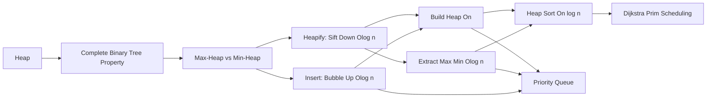

# Chapter 10: Heaps

> **Previous:** [Chapter 9: Binary Search Trees](./09-bst.md) | **Next:** [Graphs](./11-graphs.md)

## Learning Objectives

- Define binary heap properties (structure and order).
- Implement min-heap and max-heap operations.
- Implement heapify and heap sort.
- Use a heap as a priority queue.
- Analyze why Build Heap runs in O(n) time.
- Apply heap-based solutions to classic interview problems.

<!-- Image Gallery -->
<section class="lesson-visuals" aria-label="Visual learning resources">
  <header><span>VISUAL LEARNING</span><h2>See it. Review it. Remember it.</h2></header>
  <a class="lesson-visual-card" href="../../../assets/images/lessons/data-structures/10-heaps/handwritten-notes.svg" target="_blank" rel="noopener">
    
    <span><strong>Handwritten notes</strong>Condensed notes for deliberate review.</span>
  </a>
  <a class="lesson-visual-card" href="../../../assets/images/lessons/data-structures/10-heaps/sticky-notes.svg" target="_blank" rel="noopener">
    
    <span><strong>Sticky-note revision</strong>Fast recall prompts for revision.</span>
  </a>
  <a class="lesson-visual-card" href="../../../assets/images/lessons/data-structures/10-heaps/visual-explanation.svg" target="_blank" rel="noopener">
    
    <span><strong>Visual concept guide</strong>A connected explanation of the key ideas.</span>
  </a>
</section>
<!-- End Image Gallery -->


## Why Heaps Matter

**Real-World Analogy (Hospital ER Triage):** In a hospital emergency room, patients arrive with different severity levels. A heart attack patient needs immediate attention even if 20 people with minor cuts arrived first. A queue (FIFO) would be disastrous → you'd treat in arrival order, letting critical cases wait. A priority queue (heap) solves this: the most critical patient is always treated next, regardless of arrival order. This is exactly what heaps do → they maintain items in a way that the "most important" (highest/lowest priority) is always immediately accessible.

**Real-World Analogy (OS Task Scheduler):** Your operating system manages hundreds of processes. A background disk cleanup should never starve the interactive game you're playing. The OS uses a priority queue (backed by a heap) to ensure high-priority tasks always run before low-priority ones, preempting when necessary. Without heaps, modern multitasking would be impossible.

**The Core Insight:** Heaps combine the speed of array indexing with the structure of binary trees → a complete binary tree stored in a flat array with pointer-free navigation via simple math.

## Chapter at a Glance

| Topic | Key Insight | Practical Takeaway |
|-------|-------------|-------------------|
| Binary Heap | Complete binary tree with heap property | Array storage, no pointers needed |
| Max-Heap | Parent >= children | Root is always the maximum element |
| Min-Heap | Parent &lt;= children | Root is always the minimum element |
| Insert / Extract | Bubble up / sift down O(log n) | Priority queue core operations |
| Build Heap | Bottom-up heapify is O(n) | Faster than inserting n elements |
| Heap Sort | Build + extract repeatedly | In-place O(n log n) sorting |
| Decrease Key | Change priority + bubble up | Required for Dijkstra/Prim |
| Heap vs Others | Binary vs Fibonacci vs Binomial | Trade-off: simplicity vs asymptotic speed |

## Chapter Roadmap



## Theory


### Complete Binary Tree Property


**Real-World Analogy (Seating at a Wedding):** Imagine filling rows of tables from left to right, front to back. Every row must be completely filled before starting the next. No gaps allowed. This is a complete binary tree: all levels are filled except possibly the last, which fills from left to right.

**Definition:** A complete binary tree is a binary tree where every level except possibly the last is completely filled, and all nodes in the last level are as far left as possible.

**Why This Matters:** The completeness guarantees the tree height is always &lfloor;log<sub>2&lt;/sub&gt; n&rfloor; for n nodes. This low height is what gives O(log n) operations. And because there are no gaps, we can store it in a flat array without pointers.

**Array Mapping (0-based indexing):**

For node at index i:
- **Parent:** (i - 1) / 2 (integer division)
- **Left child:** 2 * i + 1
- **Right child:** 2 * i + 2

```
Array indices (0-based):  0    1    2    3    4    5    6
Tree:                    [A]  [B]  [C]  [D]  [E]  [F]  [G]

            A (0)
          /      \
       B(1)       C(2)
      /    \      /   \
    D(3)   E(4)  F(5) G(6)
```

**Key Identifiers:**
- **Leaf range:** from &lfloor;n/2&rfloor; to n-1
- **Last non-leaf node:** &lfloor;n/2&rfloor; - 1
- **Height:** &lfloor;log<sub>2&lt;/sub&gt; n&rfloor;

### Max-Heap / Min-Heap


**Real-World Analogy (Company Hierarchy):** In a well-run company, the CEO (root) is the highest paid. Every manager is paid more than their direct reports. This is a max-heap property: parent >= children. A non-profit might invert this → the lowest-paid intern decides policy → that is a min-heap: parent &lt;= children.

**Definition:**
- **Max-Heap:** For every node i (except root), A[parent(i)] >= A[i]. The root holds the maximum value.
- **Min-Heap:** For every node i (except root), A[parent(i)] &lt;= A[i]. The root holds the minimum value.

**Example Max-Heap (array + tree view):**

```
Array: [50, 30, 40, 10, 20, 35]

          50
        /    \
      30      40
     /  \    /
   10   20  35
```

**Example Min-Heap (array + tree view):**

```
Array: [10, 20, 15, 30, 40, 25]

          10
        /    \
      20      15
     /  \    /
   30   40  25
```

### Heapify (Sift Down) → Restoring Order at One Node


**Real-World Analogy (Boss Reassignment):** Your company reorganizes and promotes a junior employee to CEO. They're terrible at the job (violate the heap property). The board looks at the CEO and their two direct VPs. If either VP is more competent, they swap. Then the demoted CEO is evaluated against their new subordinates. This continues until everyone is at the right level → that is heapify/sift-down.

**Definition:** Heapify ensures the subtree rooted at index i satisfies the heap property, assuming both children are already valid heaps. It compares the node with its children and swaps downward until the property is restored.

**Algorithm Steps (Max-Heapify):**
1. Let largest = i (current node index)
2. Compute left child index: l = 2*i + 1
3. Compute right child index: r = 2*i + 2
4. If l &lt; n and A[l] &gt; A[largest], set largest = l
5. If r &lt; n and A[r] &gt; A[largest], set largest = r
6. If largest != i:
   a. Swap A[i] and A[largest]
   b. Recursively heapify at largest
7. If largest == i, stop (heap property satisfied)

**Pseudocode:**
```
function maxHeapify(A, n, i):
    largest = i
    l = 2 * i + 1
    r = 2 * i + 2

    if l < n and A[l] > A[largest]:
        largest = l
    if r < n and A[r] > A[largest]:
        largest = r

    if largest != i:
        swap(A[i], A[largest])
        maxHeapify(A, n, largest)
```

**Step-by-Step Dry Run → Max-Heapify at Index 0, Array: [4, 10, 3, 5, 1, 7, 9, 2, 8, 6] (n=10)**

| Step | i | A[i] | Left Child (val) | Right Child (val) | largest | Swap? | Array After Swap |
|------|---|------|-----------------|------------------|---------|-------|-----------------|
| 1 | 0 | 4 | idx=1 (10) | idx=2 (3) | 1 | Yes | [10, 4, 3, 5, 1, 7, 9, 2, 8, 6] |
| 2 | 1 | 4 | idx=3 (5) | idx=4 (1) | 3 | Yes | [10, 5, 3, 4, 1, 7, 9, 2, 8, 6] |
| 3 | 3 | 4 | idx=7 (2) | idx=8 (8) | 8 | Yes | [10, 5, 3, 8, 1, 7, 9, 4, 2, 6] |
| 4 | 8 | 4 | idx=17 (OOB) | idx=18 (OOB) | 8 | No | [10, 5, 3, 8, 1, 7, 9, 4, 2, 6] |

**Final heapified subtree at root:** [10, 5, 3, 8, 1, 7, 9, 4, 2, 6]

**C++ Implementation:**
```cpp
void maxHeapify(std::vector<int>& arr, int n, int i) {
    int largest = i;
    int l = 2 * i + 1;
    int r = 2 * i + 2;

    if (l < n && arr[l] > arr[largest])
        largest = l;
    if (r < n && arr[r] > arr[largest])
        largest = r;

    if (largest != i) {
        std::swap(arr[i], arr[largest]);
        maxHeapify(arr, n, largest);
    }
}
```

**Python Implementation:**
```python
def max_heapify(arr, n, i):
    largest = i
    l = 2 * i + 1
    r = 2 * i + 2

    if l < n and arr[l] > arr[largest]:
        largest = l
    if r < n and arr[r] > arr[largest]:
        largest = r

    if largest != i:
        arr[i], arr[largest] = arr[largest], arr[i]
        max_heapify(arr, n, largest)
```

**Java Implementation:**
```java
public static void maxHeapify(int[] arr, int n, int i) {
    int largest = i;
    int l = 2 * i + 1;
    int r = 2 * i + 2;

    if (l < n && arr[l] > arr[largest])
        largest = l;
    if (r < n && arr[r] > arr[largest])
        largest = r;

    if (largest != i) {
        int temp = arr[i];
        arr[i] = arr[largest];
        arr[largest] = temp;
        maxHeapify(arr, n, largest);
    }
}
```

**Complexity Analysis with WHY:**

| Metric | Value | Why |
|--------|-------|-----|
| Time (worst) | O(log n) | Each recursive call moves down one level. Height of complete binary tree is &lfloor;log<sub>2&lt;/sub&gt; n&rfloor;. At most one swap per level. |
| Time (best) | O(1) | If node already satisfies heap property (largest == i), no swaps needed. |
| Space (recursive) | O(log n) | Call stack height equals tree height for recursive version. |
| Space (iterative) | O(1) | Can be implemented iteratively with a while loop. |

**Why O(log n) and not O(n):** The tree property guarantees height = log n. Every swap moves the violation down exactly one level. The number of swaps cannot exceed the height, so it's proportional to log n.

**Advantages & Disadvantages:**

| Advantages | Disadvantages |
|------------|---------------|
| Restores heap property in logarithmic time | Recursive version has O(log n) stack space |
| Simple, elegant recursive formulation | Not cache-optimal → large trees jump through array |
| Works in-place on the array | Only fixes one node's violation per call |
| Both children must already be valid heaps | |

**Edge Cases:**
- **i is a leaf:** l >= n and r >= n, largest stays as i, no swap. This is the base case.
- **i is out of bounds:** Guard with i &lt; n before calling.
- **Only left child exists:** For the last non-leaf node in an odd-sized array, the right child index may be >= n.
- **Single element:** largest == i trivially, no recursion.
- **All equal values:** largest == i always, no swaps. O(1).
- **Floating point comparison with NaN:** NaN comparisons always return false, which can break heapify. Use `isNaN()` checks or replace NaN with sentinel values.

### Build Heap → Transform Array into Heap in O(n)


**Real-World Analogy (Organizing a Department by Seniority):** Instead of hiring one person at a time and re-ranking everyone (O(n log n)), HR sorts all employees once bottom-up. They start with the lowest managers and ensure each team is properly ordered before moving up. By the time they reach the CEO, the whole department is correct → and it took linear time because lower-level teams were already fixed when higher-level re-ranking happened.

**Definition:** Build Heap transforms an arbitrary array into a valid heap by applying heapify to all non-leaf nodes in reverse level order (bottom-up).

**Why Bottom-Up?** Heapify requires both children to already be valid heaps. By starting at the last non-leaf and going upward, we guarantee this pre-condition.

**Algorithm Steps:**
1. Find the last non-leaf node: start = n/2 - 1
2. For i = start down to 0:
   a. Call maxHeapify(arr, n, i)
3. The entire array now satisfies the max-heap property

**Pseudocode:**
```
function buildMaxHeap(A, n):
    for i = n/2 - 1 down to 0:
        maxHeapify(A, n, i)
```

**Step-by-Step Dry Run → Build Max-Heap from [4, 10, 3, 5, 1, 7, 9, 2, 8, 6] (n=10)**

n=10, start = 10/2 - 1 = 4

| Step | i | A[i] | Children | Action | Array After |
|------|---|------|----------|--------|-------------|
| Init | 4 | 1 | idx=9 (6) | | [4, 10, 3, 5, 1, 7, 9, 2, 8, 6] |
| 1 | 4 | 1 | 9(6) OOB | Swap 1↔6 | [4, 10, 3, 5, 6, 7, 9, 2, 8, 1] |
| 2 | 3 | 5 | 7(2) 8(8) | Swap 5↔8 | [4, 10, 3, 8, 6, 7, 9, 5, 2, 1] |
| 3 | 2 | 3 | 5(7) 6(9) | Swap 3↔9 | [4, 10, 9, 8, 6, 7, 3, 5, 2, 1] |
| 4 | 1 | 10 | 3(8) 4(6) | No swap | [4, 10, 9, 8, 6, 7, 3, 5, 2, 1] |
| 5 | 0 | 4 | 1(10) 2(9) | Swap 4↔10 | [10, 4, 9, 8, 6, 7, 3, 5, 2, 1] |
| 6 | i=1 now | 4 | 3(8) 4(6) | Swap 4↔8 | [10, 8, 9, 4, 6, 7, 3, 5, 2, 1] |
| 7 | i=3 now | 4 | 7(5) 8(2) | Swap 4↔5 | [10, 8, 9, 5, 6, 7, 3, 4, 2, 1] |
| 8 | i=7 now | 4 | leaves | No swap | [10, 8, 9, 5, 6, 7, 3, 4, 2, 1] |

**Final Max-Heap:** [10, 8, 9, 5, 6, 7, 3, 4, 2, 1]

```
Visual Tree:
           10
         /    \
        8      9
       / \    / \
      5   6  7   3
     / \  /
    4  2 1
```

**C++ Implementation:**
```cpp
void buildMaxHeap(std::vector<int>& arr) {
    int n = arr.size();
    for (int i = n / 2 - 1; i >= 0; --i) {
        maxHeapify(arr, n, i);
    }
}
```

**Python Implementation:**
```python
def build_max_heap(arr):
    n = len(arr)
    for i in range(n // 2 - 1, -1, -1):
        max_heapify(arr, n, i)
```

**Java Implementation:**
```java
public static void buildMaxHeap(int[] arr) {
    int n = arr.length;
    for (int i = n / 2 - 1; i >= 0; --i) {
        maxHeapify(arr, n, i);
    }
}
```

**Complexity Analysis with WHY:**

| Metric | Value | Why |
|--------|-------|-----|
| Time | O(n) | Mathematical proof below → surprisingly not O(n log n) |
| Space | O(log n) | Recursive heapify call stack (can be O(1) iterative) |

**Why O(n) and not O(n log n)?** This is the most famous proof in heap theory.

- Heapify at a node at height h takes O(h) time.
- Number of nodes at height h in a complete binary tree with n nodes is at most &lceil;n/2<sup>h+1&lt;/sup&gt;&rceil;.
- Build heap work = &sum;<sub>h=0&lt;/sub&gt;<sup>&lfloor;log n&rfloor;</sup> &lceil;n/2<sup>h+1&lt;/sup&gt;&rceil; O(h)
- = O(n &sum;<sub>h=0&lt;/sub&gt;<sup>&infin;</sup> h/2<sup>h&lt;/sup&gt;)
- The infinite series &sum; h/2<sup>h&lt;/sup&gt; converges to 2 (known result: &sum;<sub>k=0&lt;/sub&gt;<sup>&infin;</sup> k/2<sup>k&lt;/sup&gt; = 2).
- Therefore: O(n * 2) = **O(n)**

**Intuition:** Most nodes are near the bottom of the tree (leaves are at height 0). Leaf nodes don't need any heapify work. Nodes just above leaves need at most 1 swap. Only the root (1 node) needs O(log n) work. The total sums to linear.

| Level | Height | Nodes | Work per Node | Work at Level |
|-------|--------|-------|---------------|---------------|
| Leaves | 0 | n/2 | 0 | 0 |
| Above leaves | 1 | n/4 | 1 | n/4 |
| 2 above | 2 | n/8 | 2 | n/4 |
| 3 above | 3 | n/16 | 3 | 3n/16 |
| ... | ... | ... | ... | ... |
| Root | log n | 1 | log n | log n |
| **Total** | | | | **~n** |

**Advantages & Disadvantages:**

| Advantages | Disadvantages |
|------------|---------------|
| O(n) time → faster than inserting n elements (O(n log n)) | In-place on original array (destructive) |
| Simple 3-line loop | Only works if heapify has O(log n) per call |
| Used internally by heap sort and priority queue construction | Sequential access pattern → not cache-optimal for large arrays |

**Edge Cases:**
- **Empty array:** n/2 - 1 = -1, loop doesn't execute. No-op.
- **Single element array:** n/2 - 1 = 0, loop i=0. heapify on leaf does nothing. Valid heap trivially.
- **Already a heap:** heapify calls check and exit early (largest == i). Still O(n) worst-case but cheap per call.
- **All equal values:** No swaps happen, but each heapify still does comparisons. Still O(n).
- **Descending array (5,4,3,2,1):** Already a max-heap. Each heapify exits without swaps but still O(n) comparisons.
- **Ascending array (1,2,3,4,5):** Each heapify will cascade to leaves. This is the worst case but still O(n).

### Insert (Bubble Up / Sift Up)


**Real-World Analogy (New Hire Joining Company):** A new employee joins at the bottom. If they're more competent than their manager, they get promoted (swap upward). This continues until they report to someone more competent. The new employee "bubbles up" to the right level.

**Definition:** Insert adds a new element to the end of the heap array, then repeatedly swaps it with its parent until the heap property is restored.

**Algorithm Steps (Max-Heap Insert):**
1. Add the new element at the end of the array
2. Set i = last index (n-1)
3. While i > 0 and A[parent(i)] &lt; A[i]:
   a. Swap A[i] with A[parent(i)]
   b. Set i = parent(i)

**Pseudocode:**
```
function maxHeapInsert(A, n, value):
    A.append(value)
    i = n   // new element index
    while i > 0 and A[parent(i)] < A[i]:
        swap(A[i], A[parent(i)])
        i = parent(i)
```

**Step-by-Step Dry Run → Insert 12 into Heap [10, 8, 9, 5, 6, 7, 3, 4, 2, 1]**

| Step | i | A[i] | Parent | A[parent] | Swap? | Array After |
|------|---|------|--------|-----------|-------|-------------|
| Init | - | - | - | - | - | [10, 8, 9, 5, 6, 7, 3, 4, 2, 1] + 12 |
| 1 | 10 | 12 | 4 (val=6) | 12 &gt; 6 | Yes | [10, 8, 9, 5, 12, 7, 3, 4, 2, 1, 6] |
| 2 | 4 | 12 | 1 (val=8) | 12 &gt; 8 | Yes | [10, 12, 9, 5, 8, 7, 3, 4, 2, 1, 6] |
| 3 | 1 | 12 | 0 (val=10) | 12 &gt; 10 | Yes | [12, 10, 9, 5, 8, 7, 3, 4, 2, 1, 6] |
| 4 | 0 | 12 | - | - | No | [12, 10, 9, 5, 8, 7, 3, 4, 2, 1, 6] |

**Final Heap:** [12, 10, 9, 5, 8, 7, 3, 4, 2, 1, 6]

```
        12
      /    \
    10      9
   /  \    / \
  5    8  7   3
 / \  / \
4  2 1  6
```

**C++ Implementation:**
```cpp
void insert(int value) {
    heap.push_back(value);
    int i = heap.size() - 1;
    while (i > 0 && heap[(i - 1) / 2] < heap[i]) {
        std::swap(heap[i], heap[(i - 1) / 2]);
        i = (i - 1) / 2;
    }
}
```

**Python Implementation:**
```python
def insert(heap, value):
    heap.append(value)
    i = len(heap) - 1
    while i > 0 and heap[(i - 1) // 2] < heap[i]:
        heap[i], heap[(i - 1) // 2] = heap[(i - 1) // 2], heap[i]
        i = (i - 1) // 2
```

**Java Implementation:**
```java
public void insert(int value) {
    heap.add(value);
    int i = heap.size() - 1;
    while (i > 0 && heap.get((i - 1) / 2) < heap.get(i)) {
        int temp = heap.get(i);
        heap.set(i, heap.get((i - 1) / 2));
        heap.set((i - 1) / 2, temp);
        i = (i - 1) / 2;
    }
}
```

**Complexity Analysis with WHY:**

| Metric | Value | Why |
|--------|-------|-----|
| Time (worst) | O(log n) | New element bubbles up from leaf to root. Path length = tree height = log n. |
| Time (best) | O(1) | New element is already ≤ parent. No swaps. |
| Space | O(1) | In-place swaps, no extra data structures. |

**Advantages & Disadvantages:**

| Advantages | Disadvantages |
|------------|---------------|
| Maintains heap shape → adds at the only valid position for completeness | O(log n) → slower than stack/queue push which are O(1) |
| Simple while loop with clean termination | Array may need to resize (amortized O(1) for vector growth) |
| Works with any comparable type | Does not support bulk insertion (use buildHeap for that) |

**Edge Cases:**
- **Empty heap:** Append to empty array, loop condition i > 0 is false. Works correctly.
- **Single element:** Added at index 1, parent = 0, compare once. O(1).
- **Inserting max value repeatedly:** Each insertion bubbles all the way up. O(log n) each.
- **Inserting min value:** No bubbles. O(1).
- **Duplicate values:** If A[parent] &lt; A[i] is strict, stable behavior. If ≤, boundary case → duplicates may swap unnecessarily.
- **Very large values causing integer overflow:** Parent index computation uses integer arithmetic. For n > 2^31, index overflow is possible.
- **Floating point NaN:** NaN comparisons are false, so NaN will sit at leaf level and never bubble up.

### Extract Max (Extract Min) → Remove and Return Root


**Real-World Analogy (Promoting the Best Performer):** When the CEO resigns, the company needs a replacement. They take the most junior person (last hire) and temporarily put them in the CEO role. If their subordinates are stronger, they swap the weakest up. The strongest rises to CEO → and the former CEO is gone.

**Definition:** Extract Max removes and returns the root (maximum element), replaces it with the last element, and sifts down to restore the heap property.

**Algorithm Steps (Max-Heap Extract):**
1. If heap is empty, throw error
2. Save root value: maxVal = A[0]
3. Replace root with last element: A[0] = A[n-1]
4. Remove last element: pop_back()
5. Sift down from root: maxHeapify(A, n-1, 0)
6. Return maxVal

**Pseudocode:**
```
function extractMax(A, n):
    if n == 0: throw error
    maxVal = A[0]
    A[0] = A[n-1]
    A.pop_back()
    maxHeapify(A, n-1, 0)
    return maxVal
```

**Step-by-Step Dry Run → Extract Max from [12, 10, 9, 5, 8, 7, 3, 4, 2, 1, 6]**

| Step | Action | Array |
|------|--------|-------|
| Init | Heap before extract | [12, 10, 9, 5, 8, 7, 3, 4, 2, 1, 6] |
| 1 | Save maxVal = 12 | [12, 10, 9, 5, 8, 7, 3, 4, 2, 1, 6] |
| 2 | Replace root with last | [6, 10, 9, 5, 8, 7, 3, 4, 2, 1, 12] |
| 3 | Pop last | [6, 10, 9, 5, 8, 7, 3, 4, 2, 1] |
| 4 | Heapify at 0: 6 vs 10,9 → swap 6↔10 | [10, 6, 9, 5, 8, 7, 3, 4, 2, 1] |
| 5 | Heapify at 1: 6 vs 5,8 → swap 6↔8 | [10, 8, 9, 5, 6, 7, 3, 4, 2, 1] |
| 6 | Heapify at 4: 6 vs 2,1 → no swap | [10, 8, 9, 5, 6, 7, 3, 4, 2, 1] |

**Return:** 12
**Final Heap:** [10, 8, 9, 5, 6, 7, 3, 4, 2, 1]

**C++ Implementation:**
```cpp
int extractMax() {
    if (heap.empty()) throw std::out_of_range("Heap is empty");
    int maxVal = heap[0];
    heap[0] = heap.back();
    heap.pop_back();
    if (!heap.empty()) maxHeapify(heap, heap.size(), 0);
    return maxVal;
}
```

**Python Implementation:**
```python
def extract_max(heap):
    if not heap:
        raise IndexError("Heap is empty")
    max_val = heap[0]
    heap[0] = heap[-1]
    heap.pop()
    if heap:
        max_heapify(heap, len(heap), 0)
    return max_val
```

**Java Implementation:**
```java
public int extractMax() {
    if (heap.isEmpty()) throw new RuntimeException("Heap is empty");
    int maxVal = heap.get(0);
    heap.set(0, heap.get(heap.size() - 1));
    heap.remove(heap.size() - 1);
    if (!heap.isEmpty()) maxHeapify(heap, heap.size(), 0);
    return maxVal;
}
```

**Complexity Analysis with WHY:**

| Metric | Value | Why |
|--------|-------|-----|
| Time | O(log n) | Heapify at root after replacement. Root is at height log n. |
| Space | O(log n) (recursive) or O(1) (iterative) | Same as heapify. |

**Advantages & Disadvantages:**

| Advantages | Disadvantages |
|------------|---------------|
| Returns max (or min) in O(1) after extraction | Destroying the heap if you only wanted to peek (use peek() instead) |
| Maintains heap structure after removal | Requires re-heapification which is O(log n) |
| In-place operation | Not suitable for indexed deletion |

**Edge Cases:**
- **Empty heap:** Must throw or return sentinel. Check before access.
- **Single element:** Swap root with itself, pop, no heapify needed. O(1).
- **Two elements:** Root replaced by second element. Heapify checks single child. Simple.
- **All elements equal:** Heapify compares and may swap unnecessarily (depending on strictness). Still O(log n).
- **After many extracts:** Heap shrinks. Array may release memory or may not (vector capacity).

### Decrease Key → Change Priority of Arbitrary Element


**Real-World Analogy (Patient Condition Changes):** In the ER triage, a patient initially classified as "stable" suddenly crashes. Their priority must increase (in a min-heap where lower number = higher priority). The system must find the patient and bubble them up to receive immediate care.

**Definition:** Decrease Key reduces the value of a specific element (in a max-heap) and repositions it by bubbling up. This is critical for Dijkstra's and Prim's algorithms.

**Note:** Standard binary heaps don't support arbitrary key decreases without an auxiliary index map (position map) that tracks each element's array index.

**Algorithm Steps (Max-Heap Decrease Key with Index Map):**
1. Given element index i and new value
2. Assert new value >= old value (increasing key in max-heap)
3. Update A[i] = newValue
4. While i > 0 and A[parent(i)] &lt; A[i]:
   a. Swap with parent
   b. Update position map
   c. i = parent(i)

**Note on direction:** For a max-heap, "increase key" is the natural operation (you increase the value and bubble up). For a min-heap, "decrease key" bubbles up. Dijkstra's uses a min-heap with decreaseKey.

**Pseudocode (Min-Heap Decrease Key):**
```
function decreaseKey(A, posMap, i, newValue):
    if newValue > A[i]: throw error (can only decrease)
    A[i] = newValue
    while i > 0 and A[parent(i)] > A[i]:
        swap(A[i], A[parent(i)])
        update posMap for i and parent(i)
        i = parent(i)
```

**Step-by-Step Dry Run → Decrease Key at index 7 in Min-Heap [1, 3, 2, 7, 6, 4, 5, 15, 9, 8] from 15 to 0**

This is a min-heap. Decreasing 15 to 0 at index 7.

| Step | i | A[i] (new=0) | Parent | Comp | Swap? | Array After |
|------|---|-------------|--------|------|-------|-------------|
| Init | 7 | 0 | 3 (val=7) | 0 &lt; 7 | Yes | [1, 3, 2, 0, 6, 4, 5, 7, 9, 8] |
| 1 | 3 | 0 | 1 (val=3) | 0 &lt; 3 | Yes | [1, 0, 2, 3, 6, 4, 5, 7, 9, 8] |
| 2 | 1 | 0 | 0 (val=1) | 0 &lt; 1 | Yes | [0, 1, 2, 3, 6, 4, 5, 7, 9, 8] |
| 3 | 0 | 0 | - | - | No | [0, 1, 2, 3, 6, 4, 5, 7, 9, 8] |

**Final Min-Heap:** [0, 1, 2, 3, 6, 4, 5, 7, 9, 8]

**C++ Implementation (with position map for Dijkstra):**
```cpp
void decreaseKey(int i, int newVal) {
    if (newVal > heap[i]) return; // only decrease in min-heap
    heap[i] = newVal;
    while (i > 0 && heap[(i - 1) / 2] > heap[i]) {
        std::swap(heap[i], heap[(i - 1) / 2]);
        posMap[heap[i]] = i;
        posMap[heap[(i - 1) / 2]] = (i - 1) / 2;
        i = (i - 1) / 2;
    }
}
```

**Python Implementation:**
```python
def decrease_key(heap, pos_map, i, new_val):
    if new_val > heap[i]:
        return  # only decrease in min-heap
    heap[i] = new_val
    while i > 0 and heap[(i - 1) // 2] > heap[i]:
        heap[i], heap[(i - 1) // 2] = heap[(i - 1) // 2], heap[i]
        pos_map[heap[i]] = i
        pos_map[heap[(i - 1) // 2]] = (i - 1) // 2
        i = (i - 1) // 2
```

**Java Implementation:**
```java
public void decreaseKey(int i, int newVal) {
    if (newVal > heap.get(i)) return;
    heap.set(i, newVal);
    while (i > 0 && heap.get((i - 1) / 2) > heap.get(i)) {
        int temp = heap.get(i);
        heap.set(i, heap.get((i - 1) / 2));
        heap.set((i - 1) / 2, temp);
        posMap.put(heap.get(i), i);
        posMap.put(heap.get((i - 1) / 2), (i - 1) / 2);
        i = (i - 1) / 2;
    }
}
```

**Complexity Analysis with WHY:**

| Metric | Value | Why |
|--------|-------|-----|
| Time | O(log n) | Bubble up from arbitrary position → at most tree height swaps. |
| Space | O(1) | In-place swaps. |
| Index map update | O(1) | Hash map or array for position tracking. |

**Advantages & Disadvantages:**

| Advantages | Disadvantages |
|------------|---------------|
| Enables Dijkstra/Prim O((V+E) log V) | Requires position map → extra O(n) space |
| Reuses bubble-up logic | Position map must stay in sync on every swap |
| Single-pass bubble up | Standard library heaps don't support it |

**Edge Cases:**
- **New value violates heap direction:** Decreasing in max-heap (or increasing in min-heap) requires sift-down, not bubble-up. Know which direction your heap supports.
- **Index out of bounds:** Validate i &lt; n before access.
- **No change (same value):** Loop condition false, O(1).
- **New value becomes extreme (new global max/min):** Bubbles all the way to root. O(log n).
- **Position map synchronization:** Every swap in sift-up AND sift-down must update positions.

### Heap Sort → Sorting with a Binary Heap


**Real-World Analogy (Flipping Tournament Rankings):** In a knockout tournament, the winner (root) is removed. The last-placed player fills in, and a mini-tournament (heapify) determines the new winner. Recording winners in reverse order gives the sorted ranking.

**Definition:** Heap Sort sorts an array in-place by first building a max-heap, then repeatedly swapping the root (maximum) with the last element and reducing the heap size.

**Algorithm Steps:**
1. Build max-heap from array (O(n))
2. For i = n-1 down to 1:
   a. Swap A[0] with A[i] (move max to sorted position)
   b. Reduce heap size to i
   c. Heapify at root (A[0..i-1])

**Pseudocode:**
```
function heapSort(A, n):
    buildMaxHeap(A, n)
    for i = n-1 down to 1:
        swap(A[0], A[i])
        maxHeapify(A, i, 0)
```

**Step-by-Step Dry Run → Heap Sort on [4, 10, 3, 5, 1]**

**Phase 1: Build Max-Heap**

| Step | i | Action | Array |
|------|---|--------|-------|
| Init | - | Starting array | [4, 10, 3, 5, 1] |
| 1 | 1 | Heapify idx 1: 10 > 5,1 → no swap | [4, 10, 3, 5, 1] |
| 2 | 0 | Heapify idx 0: 4 &lt; 10 → swap 4↔10 | [10, 4, 3, 5, 1] |
| 3 | 1 | Heapify idx 1: 4 &lt; 5 → swap 4↔5 | [10, 5, 3, 4, 1] |

**Max-Heap:** [10, 5, 3, 4, 1]

**Phase 2: Extract Repeatedly**

| Step | i | Swap | Heapify at 0 | Array |
|------|---|------|-------------|-------|
| Init | - | - | - | [10, 5, 3, 4, 1] |
| 1 | 4 | 10↔1 | 1 vs 5,3 → 1↔5 | [5, 4, 3, 1, \| 10] |
| 2 | 3 | 5↔1 | 1 vs 4,3 → 1↔4 | [4, 1, 3, \| 5, 10] |
| 3 | 2 | 4↔3 | 3 vs 1 → no swap | [3, 1, \| 4, 5, 10] |
| 4 | 1 | 3↔1 | 1 → no children | [1, \| 3, 4, 5, 10] |

**Sorted:** [1, 3, 4, 5, 10]

**C++ Implementation:**
```cpp
void heapSort(std::vector<int>& arr) {
    int n = arr.size();
    for (int i = n / 2 - 1; i >= 0; --i)
        maxHeapify(arr, n, i);
    for (int i = n - 1; i > 0; --i) {
        std::swap(arr[0], arr[i]);
        maxHeapify(arr, i, 0);
    }
}
```

**Python Implementation:**
```python
def heap_sort(arr):
    n = len(arr)
    for i in range(n // 2 - 1, -1, -1):
        max_heapify(arr, n, i)
    for i in range(n - 1, 0, -1):
        arr[0], arr[i] = arr[i], arr[0]
        max_heapify(arr, i, 0)
```

**Java Implementation:**
```java
public static void heapSort(int[] arr) {
    int n = arr.length;
    for (int i = n / 2 - 1; i >= 0; --i)
        maxHeapify(arr, n, i);
    for (int i = n - 1; i > 0; --i) {
        int temp = arr[0];
        arr[0] = arr[i];
        arr[i] = temp;
        maxHeapify(arr, i, 0);
    }
}
```

**Complexity Analysis with WHY:**

| Metric | Value | Why |
|--------|-------|-----|
| Time (all cases) | O(n log n) | Build O(n) + n extracts × O(log n) heapify each = O(n) + O(n log n) = O(n log n) |
| Space | O(1) | In-place sorting, only a few variables |
| Stability | Not stable | Equal elements' relative order is NOT preserved |
| Adaptive | No | Same O(n log n) regardless of input order |

**Why O(n log n) always?** Unlike quicksort (O(n²) worst case) or insertion sort (O(n²)), heap sort has no worst-case degradation. Every extract applies heapify from root to leaf, always log n depth, regardless of input distribution.

**Advantages & Disadvantages:**

| Advantages | Disadvantages |
|------------|---------------|
| O(n log n) worst-case guaranteed | Not stable → equal elements may reorder |
| In-place → O(1) extra space | Cache performance is poor (jumping through array) |
| No worst-case degeneration like quicksort | Slower in practice than quicksort for most data |
| Simple and predictable | Not adaptive → doesn't exploit partially sorted data |

**Edge Cases:**
- **Empty array:** Build heap and extraction loops don't execute. No-op.
- **Single element:** Build heap runs i=0 (leaf), no-op. Extraction loop doesn't execute. Array unchanged. Correct.
- **Already sorted (ascending):** Build heap rearranges it. Still O(n log n).
- **Reverse sorted (descending):** Already a max-heap. Build heap is O(n). Extractions move max each time. O(n log n).
- **All equal elements:** Build heap does nothing. Each extraction swaps equal elements. O(n log n).
- **Very large arrays (n > 2^31):** Integer overflow in index computation. Use size_t in C++.

### Heap as a Priority Queue


**Real-World Analogy (Airport Boarding):** First class boards before economy. Passengers with disabilities board first. Military personnel board next. This is a priority queue → each passenger has a priority, and the highest-priority group is served regardless of when they arrived at the gate.

**Definition:** A priority queue is an abstract data type where each element has a priority. The element with the highest (or lowest) priority is always dequeued first. A binary heap is the classic implementation.

**Core Interface:**
- `push(element)` → Insert with priority. O(log n)
- `pop()` → Remove highest-priority element. O(log n)
- `top()` → Peek at highest-priority element. O(1)
- `empty()` → Check if empty. O(1)
- `size()` → Number of elements. O(1)

**C++ (using STL):**
```cpp
#include <queue>
#include <vector>

// Max-heap priority queue (default)
std::priority_queue<int> maxPQ;
maxPQ.push(10); maxPQ.push(30); maxPQ.push(20);
std::cout << maxPQ.top();  // 30

// Min-heap priority queue
std::priority_queue<int, std::vector<int>, std::greater<int>> minPQ;
minPQ.push(10); minPQ.push(30); minPQ.push(20);
std::cout << minPQ.top();  // 10
```

**Python:**
```python
import heapq

# Min-heap (Python's heapq is a min-heap)
heap = []
heapq.heappush(heap, 10)
heapq.heappush(heap, 30)
heapq.heappush(heap, 20)
print(heap[0])       # 10 (peek)
print(heapq.heappop(heap))  # 10 (extract)

# Max-heap via negation
max_heap = []
heapq.heappush(max_heap, -10)
heapq.heappush(max_heap, -30)
heapq.heappush(max_heap, -20)
print(-max_heap[0])        # 30
```

**Java:**
```java
import java.util.PriorityQueue;
import java.util.Collections;

// Min-heap (default)
PriorityQueue<Integer> minPQ = new PriorityQueue<>();
minPQ.offer(10); minPQ.offer(30); minPQ.offer(20);
System.out.println(minPQ.peek());  // 10

// Max-heap
PriorityQueue<Integer> maxPQ = new PriorityQueue<>(Collections.reverseOrder());
maxPQ.offer(10); maxPQ.offer(30); maxPQ.offer(20);
System.out.println(maxPQ.peek());  // 30
```

**Complexity Analysis with WHY:**

| Operation | Time | Why |
|-----------|------|-----|
| push | O(log n) | Insert at end + bubble up |
| pop | O(log n) | Replace root + sift down |
| top | O(1) | Array index 0 |
| empty/size | O(1) | Track length counter |

**Advantages & Disadvantages as a PQ Implementation:**

| Advantages | Disadvantages |
|------------|---------------|
| Simple array-based, no pointers | Doesn't support merge (O(n) to merge two heaps) |
| O(1) min/max access | No decreaseKey without auxiliary structures |
| Space efficient → no per-node overhead | Not thread-safe without locks |
| Built into all standard libraries | Cannot search for arbitrary elements efficiently |

**Edge Cases:**
- **Empty pop:** Must check before calling. Most libraries throw or return undefined.
- **Custom comparators:** Must be consistent (strict weak ordering in C++, total order in Java).
- **Mutable elements:** If element priority changes after insertion, heap property breaks.
- **null/none elements:** Most implementations don't allow null (Python's heapq doesn't support comparison with None naturally).

## Concept Comparison Table

| Feature | Binary Heap | BST | Sorted Array |
|---------|-------------|-----|--------------|
| Insert | O(log n) | O(log n) avg | O(n) |
| Extract min | O(log n) | O(log n) avg | O(1) |
| Find min | O(1) | O(log n) (leftmost) | O(1) |
| Search | O(n) | O(log n) avg | O(log n) |
| Find max | O(1) | O(log n) (rightmost) | O(1) |
| Merge | O(n) | O(n) | O(n) |
| In-place sort | O(n log n) | O(n log n) | Already sorted |
| Space overhead | O(1) (no pointers) | O(n) (pointers) | O(1) |

## Quick Reference: Heap Array Indexing

| Operation | Formula | Example (n=7, 0-based) |
|-----------|---------|----------------------|
| Parent of i | (i-1)/2 | i=5 → parent=2 |
| Left child of i | 2i+1 | i=1 → left=3 |
| Right child of i | 2i+2 | i=1 → right=4 |
| Leaf range | n/2 to n-1 | 3 to 6 |
| Last non-leaf | n/2 - 1 | 2 |

## Binary Heap vs Fibonacci Heap vs Binomial Heap

| Feature | Binary Heap | Fibonacci Heap | Binomial Heap |
|---------|-------------|---------------|---------------|
| **Structure** | Complete binary tree in array | Collection of heap-ordered trees | Collection of binomial trees |
| **Insert** | O(log n) | O(1) amortized | O(log n) |
| **Extract Min** | O(log n) | O(log n) amortized | O(log n) |
| **Decrease Key** | O(log n) | O(1) amortized | O(log n) |
| **Merge** | O(n) | O(1) amortized | O(log n) |
| **Find Min** | O(1) | O(1) | O(log n) |
| **Space per element** | 3 words (array slot) | ~8 words (parent, child, sibling, mark, degree, key) | ~5 words (parent, sibling, child, degree, key) |
| **Implementation Complexity** | Simple (50 lines) | Very complex (500+ lines) | Moderate (200+ lines) |
| **Practical Use** | Standard library PQs, heap sort | Rarely used in practice (high constants) | Rare (educational value) |
| **Cache Performance** | Excellent (sequential array) | Poor (pointer chasing) | Poor (pointer chasing) |

**Takeaway:** Binary heap is the right choice for 99% of applications. Fibonacci heap only wins when you need extremely many decreaseKey operations (e.g., very dense graphs in Dijkstra) and can tolerate the implementation complexity.

## Cross-Application Matrix

| Algorithm | Heap Use | Complexity Impact |
|-----------|----------|-------------------|
| Dijkstra's shortest path | Extract min, decreaseKey | O((V+E) log V) with binary heap |
| Prim's MST | Extract min, decreaseKey | O((V+E) log V) with binary heap |
| Heap sort | Build → extract all | O(n log n) |
| K-way merge | Build heap of k elements | O(k + n log k) |
| Median finder | Max-heap + min-heap | O(log n) per insert |

## Interview Corner

These problems appear at Google, Amazon, Microsoft, Meta, and other top tech companies.

### Problem 1: Merge k Sorted Lists

**Problem:** Given k sorted linked lists, merge them into one sorted list.

**Solution:** Use a min-heap of size k. Insert the first element of each list. Repeatedly extract min from heap, add to result, and insert the next element from the list that contributed the extracted element.

**Algorithm:**
1. Create a min-heap (priority queue)
2. Insert the head of each of the k lists into the heap
3. While heap is not empty:
   a. Extract the minimum node from heap (the node, not just value)
   b. Append it to the result list
   c. If the extracted node has a next node, insert that next node into the heap

**Complexity:** O(n log k) where n is total elements across all lists, k is number of lists. Space: O(k) for the heap.

**C++ Implementation:**
```cpp
struct ListNode {
    int val;
    ListNode* next;
    ListNode(int x) : val(x), next(nullptr) {}
};

struct Compare {
    bool operator()(ListNode* a, ListNode* b) {
        return a->val > b->val;  // min-heap
    }
};

ListNode* mergeKLists(std::vector<ListNode*>& lists) {
    std::priority_queue<ListNode*, std::vector<ListNode*>, Compare> pq;
    for (auto* list : lists)
        if (list) pq.push(list);

    ListNode dummy(0), *tail = &dummy;
    while (!pq.empty()) {
        auto* node = pq.top(); pq.pop();
        tail->next = node;
        tail = node;
        if (node->next) pq.push(node->next);
    }
    return dummy.next;
}
```

### Problem 2: Top K Frequent Elements

**Problem:** Given an integer array nums and an integer k, return the k most frequent elements.

**Solution:** Build a frequency map, then use a min-heap of size k to track the top k frequent elements.

**Algorithm:**
1. Count frequencies using a hash map
2. For each (element, frequency) pair:
   a. Push into a min-heap of size k
   b. If heap size > k, pop the smallest
3. Extract all elements from heap

**Complexity:** O(n log k) where n is the array length, k is the number of top elements. Space: O(n + k).

**C++ Implementation:**
```cpp
std::vector<int> topKFrequent(std::vector<int>& nums, int k) {
    std::unordered_map<int, int> freq;
    for (int n : nums) freq[n]++;

    // Min-heap of {frequency, element}
    std::priority_queue<std::pair<int,int>, std::vector<std::pair<int,int>>, std::greater<>> pq;
    for (auto& [num, count] : freq) {
        pq.push({count, num});
        if (pq.size() > k) pq.pop();
    }

    std::vector<int> result;
    while (!pq.empty()) {
        result.push_back(pq.top().second);
        pq.pop();
    }
    return result;
}
```

### Problem 3: Find Median from Data Stream

**Problem:** Design a data structure that supports adding numbers and finding the median in O(log n) per operation.

**Solution:** Two-heap approach. Maintain a max-heap for the lower half and a min-heap for the upper half. Balance so the lower half has either the same number or one more element than the upper half.

**Algorithm:**
1. Insert: Add to max-heap (lower half), then balance
2. If max-heap size > min-heap size + 1, move max of lower to upper
3. If min-heap size > max-heap size, move min of upper to lower
4. Find Median:
   - If lower half has more elements: return max-heap top
   - If equal size: return (max-heap top + min-heap top) / 2

**Complexity:** O(log n) per insert, O(1) for median retrieval. Space: O(n).

**C++ Implementation:**
```cpp
class MedianFinder {
    std::priority_queue<int> lower;  // max-heap
    std::priority_queue<int, std::vector<int>, std::greater<int>> upper;  // min-heap
public:
    void addNum(int num) {
        lower.push(num);
        upper.push(lower.top()); lower.pop();
        if (lower.size() < upper.size()) {
            lower.push(upper.top()); upper.pop();
        }
    }
    double findMedian() {
        if (lower.size() > upper.size())
            return lower.top();
        return (lower.top() + upper.top()) / 2.0;
    }
};
```

### Problem 4: Kth Largest Element in an Array

**Problem:** Find the kth largest element in an unsorted array.

**Solution:** Use a min-heap of size k. For each element, push it. If heap size exceeds k, pop the smallest. After processing all elements, the root is the kth largest.

**Complexity:** O(n log k) time, O(k) space.

**C++ Implementation:**
```cpp
int findKthLargest(std::vector<int>& nums, int k) {
    std::priority_queue<int, std::vector<int>, std::greater<int>> minHeap;
    for (int num : nums) {
        minHeap.push(num);
        if (minHeap.size() > k) minHeap.pop();
    }
    return minHeap.top();
}
```

### Problem 5: Sort a Nearly Sorted Array (K-Sorted Array)

**Problem:** Given an array where each element is at most k positions away from its sorted position, sort the array efficiently.

**Solution:** Use a min-heap of size k+1. Sliding window approach.

**Algorithm:**
1. Build a min-heap with the first k+1 elements
2. For i = 0 to n-1:
   a. Extract min from heap → place at arr[i]
   b. If there's a next element (i + k + 1 &lt; n), push it into heap

**Complexity:** O(n log k) time, O(k) space. When k is small (like 1 or 2), this is nearly O(n).

**C++ Implementation:**
```cpp
void sortNearlySorted(std::vector<int>& arr, int k) {
    std::priority_queue<int, std::vector<int>, std::greater<int>> minHeap;
    for (int i = 0; i <= k && i < arr.size(); ++i)
        minHeap.push(arr[i]);

    int idx = 0;
    for (int i = k + 1; i < arr.size(); ++i) {
        arr[idx++] = minHeap.top(); minHeap.pop();
        minHeap.push(arr[i]);
    }
    while (!minHeap.empty()) {
        arr[idx++] = minHeap.top(); minHeap.pop();
    }
}
```

## Applications in Real Systems

### Dijkstra's Shortest Path Algorithm
- **Problem:** Find shortest path from source to all vertices in a weighted graph.
- **Heap role:** Min-heap stores {distance, vertex} pairs. Extract min gives the nearest unvisited vertex. Decrease key updates distances when a shorter path is found.
- **Complexity:** O((V+E) log V) with binary heap. Without heap: O(V²).

### Prim's Minimum Spanning Tree
- **Problem:** Find the MST connecting all vertices with minimum total edge weight.
- **Heap role:** Min-heap stores edges by weight. Extract min picks the cheapest edge connecting the MST to an unvisited vertex.
- **Complexity:** O((V+E) log V) with binary heap.

### CPU Scheduling (OS Kernels)
- **Problem:** The OS must decide which process/thread to run next when the CPU becomes available.
- **Heap role:** Ready queue is a priority queue. Highest-priority process runs next. Linux's Completely Fair Scheduler uses a red-black tree, but many RTOS kernels use heaps for fixed-priority preemptive scheduling.
- **Why a heap:** O(1) peek for highest priority, O(log n) insertion and extraction.

### Huffman Coding (File Compression)
- **Problem:** Build an optimal prefix-free binary code for lossless compression.
- **Heap role:** Min-heap stores character frequencies. Repeatedly extract the two smallest frequencies, merge, and reinsert. This builds the Huffman tree.
- **Complexity:** O(n log n) where n is the number of unique characters.

### K-Way Merge (External Sorting, Databases)
- **Problem:** Merge k sorted runs into one sorted output. Used in external sorting (mergesort phase) and database query execution.
- **Heap role:** Min-heap of k elements (one from each run). Extract min, add to output, refill from the same run.
- **Why this matters in databases:** Database queries often need to merge multiple sorted intermediate results. PostgreSQL, MySQL, and SQLite use heap-based k-way merge in their query execution engines.

### Event-Driven Simulation
- **Problem:** Future Event Set (FES) in discrete event simulation. Events trigger at specific future times.
- **Heap role:** Min-heap keyed by event time. Always process the earliest pending event next.
- **Used in:** Network simulators (ns-3), circuit simulators (SPICE), game engines.

## Pro Tips

> **Pro Tip:** The two-heap median finder (max-heap for lower half, min-heap for upper half) is a classic interview problem that showcases the power of pairing opposite heaps together.

- **Building a heap is O(n), not O(n log n):** The trick is percolate-down (heapify) starting from the last non-leaf node. Percolate-up from each element would be O(n log n). Always use bottom-up construction.
- **Heap sort is in-place but not stable:** The relative order of equal elements is not preserved. Use merge sort if stability is required.
- **Median finder with two heaps:** Maintain a max-heap for the lower half and a min-heap for the upper half. Insert in O(log n); the median is the max-heap's root (or average of both roots) in O(1).
- **decreaseKey in Dijkstra:** To implement Dijkstra's algorithm efficiently, you need a priority queue that supports priority updates. A binary heap with an index array mapping vertex → heap position enables O(log n) decreaseKey.
- **Fibonacci heap trade-off:** O(1) amortized decreaseKey and insert, but high constant factors and complex implementation. Binary heap is preferred in practice.
- **Python's heapq is a min-heap:** For max-heap, negate values. For custom objects, store (−priority, object) tuples.
- **Java's PriorityQueue is a min-heap by default:** Use `Collections.reverseOrder()` for max-heap.

## One-Sentence Takeaways

- Heaps are complete binary trees stored implicitly in arrays with O(log n) insert and extract.
- Max-heap: parent ≥ children; min-heap: parent ≤ children.
- Building a heap from an array is O(n) using bottom-up heapify.
- Heap sort sorts in place in O(n log n) time with no worst-case degradation.
- Priority queues are typically implemented with binary heaps.
- Two heaps can maintain running median in O(log n) per insertion.
- Decrease key enables Dijkstra and Prim's algorithms.
- Binary heap is the practical choice over Fibonacci/binomial heaps for nearly all applications.

## Common Mistakes & GFG Deepening

### Common Mistakes (GFG-Style)

| Mistake | Why It's Wrong | Correct Approach |
|---------|----------------|------------------|
| Using 0-based indexing but computing children as 2i+2 instead of 2i+1 for right child | Wrong child index leads to out-of-bounds access or missing elements | Left = 2i+1, Right = 2i+2, Parent = ⌊(i-1)/2⌋ for 0-based |
| Heapify only at root instead of bottom-up from last non-leaf | Single heapify call cannot propagate violations from deeper levels | Call heapify from index ⌊n/2⌋-1 down to 0 for buildHeap |
| Forgetting to float up (bubble up) during heap insert | Inserting at the end and not heapifying up leaves heap property broken | While new element > parent, swap (for max-heap) |
| Confusing min-heap and max-heap comparator direction | Using `<` instead of `>` swaps the heap type entirely | For max-heap: parent ≥ children; for min-heap: parent ≤ children |
| Heap sort: building heap correctly but forgetting to reduce heap size during extraction | Sorted portion overwrites unsorted elements | After swapping root with last, call heapify on reduced range [0, i-1] |
| Implementing decreaseKey without sifting up | Decreasing a key may make it smaller than its parent (min-heap) → violation | After decreasing key, sift up toward root |
| Not handling duplicate values correctly in heap | Extract/delete operations may leave wrong element at root | Stabilize by also tracking insertion order or index |

### TypeScript Heap Implementation

```typescript
class MinHeap {
    private heap: number[] = [];

    private parent(i: number): number { return Math.floor((i - 1) / 2); }
    private left(i: number): number { return 2 * i + 1; }
    private right(i: number): number { return 2 * i + 2; }

    private swap(i: number, j: number): void {
        [this.heap[i], this.heap[j]] = [this.heap[j], this.heap[i]];
    }

    insert(val: number): void {
        this.heap.push(val);
        this.siftUp(this.heap.length - 1);
    }

    private siftUp(i: number): void {
        while (i > 0 && this.heap[this.parent(i)] > this.heap[i]) {
            this.swap(i, this.parent(i));
            i = this.parent(i);
        }
    }

    extractMin(): number | undefined {
        if (this.heap.length === 0) return undefined;
        if (this.heap.length === 1) return this.heap.pop();
        const min = this.heap[0];
        this.heap[0] = this.heap.pop()!;
        this.siftDown(0);
        return min;
    }

    private siftDown(i: number): void {
        const n = this.heap.length;
        let smallest = i;
        const l = this.left(i);
        const r = this.right(i);
        if (l < n && this.heap[l] < this.heap[smallest]) smallest = l;
        if (r < n && this.heap[r] < this.heap[smallest]) smallest = r;
        if (smallest !== i) {
            this.swap(i, smallest);
            this.siftDown(smallest);
        }
    }

    buildHeap(arr: number[]): void {
        this.heap = [...arr];
        for (let i = Math.floor(this.heap.length / 2) - 1; i >= 0; i--) {
            this.siftDown(i);
        }
    }

    peek(): number | undefined { return this.heap[0]; }
    size(): number { return this.heap.length; }
    isEmpty(): boolean { return this.heap.length === 0; }
}

class MaxHeap {
    private heap: number[] = [];

    private parent(i: number): number { return Math.floor((i - 1) / 2); }
    private left(i: number): number { return 2 * i + 1; }
    private right(i: number): number { return 2 * i + 2; }

    private swap(i: number, j: number): void {
        [this.heap[i], this.heap[j]] = [this.heap[j], this.heap[i]];
    }

    insert(val: number): void {
        this.heap.push(val);
        this.siftUp(this.heap.length - 1);
    }

    private siftUp(i: number): void {
        while (i > 0 && this.heap[this.parent(i)] < this.heap[i]) {
            this.swap(i, this.parent(i));
            i = this.parent(i);
        }
    }

    extractMax(): number | undefined {
        if (this.heap.length === 0) return undefined;
        if (this.heap.length === 1) return this.heap.pop();
        const max = this.heap[0];
        this.heap[0] = this.heap.pop()!;
        this.siftDown(0);
        return max;
    }

    private siftDown(i: number): void {
        const n = this.heap.length;
        let largest = i;
        const l = this.left(i);
        const r = this.right(i);
        if (l < n && this.heap[l] > this.heap[largest]) largest = l;
        if (r < n && this.heap[r] > this.heap[largest]) largest = r;
        if (largest !== i) {
            this.swap(i, largest);
            this.siftDown(largest);
        }
    }

    buildHeap(arr: number[]): void {
        this.heap = [...arr];
        for (let i = Math.floor(this.heap.length / 2) - 1; i >= 0; i--) {
            this.siftDown(i);
        }
    }

    peek(): number | undefined { return this.heap[0]; }
    size(): number { return this.heap.length; }
    isEmpty(): boolean { return this.heap.length === 0; }
}

// Heap Sort
function heapSort(arr: number[]): number[] {
    const heap = new MaxHeap();
    heap.buildHeap(arr);
    const result: number[] = [];
    while (heap.size() > 0) {
        result.push(heap.extractMax()!);
    }
    return result;
}

// Priority Queue with generics
class PriorityQueue<T> {
    private heap: { priority: number; item: T }[] = [];

    enqueue(item: T, priority: number): void {
        this.heap.push({ priority, item });
        this.siftUp(this.heap.length - 1);
    }

    dequeue(): T | undefined {
        if (this.heap.length === 0) return undefined;
        if (this.heap.length === 1) return this.heap.pop()!.item;
        const min = this.heap[0].item;
        this.heap[0] = this.heap.pop()!;
        this.siftDown(0);
        return min;
    }

    private siftUp(i: number): void {
        const p = (i) => Math.floor((i - 1) / 2);
        const heap = this.heap;
        while (i > 0 && heap[p(i)].priority > heap[i].priority) {
            [heap[i], heap[p(i)]] = [heap[p(i)], heap[i]];
            i = p(i);
        }
    }

    private siftDown(i: number): void {
        const n = this.heap.length;
        const heap = this.heap;
        let smallest = i;
        const l = 2 * i + 1;
        const r = 2 * i + 2;
        if (l < n && heap[l].priority < heap[smallest].priority) smallest = l;
        if (r < n && heap[r].priority < heap[smallest].priority) smallest = r;
        if (smallest !== i) {
            [heap[i], heap[smallest]] = [heap[smallest], heap[i]];
            this.siftDown(smallest);
        }
    }

    isEmpty(): boolean { return this.heap.length === 0; }
    size(): number { return this.heap.length; }
}
```

### Additional MCQs (GFG Pattern)

8. **What is the index of the right child of node at index 3 in a 0-based heap?**
   - a) 6
   - b) 7 ✓ (2*3 + 2 = 8... wait. 2*3+2 = 8). Let me recalculate. Right child = 2i + 2 = 2*3 + 2 = 8. So d) 8.
   - a) 7
   - b) 9
   - c) 6
   - d) 8 ✓

   Let me use clean MCQs:
8. **In a min-heap with distinct elements, which element is the global minimum?**
   - a) Any leaf
   - b) The root ✓
   - c) The last element
   - d) The middle element

9. **What is the time complexity of heapify (percolate down) for a single node?**
   - a) O(1)
   - b) O(log n) ✓
   - c) O(n)
   - d) O(n log n)

10. **Heap sort has a worst-case time complexity of:**
    - a) O(1)
    - b) O(n)
    - c) O(n log n) ✓
    - d) O(n²)

11. **Which of the following is NOT true about a heap?**
    - a) It is a complete binary tree
    - b) Searching for an arbitrary element is O(log n) ✓ (it's O(n))
    - c) The largest element is at the root in a max-heap
    - d) Insert operation takes O(log n)

12. **The buildHeap operation (heapify from last non-leaf to root) is O(n). Which bound is used to prove this?**
    - a) The sum of heights of all nodes is O(n) ✓
    - b) Each heapify is O(1)
    - c) The tree is always balanced
    - d) There are log n calls

13. **Merging two binary heaps of size n each into one heap takes:**
    - a) O(1)
    - b) O(log n)
    - c) O(n) ✓ (buildHeap on n+m elements)
    - d) O(n log n)

**Answers:** 8-b, 9-b, 10-c, 11-b, 12-a, 13-c

### Additional Exercises (GFG Pattern)

12. **Kth largest element in a stream**: Given an infinite stream of integers, find the kth largest element at any point. Use a min-heap of size k.

13. **Merge k sorted arrays**: Given k sorted arrays, merge them into a single sorted array efficiently using a min-heap.

14. **Sliding window median**: Find the median of each window of size k in a stream. Use two heaps (max-heap for left, min-heap for right).

15. **Maximum distinct elements after removing k elements**: Given an array and a number k, remove k elements to maximize the number of distinct elements. Use frequency map + min-heap.

16. **K closest points to origin**: Given an array of points, find the k closest points to the origin (0, 0). Use a max-heap of size k.

17. **Minimum sum of two numbers formed from digits**: Given an array of digits, form two numbers whose sum is minimum. Use a min-heap to distribute digits alternately.

18. **Connect ropes with minimum cost (revisited with heap)**: Use a min-heap to always connect the two smallest ropes, accumulating the total cost.

19. **Rearrange string such that no two adjacent characters are same**: Use a max-heap of character frequencies to place the most frequent character first.

20. **Task scheduler**: Given tasks and a cooldown period n, find the minimum time to complete all tasks. Use frequency counting + max-heap.

21. **Design a MedianFinder**: Support `addNum` and `findMedian` with two heaps in O(log n) and O(1) respectively.

22. **Top k frequent words**: Given a list of words, return the k most frequent words sorted by frequency (desc) then lexicographically. Use hash map + min-heap.

### Heap Variants Comparison

| Property | Binary Heap | Binomial Heap | Fibonacci Heap | Pairing Heap |
|----------|-------------|---------------|----------------|--------------|
| Insert | O(log n) | O(log n) | O(1) | O(1) |
| Extract-Min | O(log n) | O(log n) | O(log n) | O(log n) |
| Decrease-Key | O(log n) | O(log n) | O(1)* amortized | O(log n) |
| Merge | O(n) | O(log n) | O(1) | O(1) |
| Build-Heap | O(n) | O(n) | O(n) | O(n) |
| Find-Min | O(1) | O(log n) | O(1) | O(1) |
| Space per node | 3 words | 4+ words | 4+ words (with mark) | 3 pointers |
| Practical | Very common | Rare | Rare (complex) | Moderate |

### Heap Applications in Real Systems

```typescript
// Dijkstra's shortest path using priority queue
type Edge = { to: number; weight: number };

function dijkstra(graph: Edge[][], start: number): number[] {
    const n = graph.length;
    const dist = new Array(n).fill(Infinity);
    const pq = new PriorityQueue<number>();
    dist[start] = 0;
    pq.enqueue(start, 0);
    
    while (!pq.isEmpty()) {
        const u = pq.dequeue()!;
        for (const { to, weight } of graph[u]) {
            if (dist[u] + weight < dist[to]) {
                dist[to] = dist[u] + weight;
                pq.enqueue(to, dist[to]);
            }
        }
    }
    return dist;
}
```
   - c) O(log n)
   - d) O(n²)

2. **In a max-heap, the root is:**
   - a) The smallest element
   - b) The largest element ✓
   - c) Random
   - d) Middle element

3. **What is heap sort's worst-case complexity?**
   - a) O(n log n) ✓
   - b) O(n²)
   - c) O(n)
   - d) O(log n)

4. **The left child of index i (0-based) is at:**
   - a) 2i
   - b) 2i + 1 ✓
   - c) i/2
   - d) i + 1

5. **Which data structure is a heap usually used to implement?**
   - a) Stack
   - b) Priority queue ✓
   - c) Hash table
   - d) Queue

6. **Why is buildHeap O(n) instead of O(n log n)?**
   - a) Heapify never runs at the root
   - b) Most nodes are near the bottom and need little work ✓
   - c) The array is already sorted
   - d) Compiler optimizations

**Answers:** 1-b, 2-b, 3-a, 4-b, 5-b, 6-b

## Summary

- Heaps are complete binary trees stored in arrays.
- Max-heap: root is the largest element; min-heap: root is the smallest.
- Insert and extract are O(log n); building a heap is O(n).
- Heap sort runs in O(n log n) and is in-place.
- Heaps are the standard implementation for priority queues.
- Decrease key (with position map) enables efficient graph algorithms.
- Binary heaps are simpler and more cache-friendly than advanced heap variants.

## Exercises

### Review Questions

1. Why can a heap be stored in an array without explicit pointers?
2. What is the difference between a min-heap and a max-heap?
3. Why is building a heap from an array O(n) rather than O(n log n)?
4. Why is heap sort not stable? What does stability mean in practice?
5. What is the height of a heap with 1000 elements?

### Application Problems

6. Implement a min-heap using the max-heap code by changing comparisons.
7. Write a function that merges k sorted arrays using a min-heap.
8. Implement a priority queue that supports decreaseKey (change the priority of an element).
9. Implement heap sort iteratively without recursion.
10. Write a function that checks if an array is a valid max-heap in O(n) time.

### Challenge Problems

11. Implement a **Median Finder** data structure that supports O(log n) insertion and O(1) median retrieval. Use two heaps: a max-heap for the lower half and a min-heap for the upper half.
12. Implement the **Sliding Window Maximum** algorithm using a heap (or deque) → given an array and window size k, find the maximum in each sliding window.
13. Implement **k-way merge** for k sorted arrays and prove it runs in O(n log k) where n is the total number of elements.
14. **Design a data structure** that supports insert, delete, and getRandom in O(1) AND getMedian in O(log n) → combine a heap with a hash map and dynamic array.