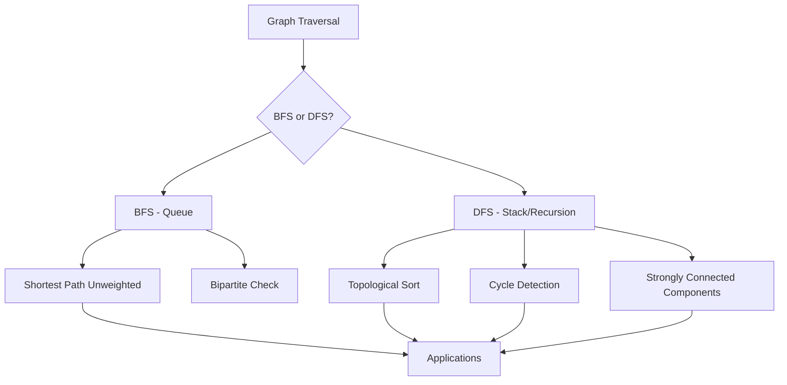

# Chapter 12: Graph Traversals

**Prev:** [Chapter 11: Graphs](11-graphs.md) | **Next:** [Chapter 13: AVL Trees](13-avl.md)

## Learning Objectives

> **One-Sentence Takeaway:** BFS finds shortest paths in unweighted graphs; DFS excels at connectivity analysis and topological sorting.

- Implement Breadth-First Search (BFS) and Depth-First Search (DFS).
- Find connected components in undirected graphs.
- Detect cycles in directed and undirected graphs.
- Compute topological ordering using Kahn's algorithm and DFS.

## Chapter at a Glance

| Topic | Key Insight | Practical Takeaway |
|-------|-------------|-------------------|
| BFS | Level-order traversal using a queue | Shortest path in unweighted graphs |
| DFS | Depth-first exploration using recursion/stack | Cycle detection, topological sort, SCC |
| Topological sort | Linear ordering of DAG vertices | Dependency resolution, build systems |
| Cycle detection | Back edge in directed, visited non-parent in undirected | Detect invalid graphs, deadlocks |
| Connected components | Vertices reachable within same component | Cluster analysis, graph partitioning |
| Bipartite checking | Two-coloring with BFS | Matching problems, resource allocation |

## Chapter Roadmap



## Theory

> **One-Sentence Takeaway:** BFS and DFS both run in O(V+E) but use different data structures and excel at different problems.


### Breadth-First Search (BFS)

BFS explores graph vertices in order of increasing distance from the source. It uses a queue and processes each vertex once.

**Complexity:** \( O(V + E) \) when using adjacency lists.

**Applications:** Shortest path in unweighted graphs, connected components, bipartite checking.

### Depth-First Search (DFS)

DFS explores as far as possible along each branch before backtracking. It can be implemented recursively or iteratively (with an explicit stack). Timestamps (discovery and finish time) support more advanced algorithms.

**Complexity:** \( O(V + E) \).

**Applications:** Topological sort, cycle detection, strongly connected components, maze solving.

### Topological Sort

A topological ordering of a directed acyclic graph (DAG) is a linear ordering such that for every directed edge \( u \to v \), \( u \) appears before \( v \).

- **Kahn's algorithm**: repeatedly remove vertices with in-degree 0.
- **DFS-based**: perform DFS; push vertices onto a stack after finishing.

## Examples

> **One-Sentence Takeaway:** Code implementations demonstrate BFS queue-based distance computation, DFS recursive exploration, and Kahn's algorithm for topological ordering.

### Example 1: BFS Implementation

```cpp
#include <iostream>
#include <vector>
#include <list>
#include <queue>
#include <algorithm>

class Graph {
    int V;
    std::vector<std::list<int>> adj;
    bool directed;

public:
    Graph(int n, bool dir = false) : V(n), directed(dir) {
        adj.resize(V);
    }

    void addEdge(int u, int v) {
        adj[u].push_back(v);
        if (!directed) adj[v].push_back(u);
    }

    // BFS from source s; returns distances
    std::vector<int> bfs(int s) const {
        std::vector<int> dist(V, -1);
        std::queue<int> q;
        dist[s] = 0;
        q.push(s);

        while (!q.empty()) {
            int u = q.front(); q.pop();
            for (int v : adj[u]) {
                if (dist[v] == -1) {
                    dist[v] = dist[u] + 1;
                    q.push(v);
                }
            }
        }
        return dist;
    }

    // BFS that prints traversal order
    void bfsTraversal(int s) const {
        std::vector<bool> visited(V, false);
        std::queue<int> q;
        visited[s] = true;
        q.push(s);

        std::cout << "BFS from " << s << ": ";
        while (!q.empty()) {
            int u = q.front(); q.pop();
            std::cout << u << " ";
            for (int v : adj[u]) {
                if (!visited[v]) {
                    visited[v] = true;
                    q.push(v);
                }
            }
        }
        std::cout << "\n";
    }
};
```

### Example 2: BFS Driver

```cpp
#include "graph.h"

int main() {
    Graph g(6, false);
    g.addEdge(0, 1);
    g.addEdge(0, 2);
    g.addEdge(1, 3);
    g.addEdge(2, 3);
    g.addEdge(3, 4);
    g.addEdge(4, 5);

    g.bfsTraversal(0);

    auto dist = g.bfs(0);
    std::cout << "Distances from 0:\n";
    for (int i = 0; i < dist.size(); ++i) {
        std::cout << "  to " << i << ": " << dist[i] << "\n";
    }

    return 0;
}
```

**Output:**
```
BFS from 0: 0 1 2 3 4 5
Distances from 0:
  to 0: 0
  to 1: 1
  to 2: 1
  to 3: 2
  to 4: 3
  to 5: 4
```

### Example 3: DFS Implementation

```cpp
#include <iostream>
#include <vector>
#include <list>

class GraphDFS {
    int V;
    std::vector<std::list<int>> adj;

    void dfsUtil(int u, std::vector<bool>& visited) const {
        visited[u] = true;
        std::cout << u << " ";
        for (int v : adj[u]) {
            if (!visited[v]) dfsUtil(v, visited);
        }
    }

public:
    GraphDFS(int n) : V(n) { adj.resize(V); }

    void addEdge(int u, int v) {
        adj[u].push_back(v);
        adj[v].push_back(u);
    }

    void dfs(int s) const {
        std::vector<bool> visited(V, false);
        std::cout << "DFS from " << s << ": ";
        dfsUtil(s, visited);
        std::cout << "\n";
    }

    // Full DFS: explore all components
    void dfsFull() const {
        std::vector<bool> visited(V, false);
        std::cout << "Full DFS:\n";
        for (int i = 0; i < V; ++i) {
            if (!visited[i]) {
                std::cout << "  Component starting at " << i << ": ";
                dfsUtil(i, visited);
                std::cout << "\n";
            }
        }
    }
};

int main() {
    GraphDFS g(7);
    g.addEdge(0, 1);
    g.addEdge(0, 2);
    g.addEdge(1, 3);
    g.addEdge(4, 5);
    g.addEdge(5, 6);

    g.dfs(0);
    g.dfsFull();

    return 0;
}
```

**Output:**
```
DFS from 0: 0 1 3 2
Full DFS:
  Component starting at 0: 0 1 3 2
  Component starting at 4: 4 5 6
```

### Example 4: Cycle Detection in Directed Graph

```cpp
#include <iostream>
#include <vector>
#include <list>

class DirectedGraph {
    int V;
    std::vector<std::list<int>> adj;

    bool hasCycleUtil(int u, std::vector<bool>& visited,
                      std::vector<bool>& recStack) const {
        visited[u] = true;
        recStack[u] = true;

        for (int v : adj[u]) {
            if (!visited[v]) {
                if (hasCycleUtil(v, visited, recStack)) return true;
            } else if (recStack[v]) {
                return true; // back edge
            }
        }

        recStack[u] = false;
        return false;
    }

public:
    DirectedGraph(int n) : V(n) { adj.resize(V); }

    void addEdge(int u, int v) { adj[u].push_back(v); }

    bool hasCycle() const {
        std::vector<bool> visited(V, false);
        std::vector<bool> recStack(V, false);

        for (int i = 0; i < V; ++i) {
            if (!visited[i]) {
                if (hasCycleUtil(i, visited, recStack)) return true;
            }
        }
        return false;
    }
};

int main() {
    DirectedGraph g(6);
    g.addEdge(0, 1);
    g.addEdge(1, 2);
    g.addEdge(2, 0); // cycle
    g.addEdge(2, 3);
    g.addEdge(3, 4);
    g.addEdge(4, 5);

    std::cout << "Has cycle: " << (g.hasCycle() ? "yes" : "no") << "\n";

    DirectedGraph dag(4);
    dag.addEdge(0, 1);
    dag.addEdge(0, 2);
    dag.addEdge(1, 3);
    dag.addEdge(2, 3);
    std::cout << "DAG has cycle: " << (dag.hasCycle() ? "yes" : "no") << "\n";

    return 0;
}
```

**Output:**
```
Has cycle: yes
DAG has cycle: no
```

### Example 5: Topological Sort — Kahn's Algorithm

```cpp
#include <iostream>
#include <vector>
#include <list>
#include <queue>

std::vector<int> topologicalSortKahn(const std::vector<std::list<int>>& adj) {
    int V = adj.size();
    std::vector<int> inDegree(V, 0);
    for (int u = 0; u < V; ++u) {
        for (int v : adj[u]) ++inDegree[v];
    }

    std::queue<int> q;
    for (int i = 0; i < V; ++i) {
        if (inDegree[i] == 0) q.push(i);
    }

    std::vector<int> result;
    while (!q.empty()) {
        int u = q.front(); q.pop();
        result.push_back(u);
        for (int v : adj[u]) {
            if (--inDegree[v] == 0) q.push(v);
        }
    }

    return result;
}

int main() {
    int V = 6;
    std::vector<std::list<int>> adj(V);
    adj[5].push_back(2);
    adj[5].push_back(0);
    adj[4].push_back(0);
    adj[4].push_back(1);
    adj[2].push_back(3);
    adj[3].push_back(1);

    auto order = topologicalSortKahn(adj);
    std::cout << "Topological order: ";
    for (int v : order) std::cout << v << " ";
    std::cout << "\n";

    return 0;
}
```

**Output:**
```
Topological order: 4 5 0 2 3 1
```

### Example 6: Topological Sort — DFS Based

```cpp
#include <iostream>
#include <vector>
#include <list>
#include <stack>

void dfsTopo(int u, const std::vector<std::list<int>>& adj,
             std::vector<bool>& visited, std::stack<int>& st) {
    visited[u] = true;
    for (int v : adj[u]) {
        if (!visited[v]) dfsTopo(v, adj, visited, st);
    }
    st.push(u);
}

std::vector<int> topologicalSortDFS(const std::vector<std::list<int>>& adj) {
    int V = adj.size();
    std::vector<bool> visited(V, false);
    std::stack<int> st;

    for (int i = 0; i < V; ++i) {
        if (!visited[i]) dfsTopo(i, adj, visited, st);
    }

    std::vector<int> result;
    while (!st.empty()) {
        result.push_back(st.top());
        st.pop();
    }
    return result;
}
```

## 💡 Pro Tips

> **One-Sentence Takeaway:** BFS guarantees shortest paths in unweighted graphs, DFS with recursion stack detects directed cycles, and Kahn's algorithm doubles as a cycle detector.

- **BFS finds shortest paths in unweighted graphs**: The first time BFS visits a vertex, it has reached it via the shortest path. Track the predecessor to reconstruct the path.
- **DFS for cycle detection**: In directed graphs, a back edge (edge to a vertex on the current recursion stack) means a cycle. In undirected graphs, any edge to a visited vertex that is not the parent is a cycle.
- **Kahn's algorithm for topological sort**: Compute in-degrees of all vertices. Repeatedly remove vertices with in-degree 0 and decrement neighbors' in-degrees. If not all vertices are processed, the graph has a cycle.
- **Strongly connected components**: Kosaraju's algorithm runs DFS, then DFS on the transpose in decreasing finish time. Tarjan's algorithm does it in a single DFS pass.

## One-Sentence Takeaways

- BFS uses a queue, processes vertices by distance, and finds shortest paths.
- DFS uses recursion (or stack), explores deeply, and is good for connectivity analysis.
- BFS is \(O(V+E)\) using adjacency list; DFS is also \(O(V+E)\).
- Cycle detection in directed graphs uses a recursion stack (back edges).
- Topological sort is possible only on directed acyclic graphs (DAGs).
- Strongly connected components partition vertices where every pair is mutually reachable.

## Concept Comparison Table

| Feature | BFS | DFS | Dijkstra | A* |
|---------|-----|-----|----------|----|
| Data structure | Queue | Stack (implicit recursion) | Priority queue | Priority queue |
| Space | \(O(V)\) | \(O(V)\) (worst depth) | \(O(V)\) | \(O(V)\) |
| Shortest path | Unweighted | Not guaranteed | Weighted (non-negative) | Weighted + heuristic |
| Completeness | Yes | No (may go infinite) | Yes | Yes |
| Optimality | Yes (unweighted) | No | Yes | Yes (admissible heuristic) |

## Quick Reference: Traversal Use Cases

| Problem | Algorithm | Why |
|---------|-----------|-----|
| Shortest path (unweighted) | BFS | Level-order guarantees minimum edges |
| Topological sort | DFS or Kahn's | Post-order DFS or in-degree removal |
| Cycle detection (directed) | DFS with recStack | Back edges indicate cycles |
| Cycle detection (undirected) | DFS with parent check | Edge to visited non-parent = cycle |
| Connected components | DFS or BFS | Count DFS calls for each component |
| Bipartite check | BFS with coloring | No edge connects same-colored vertices |
| SCC | Kosaraju / Tarjan | DFS on graph + transpose / single DFS |

## Cross-Application Matrix

| Application | Traversal | How It Uses It |
|-------------|-----------|----------------|
| Web crawling | BFS | Process pages level by level |
| Puzzle solving (maze) | DFS + backtracking | Explore one path fully before backtracking |
| Dependency resolution | Topological sort | Build packages in correct order |
| Social network friend suggestions | BFS | Find distance-2 connections |
| Garbage collection | DFS | Mark reachable objects from roots |

## Chapter Quiz

1. **BFS uses what data structure?**
   - a) Stack
   - b) Queue ✅
   - c) Priority queue
   - d) Hash table

2. **What is BFS's time complexity on adjacency lists?**
   - a) \(O(V)\)
   - b) \(O(V+E)\) ✅
   - c) \(O(V^2)\)
   - d) \(O(E^2)\)

3. **In directed graph cycle detection, what indicates a cycle?**
   - a) Cross edge
   - b) Back edge ✅
   - c) Forward edge
   - d) Tree edge

4. **Kahn's algorithm detects cycles when:**
   - a) All vertices are processed
   - b) Some vertices remain unprocessed ✅
   - c) The queue is empty
   - d) In-degrees are zero

5. **Which algorithm finds shortest paths in unweighted graphs?**
   - a) DFS
   - b) BFS ✅
   - c) Topological sort
   - d) Kosaraju's

**Answers:** 1-b, 2-b, 3-b, 4-b, 5-b

## Summary

- BFS uses a queue and finds shortest paths in unweighted graphs.
- DFS uses recursion (or a stack) and is useful for connectivity, cycles, and topological ordering.
- Cycle detection in directed graphs uses a recursion stack to detect back edges.
- Topological sort exists only for DAGs; Kahn's algorithm and DFS produce valid orderings.

## Exercises

### Review Questions

1. Compare BFS and DFS: when is one preferred over the other?
2. Why does a DFS recursion stack need both visited and recStack for cycle detection?
3. What happens in Kahn's algorithm when the graph has a cycle?

### Application Problems

4. Implement a function to determine if an undirected graph is bipartite using BFS.
5. Write a program to find all strongly connected components using Kosaraju's algorithm.
6. Compute the minimum number of edges to add to make a directed graph strongly connected.

### Challenge Problem

7. Implement the **A* search algorithm** for a weighted grid graph. Compare the number of nodes visited with Dijkstra's algorithm.
