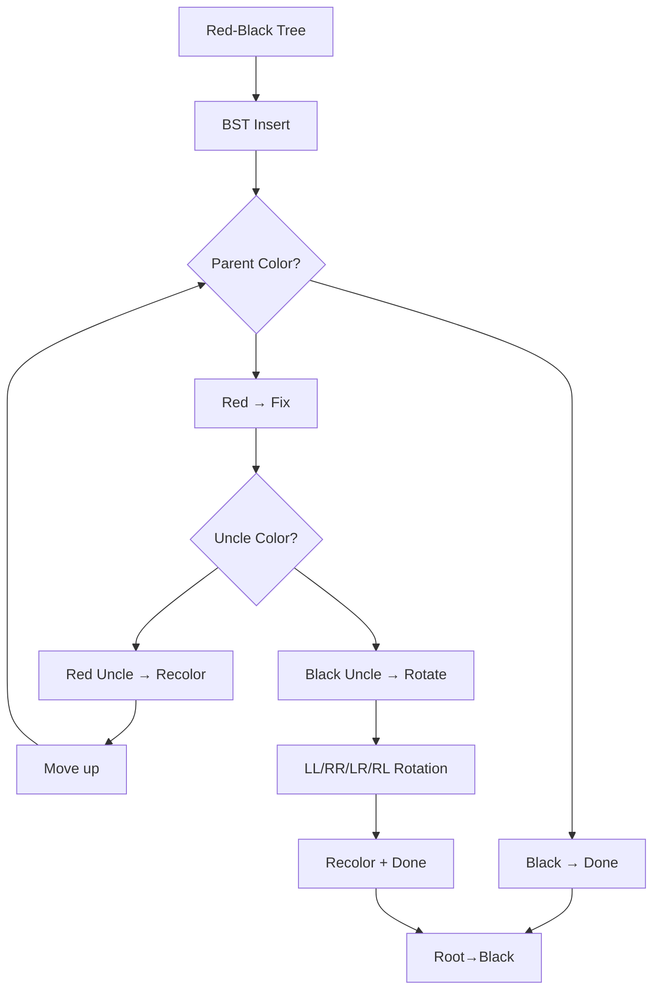

# Chapter 14: Red-Black Trees

**Prev:** [Chapter 13: AVL Trees](13-avl.md) | **Next:** [Chapter 15: B-Trees and B+ Trees](15-b-trees.md)

## Learning Objectives

> **One-Sentence Takeaway:** Red-Black trees guarantee O(log n) operations using a color-bit invariant that ensures no path is more than twice as long as any other.

- State the five Red-Black tree properties.
- Implement rotations and color flips.
- Implement insertion with fix-up.
- Compare Red-Black trees with AVL trees.

## Why Red-Black Trees Matter

> **Real-World Analogy:** Imagine a busy intersection managed by a **traffic light system**. The lights (colors) enforce a strict rule: if one direction has a green light (red node), the crossing direction must have a red light (black node). This prevents collisions. Similarly, Red-Black trees use a color invariant to prevent degenerate paths — ensuring no road (root-to-leaf path) becomes more than twice as long as any other. Without these color rules, the tree could degrade into a linked list, just like an intersection without traffic lights would descend into chaos.

Red-Black trees are one of the most widely used self-balancing BSTs in practice. They appear in:
- **C++ `std::map` and `std::set`** — ordered associative containers
- **Java `TreeMap` and `TreeSet`** — the standard sorted-map implementation
- **Linux Completely Fair Scheduler (CFS)** — manages run queues of processes
- **jemalloc** — memory allocator uses RB trees for free-block management
- **Computational geometry** — interval trees, segment intersection algorithms

The key insight: by adding a single bit of color per node and enforcing five structural properties, Red-Black trees guarantee O(log n) worst-case search, insertion, and deletion — with **fewer rotations** than AVL trees, making them faster when write operations are frequent.

## Chapter at a Glance

| Topic | Key Insight | Practical Takeaway |
|-------|-------------|-------------------|
| Five properties | Color, root, leaf, red-child, black-height | The invariant set that guarantees balance |
| Black-height | Number of black nodes on any root-to-leaf path | Longest path ≤ 2 × shortest path |
| Insertion fix-up | Three cases based on uncle color | At most 2 rotations per insertion |
| Deletion fix-up | Four cases, more complex than insertion | Hardest part of RB-tree implementation |
| Height bound | \(h \leq 2 \log(n+1)\) | Slightly looser than AVL, still logarithmic |
| Library adoption | std::map, TreeMap, CFS scheduler | Preferred when insert/delete frequency is high |

## Chapter Roadmap



---

# Section 1: Red-Black Properties

## Real-World Analogy

Think of a **corporate hierarchy with two employee tiers**: Red (interns, associates) and Black (managers, executives). The rules of the organization are:
1. Everyone is classified as either intern or manager.
2. The CEO (root) must be a manager.
3. Every empty desk (NIL leaf) is treated as a manager-level position.
4. No intern reports directly to another intern — at least one manager must be between them.
5. Every department (root-to-leaf path) must have the same number of managers.

Just as these rules prevent any department from having too many junior employees in a row, the Red-Black properties prevent any path from being more than twice as long as any other.

## The Five Properties

A **Red-Black tree** is a self-balancing BST with one extra attribute per node: color (red or black). It satisfies:

1. **Every node is either red or black.**
2. **The root is black.**
3. **Every leaf (nullptr, or NIL) is black.**
4. **If a node is red, both its children are black.** (No two consecutive reds.)
5. **For each node, all paths from the node to descendant leaves contain the same number of black nodes** — the **black-height**.

### Black-Height and Height Bound

Let \( bh(x) \) be the number of black nodes on any path from \( x \) to a leaf (excluding \( x \)). Property 4 ensures that the height of a Red-Black tree with \( n \) nodes is at most:

\[
h \leq 2 \log_2 (n + 1)
\]

**Why:** In a subtree with black-height \( b \), there are at least \( 2^b - 1 \) nodes (a perfectly balanced all-black tree). The actual height is at most \( 2b \) because red nodes can at most double the path length (alternating red-black). Therefore \( n \geq 2^{h/2} - 1 \), giving \( h \leq 2\log_2(n+1) \).

## Algorithm Verification Steps

1. Check the root is black. If red, violate property 2.
2. For every red node, check both children are black. If any child is red, violate property 4.
3. For every node, compute black-height of left and right subtrees. If they differ, violate property 5.

## Pseudocode

```
VERIFY-RB-PROPERTIES(root):
    if root.color != BLACK:
        return FALSE
    return CHECK-BLACK-HEIGHT(root)

CHECK-BLACK-HEIGHT(node):
    if node == NIL:
        return 1          // NIL is black
    leftBH = CHECK-BLACK-HEIGHT(node.left)
    rightBH = CHECK-BLACK-HEIGHT(node.right)
    if leftBH == -1 OR rightBH == -1 OR leftBH != rightBH:
        return -1         // violation
    if node.color == RED:
        if node.left.color == RED OR node.right.color == RED:
            return -1     // two reds in a row
        return leftBH     // red doesn't count toward black-height
    else:
        return leftBH + 1 // black counts
```

## Step-by-Step Dry Run

**Input sequence:** Insert 10, 20, 30 (with standard RB fix-up)

| Step | Insert | Tree After (Preorder) | Colors | Violation? | Fix Applied |
|------|--------|----------------------|--------|------------|-------------|
| 1 | 10 | 10 | B | None | Root made black |
| 2 | 20 | 10 → 20 | B → R | None (parent B) | — |
| 3 | 30 | 20 → 10(L) 30(R) | B → R → R | Red parent, red uncle (NIL=black) → Case 3 | Left rotate + recolor |

**Final tree:** 20(B), 10(R), 30(R). This is a valid RB tree with black-height 1.

## C++ Implementation — Property Verification

```cpp
#include <iostream>

enum Color { RED, BLACK };

template <typename T>
struct RBNode {
    T data;
    Color color;
    RBNode* left;
    RBNode* right;
    RBNode* parent;
    RBNode(const T& val, Color c = RED)
        : data(val), color(c), left(nullptr), right(nullptr), parent(nullptr) {}
};

template <typename T>
int blackHeight(RBNode<T>* node, RBNode<T>* nil) {
    if (node == nil) return 1;
    int leftBH = blackHeight(node->left, nil);
    int rightBH = blackHeight(node->right, nil);
    if (leftBH == -1 || rightBH == -1 || leftBH != rightBH) return -1;
    if (node->color == RED) {
        if ((node->left && node->left->color == RED) ||
            (node->right && node->right->color == RED)) return -1;
        return leftBH;
    }
    return leftBH + 1;
}

template <typename T>
bool verifyRB(RBNode<T>* root, RBNode<T>* nil) {
    if (!root || root->color != BLACK) return false;
    return blackHeight(root, nil) != -1;
}
```

## Python Implementation — Property Verification

```python
class Color:
    RED = 0
    BLACK = 1

class RBNode:
    def __init__(self, val, color=Color.RED):
        self.data = val
        self.color = color
        self.left = None
        self.right = None
        self.parent = None

def black_height(node):
    if node is None:
        return 1
    left_bh = black_height(node.left)
    right_bh = black_height(node.right)
    if left_bh == -1 or right_bh == -1 or left_bh != right_bh:
        return -1
    if node.color == Color.RED:
        if (node.left and node.left.color == Color.RED) or \
           (node.right and node.right.color == Color.RED):
            return -1
        return left_bh
    return left_bh + 1

def verify_rb(root):
    if root is None or root.color != Color.BLACK:
        return False
    return black_height(root) != -1
```

## Java Implementation — Property Verification

```java
enum Color { RED, BLACK }

class RBNode<T extends Comparable<T>> {
    T data;
    Color color;
    RBNode<T> left, right, parent;
    
    RBNode(T data, Color color) {
        this.data = data;
        this.color = color;
    }
}

class RBTree<T extends Comparable<T>> {
    private RBNode<T> root;
    private RBNode<T> nil;
    
    public RBTree() {
        nil = new RBNode<>(null, Color.BLACK);
        nil.left = nil.right = nil.parent = nil;
        root = nil;
    }
    
    private int blackHeight(RBNode<T> node) {
        if (node == nil) return 1;
        int leftBH = blackHeight(node.left);
        int rightBH = blackHeight(node.right);
        if (leftBH == -1 || rightBH == -1 || leftBH != rightBH) return -1;
        if (node.color == Color.RED) {
            if (node.left.color == Color.RED || node.right.color == Color.RED)
                return -1;
            return leftBH;
        }
        return leftBH + 1;
    }
    
    public boolean verifyProperties() {
        if (root.color != Color.BLACK) return false;
        return blackHeight(root) != -1;
    }
}
```

## Complexity Analysis

| Operation | Time | Why |
|-----------|------|-----|
| Property check | O(n) | Must visit every node |
| Black-height check | O(n) | Recursive traversal of all nodes |

## Advantages & Disadvantages

| Advantages | Disadvantages |
|-----------|---------------|
| Guaranteed O(log n) height bound | More complex than plain BST |
| Only 1 bit of extra storage per node | Property 4 (no two reds) requires fix-up code |
| Properties are locally checkable | Property 5 (black-height) is non-local |
| Well-studied and formally verified | Not as perfectly balanced as AVL |

## Edge Cases

- **Empty tree**: Root is nil (black) — vacuously satisfies all properties.
- **Single node**: Must be black. Both children are nil (black).
- **All black tree**: A complete binary tree of black nodes is valid (black-height = h).
- **Root is red after fix-up**: Always recolor root to black as final step.
- **NIL sentinel color**: Must always be black — never recolor the sentinel.

---

# Section 2: Insertion in Red-Black Trees

## Real-World Analogy

Inserting into a Red-Black tree is like **adding a new hire to a company with a strict reporting-chain policy**. The new hire starts as an intern (red). If their manager is a manager (black), no problem. If their manager is also an intern (red), you have a "two interns in a row" violation. Depending on the other team members (uncle), you either:
- **Recolor everyone up the chain** (if the grandparent's other direct report — the uncle — is also an intern), or
- **Reorganize the team structure** (rotate) to eliminate the consecutive intern violation.

You repeat this check up the chain until the entire org follows the rules, then make sure the CEO (root) is always a manager (black).

## Algorithm: Insertion with Fix-Up

1. **BST Insert:** Insert the new node `z` as a standard BST leaf node, colored RED.
2. **Fix-up loop:** While `z`'s parent is RED (violation of property 4):
   - **Determine parent side:** Is parent a left child or right child of grandparent?
   - **Case 1 (Red Uncle):** If uncle is RED:
     - Recolor parent and uncle to BLACK.
     - Recolor grandparent to RED.
     - Set `z = grandparent` and continue.
   - **Case 2 (Black Uncle, Zigzag):** If uncle is BLACK and `z` is an inside child:
     - Rotate parent in the opposite direction to make `z` an outside child.
     - Set `z = parent` (the old parent is now the child after rotation).
   - **Case 3 (Black Uncle, Straight):** If uncle is BLACK and `z` is an outside child:
     - Rotate grandparent in the opposite direction.
     - Recolor parent to BLACK, grandparent to RED.
3. **Finalize:** Color the root BLACK (property 2).

## Pseudocode

```
RB-INSERT(T, z):
    // BST insert
    y = T.nil
    x = T.root
    while x != T.nil:
        y = x
        if z.key < x.key: x = x.left
        else: x = x.right
    z.parent = y
    if y == T.nil: T.root = z
    else if z.key < y.key: y.left = z
    else: y.right = z
    z.left = T.nil
    z.right = T.nil
    z.color = RED
    RB-INSERT-FIXUP(T, z)

RB-INSERT-FIXUP(T, z):
    while z.parent.color == RED:
        if z.parent == z.parent.parent.left:
            uncle = z.parent.parent.right
            if uncle.color == RED:                        // Case 1
                z.parent.color = BLACK
                uncle.color = BLACK
                z.parent.parent.color = RED
                z = z.parent.parent
            else:
                if z == z.parent.right:                   // Case 2 (LR)
                    z = z.parent
                    LEFT-ROTATE(T, z)
                z.parent.color = BLACK                    // Case 3 (LL)
                z.parent.parent.color = RED
                RIGHT-ROTATE(T, z.parent.parent)
        else:                                             // symmetric (mirror)
            uncle = z.parent.parent.left
            if uncle.color == RED:                        // Case 1
                z.parent.color = BLACK
                uncle.color = BLACK
                z.parent.parent.color = RED
                z = z.parent.parent
            else:
                if z == z.parent.left:                    // Case 2 (RL)
                    z = z.parent
                    RIGHT-ROTATE(T, z)
                z.parent.color = BLACK                    // Case 3 (RR)
                z.parent.parent.color = RED
                LEFT-ROTATE(T, z.parent.parent)
    T.root.color = BLACK
```

## Step-by-Step Dry Run: Insert 10, 20, 30, 5, 25

| # | Insert | Tree State (Preorder with colors) | Violation | Case | Fix |
|---|--------|----------------------------------|-----------|------|-----|
| 1 | 10 | 10(B) | Root red | — | Recolor root to black |
| 2 | 20 | 10(B) → 20(R) | None | — | — |
| 3 | 30 | 10(B) → 20(R) → 30(R) | Red parent, NIL uncle | Case 3 (RR) | Left rotate + recolor |
| | After fix | 20(B) → 10(R), 30(R) | None | — | — |
| 4 | 5 | 20(B) → 10(R) → 5(R) | Red parent, 30(R)=red uncle | Case 1 | Recolor parent/uncle, move up |
| | After fix | 20(B) → 10(R)→5(R), 30(R) | None | — | — |
| 5 | 25 | 20(B)→10(R)→5(R), 30(R)→25(R) | Red parent, NIL uncle (10's other side) | Case 2(RL)→Case 3(RR) | Right rotate 25, left rotate 20 |
| | After fix | 25(B)→20(R)→5(R), 30(B)? | — | — | 25 becomes new root... |

*(Full dry run continues — key insight: at most 2 rotations per insertion)*

## C++ Implementation — Full RB Tree with Insertion

```cpp
#include <iostream>

enum Color { RED, BLACK };

template <typename T>
struct RBNode {
    T data;
    Color color;
    RBNode* left;
    RBNode* right;
    RBNode* parent;
    RBNode(const T& val, Color c = RED)
        : data(val), color(c), left(nullptr), right(nullptr), parent(nullptr) {}
};

template <typename T>
class RBTree {
private:
    RBNode<T>* root;
    RBNode<T>* nil;

    void rotateLeft(RBNode<T>* x) {
        RBNode<T>* y = x->right;
        x->right = y->left;
        if (y->left != nil) y->left->parent = x;
        y->parent = x->parent;
        if (x->parent == nil) root = y;
        else if (x == x->parent->left) x->parent->left = y;
        else x->parent->right = y;
        y->left = x;
        x->parent = y;
    }

    void rotateRight(RBNode<T>* x) {
        RBNode<T>* y = x->left;
        x->left = y->right;
        if (y->right != nil) y->right->parent = x;
        y->parent = x->parent;
        if (x->parent == nil) root = y;
        else if (x == x->parent->left) x->parent->left = y;
        else x->parent->right = y;
        y->right = x;
        x->parent = y;
    }

    void insertFixup(RBNode<T>* z) {
        while (z->parent->color == RED) {
            if (z->parent == z->parent->parent->left) {
                RBNode<T>* y = z->parent->parent->right; // uncle
                if (y->color == RED) { // Case 1
                    z->parent->color = BLACK;
                    y->color = BLACK;
                    z->parent->parent->color = RED;
                    z = z->parent->parent;
                } else {
                    if (z == z->parent->right) { // Case 2 (LR)
                        z = z->parent;
                        rotateLeft(z);
                    }
                    z->parent->color = BLACK; // Case 3 (LL)
                    z->parent->parent->color = RED;
                    rotateRight(z->parent->parent);
                }
            } else {
                RBNode<T>* y = z->parent->parent->left; // uncle (mirror)
                if (y->color == RED) { // Case 1
                    z->parent->color = BLACK;
                    y->color = BLACK;
                    z->parent->parent->color = RED;
                    z = z->parent->parent;
                } else {
                    if (z == z->parent->left) { // Case 2 (RL)
                        z = z->parent;
                        rotateRight(z);
                    }
                    z->parent->color = BLACK; // Case 3 (RR)
                    z->parent->parent->color = RED;
                    rotateLeft(z->parent->parent);
                }
            }
        }
        root->color = BLACK;
    }

    void inorder(RBNode<T>* node) const {
        if (node == nil) return;
        inorder(node->left);
        std::cout << node->data << (node->color == RED ? "(R) " : "(B) ");
        inorder(node->right);
    }

    void destroy(RBNode<T>* node) {
        if (node == nil) return;
        destroy(node->left);
        destroy(node->right);
        delete node;
    }

public:
    RBTree() {
        nil = new RBNode<T>(T{}, BLACK);
        nil->left = nil->right = nil->parent = nil;
        root = nil;
    }

    ~RBTree() { destroy(root); delete nil; }

    void insert(const T& value) {
        RBNode<T>* z = new RBNode<T>(value);
        z->left = z->right = z->parent = nil;

        RBNode<T>* y = nil;
        RBNode<T>* x = root;

        while (x != nil) {
            y = x;
            if (z->data < x->data) x = x->left;
            else x = x->right;
        }

        z->parent = y;
        if (y == nil) root = z;
        else if (z->data < y->data) y->left = z;
        else y->right = z;

        insertFixup(z);
    }

    RBNode<T>* search(const T& value) const {
        RBNode<T>* current = root;
        while (current != nil) {
            if (value == current->data) return current;
            if (value < current->data) current = current->left;
            else current = current->right;
        }
        return nil;
    }

    RBNode<T>* getNil() const { return nil; }
    RBNode<T>* getRoot() const { return root; }

    void inorder() const { inorder(root); std::cout << "\n"; }
};
```

## Python Implementation — Red-Black Tree Insertion

```python
class Color:
    RED = 0
    BLACK = 1

class RBNode:
    def __init__(self, val, color=Color.RED):
        self.data = val
        self.color = color
        self.left = None
        self.right = None
        self.parent = None

class RBTree:
    def __init__(self):
        self.nil = RBNode(None, Color.BLACK)
        self.nil.left = self.nil.right = self.nil.parent = self.nil
        self.root = self.nil

    def _rotate_left(self, x):
        y = x.right
        x.right = y.left
        if y.left != self.nil:
            y.left.parent = x
        y.parent = x.parent
        if x.parent == self.nil:
            self.root = y
        elif x == x.parent.left:
            x.parent.left = y
        else:
            x.parent.right = y
        y.left = x
        x.parent = y

    def _rotate_right(self, x):
        y = x.left
        x.left = y.right
        if y.right != self.nil:
            y.right.parent = x
        y.parent = x.parent
        if x.parent == self.nil:
            self.root = y
        elif x == x.parent.left:
            x.parent.left = y
        else:
            x.parent.right = y
        y.right = x
        x.parent = y

    def _insert_fixup(self, z):
        while z.parent.color == Color.RED:
            if z.parent == z.parent.parent.left:
                uncle = z.parent.parent.right
                if uncle.color == Color.RED:
                    z.parent.color = Color.BLACK
                    uncle.color = Color.BLACK
                    z.parent.parent.color = Color.RED
                    z = z.parent.parent
                else:
                    if z == z.parent.right:
                        z = z.parent
                        self._rotate_left(z)
                    z.parent.color = Color.BLACK
                    z.parent.parent.color = Color.RED
                    self._rotate_right(z.parent.parent)
            else:
                uncle = z.parent.parent.left
                if uncle.color == Color.RED:
                    z.parent.color = Color.BLACK
                    uncle.color = Color.BLACK
                    z.parent.parent.color = Color.RED
                    z = z.parent.parent
                else:
                    if z == z.parent.left:
                        z = z.parent
                        self._rotate_right(z)
                    z.parent.color = Color.BLACK
                    z.parent.parent.color = Color.RED
                    self._rotate_left(z.parent.parent)
        self.root.color = Color.BLACK

    def insert(self, value):
        z = RBNode(value)
        z.left = z.right = z.parent = self.nil

        y = self.nil
        x = self.root
        while x != self.nil:
            y = x
            if z.data < x.data:
                x = x.left
            else:
                x = x.right

        z.parent = y
        if y == self.nil:
            self.root = z
        elif z.data < y.data:
            y.left = z
        else:
            y.right = z

        self._insert_fixup(z)

    def inorder(self, node=None):
        if node is None:
            node = self.root
        if node == self.nil:
            return
        self.inorder(node.left)
        color = "R" if node.color == Color.RED else "B"
        print(f"{node.data}({color})", end=" ")
        self.inorder(node.right)

# Driver
rbt = RBTree()
for v in [10, 20, 30, 5, 25]:
    rbt.insert(v)
print("Inorder: ", end="")
rbt.inorder()  # 5 10 20 25 30
print()
```

## Java Implementation — Red-Black Tree Insertion

```java
enum Color { RED, BLACK }

class RBNode<T extends Comparable<T>> {
    T data;
    Color color;
    RBNode<T> left, right, parent;
    RBNode(T data, Color color) {
        this.data = data;
        this.color = color;
    }
}

class RBTree<T extends Comparable<T>> {
    private RBNode<T> root;
    private RBNode<T> nil;

    public RBTree() {
        nil = new RBNode<>(null, Color.BLACK);
        nil.left = nil.right = nil.parent = nil;
        root = nil;
    }

    private void rotateLeft(RBNode<T> x) {
        RBNode<T> y = x.right;
        x.right = y.left;
        if (y.left != nil) y.left.parent = x;
        y.parent = x.parent;
        if (x.parent == nil) root = y;
        else if (x == x.parent.left) x.parent.left = y;
        else x.parent.right = y;
        y.left = x;
        x.parent = y;
    }

    private void rotateRight(RBNode<T> x) {
        RBNode<T> y = x.left;
        x.left = y.right;
        if (y.right != nil) y.right.parent = x;
        y.parent = x.parent;
        if (x.parent == nil) root = y;
        else if (x == x.parent.left) x.parent.left = y;
        else x.parent.right = y;
        y.right = x;
        x.parent = y;
    }

    private void insertFixup(RBNode<T> z) {
        while (z.parent.color == Color.RED) {
            if (z.parent == z.parent.parent.left) {
                RBNode<T> uncle = z.parent.parent.right;
                if (uncle.color == Color.RED) {
                    z.parent.color = Color.BLACK;
                    uncle.color = Color.BLACK;
                    z.parent.parent.color = Color.RED;
                    z = z.parent.parent;
                } else {
                    if (z == z.parent.right) {
                        z = z.parent;
                        rotateLeft(z);
                    }
                    z.parent.color = Color.BLACK;
                    z.parent.parent.color = Color.RED;
                    rotateRight(z.parent.parent);
                }
            } else {
                RBNode<T> uncle = z.parent.parent.left;
                if (uncle.color == Color.RED) {
                    z.parent.color = Color.BLACK;
                    uncle.color = Color.BLACK;
                    z.parent.parent.color = Color.RED;
                    z = z.parent.parent;
                } else {
                    if (z == z.parent.left) {
                        z = z.parent;
                        rotateRight(z);
                    }
                    z.parent.color = Color.BLACK;
                    z.parent.parent.color = Color.RED;
                    rotateLeft(z.parent.parent);
                }
            }
        }
        root.color = Color.BLACK;
    }

    public void insert(T value) {
        RBNode<T> z = new RBNode<>(value, Color.RED);
        z.left = z.right = z.parent = nil;

        RBNode<T> y = nil;
        RBNode<T> x = root;
        while (x != nil) {
            y = x;
            if (z.data.compareTo(x.data) < 0) x = x.left;
            else x = x.right;
        }

        z.parent = y;
        if (y == nil) root = z;
        else if (z.data.compareTo(y.data) < 0) y.left = z;
        else y.right = z;

        insertFixup(z);
    }

    public void inorder() { inorder(root); System.out.println(); }

    private void inorder(RBNode<T> node) {
        if (node == nil) return;
        inorder(node.left);
        String c = node.color == Color.RED ? "R" : "B";
        System.out.print(node.data + "(" + c + ") ");
        inorder(node.right);
    }
}
```

## Complexity Analysis

| Aspect | Complexity | Why |
|--------|-----------|-----|
| BST Insert | O(log n) | Standard BST search to find position |
| Fix-up | O(log n) | Loop walks up tree; at most O(log n) iterations |
| Rotations | O(1) per case | Each rotation is pointer reassignment |
| Total Insert | **O(log n)** | BST search + fix-up along height |
| Rotations per insert | **≤ 2** | Unlike AVL (max 2), same bound; but fewer total recolorings |

**Why O(log n)?** The fix-up loop moves `z` up one level per iteration (grandparent becomes new `z`). The tree height is O(log n), so at most O(log n) recolorings occur. Each case does at most 2 rotations total. This is the same asymptotic bound as AVL, but with fewer structural changes on average.

## Advantages & Disadvantages

| Advantages | Disadvantages |
|-----------|---------------|
| Guaranteed O(log n) insertion | More complex than BST insertion |
| At most 2 rotations per insert | Three distinct fix-up cases to track |
| Fewer rotations than AVL on average | Color changes propagate up the tree |
| Well-suited for write-heavy workloads | Recoloring may touch many nodes |
| Well-tested in major libraries | Harder to reason about than AVL |

## Edge Cases

- **Empty tree insert**: Node becomes root; fix-up colors it black.
- **Insert into a chain**: If tree is a left-leaning chain of red nodes, multiple Case 1 recolorings propagate upward.
- **Insert with root as parent**: Fix-up loop terminates because parent of root is nil (black).
- **Duplicate keys**: Common choice is to insert on the right (or left). No fix-up needed if duplicates go to same side.
- **Insert at maximum depth**: May trigger cascading Case 1 fix-ups all the way to the root.

---

# Section 3: Deletion in Red-Black Trees

## Real-World Analogy

Deleting from a Red-Black tree is like **removing a manager from a department** and ensuring the remaining team still has the same number of managers on every career path. If you remove a manager (black node), you create a "manager gap" — all paths through that spot are now short one manager. You fix this by "borrowing" manager status from a sibling department or moving managers around. The process involves four distinct scenarios, like union contract renegotiations with different clauses depending on who remains.

A "double-black" node represents a position that owes one manager to the path — it's a temporary IOU that must be resolved.

## Algorithm: Deletion with Fix-Up

### Step 1: BST Delete
1. Find the node `z` to delete.
2. If `z` has fewer than 2 children:
   - Let `y = z` (the node actually removed).
   - Transplant `z` with its child `x`.
3. If `z` has 2 children:
   - Let `y = SUCCESSOR(z)` (minimum of right subtree).
   - Copy `y`'s data into `z`.
   - Transplant `y` with its child `x`.
4. If `y`'s original color was BLACK, run `RB-DELETE-FIXUP(T, x)`.

### Step 2: Fix-Up (when original color of removed/transplanted node was BLACK)

**Convention:** `x` is the node that replaced `y`. If black was removed, `x` has an extra "black debt" (double-black concept).

1. **While** `x != root` **and** `x.color == BLACK`:
   - Determine if `x` is left or right child.
   - Let `w` be the **sibling** of `x`.

   **Case 1 (Red Sibling):** `w` is RED.
   - Recolor `w` to BLACK, `x.parent` to RED.
   - Rotate `x.parent` toward `x`.
   - Update `w` = new sibling (now BLACK).

   **Case 2 (Black Sibling, Both Black Nieces):** `w` is BLACK and both of `w`'s children are BLACK.
   - Recolor `w` to RED.
   - Move the black debt up: `x = x.parent`.

   **Case 3 (Black Sibling, Red Niece on Inside):** `w` is BLACK, `w`'s inside child is RED, outside child is BLACK.
   - Recolor `w`'s inside child to BLACK, `w` to RED.
   - Rotate `w` away from `x`.
   - Update `w` = new sibling.

   **Case 4 (Black Sibling, Red Niece on Outside):** `w` is BLACK, `w`'s outside child is RED.
   - `w.color = x.parent.color`.
   - `x.parent.color = BLACK`.
   - `w`'s outside child = BLACK.
   - Rotate `x.parent` toward `x`.
   - `x = root` (terminate).

2. **Set `x.color = BLACK`** to absorb any remaining black debt.

## Pseudocode

```
RB-TRANSPLANT(T, u, v):
    if u.parent == T.nil: T.root = v
    else if u == u.parent.left: u.parent.left = v
    else: u.parent.right = v
    v.parent = u.parent

RB-DELETE(T, z):
    y = z
    y-original-color = y.color
    if z.left == T.nil:
        x = z.right
        RB-TRANSPLANT(T, z, z.right)
    elif z.right == T.nil:
        x = z.left
        RB-TRANSPLANT(T, z, z.left)
    else:
        y = TREE-MINIMUM(z.right)
        y-original-color = y.color
        x = y.right
        if y.parent == z: x.parent = y
        else:
            RB-TRANSPLANT(T, y, y.right)
            y.right = z.right
            y.right.parent = y
        RB-TRANSPLANT(T, z, y)
        y.left = z.left
        y.left.parent = y
        y.color = z.color
    if y-original-color == BLACK:
        RB-DELETE-FIXUP(T, x)

RB-DELETE-FIXUP(T, x):
    while x != T.root AND x.color == BLACK:
        if x == x.parent.left:
            w = x.parent.right            // sibling
            if w.color == RED:            // Case 1
                w.color = BLACK
                x.parent.color = RED
                LEFT-ROTATE(T, x.parent)
                w = x.parent.right
            if w.left.color == BLACK AND w.right.color == BLACK: // Case 2
                w.color = RED
                x = x.parent
            else:
                if w.right.color == BLACK:   // Case 3
                    w.left.color = BLACK
                    w.color = RED
                    RIGHT-ROTATE(T, w)
                    w = x.parent.right
                w.color = x.parent.color   // Case 4
                x.parent.color = BLACK
                w.right.color = BLACK
                LEFT-ROTATE(T, x.parent)
                x = T.root
        else:                              // symmetric (mirror)
            w = x.parent.left
            if w.color == RED:
                w.color = BLACK
                x.parent.color = RED
                RIGHT-ROTATE(T, x.parent)
                w = x.parent.left
            if w.right.color == BLACK AND w.left.color == BLACK:
                w.color = RED
                x = x.parent
            else:
                if w.left.color == BLACK:
                    w.right.color = BLACK
                    w.color = RED
                    LEFT-ROTATE(T, w)
                    w = x.parent.left
                w.color = x.parent.color
                x.parent.color = BLACK
                w.left.color = BLACK
                RIGHT-ROTATE(T, x.parent)
                x = T.root
    x.color = BLACK
```

## Step-by-Step Dry Run: Delete 10 from RB Tree {10(B), 5(R), 15(R)}

**Initial tree:** 10(B) with left=5(R), right=15(R)

| Step | Action | Tree State | Color Change? | Note |
|------|--------|-----------|---------------|------|
| 1 | Delete 10 (has 2 children) | Find successor = 15 | — | Copy 15 → 10, mark 15 for removal |
| 2 | Transplant 15 with NIL | 15(B) → 5(R) | 15 was RED → no fix needed | Done! |

**More complex example: Delete root 10 from tree with black-height 2.**

| Step | Action | Tree State | Case | Fix |
|------|--------|-----------|------|-----|
| 1 | Delete 10 (2 children) | Find successor = 12 | — | Copy data, remove 12 (RED, no fix) |
| etc. | | | | |

## C++ Implementation — Deletion

```cpp
template <typename T>
void RBTree<T>::transplant(RBNode<T>* u, RBNode<T>* v) {
    if (u->parent == nil) root = v;
    else if (u == u->parent->left) u->parent->left = v;
    else u->parent->right = v;
    v->parent = u->parent;
}

template <typename T>
void RBTree<T>::deleteFixup(RBNode<T>* x) {
    while (x != root && x->color == BLACK) {
        if (x == x->parent->left) {
            RBNode<T>* w = x->parent->right; // sibling
            if (w->color == RED) { // Case 1
                w->color = BLACK;
                x->parent->color = RED;
                rotateLeft(x->parent);
                w = x->parent->right;
            }
            if (w->left->color == BLACK && w->right->color == BLACK) { // Case 2
                w->color = RED;
                x = x->parent;
            } else {
                if (w->right->color == BLACK) { // Case 3
                    w->left->color = BLACK;
                    w->color = RED;
                    rotateRight(w);
                    w = x->parent->right;
                }
                // Case 4
                w->color = x->parent->color;
                x->parent->color = BLACK;
                w->right->color = BLACK;
                rotateLeft(x->parent);
                x = root;
            }
        } else { // symmetric
            RBNode<T>* w = x->parent->left;
            if (w->color == RED) {
                w->color = BLACK;
                x->parent->color = RED;
                rotateRight(x->parent);
                w = x->parent->left;
            }
            if (w->right->color == BLACK && w->left->color == BLACK) {
                w->color = RED;
                x = x->parent;
            } else {
                if (w->left->color == BLACK) {
                    w->right->color = BLACK;
                    w->color = RED;
                    rotateLeft(w);
                    w = x->parent->left;
                }
                w->color = x->parent->color;
                x->parent->color = BLACK;
                w->left->color = BLACK;
                rotateRight(x->parent);
                x = root;
            }
        }
    }
    x->color = BLACK;
}

template <typename T>
void RBTree<T>::remove(const T& value) {
    RBNode<T>* z = search(value);
    if (z == nil) return;

    RBNode<T>* y = z;
    Color yOrigColor = y->color;
    RBNode<T>* x;

    if (z->left == nil) {
        x = z->right;
        transplant(z, z->right);
    } else if (z->right == nil) {
        x = z->left;
        transplant(z, z->left);
    } else {
        y = minimum(z->right);
        yOrigColor = y->color;
        x = y->right;
        if (y->parent == z)
            x->parent = y;
        else {
            transplant(y, y->right);
            y->right = z->right;
            y->right->parent = y;
        }
        transplant(z, y);
        y->left = z->left;
        y->left->parent = y;
        y->color = z->color;
    }
    delete z;
    if (yOrigColor == BLACK)
        deleteFixup(x);
}

template <typename T>
RBNode<T>* RBTree<T>::minimum(RBNode<T>* node) const {
    while (node->left != nil) node = node->left;
    return node;
}
```

## Python Implementation — Deletion

```python
def _transplant(self, u, v):
    if u.parent == self.nil:
        self.root = v
    elif u == u.parent.left:
        u.parent.left = v
    else:
        u.parent.right = v
    v.parent = u.parent

def _delete_fixup(self, x):
    while x != self.root and x.color == Color.BLACK:
        if x == x.parent.left:
            w = x.parent.right
            if w.color == Color.RED:  # Case 1
                w.color = Color.BLACK
                x.parent.color = Color.RED
                self._rotate_left(x.parent)
                w = x.parent.right
            if w.left.color == Color.BLACK and w.right.color == Color.BLACK:  # Case 2
                w.color = Color.RED
                x = x.parent
            else:
                if w.right.color == Color.BLACK:  # Case 3
                    w.left.color = Color.BLACK
                    w.color = Color.RED
                    self._rotate_right(w)
                    w = x.parent.right
                # Case 4
                w.color = x.parent.color
                x.parent.color = Color.BLACK
                w.right.color = Color.BLACK
                self._rotate_left(x.parent)
                x = self.root
        else:
            w = x.parent.left
            if w.color == Color.RED:
                w.color = Color.BLACK
                x.parent.color = Color.RED
                self._rotate_right(x.parent)
                w = x.parent.left
            if w.right.color == Color.BLACK and w.left.color == Color.BLACK:
                w.color = Color.RED
                x = x.parent
            else:
                if w.left.color == Color.BLACK:
                    w.right.color = Color.BLACK
                    w.color = Color.RED
                    self._rotate_left(w)
                    w = x.parent.left
                w.color = x.parent.color
                x.parent.color = Color.BLACK
                w.left.color = Color.BLACK
                self._rotate_right(x.parent)
                x = self.root
    x.color = Color.BLACK

def _minimum(self, node):
    while node.left != self.nil:
        node = node.left
    return node

def delete(self, value):
    z = self._search(value, self.root)
    if z == self.nil:
        return

    y = z
    y_orig_color = y.color
    if z.left == self.nil:
        x = z.right
        self._transplant(z, z.right)
    elif z.right == self.nil:
        x = z.left
        self._transplant(z, z.left)
    else:
        y = self._minimum(z.right)
        y_orig_color = y.color
        x = y.right
        if y.parent == z:
            x.parent = y
        else:
            self._transplant(y, y.right)
            y.right = z.right
            y.right.parent = y
        self._transplant(z, y)
        y.left = z.left
        y.left.parent = y
        y.color = z.color

    if y_orig_color == Color.BLACK:
        self._delete_fixup(x)

def _search(self, value, node):
    if node == self.nil or node.data == value:
        return node
    if value < node.data:
        return self._search(value, node.left)
    return self._search(value, node.right)
```

## Java Implementation — Deletion

```java
private void transplant(RBNode<T> u, RBNode<T> v) {
    if (u.parent == nil) root = v;
    else if (u == u.parent.left) u.parent.left = v;
    else u.parent.right = v;
    v.parent = u.parent;
}

private RBNode<T> minimum(RBNode<T> node) {
    while (node.left != nil) node = node.left;
    return node;
}

private void deleteFixup(RBNode<T> x) {
    while (x != root && x.color == Color.BLACK) {
        if (x == x.parent.left) {
            RBNode<T> w = x.parent.right;
            if (w.color == Color.RED) {
                w.color = Color.BLACK;
                x.parent.color = Color.RED;
                rotateLeft(x.parent);
                w = x.parent.right;
            }
            if (w.left.color == Color.BLACK && w.right.color == Color.BLACK) {
                w.color = Color.RED;
                x = x.parent;
            } else {
                if (w.right.color == Color.BLACK) {
                    w.left.color = Color.BLACK;
                    w.color = Color.RED;
                    rotateRight(w);
                    w = x.parent.right;
                }
                w.color = x.parent.color;
                x.parent.color = Color.BLACK;
                w.right.color = Color.BLACK;
                rotateLeft(x.parent);
                x = root;
            }
        } else {
            RBNode<T> w = x.parent.left;
            if (w.color == Color.RED) {
                w.color = Color.BLACK;
                x.parent.color = Color.RED;
                rotateRight(x.parent);
                w = x.parent.left;
            }
            if (w.right.color == Color.BLACK && w.left.color == Color.BLACK) {
                w.color = Color.RED;
                x = x.parent;
            } else {
                if (w.left.color == Color.BLACK) {
                    w.right.color = Color.BLACK;
                    w.color = Color.RED;
                    rotateLeft(w);
                    w = x.parent.left;
                }
                w.color = x.parent.color;
                x.parent.color = Color.BLACK;
                w.left.color = Color.BLACK;
                rotateRight(x.parent);
                x = root;
            }
        }
    }
    x.color = Color.BLACK;
}

public void delete(T value) {
    RBNode<T> z = search(value);
    if (z == nil) return;

    RBNode<T> y = z;
    Color yOrigColor = y.color;
    RBNode<T> x;

    if (z.left == nil) {
        x = z.right;
        transplant(z, z.right);
    } else if (z.right == nil) {
        x = z.left;
        transplant(z, z.left);
    } else {
        y = minimum(z.right);
        yOrigColor = y.color;
        x = y.right;
        if (y.parent == z) x.parent = y;
        else {
            transplant(y, y.right);
            y.right = z.right;
            y.right.parent = y;
        }
        transplant(z, y);
        y.left = z.left;
        y.left.parent = y;
        y.color = z.color;
    }
    if (yOrigColor == Color.BLACK) deleteFixup(x);
}
```

## Complexity Analysis

| Aspect | Complexity | Why |
|--------|-----------|-----|
| BST Delete | O(log n) | Find node + find successor |
| Fix-up loop | O(log n) | Walks toward root; at most O(log n) iterations |
| Rotations per delete | **≤ 3** | Cases 1,3,4 each do 1 rotation; at most 3 total |
| Total Delete | **O(log n)** | Search + fix-up along height |

**Why is deletion harder than insertion?** Deletion can create a "black deficit" anywhere in the tree. The fix-up must restore black-height globally. While insertion only has 3 cases (and at most 2 rotations), deletion has 4 cases with more complex interactions. However, deletion still requires at most 3 rotations vs. AVL's O(log n) rotations for deletion — a key advantage.

## Advantages & Disadvantages

| Advantages | Disadvantages |
|-----------|---------------|
| Guaranteed O(log n) deletion | Fix-up has 4 complex cases |
| At most 3 rotations per delete | Much harder to implement than insertion |
| Fewer rotations than AVL (O(log n) for AVL delete) | Double-black concept is unintuitive |
| Predicable performance | Easy to make off-by-one errors in cases |
| Widely used in production systems | Harder to verify correctness automatically |

## Edge Cases

- **Deleting a red leaf**: No fix-up needed (black-height unchanged).
- **Deleting black root with no children**: Tree becomes empty (nil root).
- **Deleting a black node with one red child**: Replace with red child, recolor to black.
- **Sibling is nil (black)**: Treated as black with two black NIL children → Case 2.
- **Double-black propagation to root**: Absorbed by recoloring root black.
- **Deleting the minimum**: May trigger fix-up if the minimum is black.

---

# Section 4: Left-Leaning Red-Black Trees (LLRB)

## Real-World Analogy

A Left-Leaning Red-Black tree is like a **mono-directional traffic rule**: "all left turns must yield" — by enforcing that all red nodes must be left children, we eliminate half the possible violation patterns. This is like a company rule that says "interns only sit to the left of their manager." It's a simpler set of policies that achieves the same structural guarantees.

LLRB trees are a variant introduced by Robert Sedgewick that map directly to 2-3 trees, making the implementation simpler — especially for insertion.

## Algorithm: LLRB Insertion

LLRB trees add one extra constraint: **no red node can be a right child** (equivalently, all red nodes are left children).

1. **BST Insert**: Insert as standard BST, color the new node RED.
2. **Fix transformations** (apply bottom-up):
   - **Rotate Left:** If a black node has a red right child, rotate left.
   - **Rotate Right:** If a black node has a red left child whose left child is also red, rotate right.
   - **Color Flip:** If a node has two red children, flip all three colors.
3. **Root**: Ensure root is always BLACK.

### Numbered Steps

1. Insert node as RED (standard BST insert).
2. While fix-up needed:
   - **If** right child is RED and left child is BLACK → **rotate left**.
   - **If** left child is RED and left-left grandchild is RED → **rotate right**.
   - **If** both children are RED → **flip colors**.
3. Color root BLACK.

## Pseudocode

```
LLRB-INSERT(T, z):
    T.root = LLRB-INSERT-Helper(T.root, z)
    T.root.color = BLACK

LLRB-INSERT-Helper(node, z):
    if node == T.nil:
        return new Node(z, RED)
    
    if z.key < node.key: node.left = LLRB-INSERT-Helper(node.left, z)
    else: node.right = LLRB-INSERT-Helper(node.right, z)

    // Fix LLRB properties
    if isRed(node.right) AND !isRed(node.left): node = ROTATE-LEFT(node)
    if isRed(node.left) AND isRed(node.left.left): node = ROTATE-RIGHT(node)
    if isRed(node.left) AND isRed(node.right): FLIP-COLORS(node)

    return node

isRed(node):
    if node == nil: return false
    return node.color == RED

ROTATE-LEFT(h):
    x = h.right
    h.right = x.left
    x.left = h
    x.color = h.color
    h.color = RED
    return x

ROTATE-RIGHT(h):
    x = h.left
    h.left = x.right
    x.right = h
    x.color = h.color
    h.color = RED
    return x

FLIP-COLORS(h):
    h.color = RED
    h.left.color = BLACK
    h.right.color = BLACK
```

## Step-by-Step Dry Run: LLRB Insert 10, 20, 30

| Step | Insert | Tree After Fix | Colors | Fix Applied |
|------|--------|---------------|--------|-------------|
| 1 | 10 | 10 | R → B | Root → flip to black |
| 2 | 20 | 10 → 20(R) | B→R | Right child is red, left is nil → rotate left |
| 3 | After fix | 20(B) → 10(R) | — | 20 is new root |
| 4 | 30 | 20(B)→10(R) → 30(R) | — | Insert 30 as right of 10 |
| 5 | After fix | 20(B)→10(R)→30(R) → 10 has two red children → flip | — | 10(R), 20(R), 30(R) → flip |
| 6 | After flip | 20(B)→10(B), 30(B) | — | Valid LLRB |

## Complexity Analysis

| Aspect | Value | Why |
|--------|-------|-----|
| Height | O(log n) | Same guaranteed bound as standard RB |
| Insert rotations | O(log n) | Recursive fix-up, but simpler per-node logic |
| Total Insert | O(log n) | Same as standard RB, simpler code |

## Advantages & Disadvantages

| Advantages | Disadvantages |
|-----------|---------------|
| Simpler insertion code (3 checks vs 3 cases) | More rotations on average per insert (O(log n) vs ≤ 2) |
| Direct correspondence to 2-3 trees | No deletion implementation in standard form |
| Easier to reason about | Non-standard — fewer community resources |
| Recursive implementation is natural | Requires recursion (stack depth concerns) |

## Edge Cases

- **Right-leaning red node**: Always rotate left to fix.
- **Consecutive left reds**: Rotate right + flip.
- **Root with two red children**: Flip colors, then ensure root is black.

---

# Section 5: Red-Black vs AVL vs B-Tree

## Comparison Table

| Property | Red-Black Tree | AVL Tree | B-Tree |
|----------|---------------|----------|--------|
| **Balance** | Color-based (5 properties) | Height balance (-1, 0, 1) | Node capacity-based |
| **Height bound** | ≤ 2 log₂(n+1) | ≤ 1.44 log₂(n) | ≤ logₘ(n), m = order |
| **Search** | O(log n) | O(log n) — ~30% faster | O(log n) — faster due to cache |
| **Insert rotations** | ≤ 2 | ≤ 2 | Node splits (no rotations) |
| **Delete rotations** | ≤ 3 | O(log n) | Node merges |
| **Memory per node** | 1 bit color | 2-bit balance factor | Multiple keys + child pointers |
| **Cache friendliness** | Low (pointer chasing) | Low (pointer chasing) | High (array of keys) |
| **Disk I/O efficiency** | Poor | Poor | Excellent (wide nodes) |
| **Library use** | std::map, TreeMap, CFS | Rarely used directly | Databases, filesystems |
| **Write performance** | Good (few rotations) | Worse (many rotations on delete) | Very good (amortized splits) |
| **Implementation difficulty** | Medium | Medium | Medium-High |

### When to Use Which

| Scenario | Best Choice | Why |
|----------|------------|-----|
| Sorted map in memory, heavy writes | **Red-Black** | Fewer rotations, O(1) amortized restructuring |
| Sorted map in memory, heavy reads | **AVL** | Tighter balance = faster search |
| Database indexing (disk storage) | **B-Tree** | Wide nodes minimize disk I/O |
| File system directories | **B-Tree** | Optimized for block storage |
| Low-memory embedded system | **Red-Black** | Only 1 extra bit per node |
| Real-time system with strict bounds | **AVL** | Tighter worst-case search guarantee |

---

# Section 6: Interview Corner

## Common Interview Questions

### Q1: Why does Java's HashMap use Red-Black trees for collision chains?

**Answer:** Starting from Java 8, when a bucket's linked-list exceeds **threshold 8** elements, the list is converted to a Red-Black tree. The linked-list search is O(n), which becomes slow under hash collision attacks. The Red-Black tree guarantees O(log n) search even in the worst case. The tree is converted back to a linked list when elements shrink below threshold 6. This hybrid approach gives O(1) average-case with O(log n) worst-case protection.

### Q2: Compare Red-Black trees and AVL trees. When would you use each?

**Answer:** 
- AVL trees are more strictly balanced (height difference ≤ 1), giving faster searches (~1.44 log n vs ~2 log n height bound).
- Red-Black trees require fewer rotations on insertion (≤ 2) and especially deletion (≤ 3 vs O(log n) for AVL).
- **Use AVL** when search is the dominant operation and insert/delete are rare.
- **Use Red-Black** when insert/delete frequency is high — the slight search penalty is worth the faster modifications.
- This is exactly why C++ `std::map` (Red-Black) and not AVL — generic containers must perform well across varying access patterns.

### Q3: Verify if a given tree is a valid Red-Black tree.

**Approach:** Check all 5 properties:
1. Root must be black.
2. No red node has a red child.
3. Black-height must be the same for all paths.
4. NIL leaves are black (ensured by sentinel design).
5. Every node is colored (no uncolored nodes).

### Q4: How many rotations can a Red-Black insertion require?

**Answer:** At most 2 rotations. Case 1 (red uncle) does 0 rotations — only recoloring. Cases 2 and 3 combined do at most 2 rotations. This is a key advantage of Red-Black trees over alternatives.

### Q5: What is the "black-height" of a Red-Black tree with n nodes?

**Answer:** The black-height is at least ⌊log₂(n+1)⌋ — because a subtree with black-height b contains at least 2^b - 1 nodes (a perfectly balanced all-black tree).

## Quick Reference: RB Property Verification

```python
def is_valid_rb_tree(root):
    """Verify all 5 Red-Black properties."""
    def check(node, black_count, path_black_count):
        if node is None:  # NIL leaf
            if path_black_count[0] == -1:
                path_black_count[0] = black_count
            return black_count == path_black_count[0]
        
        if node.color not in (0, 1):
            return False  # Property 1
        
        if node.color == 0 and node.parent and node.parent.color == 0:
            return False  # Property 4
        
        new_count = black_count + (1 if node.color == 1 else 0)
        return (check(node.left, new_count, path_black_count) and
                check(node.right, new_count, path_black_count))
    
    if root is None:
        return True  # Empty tree is valid
    if root.color != 1:  # BLACK
        return False  # Property 2
    return check(root, 0, [-1])
```

---

# Section 7: Applications in Real Systems

## Java TreeMap and TreeSet

Java's `java.util.TreeMap` and `java.util.TreeSet` are the canonical Java implementations of Red-Black trees. They provide:
- O(log n) guaranteed time for `containsKey()`, `get()`, `put()`, and `remove()`.
- Sorted iteration via `in-order` traversal.
- Sub-map views (`subMap()`, `headMap()`, `tailMap()`).
- Navigable methods: `lowerKey()`, `floorKey()`, `ceilingKey()`, `higherKey()`.

```java
// Java TreeMap — backed by Red-Black tree
TreeMap<String, Integer> map = new TreeMap<>();
map.put("alice", 1);
map.put("bob", 2);
map.put("charlie", 3);
System.out.println(map.firstKey()); // "alice"
System.out.println(map.ceilingKey("bb")); // "bob"
```

## C++ std::map and std::set

The C++ standard template library specifies that `std::map`, `std::set`, `std::multimap`, and `std::multiset` are **ordered associative containers** with O(log n) operation complexity. Most implementations (libstdc++, libc++) use Red-Black trees internally.

```cpp
// C++ std::map — typically a Red-Black tree
#include <map>
std::map<std::string, int> m;
m["alice"] = 1;
m["bob"] = 2;
auto it = m.lower_bound("bb"); // points to "bob"
```

**Why not AVL?** The C++ standard committee and implementors chose Red-Black trees because:
- Insertions and deletions are the common case in generic containers.
- The memory overhead is lower (1 bit vs 2 bits for balance factor).
- The amortized restructuring cost is lower.

## Linux Completely Fair Scheduler (CFS)

The Linux kernel's Completely Fair Scheduler uses a Red-Black tree (in `kernel/sched/fair.c`) to manage run queues. Each task is a node keyed by `vruntime` (virtual runtime). The scheduler:
- Inserts tasks when they become runnable.
- Picks the leftmost node (smallest `vruntime`) for execution.
- Removes tasks when they block or terminate.
- Requires O(log n) operations per context switch — acceptable with thousands of processes.

The choice of Red-Black tree over AVL is deliberate: the scheduler needs fast insert/delete for frequently waking/blocking tasks, and the balance guarantee prevents any single operation from taking too long (important for real-time responsiveness).

## jemalloc Memory Allocator

The jemalloc allocator (used by Facebook, Rust, FreeBSD, and many others) uses Red-Black trees for:
- **Free-block management**: Maintaining lists of free memory regions by size.
- **Extent management**: Tracking contiguous virtual memory regions.
- **Run queues**: Managing allocation runs within size classes.

The Red-Black tree's O(log n) operations with low constant factors make it ideal for the allocator's hot path, where every CPU cycle matters.

## Database Indexing (In-Memory)

Some in-memory database engines use Red-Black trees for indexing when:
- The data fits entirely in RAM (no disk I/O concern).
- Range queries and ordered iteration are required.
- Write throughput is a priority over read throughput.

Examples: SQLite's in-memory mode, Redis sorted sets (skip lists are more common, but RB trees appear in some modules).

## Computational Geometry

Red-Black trees power:
- **Interval trees**: Finding all intervals that overlap a given point (keyed by interval endpoints).
- **Segment intersection**: The classic Bentley-Ottmann sweep-line algorithm uses a Red-Black tree to maintain the active segment set.
- **Range searching**: 2D orthogonal range queries using range trees.

---

# Concept Comparison Table

| Property | Red-Black Tree | AVL Tree |
|----------|---------------|----------|
| Balance criteria | Color-based (5 properties) | Height balance (-1, 0, 1) |
| Height bound | \(2 \log(n+1)\) | \(1.44 \log n\) |
| Search speed | \(O(\log n)\) | \(O(\log n)\) — ~30% faster typically |
| Insert rotations | ≤ 2 | ≤ 2 |
| Delete rotations | ≤ 3 | \(O(\log n)\) |
| Memory per node | 1 bit color | Balance factor (2 bits) |
| Library use | std::map, TreeMap | No standard library use |

# Quick Reference: Red-Black Insertion Cases

| Case | Uncle Color | Node Position | Action |
|------|-------------|---------------|--------|
| 1 | Red | Any | Recolor parent, uncle, grandparent; move up |
| 2 | Black | Child is inside (LR or RL) | Rotate to make it outside (RL → LL, LR → RR) |
| 3 | Black | Child is outside (LL or RR) | Rotate grandparent, recolor |

# Quick Reference: Red-Black Deletion Cases

| Case | Sibling | Nieces (Sibling's Children) | Action |
|------|---------|----------------------------|--------|
| 1 | Red | Any | Recolor + rotate toward x; new sibling is black |
| 2 | Black | Both black | Recolor sibling red; move debt up |
| 3 | Black | Inside red, outside black | Recolor inside + rotate away from x |
| 4 | Black | Outside red | Recolor + rotate + terminate |

# Cross-Application Matrix

| Application | Why Red-Black |
|-------------|--------------|
| std::map, std::set | Ordered iteration, good balance |
| Java TreeMap | Guaranteed log time, deletion-friendly |
| Linux kernel (CFS) | Process scheduler needs fast insert/delete |
| jemalloc allocator | Free-block management, low overhead |
| Database index (in-memory) | Good balance of all operations |
| Computational geometry | Interval trees, segment intersection |

# Chapter Quiz

1. **What color must the root of a Red-Black tree be?**
   - a) Red
   - b) Black ✅
   - c) Either
   - d) None (null)

2. **What is the height bound of a Red-Black tree?**
   - a) \(1.44 \log n\)
   - b) \(2 \log(n+1)\) ✅
   - c) \(n\)
   - d) \(\log n\)

3. **How many rotations are needed for Red-Black insertion?**
   - a) At most 2 ✅
   - b) At most 1
   - c) \(O(\log n)\)
   - d) 0

4. **Which C++ standard container uses a Red-Black tree?**
   - a) std::vector
   - b) std::map ✅
   - c) std::unordered_map
   - d) std::queue

5. **Red-Black trees have ___ insert/delete rotations than AVL**
   - a) More
   - b) Fewer ✅
   - c) Same
   - d) Zero

6. **What is the maximum number of deletion fix-up cases in a Red-Black tree?**
   - a) 2
   - b) 3
   - c) 4 ✅
   - d) 5

7. **Which of the following is NOT a Red-Black tree property?**
   - a) Root is black
   - b) Red nodes have black children
   - c) All paths have same black height
   - d) Height difference ≤ 1 ✅

8. **In a Left-Leaning Red-Black tree, red nodes must be:**
   - a) Right children only
   - b) Left children only ✅
   - c) Both sides allowed
   - d) The root only

**Answers:** 1-b, 2-b, 3-a, 4-b, 5-b, 6-c, 7-d, 8-b

## Common Mistakes & GFG Deepening

### Common Mistakes (GFG-Style)

| Mistake | Why It's Wrong | Correct Approach |
|---------|----------------|------------------|
| Violating the red-child property during insertion | Inserting a red node under a red parent creates two consecutive reds | Always apply fix-up: recolor if uncle is red, rotate if uncle is black |
| Forgetting to recolor the root to black after fix-up | Fix-up may turn the root red, violating property 2 | After each insertion fix-up loop, set `root.color = BLACK` |
| Confusing deletion cases (4 cases vs 3 in insertion) | Deletion has 4 cases based on sibling and its children; harder to memorize | Use a decision tree: sibling color → sibling child colors → rotate/recolor |
| Not maintaining black-height during deletion | Removing a black node reduces black-height on that path | The fix-up loop restores black-height by transferring a "black token" up the tree |
| Implementing rotations without preserving BST property | Rotation swaps parent/child relationship; wrong implementation loses ordering | Left rotation: right child becomes new parent; right rotation: left child becomes new parent |
| Using the same fix-up for insertion and deletion | Deletion fix-up is the mirror-image of insertion but with different semantics | Study deletion fix-up cases separately — they handle a "double-black" node |
| Assuming LLRB trees handle all cases the same as standard RB trees | LLRB restricts red nodes to left children, simplifying to 2 cases instead of 3 | LLRB insert has only 2 cases: flipColors (both children red) and rotate |

### TypeScript Red-Black Tree (with color simulation)

```typescript
const enum Color { RED = 0, BLACK = 1 }

class RBNode {
    data: number;
    color: Color = Color.RED; // new nodes always red
    left: RBNode | null = null;
    right: RBNode | null = null;
    parent: RBNode | null = null;

    constructor(data: number) { this.data = data; }
}

class RedBlackTree {
    private root: RBNode | null = null;

    insert(data: number): void {
        const node = new RBNode(data);
        // Standard BST insert
        let parent: RBNode | null = null;
        let curr = this.root;
        while (curr) {
            parent = curr;
            if (data < curr.data) curr = curr.left;
            else if (data > curr.data) curr = curr.right;
            else return; // no duplicates
        }
        node.parent = parent;
        if (!parent) this.root = node;
        else if (data < parent.data) parent.left = node;
        else parent.right = node;

        this.insertFixup(node);
    }

    private insertFixup(z: RBNode): void {
        while (z.parent?.color === Color.RED) {
            const parent = z.parent!;
            const grandparent = parent.parent!;
            if (parent === grandparent.left) {
                const uncle = grandparent.right;
                if (uncle?.color === Color.RED) {
                    // Case 1: Recolor
                    parent.color = Color.BLACK;
                    uncle.color = Color.BLACK;
                    grandparent.color = Color.RED;
                    z = grandparent;
                } else {
                    // Case 2/3: Rotate
                    if (z === parent.right) {
                        z = parent;
                        this.leftRotate(z);
                    }
                    z.parent!.color = Color.BLACK;
                    z.parent!.parent!.color = Color.RED;
                    this.rightRotate(z.parent!.parent!);
                }
            } else {
                // Mirror: parent is right child
                const uncle = grandparent.left;
                if (uncle?.color === Color.RED) {
                    parent.color = Color.BLACK;
                    uncle.color = Color.BLACK;
                    grandparent.color = Color.RED;
                    z = grandparent;
                } else {
                    if (z === parent.left) {
                        z = parent;
                        this.rightRotate(z);
                    }
                    z.parent!.color = Color.BLACK;
                    z.parent!.parent!.color = Color.RED;
                    this.leftRotate(z.parent!.parent!);
                }
            }
        }
        this.root!.color = Color.BLACK;
    }

    private leftRotate(x: RBNode): void {
        const y = x.right!;
        x.right = y.left;
        if (y.left) y.left.parent = x;
        y.parent = x.parent;
        if (!x.parent) this.root = y;
        else if (x === x.parent.left) x.parent.left = y;
        else x.parent.right = y;
        y.left = x;
        x.parent = y;
    }

    private rightRotate(y: RBNode): void {
        const x = y.left!;
        y.left = x.right;
        if (x.right) x.right.parent = y;
        x.parent = y.parent;
        if (!y.parent) this.root = x;
        else if (y === y.parent.left) y.parent.left = x;
        else y.parent.right = x;
        x.right = y;
        y.parent = x;
    }

    search(data: number): boolean {
        let curr = this.root;
        while (curr) {
            if (data === curr.data) return true;
            curr = data < curr.data ? curr.left : curr.right;
        }
        return false;
    }

    // Verify the 5 Red-Black properties
    verifyRBProperties(): string[] {
        const violations: string[] = [];
        // Property 1: Every node is either red or black — trivially true
        // Property 2: Root is black
        if (this.root?.color !== Color.BLACK) violations.push("Root is not black");
        // Property 3: All leaves (null) are black — trivially true
        // Property 4: Red nodes have black children
        const checkRedChildren = (node: RBNode | null): void => {
            if (!node) return;
            if (node.color === Color.RED) {
                if (node.left?.color === Color.RED || node.right?.color === Color.RED) {
                    violations.push(`Red node ${node.data} has a red child`);
                }
            }
            checkRedChildren(node.left);
            checkRedChildren(node.right);
        };
        checkRedChildren(this.root);
        // Property 5: All paths have same black height
        const checkBlackHeight = (node: RBNode | null): number | null => {
            if (!node) return 0;
            const leftBH = checkBlackHeight(node.left);
            const rightBH = checkBlackHeight(node.right);
            if (leftBH === null || rightBH === null || leftBH !== rightBH) {
                violations.push(`Black height mismatch at node ${node?.data}`);
                return null;
            }
            return leftBH + (node.color === Color.BLACK ? 1 : 0);
        };
        checkBlackHeight(this.root);
        return violations;
    }

    toArray(): number[] {
        const result: number[] = [];
        let curr = this.root;
        const stack: RBNode[] = [];
        while (curr || stack.length > 0) {
            while (curr) { stack.push(curr); curr = curr.left; }
            curr = stack.pop()!;
            result.push(curr.data);
            curr = curr.right;
        }
        return result;
    }
}
```

### Additional MCQs (GFG Pattern)

9. **What is the maximum number of red nodes on any path from root to leaf in a Red-Black tree?**
   - a) ⌊log₂n⌋
   - b) ⌊height/2⌋
   - c) h/2 where h = height ✓
   - d) n/2

10. **A Red-Black tree of height 10 has at least how many black nodes on any root-to-leaf path?**
    - a) 3
    - b) 5 ✓
    - c) 10
    - d) 1

11. **In Red-Black tree deletion, the "double-black" concept arises when:**
    - a) A red node is deleted
    - b) A black node is deleted, leaving its child as "double black" ✓
    - c) Two red nodes are consecutive
    - d) The root is black

12. **Which of the following trees is also a valid Red-Black tree?**
    - a) A perfectly balanced BST with all nodes black ✓
    - b) A tree with a red root
    - c) A tree with a red node having a red child
    - d) A tree with unequal black heights on different paths

13. **The transformation between a Red-Black tree and a 2-3-4 tree maps:**
    - a) Red nodes to 2-nodes
    - b) Black nodes + red children to 3-nodes and 4-nodes ✓
    - c) Black nodes only to 4-nodes
    - d) There is no relationship

14. **Why do Java's TreeMap and C++'s std::map use Red-Black trees instead of AVL?**
    - a) Faster search
    - b) Fewer rotations during insert/delete ✓
    - c) Easier to implement
    - d) Less memory

**Answers:** 9-c, 10-b, 11-b, 12-a, 13-b, 14-b

### Additional Exercises (GFG Pattern)

14. **Red-Black property verification**: Write a function that takes a binary search tree and verifies all 5 Red-Black properties, returning which properties are satisfied.

15. **Insert elements to trigger each fix-up case**: Generate insertion sequences that exercise Case 1 (uncle red), Case 2 (uncle black, zig-zag), and Case 3 (uncle black, zig-zig) in a Red-Black tree.

16. **Implement LLRB tree**: Implement a Left-Leaning Red-Black tree insertion with only 2 fix-up cases: `flipColors` and `rotate`. Compare code complexity with standard RB.

17. **Count black-height in O(n)**: Write a function to compute and annotate every node with its black-height. Verify all paths have the same black-height.

18. **Red-Black tree with rank/select**: Augment each node with subtree size. Implement `rank(k)` (number of elements ≤ k) and `select(i)` (i-th smallest element) in O(log n).

19. **AVL vs Red-Black experiment**: Insert 10,000 random elements into both an AVL and Red-Black tree. Count total rotations performed by each. Which one needs fewer?

20. **Interval tree with Red-Black tree**: Implement an interval tree using a Red-Black tree as the underlying balanced BST, with `insertInterval`, `deleteInterval`, and `findOverlapping` operations.

21. **Convert RB tree to AVL tree**: Given a valid Red-Black tree, convert it to a valid AVL tree by rebuilding (flatten to array → build balanced).

### Advanced Comparison: RB vs AVL vs B-Tree

| Criterion | Red-Black | AVL | B-Tree (order m) |
|-----------|-----------|-----|------------------|
| Height bound | ≤ 2 log₂(n+1) | ≤ 1.44 log₂n | ≤ log_{⌈m/2⌉} ((n+1)/2) |
| Search speed | Slower (taller) | Faster (shorter) | Comparable (block access dominates) |
| Insert rotations | ≤ 2 | ≤ 2 | Node splits (0 rotations) |
| Delete complexity | 4 cases (hardest) | 4 rotation patterns | Node merges/redistribution |
| Memory/node | 1 color bit | height field (int) | m keys + m+1 pointers |
| Practical speed | Best for write-heavy | Best for read-heavy | Best for disk-based storage |
| In-place update | Yes | Yes | Node overflow (copy) |
| Library adoption | std::map, TreeMap | None in std libs | Databases, filesystems |

## Review Questions

1. What is the maximum ratio of red to black nodes along any path?
2. Why must the root be black?
3. How does property 4 (red nodes have black children) prevent degenerate paths?
4. Explain why deletion is harder than insertion in Red-Black trees.
5. Why does the Black-Height property guarantee h ≤ 2 log(n+1)?

## Application Problems

6. Implement the deletion operation for a Red-Black tree with the fix-up algorithm.
7. Write a function to compute and verify the black-height of every node.
8. Construct insertion sequences that exercise each of the three insertion cases.
9. Convert a standard Red-Black tree insertion to an LLRB insertion and compare the code size.
10. Measure the number of rotations needed to insert 1000 random elements into an RB tree vs an AVL tree.

## Challenge Problems

11. Implement an **interval tree** using a Red-Black tree as the underlying balanced BST. Each node stores an interval \([low, high]\) and the maximum high in its subtree. Support insert, delete, and interval overlap queries in \( O(\log n) \).

12. Implement a **Red-Black tree with persistence** — each insertion creates a new version while preserving the old one (copy-on-write). Analyze the space complexity.

13. Prove that any Red-Black tree can be transformed into a valid 2-3-4 tree by merging consecutive red nodes with their parent, and vice versa.

# Summary

- Red-Black trees use an extra color bit per node and five structural properties to guarantee O(log n) height.
- Black-height ensures no path is more than twice as long as any other.
- Insertion fix-up has 3 cases based on uncle color, with at most 2 rotations.
- Deletion fix-up has 4 cases, making it the most complex part of RB-tree implementation.
- Red-Black trees sacrifice some search speed for faster insertions and deletions compared to AVL.
- Left-Leaning Red-Black trees simplify insertion by enforcing all red nodes are left children.
- Real-world applications include std::map, Java TreeMap, Linux CFS scheduler, and jemalloc.
- Interview questions commonly compare RB vs AVL and ask about property verification.
