# Chapter 17: Segment Tree

> **Prerequisites:** [Chapter 8: Binary Trees](./08-binary-trees.md) — Tree concepts, recursion, array-based tree storage | **Next:** [Chapter 18: Union-Find (Disjoint Set Union)](./18-union-find.md) — From range queries to connectivity

## Learning Objectives

By the end of this chapter, students will be able to:

1. Construct a segment tree from a given array in O(n) time.
2. Perform range queries (sum, min, max) in O(log n) time.
3. Implement point updates and range updates in O(log n) time using lazy propagation.
4. Compare segment trees with Fenwick trees and sparse tables for different use cases.
5. Identify real-world problems that benefit from segment tree optimization.

---

## Why Segment Trees Matter

**Real-World Analogy:** Imagine you and 7 friends split a restaurant bill of $240. The waiter needs to answer two kinds of questions: "What's the total for the table?" (range sum) and "Who has the most expensive item?" (range max). Between questions, people keep changing their orders (point updates). Calculating from scratch every time is O(n) per query — painfully slow when the restaurant has 10,000 tables of 8. A segment tree is like organizing each table's items into a hierarchy of subtotals: each waiter manages 2 people, each head waiter manages 2 waiters, and the manager has the grand total. Any question about any range can be answered by combining just a handful of subtotals, and any change only affects the log(n) subtotals that contain it.

This pattern — **precompute aggregations in a balanced binary tree** — is the core insight behind segment trees. They power database range-sum analytics, competitive programming solutions, and image processing pipelines worldwide.

---

## Chapter at a Glance

| Topic | Key Insight | Practical Takeaway |
|-------|-------------|-------------------|
| Segment tree construction | Build recursively, parent = combine(children) | O(n) build, 4n space |
| Range query (sum/min/max) | Combine node values only for fully covered segments | O(log n) per query |
| Point update | Update leaf, propagate up to root | O(log n) per update |
| Lazy propagation | Defer range updates with pending flags | Range updates also O(log n) |
| Fenwick tree (BIT) | Binary indexing for prefix sums | Simpler, n space, but prefix-only |
| 4× array size | Standard allocation: 4n nodes | Safe upper bound for any n |
| Segment tree vs BIT vs Sparse Table | Trade-off: update speed vs query speed vs space | Pick by update frequency |

### Chapter Roadmap

<a href="../../assets/images/diagrams/data-structures/17-segment-tree/chapter-roadmap-handwritten.svg" target="_blank" rel="noopener">
  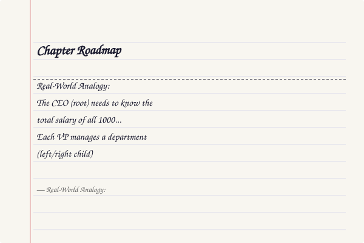
</a>
<a href="../../assets/images/diagrams/data-structures/17-segment-tree/chapter-roadmap-diagram.svg" target="_blank" rel="noopener">
  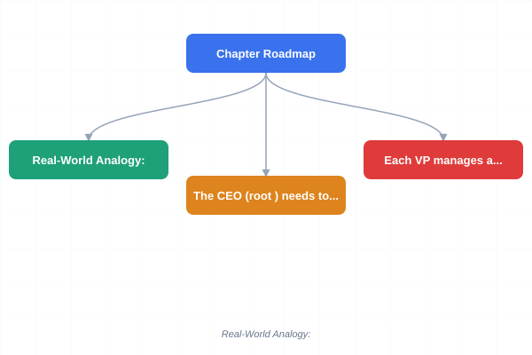
</a>
<a href="../../assets/images/diagrams/data-structures/17-segment-tree/chapter-roadmap-sticky.svg" target="_blank" rel="noopener">
  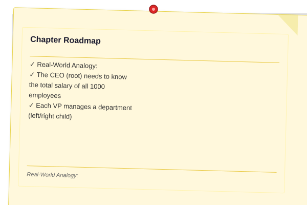
</a>



```mermaid
flowchart TD
    A[Array + Range Query Need] --> B{Query Type?}
    B --> C[Prefix Sum / Point Updates Only]
    B --> D[Min/Max/GCD with Updates]
    B --> E[Range Updates Needed]
    C --> F[Fenwick BIT — O&#40;log n&#41;]
    D --> G[Segment Tree — O&#40;log n&#41;]
    E --> H[Segment Tree + Lazy — O&#40;log n&#41;]
    F --> I[Build O&#40;n&#41;, Space n]
    G --> J[Build O&#40;n&#41;, Space 4n]
    H --> J
    I --> K[Applications]
    J --> K
```

---

## 17.1 Segment Tree Construction

**Real-World Analogy:** Building a company's organizational chart for salary aggregation. The CEO (root) needs to know the total salary of all 1000 employees. Each VP manages a department (left/right child). Each manager handles a team. You build the chart from the bottom up: team leads sum their 5 people's salaries, managers combine 2 team leads, VPs combine 2 managers, and the CEO has the grand total. This hierarchy means any salary question can be answered by looking at just a few nodes.

### Definition

<a href="../../assets/images/diagrams/data-structures/17-segment-tree/definition-handwritten.svg" target="_blank" rel="noopener">
  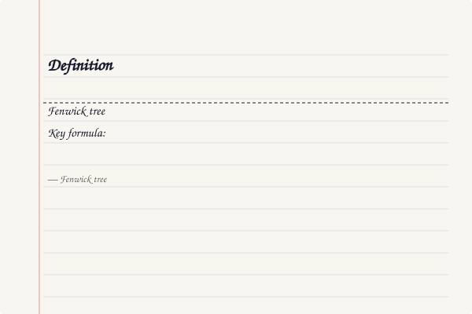
</a>
<a href="../../assets/images/diagrams/data-structures/17-segment-tree/definition-diagram.svg" target="_blank" rel="noopener">
  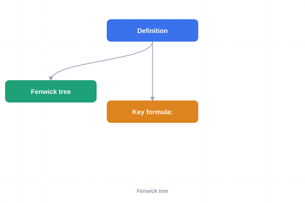
</a>
<a href="../../assets/images/diagrams/data-structures/17-segment-tree/definition-sticky.svg" target="_blank" rel="noopener">
  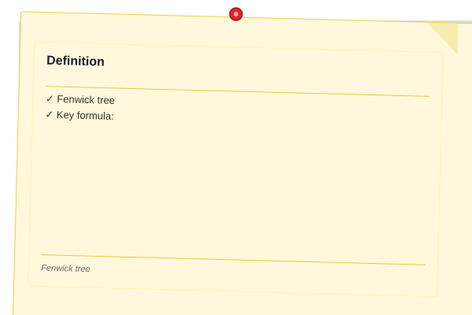
</a>


A **segment tree** is a binary tree where each node represents a contiguous segment (interval) of the array. The root covers the full array `[0, n-1]`. Each leaf represents a single element `[i, i]`. Internal nodes store aggregate information (sum, min, max, GCD, etc.) computed from their two children.

**Key properties:**
- Complete binary tree — stored in an array (1-indexed) of size `4n`.
- Node `i` has left child at `2*i` and right child at `2*i + 1`.
- A node covering `[l, r]` splits at `mid = l + (r - l) / 2`:
  - Left child covers `[l, mid]`
  - Right child covers `[mid + 1, r]`

### Algorithm Steps

<a href="../../assets/images/diagrams/data-structures/17-segment-tree/algorithm-steps-handwritten.svg" target="_blank" rel="noopener">
  
</a>
<a href="../../assets/images/diagrams/data-structures/17-segment-tree/algorithm-steps-diagram.svg" target="_blank" rel="noopener">
  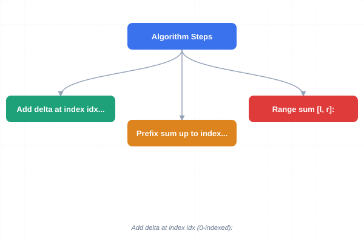
</a>
<a href="../../assets/images/diagrams/data-structures/17-segment-tree/algorithm-steps-sticky.svg" target="_blank" rel="noopener">
  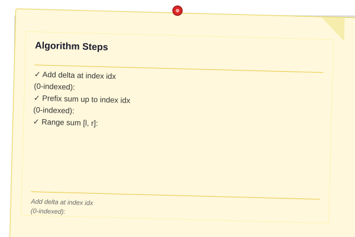
</a>


1. Allocate a tree array of size `4 * n`.
2. Define a recursive function `build(node, l, r)`:
   - If `l == r` (leaf node): set `tree[node] = arr[l]`.
   - Else:
     - Compute `mid = l + (r - l) / 2`.
     - Recursively `build(left_child, l, mid)`.
     - Recursively `build(right_child, mid + 1, r)`.
     - Set `tree[node] = tree[left_child] + tree[right_child]` (or min/max as needed).
3. Start the recursion with `build(1, 0, n-1)`.

### Pseudocode

<a href="../../assets/images/diagrams/data-structures/17-segment-tree/pseudocode-handwritten.svg" target="_blank" rel="noopener">
  
</a>
<a href="../../assets/images/diagrams/data-structures/17-segment-tree/pseudocode-diagram.svg" target="_blank" rel="noopener">
  
</a>
<a href="../../assets/images/diagrams/data-structures/17-segment-tree/pseudocode-sticky.svg" target="_blank" rel="noopener">
  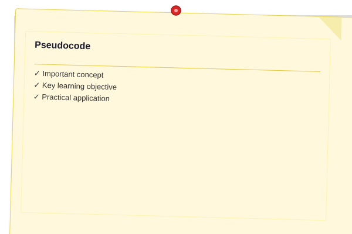
</a>


```
BUILD(arr, n):
    tree = array of size 4*n
    BUILD-REC(1, 0, n-1)

BUILD-REC(node, l, r):
    if l == r:
        tree[node] = arr[l]
        return
    mid = l + (r - l) / 2
    BUILD-REC(2*node, l, mid)
    BUILD-REC(2*node + 1, mid + 1, r)
    tree[node] = tree[2*node] + tree[2*node + 1]
```

### Step-by-Step Dry Run

<a href="../../assets/images/diagrams/data-structures/17-segment-tree/step-by-step-dry-run-handwritten.svg" target="_blank" rel="noopener">
  
</a>
<a href="../../assets/images/diagrams/data-structures/17-segment-tree/step-by-step-dry-run-diagram.svg" target="_blank" rel="noopener">
  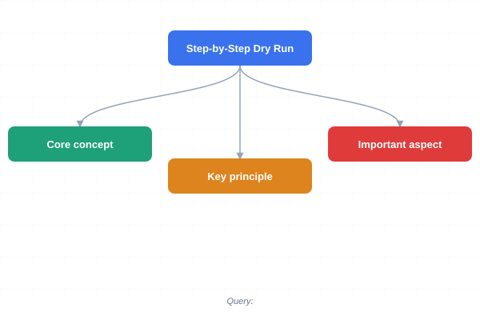
</a>
<a href="../../assets/images/diagrams/data-structures/17-segment-tree/step-by-step-dry-run-sticky.svg" target="_blank" rel="noopener">
  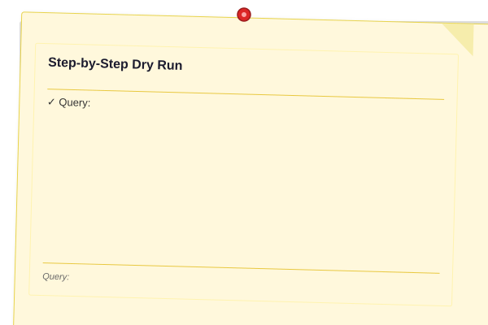
</a>


Input: `arr = [1, 3, 5, 7, 9, 11]`, `n = 6`

Tree array (1-indexed, size 24) shown after each completed build step:

| Step | Node | Range `[l, r]` | Action | tree array state (relevant indices) |
|------|------|----------------|--------|-----------------------------------|
| 1 | 1 | [0,5] | mid=2, recurse left | `[-,-,-,-,-,-,-,-,-,-,-,-,-,-,-,-,-,-,-,-,-,-,-,-]` |
| 2 | 2 | [0,2] | mid=1, recurse left | same |
| 3 | 4 | [0,1] | mid=0, recurse left | same |
| 4 | 8 | [0,0] | leaf → tree[8]=1 | `[-,1,-,-,-,-,-,-,-,-,-,-,-,-,-,-,-,-,-,-,-,-,-,-]` |
| 5 | 9 | [1,1] | leaf → tree[9]=3 | `[-,1,3,-,-,-,-,-,-,-,-,-,-,-,-,-,-,-,-,-,-,-,-,-]` |
| 6 | 4 | combine | tree[4]=tree[8]+tree[9]=4 | `[-,4,3,-,-,-,-,-,-,-,-,-,-,-,-,-,-,-,-,-,-,-,-,-]` |
| 7 | 5 | [2,2] | leaf → tree[5]=5 | `[-,4,3,5,-,-,-,-,-,-,-,-,-,-,-,-,-,-,-,-,-,-,-,-]` |
| 8 | 2 | combine | tree[2]=tree[4]+tree[5]=9 | `[-,9,3,5,4,-,-,-,-,-,-,-,-,-,-,-,-,-,-,-,-,-,-,-]` |
| 9 | 3 | [3,5] | mid=4, recurse left | same |
| 10 | 6 | [3,4] | mid=3, recurse left | same |
| 11 | 12 | [3,3] | leaf → tree[12]=7 | `[-,9,-,5,4,-,-,-,-,-,7,-,-,-,-,-,-,-,-,-,-,-,-]` |
| 12 | 13 | [4,4] | leaf → tree[13]=9 | `[-,9,-,5,4,-,-,-,-,-,7,9,-,-,-,-,-,-,-,-,-,-,-]` |
| 13 | 6 | combine | tree[6]=tree[12]+tree[13]=16 | `[-,9,-,5,4,16,-,-,-,-,7,9,-,-,-,-,-,-,-,-,-,-,-]` |
| 14 | 7 | [5,5] | leaf → tree[7]=11 | `[-,9,-,5,4,16,11,-,-,-,7,9,-,-,-,-,-,-,-,-,-,-,-]` |
| 15 | 3 | combine | tree[3]=tree[6]+tree[7]=27 | `[-,9,27,5,4,16,11,-,-,-,7,9,-,-,-,-,-,-,-,-,-,-,-]` |
| 16 | 1 | combine | tree[1]=tree[2]+tree[3]=36 | `[-,36,27,9,4,16,11,5,1,3,-,-,7,9,-,-,-,-,-,-,-,-,-,-]` |

**Final Tree Array:** (1-indexed, showing indices 1–16)

```
Index:      1   2   3   4   5   6   7   8   9  10  11  12  13  14  15  16
Value:     36   9  27   4   5  16  11   1   3   -   -   7   9   -   -   -
```

**Visual Tree Structure:**

```
                 [0,5]: 36
                /         \
         [0,2]: 9         [3,5]: 27
        /        \        /        \
  [0,1]: 4    [2,2]: 5  [3,4]: 16 [5,5]: 11
   /     \               /     \
[0,0]: 1 [1,1]: 3    [3,3]: 7 [4,4]: 9
```

### Complexity Analysis

<a href="../../assets/images/diagrams/data-structures/17-segment-tree/complexity-analysis-handwritten.svg" target="_blank" rel="noopener">
  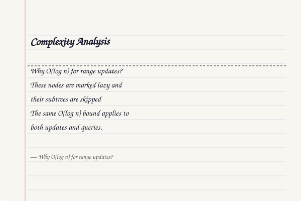
</a>
<a href="../../assets/images/diagrams/data-structures/17-segment-tree/complexity-analysis-diagram.svg" target="_blank" rel="noopener">
  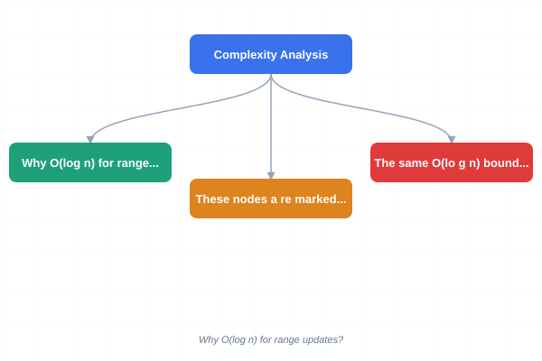
</a>
<a href="../../assets/images/diagrams/data-structures/17-segment-tree/complexity-analysis-sticky.svg" target="_blank" rel="noopener">
  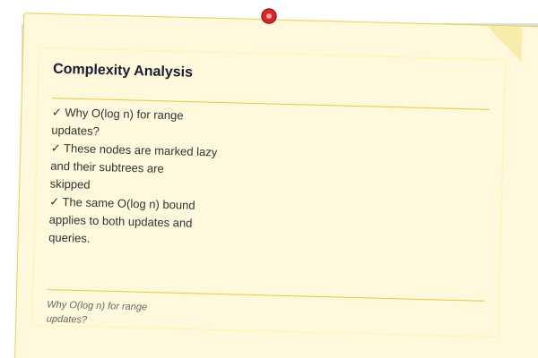
</a>


| Case | Complexity | When |
|------|-----------|------|
| **Build** | O(n) | Each of ~2n nodes visited once |
| **Space** | O(n) — exactly 4n | Worst-case allocation |

**Why O(n)?** The build visits each node exactly once. The segment tree has ~2n nodes for n elements (n leaves + n-1 internal nodes). The `4n` allocation is a safe upper bound that works for any n. The recurrence is:

T(n) = 2T(n/2) + O(1) → by Master Theorem case 1: T(n) = O(n)

Each node does O(1) work (two recursive calls + one addition). With ~2n nodes total, total work is O(n).

**Why 4n space?** The exact size needed is `2 * 2^⌈log₂n⌉ - 1`, which ranges from ~2n to ~4n. Allocating `4n` avoids computing this exact value and is always sufficient.

### Implementations

<a href="../../assets/images/diagrams/data-structures/17-segment-tree/implementations-handwritten.svg" target="_blank" rel="noopener">
  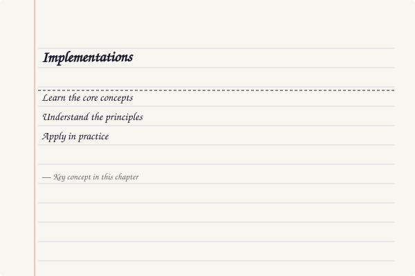
</a>
<a href="../../assets/images/diagrams/data-structures/17-segment-tree/implementations-diagram.svg" target="_blank" rel="noopener">
  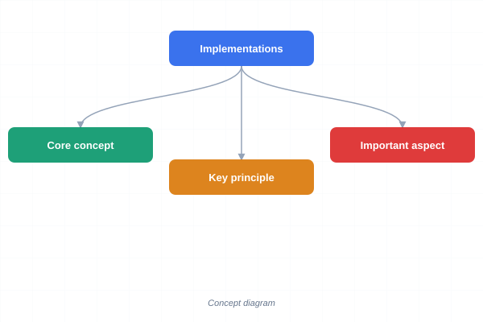
</a>
<a href="../../assets/images/diagrams/data-structures/17-segment-tree/implementations-sticky.svg" target="_blank" rel="noopener">
  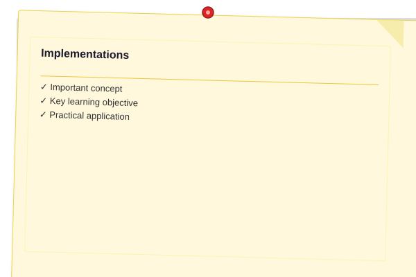
</a>


```cpp
// C++
#include <vector>

class SegmentTree {
private:
    std::vector<int> tree;
    int n;

    void build(const std::vector<int>& arr, int node, int l, int r) {
        if (l == r) {
            tree[node] = arr[l];
            return;
        }
        int mid = l + (r - l) / 2;
        build(arr, node * 2, l, mid);
        build(arr, node * 2 + 1, mid + 1, r);
        tree[node] = tree[node * 2] + tree[node * 2 + 1];
    }

public:
    SegmentTree(const std::vector<int>& arr) {
        n = arr.size();
        tree.resize(4 * n);
        if (n > 0) build(arr, 1, 0, n - 1);
    }

    void printTree() {
        for (int i = 1; i < 2 * n; i++)
            std::cout << tree[i] << " ";
        std::cout << "\n";
    }
};
```

```python
# Python
class SegmentTree:
    def __init__(self, arr):
        self.n = len(arr)
        self.tree = [0] * (4 * self.n)
        if self.n > 0:
            self._build(arr, 1, 0, self.n - 1)

    def _build(self, arr, node, l, r):
        if l == r:
            self.tree[node] = arr[l]
            return
        mid = l + (r - l) // 2
        self._build(arr, node * 2, l, mid)
        self._build(arr, node * 2 + 1, mid + 1, r)
        self.tree[node] = self.tree[node * 2] + self.tree[node * 2 + 1]

    def print_tree(self):
        print(self.tree[1:2 * self.n])
```

```java
// Java
public class SegmentTree {
    private int[] tree;
    private int n;

    public SegmentTree(int[] arr) {
        n = arr.length;
        tree = new int[4 * n];
        if (n > 0) build(arr, 1, 0, n - 1);
    }

    private void build(int[] arr, int node, int l, int r) {
        if (l == r) {
            tree[node] = arr[l];
            return;
        }
        int mid = l + (r - l) / 2;
        build(arr, node * 2, l, mid);
        build(arr, node * 2 + 1, mid + 1, r);
        tree[node] = tree[node * 2] + tree[node * 2 + 1];
    }

    public void printTree() {
        for (int i = 1; i < 2 * n; i++)
            System.out.print(tree[i] + " ");
        System.out.println();
    }
}
```

### Advantages & Disadvantages

<a href="../../assets/images/diagrams/data-structures/17-segment-tree/advantages-disadvantages-handwritten.svg" target="_blank" rel="noopener">
  
</a>
<a href="../../assets/images/diagrams/data-structures/17-segment-tree/advantages-disadvantages-diagram.svg" target="_blank" rel="noopener">
  
</a>
<a href="../../assets/images/diagrams/data-structures/17-segment-tree/advantages-disadvantages-sticky.svg" target="_blank" rel="noopener">
  
</a>


| Advantages | Disadvantages |
|-----------|--------------|
| O(log n) queries and updates | 4n space — high memory for large n |
| Works with any associative operation (sum, min, max, GCD, XOR) | Complex to implement — ~60 lines vs BIT's ~20 |
| Handles both point and range updates (with lazy) | Static size — cannot grow after construction |
| Built-in for competitive programming standard library | Overkill for prefix-only problems |
| No extra data structures needed | Recursive implementation risks stack overflow for n > 10^6 |

### Edge Cases

<a href="../../assets/images/diagrams/data-structures/17-segment-tree/edge-cases-handwritten.svg" target="_blank" rel="noopener">
  
</a>
<a href="../../assets/images/diagrams/data-structures/17-segment-tree/edge-cases-diagram.svg" target="_blank" rel="noopener">
  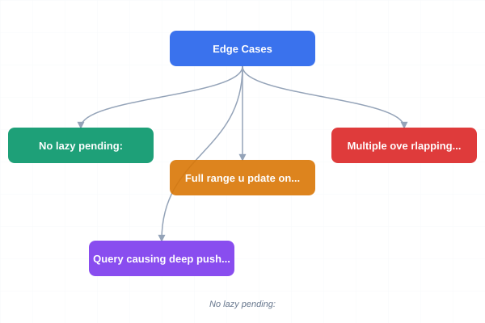
</a>
<a href="../../assets/images/diagrams/data-structures/17-segment-tree/edge-cases-sticky.svg" target="_blank" rel="noopener">
  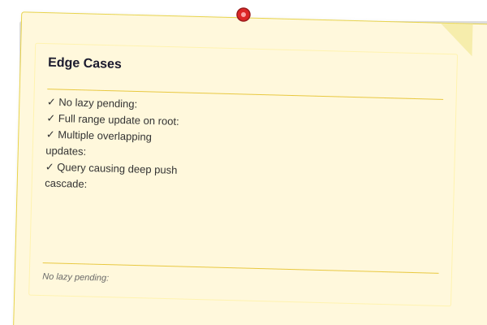
</a>


- **Empty array:** Segment tree with n = 0 — skip build entirely, all queries return identity (0 for sum, INF for min, -INF for max).
- **Single element:** n = 1 — tree has only root at index 1 covering [0,0]. Works correctly for all operations.
- **n = 1:** Tree array is just `[0, arr[0]]` (1-indexed). Children at indices 2 and 3 are never accessed.
- **Large n (>10^6):** Recursive build may overflow the call stack. Use iterative build or increase stack size. The 4n allocation may use ~32 MB for ints (4 bytes × 4 × 10^6).
- **Non-power-of-2 n:** The tree still works correctly. Internal nodes cover uneven splits (e.g., [0,2] → left [0,1], right [2,2] for n=3).

---

## 17.2 Range Query (Sum / Min / Max)

**Real-World Analogy:** The CEO asks, "What's the total salary for departments 3 through 7?" Each VP checks: if their department is fully inside the range, they report its precomputed total. If it's partially inside, they delegate to their managers and combine the results. They never drill down to individual employees unless they have to — and most queries stop at the VP level.

### Definition

<a href="../../assets/images/diagrams/data-structures/17-segment-tree/definition-handwritten.svg" target="_blank" rel="noopener">
  
</a>
<a href="../../assets/images/diagrams/data-structures/17-segment-tree/definition-diagram.svg" target="_blank" rel="noopener">
  
</a>
<a href="../../assets/images/diagrams/data-structures/17-segment-tree/definition-sticky.svg" target="_blank" rel="noopener">
  
</a>


A range query computes the aggregate (sum, minimum, maximum, etc.) of elements in `[ql, qr]`. Starting at the root, three cases arise:

- **Full overlap:** Node's segment is completely inside `[ql, qr]` → return its stored value.
- **No overlap:** Node's segment is completely outside `[ql, qr]` → return identity (0 for sum, INT_MAX for min, INT_MIN for max).
- **Partial overlap:** Recurse to both children and combine results.

### Algorithm Steps (Range Sum Query)

<a href="../../assets/images/diagrams/data-structures/17-segment-tree/algorithm-steps-range-sum-query-handwritten.svg" target="_blank" rel="noopener">
  
</a>
<a href="../../assets/images/diagrams/data-structures/17-segment-tree/algorithm-steps-range-sum-query-diagram.svg" target="_blank" rel="noopener">
  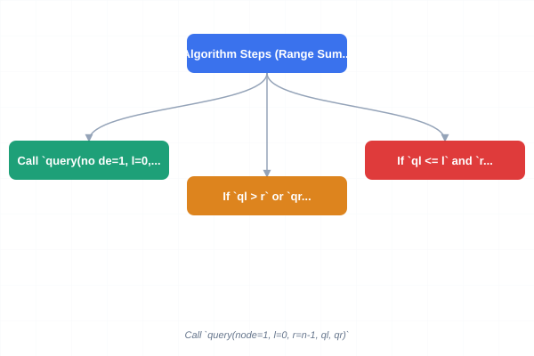
</a>
<a href="../../assets/images/diagrams/data-structures/17-segment-tree/algorithm-steps-range-sum-query-sticky.svg" target="_blank" rel="noopener">
  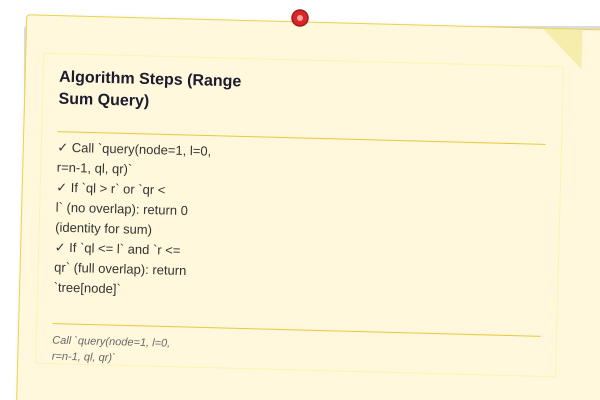
</a>


1. Call `query(node=1, l=0, r=n-1, ql, qr)`.
2. If `ql > r` or `qr < l` (no overlap): return 0 (identity for sum).
3. If `ql <= l` and `r <= qr` (full overlap): return `tree[node]`.
4. Else (partial overlap):
   - Compute `mid = l + (r - l) / 2`.
   - Left result = `query(2*node, l, mid, ql, qr)`.
   - Right result = `query(2*node+1, mid+1, r, ql, qr)`.
   - Return `left_result + right_result`.

### Pseudocode

<a href="../../assets/images/diagrams/data-structures/17-segment-tree/pseudocode-handwritten.svg" target="_blank" rel="noopener">
  
</a>
<a href="../../assets/images/diagrams/data-structures/17-segment-tree/pseudocode-diagram.svg" target="_blank" rel="noopener">
  
</a>
<a href="../../assets/images/diagrams/data-structures/17-segment-tree/pseudocode-sticky.svg" target="_blank" rel="noopener">
  
</a>


```
QUERY(node, l, r, ql, qr):
    if ql > r or qr < l:      // No overlap
        return 0               // Identity for sum
    if ql <= l and r <= qr:    // Full overlap
        return tree[node]

    mid = l + (r - l) / 2
    leftSum = QUERY(2*node, l, mid, ql, qr)
    rightSum = QUERY(2*node+1, mid+1, r, ql, qr)
    return leftSum + rightSum
```

### Step-by-Step Dry Run (Range Sum)

<a href="../../assets/images/diagrams/data-structures/17-segment-tree/step-by-step-dry-run-range-sum-handwritten.svg" target="_blank" rel="noopener">
  
</a>
<a href="../../assets/images/diagrams/data-structures/17-segment-tree/step-by-step-dry-run-range-sum-diagram.svg" target="_blank" rel="noopener">
  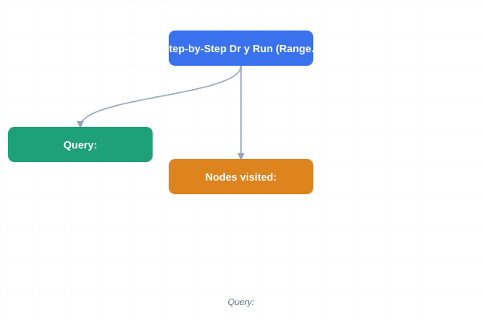
</a>
<a href="../../assets/images/diagrams/data-structures/17-segment-tree/step-by-step-dry-run-range-sum-sticky.svg" target="_blank" rel="noopener">
  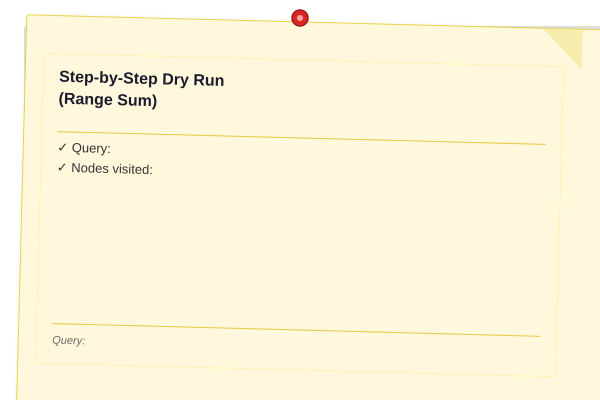
</a>


Array: `arr = [1, 3, 5, 7, 9, 11]`

Pre-built tree (1-indexed):
```
Index:  1   2   3   4   5   6   7   8   9  10  11  12  13
Value: 36   9  27   4   5  16  11   1   3   -   -   7   9
```

**Query:** `sum(1, 4)` — indices 1 through 4 inclusive.

| Step | Node | Seg `[l,r]` | Overlap? | Action |
|------|------|-------------|----------|--------|
| 1 | 1 | [0,5] | Partial | mid=2, recurse left (2) and right (3) |
| 2 | 2 | [0,2] | Partial | mid=1, recurse left (4) and right (5) |
| 3 | 4 | [0,1] | Partial | mid=0, recurse left (8) and right (9) |
| 4 | 8 | [0,0] | ql=1 > r=0 → **None** | Return 0 |
| 5 | 9 | [1,1] | Full [1,1] ⊆ [1,4] | Return tree[9] = **3** |
| 6 | 4 | combine | left=0, right=3 | Return **3** |
| 7 | 5 | [2,2] | Full [2,2] ⊆ [1,4] | Return tree[5] = **5** |
| 8 | 2 | combine | left=3, right=5 | Return **8** |
| 9 | 3 | [3,5] | Partial | mid=4, recurse left (6) and right (7) |
| 10 | 6 | [3,4] | Full [3,4] ⊆ [1,4] | Return tree[6] = **16** |
| 11 | 7 | [5,5] | ql=1 > r=5? No. qr=4 &lt; l=5 → **None** | Return 0 |
| 12 | 3 | combine | left=16, right=0 | Return **16** |
| 13 | 1 | combine | left=8, right=16 | **Return 24** |

Manual verification: `arr[1]+arr[2]+arr[3]+arr[4] = 3+5+7+9 = 24`. ✅

**Nodes visited:** 1, 2, 3, 4, 5, 6, 7, 8, 9 — only 9 of ~12 nodes. Without the segment tree, all 4 elements would be visited. For large n, the segment tree visits O(log n) nodes.

### Complexity Analysis

<a href="../../assets/images/diagrams/data-structures/17-segment-tree/complexity-analysis-handwritten.svg" target="_blank" rel="noopener">
  
</a>
<a href="../../assets/images/diagrams/data-structures/17-segment-tree/complexity-analysis-diagram.svg" target="_blank" rel="noopener">
  
</a>
<a href="../../assets/images/diagrams/data-structures/17-segment-tree/complexity-analysis-sticky.svg" target="_blank" rel="noopener">
  
</a>


| Case | Complexity | When |
|------|-----------|------|
| **Best** | O(1) | Query covers the entire array (full overlap at root) |
| **Worst** | O(log n) | Query at leaf level, visiting O(log n) nodes per level |
| **Average** | O(log n) | |

**Why O(log n)?** The query visits at most 4 nodes per level of the tree. Reason: at each level, you can have at most 2 partially overlapping nodes (one on the left boundary, one on the right boundary), and any fully covered nodes between them return immediately. With log₂n levels, total nodes visited ≤ 4 log₂n = O(log n).

For n = 1,000,000: at most 4 × 20 = 80 node visits vs 1,000,000 for a linear scan.

### Implementations

<a href="../../assets/images/diagrams/data-structures/17-segment-tree/implementations-handwritten.svg" target="_blank" rel="noopener">
  
</a>
<a href="../../assets/images/diagrams/data-structures/17-segment-tree/implementations-diagram.svg" target="_blank" rel="noopener">
  
</a>
<a href="../../assets/images/diagrams/data-structures/17-segment-tree/implementations-sticky.svg" target="_blank" rel="noopener">
  
</a>


```cpp
// C++ — Range Sum Query
int query(int node, int l, int r, int ql, int qr) {
    if (ql > r || qr < l) return 0;
    if (ql <= l && r <= qr) return tree[node];
    int mid = l + (r - l) / 2;
    return query(node * 2, l, mid, ql, qr) +
           query(node * 2 + 1, mid + 1, r, ql, qr);
}

int rangeSum(int l, int r) {
    return query(1, 0, n - 1, l, r);
}
```

```python
# Python — Range Sum Query
def _query(self, node, l, r, ql, qr):
    if ql > r or qr < l:
        return 0
    if ql <= l and r <= qr:
        return self.tree[node]
    mid = l + (r - l) // 2
    left = self._query(node * 2, l, mid, ql, qr)
    right = self._query(node * 2 + 1, mid + 1, r, ql, qr)
    return left + right

def range_sum(self, l, r):
    return self._query(1, 0, self.n - 1, l, r)
```

```java
// Java — Range Sum Query
private int query(int node, int l, int r, int ql, int qr) {
    if (ql > r || qr < l) return 0;
    if (ql <= l && r <= qr) return tree[node];
    int mid = l + (r - l) / 2;
    return query(node * 2, l, mid, ql, qr) +
           query(node * 2 + 1, mid + 1, r, ql, qr);
}

public int rangeSum(int l, int r) {
    return query(1, 0, n - 1, l, r);
}
```

**Range Minimum Query (RMQ) variant:** Replace the combine operation and identity:

```cpp
// For min query:
int queryMin(int node, int l, int r, int ql, int qr) {
    if (ql > r || qr < l) return INT_MAX;       // Identity for min
    if (ql <= l && r <= qr) return tree[node];
    int mid = l + (r - l) / 2;
    return min(queryMin(node * 2, l, mid, ql, qr),
               queryMin(node * 2 + 1, mid + 1, r, ql, qr));
}
```

**Range Maximum Query variant:**

```cpp
// For max query:
int queryMax(int node, int l, int r, int ql, int qr) {
    if (ql > r || qr < l) return INT_MIN;       // Identity for max
    if (ql <= l && r <= qr) return tree[node];
    int mid = l + (r - l) / 2;
    return max(queryMax(node * 2, l, mid, ql, qr),
               queryMax(node * 2 + 1, mid + 1, r, ql, qr));
}
```

### Advantages & Disadvantages

<a href="../../assets/images/diagrams/data-structures/17-segment-tree/advantages-disadvantages-handwritten.svg" target="_blank" rel="noopener">
  
</a>
<a href="../../assets/images/diagrams/data-structures/17-segment-tree/advantages-disadvantages-diagram.svg" target="_blank" rel="noopener">
  
</a>
<a href="../../assets/images/diagrams/data-structures/17-segment-tree/advantages-disadvantages-sticky.svg" target="_blank" rel="noopener">
  
</a>


| Advantages | Disadvantages |
|-----------|--------------|
| O(log n) for any range — no preprocessing per query | Identity value depends on operation (0 for sum, INF for min) |
| Works for sum, min, max, GCD, XOR — any associative operation | Recursive queries may stack overflow in some languages |
| Can answer first/last occurrence of value in range (with extensions) | Constant factor higher than BIT for prefix sums |
| Multiple aggregate types can share one tree | Must decide identity at compile time in static languages |

### Edge Cases

<a href="../../assets/images/diagrams/data-structures/17-segment-tree/edge-cases-handwritten.svg" target="_blank" rel="noopener">
  
</a>
<a href="../../assets/images/diagrams/data-structures/17-segment-tree/edge-cases-diagram.svg" target="_blank" rel="noopener">
  
</a>
<a href="../../assets/images/diagrams/data-structures/17-segment-tree/edge-cases-sticky.svg" target="_blank" rel="noopener">
  
</a>


- **Query outside bounds:** `query(0, 5)` when n=6 — no overlap returns 0 (for sum). Should be validated at the public API level.
- **Query single element:** `query(3, 3)` — finds the leaf node [3,3] in O(log n) and returns its stored value.
- **Query entire array:** `query(0, n-1)` — root is fully covered, returns tree[1] in O(1).
- **Query with l > r:** `query(5, 3)` — no overlap → returns 0 immediately. Guard against this at the public interface.
- **Negative numbers:** Range sum handles negatives naturally. Min query correctly returns the most negative value.
- **Large queries on sparse trees:** Same O(log n) behavior regardless of query range size.

---

## 17.3 Point Update

**Real-World Analogy:** One employee gets a raise. Instead of recalculating every department's total from scratch, you update the employee's salary in the ledger, then update their team lead's subtotal, that team's manager's subtotal, the VP's total, and finally the CEO's grand total. Only log(n) people need to update their records — everyone else's numbers are unchanged.

### Definition

<a href="../../assets/images/diagrams/data-structures/17-segment-tree/definition-handwritten.svg" target="_blank" rel="noopener">
  
</a>
<a href="../../assets/images/diagrams/data-structures/17-segment-tree/definition-diagram.svg" target="_blank" rel="noopener">
  
</a>
<a href="../../assets/images/diagrams/data-structures/17-segment-tree/definition-sticky.svg" target="_blank" rel="noopener">
  
</a>


A point update changes the value of a single element `arr[idx]` to a new value. The update propagates from the leaf up to the root, recomputing the aggregate at each ancestor node.

### Algorithm Steps

<a href="../../assets/images/diagrams/data-structures/17-segment-tree/algorithm-steps-handwritten.svg" target="_blank" rel="noopener">
  
</a>
<a href="../../assets/images/diagrams/data-structures/17-segment-tree/algorithm-steps-diagram.svg" target="_blank" rel="noopener">
  
</a>
<a href="../../assets/images/diagrams/data-structures/17-segment-tree/algorithm-steps-sticky.svg" target="_blank" rel="noopener">
  
</a>


1. Start at root `(node=1, l=0, r=n-1)`.
2. If `l == r` (reached leaf at idx):
   - Set `tree[node] = newValue`.
   - Return.
3. Compute `mid = l + (r - l) / 2`.
4. If `idx <= mid`, recurse to left child; else recurse to right child.
5. After child returns, recompute: `tree[node] = tree[2*node] + tree[2*node + 1]`.

### Pseudocode

<a href="../../assets/images/diagrams/data-structures/17-segment-tree/pseudocode-handwritten.svg" target="_blank" rel="noopener">
  
</a>
<a href="../../assets/images/diagrams/data-structures/17-segment-tree/pseudocode-diagram.svg" target="_blank" rel="noopener">
  
</a>
<a href="../../assets/images/diagrams/data-structures/17-segment-tree/pseudocode-sticky.svg" target="_blank" rel="noopener">
  
</a>


```
UPDATE(node, l, r, idx, newVal):
    if l == r:
        tree[node] = newVal
        return
    mid = l + (r - l) / 2
    if idx <= mid:
        UPDATE(2*node, l, mid, idx, newVal)
    else:
        UPDATE(2*node+1, mid+1, r, idx, newVal)
    tree[node] = tree[2*node] + tree[2*node+1]
```

### Step-by-Step Dry Run

<a href="../../assets/images/diagrams/data-structures/17-segment-tree/step-by-step-dry-run-handwritten.svg" target="_blank" rel="noopener">
  
</a>
<a href="../../assets/images/diagrams/data-structures/17-segment-tree/step-by-step-dry-run-diagram.svg" target="_blank" rel="noopener">
  
</a>
<a href="../../assets/images/diagrams/data-structures/17-segment-tree/step-by-step-dry-run-sticky.svg" target="_blank" rel="noopener">
  
</a>


Array: `arr = [1, 3, 5, 7, 9, 11]`

Initial tree (1-indexed):
```
Index:  1   2   3   4   5   6   7   8   9  10  11  12  13
Value: 36   9  27   4   5  16  11   1   3   -   -   7   9
```

**Update:** `pointUpdate(2, 10)` — set `arr[2] = 10` (was 5).

| Step | Node | Seg `[l,r]` | Action | tree after update |
|------|------|-------------|--------|-------------------|
| 1 | 1 | [0,5] | mid=2, idx=2 ≤ 2, go left | — |
| 2 | 2 | [0,2] | mid=1, idx=2 > 1, go right | — |
| 3 | 5 | [2,2] | leaf → tree[5] = **10** | tree[5]=10 |
| 4 | 2 | recompute | tree[2] = tree[4]+tree[5] = 4+10 = **14** | tree[2]=14 |
| 5 | 1 | recompute | tree[1] = tree[2]+tree[3] = 14+27 = **41** | tree[1]=41 |

Final tree after update:
```
Index:  1   2   3   4   5   6   7   8   9  10  11  12  13
Value: 41  14  27   4  10  16  11   1   3   -   -   7   9
```

Verification: New sum of all elements = 1+3+10+7+9+11 = 41 ✅. Old sum was 36, difference is +5 (10-5).

### Complexity Analysis

<a href="../../assets/images/diagrams/data-structures/17-segment-tree/complexity-analysis-handwritten.svg" target="_blank" rel="noopener">
  
</a>
<a href="../../assets/images/diagrams/data-structures/17-segment-tree/complexity-analysis-diagram.svg" target="_blank" rel="noopener">
  
</a>
<a href="../../assets/images/diagrams/data-structures/17-segment-tree/complexity-analysis-sticky.svg" target="_blank" rel="noopener">
  
</a>


| Case | Complexity | When |
|------|-----------|------|
| **All cases** | O(log n) | Always travels root-to-leaf and back |

**Why O(log n)?** The update path follows a single root-to-leaf path of length log₂n. At each of the log₂n levels, we do O(1) work (compare idx, recurse). On the way back, we update log₂n ancestors. Total: 2 × log₂n = O(log n).

Compare to naively rebuilding the entire tree: O(n). A point update is exponentially faster for large arrays.

### Implementations

<a href="../../assets/images/diagrams/data-structures/17-segment-tree/implementations-handwritten.svg" target="_blank" rel="noopener">
  
</a>
<a href="../../assets/images/diagrams/data-structures/17-segment-tree/implementations-diagram.svg" target="_blank" rel="noopener">
  
</a>
<a href="../../assets/images/diagrams/data-structures/17-segment-tree/implementations-sticky.svg" target="_blank" rel="noopener">
  
</a>


```cpp
// C++
void update(int node, int l, int r, int idx, int value) {
    if (l == r) {
        tree[node] = value;
        return;
    }
    int mid = l + (r - l) / 2;
    if (idx <= mid)
        update(node * 2, l, mid, idx, value);
    else
        update(node * 2 + 1, mid + 1, r, idx, value);
    tree[node] = tree[node * 2] + tree[node * 2 + 1];
}

void pointUpdate(int idx, int value) {
    update(1, 0, n - 1, idx, value);
}
```

```python
# Python
def _update(self, node, l, r, idx, value):
    if l == r:
        self.tree[node] = value
        return
    mid = l + (r - l) // 2
    if idx <= mid:
        self._update(node * 2, l, mid, idx, value)
    else:
        self._update(node * 2 + 1, mid + 1, r, idx, value)
    self.tree[node] = self.tree[node * 2] + self.tree[node * 2 + 1]

def point_update(self, idx, value):
    self._update(1, 0, self.n - 1, idx, value)
```

```java
// Java
private void update(int node, int l, int r, int idx, int value) {
    if (l == r) {
        tree[node] = value;
        return;
    }
    int mid = l + (r - l) / 2;
    if (idx <= mid)
        update(node * 2, l, mid, idx, value);
    else
        update(node * 2 + 1, mid + 1, r, idx, value);
    tree[node] = tree[node * 2] + tree[node * 2 + 1];
}

public void pointUpdate(int idx, int value) {
    update(1, 0, n - 1, idx, value);
}
```

### Advantages & Disadvantages

<a href="../../assets/images/diagrams/data-structures/17-segment-tree/advantages-disadvantages-handwritten.svg" target="_blank" rel="noopener">
  
</a>
<a href="../../assets/images/diagrams/data-structures/17-segment-tree/advantages-disadvantages-diagram.svg" target="_blank" rel="noopener">
  
</a>
<a href="../../assets/images/diagrams/data-structures/17-segment-tree/advantages-disadvantages-sticky.svg" target="_blank" rel="noopener">
  
</a>


| Advantages | Disadvantages |
|-----------|--------------|
| O(log n) — much faster than rebuilding O(n) | Must recalculate all ancestors |
| Same function works for sum, min, max — only combine changes | Recursion depth = log₂n, still risks stack overflow for huge n |
| Supports delta-update pattern (`arr[i] += delta`) with minor modification | Updating non-existent index crashes without bounds check |

### Edge Cases

<a href="../../assets/images/diagrams/data-structures/17-segment-tree/edge-cases-handwritten.svg" target="_blank" rel="noopener">
  
</a>
<a href="../../assets/images/diagrams/data-structures/17-segment-tree/edge-cases-diagram.svg" target="_blank" rel="noopener">
  
</a>
<a href="../../assets/images/diagrams/data-structures/17-segment-tree/edge-cases-sticky.svg" target="_blank" rel="noopener">
  
</a>


- **Update last element:** `pointUpdate(n-1, value)` — reaches rightmost leaf, path includes only right children.
- **Update first element:** `pointUpdate(0, value)` — path includes only left children.
- **Same value:** If `newValue == oldValue`, the tree is unchanged but O(log n) work is still done. Add an early-exit check if needed.
- **Index out of bounds:** Should throw or return an error before entering recursion.
- **Empty tree (n=0):** pointUpdate should be a no-op or throw.

---

## 17.4 Lazy Propagation (Range Update)

**Real-World Analogy:** The CEO announces a company-wide 5% bonus. Without lazy propagation, HR would update every single employee's salary individually — O(n) work. With lazy propagation, the CEO tells each VP: "Give everyone in your department a 5% bonus." The VP tells each manager the same. A manager with a team of 5 people writes a note: "Pending: +5% for team of 5" and stops there. The actual salary math only happens when someone asks for a specific employee's number. If nobody ever asks the individual, the note stays as a note — O(log n) to propagate the instruction, O(1) per employee when actually needed.

### Definition

<a href="../../assets/images/diagrams/data-structures/17-segment-tree/definition-handwritten.svg" target="_blank" rel="noopener">
  
</a>
<a href="../../assets/images/diagrams/data-structures/17-segment-tree/definition-diagram.svg" target="_blank" rel="noopener">
  
</a>
<a href="../../assets/images/diagrams/data-structures/17-segment-tree/definition-sticky.svg" target="_blank" rel="noopener">
  
</a>


**Lazy propagation** is an optimization that defers range updates to a segment tree. Instead of updating every leaf in the range (O(n)), we:

1. Mark covering nodes with a "pending update" value in a separate `lazy` array.
2. Update the node's aggregate value immediately (it knows the full effect of the pending update on its segment).
3. When a query or subsequent update needs to go deeper, "push" the pending value to children first — then clear the current node's lazy flag.

This keeps both range updates and range queries at O(log n).

### Algorithm Steps (Range Add + Range Sum)

<a href="../../assets/images/diagrams/data-structures/17-segment-tree/algorithm-steps-range-add-range-sum-handwritten.svg" target="_blank" rel="noopener">
  
</a>
<a href="../../assets/images/diagrams/data-structures/17-segment-tree/algorithm-steps-range-add-range-sum-diagram.svg" target="_blank" rel="noopener">
  
</a>
<a href="../../assets/images/diagrams/data-structures/17-segment-tree/algorithm-steps-range-add-range-sum-sticky.svg" target="_blank" rel="noopener">
  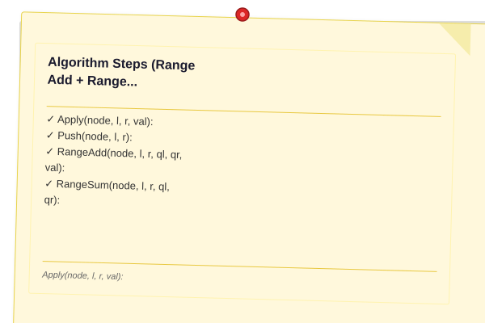
</a>


1. **Apply(node, l, r, val):**
   - Add `(r - l + 1) * val` to `tree[node]` (the sum increases by val per element).
   - Add `val` to `lazy[node]` (mark as pending for children).

2. **Push(node, l, r):**
   - If `lazy[node] != 0`:
     - Compute `mid = l + (r - l) / 2`.
     - `apply(left_child, l, mid, lazy[node])`.
     - `apply(right_child, mid+1, r, lazy[node])`.
     - Set `lazy[node] = 0`.

3. **RangeAdd(node, l, r, ql, qr, val):**
   - If no overlap: return.
   - If full overlap: `apply(node, l, r, val)` and return.
   - `push(node, l, r)` before recursing.
   - Recurse to both children.
   - `tree[node] = tree[left] + tree[right]`.

4. **RangeSum(node, l, r, ql, qr):**
   - If no overlap: return 0.
   - If full overlap: return `tree[node]`.
   - `push(node, l, r)` before recursing.
   - Return sum of children's results.

### Pseudocode

<a href="../../assets/images/diagrams/data-structures/17-segment-tree/pseudocode-handwritten.svg" target="_blank" rel="noopener">
  
</a>
<a href="../../assets/images/diagrams/data-structures/17-segment-tree/pseudocode-diagram.svg" target="_blank" rel="noopener">
  
</a>
<a href="../../assets/images/diagrams/data-structures/17-segment-tree/pseudocode-sticky.svg" target="_blank" rel="noopener">
  
</a>


```
APPLY(node, l, r, val):
    tree[node] += (r - l + 1) * val
    lazy[node] += val

PUSH(node, l, r):
    if lazy[node] != 0:
        mid = l + (r - l) / 2
        APPLY(2*node, l, mid, lazy[node])
        APPLY(2*node+1, mid+1, r, lazy[node])
        lazy[node] = 0

RANGE-ADD(node, l, r, ql, qr, val):
    if ql > r or qr < l: return
    if ql <= l and r <= qr:
        APPLY(node, l, r, val)
        return
    PUSH(node, l, r)
    mid = l + (r - l) / 2
    RANGE-ADD(2*node, l, mid, ql, qr, val)
    RANGE-ADD(2*node+1, mid+1, r, ql, qr, val)
    tree[node] = tree[2*node] + tree[2*node+1]

RANGE-SUM(node, l, r, ql, qr):
    if ql > r or qr < l: return 0
    if ql <= l and r <= qr: return tree[node]
    PUSH(node, l, r)
    mid = l + (r - l) / 2
    return RANGE-SUM(2*node, l, mid, ql, qr) +
           RANGE-SUM(2*node+1, mid+1, r, ql, qr)
```

### Step-by-Step Dry Run (Lazy Propagation)

<a href="../../assets/images/diagrams/data-structures/17-segment-tree/step-by-step-dry-run-lazy-propagation-handwritten.svg" target="_blank" rel="noopener">
  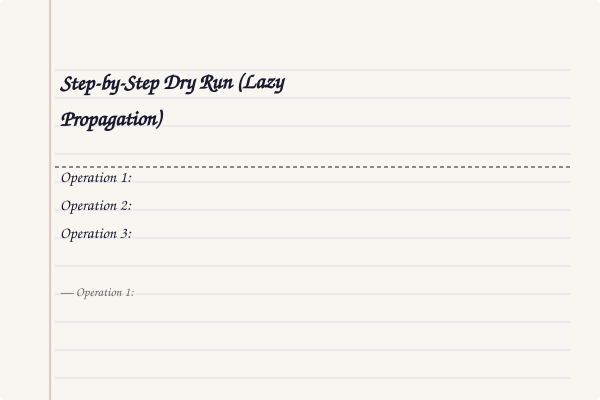
</a>
<a href="../../assets/images/diagrams/data-structures/17-segment-tree/step-by-step-dry-run-lazy-propagation-diagram.svg" target="_blank" rel="noopener">
  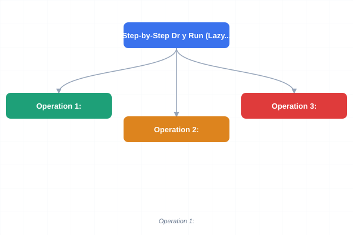
</a>
<a href="../../assets/images/diagrams/data-structures/17-segment-tree/step-by-step-dry-run-lazy-propagation-sticky.svg" target="_blank" rel="noopener">
  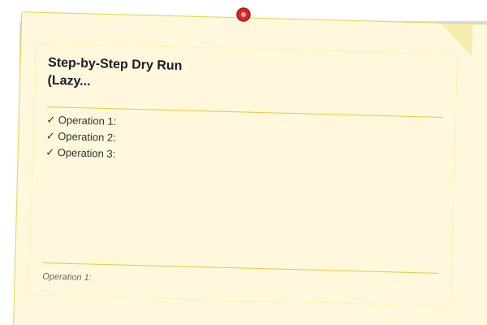
</a>


Array: `arr = [1, 2, 3, 4, 5]`, `n = 5`

Initial tree (1-indexed, relevant indices shown):
```
Index:     1    2    3    4    5    6    7    8    9   10
Value:    15    3   12    1    2    7    5    1    2    3
lazy:      0    0    0    0    0    0    0    0    0    0
```

Visual structure:
```
                 [0,4]: 15 (lazy=0)
                /             \
         [0,1]: 3 (0)       [2,4]: 12 (0)
         /       \           /        \
   [0,0]:1(0) [1,1]:2(0) [2,3]:7(0) [4,4]:5(0)
                          /       \
                    [2,2]:3(0) [3,3]:4(0)
```

**Operation 1:** Add 10 to range [1, 3]

| Step | Node | Seg `[l,r]` | Action | tree/after | lazy/after |
|------|------|-------------|--------|-----------|-----------|
| 1 | 1 | [0,4] | Partial, mid=2, push(1) — lazy[1]=0, nothing to push | — | — |
| 2 | 2 | [0,1] | Partial, mid=0, push(2) | — | — |
| 3 | 4 | [0,0] | ql=1 > r=0 → No overlap | return | — |
| 4 | 5 | [1,1] | Full [1,1] ⊆ [1,3] → apply: tree[5]+=(1-1+1)×10=+10 | tree[5]=12 | lazy[5]+=10 |
| 5 | 2 | combine | tree[2]=tree[4]+tree[5]=1+12=13 | tree[2]=13 | — |
| 6 | 3 | [2,4] | Partial, mid=3, push(3) | — | — |
| 7 | 6 | [2,3] | Full [2,3] ⊆ [1,3] → apply: tree[6]+=(3-2+1)×10=+20 | tree[6]=27 | lazy[6]+=10 |
| 8 | 7 | [4,4] | ql=1 > r=4? No. qr=3 &lt; l=4 → No overlap | return | — |
| 9 | 3 | combine | tree[3]=tree[6]+tree[7]=27+5=32 | tree[3]=32 | — |
| 10 | 1 | combine | tree[1]=tree[2]+tree[3]=13+32=45 | tree[1]=45 | — |

State after Operation 1:
```
Index:     1    2    3    4    5    6    7    8    9   10
Value:    45   13   32    1   12   27    5    1    2    3
lazy:      0    0    0    0   10   10    0    0    0    0
```

Note: `tree[6]` and `tree[5]` were updated immediately. Their children ([2,2], [3,3] for node 6; [1,1] for node 5) still have stale values because the update is "lazy" — stored at node 6 and node 5.

**Operation 2:** Query sum of range [0, 4]

| Step | Node | Seg `[l,r]` | Action | Result |
|------|------|-------------|--------|--------|
| 1 | 1 | [0,4] | Full overlap → **Return tree[1] = 45** | 45 |

Verification: Original sum = 15. Added 10 to indices 1,2,3 (3 elements × 10 = 30). New sum = 15 + 30 = 45 ✅. O(1) because root was fully covered.

**Operation 3:** Query sum of range [2, 2] (needs to push lazy)

| Step | Node | Seg `[l,r]` | Action | Result |
|------|------|-------------|--------|--------|
| 1 | 1 | [0,4] | Partial, mid=2, push(1) — lazy=0, skip | — |
| 2 | 2 | [0,1] | ql=2 > r=1 → No overlap | 0 |
| 3 | 3 | [2,4] | Partial, mid=3, push(3) — lazy[3]=0 | — |
| 4 | 6 | [2,3] | Partial, mid=2, push(6) — lazy[6]=**10** ! | — |
| 5 | push(6) | | apply(12, 2, 2, 10): tree[12] += (1×10) → +=10<br>apply(13, 3, 3, 10): tree[13] += (1×10) → +=10<br>lazy[6] = 0 | tree[12]=13<br>tree[13]=14<br>lazy[6]=0 |
| 6 | 12 | [2,2] | Full overlap → Return tree[12] = 13 | 13 |

Result: `sum(2, 2) = 13`. Manual: arr[2] was 3, +10 = 13 ✅. The lazy value was pushed down only when the query needed the actual leaf value.

### Complexity Analysis

<a href="../../assets/images/diagrams/data-structures/17-segment-tree/complexity-analysis-handwritten.svg" target="_blank" rel="noopener">
  
</a>
<a href="../../assets/images/diagrams/data-structures/17-segment-tree/complexity-analysis-diagram.svg" target="_blank" rel="noopener">
  
</a>
<a href="../../assets/images/diagrams/data-structures/17-segment-tree/complexity-analysis-sticky.svg" target="_blank" rel="noopener">
  
</a>


| Operation | Complexity | Why |
|-----------|-----------|-----|
| Range update | O(log n) | Visit O(log n) nodes, mark lazy for fully covered ones |
| Range query with lazy | O(log n) | Push only on the path, at most 4 nodes per level |
| Point update with lazy | O(log n) | Push lazy along the root-to-leaf path, then update |

**Why O(log n) for range updates?** Without lazy propagation, updating range [l, r] requires updating each of (r-l+1) leaves — O(n). With lazy propagation, we cover the range with O(log n) maximal nodes (nodes whose segments are fully inside the range and whose parent is not). These nodes are marked lazy and their subtrees are skipped. The same O(log n) bound applies to both updates and queries.

### Implementations

<a href="../../assets/images/diagrams/data-structures/17-segment-tree/implementations-handwritten.svg" target="_blank" rel="noopener">
  
</a>
<a href="../../assets/images/diagrams/data-structures/17-segment-tree/implementations-diagram.svg" target="_blank" rel="noopener">
  
</a>
<a href="../../assets/images/diagrams/data-structures/17-segment-tree/implementations-sticky.svg" target="_blank" rel="noopener">
  
</a>


```cpp
// C++ — Lazy Segment Tree (Range Add, Range Sum)
#include <vector>

class LazySegmentTree {
private:
    std::vector<long long> tree;
    std::vector<long long> lazy;
    int n;

    void build(const std::vector<int>& arr, int node, int l, int r) {
        if (l == r) {
            tree[node] = arr[l];
            return;
        }
        int mid = l + (r - l) / 2;
        build(arr, node * 2, l, mid);
        build(arr, node * 2 + 1, mid + 1, r);
        tree[node] = tree[node * 2] + tree[node * 2 + 1];
    }

    void apply(int node, int l, int r, long long val) {
        tree[node] += (r - l + 1) * val;
        lazy[node] += val;
    }

    void push(int node, int l, int r) {
        if (lazy[node] != 0) {
            int mid = l + (r - l) / 2;
            apply(node * 2, l, mid, lazy[node]);
            apply(node * 2 + 1, mid + 1, r, lazy[node]);
            lazy[node] = 0;
        }
    }

    void rangeAdd(int node, int l, int r, int ql, int qr, long long val) {
        if (ql > r || qr < l) return;
        if (ql <= l && r <= qr) {
            apply(node, l, r, val);
            return;
        }
        push(node, l, r);
        int mid = l + (r - l) / 2;
        rangeAdd(node * 2, l, mid, ql, qr, val);
        rangeAdd(node * 2 + 1, mid + 1, r, ql, qr, val);
        tree[node] = tree[node * 2] + tree[node * 2 + 1];
    }

    long long rangeSum(int node, int l, int r, int ql, int qr) {
        if (ql > r || qr < l) return 0;
        if (ql <= l && r <= qr) return tree[node];
        push(node, l, r);
        int mid = l + (r - l) / 2;
        return rangeSum(node * 2, l, mid, ql, qr) +
               rangeSum(node * 2 + 1, mid + 1, r, ql, qr);
    }

public:
    LazySegmentTree(const std::vector<int>& arr) {
        n = arr.size();
        tree.resize(4 * n, 0);
        lazy.resize(4 * n, 0);
        if (n > 0) build(arr, 1, 0, n - 1);
    }

    void addRange(int l, int r, long long val) {
        rangeAdd(1, 0, n - 1, l, r, val);
    }

    long long sumRange(int l, int r) {
        return rangeSum(1, 0, n - 1, l, r);
    }
};

// Usage:
// LazySegmentTree st({1, 2, 3, 4, 5});
// st.addRange(1, 3, 10);     // Add 10 to indices 1-3
// cout << st.sumRange(0, 4);  // Output: 45
```

```python
# Python — Lazy Segment Tree (Range Add, Range Sum)
class LazySegmentTree:
    def __init__(self, arr):
        self.n = len(arr)
        self.tree = [0] * (4 * self.n)
        self.lazy = [0] * (4 * self.n)
        if self.n > 0:
            self._build(arr, 1, 0, self.n - 1)

    def _build(self, arr, node, l, r):
        if l == r:
            self.tree[node] = arr[l]
            return
        mid = l + (r - l) // 2
        self._build(arr, node * 2, l, mid)
        self._build(arr, node * 2 + 1, mid + 1, r)
        self.tree[node] = self.tree[node * 2] + self.tree[node * 2 + 1]

    def _apply(self, node, l, r, val):
        self.tree[node] += (r - l + 1) * val
        self.lazy[node] += val

    def _push(self, node, l, r):
        if self.lazy[node] != 0:
            mid = l + (r - l) // 2
            self._apply(node * 2, l, mid, self.lazy[node])
            self._apply(node * 2 + 1, mid + 1, r, self.lazy[node])
            self.lazy[node] = 0

    def _range_add(self, node, l, r, ql, qr, val):
        if ql > r or qr < l:
            return
        if ql <= l and r <= qr:
            self._apply(node, l, r, val)
            return
        self._push(node, l, r)
        mid = l + (r - l) // 2
        self._range_add(node * 2, l, mid, ql, qr, val)
        self._range_add(node * 2 + 1, mid + 1, r, ql, qr, val)
        self.tree[node] = self.tree[node * 2] + self.tree[node * 2 + 1]

    def _range_sum(self, node, l, r, ql, qr):
        if ql > r or qr < l:
            return 0
        if ql <= l and r <= qr:
            return self.tree[node]
        self._push(node, l, r)
        mid = l + (r - l) // 2
        return (self._range_sum(node * 2, l, mid, ql, qr) +
                self._range_sum(node * 2 + 1, mid + 1, r, ql, qr))

    def add_range(self, l, r, val):
        self._range_add(1, 0, self.n - 1, l, r, val)

    def sum_range(self, l, r):
        return self._range_sum(1, 0, self.n - 1, l, r)
```

```java
// Java — Lazy Segment Tree (Range Add, Range Sum)
public class LazySegmentTree {
    private long[] tree;
    private long[] lazy;
    private int n;

    public LazySegmentTree(int[] arr) {
        n = arr.length;
        tree = new long[4 * n];
        lazy = new long[4 * n];
        if (n > 0) build(arr, 1, 0, n - 1);
    }

    private void build(int[] arr, int node, int l, int r) {
        if (l == r) {
            tree[node] = arr[l];
            return;
        }
        int mid = l + (r - l) / 2;
        build(arr, node * 2, l, mid);
        build(arr, node * 2 + 1, mid + 1, r);
        tree[node] = tree[node * 2] + tree[node * 2 + 1];
    }

    private void apply(int node, int l, int r, long val) {
        tree[node] += (r - l + 1) * val;
        lazy[node] += val;
    }

    private void push(int node, int l, int r) {
        if (lazy[node] != 0) {
            int mid = l + (r - l) / 2;
            apply(node * 2, l, mid, lazy[node]);
            apply(node * 2 + 1, mid + 1, r, lazy[node]);
            lazy[node] = 0;
        }
    }

    public void addRange(int ql, int qr, long val) {
        rangeAdd(1, 0, n - 1, ql, qr, val);
    }

    private void rangeAdd(int node, int l, int r, int ql, int qr, long val) {
        if (ql > r || qr < l) return;
        if (ql <= l && r <= qr) {
            apply(node, l, r, val);
            return;
        }
        push(node, l, r);
        int mid = l + (r - l) / 2;
        rangeAdd(node * 2, l, mid, ql, qr, val);
        rangeAdd(node * 2 + 1, mid + 1, r, ql, qr, val);
        tree[node] = tree[node * 2] + tree[node * 2 + 1];
    }

    public long sumRange(int ql, int qr) {
        return rangeSum(1, 0, n - 1, ql, qr);
    }

    private long rangeSum(int node, int l, int r, int ql, int qr) {
        if (ql > r || qr < l) return 0;
        if (ql <= l && r <= qr) return tree[node];
        push(node, l, r);
        int mid = l + (r - l) / 2;
        return rangeSum(node * 2, l, mid, ql, qr) +
               rangeSum(node * 2 + 1, mid + 1, r, ql, qr);
    }
}
```

### Advantages & Disadvantages

<a href="../../assets/images/diagrams/data-structures/17-segment-tree/advantages-disadvantages-handwritten.svg" target="_blank" rel="noopener">
  
</a>
<a href="../../assets/images/diagrams/data-structures/17-segment-tree/advantages-disadvantages-diagram.svg" target="_blank" rel="noopener">
  
</a>
<a href="../../assets/images/diagrams/data-structures/17-segment-tree/advantages-disadvantages-sticky.svg" target="_blank" rel="noopener">
  
</a>


| Advantages | Disadvantages |
|-----------|--------------|
| O(log n) range updates — exponentially faster than naive O(n) | Extra memory for lazy array (another 4n) |
| Queries still O(log n) — lazy push only when needed | Complex to debug — lazy values can cascade in unexpected ways |
| Multiple overlapping updates work correctly | Not suitable for non-associative operations |
| Can combine different update types (add + assign) with extensions | Recursive push risks stack overflow with deep lazy cascades |

### Edge Cases

<a href="../../assets/images/diagrams/data-structures/17-segment-tree/edge-cases-handwritten.svg" target="_blank" rel="noopener">
  
</a>
<a href="../../assets/images/diagrams/data-structures/17-segment-tree/edge-cases-diagram.svg" target="_blank" rel="noopener">
  
</a>
<a href="../../assets/images/diagrams/data-structures/17-segment-tree/edge-cases-sticky.svg" target="_blank" rel="noopener">
  
</a>


- **No lazy pending:** `lazy[node] == 0` — push is a no-op, same as regular segment tree.
- **Full range update on root:** `addRange(0, n-1, val)` — apply at root, O(1). All lazy remains at root.
- **Multiple overlapping updates:** Adding 10 to [1,3] then 5 to [2,4] — lazy values accumulate at covering nodes. The second update pushes where needed and applies new lazy on top.
- **Query causing deep push cascade:** Querying a leaf that has lazy values at multiple ancestors — each ancestor pushes once, so total pushes = O(log n).
- **Large values:** Use `long long` / `long` to avoid overflow when `val × segment_length` exceeds 32-bit int. For n = 10^5 and val = 10^9, the sum can reach 10^14.
- **Range update with val = 0:** A no-op but still does O(log n) work. Guard at the public interface if needed.
- **Negative values:** Works correctly — `addRange(l, r, -5)` subtracts 5 from every element in the range.

---

## 17.5 Fenwick Tree (Binary Indexed Tree)

**Real-World Analogy:** A tally counter for prefix sums. Imagine you have numbered bins in a row, each with some number of items. You need to quickly answer: "How many items in bins 1 through k?" and "Add 5 items to bin i." A Fenwick tree is like having a set of summary tallies where each tally covers a range determined by the binary representation of the bin number. You can compute any prefix by summing just a few tallies, and updating a bin updates only the tallies that cover it.

### Definition

<a href="../../assets/images/diagrams/data-structures/17-segment-tree/definition-handwritten.svg" target="_blank" rel="noopener">
  
</a>
<a href="../../assets/images/diagrams/data-structures/17-segment-tree/definition-diagram.svg" target="_blank" rel="noopener">
  
</a>
<a href="../../assets/images/diagrams/data-structures/17-segment-tree/definition-sticky.svg" target="_blank" rel="noopener">
  
</a>


A **Fenwick tree** (Binary Indexed Tree, BIT) is a data structure that supports prefix sum queries and point updates in O(log n). It uses the binary representation of indices: the value at index `i` stores the sum of a range of length `LSB(i)` (Least Significant Set Bit).

**Key formula:** `LSB(i) = i & (-i)` — isolates the lowest set bit.

### Algorithm Steps

<a href="../../assets/images/diagrams/data-structures/17-segment-tree/algorithm-steps-handwritten.svg" target="_blank" rel="noopener">
  
</a>
<a href="../../assets/images/diagrams/data-structures/17-segment-tree/algorithm-steps-diagram.svg" target="_blank" rel="noopener">
  
</a>
<a href="../../assets/images/diagrams/data-structures/17-segment-tree/algorithm-steps-sticky.svg" target="_blank" rel="noopener">
  
</a>


**Add delta at index idx (0-indexed):**
1. Convert to 1-indexed: `i = idx + 1`.
2. While `i <= n`: `bit[i] += delta`, `i += i & (-i)`.

**Prefix sum up to index idx (0-indexed):**
1. Convert to 1-indexed: `i = idx + 1`.
2. `sum = 0`.
3. While `i > 0`: `sum += bit[i]`, `i -= i & (-i)`.
4. Return `sum`.

**Range sum [l, r]:** `prefixSum(r) - prefixSum(l-1)`.

### Pseudocode

<a href="../../assets/images/diagrams/data-structures/17-segment-tree/pseudocode-handwritten.svg" target="_blank" rel="noopener">
  
</a>
<a href="../../assets/images/diagrams/data-structures/17-segment-tree/pseudocode-diagram.svg" target="_blank" rel="noopener">
  
</a>
<a href="../../assets/images/diagrams/data-structures/17-segment-tree/pseudocode-sticky.svg" target="_blank" rel="noopener">
  
</a>


```
ADD(idx, delta):
    i = idx + 1
    while i <= n:
        bit[i] += delta
        i += i & (-i)

PREFIX-SUM(idx):
    i = idx + 1
    sum = 0
    while i > 0:
        sum += bit[i]
        i -= i & (-i)
    return sum

RANGE-SUM(l, r):
    return PREFIX-SUM(r) - PREFIX-SUM(l-1)
```

### Step-by-Step Dry Run

<a href="../../assets/images/diagrams/data-structures/17-segment-tree/step-by-step-dry-run-handwritten.svg" target="_blank" rel="noopener">
  
</a>
<a href="../../assets/images/diagrams/data-structures/17-segment-tree/step-by-step-dry-run-diagram.svg" target="_blank" rel="noopener">
  
</a>
<a href="../../assets/images/diagrams/data-structures/17-segment-tree/step-by-step-dry-run-sticky.svg" target="_blank" rel="noopener">
  
</a>


Array: `arr = [1, 3, 5, 7, 9, 11]`, `n = 6`

BIT construction by adding each element:

| Step | Add `arr[i]` | i (1-indexed) | bit array state (indices 1-6) |
|------|-------------|----------------|------------------------------|
| 0 | Initial | — | `[0, 0, 0, 0, 0, 0]` |
| 1 | add(0, 1) | i=1→2→4 | `[1, 1, 0, 1, 0, 0]` |
| 2 | add(1, 3) | i=2→4 | `[1, 4, 0, 4, 0, 0]` |
| 3 | add(2, 5) | i=3→4 | `[1, 4, 5, 9, 0, 0]` |
| 4 | add(3, 7) | i=4→8(>6) | `[1, 4, 5, 16, 0, 0]` |
| 5 | add(4, 9) | i=5→6 | `[1, 4, 5, 16, 9, 9]` |
| 6 | add(5, 11) | i=6 | `[1, 4, 5, 16, 9, 20]` |

Final BIT: `[1, 4, 5, 16, 9, 20]`

**Query:** `prefixSum(4)` (sum of indices 0-4):

| Step | i | bit[i] | Action | Running sum |
|------|---|--------|--------|------------|
| 1 | 5 | bit[5]=9 | sum += 9 | 9 |
| 2 | 4 | bit[4]=16 | sum += 16 | 25 |
| 3 | 0 | — | stop | 25 |

Manual: 1+3+5+7+9 = 25 ✅.

### Implementations

<a href="../../assets/images/diagrams/data-structures/17-segment-tree/implementations-handwritten.svg" target="_blank" rel="noopener">
  
</a>
<a href="../../assets/images/diagrams/data-structures/17-segment-tree/implementations-diagram.svg" target="_blank" rel="noopener">
  
</a>
<a href="../../assets/images/diagrams/data-structures/17-segment-tree/implementations-sticky.svg" target="_blank" rel="noopener">
  
</a>


```cpp
// C++
class FenwickTree {
private:
    std::vector<int> bit;
    int n;

public:
    FenwickTree(int size) : n(size) {
        bit.resize(n + 1, 0);
    }

    FenwickTree(const std::vector<int>& arr) : n(arr.size()) {
        bit.resize(n + 1, 0);
        for (int i = 0; i < n; ++i)
            add(i, arr[i]);
    }

    void add(int idx, int delta) {
        int i = idx + 1;
        while (i <= n) {
            bit[i] += delta;
            i += i & -i;
        }
    }

    int prefixSum(int idx) {
        int i = idx + 1;
        int sum = 0;
        while (i > 0) {
            sum += bit[i];
            i -= i & -i;
        }
        return sum;
    }

    int rangeSum(int l, int r) {
        return prefixSum(r) - (l > 0 ? prefixSum(l - 1) : 0);
    }

    void pointUpdate(int idx, int newValue) {
        int old = rangeSum(idx, idx);
        add(idx, newValue - old);
    }
};
```

```python
# Python
class FenwickTree:
    def __init__(self, arr=None, size=0):
        if arr is not None:
            self.n = len(arr)
            self.bit = [0] * (self.n + 1)
            for i, val in enumerate(arr):
                self.add(i, val)
        else:
            self.n = size
            self.bit = [0] * (self.n + 1)

    def add(self, idx, delta):
        i = idx + 1
        while i <= self.n:
            self.bit[i] += delta
            i += i & -i

    def prefix_sum(self, idx):
        i = idx + 1
        total = 0
        while i > 0:
            total += self.bit[i]
            i -= i & -i
        return total

    def range_sum(self, l, r):
        return self.prefix_sum(r) - (self.prefix_sum(l - 1) if l > 0 else 0)
```

```java
// Java
public class FenwickTree {
    private int[] bit;
    private int n;

    public FenwickTree(int size) {
        n = size;
        bit = new int[n + 1];
    }

    public FenwickTree(int[] arr) {
        n = arr.length;
        bit = new int[n + 1];
        for (int i = 0; i < n; i++)
            add(i, arr[i]);
    }

    public void add(int idx, int delta) {
        int i = idx + 1;
        while (i <= n) {
            bit[i] += delta;
            i += i & -i;
        }
    }

    public int prefixSum(int idx) {
        int i = idx + 1;
        int sum = 0;
        while (i > 0) {
            sum += bit[i];
            i -= i & -i;
        }
        return sum;
    }

    public int rangeSum(int l, int r) {
        return prefixSum(r) - (l > 0 ? prefixSum(l - 1) : 0);
    }
}
```

### BIT Limitations

<a href="../../assets/images/diagrams/data-structures/17-segment-tree/bit-limitations-handwritten.svg" target="_blank" rel="noopener">
  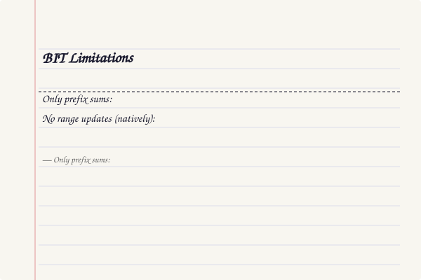
</a>
<a href="../../assets/images/diagrams/data-structures/17-segment-tree/bit-limitations-diagram.svg" target="_blank" rel="noopener">
  
</a>
<a href="../../assets/images/diagrams/data-structures/17-segment-tree/bit-limitations-sticky.svg" target="_blank" rel="noopener">
  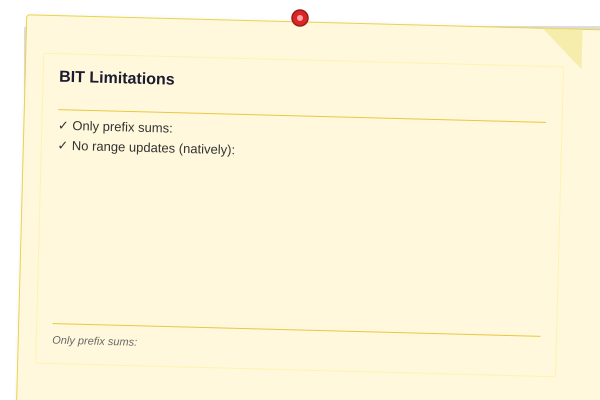
</a>


- **Only prefix sums:** BIT cannot directly answer range minimum or maximum queries. For those, use a segment tree or sparse table.
- **No range updates (natively):** While point updates are O(log n), range updates require converting to a difference array or using two BITs.
- No built-in lazy propagation.

---

## Segment Tree vs Fenwick Tree vs Sparse Table

| Feature | Segment Tree | Fenwick Tree (BIT) | Sparse Table |
|---------|-------------|-------------------|--------------|
| **Build time** | O(n) | O(n) | O(n log n) |
| **Range query** | O(log n) | O(log n) (prefix sum only) | O(1) |
| **Point update** | O(log n) | O(log n) | O(n log n) — full rebuild |
| **Range update (lazy)** | O(log n) | Not supported (range add needs 2 BITs) | Not supported |
| **Query types** | Sum, min, max, GCD, XOR (any associative) | Prefix sum only (native) | Sum, min, max, GCD (idempotent) |
| **Space** | 4n | n | n log n |
| **Memory for n=10^6** | ~32 MB (int) | ~8 MB (int) | ~80 MB (int, log n ≈ 20) |
| **Implementation complexity** | High (~60 lines) | Low (~20 lines) | Medium (~30 lines) |
| **Supports dynamic updates** | Yes | Yes | No |
| **Idempotent ops (min, max, GCD)** | Both O(log n) query and update | Only BIT for range sum | O(1) query, no updates |
| **Best for** | General range queries with updates | Prefix sums, inversion count, point updates | Static data, many queries, no updates |

### Decision Flowchart

<a href="../../assets/images/diagrams/data-structures/17-segment-tree/decision-flowchart-handwritten.svg" target="_blank" rel="noopener">
  
</a>
<a href="../../assets/images/diagrams/data-structures/17-segment-tree/decision-flowchart-diagram.svg" target="_blank" rel="noopener">
  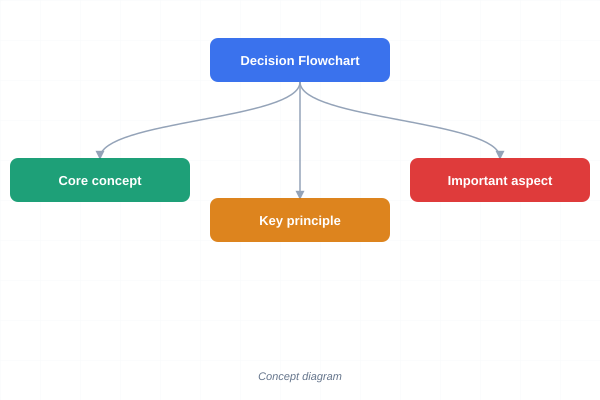
</a>
<a href="../../assets/images/diagrams/data-structures/17-segment-tree/decision-flowchart-sticky.svg" target="_blank" rel="noopener">
  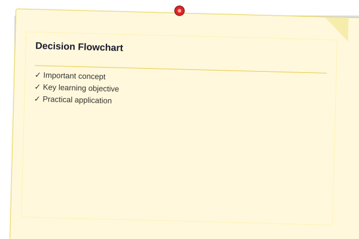
</a>


```
Need range queries?
├── No updates at all ───────────→ Sparse Table (O(1) query)
├── Point updates only?
│   ├── Need min/max/GCD? ───────→ Segment Tree
│   └── Only prefix sums? ──────→ Fenwick Tree (simpler, less memory)
└── Range updates needed? ──────→ Segment Tree with Lazy Propagation
```

---

## Interview Corner

### Common Problems and Solutions

<a href="../../assets/images/diagrams/data-structures/17-segment-tree/common-problems-and-solutions-handwritten.svg" target="_blank" rel="noopener">
  
</a>
<a href="../../assets/images/diagrams/data-structures/17-segment-tree/common-problems-and-solutions-diagram.svg" target="_blank" rel="noopener">
  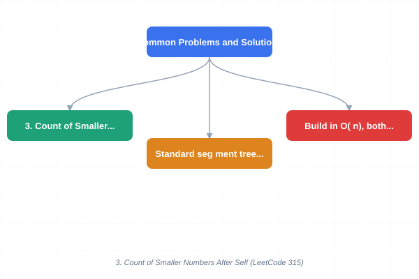
</a>
<a href="../../assets/images/diagrams/data-structures/17-segment-tree/common-problems-and-solutions-sticky.svg" target="_blank" rel="noopener">
  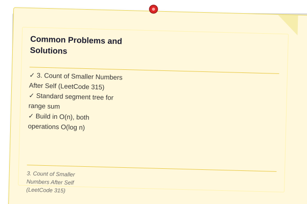
</a>


**1. Range Sum Query with Point Updates (LeetCode 307 — Range Sum Query - Mutable)**

Problem: Given an array, implement `sumRange(l, r)` and `update(idx, val)` efficiently.

Solution: Standard segment tree for range sum. Build in O(n), both operations O(log n). Alternatively, a Fenwick tree works — simpler code but same complexity.

Key insight: The naive O(n) per operation fails for large arrays with many queries. Segment tree reduces each to O(log n).

**2. Range Minimum Query (RMQ) with Point Updates (LeetCode 1526 — or standard competitive programming)**

Problem: Given an array, support `minInRange(l, r)` and `update(idx, val)`.

Solution: Segment tree with min aggregation. Identity for min is `INT_MAX`. Combine function: `min(left, right)`.

Key insight: Fenwick tree cannot solve this. Segment tree or a sqrt-decomposition approach are the only options.

**3. Count of Smaller Numbers After Self (LeetCode 315)**

Problem: For each element in an array, count how many elements to its right are smaller.

Solution: Process the array from right to left. Maintain a Fenwick tree (or segment tree) over compressed values. For each element, query the prefix sum up to (value - 1) to count smaller numbers seen so far, then add the current value to the tree.

Time: O(n log n), Space: O(n). This is a classic application of BIT for inversion-like counting.

**4. Range Sum Query with Lazy Propagation (LeetCode 370 — Range Addition, or Codeforces 52C)**

Problem: Given an array, support `addRange(l, r, val)` and `queryRange(l, r)` efficiently.

Solution: Segment tree with lazy propagation. Both operations O(log n). Without lazy, range update would be O(n).

Key insight: Lazy propagation is essential for any problem where range updates are frequent. It avoids touching all leaves by deferring work to query time.

### Common Pitfalls

<a href="../../assets/images/diagrams/data-structures/17-segment-tree/common-pitfalls-handwritten.svg" target="_blank" rel="noopener">
  
</a>
<a href="../../assets/images/diagrams/data-structures/17-segment-tree/common-pitfalls-diagram.svg" target="_blank" rel="noopener">
  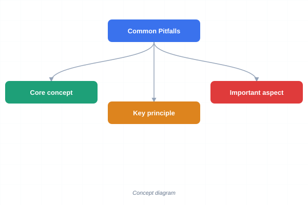
</a>
<a href="../../assets/images/diagrams/data-structures/17-segment-tree/common-pitfalls-sticky.svg" target="_blank" rel="noopener">
  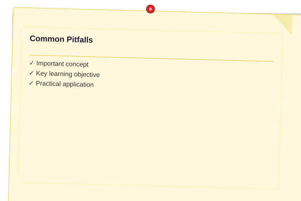
</a>


| Pitfall | Solution |
|---------|----------|
| Using 2n instead of 4n for tree size | Always use 4n — 2n is insufficient for non-power-of-2 sizes |
| Forgetting identity values | Sum: 0, Min: INT_MAX, Max: INT_MIN, GCD: 0, XOR: 0, Product: 1 |
| Not pushing lazy before query | Always push at partial overlap nodes before recursing |
| Integer overflow in tree sums | Use long long (64-bit) for sum queries on large arrays |
| Stack overflow with recursive build for n > 10^6 | Use iterative segment tree (bottom-up) or increase stack limit |
| Mixing 0-indexed and 1-indexed in BIT | Always convert 0-indexed input to 1-indexed internal storage |
| Segment tree for non-associative operations | Only works for operations where (a op b) op c = a op (b op c) |

### Time Comparison (n = 100,000, q = 100,000 queries)

<a href="../../assets/images/diagrams/data-structures/17-segment-tree/time-comparison-n-100-000-q-100-000-queries-handwritten.svg" target="_blank" rel="noopener">
  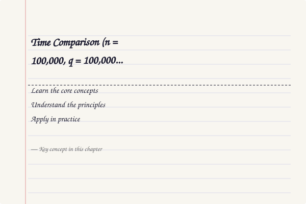
</a>
<a href="../../assets/images/diagrams/data-structures/17-segment-tree/time-comparison-n-100-000-q-100-000-queries-diagram.svg" target="_blank" rel="noopener">
  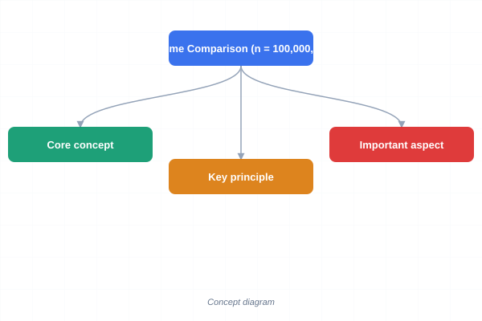
</a>
<a href="../../assets/images/diagrams/data-structures/17-segment-tree/time-comparison-n-100-000-q-100-000-queries-sticky.svg" target="_blank" rel="noopener">
  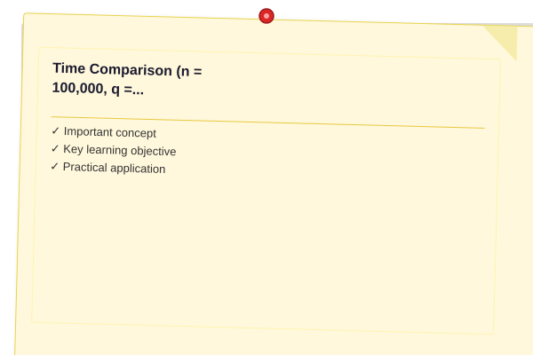
</a>


| Approach | Build | Each Query/Update | Total Time |
|----------|-------|------------------|------------|
| Naive array + loop | O(1) | O(n) | ~10^10 ops → hours |
| Segment tree | O(n) | O(log n) | ~1.7 × 10^6 ops → milliseconds |
| Fenwick tree (sum only) | O(n) | O(log n) | ~1.7 × 10^6 ops → milliseconds |
| Sparse table (no updates) | O(n log n) | O(1) | ~1.7 × 10^6 ops → milliseconds |

---

## Applications in Real Systems

| Domain | Application | How Segment Tree Is Used |
|--------|-------------|------------------------|
| **Database systems** | Range sum, average, count queries on time-series data | Precomputed aggregations over time intervals allow O(log n) rollup queries in analytics dashboards |
| **Competitive programming** | Codeforces, LeetCode, ICPC problems | Over 200+ problems use segment trees for range queries, range updates, and lazy propagation |
| **Image processing** | Range histogram computation | Segment tree storing color frequency distributions per segment; query histogram for any rectangular region in O(k log n) where k = number of bins |
| **Geographic information systems** | Range queries on spatial data (population density, elevation) | 2D segment trees (segment tree of segment trees) for rectangle queries |
| **Finance / Trading** | Stock price range min/max over sliding windows | Segment tree tracking OHLC (open, high, low, close) over time intervals |
| **Online gaming** | Leaderboard range queries | Segment tree storing player scores; query rank range sums (how many players between ranks X and Y) |
| **Telecommunications** | Network traffic monitoring | Segment tree tracking packet counts per time bucket; query total traffic in any time window |
| **Text editors** | Undo/redo with range operations | Persistent segment tree stores versions; range updates represent text insertions/deletions |
| **CPU scheduling** | Process memory allocation tracking | Segment tree tracking free memory blocks; find first block of size ≥ k (lower_bound on segment tree) |

---

## Concept Comparison Table

| Feature | Segment Tree | Fenwick Tree (BIT) | Sparse Table | Square Root Decomposition |
|---------|-------------|-------------------|--------------|--------------------------|
| Build time | O(n) | O(n) | O(n log n) | O(n) |
| Point update | O(log n) | O(log n) | O(n log n) | O(1) |
| Range query | O(log n) | O(log n) (prefix) | O(1) | O(√n) |
| Range update (lazy) | O(log n) | Not supported | Not supported | O(√n) |
| Space | 4n | n | n log n | n + √n |
| Works with min/max | Yes | No | Yes | Yes |
| Supports dynamic updates | Yes | Yes | No | Yes |
| Implementation complexity | High | Low | Medium | Low |

## Quick Reference: Segment Tree Patterns

| Pattern | Identity | Combine Function | Query Logic | Update Logic |
|---------|----------|-----------------|-------------|--------------|
| Range sum | 0 | left + right | Sum of children | Leaf value, propagate sum |
| Range minimum | INT_MAX | min(left, right) | Min of children | Leaf value, propagate min |
| Range maximum | INT_MIN | max(left, right) | Max of children | Leaf value, propagate max |
| Lazy sum (range add) | 0 | left + right | Push before recurse | Apply += val × segLen, mark lazy |
| GCD | 0 | gcd(left, right) | GCD of children | Leaf value, propagate GCD |
| Range product | 1 | left × right | Product of children | Leaf value, propagate product |
| Range XOR | 0 | left ^ right | XOR of children | Leaf value, propagate XOR |

## Cross-Application Matrix

| Problem | Structure | Why |
|---------|-----------|-----|
| Range sum queries with point updates | BIT or segment tree | BIT is simpler for prefix sums |
| Range minimum query (no updates) | Sparse table | O(1) query, static data |
| Range minimum query (with updates) | Segment tree | Only structure supporting both |
| Range sum with range updates | Segment tree with lazy | Range updates require lazy propagation |
| Count inversions | BIT | Standard offline algorithm processing right-to-left |
| Dynamic RMQ with updates | Segment tree | Only structure supporting both |
| Range GCD queries | Segment tree | GCD is associative and combinable |
| Static range sum (no updates) | Prefix sum array | O(1) query, O(n) build, O(n) space |
| Range histogram queries | Segment tree of histograms | Merge histograms at each node |
| k-th smallest in range | Wavelet tree or segment tree of sorted vectors | Merge-sort tree variant |

## Common Mistakes & GFG Deepening

### Common Mistakes (GFG-Style)

<a href="../../assets/images/diagrams/data-structures/17-segment-tree/common-mistakes-gfg-style-handwritten.svg" target="_blank" rel="noopener">
  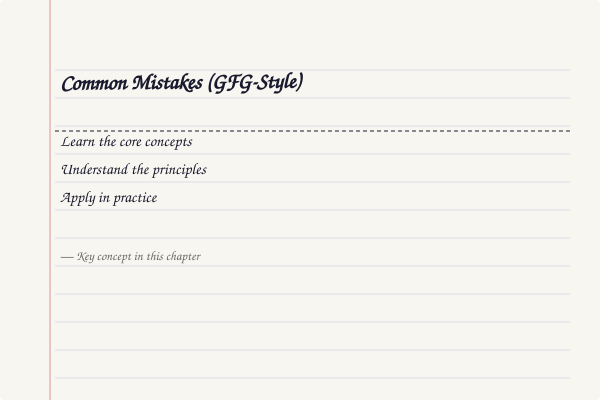
</a>
<a href="../../assets/images/diagrams/data-structures/17-segment-tree/common-mistakes-gfg-style-diagram.svg" target="_blank" rel="noopener">
  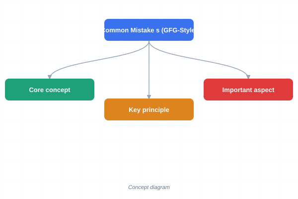
</a>
<a href="../../assets/images/diagrams/data-structures/17-segment-tree/common-mistakes-gfg-style-sticky.svg" target="_blank" rel="noopener">
  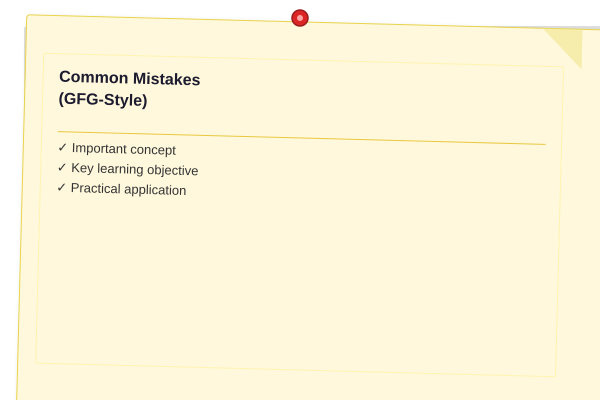
</a>


| Mistake | Why It's Wrong | Correct Approach |
|---------|----------------|------------------|
| Allocating 2n instead of 4n array for segment tree | n may not be a power of 2; size 4n guarantees safe bounds even for worst case | Always allocate 4 × n (or next power of 2 × 2) |
| Off-by-one errors in range query (inclusive vs exclusive) | Query uses [l, r] inclusive but segment tree stores [l, r] or [l, r) inconsistently | Be consistent: use inclusive-inclusive [l, r] or inclusive-exclusive [l, r); document choice |
| Forgetting to handle overlapping ranges in query | Without checking if query fully contains → partial → disjoint, recursion is infinite | if (qs ≤ l && r ≤ qe) return tree[node]; if (qe < l || r < qs) return identity; else recurse |
| Not returning proper identity element for the operation | Sum needs 0, product needs 1, min needs Infinity, max needs -Infinity | Each operation has a unique identity: `f(identity, x) = x` |
| Lazy propagation: not pushing updates before traversing children | Deferred updates accumulate and never reach the leaves | Always push lazy values to children before recursing during query/update |
| Confusing lazy propagation with range update | Without lazy, range update becomes O(n) at each leaf | Lazy defers updates to O(log n) by storing pending ops in nodes |
| Building segment tree with recursion when iterative (bottom-up) is simpler | Recursive build for 2n size is unnecessary overhead | Use iterative segment tree: build from n to 2n-1 for leaf values, then i = n-1 down to 1 |
| Not considering overflow for range sum queries | Storing large sums in 32-bit integer overflows | Use 64-bit integers (bigint or number with checks) for sums |

### TypeScript Segment Tree Implementation (with Lazy Propagation)

```typescript
class SegmentTree {
    private tree: number[];
    private lazy: number[];
    private n: number;

    constructor(arr: number[]) {
        this.n = arr.length;
        this.tree = new Array(4 * this.n).fill(0);
        this.lazy = new Array(4 * this.n).fill(0);
        this.build(arr, 0, 0, this.n - 1);
    }

    private build(arr: number[], node: number, l: number, r: number): void {
        if (l === r) {
            this.tree[node] = arr[l];
            return;
        }
        const mid = Math.floor((l + r) / 2);
        this.build(arr, 2 * node + 1, l, mid);
        this.build(arr, 2 * node + 2, mid + 1, r);
        this.tree[node] = this.tree[2 * node + 1] + this.tree[2 * node + 2];
    }

    // Range query [ql, qr] inclusive
    query(ql: number, qr: number): number {
        return this._query(0, 0, this.n - 1, ql, qr);
    }

    private _query(node: number, l: number, r: number, ql: number, qr: number): number {
        this.propagate(node, l, r);
        if (ql > r || qr < l) return 0; // no overlap
        if (ql <= l && r <= qr) return this.tree[node]; // total overlap
        const mid = Math.floor((l + r) / 2);
        const left = this._query(2 * node + 1, l, mid, ql, qr);
        const right = this._query(2 * node + 2, mid + 1, r, ql, qr);
        return left + right;
    }

    // Point update: set arr[idx] = val
    pointUpdate(idx: number, val: number): void {
        this._pointUpdate(0, 0, this.n - 1, idx, val);
    }

    private _pointUpdate(node: number, l: number, r: number, idx: number, val: number): void {
        if (l === r) {
            this.tree[node] = val;
            return;
        }
        const mid = Math.floor((l + r) / 2);
        if (idx <= mid) this._pointUpdate(2 * node + 1, l, mid, idx, val);
        else this._pointUpdate(2 * node + 2, mid + 1, r, idx, val);
        this.tree[node] = this.tree[2 * node + 1] + this.tree[2 * node + 2];
    }

    // Range update: add val to all elements in [ql, qr]
    rangeUpdate(ql: number, qr: number, val: number): void {
        this._rangeUpdate(0, 0, this.n - 1, ql, qr, val);
    }

    private _rangeUpdate(node: number, l: number, r: number, ql: number, qr: number, val: number): void {
        this.propagate(node, l, r);
        if (ql > r || qr < l) return;
        if (ql <= l && r <= qr) {
            this.tree[node] += (r - l + 1) * val;
            if (l !== r) {
                this.lazy[2 * node + 1] += val;
                this.lazy[2 * node + 2] += val;
            }
            return;
        }
        const mid = Math.floor((l + r) / 2);
        this._rangeUpdate(2 * node + 1, l, mid, ql, qr, val);
        this._rangeUpdate(2 * node + 2, mid + 1, r, ql, qr, val);
        this.tree[node] = this.tree[2 * node + 1] + this.tree[2 * node + 2];
    }

    private propagate(node: number, l: number, r: number): void {
        if (this.lazy[node] !== 0) {
            this.tree[node] += (r - l + 1) * this.lazy[node];
            if (l !== r) {
                this.lazy[2 * node + 1] += this.lazy[node];
                this.lazy[2 * node + 2] += this.lazy[node];
            }
            this.lazy[node] = 0;
        }
    }
}

// Iterative (Fenwick-style) Segment Tree for point updates, range sums
class BIT { // Binary Indexed Tree / Fenwick Tree
    private tree: number[];
    constructor(private n: number) {
        this.tree = new Array(n + 1).fill(0);
    }

    add(idx: number, delta: number): void {
        idx++; // 1-indexed internally
        while (idx <= this.n) {
            this.tree[idx] += delta;
            idx += idx & -idx;
        }
    }

    sum(idx: number): number { // prefix sum [0, idx]
        idx++;
        let sum = 0;
        while (idx > 0) {
            sum += this.tree[idx];
            idx -= idx & -idx;
        }
        return sum;
    }

    rangeSum(l: number, r: number): number {
        return this.sum(r) - (l > 0 ? this.sum(l - 1) : 0);
    }
}
```

### Additional MCQs (GFG Pattern)

<a href="../../assets/images/diagrams/data-structures/17-segment-tree/additional-mcqs-gfg-pattern-handwritten.svg" target="_blank" rel="noopener">
  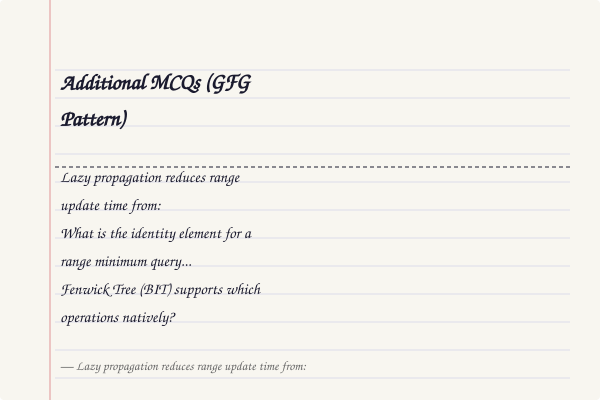
</a>
<a href="../../assets/images/diagrams/data-structures/17-segment-tree/additional-mcqs-gfg-pattern-diagram.svg" target="_blank" rel="noopener">
  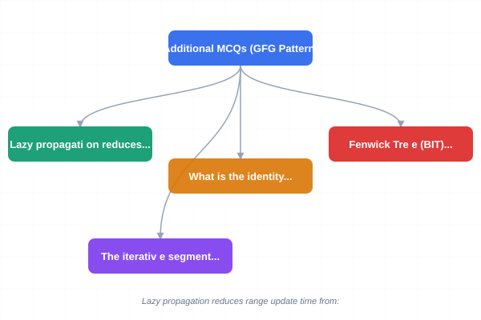
</a>
<a href="../../assets/images/diagrams/data-structures/17-segment-tree/additional-mcqs-gfg-pattern-sticky.svg" target="_blank" rel="noopener">
  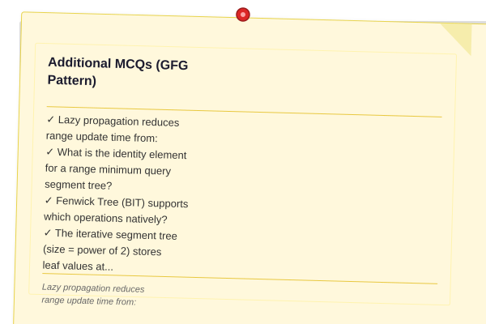
</a>


8. **The size of the tree array for a segment tree of n = 10 elements (worst-case) is:**
   - a) 20
   - b) 40 ✓ (4 × 10)
   - c) 100
   - d) 1024

9. **Lazy propagation reduces range update time from:**
   - a) O(log n) to O(1)
   - b) O(n) to O(log n) ✓
   - c) O(n²) to O(n)
   - d) O(log n) to O(n)

10. **What is the identity element for a range minimum query segment tree?**
    - a) 0
    - b) Infinity ✓
    - c) -Infinity
    - d) 1

11. **Fenwick Tree (BIT) supports which operations natively?**
    - a) Range update, range query
    - b) Point update, prefix sum query ✓
    - c) Range update, point query
    - d) All of the above (with extensions)

12. **In a segment tree, the update and query operations visit at most how many nodes?**
    - a) O(1)
    - b) O(log n) ✓
    - c) O(n)
    - d) O(√n)

13. **The iterative segment tree (size = power of 2) stores leaf values at indices:**
    - a) 0 to n-1
    - b) n to 2n-1 ✓
    - c) 1 to n
    - d) 2n to 4n-1

**Answers:** 8-b, 9-b, 10-b, 11-b, 12-b, 13-b

### Additional Exercises (GFG Pattern)

<a href="../../assets/images/diagrams/data-structures/17-segment-tree/additional-exercises-gfg-pattern-handwritten.svg" target="_blank" rel="noopener">
  
</a>
<a href="../../assets/images/diagrams/data-structures/17-segment-tree/additional-exercises-gfg-pattern-diagram.svg" target="_blank" rel="noopener">
  
</a>
<a href="../../assets/images/diagrams/data-structures/17-segment-tree/additional-exercises-gfg-pattern-sticky.svg" target="_blank" rel="noopener">
  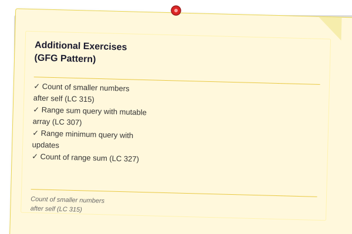
</a>


12. **Count of smaller numbers after self (LC 315)**: Given an array, for each element count how many elements to its right are smaller. Use a segment tree or BIT.

13. **Range sum query with mutable array (LC 307)**: Implement NumArray with point updates and range sum queries using segment tree.

14. **Range minimum query with updates**: Implement a segment tree that supports point updates and range minimum queries.

15. **Count of range sum (LC 327)**: Given an array and a range [lower, upper], count the number of subarrays whose sum falls in that range. Use BIT with coordinate compression.

16. **Range frequency queries**: Given an array, answer queries of the form "how many times does x appear in range [l, r]?" Use segment tree with hash maps at each node.

17. **Merge sort tree**: Store sorted arrays at each segment tree node. Answer "count of elements ≤ k in range [l, r]" in O(log² n).

18. **Segment tree with XOR operation**: Implement a segment tree where the operation is XOR. Answer range XOR queries.

19. **Lazy propagation for assignment updates**: Modify lazy propagation to support assignment (set all values in [l, r] to x) instead of addition.

20. **Maximum subarray sum in range (LC 53 variant)**: Build a segment tree that returns maximum subarray sum for any range. Each node stores: total sum, max prefix, max suffix, max subarray.

### Segment Tree Variants Comparison

<a href="../../assets/images/diagrams/data-structures/17-segment-tree/segment-tree-variants-comparison-handwritten.svg" target="_blank" rel="noopener">
  
</a>
<a href="../../assets/images/diagrams/data-structures/17-segment-tree/segment-tree-variants-comparison-diagram.svg" target="_blank" rel="noopener">
  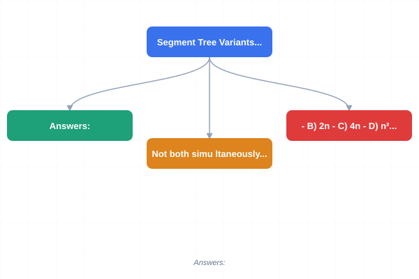
</a>
<a href="../../assets/images/diagrams/data-structures/17-segment-tree/segment-tree-variants-comparison-sticky.svg" target="_blank" rel="noopener">
  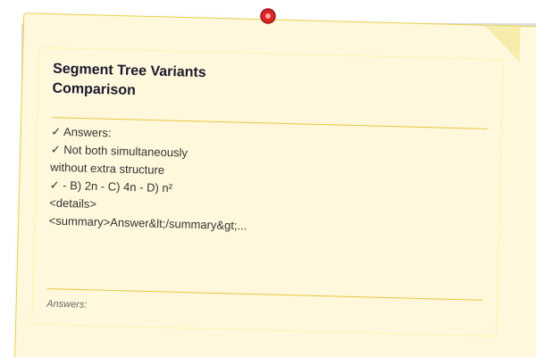
</a>


| Variant | Build | Query | Point Update | Range Update | Memory |
|---------|-------|-------|-------------|-------------|--------|
| Standard (recursive) | O(n) | O(log n) | O(log n) | O(log n) lazy | 4n |
| Iterative (bottom-up) | O(n) | O(log n) | O(log n) | Not supported | 2n |
| Fenwick Tree (BIT) | O(n log n) | O(log n) | O(log n) | O(log n)* | n+1 |
| Sparse Table | O(n log n) | O(1) | Not supported | Not supported | n log n |
| SQRT Decomposition | O(n) | O(√n) | O(1) | O(√n) | n + √n |
| Segment Tree + Lazy | O(n) | O(log n) | O(log n) | O(log n) | 4n + 4n (lazy) |
| Merge Sort Tree | O(n log n) | O(log² n) | Not supported | Not supported | n log n |

*Fenwick tree: with range update and point query, or point update and range query. Not both simultaneously without extra structure.
- B) 2n
- C) 4n
- D) n²

<details>
<summary>Answer&lt;/summary&gt;
**C)** 4n is the safe upper bound. The exact size is `2 * 2^⌈log₂n⌉ - 1`, which never exceeds 4n.
</details>

**Q2.** What does lazy propagation enable?

- A) Faster point updates
- B) Range updates in O(log n)
- C) Range minimum queries
- D) Smaller memory footprint

<details>
<summary>Answer&lt;/summary&gt;
**B)** Lazy propagation defers the actual update of child nodes, marking them as "pending" and only pushing changes when needed. This keeps range updates at O(log n) instead of O(n).
</details>

**Q3.** A Fenwick tree (BIT) natively supports:

- A) Range minimum
- B) Prefix sums
- C) Range maximum
- D) Range GCD

<details>
<summary>Answer&lt;/summary&gt;
**B)** BIT natively supports prefix sums. It does not directly support range min, max, or GCD (though range min can be approximated with a segment tree variant of BIT).
</details>

**Q4.** What is the space complexity of a Fenwick tree?

- A) 4n
- B) n
- C) n log n
- D) √n

<details>
<summary>Answer&lt;/summary&gt;
**B)** BIT uses exactly n + 1 space (1-indexed array of size n+1), making it much more memory-efficient than a segment tree's 4n.
</details>

**Q5.** When would you choose a Sparse Table over a Segment Tree?

- A) When you need frequent updates
- B) When data is static and you need O(1) range queries
- C) When memory is limited
- D) When you need range update support

<details>
<summary>Answer&lt;/summary&gt;
**B)** Sparse tables offer O(1) range queries but O(n log n) build time and no update support. They are ideal for static data with many queries, like in preprocessing for RMQ.
</details>

**Q6.** What is the identity element for a range GCD segment tree?

- A) 0
- B) 1
- C) INT_MAX
- D) -1

<details>
<summary>Answer&lt;/summary&gt;
**A)** 0 is the identity for GCD because gcd(0, x) = x for any x.
</details>

**Q7.** How many nodes does a range query visit in the worst case?

- A) O(1)
- B) O(log n)
- C) O(n)
- D) O(√n)

<details>
<summary>Answer&lt;/summary&gt;
**B)** At most 4 × log₂n nodes. At each level, at most 2 nodes are partially overlapping (boundary nodes) and any fully covered nodes between them return immediately.
</details>

**Q8.** What happens in a lazy segment tree when you query a leaf with a pending update at an ancestor?

- A) The query returns the old value
- B) The lazy value is pushed down before reaching the leaf
- C) The query ignores lazy values
- D) The program crashes

<details>
<summary>Answer&lt;/summary&gt;
**B)** The `push` operation at each partial-overlap node propagates lazy values to children before recursing, ensuring the leaf has the correct value when reached.
</details>

**Answers:** 1-C, 2-B, 3-B, 4-B, 5-B, 6-A, 7-B, 8-B

---

## Exercises

### Review Questions

1. Why does a segment tree require approximately 4× the input size? Derive the exact formula.
2. What is the advantage of lazy propagation? What specific problem does it solve?
3. How does the Fenwick tree use binary representation to compute prefix sums? Explain with an example using n = 10.
4. Compare the query time complexity of segment trees, Fenwick trees, and sparse tables. When is each the best choice?
5. Why can't a Fenwick tree be used for range minimum queries? What property of "minimum" prevents it?

### Application Problems

6. Implement a segment tree for range minimum query (RMQ) with point updates. Test it on an array of 10 random integers.
7. Write a program using a BIT to count inversions in an array. Analyze its time complexity.
8. Implement a segment tree that supports both range sum and range minimum simultaneously. Each query should return a pair (sum, min) for any given range.
9. Given an array of stock prices, use a segment tree to find the maximum profit that can be made by buying and selling within any given query range [l, r] (maximum subarray sum problem).
10. Implement range update with lazy propagation for range XOR queries. Test with overlapping updates.

### Challenge Problems

11. **Segment tree with coordinate compression:** Given up to 10^5 possible indices but only 10^3 distinct values, compress coordinates and build a segment tree that allocates nodes on demand. Handle range sum queries over the compressed space.

12. **Persistent segment tree:** Implement a segment tree that supports querying historical versions. Each update creates a new root; old versions remain accessible. This is the foundation of "chairman tree" used in Codeforces problems for k-th smallest in range.

13. **2D segment tree:** Build a segment tree over rows, where each row-node contains a segment tree over columns. Support rectangle sum queries (x1, y1, x2, y2) and point updates (x, y, newVal) — both in O(log² n).

14. **Segment tree with range assignment (not addition):** Modify lazy propagation to support assignment `[l, r] = val` instead of addition. Hint: you need a "set" lazy flag that overrides any previous lazy values on a node.

---

## Summary

- **Segment tree** — A binary tree storing aggregate information over array segments. Supports range queries and point updates in O(log n).
- **Construction** — Recursive bottom-up build in O(n) time using 4n space.
- **Range query** — Visit O(log n) nodes by checking full/no/partial overlap. Combine results using the aggregate operation.
- **Point update** — Update leaf node, then recompute all ancestors in O(log n).
- **Lazy propagation** — Extends segment trees to O(log n) range updates by deferring work with a pending lazy flag array.
- **Fenwick tree (BIT)** — Compact (n space) alternative for prefix sum queries with point updates. Simpler to implement but limited to prefix operations.
- **Sparse table** — Best for static data with O(1) queries, but no update support and O(n log n) build/memory.

### Key Takeaway

<a href="../../assets/images/diagrams/data-structures/17-segment-tree/key-takeaway-handwritten.svg" target="_blank" rel="noopener">
  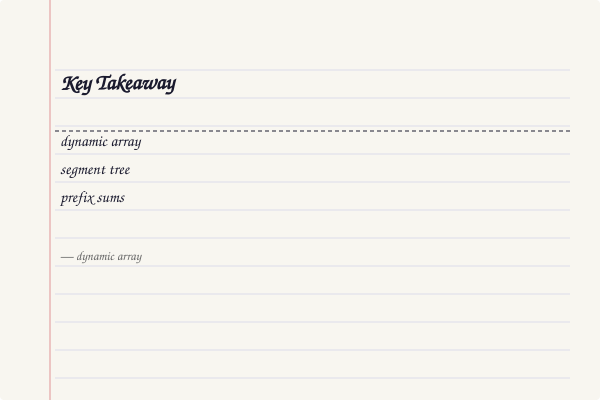
</a>
<a href="../../assets/images/diagrams/data-structures/17-segment-tree/key-takeaway-diagram.svg" target="_blank" rel="noopener">
  
</a>
<a href="../../assets/images/diagrams/data-structures/17-segment-tree/key-takeaway-sticky.svg" target="_blank" rel="noopener">
  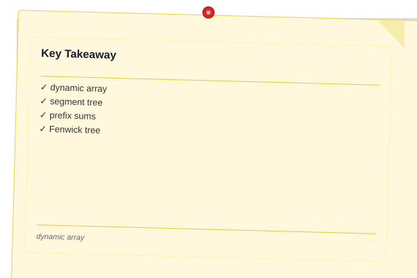
</a>


If you need range queries on a **dynamic array** (values change), use a **segment tree**. If you only need **prefix sums** with point updates, use a **Fenwick tree** for simplicity and memory efficiency. If your data is **static** and queries are many, use a **sparse table** for O(1) queries. For range updates, use a segment tree with **lazy propagation** — it's the only structure that handles both range updates and range queries in O(log n).

> **Pro Tip:** In competitive programming, 80% of segment tree problems follow one of three patterns: range sum with updates, range min/max with updates, or range add + range sum (lazy). Master these three and you can adapt to any variant.

---

> **Prev:** [Chapter 16: Trie (Prefix Tree)](./16-trie.md) | **Next:** [Chapter 18: Union-Find (Disjoint Set Union)](./18-union-find.md)
