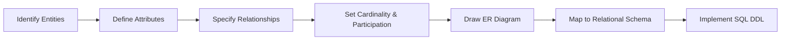

# Chapter 2: Entity-Relationship Model
```
> **Previous:** [Chapter 1: Introduction to Database Systems](./01-introduction.md) | **Next:** [Chapter 3: The Relational Model](./03-relational-model.md)
```
## Learning Objectives
```
- Identify entities, attributes, and relationships in a problem domain
- Classify attribute types: simple vs. composite, single-valued vs. multi-valued, stored vs. derived
- Define relationship types, degree, and cardinality constraints
- Construct ER diagrams using standard notations
- Distinguish strong from weak entities
- Model generalization, specialization, and aggregation hierarchies
- Translate an ER diagram into a relational schema
```
## Chapter at a Glance
```
| Topic | Key Insight | Practical Takeaway |
|-------|-------------|-------------------|
| **Entities & Attributes** | Real-world objects with descriptive properties | Identify entities first, then their attributes |
| **Relationships & Cardinality** | Associations between entities with 1:1, 1:N, M:N rules | Correct cardinality prevents schema redesign |
| **Weak Entities** | Depend on owner entity for identity | Common for line items, dependents, seat assignments |
| **Generalization/Specialization** | Inheritance modeling for entity types | Choose Strategy B (separate tables) for flexibility |
| **ER-to-Relational Mapping** | Systematic conversion of conceptual to logical schema | Follow the 8 mapping rules in order |
```
## Chapter Roadmap
```

```
## Theory
```
> **One-Sentence Takeaway:** The ER model provides a high-level conceptual blueprint — translating real-world requirements into visual diagrams before any SQL is written.
```

```
### 2.1 The Entity-Relationship Model
```
The Entity-Relationship (ER) model, introduced by Peter Chen in 1976, is a conceptual data model that provides a high-level description of a database. It is used primarily in the database design phase to capture user requirements and represent them in a visual, intuitive form before implementation.
```
The ER model views the real world as a collection of **entities** (things or objects) and **relationships** (associations among entities).
```
#### Real-World Analogy: Blueprint for a House
```
| ER Model Element | House Blueprint Analogy |
|-----------------|------------------------|
| Entity | A room (kitchen, bedroom) |
| Attribute | Properties of room (dimensions, window count) |
| Relationship | A door connects kitchen to dining room |
| Cardinality | One kitchen has many cabinets (1:N) |
| Weak Entity | A window cannot exist without its wall |
```
Just as an architect draws a blueprint before construction begins, a database designer creates an ER diagram before writing SQL. The blueprint captures requirements, communicates with stakeholders (contractors = developers), and catches design errors early.
```
#### Numbered Steps to Build an ER Model
```
1. **Identify entities** — List all noun concepts from requirements (e.g., Student, Course, Professor)
2. **Identify relationships** — Find verb associations between entities (e.g., Student enrolls in Course)
3. **Identify cardinality** — Determine 1:1, 1:N, or M:N for each relationship
4. **Identify attributes** — List properties for each entity (e.g., student_id, name, email)
5. **Classify attributes** — Mark simple/composite, single-valued/multi-valued, stored/derived, key
6. **Identify weak entities** — Find entities that depend on others for identity
7. **Apply constraints** — Specify total/partial participation, disjointness, completeness
8. **Draw ER diagram** — Use rectangles, diamonds, ellipses with standard notation
9. **Map to relational schema** — Apply systematic conversion rules
10. **Normalize** — Check for redundancy and apply normal forms if needed
```
#### Pseudocode: ER Model Builder
```
```pseudocode
PROCEDURE BuildERModel(requirements):
    entities = ExtractNouns(requirements)
    relationships = ExtractVerbs(requirements, entities)
```
    FOR EACH entity IN entities:
        entity.attributes = ExtractProperties(requirements, entity.name)
        entity.key = IdentifyPrimaryKey(entity.attributes)
        entity.isWeak = CheckDependency(entity, entities)
```
    FOR EACH rel IN relationships:
        rel.entity_types = IdentifyParticipants(rel, entities)
        rel.cardinality = DetermineCardinality(rel, requirements)
        rel.participation = DetermineParticipation(rel, requirements)
        rel.attributes = ExtractRelationshipAttributes(requirements, rel)
```
    er_diagram = DrawERDiagram(entities, relationships)
    relational_schema = MapERToRelational(er_diagram)
    RETURN relational_schema
END PROCEDURE
```
```
#### Dry Run: Building ER Model for University System
```
**Input Requirements:** "A university has students who enroll in courses. Each course is taught by one professor. Students have IDs, names, and phone numbers. Courses have IDs, titles, and credits. Professors have IDs, names, and departments."
```
| Step | Action | Result |
|------|--------|--------|
| 1 | Extract entities | STUDENT, COURSE, PROFESSOR |
| 2 | Extract relationships | STUDENT enrolls in COURSE; PROFESSOR teaches COURSE |
| 3 | Determine cardinality | ENROLLS_IN: M:N; TEACHES: 1:N |
| 4 | Extract attributes | STUDENT: id, name, phone; COURSE: id, title, credits; PROFESSOR: id, name, dept |
| 5 | Classify attributes | name -> composite; phone -> multi-valued; credits -> simple |
| 6 | Identify weak entities | None in this set |
| 7 | Apply constraints | STUDENT total in ENROLLS_IN; PROFESSOR partial in TEACHES |
| 8 | Draw diagram | Rectangles -> STUDENT, COURSE, PROFESSOR; Diamonds -> ENROLLS_IN, TEACHES |
| 9 | Map to schema | STUDENT(name->first+last), phone->separate table, COURSE with FK to PROFESSOR |
| 10 | Normalize | All tables in 3NF |
```
#### C++ Implementation: ER Model Classes
```
```cpp
#include <iostream>
#include <vector>
#include <map>
#include <string>
#include <algorithm>
using namespace std;
```
enum class AttrType { SIMPLE, COMPOSITE, MULTI_VALUED, DERIVED, KEY };
enum class CardType { ONE_TO_ONE, ONE_TO_MANY, MANY_TO_MANY };
enum class PartType { TOTAL, PARTIAL };
```
class Attribute {
public:
    string name;
    AttrType type;
    vector<Attribute> sub_attributes;
    string derived_expression;
```
    Attribute(string n, AttrType t = AttrType::SIMPLE)
        : name(n), type(t), derived_expression("") {}
```
    void addSubAttribute(const Attribute& sub) {
        if (type == AttrType::COMPOSITE) sub_attributes.push_back(sub);
    }
```
    string typeString() const {
        switch(type) {
            case AttrType::SIMPLE: return "SIMPLE";
            case AttrType::COMPOSITE: return "COMPOSITE";
            case AttrType::MULTI_VALUED: return "MULTI_VALUED";
            case AttrType::DERIVED: return "DERIVED";
            case AttrType::KEY: return "KEY";
        }
        return "UNKNOWN";
    }
```
    void print(int indent = 0) const {
        cout << string(indent, ' ') << name << " [" << typeString() << "]";
        if (!derived_expression.empty())
            cout << " = " << derived_expression;
        cout << endl;
        for (const auto& sub : sub_attributes) sub.print(indent + 2);
    }
};
```
class Entity {
public:
    string name;
    vector<Attribute> attributes;
    bool is_weak;
    string owner_entity;
    string discriminator;
```
    Entity(string n, bool weak = false) : name(n), is_weak(weak) {}
```
    void addAttribute(const Attribute& attr) { attributes.push_back(attr); }
```
    void print() const {
        cout << (is_weak ? "WEAK ENTITY: " : "ENTITY: ") << name << endl;
        if (is_weak)
            cout << "  Owner: " << owner_entity << ", Discriminator: " << discriminator << endl;
        for (const auto& attr : attributes) attr.print(2);
    }
};
```
class Relationship {
public:
    string name;
    vector<string> participants;
    CardType cardinality;
    PartType participation;
    vector<Attribute> attributes;
```
    Relationship(string n, CardType card = CardType::MANY_TO_MANY)
        : name(n), cardinality(card), participation(PartType::PARTIAL) {}
```
    string cardinalityString() const {
        switch(cardinality) {
            case CardType::ONE_TO_ONE: return "1:1";
            case CardType::ONE_TO_MANY: return "1:N";
            case CardType::MANY_TO_MANY: return "M:N";
        }
        return "UNKNOWN";
    }
```
    void print() const {
        cout << "RELATIONSHIP: " << name << " [" << cardinalityString() << "]";
        cout << " (Participation: " << (participation == PartType::TOTAL ? "TOTAL" : "PARTIAL") << ")" << endl;
        cout << "  Participants: ";
        for (const auto& p : participants) cout << p << " ";
        cout << endl;
        for (const auto& attr : attributes) attr.print(2);
    }
};
```
class ERModel {
public:
    map<string, Entity> entities;
    vector<Relationship> relationships;
```
    void addEntity(const Entity& e) { entities[e.name] = e; }
    void addRelationship(const Relationship& r) { relationships.push_back(r); }
};
```
int main() {
    ERModel university;
```
    Entity student("STUDENT");
    student.addAttribute(Attribute("student_id", AttrType::KEY));
    Attribute name("name", AttrType::COMPOSITE);
    name.addSubAttribute(Attribute("first_name"));
    name.addSubAttribute(Attribute("last_name"));
    student.addAttribute(name);
    student.addAttribute(Attribute("phone_numbers", AttrType::MULTI_VALUED));
    university.addEntity(student);
```
    Entity course("COURSE");
    course.addAttribute(Attribute("course_id", AttrType::KEY));
    course.addAttribute(Attribute("title"));
    course.addAttribute(Attribute("credits"));
    university.addEntity(course);
```
    Relationship enrolls("ENROLLS_IN", CardType::MANY_TO_MANY);
    enrolls.participants = {"STUDENT", "COURSE"};
    enrolls.participation = PartType::TOTAL;
    enrolls.attributes.push_back(Attribute("semester"));
    enrolls.attributes.push_back(Attribute("grade"));
    university.addRelationship(enrolls);
```
    for (auto& [name, ent] : university.entities) ent.print();
    for (auto& rel : university.relationships) rel.print();
    return 0;
}
```
```
#### Python Implementation: ER Model Classes and Relational Mapping
```
```python
from enum import Enum
from typing import List, Dict, Optional, Tuple
```
class AttrType(Enum):
    SIMPLE = "SIMPLE"
    COMPOSITE = "COMPOSITE"
    MULTI_VALUED = "MULTI_VALUED"
    DERIVED = "DERIVED"
    KEY = "KEY"
```
class CardType(Enum):
    ONE_TO_ONE = "1:1"
    ONE_TO_MANY = "1:N"
    MANY_TO_MANY = "M:N"
```
class PartType(Enum):
    TOTAL = "TOTAL"
    PARTIAL = "PARTIAL"
```
class Attribute:
    def __init__(self, name: str, attr_type: AttrType = AttrType.SIMPLE):
        self.name = name
        self.type = attr_type
        self.sub_attributes: List[Attribute] = []
        self.derived_expression: str = ""
```
    def add_sub_attribute(self, attr: Attribute) -> None:
        if self.type == AttrType.COMPOSITE:
            self.sub_attributes.append(attr)
```
    def flatten(self) -> List[str]:
        if self.type == AttrType.COMPOSITE:
            return [sub.name.lower() for sub in self.sub_attributes]
        return [self.name.lower()]
```
    def __repr__(self) -> str:
        return f"Attribute({self.name}, {self.type.value})"
```
class Entity:
    def __init__(self, name: str, is_weak: bool = False):
        self.name = name
        self.attributes: List[Attribute] = []
        self.is_weak = is_weak
        self.owner_entity: Optional[str] = None
        self.discriminator: Optional[str] = None
```
    def add_attribute(self, attr: Attribute) -> None:
        self.attributes.append(attr)
```
    def get_key_attributes(self) -> List[Attribute]:
        return [a for a in self.attributes if a.type == AttrType.KEY]
```
    def get_multi_valued_attributes(self) -> List[Attribute]:
        return [a for a in self.attributes if a.type == AttrType.MULTI_VALUED]
```
    def __repr__(self) -> str:
        return f"Entity({self.name}, weak={self.is_weak})"
```
class Relationship:
    def __init__(self, name: str, cardinality: CardType = CardType.MANY_TO_MANY):
        self.name = name
        self.participants: List[str] = []
        self.cardinality = cardinality
        self.participation: PartType = PartType.PARTIAL
        self.attributes: List[Attribute] = []
```
    def add_attribute(self, attr: Attribute) -> None:
        self.attributes.append(attr)
```
    def __repr__(self) -> str:
        return f"Relationship({self.name}, {self.cardinality.value})"
```
class ERModel:
    def __init__(self):
        self.entities: Dict[str, Entity] = {}
        self.relationships: List[Relationship] = []
```
    def add_entity(self, entity: Entity) -> None:
        self.entities[entity.name] = entity
```
    def add_relationship(self, rel: Relationship) -> None:
        self.relationships.append(rel)
```
    def map_to_relational(self) -> List[str]:
        """Map ER model to relational schema following standard 8 rules."""
        schema: List[str] = []
```
        for ent in self.entities.values():
            if not ent.is_weak:
                schema.append(self._create_strong_entity_table(ent))
```
        for ent in self.entities.values():
            if ent.is_weak:
                schema.append(self._create_weak_entity_table(ent))
```
        for rel in self.relationships:
            if rel.cardinality == CardType.MANY_TO_MANY:
                schema.append(self._create_junction_table(rel))
```
        for ent in self.entities.values():
            for attr in ent.get_multi_valued_attributes():
                schema.append(self._create_multi_valued_table(ent, attr))
```
        return schema
```
    def _create_strong_entity_table(self, ent: Entity) -> str:
        cols = []
        for attr in ent.attributes:
            if attr.type == AttrType.KEY:
                cols.append(f"    {attr.name.lower()} INTEGER PRIMARY KEY")
            elif attr.type == AttrType.COMPOSITE:
                for sub in attr.sub_attributes:
                    cols.append(f"    {sub.name.lower()} VARCHAR(100) NOT NULL")
            elif attr.type == AttrType.SIMPLE:
                cols.append(f"    {attr.name.lower()} VARCHAR(100)")
        return f"CREATE TABLE {ent.name.lower()} (\n" + ",\n".join(cols) + "\n);\n"
```
    def _create_weak_entity_table(self, ent: Entity) -> str:
        cols = []
        pk_parts = []
        owner = self.entities.get(ent.owner_entity or "")
        if owner:
            key_attrs = owner.get_key_attributes()
            if key_attrs:
                key_name = key_attrs[0].name.lower()
                cols.append(f"    {key_name} INTEGER NOT NULL REFERENCES {ent.owner_entity.lower()}({key_name})")
                pk_parts.append(key_name)
        if ent.discriminator:
            cols.append(f"    {ent.discriminator.lower()} VARCHAR(100) NOT NULL")
            pk_parts.append(ent.discriminator.lower())
        for attr in ent.get_key_attributes():
            if attr.name.lower() not in pk_parts and attr.type == AttrType.SIMPLE:
                cols.append(f"    {attr.name.lower()} VARCHAR(100)")
        pk = ", ".join(pk_parts)
        cols.append(f"    PRIMARY KEY ({pk})")
        return f"CREATE TABLE {ent.name.lower()} (\n" + ",\n".join(cols) + "\n);\n"
```
    def _create_junction_table(self, rel: Relationship) -> str:
        cols = []
        pk_parts = []
        for p in rel.participants:
            ent = self.entities.get(p)
            if ent:
                key_attrs = ent.get_key_attributes()
                if key_attrs:
                    key = key_attrs[0]
                    fk_col = f"{ent.name.lower()}_{key.name.lower()}"
                    cols.append(f"    {fk_col} INTEGER REFERENCES {ent.name.lower()}({key.name.lower()})")
                    pk_parts.append(fk_col)
        for attr in rel.attributes:
            cols.append(f"    {attr.name.lower()} VARCHAR(50)")
        pk = ", ".join(pk_parts)
        cols.append(f"    PRIMARY KEY ({pk})")
        return f"CREATE TABLE {rel.name.lower()} (\n" + ",\n".join(cols) + "\n);\n"
```
    def _create_multi_valued_table(self, ent: Entity, attr: Attribute) -> str:
        key_attrs = ent.get_key_attributes()
        if not key_attrs:
            return ""
        key = key_attrs[0]
        return (f"CREATE TABLE {ent.name.lower()}_{attr.name.lower()} (\n"
                f"    {ent.name.lower()}_{key.name.lower()} INTEGER "
                f"REFERENCES {ent.name.lower()}({key.name.lower()}),\n"
                f"    {attr.name.lower()} VARCHAR(50),\n"
                f"    PRIMARY KEY ({ent.name.lower()}_{key.name.lower()}, {attr.name.lower()})\n);\n")
```
def dry_run_mapping():
    steps = [
        ("Step 1: Strong Entities",
         "Create table STUDENT. Composite name flattened to first_name, last_name.\nstudent_id becomes PRIMARY KEY.",
         "CREATE TABLE student (\n    student_id INTEGER PRIMARY KEY,\n    first_name VARCHAR(100),\n    last_name VARCHAR(100)\n);"),
        ("Step 2: Weak Entities",
         "Create table DEPENDENT. PRIMARY KEY = (student_id, dependent_name).\nstudent_id is also FOREIGN KEY to STUDENT.",
         "CREATE TABLE dependent (\n    student_id INTEGER REFERENCES student(student_id),\n    dependent_name VARCHAR(100),\n    PRIMARY KEY (student_id, dependent_name)\n);"),
        ("Step 3: M:N Relationships",
         "Create junction table ENROLLS_IN. Composite PK = (student_id, course_id).",
         "CREATE TABLE enrolls_in (\n    student_id INTEGER REFERENCES student(student_id),\n    course_id INTEGER REFERENCES course(course_id),\n    semester VARCHAR(50),\n    PRIMARY KEY (student_id, course_id)\n);"),
        ("Step 4: Multi-valued Attributes",
         "Create separate table for phone_numbers. Composite PK = (student_id, phone).",
         "CREATE TABLE student_phone (\n    student_id INTEGER REFERENCES student(student_id),\n    phone VARCHAR(20),\n    PRIMARY KEY (student_id, phone)\n);"),
    ]
    for title, desc, sql in steps:
        print(f"\n--- {title} ---")
        print(f"Action: {desc}")
        print(f"SQL: {sql}")
```
if __name__ == "__main__":
    model = ERModel()
    student = Entity("STUDENT")
    student.add_attribute(Attribute("student_id", AttrType.KEY))
    name = Attribute("name", AttrType.COMPOSITE)
    name.add_sub_attribute(Attribute("first_name"))
    name.add_sub_attribute(Attribute("last_name"))
    student.add_attribute(name)
    student.add_attribute(Attribute("phone_numbers", AttrType.MULTI_VALUED))
    model.add_entity(student)
```
    course = Entity("COURSE")
    course.add_attribute(Attribute("course_id", AttrType.KEY))
    course.add_attribute(Attribute("title"))
    course.add_attribute(Attribute("credits"))
    model.add_entity(course)
```
    enrolls = Relationship("ENROLLS_IN", CardType.MANY_TO_MANY)
    enrolls.participants = ["STUDENT", "COURSE"]
    enrolls.add_attribute(Attribute("semester"))
    model.add_relationship(enrolls)
```
    for s in model.map_to_relational():
        print(s)
    dry_run_mapping()
```
```
#### Complexity Analysis
```
| Operation | Time Complexity | Space Complexity | Why |
|-----------|---------------|-----------------|-----|
| Entity identification | O(N) for N nouns | O(E) for E entities | Linear scan through requirements text |
| Attribute classification | O(A) for A attributes | O(1) per entity | Each attribute classified independently |
| Cardinality determination | O(R*P) for R rels, P participants | O(R) for R relationships | Checks both directions per relationship |
| ER diagram rendering | O(E+R+A) elements | O(E+R+A) for elements | Each element drawn exactly once |
| ER-to-Rel mapping (strong) | O(E) for E strong entities | O(T) for T tables | One table per strong entity |
| ER-to-Rel mapping (weak) | O(W) for W weak entities | O(1) per weak entity | One table + one FK |
| ER-to-Rel mapping (M:N) | O(J) for J junction tables | O(J) tables | Each M:N creates one junction table |
| Multi-valued attr handling | O(M) for M multi-valued attrs | O(M) tables | Each becomes a separate table |
| Generalization (Strategy B) | O(S) for S subclasses | O(S+1) tables | Superclass + one per subclass |
| Total mapping | O(E+W+R+M) | O(T) tables created | All operations linear in input |
```
**WHY O(E+W+R+M) is optimal:** Each entity, weak entity, relationship, and multi-valued attribute requires exactly one pass to produce its corresponding table. No sorting, nested loops, or combinatorial explosions. The mapping is inherently linear because the ER diagram is a graph where each node maps to one output artifact.
```
#### A&D Table: ER Model Advantages and Disadvantages
```
| Aspect | Advantage | Disadvantage |
|--------|-----------|-------------|
| Conceptual clarity | Intuitive visual for non-technical stakeholders | Cluttered with large schemas (50+ entities) |
| Design correctness | Catches flaws before implementation | Does not enforce normalization automatically |
| Communication | Common language across roles | Notation variations cause confusion |
| Abstraction | High-level, implementation-independent | Lacks physical design details |
| Relationship modeling | Rich cardinality + participation constraints | Ternary relationships hard to represent |
| Extensibility | EER adds generalization/specialization | Composite attributes cause deep nesting |
| Tool support | Supported by all major DB design tools | No universal diagram interchange standard |
| Scalability | Works well up to ~100 entity types | Beyond that, diagram becomes unreadable |
```
#### Edge Cases in ER Modeling
```
**1. Redundant Relationships**
A redundant relationship can be derived from other relationships.
```
Example: A --teaches--> B (Professor teaches Course), B --belongs_to--> C (Course belongs to Department), A --works_in--> D (Professor works in Department) -- REDUNDANT if C=D
```
**Detection:** If relationship R can be expressed as composition of other relationships, R is redundant.
```
**Solution:** Remove redundant relationships; use views or computed queries.
```
**2. Circular Relationships**
Three or more entities form a cycle of relationships.
```
Example: EMPLOYEE --works_in--> DEPARTMENT, DEPARTMENT --manages--> PROJECT, PROJECT --assigned_to--> EMPLOYEE
```
**Problem:** Circular FK constraints cause insertion-order deadlocks. Cannot insert into any table first.
```
**Solution:** Make at least one FK nullable, or use deferred constraint checking.
```
**3. Fan Trap**
Occurs when a many-to-one relationship fans out to multiple many sides.
```
Example: BRANCH --has--> LOAN (1:N), BRANCH --has--> ACCOUNT (1:N)
```
**Problem:** Path through BRANCH is ambiguous for "which loan belongs to which account."
```
**Solution:** Introduce direct relationship between LOAN and CUSTOMER.
```
**4. Chasm Trap**
Occurs when two many-to-one relationships converge, causing information loss in joins.
```
Example: DEPARTMENT --has--> EMPLOYEE (1:N), DEPARTMENT --manages--> PROJECT (1:N)
```
**Problem:** A JOIN may lose employees whose department has no projects.
```
**Solution:** Use separate queries or UNION.
```
**5. Attributes on Relationships**
Attributes belonging to the association (grade on ENROLLS_IN) may be incorrectly placed on an entity.
```
**Detect:** If an attribute describes the association, not the entity, it belongs on the relationship diamond.
```
**6. Weak Entity Without Discriminator**
A weak entity needs a discriminator to distinguish entities within the same owner.
```
**Solution:** Every weak entity must have a discriminator. Add ordinal if none exists.
```
### 2.2 Entities and Entity Sets
```
An **entity** is a distinguishable object that exists in the real world. Each entity has a unique identity. For example, a specific student named "Alice Chen" with student ID "1001" is an entity.
```
An **entity set** is a collection of entities that share the same properties. For example, all students form the STUDENT entity set. Entity sets are conventionally named in uppercase singular.
```
**Entity vs. Entity Set:**
- Entity: Alice Chen, student ID 1001 (a specific instance)
- Entity Set: STUDENT (the collection of all student entities)
```
#### Real-World Analogy: Family Tree
```
| ER Concept | Family Tree Equivalent |
|-----------|----------------------|
| Entity Set | All people in the family |
| Entity | A specific person (Grandma Rose) |
| Attribute | Name, birth year, eye color of Grandma Rose |
| Key Attribute | Social Security Number uniquely identifies each person |
| Relationship | "Parent of" connects two people |
| Weak Entity | A childhood nickname tied to a specific person |
```
In a family tree, each person exists independently (strong entity). But a "Family Nickname" (like "Little John" within the Smith family) is a weak entity — it has meaning only within the context of a specific family.
```
#### Numbered Steps to Identify Entities
```
1. Read the requirements document thoroughly
2. Underline all nouns (potential entities) and verbs (potential relationships)
3. Discard nouns that are attributes of other entities (e.g., "color" of a car is an attribute of CAR, not an entity)
4. Discard nouns that are relationships (e.g., "enrollment" is the relationship between Student and Course)
5. For remaining nouns, verify they have multiple attributes and a unique identifier
6. Name entity sets in uppercase singular (STUDENT, not STUDENTS)
7. Document each entity with a clear definition
```
#### Pseudocode: Entity Identification
```
```pseudocode
PROCEDURE IdentifyEntities(requirements):
    nouns = ExtractNouns(requirements)
    candidates = []
    
    FOR EACH noun IN nouns:
        IF HasMultipleAttributes(noun) AND HasIdentifier(noun):
            IF NOT IsRelationship(noun):
                candidates.ADD(noun)
    
    RETURN candidates
END PROCEDURE
```
```
### 2.3 Attributes
```
Attributes describe the properties of entities. Each entity has a value for each of its attributes.
```
**Attribute Classifications:**
```
**Simple vs. Composite:**
- **Simple (Atomic):** Cannot be divided. Example: `student_id`, `age`
- **Composite:** Can be divided into subparts. Example: `name` can be divided into `first_name`, `middle_initial`, `last_name`; `address` into `street`, `city`, `state`, `zip_code`
```
**Single-Valued vs. Multi-Valued:**
- **Single-Valued:** One value per entity. Example: `student_id` (a student has one ID)
- **Multi-Valued:** Zero or more values. Example: `phone_numbers` (a student may have multiple phone numbers); `degrees` (a person may have multiple degrees)
```
**Stored vs. Derived:**
- **Stored:** Value is physically stored in the database. Example: `date_of_birth`
- **Derived:** Value is computed from stored values. Example: `age` is derived from `date_of_birth` and the current date
```
**Null Values:** An attribute may take a null value when:
- The attribute does not apply (e.g., `apartment_number` for a single-family home)
- The value is unknown (e.g., `salary` has not been entered yet)
- The value is unknown but exists (e.g., `phone_number` exists but we do not know it)
```
#### Attribute Types Comparison
```
| Aspect | Simple | Composite | Derived | Multi-Valued | Stored | Key |
|--------|--------|-----------|---------|-------------|-------|-----|
| **Definition** | Atomic, indivisible | Composed of sub-attributes | Computed from stored data | Holds multiple values | Physically stored | Uniquely identifies entity |
| **Example** | age, student_id | name (first, last), address | age from DOB, experience | phone_numbers, degrees | date_of_birth, salary | student_id, SSN |
| **Storage** | Single column | Multiple columns | Not stored (computed) | Separate table required | Direct column | Primary key column |
| **ER Notation** | Single ellipse | Ellipse with sub-ellipses | Dashed ellipse | Double-line ellipse | Solid ellipse | Underlined text |
| **Update Cost** | Direct update | Must update multiple cols | Auto-updates on query | Insert/delete in sep table | Direct update | Rarely changed |
| **Indexing** | Straightforward | On sub-attributes | Cannot index directly | On sep table columns | Straightforward | Always indexed |
| **Normalization** | Always 1NF | Depends on dependency | N/A | Separate table = 4NF | Direct | Primary key |
| **SQL Mapping** | Column | Multiple columns | Computed column / view | Separate table with FK | Column | PRIMARY KEY |
| **Query Complexity** | Low | Low | Medium (computation cost) | High (join required) | Low | Very low |
| **Memory Use** | Fixed per type | Sum of sub-attr sizes | Zero (computed) | Variable, potentially large | Fixed | Fixed |
```
#### Real-World Analogy: Student Registration Form
```
Consider a university registration form:
- **Simple:** Student ID (a single, atomic number)
- **Composite:** Full Name = First Name + Middle Initial + Last Name (can be broken down)
- **Multi-valued:** Phone Numbers (home, cell, work — zero or more)
- **Derived:** Age (calculated from Date of Birth and today's date)
- **Stored:** Date of Birth (physically stored in database)
- **Key:** Student ID (uniquely identifies each student)
```
The form designer decides which fields are composite (they provide sub-boxes for first/last name) and which are simple (single box for ID). They know phone numbers need space for multiple entries. Age is never written on the form — it is computed when needed.
```
#### Python Implementation: Attribute Type Validator
```
```python
from datetime import date
from typing import Any, List, Set, Optional
```
class AttributeValidator:
    """Validates attribute values based on their type classification."""
```
    @staticmethod
    def validate_simple(value: Any, expected_type: type) -> bool:
        return isinstance(value, expected_type)
```
    @staticmethod
    def validate_composite(components: dict, required_keys: Set[str]) -> bool:
        return required_keys.issubset(set(components.keys()))
```
    @staticmethod
    def validate_multi_valued(values: List[Any], min_items: int = 0) -> bool:
        return len(values) >= min_items
```
    @staticmethod
    def validate_derived(stored_attrs: dict, expression: str) -> Optional[Any]:
        if expression == "age" and "date_of_birth" in stored_attrs:
            dob = stored_attrs["date_of_birth"]
            today = date.today()
            return today.year - dob.year - (
                (today.month, today.day) < (dob.month, dob.day)
            )
        return None
```
class AttributeClassifier:
    """Classifies and validates attribute types for ER modeling."""
```
    def __init__(self):
        self.attribute_types: dict = {}
```
    def register(self, name: str, attr_type: str, **metadata) -> None:
        self.attribute_types[name] = {"type": attr_type, **metadata}
```
    def classify_example(self) -> dict:
        return {
            "student_id": {
                "type": "key",
                "description": "Unique 8-digit integer",
                "null_allowed": False
            },
            "name": {
                "type": "composite",
                "components": ["first_name", "middle_initial", "last_name"],
                "null_allowed": False
            },
            "date_of_birth": {
                "type": "stored",
                "format": "YYYY-MM-DD",
                "null_allowed": False
            },
            "age": {
                "type": "derived",
                "expression": "CURRENT_DATE - date_of_birth",
                "null_allowed": True
            },
            "phone_numbers": {
                "type": "multi_valued",
                "max_count": 5,
                "null_allowed": True
            }
        }
```
```
def demonstrate_attribute_types():
    print("=== Attribute Types Demonstration ===\n")
    data = {
        "student_id": 1001,
        "name": {"first_name": "Alice", "middle_initial": "M", "last_name": "Chen"},
        "date_of_birth": date(2000, 5, 15),
        "phone_numbers": ["555-0101", "555-0102"],
    }
```
    validator = AttributeValidator()
```
    simple_ok = validator.validate_simple(data["student_id"], int)
    print(f"Simple (student_id is int): {simple_ok}")
```
    composite_ok = validator.validate_composite(
        data["name"], {"first_name", "last_name"}
    )
    print(f"Composite (name has first+last): {composite_ok}")
```
    mv_ok = validator.validate_multi_valued(data["phone_numbers"])
    print(f"Multi-valued (phone count={len(data['phone_numbers'])}): {mv_ok}")
```
    age = validator.validate_derived(data, "age")
    print(f"Derived (age from DOB): {age}")
```
```
if __name__ == "__main__":
    demonstrate_attribute_types()
```
```
#### Complexity Analysis for Attributes
```
| Operation | Time | Space | Why |
|-----------|------|-------|-----|
| Simple attr validation | O(1) | O(1) | Single type check |
| Composite attr validation | O(K) for K sub-attributes | O(K) | Checks all required sub-fields |
| Multi-valued attr storage | O(V) for V values | O(V) | Each value stored separately |
| Derived attr computation | O(1) | O(1) | Simple expression evaluation |
| Composite attr flattening | O(K) sub-attributes | O(K) columns | Each sub-attribute becomes a column |
| Multi-valued attr mapping | O(P+E) entity PK + values | O(E+V) table | New table with entity FK + value |
| Null value check | O(1) | O(1) | Single comparison |
```
**WHY multi-valued attributes require O(P+E):** To map a multi-valued attribute like phone_numbers, we must read the entity's primary key (P) and create a new row for each value (V). The total work is proportional to the number of values. This cannot be O(1) because each value becomes its own row in the separate table.
```
### 2.4 Relationship Types and Relationship Sets
```
A **relationship** is an association among two or more entities. For example, Alice Chen (a STUDENT entity) takes CS101 (a COURSE entity).
```
A **relationship set** is a collection of relationships of the same type. For example, all takes relationships form the TAKES relationship set.
```
**Degree of a Relationship:** The number of entity types participating in the relationship.
- **Unary (degree 1):** Relationship between entities of the same entity set. Example: MARRIED_TO (PERSON married to another PERSON), MANAGES (EMPLOYEE manages another EMPLOYEE)
- **Binary (degree 2):** Relationship between two entity sets. This is the most common degree.
- **Ternary (degree 3):** Relationship among three entity sets.
```
**Cardinality Constraints:** For binary relationships, the cardinality constraint specifies how many entities from one set can relate to entities in the other set.
```
- **One-to-One (1:1):** An entity in A is associated with at most one entity in B, and vice versa. Example: A MANAGER manages at most one DEPARTMENT; a DEPARTMENT has at most one MANAGER.
```
- **One-to-Many (1:N):** An entity in A is associated with zero or more entities in B, but an entity in B is associated with at most one entity in A. Example: A DEPARTMENT has many EMPLOYEES, but an EMPLOYEE belongs to at most one DEPARTMENT.
```
- **Many-to-One (N:1):** The inverse of 1:N. Multiple entities in A relate to a single entity in B.
```
- **Many-to-Many (M:N):** An entity in A is associated with any number of entities in B, and vice versa. Example: A STUDENT can take many COURSEs; a COURSE can be taken by many STUDENTs.
```
**Participation Constraints (Total vs. Partial):**
- **Total Participation:** Every entity in the set must participate in the relationship. Example: Every STUDENT must be enrolled in at least one COURSE.
- **Partial Participation:** Some entities may not participate. Example: Not every FACULTY member advises a STUDENT.
```
#### Relationship Types Comparison
```
| Aspect | 1:1 (One-to-One) | 1:N (One-to-Many) | M:N (Many-to-Many) |
|--------|-----------------|-------------------|-------------------|
| **Definition** | Each entity on both sides relates to at most one | One side relates to many; other to at most one | Both sides relate to many |
| **Example** | Manager manages Department | Department has Employees | Student takes Course |
| **ER Notation** | Arrow on both sides | Arrow on "1" side only | No arrows |
| **FK Placement** | Either table (with UNIQUE) | Many-side table | New junction table |
| **Junction Table?** | No | No | Yes, always required |
| **Junction PK** | N/A | N/A | Composite of both FKs |
| **Data Redundancy** | None | Low | Low to moderate |
| **Query Complexity** | Simple JOIN | Simple JOIN | Double JOIN (through junction) |
| **Update Anomalies** | Rare | Potential if FK not indexed | Rare with composite PK |
| **Real-world Example** | Country has Capital | Mother has Children | Student enrolls in Courses |
| **Cardinality on both sides** | Exactly 1 each | 1 on one side, N on other | N on both sides |
| **Participation (typical)** | Often partial on both | Total on many side | Total on both sides |
| **Mapping Rule** | Add FK + UNIQUE to either | Add FK to many side | New table with composite PK |
| **Common Pitfall** | Assuming 1:1 when actually 1:N | Missing NOT NULL on FK | Forgetting junction table attributes |
```
#### Numbered Steps to Determine Cardinality
```
1. **Pick one entity instance** from side A (e.g., one specific DEPARTMENT)
2. **Ask:** How many B entities can this A relate to? (DEPARTMENT has how many EMPLOYEES?)
3. **Answer:** Many (more than 1) -> side A is "one" or "many" depending on count
4. **Pick one entity instance** from side B (e.g., one specific EMPLOYEE)
5. **Ask:** How many A entities can this B relate to? (EMPLOYEE belongs to how many DEPARTMENTS?)
6. **Answer:** One (at most 1) -> side B is "one"
7. **Combine:** A can relate to many B (N), B can relate to at most one A (1) => 1:N from A to B
```
#### Pseudocode: Cardinality Determination
```
```pseudocode
PROCEDURE DetermineCardinality(entityA, entityB, requirements):
    a_to_b_count = CountMaxRelated(entityA, entityB, requirements)
    b_to_a_count = CountMaxRelated(entityB, entityA, requirements)
    
    IF a_to_b_count == 1 AND b_to_a_count == 1:
        RETURN "1:1"
    ELSE IF a_to_b_count > 1 AND b_to_a_count == 1:
        RETURN "1:N (A to B)"
    ELSE IF a_to_b_count == 1 AND b_to_a_count > 1:
        RETURN "1:N (B to A)"
    ELSE:
        RETURN "M:N"
```
FUNCTION CountMaxRelated(entityFrom, entityTo, requirements):
    // Scan requirements for phrases like "each X has many Y" or "each X has one Y"
    IF requirements CONTAINS "many" NEAR entityFrom NEAR entityTo:
        RETURN MANY
    ELSE:
        RETURN 1
END FUNCTION
```
```
#### Dry Run: Cardinality Determination for School System
```
**Scenario:** A school system where teachers teach classes, and classes have students.
```
| Entity Pair | Question | Answer | Cardinality |
|------------|----------|--------|-------------|
| TEACHER -> CLASS | How many classes can one teacher teach? | Up to 5 | Many (N) |
| CLASS -> TEACHER | How many teachers teach one class? | Exactly 1 | One (1) |
| **Result** | TEACHER to CLASS | | **1:N** |
| CLASS -> STUDENT | How many students in one class? | Up to 30 | Many (N) |
| STUDENT -> CLASS | How many classes can one student take? | Up to 7 | Many (N) |
| **Result** | CLASS to STUDENT | | **M:N** |
| TEACHER -> STUDENT | Direct relationship? | Via CLASS only | (Indirect) |
```
#### C++ Implementation: Cardinality Checker
```
```cpp
#include <iostream>
#include <string>
#include <vector>
using namespace std;
```
enum class Cardinality { ONE_TO_ONE, ONE_TO_MANY, MANY_TO_MANY };
```
struct EntityPair {
    string entityA, entityB;
    int maxAtoB, maxBtoA;
    string description;
```
    Cardinality determine() const {
        if (maxAtoB <= 1 && maxBtoA <= 1) return Cardinality::ONE_TO_ONE;
        if (maxAtoB > 1 && maxBtoA <= 1) return Cardinality::ONE_TO_MANY;
        return Cardinality::MANY_TO_MANY;
    }
```
    string toString() const {
        switch(determine()) {
            case Cardinality::ONE_TO_ONE: return "1:1";
            case Cardinality::ONE_TO_MANY: return "1:N (" + entityA + " -> " + entityB + ")";
            case Cardinality::MANY_TO_MANY: return "M:N";
        }
        return "?";
    }
};
```
void analyzeRelationship(const EntityPair& pair) {
    cout << pair.entityA << " -> " << pair.entityB << ": max=" << pair.maxAtoB << endl;
    cout << pair.entityB << " -> " << pair.entityA << ": max=" << pair.maxBtoA << endl;
    cout << "Cardinality: " << pair.toString() << endl;
    cout << pair.description << endl << endl;
}
```
int main() {
    vector<EntityPair> relationships = {
        {"MANAGER", "DEPARTMENT", 1, 1,
         "A manager manages exactly one department; a department has exactly one manager."},
        {"DEPARTMENT", "EMPLOYEE", 100, 1,
         "A department has many employees; each employee belongs to one department."},
        {"STUDENT", "COURSE", 10, 200,
         "A student takes many courses; a course has many students."},
        {"COUNTRY", "CAPITAL", 1, 1,
         "A country has exactly one capital; a capital belongs to exactly one country."},
        {"PERSON", "PARENT", 2, 10,
         "A person has up to 2 parents; a parent can have many children."},
    };
```
    for (const auto& rel : relationships) {
        analyzeRelationship(rel);
    }
    return 0;
}
```
```
#### Python Implementation: Relationship Set Manager
```
```python
from enum import Enum
from typing import List, Dict, Optional, Tuple, Set
```
class Cardinality(Enum):
    ONE_TO_ONE = "1:1"
    ONE_TO_MANY = "1:N"
    MANY_TO_MANY = "M:N"
```
class Participation(Enum):
    TOTAL = "TOTAL"
    PARTIAL = "PARTIAL"
```
class RelationshipSet:
    def __init__(self, name: str):
        self.name = name
        self.cardinality: Optional[Cardinality] = None
        self.participations: Dict[str, Participation] = {}
        self.participants: List[str] = []
        self.attributes: List[str] = []
```
    def set_cardinality(self, card: Cardinality) -> None:
        self.cardinality = card
```
    def add_participant(self, entity: str, part: Participation) -> None:
        self.participants.append(entity)
        self.participations[entity] = part
```
    def validate(self) -> Tuple[bool, List[str]]:
        errors = []
        if not self.cardinality:
            errors.append(f"Relationship {self.name} has no cardinality set")
        if len(self.participants) < 2:
            errors.append(f"Relationship {self.name} needs at least 2 participants")
        return (len(errors) == 0, errors)
```
    def get_mapping_rule(self) -> str:
        if not self.cardinality:
            return "Undefined"
        rules = {
            Cardinality.ONE_TO_ONE: "Add FK with UNIQUE constraint to either participant's table",
            Cardinality.ONE_TO_MANY: "Add FK to the 'many' side's table",
            Cardinality.MANY_TO_MANY: "Create a new junction table with composite PK of both FKs",
        }
        return rules[self.cardinality]
```
    def __repr__(self) -> str:
        parts = ", ".join(self.participants)
        return f"RelationshipSet({self.name}, {self.cardinality.value if self.cardinality else '?'}, [{parts}])"
```
```
class RelationshipAnalyzer:
    """Analyzes and validates relationships in an ER model."""
```
    def __init__(self):
        self.relationships: List[RelationshipSet] = []
```
    def add(self, rel: RelationshipSet) -> None:
        self.relationships.append(rel)
```
    def analyze_all(self) -> None:
        for rel in self.relationships:
            ok, errors = rel.validate()
            print(f"\nRelationship: {rel.name} -> {rel.cardinality.value if rel.cardinality else '?'}")
            print(f"  Participants: {rel.participants}")
            print(f"  Mapping Rule: {rel.get_mapping_rule()}")
            if errors:
                print(f"  Validation Errors: {errors}")
            else:
                print(f"  Status: VALID")
```
    def find_redundant(self) -> List[Tuple[str, str]]:
        """Detect potentially redundant relationships by participant overlap."""
        pairs: List[Tuple[Set[str], str]] = []
        for rel in self.relationships:
            pairs.append((set(rel.participants), rel.name))
```
        redundant = []
        for i, (p1, n1) in enumerate(pairs):
            for j, (p2, n2) in enumerate(pairs):
                if i < j and p1 == p2:
                    redundant.append((n1, n2))
        return redundant
```
```
def demonstrate_relationship_analysis():
    analyzer = RelationshipAnalyzer()
```
    mgr_dept = RelationshipSet("MANAGES")
    mgr_dept.set_cardinality(Cardinality.ONE_TO_ONE)
    mgr_dept.add_participant("MANAGER", Participation.PARTIAL)
    mgr_dept.add_participant("DEPARTMENT", Participation.TOTAL)
    analyzer.add(mgr_dept)
```
    dept_emp = RelationshipSet("EMPLOYS")
    dept_emp.set_cardinality(Cardinality.ONE_TO_MANY)
    dept_emp.add_participant("DEPARTMENT", Participation.TOTAL)
    dept_emp.add_participant("EMPLOYEE", Participation.TOTAL)
    analyzer.add(dept_emp)
```
    student_course = RelationshipSet("ENROLLS_IN")
    student_course.set_cardinality(Cardinality.MANY_TO_MANY)
    student_course.add_participant("STUDENT", Participation.TOTAL)
    student_course.add_participant("COURSE", Participation.PARTIAL)
    analyzer.add(student_course)
```
    analyzer.analyze_all()
```
    redundant = analyzer.find_redundant()
    if redundant:
        print(f"\nPotentially redundant pairs: {redundant}")
    else:
        print("\nNo redundant relationships detected.")
```
```
if __name__ == "__main__":
    demonstrate_relationship_analysis()
```
```
#### A&D Table: Relationship Degree Analysis
```
| Aspect | Unary | Binary | Ternary |
|--------|-------|--------|---------|
| **Participants** | 1 entity set | 2 entity sets | 3 entity sets |
| **Example** | Employee manages Employee | Student takes Course | Doctor prescribes Drug to Patient |
| **Diagram Complexity** | Self-loop (simple) | Straight line | Triangle with diamond |
| **Use Frequency** | Rare (5%) | Very common (90%) | Rare (5%) |
| **Mapping Complexity** | Self-referencing FK | Standard mapping | Complex decomposition |
| **Common Abuses** | Overused for hierarchies | None | Often should be 2 binaries |
| **When to Use** | Hierarchies, peer relationships | Most business rules | Tripartite events (prescriptions, shipments) |
```
### 2.5 Weak Entity Sets
```
A **weak entity set** is an entity set whose existence depends on another entity set (the **identifying** or **owner** entity set).
```
Characteristics:
- A weak entity does not have a primary key of its own
- It is identified by combining its **discriminator** (partial key) with the primary key of the identifying entity set
- The identifying relationship is many-to-one from weak to owner
- The participation of the weak entity in the identifying relationship is always total
```
**Example:** A DEPENDENT entity depends on an EMPLOYEE entity. Two employees might both have a dependent named "John Smith." Dependents are identified by the combination of their name (discriminator) and the employee ID (owner's key).
```
#### Weak vs Strong Entity Comparison
```
| Aspect | Strong Entity | Weak Entity |
|--------|--------------|-------------|
| **Definition** | Exists independently | Depends on owner for existence |
| **Primary Key** | Has its own primary key | No PK; uses discriminator + owner's PK |
| **ER Notation** | Single rectangle | Double rectangle |
| **Identifying Relationship** | None | Double diamond (mandatory) |
| **Participation** | Independent | Always total on identifying relationship |
| **Existence** | Exists without any other entity | Ceases to exist if owner is deleted |
| **Example** | STUDENT, COURSE, EMPLOYEE | DEPENDENT, LINE_ITEM, SEAT_ASSIGNMENT |
| **Foreign Key** | May reference others | Always has FK to owner (part of PK) |
| **Discriminator** | Not needed | Required (distinguishes within owner) |
| **Mapping** | Direct table with PK | Table with composite PK (FK + discriminator) |
| **Delete Behavior** | Independent | CASCADE delete from owner |
| **Real-world Scope** | Invoice header | Invoice line items |
| **Cascade Effect** | None | Deleting owner deletes all weak entities |
| **Update Restrictions** | None | Cannot change owner reference easily |
| **Common Misconception** | Weak entity = no attributes | Weak entity has attributes but no PK |
```
#### Real-World Analogy: Invoice System
```
| Concept | Analogy |
|---------|---------|
| Strong Entity: INVOICE | An invoice document with an invoice number |
| Weak Entity: LINE_ITEM | Each product row on the invoice |
| Owner's PK | Invoice number (INV-1001) |
| Discriminator | Line number (1, 2, 3) |
| Composite Key | INV-1001 + Line 2 uniquely identifies "Laptop" row |
| Identifying Relationship | LINE_ITEM belongs to INVOICE (1:N from INVOICE) |
| Total Participation | Every line item must be on exactly one invoice |
| Cascade Delete | If invoice is voided, all its line items are removed |
```
Without the invoice, a line item is meaningless. "2 x Laptop at $999" means nothing if you do not know which invoice it belongs to.
```
#### Numbered Steps to Identify and Map Weak Entities
```
1. **Check dependency** — Ask: "Can this entity exist without another entity?" If no, it is weak
2. **Identify owner** — Find the entity on which it depends
3. **Determine discriminator** — Find the attribute that distinguishes weak entities within one owner (e.g., line_number, dependent_name)
4. **Verify total participation** — Confirm that every weak entity must belong to an owner
5. **Verify M:1 identifying relationship** — Confirm many weak entities belong to one owner
6. **Map owner** — Create table for strong entity first (standard mapping)
7. **Map weak entity** — Create table with composite PK = owner's PK + discriminator
8. **Add FK constraint** — owner's PK in weak entity table is also a FK
9. **Add ON DELETE CASCADE** — Deleting owner cascades to weak entities
10. **Document** — Note in schema comments that this is a weak entity
```
#### Pseudocode: Weak Entity Mapping
```
```pseudocode
PROCEDURE MapWeakEntity(weakEntity, ownerEntity):
    ownerTable = MapStrongEntity(ownerEntity)
    
    weakTable = CREATE TABLE weakEntity.name
    weakTable.AddColumn(ownerEntity.PK, FOREIGN KEY REFERENCES ownerEntity)
    weakTable.AddColumn(weakEntity.discriminator, NOT NULL)
    
    FOR EACH attr IN weakEntity.attributes:
        IF attr != weakEntity.discriminator:
            weakTable.AddColumn(attr)
    
    weakTable.SetPrimaryKey(ownerEntity.PK, weakEntity.discriminator)
    weakTable.SetForeignKey(ownerEntity.PK, ON DELETE CASCADE)
    RETURN weakTable
END PROCEDURE
```
```
#### Dry Run: Mapping Weak Entity DEPENDENT
```
**Input:** Weak entity DEPENDENT with discriminator `dependent_name`, owner EMPLOYEE (PK = `emp_id`). Additional attributes: `relationship`, `birth_date`.
```
| Step | Action | Result |
|------|--------|--------|
| 1 | Create owner table EMPLOYEE | CREATE TABLE employee (emp_id INT PK, name VARCHAR) |
| 2 | Create weak table DEPENDENT | CREATE TABLE dependent ( |
| 3 | Add owner's PK as FK | emp_id INT REFERENCES employee(emp_id) |
| 4 | Add discriminator | dependent_name VARCHAR(100) NOT NULL |
| 5 | Add other attributes | relationship VARCHAR(20), birth_date DATE |
| 6 | Set composite PK | PRIMARY KEY (emp_id, dependent_name) |
| 7 | Add cascade delete | Foreign key ON DELETE CASCADE |
```
**Final SQL:**
```sql
CREATE TABLE employee (
    emp_id INTEGER PRIMARY KEY,
    name VARCHAR(100) NOT NULL
);
```
CREATE TABLE dependent (
    emp_id INTEGER NOT NULL REFERENCES employee(emp_id) ON DELETE CASCADE,
    dependent_name VARCHAR(100) NOT NULL,
    relationship VARCHAR(20),
    birth_date DATE,
    PRIMARY KEY (emp_id, dependent_name)
);
```
```
#### C++ Implementation: Weak Entity Mapper
```
```cpp
#include <iostream>
#include <string>
#include <vector>
using namespace std;
```
struct Column {
    string name;
    string type;
    bool isPK;
    bool isFK;
    string references;
```
    Column(string n, string t, bool pk = false, bool fk = false, string ref = "")
        : name(n), type(t), isPK(pk), isFK(fk), references(ref) {}
};
```
class WeakEntityMapper {
public:
    static void mapWeakEntity(const string& weakName, const string& ownerName,
                              const string& ownerPK, const string& discriminator,
                              const vector<pair<string, string>>& extraAttrs) {
        vector<Column> columns;
```
        // Add owner's PK as FK
        columns.push_back(Column(ownerPK, "INTEGER", true, true, ownerName + "(" + ownerPK + ")"));
```
        // Add discriminator
        columns.push_back(Column(discriminator, "VARCHAR(100)", true, false, ""));
```
        // Add extra attributes
        for (const auto& [name, type] : extraAttrs) {
            columns.push_back(Column(name, type, false, false, ""));
        }
```
        // Generate SQL
        cout << "CREATE TABLE " << weakName << " (\n";
        for (const auto& col : columns) {
            cout << "    " << col.name << " " << col.type;
            if (col.isPK && !col.isFK) cout << " NOT NULL";
            if (col.isFK) cout << " NOT NULL REFERENCES " << col.references << " ON DELETE CASCADE";
            if (&col != &columns.back()) cout << ",";
            cout << "\n";
        }
        // Composite PK
        cout << "    PRIMARY KEY (" << ownerPK << ", " << discriminator << ")\n";
        cout << ");\n";
    }
};
```
int main() {
    cout << "=== Weak Entity Mapping: DEPENDENT on EMPLOYEE ===\n\n";
```
    cout << "-- Owner table (created first):\n";
    cout << "CREATE TABLE employee (\n";
    cout << "    emp_id INTEGER PRIMARY KEY,\n";
    cout << "    name VARCHAR(100) NOT NULL\n";
    cout << ");\n\n";
```
    cout << "-- Weak entity table:\n";
    WeakEntityMapper::mapWeakEntity("dependent", "employee", "emp_id", "dependent_name",
        {{"relationship", "VARCHAR(20)"}, {"birth_date", "DATE"}});
```
    return 0;
}
```
```
#### Python Implementation: Weak Entity Handler
```
```python
from typing import List, Tuple, Optional
```
class WeakEntity:
    def __init__(self, name: str, owner: str, discriminator: str):
        self.name = name
        self.owner = owner
        self.discriminator = discriminator
        self.attributes: List[Tuple[str, str]] = []
```
    def add_attribute(self, name: str, dtype: str) -> None:
        self.attributes.append((name, dtype))
```
    def generate_ddl(self, owner_pk: str) -> str:
        lines = [f"CREATE TABLE {self.name.lower()} ("]
        # Owner's PK as FK (part of composite PK)
        lines.append(f"    {owner_pk} INTEGER NOT NULL "
                      f"REFERENCES {self.owner.lower()}({owner_pk}) ON DELETE CASCADE,")
        # Discriminator (part of composite PK)
        lines.append(f"    {self.discriminator.lower()} VARCHAR(100) NOT NULL,")
        # Extra attributes
        for i, (aname, atype) in enumerate(self.attributes):
            comma = "," if i < len(self.attributes) - 1 else ""
            lines.append(f"    {aname.lower()} {atype}{comma}")
        # Composite primary key
        lines.append(f"    PRIMARY KEY ({owner_pk}, {self.discriminator.lower()})")
        lines.append(");")
        return "\n".join(lines)
```
    def validate(self) -> List[str]:
        errors = []
        if not self.owner:
            errors.append("Weak entity must have an owner")
        if not self.discriminator:
            errors.append("Weak entity must have a discriminator")
        return errors
```
```
def demonstrate_weak_entities():
    print("=== Weak Entity Demonstration ===\n")
```
    # Example 1: Invoice system
    line_item = WeakEntity("LINE_ITEM", "INVOICE", "line_number")
    line_item.add_attribute("product_name", "VARCHAR(100)")
    line_item.add_attribute("quantity", "INTEGER")
    line_item.add_attribute("unit_price", "DECIMAL(10,2)")
    print("--- Invoice Line Items ---")
    print(line_item.generate_ddl("invoice_id"))
```
    # Example 2: Flight seats
    seat = WeakEntity("SEAT", "FLIGHT", "seat_number")
    seat.add_attribute("class", "VARCHAR(20)")
    seat.add_attribute("is_booked", "BOOLEAN")
    print("\n--- Flight Seats ---")
    print(seat.generate_ddl("flight_id"))
```
    # Example 3: Exam scores (weak on Student + Course)
    exam = WeakEntity("EXAM_SCORE", "STUDENT", "exam_date")
    exam.add_attribute("course_id", "INTEGER")
    exam.add_attribute("score", "INTEGER")
    print("\n--- Exam Scores ---")
    print(exam.generate_ddl("student_id"))
```
```
if __name__ == "__main__":
    demonstrate_weak_entities()
```
```
#### Edge Cases for Weak Entities
```
**1. Multi-level Weak Entity Chain**
A weak entity that depends on another weak entity.
```
Example: SEAT depends on FLIGHT (weak), FLIGHT depends on AIRLINE (strong).
```
**Solution:** Cascade the composite key: AIRLINE.code + FLIGHT.date + FLIGHT.number + SEAT.row + SEAT.letter. The FK chain propagates through all levels.
```
**2. Weak Entity with No Natural Discriminator**
When no attribute distinguishes instances within the same owner.
```
**Solution:** Add a synthetic discriminator (line_number, sequence_number, ordinal). Always use NOT NULL.
```
**3. Weak Entity Shared by Multiple Owners**
A rare case where a weak entity depends on two strong entities simultaneously.
```
**Example:** An EXAM_SCORE depends on both STUDENT and COURSE.
```
**Solution:** Composite PK includes both owners' PKs plus the weak entity's discriminator: PRIMARY KEY (student_id, course_id, exam_date).
```
**4. Identifying Relationship Deletion**
What happens when the owner is deleted?
```
**SQL Behavior:** ON DELETE CASCADE is standard. ON DELETE RESTRICT prevents deletion if weak entities exist. ON DELETE SET NULL is not meaningful since the FK is part of the PK.
```
**5. Weak Entity with Its Own Relationships**
A weak entity can participate in relationships with other entities.
```
**Example:** LINE_ITEM (weak on INVOICE) can have a relationship with PRODUCT.
```
**Solution:** The LINE_ITEM table has its composite PK; other tables can reference it with a composite FK.
```
### 2.6 ER Diagram Notation
```
ER diagrams use standard symbols:
```
```
Rectangles: Entity sets
Ellipses: Attributes
   - Underlined attribute: Primary key
   - Dashed underline: Discriminator (partial key)
   - Double-line ellipse: Multi-valued attribute
   - Double-bordered ellipse: Derived attribute
Diamonds: Relationship sets
Lines: Connect entities to relationships
   - Single line: Partial participation
   - Double line: Total participation
   - Arrow from relationship to entity: "ToOne" side
   - No arrow: "ToMany" side
Double-bordered rectangle: Weak entity set
Double-bordered diamond: Identifying relationship
```
```
**Diagram Description - University Schema:**
```
```
[STUDENT] ----< TAKES >---- [COURSE]
    |                          |
    |                          |
(student_id)               (course_id)
    |                          |
  (name)                    (title)
    |                          |
(phone_numbers)            (credits)
```
Key:
- STUDENT is a rectangle with attributes: student_id (PK), name, phone_numbers (multi-valued)
- COURSE is a rectangle with attributes: course_id (PK), title, credits
- TAKES is a diamond connecting STUDENT and COURSE
- M:N relationship (no arrows on lines)
```
Below the diagram:
[EMPLOYEE] ==== MANAGES ---- [DEPARTMENT]
    |        (double line     |
    |         for total)      |
  (emp_id)                  (dept_id)
    |
  (name)
```
Key:
- MANAGES is 1:1 (arrow from MANAGES to EMPLOYEE, arrow from MANAGES to DEPARTMENT)
- Double line: total participation of DEPARTMENT in MANAGES (every department has a manager)
- Single line: partial participation of EMPLOYEE (not every employee manages a department)
```
```
#### ER Diagram Notation Quick Reference
```
| Symbol | Meaning |
|--------|---------|
| Rectangle | Strong entity set |
| Double rectangle | Weak entity set |
| Diamond | Relationship set |
| Double diamond | Identifying relationship (for weak entity) |
| Ellipse | Attribute |
| Underlined ellipse | Primary key attribute |
| Dashed underline ellipse | Discriminator (partial key) |
| Double-line ellipse | Multi-valued attribute |
| Dashed ellipse | Derived attribute |
| Single line (connecting) | Partial participation |
| Double line (connecting) | Total participation |
| Arrow on line | "ToOne" side (single-valued) |
| No arrow on line | "ToMany" side (multi-valued) |
```
#### C++ Implementation: ER Diagram Notation Renderer
```
```cpp
#include <iostream>
#include <string>
#include <vector>
using namespace std;
```
class ERDiagramRenderer {
public:
    static void renderEntity(const string& name, bool isWeak = false) {
        string border = isWeak ? "[[" : "[";
        string borderEnd = isWeak ? "]]" : "]";
        cout << border << name << borderEnd << endl;
    }
```
    static void renderAttribute(const string& name, const string& type = "simple") {
        if (type == "key") cout << "(" << name << "*)";
        else if (type == "multi") cout << "{{" << name << "}}";
        else if (type == "derived") cout << "<" << name << ">";
        else if (type == "discriminator") cout << "(" << name << "~)";
        else cout << "(" << name << ")";
    }
```
    static void renderRelationship(const string& name, bool isIdentifying = false) {
        string sym = isIdentifying ? "<>" : "<>";
        cout << "---{" << name << "}---";
    }
```
    static void renderCardinality(const string& from, const string& to,
                                   const string& fromCard, const string& toCard) {
        cout << from << " --(" << fromCard << ")-- REL --(" << toCard << ")-- " << to << endl;
    }
```
    static void renderUniversitySchema() {
        cout << "\n=== University ER Diagram (Text) ===\n\n";
        cout << "    [STUDENT] ----< ENROLLS_IN >---- [COURSE]\n";
        cout << "        |                                |\n";
        cout << "    (student_id*)                    (course_id*)\n";
        cout << "        |                                |\n";
        cout << "    {first_name}                     (title)\n";
        cout << "        |                                |\n";
        cout << "    {last_name}                      (credits)\n";
        cout << "        |\n";
        cout << "    {{phone_numbers}}\n";
        cout << "        |\n";
        cout << "    <age>\n\n";
        cout << "    Legend:\n";
        cout << "    [ENTITY]   = Strong entity\n";
        cout << "    (attr*)    = Primary key\n";
        cout << "    {{attr}}   = Multi-valued attribute\n";
        cout << "    <attr>     = Derived attribute\n";
        cout << "    {attr}     = Composite component\n";
        cout << "    <> REL <>  = Relationship (M:N here)\n";
    }
};
```
int main() {
    ERDiagramRenderer::renderUniversitySchema();
```
    cout << "\n=== Simple Rendering ===\n";
    cout << "Entity: ";
    ERDiagramRenderer::renderEntity("STUDENT");
    cout << "Weak Entity: ";
    ERDiagramRenderer::renderEntity("DEPENDENT", true);
    cout << "Key Attribute: ";
    ERDiagramRenderer::renderAttribute("student_id", "key");
    cout << endl << "Multi-valued: ";
    ERDiagramRenderer::renderAttribute("phones", "multi");
    cout << endl << "Derived: ";
    ERDiagramRenderer::renderAttribute("age", "derived");
    cout << endl;
```
    return 0;
}
```
```
### 2.7 Generalization, Specialization, and Aggregation
```
**Generalization:** The process of defining a more general entity set from lower-level entity sets. Example: PERSON is a generalization of STUDENT and FACULTY. The common attributes (name, address, phone) are moved to PERSON, while specific attributes (GPA for STUDENT, salary for FACULTY) remain in the specialized sets.
```
**Specialization:** The inverse — defining sub-groupings within an entity set. Example: From EMPLOYEE, we define subtypes SECRETARY, ENGINEER, and MANAGER, each with additional attributes.
```
**Constraints on Specialization/Generalization:**
- **Disjointness:** Can an entity belong to more than one subclass?
  - **Disjoint (d):** An entity can belong to at most one subclass (e.g., a bank account is either SAVINGS or CHECKING, not both)
  - **Overlapping (o):** An entity can belong to multiple subclasses (e.g., a person can be both a STUDENT and an EMPLOYEE)
- **Completeness:** Must every entity in the superclass belong to a subclass?
  - **Total:** Every superclass entity must be in some subclass (e.g., every ACCOUNT must be SAVINGS or CHECKING)
  - **Partial:** Some superclass entities may not belong to any subclass (e.g., not every PERSON is a STUDENT or FACULTY)
```
**Aggregation:** Treating a relationship as an entity for participation in other relationships. Example: PROJECT_WORKS (relationship between EMPLOYEE and PROJECT) might be treated as an entity that participates in a relationship with PAYROLL to track hours.
```
#### ER vs EER Comparison
```
| Aspect | ER Model | EER Model (Extended ER) |
|--------|---------|------------------------|
| **Full Name** | Entity-Relationship | Extended Entity-Relationship |
| **Introduced** | Chen, 1976 | Enhanced in 1980s |
| **Entity Types** | Plain entities only | Entities + superclass/subclass |
| **Relationships** | Binary, unary, ternary | Adds category (union) types |
| **Inheritance** | Not supported | Specialization/Generalization |
| **Constraints** | Cardinality, participation | Adds disjointness, completeness |
| **Complex Objects** | Flat entities only | Supports composite objects |
| **Aggregation** | Not natively supported | Treats relationship as entity |
| **Notation Complexity** | Low (simple shapes) | Medium (adds ISA, circles, d/o) |
| **Use Case** | Simple to medium databases | Complex domains with hierarchies |
| **Industry Adoption** | Universal standard | Used in advanced design tools |
| **Learning Curve** | Low | Medium |
| **Expressiveness** | Captures 80% of scenarios | Captures 95% of scenarios |
| **Diagram Readability** | High | Medium (denser) |
```
#### Generalization/Specialization Mapping Strategies Comparison
```
| Aspect | Strategy A: Single Table | Strategy B: Separate Tables | Strategy C: Subclass Only |
|--------|------------------------|----------------------------|--------------------------|
| **Description** | One table for superclass + all subclasses | Superclass table + subclass tables with FK | Only subclass tables, each with all attributes |
| **Tables Created** | 1 | 1 + S (for S subclasses) | S |
| **Null Values** | Many (subclass-specific columns are NULL) | None | None |
| **Joins Required** | None (single table) | S joins (subclass queries need join) | No joins, but duplicated data |
| **Constraint Enforcement** | Weak (any row can have any mix) | Strong (FK enforces existence) | Weak |
| **Disjoint Support** | Via type discriminator column | Via FK to single subclass | Natural (separate tables) |
| **Overlapping Support** | Multiple boolean type flags | Multiple FK joins | Natural (insert in both tables) |
| **Query Performance** | Best (no joins) | Good (indexed FK) | Moderate |
| **Storage Efficiency** | Wasted space (NULLs) | Best | Redundant data (duplicated superclass attrs) |
| **Adding New Subclass** | Add columns (ALTER TABLE) | Add new table + FK | Add new table |
| **Migration Complexity** | High (large table ALTER) | Low (new table only) | Low |
| **Recommendation** | Small, simple hierarchies | Most cases (flexible + clean) | When queries always need subclass details |
```
#### Real-World Analogy: Vehicle Registration System
```
| EER Concept | Vehicle Analogy |
|-------------|----------------|
| Superclass: VEHICLE | All registered vehicles |
| Subclass: CAR | Has trunk capacity, number of doors |
| Subclass: TRUCK | Has cargo capacity, number of axles |
| Subclass: MOTORCYCLE | Has engine displacement, type |
| Disjoint | A VIN identifies either a car, truck, or motorcycle (not multiple) |
| Overlapping | A person can be both a STUDENT and an EMPLOYEE (overlapping) |
| Total completeness | Every vehicle must be a car, truck, or motorcycle |
| Partial completeness | Not every person is a student or faculty |
| Attribute inheritance | All vehicles have VIN, make, model, year (inherited from VEHICLE) |
```
#### Numbered Steps for Generalization/Specialization Mapping
```
1. **Identify superclass entities** — Find common attributes across similar entities
2. **Identify subclasses** — Determine distinct categories with specific attributes
3. **Determine disjointness** — Check if an entity can belong to multiple subclasses
4. **Determine completeness** — Check if every superclass entity must be in a subclass
5. **Choose mapping strategy** — A (single table), B (separate tables), or C (subclass only)
6. **For Strategy B:** Create superclass table with common attributes and shared PK
7. **For Strategy B:** Create subclass tables with FK to superclass (same PK value)
8. **Add discriminator** (disjoint) or boolean flags (overlapping) to superclass
9. **Enforce constraints** via CHECK (disjoint) or application logic (overlapping)
10. **Document** mapping decisions and rationale in schema comments
```
#### Pseudocode: Generalization Mapping - Strategy B
```
```pseudocode
PROCEDURE MapGeneralizationStrategyB(superclass, subclasses):
    // Create superclass table
    superTable = CREATE TABLE superclass.name
    superTable.AddPrimaryKey(superclass.PK)
    FOR EACH attr IN superclass.commonAttributes:
        superTable.AddColumn(attr)
    superTable.AddColumn("entity_type" VARCHAR(20)) // discriminator
    
    // Create each subclass table
    FOR EACH subclass IN subclasses:
        subTable = CREATE TABLE subclass.name
        subTable.AddColumn(superclass.PK, 
            PRIMARY KEY REFERENCES superclass.name)
        FOR EACH attr IN subclass.specificAttributes:
            subTable.AddColumn(attr)
    
    RETURN (superTable, [subTables])
END PROCEDURE
```
```
#### Dry Run: Generalization Mapping for VEHICLE Hierarchy
```
**Input:** Superclass VEHICLE (VIN, make, model, year). Subclasses: CAR (num_doors, trunk_capacity), TRUCK (cargo_capacity, num_axles). Disjoint, Total.
```
| Step | Action | Result |
|------|--------|--------|
| 1 | Create superclass table | CREATE TABLE vehicle (vin VARCHAR(17) PK, make VARCHAR(50), model VARCHAR(50), year INT, vehicle_type VARCHAR(20)) |
| 2 | Create CAR subclass | CREATE TABLE car (vin VARCHAR(17) PK REFERENCES vehicle(vin), num_doors INT, trunk_capacity DECIMAL) |
| 3 | Create TRUCK subclass | CREATE TABLE truck (vin VARCHAR(17) PK REFERENCES vehicle(vin), cargo_capacity DECIMAL, num_axles INT) |
| 4 | Insert a car | INSERT INTO vehicle VALUES ('1HGCM82633A004352', 'Honda', 'Accord', 2024, 'CAR'); INSERT INTO car VALUES ('1HGCM82633A004352', 4, 15.0) |
| 5 | Insert a truck | INSERT INTO vehicle VALUES ('3GTP2VE38DG123456', 'Chevrolet', 'Silverado', 2024, 'TRUCK'); INSERT INTO truck VALUES ('3GTP2VE38DG123456', 2000.0, 2) |
| 6 | Query all vehicles | SELECT * FROM vehicle (returns both rows) |
| 7 | Query only cars | SELECT v.*, c.* FROM vehicle v JOIN car c ON v.vin = c.vin |
```
**Result:** 3 tables, no NULLs, full constraint enforcement via FK + composite queries.
```
#### Python Implementation: Generalization Mapper
```
```python
from typing import List, Dict, Optional, Tuple
from enum import Enum
```
class Disjointness(Enum):
    DISJOINT = "d"
    OVERLAPPING = "o"
```
class Completeness(Enum):
    TOTAL = "total"
    PARTIAL = "partial"
```
```
class SuperClass:
    def __init__(self, name: str, pk: str):
        self.name = name
        self.pk = pk
        self.common_attributes: List[Tuple[str, str]] = []
        self.subclasses: List['SubClass'] = []
```
    def add_attr(self, name: str, dtype: str) -> None:
        self.common_attributes.append((name, dtype))
```
    def add_subclass(self, sub: 'SubClass') -> None:
        self.subclasses.append(sub)
```
```
class SubClass:
    def __init__(self, name: str, disjointness: Disjointness, completeness: Completeness):
        self.name = name
        self.disjointness = disjointness
        self.completeness = completeness
        self.specific_attributes: List[Tuple[str, str]] = []
```
    def add_attr(self, name: str, dtype: str) -> None:
        self.specific_attributes.append((name, dtype))
```
```
class GeneralizationMapper:
    """Maps generalization/specialization hierarchies to relational schemas."""
```
    @staticmethod
    def strategy_a_single_table(superclass: SuperClass) -> str:
        """Strategy A: One table for everything."""
        lines = [f"CREATE TABLE {superclass.name.lower()} ("]
        lines.append(f"    {superclass.pk.lower()} {_find_pk_type(superclass)} PRIMARY KEY,")
```
        for name, dtype in superclass.common_attributes:
            lines.append(f"    {name.lower()} {dtype},")
```
        # Discriminator column
        lines.append("    entity_type VARCHAR(20) NOT NULL,")
```
        # Add all subclass-specific attributes (nullable)
        all_sub_attrs = []
        for sub in superclass.subclasses:
            for name, dtype in sub.specific_attributes:
                all_sub_attrs.append((f"{sub.name.lower()}_{name.lower()}", dtype))
```
        for i, (name, dtype) in enumerate(all_sub_attrs):
            comma = "," if i < len(all_sub_attrs) - 1 else ""
            lines.append(f"    {name} {dtype}{comma}")
```
        lines.append(");")
        return "\n".join(lines)
```
    @staticmethod
    def strategy_b_separate_tables(superclass: SuperClass) -> List[str]:
        """Strategy B: Superclass table + subclass tables with FK."""
        statements = []
```
        # Superclass table
        lines = [f"CREATE TABLE {superclass.name.lower()} ("]
        lines.append(f"    {superclass.pk.lower()} {_find_pk_type(superclass)} PRIMARY KEY,")
        for i, (name, dtype) in enumerate(superclass.common_attributes):
            comma = "," if i < len(superclass.common_attributes) - 1 else ""
            lines.append(f"    {name.lower()} {dtype}{comma}")
        lines.append(");")
        statements.append("\n".join(lines))
```
        # Subclass tables
        for sub in superclass.subclasses:
            lines = [f"CREATE TABLE {sub.name.lower()} ("]
            lines.append(f"    {superclass.pk.lower()} {_find_pk_type(superclass)} PRIMARY KEY "
                          f"REFERENCES {superclass.name.lower()}({superclass.pk.lower()}),")
            for i, (name, dtype) in enumerate(sub.specific_attributes):
                comma = "," if i < len(sub.specific_attributes) - 1 else ""
                lines.append(f"    {name.lower()} {dtype}{comma}")
            lines.append(");")
            statements.append("\n".join(lines))
```
        return statements
```
    @staticmethod
    def strategy_c_subclass_only(superclass: SuperClass) -> List[str]:
        """Strategy C: Only subclass tables (each has all attributes)."""
        statements = []
        for sub in superclass.subclasses:
            lines = [f"CREATE TABLE {sub.name.lower()} ("]
            lines.append(f"    {superclass.pk.lower()} {_find_pk_type(superclass)} PRIMARY KEY,")
            for name, dtype in superclass.common_attributes:
                lines.append(f"    {name.lower()} {dtype},")
            for i, (name, dtype) in enumerate(sub.specific_attributes):
                comma = "," if i < len(sub.specific_attributes) - 1 else ""
                lines.append(f"    {name.lower()} {dtype}{comma}")
            lines.append(");")
            statements.append("\n".join(lines))
        return statements
```
```
def _find_pk_type(superclass: SuperClass) -> str:
    for name, dtype in superclass.common_attributes:
        if name == superclass.pk:
            return dtype
    return "INTEGER"
```
```
def demonstrate_generalization():
    print("=== Generalization/ Specialization Mapping ===\n")
```
    # Vehicle hierarchy
    vehicle = SuperClass("VEHICLE", "vin")
    vehicle.add_attr("vin", "VARCHAR(17)")
    vehicle.add_attr("make", "VARCHAR(50)")
    vehicle.add_attr("model", "VARCHAR(50)")
    vehicle.add_attr("year", "INTEGER")
```
    car = SubClass("CAR", Disjointness.DISJOINT, Completeness.TOTAL)
    car.add_attr("num_doors", "INTEGER")
    car.add_attr("trunk_capacity", "DECIMAL(8,2)")
    vehicle.add_subclass(car)
```
    truck = SubClass("TRUCK", Disjointness.DISJOINT, Completeness.TOTAL)
    truck.add_attr("cargo_capacity", "DECIMAL(10,2)")
    truck.add_attr("num_axles", "INTEGER")
    vehicle.add_subclass(truck)
```
    print("--- Strategy A: Single Table ---")
    print(GeneralizationMapper.strategy_a_single_table(vehicle))
```
    print("\n--- Strategy B: Separate Tables (Recommended) ---")
    for stmt in GeneralizationMapper.strategy_b_separate_tables(vehicle):
        print(stmt)
```
    print("\n--- Strategy C: Subclass Tables Only ---")
    for stmt in GeneralizationMapper.strategy_c_subclass_only(vehicle):
        print(stmt)
```
```
if __name__ == "__main__":
    demonstrate_generalization()
```
```
### 2.8 From ER to Relational Mapping
```
ER diagrams are conceptual — they must be converted to relational schemas for implementation. The mapping rules:
```
1. **Strong Entity Sets:** Create a table with all simple attributes. Composite attributes are flattened (each component becomes a column). The primary key becomes the table's primary key.
```
2. **Weak Entity Sets:** Create a table with all attributes plus the primary key of the owning entity as a foreign key. The primary key combines the owner's key and the weak entity's discriminator.
```
3. **Binary 1:1 Relationships:** Add the primary key of one side as a foreign key in the table for the other side. Include relationship attributes.
```
4. **Binary 1:N Relationships:** Add the primary key of the "one" side as a foreign key in the table for the "many" side. Total participation is enforced through NOT NULL.
```
5. **Binary M:N Relationships:** Create a new table with the primary keys of both entities as foreign keys. Their combination is the primary key. Include relationship attributes.
```
6. **Multi-valued Attributes:** Create a new table with the entity's primary key plus the attribute. The key is the combination of both.
```
7. **Generalization/Specialization:** Three strategies:
   - **Strategy A: Single table:** Combine superclass and all subclasses into one table with nullable columns for subclass-specific attributes and a type discriminator column.
   - **Strategy B: Separate tables for each class:** Create a table for the superclass and separate tables for each subclass, linked via foreign keys.
   - **Strategy C: Subclass tables only:** Skip the superclass table; each subclass table contains both specific and inherited attributes.
```
#### Complete Dry Run: ER-to-Relational Mapping for University Schema
```
**Input ER Diagram:** STUDENT (student_id PK, name {first, last}, phone_numbers M), COURSE (course_id PK, title, credits), ENROLLS_IN (M:N between STUDENT and COURSE, has semester, grade), DEPENDENT (weak on STUDENT, discriminator: dependent_name).
```
**Rule-by-Rule Trace:**
```
| Rule # | Rule Name | Input Element | Output Table | Key Decision |
|--------|-----------|--------------|-------------|--------------|
| 1 | Strong Entity | STUDENT | student(student_id PK, first_name, last_name) | Composite name flattened to 2 columns |
| 1 | Strong Entity | COURSE | course(course_id PK, title, credits) | Simple attributes become columns |
| 2 | Weak Entity | DEPENDENT | dependent(student_id FK, dependent_name, relationship) | PK = (student_id, dependent_name) |
| 3 | 1:1 Relationship | (none here) | N/A | No 1:1 in this schema |
| 4 | 1:N Relationship | (none here) | N/A | No 1:N directly mapped |
| 5 | M:N Relationship | ENROLLS_IN | enrolls_in(student_id FK, course_id FK, semester, grade) | PK = (student_id, course_id) |
| 6 | Multi-valued Attr | phone_numbers on STUDENT | student_phone(student_id FK, phone) | PK = (student_id, phone) |
| 7 | Generalization | (none here) | N/A | Not present in this schema |
```
**Final Schema (6 tables):**
```sql
CREATE TABLE student (
    student_id INTEGER PRIMARY KEY,
    first_name VARCHAR(50) NOT NULL,
    last_name VARCHAR(50) NOT NULL
);
```
CREATE TABLE student_phone (
    student_id INTEGER REFERENCES student(student_id),
    phone VARCHAR(20),
    PRIMARY KEY (student_id, phone)
);
```
CREATE TABLE course (
    course_id VARCHAR(10) PRIMARY KEY,
    title VARCHAR(200) NOT NULL,
    credits INTEGER CHECK (credits > 0)
);
```
CREATE TABLE enrolls_in (
    student_id INTEGER REFERENCES student(student_id),
    course_id VARCHAR(10) REFERENCES course(course_id),
    semester VARCHAR(10),
    grade CHAR(2),
    PRIMARY KEY (student_id, course_id)
);
```
CREATE TABLE dependent (
    student_id INTEGER REFERENCES student(student_id) ON DELETE CASCADE,
    dependent_name VARCHAR(100) NOT NULL,
    relationship VARCHAR(20),
    birth_date DATE,
    PRIMARY KEY (student_id, dependent_name)
);
```
```
#### Fan Trap vs Chasm Trap Comparison
```
| Aspect | Fan Trap | Chasm Trap |
|--------|----------|------------|
| **Definition** | Ambiguity when a "one" entity fans out to multiple "many" entities | Information loss when two "many-to-one" relationships converge |
| **Pattern** | Entity A --1:N--> B and A --1:N--> C independently | Entity A --N:1--> B and A --N:1--> C converge |
| **Diagram** | BRANCH has many LOANS and many ACCOUNTS (independent) | DEPARTMENT has many EMPLOYEES and many PROJECTS |
| **Problem** | Cannot determine which A relates to which B-C pair | JOIN loses rows from one side |
| **Type** | Semantic ambiguity (query path confusion) | Row loss (incorrect query results) |
| **Detection** | Multiple 1:N from same entity at same level | Multiple N:1 to same entity from different entities |
| **Query Impact** | Produces wrong results (Cartesian product) | Produces incomplete results (missing rows) |
| **Solution** | Add direct relationship between child entities; restructure | Use UNION, separate queries, or restructure schema |
| **Real-world Example** | Branch --has--> Loan, Branch --has--> Account (which loan belongs to which account?) | Department --has--> Employee, Department --manages--> Project (employees without projects disappear) |
| **Prevention** | Validate query paths during schema design | Use OUTER JOINs or verify coverage |
```
#### Interview Corner
```
**Q1: What is the difference between an entity, an attribute, and a relationship?**
```
**A:** An **entity** is a real-world object about which we store data (e.g., STUDENT). An **attribute** is a property of an entity (e.g., student_id, name). A **relationship** is an association between entities (e.g., ENROLLS_IN connects STUDENT and COURSE). In SQL terms: entity = table, attribute = column, relationship = foreign key or junction table.
```
**Q2: How do you identify a weak entity?**
```
**A:** A weak entity is identified by checking if its existence depends on another entity. Key indicators: it has no meaningful primary key of its own, it cannot exist without its owner, and deleting the owner must cascade-delete the weak entity. Example: LINE_ITEM on an INVOICE — the line item has no meaning without the invoice.
```
**Q3: What are participation constraints and why do they matter?**
```
**A:** Participation constraints define whether every entity in a set must participate in a relationship. **Total participation** (double line in ER) means every entity must be involved (e.g., every student must be enrolled in at least one course). **Partial participation** (single line) means some entities may not participate (e.g., not every professor teaches a course). They matter because they determine whether FK columns should be NOT NULL.
```
**Q4: What is the difference between cardinality and multiplicity?**
```
**A:** **Cardinality** is an ER modeling concept describing the maximum number of entities on each side of a relationship (1:1, 1:N, M:N). **Multiplicity** is the UML term for the same concept but includes both minimum and maximum constraints (e.g., 0..* or 1..*). In practice, cardinality = maximum side; multiplicity = [min, max] range. Both define relationship structure, but multiplicity is more precise.
```
**Q5: Explain the N+1 problem in ER-to-relational mapping.**
```
**A:** The N+1 problem occurs when querying a hierarchy (generalization). For N subclass instances, you run 1 query on the superclass + N queries on subclasses (= N+1 total). This is common with Strategy B mapping. Solution: use JOINs (single query) or implement eager loading. The tradeoff is join complexity vs. query count.
```
**Q6: When should you use a ternary relationship vs. two binary relationships?**
```
**A:** Use a ternary relationship when the relationship among three entities is atomic and cannot be decomposed. For example, a SUPPLIER supplies a PRODUCT to a WAREHOUSE — the supply relationship involves all three simultaneously. Decomposing into SUPPLIER-supplies-PRODUCT and PRODUCT-stored-in-WAREHOUSE loses the constraint that a specific supplier supplies a specific product to a specific warehouse. Use binary when the relationships are independent.
```
**Q7: How do you map a unary (recursive) relationship?**
```
**A:** For a unary 1:N relationship (e.g., EMPLOYEE manages EMPLOYEE): Add a self-referencing FK column (e.g., manager_id FK to employee(emp_id)). For unary M:N (e.g., TASK depends on TASK): Create a junction table with two FKs referencing the same entity's PK.
```
**Q8: What is aggregation in ER modeling?**
```
**A:** Aggregation treats a relationship as an entity for participation in another relationship. Example: The WORKS_ON relationship between EMPLOYEE and PROJECT might be treated as an entity that participates in USES relationship with EQUIPMENT. This is needed because standard ER does not allow relationships between relationships.
```
#### Applications in Real Systems
```
**1. MySQL Workbench ER Tools**
```
MySQL Workbench provides a visual ER designer (reverse and forward engineering):
- **Reverse Engineering:** Existing database -> ER diagram (right-click the EER diagram tab, select "Reverse Engineer")
- **Forward Engineering:** ER diagram -> SQL DDL (Database menu -> Forward Engineer)
- **Synchronization:** Compare model with live database and generate ALTER scripts
- **Features:** Automatic FK creation, relationship line routing, color-coded entities, layer support
```
**2. draw.io (diagrams.net)**
```
Draw.io is a free, web-based diagramming tool widely used for ER diagrams:
- **ER Templates:** Entity-Relationship shape library with pre-built Chen and Crow's Foot notations
- **Export:** PNG, SVG, PDF, or embedded HTML (viewable without draw.io)
- **Advantages:** Free, collaborative (Google Drive/OneDrive integration), no install needed
- **Limitations:** Manual layout only, no forward/reverse engineering with live databases
```
**3. Lucidchart**
```
Lucidchart is a premium diagramming tool with strong database modeling:
- **ER Shapes:** Dedicated ER shape libraries with multiple notation styles
- **Database Import:** Import schema from MySQL, PostgreSQL, SQL Server, Oracle — auto-generates ER diagram
- **Data Linking:** Link shapes to spreadsheet data for attribute documentation
- **Export:** Visio, PDF, SVG, PNG; integrates with Confluence, Jira, Slack
- **Collaboration:** Real-time multi-user editing with comments and version history
```
**4. pgAdmin4 (PostgreSQL)**
```
- ER diagram viewer for existing PostgreSQL databases
- Reverse engineering from live database
- Export as image or JSON
- Limited for initial design (better for documentation of existing schemas)
```
**5. DbSchema**
```
- Universal database designer supporting 40+ databases
- HTML5 documentation with interactive diagrams
- Schema synchronization and version control
- Data explorer with visual query builder
```
**Comparison of Tools:**
```
| Tool | Free | Reverse Eng. | Forward Eng. | Collab. | Notations |
|------|------|-------------|-------------|---------|-----------|
| MySQL Workbench | Yes | Yes | Yes | No | Chen, Crow's Foot |
| draw.io | Yes | No | No | Yes | Chen, Crow's Foot |
| Lucidchart | Limited | Yes | No | Yes | Multiple |
| pgAdmin4 | Yes | Yes | No | No | Automatic layout |
| DbSchema | Paid | Yes | Yes | No | Multiple |
```
## Examples
```
> **One-Sentence Takeaway:** Practicing ER-to-relational mapping with real examples — from strong entities to weak entities to generalization — builds the skill to design any database schema systematically.
```
**Example 2.1: Mapping a University ER Diagram to Relations**
```
Given the ER diagram described above:
```
```sql
-- Strong entity: STUDENT
CREATE TABLE student (
    student_id INTEGER PRIMARY KEY,
    first_name VARCHAR(50) NOT NULL,
    last_name VARCHAR(50) NOT NULL
);
```
-- Multi-valued attribute: phone_numbers
CREATE TABLE student_phone (
    student_id INTEGER REFERENCES student(student_id),
    phone VARCHAR(15),
    PRIMARY KEY (student_id, phone)
);
```
-- Strong entity: COURSE
CREATE TABLE course (
    course_id VARCHAR(10) PRIMARY KEY,
    title VARCHAR(200) NOT NULL,
    credits INTEGER CHECK (credits > 0 AND credits <= 5)
);
```
-- M:N relationship: TAKES
CREATE TABLE takes (
    student_id INTEGER REFERENCES student(student_id),
    course_id VARCHAR(10) REFERENCES course(course_id),
    semester VARCHAR(10),
    grade CHAR(2),
    PRIMARY KEY (student_id, course_id, semester)
);
```
-- Example of 1:N: DEPARTMENT has many EMPLOYEES
CREATE TABLE department (
    dept_id INTEGER PRIMARY KEY,
    dept_name VARCHAR(100) NOT NULL
);
```
CREATE TABLE employee (
    emp_id INTEGER PRIMARY KEY,
    emp_name VARCHAR(100) NOT NULL,
    dept_id INTEGER NOT NULL REFERENCES department(dept_id)
);
-- The dept_id FK in employee models the "many" side of 1:N
```
```
**Example 2.2: Weak Entity -- Dependents**
```
```sql
-- Strong entity
CREATE TABLE employee (
    emp_id INTEGER PRIMARY KEY,
    name VARCHAR(100) NOT NULL
);
```
-- Weak entity: DEPENDENT
-- Identified by emp_id + dependent_name
CREATE TABLE dependent (
    emp_id INTEGER NOT NULL REFERENCES employee(emp_id),
    dependent_name VARCHAR(100) NOT NULL,
    relationship VARCHAR(20),
    birth_date DATE,
    PRIMARY KEY (emp_id, dependent_name)
);
```
```
**Example 2.3: Generalization/Specialization -- Strategy B**
```
```sql
-- Superclass table
CREATE TABLE person (
    person_id INTEGER PRIMARY KEY,
    name VARCHAR(100) NOT NULL,
    address VARCHAR(255)
);
```
-- Subclass tables (1:1 relationship via FK)
CREATE TABLE student (
    person_id INTEGER PRIMARY KEY REFERENCES person(person_id),
    gpa DECIMAL(3,2),
    major VARCHAR(50)
);
```
CREATE TABLE faculty (
    person_id INTEGER PRIMARY KEY REFERENCES person(person_id),
    salary DECIMAL(10,2),
    department VARCHAR(50)
);
```
-- A person who is both a student and faculty:
-- INSERT INTO person VALUES (1, 'Dr. Smith', '123 Main St');
-- INSERT INTO student VALUES (1, 3.8, 'CS');
-- INSERT INTO faculty VALUES (1, 85000, 'CS');
```
```
> **Warning:** Ternary relationships (degree 3) are often overused — most scenarios modeled with three entities can be expressed as two binary relationships.
>
> **Remember:** The ER diagram is a communication tool, not just a design artifact — use consistent notation so all stakeholders interpret it the same way.
```
## Pro Tips
```
1. **Always start with an ER diagram** before writing a single CREATE TABLE statement — it catches design flaws early and communicates structure to stakeholders.
2. **Binary relationships cover 90% of real-world cases** — avoid ternary relationships unless all three entity types are genuinely independent; they often hide design problems.
3. **Be precise with cardinality and participation** — confusing 1:N with M:N or total with partial participation leads to incorrect schemas that are expensive to fix later.
4. **Weak entities are more common than you think** — line items on an invoice, dependents of an employee, and seat assignments on a flight are all weak entities.
5. **Use Strategy B (separate tables) for generalization** — it preserves all constraints and handles overlapping subclasses cleanly, at the cost of more joins.
6. **Name junction tables descriptively** — use entity_relationship names like `student_course` or `enrolls_in`, not `junction_table`.
7. **Avoid fan traps by validating query paths** — before finalizing the schema, write sample queries for all common access patterns.
8. **Document all assumptions** — cardinality decisions are often ambiguous in requirements; document why you chose each one.
```
## One-Sentence Takeaways
```
- **2.1:** The ER model is a high-level conceptual tool for capturing user requirements before database implementation.
- **2.2:** An entity is a distinguishable real-world object; an entity set is a collection of similar entities.
- **2.3:** Attributes describe entity properties and can be simple/composite, single-valued/multi-valued, or stored/derived.
- **2.4:** Relationships connect entities with specified degree (unary, binary, ternary) and cardinality constraints (1:1, 1:N, M:N).
- **2.5:** Weak entities depend on owner entities for their identity and combine an owner's key with a discriminator.
- **2.6:** ER diagrams use standard symbols — rectangles for entities, diamonds for relationships, ellipses for attributes.
- **2.7:** Generalization creates a superclass from subclasses; specialization creates subclasses from a superclass.
- **2.8:** ER-to-relational mapping converts conceptual designs into implementable SQL schemas using systematic rules.
```
## Concept Comparison Tables
```
### Core Comparison Table
```
| Concept | Definition | Example |
|---------|-----------|---------|
| **Strong Entity** | Has its own primary key | STUDENT(student_id) |
| **Weak Entity** | Depends on owner entity for identity | DEPENDENT(emp_id, dependent_name) |
| **1:1 Relationship** | Each entity relates to at most one on each side | MANAGER manages DEPARTMENT |
| **1:N Relationship** | One entity relates to many; inverse relates to one | DEPARTMENT has many EMPLOYEES |
| **M:N Relationship** | Both sides can relate to many | STUDENT takes COURSE |
| **Total Participation** | Every entity must participate | Every STUDENT must be enrolled (if required) |
| **Partial Participation** | Some entities may not participate | Not every FACULTY advises a student |
| **Simple Attribute** | Cannot be divided further | student_id, age |
| **Composite Attribute** | Can be divided into subparts | name (first, last), address (street, city, zip) |
| **Derived Attribute** | Computed from stored attributes | age from date_of_birth |
```
### Fan Trap vs Chasm Trap Comparison
```
| Aspect | Fan Trap | Chasm Trap |
|--------|----------|------------|
| Pattern | One entity has two independent 1:N relationships | Two N:1 relationships converge on one entity |
| Example | BRANCH has LOANS and ACCOUNTS (separately) | DEPARTMENT has EMPLOYEES and PROJECTS |
| Symptom | Ambiguous query paths | Missing rows in JOIN results |
| Root Cause | "One" side fans out to two "many" sides | "Many" sides have no direct relationship |
| Fix | Direct relationship between child entities | UNION query or schema restructure |
```
### Mapping Rule Quick Reference
```
| ER Element | Mapping Action | SQL Construct |
|-----------|---------------|---------------|
| Strong Entity | Create table | CREATE TABLE |
| Weak Entity | Create table with composite PK | FK + discriminator as PK |
| Simple Attribute | Column | Column with appropriate type |
| Composite Attribute | Flatten to multiple columns | Multiple columns |
| Multi-valued Attribute | Separate table | FK + value columns |
| Derived Attribute | Computed column or view | AS (expression) or VIEW |
| Key Attribute | Primary key | PRIMARY KEY |
| 1:1 Relationship | FK + UNIQUE in one table | FOREIGN KEY + UNIQUE |
| 1:N Relationship | FK in many-side table | FOREIGN KEY + NOT NULL |
| M:N Relationship | Junction table | Composite PK of two FKs |
| Total Participation | NOT NULL constraint | NOT NULL on FK column |
| Partial Participation | NULL allowed | NULL on FK column |
```
## Cross-Application Matrix
```
| ER Concept | Applies To | Why It Matters |
|-----------|-----------|----------------|
| **Weak Entities** | Invoicing, flight booking, payroll | Line items, seat assignments, dependents need parent |
| **1:N Relationships** | Almost every business domain | Customers->Orders, Departments->Employees, Authors->Books |
| **M:N Relationships** | Students->Courses, Products->Orders | Junction tables required — common source of errors |
| **Generalization** | Employee types, account types, media | Models inheritance: savings/checking, full-time/contract |
| **Multi-valued Attributes** | Phone numbers, skills, tags | Never store as comma-separated strings |
| **Total Participation** | Mandatory relationships | Ensures data completeness |
```
## Chapter Quiz
```
1. A weak entity is identified by:
   a) Its own primary key only
   b) A combination of a discriminator and the owner's primary key
   c) A composite attribute
   d) A derived attribute
```
2. In a 1:N relationship between DEPARTMENT and EMPLOYEE:
   a) Each department has many employees, and each employee belongs to many departments
   b) Each department has many employees, and each employee belongs to one department
   c) Each department has one employee, and each employee belongs to one department
   d) Each department has one employee, and each employee belongs to many departments
```
3. Which symbol represents a total participation in an ER diagram?
   a) Single line
   b) Double line
   c) Arrow
   d) Dashed line
```
4. A ternary relationship involves:
   a) Two entity sets
   b) Three entity sets
   c) Three attributes
   d) Three relationship sets
```
5. Which attribute type requires a separate table during ER-to-relational mapping?
   a) Simple attribute
   b) Composite attribute
   c) Multi-valued attribute
   d) Derived attribute
```
6. Generalization is the process of:
   a) Creating subclasses from a superclass
   b) Creating a superclass from multiple subclasses
   c) Adding attributes to an entity
   d) Removing redundant relationships
```
7. The identifying relationship of a weak entity is always:
   a) Many-to-many
   b) Many-to-one from weak to owner
   c) One-to-one
   d) One-to-many from owner to weak
```
8. Which mapping strategy creates nullable columns for subclass-specific attributes?
   a) Strategy A: Single table
   b) Strategy B: Separate tables
   c) Strategy C: Subclass tables only
   d) Strategy D: No mapping needed
```
9. A fan trap occurs when:
   a) A weak entity has no discriminator
   b) A "one" entity fans out to multiple "many" entities
   c) Two entities have an M:N relationship
   d) A ternary relationship is used incorrectly
```
10. Which tool supports both reverse and forward engineering of ER diagrams?
    a) draw.io
    b) MySQL Workbench
    c) Lucidchart (free version)
    d) Microsoft Word
```
**Answers:** 1-b, 2-b, 3-b, 4-b, 5-c, 6-b, 7-b, 8-a, 9-b, 10-b
```
## Summary
```
- The ER model is a high-level conceptual data model used for database design.
- Entities represent objects; attributes describe entity properties; relationships connect entities.
- Attribute types include simple/composite, single-valued/multi-valued, stored/derived.
- Cardinality constraints (1:1, 1:N, M:N) and participation constraints (total/partial) define relationship semantics.
- Weak entities depend on identifying owner entities and use a discriminator.
- Fan traps and chasm traps are common design pitfalls that cause query ambiguity or data loss.
- Generalization and specialization model inheritance relationships.
- ER-to-relational mapping translates conceptual designs into implementable table schemas using 7 systematic rules.
- Tools like MySQL Workbench, draw.io, and Lucidchart support ER diagram creation and schema generation.
```
## Exercises
```
### Basic
```
1. For a LIBRARY database, identify at least three entity sets and two relationship sets.
```
2. Classify each attribute as simple or composite, single-valued or multi-valued, stored or derived:
   a) `employee_id`
   b) `full_name` (stored as "Smith, John")
   c) `years_of_service` (computed from hire_date)
   d) `phone_numbers`
   e) `address`
```
3. What is the difference between a weak entity set and a strong entity set? Give an example of each.
```
4. Draw (describe in words) an ER diagram for a HOSPITAL where:
   - DOCTOR treats PATIENT
   - Each DOCTOR has a name and specialty
   - Each PATIENT has a name, date_of_birth, and insurance provider
   - A PATIENT can have multiple DOCTORs and vice versa
```
### Intermediate
```
5. For a BILLING system: INVOICE has invoice_id, date, total_amount. LINE_ITEM has description, quantity, unit_price. An INVOICE has many LINE_ITEMs. A LINE_ITEM belongs to exactly one INVOICE. What cardinality is this? Write the CREATE TABLE statements.
```
6. Consider a COMPANY database where MANAGER manages DEPARTMENT. Not every employee is a manager. Every department has exactly one manager. One manager manages exactly one department. Identify the cardinality, participation constraints, and write the schema.
```
7. Convert the following description into an ER diagram description and mapping:
   - A PROJECT has project_id, name, budget
   - An EMPLOYEE has emp_id, name, title
   - An EMPLOYEE can work on multiple PROJECTs
   - A PROJECT can have multiple EMPLOYEEs
   - Each work relationship has hours_per_week
```
### Advanced
```
8. Design a generalization hierarchy for VEHICLES in a rental system. Include CAR, TRUCK, and MOTORCYCLE as subclasses. What attributes go in VEHICLE? Which subclass-specific attributes would each have? Show the mapping SQL using Strategy B.
```
9. A university database has the following REQUIREMENT: "A course section must be taught by exactly one instructor. An instructor teaches zero or more sections. A section belongs to exactly one course. A course has zero or more sections." Identify all entity sets, relationship sets, cardinalities, and participation constraints. Write the full SQL schema.
```
10. Consider an AIRLINE database with WEAK entities: SEAT depends on FLIGHT. Each flight has a flight_number and date. Each seat has seat_number (1A, 1B, etc.) and class (economy, business, first). Write the SQL schema. How would you handle the case where the same seat number exists on different flights?
```
11. Identify the fan trap in this schema: BRANCH has many LOANS. BRANCH has many ACCOUNTS. Explain why querying "which loan belongs to which account" is ambiguous.
```
12. For the VEHICLE generalization hierarchy (Exercise 8), write a single query using Strategy B that returns all vehicles with their subclass-specific attributes.
```
## Additional Case Studies
```
### Case Study 1: Online Bookstore ER Model
```
**Requirements:** An online bookstore sells books to customers. Each book has ISBN (unique), title, author(s), price, and stock quantity. A customer has customer_id, name, email, and shipping_addresses (multiple). Customers place orders. Each order has order_id, order_date, status, and total_amount. An order contains multiple order_items. Each order_item references a book and has quantity and unit_price. Books are written by authors. An author has author_id, name, and biography. An author can write multiple books; a book can have multiple authors.
```
**Step-by-Step ER Modeling:**
```
| Step | Action | Result |
|------|--------|--------|
| 1 | Identify entities | BOOK, CUSTOMER, ORDER, ORDER_ITEM, AUTHOR |
| 2 | Identify relationships | CUSTOMER places ORDER, ORDER contains ORDER_ITEM, ORDER_ITEM references BOOK, AUTHOR writes BOOK |
| 3 | Determine cardinality | CUSTOMER-ORDER: 1:N, ORDER-ORDER_ITEM: 1:N (identifying), ORDER_ITEM-BOOK: M:1, AUTHOR-BOOK: M:N |
| 4 | Classify attributes | shipping_addresses (multi-valued), total_amount (derived from sum of order_items) |
| 5 | Identify weak entities | ORDER_ITEM is weak on ORDER (no meaning without which order) |
| 6 | Identify key attributes | ISBN (BOOK), customer_id (CUSTOMER), order_id (ORDER), author_id (AUTHOR) |
```
**ER-to-Relational Mapping:**
```
```sql
-- Strong entities
CREATE TABLE book (
    isbn VARCHAR(13) PRIMARY KEY,
    title VARCHAR(200) NOT NULL,
    price DECIMAL(10,2) NOT NULL,
    stock_quantity INTEGER DEFAULT 0
);
```
CREATE TABLE customer (
    customer_id INTEGER PRIMARY KEY,
    name VARCHAR(100) NOT NULL,
    email VARCHAR(150) UNIQUE NOT NULL
);
```
-- Multi-valued attribute: shipping_addresses
CREATE TABLE customer_address (
    customer_id INTEGER REFERENCES customer(customer_id),
    address_line VARCHAR(255) NOT NULL,
    is_primary BOOLEAN DEFAULT FALSE,
    PRIMARY KEY (customer_id, address_line)
);
```
CREATE TABLE author (
    author_id INTEGER PRIMARY KEY,
    name VARCHAR(100) NOT NULL,
    biography TEXT
);
```
-- 1:N: CUSTOMER to ORDER
CREATE TABLE cust_order (
    order_id INTEGER PRIMARY KEY,
    customer_id INTEGER NOT NULL REFERENCES customer(customer_id),
    order_date TIMESTAMP DEFAULT CURRENT_TIMESTAMP,
    status VARCHAR(20) DEFAULT 'pending'
);
```
-- Weak entity: ORDER_ITEM on ORDER
CREATE TABLE order_item (
    order_id INTEGER NOT NULL REFERENCES cust_order(order_id) ON DELETE CASCADE,
    line_number INTEGER NOT NULL,
    isbn VARCHAR(13) NOT NULL REFERENCES book(isbn),
    quantity INTEGER NOT NULL CHECK (quantity > 0),
    unit_price DECIMAL(10,2) NOT NULL,
    PRIMARY KEY (order_id, line_number)
);
```
-- M:N: AUTHOR writes BOOK
CREATE TABLE written_by (
    author_id INTEGER REFERENCES author(author_id),
    isbn VARCHAR(13) REFERENCES book(isbn),
    PRIMARY KEY (author_id, isbn)
);
```
```
**Complexity Analysis for this Schema:**
- Tables created: 8 (5 strong entity tables + 1 junction + 1 weak entity + 1 multi-valued attr)
- FK constraints: 7 (order->customer, order_item->order, order_item->book, written_by->author, written_by->book, customer_address->customer)
- Maximum join depth: 4 (customer -> order -> order_item -> book -> author)
```
### Case Study 2: Hospital Management System
```
**Requirements:** A hospital has doctors, patients, and appointments. Doctors have doctor_id, name, specialization, and phone. Patients have patient_id, name, date_of_birth, and insurance_info (composite: provider, policy_number). Doctors have multiple patients and vice versa (M:N via appointment). Each appointment has appointment_id, date, time, duration, and notes. A nurse assists in appointments. Nurses have nurse_id and name. Each appointment can have zero or more nurses assisting.
```
**Entities:** DOCTOR, PATIENT, APPOINTMENT, NURSE
```
**Relationships:**
- DOCTOR conducts APPOINTMENT (1:N)
- PATIENT attends APPOINTMENT (1:N)
- APPOINTMENT assisted by NURSE (M:N)
```
`sql
CREATE TABLE doctor (
    doctor_id INTEGER PRIMARY KEY,
    name VARCHAR(100) NOT NULL,
    specialization VARCHAR(100),
    phone VARCHAR(20)
);
```
CREATE TABLE patient (
    patient_id INTEGER PRIMARY KEY,
    name VARCHAR(100) NOT NULL,
    date_of_birth DATE,
    insurance_provider VARCHAR(100),
    insurance_policy_no VARCHAR(50)
);
```
CREATE TABLE appointment (
    appointment_id INTEGER PRIMARY KEY,
    doctor_id INTEGER NOT NULL REFERENCES doctor(doctor_id),
    patient_id INTEGER NOT NULL REFERENCES patient(patient_id),
    appointment_date DATE NOT NULL,
    appointment_time TIME NOT NULL,
    duration_minutes INTEGER DEFAULT 30,
    notes TEXT
);
```
-- M:N: APPOINTMENT to NURSE
CREATE TABLE appointment_nurse (
    appointment_id INTEGER REFERENCES appointment(appointment_id),
    nurse_id INTEGER REFERENCES nurse(nurse_id),
    PRIMARY KEY (appointment_id, nurse_id)
);
```
CREATE TABLE nurse (
    nurse_id INTEGER PRIMARY KEY,
    name VARCHAR(100) NOT NULL
);
`
```
### Case Study 3: Detecting and Fixing a Fan Trap
```
**Problem Scenario:** A bank database has BRANCH in a 1:N relationship with both LOAN and ACCOUNT. A manager wants to know: "For each account, which loan does the account holder have at the same branch?"
```
**Flawed Schema:**
`sql
CREATE TABLE branch (
    branch_code VARCHAR(10) PRIMARY KEY,
    branch_name VARCHAR(100)
);
```
CREATE TABLE loan (
    loan_id INTEGER PRIMARY KEY,
    branch_code VARCHAR(10) REFERENCES branch(branch_code),
    amount DECIMAL(12,2)
);
```
CREATE TABLE account (
    acc_number INTEGER PRIMARY KEY,
    branch_code VARCHAR(10) REFERENCES branch(branch_code),
    balance DECIMAL(12,2)
);
`
```
**The Query that Fails:**
`sql
SELECT a.acc_number, l.loan_id, a.branch_code
FROM account a
JOIN branch b ON a.branch_code = b.branch_code
JOIN loan l ON b.branch_code = l.branch_code;
`
This produces a Cartesian product between accounts and loans at the same branch. A branch with 3 accounts and 2 loans returns 6 rows, falsely pairing each account with every loan.
```
**The Fix:** Add a direct CUSTOMER entity that owns both accounts and loans, or restructure to include a CUSTOMER-ACCOUNT and CUSTOMER-LOAN relationship.
```
`sql
CREATE TABLE customer (
    customer_id INTEGER PRIMARY KEY,
    name VARCHAR(100)
);
```
CREATE TABLE customer_account (
    customer_id INTEGER REFERENCES customer(customer_id),
    acc_number INTEGER REFERENCES account(acc_number),
    PRIMARY KEY (customer_id, acc_number)
);
```
CREATE TABLE customer_loan (
    customer_id INTEGER REFERENCES customer(customer_id),
    loan_id INTEGER REFERENCES loan(loan_id),
    PRIMARY KEY (customer_id, loan_id)
);
```
-- Now query is unambiguous:
SELECT ca.customer_id, ca.acc_number, cl.loan_id
FROM customer_account ca
JOIN customer_loan cl ON ca.customer_id = cl.customer_id;
`
```
### Case Study 4: Detecting and Fixing a Chasm Trap
```
**Problem Scenario:** A university has a DEPARTMENT in a 1:N relationship with both EMPLOYEE and PROJECT. Finding all employees and their project assignments is ambiguous.
```
**Flawed Schema:**
`sql
CREATE TABLE department (
    dept_id INTEGER PRIMARY KEY,
    dept_name VARCHAR(100)
);
```
CREATE TABLE employee (
    emp_id INTEGER PRIMARY KEY,
    dept_id INTEGER REFERENCES department(dept_id),
    name VARCHAR(100)
);
```
CREATE TABLE project (
    project_id INTEGER PRIMARY KEY,
    dept_id INTEGER REFERENCES department(dept_id),
    title VARCHAR(200)
);
`
```
**Failed Query:**
`sql
SELECT e.name AS employee, p.title AS project
FROM employee e
JOIN department d ON e.dept_id = d.dept_id
LEFT JOIN project p ON d.dept_id = p.dept_id;
`
```
This returns each employee repeated for every project in their department. An employee working on no projects still appears but paired with unrelated projects.
```
**The Fix:** Add a direct EMPLOYEE-PROJECT relationship table.
```
`sql
CREATE TABLE employee_project (
    emp_id INTEGER REFERENCES employee(emp_id),
    project_id INTEGER REFERENCES project(project_id),
    hours_per_week DECIMAL(4,1),
    PRIMARY KEY (emp_id, project_id)
);
```
-- Correct query:
SELECT e.name, p.title, ep.hours_per_week
FROM employee e
LEFT JOIN employee_project ep ON e.emp_id = ep.emp_id
LEFT JOIN project p ON ep.project_id = p.project_id;
`
```
## Quick Reference (Complete)
```
| ER Concept | Notation | SQL Mapping | Min Lines in ER |
|-----------|----------|-------------|----------------|
| Strong Entity | Rectangle | CREATE TABLE with PK | Single line |
| Weak Entity | Double rectangle | CREATE TABLE, FK to owner, composite PK | Double line |
| Simple Attribute | Single ellipse | Column in table | Single line |
| Composite Attribute | Ellipse with sub-ellipses | Flattened into multiple columns | Lines to sub-ellipses |
| Multi-valued Attribute | Double-line ellipse | Separate table with FK + attribute | Double line to entity |
| Derived Attribute | Dashed ellipse | Computed column or not stored | Dashed line |
| Key Attribute | Underlined text | PRIMARY KEY constraint | Included in entity ellipse |
| Discriminator | Dashed underline | Part of composite PK | Dashed underline in weak entity |
| 1:1 Relationship | Diamond with arrows both sides | FK + UNIQUE in either table | Arrow on both connecting lines |
| 1:N Relationship | Diamond with arrow on 1 side | FK in many-side table | Arrow on "1" line, no arrow on "N" |
| M:N Relationship | Diamond (no arrows) | Junction table with composite PK | No arrows on connecting lines |
| Total Participation | Double line connecting | NOT NULL on FK column | Double line between shapes |
| Partial Participation | Single line connecting | NULL allowed on FK | Single line between shapes |
| Identifying Relationship | Double diamond | FK is part of weak entity PK | Double diamond + double line |
| Generalization | Triangle with ISA label | Strategy A/B/C (see section 2.7) | Triangle from superclass to subclasses |
| Aggregation | Dashed rectangle around rel | Decompose into entity + FK | Dashed box around relationship diamond |
```
