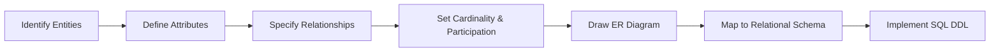

# Chapter 2: Entity-Relationship Model

> **Previous:** [Chapter 1: Introduction to Database Systems](./01-introduction.md) | **Next:** [Chapter 3: The Relational Model](./03-relational-model.md)

## Learning Objectives

- Identify entities, attributes, and relationships in a problem domain
- Classify attribute types: simple vs. composite, single-valued vs. multi-valued, stored vs. derived
- Define relationship types, degree, and cardinality constraints
- Construct ER diagrams using standard notations
- Distinguish strong from weak entities
- Model generalization, specialization, and aggregation hierarchies
- Translate an ER diagram into a relational schema

## Chapter at a Glance

| Topic | Key Insight | Practical Takeaway |
|-------|-------------|-------------------|
| **Entities & Attributes** | Real-world objects with descriptive properties | Identify entities first, then their attributes |
| **Relationships & Cardinality** | Associations between entities with 1:1, 1:N, M:N rules | Correct cardinality prevents schema redesign |
| **Weak Entities** | Depend on owner entity for identity | Common for line items, dependents, seat assignments |
| **Generalization/Specialization** | Inheritance modeling for entity types | Choose Strategy B (separate tables) for flexibility |
| **ER-to-Relational Mapping** | Systematic conversion of conceptual to logical schema | Follow the 8 mapping rules in order |

## Chapter Roadmap



## Theory

> **One-Sentence Takeaway:** The ER model provides a high-level conceptual blueprint — translating real-world requirements into visual diagrams before any SQL is written.


### 2.1 The Entity-Relationship Model

The Entity-Relationship (ER) model, introduced by Peter Chen in 1976, is a conceptual data model that provides a high-level description of a database. It is used primarily in the database design phase to capture user requirements and represent them in a visual, intuitive form before implementation.

The ER model views the real world as a collection of **entities** (things or objects) and **relationships** (associations among entities).

### 2.2 Entities and Entity Sets

An **entity** is a distinguishable object that exists in the real world. Each entity has a unique identity. For example, a specific student named "Alice Chen" with student ID "1001" is an entity.

An **entity set** is a collection of entities that share the same properties. For example, all students form the STUDENT entity set. Entity sets are conventionally named in uppercase singular.

**Entity vs. Entity Set:**
- Entity: Alice Chen, student ID 1001 (a specific instance)
- Entity Set: STUDENT (the collection of all student entities)

### 2.3 Attributes

Attributes describe the properties of entities. Each entity has a value for each of its attributes.

**Attribute Classifications:**

**Simple vs. Composite:**
- **Simple (Atomic):** Cannot be divided. Example: `student_id`, `age`
- **Composite:** Can be divided into subparts. Example: `name` can be divided into `first_name`, `middle_initial`, `last_name`; `address` into `street`, `city`, `state`, `zip_code`

**Single-Valued vs. Multi-Valued:**
- **Single-Valued:** One value per entity. Example: `student_id` (a student has one ID)
- **Multi-Valued:** Zero or more values. Example: `phone_numbers` (a student may have multiple phone numbers); `degrees` (a person may have multiple degrees)

**Stored vs. Derived:**
- **Stored:** Value is physically stored in the database. Example: `date_of_birth`
- **Derived:** Value is computed from stored values. Example: `age` is derived from `date_of_birth` and the current date

**Null Values:** An attribute may take a null value when:
- The attribute does not apply (e.g., `apartment_number` for a single-family home)
- The value is unknown (e.g., `salary` has not been entered yet)
- The value is unknown but exists (e.g., `phone_number` exists but we do not know it)

### 2.4 Relationship Types and Relationship Sets

A **relationship** is an association among two or more entities. For example, Alice Chen (a STUDENT entity) *takes* CS101 (a COURSE entity).

A **relationship set** is a collection of relationships of the same type. For example, all takes relationships form the TAKES relationship set.

**Degree of a Relationship:** The number of entity types participating in the relationship.
- **Unary (degree 1):** Relationship between entities of the same entity set. Example: MARRIED_TO (PERSON married to another PERSON), MANAGES (EMPLOYEE manages another EMPLOYEE)
- **Binary (degree 2):** Relationship between two entity sets. This is the most common degree.
- **Ternary (degree 3):** Relationship among three entity sets.

**Cardinality Constraints:** For binary relationships, the cardinality constraint specifies how many entities from one set can relate to entities in the other set.

- **One-to-One (1:1):** An entity in A is associated with at most one entity in B, and vice versa. Example: A MANAGER manages at most one DEPARTMENT; a DEPARTMENT has at most one MANAGER.

- **One-to-Many (1:N):** An entity in A is associated with zero or more entities in B, but an entity in B is associated with at most one entity in A. Example: A DEPARTMENT has many EMPLOYEES, but an EMPLOYEE belongs to at most one DEPARTMENT.

- **Many-to-One (N:1):** The inverse of 1:N. Multiple entities in A relate to a single entity in B.

- **Many-to-Many (M:N):** An entity in A is associated with any number of entities in B, and vice versa. Example: A STUDENT can take many COURSEs; a COURSE can be taken by many STUDENTs.

**Participation Constraints (Total vs. Partial):**
- **Total Participation:** Every entity in the set must participate in the relationship. Example: Every STUDENT must be enrolled in at least one COURSE.
- **Partial Participation:** Some entities may not participate. Example: Not every FACULTY member advises a STUDENT.

### 2.5 Weak Entity Sets

A **weak entity set** is an entity set whose existence depends on another entity set (the **identifying** or **owner** entity set).

Characteristics:
- A weak entity does not have a primary key of its own
- It is identified by combining its **discriminator** (partial key) with the primary key of the identifying entity set
- The identifying relationship is many-to-one from weak to owner
- The participation of the weak entity in the identifying relationship is always total

**Example:** A DEPENDENT entity depends on an EMPLOYEE entity. Two employees might both have a dependent named "John Smith." Dependents are identified by the combination of their name (discriminator) and the employee ID (owner's key).

### 2.6 ER Diagram Notation

ER diagrams use standard symbols:

```
Rectangles: Entity sets
Ellipses: Attributes
   - Underlined attribute: Primary key
   - Dashed underline: Discriminator (partial key)
   - Double-line ellipse: Multi-valued attribute
   - Double-bordered ellipse: Derived attribute
Diamonds: Relationship sets
Lines: Connect entities to relationships
   - Single line: Partial participation
   - Double line: Total participation
   - Arrow from relationship to entity: "ToOne" side
   - No arrow: "ToMany" side
Double-bordered rectangle: Weak entity set
Double-bordered diamond: Identifying relationship
```

**Diagram Description — University Schema:**

```
[STUDENT] ----< TAKES >---- [COURSE]
    |                          |
    |                          |
(student_id)               (course_id)
    |                          |
  (name)                    (title)
    |                          |
(phone_numbers)            (credits)

Key:
- STUDENT is a rectangle with attributes: student_id (PK), name, phone_numbers (multi-valued)
- COURSE is a rectangle with attributes: course_id (PK), title, credits
- TAKES is a diamond connecting STUDENT and COURSE
- M:N relationship (no arrows on lines)

Below the diagram:
[EMPLOYEE] ==== MANAGES ---- [DEPARTMENT]
    |        (double line     |
    |         for total)      |
  (emp_id)                  (dept_id)
    |
  (name)

Key:
- MANAGES is 1:1 (arrow from MANAGES to EMPLOYEE, arrow from MANAGES to DEPARTMENT)
- Double line: total participation of DEPARTMENT in MANAGES (every department has a manager)
- Single line: partial participation of EMPLOYEE (not every employee manages a department)
```

### 2.7 Generalization, Specialization, and Aggregation

**Generalization:** The process of defining a more general entity set from lower-level entity sets. Example: PERSON is a generalization of STUDENT and FACULTY. The common attributes (name, address, phone) are moved to PERSON, while specific attributes (GPA for STUDENT, salary for FACULTY) remain in the specialized sets.

**Specialization:** The inverse — defining sub-groupings within an entity set. Example: From EMPLOYEE, we define subtypes SECRETARY, ENGINEER, and MANAGER, each with additional attributes.

**Constraints on Specialization/Generalization:**
- **Disjointness:** Can an entity belong to more than one subclass?
  - **Disjoint (d):** An entity can belong to at most one subclass (e.g., a bank account is either SAVINGS or CHECKING, not both)
  - **Overlapping (o):** An entity can belong to multiple subclasses (e.g., a person can be both a STUDENT and an EMPLOYEE)
- **Completeness:** Must every entity in the superclass belong to a subclass?
  - **Total:** Every superclass entity must be in some subclass (e.g., every ACCOUNT must be SAVINGS or CHECKING)
  - **Partial:** Some superclass entities may not belong to any subclass (e.g., not every PERSON is a STUDENT or FACULTY)

**Aggregation:** Treating a relationship as an entity for participation in other relationships. Example: PROJECT_WORKS (relationship between EMPLOYEE and PROJECT) might be treated as an entity that participates in a relationship with PAYROLL to track hours.

### 2.8 From ER to Relational Mapping

ER diagrams are conceptual — they must be converted to relational schemas for implementation. The mapping rules:

1. **Strong Entity Sets:** Create a table with all simple attributes. Composite attributes are flattened (each component becomes a column). The primary key becomes the table's primary key.

2. **Weak Entity Sets:** Create a table with all attributes plus the primary key of the owning entity as a foreign key. The primary key combines the owner's key and the weak entity's discriminator.

3. **Binary 1:1 Relationships:** Add the primary key of one side as a foreign key in the table for the other side. Include relationship attributes.

4. **Binary 1:N Relationships:** Add the primary key of the "one" side as a foreign key in the table for the "many" side. Total participation is enforced through NOT NULL.

5. **Binary M:N Relationships:** Create a new table with the primary keys of both entities as foreign keys. Their combination is the primary key. Include relationship attributes.

6. **Multi-valued Attributes:** Create a new table with the entity's primary key plus the attribute. The key is the combination of both.

7. **Generalization/Specialization:** Three strategies:
   - **Strategy A: Single table:** Combine superclass and all subclasses into one table with nullable columns for subclass-specific attributes and a type discriminator column.
   - **Strategy B: Separate tables for each class:** Create a table for the superclass and separate tables for each subclass, linked via foreign keys.
   - **Strategy C: Subclass tables only:** Skip the superclass table; each subclass table contains both specific and inherited attributes.

## Examples

> **One-Sentence Takeaway:** Practicing ER-to-relational mapping with real examples — from strong entities to weak entities to generalization — builds the skill to design any database schema systematically.

**Example 2.1: Mapping a University ER Diagram to Relations**

Given the ER diagram described above:

```sql
-- Strong entity: STUDENT
CREATE TABLE student (
    student_id INTEGER PRIMARY KEY,
    first_name VARCHAR(50) NOT NULL,
    last_name VARCHAR(50) NOT NULL
);

-- Multi-valued attribute: phone_numbers
CREATE TABLE student_phone (
    student_id INTEGER REFERENCES student(student_id),
    phone VARCHAR(15),
    PRIMARY KEY (student_id, phone)
);

-- Strong entity: COURSE
CREATE TABLE course (
    course_id VARCHAR(10) PRIMARY KEY,
    title VARCHAR(200) NOT NULL,
    credits INTEGER CHECK (credits > 0 AND credits <= 5)
);

-- M:N relationship: TAKES
CREATE TABLE takes (
    student_id INTEGER REFERENCES student(student_id),
    course_id VARCHAR(10) REFERENCES course(course_id),
    semester VARCHAR(10),
    grade CHAR(2),
    PRIMARY KEY (student_id, course_id, semester)
);

-- Example of 1:N: DEPARTMENT has many EMPLOYEES
CREATE TABLE department (
    dept_id INTEGER PRIMARY KEY,
    dept_name VARCHAR(100) NOT NULL
);

CREATE TABLE employee (
    emp_id INTEGER PRIMARY KEY,
    emp_name VARCHAR(100) NOT NULL,
    dept_id INTEGER NOT NULL REFERENCES department(dept_id)
);
-- The dept_id FK in employee models the "many" side of 1:N
```

**Example 2.2: Weak Entity — Dependents**

```sql
-- Strong entity
CREATE TABLE employee (
    emp_id INTEGER PRIMARY KEY,
    name VARCHAR(100) NOT NULL
);

-- Weak entity: DEPENDENT
-- Identified by emp_id + dependent_name
CREATE TABLE dependent (
    emp_id INTEGER NOT NULL REFERENCES employee(emp_id),
    dependent_name VARCHAR(100) NOT NULL,
    relationship VARCHAR(20),
    birth_date DATE,
    PRIMARY KEY (emp_id, dependent_name)
);
```

**Example 2.3: Generalization/Specialization — Strategy B**

```sql
-- Superclass table
CREATE TABLE person (
    person_id INTEGER PRIMARY KEY,
    name VARCHAR(100) NOT NULL,
    address VARCHAR(255)
);

-- Subclass tables (1:1 relationship via FK)
CREATE TABLE student (
    person_id INTEGER PRIMARY KEY REFERENCES person(person_id),
    gpa DECIMAL(3,2),
    major VARCHAR(50)
);

CREATE TABLE faculty (
    person_id INTEGER PRIMARY KEY REFERENCES person(person_id),
    salary DECIMAL(10,2),
    department VARCHAR(50)
);

-- A person who is both a student and faculty:
-- INSERT INTO person VALUES (1, 'Dr. Smith', '123 Main St');
-- INSERT INTO student VALUES (1, 3.8, 'CS');
-- INSERT INTO faculty VALUES (1, 85000, 'CS');
```

> **Warning:** Ternary relationships (degree 3) are often overused — most scenarios modeled with three entities can be expressed as two binary relationships.
>
> **Remember:** The ER diagram is a communication tool, not just a design artifact — use consistent notation so all stakeholders interpret it the same way.

## 💡 Pro Tips

1. **Always start with an ER diagram** before writing a single CREATE TABLE statement — it catches design flaws early and communicates structure to stakeholders.
2. **Binary relationships cover 90% of real-world cases** — avoid ternary relationships unless all three entity types are genuinely independent; they often hide design problems.
3. **Be precise with cardinality and participation** — confusing 1:N with M:N or total with partial participation leads to incorrect schemas that are expensive to fix later.
4. **Weak entities are more common than you think** — line items on an invoice, dependents of an employee, and seat assignments on a flight are all weak entities.
5. **Use Strategy B (separate tables) for generalization** — it preserves all constraints and handles overlapping subclasses cleanly, at the cost of more joins.

## One-Sentence Takeaways

- **2.1:** The ER model is a high-level conceptual tool for capturing user requirements before database implementation.
- **2.2:** An entity is a distinguishable real-world object; an entity set is a collection of similar entities.
- **2.3:** Attributes describe entity properties and can be simple/composite, single-valued/multi-valued, or stored/derived.
- **2.4:** Relationships connect entities with specified degree (unary, binary, ternary) and cardinality constraints (1:1, 1:N, M:N).
- **2.5:** Weak entities depend on owner entities for their identity and combine an owner's key with a discriminator.
- **2.6:** ER diagrams use standard symbols — rectangles for entities, diamonds for relationships, ellipses for attributes.
- **2.7:** Generalization creates a superclass from subclasses; specialization creates subclasses from a superclass.
- **2.8:** ER-to-relational mapping converts conceptual designs into implementable SQL schemas using systematic rules.

## Concept Comparison Table

| Concept | Definition | Example |
|---------|-----------|---------|
| **Strong Entity** | Has its own primary key | STUDENT(student_id) |
| **Weak Entity** | Depends on owner entity for identity | DEPENDENT(emp_id, dependent_name) |
| **1:1 Relationship** | Each entity relates to at most one on each side | MANAGER manages DEPARTMENT |
| **1:N Relationship** | One entity relates to many; inverse relates to one | DEPARTMENT has many EMPLOYEES |
| **M:N Relationship** | Both sides can relate to many | STUDENT takes COURSE |
| **Total Participation** | Every entity must participate | Every STUDENT must be enrolled (if required) |
| **Partial Participation** | Some entities may not participate | Not every FACULTY advises a student |
| **Simple Attribute** | Cannot be divided further | student_id, age |
| **Composite Attribute** | Can be divided into subparts | name (first, last), address (street, city, zip) |
| **Derived Attribute** | Computed from stored attributes | age from date_of_birth |

## Quick Reference

| ER Concept | Notation | SQL Mapping |
|-----------|----------|-------------|
| Strong Entity | Rectangle | Create table with PK |
| Weak Entity | Double rectangle | Create table, FK to owner, composite PK |
| Simple Attribute | Single ellipse | Column in table |
| Composite Attribute | Ellipse with sub-ellipses | Flattened columns |
| Multi-valued Attribute | Double-line ellipse | Separate table with FK + attribute |
| Derived Attribute | Dashed ellipse | Not stored; computed in query |
| 1:1 Relationship | Diamond with arrows both sides | FK + UNIQUE in one table |
| 1:N Relationship | Diamond with arrow on "1" side | FK in "many" side table |
| M:N Relationship | Diamond (no arrows) | New junction table with composite PK |
| Total Participation | Double line | NOT NULL on FK column |
| Identifying Relationship | Double diamond | FK that is part of PK in weak entity |

## Cross-Application Matrix

| ER Concept | Applies To | Why It Matters |
|-----------|-----------|----------------|
| **Weak Entities** | Invoicing, flight booking, payroll | Line items, seat assignments, and dependents cannot exist without their parent |
| **1:N Relationships** | Almost every business domain | Customers→Orders, Departments→Employees, Authors→Books |
| **M:N Relationships** | Students→Courses, Products→Orders | Requires junction tables — a common source of design errors |
| **Generalization** | Employee types, account types, media library | Models inheritance: savings/checking accounts, full-time/contract employees |
| **Multi-valued Attributes** | Phone numbers, skills, tags | Never store as comma-separated strings — create a separate table |
| **Total Participation** | Mandatory relationships | Ensures data completeness: every order must reference a customer |

## Chapter Quiz

1. A weak entity is identified by:
   a) Its own primary key only
   b) A combination of a discriminator and the owner's primary key
   c) A composite attribute
   d) A derived attribute

2. In a 1:N relationship between DEPARTMENT and EMPLOYEE:
   a) Each department has many employees, and each employee belongs to many departments
   b) Each department has many employees, and each employee belongs to one department
   c) Each department has one employee, and each employee belongs to one department
   d) Each department has one employee, and each employee belongs to many departments

3. Which symbol represents a total participation in an ER diagram?
   a) Single line
   b) Double line
   c) Arrow
   d) Dashed line

4. A ternary relationship involves:
   a) Two entity sets
   b) Three entity sets
   c) Three attributes
   d) Three relationship sets

5. Which attribute type requires a separate table during ER-to-relational mapping?
   a) Simple attribute
   b) Composite attribute
   c) Multi-valued attribute
   d) Derived attribute

6. Generalization is the process of:
   a) Creating subclasses from a superclass
   b) Creating a superclass from multiple subclasses
   c) Adding attributes to an entity
   d) Removing redundant relationships

7. The identifying relationship of a weak entity is always:
   a) Many-to-many
   b) Many-to-one from weak to owner
   c) One-to-one
   d) One-to-many from owner to weak

8. Which mapping strategy creates nullable columns for subclass-specific attributes?
   a) Strategy A: Single table
   b) Strategy B: Separate tables
   c) Strategy C: Subclass tables only
   d) Strategy D: No mapping needed

**Answers:** 1-b, 2-b, 3-b, 4-b, 5-c, 6-b, 7-b, 8-a

## Summary

- The ER model is a high-level conceptual data model used for database design.
- Entities represent objects; attributes describe entity properties; relationships connect entities.
- Attribute types include simple/composite, single-valued/multi-valued, stored/derived.
- Cardinality constraints (1:1, 1:N, M:N) and participation constraints (total/partial) define relationship semantics.
- Weak entities depend on identifying owner entities and use a discriminator.
- Generalization and specialization model inheritance relationships.
- ER-to-relational mapping translates conceptual designs into implementable table schemas.

## Exercises

### Basic

1. For a LIBRARY database, identify at least three entity sets and two relationship sets.

2. Classify each attribute as simple or composite, single-valued or multi-valued, stored or derived:
   a) `employee_id`
   b) `full_name` (stored as "Smith, John")
   c) `years_of_service` (computed from hire_date)
   d) `phone_numbers`
   e) `address`

3. What is the difference between a weak entity set and a strong entity set? Give an example of each.

4. Draw (describe in words) an ER diagram for a HOSPITAL where:
   - DOCTOR treats PATIENT
   - Each DOCTOR has a name and specialty
   - Each PATIENT has a name, date_of_birth, and insurance provider
   - A PATIENT can have multiple DOCTORs and vice versa

### Intermediate

5. For a BILLING system: INVOICE has invoice_id, date, total_amount. LINE_ITEM has description, quantity, unit_price. An INVOICE has many LINE_ITEMs. A LINE_ITEM belongs to exactly one INVOICE. What cardinality is this? Write the CREATE TABLE statements.

6. Consider a COMPANY database where MANAGER manages DEPARTMENT. Not every employee is a manager. Every department has exactly one manager. One manager manages exactly one department. Identify the cardinality, participation constraints, and write the schema.

7. Convert the following description into an ER diagram description and mapping:
   - A PROJECT has project_id, name, budget
   - An EMPLOYEE has emp_id, name, title
   - An EMPLOYEE can work on multiple PROJECTs
   - A PROJECT can have multiple EMPLOYEEs
   - Each work relationship has hours_per_week

### Advanced

8. Design a generalization hierarchy for VEHICLES in a rental system. Include CAR, TRUCK, and MOTORCYCLE as subclasses. What attributes go in VEHICLE? Which subclass-specific attributes would each have? Show the mapping SQL using Strategy B.

9. A university database has the following REQUIREMENT: "A course section must be taught by exactly one instructor. An instructor teaches zero or more sections. A section belongs to exactly one course. A course has zero or more sections." Identify all entity sets, relationship sets, cardinalities, and participation constraints. Write the full SQL schema.

10. Consider an AIRLINE database with WEAK entities: SEAT depends on FLIGHT. Each flight has a flight_number and date. Each seat has seat_number (1A, 1B, etc.) and class (economy, business, first). Write the SQL schema. How would you handle the case where the same seat number exists on different flights?
