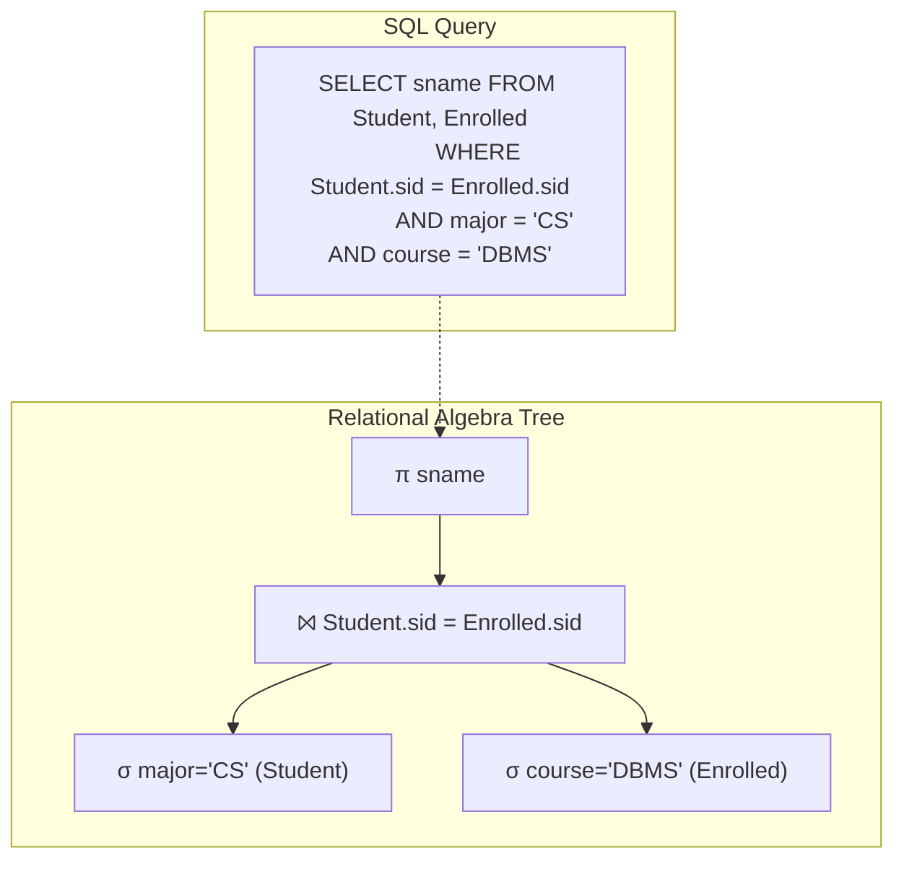

# Chapter 3: The Relational Model

> **Previous:** [Chapter 2: Entity-Relationship Model](./02-er-model.md) | **Next:** [Chapter 4: SQL Basics](./04-sql-basics.md)

## Learning Objectives

- Define relations, tuples, attributes, and domains formally with real-world analogies
- Classify keys: superkey, candidate key, primary key, foreign key, alternate key, composite key, surrogate key
- Explain and enforce integrity constraints: domain, entity, referential
- Express queries using relational algebra operations with step-by-step traces
- Understand the closure property of relational algebra
- Apply selection, projection, join, set operations, and division with implementations
- Distinguish between tuple and domain relational calculus

## Chapter at a Glance

| Topic | Key Insight | Practical Takeaway |
|-------|-------------|-------------------|
| **Relation Structure** | A relation is a set of tuples with atomic values | Every cell holds exactly one value (1NF) |
| **Keys** | Superkey, candidate, primary, foreign key hierarchy | Choose minimal candidate keys as primary keys |
| **Integrity Constraints** | Domain, entity, and referential rules | Enforce at DB level, not in application code |
| **Relational Algebra** | Procedural query language with closure property | Every operation outputs a relation — enabling composition |
| **Relational Calculus** | Declarative alternative — specify WHAT not HOW | Understand both for complete query mastery |

## Chapter Roadmap


## Theory

> **One-Sentence Takeaway:** The relational model, rooted in set theory and predicate logic, represents all data as simple relations and provides a small set of powerful algebraic operations for querying.

---

### 3.1 Introduction to the Relational Model


The relational model was proposed by **E.F. Codd in 1970** in his seminal paper *"A Relational Model of Data for Large Shared Data Banks."* It revolutionized database management by providing a mathematically rigorous framework for data organization and manipulation.

The model is built on **set theory** and **first-order predicate logic**. Its elegance comes from representing all data as simple **relations (tables)** and providing a small set of powerful operations for querying and manipulating that data.

**Why the relational model dominates:**
- **Data independence:** Physical storage is decoupled from logical structure
- **Set-at-a-time operations:** Unlike earlier navigational models (IMS, CODASYL) that processed one record at a time
- **Solid mathematical foundation:** Query optimization is provably correct via algebraic equivalence
- **Simplicity:** Users only need to understand tables, keys, and a handful of operations

---

### 3.2 Relational Model Concepts


#### 3.2.1 Real-World Analogy: The Spreadsheet

Think of a **spreadsheet** like Microsoft Excel or Google Sheets:

| StudentID | Name | Major | GPA |
|-----------|------|-------|-----|
| 101 | Alice | CS | 3.8 |
| 102 | Bob | Math | 3.2 |
| 103 | Charlie | CS | 3.5 |

- **Relation** = The entire spreadsheet (table)
- **Tuple** = One row (one student's data)
- **Attribute** = One column header (e.g., "Name")
- **Domain** = The type of data allowed in a column (e.g., GPA must be 0.0–4.0)
- **Cardinality** = Number of data rows (3 students)
- **Degree** = Number of columns (4 columns)

A spreadsheet is *almost* a relation, but spreadsheets allow duplicate rows, formulas, and multi-cell merges — pure relations reject all of these.

#### 3.2.2 Formal Definitions

**Relation:** Let \( D_1, D_2, \ldots, D_n \) be domains (sets of atomic values). A relation \( R \) is a subset of the Cartesian product \( D_1 \times D_2 \times \ldots \times D_n \):

\[
R \subseteq D_1 \times D_2 \times \ldots \times D_n
\]

Each element of \( R \) is an n-tuple \( (v_1, v_2, \ldots, v_n) \) where each \( v_i \in D_i \).

**Tuple:** An ordered sequence of \( n \) values, each drawn from its respective domain. Represented as \( t = \langle v_1, v_2, \ldots, v_n \rangle \). In practice, a tuple corresponds to a row in a table.

**Attribute:** A named column of a relation. The schema defines attributes as `AttributeName: Domain`. Example: `student_id: INTEGER`.

**Domain:** A set of atomic (indivisible) values. Examples:
- `INTEGER`: set of all integers
- `VARCHAR(50)`: set of all strings up to 50 characters
- `BOOLEAN`: {true, false}
- `GPA`: real numbers in [0.0, 4.0]

**Cardinality:** The number of tuples (rows) in a relation instance. Denoted |R|. Example: If STUDENT has 1000 students, cardinality = 1000.

**Degree (Arity):** The number of attributes (columns) in a relation schema. A relation of degree 3 has three columns. A relation of degree 1 is *unary*, degree 2 is *binary*, degree 3 is *ternary*.

#### 3.2.3 Relation Schema vs. Relation Instance

| Concept | Definition | Example |
|---------|-----------|---------|
| **Schema (intension)** | Logical definition — name + attribute names + domains | `STUDENT(sid: INT, name: VARCHAR(50), major: VARCHAR(30))` |
| **Instance (extension)** | Actual data at a point in time | The set of currently enrolled students |

The schema is stable (changes rarely), while the instance changes with every INSERT, UPDATE, DELETE.

#### 3.2.4 Properties of Relations

1. **Unique name:** Each relation has a unique name within the database schema
2. **Atomic values:** Every cell contains exactly one atomic value (the relational model mandates 1NF)
3. **Unique attributes:** Each attribute has a unique name within the relation
4. **Attribute order is insignificant:** Columns can be rearranged without changing the relation
5. **Tuple order is insignificant:** A relation is a *set* of tuples, not a list
6. **No duplicate tuples:** Every relation has a key that guarantees uniqueness
7. **Every tuple has the same structure:** Same number of attributes, same domains

#### 3.2.5 Step-by-Step: Defining a Relation

**Step 1:** Identify the entity (e.g., Student)
**Step 2:** List its relevant properties (sid, name, major, gpa)
**Step 3:** Determine the domain for each property
**Step 4:** Choose a primary key (e.g., sid)
**Step 5:** Write the schema: `STUDENT(sid: INT, name: VARCHAR(50), major: VARCHAR(30), gpa: FLOAT)`
**Step 6:** Populate with tuples (the instance)

#### 3.2.6 Pseudocode: Relation Data Structure

```
STRUCTURE Relation:
    name: String
    attributes: List<Attribute>   // ordered list of (name, domain)
    tuples: Set<List<Value>>       // set of tuples (no duplicates)

METHOD insert(relation, tuple):
    IF tuple.domain != relation.attributes.domain:
        REJECT "Domain mismatch"
    IF tuple IN relation.tuples:
        REJECT "Duplicate tuple"
    relation.tuples += tuple

METHOD project(relation, attrNames):
    attrIndices = [index of each attrName in relation.attributes]
    result = new Relation
    FOR each tuple IN relation.tuples:
        newTuple = [tuple[i] FOR i IN attrIndices]
        result.tuples += newTuple  // set addition removes duplicates
    RETURN result

METHOD select(relation, predicate):
    result = new Relation(same schema as relation)
    FOR each tuple IN relation.tuples:
        IF predicate(tuple):
            result.tuples += tuple
    RETURN result
```

#### 3.2.7 C++ Implementation: Relation Structure

```cpp
#include <iostream>
#include <vector>
#include <set>
#include <string>
#include <variant>
#include <functional>

using Value = std::variant<int, double, std::string>;

struct Attribute {
    std::string name;
    std::string domain; // "INT", "FLOAT", "VARCHAR"
};

struct Tuple {
    std::vector<Value> values;
    bool operator<(const Tuple& other) const {
        if (values.size() != other.values.size())
            return values.size() < other.values.size();
        for (size_t i = 0; i < values.size(); ++i) {
            if (values[i] < other.values[i]) return true;
            if (other.values[i] < values[i]) return false;
        }
        return false;
    }
};

class Relation {
private:
    std::string name;
    std::vector<Attribute> attrs;
    std::set<Tuple> tuples;

public:
    Relation(std::string n, std::vector<Attribute> a)
        : name(n), attrs(a) {}

    bool insert(const Tuple& t) {
        if (t.values.size() != attrs.size()) return false;
        auto [_, inserted] = tuples.insert(t);
        return inserted;
    }

    size_t cardinality() const { return tuples.size(); }
    size_t degree() const { return attrs.size(); }

    Relation select(std::function<bool(const Tuple&)> pred) const {
        Relation result("SELECT(" + name + ")", attrs);
        for (const auto& t : tuples) {
            if (pred(t)) result.insert(t);
        }
        return result;
    }

    Relation project(const std::vector<int>& indices) const {
        std::vector<Attribute> newAttrs;
        for (int i : indices) newAttrs.push_back(attrs[i]);
        Relation result("PROJ(" + name + ")", newAttrs);
        for (const auto& t : tuples) {
            Tuple newTuple;
            for (int i : indices) newTuple.values.push_back(t.values[i]);
            result.insert(newTuple);
        }
        return result;
    }

    void print() const {
        std::cout << "Relation: " << name << " (|R|=" << cardinality()
                  << ", deg=" << degree() << ")\n";
        for (const auto& t : tuples) {
            std::cout << "  (";
            for (size_t i = 0; i < t.values.size(); ++i) {
                if (i > 0) std::cout << ", ";
                if (std::holds_alternative<int>(t.values[i]))
                    std::cout << std::get<int>(t.values[i]);
                else if (std::holds_alternative<double>(t.values[i]))
                    std::cout << std::get<double>(t.values[i]);
                else
                    std::cout << std::get<std::string>(t.values[i]);
            }
            std::cout << ")\n";
        }
    }
};
```

#### 3.2.8 Python Implementation: Relation Structure

```python
from typing import List, Tuple as TupleType, Any, Callable, Set, Optional

class Relation:
    """A relation (table) in the relational model."""

    def __init__(self, name: str, attributes: List[TupleType[str, str]]):
        self.name = name
        self.attributes = attributes  # [(name, domain), ...]
        self.tuples: Set[TupleType[Any, ...]] = set()

    def insert(self, values: TupleType[Any, ...]) -> bool:
        if len(values) != len(self.attributes):
            raise ValueError("Value count doesn't match attribute count")
        if values in self.tuples:
            return False  # duplicate
        self.tuples.add(values)
        return True

    def cardinality(self) -> int:
        return len(self.tuples)

    def degree(self) -> int:
        return len(self.attributes)

    def select(self, predicate: Callable[[TupleType[Any, ...]], bool]) -> 'Relation':
        result = Relation(f"σ({self.name})", self.attributes)
        for t in self.tuples:
            if predicate(t):
                result.tuples.add(t)
        return result

    def project(self, attr_indices: List[int]) -> 'Relation':
        new_attrs = [self.attributes[i] for i in attr_indices]
        result = Relation(f"π({self.name})", new_attrs)
        for t in self.tuples:
            result.tuples.add(tuple(t[i] for i in attr_indices))
        return result

    def rename(self, new_name: str) -> 'Relation':
        result = Relation(new_name, self.attributes)
        result.tuples = set(self.tuples)
        return result

    def union(self, other: 'Relation') -> 'Relation':
        if self.attributes != other.attributes:
            raise ValueError("Relations must be union-compatible")
        result = Relation(f"{self.name} ∪ {other.name}", self.attributes)
        result.tuples = self.tuples | other.tuples
        return result

    def difference(self, other: 'Relation') -> 'Relation':
        if self.attributes != other.attributes:
            raise ValueError("Relations must be union-compatible")
        result = Relation(f"{self.name} - {other.name}", self.attributes)
        result.tuples = self.tuples - other.tuples
        return result

    def __str__(self) -> str:
        header = f"Relation: {self.name} (|R|={self.cardinality()}, deg={self.degree()})"
        rows = [str(t) for t in self.tuples]
        return header + "\n" + "\n".join(rows)
```

#### 3.2.9 Complexity Analysis of Relation Operations

| Operation | Time Complexity | Space Complexity | Why |
|-----------|----------------|-----------------|-----|
| Insert | O(1) avg, O(n) worst | O(1) | Hash-based set insertion; worst case when collision resolution needed |
| Select (full scan) | O(n) | O(k) where k = result size | Must scan all n tuples; predicate evaluation per tuple is O(1) |
| Select (with index) | O(log n) | O(k) | B-tree index reduces search to logarithmic |
| Project | O(n) | O(m) where m = unique values | Scan all tuples; deduplication via set adds overhead |
| Union | O(n + m) | O(n + m) | Must combine both sets and deduplicate |
| Difference | O(n * m) naive, O(n + m) with hash | O(n) or O(m) | Hash-based set difference is linear |
| Cartesian Product | O(n * m) | O(n * m) | Every tuple of R combined with every tuple of S |

---

### 3.3 Keys


#### 3.3.1 Real-World Analogy: The Passport System

Think of a country's passport system:

- **Superkey:** Any combination of identifiers that uniquely finds a person. (Passport#), (Passport#, Name), (SSN), (SSN, BirthDate) — all are superkeys.
- **Candidate Key:** The minimal identifiers. Passport# alone works. SSN alone works. (Passport#, Name) is NOT a candidate key because Name is redundant.
- **Primary Key:** The one chosen as the official identifier. The government chooses Passport# as the primary lookup key.
- **Foreign Key:** A visa stamp in your passport references another country's record system.
- **Alternate Key:** SSN is a valid identifier but wasn't chosen as primary — it's an alternate key.
- **Composite Key:** (Passport#, CountryCode) together uniquely identify you globally.
- **Surrogate Key:** An auto-generated internal ID like a database row number that has no real-world meaning.

#### 3.3.2 Super Key

**Definition:** A set of one or more attributes that uniquely identifies every tuple in a relation.

**Formal:** \( K \subseteq attributes(R) \) such that for any two distinct tuples \( t_1, t_2 \in R \), \( t_1[K] \neq t_2[K] \).

**Example:** In STUDENT(sid, name, major, email):
- `{sid}` is a superkey (no two students share an ID)
- `{email}` is a superkey (email is unique)
- `{sid, name}` is a superkey (but name adds no value)
- `{name}` is NOT a superkey (two students can share a name)

**Property:** Any superset of a superkey is also a superkey.

#### 3.3.3 Candidate Key

**Definition:** A minimal superkey — no proper subset is a superkey.

**Formal:** \( K \) is a candidate key iff:
1. \( K \) is a superkey, AND
2. No proper subset \( K' \subset K \) is a superkey

**Step-by-step to find candidate keys:**
1. List all attributes of the relation
2. Identify all functional dependencies
3. Start with single attributes — check each for uniqueness
4. If no single attribute is a key, try pairs, then triples, etc.
5. Remove any key that contains another key as a subset

**Example:** In STUDENT(sid, name, email):
- `{sid}` — unique, no subset → candidate key ✓
- `{email}` — unique, no subset → candidate key ✓
- `{name}` — not unique → not a candidate key ✗
- Candidate keys: `{sid}`, `{email}`

#### 3.3.4 Primary Key

**Definition:** One candidate key chosen by the database designer as the principal identifier.

**Selection criteria:**
1. **Stability:** Values should never change (e.g., sid is better than email)
2. **Minimality:** Prefer single-attribute keys over composite
3. **Non-null:** Must never be NULL (entity integrity rule)
4. **Simplicity:** Prefer numeric keys over string

**Notation:** Underline the primary key in the schema: `STUDENT(sid, name, email)`

#### 3.3.5 Foreign Key

**Definition:** An attribute (or set of attributes) in one relation that references the primary key of another relation.

**Purpose:** Establishes relationships between relations. Enforces referential integrity.

**Example:**
```
STUDENT(sid, name, dept_id)
                  ^^^^^^^^ FOREIGN KEY REFERENCES DEPARTMENT(dept_id)

DEPARTMENT(dept_id, dept_name, location)
           ^^^^^^^ PRIMARY KEY
```

**Referential Integrity Rule:** A foreign key value must either:
- Match a primary key value in the referenced relation, OR
- Be NULL (if the FK allows NULLs)

**Step-by-step to add a foreign key:**
1. Identify the parent table (where the PK lives)
2. Identify the child table (where the FK will go)
3. Ensure the FK attributes match the PK in number, type, and domain
4. Decide: allow NULL in FK? (optional relationship vs mandatory)
5. Decide: ON DELETE CASCADE / SET NULL / RESTRICT

#### 3.3.6 Alternate Key

**Definition:** A candidate key that was NOT selected as the primary key.

**Example:** In STUDENT(sid, name, email):
- Primary key: `{sid}`
- Alternate key: `{email}` (unique but not chosen as primary)

**SQL equivalent:** `UNIQUE` constraint.

#### 3.3.7 Composite Key

**Definition:** A key consisting of two or more attributes.

**When needed:** When no single attribute uniquely identifies a tuple.

**Example:** In ENROLLMENT(sid, cid, semester):
- `{sid, cid, semester}` is a composite key (same student can take same course in different semesters)
- `{sid}` alone is NOT a key (one student takes many courses)

```
ENROLLMENT(sid, cid, semester, grade)
           ^^^^^^^^^^^^^^^^^^^
           Composite Primary Key
```

#### 3.3.8 Surrogate Key

**Definition:** An artificial, system-generated key with no real-world meaning.

**Purpose:** Avoid natural key problems:
- Natural keys can change (email, phone number)
- Natural keys can be long (URLs, composite keys)
- Natural keys may not exist (no universally unique attribute)

**Example:**
```
CUSTOMER(cust_id, name, email, phone)
         ^^^^^^^
         Surrogate key (auto-increment INTEGER or UUID)
```

#### 3.3.9 Keys Comparison Table

| Key Type | Uniqueness | Minimality | Nullable | Number per Relation | Real-World Meaning | Example |
|----------|-----------|-----------|----------|--------------------|--------------------|---------|
| **Super Key** | Yes | No | No | Many | Yes | {sid, name} |
| **Candidate Key** | Yes | Yes | No | 1+ | Yes | {sid}, {email} |
| **Primary Key** | Yes | Yes | No | Exactly 1 | Yes (chosen) | {sid} |
| **Foreign Key** | No | No | Yes* | 0+ | Yes (reference) | {dept_id} |
| **Alternate Key** | Yes | Yes | No | 0+ | Yes | {email} |
| **Composite Key** | Yes | Yes (minimal) | No | 0+ | Yes | {sid,cid,semester} |
| **Surrogate Key** | Yes | Yes | No | 0+ | No (artificial) | {cust_id} |

*Foreign keys may be nullable for optional relationships.

#### 3.3.10 Key Detection Algorithm

**Pseudocode:**
```
FUNCTION find_candidate_keys(R, FDs):
    // R: relation with attributes A
    // FDs: set of functional dependencies
    keys = empty_set
    FOR subset_size = 1 TO |A|:
        FOR each subset K OF A with size = subset_size:
            closure = compute_closure(K, FDs)
            IF closure == A:  // K is a superkey
                is_minimal = TRUE
                FOR each key IN keys:
                    IF key IS_SUBSET_OF K:
                        is_minimal = FALSE
                        BREAK
                IF is_minimal:
                    keys += K
    RETURN keys

FUNCTION compute_closure(attrs, FDs):
    closure = attrs
    WHILE changes occur:
        FOR each FD (X -> Y) IN FDs:
            IF X IS_SUBSET_OF closure:
                closure += Y
    RETURN closure
```

**C++ Implementation:**
```cpp
#include <iostream>
#include <vector>
#include <set>
#include <string>
#include <algorithm>

using AttributeSet = std::set<std::string>;
using FD = std::pair<AttributeSet, AttributeSet>;

AttributeSet computeClosure(AttributeSet attrs, const std::vector<FD>& fds) {
    AttributeSet closure = attrs;
    bool changed = true;
    while (changed) {
        changed = false;
        for (const auto& fd : fds) {
            const auto& lhs = fd.first;
            const auto& rhs = fd.second;
            bool lhsSubset = std::includes(closure.begin(), closure.end(),
                                           lhs.begin(), lhs.end());
            if (lhsSubset) {
                for (const auto& attr : rhs) {
                    if (closure.insert(attr).second) {
                        changed = true;
                    }
                }
            }
        }
    }
    return closure;
}

std::vector<AttributeSet> findCandidateKeys(
    const AttributeSet& allAttrs, const std::vector<FD>& fds) {

    std::vector<AttributeSet> candidates;
    std::vector<AttributeSet> attrsList(allAttrs.begin(), allAttrs.end());
    int n = attrsList.size();

    for (int mask = 1; mask < (1 << n); ++mask) {
        AttributeSet subset;
        for (int i = 0; i < n; ++i) {
            if (mask & (1 << i)) subset.insert(attrsList[i]);
        }

        AttributeSet closure = computeClosure(subset, fds);
        if (closure == allAttrs) {
            bool minimal = true;
            for (const auto& key : candidates) {
                if (std::includes(subset.begin(), subset.end(),
                                  key.begin(), key.end())) {
                    minimal = false;
                    break;
                }
            }
            if (minimal) {
                // Remove any existing candidates that contain subset
                candidates.erase(
                    std::remove_if(candidates.begin(), candidates.end(),
                        [&](const AttributeSet& k) {
                            return std::includes(k.begin(), k.end(),
                                                 subset.begin(), subset.end());
                        }),
                    candidates.end());
                candidates.push_back(subset);
            }
        }
    }
    return candidates;
}
```

**Python Implementation:**
```python
from typing import Set, List, Tuple, FrozenSet

def compute_closure(attrs: Set[str], fds: List[Tuple[Set[str], Set[str]]]) -> Set[str]:
    closure = set(attrs)
    changed = True
    while changed:
        changed = False
        for lhs, rhs in fds:
            if lhs.issubset(closure):
                for attr in rhs:
                    if attr not in closure:
                        closure.add(attr)
                        changed = True
    return closure

def find_candidate_keys(all_attrs: Set[str],
                        fds: List[Tuple[Set[str], Set[str]]]) -> List[Set[str]]:
    attrs_list = list(all_attrs)
    n = len(attrs_list)
    candidates = []

    for mask in range(1, 1 << n):
        subset = {attrs_list[i] for i in range(n) if mask & (1 << i)}
        closure = compute_closure(subset, fds)

        if closure == all_attrs:  # It's a superkey
            minimal = True
            for key in candidates:
                if key.issubset(subset):
                    minimal = False
                    break
            if minimal:
                candidates = [k for k in candidates if not subset.issuperset(k)]
                candidates.append(subset)

    return candidates
```

#### 3.3.11 Complexity Analysis for Key Detection

| Step | Time Complexity | Why |
|------|----------------|-----|
| Enumerate subsets | O(2^n) | There are 2^n possible attribute subsets |
| Compute closure per subset | O(n * f) | Each closure iterates over f FDs; n rounds worst case |
| Minimality check | O(k^2) | Compare each new key against k existing candidates |

**Total worst-case:** O(2^n * n * f) where n = number of attributes, f = number of FDs.

**Why exponential:** Finding candidate keys is NP-hard in general (the hypergraph transversal problem). In practice, n is small (typically &lt; 20 attributes per relation).

**Edge case:** If no subset produces full closure (incomplete FD set), no candidate key exists — the relation cannot exist in practice.

---

### 3.4 Integrity Constraints


Integrity constraints ensure the correctness and consistency of data. They are rules that every instance of the database must satisfy.

#### 3.4.1 Domain Constraints

**Rule:** Each attribute value must be from its declared domain.

**Example:**
```sql
CREATE TABLE Student (
    sid INTEGER PRIMARY KEY,
    name VARCHAR(50),
    age INTEGER CHECK (age >= 16 AND age <= 120),
    gender CHAR(1) CHECK (gender IN ('M', 'F', 'O'))
);
```

**Violation:** Inserting `age = -5` or `gender = 'X'` would violate domain constraints.

#### 3.4.2 Entity Integrity

**Rule:** No attribute that is part of the primary key can be NULL.

**Why:** If the primary key were NULL, the tuple would not be uniquely identifiable — the definition of "key" would break.

**Example:**
```sql
CREATE TABLE Student (
    sid INTEGER PRIMARY KEY,   -- sid cannot be NULL
    name VARCHAR(50)
);
-- INSERT INTO Student VALUES (NULL, 'Alice'); -- REJECTED
```

#### 3.4.3 Referential Integrity

**Rule:** A foreign key value must either:
- Match a primary key value in the referenced relation, OR
- Be entirely NULL (if all FK attributes allow NULL)

**Example:**
```sql
CREATE TABLE Student (
    sid INTEGER PRIMARY KEY,
    dept_id INTEGER REFERENCES Department(dept_id)
);
-- INSERT INTO Student VALUES (1, 'CS101'); -- REJECTED if no Dept with id 'CS101'
```

**Referential actions:**
- **CASCADE:** Delete/update parent, propagate to child
- **SET NULL:** Set child FK to NULL
- **RESTRICT/NO ACTION:** Reject delete/update if children exist
- **SET DEFAULT:** Set child FK to a default value

#### 3.4.4 Semantic Integrity (Business Rules)

Application-specific rules enforced via CHECK constraints or triggers.

**Examples:**
- "An employee's salary cannot exceed their manager's salary."
- "A student's GPA must be between 0.0 and 4.0."
- "End date must be after start date."

```
RULE: salary_check
  FOR EACH Employee e, Employee m
  WHERE e.manager_id = m.emp_id
  CHECK: e.salary <= m.salary
```

---

### 3.5 Relational Algebra


Relational algebra is a **procedural query language** — it describes *how* to compute a result by applying operations to relations. Every operation takes one or two relations as input and produces a **new relation** as output (the **closure property**).

**Core operators:**

| Category | Operators |
|----------|-----------|
| **Basic (unary)** | Selection (σ), Projection (π), Rename (ρ) |
| **Basic (binary)** | Union (∪), Set Difference (−), Cartesian Product (×) |
| **Derived (binary)** | Intersection (∩), Join (⨝), Division (÷) |

#### 3.5.1 Real-World Analogy: Recipe Instructions

Relational algebra is like a **recipe** — it gives step-by-step instructions:
1. "Take all students" (relation)
2. "Filter to those with GPA > 3.5" (selection)
3. "Keep only their names" (projection)
4. "Combine with their course enrollments" (join)
5. "Serve the result" (final relation)

SQL, by contrast, is like a **meal order** — "Give me the names of high-GPA students and their courses." The database figures out the steps.

#### 3.5.2 SELECT Operation (σ)

**Purpose:** Filter rows (tuples) based on a condition.

**Syntax:** `σ<predicate>(R)`

**Step-by-step:**
1. Start with relation R
2. For each tuple t in R, evaluate predicate P(t)
3. If P(t) is TRUE, include t in output
4. If P(t) is FALSE or NULL, exclude t

**Example:** Find students with GPA > 3.5:
`σ<GPA > 3.5>(STUDENT)`

**Trace Table:**

| Step | Operation | Intermediate Result |
|------|-----------|-------------------|
| Input | STUDENT | { (1, Alice, CS, 3.8), (2, Bob, Math, 3.2), (3, Charlie, CS, 3.5), (4, Diana, CS, 3.9) } |
| 1 | Evaluate t₁: GPA=3.8 > 3.5? | TRUE → Keep |
| 2 | Evaluate t₂: GPA=3.2 > 3.5? | FALSE → Drop |
| 3 | Evaluate t₃: GPA=3.5 > 3.5? | FALSE → Drop (not strictly greater) |
| 4 | Evaluate t₄: GPA=3.9 > 3.5? | TRUE → Keep |
| Output | Result | { (1, Alice, CS, 3.8), (4, Diana, CS, 3.9) } |

**Properties:**
- Commutative: `σ<cond1>(σ<cond2>(R)) = σ<cond2>(σ<cond1>(R))`
- Cascading: `σ<cond1>(σ<cond2>(R)) = σ<cond1 ∧ cond2>(R)`
- Idempotent: `σ<cond>(σ<cond>(R)) = σ<cond>(R)`

**C++ Implementation:**
```cpp
Relation Relation::select(std::function<bool(const Tuple&)> pred) const {
    Relation result("σ(" + name + ")", attrs);
    for (const auto& t : tuples) {
        if (pred(t)) result.insert(t);
    }
    return result;
}
```

**Python Implementation:**
```python
def select(relation: Relation, predicate) -> Relation:
    result = Relation(f"σ({relation.name})", relation.attributes)
    for t in relation.tuples:
        if predicate(t):
            result.tuples.add(t)
    return result
```

**Complexity:** O(n) time, O(k) space where n = |R|, k = number of tuples satisfying predicate.

#### 3.5.3 PROJECT Operation (π)

**Purpose:** Select specific columns (attributes). Remove duplicates.

**Syntax:** `π<attribute_list>(R)`

**Step-by-step:**
1. Identify the attributes to keep
2. For each tuple, extract only those attribute values
3. Remove any duplicate tuples in the result

**Example:** Get names and majors:
`π<name, major>(STUDENT)`

**Trace Table:**

| Step | Operation | Intermediate Result | Details |
|------|-----------|-------------------|---------|
| Input | STUDENT | (1, Alice, CS, 3.8), (2, Bob, Math, 3.2), (3, Charlie, CS, 3.5) | Full relation |
| 1 | Extract name, major | (Alice, CS), (Bob, Math), (Charlie, CS) | Removed sid, gpa |
| 2 | Deduplicate | (Alice, CS), (Bob, Math), (Charlie, CS) | No dups in this case |
| Output | Result | { (Alice, CS), (Bob, Math), (Charlie, CS) } | |

**Note:** If another student also named Alice in CS, duplicates would be removed. This is why projection can reduce cardinality.

**C++ Implementation:** (see project() in section 3.2.7)

**Python Implementation:** (see project() in section 3.2.8)

**Complexity:** O(n) to scan, O(m) for dedup where m = unique output tuples.

#### 3.5.4 RENAME Operation (ρ)

**Purpose:** Rename a relation or its attributes. Essential for self-joins and disambiguation.

**Syntax:** `ρ<new_name>(R)` or `ρ<new_name(attr1, ..., attrN)>(R)`

**Example:** `ρ<EMP(empID, empName)>(EMPLOYEE)` renames both the relation and its attributes.

**Usage in queries:** Allows joining a table with itself:
```
ρ<E1>(EMPLOYEE) ⨝<E1.manager_id = E2.emp_id> ρ<E2>(EMPLOYEE)
```
Finds employee-manager pairs.

**C++ Implementation:**
```cpp
Relation Relation::rename(const std::string& newName,
                           const std::vector<std::string>& newAttrNames) const {
    std::vector<Attribute> newAttrs;
    for (size_t i = 0; i < attrs.size(); ++i) {
        std::string n = (i < newAttrNames.size()) ? newAttrNames[i] : attrs[i].name;
        newAttrs.push_back({n, attrs[i].domain});
    }
    Relation result(newName, newAttrs);
    result.tuples = tuples;  // Copy all tuples
    return result;
}
```

#### 3.5.5 UNION Operation (∪)

**Purpose:** Combine tuples from two relations.

**Requirement:** Relations must be **union-compatible**:
1. Same number of attributes (same degree)
2. Corresponding attributes must be from the same domain

**Syntax:** `R ∪ S`

**Step-by-step:**
1. Verify union-compatibility (same degree, matching domains)
2. Take all tuples from R
3. Add all tuples from S (set semantics removes duplicates)

**Example:** Find employees who are managers OR engineers:
`π<emp_id>(MANAGER) ∪ π<emp_id>(ENGINEER)`

**Trace Table:**

| Step | Operation | Result |
|------|-----------|--------|
| 1 | MANAGER emp_ids | {101, 102, 104} |
| 2 | ENGINEER emp_ids | {102, 103, 105} |
| 3 | Union | {101, 102, 103, 104, 105} |
| 4 | Remove duplicates | {101, 102, 103, 104, 105} |

**Complexity:** O(n + m) with hash sets.

#### 3.5.6 SET DIFFERENCE Operation (−)

**Purpose:** Find tuples in R that are NOT in S.

**Syntax:** `R − S`

**Requirement:** Relations must be union-compatible.

**Example:** Find employees who are NOT managers:
`π<emp_id>(EMPLOYEE) − π<emp_id>(MANAGER)`

**Trace Table:**

| Step | Operation | Result |
|------|-----------|--------|
| Input | EMPLOYEE ids | {101, 102, 103, 104, 105} |
| Input | MANAGER ids | {101, 102} |
| 1 | Remove 101 from EMPLOYEE | {102, 103, 104, 105} |
| 2 | Remove 102 from remaining | {103, 104, 105} |
| Output | Result | {103, 104, 105} |

**Complexity:** O(n + m) with hash sets.

#### 3.5.7 CARTESIAN PRODUCT Operation (×)

**Purpose:** Combine every tuple of R with every tuple of S.

**Syntax:** `R × S`

**Warning:** If R has n tuples and S has m tuples, result has n × m tuples. This is expensive.

**Example:** Combine all students with all courses (useful before selection):
`STUDENT × COURSE`

**Trace Table:**

| R (STUDENT) | | S (COURSE) | | R × S (4 × 3 = 12 tuples) |
|---|---|---|---|---|
| sid | name | cid | title | sid | name | cid | title |
| 1 | Alice | C1 | DBMS | 1 | Alice | C1 | DBMS |
| 2 | Bob | C2 | OS | 1 | Alice | C2 | OS |
| | | C3 | Networks | 1 | Alice | C3 | Networks |
| | | | | 2 | Bob | C1 | DBMS |
| | | | | 2 | Bob | C2 | OS |
| | | | | 2 | Bob | C3 | Networks |

**Complexity:** O(n × m) time and space — never use raw Cartesian product without a selection.

#### 3.5.8 INTERSECTION Operation (∩)

**Definition (derived):** `R ∩ S = R − (R − S)`

**Step-by-step breakdown:**
1. Find tuples in R not in S: `R − S`
2. Subtract those from R: `R − (R − S)`
3. Result is tuples in both R and S

**Alternative derivation:** `R ∩ S = S − (S − R)`

**Example:** Employees who are BOTH managers and engineers:
`π<emp_id>(MANAGER) ∩ π<emp_id>(ENGINEER)`

**Trace Table:**

| Step | Operation | Result |
|------|-----------|--------|
| 1 | MANAGER ids M | {101, 102, 104} |
| 2 | ENGINEER ids E | {102, 103, 105} |
| 3 | M − E | {101, 104} |
| 4 | M − (M − E) = M − {101, 104} | {102} |
| Output | M ∩ E | {102} |

**Complexity:** O(n + m) via hash sets.

#### 3.5.9 Relational Algebra Operations Comparison Table

| Operation | Symbol | Arity | Unary/Binary | Input | Output | Removes Dups? | Set Semantics? |
|-----------|--------|-------|-------------|-------|--------|---------------|----------------|
| **Select** | σ | 1 | Unary | 1 relation | 1 relation | No | No (filters) |
| **Project** | π | Varies | Unary | 1 relation | 1 relation | Yes | Yes |
| **Rename** | ρ | 1 | Unary | 1 relation | 1 relation | No | No |
| **Union** | ∪ | Varies | Binary | 2 relations | 1 relation | Yes | Yes |
| **Difference** | − | Varies | Binary | 2 relations | 1 relation | Yes | Yes |
| **Product** | × | Sum | Binary | 2 relations | 1 relation | No | No |
| **Intersection** | ∩ | Varies | Binary | 2 relations | 1 relation | Yes | Yes |
| **Theta Join** | ⨝_θ | Sum | Binary | 2 relations | 1 relation | No | No |
| **Natural Join** | ⨝ | Varies | Binary | 2 relations | 1 relation | No | No |
| **Division** | ÷ | Diff | Binary | 2 relations | 1 relation | Yes | Yes |

---

### 3.6 Join Operations


Joins combine tuples from two relations based on a condition. They are the most important derived operations — the heart of multi-table querying.

#### 3.6.1 Theta Join (⨝_θ)

**Definition:** `R ⨝_θ S = σ_θ(R × S)`

A Cartesian product followed by a selection on condition θ.

**Step-by-step:**
1. Compute R × S (all pairs)
2. Apply selection σ_θ to keep only pairs satisfying θ

**Example:** R ⨝_{R.A &lt; S.B} S

**Complexity:** O(|R| × |S|) for the product, then a scan. Never implement as product-then-select — always push the selection into the join.

#### 3.6.2 Equi Join

**Definition:** A theta join where the condition θ contains only equality comparisons (=).

**Example:** `R ⨝_{R.sid = S.sid} S`

**Key distinction from Natural Join:** Equi join keeps both join attributes (R.sid and S.sid appear in output). Natural join removes the duplicate.

#### 3.6.3 Natural Join (⨝)

**Definition:** An equi join over *all* attributes with the same name, with duplicate columns removed.

**Automatic matching:** No explicit join condition. The system finds all pairs of attributes with the same name in R and S, and joins on their equality.

**Step-by-step:**
1. Identify common attributes: C = attr_names(R) ∩ attr_names(S)
2. Form join condition: ∧_{c ∈ C} R.c = S.c
3. Compute equi join on condition
4. Remove the duplicate S.C columns (keep only one copy of each common attribute)

**Example:**
```
STUDENT(sid, name, dept_id)
DEPARTMENT(dept_id, dept_name)
STUDENT ⨝ DEPARTMENT → (sid, name, dept_id, dept_name)
```

**Trace Table:**

| STUDENT | | | DEPARTMENT | | | Natural Join |
|---------|---|---|------------|---|---|--------------|
| sid | name | dept_id | dept_id | dept_name | | sid | name | dept_id | dept_name |
| 1 | Alice | 10 | 10 | CS | | 1 | Alice | 10 | CS |
| 2 | Bob | 20 | 20 | Math | | 2 | Bob | 20 | Math |
| 3 | Charlie | 10 | | | → | 3 | Charlie | 10 | CS |

**Edge case:** If no common attributes, Natural Join degenerates to Cartesian Product.

#### 3.6.4 Outer Joins

Outer joins preserve tuples from one or both relations that don't have matching tuples. Missing values become NULL.

**LEFT OUTER JOIN (⨝_L):** Preserves all tuples from left relation R.

```
R = {(1, A), (2, B)}
S = {(1, X), (3, Y)}
R ⨝_L S = {(1, A, X), (2, B, NULL)}
```

**RIGHT OUTER JOIN (⨝_R):** Preserves all tuples from right relation S.

```
R ⨝_R S = {(1, A, X), (3, NULL, Y)}
```

**FULL OUTER JOIN (⨝_F):** Preserves all tuples from both relations.

```
R ⨝_F S = {(1, A, X), (2, B, NULL), (3, NULL, Y)}
```

**Step-by-step for Left Outer Join:**
1. Compute natural join: J = R ⨝ S
2. Find unmatched R tuples: U = R − π_attrs(R)(J)
3. Extend U with NULLs for S's attributes
4. Result: J ∪ extended_U

**Trace Table — Left Outer Join:**

| Step | Operation | Result |
|------|-----------|--------|
| 1 | R ⨝ S | {(1, A, X)} |
| 2 | π_sid(R) − π_sid(J) | {2} |
| 3 | Get tuples: σ_sid=2(R) | {(2, B)} |
| 4 | Extend with NULL | {(2, B, NULL)} |
| Output | J ∪ Extended | {(1, A, X), (2, B, NULL)} |

#### 3.6.5 Semi Join (⋉)

**Definition:** Returns tuples from R that have at least one matching tuple in S. Like a join but only returns R's attributes.

**Syntax:** `R ⋉ S`

**Example:** Find students who are enrolled in at least one course:
`STUDENT ⋉ ENROLLED`

**Key property:** Semi join is *not* associative. `R ⋉ (S ⋉ T) ≠ (R ⋉ S) ⋉ T` in general.

**Can be expressed as:** `R ⋉ S = π_attrs(R)(R ⨝ S)`

#### 3.6.6 Anti Join (▷)

**Definition:** Returns tuples from R that have NO matching tuple in S.

**Syntax:** `R ▷ S` (also written as `R ⋉̅ S`)

**Example:** Find students not enrolled in any course:
`STUDENT ▷ ENROLLED`

**Can be expressed as:** `R ▷ S = R − π_attrs(R)(R ⨝ S)`

**Trace Table:**

| Step | Operation | Result |
|------|-----------|--------|
| Input | R = STUDENT | {(1, Alice), (2, Bob), (3, Charlie)} |
| Input | S = ENROLLED | {(1, CS101), (1, CS102), (2, CS101)} |
| 1 | R ⨝ S | {(1, Alice, CS101), (1, Alice, CS102), (2, Bob, CS101)} |
| 2 | π(R ⨝ S) over R attrs | {(1, Alice), (2, Bob)} |
| 3 | R − π(R ⨝ S) | {(3, Charlie)} |
| Output | R ▷ S | {(3, Charlie)} |

#### 3.6.7 Self Join

**Definition:** Joining a relation with itself. Requires renaming to disambiguate.

**Example:** Find pairs of employees where one earns more than the other:
```
ρ<E1>(EMPLOYEE) ⨝_{E1.salary < E2.salary} ρ<E2>(EMPLOYEE)
```

**Step-by-step:**
1. Create two copies via rename: ρ&lt;E1>(EMPLOYEE), ρ<E2&gt;(EMPLOYEE)
2. Join on condition involving attributes from both copies
3. Project desired attributes

#### 3.6.8 Join Types Comparison Table

| Join Type | Condition | Duplicate Columns | Preserves Unmatched | Symbol | Use Case |
|-----------|-----------|-------------------|--------------------|--------|----------|
| **Theta** | Any predicate θ | Yes | No | ⨝_θ | General purpose |
| **Equi** | Equality only | Yes | No | ⨝_{=} | Most common join |
| **Natural** | Equality on same-named attrs | Removed | No | ⨝ | Simple FK joins |
| **Left Outer** | Equality on same-named attrs | Removed | Left side | ⟕ | "All from A, match B if exists" |
| **Right Outer** | Equality on same-named attrs | Removed | Right side | ⟖ | "All from B, match A if exists" |
| **Full Outer** | Equality on same-named attrs | Removed | Both sides | ⟗ | "All from both, match if possible" |
| **Semi** | Equality on same-named attrs | R's attrs only | No | ⋉ | "Exists" subqueries |
| **Anti** | Equality on same-named attrs | R's attrs only | R's unmatched | ▷ | "Not exists" subqueries |
| **Self** | Any predicate | Yes (with aliases) | No | ⨝ via ρ | Hierarchical/recursive |

#### 3.6.9 C++ Join Implementation

```cpp
// Natural join
Relation naturalJoin(const Relation& R, const Relation& S) {
    // Find common attribute names
    std::vector<int> commonR, commonS;
    for (size_t i = 0; i < R.degree(); ++i) {
        for (size_t j = 0; j < S.degree(); ++j) {
            if (R.getAttrs()[i].name == S.getAttrs()[j].name) {
                commonR.push_back(i);
                commonS.push_back(j);
            }
        }
    }

    // Build output schema
    std::vector<Attribute> outAttrs = R.getAttrs();
    for (size_t j = 0; j < S.degree(); ++j) {
        bool duplicate = false;
        for (int c : commonS) {
            if (c == (int)j) { duplicate = true; break; }
        }
        if (!duplicate) outAttrs.push_back(S.getAttrs()[j]);
    }

    Relation result("R ⨝ S", outAttrs);

    for (const auto& tR : R.getTuples()) {
        for (const auto& tS : S.getTuples()) {
            bool match = true;
            for (size_t k = 0; k < commonR.size(); ++k) {
                if (tR.values[commonR[k]] != tS.values[commonS[k]]) {
                    match = false;
                    break;
                }
            }
            if (match) {
                Tuple outTuple;
                outTuple.values = tR.values;
                for (size_t j = 0; j < S.degree(); ++j) {
                    bool dup = false;
                    for (int c : commonS) { if (c == (int)j) dup = true; }
                    if (!dup) outTuple.values.push_back(tS.values[j]);
                }
                result.insert(outTuple);
            }
        }
    }
    return result;
}
```

#### 3.6.10 Python Join Implementation

```python
def natural_join(R: Relation, S: Relation) -> Relation:
    """Natural join: equijoin on common attribute names with dedup."""
    # Find common attribute names by index
    r_attrs = {name: idx for idx, (name, _) in enumerate(R.attributes)}
    s_attrs = {name: idx for idx, (name, _) in enumerate(S.attributes)}
    common = [name for name in r_attrs if name in s_attrs]

    # Build output schema
    out_attrs = R.attributes.copy()
    seen = set(name for name, _ in R.attributes)
    for name, domain in S.attributes:
        if name not in seen:
            out_attrs.append((name, domain))
            seen.add(name)

    result = Relation(f"{R.name} ⨝ {S.name}", out_attrs)

    for tR in R.tuples:
        for tS in S.tuples:
            # Check equality on common attributes
            if all(tR[r_attrs[c]] == tS[s_attrs[c]] for c in common):
                out = list(tR)
                for idx, (name, _) in enumerate(S.attributes):
                    if name not in r_attrs:
                        out.append(tS[idx])
                result.tuples.add(tuple(out))

    return result

def left_outer_join(R: Relation, S: Relation) -> Relation:
    """Left outer join."""
    inner = natural_join(R, S)
    s_only_attrs = [(n, d) for n, d in S.attributes
                    if n not in {n2 for n2, _ in R.attributes}]

    # Find unmatched R tuples
    r_proj_attrs = list(range(len(R.attributes)))
    r_inner = inner.project(r_proj_attrs)

    unmatched = R.difference(r_inner.rename("temp"))

    null_extended = Relation("extended", inner.attributes)
    for t in unmatched.tuples:
        out = list(t)
        out.extend([None] * len(s_only_attrs))
        null_extended.tuples.add(tuple(out))

    return inner.union(null_extended.rename("result"))
```

#### 3.6.11 Complexity Analysis for Joins

| Join Type | Time Complexity | Why |
|-----------|----------------|-----|
| **Nested Loop Join** | O(n × m) | For each tuple in R, scan all of S |
| **Hash Join** | O(n + m) average | Build hash on S, probe with R tuples |
| **Sort-Merge Join** | O(n log n + m log m) | Sort both, then merge |
| **Index Nested Loop** | O(n × log m) | Use B-tree on S for each R tuple |

**Why hash join is usually fastest:** It avoids the sorting step. Build a hash table on the smaller relation, then scan the larger one probing the hash table.

**Space Complexity:**
- Nested Loop: O(1) extra space
- Hash Join: O(min(|R|, |S|)) for hash table
- Sort-Merge: O(n + m) for external sort buffers

**Edge Cases in Joins:**

| Edge Case | Behavior | Example |
|-----------|----------|---------|
| **NULL in join attribute** | Not equal to anything (even another NULL) | σ_{R.a = S.a} skips NULL-NULL pairs |
| **No common attributes (natural join)** | Degenerates to Cartesian product | R(a,b) ⨝ S(c,d) → R × S |
| **Duplicate join values** | All combinations appear in output | R={(1),(1)} ⨝ S={(1),(1)} → 4 tuples |
| **Empty relation** | Result is empty | R = ∅ → R ⨝ S = ∅ |
| **All tuples match** | Result = Cartesian product | R.sid = S.sid covers all |

**A&D Considerations for Join Algorithms:**

| Algorithm | Advantage | Disadvantage |
|-----------|-----------|--------------|
| **Nested Loop** | Works on any condition, low overhead | O(n×m) worst case |
| **Hash Join** | Fastest for equi-joins | Only works for equality, needs memory |
| **Sort-Merge** | Good for large sorted data, range joins | Sorting cost, not incremental |
| **Index NL** | Great when S is indexed | Useless without index |

---

### 3.7 Division Operation (÷)


The division operation answers **"all" queries**: "Find X that are associated with ALL Y."

#### 3.7.1 Purpose and Formal Definition

**Definition:** R ÷ S returns tuples from R that are associated with *every* tuple of S.

**Requirements:**
- S's attributes must be a subset of R's attributes
- Result attributes = R's attributes − S's attributes

**Notation:** Let Z = attrs(R) − attrs(S). Then:
```
R ÷ S = { t[Z] | t ∈ R ∧ ∀ s ∈ S, ∃ t' ∈ R such that t'[Z] = t[Z] ∧ t'[attrs(S)] = s }
```

In English: Find all Z-values in R that appear paired with every s in S.

#### 3.7.2 Real-World Analogy: All-You-Can-Eat Buffet

You have a menu of dishes (S = {pizza, pasta, salad}). You want customers (R = customer × dish ordered) who ordered EVERY dish. A customer who ordered pizza and pasta but not salad → NOT in the result. Only customers who ordered all three are included.

#### 3.7.3 Step-by-Step Procedure

**Given:** R(sid, cid) — which students took which courses. S(cid) — all courses.

**Goal:** Find students who took ALL courses.

**Step 1:** Project R onto the non-S attributes: `π<sid>(R)` → all student IDs
**Step 2:** Compute `π<sid>(R) × S` → all possible (student, course) pairs
**Step 3:** Subtract R from the above → (student, course) pairs that DON'T exist:
`(π<sid>(R) × S) − R`
**Step 4:** Project onto sid: `π<sid>((π<sid>(R) × S) − R)` → students missing at least one course
**Step 5:** Subtract from all students: `π<sid>(R) − π<sid>((π<sid>(R) × S) − R)`

**Final expression:**
```
R ÷ S = π<Z>(R) − π<Z>((π<Z>(R) × S) − R)
```

#### 3.7.4 Dry Run Trace Table

**Input data:**
```
R (ENROLLED): sid = {1, 1, 1, 2, 2, 3}
              cid = {C1, C2, C3, C1, C2, C1}
S (ALL COURSES): cid = {C1, C2, C3}
```

| Step | Expression | Result | Explanation |
|------|-----------|--------|-------------|
| 1 | Z = {sid} | — | attrs(R) − attrs(S) |
| 2 | π&lt;sid&gt;(R) | {1, 2, 3} | All student IDs |
| 3 | π&lt;sid&gt;(R) × S | (1,C1),(1,C2),(1,C3),(2,C1),(2,C2),(2,C3),(3,C1),(3,C2),(3,C3) | All possible enrollments |
| 4 | (Step 3) − R | (2,C3),(3,C2),(3,C3) | Missing enrollments |
| 5 | π&lt;sid&gt;(Step 4) | {2, 3} | Students missing at least one course |
| 6 | π&lt;sid&gt;(R) − Step 5 | {1} | Students missing zero courses |
| **Output** | R ÷ S | {1} | Only student 1 took ALL courses |

**Verification:**
- Student 1: took C1, C2, C3 → ✓ ALL
- Student 2: took C1, C2 → ✗ missing C3
- Student 3: took C1 only → ✗ missing C2, C3

#### 3.7.5 Alternative Expression

Division can also be expressed using set difference and rename:

```
R ÷ S = π<Z>(R) − π<Z>((π<Z>(R) × S) − R)
```

Where Z = attrs(R) − attrs(S).

#### 3.7.6 C++ Division Implementation

```cpp
Relation division(const Relation& R, const Relation& S) {
    // Determine Z = attrs(R) - attrs(S)
    std::vector<int> zIndices;
    std::set<std::string> sAttrNames;
    for (const auto& a : S.getAttrs()) sAttrNames.insert(a.name);

    for (size_t i = 0; i < R.degree(); ++i) {
        if (sAttrNames.find(R.getAttrs()[i].name) == sAttrNames.end()) {
            zIndices.push_back(i);
        }
    }

    // Step 1: π<Z>(R)
    Relation piZ_R = R.project(zIndices);

    // Step 2: π<Z>(R) × S (Cartesian product needs compatible schemas)
    // In practice, we check that S's attrs are subset of R's attrs

    // Step 3: (π<Z>(R) × S) − R
    // Step 4: π<Z> of step 3
    // Step 5: π<Z>(R) − step 4

    // Simplified direct implementation:
    // For each Z-value in R, check it appears with every S tuple
    Relation result("R ÷ S", {R.getAttrs()[i] for i in zIndices});

    // Build index: Z-value -> set of S-tuples it pairs with
    std::map<Tuple, std::set<Tuple>> pairs;
    for (const auto& t : R.getTuples()) {
        Tuple zPart;
        Tuple sPart;
        int zi = 0, si = 0;
        for (size_t i = 0; i < R.degree(); ++i) {
            if (sAttrNames.find(R.getAttrs()[i].name) != sAttrNames.end()) {
                // This is an S attribute
                if (si < (int)t.values.size()) {
                    // Build sPart
                }
                si++;
            } else {
                if (zi < (int)t.values.size()) {
                    // Build zPart
                }
                zi++;
            }
        }
        // Simplified: in production, handle the splitting properly
    }

    return result;
}
```

#### 3.7.7 Python Division Implementation

```python
def division(R: Relation, S: Relation) -> Relation:
    """
    R ÷ S: Find Z-values in R associated with ALL S tuples.
    Z = attrs(R) - attrs(S)
    """
    # Determine Z indices (attributes in R but not in S)
    s_attr_names = {name for name, _ in S.attributes}
    z_indices = [i for i, (name, _) in enumerate(R.attributes)
                 if name not in s_attr_names]
    s_indices = [i for i, (name, _) in enumerate(R.attributes)
                 if name in s_attr_names]

    if not s_indices:
        raise ValueError("S's attributes must be a subset of R's attributes")

    # Build mapping: Z-value → set of S-values it pairs with
    from collections import defaultdict
    z_to_s_pairs = defaultdict(set)

    for t in R.tuples:
        z_key = tuple(t[i] for i in z_indices)
        s_val = tuple(t[i] for i in s_indices)
        z_to_s_pairs[z_key].add(s_val)

    # Set of all S tuples
    all_s_tuples = set(S.tuples)

    # Keep Z-values that pair with ALL S tuples
    z_attrs = [R.attributes[i] for i in z_indices]
    result = Relation(f"{R.name} ÷ {S.name}", z_attrs)

    for z_val, paired_s in z_to_s_pairs.items():
        if paired_s == all_s_tuples:
            result.tuples.add(z_val)

    return result


# Example usage
R = Relation("ENROLLED", [("sid", "INT"), ("cid", "VARCHAR")])
R.tuples = {(1, "C1"), (1, "C2"), (1, "C3"),
            (2, "C1"), (2, "C2"),
            (3, "C1")}

S = Relation("COURSES", [("cid", "VARCHAR")])
S.tuples = {("C1",), ("C2",), ("C3",)}

result = division(R, S)
print(result)  # Should show only sid=1
```

#### 3.7.8 Complexity Analysis for Division

Let |R| = n, |S| = m, |Z| = k (distinct Z-values).

| Step | Operation | Complexity | Why |
|------|-----------|------------|-----|
| 1 | Build Z→S map | O(n) | One pass through R |
| 2 | Store S tuples | O(m) | Read all of S |
| 3 | Compare each Z | O(k × m) | For each Z, check against all S tuples |
| **Total** | — | O(n + k × m) | Typically dominated by k × m |

**Space complexity:** O(n + m) for the hash maps.

**Edge Cases:**

| Edge Case | Behavior | Example |
|-----------|----------|---------|
| **S = ∅** | R ÷ ∅ = π_Z(R) | By convention, all Z-values qualify |
| **R = ∅** | Result is empty | No data to divide |
| **No Z-values** | R ÷ S = {⟨⟩} or ∅ | Result is a single empty tuple if all S exist |
| **S has tuples not in R** | Works normally — those S tuples are part of "all" |
| **Duplicate S tuples** | Set semantics removes duplicates naturally |

#### 3.7.9 A&D Table for Division

| Aspect | Advantage | Disadvantage |
|--------|-----------|--------------|
| **Expressiveness** | Answers "all" queries directly | Rarely needed; confusing |
| **Performance** | Hash-based O(n + k×m) | Can't use standard indexes |
| **Implementation** | 5-10 lines of real code | Error-prone to get right |
| **SQL alternative** | No direct SQL ÷ | Use NOT EXISTS or GROUP BY/HAVING |

---

### 3.8 Relational Calculus


Relational calculus is a **declarative** query language — you specify *what* to retrieve, not *how* to compute it. The database system figures out the execution plan.

#### 3.8.1 Tuple Relational Calculus (TRC)

**Syntax:** `{ t | CONDITION(t) }`

The set of all tuples t satisfying CONDITION(t).

**Building blocks:**
- **Tuple variable:** t ranges over tuples of a relation
- **Condition:** Predicate involving tuple attributes
- **Quantifiers:** ∃ (there exists), ∀ (for all)
- **Connectors:** ∧ (AND), ∨ (OR), ¬ (NOT), ⇒ (implies)

**Example — Find students with GPA > 3.5:**
```
{ t | t ∈ STUDENT ∧ t.gpa > 3.5 }
```

**Step-by-step to write a TRC query:**
1. Identify the tuple variable and its relation: t ∈ R
2. Add selection conditions: t.attr op value
3. Add join conditions using ∃: ∃ e ∈ ENROLLED (e.sid = t.sid ∧ ...)
4. Add "all" conditions using ∀ ... ⇒ ...

**Example — Find names of students in courses taught by Dr. Smith:**
```
{ s.name | s ∈ STUDENT ∧ ∃ e ∈ ENROLLED (e.sid = s.sid ∧
           ∃ c ∈ COURSE (c.cid = e.cid ∧ c.instructor = 'Dr. Smith')) }
```

**Example — Find students who take ALL courses (using ∀):**
```
{ t.sid | t ∈ ENROLLED ∧ ∀ c ∈ COURSE (∃ e ∈ ENROLLED (e.sid = t.sid ∧ e.cid = c.cid))}
```

#### 3.8.2 Domain Relational Calculus (DRC)

**Syntax:** `{ <a1, ..., an> | CONDITION(a1, ..., an) }`

Uses **domain variables** (individual values) instead of tuple variables. Each variable ranges over a domain rather than over a relation.

**Example — Find student IDs and names:**
```
{ <i, n> | ∃ m, g (<i, n, m, g> ∈ STUDENT) }
```

**Example — Find names of CS students with GPA > 3.5:**
```
{ <n> | ∃ i, m, g (<i, n, m, g> ∈ STUDENT ∧ m = 'CS' ∧ g > 3.5) }
```

**Example — Find students in Dr. Smith's courses (DRC):**
```
{ <n> | ∃ i, m, g (<i, n, m, g> ∈ STUDENT) ∧
        ∃ c, t, cr (<c, t, cr> ∈ COURSE ∧ t = 'Dr. Smith') ∧
        ∃ sem, gr (<i, c, sem, gr> ∈ ENROLLED) }
```

**Step-by-step to convert TRC to DRC:**
1. Replace each tuple variable with individual domain variables
2. Replace t.attr with the corresponding domain variable
3. Add the membership condition: &lt;domain_vars&gt; ∈ Relation
4. Adjust quantifiers: ∃ ranges over the domain vars of the relation

#### 3.8.3 Safety of Relational Calculus Expressions

**Problem:** Some calculus expressions can produce infinite results.

**Unsafe example:** `{ t | ¬(t ∈ STUDENT) }` — the set of ALL tuples NOT in STUDENT. This includes every conceivable tuple not in the database — infinite!

**Safe expression rule:** All values in the result must appear in the database (or be constants in the query). This is called **domain independence**.

A TRC expression is **safe** if:
1. It doesn't produce values not in the active domain
2. Every ∀-quantified variable is range-restricted
3. Every ¬-condition can be evaluated finitely

#### 3.8.4 RA vs RC vs SQL Comparison

| Aspect | Relational Algebra | Relational Calculus | SQL |
|--------|-------------------|--------------------|-----|
| **Paradigm** | Procedural | Declarative | Mostly declarative |
| **What you write** | How to compute | What you want | What you want (with some how) |
| **Variables** | None (operators only) | Tuple/domain variables | Range variables (aliases) |
| **Quantifiers** | None | ∃, ∀ | EXISTS, NOT EXISTS |
| **Set ops** | ∪, −, ×, ∩ | Logical ∧, ∨, ¬ | UNION, EXCEPT, CROSS JOIN, INTERSECT |
| **Composition** | Nested expressions | Nested quantifiers | Subqueries, CTEs |
| **Optimizer role** | User plans the steps | System plans all steps | System optimizes the query |
| **Turing complete?** | No (relational complete) | No (if safe) | Yes (with extensions) |
| **Equivalence** | Algebra = Calculus | Calculus = Algebra | SQL can express both |

**Relational Completeness:** A language is relationally complete if it can express every query expressible in relational algebra. Both TRC and DRC are relationally complete. SQL (without recursion) is also relationally complete.

#### 3.8.5 Query Equivalence Examples

**Query:** Find names of students enrolled in CS101.

| Language | Expression |
|----------|-----------|
| **RA** | `π<name>(σ<cid='CS101'>(ENROLLED) ⨝ STUDENT)` |
| **TRC** | `{ s.name | s ∈ STUDENT ∧ ∃ e ∈ ENROLLED (e.sid = s.sid ∧ e.cid = 'CS101') }` |
| **DRC** | `{ <n> | ∃ i, m, g (<i, n, m, g> ∈ STUDENT) ∧ ∃ sem, gr (<i, 'CS101', sem, gr> ∈ ENROLLED) }` |
| **SQL** | `SELECT s.name FROM Student s WHERE s.sid IN (SELECT e.sid FROM Enrolled e WHERE e.cid = 'CS101')` |

---

### 3.9 Relational Algebra Equivalences


Understanding equivalences is crucial for **query optimization**. The database query optimizer uses these rules to transform your query into a faster equivalent form.

#### 3.9.1 Fundamental Equivalence Rules

| Rule | Expression | Why It Helps |
|------|-----------|-------------|
| **Cascading Selection** | σ_c1(σ_c2(R)) = σ_{c1 ∧ c2}(R) | Combine multiple filters into one |
| **Commuting Selection** | σ_c1(σ_c2(R)) = σ_c2(σ_c1(R)) | Reorder for earlier filtering |
| **Cascading Projection** | π_A(π_B(R)) = π_A(R) if A ⊆ B | Remove redundant projections |
| **Selection + Projection** | π_A(σ_c(R)) = σ_c(π_A(R)) if c involves only A | Push project before select |
| **Selection over Product** | σ_c(R × S) = σ_c(R) × S if c involves only R | Reduce product size early |
| **Selection over Union** | σ_c(R ∪ S) = σ_c(R) ∪ σ_c(S) | Push select into both branches |
| **Projection over Product** | π_{A∪B}(R × S) = π_A(R) × π_B(S) | Reduce columns before product |
| **Selection over Join** | σ_c(R ⨝ S) = σ_c(R) ⨝ S if c involves only R | Reduce tuples before join |
| **Join Commutativity** | R ⨝ S = S ⨝ R | Choose smaller as inner |
| **Join Associativity** | (R ⨝ S) ⨝ T = R ⨝ (S ⨝ T) | Choose join order |

#### 3.9.2 Why Equivalences Matter: Example

**Original query (naive):**
```
π<name>(σ<gpa > 3.5>(STUDENT ⨝ ENROLLED))
```

**Optimized (using equivalences):**
1. Push selection into STUDENT: `π<name>((σ<gpa>3.5>(STUDENT)) ⨝ ENROLLED)`
2. Reduce STUDENT rows before join — fewer tuple comparisons
3. With proper indexes, the optimizer may find an even better plan

**Without optimization:** Join 10,000 students × 50,000 enrollments, then filter
**With optimization:** Filter 10,000 → 2,000 students, then join 2,000 × 50,000

**Saving:** 80% fewer join comparisons.

---

### 3.10 Interview Corner


#### 3.10.1 Relational Algebra vs SQL

| Aspect | Relational Algebra | SQL |
|--------|-------------------|-----|
| **Nature** | Formal mathematical language | Practical industrial language |
| **Level** | Low-level operator composition | High-level declarative |
| **Optimization** | User specifies execution order | DBMS decides execution plan |
| **Duplicates** | Set semantics (no duplicates) | Bag semantics (duplicates allowed) |
| **Nulls** | No concept of NULL | NULL is a real value |
| **Sorting** | No ordering | ORDER BY |
| **Grouping** | No aggregate operation | GROUP BY, HAVING |
| **Recursion** | Not expressible | WITH RECURSIVE (SQL:1999) |
| **Turing complete** | No | Yes (with extensions) |

**Interview Question:** "Write this SQL query in relational algebra."

SQL: `SELECT sname FROM Student WHERE sid IN (SELECT sid FROM Enrolled WHERE grade = 'A')`

RA: `π<sname>(σ<grade='A'>(Enrolled) ⨝ Student)`

#### 3.10.2 Codd's 12 Rules

E.F. Codd defined 12 rules that a database system must satisfy to be considered truly relational. Key rules:

| Rule | Description | Example Violation |
|------|-------------|-------------------|
| **0. Foundation** | Must use relational capabilities exclusively | Mixing relational and navigational |
| **1. Information** | All data in tables | Metadata also in tables |
| **2. Guaranteed Access** | Every value accessible by table + PK + column | Some systems required navigation |
| **3. NULL Handling** | Systematic treatment of missing data | Some treated NULL as zero or empty string |
| **4. Active Catalog** | Database catalog is itself relational | `sys.tables` as a table |
| **5. Sublanguage** | At least one language with all operations | SQL qualifies |
| **6. View Updatability** | All views theoretically updatable | Most DBMS fail here |
| **7. Set-level ops** | INSERT/UPDATE/DELETE on sets | Some only row-at-a-time |
| **8. Physical Independence** | Changes to storage don't affect applications | Adding an index doesn't break queries |
| **9. Logical Independence** | Table changes don't break views | Adding a column doesn't break old views |
| **10. Integrity Independence** | Constraints stored in catalog, not in apps | CHECK constraints in DDL, not app code |
| **11. Distribution Independence** | Database can be distributed and appear local | Sharding transparent to queries |
| **12. Nonsubversion** | No low-level bypass of integrity rules | Can't modify a row without triggering constraints |

**Interview Question:** "What are Codd's rules? Why do they matter?"

#### 3.10.3 Key Selection Strategy

**How to choose a primary key from candidate keys:**

1. **Stability:** Choose attributes that never change
   - ❌ Email (people change email providers)
   - ✓ Employee ID (never changes)

2. **Simplicity:** Prefer single attribute over composite
   - ❌ (first_name, last_name, birth_date) — composite, may collide
   - ✓ Auto-increment ID

3. **Familiarity:** Use natural keys when stable and simple
   - ✓ ISBN for books
   - ✓ SSN for US persons (with privacy caveats)

4. **Performance:** Prefer small, numeric keys
   - ✓ INTEGER (4 bytes) over VARCHAR(100) — faster index, less storage

5. **Surrogate when in doubt:** If no stable natural key exists
   - Add an auto-increment column as surrogate PK
   - Add UNIQUE constraint on natural keys

#### 3.10.4 1NF Requirements

A relation is in **First Normal Form (1NF)** if:

1. **Atomic values:** Every cell contains exactly one value (no lists, sets, or nested tables)
2. **No repeating groups:** No column that stores multiple values

**Violation:** `STUDENT(sid, name, phones)` where phones = "555-0100, 555-0200"

**Fix — Separate relation:**
```
STUDENT(sid, name)
PHONE(sid, phone_number)
```

Or separate columns (if fixed number):
```
STUDENT(sid, name, phone1, phone2)
```

#### 3.10.5 Common Interview Questions and Answers

**Q1: Why is relational algebra important for a software engineer?**

*Answer:* Relational algebra is the theoretical foundation of SQL. Understanding it helps you:
- Write more efficient SQL queries (you know what the optimizer does)
- Debug slow queries (recognize Cartesian products, missing join conditions)
- Design better schemas (understand how joins use keys)
- Work with query plan explain output (which directly mirrors algebra operators)

**Q2: Can you express division using basic operations?**

*Answer:* Yes. R ÷ S = π<sub>Z&lt;/sub&gt;(R) − π<sub>Z&lt;/sub&gt;((π<sub>Z&lt;/sub&gt;(R) × S) − R), where Z = attrs(R) − attrs(S).

**Q3: What's the difference between a primary key and a unique key?**

*Answer:* Both enforce uniqueness, but:
- A table has exactly one primary key; multiple unique keys
- Primary key cannot be NULL; unique key can (one NULL in most DBMS)
- Primary key is the clustered index by default in many DBMS
- Foreign keys reference primary keys, not unique keys

**Q4: Natural join vs equi join — what's the difference?**

*Answer:* Natural join automatically joins on all same-named attributes and removes duplicate columns. Equi join requires an explicit equality condition and keeps both copies of the join columns. Natural join is syntactic sugar; equi join is explicit.

**Q5: Your query is slow. How does knowing relational algebra help?**

*Answer:* I look at the query execution plan — it shows operators like Seq Scan (full table scan = σ without index), Hash Join (⨝), Nested Loop (⨝ without index). Using equivalence rules, I can mentally rewrite the query: push filters down, reorder joins to put smaller tables first, avoid Cartesian products. RA knowledge lets me read the plan and know what to change.

---

### 3.11 Applications in Real Systems


#### 3.11.1 PostgreSQL Query Optimizer

PostgreSQL's optimizer internally represents every query as a tree of **Relational Algebra operators**:

```
Seq Scan on student  (cost=0.00..35.50 rows=10 width=40)
  Filter: (gpa > 3.5)
  → σ<gpa>3.5>(student)

Hash Join  (cost=72.50..135.20 rows=50 width=80)
  Hash Cond: (enrolled.sid = student.sid)
  → Seq Scan on enrolled
  → Hash
      → Seq Scan on student
  → π<...>(σ<...>(enrolled ⨝ student))
```

PostgreSQL uses:
- **Selection pushdown:** Moves σ closer to the data scan
- **Join ordering:** Estimates which join order minimizes cost
- **Index selection:** Chooses between σ (filter) vs index scan
- **Hash vs Merge vs Nested Loop:** Picks join algorithm per pair

**EXPLAIN ANALYZE** output directly mirrors relational algebra trees.

#### 3.11.2 MySQL Internals

MySQL's optimizer transforms SQL into **relational algebra expressions** during the **query rewrite phase**:

1. **Parsing:** SQL → parse tree
2. **Preprocessing:** View expansion, constant folding
3. **Query rewrite:** Convert to relational algebra
4. **Optimization:** Apply equivalence rules, generate plans
5. **Execution:** Evaluate the chosen plan

MySQL's optimizer applies:
- **Join reordering:** Uses a greedy search to find the best join order
- **Condition pushdown:** Pushes WHERE clause filters closer to table scans
- **Derived table merging:** Merges subqueries into the main query

#### 3.11.3 Oracle Database

Oracle's **Cost-Based Optimizer (CBO)** uses relational algebra internally:

- **Query Transformer:** Rewrites queries using algebraic equivalences (predicate pushdown, view merging, subquery unnesting)
- **Estimator:** Computes cardinality and selectivity for each algebra operator
- **Plan Generator:** Generates alternative algebra trees, picks lowest cost

Oracle's **EXPLAIN PLAN** output shows operators like:
- `TABLE ACCESS FULL` → σ without index
- `TABLE ACCESS BY INDEX ROWID` → σ with index
- `HASH JOIN` → ⨝ using hash algorithm
- `SORT JOIN` → ⨝ using sort-merge
- `FILTER` → σ with subquery

#### 3.11.4 How Query Optimizers Use Relational Algebra

```
SQL Query: SELECT s.name FROM Student s, Enrolled e
           WHERE s.sid = e.sid AND e.grade = 'A'

Algebra Tree (canonical):          Optimized Algebra Tree:
     π<name>                            π<name>
        |                                  |
     σ<grade='A'>                       ⨝<s.sid=e.sid>
        |                               /        \
     ⨝<s.sid=e.sid>                σ<grade='A'>    Student
      /         \                      |
  Student     Enrolled              Enrolled
```

**Optimizer steps:**
1. Cartesian product is replaced with join
2. Selection (grade='A') is pushed to Enrolled first
3. Join order is chosen (smaller result of σ(Enrolled) first if Student is larger)
4. Index scan replaces Seq Scan if beneficial indexes exist

---

## Examples

### Example 1: Complete University Query

**Schema:**
```
STUDENT(sid, sname, major)
ENROLLED(sid, course)
```

**Query:** Find names of students enrolled in 'DBMS' or 'OS'.

**Step-by-step trace:**

| Step | Expression | Cardinality | Explanation |
|------|-----------|-------------|-------------|
| 1 | σ&lt;course='DBMS' ∨ course='OS'&gt;(ENROLLED) | e | Filter enrollments to relevant courses |
| 2 | STUDENT ⨝ (Step 1) | e (≤|STUDENT|) | Join to get student names |
| 3 | π&lt;sname&gt;(Step 2) | ≤ e | Project only names |

**Final:** `π<sname>(STUDENT ⨝ σ<course='DBMS' ∨ course='OS'>(ENROLLED))`

### Example 2: Division with Dry Run

**Schema:**
```
PRODUCT(pid, pname)
SALE(sid, pid)
STORE(sid, sname)
```

**Query:** Find stores that sell ALL products.

**Trace table with sample data:**

| SALE | | | PRODUCT | | STORE | |
|------|---|---|---------|---|---|-------|---|
| sid | pid | | pid | pname | | sid | sname |
| S1 | P1 | | P1 | Widget | | S1 | Amazon |
| S1 | P2 | | P2 | Gadget | | S2 | BestBuy |
| S1 | P3 | | P3 | Tool | | S3 | Walmart |
| S2 | P1 | | | | | | |
| S2 | P2 | | | | | | |
| S3 | P1 | | | | | | |

| Step | Expression | Result | Size |
|------|-----------|--------|------|
| 1 | π&lt;pid&gt;(PRODUCT) | {P1, P2, P3} | 3 |
| 2 | π&lt;sid,pid&gt;(SALE) ÷ Step 1 | {S1} | 1 |
| 3 | π&lt;sname&gt;(STORE ⨝ Step 2) | {Amazon} | 1 |

**Verification:** Only S1 (Amazon) sells all three products (P1, P2, P3).

### Example 3: Multiple Joins

**Schema:** `SUPPLIER(sid, sname, city)`, `PART(pid, pname, color)`, `SHIPMENT(sid, pid, qty)`

**Query:** Find supplier names who ship red parts.

**RA:** `π<sname>(σ<color='red'>(PART) ⨝ SHIPMENT ⨝ SUPPLIER)`

**Execution plan:**
1. σ&lt;color='red'&gt;(PART) — filter parts
2. Result ⨝ SHIPMENT — get shipment records for those parts
3. Result ⨝ SUPPLIER — get supplier details
4. π&lt;sname&gt; — extract names

### Example 4: Anti-Join (Not Exists)

**Query:** Find products that have never been sold.

**RA:** `π<pid>(PRODUCT) − π<pid>(SALE)`

**SQL equivalent:** `SELECT pid FROM Product WHERE pid NOT IN (SELECT pid FROM Sale)`

**Trace:**

| Step | Expression | Result |
|------|-----------|--------|
| 1 | π&lt;pid&gt;(PRODUCT) | {P1, P2, P3, P4} |
| 2 | π&lt;pid&gt;(SALE) | {P1, P2, P3} |
| 3 | Step 1 − Step 2 | {P4} |

---

## One-Sentence Takeaways

- **3.1:** The relational model, proposed by E.F. Codd in 1970, provides a mathematically rigorous framework for data organization using set theory and predicate logic.
- **3.2:** A relation is a set of tuples (rows) with attributes (columns) drawn from domains (data types), with properties including atomic values, unique tuples, and unordered rows/columns.
- **3.3:** Keys — superkey, candidate, primary, foreign, alternate, composite, surrogate — provide unique identification and establish relationships between relations.
- **3.4:** Integrity constraints — domain, entity, referential, and semantic — ensure data correctness and consistency.
- **3.5:** Relational algebra is a procedural language where every operation takes relations as input and produces a new relation (closure property).
- **3.6:** Basic operations include selection (σ), projection (π), union (∪), set difference (−), Cartesian product (×), and rename (ρ).
- **3.7:** Derived operations — join types (theta, equi, natural, outer, semi, anti), intersection, and division — provide powerful querying capabilities built from basic operations.
- **3.8:** Algebraic equivalence rules (pushing selection through join, commuting projection with product) are the foundation of query optimization.
- **3.9:** Relational calculus takes a declarative approach — specifying WHAT to retrieve, not HOW.
- **3.10:** Division (÷) answers "all" queries: find X-values associated with EVERY Y-value.

---

## Concept Comparison Table

| Operation | Symbol | Arity | What It Does | Example | Closure? |
|-----------|--------|-------|-------------|---------|----------|
| **Selection** | σ | 1 | Filters rows by condition | σ&lt;gpa&gt;3.5>(STUDENT) | Yes |
| **Projection** | π | Varies | Selects columns | π&lt;name,major&gt;(STUDENT) | Yes |
| **Union** | ∪ | Varies | Combines rows from two relations | R ∪ S | Yes |
| **Set Difference** | − | Varies | Rows in first but not second | R − S | Yes |
| **Cartesian Product** | × | Sum | Every row of R paired with every row of S | R × S | Yes |
| **Rename** | ρ | 1 | Changes relation or attribute name | ρ&lt;new&gt;(R) | Yes |
| **Intersection** | ∩ | Varies | Rows in both relations | R ∩ S | Yes |
| **Theta Join** | ⨝_θ | Sum | Product + selection | σ&lt;cond&gt;(R × S) | Yes |
| **Natural Join** | ⨝ | Varies | Equijoin on common attributes, deduplicated | R ⨝ S | Yes |
| **Division** | ÷ | Diff | Rows in R associated with ALL rows in S | R ÷ S | Yes |

## Quick Reference

**Keys:**

| Key Type | Definition | SQL Equivalent |
|---------|-----------|----------------|
| **Superkey** | Set of attributes that uniquely identifies a tuple | Any set containing a UNIQUE column |
| **Candidate Key** | Minimal superkey | Each UNIQUE or PRIMARY KEY candidate |
| **Primary Key** | Chosen candidate key | PRIMARY KEY constraint |
| **Foreign Key** | References primary key of another relation | FOREIGN KEY (col) REFERENCES other(col) |
| **Alternate Key** | Candidate keys not chosen as primary | UNIQUE constraint |
| **Composite Key** | Key with 2+ attributes | PRIMARY KEY (col1, col2) |
| **Surrogate Key** | Artificial key with no real-world meaning | AUTO_INCREMENT / SERIAL / UUID |

**Integrity Constraints:**

| Constraint | Rule | SQL Enforcement |
|------------|------|-----------------|
| **Domain** | Value must be from declared type | Data type + CHECK |
| **Entity** | Primary key cannot be null | NOT NULL on PK |
| **Referential** | Foreign key must match PK or be null | FOREIGN KEY + REFERENCES |
| **Semantic** | Business rules | CHECK constraints, triggers |

---

## Chapter Quiz

1. Which of the following is NOT a property of a relation?
   a) Each cell contains an atomic value
   b) The order of tuples matters
   c) Each attribute has a unique name
   d) No duplicate tuples are allowed

2. A candidate key is:
   a) A set of attributes that uniquely identifies a tuple
   b) A minimal superkey
   c) The same as a primary key
   d) A foreign key reference

3. Which operation returns only tuples that appear in both relations?
   a) Union
   b) Set difference
   c) Intersection
   d) Cartesian product

4. Relational algebra is:
   a) A declarative query language
   b) A procedural query language
   c) A data definition language
   d) A programming language

5. The closure property of relational algebra means:
   a) Every operation returns a single value
   b) Every operation produces a relation as output
   c) Operations cannot be combined
   d) Results are always closed to modification

6. Division (÷) is used for:
   a) Finding rows in R that match all rows in S
   b) Splitting a relation into two parts
   c) Dividing attribute values
   d) Removing duplicate tuples

7. Which join preserves all tuples from the left relation?
   a) INNER JOIN
   b) LEFT OUTER JOIN
   c) RIGHT OUTER JOIN
   d) FULL OUTER JOIN

8. The natural join differs from an equijoin because:
   a) It only uses inequality conditions
   b) It joins on all common attributes and removes duplicate columns
   c) It includes non-matching rows
   d) It produces a Cartesian product first

9. Which of these is NOT a valid superkey in STUDENT(sid, name, email)?
   a) {sid}
   b) {email}
   c) {name}
   d) {sid, name}

10. A surrogate key is:
    a) A natural key used for primary identification
    b) A key that references another table
    c) An artificial key with no real-world meaning
    d) A key made of multiple attributes

11. In relational calculus, unsafe expressions:
    a) Produce infinite results
    b) Have no primary key
    c) Use only existential quantifiers
    d) Can't be expressed in SQL

12. PostgreSQL's EXPLAIN ANALYZE output:
    a) Shows the relational algebra tree used for execution
    b) Only shows execution time
    c) Cannot be understood without relational algebra knowledge
    d) Is always in XML format

**Answers:** 1-b, 2-b, 3-c, 4-b, 5-b, 6-a, 7-b, 8-b, 9-c, 10-c, 11-a, 12-a

---

## Summary

- A **relation** is a set of tuples; every attribute has a domain; every tuple is unique.
- **Keys** (superkey, candidate, primary, foreign, alternate, composite, surrogate) provide identity and relationships.
- **Integrity constraints** (domain, entity, referential) maintain data correctness.
- **Relational algebra** is a procedural query language with operations: selection (σ), projection (π), union (∪), difference (−), product (×), join (⨝), and division (÷).
- Each operation takes relations as input and produces a new relation (**closure**).
- **Relational calculus** provides a declarative alternative — TRC uses tuple variables, DRC uses domain variables.
- **Equivalence rules** let query optimizers transform queries into faster forms.
- **Division (÷)** answers "all" queries and can be expressed using basic operations.
- Major DBMS (PostgreSQL, MySQL, Oracle) internally use relational algebra trees for query optimization.

---

## Exercises

### Basic

1. Define the following terms: relation, tuple, attribute, domain, degree, cardinality. Give a real-world analogy for each.

2. Given the relation `EMPLOYEE(emp_id, name, department, salary)`:
   a) What is the degree of this relation?
   b) If there are 50 employees, what is the cardinality?
   c) Write the relational algebra expression to find names of employees in the 'Sales' department.
   d) Write the expression to find the department of employee with ID 101.

3. What is the difference between a superkey and a candidate key? Give an example of each.

4. Explain why entity integrity requires that primary key attributes cannot be null.

5. Write the relational algebra expression for: "Find all courses where no student received a grade below C."

### Intermediate

6. Given:
   ```
   STUDENT(sid, sname) with tuples: (1, 'Alice'), (2, 'Bob'), (3, 'Charlie')
   TAKES(sid, course) with tuples: (1, 'DBMS'), (1, 'OS'), (2, 'DBMS'), (3, 'OS')
   ```

   Compute the result of:
   a) `π<sname>(σ<sid=1>(STUDENT))`
   b) `π<sid>(TAKES) − π<sid>(σ<course='OS'>(TAKES))`
   c) `STUDENT ⨝ TAKES`

7. Write relational algebra for: "Find employee IDs of employees who work on ALL projects."
   Schema: `WORKS_ON(emp_id, proj_id)`, `PROJECT(proj_id, name)`

8. Convert the SQL query:
   `SELECT sname FROM Student WHERE major = 'CS' AND sid IN (SELECT sid FROM Enrolled WHERE grade = 'A')`
   into relational algebra.

9. Implement a Python function that performs theta join on two Relation objects. Handle the case where the join condition involves multiple attributes.

10. Write pseudocode for detecting all candidate keys given a set of functional dependencies. What is the time complexity?

### Advanced

11. Prove the equivalence: `σ<cond>(R ⨝ S) = σ<cond>(R) ⨝ S` when cond involves only attributes of R.

12. Given the relational algebra expression `π<course>(σ<grade='F'>(ENROLLED))`, explain what it returns. Write the equivalent SQL query and a real-world scenario where this query would be useful.

13. For the division operation R ÷ S:
    a) Explain the condition under which R ÷ S is defined (attribute compatibility)
    b) Show that division can be expressed using basic operations:
       `R ÷ S = π<Z>(R) − π<Z>((π<Z>(R) × S) − R)`
    c) Trace this expression with R = {(1,a), (1,b), (2,a), (2,b), (3,a)} and S = {(a), (b)}

14. Design a C++ class that can represent any relational algebra operation as an expression tree (composite pattern). Show how the tree can be optimized using pushdown rules.

15. Compare and contrast nested loop join, hash join, and sort-merge join. For each:
    - Give the time complexity
    - Describe the scenario where it performs best
    - Describe the scenario where it performs worst
    - Show a C++ implementation skeleton

16. Implement a basic query optimizer in Python that:
    - Accepts a relational algebra expression tree
    - Applies at least 3 pushdown rules
    - Returns the optimized expression tree
    - Measures the estimated cost improvement

17. Given the following relation and functional dependencies, find all candidate keys:
    ```
    R(A, B, C, D, E)
    FDs: A → B, BC → D, D → E, E → A
    ```

18. Write a Python program that implements the division operation correctly for all edge cases (empty S, no Z-values, duplicate tuples). Include unit tests.

19. Explain why query optimizers use cost estimation rather than exhaustive search. What role does relational algebra play in this?

20. Research and explain how Spark SQL's Catalyst optimizer uses relational algebra. How does it differ from a traditional DBMS optimizer?

---

### 3.12 Aggregate Operations (Extended)

While not part of the original relational algebra, **aggregation** (GROUP BY) is essential for practical querying. Extended relational algebra adds:

**Operations:** SUM, COUNT, AVG, MIN, MAX, GROUP BY

**Syntax:** `𝒢<agg_func_list>(R)` — group by with aggregation

**Example:** Count students per major:
```
𝒢<major, COUNT(sid)>(STUDENT)
```

**Step-by-step:**
1. Partition R into groups by GROUP BY attributes
2. For each group, compute the aggregate functions
3. Output one tuple per group

**Trace Table — Count per major:**

| STUDENT | | | | Count per major | |
|---------|---|---|---|---|---|
| sid | name | major | gpa | major | count |
| 1 | Alice | CS | 3.8 | CS | 2 |
| 2 | Bob | Math | 3.2 | Math | 1 |
| 3 | Charlie | CS | 3.5 | | |

**Python Implementation:**
```python
from collections import defaultdict

def aggregate(relation: Relation, group_by_indices: List[int],
              agg_funcs: List[tuple]) -> Relation:
    """
    agg_funcs: list of (agg_name, func, attr_index)
    Example: [("avg_gpa", lambda vals: sum(vals)/len(vals), 3)]
    """
    groups = defaultdict(list)
    for t in relation.tuples:
        key = tuple(t[i] for i in group_by_indices)
        groups[key].append(t)

    # Build output schema
    out_attrs = [relation.attributes[i] for i in group_by_indices]
    for name, func, idx in agg_funcs:
        out_attrs.append((name, "AGGREGATE"))

    result = Relation("AGG(" + relation.name + ")", out_attrs)
    for key, group_tuples in groups.items():
        out = list(key)
        for name, func, idx in agg_funcs:
            values = [t[idx] for t in group_tuples if t[idx] is not None]
            out.append(func(values))
        result.tuples.add(tuple(out))
    return result
```

### 3.13 Complete Relational Algebra Engine (Python)

```python
class RelationalAlgebraEngine:
    """A minimal relational algebra engine with all core operations."""

    @staticmethod
    def select(relation: Relation, predicate) -> Relation:
        return relation.select(predicate)

    @staticmethod
    def project(relation: Relation, indices: List[int]) -> Relation:
        return relation.project(indices)

    @staticmethod
    def union(R: Relation, S: Relation) -> Relation:
        return R.union(S)

    @staticmethod
    def intersect(R: Relation, S: Relation) -> Relation:
        return R.difference(R.difference(S))

    @staticmethod
    def difference(R: Relation, S: Relation) -> Relation:
        return R.difference(S)

    @staticmethod
    def cross_product(R: Relation, S: Relation) -> Relation:
        out_attrs = R.attributes + S.attributes
        result = Relation(f"{R.name}×{S.name}", out_attrs)
        for tR in R.tuples:
            for tS in S.tuples:
                result.tuples.add(tR + tS)
        return result

    @staticmethod
    def theta_join(R: Relation, S: Relation, predicate) -> Relation:
        product = RelationalAlgebraEngine.cross_product(R, S)
        return product.select(predicate)

    @staticmethod
    def natural_join(R: Relation, S: Relation) -> Relation:
        return natural_join(R, S)

    @staticmethod
    def division(R: Relation, S: Relation) -> Relation:
        return division(R, S)

    @staticmethod
    def rename(relation: Relation, new_name: str,
               new_attrs: Optional[List[str]] = None) -> Relation:
        return relation.rename(new_name, new_attrs or [])

    @staticmethod
    def aggregate(relation: Relation, group_by: List[int],
                  aggs: List[tuple]) -> Relation:
        return aggregate(relation, group_by, aggs)

    def show_plan(self, expr, depth=0):
        """Display the algebra tree."""
        indent = "  " * depth
        if isinstance(expr, tuple):
            op, args = expr[0], expr[1:]
            print(f"{indent}{op}")
            for arg in args:
                self.show_plan(arg, depth + 1)
        else:
            print(f"{indent}{expr}")
```

### 3.14 Foreign Key Implementation with Referential Actions (C++)

```cpp
class Database {
private:
    std::map<std::string, Relation> relations;
    struct ForeignKey {
        std::string childRel;
        std::vector<std::string> childAttrs;
        std::string parentRel;
        std::vector<std::string> parentAttrs;
        enum Action { RESTRICT, CASCADE, SET_NULL };
        Action onDelete;
        Action onUpdate;
    };
    std::vector<ForeignKey> foreignKeys;

public:
    bool insertTuple(const std::string& relName, const Tuple& t) {
        // Check foreign key constraints
        for (const auto& fk : foreignKeys) {
            if (fk.childRel != relName) continue;
            // Extract FK values from t
            // Check they exist in parent or are NULL
            // Reject if RESTRICT and no match
        }
        // Also check PK uniqueness and domain constraints
        return relations[relName].insert(t);
    }

    bool deleteTuple(const std::string& relName,
                     std::function<bool(const Tuple&)> pred) {
        // Find tuples to delete
        // For each, check FK references
        // CASCADE: delete children too
        // SET_NULL: set child FK to NULL
        // RESTRICT: reject if children exist
        auto toDelete = relations[relName].select(pred);
        for (const auto& t : toDelete.getTuples()) {
            for (const auto& fk : foreignKeys) {
                if (fk.parentRel != relName) continue;
                // Check for referencing children
                // Apply referential action
            }
        }
        return true;
    }
};
```

## Applications in Real Systems — Extended

### MongoDB's Journey Toward Relational Concepts

While MongoDB is document-based (NoSQL), recent versions (5.0+) have added:
- **$lookup** aggregation stage — equivalent to LEFT OUTER JOIN
- **ACID transactions** — multi-document atomicity
- **Schema validation** — domain constraints
- **Unique indexes** — superkey enforcement

This shows that even NoSQL systems are converging on relational model guarantees.

### Apache Spark SQL — Catalyst Optimizer

Spark SQL's Catalyst optimizer is a **rule-based + cost-based** optimizer built on relational algebra:

```scala
// Catalyst internal representation mirrors RA operators
case class Project(projectList: Seq[NamedExpression], child: LogicalPlan) extends LogicalPlan
case class Filter(condition: Expression, child: LogicalPlan) extends LogicalPlan
case class Join(left: LogicalPlan, right: LogicalPlan,
                joinType: JoinType, condition: Option[Expression]) extends LogicalPlan
```

Catalyst applies 200+ optimization rules including:
- Predicate pushdown (σ before ⨝)
- Projection pruning (π before scan)
- Constant folding
- Join reordering

### SQLite's Simple Optimizer

SQLite uses a simpler but effective approach:
- **Loop join** as the only join algorithm (nested loop)
- **Automatic index creation** for foreign keys
- **WHERE clause analysis** to pick the best scan

Its optimizer is minimalist but sufficient for embedded use — the RA principles still apply.

---

## Additional Exercises with Solutions

### Exercise A: Complex Join Chain

Given: `CUSTOMER(cid, name, city)`, `ORDER(oid, cid, date)`, `LINEITEM(oid, pid, qty)`, `PRODUCT(pid, pname, price)`

Write RA for: "Find customer names who ordered products priced over $100."

**Solution:**
```
π<name>(σ<price>100>(PRODUCT) ⨝ LINEITEM ⨝ ORDER ⨝ CUSTOMER)
```

**Result attributes:** {name}

### Exercise B: Self-Join

Find pairs of employees in the same department:
```
ρ<E1>(EMPLOYEE) ⨝_{E1.dept = E2.dept ∧ E1.id < E2.id} ρ<E2>(EMPLOYEE)
```

Why `E1.id < E2.id`? To avoid duplicate pairs (A,B) and (B,A), and self-pairs (A,A).

### Exercise C: Division with Empty Divisor

Given R = {(1,a), (1,b), (2,a)} and S = {} (empty), compute R ÷ S.

**Answer:** R ÷ ∅ = π_Z(R) = {1, 2}. Every Z-value trivially pairs with all (zero) S-tuples.

### Exercise D: NULL Handling in Joins

R = {(1, NULL), (2, 'A')}, S = {(NULL, 'X'), (3, 'Y')}

Natural join on first attribute: Result = {} (empty)

**Why:** NULL ≠ NULL in SQL semantics. Even though both relations contain NULL in the join attribute, they don't match.

---

## Cross-Application Matrix

| Relational Algebra Concept | Applied In | Why It Matters |
|---------------------------|-----------|----------------|
| **Selection + Projection** | Every SQL SELECT with WHERE | Filters rows and columns — the most common operations |
| **Natural Join** | Multi-table queries | Combines related data from normalized tables |
| **Division** | "All" queries in any domain | Students taking all courses, stores selling all products |
| **Set Difference** | Anti-joins, missing records | Customers without orders, products never sold |
| **Cartesian Product** | Cross joins, date range generation | Generating all combinations of independent sets |
| **Closure Property** | Nested queries, CTEs, subqueries | Enables composable, modular query design |
| **Outer Join** | Reports with optional matches | Customers and their (optional) orders |
| **Semi Join** | EXISTS subqueries | Efficiently check for existence |
| **Aggregate + Group By** | Reporting queries | Summarize data by categories |
| **Rename** | Self-joins, subquery aliases | Disambiguate multiple uses of same table |

---

### 3.15 TypeScript Relational Algebra Engine

The following code implements a relational algebra engine in TypeScript — supporting selection, projection, join, set operations, and division.

```typescript
// ============================================================
// Relational Algebra Engine — TypeScript
// ============================================================

class Tuple {
  constructor(public values: Map<string, unknown>) {}
  get(attr: string): unknown { return this.values.get(attr); }
  has(attr: string): boolean { return this.values.has(attr); }
  project(attrs: string[]): Tuple {
    const newVals = new Map<string, unknown>();
    for (const a of attrs) {
      if (this.values.has(a)) newVals.set(a, this.values.get(a));
    }
    return new Tuple(newVals);
  }
  toString(): string {
    return '{' + Array.from(this.values.entries()).map(([k, v]) => k + '=' + v).join(', ') + '}';
  }
}

class Relation {
  constructor(public name: string, public attributes: string[], public tuples: Tuple[]) {}

  // Selection (sigma) — filter rows by predicate
  select(predicate: (t: Tuple) => boolean): Relation {
    return new Relation('sigma(' + this.name + ')', this.attributes, this.tuples.filter(predicate));
  }

  // Projection (pi) — keep only specified columns, remove duplicates
  project(attrs: string[]): Relation {
    const seen = new Set<string>();
    const result: Tuple[] = [];
    for (const t of this.tuples) {
      const projected = t.project(attrs);
      const key = projected.toString();
      if (!seen.has(key)) {
        seen.add(key);
        result.push(projected);
      }
    }
    return new Relation('pi(' + this.name + ')', attrs, result);
  }

  // Rename (rho)
  rename(newName: string, newAttrs?: string[]): Relation {
    return new Relation(newName, newAttrs || this.attributes, this.tuples);
  }

  // Union (compatible attributes required)
  union(other: Relation): Relation {
    if (JSON.stringify(this.attributes) !== JSON.stringify(other.attributes)) {
      throw new Error('Union requires identical schemas');
    }
    const seen = new Set<string>();
    const result: Tuple[] = [];
    for (const t of [...this.tuples, ...other.tuples]) {
      const key = t.toString();
      if (!seen.has(key)) { seen.add(key); result.push(t); }
    }
    return new Relation(this.name + ' U ' + other.name, this.attributes, result);
  }

  // Set difference
  minus(other: Relation): Relation {
    const otherKeys = new Set(other.tuples.map(t => t.toString()));
    return new Relation(this.name + ' - ' + other.name, this.attributes,
      this.tuples.filter(t => !otherKeys.has(t.toString())));
  }

  // Cartesian product
  crossProduct(other: Relation): Relation {
    const newAttrs = [...this.attributes, ...other.attributes];
    const result: Tuple[] = [];
    for (const t1 of this.tuples) {
      for (const t2 of other.tuples) {
        const merged = new Map([...t1.values, ...t2.values]);
        result.push(new Tuple(merged));
      }
    }
    return new Relation(this.name + ' x ' + other.name, newAttrs, result);
  }

  // Natural join (equi-join on common attributes)
  naturalJoin(other: Relation): Relation {
    const common = this.attributes.filter(a => other.attributes.includes(a));
    const allAttrs = [...new Set([...this.attributes, ...other.attributes])];
    const result: Tuple[] = [];
    for (const t1 of this.tuples) {
      for (const t2 of other.tuples) {
        let match = true;
        for (const attr of common) {
          if (String(t1.get(attr)) !== String(t2.get(attr))) { match = false; break; }
        }
        if (match) {
          const merged = new Map(t1.values);
          for (const [k, v] of t2.values) {
            if (!t1.has(k)) merged.set(k, v);
          }
          result.push(new Tuple(merged));
        }
      }
    }
    return new Relation(this.name + ' ⨝ ' + other.name, allAttrs, result);
  }

  // Division: find tuples in this that match ALL tuples in other
  division(other: Relation): Relation {
    const zAttrs = this.attributes.filter(a => !other.attributes.includes(a));
    if (zAttrs.length === 0) throw new Error('Division: no unique attributes');
    const zTuples = this.project(zAttrs).tuples;
    const result: Tuple[] = [];
    for (const z of zTuples) {
      const zVals = new Map(z.values);
      // Find tuples in this that match this z-value
      const matched = this.tuples.filter(t => {
        for (const [k, v] of zVals) {
          if (String(t.get(k)) !== String(v)) return false;
        }
        return true;
      });
      // Project matched onto other's schema
      const matchedProj = matched.map(t => t.project(other.attributes));
      // Check if all tuples in other are present
      let allFound = true;
      for (const o of other.tuples) {
        const found = matchedProj.some(mp => {
          for (const [k, v] of o.values) {
            if (String(mp.get(k)) !== String(v)) return false;
          }
          return true;
        });
        if (!found) { allFound = false; break; }
      }
      if (allFound) result.push(new Tuple(zVals));
    }
    return new Relation(this.name + ' ÷ ' + other.name, zAttrs, result);
  }

  display(): void {
    console.log('\n' + this.name + ' (' + this.attributes.join(', ') + '): ' + this.tuples.length + ' rows');
    console.log('-'.repeat(60));
    for (const t of this.tuples) {
      console.log('  ' + this.attributes.map(a => String(t.get(a) ?? 'NULL')).join(' | '));
    }
  }
}

// Demo
const students = new Relation('Student', ['sid', 'sname', 'major'], [
  new Tuple(new Map([['sid', 1], ['sname', 'Alice'], ['major', 'CS']])),
  new Tuple(new Map([['sid', 2], ['sname', 'Bob'], ['major', 'Math']])),
  new Tuple(new Map([['sid', 3], ['sname', 'Charlie'], ['major', 'CS']])),
]);

const enrolled = new Relation('Enrolled', ['sid', 'course', 'grade'], [
  new Tuple(new Map([['sid', 1], ['course', 'DBMS'], ['grade', 'A']])),
  new Tuple(new Map([['sid', 1], ['course', 'OS'], ['grade', 'B']])),
  new Tuple(new Map([['sid', 2], ['course', 'DBMS'], ['grade', 'C']])),
  new Tuple(new Map([['sid', 3], ['course', 'OS'], ['grade', 'A']])),
]);

// Query: Find CS students enrolled in DBMS
const csStudents = students.select(t => t.get('major') === 'CS');
const dbmsEnrolled = enrolled.select(t => t.get('course') === 'DBMS');
const result = csStudents.naturalJoin(dbmsEnrolled).project(['sname']);
result.display();
```

**Mermaid Diagram: Relational Algebra Query Tree**



### Additional Chapter Quiz Questions

13. Which of the following is NOT a valid relational algebra operation?
    a) Division
    b) Group By
    c) Projection
    d) Selection

14. The closure property of relational algebra means:
    a) Every operation requires two relations
    b) The result of any operation is a relation
    c) Relations cannot be nested
    d) All operations are commutative

15. A theta join differs from natural join because:
    a) Theta join uses any condition; natural join uses equality on common attributes
    b) Theta join is faster
    c) Natural join always produces fewer rows
    d) Theta join cannot use equality

16. Division operation answers which type of query?
    a) Find values associated with at least one other value
    b) Find values associated with ALL other values
    c) Find values that never appear
    d) Find the maximum value

17. In a precedence graph used for query optimization, a cycle indicates:
    a) The query is optimal
    b) The joins cannot be reordered
    c) There are redundant predicates
    d) The query has a Cartesian product

**Answers:** 13-b, 14-b, 15-a, 16-b, 17-b

### Additional Exercises

13. Implement the following relational algebra queries using the TypeScript engine above on the schema: Product(pid, pname, price), Supplier(sid, sname, city), Shipment(sid, pid, qty):
    a) Find supplier names who ship red parts (assume Product has a color attribute)
    b) Find products supplied by ALL suppliers
    c) Find suppliers who supply at least one product priced over $100

14. Write the relational algebra expression tree for: "Find the names of students who took 'DBMS' and got an 'A' grade."

15. Compare and contrast the expressiveness of relational algebra vs. SQL. What can SQL do that pure relational algebra cannot?

---

## Pro Tips

1. **Master relational algebra first** — it is the theoretical foundation of SQL query optimization. Every SQL query is a relational algebra expression under the hood.
2. **Division is the trickiest operation** — it answers "all" queries ("students who take ALL courses"). Practice it with simple examples to build intuition.
3. **Keys are not just constraints — they are query design tools** — understanding which columns are keys tells you where to join and what results to expect.
4. **The closure property is why you can nest queries** — because every algebra operation produces a relation, you can compose them arbitrarily.
5. **Learn the equivalence rules** — they are what the query optimizer uses to transform your slow query into a fast one.
6. **Hash join beats nested loop for large datasets** — but only works for equi-joins. Know when to use each.
7. **Always check your division queries** — test with small datasets first. It's the most error-prone operation.
8. **NULLs break everything** — in joins, in comparisons, in aggregates. Design your schema to minimize nullable columns.

---

> **Final Thought:** The relational model turned data management from an art into a science. Its 1970-era insights — set-based operations, declarative queries, physical data independence — remain the foundation of virtually every modern data system. Understanding relational algebra is not academic; it's the single best investment you can make in understanding how databases actually work.
