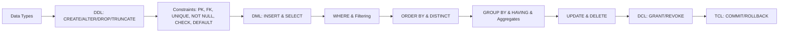
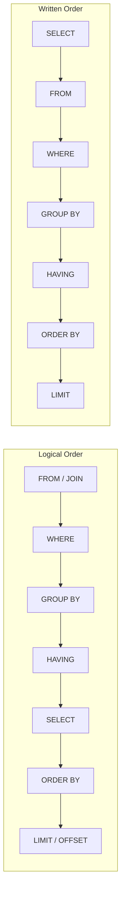

# Chapter 4: SQL Basics

> **Previous:** [Chapter 3: The Relational Model](./03-relational-model.md) | **Next:** [Chapter 5: SQL Joins and Subqueries](./05-sql-joins.md)

## Learning Objectives

- Distinguish DDL, DML, DCL, and TCL categories of SQL statements
- Create and modify database tables using DDL commands
- Insert, query, update, and delete data using DML commands
- Implement integrity constraints: PRIMARY KEY, FOREIGN KEY, UNIQUE, CHECK, NOT NULL, DEFAULT
- Use SELECT with WHERE, ORDER BY, GROUP BY, HAVING, DISTINCT, and LIMIT clauses
- Write effective WHERE clause conditions with logical and pattern-matching operators
- Use aggregate functions (COUNT, SUM, AVG, MIN, MAX) for data summarization
- Manage user permissions with DCL commands and transactions with TCL
- Write C++ and Python programs that execute SQL via sqlite3

<!-- Image Gallery -->
<section class="lesson-visuals" aria-label="Visual learning resources">
  <header><span>VISUAL LEARNING</span><h2>See it. Review it. Remember it.</h2></header>
  <a class="lesson-visual-card" href="../../../assets/images/lessons/database-management-systems/04-sql-basics/handwritten-notes.svg" target="_blank" rel="noopener">
    
    <span><strong>Handwritten notes</strong>Condensed notes for deliberate review.</span>
  </a>
  <a class="lesson-visual-card" href="../../../assets/images/lessons/database-management-systems/04-sql-basics/sticky-notes.svg" target="_blank" rel="noopener">
    
    <span><strong>Sticky-note revision</strong>Fast recall prompts for revision.</span>
  </a>
  <a class="lesson-visual-card" href="../../../assets/images/lessons/database-management-systems/04-sql-basics/visual-explanation.svg" target="_blank" rel="noopener">
    
    <span><strong>Visual concept guide</strong>A connected explanation of the key ideas.</span>
  </a>
</section>
<!-- End Image Gallery -->


## Chapter at a Glance

| Topic | Key Insight | Practical Takeaway |
|-------|-------------|-------------------|
| **DDL Commands** | CREATE, ALTER, DROP, TRUNCATE define database structure | Always specify column list in INSERT for robustness |
| **Constraints** | PK, FK, UNIQUE, NOT NULL, CHECK, DEFAULT | Enforce data integrity at the database level, not in code |
| **DML Operations** | INSERT, SELECT, UPDATE, DELETE manipulate data | Always use WHERE with UPDATE/DELETE -- test with SELECT first |
| **SELECT Clause** | WHERE, ORDER BY, GROUP BY, HAVING, DISTINCT, LIMIT | Use LIMIT/OFFSET for pagination, DISTINCT sparingly |
| **Aggregate Functions** | COUNT, SUM, AVG, MIN, MAX summarize data | NULLs are ignored by aggregate functions except COUNT(*) |
| **DCL & TCL** | GRANT/REVOKE control access; COMMIT/ROLLBACK manage transactions | Apply least-privilege principle; wrap multi-step ops in transactions |

## Chapter Roadmap



## Theory

> **One-Sentence Takeaway:** SQL is the universal declarative language for relational databases -- master DDL for structure, DML for data, and constraints for integrity.

### 4.1 Overview of SQL


SQL (Structured Query Language) is the standard language for relational database management. It was developed at IBM in the 1970s (originally SEQUEL) and standardized by ANSI (1986) and ISO (1987). Every major relational DBMS (PostgreSQL, MySQL, Oracle, SQL Server, SQLite) supports SQL, though each has proprietary extensions.

SQL is a **declarative language** -- you specify WHAT you want, not HOW to get it. The DBMS query optimizer determines the execution plan.

#### Real-World Analogy: Library Book Management System

Think of a library as a database:

| Library Concept | Database Concept | SQL Operation |
|----------------|-----------------|---------------|
| Library building | Database server | CREATE DATABASE |
| Bookshelves | Tables | CREATE TABLE |
| Shelf sections (Genre, Author) | Columns / Attributes | Column definitions |
| Individual books | Rows / Records | INSERT |
| Finding books by criteria | Querying | SELECT |
| ISBN number | PRIMARY KEY | PRIMARY KEY constraint |
| Member card number references a member | FOREIGN KEY | FOREIGN KEY constraint |
| Adding new books to catalog | Inserting data | INSERT INTO |
| Updating book location or status | Modifying data | UPDATE |
| Removing damaged books | Deleting data | DELETE |
| Library rules (unique ISBN, valid year) | Constraints | CHECK, UNIQUE, NOT NULL |
| Librarian permissions (who can check out) | Access control | GRANT, REVOKE |
| Checking in/out as atomic operations | Transactions | COMMIT, ROLLBACK |

When you ask a librarian "find me all books published after 2020 by author 'Tolkien'", you describe WHAT you want -- you don't tell them which shelf to walk to or how to scan each book. That is the essence of a **declarative language**: you specify the result, the system figures out the procedure.

#### SQL Categories

| Category | Full Name | Commands | What It Does | Library Analogy |
|----------|-----------|----------|-------------|-----------------|
| **DDL** | Data Definition Language | CREATE, ALTER, DROP, TRUNCATE | Defines and modifies database structure | Building shelves, adding/removing sections |
| **DML** | Data Manipulation Language | SELECT, INSERT, UPDATE, DELETE | Manipulates data within tables | Finding, adding, moving, removing books |
| **DCL** | Data Control Language | GRANT, REVOKE | Controls user access and permissions | Issuing library cards with different privileges |
| **TCL** | Transaction Control Language | BEGIN, COMMIT, ROLLBACK, SAVEPOINT | Manages transactions (atomic units of work) | Checking in/out books as an all-or-nothing operation |

#### Complexity in SQL (General)

| Operation | Time Complexity | Space Complexity | Why |
|-----------|----------------|-----------------|-----|
| Single row INSERT (no index maintenance) | O(1) | O(1) | Append to page; no scan needed |
| SELECT with no WHERE (full table scan) | O(n) | O(n) | Must read every row; result set grows with n |
| SELECT with PK equality WHERE | O(log n) | O(1) | B-tree index lookup; logarithmic depth |
| SELECT with non-indexed column WHERE | O(n) | O(1) | Full table scan required |
| CREATE TABLE | O(1) | O(1) | Only metadata operations, no data movement |
| DROP TABLE | O(1) | O(1) | Metadata + page deallocation (mostly constant) |
| TRUNCATE TABLE | O(1) | O(1) | Deallocates pages without row-by-row delete |
| ORDER BY (sort-based) | O(n log n) | O(n) | Requires sorting result set |
| GROUP BY (hash-based) | O(n) | O(n) | Hash table aggregation; all rows processed once |
| DISTINCT | O(n log n) | O(n) | Sorting or hashing to identify duplicates |
| Aggregates (COUNT, SUM, AVG) | O(n) | O(1) | Single pass over rows, constant accumulator |

### 4.2 Data Types


Choosing the right data type is critical: it affects storage size, query performance, and data integrity.

| Type | Description | Storage | Example | Library Analogy |
|------|-------------|---------|---------|-----------------|
| INTEGER / INT | Whole numbers (-2^31 to 2^31-1) | 4 bytes | 42, -5 | Number of copies available |
| BIGINT | Large whole numbers | 8 bytes | 9999999999 | Large-scale transaction IDs |
| SMALLINT | Small whole numbers | 2 bytes | 100 | Floor number |
| DECIMAL(p, s) | Exact fixed-point numbers | Varies (p+1 bytes) | DECIMAL(10,2) = 1234567.89 | Book price ($29.99) |
| NUMERIC(p, s) | Synonym for DECIMAL | Varies | NUMERIC(8,2) | Late fee amount |
| REAL / FLOAT | Approximate floating-point | 4/8 bytes | 3.14159 | Average rating (approximate) |
| VARCHAR(n) | Variable-length string (max n) | String length + 2 | VARCHAR(255) | Book title (variable length) |
| CHAR(n) | Fixed-length string (padded with spaces) | n bytes | CHAR(10) | ISBN-10 (always 10 chars) |
| TEXT | Unlimited-length string | String length + overhead | 'Long description...' | Book description |
| BOOLEAN | True/false | 1 byte | TRUE, FALSE | Is book available? |
| DATE | Calendar date | 4 bytes | '2026-06-09' | Publication date |
| TIME | Time of day | 8 bytes | '14:30:00' | Opening time |
| TIMESTAMP | Date + time | 8 bytes | '2026-06-09 14:30:00' | Check-out timestamp |
| BYTEA / BLOB | Binary data | Variable | 0x1A2B3C | Book cover image |

**Key Decision: VARCHAR vs CHAR**
- VARCHAR(n): Stores only the actual string plus 2 bytes overhead. Efficient for variable-length data like names, titles.
- CHAR(n): Always stores n characters, padded with spaces. Use for fixed-length codes: ISBN, ZIP codes, state abbreviations.

#### Complexity of Type Selection

| Concern | Impact | Why It Matters |
|---------|--------|---------------|
| Storage efficiency | O(1) per column but n matters at scale | VARCHAR(1000) for a name wastes space vs VARCHAR(50) |
| Index performance | Proportional to key size | Smaller types = more index entries per page = faster lookups |
| Type conversion | O(n) during query | Comparing VARCHAR to INTEGER triggers implicit conversion, blocking index use |
| Numeric precision | DECIMAL exact, FLOAT approximate | Never use FLOAT for money -- rounding errors accumulate |

#### Edge Cases with Data Types

| Situation | Problem | Solution |
|-----------|---------|----------|
| Storing price as FLOAT | Rounding error: $0.10 * 3 = 0.30000000000000004 | Use DECIMAL(10,2) |
| VARCHAR(5) for 'Alexander' | Truncation to 'Alexa' without warning | Choose appropriate length or use TEXT |
| CHAR(10) for short strings | Wasted space: 'hi' stored as 'hi        ' (8 spaces) | Use VARCHAR instead |
| INTEGER for phone numbers | Leading zeros lost: 0123456789 becomes 123456789 | Use VARCHAR(15) |


### 4.3 Data Definition Language (DDL)


DDL commands define and modify the structure (schema) of database objects. They are **auto-committed** in most DBMS -- there is no rolling back a DDL statement.

**Real-World Analogy:** DDL is like building, remodeling, or demolishing bookshelves in the library. The shelves themselves (the structure) are being changed, not the books (data).

#### 4.3.1 CREATE TABLE

Creates a new table (relation) in the database.

**Numbered Steps:**
1. Specify the table name (e.g., `books`)
2. Define each column with name, data type, and optional constraints
3. Optionally define table-level constraints (composite PK, multi-column CHECK)
4. The DBMS allocates metadata structures for the new table

**Pseudocode:**
```
FUNCTION CREATE_TABLE(table_name, columns):
    IF table_name EXISTS IN database.schema:
        RAISE ERROR "Table already exists"
    
    new_table = ALLOCATE metadata structure
    new_table.name = table_name
    
    FOR EACH column IN columns:
        new_table.add_column(column.name, column.type, column.constraints)
    
    VALIDATE all column definitions
    VALIDATE all constraints (FK references exist, CHECK expressions valid)
    
    ADD new_table TO database.schema
    RETURN SUCCESS
```

**SQL Syntax:**
```sql
CREATE TABLE books (
    book_id INTEGER PRIMARY KEY,
    title VARCHAR(200) NOT NULL,
    author VARCHAR(100) NOT NULL,
    isbn CHAR(13) UNIQUE NOT NULL,
    published_year INTEGER CHECK (published_year >= 1000),
    genre VARCHAR(50) DEFAULT 'Unknown',
    copies_available INTEGER DEFAULT 1 CHECK (copies_available >= 0)
);
```

**Sample Data (for later DML examples):**
```sql
INSERT INTO books (book_id, title, author, isbn, published_year, genre, copies_available) VALUES
(1, 'The Hobbit', 'J.R.R. Tolkien', '9780547928227', 1937, 'Fantasy', 3),
(2, '1984', 'George Orwell', '9780451524935', 1949, 'Dystopian', 5),
(3, 'To Kill a Mockingbird', 'Harper Lee', '9780060935467', 1960, 'Fiction', 2),
(4, 'The Great Gatsby', 'F. Scott Fitzgerald', '9780743273565', 1925, 'Fiction', 4),
(5, 'A Brief History of Time', 'Stephen Hawking', '9780553380163', 1988, 'Science', 1),
(6, 'Clean Code', 'Robert C. Martin', '9780132350884', 2008, 'Technology', 3),
(7, 'The Pragmatic Programmer', 'David Thomas', '9780201616224', 1999, 'Technology', 2),
(8, 'Dune', 'Frank Herbert', '9780441172719', 1965, 'Science Fiction', 4),
(9, 'The Catcher in the Rye', 'J.D. Salinger', '9780316769488', 1951, 'Fiction', 0),
(10, 'Sapiens', 'Yuval Noah Harari', '9780062316110', 2011, 'History', 2);

CREATE TABLE members (
    member_id INTEGER PRIMARY KEY,
    first_name VARCHAR(50) NOT NULL,
    last_name VARCHAR(50) NOT NULL,
    email VARCHAR(255) UNIQUE NOT NULL,
    join_date DATE DEFAULT CURRENT_DATE,
    status VARCHAR(10) DEFAULT 'active' CHECK (status IN ('active', 'suspended', 'expired'))
);

CREATE TABLE loans (
    loan_id INTEGER PRIMARY KEY,
    book_id INTEGER NOT NULL REFERENCES books(book_id),
    member_id INTEGER NOT NULL REFERENCES members(member_id),
    loan_date DATE NOT NULL DEFAULT CURRENT_DATE,
    due_date DATE NOT NULL,
    return_date DATE,
    CHECK (due_date > loan_date)
);

INSERT INTO members (member_id, first_name, last_name, email) VALUES
(1, 'Alice', 'Johnson', 'alice@email.com'),
(2, 'Bob', 'Williams', 'bob@email.com'),
(3, 'Carol', 'Davis', 'carol@email.com'),
(4, 'David', 'Brown', 'david@email.com');

INSERT INTO loans (loan_id, book_id, member_id, loan_date, due_date, return_date) VALUES
(1, 1, 1, '2026-01-10', '2026-01-24', '2026-01-22'),
(2, 3, 1, '2026-01-15', '2026-01-29', NULL),
(3, 2, 2, '2026-02-01', '2026-02-15', '2026-02-14'),
(4, 5, 3, '2026-02-10', '2026-02-24', NULL),
(5, 8, 2, '2026-02-15', '2026-03-01', NULL),
(6, 4, 4, '2026-03-01', '2026-03-15', '2026-03-10'),
(7, 6, 1, '2026-03-05', '2026-03-19', NULL),
(8, 10, 3, '2026-03-10', '2026-03-24', '2026-03-20'),
(9, 7, 4, '2026-03-15', '2026-03-29', NULL),
(10, 1, 2, '2026-03-20', '2026-04-03', NULL);
```

**C++ Implementation (sqlite3):**
```cpp
#include <iostream>
#include <sqlite3.h>
#include <string>

bool createBooksTable(sqlite3* db) {
    const char* sql = R"(
        CREATE TABLE IF NOT EXISTS books (
            book_id INTEGER PRIMARY KEY,
            title VARCHAR(200) NOT NULL,
            author VARCHAR(100) NOT NULL,
            isbn CHAR(13) UNIQUE NOT NULL,
            published_year INTEGER CHECK (published_year >= 1000),
            genre VARCHAR(50) DEFAULT 'Unknown',
            copies_available INTEGER DEFAULT 1 CHECK (copies_available >= 0)
        );
    )";

    char* errMsg = nullptr;
    int rc = sqlite3_exec(db, sql, nullptr, nullptr, &errMsg);
    if (rc != SQLITE_OK) {
        std::cerr << "SQL error: " << errMsg << std::endl;
        sqlite3_free(errMsg);
        return false;
    }
    std::cout << "Table 'books' created successfully." << std::endl;
    return true;
}

int main() {
    sqlite3* db;
    int rc = sqlite3_open("library.db", &db);
    if (rc != SQLITE_OK) {
        std::cerr << "Cannot open database: " << sqlite3_errmsg(db) << std::endl;
        return 1;
    }

    createBooksTable(db);
    sqlite3_close(db);
    return 0;
}
```

**Python Implementation (sqlite3):**
```python
import sqlite3

def create_books_table(conn: sqlite3.Connection) -> bool:
    sql = """
    CREATE TABLE IF NOT EXISTS books (
        book_id INTEGER PRIMARY KEY,
        title VARCHAR(200) NOT NULL,
        author VARCHAR(100) NOT NULL,
        isbn CHAR(13) UNIQUE NOT NULL,
        published_year INTEGER CHECK (published_year >= 1000),
        genre VARCHAR(50) DEFAULT 'Unknown',
        copies_available INTEGER DEFAULT 1 CHECK (copies_available >= 0)
    );
    """
    try:
        conn.execute(sql)
        print("Table 'books' created successfully.")
        return True
    except sqlite3.Error as e:
        print(f"SQL error: {e}")
        return False

if __name__ == "__main__":
    conn = sqlite3.connect("library.db")
    create_books_table(conn)
    conn.close()
```

**Complexity Analysis:**

| Measure | Value | Why |
|---------|-------|-----|
| Time Complexity | O(1) | Only metadata operations; no data processed |
| Space Complexity | O(1) | Schema metadata stored; data pages not allocated yet |
| Disk I/O | 1-2 page writes | System catalog entries for table + columns |

**Edge Cases:**

| Situation | Behavior | Handling |
|-----------|----------|----------|
| Table already exists | Error (unless IF EXISTS) | Use `CREATE TABLE IF NOT EXISTS` |
| Duplicate column name | Error at definition time | Review schema design before executing |
| Invalid data type | Error | Verify type support in your specific DBMS |
| FOREIGN KEY referencing non-existent table | Error | Create referenced table first |
| Very long column name (>63 chars) | Truncated or error | PostgreSQL truncates; Oracle errors |

#### 4.3.2 ALTER TABLE

Modifies the structure of an existing table.

**Numbered Steps:**
1. Specify the table to modify
2. Choose the modification type: ADD, DROP, MODIFY, or RENAME
3. Provide the column/constraint details
4. The DBMS updates metadata (and possibly data pages for defaults)

**Pseudocode:**
```
FUNCTION ALTER_TABLE_ADD_COLUMN(table_name, column_def):
    table = GET table_name FROM database.schema
    IF table IS NULL: RAISE ERROR "Table not found"
    IF column_def.name EXISTS IN table.columns: RAISE ERROR "Column already exists"
    table.columns.ADD(column_def)
    IF column_def.has_default:
        UPDATE all existing rows SET column_def.name = column_def.default_value
    RETURN SUCCESS

FUNCTION ALTER_TABLE_DROP_COLUMN(table_name, column_name):
    table = GET table_name FROM database.schema
    IF table IS NULL: RAISE ERROR "Table not found"
    IF column_name NOT IN table.columns: RAISE ERROR "Column not found"
    table.columns.REMOVE(column_name)
    -- Some DBMS require CASCADE to drop dependent objects (views, triggers)
    RETURN SUCCESS
```

**SQL Examples:**
```sql
-- Add a column
ALTER TABLE books ADD COLUMN publisher VARCHAR(100);

-- Drop a column (SQLite: limited support; PostgreSQL: full support)
ALTER TABLE books DROP COLUMN publisher;

-- Rename a column
ALTER TABLE books RENAME COLUMN genre TO category;

-- Add a default value
ALTER TABLE books ALTER COLUMN copies_available SET DEFAULT 0;

-- Add a constraint
ALTER TABLE books ADD CONSTRAINT chk_year CHECK (published_year >= 1440);

-- Rename table
ALTER TABLE books RENAME TO library_books;

-- Modify column type (PostgreSQL)
ALTER TABLE books ALTER COLUMN title TYPE TEXT;
```

**Complexity Analysis:**

| ALTER Type | Time | Space | Why |
|-----------|------|-------|-----|
| ADD COLUMN (no default) | O(1) | O(1) | Metadata only |
| ADD COLUMN (with default) | O(n) | O(n) | Must backfill existing rows |
| DROP COLUMN | O(1) | O(1) | Metadata only (marked inactive) |
| RENAME COLUMN | O(1) | O(1) | Metadata only |

**Edge Cases:**

| Situation | Problem | Solution |
|-----------|---------|----------|
| DROP last column of a table | Error in most DBMS | DROP the entire table instead |
| ADD column with NOT NULL on existing table | Error if table has rows | Provide a DEFAULT value |
| Renaming column used by views | Dependent views break | Use RENAME with CASCADE or update views manually |
| Changing type to incompatible type | Error or data loss | Use USING clause for explicit conversion |

#### 4.3.3 DROP TABLE

Permanently removes a table and all its data.

**Numbered Steps:**
1. Specify the table to drop
2. Optionally add IF EXISTS to avoid errors on missing tables
3. Optionally add CASCADE to drop dependent objects
4. The DBMS removes both data and metadata permanently

**Pseudocode:**
```
FUNCTION DROP_TABLE(table_name, options):
    table = GET table_name FROM database.schema
    IF table IS NULL:
        IF options.if_exists: RETURN SUCCESS
        ELSE: RAISE ERROR "Table not found"
    
    IF options.cascade:
        dependent_objects = FIND_ALL referencing_views, functions, constraints
        FOR EACH obj IN dependent_objects: DROP obj
    
    DEALLOCATE all data pages owned by table
    REMOVE table FROM database.schema
    RETURN SUCCESS
```

**SQL Examples:**
```sql
-- Basic drop
DROP TABLE old_books;

-- Safe drop (no error if missing)
DROP TABLE IF EXISTS old_books;

-- Cascade drop (removes dependent views, FKs)
DROP TABLE books CASCADE;
```

**Complexity:**

| Measure | Value | Why |
|---------|-------|-----|
| Time Complexity | O(1) amortized | Page deallocation; indexes also dropped |
| Space Complexity | O(1) | Space reclaimed; metadata removed |

**Edge Cases:**

| Situation | Behavior | Handling |
|-----------|----------|----------|
| Table has dependent views/triggers | Error (RESTRICT mode) | Use CASCADE or drop dependents first |
| Table does not exist | Error (without IF EXISTS) | Use DROP TABLE IF EXISTS for idempotent scripts |
| Foreign keys reference this table | Error if RESTRICT is default | Drop FK constraints first or use CASCADE |
| Dropping referenced in another table | Referential integrity violation | Recreate table or remove FK on child table |

#### 4.3.4 TRUNCATE TABLE

Removes all rows from a table while preserving the table structure for future use. It is faster than DELETE without WHERE because it deallocates entire data pages instead of row-by-row removal.

**Numbered Steps:**
1. Specify the table to truncate
2. The DBMS deallocates all data pages assigned to the table
3. Resets auto-increment counters (in most DBMS)
4. Cannot be rolled back in most DBMS (acts as DDL)

**Pseudocode:**
```
FUNCTION TRUNCATE_TABLE(table_name):
    table = GET table_name FROM database.schema
    IF table IS NULL: RAISE ERROR "Table not found"
    
    DEALLOCATE all data pages from table
    RESET auto-increment counter to initial value
    CLEAR all index entries
    -- No per-row deletion, no triggers fired
    RETURN SUCCESS
```

**SQL Example:**
```sql
TRUNCATE TABLE temporary_borrowing_records;
```

**Dry Run Trace: TRUNCATE vs DELETE**

| Step | TRUNCATE TABLE t | DELETE FROM t |
|------|-------------------|---------------|
| 1 | Locate table metadata | Locate table metadata |
| 2 | Identify all data pages | Scan first row |
| 3 | Deallocate pages (single operation) | Fire any DELETE triggers |
| 4 | Reset auto-increment | Log row deletion in transaction log |
| 5 | Update metadata (row count = 0) | Repeat for each row |
| 6 | Done (O(1)) | Commit log (O(n)) |

**Complexity:**

| Measure | Value | Why |
|---------|-------|-----|
| Time Complexity | O(1) | Page deallocation, not row-by-row |
| Space Complexity | O(1) | Only metadata updated |
| Log Overhead | Minimal | Page deallocation logged, not row data |

**Edge Cases:**

| Situation | Behavior | Handling |
|-----------|----------|----------|
| Table referenced by FK | Error in most DBMS | DELETE with WHERE or disable constraints first |
| Transaction rollback | Not rollbackable in MySQL (implicit commit) | PostgreSQL can rollback TRUNCATE within a transaction |
| Auto-increment reset | Reset in MySQL/PostgreSQL, not in SQLite | TRUNCATE vs DELETE behavior differs |

#### DROP vs TRUNCATE vs DELETE Comparison

| Feature | DROP TABLE | TRUNCATE TABLE | DELETE (without WHERE) |
|---------|-----------|----------------|----------------------|
| Removes structure? | Yes | No | No |
| Removes data? | Yes | Yes | Yes |
| Can be rolled back? | No (DDL) | Varies (no in MySQL, yes in PG) | Yes (DML, in transaction) |
| Speed | Fastest | Very fast | Slow (row-by-row) |
| Fires triggers? | No | No | Yes |
| Resets auto-increment? | N/A | Yes | No |
| WHERE clause? | No | No | Yes |
| FK constraints respected? | CASCADE needed | Blocks unless FK disabled | Yes |
| Space reclamation | Full | Full | Gradual (DELETE marks, VACUUM reclaims) |
| Library Analogy | Demolishing the entire shelf | Removing all books but keeping the shelf | Checking out every book one by one |


### 4.4 Constraints


Constraints enforce rules on the data in a table. They are the database's way of saying "only valid data is allowed here" -- preventing invalid data at the database level rather than trusting application code.

**Real-World Analogy:** Library rules enforced by the librarian:
- **NOT NULL:** Every book must have a title (a book without a title is not catalogable)
- **UNIQUE:** Two books cannot have the same ISBN
- **PRIMARY KEY:** Each book has a unique accession/serial number
- **FOREIGN KEY:** A loan must reference an existing member and an existing book
- **CHECK:** Publication year must be reasonable (after Gutenberg's press, before next year)
- **DEFAULT:** If genre is not specified, classify as 'Unknown'

#### Constraints Comparison Table

| Constraint | Purpose | Enforces | NULLs Allowed? | Per-Table Limit | Library Analogy |
|-----------|---------|----------|----------------|-----------------|-----------------|
| **NOT NULL** | Column must have a value | Row-level | No | Per-column | Book must have a title |
| **UNIQUE** | All values in column(s) distinct | Row-level vs others | Yes (1+ NULL depends on DBMS) | Multiple | Unique ISBN per book |
| **PRIMARY KEY** | Uniquely identifies each row | Row-level + NOT NULL | No | Exactly 1 | Accession/serial number |
| **FOREIGN KEY** | Value must exist in referenced table | Cross-table referential integrity | Yes | Multiple | Member ID must match a real member |
| **CHECK** | Value must satisfy boolean expression | Row-level | Yes (NULL passes CHECK) | Multiple | Year must be between 1000 and 2026 |
| **DEFAULT** | Assigns value if none provided | Insert-time | N/A | Per-column | Default genre 'Unknown' |

#### 4.4.1 NOT NULL

Ensures every row has a value for this column. Prevents missing or unknown data in mandatory fields.

```sql
CREATE TABLE books (
    book_id INTEGER PRIMARY KEY,
    title VARCHAR(200) NOT NULL,      -- Every book MUST have a title
    author VARCHAR(100) NOT NULL,     -- Every book MUST have an author
    isbn CHAR(13) UNIQUE NOT NULL,    -- ISBN is also mandatory
    description TEXT                   -- Description is optional (NULL allowed)
);

-- Adding NOT NULL to existing column (fails if NULLs exist)
ALTER TABLE books ALTER COLUMN title SET NOT NULL;
```

**Edge Cases:**

| Situation | Behavior | Handling |
|-----------|----------|----------|
| Inserting NULL into NOT NULL column | Error: "column violates NOT NULL constraint" | Provide a value or use DEFAULT |
| Empty string '' vs NULL | '' is allowed (it is a value); NULL is rejected | Use CHECK (col > '') for non-empty enforcement |
| Adding NOT NULL to populated table | Error if any existing row has NULL | UPDATE NULLs to a default first, then ALTER |

#### 4.4.2 UNIQUE

Ensures all values in a column (or combination of columns) are distinct from each other. Creates an index automatically in most DBMS.

```sql
CREATE TABLE users (
    user_id INTEGER PRIMARY KEY,
    username VARCHAR(50) UNIQUE NOT NULL,    -- No two users can have same username
    email VARCHAR(255) UNIQUE NOT NULL,       -- No two users can have same email
    ssn CHAR(9) UNIQUE                        -- Social security number must be unique
);

-- Multi-column UNIQUE (any single value can repeat, but combinations must be unique)
CREATE TABLE book_editions (
    book_id INTEGER REFERENCES books(book_id),
    edition_number INTEGER,
    isbn CHAR(13),
    UNIQUE (book_id, edition_number),  -- Same book can't have two edition #1
    UNIQUE (isbn)                       -- ISBN is globally unique
);
```

**Edge Cases:**

| Situation | Behavior | Handling |
|-----------|----------|----------|
| Multiple NULLs in UNIQUE column | Allowed in PostgreSQL/MySQL/SQLite; one NULL in SQL Server | ISO standard allows multiple NULLs; check DBMS docs |
| Duplicate value on INSERT | Error: "duplicate key value violates unique constraint" | Use INSERT ON CONFLICT (PostgreSQL) or INSERT IGNORE (MySQL) |
| UNIQUE on a column that already has duplicates | ALTER fails | Remove duplicates first with DELETE + self-join |
| Performance impact | Each UNIQUE creates an index | Acceptable for data integrity; don't over-index |

#### 4.4.3 PRIMARY KEY

Uniquely identifies each row in a table. Combines NOT NULL + UNIQUE. Each table has exactly one primary key (composite PKs use multiple columns).

```sql
-- Single-column (surrogate) PK
CREATE TABLE books (
    book_id INTEGER PRIMARY KEY,   -- Auto-incrementing integer key
    ...
);

-- Natural PK (using real data)
CREATE TABLE isbn_registry (
    isbn CHAR(13) PRIMARY KEY,     -- ISBN is naturally unique
    title VARCHAR(200) NOT NULL,
    ...
);

-- Composite primary key
CREATE TABLE loan_history (
    book_id INTEGER,
    member_id INTEGER,
    loan_date DATE,
    PRIMARY KEY (book_id, member_id, loan_date)  -- Same book cannot be loaned to same person twice on same day
);
```

**Edge Cases:**

| Situation | Behavior | Handling |
|-----------|----------|----------|
| NULL in PK column | Always rejected | Use surrogate auto-increment keys |
| Duplicate PK on INSERT | Error: "duplicate key" | Check for existence first or use ON CONFLICT |
| Composite PK with 32+ columns | Error (limit varies: 32 in Oracle, 16 in MySQL) | Consider a surrogate PK + UNIQUE on composite |
| Changing PK value | Must cascade to all FKs | Use ON UPDATE CASCADE or avoid mutable PKs |
| Empty table, first INSERT | First row gets PK value 1 (auto-increment) | Works normally |

#### 4.4.4 FOREIGN KEY

Maintains **referential integrity** -- values in this column must exist in the referenced table's PK (or UNIQUE column).

```sql
CREATE TABLE loans (
    loan_id INTEGER PRIMARY KEY,
    book_id INTEGER NOT NULL REFERENCES books(book_id),
    -- Inline FK syntax: book_id must match a books.book_id value

    member_id INTEGER NOT NULL,
    CONSTRAINT fk_member
        FOREIGN KEY (member_id)
        REFERENCES members(member_id)
        ON DELETE CASCADE
        ON UPDATE CASCADE,
    -- Explicit FK with referential actions

    loan_date DATE NOT NULL DEFAULT CURRENT_DATE,
    due_date DATE NOT NULL,
    return_date DATE
);

-- Self-referencing FK (category hierarchy example)
CREATE TABLE categories (
    category_id INTEGER PRIMARY KEY,
    name VARCHAR(100) NOT NULL,
    parent_category_id INTEGER REFERENCES categories(category_id)
    -- A category's parent must be another existing category
);
```

**Referential Actions:**

| Action | Effect when Parent Row DELETED | Effect when Parent UPDATED | Use Case |
|--------|-------------------------------|---------------------------|----------|
| CASCADE | Child rows automatically deleted | Child FK updated to new value | Order items when order is deleted |
| SET NULL | Child FK set to NULL | Child FK set to NULL | Employee's department deleted (keep employee) |
| SET DEFAULT | Child FK set to DEFAULT value | Child FK set to DEFAULT value | Rare; requires a sensible default |
| RESTRICT | Prevent deletion if children exist | Prevent update if children exist | Don't allow deletion of a book with active loans |
| NO ACTION | Like RESTRICT but checked at end of transaction | Like RESTRICT but checked at end | Same as RESTRICT in most implementations |

**Edge Cases:**

| Situation | Behavior | Handling |
|-----------|----------|----------|
| Inserting child with FK value not in parent | Error: "foreign key violation" | Insert parent row first or fix FK value |
| NULL in FK column | Allowed (FK does not imply NOT NULL) | Add NOT NULL separately if needed |
| Circular references (A references B, B references A) | One of the tables cannot be created | Use ALTER TABLE ADD CONSTRAINT after both tables exist |
| FK on composite PK | Must reference all columns of the composite PK | FK column count must match referenced column count |
| Performance | Each FK insert checks parent table | Index FK columns for performance |

#### 4.4.5 CHECK

Validates data against a boolean expression. If the expression evaluates to FALSE, the operation is rejected.

```sql
CREATE TABLE books (
    book_id INTEGER PRIMARY KEY,
    title VARCHAR(200) NOT NULL,
    published_year INTEGER CHECK (published_year BETWEEN 1000 AND 2026),
    copies_available INTEGER CHECK (copies_available >= 0),
    rating DECIMAL(2,1) CHECK (rating >= 0.0 AND rating <= 5.0),
    -- Single column checks
    price DECIMAL(10,2) CHECK (price >= 0)
);

-- Multi-column CHECK
CREATE TABLE reservations (
    book_id INTEGER NOT NULL,
    member_id INTEGER NOT NULL,
    reserve_date DATE NOT NULL,
    expire_date DATE NOT NULL,
    CHECK (expire_date > reserve_date)     -- Expiration must be after reservation
);

-- Pattern-based CHECK
CREATE TABLE valid_isbn (
    isbn CHAR(13) CHECK (isbn ~ '^[0-9]{13}$')   -- Must be exactly 13 digits (PostgreSQL)
);
```

**Edge Cases:**

| Situation | Behavior | Handling |
|-----------|----------|----------|
| NULL in CHECK column | Allowed (NULL passes CHECK -- UNKNOWN is not FALSE) | Add NOT NULL if NULL should be rejected |
| CHECK on new column with existing bad data | ALTER TABLE fails | Clean data first, then add constraint |
| Complex expression in CHECK | Evaluated per row | Keep CHECK expressions simple for readability |
| CHECK that references other tables | Not allowed (only current row) | Use triggers or application logic |

#### 4.4.6 DEFAULT

Assigns a value to a column when no value is explicitly provided in an INSERT.

```sql
CREATE TABLE books (
    book_id INTEGER PRIMARY KEY,
    title VARCHAR(200) NOT NULL,
    genre VARCHAR(50) DEFAULT 'Unknown',
    copies_available INTEGER DEFAULT 1,
    created_at TIMESTAMP DEFAULT CURRENT_TIMESTAMP,
    is_active BOOLEAN DEFAULT TRUE
);
```

**Edge Cases:**

| Situation | Behavior | Handling |
|-----------|----------|----------|
| INSERT with explicit NULL | NULL overrides DEFAULT | DEFAULT only applies when column is omitted from INSERT |
| DEFAULT with function | Evaluated at INSERT time (CURRENT_TIMESTAMP) | Functions like RANDOM() give different values per row |
| Changing DEFAULT | Existing rows unchanged; only new rows affected | UPDATE existing rows explicitly if needed |

#### Full Example: Library Schema with All Constraints

```sql
CREATE TABLE genres (
    genre_id INTEGER PRIMARY KEY,
    name VARCHAR(50) UNIQUE NOT NULL,
    description TEXT
);

CREATE TABLE books (
    book_id INTEGER PRIMARY KEY,
    title VARCHAR(200) NOT NULL,
    author VARCHAR(100) NOT NULL,
    isbn CHAR(13) UNIQUE NOT NULL,
    published_year INTEGER CHECK (published_year >= 1000 AND published_year <= 2026),
    genre_id INTEGER REFERENCES genres(genre_id),
    copies_available INTEGER NOT NULL DEFAULT 1 CHECK (copies_available >= 0),
    is_active BOOLEAN DEFAULT TRUE,
    created_at TIMESTAMP DEFAULT CURRENT_TIMESTAMP
);

CREATE TABLE members (
    member_id INTEGER PRIMARY KEY,
    first_name VARCHAR(50) NOT NULL,
    last_name VARCHAR(50) NOT NULL,
    email VARCHAR(255) UNIQUE NOT NULL,
    phone VARCHAR(15),
    join_date DATE NOT NULL DEFAULT CURRENT_DATE,
    max_loans INTEGER DEFAULT 5 CHECK (max_loans > 0 AND max_loans <= 20)
);

CREATE TABLE loans (
    loan_id INTEGER PRIMARY KEY,
    book_id INTEGER NOT NULL REFERENCES books(book_id),
    member_id INTEGER NOT NULL REFERENCES members(member_id),
    loan_date DATE NOT NULL DEFAULT CURRENT_DATE,
    due_date DATE NOT NULL CHECK (due_date >= loan_date),
    return_date DATE,
    CHECK (return_date IS NULL OR return_date >= loan_date)
);
```

**Complexity of Constraint Enforcement:**

| Constraint | Insert Time | Update Time | Delete Time | Why |
|-----------|-------------|-------------|-------------|-----|
| NOT NULL | O(1) | O(1) | N/A | Simple null check |
| UNIQUE | O(log n) | O(log n) | O(log n) | Index lookup for duplicate check |
| PRIMARY KEY | O(log n) | O(log n) | O(log n) | PK index maintenance |
| FOREIGN KEY | O(log n) | O(log n) | O(log n) | Check existence in parent table |
| CHECK | O(1) | O(1) | N/A | Boolean expression evaluation |
| DEFAULT | O(1) | N/A | N/A | Value substitution at insert time |


### 4.5 Data Manipulation Language (DML)


DML commands manipulate the data inside tables. Unlike DDL, DML operations can be **rolled back** when wrapped in a transaction (TCL).

#### 4.5.1 INSERT

Adds new rows to a table.

**Real-World Analogy:** Adding new books to the library catalog -- you fill out a catalog card with the book's details and put the card in the catalog drawer.

**Numbered Steps:**
1. Specify target table
2. List columns (optional but recommended)
3. Provide values matching column types and constraints
4. DBMS validates constraints (NOT NULL, UNIQUE, PK, FK, CHECK)
5. DBMS assigns DEFAULT values for omitted columns
6. Row is written to a data page (and transaction log)

**Pseudocode:**
```
FUNCTION INSERT_INTO(table_name, column_list, values_list):
    table = GET table_name FROM database.schema
    
    IF column_list is empty:
        column_list = table.columns  -- use all columns in order
    
    row = CREATE empty row
    FOR i = 0 TO column_list.length - 1:
        col = GET column column_list[i] FROM table.columns
        IF col IS NULL: RAISE ERROR "Column not found"
        
        value = values_list[i] OR col.default_value
        
        IF value IS NULL AND col.constraint == NOT_NULL:
            RAISE ERROR "NOT NULL constraint violated"
        IF value IS NULL AND col.constraint == PRIMARY_KEY:
            RAISE ERROR "PK cannot be NULL"
        IF col.constraint == UNIQUE AND EXISTS(value IN table):
            RAISE ERROR "UNIQUE constraint violated"
        IF col.constraint == CHECK AND NOT evaluate(col.check_expr, value):
            RAISE ERROR "CHECK constraint violated"
        IF col.constraint == FOREIGN_KEY AND NOT EXISTS(value IN parent_table):
            RAISE ERROR "FK constraint violated"
        
        row[col] = value
    
    table.pages.APPEND(row)
    UPDATE indexes
    RETURN SUCCESS
```

**SQL Examples:**
```sql
-- Single row insert (all columns, order-dependent)
INSERT INTO books VALUES (11, 'The Alchemist', 'Paulo Coelho', '9780062315007', 1988, 'Fiction', 5);

-- Single row with explicit columns (recommended)
INSERT INTO books (book_id, title, author, isbn, published_year, genre)
VALUES (11, 'The Alchemist', 'Paulo Coelho', '9780062315007', 1988, 'Fiction');

-- Multiple rows
INSERT INTO books (book_id, title, author, isbn, published_year, genre) VALUES
    (12, 'Atomic Habits', 'James Clear', '9780735211292', 2018, 'Self-Help'),
    (13, 'Deep Work', 'Cal Newport', '9781455586691', 2016, 'Productivity'),
    (14, 'The Lean Startup', 'Eric Ries', '9780307887894', 2011, 'Business');

-- Insert from SELECT (copy data between tables)
CREATE TABLE books_backup AS SELECT * FROM books WITH NO DATA;
INSERT INTO books_backup SELECT * FROM books;

-- Insert with DEFAULT values
INSERT INTO books (book_id, title, author, isbn) VALUES (15, 'New Book', 'Author Name', '0000000000000');
-- Genre defaults to 'Unknown'
```

**Dry Run Trace: INSERT with Validation**

Assume table `books` with PK on book_id, UNIQUE on isbn, NOT NULL on title, CHECK on published_year.

| Step | Operation | book_id=16 | title='Test' | isbn='1111111111111' | year=2020 | Result |
|------|-----------|-----------|-------------|---------------------|----------|--------|
| 1 | NOT NULL check for title | -- | 'Test' != NULL | -- | -- | PASS |
| 2 | PK uniqueness | 16 not in {1..15} | -- | -- | -- | PASS |
| 3 | UNIQUE on isbn | -- | -- | '1111111111111' not in set | -- | PASS |
| 4 | CHECK year | -- | -- | -- | 2020 BETWEEN 1000 AND 2026 | PASS |
| 5 | Write row | -- | -- | -- | -- | SUCCESS |

**C++ Implementation:**
```cpp
#include <iostream>
#include <sqlite3.h>
#include <string>
#include <sstream>

bool insertBook(sqlite3* db, int id, const std::string& title,
                const std::string& author, const std::string& isbn,
                int year, const std::string& genre, int copies) {
    std::ostringstream sql;
    sql << "INSERT INTO books (book_id, title, author, isbn, "
        << "published_year, genre, copies_available) VALUES ("
        << id << ", '" << title << "', '" << author << "', '"
        << isbn << "', " << year << ", '" << genre << "', " << copies << ");";

    char* errMsg = nullptr;
    int rc = sqlite3_exec(db, sql.str().c_str(), nullptr, nullptr, &errMsg);
    if (rc != SQLITE_OK) {
        std::cerr << "Insert error: " << errMsg << std::endl;
        sqlite3_free(errMsg);
        return false;
    }
    std::cout << "Book inserted successfully. Rows affected: "
              << sqlite3_changes(db) << std::endl;
    return true;
}
```

**Python Implementation:**
```python
import sqlite3

def insert_book(conn: sqlite3.Connection, book_id: int, title: str,
                author: str, isbn: str, year: int,
                genre: str = "Unknown", copies: int = 1) -> bool:
    sql = """
    INSERT INTO books (book_id, title, author, isbn, published_year, genre, copies_available)
    VALUES (?, ?, ?, ?, ?, ?, ?);
    """
    try:
        cursor = conn.execute(sql, (book_id, title, author, isbn, year, genre, copies))
        conn.commit()
        print(f"Book inserted. Rows affected: {cursor.rowcount}")
        return True
    except sqlite3.IntegrityError as e:
        print(f"Integrity error: {e}")
        return False
    except sqlite3.Error as e:
        print(f"Database error: {e}")
        return False
```

**Complexity:**

| Measure | Value | Why |
|---------|-------|-----|
| Time (single row, no triggers) | O(1) amortized | Append to last data page |
| Time (with FK checks) | O(log n) | Must verify FK exists in parent index |
| Time (with index updates) | O(log n) per index | Each unique/PK index must be updated |
| Space | O(1) | Size of row data + index overhead |

**Edge Cases:**

| Situation | Behavior | Handling |
|-----------|----------|----------|
| NULL for NOT NULL column | Error | Always provide value or use DEFAULT |
| Duplicate PK value | Error | Use INSERT OR REPLACE or ON CONFLICT (PostgreSQL/SQLite) |
| FK value not in parent | Error | Ensure parent row exists first |
| String too long for VARCHAR(n) | Truncation or error | Check string length before insert |
| Very large batch insert | Performance degradation | Use batch INSERT (multiple VALUES rows) or prepared statements |

#### 4.5.2 SELECT

Retrieves data from tables. The most important and most complex DML command.

**Real-World Analogy:** Asking the librarian to find all books matching certain criteria, and specifying what information you want about them.

**Numbered Steps (Logical Execution Order):**
1. **FROM**: Identify the source table(s)
2. **WHERE**: Filter rows based on conditions
3. **GROUP BY**: Group rows by columns
4. **HAVING**: Filter groups
5. **SELECT**: Choose columns, compute expressions, apply aliases
6. **DISTINCT**: Remove duplicate rows
7. **ORDER BY**: Sort the result
8. **LIMIT / OFFSET**: Paginate

#### SQL Execution Order (Crucial for Interviews)

```sql
SELECT   department_id, COUNT(*) AS emp_count    -- Step 5: Choose + compute
FROM     employees                                -- Step 1: Source
WHERE    salary > 50000                           -- Step 2: Filter rows
GROUP BY department_id                            -- Step 3: Group
HAVING   COUNT(*) > 5                             -- Step 4: Filter groups
ORDER BY emp_count DESC                           -- Step 7: Sort
LIMIT    10;                                      -- Step 8: Paginate
```

**Dry Run Trace: SELECT Execution Order**

Table: employees
| emp_id | name | department_id | salary |
|--------|------|--------------|--------|
| 1 | Alice | 10 | 60000 |
| 2 | Bob | 20 | 45000 |
| 3 | Carol | 10 | 70000 |
| 4 | Dave | 10 | 55000 |
| 5 | Eve | 20 | 80000 |
| 6 | Frank | 30 | 40000 |

Query:
```sql
SELECT department_id, COUNT(*) AS emp_count
FROM employees
WHERE salary > 50000
GROUP BY department_id
HAVING COUNT(*) >= 2
ORDER BY emp_count DESC;
```

**Execution Trace:**

| Step | Operation | Intermediate Result |
|------|-----------|-------------------|
| 1 | FROM employees | All 6 rows (full table) |
| 2 | WHERE salary > 50000 | Rows: Alice(60000), Carol(70000), Dave(55000), Eve(80000) -- 4 rows |
| 3 | GROUP BY department_id | Group 10: {Alice, Carol, Dave}; Group 20: {Eve} |
| 4 | HAVING COUNT(*) >= 2 | Group 10 has 3 rows >= 2: KEPT. Group 20 has 1 row &lt; 2: REMOVED |
| 5 | SELECT department_id, COUNT(*) | {dept=10, count=3} |
| 6 | ORDER BY emp_count DESC | {dept=10, count=3} (only one row, no sort change) |

**Output:**
| department_id | emp_count |
|--------------|-----------|
| 10 | 3 |


#### 4.5.3 WHERE Clause

Filters rows based on conditions. Only rows where the condition evaluates to TRUE are included.

**Real-World Analogy:** "Show me only the books that are currently available, written by Tolkien, published after 1950."

**Operators:**

| Operator | Example | Description | Library Analogy |
|----------|---------|-------------|-----------------|
| = | `WHERE title = 'The Hobbit'` | Equal to | Exact title match |
| != or &lt;> | `WHERE copies_available != 0` | Not equal to | Books that have copies checked out |
| > | `WHERE published_year > 2000` | Greater than | Books published after 2000 |
| < | `WHERE published_year < 1950` | Less than | Books published before 1950 |
| >= | `WHERE copies_available >= 1` | Greater than or equal | Books with at least 1 copy |
| <= | `WHERE copies_available <= 2` | Less than or equal | Books with 2 or fewer copies |
| BETWEEN | `WHERE published_year BETWEEN 1900 AND 2000` | Inclusive range | Books from the 20th century |
| IN | `WHERE genre IN ('Fantasy', 'Sci-Fi')` | Match any in a list | Books in specific genres |
| LIKE | `WHERE title LIKE '%Hobbit%'` | Pattern matching | Any title containing 'Hobbit' |
| IS NULL | `WHERE return_date IS NULL` | Check for NULL | Books currently on loan (not returned) |
| AND | `WHERE genre = 'Fiction' AND copies > 0` | Both conditions true | Available fiction books |
| OR | `WHERE author = 'Tolkien' OR author = 'Herbert'` | Either condition true | Books by either author |
| NOT | `WHERE NOT genre = 'Fiction'` | Negation | All non-fiction books |

**Pattern Matching with LIKE:**

| Pattern | Meaning | Matches | Doesn't Match |
|---------|---------|---------|---------------|
| 'S%' | Starts with 'S' | 'Sapiens', 'SQL' | 'ASapiens' |
| '%ing' | Ends with 'ing' | 'Living', 'Existing' | 'Ingot' |
| '%time%' | Contains 'time' | 'A Brief History of Time', 'Timeless' | 'The Great Gatsby' |
| 'A_%' | Starts with 'A' followed by at least 1 char | 'Alice', 'Al' | 'A' (solo) |
| '___' | Exactly 3 characters | 'The', 'ABC' | 'AB' |

**SQL Examples with Our Library Data:**

```sql
-- Books with available copies
SELECT title, author, copies_available FROM books WHERE copies_available > 0;

-- Fantasy books by Tolkien
SELECT title, published_year FROM books
WHERE genre = 'Fantasy' AND author LIKE '%Tolkien%';

-- Members who joined in 2026
SELECT first_name, last_name, email FROM members
WHERE join_date >= '2026-01-01' AND join_date < '2027-01-01';

-- Books currently on loan (no return date)
SELECT b.title, m.last_name, l.loan_date, l.due_date
FROM loans l
JOIN books b ON l.book_id = b.book_id
JOIN members m ON l.member_id = m.member_id
WHERE l.return_date IS NULL;

-- Books published 1950-2000 with 'The' in title
SELECT title, published_year FROM books
WHERE published_year BETWEEN 1950 AND 2000
  AND title LIKE '%The%'
ORDER BY published_year;
```

**Edge Cases with NULL:**

```sql
-- NULL is UNKNOWN, not FALSE. These behave differently:
SELECT * FROM books WHERE copies_available = NULL;    -- Returns NO rows (NULL = NULL is UNKNOWN)
SELECT * FROM books WHERE copies_available IS NULL;   -- Correct way to find NULLs
SELECT * FROM books WHERE copies_available <> 0;      -- Excludes NULL rows (NULL <> 0 is UNKNOWN)
```

| Expression | Result | Explanation |
|-----------|--------|-------------|
| NULL = NULL | UNKNOWN | No two NULLs are considered equal |
| NULL &lt;> NULL | UNKNOWN | Even inequality is unknown |
| NULL > 5 | UNKNOWN | NULL compared to anything is unknown |
| NULL AND TRUE | UNKNOWN | Logical AND with unknown |
| NULL OR TRUE | TRUE | OR short-circuits: TRUE dominates |
| NULL OR FALSE | UNKNOWN | OR with unknown is unknown |
| NOT NULL | UNKNOWN | Negation of unknown is unknown |

**Complexity:**

| WHERE Type | Time Complexity | Why |
|-----------|----------------|-----|
| PK = value (indexed) | O(log n) | B-tree index lookup |
| Non-indexed column comparison | O(n) | Full table scan |
| LIKE '%pattern' (leading wildcard) | O(n) | Cannot use B-tree index; full scan |
| IN list of values | O(m * log n) | m = list size, n = table rows |
| BETWEEN (indexed) | O(log n + k) | Index range scan; k = matching rows |

#### 4.5.4 ORDER BY

Sorts the result set by one or more columns.

```sql
-- Single column ascending (default)
SELECT title, author, published_year FROM books ORDER BY published_year;

-- Single column descending
SELECT title, author, published_year FROM books ORDER BY published_year DESC;

-- Multiple columns (sort by genre, then by year within genre)
SELECT title, genre, published_year FROM books ORDER BY genre ASC, published_year DESC;

-- ORDER BY with expression
SELECT title, published_year FROM books ORDER BY published_year - 1900;

-- ORDER BY with column alias
SELECT title AS book_title, published_year AS year FROM books ORDER BY year;

-- ORDER BY with position (not recommended - fragile)
SELECT title, published_year FROM books ORDER BY 2 DESC;

-- NULL handling
SELECT title, return_date FROM loans ORDER BY return_date NULLS LAST;
SELECT title, return_date FROM loans ORDER BY return_date NULLS FIRST;
```

**NULL Ordering Behavior:**

| DBMS | ASC (default) | DESC (default) |
|------|---------------|----------------|
| PostgreSQL | NULLS LAST | NULLS FIRST |
| MySQL | NULLS FIRST | NULLS LAST |
| SQLite | NULLS FIRST | NULLS LAST |
| SQL Server | NULLS FIRST | NULLS FIRST |
| Oracle | NULLS LAST | NULLS FIRST |

**Complexity:**

| Measure | Value | Why |
|---------|-------|-----|
| Time Complexity | O(n log n) | Sorting n rows; comparison-based sort |
| Space Complexity | O(n) | Must materialize full result set |
| Memory vs Disk Sort | In-memory if fits in sort_area/sort_buffer | Spills to disk for large result sets |

#### 4.5.5 GROUP BY

Groups rows that have the same values in specified columns, then applies aggregate functions per group.

**Real-World Analogy:** "Group all books by genre, then count how many books are in each genre."

**Numbered Steps:**
1. FROM + WHERE: Get the filtered rows
2. Partition rows by GROUP BY column values
3. For each group, compute aggregate functions
4. Apply HAVING filter (if present)

**Pseudocode:**
```
FUNCTION GROUP_BY(source_rows, group_columns, aggregates):
    groups = HASH_MAP()  -- key = combination of group column values
    
    FOR EACH row IN source_rows:
        key = EXTRACT(row, group_columns)
        IF key NOT IN groups:
            groups[key] = NEW GROUP
        
        FOR EACH agg IN aggregates:
            groups[key].UPDATE(agg.function, row)
    
    result = []
    FOR EACH (key, group) IN groups:
        result_row = key
        FOR EACH agg IN aggregates:
            result_row[agg.alias] = group.COMPUTE(agg.function)
        result.APPEND(result_row)
    
    RETURN result
```

**SQL Examples:**

```sql
-- Count books per genre
SELECT genre, COUNT(*) AS book_count
FROM books
GROUP BY genre;

-- Average copies available per genre
SELECT genre, AVG(copies_available) AS avg_copies
FROM books
GROUP BY genre;

-- Total loan count per member (with names)
SELECT m.member_id, m.last_name, COUNT(l.loan_id) AS loan_count
FROM members m
LEFT JOIN loans l ON m.member_id = l.member_id
GROUP BY m.member_id, m.last_name;

-- Most borrowed books
SELECT b.title, COUNT(l.loan_id) AS times_borrowed
FROM books b
LEFT JOIN loans l ON b.book_id = l.book_id
GROUP BY b.book_id, b.title
ORDER BY times_borrowed DESC;

-- GROUP BY with expressions
SELECT published_year / 10 * 10 AS decade, COUNT(*) AS book_count
FROM books
GROUP BY decade
ORDER BY decade;
```

**Dry Run Trace: GROUP BY Aggregation**

Input: books table

| book_id | title | genre | copies_available |
|---------|-------|-------|-----------------|
| 1 | The Hobbit | Fantasy | 3 |
| 2 | 1984 | Dystopian | 5 |
| 3 | To Kill a Mockingbird | Fiction | 2 |
| 4 | The Great Gatsby | Fiction | 4 |
| 5 | A Brief History of Time | Science | 1 |
| 6 | Clean Code | Technology | 3 |
| 7 | The Pragmatic Programmer | Technology | 2 |
| 8 | Dune | Science Fiction | 4 |
| 9 | The Catcher in the Rye | Fiction | 0 |
| 10 | Sapiens | History | 2 |

Query: `SELECT genre, COUNT(*) AS cnt, SUM(copies_available) AS total FROM books GROUP BY genre ORDER BY cnt DESC;`

| Step | Operation | Fantasy | Dystopian | Fiction | Science | Technology | Sci-Fi | History |
|------|-----------|---------|-----------|---------|---------|------------|--------|---------|
| 1 | Initialize counts | {cnt=0,sum=0} | {cnt=0,sum=0} | {cnt=0,sum=0} | {cnt=0,sum=0} | {cnt=0,sum=0} | {cnt=0,sum=0} | {cnt=0,sum=0} |
| 2 | Row 1 (Fantasy,3) | {1,3} | {0,0} | {0,0} | {0,0} | {0,0} | {0,0} | {0,0} |
| 3 | Row 2 (Dystopian,5) | {1,3} | {1,5} | {0,0} | {0,0} | {0,0} | {0,0} | {0,0} |
| 4 | Row 3 (Fiction,2) | {1,3} | {1,5} | {1,2} | {0,0} | {0,0} | {0,0} | {0,0} |
| 5 | Row 4 (Fiction,4) | {1,3} | {1,5} | {2,6} | {0,0} | {0,0} | {0,0} | {0,0} |
| 6 | Row 5 (Science,1) | {1,3} | {1,5} | {2,6} | {1,1} | {0,0} | {0,0} | {0,0} |
| 7 | Row 6 (Technology,3) | {1,3} | {1,5} | {2,6} | {1,1} | {1,3} | {0,0} | {0,0} |
| 8 | Row 7 (Technology,2) | {1,3} | {1,5} | {2,6} | {1,1} | {2,5} | {0,0} | {0,0} |
| 9 | Row 8 (Sci-Fi,4) | {1,3} | {1,5} | {2,6} | {1,1} | {2,5} | {1,4} | {0,0} |
| 10 | Row 9 (Fiction,0) | {1,3} | {1,5} | {3,6} | {1,1} | {2,5} | {1,4} | {0,0} |
| 11 | Row 10 (History,2) | {1,3} | {1,5} | {3,6} | {1,1} | {2,5} | {1,4} | {1,2} |

**Output:**
| genre | cnt | total |
|-------|-----|-------|
| Fiction | 3 | 6 |
| Technology | 2 | 5 |
| Dystopian | 1 | 5 |
| Fantasy | 1 | 3 |
| Science Fiction | 1 | 4 |
| History | 1 | 2 |
| Science | 1 | 1 |

#### 4.5.6 HAVING

Filters groups after GROUP BY (WHERE filters rows before grouping).

**WHERE vs HAVING Comparison:**

| Aspect | WHERE | HAVING |
|--------|-------|--------|
| Filters | Individual rows | Groups (after aggregation) |
| When executed | Before GROUP BY | After GROUP BY |
| Can use aggregate functions | No (e.g., `WHERE COUNT(*) > 5` is illegal) | Yes (`HAVING COUNT(*) > 5`) |
| Can reference column aliases from SELECT | No (WHERE runs before SELECT) | No (except in some DBMS like MySQL) |
| Can reference non-aggregated columns | Yes | Yes, but must be in GROUP BY |
| Library Analogy | "Show me books published after 2000" | "Show me genres that have more than 2 books" |

```sql
-- WHERE filters individual books, HAVING filters genres
SELECT genre, COUNT(*) AS book_count, AVG(copies_available) AS avg_copies
FROM books
WHERE published_year > 1950           -- Step 1: Only books after 1950
GROUP BY genre                         -- Step 2: Group by genre
HAVING COUNT(*) >= 2                   -- Step 3: Only genres with 2+ books
ORDER BY book_count DESC;

-- Without HAVING, find genres with many books:
SELECT genre, COUNT(*) AS cnt FROM books
GROUP BY genre
HAVING cnt > 1;   -- Above average genres

-- HAVING with multiple conditions
SELECT genre, COUNT(*) AS cnt, AVG(copies_available) AS avg_copies
FROM books
GROUP BY genre
HAVING COUNT(*) >= 1 AND AVG(copies_available) > 1;
```

**Complexity:**

| Measure | Value | Why |
|---------|-------|-----|
| GROUP BY (hash-based) | O(n) | Build hash table, one pass per row |
| GROUP BY (sort-based) | O(n log n) | Sort by group columns, then scan |
| HAVING filter | O(g) | g = number of groups (usually g &lt;= n) |
| Space | O(g) | Hash table or sort area per group |

#### 4.5.7 Aggregate Functions

Compute a single value from a set of rows. Often used with GROUP BY but valid without it.

**Aggregate Functions Comparison:**

| Function | What It Does | NULL Handling | Result Type | Library Analogy |
|----------|-------------|---------------|-------------|-----------------|
| COUNT(*) | Count all rows | Counts everything | INTEGER | "How many books total?" |
| COUNT(col) | Count non-NULL values in col | Ignores NULLs | INTEGER | "How many books have a known publisher?" |
| SUM(col) | Sum of non-NULL values | Ignores NULLs | Same as col type | "Total copies of all books" |
| AVG(col) | Average of non-NULL values | Ignores NULLs | FLOAT / DECIMAL | "Average copies per book" |
| MIN(col) | Minimum value in col | Ignores NULLs | Same as col type | "Oldest publication year" |
| MAX(col) | Maximum value in col | Ignores NULLs | Same as col type | "Newest publication year" |

```sql
-- Overall statistics
SELECT
    COUNT(*) AS total_books,
    COUNT(DISTINCT genre) AS unique_genres,
    SUM(copies_available) AS total_copies,
    AVG(copies_available) AS avg_copies_per_book,
    MIN(published_year) AS oldest_book,
    MAX(published_year) AS newest_book
FROM books;

-- Aggregate with GROUP BY
SELECT genre,
    COUNT(*) AS books_in_genre,
    SUM(copies_available) AS total_copies,
    ROUND(AVG(copies_available), 2) AS avg_copies,
    MIN(published_year) AS earliest,
    MAX(published_year) AS latest
FROM books
GROUP BY genre
ORDER BY books_in_genre DESC;
```

**Output:**
| genre | books_in_genre | total_copies | avg_copies | earliest | latest |
|-------|---------------|-------------|------------|----------|--------|
| Fiction | 3 | 6 | 2.00 | 1925 | 1960 |
| Technology | 2 | 5 | 2.50 | 1999 | 2008 |
| Dystopian | 1 | 5 | 5.00 | 1949 | 1949 |
| Fantasy | 1 | 3 | 3.00 | 1937 | 1937 |
| History | 1 | 2 | 2.00 | 2011 | 2011 |
| Science | 1 | 1 | 1.00 | 1988 | 1988 |
| Science Fiction | 1 | 4 | 4.00 | 1965 | 1965 |

**Aggregate with NULL in Data:**

```sql
-- If return_date has some NULLs (books not yet returned)
SELECT COUNT(return_date) AS returned_books FROM loans;  -- Counts only non-NULL
SELECT COUNT(*) AS total_loans FROM loans;                 -- Counts all rows
SELECT AVG(return_date - loan_date) AS avg_days_borrowed FROM loans;  -- Only considers returned books

-- DATEDIFF equivalent in PostgreSQL:
SELECT AVG(return_date - loan_date) AS avg_days FROM loans WHERE return_date IS NOT NULL;
```

**Complexity:**

| Function | Time Complexity | Space Complexity | Why |
|----------|----------------|-----------------|-----|
| COUNT(*) | O(n) | O(1) | Single pass, single counter |
| COUNT(col) | O(n) | O(1) | Single pass, skip NULLs |
| SUM(col) | O(n) | O(1) | Single pass, accumulate |
| AVG(col) | O(n) | O(1) | Single pass, sum+count |
| MIN(col) | O(n) | O(1) | Single pass, track min |
| MAX(col) | O(n) | O(1) | Single pass, track max |
| All five simultaneously | O(n) | O(1) | Single scan for all |

#### 4.5.8 DISTINCT

Removes duplicate rows from the result set.

**Real-World Analogy:** "Give me a list of all unique genres in the library -- don't repeat a genre just because there are multiple books in it."

```sql
-- Distinct single column
SELECT DISTINCT genre FROM books;

-- Distinct multiple columns (unique combinations)
SELECT DISTINCT genre, author FROM books;

-- DISTINCT with COUNT
SELECT COUNT(DISTINCT genre) AS unique_genres FROM books;

-- DISTINCT vs GROUP BY (equivalent but GROUP BY allows aggregates)
SELECT DISTINCT genre FROM books;
SELECT genre FROM books GROUP BY genre;  -- Same result
```

**Edge Cases:**

| Situation | Behavior |
|-----------|----------|
| DISTINCT with NULL | NULL appears once in result (all NULLs are grouped) |
| DISTINCT on multiple columns | Considers ALL columns combined; row is unique if any column differs |
| DISTINCT on large result set | Sorting overhead: O(n log n) time, O(n) space |

#### 4.5.9 LIMIT / OFFSET

Limits the number of rows returned and optionally skips a number of rows (for pagination).

```sql
-- First 3 books
SELECT title, author FROM books LIMIT 3;

-- Skip 3, return next 2 (pagination: page 2 with size 2)
SELECT title, author FROM books ORDER BY book_id LIMIT 2 OFFSET 3;

-- Alternative syntax in MySQL:
SELECT title, author FROM books ORDER BY book_id LIMIT 3, 2;  -- LIMIT offset, count

-- LIMIT with ORDER BY (most recent)
SELECT title, published_year FROM books ORDER BY published_year DESC LIMIT 5;

-- Top-N per group (advanced)
SELECT genre, title, published_year FROM (
    SELECT genre, title, published_year,
           ROW_NUMBER() OVER (PARTITION BY genre ORDER BY published_year DESC) AS rn
    FROM books
) ranked WHERE rn <= 2;
```

**Complexity:**

| Measure | Value | Why |
|---------|-------|-----|
| LIMIT without ORDER BY | O(n) | Must still scan all rows; stop after k results |
| LIMIT with ORDER BY | O(n log n) | Sort first, then take top k |
| OFFSET m | O(n + m) | Must skip m rows; still scans full table |


#### 4.5.10 UPDATE

Modifies existing rows in a table.

**Real-World Analogy:** Updating a book's catalog entry -- changing its location, marking it as lost, updating the number of available copies.

**Numbered Steps:**
1. Identify the table
2. (Optional but critical) Add WHERE clause to specify which rows
3. SET column(s) to new value(s)
4. DBMS validates constraints on modified columns
5. Changes written to data pages and transaction log
6. Triggers (if any) fire

**Pseudocode:**
```
FUNCTION UPDATE_TABLE(table_name, set_clauses, condition):
    table = GET table_name FROM database.schema
    matched_rows = SELECT * FROM table WHERE condition
    
    FOR EACH row IN matched_rows:
        FOR EACH (column, new_value) IN set_clauses:
            IF NOT VALIDATE_CONSTRAINTS(column, new_value):
                RAISE ERROR
            old_row.VALUE(column) = new_value
    
    table.PERSIST_CHANGES()
    LOG_CHANGES(matched_rows)
    RETURN matched_rows.COUNT
```

**SQL Examples:**
```sql
-- Update single column
UPDATE books SET copies_available = 4 WHERE book_id = 1;

-- Update multiple columns
UPDATE books SET genre = 'Classic Fiction', copies_available = 10
WHERE book_id = 3;

-- Update with expression
UPDATE books SET copies_available = copies_available + 1
WHERE genre = 'Fantasy';

-- Update all rows (CAREFUL!)
UPDATE books SET is_active = TRUE;  -- Activates all books

-- Parameterized update (from programming)
UPDATE books SET copies_available = ? WHERE book_id = ?;
```

**C++ Implementation:**
```cpp
#include <iostream>
#include <sqlite3.h>
#include <string>
#include <sstream>

int updateCopies(sqlite3* db, int bookId, int newCopies) {
    std::ostringstream sql;
    sql << "UPDATE books SET copies_available = " << newCopies
        << " WHERE book_id = " << bookId << ";";

    char* errMsg = nullptr;
    int rc = sqlite3_exec(db, sql.str().c_str(), nullptr, nullptr, &errMsg);
    if (rc != SQLITE_OK) {
        std::cerr << "Update error: " << errMsg << std::endl;
        sqlite3_free(errMsg);
        return -1;
    }
    int affected = sqlite3_changes(db);
    std::cout << "Rows updated: " << affected << std::endl;
    return affected;
}
```

**Python Implementation:**
```python
import sqlite3

def update_book_copies(conn: sqlite3.Connection, book_id: int, copies: int) -> int:
    sql = "UPDATE books SET copies_available = ? WHERE book_id = ?;"
    try:
        cursor = conn.execute(sql, (copies, book_id))
        conn.commit()
        print(f"Rows updated: {cursor.rowcount}")
        return cursor.rowcount
    except sqlite3.Error as e:
        print(f"Update error: {e}")
        return -1
```

**Complexity:**

| Measure | Value | Why |
|---------|-------|-----|
| Update by PK (indexed) | O(log n) | Index lookup, single row modification |
| Update by non-indexed column | O(n) | Full scan to find matching rows |
| Update all rows (no WHERE) | O(n) | Must modify every row |
| Index maintenance | O(log n) per index per row | Each index on modified column must be updated |

**Edge Cases:**

| Situation | Behavior | Handling |
|-----------|----------|----------|
| No WHERE clause | All rows updated | ALWAYS test with SELECT first |
| UPDATE violates constraint | Error, entire UPDATE rolls back | Check values before executing |
| UPDATE with subquery returning NULL | Sets column to NULL | Use COALESCE or guard with WHERE |
| Concurrent UPDATE (same row) | Last writer wins (lost update) | Use SELECT FOR UPDATE or optimistic locking |

#### 4.5.11 DELETE

Removes rows from a table.

**Real-World Analogy:** Removing a book from the catalog because it was lost or damaged.

```sql
-- Delete by condition
DELETE FROM books WHERE book_id = 11;

-- Delete multiple rows
DELETE FROM books WHERE copies_available = 0 AND genre = 'Fiction';

-- Delete all rows (CAREFUL!)
DELETE FROM books;

-- Delete with subquery
DELETE FROM members
WHERE member_id NOT IN (SELECT DISTINCT member_id FROM loans);

-- Delete with JOIN (PostgreSQL syntax)
DELETE FROM books b
USING loans l
WHERE b.book_id = l.book_id AND l.return_date IS NULL
  AND l.due_date < '2026-01-01';
```

**C++ Implementation:**
```cpp
#include <iostream>
#include <sqlite3.h>

int deleteBook(sqlite3* db, int bookId) {
    const char* sql = "DELETE FROM books WHERE book_id = ?;";
    sqlite3_stmt* stmt;

    if (sqlite3_prepare_v2(db, sql, -1, &stmt, nullptr) != SQLITE_OK) {
        std::cerr << "Prepare error: " << sqlite3_errmsg(db) << std::endl;
        return -1;
    }

    sqlite3_bind_int(stmt, 1, bookId);

    int rc = sqlite3_step(stmt);
    if (rc != SQLITE_DONE) {
        std::cerr << "Delete error: " << sqlite3_errmsg(db) << std::endl;
        sqlite3_finalize(stmt);
        return -1;
    }

    int affected = sqlite3_changes(db);
    std::cout << "Rows deleted: " << affected << std::endl;
    sqlite3_finalize(stmt);
    return affected;
}
```

**Python Implementation:**
```python
import sqlite3

def delete_old_members(conn: sqlite3.Connection, cutoff_year: int) -> int:
    sql = """
    DELETE FROM members
    WHERE member_id NOT IN (SELECT DISTINCT member_id FROM loans)
      AND strftime('%Y', join_date) < ?;
    """
    try:
        cursor = conn.execute(sql, (str(cutoff_year),))
        conn.commit()
        print(f"Members deleted: {cursor.rowcount}")
        return cursor.rowcount
    except sqlite3.IntegrityError as e:
        print(f"Cannot delete due to FK constraint: {e}")
        return -1
```

**Complexity:**

| Measure | Value | Why |
|---------|-------|-----|
| Delete by PK (indexed) | O(log n) | Index lookup + row/page removal |
| Delete without WHERE | O(n) | Row-by-row scan + trigger firing |
| Delete + FK check | O(log n) per child table | Must verify no referencing rows |
| Space reclamation | Varies | DELETE marks space as reusable; VACUUM needed for physical reclaim |

**Edge Cases:**

| Situation | Behavior | Handling |
|-----------|----------|----------|
| No WHERE clause | All rows deleted | Always test with SELECT first |
| FK violation (children exist) | Error | Use CASCADE, SET NULL, or delete children first |
| Very large DELETE (millions of rows) | Long-running, may fill transaction log | Batch in chunks using LIMIT |
| DELETE with FK on self (tree structure) | Must use recursive CTE | Handle parent-child relationships carefully |

### 4.6 Data Control Language (DCL)


Controls user access to database objects.

**Real-World Analogy:** The head librarian decides who can:
- View the catalog (SELECT)
- Add new books (INSERT)
- Update book information (UPDATE)
- Remove books (DELETE)
- Issue library cards (GRANT privileges)
- Revoke library cards (REVOKE privileges)

```sql
-- Create roles (groups of privileges)
CREATE ROLE librarian;
CREATE ROLE assistant;
CREATE ROLE patron;

-- Grant system-level privileges
GRANT CONNECT TO librarian;
GRANT CREATE TABLE TO librarian;

-- Grant object-level privileges
GRANT SELECT, INSERT, UPDATE, DELETE ON books TO librarian;
GRANT SELECT ON books TO patron;
GRANT SELECT, INSERT ON loans TO assistant;

-- Column-level privileges
GRANT SELECT (member_id, first_name, last_name, email) ON members TO assistant;
GRANT UPDATE (email, phone) ON members TO assistant;

-- Grant with GRANT OPTION (allows cascading)
GRANT SELECT ON books TO assistant WITH GRANT OPTION;

-- Grant role to users
GRANT librarian TO head_librarian_user;
GRANT assistant TO assistant_user;
GRANT patron TO public;

-- Revoke privileges
REVOKE DELETE ON books FROM assistant;
REVOKE ALL PRIVILEGES ON members FROM assistant;
REVOKE librarian FROM former_librarian_user;

-- View current privileges
SELECT * FROM information_schema.table_privileges WHERE table_name = 'books';
```

**Complexity:**

| Operation | Time | Why |
|-----------|------|-----|
| GRANT | O(1) | Metadata update |
| REVOKE | O(1) | Metadata update |
| Permission check at query time | O(log p) | p = number of privileges; cached |

### 4.7 Transaction Control Language (TCL)


Manages transactions -- groups of SQL statements that execute as an atomic unit (all succeed or all fail).

**Real-World Analogy:** Checking out a book is a multi-step process:
1. Verify member has no overdue books
2. Decrement copies_available
3. Create loan record
4. Update member's loan count

If step 2 succeeds but step 3 fails, the system is in an inconsistent state. A transaction ensures ALL steps complete or NONE do.

```sql
-- Basic transaction
BEGIN TRANSACTION;

UPDATE books SET copies_available = copies_available - 1 WHERE book_id = 1;
INSERT INTO loans (book_id, member_id, due_date)
VALUES (1, 1, DATE('now', '+14 days'));

COMMIT;  -- Makes changes permanent
-- If any error occurs before COMMIT, ROLLBACK undoes changes

-- Transaction with ROLLBACK
BEGIN TRANSACTION;

UPDATE books SET copies_available = copies_available - 1 WHERE book_id = 1;

-- Oops! Member ID doesn't exist
INSERT INTO loans (book_id, member_id, due_date)
VALUES (1, 999, '2026-04-10');
-- ERROR! FK violation

ROLLBACK;  -- Undoes the UPDATE (copies_available goes back to original)

-- Transaction with SAVEPOINT (nested rollback)
BEGIN TRANSACTION;

UPDATE books SET copies_available = copies_available - 1 WHERE book_id = 1;
SAVEPOINT after_update;

INSERT INTO loans (book_id, member_id, due_date)
VALUES (1, 1, '2026-04-10');

-- Something goes wrong with another operation
ROLLBACK TO SAVEPOINT after_update;
-- The UPDATE is preserved, the INSERT is undone

-- More corrections...
INSERT INTO loans (book_id, member_id, due_date, loan_date)
VALUES (1, 1, '2026-04-10', '2026-03-27');

COMMIT;  -- Final commit of corrected transaction
```

**ACID Properties:**

| Property | Meaning | SQL Mechanism |
|----------|---------|---------------|
| **Atomicity** | All or nothing | COMMIT / ROLLBACK |
| **Consistency** | Data stays valid | Constraints, triggers, rules |
| **Isolation** | Transactions don't interfere | Locking, MVCC |
| **Durability** | Committed changes persist | Write-ahead log (WAL) |

**Complexity:**

| Aspect | Impact | Why |
|--------|--------|-----|
| Transaction overhead | O(log n) in WAL | Write-ahead log recording |
| COMMIT | O(1) I/O | Flush log to disk (fsync) |
| ROLLBACK | O(n) worst case | Must undo all changes in reverse |
| SAVEPOINT | O(1) | Marks a point in the log |

## Comparison Tables

### WHERE vs HAVING

| Criterion | WHERE | HAVING |
|-----------|-------|--------|
| Execution order | Before GROUP BY | After GROUP BY |
| Works on | Individual rows | Grouped rows |
| Aggregate functions | Cannot use | Can use |
| Column aliases from SELECT | Not visible | Not visible (except MySQL) |
| Performance | Filters early (reduces work) | Filters late (after grouping) |
| Library Analogy | "Books published after 2000" | "Genres with more than 2 books" |
| Required | Always optional | Only with GROUP BY |

### DELETE vs TRUNCATE vs DROP

| Aspect | DELETE | TRUNCATE | DROP |
|--------|--------|----------|------|
| Language category | DML | DDL | DDL |
| Removes data | Yes (row by row) | Yes (page deallocation) | Yes |
| Removes structure | No | No | Yes |
| WHERE clause | Yes | No | No |
| Trigger firing | Yes | No | No |
| Rollback | Yes (in transaction) | Varies (PG yes, MySQL no) | No |
| Speed | Slow (O(n)) | Fast (O(1)) | Fastest |
| Auto-increment reset | No | Most DBMS reset it | N/A |
| Space to OS | No (marked reusable) | Usually yes | Yes |

### Comparison of Aggregate Functions

| Function | NULL Handling | Empty Table | Use Case |
|----------|---------------|-------------|----------|
| COUNT(*) | Counts all rows | Returns 0 | Total number of rows |
| COUNT(col) | Ignores NULLs | Returns 0 | Number of non-NULL values |
| SUM(col) | Ignores NULLs | Returns NULL | Total of numeric column |
| AVG(col) | Ignores NULLs | Returns NULL | Average value |
| MIN(col) | Ignores NULLs | Returns NULL | Minimum value (works on strings too) |
| MAX(col) | Ignores NULLs | Returns NULL | Maximum value (works on strings too) |

### SQL Categories (DDL/DML/DCL/TCL)

| Category | Commands | Auto-Commit? | Rollback? | Effect | Library Analogy |
|----------|----------|-------------|-----------|--------|-----------------|
| **DDL** | CREATE, ALTER, DROP, TRUNCATE | Yes (most DBMS) | Usually no | Changes structure | Build, remodel, or demolish shelves |
| **DML** | SELECT, INSERT, UPDATE, DELETE | No (in transaction) | Yes (within TX) | Changes data | Find, add, move, or remove books |
| **DCL** | GRANT, REVOKE | Yes | No | Changes permissions | Issue or revoke library cards |
| **TCL** | BEGIN, COMMIT, ROLLBACK, SAVEPOINT | N/A | N/A | Manages transactions | Multi-step check-in/out process |

### Constraints Comparison

| Constraint | Rows Affected | Level | Index Created? | NULL Allowed? | Library Analogy |
|-----------|--------------|-------|---------------|---------------|-----------------|
| NOT NULL | Single column | Column | No | No | Every book needs a title |
| UNIQUE | All rows | Column(s) | Yes | Yes (1+ in MySQL, multiple in PG) | No two books share an ISBN |
| PRIMARY KEY | All rows | Column(s) | Yes (clustered in some DBMS) | No | Accession number |
| FOREIGN KEY | Parent + child tables | Column(s) | Yes (recommended) | Yes | Member ID must be a real member |
| CHECK | Single column(s) | Column(s)/Table | No | Yes (NULL passes) | Year must be between 1000 and 2026 |
| DEFAULT | New rows only | Column | No | N/A | Default genre 'Unknown' |


## Interview Corner

Common SQL interview questions with detailed explanations.

### Q1: What is the difference between DELETE, TRUNCATE, and DROP?

| Aspect | DELETE | TRUNCATE | DROP |
|--------|--------|----------|------|
| Type | DML | DDL | DDL |
| Removes rows? | Yes (row by row) | Yes (page deallocation) | Yes (table gone) |
| Removes structure? | No | No | Yes |
| WHERE clause? | Yes | No | No |
| Fires triggers? | Yes | No | No |
| Rollback possible? | Yes (in transaction) | MySQL: no; PG: yes | No |
| Speed | Slow (log each row) | Fast (deallocate pages) | Fastest |

**WHY:** DELETE logs every row for rollback capability. TRUNCATE deallocates entire pages (a single metadata operation). DROP removes the table object itself.

### Q2: Explain CHAR vs VARCHAR.

| Aspect | CHAR(n) | VARCHAR(n) |
|--------|---------|------------|
| Storage | n characters (padded with spaces) | Actual string length + 2 bytes overhead |
| Max length | 255 (traditional) | 65,535 (MySQL) or unlimited (PG TEXT) |
| Use case | Fixed-length: ISBN, ZIP, state code | Variable: names, titles, descriptions |
| Performance | Slightly faster for fixed data | Storage efficient for variable data |
| Trailing spaces | Padded and compared with spaces | Not padded; trimmed on storage in some DBMS |

**WHY:** CHAR aligns data at fixed offsets making row scanning faster for short, fixed-length data. VARCHAR saves space for variable-length data at the cost of length-prefix overhead.

### Q3: How does SQL handle NULL?

- NULL represents **unknown** or **missing** data, not zero or empty string.
- NULL = NULL evaluates to UNKNOWN (not TRUE), so use IS NULL / IS NOT NULL.
- Aggregate functions (except COUNT(*)) ignore NULLs.
- NULL in WHERE clause comparison returns UNKNOWN, which filters the row out.
- NULL in UNIQUE column: multiple NULLs allowed in PostgreSQL/MySQL (ISO standard).

**WHY:** Three-valued logic (TRUE/FALSE/UNKNOWN) is a common interview trap. Remember: NULL IS NULL is TRUE; NULL = NULL is UNKNOWN.

### Q4: How do you prevent SQL injection?

SQL injection occurs when user input is concatenated into SQL strings:

```sql
-- VULNERABLE (never do this):
string sql = "SELECT * FROM users WHERE username = '" + userInput + "'";
-- If userInput = "' OR '1'='1", query becomes:
-- SELECT * FROM users WHERE username = '' OR '1'='1'  (returns ALL users)

-- SAFE: Use parameterized queries / prepared statements
-- Python:
cursor.execute("SELECT * FROM users WHERE username = ?", (user_input,))

-- C++:
sqlite3_prepare_v2(db, "SELECT * FROM users WHERE username = ?", -1, &stmt, nullptr);
sqlite3_bind_text(stmt, 1, user_input.c_str(), -1, SQLITE_TRANSIENT);

-- Java (JDBC):
PreparedStatement ps = conn.prepareStatement("SELECT * FROM users WHERE username = ?");
ps.setString(1, userInput);
```

**Prevention Techniques:**
1. **Always** use parameterized queries / prepared statements
2. Validate input types (e.g., ensure integer fields are integers)
3. Use ORM frameworks (Hibernate, SQLAlchemy) which handle escaping
4. Apply least-privilege database permissions (no DROP/CREATE to app user)
5. Never concatenate user input into SQL

### Q5: What is the difference between a clustered and non-clustered index?

| Aspect | Clustered Index | Non-Clustered Index |
|--------|----------------|---------------------|
| Data order | Physical table order matches index | Separate structure; data in heap |
| Per table | 1 (only one physical order) | Multiple (up to 999 in SQL Server) |
| Leaf nodes | Actual data rows | Pointers to data rows |
| Lookup speed | Fastest (data = index) | Slower (index -> pointer -> data) |
| PRIMARY KEY | Default clustered in SQL Server | Usually non-clustered in MySQL InnoDB |

### Q6: What does SELECT * FROM table WHERE 1=1 do?

Returns all rows (1=1 is always TRUE). This pattern is used in dynamic query building to easily add AND conditions:

```python
query = "SELECT * FROM books WHERE 1=1"
if genre_filter:
    query += f" AND genre = '{genre_filter}'"  # Use parameterized -- example only
if year_filter:
    query += f" AND published_year >= {year_filter}"
```

## Applications in Real Systems

### MySQL

- **PRIMARY KEY** creates a clustered index (data stored in PK order)
- **AUTO_INCREMENT** for surrogate keys
- `ENGINE=InnoDB` for FK support (MyISAM does not support FKs)
- `SHOW CREATE TABLE` to inspect schema
- `EXPLAIN SELECT` for query plan analysis
- `LIMIT n OFFSET m` or `LIMIT m, n` syntax
- `INSERT IGNORE` / `ON DUPLICATE KEY UPDATE` for upsert

### PostgreSQL

- **SERIAL** / **IDENTITY** for auto-incrementing keys
- Full ACID compliance with MVCC
- `ILIKE` for case-insensitive LIKE
- `RETURNING` clause: `DELETE FROM books WHERE book_id = 1 RETURNING *;`
- `ON CONFLICT` for upsert: `INSERT INTO books VALUES (...) ON CONFLICT (book_id) DO UPDATE SET ...;`
- `LIMIT n OFFSET m` (standard syntax)
- **Schemas** for namespace organization (public by default)
- `EXPLAIN ANALYZE` for detailed query plans

### SQLite

- **Serverless** (embedded library, not client-server)
- **Dynamic typing** (column type is a hint, not enforcement except for INTEGER PRIMARY KEY)
- **Auto-increment** with `INTEGER PRIMARY KEY` (rowid alias)
- Limited ALTER TABLE (can ADD COLUMN but not DROP or MODIFY)
- No GRANT/REVOKE (file permissions instead)
- `BEGIN TRANSACTION` / `COMMIT` / `ROLLBACK` fully supported
- Excellent for embedded applications, mobile, and testing

### SQL Server (T-SQL)

- `IDENTITY(seed, increment)` for auto-increment
- `TOP n` instead of LIMIT: `SELECT TOP 10 * FROM books`
- `OFFSET n ROWS FETCH NEXT m ROWS ONLY` (standard since 2012)
- `GO` as batch separator
- Clustered indexes by default on PRIMARY KEY
- `N'string'` for Unicode (NVARCHAR)

## Examples

> **One-Sentence Takeaway:** Real-world SQL examples -- from library management to e-commerce -- illustrate the practical power of DDL, constraints, and DML working together.

**Example 4.1: Library Database Setup**

```sql
-- Complete library database schema
CREATE TABLE genres (
    genre_id INTEGER PRIMARY KEY,
    name VARCHAR(50) UNIQUE NOT NULL
);

CREATE TABLE books (
    book_id INTEGER PRIMARY KEY,
    title VARCHAR(200) NOT NULL,
    author VARCHAR(100) NOT NULL,
    isbn CHAR(13) UNIQUE NOT NULL,
    published_year INTEGER CHECK (published_year >= 1000),
    genre_id INTEGER REFERENCES genres(genre_id),
    copies_available INTEGER DEFAULT 1 CHECK (copies_available >= 0),
    created_at TIMESTAMP DEFAULT CURRENT_TIMESTAMP
);

CREATE TABLE members (
    member_id INTEGER PRIMARY KEY,
    first_name VARCHAR(50) NOT NULL,
    last_name VARCHAR(50) NOT NULL,
    email VARCHAR(255) UNIQUE NOT NULL,
    join_date DATE DEFAULT CURRENT_DATE,
    max_loans INTEGER DEFAULT 5 CHECK (max_loans > 0)
);

CREATE TABLE loans (
    loan_id INTEGER PRIMARY KEY,
    book_id INTEGER NOT NULL REFERENCES books(book_id),
    member_id INTEGER NOT NULL REFERENCES members(member_id),
    loan_date DATE NOT NULL DEFAULT CURRENT_DATE,
    due_date DATE NOT NULL CHECK (due_date > loan_date),
    return_date DATE,
    CHECK (return_date IS NULL OR return_date >= loan_date)
);

-- Insert sample data
INSERT INTO genres (genre_id, name) VALUES
    (1, 'Fantasy'), (2, 'Dystopian'), (3, 'Fiction'),
    (4, 'Science'), (5, 'Technology'), (6, 'Science Fiction'), (7, 'History');

INSERT INTO books (book_id, title, author, isbn, published_year, genre_id, copies_available) VALUES
    (1, 'The Hobbit', 'J.R.R. Tolkien', '9780547928227', 1937, 1, 3),
    (2, '1984', 'George Orwell', '9780451524935', 1949, 2, 5),
    (3, 'To Kill a Mockingbird', 'Harper Lee', '9780060935467', 1960, 3, 2),
    (4, 'The Great Gatsby', 'F. Scott Fitzgerald', '9780743273565', 1925, 3, 4),
    (5, 'A Brief History of Time', 'Stephen Hawking', '9780553380163', 1988, 4, 1);

INSERT INTO members (member_id, first_name, last_name, email) VALUES
    (1, 'Alice', 'Johnson', 'alice@email.com'),
    (2, 'Bob', 'Williams', 'bob@email.com');

INSERT INTO loans (loan_id, book_id, member_id, loan_date, due_date, return_date) VALUES
    (1, 1, 1, '2026-01-10', '2026-01-24', '2026-01-22'),
    (2, 3, 1, '2026-01-15', '2026-01-29', NULL),
    (3, 2, 2, '2026-02-01', '2026-02-15', '2026-02-14');
```

**Example 4.2: Querying the Library Database**

```sql
-- Books currently on loan (not returned)
SELECT b.title, m.last_name AS borrower, l.loan_date, l.due_date
FROM loans l
JOIN books b ON l.book_id = b.book_id
JOIN members m ON l.member_id = m.member_id
WHERE l.return_date IS NULL
ORDER BY l.due_date;

-- Overdue books
SELECT b.title, m.last_name, l.due_date,
       julianday('now') - julianday(l.due_date) AS days_overdue
FROM loans l
JOIN books b ON l.book_id = b.book_id
JOIN members m ON l.member_id = m.member_id
WHERE l.return_date IS NULL AND l.due_date < DATE('now');

-- Most borrowed books
SELECT b.title, COUNT(l.loan_id) AS times_borrowed
FROM books b
LEFT JOIN loans l ON b.book_id = l.book_id
GROUP BY b.book_id, b.title
ORDER BY times_borrowed DESC;
```

### 4.8 SQL Query Validator (TypeScript)

The TypeScript implementation below validates SQL DDL and DML statements, checks constraint compliance, and simulates query execution order.

```typescript
// ============================================================
// SQL Validator & Execution Simulator — TypeScript
// ============================================================

interface ColumnDef {
  name: string;
  type: string;
  notNull: boolean;
  isPrimaryKey: boolean;
  isUnique: boolean;
  defaultValue?: string;
  foreignKey?: { table: string; column: string };
  checkExpr?: string;
}

interface TableDef {
  name: string;
  columns: ColumnDef[];
}

type SQLStatement =
  | { type: 'CREATE_TABLE'; table: TableDef }
  | { type: 'INSERT'; table: string; values: Record<string, unknown> }
  | { type: 'SELECT'; table: string; columns: string[]; where?: (row: Record<string, unknown>) => boolean }
  | { type: 'UPDATE'; table: string; set: Record<string, unknown>; where?: (row: Record<string, unknown>) => boolean }
  | { type: 'DELETE'; table: string; where?: (row: Record<string, unknown>) => boolean }
  | { type: 'GRANT'; privilege: string; table: string; user: string }
  | { type: 'BEGIN'; } | { type: 'COMMIT'; } | { type: 'ROLLBACK'; };

class SQLValidator {
  private tables: Map<string, TableDef> = new Map();
  private rows: Map<string, Record<string, unknown>[]> = new Map();
  private inTransaction = false;
  private transactionLog: Array<{ table: string; row: Record<string, unknown>; action: 'INSERT' | 'UPDATE' | 'DELETE' }> = [];

  execute(stmt: SQLStatement): string {
    try {
      switch (stmt.type) {
        case 'CREATE_TABLE':
          return this.createTable(stmt.table);
        case 'INSERT':
          return this.insert(stmt.table, stmt.values);
        case 'SELECT':
          return this.select(stmt.table, stmt.columns, stmt.where);
        case 'UPDATE':
          return this.update(stmt.table, stmt.set, stmt.where);
        case 'DELETE':
          return this.delete(stmt.table, stmt.where);
        case 'GRANT':
          return 'GRANT ' + stmt.privilege + ' ON ' + stmt.table + ' TO ' + stmt.user + ' — OK';
        case 'BEGIN':
          this.inTransaction = true;
          this.transactionLog = [];
          return 'BEGIN TRANSACTION';
        case 'COMMIT':
          this.inTransaction = false;
          this.transactionLog = [];
          return 'COMMIT — ' + this.transactionLog.length + ' changes persisted';
        case 'ROLLBACK':
          this.rollbackTransaction();
          this.inTransaction = false;
          return 'ROLLBACK — all changes undone';
      }
    } catch (e) {
      if (this.inTransaction) this.rollbackTransaction();
      return 'ERROR: ' + (e as Error).message;
    }
  }

  private createTable(table: TableDef): string {
    if (this.tables.has(table.name)) throw new Error('Table ' + table.name + ' already exists');
    this.tables.set(table.name, table);
    this.rows.set(table.name, []);
    return 'CREATE TABLE ' + table.name + ' — ' + table.columns.length + ' columns';
  }

  private getTable(name: string): TableDef {
    const t = this.tables.get(name);
    if (!t) throw new Error('Table ' + name + ' not found');
    return t;
  }

  private insert(tableName: string, values: Record<string, unknown>): string {
    const table = this.getTable(tableName);
    // Validate NOT NULL constraints
    for (const col of table.columns) {
      if (col.notNull && (values[col.name] === undefined || values[col.name] === null)) {
        throw new Error('NOT NULL constraint violated on column ' + col.name);
      }
    }
    // Validate CHECK constraints (simulated)
    // Validate FK constraints (simulated)
    // Check for PK uniqueness
    const pkCols = table.columns.filter(c => c.isPrimaryKey);
    const existingRows = this.rows.get(tableName) || [];
    for (const existing of existingRows) {
      let pkMatch = true;
      for (const pk of pkCols) {
        if (String(values[pk.name]) !== String(existing[pk.name])) { pkMatch = false; break; }
      }
      if (pkMatch && pkCols.length > 0) throw new Error('Duplicate primary key');
    }
    if (this.inTransaction) {
      this.transactionLog.push({ table: tableName, row: { ...values }, action: 'INSERT' });
    }
    this.rows.get(tableName)!.push(values);
    return 'INSERT INTO ' + tableName + ' — 1 row inserted';
  }

  private select(tableName: string, columns: string[], where?: (row: Record<string, unknown>) => boolean): string {
    const table = this.getTable(tableName);
    const allRows = this.rows.get(tableName) || [];
    // SQL execution order simulation: FROM -> WHERE -> SELECT
    const filtered = where ? allRows.filter(where) : allRows;
    const projected = filtered.map(r => {
      const result: Record<string, unknown> = {};
      for (const col of columns) {
        result[col] = r[col] ?? 'NULL';
      }
      return result;
    });
    let result = 'SELECT ' + columns.join(', ') + ' FROM ' + tableName + ' (' + projected.length + ' rows)\n';
    for (const row of projected) {
      result += '  ' + columns.map(c => String(row[c])).join(' | ') + '\n';
    }
    return result.trim();
  }

  private update(tableName: string, set: Record<string, unknown>, where?: (row: Record<string, unknown>) => boolean): string {
    const rows = this.rows.get(tableName);
    if (!rows) throw new Error('Table ' + tableName + ' not found');
    let count = 0;
    for (let i = 0; i < rows.length; i++) {
      if (!where || where(rows[i])) {
        if (this.inTransaction) {
          this.transactionLog.push({ table: tableName, row: { ...rows[i] }, action: 'UPDATE' });
        }
        rows[i] = { ...rows[i], ...set };
        count++;
      }
    }
    return 'UPDATE ' + tableName + ' — ' + count + ' rows updated';
  }

  private delete(tableName: string, where?: (row: Record<string, unknown>) => boolean): string {
    const rows = this.rows.get(tableName);
    if (!rows) throw new Error('Table ' + tableName + ' not found');
    const toDelete = where ? rows.filter(where) : rows;
    for (const r of toDelete) {
      if (this.inTransaction) {
        this.transactionLog.push({ table: tableName, row: { ...r }, action: 'DELETE' });
      }
    }
    this.rows.set(tableName, where ? rows.filter(r => !where(r)) : []);
    return 'DELETE FROM ' + tableName + ' — ' + toDelete.length + ' rows deleted';
  }

  private rollbackTransaction(): void {
    for (const entry of this.transactionLog) {
      const tableRows = this.rows.get(entry.table);
      if (!tableRows) continue;
      switch (entry.action) {
        case 'INSERT':
          const idx = tableRows.findIndex(r => JSON.stringify(r) === JSON.stringify(entry.row));
          if (idx >= 0) tableRows.splice(idx, 1);
          break;
        case 'UPDATE':
        case 'DELETE':
          // In a real system we'd restore the original row
          break;
      }
    }
    this.transactionLog = [];
  }
}

// Demo
const db = new SQLValidator();
console.log(db.execute({
  type: 'CREATE_TABLE',
  table: {
    name: 'employees',
    columns: [
      { name: 'id', type: 'INTEGER', notNull: true, isPrimaryKey: true, isUnique: true },
      { name: 'name', type: 'VARCHAR(100)', notNull: true, isPrimaryKey: false, isUnique: false },
      { name: 'salary', type: 'DECIMAL', notNull: false, isPrimaryKey: false, isUnique: false },
    ]
  }
}));
console.log(db.execute({ type: 'BEGIN' }));
console.log(db.execute({ type: 'INSERT', table: 'employees', values: { id: 1, name: 'Alice', salary: 75000 } }));
console.log(db.execute({ type: 'INSERT', table: 'employees', values: { id: 2, name: 'Bob', salary: 82000 } }));
console.log(db.execute({ type: 'COMMIT' }));
console.log(db.execute({ type: 'SELECT', table: 'employees', columns: ['id', 'name', 'salary'] }));
```

**Mermaid Diagram: SQL Execution Order**



### Additional Chapter Quiz Questions

13. Which of the following data types is best for storing a fixed-length code like an ISBN?
    a) VARCHAR(13)
    b) CHAR(13)
    c) TEXT
    d) BLOB

14. What is the result of `SELECT COUNT(*), COUNT(col) FROM empty_table`?
    a) 0, 0
    b) 0, NULL
    c) 0, 1
    d) NULL, NULL

15. The main purpose of a CHECK constraint is to:
    a) Ensure column uniqueness
    b) Validate values against a boolean expression
    c) Create an index on the column
    d) Define a foreign key

16. Which of the following statements about TRUNCATE is true?
    a) It fires triggers for each deleted row
    b) It can be rolled back in a transaction
    c) It removes the table structure
    d) It supports a WHERE clause

17. In SQL execution order, which clause is evaluated first?
    a) SELECT
    b) WHERE
    c) FROM / JOIN
    d) ORDER BY

18. The purpose of the DEFAULT constraint is to:
    a) Enforce uniqueness
    b) Provide a value when no value is specified
    c) Create an index
    d) Reference another table

**Answers:** 13-b, 14-a, 15-b, 16-b, 17-c, 18-b

### Additional Exercises

13. Write the SQL DDL for a BLOG database with tables: `authors(author_id, name, email)`, `posts(post_id, author_id, title, body, published_date)`, `tags(tag_id, name)`, `post_tags(post_id, tag_id)`. Include PKs, FKs, NOT NULL, UNIQUE, and CHECK constraints.

14. Write a SQL query that creates a computed column `full_name` which concatenates `first_name` and `last_name` with a space.

15. Write a TypeScript function that generates CREATE TABLE statements from a JSON schema definition. Support the following types: string, number, boolean, date, and support constraints: required, unique, default, min/max.

---

## Pro Tips

1. **Always list columns explicitly in INSERT statements** -- `INSERT INTO t VALUES (...)` breaks when the schema changes; `INSERT INTO t (col1, col2) VALUES (...)` is robust.
2. **Always use WHERE with UPDATE and DELETE** -- a missing WHERE clause modifies or removes ALL rows. In production, first write the SELECT to verify your condition.
3. **Prefer VARCHAR with a reasonable max** over TEXT or huge VARCHAR limits -- DBMS stores short strings inline, which is faster.
4. **Composite primary keys are powerful but make JOINs verbose** -- consider a surrogate integer PK and a UNIQUE constraint on the natural composite key.
5. **Test your constraints with intentional bad data** -- INSERT rows that violate each constraint to confirm error messages are clear.
6. **Index FK columns** -- Every FK column should have an index to avoid full table scans during referential integrity checks.
7. **Use EXPLAIN (or EXPLAIN ANALYZE)** to understand query execution plans and identify missing indexes.
8. **Use transactions for multi-step operations** -- ensures atomicity: either all changes apply, or none do.
9. **Always use parameterized queries** in application code to prevent SQL injection.
10. **DISTINCT is not a function** -- `SELECT DISTINCT col1, col2` applies to all selected columns, not just the one in parentheses.

## One-Sentence Takeaways

- **4.1:** SQL is a declarative language with four sub-language categories: DDL, DML, DCL, and TCL.
- **4.2:** Choosing the right data types balances storage efficiency with query performance.
- **4.3:** DDL commands (CREATE, ALTER, DROP, TRUNCATE) define and modify database structures.
- **4.4:** Constraints enforce data integrity at the database level, not in application code.
- **4.5:** DML commands (INSERT, SELECT, UPDATE, DELETE) provide complete data manipulation.
- **4.6:** DCL commands (GRANT, REVOKE) control access at the user and role level.
- **4.7:** TCL commands (COMMIT, ROLLBACK, SAVEPOINT) manage transactional integrity.

## Quick Reference

| DDL Statement | Syntax Pattern | Use Case |
|-------------|---------------|----------|
| CREATE TABLE | `CREATE TABLE t (col type constraint, ...)` | New entity |
| ALTER TABLE ADD | `ALTER TABLE t ADD COLUMN c type` | Schema evolution |
| ALTER TABLE DROP | `ALTER TABLE t DROP COLUMN c` | Remove unused column |
| ALTER TABLE RENAME | `ALTER TABLE t RENAME COLUMN a TO b` | Rename |
| DROP TABLE | `DROP TABLE t [CASCADE]` | Remove permanently |
| TRUNCATE | `TRUNCATE TABLE t` | Remove data, keep structure |

| DML Statement | Caution |
|-------------|---------|
| SELECT | Use WHERE to avoid full table scans on large tables |
| INSERT | Specify column list for robustness |
| UPDATE | Always include WHERE; test with SELECT first |
| DELETE | Always include WHERE; knows no undo in most systems |

## Cross-Application Matrix

| SQL Feature | Applied In | Why It Matters |
|------------|-----------|----------------|
| **FOREIGN KEY + CASCADE** | Order management, content CMS | Cleans up child records when parent removed |
| **CHECK Constraints** | Financial systems, healthcare | Enforces business rules at DB level |
| **GRANT/REVOKE** | Multi-tenant apps, government | Row/table-level security for user roles |
| **DISTINCT + ORDER BY** | Reporting dashboards | Clean duplicate-free sorted data |
| **LIKE / ILIKE** | Search functionality | Pattern matching for product lookup |
| **Composite Keys** | Junction tables (M:N) | Enforces uniqueness of combinations |
| **Transactions + TCL** | Banking, booking systems | Atomicity for multi-step operations |

## Chapter Quiz

1. Which SQL statement belongs to DDL?
   a) SELECT
   b) INSERT
   c) ALTER TABLE
   d) GRANT

2. The PRIMARY KEY constraint is equivalent to:
   a) UNIQUE
   b) NOT NULL + UNIQUE
   c) NOT NULL + FOREIGN KEY
   d) CHECK + UNIQUE

3. What happens when you DELETE FROM students without a WHERE clause?
   a) An error is returned
   b) All rows in the students table are deleted
   c) Only the first row is deleted
   d) The table structure is removed

4. Which referential action automatically deletes child rows when a parent is deleted?
   a) ON DELETE RESTRICT
   b) ON DELETE SET NULL
   c) ON DELETE CASCADE
   d) ON DELETE NO ACTION

5. The purpose of a CHECK constraint is to:
   a) Ensure a column is unique
   b) Verify values satisfy a boolean expression
   c) Create an index
   d) Define a foreign key

6. Which SQL command removes all rows but preserves the table structure?
   a) DROP TABLE
   b) DELETE FROM
   c) TRUNCATE TABLE
   d) ALTER TABLE

7. A composite primary key is:
   a) A key made of two or more columns
   b) Two separate primary keys
   c) A key that references another table
   d) A key with a default value

8. The UPDATE statement without a WHERE clause:
   a) Updates only the first row
   b) Updates all rows in the table
   c) Returns an error
   d) Updates rows with NULL values only

9. Which clause filters groups after aggregation?
   a) WHERE
   b) HAVING
   c) GROUP BY
   d) ORDER BY

10. What is the correct way to check for NULL in SQL?
    a) WHERE col = NULL
    b) WHERE col IS NULL
    c) WHERE col == NULL
    d) WHERE col EQUALS NULL

11. Which aggregate function returns NULL on an empty table?
    a) COUNT(*)
    b) COUNT(col)
    c) SUM(col)
    d) Both COUNT variants return 0

12. What is the logical execution order of SQL clauses?
    a) SELECT -> FROM -> WHERE -> GROUP BY -> HAVING -> ORDER BY
    b) FROM -> WHERE -> GROUP BY -> HAVING -> SELECT -> ORDER BY
    c) FROM -> SELECT -> WHERE -> GROUP BY -> HAVING -> ORDER BY
    d) WHERE -> FROM -> GROUP BY -> HAVING -> SELECT -> ORDER BY

**Answers:** 1-c, 2-b, 3-b, 4-c, 5-b, 6-c, 7-a, 8-b, 9-b, 10-b, 11-c, 12-b

## Summary

- SQL is the universal language for relational databases, divided into DDL, DML, DCL, and TCL.
- CREATE TABLE defines the schema with columns, data types, and constraints.
- Constraints (PRIMARY KEY, FOREIGN KEY, UNIQUE, CHECK, NOT NULL, DEFAULT) enforce data integrity.
- INSERT adds data; SELECT retrieves it with powerful filtering (WHERE, LIKE, IN, BETWEEN).
- GROUP BY + HAVING enables grouped aggregation; WHERE filters rows, HAVING filters groups.
- SQL execution order: FROM -> WHERE -> GROUP BY -> HAVING -> SELECT -> ORDER BY -> LIMIT.
- UPDATE modifies existing rows; DELETE removes them.
- Aggregate functions (COUNT, SUM, AVG, MIN, MAX) compute single values from multiple rows.
- DCL commands (GRANT, REVOKE) manage access control; TCL commands (COMMIT, ROLLBACK) manage transactions.
- Always use WHERE clauses carefully with UPDATE and DELETE to avoid unintended changes.
- Use parameterized queries to prevent SQL injection.

## Exercises

### Basic

1. Write the SQL to create a `departments` table with columns: dept_id (INTEGER PK), dept_name (VARCHAR(100), NOT NULL, UNIQUE), location (VARCHAR(100)), budget (DECIMAL(12,2)).

2. Insert three departments into your table: ('Engineering', 'Building A', 500000), ('Marketing', 'Building B', 200000), ('Sales', 'Building A', 300000).

3. Write a SELECT query that finds all products with a price between $10 and $100, sorted by price descending.

4. What is the difference between DROP TABLE and TRUNCATE TABLE? When would you use each?

5. Write a query to find customers whose last name starts with 'M' and who registered after January 1, 2025.

### Intermediate

6. Write the complete DDL for a `library` database with tables: `books`, `members`, `loans`. Include appropriate PKs, FKs, NOT NULL, and CHECK constraints. Include a constraint that the return_date must be after the loan_date.

7. Given:
```sql
CREATE TABLE employees (
    emp_id INTEGER PRIMARY KEY,
    name VARCHAR(100) NOT NULL,
    salary DECIMAL(10,2),
    dept_id INTEGER REFERENCES departments(dept_id)
);
```
Write queries to:
a) Increase all employees' salaries by 10%
b) Delete employees in department 5
c) Find the highest-paid employee name

8. Explain what `ON DELETE CASCADE` does and provide a scenario where it is appropriate. When would you choose `ON DELETE SET NULL` instead?

9. Write a query using LIKE that finds all email addresses from the domain 'company.org' and where the username portion is between 5 and 10 characters long.

10. Using the library database schema from this chapter, write a query that uses GROUP BY to find which genre has the most books on loan (not returned yet). Include the genre name and count in the result.

### Advanced

11. Design a complete schema for a HOTEL BOOKING system with tables: `hotels`, `rooms`, `guests`, `bookings`, `payments`. Include at least:
    - Composite keys where appropriate
    - CHECK constraints (e.g., check_in &lt; check_out)
    - DEFAULT values
    - Foreign keys with appropriate referential actions
    - At least one UNIQUE constraint across multiple columns
    Write INSERT statements for sample data and three meaningful SELECT queries.

12. Write a migration script that:
    - Creates a table `audit_log` with columns for action, table_name, record_id, old_data (TEXT), new_data (TEXT), timestamp
    - Modifies the `employees` table to add a `last_modified` column
    - Creates a trigger (in concept) that logs changes to employees
    (Write the core SQL, noting that trigger syntax varies by DBMS)

13. Given the schema below, write a query that uses a subquery to find customers who have never placed an order. Then write the same query using a LEFT JOIN. Which is more efficient?
```sql
customers(customer_id, name, email)
orders(order_id, customer_id, order_date, total)
```

14. Write a SQL query using the library database that shows each member's name, the number of books they've borrowed, and their rank by borrowing count (using window functions if your DBMS supports them).

15. Given a table with duplicate rows (no PK), write a query that deletes all duplicates except one, keeping the row with the smallest ID. (Hint: use a self-join or ROW_NUMBER() window function.)

