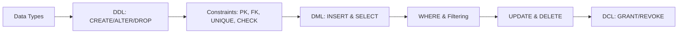

# Chapter 4: SQL Basics

> **Previous:** [Chapter 3: The Relational Model](./03-relational-model.md) | **Next:** [Chapter 5: SQL Joins and Subqueries](./05-sql-joins.md)

## Learning Objectives

- Distinguish DDL, DML, and DCL categories of SQL statements
- Create and modify database tables using DDL commands
- Insert, query, update, and delete data using DML commands
- Implement integrity constraints: PRIMARY KEY, FOREIGN KEY, UNIQUE, CHECK, NOT NULL
- Use SELECT with WHERE, ORDER BY, DISTINCT, and LIMIT clauses
- Write effective WHERE clause conditions with logical operators
- Manage user permissions with DCL commands

## Chapter at a Glance

| Topic | Key Insight | Practical Takeaway |
|-------|-------------|-------------------|
| **DDL Commands** | CREATE, ALTER, DROP define database structure | Always specify column list in INSERT for robustness |
| **Constraints** | PRIMARY KEY, FOREIGN KEY, UNIQUE, CHECK, NOT NULL | Enforce data integrity at the database level, not in code |
| **DML Operations** | INSERT, SELECT, UPDATE, DELETE manipulate data | Always use WHERE with UPDATE/DELETE — test with SELECT first |
| **DCL & Schemas** | GRANT/REVOKE control access; schemas organize objects | Apply least-privilege principle via roles |
| **SELECT Clause** | WHERE, ORDER BY, DISTINCT, LIMIT filter and sort | Use LIMIT/OFFSET for pagination, DISTINCT sparingly |

## Chapter Roadmap



## Theory

> **One-Sentence Takeaway:** SQL is the universal declarative language for relational databases — master DDL for structure, DML for data, and constraints for integrity.


### 4.1 Overview of SQL

SQL (Structured Query Language) is the standard language for relational database management. It was developed at IBM in the 1970s and standardized by ANSI and ISO. Every major relational DBMS (PostgreSQL, MySQL, Oracle, SQL Server, SQLite) supports SQL, though each has proprietary extensions.

SQL is a **declarative language** — you specify WHAT you want, not HOW to get it. The DBMS query optimizer determines the execution plan.

**Language Categories:**

- **DDL (Data Definition Language):** CREATE, ALTER, DROP, TRUNCATE
- **DML (Data Manipulation Language):** SELECT, INSERT, UPDATE, DELETE
- **DCL (Data Control Language):** GRANT, REVOKE
- **TCL (Transaction Control Language):** BEGIN, COMMIT, ROLLBACK, SAVEPOINT

### 4.2 Data Types

Common SQL data types:

| Type | Description | Example |
|------|-------------|---------|
| INTEGER / INT | Whole numbers | 42, -5 |
| BIGINT | Large whole numbers | 9999999999 |
| DECIMAL(p, s) | Exact fixed-point numbers | DECIMAL(10,2) = 1234567.89 |
| NUMERIC(p, s) | Synonym for DECIMAL | NUMERIC(8,2) |
| REAL / FLOAT | Approximate floating-point | 3.14159 |
| VARCHAR(n) | Variable-length string (max n) | VARCHAR(255) |
| CHAR(n) | Fixed-length string | CHAR(10) |
| TEXT | Unlimited-length string | 'Long text...' |
| BOOLEAN | True/false | TRUE, FALSE |
| DATE | Calendar date | '2026-06-09' |
| TIME | Time of day | '14:30:00' |
| TIMESTAMP | Date + time | '2026-06-09 14:30:00' |
| BYTEA | Binary data | BLOB content |

### 4.3 Data Definition Language (DDL)

**CREATE TABLE:** Defines a new relation.

```sql
CREATE TABLE students (
    student_id INTEGER PRIMARY KEY,
    first_name VARCHAR(50) NOT NULL,
    last_name VARCHAR(50) NOT NULL,
    email VARCHAR(255) UNIQUE NOT NULL,
    date_of_birth DATE,
    enrollment_date DATE DEFAULT CURRENT_DATE,
    gpa DECIMAL(3,2) CHECK (gpa >= 0.0 AND gpa <= 4.0),
    department_id INTEGER
);
```

**ALTER TABLE:** Modifies an existing table structure.

```sql
-- Add a column
ALTER TABLE students ADD COLUMN phone VARCHAR(15);

-- Drop a column
ALTER TABLE students DROP COLUMN phone;

-- Modify a column's data type
ALTER TABLE students ALTER COLUMN gpa TYPE DECIMAL(4,2);

-- Add a constraint
ALTER TABLE students ADD CONSTRAINT chk_gpa CHECK (gpa >= 0.0 AND gpa <= 4.0);

-- Add a default value
ALTER TABLE students ALTER COLUMN enrollment_date SET DEFAULT CURRENT_DATE;

-- Rename a column
ALTER TABLE students RENAME COLUMN email TO contact_email;

-- Rename the table
ALTER TABLE students RENAME TO university_students;
```

**DROP TABLE:** Removes the table and all its data permanently.

```sql
DROP TABLE students;                    -- Removes table
DROP TABLE IF EXISTS students;          -- Safe version (no error if missing)
DROP TABLE students CASCADE;            -- Removes dependent objects too
```

**TRUNCATE TABLE:** Removes all rows but preserves the table structure.

```sql
TRUNCATE TABLE temporary_data;
```

### 4.4 Constraints

**NOT NULL:** Ensures a column cannot have NULL values.

```sql
CREATE TABLE products (
    product_id INTEGER PRIMARY KEY,
    product_name VARCHAR(200) NOT NULL
);
```

**UNIQUE:** Ensures all values in a column (or combination of columns) are distinct.

```sql
CREATE TABLE users (
    user_id INTEGER PRIMARY KEY,
    username VARCHAR(50) UNIQUE NOT NULL,
    email VARCHAR(255) UNIQUE NOT NULL
);
```

**PRIMARY KEY:** Combines NOT NULL and UNIQUE. Each table has exactly one primary key.

```sql
-- Single column PK
CREATE TABLE orders (
    order_id INTEGER PRIMARY KEY,
    order_date DATE NOT NULL,
    customer_id INTEGER NOT NULL
);

-- Composite PK (multi-column)
CREATE TABLE order_items (
    order_id INTEGER,
    product_id INTEGER,
    quantity INTEGER NOT NULL,
    price DECIMAL(10,2) NOT NULL,
    PRIMARY KEY (order_id, product_id)
);
```

**FOREIGN KEY:** Ensures referential integrity. Values must exist in the referenced table.

```sql
CREATE TABLE enrollments (
    student_id INTEGER REFERENCES students(student_id),
    course_id INTEGER REFERENCES courses(course_id),
    semester VARCHAR(10) NOT NULL,
    grade CHAR(2),
    PRIMARY KEY (student_id, course_id, semester)
);

-- With explicit constraint name and actions
CREATE TABLE orders (
    order_id INTEGER PRIMARY KEY,
    customer_id INTEGER NOT NULL,
    CONSTRAINT fk_customer
        FOREIGN KEY (customer_id)
        REFERENCES customers(customer_id)
        ON DELETE CASCADE
        ON UPDATE CASCADE
);
```

**Referential Actions:**
- `ON DELETE CASCADE`: Delete child rows when parent is deleted
- `ON DELETE SET NULL`: Set child FK to NULL when parent is deleted
- `ON DELETE RESTRICT`: Prevent deletion of parent if children exist
- `ON DELETE NO ACTION`: Similar to RESTRICT (checked at end of transaction)
- `ON DELETE SET DEFAULT`: Set child FK to default value

**CHECK:** Validates data against a boolean expression.

```sql
CREATE TABLE employees (
    emp_id INTEGER PRIMARY KEY,
    salary DECIMAL(10,2) CHECK (salary > 0),
    employment_type VARCHAR(10) CHECK (employment_type IN ('Full-Time', 'Part-Time', 'Contract')),
    birth_date DATE CHECK (birth_date < '2010-01-01')
);

-- Multi-column check
CREATE TABLE reservations (
    check_in DATE NOT NULL,
    check_out DATE NOT NULL,
    CHECK (check_out > check_in)
);
```

### 4.5 Data Manipulation Language (DML)

**INSERT:** Adds new rows to a table.

```sql
-- Insert with all columns (order matters)
INSERT INTO students VALUES (1, 'Alice', 'Chen', 'alice@example.com', '2000-05-15', '2024-09-01', 3.8, 10);

-- Insert with specified columns (recommended, more readable)
INSERT INTO students (student_id, first_name, last_name, email, department_id)
VALUES (2, 'Bob', 'Smith', 'bob@example.com', 20);

-- Insert multiple rows in one statement
INSERT INTO students (student_id, first_name, last_name, email) VALUES
    (3, 'Charlie', 'Brown', 'charlie@example.com'),
    (4, 'Diana', 'Prince', 'diana@example.com'),
    (5, 'Eve', 'Adams', 'eve@example.com');

-- Insert from query
INSERT INTO honor_students (student_id, name)
SELECT student_id, first_name || ' ' || last_name
FROM students
WHERE gpa >= 3.5;
```

**SELECT:** Retrieves data from tables.

```sql
-- Basic select
SELECT * FROM students;

-- Select specific columns
SELECT first_name, last_name, email FROM students;

-- Select with alias
SELECT first_name AS fname, last_name AS lname FROM students;

-- Select with expression
SELECT first_name || ' ' || last_name AS full_name, email FROM students;

-- Select with DISTINCT (remove duplicates)
SELECT DISTINCT department_id FROM students;

-- Select with LIMIT
SELECT * FROM students LIMIT 10;

-- Select with OFFSET (pagination)
SELECT * FROM students ORDER BY student_id LIMIT 10 OFFSET 20;

-- Select with ORDER BY
SELECT * FROM students ORDER BY last_name ASC, first_name DESC;

-- Counting rows
SELECT COUNT(*) AS total_students FROM students;
```

**WHERE Clause:** Filters rows based on conditions.

```sql
-- Comparison operators
SELECT * FROM students WHERE gpa > 3.5;
SELECT * FROM students WHERE gpa >= 3.0 AND gpa <= 4.0;
SELECT * FROM students WHERE enrollment_date >= '2025-01-01';
SELECT * FROM students WHERE department_id != 10;

-- Logical operators
SELECT * FROM students WHERE gpa > 3.0 AND department_id = 10;
SELECT * FROM students WHERE gpa > 3.5 OR department_id = 20;
SELECT * FROM students WHERE NOT (department_id = 10);

-- IN operator
SELECT * FROM students WHERE department_id IN (10, 20, 30);
SELECT * FROM students WHERE first_name IN ('Alice', 'Bob', 'Charlie');

-- BETWEEN operator
SELECT * FROM students WHERE gpa BETWEEN 3.0 AND 4.0;
SELECT * FROM students WHERE enrollment_date BETWEEN '2024-01-01' AND '2024-12-31';

-- LIKE operator (pattern matching)
-- % matches any sequence of characters
-- _ matches any single character
SELECT * FROM students WHERE last_name LIKE 'S%';     -- Starts with S
SELECT * FROM students WHERE email LIKE '%@example.com';  -- Domain match
SELECT * FROM students WHERE first_name LIKE 'A_%';   -- A followed by at least 1 char

-- IS NULL / IS NOT NULL
SELECT * FROM students WHERE gpa IS NULL;
SELECT * FROM students WHERE phone IS NOT NULL;

-- Combination
SELECT * FROM students
WHERE department_id = 10
  AND gpa > 3.0
  AND enrollment_date > '2024-06-01'
ORDER BY gpa DESC
LIMIT 5;
```

**UPDATE:** Modifies existing rows.

```sql
-- Update all rows (CAREFUL!)
UPDATE students SET graduation_year = 2028;

-- Update with condition
UPDATE students SET gpa = 4.0 WHERE student_id = 1;

-- Update multiple columns
UPDATE students
SET gpa = 3.9, department_id = 20
WHERE student_id = 2;

-- Update using a subquery
UPDATE students
SET department_id = (SELECT department_id FROM departments WHERE name = 'Computer Science')
WHERE student_id = 3;
```

**DELETE:** Removes rows.

```sql
-- Delete all rows (CAREFUL!)
DELETE FROM students;

-- Delete with condition
DELETE FROM students WHERE student_id = 5;

-- Delete students with GPA below 1.0
DELETE FROM students WHERE gpa < 1.0;

-- Delete using a subquery
DELETE FROM students
WHERE department_id IN (SELECT department_id FROM departments WHERE location = 'Closed');
```

### 4.6 Data Control Language (DCL)

```sql
-- Grant privileges
GRANT SELECT ON students TO app_read_only;
GRANT INSERT, UPDATE, DELETE ON students TO app_developer;
GRANT ALL PRIVILEGES ON ALL TABLES IN SCHEMA public TO admin_user;

-- Grant column-level privileges
GRANT SELECT (student_id, first_name, last_name) ON students TO support_staff;

-- Revoke privileges
REVOKE DELETE ON students FROM app_developer;
REVOKE ALL PRIVILEGES ON students FROM app_read_only;

-- Grant role membership
GRANT data_analyst TO analyst_user;

-- Create role
CREATE ROLE read_only_user;
GRANT SELECT ON ALL TABLES IN SCHEMA public TO read_only_user;
```

### 4.7 Schema Concepts

```sql
-- Create schema
CREATE SCHEMA university;

-- Create table in specific schema
CREATE TABLE university.students (
    student_id INTEGER PRIMARY KEY,
    name VARCHAR(100) NOT NULL
);

-- Set search path
SET search_path TO university, public;

-- Drop schema (CASCADE to drop all objects)
DROP SCHEMA IF EXISTS old_schema CASCADE;
```

## Examples

> **One-Sentence Takeaway:** Real-world SQL examples — from creating e-commerce tables to querying products and managing cascading deletes — illustrate the practical power of DDL, constraints, and DML working together.

**Example 4.1: Complete E-Commerce Database Creation**

```sql
-- Create tables for an e-commerce system
CREATE TABLE customers (
    customer_id INTEGER PRIMARY KEY,
    email VARCHAR(255) UNIQUE NOT NULL,
    first_name VARCHAR(50) NOT NULL,
    last_name VARCHAR(50) NOT NULL,
    phone VARCHAR(20),
    registration_date TIMESTAMP DEFAULT CURRENT_TIMESTAMP,
    status VARCHAR(10) DEFAULT 'active' CHECK (status IN ('active', 'inactive', 'suspended'))
);

CREATE TABLE categories (
    category_id INTEGER PRIMARY KEY,
    category_name VARCHAR(100) NOT NULL UNIQUE,
    description TEXT,
    parent_category_id INTEGER REFERENCES categories(category_id)
);

CREATE TABLE products (
    product_id INTEGER PRIMARY KEY,
    product_name VARCHAR(200) NOT NULL,
    description TEXT,
    price DECIMAL(10,2) NOT NULL CHECK (price >= 0),
    stock_quantity INTEGER NOT NULL DEFAULT 0 CHECK (stock_quantity >= 0),
    category_id INTEGER REFERENCES categories(category_id),
    is_active BOOLEAN DEFAULT TRUE,
    created_at TIMESTAMP DEFAULT CURRENT_TIMESTAMP
);

CREATE TABLE orders (
    order_id INTEGER PRIMARY KEY,
    customer_id INTEGER NOT NULL REFERENCES customers(customer_id),
    order_date TIMESTAMP DEFAULT CURRENT_TIMESTAMP,
    status VARCHAR(20) DEFAULT 'pending' CHECK (status IN ('pending', 'processing', 'shipped', 'delivered', 'cancelled')),
    shipping_address TEXT,
    total_amount DECIMAL(12,2)
);

CREATE TABLE order_items (
    order_id INTEGER REFERENCES orders(order_id) ON DELETE CASCADE,
    product_id INTEGER REFERENCES products(product_id),
    quantity INTEGER NOT NULL CHECK (quantity > 0),
    unit_price DECIMAL(10,2) NOT NULL,
    PRIMARY KEY (order_id, product_id)
);

-- Insert sample data
INSERT INTO categories (category_id, category_name) VALUES
    (1, 'Electronics'),
    (2, 'Books'),
    (3, 'Clothing');

INSERT INTO products (product_id, product_name, price, stock_quantity, category_id) VALUES
    (1, 'Laptop Pro 15"', 1299.99, 50, 1),
    (2, 'Wireless Mouse', 29.99, 200, 1),
    (3, 'SQL for Beginners', 39.99, 100, 2),
    (4, 'Design Patterns', 49.99, 75, 2);

INSERT INTO customers (customer_id, email, first_name, last_name) VALUES
    (1, 'john@example.com', 'John', 'Doe'),
    (2, 'jane@example.com', 'Jane', 'Smith');
```

**Example 4.2: Querying the E-Commerce Database**

```sql
-- Find all active products under $50
SELECT product_name, price, stock_quantity
FROM products
WHERE price < 50 AND is_active = TRUE
ORDER BY price ASC;

-- Find order details for a specific customer
SELECT o.order_id, o.order_date, o.status, p.product_name, oi.quantity, oi.unit_price
FROM orders o
JOIN order_items oi ON o.order_id = oi.order_id
JOIN products p ON oi.product_id = p.product_id
WHERE o.customer_id = 1
ORDER BY o.order_date DESC;

-- Search for products
SELECT product_name, price
FROM products
WHERE product_name ILIKE '%laptop%'
   OR description ILIKE '%laptop%';
```

**Example 4.3: DELETE CASCADE Behavior**

```sql
-- When a customer is deleted, their orders are automatically deleted (if FK has CASCADE)
DELETE FROM customers WHERE customer_id = 1;
-- This succeeds only if orders FK uses ON DELETE CASCADE
-- Otherwise you must delete child records first:
DELETE FROM order_items WHERE order_id IN (SELECT order_id FROM orders WHERE customer_id = 1);
DELETE FROM orders WHERE customer_id = 1;
DELETE FROM customers WHERE customer_id = 1;
```

> **Warning:** A missing WHERE clause in UPDATE or DELETE affects ALL rows — always write the SELECT first to verify your condition before executing the modification.
>
> **Remember:** Composite primary keys are powerful but make JOINs verbose — consider a surrogate integer PK with a UNIQUE constraint on the natural composite key instead.

## 💡 Pro Tips

1. **Always list columns explicitly in INSERT statements** — `INSERT INTO t VALUES (...)` breaks when the schema changes; `INSERT INTO t (col1, col2) VALUES (...)` is robust.
2. **Always use WHERE with UPDATE and DELETE** — a missing WHERE clause modifies or removes ALL rows in the table. In production, first write the SELECT to verify your condition.
3. **Prefer VARCHAR with a reasonable max** over TEXT or huge VARCHAR limits — PostgreSQL and others store short strings inline, which is faster.
4. **Composite primary keys are powerful but make JOINs verbose** — consider using a surrogate integer PK and a UNIQUE constraint on the natural composite key.
5. **Test your constraints with intentional bad data** — INSERT a row that violates each constraint to confirm the error messages are clear and the behavior is correct.

## One-Sentence Takeaways

- **4.1:** SQL is a declarative language with four sub-language categories: DDL, DML, DCL, and TCL.
- **4.2:** Choosing the right data types — INTEGER, VARCHAR, DECIMAL, DATE, BOOLEAN — balances storage efficiency with query performance.
- **4.3:** DDL commands (CREATE, ALTER, DROP, TRUNCATE) define and modify database structures.
- **4.4:** Constraints — PRIMARY KEY, FOREIGN KEY, UNIQUE, CHECK, NOT NULL — enforce data integrity at the database level.
- **4.5:** DML commands (INSERT, SELECT, UPDATE, DELETE) provide complete data manipulation capabilities.
- **4.6:** DCL commands (GRANT, REVOKE) control access at the user and role level.
- **4.7:** Schemas organize database objects into logical namespaces for better management.

## Concept Comparison Table

| SQL Category | Commands | What It Does |
|-------------|----------|-------------|
| **DDL** | CREATE, ALTER, DROP, TRUNCATE | Defines and modifies database structure |
| **DML** | SELECT, INSERT, UPDATE, DELETE | Manipulates data within tables |
| **DCL** | GRANT, REVOKE | Controls user access and permissions |
| **TCL** | BEGIN, COMMIT, ROLLBACK, SAVEPOINT | Manages transactions |

| Constraint Type | Purpose | Example |
|----------------|---------|---------|
| **NOT NULL** | Column must have a value | `name VARCHAR(100) NOT NULL` |
| **UNIQUE** | All values in column(s) must be distinct | `email VARCHAR(255) UNIQUE` |
| **PRIMARY KEY** | NOT NULL + UNIQUE; identifies each row | `id INTEGER PRIMARY KEY` |
| **FOREIGN KEY** | Values must exist in referenced table | `dept_id INTEGER REFERENCES dept(id)` |
| **CHECK** | Values must satisfy a boolean expression | `CHECK (salary > 0)` |

## Quick Reference

| DDL Statement | Syntax Pattern | Use Case |
|-------------|---------------|----------|
| CREATE TABLE | `CREATE TABLE t (col type constraint, ...)` | New entity |
| ALTER TABLE ADD | `ALTER TABLE t ADD COLUMN c type` | Schema evolution |
| ALTER TABLE DROP | `ALTER TABLE t DROP COLUMN c` | Remove unused column |
| ALTER TABLE RENAME | `ALTER TABLE t RENAME COLUMN a TO b` | Rename |
| DROP TABLE | `DROP TABLE t [CASCADE]` | Remove permanently |
| TRUNCATE | `TRUNCATE TABLE t` | Remove data, keep structure |

| DML Statement | Caution |
|-------------|---------|
| SELECT | Use WHERE to avoid full table scans on large tables |
| INSERT | Specify column list for robustness |
| UPDATE | Always include WHERE; test with SELECT first |
| DELETE | Always include WHERE; knows no undo in most systems |

## Cross-Application Matrix

| SQL Feature | Applied In | Why It Matters |
|------------|-----------|----------------|
| **FOREIGN KEY + ON DELETE CASCADE** | Order management, content CMS | Automatically cleans up child records when parent is removed |
| **CHECK Constraints** | Financial systems, healthcare | Enforces business rules (positive prices, valid date ranges) at DB level |
| **GRANT/REVOKE** | Multi-tenant apps, government systems | Implements row/table-level security for different user roles |
| **DISTINCT + ORDER BY** | Reporting dashboards | Clean duplicate-free sorted data for business reports |
| **LIKE / ILIKE** | Search functionality | Pattern matching for product lookup, name search |
| **Composite Keys** | Junction tables (M:N) | Enforces uniqueness of combinations (student+course+semester) |

## Chapter Quiz

1. Which SQL statement belongs to DDL?
   a) SELECT
   b) INSERT
   c) ALTER TABLE
   d) GRANT

2. The PRIMARY KEY constraint is equivalent to:
   a) UNIQUE
   b) NOT NULL + UNIQUE
   c) NOT NULL + FOREIGN KEY
   d) CHECK + UNIQUE

3. What happens when you DELETE FROM students without a WHERE clause?
   a) An error is returned
   b) All rows in the students table are deleted
   c) Only the first row is deleted
   d) The table structure is removed

4. Which referential action automatically deletes child rows when a parent is deleted?
   a) ON DELETE RESTRICT
   b) ON DELETE SET NULL
   c) ON DELETE CASCADE
   d) ON DELETE NO ACTION

5. The purpose of a CHECK constraint is to:
   a) Ensure a column is unique
   b) Verify values satisfy a boolean expression
   c) Create an index
   d) Define a foreign key

6. Which SQL command removes all rows but preserves the table structure?
   a) DROP TABLE
   b) DELETE FROM
   c) TRUNCATE TABLE
   d) ALTER TABLE

7. A composite primary key is:
   a) A key made of two or more columns
   b) Two separate primary keys
   c) A key that references another table
   d) A key with a default value

8. The UPDATE statement without a WHERE clause:
   a) Updates only the first row
   b) Updates all rows in the table
   c) Returns an error
   d) Updates rows with NULL values only

**Answers:** 1-c, 2-b, 3-b, 4-c, 5-b, 6-c, 7-a, 8-b

## Summary

- SQL is the universal language for relational databases, divided into DDL, DML, DCL, and TCL.
- CREATE TABLE defines the schema with columns, data types, and constraints.
- Constraints (PRIMARY KEY, FOREIGN KEY, UNIQUE, CHECK, NOT NULL) enforce data integrity.
- INSERT adds data; SELECT retrieves it with powerful filtering (WHERE, LIKE, IN, BETWEEN).
- UPDATE modifies existing rows; DELETE removes them.
- DCL commands (GRANT, REVOKE) manage access control.
- Always use WHERE clauses carefully with UPDATE and DELETE to avoid unintended changes.

## Exercises

### Basic

1. Write the SQL to create a `departments` table with columns: dept_id (INTEGER PK), dept_name (VARCHAR(100), NOT NULL, UNIQUE), location (VARCHAR(100)), budget (DECIMAL(12,2)).

2. Insert three departments into your table: ('Engineering', 'Building A', 500000), ('Marketing', 'Building B', 200000), ('Sales', 'Building A', 300000).

3. Write a SELECT query that finds all products with a price between $10 and $100, sorted by price descending.

4. What is the difference between DROP TABLE and TRUNCATE TABLE? When would you use each?

5. Write a query to find customers whose last name starts with 'M' and who registered after January 1, 2025.

### Intermediate

6. Write the complete DDL for a `library` database with tables: `books`, `members`, `loans`. Include appropriate PKs, FKs, NOT NULL, and CHECK constraints. Include a constraint that the return_date must be after the loan_date.

7. Given:
```sql
CREATE TABLE employees (
    emp_id INTEGER PRIMARY KEY,
    name VARCHAR(100) NOT NULL,
    salary DECIMAL(10,2),
    dept_id INTEGER REFERENCES departments(dept_id)
);
```
Write queries to:
a) Increase all employees' salaries by 10%
b) Delete employees in department 5
c) Find the highest-paid employee name

8. Explain what `ON DELETE CASCADE` does and provide a scenario where it is appropriate. When would you choose `ON DELETE SET NULL` instead?

9. Write a query using LIKE that finds all email addresses from the domain 'company.org' and where the username portion is between 5 and 10 characters long.

### Advanced

10. Design a complete schema for a HOTEL BOOKING system with tables: `hotels`, `rooms`, `guests`, `bookings`, `payments`. Include at least:
    - Composite keys where appropriate
    - CHECK constraints (e.g., check_in < check_out)
    - DEFAULT values
    - Foreign keys with appropriate referential actions
    - At least one UNIQUE constraint across multiple columns
    Write INSERT statements for sample data and three meaningful SELECT queries.

11. Write a migration script that:
    - Creates a table `audit_log` with columns for action, table_name, record_id, old_data (TEXT), new_data (TEXT), timestamp
    - Modifies the `employees` table to add a `last_modified` column
    - Creates a trigger (in concept) that logs changes to employees
    (Write the core SQL, noting that trigger syntax varies by DBMS)

12. Given the schema below, write a query that uses a subquery to find customers who have never placed an order. Then write the same query using a LEFT JOIN. Which is more efficient?
```sql
customers(customer_id, name, email)
orders(order_id, customer_id, order_date, total)
```
