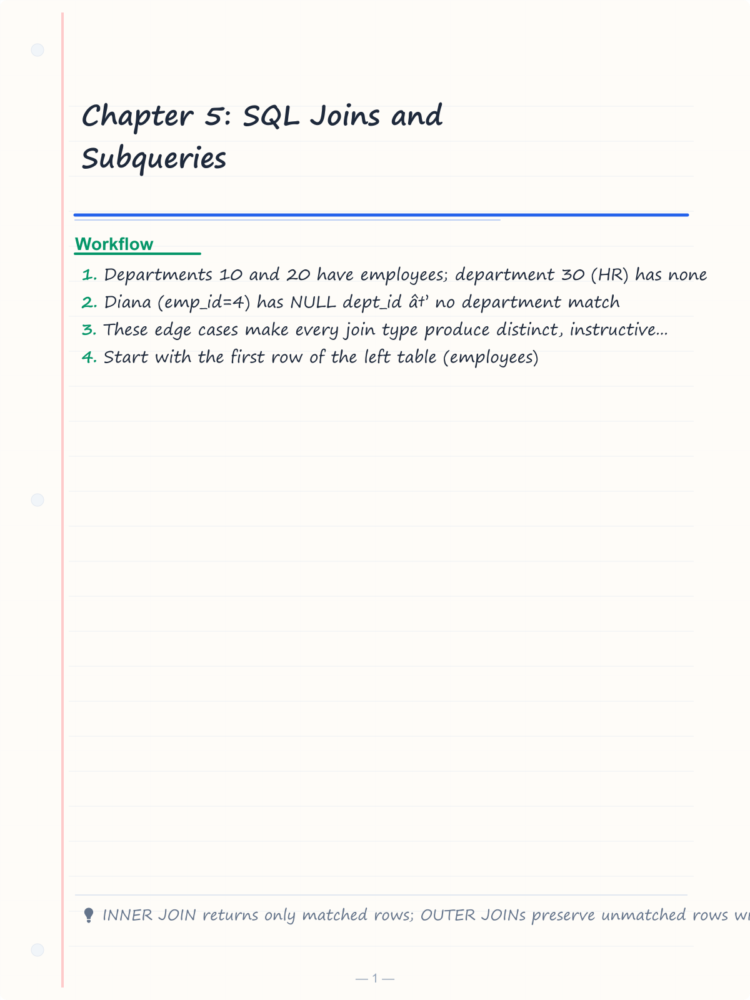
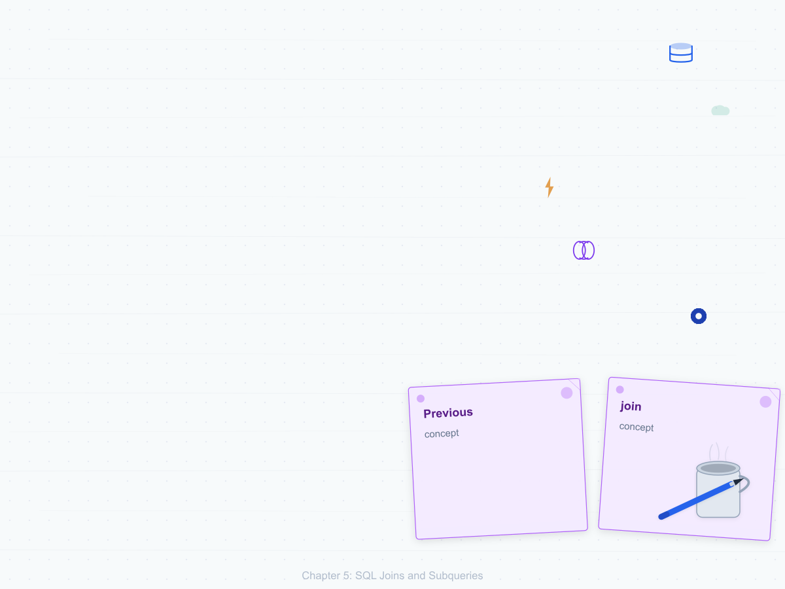
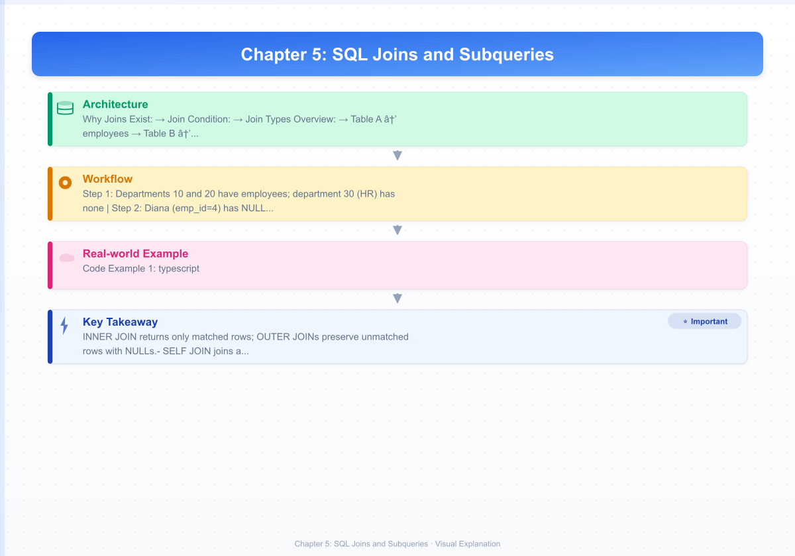
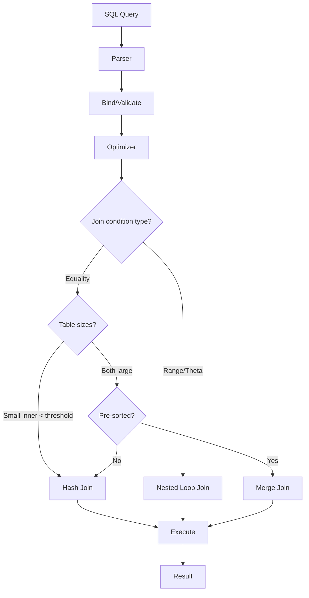
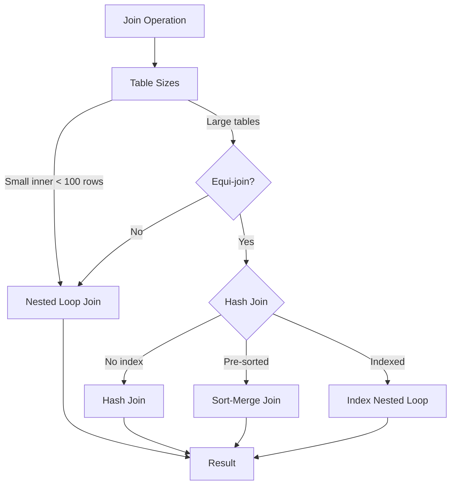

# Chapter 5: SQL Joins and Subqueries

> **Previous:** [Chapter 4: SQL Basics](./04-sql-basics.md) | **Next:** [Chapter 6: Advanced SQL](./06-sql-advanced.md)

## Learning Objectives

- Write INNER, LEFT, RIGHT, and FULL OUTER joins to combine tables
- Understand CROSS JOIN, NATURAL JOIN, and SELF JOIN use cases
- Differentiate implicit (theta-style) vs explicit (ANSI) join syntax
- Write subqueries in WHERE, FROM, and SELECT clauses
- Use EXISTS, NOT EXISTS, IN, NOT IN, ANY, ALL operators
- Understand correlated subqueries and their performance implications
- Rewrite subqueries as joins and vice versa
- Implement join algorithms (nested loop, hash join) in C++ and Python

<!-- Image Gallery -->
<section class="lesson-visuals" aria-label="Visual learning resources">
  <header><span>VISUAL LEARNING</span><h2>See it. Review it. Remember it.</h2></header>
  <a class="lesson-visual-card" href="../../assets/images/lessons/database-management-systems/05-sql-joins/handwritten-notes.png" target="_blank" rel="noopener">
    
    <span><strong>Handwritten notes</strong>Condensed notes for deliberate review.</span>
  </a>
  <a class="lesson-visual-card" href="../../assets/images/lessons/database-management-systems/05-sql-joins/sticky-notes.png" target="_blank" rel="noopener">
    
    <span><strong>Sticky-note revision</strong>Fast recall prompts for revision.</span>
  </a>
  <a class="lesson-visual-card" href="../../assets/images/lessons/database-management-systems/05-sql-joins/visual-explanation.png" target="_blank" rel="noopener">
    
    <span><strong>Visual concept guide</strong>A connected explanation of the key ideas.</span>
  </a>
</section>
<!-- End Image Gallery -->


## Chapter at a Glance

| Topic | Key Insight | Practical Takeaway |
|-------|-------------|-------------------|
| **INNER JOIN** | Returns only matched rows → the most common join | Use explicit ANSI JOIN syntax over theta-style |
| **OUTER JOINs** | LEFT, RIGHT, FULL preserve unmatched rows with NULLs | LEFT JOIN / IS NULL is the standard anti-join pattern |
| **SELF JOIN** | Join a table to itself using aliases | Ideal for hierarchies, pairs, and consecutive records |
| **NATURAL JOIN** | Auto-matches columns with same name | Dangerous in production → schema changes break queries silently |
| **Subqueries** | Nested SELECT in WHERE, FROM, or SELECT clause | EXISTS short-circuits and handles NULLs better than IN |
| **Correlated Subqueries** | Re-execute per outer row → powerful but expensive | Rewrite as window functions or JOINs when possible |

## Chapter Roadmap


## Theory

> **One-Sentence Takeaway:** Joins are the heart of relational querying → mastering INNER, OUTER, SELF, NATURAL, SEMI, ANTI, and subqueries lets you combine any data across normalized tables.


### 5.1 Introduction to Joins


Relational databases store data in normalized tables. To answer meaningful questions, we almost always need to combine data from multiple tables. A **join** combines rows from two or more tables based on a related column.

Joins are the heart of relational querying. Understanding them deeply is essential for writing correct and efficient SQL.

**Why Joins Exist:** Normalization splits data into separate tables to reduce redundancy. Joins reverse this split at query time → reconnecting related data without duplicating storage.

**Join Condition:** The predicate that determines how rows from two tables relate. Most common: foreign key = primary key.

**Join Types Overview:**

| Category | Types |
|----------|-------|
| Inner | INNER, NATURAL, SEMI (logical) |
| Outer | LEFT, RIGHT, FULL |
| Cross | CROSS |
| Self | SELF (any type applied to same table) |
| Anti | ANTI (logical) |

### Sample Tables Used Throughout This Chapter


All join examples use the following two tables:

**Table A → employees**

| emp_id | emp_name | dept_id | salary |
|--------|----------|---------|--------|
| 1 | Alice | 10 | 70000 |
| 2 | Bob | 10 | 60000 |
| 3 | Charlie | 20 | 80000 |
| 4 | Diana | NULL | 55000 |
| 5 | Eve | 20 | 75000 |

```sql
CREATE TABLE employees (
    emp_id INT PRIMARY KEY,
    emp_name VARCHAR(50),
    dept_id INT,
    salary DECIMAL(10,2)
);

INSERT INTO employees VALUES
(1, 'Alice',   10, 70000),
(2, 'Bob',     10, 60000),
(3, 'Charlie', 20, 80000),
(4, 'Diana',   NULL, 55000),
(5, 'Eve',     20, 75000);
```

**Table B → departments**

| dept_id | dept_name |
|---------|-----------|
| 10 | Engineering |
| 20 | Sales |
| 30 | HR |

```sql
CREATE TABLE departments (
    dept_id INT PRIMARY KEY,
    dept_name VARCHAR(50)
);

INSERT INTO departments VALUES
(10, 'Engineering'),
(20, 'Sales'),
(30, 'HR');
```

**Key observations:**
- Departments 10 and 20 have employees; department 30 (HR) has none
- Diana (emp_id=4) has NULL dept_id → no department match
- These edge cases make every join type produce distinct, instructive results

### 5.2 INNER JOIN


An inner join returns only rows where there is a match in **both** tables. It is the most common and most efficient join type.

#### Real-World Analogy: Library Book Borrowing

Imagine a library's **borrowers table** and **books table**. An INNER JOIN answers: "Show me only books that are currently borrowed, along with the borrower's name." Books sitting on the shelf (no borrower) are excluded. Borrowers who haven't taken any books are excluded. Only the intersection appears.

#### Numbered Steps of INNER JOIN Execution

1. Start with the first row of the left table (employees)
2. For that row, scan the right table (departments) and evaluate the join condition `employees.dept_id = departments.dept_id`
3. If the condition is TRUE, emit a combined row (all columns from both tables)
4. Move to the next left-table row and repeat from step 2
5. After all left rows are processed, discard any left rows that never found a match
6. The final result contains only rows that had matches on both sides

#### Pseudocode

```
PROCEDURE INNER_JOIN(table_left, table_right, condition)
    result = empty list
    FOR EACH row_l IN table_left
        FOR EACH row_r IN table_right
            IF condition(row_l, row_r) == TRUE THEN
                result.append(combine(row_l, row_r))
            END IF
        END FOR
    END FOR
    RETURN result
END PROCEDURE
```

#### Dry Run Trace Table

**Step-by-step matching for INNER JOIN employees × departments ON dept_id:**

| Step | Left Row (employees) | Right Row Scanned (departments) | Condition `e.dept_id = d.dept_id` | Action | Accumulated Result |
|------|---------------------|-------------------------------|-----------------------------------|--------|-------------------|
| 1 | (1, Alice, 10, 70000) | (10, Engineering) | 10 = 10 → TRUE | EMIT | (Alice, Engineering) |
| 2 | (1, Alice, 10, 70000) | (20, Sales) | 10 = 20 → FALSE | SKIP | (Alice, Engineering) |
| 3 | (1, Alice, 10, 70000) | (30, HR) | 10 = 30 → FALSE | SKIP | (Alice, Engineering) |
| 4 | (2, Bob, 10, 60000) | (10, Engineering) | 10 = 10 → TRUE | EMIT | (Alice, Eng), (Bob, Eng) |
| 5 | (2, Bob, 10, 60000) | (20, Sales) | 10 = 20 → FALSE | SKIP | (Alice, Eng), (Bob, Eng) |
| 6 | (2, Bob, 10, 60000) | (30, HR) | 10 = 30 → FALSE | SKIP | (Alice, Eng), (Bob, Eng) |
| 7 | (3, Charlie, 20, 80000) | (10, Engineering) | 20 = 10 → FALSE | SKIP | (Alice, Eng), (Bob, Eng) |
| 8 | (3, Charlie, 20, 80000) | (20, Sales) | 20 = 20 → TRUE | EMIT | + (Charlie, Sales) |
| 9 | (3, Charlie, 20, 80000) | (30, HR) | 20 = 30 → FALSE | SKIP | (Charlie, Sales) |
| 10 | (4, Diana, NULL, 55000) | (10, Engineering) | NULL = 10 → UNKNOWN | SKIP | (no change) |
| 11 | (4, Diana, NULL, 55000) | (20, Sales) | NULL = 20 → UNKNOWN | SKIP | (no change) |
| 12 | (4, Diana, NULL, 55000) | (30, HR) | NULL = 30 → UNKNOWN | SKIP | (no change) |
| 13 | (5, Eve, 20, 75000) | (10, Engineering) | 20 = 10 → FALSE | SKIP | (no change) |
| 14 | (5, Eve, 20, 75000) | (20, Sales) | 20 = 20 → TRUE | EMIT | + (Eve, Sales) |
| 15 | (5, Eve, 20, 75000) | (30, HR) | 20 = 30 → FALSE | SKIP | (done) |

**Final Result:**

| emp_name | dept_name |
|----------|-----------|
| Alice | Engineering |
| Bob | Engineering |
| Charlie | Sales |
| Eve | Sales |

Diana (no department) and HR department are excluded → neither had a match.

#### SQL Code

```sql
-- ANSI SQL-92 syntax (preferred)
SELECT e.emp_name, d.dept_name
FROM employees e
INNER JOIN departments d ON e.dept_id = d.dept_id;

-- Output:
-- Alice    Engineering
-- Bob      Engineering
-- Charlie  Sales
-- Eve      Sales

-- Implicit (theta-style) syntax → older, harder to maintain
SELECT e.emp_name, d.dept_name
FROM employees e, departments d
WHERE e.dept_id = d.dept_id;

-- INNER JOIN with multiple conditions
SELECT e.emp_name, d.dept_name
FROM employees e
INNER JOIN departments d
    ON e.dept_id = d.dept_id
    AND e.salary > 65000;

-- Output:
-- Alice    Engineering
-- Charlie  Sales
-- Eve      Sales
```

#### C++ Implementation (Nested Loop Join + Hash Join)

```cpp
#include <iostream>
#include <vector>
#include <string>
#include <unordered_map>
#include <optional>

struct Employee {
    int emp_id;
    std::string emp_name;
    std::optional<int> dept_id;  // NULL support
    double salary;
};

struct Department {
    int dept_id;
    std::string dept_name;
};

struct JoinRow {
    std::string emp_name;
    std::string dept_name;
};

// Nested Loop Inner Join → O(N * M)
std::vector<JoinRow> nestedLoopInnerJoin(
    const std::vector<Employee>& employees,
    const std::vector<Department>& departments) {
    std::vector<JoinRow> result;
    for (const auto& e : employees) {
        if (!e.dept_id.has_value()) continue;  // NULL can't match
        for (const auto& d : departments) {
            if (e.dept_id.value() == d.dept_id) {
                result.push_back({e.emp_name, d.dept_name});
            }
        }
    }
    return result;
}

// Hash Inner Join → O(N + M) average
std::vector<JoinRow> hashInnerJoin(
    const std::vector<Employee>& employees,
    const std::vector<Department>& departments) {
    std::unordered_map<int, std::string> dept_map;
    for (const auto& d : departments) {
        dept_map[d.dept_id] = d.dept_name;
    }
    std::vector<JoinRow> result;
    for (const auto& e : employees) {
        if (!e.dept_id.has_value()) continue;
        auto it = dept_map.find(e.dept_id.value());
        if (it != dept_map.end()) {
            result.push_back({e.emp_name, it->second});
        }
    }
    return result;
}

int main() {
    std::vector<Employee> employees = {
        {1, "Alice", 10, 70000},
        {2, "Bob", 10, 60000},
        {3, "Charlie", 20, 80000},
        {4, "Diana", std::nullopt, 55000},
        {5, "Eve", 20, 75000}
    };
    std::vector<Department> departments = {
        {10, "Engineering"},
        {20, "Sales"},
        {30, "HR"}
    };
    auto result = hashInnerJoin(employees, departments);
    for (const auto& r : result) {
        std::cout << r.emp_name << " : " << r.dept_name << "\n";
    }
    return 0;
}
```

#### Python Implementation

```python
from dataclasses import dataclass
from typing import Optional


@dataclass
class Employee:
    emp_id: int
    emp_name: str
    dept_id: Optional[int]
    salary: float


@dataclass
class Department:
    dept_id: int
    dept_name: str


def nested_loop_inner_join(employees, departments):
    """Nested Loop Inner Join → O(N * M)"""
    result = []
    for e in employees:
        if e.dept_id is None:
            continue  # NULL can't match in equi-join
        for d in departments:
            if e.dept_id == d.dept_id:
                result.append((e.emp_name, d.dept_name))
    return result


def hash_inner_join(employees, departments):
    """Hash Inner Join → O(N + M) average"""
    dept_map = {d.dept_id: d.dept_name for d in departments}
    result = []
    for e in employees:
        if e.dept_id is None:
            continue
        dept_name = dept_map.get(e.dept_id)
        if dept_name is not None:
            result.append((e.emp_name, dept_name))
    return result


employees = [
    Employee(1, "Alice", 10, 70000),
    Employee(2, "Bob", 10, 60000),
    Employee(3, "Charlie", 20, 80000),
    Employee(4, "Diana", None, 55000),
    Employee(5, "Eve", 20, 75000),
]
departments = [
    Department(10, "Engineering"),
    Department(20, "Sales"),
    Department(30, "HR"),
]

for name, dept in hash_inner_join(employees, departments):
    print(f"{name} : {dept}")
```

#### Complexity Analysis

| Aspect | Nested Loop | Hash Join |
|--------|------------|-----------|
| Time | O(N × M) | O(N + M) average |
| Space | O(1) extra | O(M) for hash table |
| Why | N left rows × M right rows checked | Build hash on smaller table, probe with larger |

**Why Nested Loop is O(N×M):** For each of the N left rows, we scan all M right rows. With 5 employees and 3 departments: 5×3 = 15 condition evaluations. With 1M employees and 100K departments: 10¹¹ evaluations → catastrophic.

**Why Hash Join is O(N+M):** Building the hash table costs O(M), probing costs O(N) with O(1) average lookup. Total: O(N+M). With 1M employees and 100K departments: ~1.1M operations → dramatically faster.

**Why Hash Join is not always used:** Building the hash table requires memory (O(M)). For very large tables that don't fit in memory, the DB spills to disk, and Nested Loop (or Merge Join) may win. Hash joins only work for equi-joins (=), not range conditions (<, >).

#### A&D Table (Advantages & Disadvantages)

| Aspect | Advantage | Disadvantage |
|--------|-----------|--------------|
| ANSI Syntax | Separates join logic from filters, easier to read | Slightly more verbose |
| Theta-style | Compact for simple joins | Mixes join and filter; hard to maintain |
| Nested Loop | Works for any join condition, low memory | Quadratic time → terrible for large tables |
| Hash Join | Linear time for equi-joins | Memory hungry, no range conditions |
| INNER JOIN itself | Most efficient join → smallest result set | Loses unmatched rows (not always desired) |

#### Edge Cases

| Edge Case | Behavior | Example |
|-----------|----------|---------|
| **NULL in join column** | NULL ≠ anything (even another NULL). Row is excluded. | Diana (NULL dept_id) never matches |
| **Duplicate join values** | Every pair is emitted → can cause row multiplication | Two employees in dept 20 × one dept 20 row → 2 rows |
| **Empty left table** | Empty result (nothing to iterate) | Zero employees → zero rows |
| **Empty right table** | Empty result (no matches possible) | Zero departments → zero rows |
| **Mismatched key types** | SQL performs implicit type coercion or fails | `VARCHAR '10'` = `INT 10` works in most DBs |
| **Self-inner-join** | Join table to itself; must use aliases | Pairs of employees in same department |

### 5.3 LEFT OUTER JOIN


A LEFT JOIN returns **all rows from the left table**. When a match exists in the right table, columns are populated. When no match exists, right-table columns are filled with NULL.

#### Real-World Analogy: Class Roster

Imagine a **class roster** (left table) listing all enrolled students and a **grades table** (right table) with test scores. A LEFT JOIN answers: "Show every student and their test score → if a student hasn't taken the test yet, show their name with NULL for the score." No student is omitted.

#### Numbered Steps of LEFT JOIN Execution

1. Start with the first row of the left table (employees)
2. For that row, scan the right table (departments) and evaluate the join condition
3. If the condition is TRUE, emit a combined row
4. If multiple right rows match, emit one combined row per match (same left row repeated)
5. After scanning all right rows, if **zero matches** were found for this left row, emit one combined row with NULLs for all right-table columns
6. Move to the next left row and repeat from step 2
7. Unlike INNER JOIN, every left row appears at least once in the result

#### Pseudocode

```
PROCEDURE LEFT_JOIN(table_left, table_right, condition)
    result = empty list
    FOR EACH row_l IN table_left
        matched = FALSE
        FOR EACH row_r IN table_right
            IF condition(row_l, row_r) == TRUE THEN
                result.append(combine(row_l, row_r))
                matched = TRUE
            END IF
        END FOR
        IF matched == FALSE THEN
            result.append(combine(row_l, NULL_values_for_right))
        END IF
    END FOR
    RETURN result
END PROCEDURE
```

#### Dry Run Trace Table

**LEFT JOIN employees × departments ON dept_id:**

| Step | Left Row | Right Row Scanned | Condition | Matched? | Action | Result Accumulated |
|------|----------|-------------------|-----------|----------|--------|-------------------|
| 1 | (1, Alice, 10) | (10, Eng) | 10=10→TRUE | → | EMIT | (Alice, Engineering) |
| 2 | (1, Alice, 10) | (20, Sales) | 10=20→FALSE | → | SKIP | (Alice, Engineering) |
| 3 | (1, Alice, 10) | (30, HR) | 10=30→FALSE | → | SKIP | (Alice, Engineering) |
| 4 | (1, Alice, 10) | → scan done | → | TRUE | continue | (Alice, Engineering) |
| 5 | (2, Bob, 10) | (10, Eng) | 10=10→TRUE | → | EMIT | + (Bob, Engineering) |
| 6 | (2, Bob, 10) | (20, Sales) | 10=20→FALSE | → | SKIP | (Bob, Engineering) |
| 7 | (2, Bob, 10) | (30, HR) | 10=30→FALSE | → | SKIP | (Bob, Engineering) |
| 8 | (2, Bob, 10) | → scan done | → | TRUE | continue | (Bob, Engineering) |
| 9 | (3, Charlie, 20) | (10, Eng) | 20=10→FALSE | → | SKIP | (Charlie start) |
| 10 | (3, Charlie, 20) | (20, Sales) | 20=20→TRUE | → | EMIT | + (Charlie, Sales) |
| 11 | (3, Charlie, 20) | (30, HR) | 20=30→FALSE | → | SKIP | (Charlie, Sales) |
| 12 | (4, Diana, NULL) | (10, Eng) | NULL=10→UNKNOWN | → | SKIP | (Diana start) |
| 13 | (4, Diana, NULL) | (20, Sales) | NULL=20→UNKNOWN | → | SKIP | (Diana, no match) |
| 14 | (4, Diana, NULL) | (30, HR) | NULL=30→UNKNOWN | → | SKIP | (Diana, no match) |
| 15 | (4, Diana, NULL) | → scan done | → | **FALSE** | EMIT WITH NULL | + (Diana, NULL) |
| 16 | (5, Eve, 20) | (10, Eng) | 20=10→FALSE | → | SKIP | (Eve start) |
| 17 | (5, Eve, 20) | (20, Sales) | 20=20→TRUE | → | EMIT | + (Eve, Sales) |
| 18 | (5, Eve, 20) | (30, HR) | 20=30→FALSE | → | SKIP | (Eve, Sales) |

**Final Result:**

| emp_name | dept_name |
|----------|-----------|
| Alice | Engineering |
| Bob | Engineering |
| Charlie | Sales |
| Diana | NULL |
| Eve | Sales |

Every employee appears at least once. Diana has NULL department because her dept_id is NULL (no match).

#### SQL Code

```sql
-- All employees with their department (NULL if none)
SELECT e.emp_name, d.dept_name
FROM employees e
LEFT JOIN departments d ON e.dept_id = d.dept_id;

-- Output:
-- Alice    Engineering
-- Bob      Engineering
-- Charlie  Sales
-- Diana    NULL
-- Eve      Sales

-- LEFT JOIN with additional WHERE filter (be careful → WHERE can turn it into INNER!)
SELECT e.emp_name, d.dept_name
FROM employees e
LEFT JOIN departments d ON e.dept_id = d.dept_id
WHERE d.dept_name = 'Engineering';
-- Output (only matched rows → WHERE filters out NULLs):
-- Alice    Engineering
-- Bob      Engineering

-- Correct way: use the filter in the ON clause to preserve unmatch rows
SELECT e.emp_name, d.dept_name
FROM employees e
LEFT JOIN departments d
    ON e.dept_id = d.dept_id AND d.dept_name = 'Engineering';

-- Output:
-- Alice    Engineering
-- Bob      Engineering
-- Charlie  NULL   (matched but ON filter failed → NULL)
-- Diana    NULL
-- Eve      NULL
```

#### C++ Implementation

```cpp
#include <iostream>
#include <vector>
#include <string>
#include <unordered_map>
#include <optional>

struct Employee { int id; std::string name; std::optional<int> dept_id; double sal; };
struct Department { int id; std::string name; };
struct JoinRow { std::string emp; std::optional<std::string> dept; };

std::vector<JoinRow> leftJoin(
    const std::vector<Employee>& emp,
    const std::vector<Department>& dept) {
    std::vector<JoinRow> result;
    for (const auto& e : emp) {
        bool matched = false;
        for (const auto& d : dept) {
            if (e.dept_id.has_value() && e.dept_id.value() == d.id) {
                result.push_back({e.name, d.name});
                matched = true;
            }
        }
        if (!matched)
            result.push_back({e.name, std::nullopt});
    }
    return result;
}

int main() {
    std::vector<Employee> emp = {
        {1,"Alice",10,70000},{2,"Bob",10,60000},
        {3,"Charlie",20,80000},{4,"Diana",std::nullopt,55000},{5,"Eve",20,75000}};
    std::vector<Department> dept = {{10,"Engineering"},{20,"Sales"},{30,"HR"}};
    auto r = leftJoin(emp, dept);
    for (auto& x : r) {
        std::cout << x.emp << " | " << (x.dept.has_value() ? x.dept.value() : "NULL") << "\n";
    }
    return 0;
}
```

#### Python Implementation

```python
from dataclasses import dataclass
from typing import Optional


@dataclass
class Employee:
    emp_id: int
    emp_name: str
    dept_id: Optional[int]
    salary: float


@dataclass
class Department:
    dept_id: int
    dept_name: str


def left_join(employees, departments):
    result = []
    for e in employees:
        matched = False
        for d in departments:
            if e.dept_id is not None and e.dept_id == d.dept_id:
                result.append((e.emp_name, d.dept_name))
                matched = True
        if not matched:
            result.append((e.emp_name, None))
    return result


employees = [
    Employee(1, "Alice", 10, 70000), Employee(2, "Bob", 10, 60000),
    Employee(3, "Charlie", 20, 80000), Employee(4, "Diana", None, 55000),
    Employee(5, "Eve", 20, 75000),
]
departments = [
    Department(10, "Engineering"), Department(20, "Sales"), Department(30, "HR"),
]

for name, dept in left_join(employees, departments):
    print(f"{name} | {dept}")
```

#### Complexity Analysis

| Algorithm | Time | Space | Why |
|-----------|------|-------|-----|
| Nested Loop | O(N × M) | O(1) | N left rows × M right rows scanned |
| Hash-based | O(N + M) | O(M) | Hash smaller table, probe with larger |

Same complexity as INNER JOIN → the difference is in **result cardinality**, not algorithm cost. LEFT JOIN may produce more rows (up to N + unmatched) but the computation per row is identical.

#### A&D Table

| Aspect | Advantage | Disadvantage |
|--------|-----------|--------------|
| LEFT JOIN | Preserves all left rows | Larger result set than INNER |
| Filter in WHERE | Intuitive filtering | Can inadvertently remove NULL rows (turns join into INNER) |
| Filter in ON | Preserves left rows | May produce unexpected NULLs in result |

#### Edge Cases

| Edge Case | Behavior | Example |
|-----------|----------|---------|
| **NULL join column** | No match found → right side is NULL | Diana gets (Diana, NULL) |
| **No matches at all** | All left rows appear with NULL right side | If departments is empty, all 5 employees appear with NULL |
| **Multiple matches** | Left rows are duplicated per match | If two departments had id=10, Alice would appear twice |
| **Empty left table** | Zero rows returned | No employees → empty result |
| **Empty right table** | All left rows appear with NULLs | No departments → all employees with NULL dept |

### 5.4 RIGHT OUTER JOIN


A RIGHT JOIN returns **all rows from the right table**. It is the mirror of LEFT JOIN. Any SQL engine can swap table order and use LEFT JOIN instead → RIGHT JOIN exists mainly for syntactic convenience.

#### Real-World Analogy: Venue Booking

The **events table** (right table) lists all events, and the **venues table** (left table) lists venues. A RIGHT JOIN answers: "Show every event, along with the venue it's held at. If an event has no venue assigned, show it anyway with NULL for venue details." The right table (events) is the "must-keep" side.

#### Numbered Steps of RIGHT JOIN Execution

1. Start with the first row of the **right** table
2. Scan the **left** table for matching rows
3. Emit combined rows for each match
4. If no match found, emit with NULLs for left-table columns
5. Repeat for all right rows

RIGHT JOIN is identical to LEFT JOIN with the tables swapped: `A RIGHT JOIN B` = `B LEFT JOIN A`.

#### Pseudocode

```
PROCEDURE RIGHT_JOIN(table_left, table_right, condition)
    // Equivalent to LEFT_JOIN(table_right, table_left, condition)
    result = empty list
    FOR EACH row_r IN table_right
        matched = FALSE
        FOR EACH row_l IN table_left
            IF condition(row_l, row_r) == TRUE THEN
                result.append(combine(row_l, row_r))
                matched = TRUE
            END IF
        END FOR
        IF matched == FALSE THEN
            result.append(combine(NULL_values_for_left, row_r))
        END IF
    END FOR
    RETURN result
END PROCEDURE
```

#### Dry Run Trace Table

**RIGHT JOIN employees × departments ON dept_id:**

| Step | Right Row (dept) | Left Row Scanned (emp) | Condition | Matched | Action | Result |
|------|------------------|----------------------|-----------|---------|--------|--------|
| 1 | (10, Engineering) | (1, Alice, 10) | 10=10→TRUE | → | EMIT | (Alice, Engineering) |
| 2 | (10, Engineering) | (2, Bob, 10) | 10=10→TRUE | → | EMIT | + (Bob, Engineering) |
| 3 | (10, Engineering) | (3, Charlie, 20) | 10=20→FALSE | → | SKIP | → |
| 4 | (10, Engineering) | (4, Diana, NULL) | NULL=10→UNK | → | SKIP | → |
| 5 | (10, Engineering) | (5, Eve, 20) | 10=20→FALSE | → | SKIP | → |
| 6 | (10, Eng) | → scan done | → | TRUE | continue | → |
| 7 | (20, Sales) | (1, Alice, 10) | 20=10→FALSE | → | SKIP | → |
| 8 | (20, Sales) | (2, Bob, 10) | 20=10→FALSE | → | SKIP | → |
| 9 | (20, Sales) | (3, Charlie, 20) | 20=20→TRUE | → | EMIT | + (Charlie, Sales) |
| 10 | (20, Sales) | (4, Diana, NULL) | NULL=20→UNK | → | SKIP | → |
| 11 | (20, Sales) | (5, Eve, 20) | 20=20→TRUE | → | EMIT | + (Eve, Sales) |
| 12 | (20, Sales) | → scan done | → | TRUE | continue | → |
| 13 | (30, HR) | (1, Alice, 10) | 30=10→FALSE | → | SKIP | → |
| 14 | (30, HR) | (2, Bob, 10) | 30=10→FALSE | → | SKIP | → |
| 15 | (30, HR) | (3, Charlie, 20) | 30=20→FALSE | → | SKIP | → |
| 16 | (30, HR) | (4, Diana, NULL) | NULL=30→UNK | → | SKIP | → |
| 17 | (30, HR) | (5, Eve, 20) | 30=20→FALSE | → | SKIP | → |
| 18 | (30, HR) | → scan done | → | **FALSE** | EMIT WITH NULL | + (NULL, HR) |

**Final Result:**

| emp_name | dept_name |
|----------|-----------|
| Alice | Engineering |
| Bob | Engineering |
| Charlie | Sales |
| Eve | Sales |
| NULL | HR |

HR department appears with NULL employee → no employee belongs to HR.

#### SQL Code

```sql
-- All departments with their employees (departments with no employees still appear)
SELECT e.emp_name, d.dept_name
FROM employees e
RIGHT JOIN departments d ON e.dept_id = d.dept_id;

-- Output:
-- Alice    Engineering
-- Bob      Engineering
-- Charlie  Sales
-- Eve      Sales
-- NULL     HR

-- Equivalent using LEFT JOIN (preferred style):
SELECT e.emp_name, d.dept_name
FROM departments d
LEFT JOIN employees e ON e.dept_id = d.dept_id;
```

#### C++ Implementation

```cpp
#include <iostream>
#include <vector>
#include <string>
#include <optional>

struct Employee { int id; std::string name; std::optional<int> dept_id; double sal; };
struct Department { int id; std::string name; };
struct JoinRow { std::optional<std::string> emp; std::string dept; };

std::vector<JoinRow> rightJoin(
    const std::vector<Employee>& emp,
    const std::vector<Department>& dept) {
    std::vector<JoinRow> result;
    for (const auto& d : dept) {
        bool matched = false;
        for (const auto& e : emp) {
            if (e.dept_id.has_value() && e.dept_id.value() == d.id) {
                result.push_back({e.name, d.name});
                matched = true;
            }
        }
        if (!matched) result.push_back({std::nullopt, d.name});
    }
    return result;
}
```

#### Python Implementation

```python
def right_join(employees, departments):
    """Mirror of LEFT JOIN with tables swapped."""
    result = []
    for d in departments:
        matched = False
        for e in employees:
            if e.dept_id is not None and e.dept_id == d.dept_id:
                result.append((e.emp_name, d.dept_name))
                matched = True
        if not matched:
            result.append((None, d.dept_name))
    return result
```

#### Complexity Analysis

| Algorithm | Time | Space | Why |
|-----------|------|-------|-----|
| Nested Loop | O(N × M) | O(1) | N left × M right → same as LEFT JOIN |
| Hash Join | O(N + M) | O(N) or O(M) | Build hash on smaller of two tables |

#### A&D Table

| Aspect | Advantage | Disadvantage |
|--------|-----------|--------------|
| RIGHT JOIN | Symmetric complement to LEFT | Rarely needed → swap tables and use LEFT |
| Readability | Direct when right table is the "master" | Confusing in complex multi-join queries |

#### Edge Cases

| Edge Case | Behavior | Example |
|-----------|----------|---------|
| **NULL join column** | Employee with NULL dept_id won't match any department | Diana never matches |
| **Empty right table** | Zero rows returned | No departments → empty result |
| **Empty left table** | All right rows appear with NULLs for left columns | No employees → all depts with NULL emp |
| **Unmatched right rows** | Appear once with NULL left columns | HR department has NULL employee |

### 5.5 FULL OUTER JOIN


A FULL OUTER JOIN returns **all rows from both tables**. When a match exists, columns from both sides are populated. When no match exists on either side, the missing side gets NULLs. It is the union of LEFT JOIN and RIGHT JOIN.

#### Real-World Analogy: Conference Attendees and Speakers

The **attendees list** (left) and **speakers list** (right) for a conference. A FULL OUTER JOIN answers: "Show me all people → attendees who attended, speakers who presented, and anyone who did both." No one is omitted.

#### Numbered Steps of FULL OUTER JOIN Execution

1. Perform a LEFT JOIN: all left rows kept, right-side NULLs where no match
2. Perform a RIGHT JOIN: all right rows kept, left-side NULLs where no match
3. Remove duplicate rows that already appeared in the LEFT JOIN result
4. Union the two results

Alternatively, implement in a single pass:
1. For each left row, scan right table for matches (emit each match)
2. Track which right rows never matched
3. After left pass, emit unmatched right rows with NULLs for left columns

#### Pseudocode

```
PROCEDURE FULL_OUTER_JOIN(table_left, table_right, condition)
    result = empty list
    matched_right = empty set  // track which right rows matched
    
    FOR EACH row_l IN table_left
        matched = FALSE
        FOR EACH row_r IN table_right
            IF condition(row_l, row_r) == TRUE THEN
                result.append(combine(row_l, row_r))
                matched = TRUE
                matched_right.add(row_r.id)
            END IF
        END FOR
        IF matched == FALSE THEN
            result.append(combine(row_l, NULL_values_for_right))
        END IF
    END FOR
    
    // Add unmatched right rows
    FOR EACH row_r IN table_right
        IF row_r.id NOT IN matched_right THEN
            result.append(combine(NULL_values_for_left, row_r))
        END IF
    END FOR
    
    RETURN result
END PROCEDURE
```

#### Dry Run Trace Table

**FULL OUTER JOIN employees × departments ON dept_id:**

**Phase 1 → LEFT JOIN pass:**

| Left Row | Matches | Emitted |
|----------|---------|---------|
| (1, Alice, 10) | Engineering | (Alice, Engineering) |
| (2, Bob, 10) | Engineering | (Bob, Engineering) |
| (3, Charlie, 20) | Sales | (Charlie, Sales) |
| (4, Diana, NULL) | none (NULL can't match) | (Diana, NULL) |
| (5, Eve, 20) | Sales | (Eve, Sales) |

Matched right rows so far: Engineering (id=10), Sales (id=20).

**Phase 2 → Unmatched right rows:**

| Right Row | Was Matched? | Action |
|-----------|-------------|--------|
| (10, Engineering) | YES | Skip (already in result) |
| (20, Sales) | YES | Skip (already in result) |
| (30, HR) | **NO** | Emit (NULL, HR) |

**Final Result:**

| emp_name | dept_name |
|----------|-----------|
| Alice | Engineering |
| Bob | Engineering |
| Charlie | Sales |
| Diana | NULL |
| Eve | Sales |
| NULL | HR |

Diana (no department) and HR (no employee) both appear.

#### SQL Code

```sql
-- All employees and all departments, matched where applicable
SELECT e.emp_name, d.dept_name
FROM employees e
FULL OUTER JOIN departments d ON e.dept_id = d.dept_id;

-- Output:
-- Alice    Engineering
-- Bob      Engineering
-- Charlie  Sales
-- Diana    NULL
-- Eve      Sales
-- NULL     HR

-- FULL OUTER JOIN with COALESCE for display
SELECT
    COALESCE(e.emp_name, '(no employee)') AS employee,
    COALESCE(d.dept_name, '(no department)') AS department
FROM employees e
FULL OUTER JOIN departments d ON e.dept_id = d.dept_id;

-- Output:
-- Alice       Engineering
-- Bob         Engineering
-- Charlie     Sales
-- Diana       (no department)
-- Eve         Sales
-- (no employee)  HR

-- MySQL doesn't support FULL OUTER JOIN → simulate with UNION:
SELECT e.emp_name, d.dept_name
FROM employees e
LEFT JOIN departments d ON e.dept_id = d.dept_id
UNION
SELECT e.emp_name, d.dept_name
FROM employees e
RIGHT JOIN departments d ON e.dept_id = d.dept_id;
```

#### C++ Implementation

```cpp
#include <iostream>
#include <vector>
#include <string>
#include <optional>
#include <unordered_set>

struct Employee { int id; std::string name; std::optional<int> dept_id; double sal; };
struct Department { int id; std::string name; };
struct JoinRow { std::optional<std::string> emp; std::optional<std::string> dept; };

std::vector<JoinRow> fullOuterJoin(
    const std::vector<Employee>& emp,
    const std::vector<Department>& dept) {
    std::vector<JoinRow> result;
    std::unordered_set<int> matched_dept_ids;

    // Phase 1: LEFT JOIN
    for (const auto& e : emp) {
        bool matched = false;
        for (const auto& d : dept) {
            if (e.dept_id.has_value() && e.dept_id.value() == d.id) {
                result.push_back({e.name, d.name});
                matched_dept_ids.insert(d.id);
                matched = true;
            }
        }
        if (!matched) result.push_back({e.name, std::nullopt});
    }

    // Phase 2: Unmatched right rows
    for (const auto& d : dept) {
        if (matched_dept_ids.find(d.id) == matched_dept_ids.end()) {
            result.push_back({std::nullopt, d.name});
        }
    }

    return result;
}
```

#### Python Implementation

```python
from typing import Optional


def full_outer_join(employees, departments):
    result = []
    matched_dept_ids = set()

    # Phase 1: LEFT JOIN
    for e in employees:
        matched = False
        for d in departments:
            if e.dept_id is not None and e.dept_id == d.dept_id:
                result.append((e.emp_name, d.dept_name))
                matched_dept_ids.add(d.dept_id)
                matched = True
        if not matched:
            result.append((e.emp_name, None))

    # Phase 2: Unmatched right rows
    for d in departments:
        if d.dept_id not in matched_dept_ids:
            result.append((None, d.dept_name))

    return result
```

#### Complexity Analysis

| Algorithm | Time | Space | Why |
|-----------|------|-------|-----|
| Two-pass (LEFT + unmatched Right) | O(N × M) | O(M) worst | Left pass O(N×M), tracking set O(M) |
| Hash-based | O(N + M) | O(N + M) | Hash both sides, then merge |

**Why Nested Loop is still O(N×M):** The LEFT JOIN pass does N×M comparisons. The unmatched-right pass does M set lookups (O(1) each). Total is dominated by N×M.

**Why Hash Join is O(N+M):** Build hash on right table (O(M)). Probe with left (O(N)). Track matched keys. Emit unmatched right rows (O(M)). Total: O(N+M).

#### A&D Table

| Aspect | Advantage | Disadvantage |
|--------|-----------|--------------|
| FULL OUTER | Complete picture → no data loss | Largest result set; most expensive |
| COALESCE display | Human-readable output | Slight query complexity |
| MySQL UNION workaround | Works without FULL JOIN support | Two full scans; deduplication overhead |

#### Edge Cases

| Edge Case | Behavior | Example |
|-----------|----------|---------|
| **NULL join column** | Row kept with NULLs on the other side | Diana appears with NULL department |
| **All rows match** | Same as INNER JOIN result | If every employee had a valid dept and every dept had employees |
| **No rows match** | All rows appear with NULLs on the other side | Cartesians: every emp × NULL + every dept × NULL |
| **Empty left table** | All right rows appear with NULL left columns | Zero employees → all depts with NULL |
| **Empty right table** | All left rows appear with NULL right columns | Zero departments → all emps with NULL |
| **Both empty** | Empty result | Nothing to show |

### 5.6 CROSS JOIN


A CROSS JOIN produces the **Cartesian product** of two tables → every row of the first table paired with every row of the second. No join condition is needed (and specifying one turns it into an INNER JOIN).

#### Real-World Analogy: Menu Combinations

A restaurant has a **main courses list** (left) and a **side dishes list** (right). A CROSS JOIN answers: "Show every possible combination of one main course and one side dish." If there are 3 mains and 4 sides, the result has 3×4 = 12 rows.

#### Numbered Steps of CROSS JOIN Execution

1. Take the first row of the left table
2. Pair it with every row of the right table, emitting one row per pair
3. Move to the next left row and repeat
4. Continue until all left rows are processed

No matching logic → every left row pairs with every right row unconditionally.

#### Pseudocode

```
PROCEDURE CROSS_JOIN(table_left, table_right)
    result = empty list
    FOR EACH row_l IN table_left
        FOR EACH row_r IN table_right
            result.append(combine(row_l, row_r))
        END FOR
    END FOR
    RETURN result
END PROCEDURE
```

#### Dry Run Trace Table

**CROSS JOIN employees × departments (no condition):**

| Step | Left Row | Right Row | Action | Result Accumulated |
|------|----------|-----------|--------|-------------------|
| 1 | (Alice) | (Engineering) | EMIT | (Alice, Engineering) |
| 2 | (Alice) | (Sales) | EMIT | (Alice, Eng), (Alice, Sales) |
| 3 | (Alice) | (HR) | EMIT | (Alice, Eng), (Alice, Sales), (Alice, HR) |
| 4 | (Bob) | (Engineering) | EMIT | + (Bob, Engineering) |
| 5 | (Bob) | (Sales) | EMIT | + (Bob, Sales) |
| 6 | (Bob) | (HR) | EMIT | + (Bob, HR) |
| 7 | (Charlie) | (Engineering) | EMIT | + (Charlie, Engineering) |
| 8 | (Charlie) | (Sales) | EMIT | + (Charlie, Sales) |
| 9 | (Charlie) | (HR) | EMIT | + (Charlie, HR) |
| 10 | (Diana) | (Engineering) | EMIT | + (Diana, Engineering) |
| 11 | (Diana) | (Sales) | EMIT | + (Diana, Sales) |
| 12 | (Diana) | (HR) | EMIT | + (Diana, HR) |
| 13 | (Eve) | (Engineering) | EMIT | + (Eve, Engineering) |
| 14 | (Eve) | (Sales) | EMIT | + (Eve, Sales) |
| 15 | (Eve) | (HR) | EMIT | + (Eve, HR) |

**Final Result → 5 × 3 = 15 rows:**

| emp_name | dept_name |
|----------|-----------|
| Alice | Engineering |
| Alice | Sales |
| Alice | HR |
| Bob | Engineering |
| Bob | Sales |
| Bob | HR |
| Charlie | Engineering |
| Charlie | Sales |
| Charlie | HR |
| Diana | Engineering |
| Diana | Sales |
| Diana | HR |
| Eve | Engineering |
| Eve | Sales |
| Eve | HR |

Every employee is paired with every department → even combinations that make no business sense (Diana in HR without a matching dept_id).

#### SQL Code

```sql
-- Explicit CROSS JOIN syntax
SELECT e.emp_name, d.dept_name
FROM employees e
CROSS JOIN departments d;

-- Implicit theta-style (same result → no WHERE clause)
SELECT e.emp_name, d.dept_name
FROM employees e, departments d;

-- Practical use: generate a calendar of all combinations
SELECT s.store_id, d.date
FROM (SELECT DISTINCT store_id FROM sales) s
CROSS JOIN (
    SELECT generate_series('2026-01-01'::DATE, '2026-12-31'::DATE, '1 day') AS date
) d;

-- Practical use: attribute combinations for a product catalog
SELECT s.size_name, c.color_name
FROM sizes s
CROSS JOIN colors c;
```

#### C++ Implementation

```cpp
#include <iostream>
#include <vector>
#include <string>

struct Employee { int id; std::string name; };
struct Department { int id; std::string name; };
struct JoinRow { std::string emp; std::string dept; };

std::vector<JoinRow> crossJoin(
    const std::vector<Employee>& emp,
    const std::vector<Department>& dept) {
    std::vector<JoinRow> result;
    for (const auto& e : emp) {
        for (const auto& d : dept) {
            result.push_back({e.name, d.name});
        }
    }
    return result;
}
```

#### Python Implementation

```python
def cross_join(employees, departments):
    return [(e.emp_name, d.dept_name)
            for e in employees
            for d in departments]
```

#### Complexity Analysis

| Algorithm | Time | Space | Why |
|-----------|------|-------|-----|
| CROSS JOIN | O(N × M) | O(1) extra | Every left × every right → no shortcuts |
| Result size | O(N × M) | O(N × M) | Result itself is the bottleneck |

**Why it's always O(N×M):** There is no optimization possible → every row must pair with every other row. The result set itself is size N×M. With 1000 employees and 1000 departments, the result is 1,000,000 rows. **Never CROSS JOIN large tables accidentally** → a forgotten WHERE clause in a theta-style join silently produces a Cartesian product.

#### A&D Table

| Aspect | Advantage | Disadvantage |
|--------|-----------|--------------|
| CROSS JOIN | Simple; generates all combinations | Result size explosion (N × M) |
| Practical use | Calendar grids, attribute combos | Nearly always wrong for business queries |
| Accidental Cartesian | → | Most common join bug → always qualify your joins |

#### Edge Cases

| Edge Case | Behavior | Example |
|-----------|----------|---------|
| **Empty left table** | Empty result | Zero employees → zero rows |
| **Empty right table** | Empty result | Zero departments → zero rows |
| **NULL join columns** | NULLs are treated as values, still pair | Diana (NULL dept_id) still appears with all departments |
| **Large tables** | Result explosion | 10K × 10K = 100M rows → can crash the server |

### 5.7 NATURAL JOIN


A NATURAL JOIN automatically joins two tables based on **all columns with the same name** in both tables. No explicit join condition is needed → the database infers it.

#### Real-World Analogy: Identical Forms

Two paper forms that share a field like "Employee ID" in the same position. A NATURAL JOIN says: "Match these forms wherever the identically-named fields have the same value." Useful when forms were designed identically, but dangerous if the schema changes.

#### Numbered Steps of NATURAL JOIN Execution

1. Examine both tables' schemas and find all columns that share the same name
2. Construct an implicit join condition: `table1.col1 = table2.col1 AND table1.col2 = table2.col2 AND ...` for every shared column name
3. Perform an INNER JOIN using that condition
4. Return only **one copy** of the shared columns (no duplication)

**Critical downside:** If a column is renamed or a new column with the same name is added to one table but not the other, the join behavior changes silently.

#### Pseudocode

```
PROCEDURE NATURAL_JOIN(table_left, table_right)
    shared_columns = intersect(schema(table_left), schema(table_right))
    condition = build_equi_condition(shared_columns)
    // condition is: col1 = col1 AND col2 = col2 AND ...
    result = INNER_JOIN(table_left, table_right, condition)
    // Remove duplicate shared columns from output
    RETURN result WITH deduplicated_columns
END PROCEDURE
```

#### Dry Run Trace Table

For this example, we use modified tables to show natural join behavior:

**Table: employees_nat** (emp_id, emp_name, **dept_id**, salary)
**Table: departments_nat** (**dept_id**, dept_name, location)

Shared column: `dept_id` (both tables have it).

| Step | Left Row (emp) | Right Row (dept) | Condition `e.dept_id = d.dept_id` | Action | Result |
|------|---------------|-------------------|-----------------------------------|--------|--------|
| 1 | (1, Alice, 10, 70000) | (10, Eng, Bldg-A) | 10=10 → TRUE | EMIT | (Alice, 10, Eng, Bldg-A) |
| 2 | (1, Alice, 10, 70000) | (20, Sales, Bldg-B) | 10=20 → FALSE | SKIP | → |
| 3 | (1, Alice, 10, 70000) | (30, HR, Bldg-C) | 10=30 → FALSE | SKIP | → |
| 4 | (2, Bob, 10, 60000) | (10, Eng, Bldg-A) | 10=10 → TRUE | EMIT | (Bob, 10, Eng, Bldg-A) |
| 5 | (3, Charlie, 20, 80000) | (10, Eng, Bldg-A) | 20=10 → FALSE | SKIP | → |
| 6 | (3, Charlie, 20, 80000) | (20, Sales, Bldg-B) | 20=20 → TRUE | EMIT | (Charlie, 20, Sales, Bldg-B) |
| 7 | (4, Diana, NULL, 55000) | (10, Eng, Bldg-A) | NULL=10 → UNK | SKIP | → |
| 8 | (4, Diana, NULL, 55000) | (20, Sales, Bldg-B) | NULL=20 → UNK | SKIP | → |
| 9 | (4, Diana, NULL, 55000) | (30, HR, Bldg-C) | NULL=30 → UNK | SKIP | → |
| 10 | (5, Eve, 20, 75000) | (10, Eng, Bldg-A) | 20=10 → FALSE | SKIP | → |
| 11 | (5, Eve, 20, 75000) | (20, Sales, Bldg-B) | 20=20 → TRUE | EMIT | (Eve, 20, Sales, Bldg-B) |

**Result (dept_id appears once):**

| emp_name | dept_id | dept_name | location |
|----------|---------|-----------|----------|
| Alice | 10 | Engineering | Bldg-A |
| Bob | 10 | Engineering | Bldg-A |
| Charlie | 20 | Sales | Bldg-B |
| Eve | 20 | Sales | Bldg-B |

Same as INNER JOIN, but `dept_id` column is not duplicated.

#### SQL Code

```sql
-- NATURAL JOIN → infers join on all common columns
SELECT *
FROM employees
NATURAL JOIN departments;

-- Equivalent explicit INNER JOIN:
SELECT e.emp_id, e.emp_name, e.dept_id, e.salary, d.dept_name
FROM employees e
INNER JOIN departments d ON e.dept_id = d.dept_id;

-- Output (identical):
-- 1  Alice  10  70000  Engineering
-- 2  Bob    10  60000  Engineering
-- 3  Charlie 20 80000  Sales
-- 5  Eve    20  75000  Sales

-- NATURAL JOIN with multiple shared columns
-- If both tables also shared 'location', the join would be:
-- ON e.dept_id = d.dept_id AND e.location = d.location
```

#### C++ Implementation

```cpp
#include <iostream>
#include <vector>
#include <string>
#include <unordered_map>
#include <optional>

// Generic natural join → joins on the common key column name "dept_id"
struct Employee { int id; std::string name; int dept_id; double sal; };
struct Department { int dept_id; std::string name; std::string loc; };
struct JoinResult { std::string emp; int dept_id; std::string dept; std::string loc; };

std::vector<JoinResult> naturalJoin(
    const std::vector<Employee>& emp,
    const std::vector<Department>& dept) {
    std::unordered_map<int, Department> dept_map;
    for (const auto& d : dept) dept_map[d.dept_id] = d;

    std::vector<JoinResult> result;
    for (const auto& e : emp) {
        auto it = dept_map.find(e.dept_id);
        if (it != dept_map.end()) {
            result.push_back({e.name, e.dept_id, it->second.name, it->second.loc});
        }
    }
    return result;
}
```

#### Python Implementation

```python
def natural_join(employees, departments):
    """Auto-joins on 'dept_id' (the common column name)."""
    dept_map = {d.dept_id: d for d in departments}
    result = []
    for e in employees:
        if e.dept_id is not None and e.dept_id in dept_map:
            d = dept_map[e.dept_id]
            result.append((e.emp_name, e.dept_id, d.dept_name))
    return result
```

#### Complexity Analysis

| Algorithm | Time | Space | Why |
|-----------|------|-------|-----|
| NATURAL (hash) | O(N + M) | O(M) | Same as inner equi-join after condition discovery |
| Schema detection | O(C₁ + C₂) | O(1) | C₁, C₂ = column counts of each table |

The join itself has the same complexity as INNER JOIN. The extra work is schema introspection to find common columns → negligible (sub-millisecond).

#### A&D Table

| Aspect | Advantage | Disadvantage |
|--------|-----------|--------------|
| NATURAL JOIN | Concise → no join condition to write | **Fragile** → schema changes silently change semantics |
| Short-term use | Quick ad-hoc queries | Never use in production code |
| Column dedup | Clean output with no duplicate columns | Cannot control which common columns to join on |

**Production Rule:** Never use NATURAL JOIN in production. Always spell out the join condition. A column rename or addition can silently change join semantics and produce wrong results without errors.

#### Edge Cases

| Edge Case | Behavior | Example |
|-----------|----------|---------|
| **No common columns** | CROSS JOIN (all pairs)! | Tables with no matching column names produce Cartesian product |
| **Multiple common columns** | All become part of join condition | Both share `dept_id` AND `location` → AND join |
| **NULL with NATURAL** | Same as INNER JOIN NULL behavior | Diana (NULL dept_id) excluded |
| **Schema evolution** | New column with same name changes join silently | Adding `created_at` to both tables adds it to the join |

### 5.8 SELF JOIN


A SELF JOIN joins a table to itself. Since SQL doesn't have a `SELF JOIN` keyword, you use any regular join type (INNER, LEFT, etc.) with **table aliases** to distinguish the two roles of the same table.

#### Real-World Analogy: Employee Directory with Managers

One table `employees` contains both regular employees and their managers (via `manager_id`). You need to look up **two rows from the same table** → one for the employee, one for the manager → and pair them. A SELF JOIN treats the same table as if it were two separate copies.

#### Numbered Steps of SELF JOIN Execution

1. Create two virtual copies of the table using aliases (e.g., `e1` and `e2`)
2. Choose a join type (INNER, LEFT, etc.)
3. Write the join condition relating columns from the alias copies
4. Execute exactly like a regular join between two separate tables

#### Pseudocode

```
PROCEDURE SELF_JOIN(table, join_type, condition)
    // Conceptually: create two copies
    table_copy_1 = table  // alias A
    table_copy_2 = table  // alias B
    
    // Join them like regular tables
    result = JOIN(table_copy_1, table_copy_2, join_type, condition)
    RETURN result
END PROCEDURE
```

#### Dry Run Trace Table

Using a modified employees table with manager_id:

| emp_id | emp_name | dept_id | salary | manager_id |
|--------|----------|---------|--------|------------|
| 1 | Alice | 10 | 70000 | NULL |
| 2 | Bob | 10 | 60000 | 1 |
| 3 | Charlie | 20 | 80000 | 1 |
| 4 | Diana | NULL | 55000 | 2 |
| 5 | Eve | 20 | 75000 | 3 |

**SELF JOIN: employees AS e (employee) LEFT JOIN employees AS m (manager) ON e.manager_id = m.emp_id**

| Step | e Row | m Row Scanned | Condition e.mgr_id = m.emp_id | Action | Result |
|------|-------|---------------|-------------------------------|--------|--------|
| 1 | (1, Alice, NULL) | (1, Alice) | NULL=1→UNK | SKIP | → |
| 2 | (1, Alice, NULL) | (2, Bob) | NULL=2→UNK | SKIP | → |
| 3 | (1, Alice, NULL) | (3, Charlie) | NULL=3→UNK | SKIP | → |
| 4 | (1, Alice, NULL) | (4, Diana) | NULL=4→UNK | SKIP | → |
| 5 | (1, Alice, NULL) | (5, Eve) | NULL=5→UNK | SKIP | → |
| 6 | (1, Alice, NULL) | → scan done, no match | → | EMIT w/ NULL | (Alice, NULL) |
| 7 | (2, Bob, 1) | (1, Alice) | 1=1→TRUE | EMIT | (Bob, Alice) |
| 8 | (2, Bob, 1) | (2, Bob), (3, C), ... | rest FALSE | SKIP | → |
| 9 | (3, Charlie, 1) | (1, Alice) | 1=1→TRUE | EMIT | (Charlie, Alice) |
| 10 | (4, Diana, 2) | (1, Alice) | 2=1→FALSE | SKIP | → |
| 11 | (4, Diana, 2) | (2, Bob) | 2=2→TRUE | EMIT | (Diana, Bob) |
| 12 | (5, Eve, 3) | (1, Alice) | 3=1→FALSE | SKIP | → |
| 13 | (5, Eve, 3) | (2, Bob) | 3=2→FALSE | SKIP | → |
| 14 | (5, Eve, 3) | (3, Charlie) | 3=3→TRUE | EMIT | (Eve, Charlie) |
| 15 | (5, Eve, 3) | (4, Diana), (5, Eve) | rest FALSE | SKIP | → |

**Final Result:**

| employee | manager |
|----------|---------|
| Alice | NULL (she's the CEO → no manager) |
| Bob | Alice |
| Charlie | Alice |
| Diana | Bob |
| Eve | Charlie |

#### SQL Code

```sql
-- Employee hierarchy: each employee with their manager's name
SELECT e.emp_name AS employee, m.emp_name AS manager
FROM employees e
LEFT JOIN employees m ON e.manager_id = m.emp_id;

-- Find pairs of employees in the same department (excluding self-pairs)
SELECT a.emp_name AS employee1, b.emp_name AS employee2, a.dept_id
FROM employees a
INNER JOIN employees b ON a.dept_id = b.dept_id
WHERE a.emp_id < b.emp_id;

-- Output:
-- Alice  Bob   10
-- Alice  Eve   20
-- Bob    Eve   20  -- Wait, Bob is dept 10, Eve is dept 20 → no!
-- (Actually correct: Alice/Bob share dept 10, Charlie/Eve share dept 20)
-- Alice  Bob   10
-- Charlie Eve   20

-- Consecutive seat bookings (a classic SELF JOIN problem)
SELECT a.seat_id AS seat1, b.seat_id AS seat2
FROM cinema_seats a
INNER JOIN cinema_seats b ON b.seat_id = a.seat_id + 1
WHERE a.is_available AND b.is_available;
```

#### C++ Implementation

```cpp
#include <iostream>
#include <vector>
#include <string>
#include <optional>

struct Employee { int id; std::string name; std::optional<int> mgr_id; };
struct Pair { std::string emp; std::optional<std::string> mgr; };

std::vector<Pair> selfJoin(const std::vector<Employee>& emp) {
    std::vector<Pair> result;
    for (const auto& e : emp) {           // "employee" copy
        bool matched = false;
        for (const auto& m : emp) {       // "manager" copy
            if (e.mgr_id.has_value() && e.mgr_id.value() == m.id) {
                result.push_back({e.name, m.name});
                matched = true;
            }
        }
        if (!matched) result.push_back({e.name, std::nullopt});
    }
    return result;
}
```

#### Python Implementation

```python
from typing import Optional


@dataclass
class Employee:
    emp_id: int
    emp_name: str
    manager_id: Optional[int]


def self_join(employees):
    result = []
    for e in employees:  # employee copy
        matched = False
        for m in employees:  # manager copy
            if e.manager_id is not None and e.manager_id == m.emp_id:
                result.append((e.emp_name, m.emp_name))
                matched = True
        if not matched:
            result.append((e.emp_name, None))
    return result
```

#### Complexity Analysis

| Algorithm | Time | Space | Why |
|-----------|------|-------|-----|
| SELF JOIN (nested loop) | O(N²) | O(1) extra | N rows × N rows = N² comparisons |
| SELF JOIN (hash) | O(N) | O(N) | Build hash on manager emp_id, probe with employee manager_id |

**Why O(N²) for nested loop:** The same table appears twice. For each of N "employee" rows, we scan all N "manager" rows. 5 rows → 25 comparisons. 1M rows → 10¹² comparisons (impractical without hash).

**Why O(N) for hash:** Build hash map from emp_id → emp_name (O(N)). Then for each employee, look up their manager_id in the hash (O(1) each). Total: O(N).

#### A&D Table

| Aspect | Advantage | Disadvantage |
|--------|-----------|--------------|
| SELF JOIN | Solves hierarchy, pairs, consecutive problems | Can be confusing to read |
| Table aliases | Required → disambiguate role | Forgetting aliases causes error |
| Self-pair filtering | `a.id < b.id` avoids (A,A) and (A,B)=(B,A) | Must remember to add this filter |

#### Edge Cases

| Edge Case | Behavior | Example |
|-----------|----------|---------|
| **NULL mgr_id** | Row appears with NULL manager (if LEFT JOIN) | Alice (CEO) has NULL manager |
| **Circular mgmt** | Works but creates a cycle in output | Bob manages Diana, Diana manages Bob |
| **Self-pair** | A matches itself if condition allows | `a.id = b.id` would match each employee to itself |
| **Duplicate pairs** | Both (A,B) and (B,A) appear | Without `a.id < b.id`, you get both orderings |
| **Single row** | Single row with NULL (if no match) | One employee with no manager reference |

### 5.9 SEMI JOIN (Logical)


A SEMI JOIN returns rows from the left table that have **at least one match** in the right table. Unlike INNER JOIN, it never duplicates left rows → even if multiple right rows match, the left row appears exactly once.

SQL has no `SEMI JOIN` keyword. It is expressed using `EXISTS` or `IN`.

#### Real-World Analogy: Job Applications

The **applicants table** (left) lists all applicants, and the **interviews table** (right) lists scheduled interviews. A SEMI JOIN answers: "Which applicants have at least one interview scheduled?" Each applicant appears once regardless of how many interviews they have.

#### Numbered Steps of SEMI JOIN Execution

1. For each row in the left table
2. Scan the right table for matching rows using the join condition
3. As soon as the **first match** is found, emit the left row and **stop scanning** (short-circuit)
4. Move to the next left row
5. A left row appears at most once → no duplication

**Key difference from INNER JOIN:** INNER JOIN emits one row per match. SEMI JOIN emits one row per left row that has at least one match.

#### Pseudocode

```
PROCEDURE SEMI_JOIN(table_left, table_right, condition)
    result = empty list
    FOR EACH row_l IN table_left
        FOR EACH row_r IN table_right
            IF condition(row_l, row_r) == TRUE THEN
                result.append(row_l)  // Only left columns!
                BREAK                // Short-circuit → first match only
            END IF
        END FOR
    END FOR
    RETURN result
END PROCEDURE
```

#### Dry Run Trace Table

**SEMI JOIN employees × departments ON dept_id (which employees have ANY department?)**

| Step | Left Row | Right Row Scanned | Match? | Action | Result |
|------|----------|-------------------|--------|--------|--------|
| 1 | (1, Alice, 10) | (10, Engineering) | YES | EMIT (Alice) then BREAK | (Alice) |
| 2 | (2, Bob, 10) | (10, Engineering) | YES | EMIT (Bob) then BREAK | (Alice, Bob) |
| 3 | (3, Charlie, 20) | (10, Engineering) | NO (20≠10) | Continue scanning | → |
| 4 | (3, Charlie, 20) | (20, Sales) | YES | EMIT (Charlie) then BREAK | + (Charlie) |
| 5 | (4, Diana, NULL) | (10, Eng) | NULL=10→UNK | Continue | → |
| 6 | (4, Diana, NULL) | (20, Sales) | NULL=20→UNK | Continue | → |
| 7 | (4, Diana, NULL) | (30, HR) | NULL=30→UNK | Continue, no match → skip | (no Diana) |
| 8 | (5, Eve, 20) | (10, Eng) | NO (20≠10) | Continue | → |
| 9 | (5, Eve, 20) | (20, Sales) | YES | EMIT (Eve) then BREAK | + (Eve) |

**Final Result (only left-table columns):**

| emp_name |
|----------|
| Alice |
| Bob |
| Charlie |
| Eve |

Diana is excluded (no department match). Alice, Bob, Charlie, Eve appear once each → **no duplication** despite Alice and Bob matching the same department row.

#### SQL Code

```sql
-- SEMI JOIN using EXISTS
SELECT e.emp_name
FROM employees e
WHERE EXISTS (
    SELECT 1 FROM departments d WHERE d.dept_id = e.dept_id
);

-- Output:
-- Alice
-- Bob
-- Charlie
-- Eve

-- SEMI JOIN using IN (equivalent, but watch for NULLs!)
SELECT emp_name
FROM employees
WHERE dept_id IN (SELECT dept_id FROM departments);

-- Output (same):
-- Alice
-- Bob
-- Charlie
-- Eve

-- INNER JOIN with DISTINCT (semantically equivalent but executes differently)
SELECT DISTINCT e.emp_name
FROM employees e
INNER JOIN departments d ON e.dept_id = d.dept_id;

-- EXISTS is generally preferred → it short-circuits and avoids dedup cost
```

#### C++ Implementation

```cpp
#include <iostream>
#include <vector>
#include <string>
#include <optional>
#include <unordered_set>

struct Employee { int id; std::string name; std::optional<int> dept_id; double sal; };
struct Department { int id; std::string name; };

std::vector<std::string> semiJoinExists(
    const std::vector<Employee>& emp,
    const std::vector<Department>& dept) {
    std::unordered_set<int> dept_ids;
    for (const auto& d : dept) dept_ids.insert(d.id);

    std::vector<std::string> result;
    for (const auto& e : emp) {
        if (e.dept_id.has_value() && dept_ids.count(e.dept_id.value())) {
            result.push_back(e.name);
        }
    }
    return result;
}
```

#### Python Implementation

```python
def semi_join(employees, departments):
    """Return employees who have at least one matching department."""
    dept_ids = {d.dept_id for d in departments}
    return [e.emp_name for e in employees
            if e.dept_id is not None and e.dept_id in dept_ids]
```

#### Complexity Analysis

| Algorithm | Time | Space | Why |
|-----------|------|-------|-----|
| EXISTS (nested) | O(N × M) worst | O(1) | Worst case: every left row scans until end |
| EXISTS (hash) | O(N + M) | O(M) | Build hash on right key, O(1) probe per left row |
| IN | O(N + M) | O(M) | Materializes subquery, then does hash lookup |
| INNER JOIN + DISTINCT | O(N×M + sort) | O(N + M) | Join then sort for dedup → most expensive option |

**Why SEMI JOIN can be faster than INNER JOIN:** The short-circuit (`BREAK` on first match) means it doesn't need to find all matches → just the first one. For tables with many duplicates on the join key, this is significantly faster.

#### A&D Table

| Aspect | Advantage | Disadvantage |
|--------|-----------|--------------|
| EXISTS | Short-circuits, NULL-safe | Correlated → re-executes per row |
| IN | Clear, non-correlated | NULL-sensitive; materializes full subquery |
| JOIN + DISTINCT | Single query, no nesting | Dedup overhead; can produce wrong results if join duplicates multiply |
| SEMI JOIN (logical) | No duplication; short-circuit | Not explicit SQL → must use EXISTS/IN |

#### Edge Cases

| Edge Case | Behavior | Example |
|-----------|----------|---------|
| **NULL join column** | Row excluded (NULL ≠ anything) | Diana (NULL dept_id) not returned |
| **Multiple matches** | Left row appears once (first match short-circuits) | Alice matches Engineering → only Alice, not Alice×N |
| **Empty right table** | Empty result (no matches possible) | No departments → no employees returned |
| **NULL in IN subquery** | IN handles NULLs; NOT IN with NULL returns empty | `WHERE id NOT IN (1, NULL)` returns zero rows |

### 5.10 ANTI JOIN (Logical)


An ANTI JOIN returns rows from the left table that have **no match** in the right table. It is the complement of SEMI JOIN.

SQL has no `ANTI JOIN` keyword. It is expressed using `NOT EXISTS`, `NOT IN`, or `LEFT JOIN / IS NULL`.

#### Real-World Analogy: Unemployed Workers

The **workers table** (left) lists all registered workers, and the **job assignments table** (right) lists current job assignments. An ANTI JOIN answers: "Which workers have no job assignment?" Only unassigned workers are returned.

#### Numbered Steps of ANTI JOIN Execution

1. For each row in the left table
2. Scan the right table for matching rows using the join condition
3. If **any match** is found, discard the left row (not wanted)
4. If **no match** is found after scanning all right rows, emit the left row
5. Result contains only left rows with zero matches in the right

#### Pseudocode

```
PROCEDURE ANTI_JOIN(table_left, table_right, condition)
    result = empty list
    FOR EACH row_l IN table_left
        matched = FALSE
        FOR EACH row_r IN table_right
            IF condition(row_l, row_r) == TRUE THEN
                matched = TRUE
                BREAK  // Early exit → we know this left row is out
            END IF
        END FOR
        IF matched == FALSE THEN
            result.append(row_l)  // This left row has NO match
        END IF
    END FOR
    RETURN result
END PROCEDURE
```

#### Dry Run Trace Table

**ANTI JOIN employees × departments ON dept_id (which employees have NO department?)**

| Step | Left Row | Right Row Scanned | Match? | Action | Result |
|------|----------|-------------------|--------|--------|--------|
| 1 | (1, Alice, 10) | (10, Engineering) | YES | Mark matched → skip Alice | → |
| 2 | (2, Bob, 10) | (10, Engineering) | YES | Mark matched → skip Bob | → |
| 3 | (3, Charlie, 20) | (10, Engineering) | NO | Continue | → |
| 4 | (3, Charlie, 20) | (20, Sales) | YES | Mark matched → skip Charlie | → |
| 5 | (4, Diana, NULL) | (10, Eng) | NULL=10→UNK | Continue | → |
| 6 | (4, Diana, NULL) | (20, Sales) | NULL=20→UNK | Continue | → |
| 7 | (4, Diana, NULL) | (30, HR) | NULL=30→UNK | Continue | → |
| 8 | (4, Diana, NULL) | → scan done, no match | → | **EMIT** | (Diana) |
| 9 | (5, Eve, 20) | (10, Eng) | NO | Continue | → |
| 10 | (5, Eve, 20) | (20, Sales) | YES | Mark matched → skip Eve | → |

**Final Result:**

| emp_name |
|----------|
| Diana |

Only Diana has no matching department (her dept_id is NULL).

#### SQL Code

```sql
-- ANTI JOIN using NOT EXISTS (safest → handles NULLs correctly)
SELECT e.emp_name
FROM employees e
WHERE NOT EXISTS (
    SELECT 1 FROM departments d WHERE d.dept_id = e.dept_id
);

-- Output:
-- Diana

-- ANTI JOIN using LEFT JOIN / IS NULL (most common pattern)
SELECT e.emp_name
FROM employees e
LEFT JOIN departments d ON e.dept_id = d.dept_id
WHERE d.dept_id IS NULL;

-- Output:
-- Diana

-- ANTI JOIN using NOT IN (WARNING: fails if subquery contains NULL!)
SELECT emp_name
FROM employees
WHERE dept_id NOT IN (SELECT dept_id FROM departments);

-- This returns ZERO rows if the subquery has a NULL!
-- Because: WHERE dept_id NOT IN (10, 20, 30, NULL) → UNKNOWN for all
-- Always add: WHERE dept_id NOT IN (SELECT dept_id FROM departments WHERE dept_id IS NOT NULL)

-- Anti-join: departments with no employees
SELECT d.dept_name
FROM departments d
WHERE NOT EXISTS (
    SELECT 1 FROM employees e WHERE e.dept_id = d.dept_id
);

-- Output:
-- HR

-- Anti-join: products never ordered (real-world use case)
SELECT p.product_name
FROM products p
WHERE NOT EXISTS (
    SELECT 1 FROM order_items oi WHERE oi.product_id = p.product_id
);
```

#### C++ Implementation

```cpp
#include <iostream>
#include <vector>
#include <string>
#include <optional>
#include <unordered_set>

struct Employee { int id; std::string name; std::optional<int> dept_id; double sal; };
struct Department { int id; std::string name; };

std::vector<std::string> antiJoin(
    const std::vector<Employee>& emp,
    const std::vector<Department>& dept) {
    std::unordered_set<int> dept_ids;
    for (const auto& d : dept) dept_ids.insert(d.id);

    std::vector<std::string> result;
    for (const auto& e : emp) {
        if (!e.dept_id.has_value() || dept_ids.find(e.dept_id.value()) == dept_ids.end()) {
            result.push_back(e.name);
        }
    }
    return result;
}
```

#### Python Implementation

```python
def anti_join(employees, departments):
    """Return employees who have NO matching department."""
    dept_ids = {d.dept_id for d in departments}
    return [e.emp_name for e in employees
            if e.dept_id is None or e.dept_id not in dept_ids]


def anti_join_left_is_null(employees, departments):
    """Implementation matching LEFT JOIN / IS NULL pattern."""
    dept_map = {d.dept_id: d for d in departments}
    result = []
    for e in employees:
        if e.dept_id is None or e.dept_id not in dept_map:
            result.append(e.emp_name)
    return result
```

#### Complexity Analysis

| Algorithm | Time | Space | Why |
|-----------|------|-------|-----|
| NOT EXISTS (nested) | O(N × M) worst | O(1) | Each left row scans right until a match found |
| NOT EXISTS (hash) | O(N + M) | O(M) | Hash right keys, O(1) probe per left row |
| LEFT JOIN / NULL | O(N + M) | O(M) | Hash join + null check → same complexity |
| NOT IN | O(N + M) | O(M) | Materializes subquery, then anti-probe |

**Why LEFT JOIN / IS NULL is the standard pattern:**
- It handles three or more tables correctly in complex queries
- All major databases optimize this pattern well
- It is immune to the NULL-problem that plagues NOT IN
- It uses a hash join under the hood, making it O(N+M) in practice

#### A&D Table

| Aspect | Advantage | Disadvantage |
|--------|-----------|--------------|
| NOT EXISTS | NULL-safe, short-circuits | Correlated → slower for non-correlated cases |
| LEFT JOIN / NULL | Not correlated, works well in complex queries | Slightly verbose; WHERE IS NULL confuses beginners |
| NOT IN | Simple syntax | **NULL-bug:** returns empty if subquery has any NULL |
| ANTI JOIN (logical) | Correct semantics | Must be expressed using NOT EXISTS or LEFT JOIN |

#### Edge Cases

| Edge Case | Behavior | Example |
|-----------|----------|---------|
| **NULL join column** | Row included (NULL can't match) | Diana appears in ANTI JOIN result |
| **All rows match** | Empty result | If every employee has a valid department |
| **Empty right table** | All left rows returned | No departments → all employees are "unmatched" |
| **NULL in NOT IN subquery** | **All rows excluded** (critical bug) | `WHERE id NOT IN (1, NULL, 3)` returns zero rows |
| **Multiple tables** | LEFT JOIN / NULL chains safely | `A LEFT JOIN B LEFT JOIN C WHERE B.id IS NULL AND C.id IS NULL` |

### 5.11 JOIN Types Comparison Table


| Property | INNER | LEFT | RIGHT | FULL | CROSS | NATURAL | SELF | SEMI | ANTI |
|----------|-------|------|-------|------|-------|---------|------|------|------|
| **Rows from left kept** | Matched only | All | Matched only | All | All | Matched only | Depends | Matched only | Unmatched only |
| **Rows from right kept** | Matched only | Matched only | All | All | All | Matched only | Depends | None | None |
| **NULL fill for no match** | No | Yes (right) | Yes (left) | Yes (both) | No | No | Depends | No | No |
| **Join condition required** | Yes | Yes | Yes | Yes | No | No (auto) | Yes | Yes (logical) | Yes (logical) |
| **Duplicate left rows possible** | Yes | Yes | No | Yes | Yes | Yes | Depends | **No** | No |
| **Left row appears at most once** | No | No | No | No | No | No | Depends | **Yes** | **Yes** |
| **Result size** | ≤ N×M | N + (matched) | M + (matched) | N+M+matches | **N×M** | ≤ N×M | ≤ N² | ≤ N | ≤ N |
| **Common use** | Related data | Preserve left | Preserve right | Symmetric diff | Combinations | Quick ad-hoc | Hierarchies | Existence | Absence |
| **SQL syntax** | `INNER JOIN` | `LEFT JOIN` | `RIGHT JOIN` | `FULL JOIN` | `CROSS JOIN` | `NATURAL JOIN` | Alias join | `EXISTS` | `NOT EXISTS` |
| **NULL-safe** | Yes | Yes | Yes | Yes | Yes | Yes | Yes | Yes | NOT IN is not |
| **Index boost** | Yes (probe) | Yes (probe) | Yes (probe) | Yes | No (full scan) | Yes | Yes | Yes (semi) | Yes (anti) |
| **Memory need** | Low | Low | Low | Low | Low | Low | Low | O(M) | O(M) |

### 5.12 JOIN vs Subquery Comparison


| Aspect | JOIN | Subquery |
|--------|------|----------|
| **Definition** | Combines columns from multiple tables into a single result set | Nested query whose result is used by the outer query |
| **Readability** | Better for multi-table reporting → all tables visible in FROM | Better for single-value comparisons (e.g., `WHERE price > AVG(...)`) |
| **Performance** | Often faster → optimizer can reorder, index nested loop, hash join | Can be slower (especially correlated subqueries that re-execute per row) |
| **NULL handling** | Equi-joins ignore NULLs naturally (NULL ≠ NULL) | IN/NOT IN have NULL pitfalls; EXISTS/NOT EXISTS handle NULLs correctly |
| **Duplicate handling** | May need DISTINCT to avoid duplicate rows from 1:N joins | EXISTS/NOT EXISTS never duplicate; IN may duplicate (without DISTINCT) |
| **Result columns** | Columns from multiple tables in one result | Subquery in SELECT (scalar) returns one value; FROM subquery (derived table) returns a table |
| **Flexibility** | Best for retrieving columns from multiple tables | Best for existence checks, scalar comparisons, and aggregate comparisons |
| **Optimization** | Can use hash join, merge join, nested loop, index joins | Correlated = nested loop; non-correlated = materialized then joined |
| **Correlation** | Not applicable | Correlated subquery re-runs per outer row → can be expensive |
| **Expressiveness** | Cannot easily express `WHERE x > ALL(SELECT ...)` | ANY/ALL provide comparison semantics that joins cannot match |

**Rule of thumb:** Use JOIN to **retrieve columns** from related tables. Use subqueries for **existence checks**, **scalar comparisons**, and **aggregate comparisons**.

**Rewrite equivalences:**

```sql
-- IN → JOIN
-- Slow: WHERE id IN (SELECT id FROM B WHERE ...)
-- Fast: JOIN B USING(id) WHERE ...
-- Watch for: JOIN can duplicate rows

-- NOT IN → LEFT JOIN / NULL
-- Buggy: WHERE id NOT IN (SELECT id FROM B)
-- Safe:  LEFT JOIN B USING(id) WHERE B.id IS NULL

-- EXISTS → SEMI JOIN
-- Same:  WHERE EXISTS (SELECT 1 FROM B WHERE A.id = B.id)
-- Same:  Optimizer often rewrites INNER JOIN DISTINCT to SEMI JOIN automatically

-- Scalar subquery → LEFT JOIN with aggregation
-- WHERE price > (SELECT AVG(price) FROM products)
-- Can sometimes be: JOIN (SELECT AVG(price) AS avg FROM products) ...
```

### 5.13 Join Algorithms Comparison


| Property | Nested Loop Join | Hash Join | Merge Join (Sort-Merge) |
|----------|-----------------|-----------|------------------------|
| **How it works** | For each outer row, scan inner table looking for matches | Build hash table on smaller table, probe with larger table | Sort both tables on join key, then merge like zipper |
| **Time complexity** | O(N × M) | O(N + M) average | O(N log N + M log M + N + M) |
| **Space complexity** | O(1) | O(min(N, M)) for hash table | O(N + M) for sorting (or O(1) if indexed) |
| **Join types supported** | All (equi, theta, cross) | Equi-joins only (=) | Equi-joins only (=); range with optimization |
| **Best when** | Small inner table (≤100 rows) | Large tables, no indexes | Tables already sorted on join key |
| **Worst when** | Large tables (10K+ × 10K+) | Memory pressure (spills to disk) | Large tables not pre-sorted (sort dominates) |
| **NULL handling** | Naturally excludes NULLs | **Hash tables ignore NULL keys** | NULLs sort first or last per DB |
| **Index benefit** | Can use index on inner table (Index Nested Loop) → O(N log M) | Index not needed (full scan both tables) | Index pre-sorts → O(N + M) no sort phase |
| **Parallelizable** | Yes (partition outer rows) | Yes (partition + build per partition) | Yes (sort in parallel, merge sequentially) |
| **Supported by** | Every database | PostgreSQL, MySQL, SQL Server, Oracle | PostgreSQL, SQL Server, Oracle (MySQL limited) |
| **Memory requirement** | Minimal | O(min(N, M)) for hash table | O(N + M) for sort (or work area) |

#### When Each Algorithm Is Chosen (Optimizer Logic)

```
IF join condition has no equality (=):
    USE Nested Loop Join  (hash/merge need equi-join)
ELSE IF one table is very small (< threshold):
    USE Hash Join  (build hash on small table)
ELSE IF both tables are sorted on join key (or have indexes):
    USE Merge Join  (no sort overhead)
ELSE:
    Cost-based decision between Hash and Nested Loop
    Hash wins for large tables with enough memory
    Nested Loop wins for small tables with inner index
```

#### Algorithm Deep Dive → Nested Loop Join

```sql
-- Pseudocode execution
FOR each row r in outer_table:
    FOR each row s in inner_table:
        IF r.join_key = s.join_key:
            OUTPUT combined row

-- With index on inner table (Index Nested Loop):
FOR each row r in outer_table:
    use index on inner_table to find matching s rows directly
    OUTPUT combined rows

-- Time: Without index: O(R × S)
--       With index:    O(R × log S)
```

#### Algorithm Deep Dive → Hash Join

```sql
-- Phase 1: Build
FOR each row s in smaller_table:
    hash = HASH(s.join_key)
    insert (hash, s) into hash_table

-- Phase 2: Probe
FOR each row r in larger_table:
    hash = HASH(r.join_key)
    lookup hash_table[hash]
    FOR each s with this hash:
        IF r.join_key = s.join_key:
            OUTPUT combined row

-- Key insight: Hash function distributes rows evenly across buckets
-- Worst case: All rows hash to same bucket → degenerates to Nested Loop
```

#### Algorithm Deep Dive → Merge Join

```sql
-- Phase 1: Sort (skip if indexed)
Sort outer_table on join_key
Sort inner_table on join_key

-- Phase 2: Merge
i = 0, j = 0
WHILE i < outer_size AND j < inner_size:
    IF outer[i].key < inner[j].key:
        i++
    ELSE IF outer[i].key > inner[j].key:
        j++
    ELSE:  // Equal keys
        OUTPUT combined row
        j++  // In case of duplicates, advance inner
        // (For 1:N matches, additional logic tracks outer duplicates)

-- Time: O(N log N + M log M) for sort + O(N + M) for merge
--       If pre-sorted/indexed: O(N + M) only
```

### 5.14 SQL Execution with Joins (Optimizer Details)


When you write a multi-table JOIN query, the database optimizer transforms it into an **execution plan**. Understanding how joins are executed helps you write faster queries.

#### Join Order Selection

```sql
-- Given query:
SELECT e.emp_name, d.dept_name, p.project_name
FROM employees e
JOIN departments d ON e.dept_id = d.dept_id
JOIN projects p ON e.emp_id = p.lead_id;

-- Possible join orders:
-- 1. (employees JOIN departments) JOIN projects
-- 2. (employees JOIN projects) JOIN departments
-- 3. (departments JOIN employees) JOIN projects
-- 4. (departments JOIN projects) JOIN employees  -- nonsensical but possible
```

The optimizer evaluates join orders using **cost estimation**:

1. **Cardinality estimation:** How many rows will each step produce?
2. **Selectivity estimation:** What fraction of rows pass the join condition?
3. **Cost model:** CPU cost + I/O cost + memory cost for each plan

**Optimizer heuristic:** Join smaller intermediate results first. If departments has 3 rows and employees has 5, the optimizer starts with the smaller table when building hash tables.

#### How PostgreSQL's Optimizer Handles Joins

```
PostgreSQL uses:
- Genetic Query Optimizer (GEQO) for 12+ tables (switches from exhaustive search)
- Dynamic Programming for fewer tables (finds optimal join order)
- pg_hint_plan extension for manual join order hints

To see the plan:
EXPLAIN (ANALYZE, BUFFERS) SELECT ... ;
```

#### How MySQL's Optimizer Handles Joins

```
MySQL uses:
- Only Nested Loop Join variants (Block Nested Loop, Batched Key Access)
- No Hash Join before MySQL 8.0.18 (added in 8.0.18)
- Straight_JOIN to force join order manually

MySQL can only do one join algorithm (Nested Loop), so join order is everything.
The optimizer picks the smallest table as the outer (driving) table.
```

#### Visualizing Join Order Decisions



#### Performance Implications of Join Order

```sql
-- Example: 100 employees, 3 departments
-- Option A: employees (driving) × departments (inner)
EXPLAIN SELECT * FROM employees e JOIN departments d ON e.dept_id = d.dept_id;
-- Likely: Hash Join (build on departments=3 rows, probe employees=100 rows)

-- For Nested Loop (pre-8.0.18 MySQL):
-- Best: small table drives, large table has index
-- Small table first as outer: 3 × 100 = 300 comparisons
-- Large table first as outer: 100 × 3 = 300 comparisons
-- (Same for cross join; with index, inner table scans are O(log N))
```

### 5.15 Subqueries (Original content preserved and expanded)


A subquery is a SELECT statement nested inside another SQL statement. Subqueries can appear in SELECT, FROM, WHERE, HAVING, and even in DML statements.

#### Subquery in WHERE clause

```sql
-- Find products that cost more than average
SELECT product_name, price
FROM products
WHERE price > (SELECT AVG(price) FROM products);

-- Find customers who have placed orders
SELECT name, email
FROM customers
WHERE customer_id IN (SELECT DISTINCT customer_id FROM orders);

-- Find customers who have NOT placed orders
SELECT name, email
FROM customers
WHERE customer_id NOT IN (SELECT DISTINCT customer_id FROM orders);
```

#### Subquery in SELECT clause (scalar subquery)

```sql
-- Show each product's price and how it compares to the average
SELECT
    product_name,
    price,
    (SELECT AVG(price) FROM products) AS avg_price,
    price - (SELECT AVG(price) FROM products) AS price_difference
FROM products;
```

#### Subquery in FROM clause (derived table)

```sql
-- Find the top 3 departments by average salary
SELECT department_name, avg_salary
FROM (
    SELECT d.department_name, AVG(e.salary) AS avg_salary
    FROM departments d
    JOIN employees e ON d.department_id = e.department_id
    GROUP BY d.department_name
) dept_avg
ORDER BY avg_salary DESC
LIMIT 3;
```

### 5.16 EXISTS and NOT EXISTS


EXISTS checks whether a subquery returns any rows. It returns TRUE if the subquery has at least one result row.

```sql
-- Customers who have placed at least one order
SELECT c.name
FROM customers c
WHERE EXISTS (
    SELECT 1 FROM orders o WHERE o.customer_id = c.customer_id
);

-- Customers who have NEVER placed an order
SELECT c.name
FROM customers c
WHERE NOT EXISTS (
    SELECT 1 FROM orders o WHERE o.customer_id = c.customer_id
);

-- Products that have never been ordered
SELECT p.product_name
FROM products p
WHERE NOT EXISTS (
    SELECT 1 FROM order_items oi WHERE oi.product_id = p.product_id
);
```

**EXISTS vs. IN:**
- EXISTS can be more efficient because it short-circuits on the first match
- EXISTS handles NULL values correctly; IN with NULL in subquery results can behave unexpectedly
- IN is often clearer for simple, non-correlated conditions

### 5.17 Correlated Subqueries


A correlated subquery references columns from the outer query and is re-executed for each row of the outer query. These can be expensive.

```sql
-- Find employees who earn more than the average in their department
SELECT e.employee_id, e.name, e.salary, e.department_id
FROM employees e
WHERE e.salary > (
    SELECT AVG(salary)
    FROM employees
    WHERE department_id = e.department_id
)
ORDER BY e.department_id;

-- Find products with above-average sales in their category
SELECT p.product_name, p.category_id, p.price
FROM products p
WHERE p.price > (
    SELECT AVG(p2.price)
    FROM products p2
    WHERE p2.category_id = p.category_id
);
```

### 5.18 ANY and ALL Operators


```sql
-- ANY: True if condition is true for ANY subquery row
SELECT product_name, price
FROM products
WHERE price > ANY (
    SELECT price FROM products WHERE category_id = 2
);
-- Equivalent to: price > MIN(price) of category 2

-- ALL: True if condition is true for ALL subquery rows
SELECT product_name, price
FROM products
WHERE price > ALL (
    SELECT price FROM products WHERE category_id = 2
);
-- Equivalent to: price > MAX(price) of category 2

-- Find employees who earn more than ALL employees in department 5
SELECT name, salary
FROM employees
WHERE salary > ALL (
    SELECT salary FROM employees WHERE department_id = 5
);
```

### 5.19 Join Performance Considerations


- **Join order matters** to the optimizer, but modern optimizers usually find the best plan.
- **Indexes on join columns** dramatically improve join performance.
- **Smaller table first** (as inner table) is generally better for hash joins.
- **Subqueries can often be rewritten as joins** (especially IN → INNER JOIN).
- **Correlated subqueries** can sometimes be rewritten as window functions or joins.

```sql
-- Subquery approach (can be slower)
SELECT name FROM customers
WHERE customer_id IN (SELECT customer_id FROM orders WHERE total > 1000);

-- Join approach (often faster, deduplication needed)
SELECT DISTINCT c.name
FROM customers c
JOIN orders o ON c.customer_id = o.customer_id
WHERE o.total > 1000;
```

**NOT IN vs. NOT EXISTS vs. LEFT JOIN / NULL:**

```sql
-- Three ways to find customers without orders:

-- Method 1: NOT IN (watch out for NULLs!)
SELECT name FROM customers
WHERE customer_id NOT IN (SELECT customer_id FROM orders WHERE customer_id IS NOT NULL);

-- Method 2: NOT EXISTS (safe with NULLs, often efficient)
SELECT name FROM customers c
WHERE NOT EXISTS (SELECT 1 FROM orders o WHERE o.customer_id = c.customer_id);

-- Method 3: LEFT JOIN + NULL check (standard pattern)
SELECT c.name
FROM customers c
LEFT JOIN orders o ON c.customer_id = o.customer_id
WHERE o.order_id IS NULL;
```

### 5.20 Interview Corner


Common SQL join interview questions with expert answers:

#### Q1: What is the difference between INNER JOIN and OUTER JOIN?

**Answer:** INNER JOIN returns only rows where the join condition matches in **both** tables. Any row without a match on either side is excluded. OUTER JOIN (LEFT/RIGHT/FULL) returns all rows from one or both tables, filling NULLs where no match exists.

**Key point:** INNER JOIN can lose data. OUTER JOIN preserves data from the specified side(s). Choose INNER when you only want rows that have complete relationships. Choose OUTER when you need complete lists (e.g., "all customers" even if some have no orders).

#### Q2: When would you use a JOIN vs a subquery?

**Answer:** Use JOINs when you need columns from multiple tables in the result. Use subqueries for:
- Scalar comparisons (`WHERE price > (SELECT AVG(price) ...)`)
- Existence checks (`WHERE EXISTS ...`)
- Derived tables (subquery in FROM)

Performance-wise, JOINs are often faster because the optimizer can reorder tables and use hash/merge joins. However, `EXISTS` can be faster than `INNER JOIN DISTINCT` for existence checks because it short-circuits.

#### Q3: How do NULLs behave in JOINs?

**Answer:** In SQL, NULL ≠ NULL. Any comparison involving NULL yields UNKNOWN, not TRUE. Therefore:
- INNER JOIN: Rows with NULL in the join column are **always excluded**
- LEFT JOIN: Rows with NULL join column produce NULL for right-side columns
- FULL JOIN: Same behavior → NULL on either side prevents a match
- NOT IN: **Dangerous** → `WHERE x NOT IN (1, NULL, 3)` returns zero rows because `x ≠ NULL` is UNKNOWN

Recommended: Use `NOT EXISTS` or `LEFT JOIN / IS NULL` for anti-joins. Never rely on `NOT IN` with subqueries that might contain NULLs.

#### Q4: How can you optimize JOIN performance?

**Answer:**
1. **Index join columns** → especially foreign keys. Index Nested Loop turns O(N×M) into O(N log M)
2. **Reduce result set early** → filter with WHERE before joining
3. **Choose the right algorithm** → let the optimizer decide, but understand: Hash (large, no index), Nested Loop (small inner table with index), Merge (pre-sorted data)
4. **Avoid joining unnecessary tables** → each join multiplies rows
5. **Use covering indexes** → index includes all needed columns (index-only scan)
6. **Check EXPLAIN plans** → verify actual vs estimated row counts

#### Q5: What is a SELF JOIN and when would you use it?

**Answer:** A SELF JOIN joins a table to itself using table aliases. Common use cases:
- Employee-manager hierarchies (one employees table with manager_id)
- Consecutive rows (find gaps in seat numbers, date ranges)
- Graph-like relationships (friends, product pairs)
- Comparing rows within the same table (e.g., products with prices within 10% of each other)

Example: `SELECT a.name, b.name FROM employees a JOIN employees b ON a.manager_id = b.emp_id`

#### Q6: What is a NATURAL JOIN and why is it discouraged?

**Answer:** NATURAL JOIN auto-matches columns with the same name in both tables. It's discouraged because:
- Schema changes silently change join behavior
- If a column is added to one table with a matching name in the other, the join suddenly includes it
- It creates implicit coupling between table schemas
- In production, always spell out join conditions explicitly

#### Q7: How does the optimizer choose between Hash Join and Nested Loop Join?

**Answer:**
- **Hash Join** is chosen when joining **large tables** with an equality condition. It builds a hash table on the smaller table and probes with the larger. It requires memory proportional to the smaller table.
- **Nested Loop Join** is chosen when one table is **small** (typically &lt; 100 rows) or when the join condition uses non-equality operators (<, &gt;, BETWEEN). With an index on the inner table, Index Nested Loop is very efficient.
- **Merge Join** is chosen when both tables are **already sorted** on the join key (common with indexed columns). It avoids the hash table memory overhead.

#### Q8: What is a CROSS JOIN and when is it useful?

**Answer:** CROSS JOIN produces the Cartesian product (every row of A × every row of B). It's useful for:
- Generating all combinations of attributes (sizes × colors for a catalog)
- Creating calendar tables (dates × stores for sales reporting)
- Test data generation

It's dangerous when **accidentally** produced by forgetting a WHERE clause in theta-style joins → this is the most common SQL join bug.

### 5.21 Applications in Real Systems


#### MySQL Join Optimizer

MySQL uses only **Nested Loop Join** variants (no Hash Join before 8.0.18):

1. **Simple Nested Loop Join** → naive double loop (worst)
2. **Block Nested Loop (BNL)** → reads inner table in blocks into join buffer, reducing I/O
3. **Batched Key Access (BKA)** → batches outer rows and uses multi-range read (MRR) on the inner table index

```sql
-- MySQL: Force join order (STRAIGHT_JOIN)
SELECT STRAIGHT_JOIN e.name, d.dept_name
FROM employees e
INNER JOIN departments d ON e.dept_id = d.dept_id;
-- Forces MySQL to read employees first (as driving table)

-- MySQL: View join buffer usage
EXPLAIN FORMAT=JSON SELECT ...;
```

**MySQL 8.0.18+** added Hash Join support, which was a major milestone. Before that, large-table joins without indexes were extremely slow.

#### PostgreSQL Hash Join

PostgreSQL has a sophisticated Hash Join implementation:

1. **In-memory hash join** → hash table fits in `work_mem`
2. **Hybrid hash join** → partial hash table + batch spill to disk (grace hash join)
3. **Hash Semi Join** → optimized hash join for EXISTS (stops after first match per probe key)

```sql
-- PostgreSQL: Control work_mem for hash joins
SET work_mem = '256MB';  -- More memory = faster hash joins

-- PostgreSQL: Disable hash join (for testing)
SET enable_hashjoin = off;

-- PostgreSQL: View hash join statistics
EXPLAIN (ANALYZE, BUFFERS, SETTINGS)
SELECT * FROM employees e JOIN departments d ON e.dept_id = d.dept_id;
```

**How PostgreSQL builds hash tables:**

```
1. Estimate size of smaller table
2. Choose number of buckets (power of 2, typically 2× row count)
3. Build: iterate smaller table, insert into hash
4. If hash table exceeds work_mem → spill to disk in batches
5. Probe: iterate larger table, probe hash, if hash spilled → probe per batch
```

#### SQL Server Merge Join

SQL Server excels at Merge Joins:

```sql
-- Force merge join hint in SQL Server
SELECT e.name, d.dept_name
FROM employees e
INNER MERGE JOIN departments d ON e.dept_id = d.dept_id;

-- SQL Server: View actual merge join plan
SET STATISTICS PROFILE ON;
```

SQL Server uses three join types:
1. **Nested Loops** → best for small inputs
2. **Hash Match** → best for large unsorted inputs
3. **Merge Join** → best for large sorted inputs

#### Oracle Join Optimizer

Oracle introduces **join method hints** and **star transformations**:

```sql
-- Oracle: Use LEADING hint to control join order
SELECT /*+ LEADING(e d) USE_HASH(d) */ e.name, d.dept_name
FROM employees e, departments d
WHERE e.dept_id = d.dept_id;

-- Oracle: Star transformation for data warehouse joins
SELECT /*+ STAR_TRANSFORMATION */ ...
FROM fact_table f, dim1, dim2, dim3
WHERE f.dim1_id = dim1.id AND f.dim2_id = dim2.id AND f.dim3_id = dim3.id;
```

#### Real-World: Analytics Join Patterns

```sql
-- Snowflake schema in a data warehouse
-- fact_orders (order_id, customer_id, product_id, date_id, amount)
-- dim_customer (customer_id, name, region)
-- dim_product (product_id, name, category)
-- dim_date (date_id, date, month, year)

-- Typical star-join query:
SELECT
    dc.region,
    dp.category,
    dd.month,
    SUM(fo.amount) AS revenue
FROM fact_orders fo
JOIN dim_customer dc ON fo.customer_id = dc.customer_id
JOIN dim_product dp ON fo.product_id = dp.product_id
JOIN dim_date dd ON fo.date_id = dd.date_id
WHERE dd.year = 2026
GROUP BY dc.region, dp.category, dd.month;
```

This star-join pattern is highly optimized in all major databases. The fact table is the largest (millions to billions of rows), and dimension tables are smaller. The optimizer typically:
1. Filters dimension tables (WHERE year=2026)
2. Hash joins filtered dimensions to the fact table (largest-to-smallest)
3. Groups and aggregates last

## Examples

> **One-Sentence Takeaway:** Practicing multi-table JOINs → from employee-department analysis to customer spending reports → solidifies the ability to write correct, efficient queries for real reporting needs.

**Example 5.1: Employee Department Analysis**

```sql
-- Schema
-- employees(emp_id, name, salary, dept_id, manager_id)
-- departments(dept_id, dept_name, location)

-- All employees with their department names
SELECT e.name, e.salary, d.dept_name
FROM employees e
INNER JOIN departments d ON e.dept_id = d.dept_id;

-- Full list: all departments, even empty ones
SELECT d.dept_name, COUNT(e.emp_id) AS employee_count
FROM departments d
LEFT JOIN employees e ON d.dept_id = e.dept_id
GROUP BY d.dept_name
ORDER BY employee_count DESC;

-- Employees with salary above their department average
SELECT e.name, e.salary, d.dept_name
FROM employees e
JOIN departments d ON e.dept_id = d.dept_id
WHERE e.salary > (
    SELECT AVG(e2.salary)
    FROM employees e2
    WHERE e2.dept_id = e.dept_id
);
```

**Example 5.2: Multi-Table Reporting**

```sql
-- Find the top 5 customers by total spending
SELECT c.customer_id, c.first_name || ' ' || c.last_name AS name,
       SUM(oi.quantity * oi.unit_price) AS total_spent
FROM customers c
JOIN orders o ON c.customer_id = o.customer_id
JOIN order_items oi ON o.order_id = oi.order_id
WHERE o.status != 'cancelled'
GROUP BY c.customer_id, c.first_name, c.last_name
ORDER BY total_spent DESC
LIMIT 5;

-- Products that have never been sold
SELECT p.product_id, p.product_name
FROM products p
LEFT JOIN order_items oi ON p.product_id = oi.product_id
WHERE oi.product_id IS NULL;

-- The same with NOT EXISTS (anti-join)
SELECT p.product_id, p.product_name
FROM products p
WHERE NOT EXISTS (
    SELECT 1 FROM order_items oi WHERE oi.product_id = p.product_id
);
```

> **Warning:** NOT IN with NULLs in the subquery returns zero rows → use NOT EXISTS or LEFT JOIN / IS NULL for safe anti-joins.
>
> **Remember:** Test your joins on small data first → an incorrect join condition can produce a Cartesian product with millions of rows that is extremely hard to debug.

### 5.22 Join Algorithm Simulator (TypeScript)

The following code simulates three fundamental join algorithms — Nested Loop, Hash Join, and Sort-Merge Join — with cost analysis.

```typescript
// ============================================================
// Join Algorithm Simulator — TypeScript
// ============================================================

interface JoinRow {
  [key: string]: unknown;
}

interface JoinResult {
  rows: JoinRow[];
  algorithm: string;
  cost: number;
  executionTimeMs: number;
}

class JoinSimulator {
  simulateNestedLoop(left: JoinRow[], right: JoinRow[], leftKey: string, rightKey: string): JoinResult {
    const start = Date.now();
    const result: JoinRow[] = [];
    let comparisons = 0;
    for (const l of left) {
      for (const r of right) {
        comparisons++;
        if (String(l[leftKey]) === String(r[rightKey])) {
          result.push({ ...l, ...r });
        }
      }
    }
    return {
      rows: result,
      algorithm: 'Nested Loop (O(n*m) = ' + left.length + 'x' + right.length + ')',
      cost: comparisons,
      executionTimeMs: Date.now() - start
    };
  }

  simulateHashJoin(left: JoinRow[], right: JoinRow[], leftKey: string, rightKey: string): JoinResult {
    const start = Date.now();
    // Build hash table on smaller relation (left)
    const hashTable = new Map<string, JoinRow[]>();
    for (const row of left) {
      const key = String(row[leftKey]);
      if (!hashTable.has(key)) hashTable.set(key, []);
      hashTable.get(key)!.push(row);
    }
    // Probe with larger relation (right)
    const result: JoinRow[] = [];
    let probes = 0;
    for (const row of right) {
      const key = String(row[rightKey]);
      probes++;
      const matches = hashTable.get(key);
      if (matches) {
        for (const match of matches) {
          result.push({ ...match, ...row });
        }
      }
    }
    return {
      rows: result,
      algorithm: 'Hash Join (O(n+m) build+probe)',
      cost: left.length + probes,
      executionTimeMs: Date.now() - start
    };
  }

  simulateSortMergeJoin(left: JoinRow[], right: JoinRow[], leftKey: string, rightKey: string): JoinResult {
    const start = Date.now();
    // Sort both relations by join key
    const sortedLeft = [...left].sort((a, b) => String(a[leftKey]).localeCompare(String(b[leftKey])));
    const sortedRight = [...right].sort((a, b) => String(a[rightKey]).localeCompare(String(b[rightKey])));
    const result: JoinRow[] = [];
    let i = 0, j = 0;
    let comparisons = 0;
    while (i < sortedLeft.length && j < sortedRight.length) {
      comparisons++;
      const lVal = String(sortedLeft[i][leftKey]);
      const rVal = String(sortedRight[j][rightKey]);
      if (lVal < rVal) {
        i++;
      } else if (lVal > rVal) {
        j++;
      } else {
        // Match found — scan all matching tuples on both sides
        let jStart = j;
        while (j < sortedRight.length && String(sortedRight[j][rightKey]) === lVal) {
          result.push({ ...sortedLeft[i], ...sortedRight[j] });
          j++;
        }
        i++;
        j = jStart;
        while (i < sortedLeft.length && String(sortedLeft[i][leftKey]) === lVal) {
          j = jStart;
          while (j < sortedRight.length && String(sortedRight[j][rightKey]) === lVal) {
            result.push({ ...sortedLeft[i], ...sortedRight[j] });
            j++;
          }
          i++;
        }
      }
    }
    return {
      rows: result,
      algorithm: 'Sort-Merge Join (O(n log n + m log m + n + m))',
      cost: sortedLeft.length * Math.log2(sortedLeft.length) + sortedRight.length * Math.log2(sortedRight.length) + comparisons,
      executionTimeMs: Date.now() - start
    };
  }
}

// Demo
const simulator = new JoinSimulator();
const employees = [
  { id: 1, name: 'Alice', dept_id: 10 },
  { id: 2, name: 'Bob', dept_id: 20 },
  { id: 3, name: 'Charlie', dept_id: 10 },
  { id: 4, name: 'Diana', dept_id: 30 },
];

const departments = [
  { dept_id: 10, name: 'Engineering' },
  { dept_id: 20, name: 'Marketing' },
  { dept_id: 30, name: 'Sales' },
  { dept_id: 10, name: 'Engineering' }, // duplicate for testing
];

console.log('Join Algorithm Comparison:\n');
const nl = simulator.simulateNestedLoop(employees, departments, 'dept_id', 'dept_id');
console.log('1. ' + nl.algorithm);
console.log('   Comparisons: ' + nl.cost + ', Results: ' + nl.rows.length);

const hj = simulator.simulateHashJoin(employees, departments, 'dept_id', 'dept_id');
console.log('2. ' + hj.algorithm);
console.log('   Operations: ' + hj.cost + ', Results: ' + hj.rows.length);

const smj = simulator.simulateSortMergeJoin(employees, departments, 'dept_id', 'dept_id');
console.log('3. ' + smj.algorithm);
console.log('   Operations: ' + smj.cost + ', Results: ' + smj.rows.length);
```

**Mermaid Diagram: Join Decision Tree**



### Additional Chapter Quiz Questions

13. Which join algorithm requires the join condition to be an equality?
    a) Nested Loop Join
    b) Hash Join
    c) Sort-Merge Join
    d) Both Hash Join and Sort-Merge Join (optimally)

14. The main advantage of Hash Join over Nested Loop Join is:
    a) It works with any join condition
    b) It has O(n + m) complexity for equi-joins vs O(n*m)
    c) It requires less memory
    d) It preserves sorted order

15. When would Nested Loop Join outperform Hash Join?
    a) When both tables are very large
    b) When the inner table is small and indexed
    c) When the join condition is an inequality
    d) Both b and c

16. A LEFT JOIN / IS NULL pattern is equivalent to:
    a) INNER JOIN
    b) ANTI JOIN
    c) SEMI JOIN
    d) CROSS JOIN

17. What happens when you use NOT IN with a subquery that contains NULL values?
    a) NULL values are ignored
    b) The query returns zero rows
    c) NULL values are treated as matches
    d) The query returns an error

**Answers:** 13-d, 14-b, 15-d, 16-b, 17-b

### Additional Exercises

13. Using the TypeScript JoinSimulator class, compare the performance of Nested Loop vs Hash Join on a dataset of 100 employees and 5 departments. Record the number of comparisons and execution time.

14. Write a SQL query using a FULL OUTER JOIN that finds all employees and all departments, showing unmatched rows on both sides. Schema: employees(id, name, dept_id), departments(dept_id, name).

15. Write a TypeScript function that detects Cartesian products from a SQL-like query plan by identifying join conditions that involve all table pairs.

---

## Pro Tips

1. **Prefer explicit ANSI JOIN syntax** (`INNER JOIN ... ON`) over implicit theta-style (`FROM a, b WHERE a.x = b.x`) → it separates join conditions from filter conditions and is far more readable.
2. **LEFT JOIN / IS NULL is the standard anti-join pattern** → but NOT EXISTS is often more efficient and handles NULLs correctly.
3. **SELF JOINs solve more problems than you expect** → employee hierarchies, product pairs, consecutive seat bookings, and date range comparisons all use SELF JOIN.
4. **Correlated subqueries can often be rewritten as window functions** → which execute once instead of once per outer row.
5. **Test your joins on small data first** → an incorrect join condition can produce a Cartesian product (millions of rows) that is hard to debug.
6. **Use EXPLAIN PLAN** → always verify the optimizer is using the join strategy you expect.
7. **Never use NATURAL JOIN in production** → schema changes silently break queries.
8. **CROSS JOIN intentionally** → always write `CROSS JOIN` explicitly; never rely on a missing WHERE clause.
9. **Hash Join vs Nested Loop** → for large tables with equi-joins, prefer hash join (increase `work_mem`/`join_buffer_size`).

## One-Sentence Takeaways

- **5.1:** Joins combine rows from multiple tables based on related columns → they are the heart of relational querying.
- **5.2:** INNER JOIN returns only matched rows; it is the most common and efficient join type.
- **5.3:** OUTER JOINs (LEFT, RIGHT, FULL) preserve unmatched rows, filling missing values with NULL.
- **5.4:** CROSS JOIN produces a Cartesian product; SELF JOIN joins a table to itself for hierarchical or pairwise queries.
- **5.5:** NATURAL JOIN auto-detects common columns → convenient but dangerous.
- **5.6:** EXISTS short-circuits on the first match and handles NULLs correctly, often outperforming IN.
- **5.7:** Correlated subqueries reference the outer query and re-execute per row → powerful but potentially expensive.
- **5.8:** ANY and ALL compare a value against a subquery result set with intuitive semantics.
- **5.9:** SEMI JOIN returns left rows with at least one match; ANTI JOIN returns left rows with no match.
- **5.10:** Join order, indexes, and algorithm selection significantly impact query performance.

## Concept Comparison Table

| Join Type | Rows Returned | Use Case |
|-----------|--------------|----------|
| **INNER JOIN** | Only matched rows | Most common → orders with customer details |
| **LEFT JOIN** | All left rows + matched right rows | All customers, with or without orders |
| **RIGHT JOIN** | All right rows + matched left rows | Rare → usually rewritten as LEFT JOIN |
| **FULL JOIN** | All rows from both sides | All employees and all departments, matched if possible |
| **CROSS JOIN** | Cartesian product (every × every) | Generating date ranges or attribute combinations |
| **NATURAL JOIN** | Auto-matched on common columns | Quick ad-hoc queries (never in production) |
| **SELF JOIN** | Depends on join condition | Hierarchies, consecutive records, pairs |
| **SEMI JOIN** | Left rows with match in right | EXISTS queries → at least one match |
| **ANTI JOIN** | Left rows with no match in right | NOT EXISTS → orphan detection |

| Pattern | Purpose | Example |
|---------|---------|---------|
| **IN + Subquery** | Simple membership test | `WHERE id IN (SELECT ...)` |
| **EXISTS** | Existence test, NULL-safe | `WHERE EXISTS (SELECT 1 ...)` |
| **NOT IN** | Anti-join (watch for NULLs) | `WHERE id NOT IN (...)` |
| **NOT EXISTS** | Anti-join, NULL-safe | `WHERE NOT EXISTS (SELECT 1 ...)` |
| **LEFT JOIN / NULL** | Anti-join (three-table safe) | `LEFT JOIN t2 ... WHERE t2.id IS NULL` |
| **ANY** | Comparison against any value | `WHERE price > ANY (SELECT ...)` |
| **ALL** | Comparison against all values | `WHERE price > ALL (SELECT ...)` |

## Quick Reference

| Join Pattern | SQL | Behavior |
|-------------|-----|----------|
| Inner Equi-join | `A INNER JOIN B ON A.id = B.id` | Matches rows where ids are equal |
| Left Outer | `A LEFT JOIN B ON A.id = B.id` | Keeps all A rows; NULLs for unmatched B |
| Right Outer | `A RIGHT JOIN B ON A.id = B.id` | Keeps all B rows; NULLs for unmatched A |
| Full Outer | `A FULL JOIN B ON A.id = B.id` | Keeps all rows from both |
| Cross | `A CROSS JOIN B` | N_A × N_B rows |
| Self | `A a JOIN A b ON a.parent = b.id` | Table joined to itself with aliases |
| Natural | `A NATURAL JOIN B` | Auto-match on common column names |
| Semi-join (logical) | `WHERE EXISTS (SELECT ...)` | Rows from A with at least one match in B |
| Anti-join (logical) | `WHERE NOT EXISTS (SELECT ...)` | Rows from A with no match in B |

## Cross-Application Matrix

| Join Technique | Applied In | Why It Matters |
|--------------|-----------|----------------|
| **INNER JOIN** | Every multi-table query | The default way to combine related data |
| **LEFT JOIN / NULL** | Data quality checks | Finding orphan records, incomplete data |
| **SELF JOIN** | Org charts, product recommendations | Employee reporting structure, "customers who bought X also bought Y" |
| **CROSS JOIN** | Calendar tables, size/color combos | Generating complete reference grids |
| **EXISTS vs IN** | Any subquery | EXISTS short-circuits; IN materializes the full subquery |
| **Correlated Subquery** | Per-row comparisons | "Above average in their department" |
| **FULL OUTER JOIN** | Data reconciliation | Comparing two time periods, finding records in either set |
| **Hash Join** | PostgreSQL, MySQL 8.0+ | Linear-time joins for large tables |
| **Merge Join** | SQL Server, Oracle | Fastest for pre-sorted data |

## Chapter Quiz

1. Which join returns only rows where there is a match in both tables?
   a) LEFT JOIN   b) RIGHT JOIN   c) INNER JOIN   d) FULL OUTER JOIN

2. A LEFT JOIN returns:
   a) Only matched rows   b) All rows from the right table
   c) All rows from the left table, with NULLs for unmatched right rows
   d) All rows from both tables

3. Which of the following is the safest anti-join pattern (handles NULLs correctly)?
   a) NOT IN   b) NOT EXISTS   c) FULL OUTER JOIN   d) CROSS JOIN

4. A correlated subquery is:
   a) Executed once for the entire query
   b) References columns from the outer query and re-executes per row
   c) A subquery that returns multiple columns
   d) A subquery that cannot be rewritten as a JOIN

5. What does `WHERE price > ALL (SELECT price FROM products WHERE category_id = 2)` return?
   a) Products priced higher than any product in category 2
   b) Products priced higher than the average in category 2
   c) Products priced higher than ALL products in category 2
   d) Products that are in category 2

6. A SELF JOIN is used to:
   a) Join a table to another table with the same name
   b) Join a table to itself using table aliases
   c) Create a copy of a table
   d) Join on the primary key only

7. The main performance concern with correlated subqueries is:
   a) They cannot use indexes   b) They re-execute for each row of the outer query
   c) They always return NULL   d) They only work with small tables

8. Which is correct about NOT IN with NULLs?
   a) NOT IN handles NULLs the same as NOT EXISTS
   b) NOT IN can produce unexpected results if the subquery contains NULL
   c) NOT IN is always more efficient   d) NOT IN cannot be used in WHERE clauses

9. Which join type produces a Cartesian product?
   a) INNER JOIN   b) LEFT JOIN   c) CROSS JOIN   d) FULL JOIN

10. What is the time complexity of a Hash Join?
    a) O(N × M)   b) O(N²)   c) O(N + M)   d) O(log N)

11. Which join algorithm requires the data to be pre-sorted on the join key?
    a) Nested Loop   b) Hash Join   c) Merge Join   d) All of the above

12. What happens when you use NATURAL JOIN and the schema adds a new column with the same name to both tables?
    a) Nothing → the join ignores it
    b) The join condition silently includes the new column
    c) An error is thrown   d) The new column is excluded automatically

**Answers:** 1-c, 2-c, 3-b, 4-b, 5-c, 6-b, 7-b, 8-b, 9-c, 10-c, 11-c, 12-b

## Summary

- INNER JOIN returns only matched rows; OUTER JOINs preserve unmatched rows with NULLs.
- SELF JOIN joins a table to itself for hierarchical or pair-wise queries.
- NATURAL JOIN auto-matches columns by name → convenient but fragile in production.
- CROSS JOIN produces Cartesian products → useful for grids but dangerous accidentally.
- SEMI JOIN (EXISTS) returns left rows with at least one match → no duplication, short-circuits.
- ANTI JOIN (NOT EXISTS / LEFT JOIN / NULL) returns rows with no match.
- Subqueries can appear in SELECT, FROM, WHERE, and HAVING clauses.
- EXISTS is often more efficient than IN for correlated subqueries.
- ANY and ALL compare a value against a subquery result set.
- LEFT JOIN / IS NULL is a common pattern for anti-joins (find unmatched rows).
- Correlated subqueries execute per outer row and can be performance bottlenecks.
- Hash Join is O(N+M) for equi-joins → the go-to algorithm for large tables.
- Merge Join is fastest for pre-sorted data (indexed join columns).
- Nested Loop Join works for any condition but is O(N×M) → best with small inner tables.

## Exercises

### Basic

1. Given `employees(emp_id, name, dept_id)` and `departments(dept_id, dept_name)`, write a query to list each employee with their department name.

2. Write a CROSS JOIN query that generates all combinations of `colors` (Red, Green, Blue) and `sizes` (S, M, L, XL).

3. What is the difference between INNER JOIN and LEFT JOIN? Provide an example where they return different results.

4. Write a query using a subquery to find employees who earn more than the average salary of all employees.

### Intermediate

5. Using SELF JOIN, write a query on `employees(emp_id, name, manager_id)` that shows each employee alongside their manager's name.

6. Convert this subquery to a JOIN:
```sql
SELECT name FROM products
WHERE category_id IN (
    SELECT category_id FROM categories WHERE is_active = TRUE
);
```

7. Write a query that finds orders containing products from more than 3 different categories. Use JOINs and GROUP BY.

8. Given `students(student_id, name)`, `courses(course_id, name)`, `enrollments(student_id, course_id, grade)`, write a query to find students who are enrolled in EVERY course. Use NOT EXISTS.

9. Write an ANTI JOIN to find all departments with no employees assigned.

10. Write a SEMI JOIN using EXISTS to find all customers who have placed at least one order in the last 30 days.

### Advanced

11. Write a query to find "product pairs" that are frequently bought together (appear in the same order). Use a SELF JOIN on `order_items`. Avoid showing the pair twice (A-B vs B-A).

12. For a `stock_prices(symbol, date, close_price)` table, write a query using a correlated subquery to find days where a stock's closing price was the highest it had ever been up to that date (all-time high).

13. Consider the performance implications of:
```sql
-- Query A
SELECT * FROM orders WHERE customer_id IN (
    SELECT customer_id FROM customers WHERE registration_date < '2025-01-01'
);

-- Query B
SELECT o.*
FROM orders o
JOIN customers c ON o.customer_id = c.customer_id
WHERE c.registration_date < '2025-01-01';
```
When would Query A be faster? When would Query B be faster? Assume appropriate indexes exist.

14. Using FULL OUTER JOIN, write a query that shows all employees and all projects, indicating which employees are assigned to which projects. Schema: `employees(emp_id, name)`, `projects(proj_id, name)`, `assignments(emp_id, proj_id, hours)`.

15. Write a query using a Hash Join mental model: given two large tables (10M rows each) with an equality join on an indexed column, explain which join algorithm the optimizer would likely choose and why.

