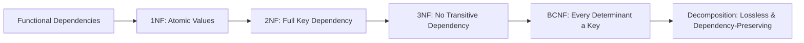

# Chapter 7: Normalization in Database Management Systems

> **Previous:** [Chapter 6: Advanced SQL](./06-sql-advanced.md) | **Next:** [Chapter 8: Higher Normal Forms and Denormalization](./08-higher-nf.md)

## Learning Objectives

By the end of this chapter you will be able to:
- Identify and eliminate data redundancy and anomalies (insertion, update, deletion)
- Define functional dependencies and compute attribute closures step-by-step
- Find candidate keys from functional dependencies using closure algorithm
- Decompose relations to 1NF, 2NF, 3NF, and BCNF with full traceability
- Apply Armstrong's axioms to derive implied functional dependencies
- Understand lossless join decomposition and dependency preservation
- Determine when normalization has gone far enough and when denormalization is justified
- Implement normalization algorithms in C++ and Python
- Handle edge cases: trivial FDs, redundant FDs, circular dependencies, multi-valued dependencies

## Chapter at a Glance

| Topic | Key Insight | Practical Takeaway |
|-------|-------------|-------------------|
| **Functional Dependencies** | X -> Y means X determines Y — the foundation of all normalization | Find all FDs first; normalization follows automatically |
| **1NF** | Atomic columns, no repeating groups | Every cell holds one value; every row is unique |
| **2NF** | No partial dependency on a composite key | Every non-key attribute depends on the whole key |
| **3NF** | No transitive dependency on non-key attributes | Every non-key attribute depends on nothing but the key |
| **BCNF** | Every determinant must be a candidate key | BCNF removes remaining anomalies but may lose dependency preservation |
| **Lossless Decomposition** | Joining decomposed tables recovers original rows | Common attribute must be a key in at least one component |
| **Dependency Preservation** | All FDs enforceable without joins | Each FD's attributes must appear together in some component |

## Chapter Roadmap



## Theory

> **One-Sentence Takeaway:** Normalization systematically removes data redundancy by decomposing tables through 1NF -> 2NF -> 3NF -> BCNF — think of it as "each column depends on the key, the whole key, and nothing but the key."


### 7.1 The Problem: Anomalies in Unnormalized Data


#### Real-World Analogy: The Address Book

Imagine a single paper address book where you write a person's name, phone number, and every address they have ever lived at in one row. If they move, you must erase and rewrite. If you tear out the last row for a friend who moved away, you lose their name and phone number too. If you want to add a new address for someone who isn't yet in the book, you cannot — each row needs a name. This is exactly the problem unnormalized databases face.

Now imagine separate pages: one for people (name, phone), one for addresses (person_id, address, move-in-date). When someone moves, you add one row to the addresses page. When they leave, you keep their name. No rewriting, no lost data. This is normalization.

#### Formal Definition

Consider a poorly designed table for a university database:

```
STUDENT_COURSE(student_id, student_name, course_id, course_name, instructor, grade, instructor_office)
```

This single table stores all information about students, courses, instructors, and grades in one place. It suffers from four interrelated problems:

#### Anomalies Comparison Table

| Anomaly Type | Definition | Example in STUDENT_COURSE | Consequence |
|-------------|-----------|--------------------------|-------------|
| **Insertion Anomaly** | Cannot insert a fact because the primary key requires another fact that is missing | Adding course CS102 requires a student_id — but no student is enrolled yet | New entities cannot be recorded independently |
| **Deletion Anomaly** | Deleting one fact unintentionally deletes another unrelated fact | Deleting the last enrollment in DBMS removes the course and instructor info permanently | Unintended data loss |
| **Update Anomaly** | Changing a fact requires updating multiple rows; inconsistency if any are missed | Dr. Smith moves to Room 201 — all 50 DBMS rows must be updated | Data inconsistency and maintenance overhead |
| **Redundancy** | The same fact is stored repeatedly across multiple rows | Instructor name and office repeat for every student in each course | Wasted storage + causes update anomaly |

**Insertion Anomaly — Detailed:** We cannot add a new course (CS102, "Data Structures") unless a student enrolls in it. The primary key is (student_id, course_id), so we would need a student_id, which we do not have for a new course. This forces a dummy or null student_id, violating entity integrity.

**Update Anomaly — Detailed:** If "Dr. Smith" (instructor for "DBMS") moves to office "Room 201," we must update every row where Dr. Smith teaches. If there are 50 students in DBMS, we must update 50 rows. A single missed update creates inconsistency — some rows say Room 101, others say Room 201. How do we know which is correct?

**Deletion Anomaly — Detailed:** If the last student drops "DBMS" and we delete their enrollment row, we lose the information that "DBMS" is taught by "Dr. Smith" in "Room 101." The course and instructor information is gone forever — collateral damage from removing a student enrollment.

**Redundancy — Quantified:** The instructor name and office are repeated for every student in each course. With 50 students per course and 100 courses, instructor info appears 5000 times when it should appear 100 times. This wastes space, slows queries, and causes the update anomaly.

**Normalization** is a systematic, theory-backed process of decomposing tables to eliminate these anomalies while preserving all information. It is not optional — it is a foundational discipline of relational database design.

### 7.2 Functional Dependencies


#### Real-World Analogy: Recipe Ingredients

Think of a recipe: `dish_name -> ingredients, cooking_time, difficulty`. If you know the dish name, you uniquely know the ingredients and cooking time. This is a functional dependency (FD) — the dish name *functionally determines* the ingredients.

Now suppose two different recipes produce the same dish (e.g., two ways to make pasta carbonara). Then `dish_name -> ingredients` is FALSE — the same dish name gives different ingredients. FDs are constraints that must hold for *every possible* instance of the relation, not just the current data.

Another analogy: Social Security Number -> Person Name. In a correctly maintained database, knowing the SSN uniquely identifies the person. But `person_name -> SSN` would NOT hold because multiple people can share the same name.

#### Formal Definition

A **functional dependency** (FD) is a constraint between two sets of attributes. We write X -> Y (read "X determines Y") meaning that if two tuples have the same value for X, they must have the same value for Y.

**Formally:** A functional dependency X -> Y holds in relation R if, for any two tuples t1 and t2 in R:
`t1[X] = t2[X] => t1[Y] = t2[Y]`

If this condition fails for any two tuples, the FD does NOT hold.

**Example:** In STUDENT(student_id, name, address, major):
- `student_id -> name` (each student ID has exactly one name)
- `student_id -> address` (each student ID has exactly one address)
- `student_id -> major` (each student ID has exactly one major)
- But `major -> student_id` does NOT hold (multiple students can have the same major)

#### Trivial vs Non-Trivial FDs

| Type | Definition | Example |
|------|-----------|---------|
| **Trivial** | Right side is a subset of the left side | `{A, B} -> A`, `X -> X` |
| **Non-Trivial** | Right side has at least one attribute not in left side | `student_id -> name` |
| **Completely Non-Trivial** | Right side and left side share no attributes | `A -> B` (if A and B are disjoint) |

**Trivial Functional Dependencies — Details:**
- `student_id -> student_id` (trivial — always true)
- `student_id, name -> student_id` (trivial — right side subset of left)
- `student_id -> name` (non-trivial)
- `student_id -> student_id, name` (trivial even though it includes name? Actually `student_id, name` is not a subset of `{student_id}`, so NO — this is non-trivial because `name` is not in `{student_id}`. But `{student_id, name} -> {student_id}` IS trivial.)

**Edge Case — Trivial FDs in Closure:** When computing closure, trivial FDs are always true but never add new attributes. They are noise in the computation — we skip them because they contribute nothing.

#### Types of Functional Dependencies

| Type | Definition | Example |
|------|-----------|---------|
| **Full FD** | X -> Y and removing any attribute from X breaks the dependency | (student_id, course_id) -> grade (need BOTH) |
| **Partial FD** | X -> Y where a proper subset of X also determines Y | (student_id, course_id) -> student_name (student_id alone determines name) |
| **Transitive FD** | X -> Y and Y -> Z, giving X -> Z indirectly | employee_id -> department_id -> department_location |
| **Trivial FD** | Y is a subset of X | {A, B} -> A |

### 7.3 Armstrong's Axioms (FD Inference Rules)


#### FD Inference Rules Table

Armstrong's axioms are a complete and sound set of inference rules for deriving all implied functional dependencies from a given set. "Sound" means they only generate valid FDs. "Complete" means they can generate ALL valid FDs.

| Rule | Name | Formal Statement | Example | Explanation |
|------|------|-----------------|---------|-------------|
| 1 | **Reflexivity** | If Y subset of X, then X -> Y | {A, B} -> A | Subset determines itself — obvious but formally necessary |
| 2 | **Augmentation** | If X -> Y, then XZ -> YZ | If A -> B, then AC -> BC | Adding the same attributes to both sides preserves dependency |
| 3 | **Transitivity** | If X -> Y and Y -> Z, then X -> Z | If A -> B and B -> C, then A -> C | FDs chain together |

#### Derived Rules from Armstrong's Axioms

| Rule | Derivation | Formal Statement | Example |
|------|-----------|-----------------|---------|
| 4 | **Union** | From 2 + 3 | If X -> Y and X -> Z, then X -> YZ | A -> B and A -> C => A -> BC |
| 5 | **Decomposition** | From 1 + 3 | If X -> YZ, then X -> Y and X -> Z | A -> BC => A -> B and A -> C |
| 6 | **Pseudo-transitivity** | From 3 | If X -> Y and YZ -> W, then XZ -> W | A -> B and BC -> D => AC -> D |

#### Step-by-Step Proof of Derived Rules

**Proof of Union Rule (if X -> Y and X -> Z, then X -> YZ):**
1. Given: X -> Y
2. Given: X -> Z
3. Augment X -> Y with X: X -> XY (using augmentation: if X -> Y then XX -> XY, i.e., X -> XY)
4. Augment X -> Z with Y: XY -> YZ (using augmentation: if X -> Z then XY -> YZ)
5. Apply transitivity to 3 and 4: X -> XY and XY -> YZ => X -> YZ

**Proof of Decomposition Rule (if X -> YZ, then X -> Y and X -> Z):**
1. Given: X -> YZ
2. Reflexivity: YZ -> Y (Y subset of YZ)
3. Transitivity: X -> YZ and YZ -> Y => X -> Y
4. Similarly: YZ -> Z (reflexivity)
5. Transitivity: X -> YZ and YZ -> Z => X -> Z

#### Edge Cases in Armstrong's Axioms

**Redundant FDs:** An FD is redundant if it can be derived from the other FDs. For example, given {A -> B, B -> C, A -> C}, the FD A -> C is redundant because it follows from A -> B and B -> C via transitivity.

**Circular Dependencies:** FDs like {A -> B, B -> C, C -> A} create a cycle. In this case, A, B, and C are all candidate keys — each determines all others through the chain.

**Empty Left Side:** Is {} -> Y valid? This means "every tuple has the same Y value" — a constant constraint. For example, {} -> gender would mean all employees have the same gender. This is rare but valid.

#### Complexity Analysis of Armstrong's Axioms Application

| Operation | Time Complexity | Space Complexity | Why |
|-----------|----------------|-----------------|-----|
| Applying reflexivity | O(1) per attribute | O(n) | Simple subset check |
| Applying augmentation | O(n) per FD | O(n) | Adding attributes to both sides |
| Applying transitivity | O(|F|^2) worst case | O(|F|) | Must scan all FDs for each FD |
| Computing full closure F+ | O(|F| * n) per iteration | O(|F|) | Each iteration may add attributes |

#### Advantages and Disadvantages of Armstrong's Axioms

| Aspect | Description |
|--------|-------------|
| **Advantage: Soundness** | Every derived FD is guaranteed to hold — no false positives |
| **Advantage: Completeness** | All implied FDs can be derived — no false negatives |
| **Advantage: Simplicity** | Only 3 rules to remember — easy to apply manually |
| **Disadvantage: No Direction** | Axioms do not tell you WHICH FDs to apply or in what order |
| **Disadvantage: Termination** | Manual application can be tedious for large FD sets |
| **Disadvantage: Redundancy** | Derived set F+ can be exponentially larger than original F |

### 7.4 Attribute Closure


#### Real-World Analogy: Finding Connections

Attribute closure is like finding all people you can reach in a social network starting from a given person. Starting with X, you follow every "X determines Y" edge to reach new people (attributes). Then from those new people, you follow more edges. You stop when no new people can be reached.

#### Formal Definition

The **closure** of a set of attributes X under a set of FDs F (denoted X+) is the set of all attributes that are functionally determined by X. Finding X+ is the fundamental operation for:
- Determining if X is a superkey (X+ contains all attributes)
- Finding candidate keys
- Checking if an FD X -> Y holds (Y is subset of X+)
- Normalization

#### Closure Algorithm — Step-by-Step

**Algorithm:** ComputeXPlus(X, F)

| Step | Action | Description |
|------|--------|-------------|
| 1 | closure = X | Initialize with the starting attributes |
| 2 | For each FD Y -> Z in F: | Scan all FDs |
| 3 | If Y is subset of closure: | Check if left side is already known |
| 4 | closure = closure union Z | Add right side attributes |
| 5 | Repeat steps 2-4 | Keep scanning until no changes |
| 6 | Return closure | Final set of determined attributes |

#### Pseudocode

```
FUNCTION ComputeClosure(X, F):
    closure = X
    WHILE (closure changes):
        FOR each FD (Y -> Z) in F:
            IF Y is subset of closure:
                closure = closure UNION Z
    RETURN closure
```

#### Detailed Trace Table — Example 1

**Given:** R(A, B, C, D, E) and FDs: {A -> BC, CD -> E, B -> D, E -> A}

**Compute A+:**

| Iteration | closure (before) | FD Checked | Y subset of closure? | Attributes Added | closure (after) |
|-----------|-----------------|------------|---------------------|-----------------|-----------------|
| 1 | {A} | A -> BC | Y={A} subset of {A}: YES | B, C | {A, B, C} |
| 1 | {A, B, C} | CD -> E | Y={C,D} subset of {A,B,C}: NO (D missing) | — | {A, B, C} |
| 1 | {A, B, C} | B -> D | Y={B} subset of {A,B,C}: YES | D | {A, B, C, D} |
| 1 | {A, B, C, D} | E -> A | Y={E} subset of {A,B,C,D}: NO | — | {A, B, C, D} |
| 2 | {A, B, C, D} | A -> BC | YES — already in closure | — | {A, B, C, D} |
| 2 | {A, B, C, D} | CD -> E | Y={C,D} subset of {A,B,C,D}: YES | E | {A, B, C, D, E} |
| 2 | {A, B, C, D, E} | B -> D | YES — already in closure | — | {A, B, C, D, E} |
| 2 | {A, B, C, D, E} | E -> A | YES — already in closure | — | {A, B, C, D, E} |
| 3 | {A, B, C, D, E} | (all) | No new FDs apply | — | {A, B, C, D, E} |

**Result: A+ = {A, B, C, D, E}** (all attributes — A is a superkey)

**Compute B+:**

| Iteration | closure (before) | FD Checked | Y subset of closure? | Attributes Added | closure (after) |
|-----------|-----------------|------------|---------------------|-----------------|-----------------|
| 1 | {B} | A -> BC | Y={A} subset of {B}: NO | — | {B} |
| 1 | {B} | CD -> E | Y={C,D} subset of {B}: NO | — | {B} |
| 1 | {B} | B -> D | Y={B} subset of {B}: YES | D | {B, D} |
| 1 | {B, D} | E -> A | Y={E} subset of {B,D}: NO | — | {B, D} |
| 2 | {B, D} | (all) | No new FDs apply | — | {B, D} |

**Result: B+ = {B, D}** (not a superkey)

#### Detailed Trace Table — Example 2

**Given:** R(A, B, C, D, E, F) and FDs: {AB -> C, C -> D, D -> E, B -> F, E -> A}

**Compute AB+:**

| Iteration | closure (before) | FD Checked | Y subset of closure? | Added | closure (after) |
|-----------|-----------------|------------|---------------------|-------|-----------------|
| 1 | {A, B} | AB -> C | Y={A,B} subset of {A,B}: YES | C | {A, B, C} |
| 1 | {A, B, C} | C -> D | Y={C} subset of {A,B,C}: YES | D | {A, B, C, D} |
| 1 | {A, B, C, D} | D -> E | Y={D} subset: YES | E | {A, B, C, D, E} |
| 1 | {A, B, C, D, E} | B -> F | Y={B} subset: YES | F | {A, B, C, D, E, F} |
| 1 | {A,B,C,D,E,F} | E -> A | YES — A already in closure | — | {A,B,C,D,E,F} |
| 2 | {A,B,C,D,E,F} | (all) | No new attributes | — | {A,B,C,D,E,F} |

**Result: AB+ = {A, B, C, D, E, F}** (AB is a superkey, actually a candidate key)

#### Complexity Analysis of Attribute Closure

| Aspect | Complexity | Why |
|--------|-----------|-----|
| **Worst-case time** | O(|F| * n) per iteration, O(|F| * n^2) total | Each FD is checked against closure of size up to n; at most n iterations |
| **Best-case time** | O(|F|) | First pass finds all attributes |
| **Space complexity** | O(n) | Need to store closure set of at most n attributes |
| **Number of iterations** | At most n | Each iteration adds at least one attribute (or stops) |

**Why O(|F| * n^2)?** In the worst case, each iteration adds exactly one attribute, requiring n iterations. Each iteration scans all |F| FDs, and checking subset takes O(n). So total is O(|F| * n^2).

#### Advantages and Disadvantages of Attribute Closure

| Aspect | Description |
|--------|-------------|
| **A: Algorithmic** | Simple iterative algorithm — always terminates |
| **A: Deterministic** | Same input always produces same output |
| **A: Foundational** | Used for key finding, FD checking, normalization |
| **D: Redundancy in F** | Redundant FDs cause unnecessary iterations |
| **D: No optimization** | The naive algorithm checks ALL FDs every iteration |
| **D: Subset check cost** | Checking Y subset of closure takes O(n) per FD |

#### Edge Cases in Attribute Closure

**Empty Attribute Set:** Computing {} closure — start with empty set. Only FDs with empty left side (constant constraints) will add attributes. Result is typically {} unless there are constant constraints.

**Trivial FDs in Computation:** FDs like A -> A never change the closure but waste an iteration. In practice, skip trivial FDs.

**Redundant FDs:** Given F = {A -> B, B -> C, A -> C}, the FD A -> C is redundant. Computing A+ with {A -> B, B -> C} still gives {A, B, C}, so A -> C is never needed for closure computation.

**Circular Dependencies:** F = {A -> B, B -> C, C -> A}. Compute A+: A -> B adds B; B -> C adds C; C -> A adds nothing new. A+ = {A, B, C}. All three are candidate keys.

### 7.5 Finding Candidate Keys from Functional Dependencies


#### Real-World Analogy: Minimal ID Card

A candidate key is like the minimal set of ID documents you need to uniquely identify a person. If a passport alone works, you do not need passport + driver's license. If neither passport nor license alone works (some people have neither), you might need name + birthdate + address. The candidate key is the minimal "sufficient identifier."

#### Systematic Method for Finding Candidate Keys

**Step 1:** Classify all attributes into four categories:

| Category | Definition | Action |
|----------|-----------|--------|
| **LH (Left-only)** | Appears only on left side of FDs | Must be in every candidate key |
| **RH (Right-only)** | Appears only on right side of FDs | Never in any candidate key |
| **LR (Both sides)** | Appears on both left and right | May or may not be in candidate keys |
| **N (Neither)** | Never appears in any FD | Must be in every candidate key |

**Step 2:** Start with the mandatory attributes (LH + N). Compute their closure.

**Step 3:** If the closure contains all attributes, this is a candidate key. Done.

**Step 4:** If not, add attributes from LR one at a time, then combinations, computing closure each time.

**Step 5:** A candidate key is minimal — remove any attribute that is not essential.

#### Pseudocode for Finding All Candidate Keys

```
FUNCTION FindCandidateKeys(R, F):
    attrs = set of all attributes in R
    LH = attributes only on left side of FDs in F
    RH = attributes only on right side of FDs in F
    LR = attributes on both sides
    N = attrs - (LH union RH union LR)
    
    mandatory = LH union N
    optional = LR
    
    keys = empty set
    closure = ComputeClosure(mandatory, F)
    IF closure == attrs:
        keys.add(mandatory)
        RETURN keys
    
    FOR each subset S of optional (size 1 to |optional|):
        test = mandatory union S
        IF no proper subset of test is already a key:
            closure = ComputeClosure(test, F)
            IF closure == attrs:
                keys.add(test)
                Remove supersets of test from keys
    
    RETURN keys
```

#### Detailed Dry Run — Finding Candidate Keys

**Given:** R(A, B, C, D, E, F) with FDs: {A -> B, C -> D, D -> E, B -> F}

| Step | Attribute | Classification | Reason |
|------|-----------|---------------|--------|
| 1 | A | LR | A -> B (left) but no FD has A on right |
| 1 | B | LR | A -> B (right), B -> F (left) |
| 1 | C | LH | C -> D (left only) — never on right |
| 1 | D | LR | C -> D (right), D -> E (left) |
| 1 | E | RH | D -> E (right only) |
| 1 | F | RH | B -> F (right only) |

LH = {C}, RH = {E, F}, LR = {A, B, D}, N = {}

**Step 2:** mandatory = LH union N = {C}
Compute closure(C+) with F:
- Start: {C}
- C -> D: add D => {C, D}
- D -> E: add E => {C, D, E}
- No more FDs apply
- C+ = {C, D, E} (does NOT contain A, B, F)

**Step 3:** Try adding one attribute from LR = {A, B, D}:
- Try C + A = {A, C}: A+ from A -> B adds B; B -> F adds F. Already have C, D, E. => {A, B, C, D, E, F} = ALL. So {A, C} is a candidate key!
- Try C + B = {B, C}: B -> F adds F. C -> D adds D. D -> E adds E. => {B, C, D, E, F}. Missing A. Not a key.
- Try C + D = {C, D}: C -> D (already). D -> E adds E => {C, D, E}. Missing A, B, F. Not a key.

**Step 4:** Check minimality of {A, C}:
- Remove A: {C}+ = {C, D, E} — not a key. A is needed.
- Remove C: {A}+ = {A, B, F} — not a key. C is needed.
- {A, C} is minimal and complete. Candidate keys: {A, C}

#### Complexity Analysis of Candidate Key Finding

| Aspect | Complexity | Why |
|--------|-----------|-----|
| **Worst case** | O(2^|LR| * |F| * n) | Must test all subsets of LR attributes |
| **Best case** | O(|F| * n) | Mandatory attributes already form a superkey |
| **Number of keys** | Up to C(n, floor(n/2)) | Theoretically exponential in worst case |
| **Practical limit** | |F| < 100, n &lt; 30 | Beyond this, heuristic methods are used |

**Why exponential?** LR attributes create a subset enumeration problem. In the worst case (e.g., F = {A -> B, B -> C, ..., Y -> Z}), every attribute is in LR and the number of candidate keys is exponential. In practice, real schemas have small LR sets.

#### Advantages and Disadvantages

| Aspect | Description |
|--------|-------------|
| **A: Systematic** | Complete enumeration guarantees finding all keys |
| **A: Minimality check** | Built-in elimination of non-minimal keys |
| **D: Exponential** | Worst-case subset enumeration is expensive |
| **D: Complex implementation** | Managing superset elimination is tricky |

### 7.6 First Normal Form (1NF)


#### Real-World Analogy: One Fact Per Cell

Think of a spreadsheet where a cell should contain exactly one value. If a "courses" column contains "CS101, CS102, CS201" as a comma-separated string, you cannot sort by course, join on course, or efficiently search for a course. 1NF says: one value per cell, period.

#### Formal Definition

A relation is in 1NF if:
1. Every attribute value is atomic (indivisible)
2. No repeating groups or arrays
3. Every row is unique (there is a primary key)

#### Step-by-Step Process to Achieve 1NF

| Step | Action | Example |
|------|--------|---------|
| 1 | Identify non-atomic attributes | courses = {CS101, CS102, CS201} |
| 2 | Choose strategy | Flatten OR create separate table |
| 3a | Flatten: create one row per value | One row per student per course |
| 3b | Separate table: move repeating attribute | STUDENT(id, name), ENROLLMENT(id, course) |

#### Problem (not in 1NF):

```
STUDENT(id, name, courses)
1 | Alice | {CS101, CS102, CS201}
2 | Bob   | {CS101}
```

#### Fix: Two strategies

```sql
-- Strategy A: Flatten (simple, introduces redundancy)
CREATE TABLE student_course (
    id INTEGER,
    name VARCHAR(100),
    course_code VARCHAR(10),
    PRIMARY KEY (id, course_code)
);
-- 1 | Alice | CS101
-- 1 | Alice | CS102  (Alice's name repeats!)

-- Strategy B: Separate tables (better, avoids redundancy)
CREATE TABLE student (
    id INTEGER PRIMARY KEY,
    name VARCHAR(100)
);

CREATE TABLE enrollment (
    student_id INTEGER,
    course_code VARCHAR(10),
    PRIMARY KEY (student_id, course_code),
    FOREIGN KEY (student_id) REFERENCES student(id)
);
```

**Note:** The flattened version has redundancy (Alice's name repeats) but is in 1NF. Higher normal forms address this redundancy. Strategy B is preferred because it already anticipates 2NF.

#### Dry Run: Converting to 1NF

**Before (not in 1NF):**
| student_id | name | courses |
|-----------|------|---------|
| 1 | Alice | {CS101, CS102} |
| 2 | Bob | {CS101} |

**Step 1:** Identify non-atomic attribute: courses (a set, not atomic)

**Step 2:** Apply flattening:

| student_id | name | course_code |
|-----------|------|-------------|
| 1 | Alice | CS101 |
| 1 | Alice | CS102 |
| 2 | Bob | CS101 |

**Step 3:** Primary key = (student_id, course_code). Now in 1NF.

#### Complexity Analysis of 1NF

| Aspect | Complexity | Why |
|--------|-----------|-----|
| **Time to flatten** | O(k * n) where k = max repeating group size | Each non-atomic value produces k rows |
| **Result size** | Sum of all repeating group sizes | Could be much larger than original |
| **Space overhead** | O(m * d) where m = rows, d = duplicated attributes | Name repeats across rows |

#### Advantages and Disadvantages of 1NF

| Aspect | Description |
|--------|-------------|
| **A: Foundation** | Enables relational operations (join, project, select) |
| **A: Simplicity** | Clear, unambiguous rule: one value per cell |
| **D: Redundancy** | Flattening introduces data repetition |
| **D: Composite PK** | Creates composite primary keys (introduces partial dependencies) |

#### Edge Cases in 1NF

**Multi-valued Attributes:** An employee may have multiple phone numbers. Option A: flatten (one row per phone). Option B: separate PHONE table. Both satisfy 1NF but option B is better for 2NF.

**Composite Attributes:** An "address" attribute containing street, city, zip as a structured type. Is this atomic? In SQL, a structured type like `address(street, city, zip)` might be considered atomic for the DB, but not for normalization purposes.

**NULL Values:** NULL is atomic (it is a single value). A column allowing NULL does not violate 1NF.

**Large Objects (BLOB/CLOB):** These are stored as single values (the handle is atomic), so they satisfy 1NF. The DBMS stores the content externally, but the column value itself is a single reference.


### 7.7 Second Normal Form (2NF)


#### Real-World Analogy: Library Catalog

Imagine a library catalog that stores (shelf_id, book_title, author_name, section_name). The shelf_id + book_title tells you the exact spot. But author_name depends only on book_title — it repeats on every shelf where that book sits. 2NF says: if your key is composite (shelf_id + book_title), every non-key column must depend on the WHOLE key, not just part of it. Author_name depends on book_title alone — that is a partial dependency. Move it out.

#### Formal Definition

A relation is in 2NF if:
1. It is in 1NF
2. Every non-key attribute is **fully functionally dependent** on the entire primary key (no partial dependencies)

**Partial dependency:** A non-key attribute depends on only part of a composite primary key. This occurs ONLY when the primary key is composite (at least 2 attributes).

#### Step-by-Step Process to Achieve 2NF

| Step | Action | Example |
|------|--------|---------|
| 1 | Ensure the relation is in 1NF | All values atomic |
| 2 | Identify the primary key (composite) | (student_id, course_id) |
| 3 | Find all non-key attributes | student_name, grade, course_name |
| 4 | For each non-key attribute, check if it depends on the WHOLE key or PART of it | student_name depends on student_id alone (partial) |
| 5 | Remove partial dependencies: create separate tables for each partial dependency | STUDENT(student_id, student_name), COURSE(course_id, course_name) |
| 6 | Keep only full dependencies in the original table | ENROLLMENT(student_id, course_id, grade) |

#### Pseudocode for 2NF Check and Decomposition

```
FUNCTION Check2NF(R, key, F):
    IF R is NOT in 1NF: return False
    
    FOR each non-key attribute A in R:
        FOR each proper subset K' of key:
            IF K' -> A holds (A in ComputeClosure(K', F)):
                RETURN False  // partial dependency found
    RETURN True

FUNCTION DecomposeTo2NF(R, key, F):
    result = {R}
    FOR each non-key attribute A in R:
        FOR each proper subset K' of key:
            IF K' -> A holds:
                // Create new table for K' union A
                R_new = (K' union A) with key = K'
                result.add(R_new)
                // Remove A from original
                R = R - {A}
    result.replace(R_original with R_minus_partials)
    RETURN result
```

#### Detailed Example

**Given:** R(student_id, course_id, student_name, grade, course_name)

**Primary key:** (student_id, course_id)

**FDs identified:**
- `student_id -> student_name` (partial dependency — depends on part of PK)
- `course_id -> course_name` (partial dependency)
- `student_id, course_id -> grade` (full dependency — depends on whole PK)

**Checking 2NF:**

| Non-key Attribute | Depends on Which Key Part? | Partial? | Verdict |
|------------------|---------------------------|----------|---------|
| student_name | student_id (proper subset) | YES — violates 2NF | Must remove |
| grade | (student_id, course_id) — whole key | NO — full dependency | Keep |
| course_name | course_id (proper subset) | YES — violates 2NF | Must remove |

**Decomposition:**

R1(student_id, student_name, address, major) — PK: student_id
R2(course_id, course_name, credits) — PK: course_id
R3(student_id, course_id, grade) — PK: (student_id, course_id)

#### Dry Run Trace — Complete 2NF Decomposition

**Initial data:**

| student_id | course_id | student_name | grade | course_name |
|-----------|-----------|-------------|-------|-------------|
| S1 | C101 | Alice | A | DBMS |
| S1 | C102 | Alice | B | OS |
| S2 | C101 | Bob | C | DBMS |

**Partial dependencies:**
- student_id -> student_name: Alice repeats for S1 twice → update anomaly if she changes name
- course_id -> course_name: DBMS repeats twice → update anomaly if course name changes

**After decomposition into 2NF:**

R1: STUDENT
| student_id | student_name |
|-----------|-------------|
| S1 | Alice |
| S2 | Bob |

R2: COURSE
| course_id | course_name |
|----------|-------------|
| C101 | DBMS |
| C102 | OS |

R3: ENROLLMENT
| student_id | course_id | grade |
|-----------|----------|-------|
| S1 | C101 | A |
| S1 | C102 | B |
| S2 | C101 | C |

**Anomalies resolved:** Alice's name is stored once. DBMS is stored once. No update anomalies for name changes.

#### Complexity Analysis of 2NF

| Aspect | Complexity | Why |
|--------|-----------|-----|
| **Checking 2NF** | O(k * |F| * n) where k = number of proper subsets of key | Each proper subset closure must be computed |
| **Number of subsets** | 2^m - 2 where m = key size | Exponential in key size, but keys are typically small (2-3 attributes) |
| **Decomposition** | O(k * n) | Removing partial dependencies is linear in attributes |

#### Advantages and Disadvantages of 2NF

| Aspect | Description |
|--------|-------------|
| **A: Eliminates partial redundancy** | No more repeating student names in enrollment rows |
| **A: Practical** | Most important for junction tables (M:N relationships) |
| **D: Only applies to composite keys** | Relations with single-attribute PK are automatically in 2NF |
| **D: Does not address transitive dependencies** | Must normalize further to 3NF |

#### Edge Cases in 2NF

**Single-Attribute Primary Key:** If the primary key is a single attribute, there can be NO partial dependencies (a single attribute has no proper subsets). The relation is automatically in 2NF if it is in 1NF.

**Multiple Candidate Keys:** If there are multiple candidate keys (some single, some composite), check partial dependencies against ALL candidate keys, not just the chosen primary key.

**All-Key Relation:** If ALL attributes form the key (no non-key attributes), the relation is automatically in 2NF, 3NF, and BCNF because there are no non-key attributes to have partial dependencies.

### 7.8 Third Normal Form (3NF)


#### Real-World Analogy: The Department Office

An employee record stores (emp_id, dept_id, dept_location). The emp_id tells you dept_id. The dept_id tells you dept_location. So emp_id indirectly tells you dept_location — through dept_id. The problem: if the department moves to a new location, you must update every employee row. 3NF says: a non-key column must not determine another non-key column. Break this into (emp_id, dept_id) and (dept_id, dept_location).

#### Formal Definition

A relation is in 3NF if:
1. It is in 2NF
2. No non-key attribute is **transitively dependent** on the primary key (no transitive dependencies)

**Transitive dependency:** For attributes X, Y, Z: if X -> Y and Y -> Z, then X -> Z is a transitive dependency. This violates 3NF if:
- Y is not a candidate key (or part of a candidate key)
- Z is a non-key attribute

**Relaxed 3NF condition:** A relation is in 3NF if for every non-trivial FD X -> A:
- X is a superkey, OR
- A is part of some candidate key (prime attribute)

This relaxed condition is what makes 3NF achievable while BCNF may not be.

#### Step-by-Step Process to Achieve 3NF

| Step | Action | Example |
|------|--------|---------|
| 1 | Ensure the relation is in 2NF | Already decomposed |
| 2 | Identify all FDs between non-key attributes | customer_id -> customer_name |
| 3 | For each such FD X -> Y: check if X is a candidate key | Is customer_id a key? NO |
| 4 | If not, this is a transitive dependency: PK -> X -> Y | order_id -> customer_id -> customer_name |
| 5 | Decompose: create separate table for (X, Y) | CUSTOMER(customer_id, customer_name) |
| 6 | Remove Y from the original table | Remove customer_name from ORDER |

#### Pseudocode for 3NF Synthesis Algorithm

```
FUNCTION Synthesize3NF(R, F):
    // Step 1: Find minimal cover of F
    G = MinimalCover(F)
    
    // Step 2: Create relations for each FD
    schemas = empty set
    FOR each FD X -> Y in G:
        found = False
        FOR each schema S in schemas:
            IF X union Y is subset of S:
                found = True
                BREAK
        IF not found:
            schemas.add(X union Y)
    
    // Step 3: Ensure at least one schema contains a candidate key
    keys = FindCandidateKeys(R, F)
    has_key = False
    FOR each schema S in schemas:
        FOR each key K in keys:
            IF K is subset of S:
                has_key = True
                BREAK
    
    IF not has_key:
        schemas.add(K)  // Add a candidate key as a relation
    
    // Step 4: Remove redundant schemas
    Remove subsets from schemas
    
    RETURN schemas
```

#### Detailed Dry Run — 3NF Decomposition

**Given:** R(order_id, order_date, customer_id, customer_name)

**FDs:** {order_id -> order_date, customer_id; customer_id -> customer_name}

**Step 1: Check 2NF.** Single-attribute PK (order_id), so automatically in 2NF.

**Step 2: Identify transitive dependency.**
- order_id -> customer_id (from FDs)
- customer_id -> customer_name (from FDs)
- Therefore order_id -> customer_name transitively (order_id -> customer_id -> customer_name)
- customer_id is NOT a candidate key
- customer_name is a non-key attribute
- This violates 3NF

**Decomposition:**
R1(order_id, order_date, customer_id) — PK: order_id
R2(customer_id, customer_name) — PK: customer_id

#### Full Walkthrough: ORDER_DETAIL Normalization

**Schema:** ORDER_DETAIL(order_id, order_date, customer_id, customer_name, product_id, product_name, quantity, price)

**Step 1: Identify FDs**
- order_id -> order_date, customer_id, customer_name
- customer_id -> customer_name
- product_id -> product_name
- order_id, product_id -> quantity, price

**Step 2: Find candidate key**
Candidate key: (order_id, product_id)
Proof: (order_id, product_id)+ = {order_id, order_date, customer_id, customer_name, product_id, product_name, quantity, price}

**Step 3: Check 1NF — PASS (all values atomic)**

**Step 4: Check 2NF (partial dependencies)**

| FD | Is it Partial? | Why |
|---|---------------|-----|
| order_id -> order_date | YES | Depends on part of PK (order_id only) |
| order_id -> customer_id | YES | Depends on part of PK |
| order_id -> customer_name | YES | Depends on part of PK |
| product_id -> product_name | YES | Depends on part of PK |
| (order_id, product_id) -> quantity | NO | Full dependency on whole PK |
| (order_id, product_id) -> price | NO | Full dependency on whole PK |

**Decompose to 2NF:**

```sql
-- R1: ORDER
CREATE TABLE order_header (
    order_id INTEGER PRIMARY KEY,
    order_date DATE NOT NULL,
    customer_id INTEGER NOT NULL,
    customer_name VARCHAR(100) NOT NULL
);

-- R2: PRODUCT
CREATE TABLE product (
    product_id INTEGER PRIMARY KEY,
    product_name VARCHAR(200) NOT NULL
);

-- R3: ORDER_LINE
CREATE TABLE order_line (
    order_id INTEGER,
    product_id INTEGER,
    quantity INTEGER NOT NULL,
    price DECIMAL(10,2) NOT NULL,
    PRIMARY KEY (order_id, product_id)
);
```

**Step 5: Check 3NF (transitive dependencies)**
- In R1 (order_header): customer_id -> customer_name. Since customer_id is NOT a candidate key, this transitive dependency violates 3NF.

**Decompose to 3NF:**

```sql
-- R1: ORDER (now without customer_name)
CREATE TABLE order_header (
    order_id INTEGER PRIMARY KEY,
    order_date DATE NOT NULL,
    customer_id INTEGER NOT NULL
);

-- R1b: CUSTOMER (new)
CREATE TABLE customer (
    customer_id INTEGER PRIMARY KEY,
    customer_name VARCHAR(100) NOT NULL
);

-- R2: PRODUCT (unchanged)
CREATE TABLE product (
    product_id INTEGER PRIMARY KEY,
    product_name VARCHAR(200) NOT NULL
);

-- R3: ORDER_LINE (unchanged)
CREATE TABLE order_line (
    order_id INTEGER,
    product_id INTEGER,
    quantity INTEGER NOT NULL,
    price DECIMAL(10,2) NOT NULL,
    PRIMARY KEY (order_id, product_id)
);
```

**Step 6: Check BCNF**
- product_id -> product_name in PRODUCT: product_id IS the key. OK.
- order_id -> customer_id, order_date in order_header: order_id IS the key. OK.
- customer_id -> customer_name in CUSTOMER: customer_id IS the key. OK.
- This schema is in BCNF.

#### Complexity Analysis of 3NF

| Aspect | Complexity | Why |
|--------|-----------|-----|
| **Minimal cover** | O(|F|^2 * n) | Checking redundancy requires computing closures |
| **Synthesis** | O(|G| * n) where |G| = size of minimal cover | Creating schemas is linear in minimal cover size |
| **Key check** | O(2^|LR| * |F| * n) | Finding candidate keys is worst-case exponential |
| **Overall 3NF synthesis** | O(|F|^2 * n + 2^|LR| * |F| * n) | Dominated by minimal cover and key finding |

#### Advantages and Disadvantages of 3NF

| Aspect | Description |
|--------|-------------|
| **A: Dependency preservation** | 3NF synthesis ALWAYS produces dependency-preserving decomposition |
| **A: Lossless join** | Adding a key relation guarantees lossless join |
| **A: Practical** | 3NF is sufficient for most real-world applications |
| **D: May have redundancy** | Some redundancy remains that BCNF removes |
| **D: Complex algorithm** | Minimal cover computation requires careful implementation |

#### Edge Cases in 3NF

**All-Key Relation:** If every attribute is part of some candidate key (all prime attributes), the relation is automatically in 3NF.

**Multiple Candidate Keys with Overlap:** Consider R(A, B, C) with FDs {AB -> C, C -> B}. Candidate keys: {A, B} and {A, C}. The FD C -> B has left side C (not a superkey), but B is prime (part of candidate key AB). So this is in 3NF but NOT in BCNF.

**Transitive Dependency Through a Key:** If Y is a candidate key, then X -> Y -> Z is NOT a 3NF violation because Y being a key means the transitive dependency is acceptable.

### 7.9 Boyce-Codd Normal Form (BCNF)


#### Real-World Analogy: The One-Subject Teacher Rule

A school has: (student_id, teacher_id, subject). Rules: each teacher teaches one subject (teacher_id -> subject). Each student has one teacher per subject (student_id, subject -> teacher_id). The key is (student_id, subject). But teacher_id -> subject violates BCNF because teacher_id is not a superkey. The fix: (teacher_id, subject) and (student_id, teacher_id). But now (student_id, subject -> teacher_id) is lost — you cannot enforce it without a join.

#### Formal Definition

BCNF is a stronger version of 3NF. A relation is in BCNF if:
1. It is in 3NF
2. For every non-trivial FD X -> Y, X must be a **superkey**

BCNF eliminates all redundancy based on functional dependencies. Some relations in 3NF are not in BCNF.

#### BCNF vs 3NF Comparison Table

| Aspect | 3NF | BCNF |
|--------|-----|------|
| **Condition** | For every FD X -> A: X is superkey OR A is prime | For every FD X -> A: X is superkey |
| **Redundancy** | Some redundancy possible | No redundancy from FDs |
| **Dependency preservation** | ALWAYS guaranteed | May lose dependencies |
| **Lossless join** | Guaranteed (with key relation) | Guaranteed (by construction) |
| **Practicality** | Achievable for all schemas | May be impossible to achieve while preserving FDs |
| **When to use** | Default for most applications | When data integrity is critical and performance allows |
| **Example violation** | C -> B where B is prime | teacher_id -> subject (teacher_id not a key) |

#### Step-by-Step BCNF Decomposition Algorithm

**Algorithm:**

| Step | Action | Description |
|------|--------|-------------|
| 1 | Check if R is in BCNF | For each FD X -> Y, is X a superkey? |
| 2 | Find violating FD | Pick an FD where X is NOT a superkey |
| 3 | Decompose R into R1 and R2 | R1 = (X union Y), R2 = (R - (Y - X)) |
| 4 | Recursively check R1 and R2 | Repeat steps 1-3 until all are BCNF |
| 5 | Done | All relations are in BCNF |

#### Pseudocode for BCNF Decomposition

```
FUNCTION DecomposeBCNF(R, F):
    IF R is in BCNF:
        RETURN {R}
    
    // Find a violating FD
    FOR each FD X -> Y in F:
        IF X is NOT a superkey in R:
            // Decompose
            R1 = (X union Y)
            R2 = (R - (Y - X))  // R minus Y, keep X
            F1 = ProjectFDs(R1, F)
            F2 = ProjectFDs(R2, F)
            result1 = DecomposeBCNF(R1, F1)
            result2 = DecomposeBCNF(R2, F2)
            RETURN result1 union result2
```

#### Detailed Dry Run — BCNF Decomposition

**Given:** R(student_id, course_id, instructor_name)

**FDs:** {course_id -> instructor_name, (student_id, course_id) -> instructor_name}

**Step 1:** Candidate keys: (student_id, course_id)

**Step 2:** Check BCNF:
- course_id -> instructor_name: Is course_id a superkey? NO (course_id+ = {course_id, instructor_name} — does not contain student_id). VIOLATION.

**Step 3:** Decompose using violating FD course_id -> instructor_name:
- R1 = {course_id, instructor_name} — PK: course_id
- R2 = {student_id, course_id} — PK: (student_id, course_id)

**Step 4:** Check R1: FD course_id -> instructor_name. Left side IS the key. BCNF OK.

**Step 5:** Check R2: No non-trivial FDs. BCNF OK.

**Step 6:** Result: R1(course_id, instructor_name), R2(student_id, course_id)

**FD student_id, course_id -> instructor_name is LOST.** Cannot be checked without joining R1 and R2. This is the classic BCNF trade-off.

#### Detailed Example Where 3NF Works But BCNF Does Not

**Given:** R(A, B, C) with FDs {AB -> C, C -> B}

**Candidate keys:** {A, B}, {A, C}

**Is this in 3NF?** Check C -> B:
- Is C a superkey? C+ = {C, B} — does NOT contain A. NO.
- Is B prime? YES (B is in candidate key {A, B}).
- Since B is prime, C -> B satisfies the 3NF relaxation. In 3NF.

**Is this in BCNF?** Check C -> B:
- Is C a superkey? NO (C+ = {C, B}).
- BCNF violation.

**BCNF decomposition:**
Using C -> B: R1(C, B), R2(A, C)
- R1 key: C. FD: C -> B. BCNF OK.
- R2 key: {A, C}. No FDs except trivial. BCNF OK.
- FD AB -> C is LOST.

**Decision:** Keep in 3NF to preserve AB -> C. Accept the minor redundancy.

#### Lossless Join Check for BCNF Decomposition

For decomposition of R into R1(X union Y) and R2(R - (Y - X)):
- Common attributes: X (the left side of the violating FD)
- In R1, X -> Y is known to hold (it is the violating FD)
- Therefore X is a key for R1
- Since the common attribute X is a key in R1, the decomposition is LOSSESS

BCNF decomposition by this method ALWAYS produces lossless joins.

#### Complexity Analysis of BCNF

| Aspect | Complexity | Why |
|--------|-----------|-----|
| **BCNF check** | O(|F| * n * |F|) | Each FD requires superkey check via closure |
| **BCNF decomposition** | O(|F|^2 * n) worst case | Each decomposition may create new FDs to check |
| **Number of relations** | O(|F|) | Each violating FD creates at most one new relation |
| **Termination** | Always terminates | Each decomposition reduces the attribute set |

#### Advantages and Disadvantages of BCNF

| Aspect | Description |
|--------|-------------|
| **A: Complete elimination** | All redundancy from FDs is removed |
| **A: Clean design** | Every determinant is a candidate key |
| **D: May lose FDs** | Some FDs may become unenforceable without joins |
| **D: Complex** | Decomposition may produce many small tables |
| **D: Not always needed** | 3NF is sufficient for most practical cases |

#### Edge Cases in BCNF

**All-Attribute Key:** If every attribute is part of every candidate key (all prime), the relation is automatically in BCNF.

**Multiple Overlapping Candidate Keys:** When candidate keys overlap, the 3NF relaxation may keep a relation in 3NF that is not in BCNF. This is the classic C -> B with prime B case.

**BCNF Not Achievable:** Some relations cannot be decomposed into BCNF without losing FDs. In this case, stop at 3NF.

### 7.10 Lossless Join Decomposition


#### Real-World Analogy: Puzzle Pieces

A lossless decomposition is like cutting a photograph into puzzle pieces — when you put them back together, you get the original photograph, nothing more and nothing less. A lossy decomposition is like shredding — you cannot reconstruct the original.

#### Formal Definition

A decomposition of R into R1 and R2 is **lossless** (or non-additive) if joining R1 and R2 always produces the original R — no spurious tuples, no missing tuples.

**Formally:** For every instance r of R: r = π_R1(r) ⋈ π_R2(r)

#### Lossless vs Lossy Decomposition

| Aspect | Lossless | Lossy |
|--------|----------|-------|
| **Join result** | Exactly the original tuples | More tuples than original (spurious) |
| **Information** | All information preserved | Information lost or created |
| **Test** | Common attribute is a key in at least one component | Common attribute is not a key in either component |
| **Example** | R1(A,B), R2(B,C) where B -> C | R1(emp_id, dept), R2(dept, mgr) where dept -> mgr does NOT hold |
| **Acceptable?** | YES — required | NO — must be avoided |

#### Chase Test for Lossless Decomposition

For decomposition into n relations, use the chase:

| Step | Action |
|------|--------|
| 1 | Create a table with one row per decomposed relation and one column per attribute |
| 2 | Put distinguished symbols (a1, a2, ...) in cells where the relation contains the attribute |
| 3 | Put labeled symbols (b11, b12, ...) elsewhere |
| 4 | Apply FDs: if two rows agree on left side, make their right sides equal |
| 5 | If any row becomes all distinguished symbols, the decomposition is lossless |

#### Detailed Example — Lossless vs Lossy Join

**Lossless example:**
R(employee_id, department, manager) with FD: department -> manager

Decompose to: R1(employee_id, department), R2(department, manager)

| R1 | R2 | R1 ⋈ R2 |
|---|---|---|
| E1, Sales | Sales, Alice | E1, Sales, Alice |
| E2, Eng | Eng, Bob | E2, Eng, Bob |

Join produces exactly the original. Common attribute (department) is a key in R2. LOSSLESS.

**Lossy example:**
R(employee_id, department, manager) with NO departments having multiple managers (assume department -> manager does NOT hold strictly)

Decompose to: R1(employee_id, department), R2(department, manager)

| R1 | R2 | R1 ⋈ R2 (spurious!) |
|---|---|---|
| E1, Sales | Sales, Alice | E1, Sales, Alice |
| E2, Sales | Sales, Bob | E1, Sales, Bob |
| | | E2, Sales, Alice |
| | | E2, Sales, Bob |

The join produces 4 rows instead of 2! This is LOSSY because department is NOT a key in either component.

#### Testing Lossless Decomposition Algorithm

```
FUNCTION IsLossless(R, decomposition, F):
    // For binary decomposition
    IF len(decomposition) == 2:
        R1, R2 = decomposition
        common = R1 intersect R2
        IF common is empty:
            RETURN False
        // Check if common -> R1 or common -> R2
        IF common is a superkey in R1 OR common is a superkey in R2:
            RETURN True
        ELSE:
            RETURN False
    // For n-ary decomposition, use chase
    ELSE:
        RETURN ChaseTest(R, decomposition, F)
```

### 7.11 Dependency Preservation


#### Real-World Analogy: Local Enforcement

Dependency preservation is like traffic laws that can be enforced by local police in each town, versus laws that require a federal investigation spanning multiple states. If you can check each FD within a single table, enforcement is cheap. If an FD spans multiple tables, enforcement requires expensive joins.

#### Formal Definition

A decomposition is **dependency-preserving** if all FDs in the closure F+ can be checked on the decomposed relations individually, WITHOUT joining them.

**Formally:** For decomposition ρ = {R1, R2, ..., Rn} and FD set F:
The projection of F onto Ri is: π_Ri(F) = {X -> Y in F+ | X union Y is subset of Ri}
The decomposition preserves F if (π_R1(F) union π_R2(F) union ... union π_Rn(F))+ = F+

#### Example — Non-Dependency-Preserving Decomposition

R(A, B, C) with FDs: {A -> B, B -> C}

Wrong decomposition: R1(A, B), R2(A, C)
- In R1: check A -> B. OK.
- In R2: only attribute A is common. B -> C CANNOT be checked because B is not in R2.
- B -> C is LOST. This is NOT dependency-preserving.

Correct decomposition: R1(A, B), R2(B, C)
- In R1: check A -> B. OK.
- In R2: check B -> C. OK.
- All FDs preserved. This IS dependency-preserving.

#### Algorithm to Check Dependency Preservation

```
FUNCTION IsDependencyPreserving(R, decomposition, F):
    FOR each FD X -> Y in F:
        closure_X_in_decomp = X
        WHILE closure_X_in_decomp changes:
            FOR each relation Ri in decomposition:
                // Compute (closure_X_in_decomp intersect Ri)+ under F
                // Then intersect with Ri
                t = ComputeClosure(closure_X_in_decomp intersect Ri, F) intersect Ri
                closure_X_in_decomp = closure_X_in_decomp union t
        IF Y is NOT subset of closure_X_in_decomp:
            RETURN False  // FD X -> Y is lost
    RETURN True
```

#### Complexity Analysis of Decomposition Properties

| Property | Test Complexity | Why |
|----------|----------------|-----|
| **Lossless (binary)** | O(|F| * n) | Single closure computation for common attributes |
| **Lossless (chase)** | O(k * |F| * n) where k = number of relations | Table with k rows, each FD application |
| **Dependency preservation** | O(|F| * d * n) where d = number of decomposed relations | Each FD requires iterative closure computation |
| **Both properties** | Guaranteed by 3NF synthesis | The synthesis algorithm produces both |


### 7.12 C++ Implementation — FD Closure Calculator


```cpp
#include <iostream>
#include <vector>
#include <set>
#include <map>
#include <algorithm>
#include <string>
#include <sstream>

using namespace std;

vector<string> split(const string& s, char delim) {
    vector<string> tokens;
    stringstream ss(s);
    string token;
    while (getline(ss, token, delim)) {
        tokens.push_back(token);
    }
    return tokens;
}

string trim(const string& s) {
    int start = 0, end = s.length() - 1;
    while (start <= end && isspace(s[start])) start++;
    while (end >= start && isspace(s[end])) end--;
    return s.substr(start, end - start + 1);
}

set<string> parseAttributes(const string& s) {
    set<string> attrs;
    vector<string> parts = split(s, ',');
    for (string p : parts) {
        string t = trim(p);
        if (!t.empty()) attrs.insert(t);
    }
    return attrs;
}

struct FD {
    set<string> lhs;
    set<string> rhs;
};

bool isSubset(const set<string>& A, const set<string>& B) {
    return includes(B.begin(), B.end(), A.begin(), A.end());
}

string setToString(const set<string>& s) {
    string result;
    for (auto it = s.begin(); it != s.end(); ++it) {
        if (it != s.begin()) result += ", ";
        result += *it;
    }
    return result;
}

set<string> computeClosure(set<string> X, const vector<FD>& F) {
    set<string> closure = X;
    bool changed = true;
    while (changed) {
        changed = false;
        for (const FD& fd : F) {
            if (isSubset(fd.lhs, closure)) {
                for (const string& attr : fd.rhs) {
                    if (closure.find(attr) == closure.end()) {
                        closure.insert(attr);
                        changed = true;
                    }
                }
            }
        }
    }
    return closure;
}

bool isSuperkey(set<string> X, const set<string>& allAttrs, const vector<FD>& F) {
    set<string> closure = computeClosure(X, F);
    return isSubset(allAttrs, closure);
}

vector<set<string>> findCandidateKeys(const set<string>& allAttrs, const vector<FD>& F) {
    set<string> lhsAttrs, rhsAttrs;
    for (const FD& fd : F) {
        lhsAttrs.insert(fd.lhs.begin(), fd.lhs.end());
        rhsAttrs.insert(fd.rhs.begin(), fd.rhs.end());
    }

    set<string> leftOnly, rightOnly, both, neither;
    for (const string& a : allAttrs) {
        bool inL = lhsAttrs.find(a) != lhsAttrs.end();
        bool inR = rhsAttrs.find(a) != rhsAttrs.end();
        if (inL && !inR) leftOnly.insert(a);
        else if (!inL && inR) rightOnly.insert(a);
        else if (inL && inR) both.insert(a);
        else neither.insert(a);
    }

    set<string> mandatory = leftOnly;
    mandatory.insert(neither.begin(), neither.end());

    vector<string> optional(both.begin(), both.end());
    vector<set<string>> keys;

    set<string> closure = computeClosure(mandatory, F);
    if (isSubset(allAttrs, closure)) {
        keys.push_back(mandatory);
        return keys;
    }

    int n = optional.size();
    for (int r = 1; r <= n; r++) {
        vector<bool> bitmask(n, false);
        fill(bitmask.end() - r, bitmask.end(), true);
        do {
            set<string> test = mandatory;
            for (int i = 0; i < n; i++) {
                if (bitmask[i]) test.insert(optional[i]);
            }
            bool isSuperset = false;
            for (const auto& k : keys) {
                if (includes(test.begin(), test.end(), k.begin(), k.end())) {
                    isSuperset = true; break;
                }
            }
            if (isSuperset) continue;
            closure = computeClosure(test, F);
            if (isSubset(allAttrs, closure)) {
                keys.push_back(test);
            }
        } while (next_permutation(bitmask.begin(), bitmask.end()));
    }

    vector<set<string>> minimal;
    for (const auto& k : keys) {
        bool hasSubset = false;
        for (const auto& other : keys) {
            if (&k != &other && isSubset(other, k)) {
                hasSubset = true; break;
            }
        }
        if (!hasSubset) minimal.push_back(k);
    }
    return minimal;
}

int main() {
    set<string> allAttrs = parseAttributes("A, B, C, D, E");
    
    vector<FD> F;
    FD fd1; fd1.lhs = parseAttributes("A"); fd1.rhs = parseAttributes("B, C"); F.push_back(fd1);
    FD fd2; fd2.lhs = parseAttributes("C, D"); fd2.rhs = parseAttributes("E"); F.push_back(fd2);
    FD fd3; fd3.lhs = parseAttributes("B"); fd3.rhs = parseAttributes("D"); F.push_back(fd3);
    FD fd4; fd4.lhs = parseAttributes("E"); fd4.rhs = parseAttributes("A"); F.push_back(fd4);
    
    set<string> A = parseAttributes("A");
    set<string> closureA = computeClosure(A, F);
    cout << "A+ = {" << setToString(closureA) << "}" << endl;
    
    set<string> Bset = parseAttributes("B");
    set<string> closureB = computeClosure(Bset, F);
    cout << "B+ = {" << setToString(closureB) << "}" << endl;
    
    auto keys = findCandidateKeys(allAttrs, F);
    cout << "Candidate keys:" << endl;
    for (const auto& k : keys) {
        cout << "  {" << setToString(k) << "}" << endl;
    }
    
    return 0;
}
```

**Output:**
```
A+ = {A, B, C, D, E}
B+ = {B, D}
Candidate keys:
  {A}
  {E}
```

### 7.13 C++ Implementation — BCNF Decomposition


```cpp
#include <iostream>
#include <vector>
#include <set>
#include <map>
#include <algorithm>
#include <string>
#include <sstream>

using namespace std;

struct Schema {
    set<string> attrs;
    vector<FD> fds;
    string name;
};

vector<FD> projectFDs(const set<string>& allAttrs, const set<string>& subAttrs, 
                       const vector<FD>& F) {
    vector<FD> projected;
    for (const FD& fd : F) {
        set<string> all = fd.lhs;
        all.insert(fd.rhs.begin(), fd.rhs.end());
        if (isSubset(all, subAttrs)) {
            projected.push_back(fd);
        }
    }
    return projected;
}

vector<Schema> bcnfDecompose(Schema R, const set<string>& allAttrs) {
    for (const FD& fd : R.fds) {
        if (fd.lhs == fd.rhs) continue;
        if (!isSuperkey(fd.lhs, R.attrs, R.fds)) {
            Schema R1, R2;
            R1.attrs = fd.lhs;
            R1.attrs.insert(fd.rhs.begin(), fd.rhs.end());
            R2.attrs = R.attrs;
            for (const string& attr : fd.rhs) {
                if (fd.lhs.find(attr) == fd.lhs.end()) {
                    R2.attrs.erase(attr);
                }
            }
            
            R1.fds = projectFDs(R.attrs, R1.attrs, R.fds);
            R2.fds = projectFDs(R.attrs, R2.attrs, R.fds);
            
            cout << "Decomposing " << R.name << " using FD {" 
                 << setToString(fd.lhs) << " -> " << setToString(fd.rhs) << "}" << endl;
            cout << "  R1: {" << setToString(R1.attrs) << "}" << endl;
            cout << "  R2: {" << setToString(R2.attrs) << "}" << endl;
            
            vector<Schema> result1 = bcnfDecompose(R1, allAttrs);
            vector<Schema> result2 = bcnfDecompose(R2, allAttrs);
            
            vector<Schema> result;
            result.insert(result.end(), result1.begin(), result1.end());
            result.insert(result.end(), result2.begin(), result2.end());
            return result;
        }
    }
    cout << R.name << " is in BCNF." << endl;
    return {R};
}

int main() {
    set<string> allAttrs = parseAttributes("student_id, course_id, instructor_name");
    
    vector<FD> F;
    FD fd1; fd1.lhs = parseAttributes("course_id"); 
    fd1.rhs = parseAttributes("instructor_name"); F.push_back(fd1);
    
    Schema R;
    R.attrs = allAttrs;
    R.fds = F;
    R.name = "R";
    
    cout << "BCNF Decomposition:" << endl;
    vector<Schema> result = bcnfDecompose(R, allAttrs);
    
    for (size_t i = 0; i < result.size(); i++) {
        cout << "R" << (i+1) << ": {" << setToString(result[i].attrs) << "} -> BCNF" << endl;
    }
    
    return 0;
}
```

### 7.14 Python Implementation — Attribute Closure and Normalization Checker


```python
"""
Normalization Toolkit — Attribute Closure and Normalization Checker
"""

from typing import Set, List, Tuple, Dict
from itertools import combinations


class FunctionalDependency:
    """Represents an FD: lhs -> rhs"""
    def __init__(self, lhs: Set[str], rhs: Set[str]):
        self.lhs = frozenset(lhs)
        self.rhs = frozenset(rhs)
    
    def __str__(self):
        return f"{set(self.lhs)} -> {set(self.rhs)}"
    
    def __repr__(self):
        return self.__str__()
    
    def __eq__(self, other):
        return self.lhs == other.lhs and self.rhs == other.rhs
    
    def __hash__(self):
        return hash((self.lhs, self.rhs))


def compute_closure(X: Set[str], fds: List[FunctionalDependency]) -> Set[str]:
    """
    Compute attribute closure of X under FDs.
    
    Time: O(|F| * n^2) worst case, O(|F| * n) best case
    Space: O(n)
    
    WHY this complexity:
    - Each iteration scans all |F| FDs
    - Each FD check (subset test) takes O(n) in worst case
    - At most n iterations (each adds at least 1 new attribute to a set of size n)
    - Total: O(|F| * n * n) = O(|F| * n^2)
    
    WHY n iterations maximum:
    - Closure starts with |X| attributes and grows monotonically
    - It cannot exceed |R| = n attributes
    - Each iteration adds at least 1 attribute (or terminates)
    - Therefore at most n iterations
    """
    closure = set(X)
    changed = True
    iteration = 0
    
    while changed:
        changed = False
        iteration += 1
        print(f"  Iteration {iteration}: closure = {closure}")
        
        for fd in fds:
            if fd.lhs.issubset(closure):
                new_attrs = fd.rhs - closure
                if new_attrs:
                    print(f"    FD {fd} applies: adding {new_attrs}")
                    closure.update(new_attrs)
                    changed = True
    
    return closure


def find_candidate_keys(attrs: Set[str], fds: List[FunctionalDependency]) -> List[Set[str]]:
    """
    Find all candidate keys using attribute classification.
    
    Time: O(2^|LR| * |F| * n) worst case
    Space: O(2^|LR|) worst case for key storage
    
    WHY exponential:
    - Attributes in LR (both sides) must be tested in combinations
    - In worst case, all n attributes are in LR
    - Must test up to 2^n subsets
    - Each test requires closure computation: O(|F| * n^2)
    - Total: O(2^n * |F| * n^2)
    
    WHY it is acceptable in practice:
    - Real schemas have small LR sets (typically 2-5 attributes)
    - Database schemas rarely exceed 30-50 attributes
    """
    # Classify attributes
    lhs_attrs = set()
    rhs_attrs = set()
    
    for fd in fds:
        lhs_attrs.update(fd.lhs)
        rhs_attrs.update(fd.rhs)
    
    left_only = lhs_attrs - rhs_attrs
    right_only = rhs_attrs - lhs_attrs
    both = lhs_attrs & rhs_attrs
    neither = attrs - lhs_attrs - rhs_attrs
    
    print(f"  Left-only (must be in key): {left_only}")
    print(f"  Right-only (never in key): {right_only}")
    print(f"  Both sides: {both}")
    print(f"  Neither (must be in key): {neither}")
    
    mandatory = left_only | neither
    optional = list(both)
    
    closure = compute_closure(mandatory, fds)
    if closure == attrs:
        return [mandatory]
    
    keys = []
    for r in range(1, len(optional) + 1):
        for combo in combinations(optional, r):
            test = mandatory | set(combo)
            if any(key.issubset(test) for key in keys):
                continue
            closure = compute_closure(test, fds)
            if closure == attrs:
                print(f"  Candidate key found: {test}")
                keys.append(test)
    
    # Remove supersets
    minimal_keys = []
    for key in keys:
        if not any(k != key and k.issubset(key) for k in keys):
            minimal_keys.append(key)
    
    return minimal_keys


def check_normal_form(attrs: Set[str], fds: List[FunctionalDependency], 
                      candidate_keys: List[Set[str]]) -> str:
    """
    Determine the highest normal form.
    Returns '1NF', '2NF', '3NF', or 'BCNF'.
    """
    if not candidate_keys:
        return "1NF"
    
    prime_attrs = set().union(*candidate_keys) if candidate_keys else set()
    
    # BCNF check
    for fd in fds:
        if fd.rhs.issubset(fd.lhs):
            continue
        is_superkey = any(fd.lhs.issuperset(key) for key in candidate_keys)
        if not is_superkey:
            break
    else:
        return "BCNF"
    
    # 3NF check
    for fd in fds:
        if fd.rhs.issubset(fd.lhs):
            continue
        is_superkey = any(fd.lhs.issuperset(key) for key in candidate_keys)
        if is_superkey:
            continue
        for attr in fd.rhs:
            if attr not in prime_attrs:
                return "3NF"
    
    # 2NF check: partial dependency on composite keys
    for fd in fds:
        if fd.rhs.issubset(fd.lhs):
            continue
        if len(fd.lhs) == 1:
            continue
        for r in range(1, len(fd.lhs)):
            for subset in combinations(fd.lhs, r):
                closure = compute_closure(set(subset), fds)
                if fd.rhs.issubset(closure):
                    return "2NF"
    
    return "3NF"


# Example usage
if __name__ == "__main__":
    print("=" * 60)
    print("EXAMPLE 1: Attribute Closure")
    print("=" * 60)
    
    attrs = {"A", "B", "C", "D", "E"}
    fds = [
        FunctionalDependency({"A"}, {"B", "C"}),
        FunctionalDependency({"C", "D"}, {"E"}),
        FunctionalDependency({"B"}, {"D"}),
        FunctionalDependency({"E"}, {"A"}),
    ]
    
    print("FDs:", fds)
    print("\nComputing A+:")
    closure_a = compute_closure({"A"}, fds)
    print(f"\nA+ = {closure_a}")
    
    print("\nComputing B+:")
    closure_b = compute_closure({"B"}, fds)
    print(f"\nB+ = {closure_b}")
    
    # Find candidate keys
    print("\n" + "=" * 60)
    print("EXAMPLE 2: Finding Candidate Keys")
    print("=" * 60)
    keys = find_candidate_keys(attrs, fds)
    print(f"\nCandidate keys: {keys}")
    
    # Normal form
    nf = check_normal_form(attrs, fds, keys)
    print(f"Highest normal form: {nf}")
    
    # BCNF violation
    print("\n" + "=" * 60)
    print("EXAMPLE 3: BCNF Violation")
    print("=" * 60)
    attrs2 = {"student_id", "course_id", "instructor_name"}
    fds2 = [FunctionalDependency({"course_id"}, {"instructor_name"})]
    keys2 = find_candidate_keys(attrs2, fds2)
    nf2 = check_normal_form(attrs2, fds2, keys2)
    print(f"Normal form: {nf2}")
```

### 7.15 Python Implementation — 3NF Synthesis


```python
"""
3NF Synthesis Algorithm — produces lossless, dependency-preserving 3NF decomposition
"""

def minimize_fds(fds: List[FunctionalDependency]) -> List[FunctionalDependency]:
    """Compute minimal cover."""
    # Step 1: Single RHS
    result = []
    for fd in fds:
        if len(fd.rhs) > 1:
            for attr in fd.rhs:
                result.append(FunctionalDependency(fd.lhs, {attr}))
        else:
            result.append(fd)
    
    # Step 2: Remove redundant LHS attributes
    for i, fd in enumerate(result):
        if len(fd.lhs) <= 1:
            continue
        for attr in list(fd.lhs):
            test_lhs = set(fd.lhs) - {attr}
            if test_lhs:
                closure = compute_closure(test_lhs, result)
                if fd.rhs.issubset(closure):
                    result[i] = FunctionalDependency(frozenset(test_lhs), fd.rhs)
                    break
    
    # Step 3: Remove redundant FDs
    minimal = []
    for i, fd in enumerate(result):
        without = result[:i] + result[i+1:]
        closure = compute_closure(fd.lhs, without)
        if not fd.rhs.issubset(closure):
            minimal.append(fd)
    
    return minimal


def synthesize_3nf(attrs: Set[str], fds: List[FunctionalDependency]) -> List[Set[str]]:
    """
    3NF Synthesis Algorithm.
    Returns a lossless, dependency-preserving decomposition.
    
    Complexity: O(|F|^2 * n) for minimal cover + O(2^|LR| * |F| * n) for keys
    """
    print("Step 1: Minimal cover...")
    G = minimize_fds(fds)
    print(f"  Minimal cover: {G}")
    
    print("\nStep 2: Group by LHS...")
    groups: Dict[frozenset, Set[str]] = {}
    for fd in G:
        key = fd.lhs
        if key in groups:
            groups[key].update(fd.rhs)
        else:
            groups[key] = set(fd.rhs)
    
    schemas = [set(lhs) | rhs for lhs, rhs in groups.items()]
    print(f"  Schemas from FDs: {schemas}")
    
    print("\nStep 3: Add candidate key if needed...")
    keys = find_candidate_keys(attrs, fds)
    has_key = any(any(key.issubset(s) for s in schemas) for key in keys)
    if not has_key and keys:
        schemas.append(set(keys[0]))
        print(f"  Added key relation: {keys[0]}")
    
    print("\nStep 4: Remove redundant schemas...")
    redundant = set()
    for i, s1 in enumerate(schemas):
        for j, s2 in enumerate(schemas):
            if i != j and s1.issubset(s2):
                redundant.add(i)
                break
    
    final = [s for i, s in enumerate(schemas) if i not in redundant]
    return final


if __name__ == "__main__":
    print("3NF SYNTHESIS")
    print("=" * 60)
    
    attrs = {"order_id", "order_date", "customer_id", "customer_name", 
             "product_id", "product_name", "quantity", "price"}
    fds = [
        FunctionalDependency({"order_id"}, {"order_date", "customer_id", "customer_name"}),
        FunctionalDependency({"customer_id"}, {"customer_name"}),
        FunctionalDependency({"product_id"}, {"product_name"}),
        FunctionalDependency({"order_id", "product_id"}, {"quantity", "price"}),
    ]
    
    schemas = synthesize_3nf(attrs, fds)
    print(f"\nFinal 3NF decomposition: {schemas}")
```

### 7.16 Python Implementation — BCNF Decomposition


```python
"""
BCNF Decomposition Algorithm
"""

def project_fds(all_attrs: Set[str], sub_attrs: Set[str], 
                fds: List[FunctionalDependency]) -> List[FunctionalDependency]:
    """Project FDs onto a subset of attributes."""
    return [
        fd for fd in fds 
        if fd.lhs.union(fd.rhs).issubset(sub_attrs)
    ]


def bcnf_decompose(attrs: Set[str], fds: List[FunctionalDependency], 
                   name: str = "R") -> List[Tuple[Set[str], str]]:
    """
    Recursive BCNF decomposition.
    
    Complexity: O(|F| * n * |F|) per decomposition level
    WHY: Each level checks all FDs for superkey (closure computation)
    
    Termination: Each decomposition reduces the attribute set
    Maximum depth: |attrs| (worst case: one attribute removed per level)
    """
    keys = find_candidate_keys(attrs, fds)
    nf = check_normal_form(attrs, fds, keys)
    
    if nf == "BCNF":
        return [(attrs, name)]
    
    for fd in fds:
        if fd.rhs.issubset(fd.lhs):
            continue
        is_superkey = any(fd.lhs.issuperset(key) for key in keys)
        if not is_superkey:
            X = set(fd.lhs)
            Y = set(fd.rhs)
            
            R1_attrs = X | Y
            R2_attrs = set(attrs) - Y
            
            print(f"  Violating FD: {fd}")
            print(f"  Decompose: {name} -> ({','.join(sorted(R1_attrs))}), ({','.join(sorted(R2_attrs))})")
            
            R1_fds = project_fds(attrs, R1_attrs, fds)
            R2_fds = project_fds(attrs, R2_attrs, fds)
            
            result = []
            result.extend(bcnf_decompose(R1_attrs, R1_fds, f"{name}1"))
            result.extend(bcnf_decompose(R2_attrs, R2_fds, f"{name}2"))
            return result
    
    return [(attrs, name)]


if __name__ == "__main__":
    print("BCNF DECOMPOSITION")
    print("=" * 60)
    
    attrs = {"student_id", "course_id", "instructor_name"}
    fds = [FunctionalDependency({"course_id"}, {"instructor_name"})]
    
    result = bcnf_decompose(attrs, fds)
    print(f"\nBCNF decomposition:")
    for rs, rn in result:
        print(f"  {rn}: {{{','.join(sorted(rs))}}}")
    
    # More complex example
    print("\nComplex example: R(A,B,C,D,E) with {AB->C, C->D, D->E}")
    attrs2 = {"A", "B", "C", "D", "E"}
    fds2 = [
        FunctionalDependency({"A", "B"}, {"C"}),
        FunctionalDependency({"C"}, {"D"}),
        FunctionalDependency({"D"}, {"E"}),
    ]
    
    result2 = bcnf_decompose(attrs2, fds2)
    print(f"BCNF decomposition:")
    for rs, rn in result2:
        print(f"  {rn}: {{{','.join(sorted(rs))}}}")
```

### 7.17 Python Implementation — Normalization Analyzer


```python
"""
Comprehensive Schema Analyzer
"""

class SchemaAnalyzer:
    """Analyze a schema: normal form, violations, recommendations."""
    
    def __init__(self, name: str, attrs: Set[str], fds: List[FunctionalDependency]):
        self.name = name
        self.attrs = attrs
        self.fds = fds
        self.candidate_keys = find_candidate_keys(attrs, fds)
        self._analyze()
    
    def _analyze(self):
        self.normal_form = check_normal_form(self.attrs, self.fds, self.candidate_keys)
        self.violations = self._find_violations()
        self.prime_attrs = set().union(*self.candidate_keys) if self.candidate_keys else set()
        self.non_prime_attrs = self.attrs - self.prime_attrs
    
    def _find_violations(self) -> List[str]:
        violations = []
        keys = self.candidate_keys
        non_prime = self.non_prime_attrs
        
        for fd in self.fds:
            if fd.rhs.issubset(fd.lhs):
                continue
            is_superkey = any(fd.lhs.issuperset(key) for key in keys)
            if not is_superkey:
                attr_status = []
                for a in fd.rhs:
                    if a in self.prime_attrs:
                        attr_status.append(f"{a}(prime)")
                    else:
                        attr_status.append(f"{a}(non-prime)")
                violations.append(
                    f"BCNF: {fd} — LHS {set(fd.lhs)} not a superkey, "
                    f"RHS includes non-prime: {attr_status}"
                )
        
        if self.normal_form == "3NF":
            for fd in self.fds:
                if fd.rhs.issubset(fd.lhs):
                    continue
                is_superkey = any(fd.lhs.issuperset(key) for key in keys)
                if not is_superkey:
                    for attr in fd.rhs:
                        if attr not in self.prime_attrs:
                            violations.append(
                                f"Would-be BCNF: {fd} — but in 3NF because "
                                f"RHS {attr} would need to be prime"
                            )
        
        return violations
    
    def report(self) -> str:
        lines = [f"{'='*60}"]
        lines.append(f"SCHEMA ANALYSIS: {self.name}")
        lines.append(f"{'='*60}")
        lines.append(f"Attributes ({len(self.attrs)}): {sorted(self.attrs)}")
        lines.append(f"Non-trivial FDs ({len(self.fds)}):")
        for fd in self.fds:
            if not fd.rhs.issubset(fd.lhs):
                lines.append(f"  {fd}")
        lines.append(f"Candidate keys: {[sorted(k) for k in self.candidate_keys]}")
        lines.append(f"Prime attributes: {sorted(self.prime_attrs)}")
        lines.append(f"Non-prime attributes: {sorted(self.non_prime_attrs)}")
        lines.append(f"")
        lines.append(f">>> Highest Normal Form: {self.normal_form} <<<")
        lines.append(f"")
        
        if self.violations:
            lines.append("Issues:")
            for v in self.violations:
                lines.append(f"  - {v}")
        else:
            lines.append("No violations — schema is fully normalized.")
        
        lines.append("")
        lines.append("Recommendations:")
        if self.normal_form == "BCNF":
            lines.append("  Schema fully normalized. No changes needed.")
        elif self.normal_form == "3NF":
            lines.append("  In 3NF. Review if BCNF is needed (may lose FDs).")
        elif self.normal_form == "2NF":
            lines.append("  Has partial dependencies. Decompose to 3NF.")
        else:
            lines.append("  Significant redundancy. Normalize to at least 3NF.")
        
        return "\n".join(lines)


if __name__ == "__main__":
    analyzer = SchemaAnalyzer(
        "StudentCourse",
        {"student_id", "course_id", "instructor_name"},
        [FunctionalDependency({"course_id"}, {"instructor_name"})]
    )
    print(analyzer.report())
    
    print("\n")
    
    analyzer2 = SchemaAnalyzer(
        "WellNormalized",
        {"A", "B", "C", "D"},
        [FunctionalDependency({"A"}, {"B", "C", "D"})]
    )
    print(analyzer2.report())
```

### 7.18 Multiple Candidate Keys in Normalization


#### Real-World Scenario

Consider R(ssn, student_id, name, address, major) where both ssn and student_id uniquely identify a student. FDs:
- ssn -> name, address, major
- student_id -> name, address, major

Both ssn and student_id are candidate keys. When normalizing:
1. Check partial dependencies against ALL candidate keys, not just the chosen PK
2. The 3NF relaxed condition considers any prime attribute (member of ANY candidate key)
3. BCNF check must pass for ALL non-trivial FDs

#### Practical Implications

| Scenario | Effect on Normalization |
|----------|------------------------|
| Two single-attribute keys | Both are candidate keys; no partial dependencies possible |
| One composite, one single | Single-attribute key is automatically a superkey |
| Two overlapping composite keys | Check partial dependencies against BOTH keys |
| Surrogate key as PK | Natural keys must remain as UNIQUE constraints |

#### Example — Overlapping Keys Affecting BCNF

R(A, B, C) with FDs {AB -> C, C -> B}:
- Candidate keys: {A, B}, {A, C}
- BCNF for C -> B: Is C a superkey? C+ = {C, B} — no A. NOT a superkey.
- BUT B is prime (in key AB). So 3NF holds.
- BCNF would decompose, losing AB -> C.

```sql
-- Handling multiple candidate keys
CREATE TABLE employee (
    ssn VARCHAR(11) PRIMARY KEY,
    employee_id INTEGER UNIQUE NOT NULL,
    name VARCHAR(100) NOT NULL,
    email VARCHAR(200) UNIQUE NOT NULL,
    department_id INTEGER
);
-- ssn, employee_id, email are all candidate keys
```


### 7.19 Interview Corner


#### Q1: What is the difference between 3NF and BCNF?

| Aspect | 3NF | BCNF |
|--------|-----|------|
| **Condition** | For FD X -> A: X superkey OR A is prime | For FD X -> A: X must be a superkey |
| **Redundancy** | Some redundancy possible with prime RHS | No redundancy from FDs |
| **Dependency preservation** | ALWAYS guaranteed | May lose FDs |
| **Algorithm** | Synthesis (minimal cover + grouping) | Decomposition (split on violating FD) |
| **When to prefer** | Default — preserves all constraints | High-integrity systems willing to sacrifice FDs |
| **Real-world frequency** | Most common target | Used where data integrity is paramount |

**Interview Answer:** "BCNF is stricter than 3NF: it requires every non-trivial FD's left side to be a superkey. 3NF relaxes this when the right side is a prime attribute. The tradeoff: BCNF may lose dependency preservation. I target BCNF but accept 3NF when BCNF would lose important constraints."

#### Q2: FD vs Multi-Valued Dependency (MVD)

| Aspect | FD (X -> Y) | MVD (X ->> Y) |
|--------|-------------|---------------|
| **Meaning** | One X value determines exactly one Y | One X determines a SET of Y values (independent of other attributes) |
| **Notation** | X -> Y | X ->> Y |
| **Example** | student_id -> name | employee_id ->> skill |
| **Normal form** | 1NF-BCNF | 4NF |
| **Constraint type** | Functional (one-to-one mapping) | Multi-valued (set-valued) |
| **Redundancy** | Repeated values across rows | Repeated sets across rows |
| **Resolution** | Decompose per BCNF/3NF | Decompose per 4NF |

**Interview Answer:** "An FD X -> Y means each X has exactly one Y. An MVD X ->> Y means each X has a set of Y values independent of other attributes. Example: employee with multiple skills AND multiple languages creates an MVD (each combination repeats). FDs are handled by BCNF/3NF; MVDs require 4NF."

#### Q3: Denormalization — when and why?

**Interview Answer:** "Denormalization intentionally adds redundancy for performance. Use it when:
1. Read-heavy workloads: many JOINs slow queries
2. Pre-computed aggregates: running totals queried frequently
3. Caching: customer name in order table avoids a JOIN
4. Sharding: redundancy enables data locality

The principle: normalize first, then denormalize with purpose. Document WHY and manage consistency via application logic or triggers."

#### Q4: Normalization trade-offs

| Pro | Con |
|-----|-----|
| Eliminates update anomalies | More JOINs = slower reads |
| Reduces storage redundancy | Insert/update touch multiple tables |
| Enforces data integrity | Complex queries for reporting |
| One fact, one place | May require app-level joins |
| Adaptable to changes | Over-normalization rarely needed |
| Relational theory foundation | Performance tuning harder |

**Interview Answer:** "Normalization optimizes for write integrity; denormalization optimizes for read performance. Start normalized, profile, denormalize only where measured bottlenecks exist."

#### Q5: Lossless vs lossy decomposition

**Interview Answer:** "Lossless decomposition guarantees joining the tables recovers exactly the original rows — no spurious tuples. Lossy creates phantom rows. The test: if the common attribute is a key in at least one component, the join is lossless. Lossless is mandatory — lossy decompositions corrupt data."

#### Q6: Finding candidate keys from FDs

**Interview Answer:** "Classify attributes: left-only (must be in every key), right-only (never in any key), both-sides (may or may not be), neither (must be in every key). Compute closure of mandatory (left-only + neither). If it covers all attributes, done. Otherwise, add 'both' attributes one at a time, then in combinations, computing closure each time. Minimal sets that cover all attributes are candidate keys."

#### Q7: Can a relation be in 3NF but not BCNF?

**Interview Answer:** "Yes. The classic example: R(A, B, C) with {AB -> C, C -> B}. Keys: {A,B}, {A,C}. FD C -> B — C is not a superkey, but B is prime. 3NF allows it; BCNF does not. The 3NF relaxation for prime RHS attributes is exactly what makes this possible."

#### Q8: Explain the 3NF synthesis algorithm

**Interview Answer:** "Four steps: (1) Compute minimal cover — decompose RHS, remove redundant LHS attributes, remove redundant FDs. (2) Group FDs by left-hand side, creating a schema with LHS union RHS for each group. (3) If no schema contains a candidate key, add one. (4) Remove redundant schemas that are subsets of others. The result is lossless and dependency-preserving."

#### Q9: Why is BCNF decomposition not dependency-preserving?

**Interview Answer:** "BCNF decomposition splits relations on violating FDs. After splitting, an FD whose attributes span multiple decomposed relations cannot be enforced locally. Example: R(student_id, course_id, instructor) with course_id -> instructor. After decomposing to R1(course_id, instructor) and R2(student_id, course_id), the FD (student_id, course_id) -> instructor is lost — it requires a join to enforce."

#### Q10: What is the difference between minimal cover and canonical cover?

**Interview Answer:** "A minimal cover is a minimal set of FDs that implies the original set. Conditions: every RHS is a single attribute, no LHS attribute is redundant, no FD is redundant. A canonical cover is essentially the same concept — the terms are often used interchangeably. The minimal cover is the starting point for 3NF synthesis."

### 7.20 Applications in Real Database Systems


#### MySQL Normalization Practices

```sql
-- E-commerce database normalized to 3NF

CREATE TABLE customer (
    customer_id INT PRIMARY KEY AUTO_INCREMENT,
    email VARCHAR(255) NOT NULL UNIQUE,
    first_name VARCHAR(100) NOT NULL,
    last_name VARCHAR(100) NOT NULL,
    created_at TIMESTAMP DEFAULT CURRENT_TIMESTAMP
    -- 1NF: atomic cols, 2NF: single PK, 3NF: no transitive deps
);

CREATE TABLE product (
    product_id INT PRIMARY KEY AUTO_INCREMENT,
    product_name VARCHAR(200) NOT NULL,
    unit_price DECIMAL(10,2) NOT NULL,
    category_id INT NOT NULL,
    FOREIGN KEY (category_id) REFERENCES category(category_id)
    -- BCNF: product_id is a superkey, every determinant is a key
);

CREATE TABLE orders (
    order_id INT PRIMARY KEY AUTO_INCREMENT,
    customer_id INT NOT NULL,
    order_date DATE NOT NULL,
    total_amount DECIMAL(12,2) NOT NULL,
    FOREIGN KEY (customer_id) REFERENCES customer(customer_id)
    -- 3NF: customer_name NOT stored here (transitive: order->customer->name)
);

CREATE TABLE order_item (
    order_id INT NOT NULL,
    product_id INT NOT NULL,
    quantity INT NOT NULL,
    unit_price DECIMAL(10,2) NOT NULL,
    PRIMARY KEY (order_id, product_id),
    FOREIGN KEY (order_id) REFERENCES orders(order_id),
    FOREIGN KEY (product_id) REFERENCES product(product_id)
    -- 2NF: quantity depends on whole composite key
    -- 3NF: no transitive dependencies
);
```

**MySQL-Specific Considerations:**

| Feature | Impact on Normalization |
|---------|------------------------|
| **AUTO_INCREMENT** | Surrogate keys — natural candidate keys need UNIQUE constraints |
| **InnoDB FK constraints** | Critical for maintaining decomposition integrity |
| **Composite indexes** | (order_id, product_id) indexes support composite PK efficiently |
| **Query optimizer** | Handles 3-4 table JOINs well; beyond that consider denormalization |
| **PARTITIONING** | May benefit from denormalized columns for partition pruning |

#### PostgreSQL Normalization Practices

```sql
-- PostgreSQL: normalized schema with advanced features

CREATE DOMAIN us_phone AS VARCHAR(20)
    CHECK (VALUE ~ '^\+1[0-9]{10}$');

CREATE TABLE customer (
    customer_id INTEGER GENERATED ALWAYS AS IDENTITY PRIMARY KEY,
    ssn VARCHAR(11) UNIQUE NOT NULL,
    phone us_phone NOT NULL,
    name TEXT NOT NULL,
    CONSTRAINT ssn_format CHECK (ssn ~ '^\d{3}-\d{2}-\d{4}$')
);

-- Partial indexes reduce need for denormalization
CREATE INDEX idx_customer_name ON customer(name);
CREATE INDEX idx_order_customer ON orders(customer_id) INCLUDE (order_date);

-- Materialized views for denormalized reporting
CREATE MATERIALIZED VIEW customer_order_summary AS
SELECT 
    c.customer_id,
    c.name,
    COUNT(o.order_id) AS total_orders,
    SUM(o.total_amount) AS lifetime_value,
    MAX(o.order_date) AS last_order_date
FROM customer c
LEFT JOIN orders o ON c.customer_id = o.customer_id
GROUP BY c.customer_id, c.name;
```

**PostgreSQL-Specific Considerations:**

| Feature | Impact on Normalization |
|---------|------------------------|
| **GENERATED AS IDENTITY** | Surrogate key generation |
| **DOMAIN types** | Enforce atomicity at type level — stronger 1NF |
| **CHECK constraints** | Validate attribute format |
| **Partial/covering indexes** | Reduce JOIN cost — less need for denormalization |
| **Materialized views** | Denormalized views without sacrificing normalized base tables |
| **EXCLUDE constraints** | Enforce constraints beyond FDs (no overlapping time periods) |

#### Real-World Normalization Anti-Patterns

| Anti-Pattern | Description | Normalization Issue |
|-------------|-------------|-------------------|
| **EAV (Entity-Attribute-Value)** | Attributes as rows instead of columns | Violates 1NF, complex queries, no FD enforcement |
| **JSON/JSONB overuse** | Related data in single JSON column | Cannot enforce FDs, loses relational integrity |
| **Too many small tables** | Every M:N relationship normalized individually | Excessive JOINs hurt query performance |
| **Over-normalization** | Normalizing to 5NF/6NF unnecessarily | Schema complexity with minimal practical benefit |
| **Ignoring natural keys** | Surrogate keys without UNIQUE on natural keys | Missed candidate keys, potential duplicate data |

### 7.21 Normal Forms Comparison Summary


| Normal Form | Condition | Eliminates | May Still Have | Algorithm | Complexity |
|------------|-----------|------------|----------------|-----------|------------|
| **1NF** | Atomic values, no repeating groups | Multi-valued attributes | All other redundancy | Flatten or separate table | O(k*n) |
| **2NF** | 1NF + no partial dependencies | Partial dependency redundancy | Transitive dependencies | Decompose on partial FDs | O(k*|F|*n) |
| **3NF** | 2NF + no transitive deps of non-key attrs | Most FD redundancy | Non-key determinant with prime RHS | Synthesis from minimal cover | O(|F|^2*n) |
| **BCNF** | Every determinant is a superkey | ALL redundancy from FDs | MVD redundancy (needs 4NF) | Decompose on violating FDs | O(|F|^2*n) |

#### Decision Flow for Normalization Level

```
Is every value atomic? ───NO───> Apply 1NF
       │
      YES
       │
Is the key single-attr? ───NO───> Check partial dependencies
       │                              │
      YES                        Has partial FDs?
       │                         YES───> Decompose to 2NF
       │                           │
       │                          NO
       │                           │
       │                           ▼
       │                    Check transitive deps on non-key attrs
       │                              │
       │                     Has transitive? ──YES──> Decompose to 3NF
       │                              │
       │                             NO
       │                              │
       │                              ▼
       │                     Check FDs where LHS is not superkey
       │                              │
       │                     Any violation? ──YES──> Consider BCNF (may lose FDs)
       │                              │
       │                             NO
       │                              │
       ▼                              ▼
Check MVDs (4NF) ──> Schema is BCNF ✓ (or 3NF if BCNF not possible)
```

### 7.22 Chapter Quiz


1. An update anomaly occurs when:
   a) A query returns incorrect results
   b) The same fact stored in multiple rows must be updated in all of them
   c) A transaction fails to commit
   d) An index becomes corrupted

2. A functional dependency X -> Y means:
   a) Every value of X maps to multiple values of Y
   b) If two tuples have the same X, they must have the same Y
   c) X is the primary key
   d) Y determines X

3. A relation is in 2NF if:
   a) It is in 1NF and has no composite keys
   b) It is in 1NF and has no partial dependencies
   c) It is in 1NF and has no transitive dependencies
   d) Every attribute is atomic

4. Which normal form requires every FD left side to be a superkey?
   a) 1NF
   b) 2NF
   c) 3NF
   d) BCNF

5. A lossless decomposition means:
   a) No data is lost during a system crash
   b) Joining the decomposed tables yields the original relation
   c) All FDs are preserved
   d) The decomposition has minimal tables

6. Armstrong's transitivity rule states:
   a) If X -> Y and Y -> Z, then X -> Z
   b) If X -> Y, then XZ -> YZ
   c) If Y subset of X, then X -> Y
   d) If X -> Y and X -> Z, then X -> YZ

7. The attribute closure of a candidate key:
   a) Contains only the key attributes
   b) Contains all attributes of the relation
   c) Is always empty
   d) Contains only non-key attributes

8. In practice, why might you stop at 3NF instead of BCNF?
   a) BCNF is harder to implement in SQL
   b) BCNF may lose dependency preservation
   c) 3NF always has better performance
   d) 3NF requires fewer tables

9. Which Armstrong axiom allows deriving X -> YZ from X -> Y and X -> Z?
   a) Reflexivity
   b) Augmentation
   c) Transitivity
   d) Union

10. What is the closure of {B} given FDs {A -> B, B -> C, C -> D}?
    a) {B}
    b) {B, C}
    c) {B, C, D}
    d) {A, B, C, D}

**Answers:** 1-b, 2-b, 3-b, 4-d, 5-b, 6-a, 7-b, 8-b, 9-d, 10-c

### 7.23 Exercises


#### Basic

1. Given R(A, B, C, D) with FDs {A -> B, B -> C, C -> D}:
   a) Find A+, B+, C+
   b) What are the candidate keys?

2. Define insertion, deletion, and update anomalies. Give a real-world example of each.

3. What is the difference between partial dependency and transitive dependency?

4. Explain why R(student_id, course_id, instructor, instructor_office) with FDs {student_id, course_id -> instructor, instructor -> instructor_office} violates BCNF.

#### Intermediate

5. Given ORDER(order_id, customer_name, product_name, quantity, order_date) with FDs {order_id -> customer_name, order_date; order_id, product_name -> quantity}:
   a) Find the candidate key.
   b) Identify partial dependencies.
   c) Decompose to 2NF.
   d) Check if the decomposition is in 3NF.

6. For R(A, B, C, D, E) with FDs {AB -> C, C -> D, D -> E}:
   a) Find all candidate keys.
   b) Is the relation in 2NF? Justify.
   c) Decompose to 3NF.

7. What is a lossless decomposition? Give an example of lossless and lossy.

#### Advanced

8. Consider R(student_id, course_id, semester, grade, instructor, instructor_rating) with FDs {student_id, course_id, semester -> grade; course_id -> instructor; instructor -> instructor_rating}:
   a) Find candidate keys.
   b) Normalize to BCNF.
   c) Which FDs are lost?
   d) Would you accept 3NF instead? Why?

9. Given R(P, Q, R, S, T) with FDs {PQ -> R, PR -> S, Q -> T}:
   a) Find the minimal cover
   b) Find candidate keys
   c) Decompose to 3NF using synthesis
   d) Check if result is also in BCNF

10. Prove using Armstrong's axioms: If X -> Y and YZ -> W, then XZ -> W.

11. Design a MOVIE RENTAL database. Start with a universal relation (movie title, genre, director, actor, customer name, rental date, return date, price). Identify FDs and normalize to 3NF. Write CREATE TABLE statements.

### 7.24 Quick Reference Cards


#### Armstrong's Axioms Quick Reference

| Rule | Name | Premise | Conclusion |
|------|------|---------|------------|
| 1 | Reflexivity | Y subset of X | X -> Y |
| 2 | Augmentation | X -> Y | XZ -> YZ |
| 3 | Transitivity | X -> Y, Y -> Z | X -> Z |
| 4 | Union | X -> Y, X -> Z | X -> YZ |
| 5 | Decomposition | X -> YZ | X -> Y, X -> Z |
| 6 | Pseudo-transitivity | X -> Y, YZ -> W | XZ -> W |

#### Normal Form Check Quick Reference

| NF | Requirement | How to Test |
|----|------------|-------------|
| 1NF | Atomic values, key defined | No arrays or composite values |
| 2NF | 1NF + full key dependency | Each non-key attr depends on entire composite key |
| 3NF | 2NF + no transitive non-key deps | For every FD X->A: X is superkey OR A is prime |
| BCNF | Every FD left side is a superkey | For every FD X->A: compute X+, check if it covers all |

#### Decomposition Properties Quick Reference

| Property | Meaning | How to Test |
|----------|---------|-------------|
| **Lossless Join** | Join recovers original rows | Common attr is key in at least one component |
| **Dependency Preservation** | FDs enforceable on components | Each FD's attrs appear together in some component |
| **Both** | Guaranteed by 3NF synthesis | Use synthesis algorithm |

#### Attribute Closure Quick Reference

```
Algorithm:
1. closure = X
2. For each FD Y -> Z: if Y subset closure: closure = closure union Z
3. Repeat step 2 until no change
4. Return closure

Usage:
- Superkey test: X is superkey if X+ = all attributes
- Candidate key: X is minimal superkey
- FD test: X -> Y holds if Y subset of X+
```

### 7.25 TypeScript Functional Dependency Analyzer

The TypeScript implementation below computes attribute closure, finds candidate keys, checks normal forms, and suggests decompositions.

```typescript
// ============================================================
// Functional Dependency Analyzer — TypeScript
// ============================================================

type AttributeSet = Set<string>;
type FunctionalDependency = { lhs: AttributeSet; rhs: AttributeSet };

class FDAnalyzer {
  private attributes: AttributeSet;
  private fds: FunctionalDependency[];

  constructor(attributes: string[], fds: Array<[string[], string[]]>) {
    this.attributes = new Set(attributes);
    this.fds = fds.map(([l, r]) => ({ lhs: new Set(l), rhs: new Set(r) }));
  }

  // Compute closure of a set of attributes
  closure(attrs: string[]): Set<string> {
    const result = new Set(attrs);
    let changed = true;
    while (changed) {
      changed = false;
      for (const fd of this.fds) {
        if (this.isSubset(fd.lhs, result)) {
          for (const attr of fd.rhs) {
            if (!result.has(attr)) { result.add(attr); changed = true; }
          }
        }
      }
    }
    return result;
  }

  private isSubset(sub: Set<string>, sup: Set<string>): boolean {
    for (const item of sub) { if (!sup.has(item)) return false; }
    return true;
  }

  // Find all candidate keys
  findCandidateKeys(): string[][] {
    const allAttrs = this.attributes;
    // Classify attributes
    const leftOnly = new Set<string>();
    const rightOnly = new Set<string>();
    const bothSides = new Set<string>();
    const neither = new Set<string>();

    for (const attr of allAttrs) {
      let onLeft = false, onRight = false;
      for (const fd of this.fds) {
        if (fd.lhs.has(attr)) onLeft = true;
        if (fd.rhs.has(attr)) onRight = true;
      }
      if (onLeft && !onRight) leftOnly.add(attr);
      else if (!onLeft && onRight) rightOnly.add(attr);
      else if (onLeft && onRight) bothSides.add(attr);
      else neither.add(attr);
    }

    // Attributes that must be in every key
    const mandatory = new Set([...leftOnly, ...neither]);
    const mandatoryClosure = this.closure([...mandatory]);

    const keys: string[][] = [];
    if (this.isSubset(allAttrs, mandatoryClosure)) {
      keys.push([...mandatory]);
      return keys;
    }

    // Try adding both-sides attributes one by one and in combinations
    const bothArray = [...bothSides];
    const combinations: string[][] = [];
    for (let k = 1; k <= bothArray.length; k++) {
      this.generateCombinations(bothArray, k, 0, [], combinations);
    }
    for (const combo of combinations) {
      const candidate = new Set([...mandatory, ...combo]);
      const cClosure = this.closure([...candidate]);
      if (this.isSubset(allAttrs, cClosure)) {
        // Check minimality
        let isMinimal = true;
        for (const key of keys) {
          if (this.isSubset(new Set(key), candidate)) { isMinimal = false; break; }
        }
        if (isMinimal) keys.push([...candidate]);
      }
    }
    return keys;
  }

  private generateCombinations(arr: string[], k: number, start: number, current: string[], result: string[][]): void {
    if (current.length === k) { result.push([...current]); return; }
    for (let i = start; i < arr.length; i++) {
      current.push(arr[i]);
      this.generateCombinations(arr, k, i + 1, current, result);
      current.pop();
    }
  }

  // Check normal form
  checkNormalForm(): string {
    const keys = this.findCandidateKeys();
    if (keys.length === 0) return 'NONE';

    // Check BCNF first
    for (const fd of this.fds) {
      if (this.isSubset(fd.rhs, fd.lhs)) continue; // Trivial
      let isSuperkey = false;
      for (const key of keys) {
        if (this.isSubset(new Set(key), fd.lhs)) { isSuperkey = true; break; }
      }
      if (!isSuperkey) {
        // Check if 3NF: RHS attributes must be prime
        let allPrime = true;
        for (const attr of fd.rhs) {
          let isPrime = false;
          for (const key of keys) {
            if (key.includes(attr)) { isPrime = true; break; }
          }
          if (!isPrime) { allPrime = false; break; }
        }
        if (!allPrime) {
          return '1NF (violates BCNF and 3NF — FD ' + this.fdToString(fd) + ' has non-prime RHS and LHS not a superkey)';
        }
      }
    }
    // Check 3NF violation
    for (const fd of this.fds) {
      if (this.isSubset(fd.rhs, fd.lhs)) continue;
      let isSuperkey = false;
      for (const key of keys) {
        if (this.isSubset(new Set(key), fd.lhs)) { isSuperkey = true; break; }
      }
      if (!isSuperkey) {
        return '3NF (BCNF violated by FD ' + this.fdToString(fd) + ' but RHS is prime — 3NF holds)';
      }
    }
    return 'BCNF';
  }

  private fdToString(fd: FunctionalDependency): string {
    return '[' + [...fd.lhs].join(',') + '] -> [' + [...fd.rhs].join(',') + ']';
  }

  printReport(): void {
    console.log('=== FD Analyzer Report ===');
    console.log('Attributes: ' + [...this.attributes].join(', '));
    console.log('FDs:');
    for (const fd of this.fds) {
      console.log('  ' + this.fdToString(fd));
    }
    const keys = this.findCandidateKeys();
    console.log('Candidate keys: ' + keys.map(k => '[' + k.join(',') + ']').join(', '));
    console.log('Normal form: ' + this.checkNormalForm());
  }
}

// Demo
const analyzer = new FDAnalyzer(
  ['A', 'B', 'C', 'D', 'E'],
  [['A', 'B'], ['B', 'C'], ['C', 'D'], ['D', 'E']]
);
analyzer.printReport();
```

### Additional Chapter Quiz Questions

11. Given R(A, B, C, D) with FDs {A -> B, B -> C, C -> D}, what is A+?
    a) {A}
    b) {A, B}
    c) {A, B, C}
    d) {A, B, C, D}

12. A relation with a single-attribute primary key is automatically in:
    a) 1NF
    b) 2NF
    c) 3NF
    d) BCNF

13. The 3NF synthesis algorithm is guaranteed to produce a decomposition that is:
    a) Dependency-preserving and lossless
    b) Dependency-preserving and lossy
    c) Lossless but not dependency-preserving
    d) Neither lossless nor dependency-preserving

14. Denormalization is appropriate when:
    a) Writing is more frequent than reading
    b) Measured read performance is a bottleneck
    c) Storage cost is the primary concern
    d) Data integrity is the highest priority

15. A lossy decomposition occurs when:
    a) Some tuples are lost during decomposition
    b) Joining the decomposed tables produces spurious tuples
    c) Decomposition creates duplicate tuples
    d) The decomposition has too many tables

**Answers:** 11-d, 12-b, 13-a, 14-b, 15-b

### Additional Exercises

12. Given R(A, B, C, D, E, F) with FDs {AB -> C, C -> D, D -> E, E -> F, F -> AB}:
    a) Find all candidate keys.
    b) What normal form is this in?
    c) If not BCNF, decompose to BCNF and identify lost FDs.

13. Write a TypeScript function that takes a set of FDs and a proposed decomposition, and tests whether the decomposition is lossless (chase algorithm).

---

### Summary


- Functional dependencies are fundamental constraints expressing that X determines Y. They are the mathematical foundation of all normalization.
- Armstrong's axioms (reflexivity, augmentation, transitivity) form a sound and complete inference system for deriving implied FDs.
- Attribute closure (X+) finds all attributes determined by X — the single most useful tool for normalization. Used to find keys, check FDs, and verify normal forms.
- Candidate keys are minimal superkeys. Found by classifying attributes (left-only, right-only, both, neither) and testing subsets.
- 1NF eliminates non-atomic values and repeating groups — prerequisite for all relational operations.
- 2NF eliminates partial dependencies on composite keys — relevant only for tables with composite primary keys.
- 3NF eliminates transitive dependencies on non-key attributes — removes most practical redundancy.
- BCNF requires every FD left side to be a superkey — the strongest form based on FDs but may lose dependency preservation.
- Lossless decomposition guarantees data recoverability — mandatory for all decompositions.
- Dependency preservation ensures FDs can be enforced locally — 3NF synthesis guarantees both lossless join AND dependency preservation.
- The 3NF synthesis algorithm (minimal cover, group by LHS, add key, remove redundants) is the standard approach.
- BCNF is ideal but 3NF is practical — in real systems, we target BCNF but accept 3NF when BCNF would lose important constraints.
- Denormalization is intentional redundancy for performance — apply only after profiling demonstrates a bottleneck.
- In MySQL and PostgreSQL, use FK constraints, unique constraints, and materialized views to manage the normalization/performance tradeoff.

### One-Sentence Takeaways


- **7.1:** Unnormalized tables suffer from insertion, update, and deletion anomalies caused by data redundancy — the address book analogy illustrates why separation of concerns matters.
- **7.2:** Functional dependencies (X -> Y) are constraints that one set of attributes uniquely determines another — like recipe ingredients uniquely determined by dish name.
- **7.3:** Armstrong's axioms (reflexivity, augmentation, transitivity) form a sound and complete FD inference system — all six rules derive from just these three.
- **7.4:** Attribute closure (X+) finds all attributes determined by X — the key tool for finding keys, checking FDs, and normalization.
- **7.5:** Candidate keys are minimal superkeys — found by classifying attributes into four categories and testing closure.
- **7.6:** 1NF requires atomic attribute values and no repeating groups — enables all relational operations.
- **7.7:** 2NF eliminates partial dependencies — non-key attributes must depend on the entire composite key.
- **7.8:** 3NF eliminates transitive dependencies — a non-key attribute must not determine another non-key attribute.
- **7.9:** BCNF requires every FD left side to be a superkey — stronger than 3NF but may lose dependency preservation.
- **7.10:** Lossless decomposition guarantees JOIN recovers original rows — tested by checking if the common attribute is a key in one component.
- **7.11:** Dependency preservation means all FDs enforceable on decomposed tables without JOINs — 3NF synthesis guarantees this.
- **7.12-7.17:** C++ and Python implementations automate closure, key finding, 3NF/BCNF decomposition, and schema analysis.
- **7.18:** Multiple candidate keys affect normalization — partial dependencies must be checked against ALL candidate keys.
- **7.19:** Interview knowledge: BCNF vs 3NF tradeoffs, FD vs MVD, denormalization timing, normalization costs and benefits.
- **7.20:** MySQL and PostgreSQL each provide features (constraints, indexes, materialized views) that support normalized designs while managing performance.

