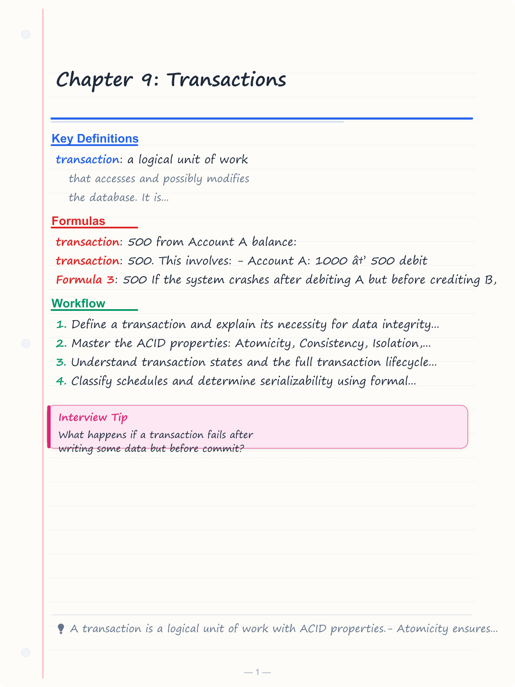
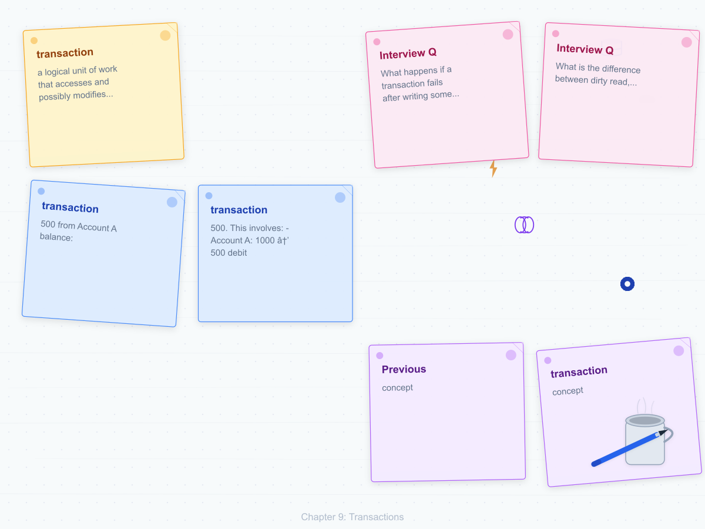
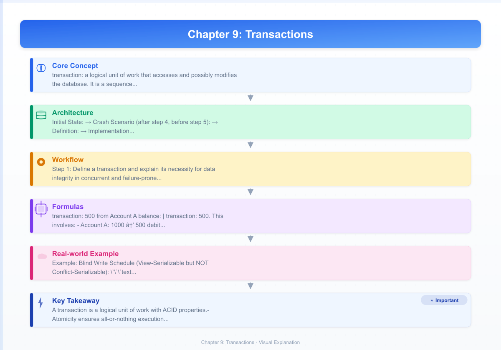
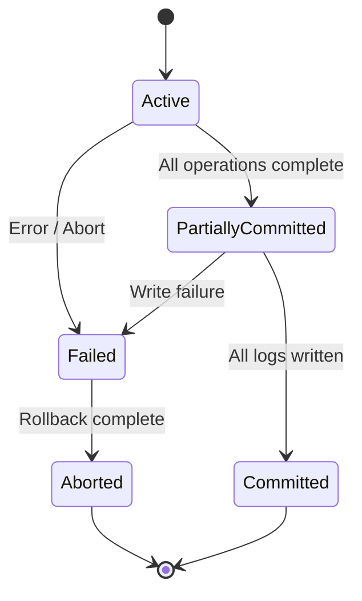

# Chapter 9: Transactions

> **Previous:** [Chapter 8: Higher Normal Forms and Denormalization](./08-higher-nf.md) | **Next:** [Chapter 10: Concurrency Control](./10-concurrency.md)

## Learning Objectives

- Define a transaction and explain its necessity for data integrity in concurrent and failure-prone environments
- Master the ACID properties: Atomicity, Consistency, Isolation, Durability — with implementation mechanisms
- Understand transaction states and the full transaction lifecycle with state transition rules
- Classify schedules and determine serializability using formal methods
- Implement conflict serializability checking via precedence graphs in C++ and Python
- Distinguish conflict serializability from view serializability with counterexamples
- Understand isolation levels and their anomaly-prevention guarantees
- Compare ACID with BASE in distributed contexts

<!-- Image Gallery -->
<section class="lesson-visuals" aria-label="Visual learning resources">
  <header><span>VISUAL LEARNING</span><h2>See it. Review it. Remember it.</h2></header>
  <a class="lesson-visual-card" href="../../assets/images/lessons/database-management-systems/09-transactions/handwritten-notes.png" target="_blank" rel="noopener">
    
    <span><strong>Handwritten notes</strong>Condensed notes for deliberate review.</span>
  </a>
  <a class="lesson-visual-card" href="../../assets/images/lessons/database-management-systems/09-transactions/sticky-notes.png" target="_blank" rel="noopener">
    
    <span><strong>Sticky-note revision</strong>Fast recall prompts for revision.</span>
  </a>
  <a class="lesson-visual-card" href="../../assets/images/lessons/database-management-systems/09-transactions/visual-explanation.png" target="_blank" rel="noopener">
    
    <span><strong>Visual concept guide</strong>A connected explanation of the key ideas.</span>
  </a>
</section>
<!-- End Image Gallery -->


## Chapter at a Glance

| Topic | Key Insight | Practical Takeaway |
|-------|-------------|-------------------|
| **Transaction Concept** | Logical unit of work with all-or-nothing semantics | Bank transfer: both accounts update or neither |
| **ACID Properties** | Atomicity, Consistency, Isolation, Durability | The four guarantees that define a "safe" transaction |
| **Transaction States** | Active → Partially Committed → Committed / Failed → Aborted | Every transaction follows the same lifecycle |
| **Schedule Classification** | Serial, Serializable, Non-serializable | Serializable schedules are the gold standard for correctness |
| **Conflict Serializability** | Swapping non-conflicting operations to match a serial schedule | The precedence graph is your primary tool |
| **View Serializability** | Same read/write order as a serial schedule | Less restrictive than conflict serializability |
| **Isolation Levels** | READ UNCOMMITTED → SERIALIZABLE | Trade consistency for performance |
| **ACID vs BASE** | Consistency vs Availability trade-off in distributed systems | Choose based on CAP theorem requirements |

## Chapter Roadmap

```mermaid
flowchart LR
    A[Transaction Concept] --> B[ACID Properties]
    B --> C[Transaction States]
    C --> D[Schedules & Classification]
    D --> E[Serial vs Serializable]
    E --> F[Conflict Serializability]
    F --> G[Precedence Graph]
    G --> H[View Serializability]
    H --> I[Recoverable & Cascadeless]
    I --> J[Isolation Levels]
    J --> K[Real DBMS Implementations]
```



---

## 9.1 What Is a Transaction?

A **transaction** is a logical unit of work that accesses and possibly modifies the database. It is a sequence of operations (reads and writes) that forms a single logical unit. Transactions address two fundamental problems: **system failures** (crash in the middle of a multi-step operation) and **concurrent access** (interference between parallel operations).

### Real-World Analogy: Bank Transfer


Alice transfers $500 from Account A (balance: $1000) to Account B (balance: $500). This involves:

- Account A: 1000 → 500 (debit $500)
- Account B: 500 → 1000 (credit $500)

If the system crashes after debiting A but before crediting B, $500 vanishes from the system. A transaction ensures either both steps happen or neither does.

### Numbered Steps of a Transaction Lifecycle


| Step | Operation | Description | SQL Equivalent |
|------|-----------|-------------|----------------|
| 1 | BEGIN | Start the transaction boundary | `BEGIN TRANSACTION;` |
| 2 | READ(A) | Read initial balance of A | `SELECT balance FROM accounts WHERE id = 'A';` |
| 3 | CHECK | Verify sufficient funds | Application-level conditional |
| 4 | WRITE(A) | Debit A: A = A - 500 | `UPDATE accounts SET balance = balance - 500 WHERE id = 'A';` |
| 5 | WRITE(B) | Credit B: B = B + 500 | `UPDATE accounts SET balance = balance + 500 WHERE id = 'B';` |
| 6 | COMMIT | Make all changes permanent | `COMMIT;` |

### Pseudocode


```text
PROCEDURE TransferFunds(from_acct, to_acct, amount):
    BEGIN TRANSACTION
    bal_from = READ(balance FROM accounts WHERE id = from_acct)
    IF bal_from >= amount:
        WRITE(accounts SET balance = bal_from - amount WHERE id = from_acct)
        bal_to = READ(balance FROM accounts WHERE id = to_acct)
        WRITE(accounts SET balance = bal_to + amount WHERE id = to_acct)
        COMMIT
        RETURN "Success"
    ELSE:
        ROLLBACK
        RETURN "Insufficient funds"
    END IF
END PROCEDURE
```

### Dry Run Trace Table


**Initial State:** A = 1000, B = 500, Transfer amount = 500

| Step | Operation | A (before) | A (after) | B (before) | B (after) | Buffer | Disk A | Disk B |
|------|-----------|-----------|-----------|-----------|-----------|--------|--------|--------|
| 1 | BEGIN | 1000 | - | 500 | - | - | 1000 | 500 |
| 2 | READ(A) → 1000 | 1000 | - | 500 | - | A=1000 | 1000 | 500 |
| 3 | CHECK(1000 >= 500) ✓ | 1000 | - | 500 | - | A=1000 | 1000 | 500 |
| 4 | WRITE(A, A-500) | 1000 | **500** | 500 | - | A=500 | 1000 | 500 |
| 5 | WRITE(B, B+500) | - | 500 | 500 | **1000** | A=500, B=1000 | 1000 | 500 |
| 6 | COMMIT | 500 | 500 | 1000 | 1000 | Flushed | **500** | **1000** |

**Crash Scenario (after step 4, before step 5):**

| Step | Operation | A (buffer) | B (buffer) | Disk A | Disk B | Recovery Action |
|------|-----------|-----------|-----------|--------|--------|----------------|
| 4 | WRITE(A, A-500) | 500 | 500 | 1000 | 500 | - |
| CRASH | - | 500 | 500 | 1000 | 500 | UNDO: restore A=1000 |
| After Recovery | ROLLBACK | - | - | **1000** | 500 | A reverted to original |

### C++ Implementation: Transaction Scheduler


\`\`\`cpp
#include &lt;iostream&gt;
#include &lt;vector&gt;
#include &lt;unordered_map&gt;
#include &lt;string&gt;
#include &lt;stdexcept&gt;

class Account {
public:
    std::string id;
    int balance;
    Account(std::string i, int b) : id(i), balance(b) {}
};

class Transaction {
private:
    std::unordered_map&lt;std::string, int&gt; writeBuffer;
    std::unordered_map&lt;std::string, int&gt; readSet;
    bool active;
    bool aborted;

public:
    Transaction() : active(true), aborted(false) {}

    int read(Account& acc) {
        if (aborted) throw std::runtime_error("Transaction aborted");
        if (writeBuffer.find(acc.id) != writeBuffer.end()) {
            return writeBuffer[acc.id];
        }
        readSet[acc.id] = acc.balance;
        return acc.balance;
    }

    void write(Account& acc, int newBalance) {
        if (aborted) throw std::runtime_error("Transaction aborted");
        writeBuffer[acc.id] = newBalance;
    }

    void commit(std::vector&lt;Account&gt;& accounts) {
        if (aborted) throw std::runtime_error("Cannot commit aborted transaction");
        for (auto& [id, newBal] : writeBuffer) {
            for (auto& acc : accounts) {
                if (acc.id == id) {
                    acc.balance = newBal;
                    break;
                }
            }
        }
        writeBuffer.clear();
        active = false;
        std::cout &lt;< "Transaction COMMITTED.\n";
    }

    void rollback() {
        writeBuffer.clear();
        aborted = true;
        active = false;
        std::cout &lt;< "Transaction ROLLED BACK.\n";
    }

    bool isActive() const { return active; }
};

int main() {
    std::vector&lt;Account&gt; accounts = {
        Account("A100", 1000),
        Account("B200", 500)
    };

    Transaction tx;
    try {
        int balA = tx.read(accounts[0]);
        std::cout &lt;< "Read A100 balance: $" << balA << "\n";

        if (balA >= 500) {
            tx.write(accounts[0], balA - 500);
            int balB = tx.read(accounts[1]);
            tx.write(accounts[1], balB + 500);
            tx.commit(accounts);
        } else {
            tx.rollback();
        }
    } catch (const std::exception& e) {
        tx.rollback();
        std::cerr &lt;< "Error: " << e.what() << "\n";
    }

    std::cout &lt;< "Final: A100=$" << accounts[0].balance
              << ", B200=$" << accounts[1].balance &lt;< "\n";
    return 0;
}
\`\`\`

### Python Implementation: Transaction Scheduler


\`\`\`python
from dataclasses import dataclass
from typing import Dict, Optional

@dataclass
class Account:
    account_id: str
    balance: int

class Transaction:
    def __init__(self):
        self.write_buffer: Dict[str, int] = {}
        self.read_set: Dict[str, int] = {}
        self._active = True
        self._aborted = False

    def read(self, account: Account) -> int:
        if self._aborted:
            raise RuntimeError("Transaction aborted")
        if account.account_id in self.write_buffer:
            return self.write_buffer[account.account_id]
        self.read_set[account.account_id] = account.balance
        return account.balance

    def write(self, account: Account, new_balance: int):
        if self._aborted:
            raise RuntimeError("Transaction aborted")
        self.write_buffer[account.account_id] = new_balance

    def commit(self, accounts: Dict[str, Account]):
        if self._aborted:
            raise RuntimeError("Cannot commit aborted transaction")
        for acct_id, new_bal in self.write_buffer.items():
            accounts[acct_id].balance = new_bal
        self.write_buffer.clear()
        self._active = False
        print("Transaction COMMITTED.")

    def rollback(self):
        self.write_buffer.clear()
        self._aborted = True
        self._active = False
        print("Transaction ROLLED BACK.")

    @property
    def is_active(self) -> bool:
        return self._active


def transfer_funds(accounts: Dict[str, Account],
                   from_id: str, to_id: str, amount: int) -> str:
    tx = Transaction()
    try:
        bal_from = tx.read(accounts[from_id])
        print(f"Read {from_id} balance: ${bal_from}")

        if bal_from >= amount:
            tx.write(accounts[from_id], bal_from - amount)
            bal_to = tx.read(accounts[to_id])
            tx.write(accounts[to_id], bal_to + amount)
            tx.commit(accounts)
            return "Success"
        else:
            tx.rollback()
            return "Insufficient funds"
    except Exception as e:
        tx.rollback()
        return f"Error: {e}"


if __name__ == "__main__":
    accounts = {
        "A100": Account("A100", 1000),
        "B200": Account("B200", 500)
    }
    result = transfer_funds(accounts, "A100", "B200", 500)
    print(f"Result: {result}")
    print(f"Final: A100=${accounts['A100'].balance}, "
          f"B200=${accounts['B200'].balance}")
\`\`\`

### Complexity Analysis


| Aspect | Analysis | Why |
|--------|----------|-----|
| **Time (per operation)** | O(1) amortized | Hash table lookups for read/write buffer; O(1) commit per item |
| **Space (write buffer)** | O(n) where n = items written | Each uncommitted write stores a buffer entry |
| **Space (read set)** | O(m) where m = items read | Tracks read-set for conflict detection |
| **Commit complexity** | O(k) where k = writes in buffer | Must flush each buffered write to persistent storage |
| **Rollback complexity** | O(1) | Simply clears the write buffer — no undo needed at this layer |

### Advantages and Disadvantages


| Aspect | Advantages | Disadvantages |
|--------|-----------|---------------|
| **Atomicity** | Prevents partial updates; data stays consistent | Requires write-ahead logging overhead |
| **Isolation** | Each transaction sees consistent snapshots | Concurrency reduced under pessimistic locking |
| **Durability** | Survives crashes and power failures | Write overhead to persistent storage (fsync) |
| **Abstraction** | Developer writes simple sequential logic | Transaction manager complexity is hidden |
| **Performance** | Optimistic concurrency works well with low contention | High contention degrades to serial execution |

### Edge Cases in Transactions


| Edge Case | Description | Consequence | Mitigation |
|-----------|-------------|-------------|------------|
| **System crash mid-commit** | Crash after partial flush to disk | Some writes visible, others lost | Write-ahead logging (WAL) + REDO/UNDO |
| **Concurrent withdrawal** | Two transactions debit same account simultaneously | Lost update: one debit overwrites the other | Locking or MVCC |
| **Dirty read** | Transaction reads uncommitted data from another | Reads values that may disappear | READ COMMITTED isolation or higher |
| **Phantom read** | Same query returns different rows mid-transaction | Inconsistent result sets | SERIALIZABLE isolation or gap locks |
| **Long-running transaction** | Transaction holds locks for extended period | Starvation, deadlocks, reduced concurrency | Keep transactions short; use timeouts |
| **Distributed transaction** | Transaction spans multiple databases | Two-phase commit (2PC) overhead, blocking | Saga pattern for microservices |

---

## 9.2 ACID Properties

ACID is an acronym for Atomicity, Consistency, Isolation, Durability — the four properties that guarantee database transactions are processed reliably.

### Atomicity


**Definition:** A transaction executes completely or not at all. There is no partial execution.

**Implementation Mechanism:** Write-Ahead Logging (WAL). Before any change is applied to the database, a log record describing the change is written to stable storage. If the system crashes, the recovery manager uses the log to UNDO uncommitted transactions (rollback) and REDO committed transactions whose results were not yet flushed.

**Example — Atomicity Violation:**
\`\`\`text
T1: A = A - 500    (written to disk)
T1: B = B + 500    (NOT written — crash occurs)
\`\`\`
Without atomicity: $500 is lost from the system.
With atomicity (WAL undo): A is restored to its original value.

**Complexity:** O(1) overhead per write operation for log record creation. O(n) for crash recovery scan of log.

### Consistency


**Definition:** A transaction brings the database from one valid state to another valid state. All integrity constraints (primary keys, foreign keys, CHECK constraints, unique constraints, triggers) must be satisfied when the transaction commits.

**Implementation Mechanism:** Application logic plus DBMS-enforced constraints. The DBMS checks constraints at statement boundaries (immediate mode) or at commit time (deferred mode). The developer is responsible for writing correct application logic.

**Example — Consistency Violation:**
\`\`\`sql
-- Constraint: CHECK(balance >= 0)
UPDATE accounts SET balance = balance - 1000 WHERE id = 'A';
-- balance was 500, now becomes -500
-- Without consistency: invalid state
-- With consistency: Transaction aborts on constraint violation
\`\`\`

**Complexity:** O(1) per constraint check. Deferred mode checks all constraints at commit in O(c) where c = number of constraints.

### Isolation


**Definition:** Concurrent transactions should not interfere with each other. Each transaction executes as if it were the only transaction in the system.

**Implementation Mechanism:** Concurrency control protocols — locking (2PL, strict 2PL), timestamp ordering (TO), multiversion concurrency control (MVCC). The isolation level determines how much interference is allowed.

**Example — Isolation Violation (Lost Update):**
\`\`\`text
T1: READ(A) → 1000
T2: READ(A) → 1000
T1: WRITE(A, 1000 - 500) → A = 500
T2: WRITE(A, 1000 - 200) → A = 800  (overwrites T1's update!)
T1: COMMIT
T2: COMMIT
\`\`\`
Final value: A = 800. Lost $300 from T1's update. With SERIALIZABLE isolation, T2 would wait for T1 to complete.

**Complexity:** Locking adds O(1) lock acquisition overhead per operation. Deadlock detection is O(n²) where n = number of transactions. MVCC adds version storage overhead.

### Durability


**Definition:** Once a transaction commits, its changes persist even if the system crashes immediately after. Committed data must be recoverable from non-volatile storage.

**Implementation Mechanism:** Write-Ahead Logging (REDO log). When a transaction commits, its log records are forced to stable storage (fsync). The actual data pages may be written later (steal/no-force policy). On recovery, the REDO log replays committed transactions whose data was not yet flushed.

**Example — Durability Guarantee:**
\`\`\`text
T1: COMMIT (log record written to disk)
     ← CRASH OCCURS HERE →
     ← RESTART →
     Recovery Manager reads log
     Finds T1 COMMIT record
     REDO: reapplies T1 changes if not already on disk
     A = 500, B = 1000  ← changes present
\`\`\`

**Complexity:** fsync is expensive — O(1) per commit with high latency (2-10ms typical). Group commit batches multiple commits into one fsync to amortize cost.

### ACID Properties Comparison Table


| Property | What It Prevents | Implementation | Cost | Failure Scenario |
|----------|-----------------|----------------|------|------------------|
| **Atomicity** | Partial updates | UNDO log (WAL) | Log write per operation | Crash during transaction |
| **Consistency** | Invalid database state | Constraints + triggers + app logic | Constraint check overhead | Constraint violation |
| **Isolation** | Concurrent interference | Locks, MVCC, timestamps | Lock contention, version storage | Interleaved conflicting ops |
| **Durability** | Data loss after commit | REDO log (WAL) + fsync | fsync latency (2-10ms) | Crash after commit acknowledged |

### Edge Cases for ACID


| Edge Case | Affected Property | Description |
|-----------|------------------|-------------|
| **Nested transactions** | Atomicity | Inner rollback should not affect outer unless propagated |
| **Deferred constraints** | Consistency | Foreign key checks deferred to commit may fail after many changes |
| **Phantom reads** | Isolation | New rows inserted by concurrent transaction appear in repeated reads |
| **Write skew** | Isolation | Two transactions read overlapping data and write non-overlapping data inconsistently |
| **Group commit** | Durability | Multiple commits batched into one fsync — all survive or none |
---

## 9.3 Transaction States

A transaction passes through a well-defined set of states during its lifecycle. Understanding these states is critical for recovery management and concurrency control.

### State Diagram


\`\`\`mermaid
stateDiagram-v2
    [*] --> ACTIVE : BEGIN TRANSACTION
    ACTIVE --> PARTIALLY_COMMITTED : Final statement executed
    ACTIVE --> FAILED : Error or abort detected
    PARTIALLY_COMMITTED --> COMMITTED : All changes safely written to disk
    PARTIALLY_COMMITTED --> FAILED : Write failure detected
    FAILED --> ABORTED : Rollback completed
    COMMITTED --> [*]
    ABORTED --> [*]
\`\`\`

### Detailed State Descriptions


| State | Description | What Happens | Duration | Can We Recover? |
|-------|-------------|-------------|----------|-----------------|
| **ACTIVE** | Initial state; transaction is executing operations | Reads/writes performed; variables modified in memory or buffer | Variable (microseconds to hours) | Possible — rollback is straightforward |
| **PARTIALLY COMMITTED** | Final statement executed; changes may be in memory buffer | All operations done; waiting for log flush to stable storage | Brief (milliseconds, bounded by fsync) | Possible — need to ensure REDO log is durable |
| **COMMITTED** | All changes permanently written to storage | Commit record in log; changes visible to other transactions | Terminal | No — committed transactions cannot be rolled back |
| **FAILED** | Transaction cannot continue due to error/crash | Active or partially committed transaction encountered unrecoverable error | Brief (cleaned up immediately) | Yes — must roll back to ABORTED |
| **ABORTED** | Transaction has been rolled back; all changes undone | Database restored to state before transaction began | Terminal | Yes — can restart the transaction (retry) |

### State Transition Table


| From State | To State | Trigger | Action Required |
|------------|----------|---------|-----------------|
| ACTIVE | PARTIALLY_COMMITTED | Final operation completes | Prepare log for commit |
| ACTIVE | FAILED | Error, crash, or explicit ABORT | Begin rollback |
| PARTIALLY_COMMITTED | COMMITTED | Log flush to stable storage succeeds | Make changes visible |
| PARTIALLY_COMMITTED | FAILED | Log flush fails | Begin rollback |
| FAILED | ABORTED | Rollback completes | Clean up resources |

### Dry Run: Transaction State Transitions


**Scenario 1: Successful Transaction**

| Action | State Before | Transition | State After | Log |
|--------|-------------|------------|-------------|-----|
| BEGIN TRANSACTION | [*] | Start | ACTIVE | \<BEGIN T1\> |
| READ(A) → 1000 | ACTIVE | Continue | ACTIVE | - |
| WRITE(A, 500) | ACTIVE | Continue | ACTIVE | \<T1, A, 1000, 500\> (UNDO record) |
| WRITE(B, 1000) | ACTIVE | Continue | ACTIVE | \<T1, B, 500, 1000\> (UNDO record) |
| Last statement done | ACTIVE | Final op | PARTIALLY COMMITTED | - |
| fsync log | PARTIALLY COMMITTED | Log force | PARTIALLY COMMITTED | \<T1, COMMIT\> (REDO record) |
| Flush data pages | PARTIALLY COMMITTED | Write complete | **COMMITTED** | - |

**Scenario 2: Failed Transaction with Rollback**

| Action | State Before | Transition | State After | Log |
|--------|-------------|------------|-------------|-----|
| BEGIN TRANSACTION | [*] | Start | ACTIVE | \<BEGIN T2\> |
| READ(A) → 1000 | ACTIVE | Continue | ACTIVE | - |
| WRITE(A, 500) | ACTIVE | Continue | ACTIVE | \<T2, A, 1000, 500\> |
| System crash | ACTIVE | Crash | **FAILED** | Log in stable storage |
| Recovery starts | FAILED | Rollback begins | FAILED | Find T2 has no COMMIT |
| UNDO(T2): restore A=1000 | FAILED | UNDO complete | **ABORTED** | \<T2, ABORT\> |

### Complexity of State Management


| Operation | Complexity | Why |
|-----------|------------|-----|
| State transition | O(1) | Simple state variable update |
| Log record creation | O(1) | Append to log buffer |
| Log flush (fsync) | O(1) I/O | Single system call, but high latency |
| Crash recovery (UNDO) | O(n) where n = uncommitted txns | Scan log, undo all uncommitted |
| Crash recovery (REDO) | O(m) where m = committed but unflushed txns | Scan log, redo all committed without commit flag on disk |

---

## 9.4 Schedules

A **schedule** (or history) is a sequence of operations from one or more transactions, ordered by time. Schedules are the fundamental unit of analysis for concurrency control correctness.

### Formal Definition


A schedule S over a set of transactions T = {T1, T2, ..., Tn} is a sequence of operations where:
- The operations of each transaction Ti appear in S in the same order they appear in Ti
- S contains exactly the union of all operations from all transactions

### Types of Schedules


**Serial Schedule:** Transactions execute one after another with no interleaving. T1 runs completely, then T2 runs completely.

\`\`\`text
Schedule S_serial (T1 then T2):
T1: R(A) W(A) R(B) W(B)  →  T2: R(A) W(A) R(B) W(B)
\`\`\`

**Serializable Schedule:** Operations may be interleaved, but the net effect is equivalent to SOME serial schedule.

\`\`\`text
Schedule S_serializable:
T1: R(A) W(A)
T2:       R(A) W(A) R(B) W(B)
T1:                 R(B) W(B)
\`\`\`

**Non-Serializable Schedule:** The interleaving produces a result that no serial schedule can produce.

\`\`\`text
Schedule S_non_serializable:
T1: R(A) W(B)
T2: R(B) W(A)
\`\`\`

### Schedule Types Comparison Table


| Property | Serial | Serializable | Non-Serializable |
|----------|--------|-------------|------------------|
| **Interleaving** | None | Yes | Yes |
| **Correctness** | Always correct | Equivalent to serial → correct | May produce inconsistent results |
| **Concurrency** | Minimal (1 transaction at a time) | Good | Potentially dangerous |
| **Throughput** | Lowest | High | Not applicable (unsafe) |
| **Performance** | Worst CPU utilization | Good utilization | - |
| **Precedence Graph** | No cycles (trivially) | Acyclic | Contains a cycle |
| **Example** | T1 then T2 | Interleaved but equivalent to serial | T1:R(A) W(B), T2:R(B) W(A) |

### Dry Run: Schedule Execution


**Transactions:**
\`\`\`text
T1: R(A) W(A) R(B) W(B)
T2: R(A) W(A) R(B) W(B)
\`\`\`

**Initial Values:** A = 100, B = 200
**T1 Semantics:** A = A + 10, B = B * 2
**T2 Semantics:** A = A * 2, B = B + 50

**Serial Schedule (T1 then T2):**

| Time | T1 | T2 | A | B |
|------|-----|-----|---|---|
| 1 | R(A) → 100 | - | 100 | 200 |
| 2 | A = 100+10 = 110, W(A,110) | - | **110** | 200 |
| 3 | R(B) → 200 | - | 110 | 200 |
| 4 | B = 200*2 = 400, W(B,400) | - | 110 | **400** |
| 5 | - | R(A) → 110 | 110 | 400 |
| 6 | - | A = 110*2 = 220, W(A,220) | **220** | 400 |
| 7 | - | R(B) → 400 | 220 | 400 |
| 8 | - | B = 400+50 = 450, W(B,450) | 220 | **450** |

**Result: A = 220, B = 450**

**Serial Schedule (T2 then T1):**

| Time | T2 | T1 | A | B |
|------|------|-----|---|---|
| 1 | R(A) → 100 | - | 100 | 200 |
| 2 | A = 100*2 = 200, W(A,200) | - | **200** | 200 |
| 3 | R(B) → 200 | - | 200 | 200 |
| 4 | B = 200+50 = 250, W(B,250) | - | 200 | **250** |
| 5 | - | R(A) → 200 | 200 | 250 |
| 6 | - | A = 200+10 = 210, W(A,210) | **210** | 250 |
| 7 | - | R(B) → 250 | 210 | 250 |
| 8 | - | B = 250*2 = 500, W(B,500) | 210 | **500** |

**Result: A = 210, B = 500**

Note: Different serial orders produce different (but consistent) results. Both are correct.

**Interleaved Schedule (Serializable):**

| Time | T1 | T2 | A | B |
|------|-----|-----|---|---|
| 1 | R(A) → 100 | - | 100 | 200 |
| 2 | A = 110, W(A,110) | - | **110** | 200 |
| 3 | - | R(A) → 110 | 110 | 200 |
| 4 | - | A = 220, W(A,220) | **220** | 200 |
| 5 | R(B) → 200 | - | 220 | 200 |
| 6 | B = 400, W(B,400) | - | 220 | **400** |
| 7 | - | R(B) → 400 | 220 | 400 |
| 8 | - | B = 450, W(B,450) | 220 | **450** |

**Result: A = 220, B = 450** (Same as T1→T2 serial → Serializable ✓)

### Complete Schedule


A **complete schedule** contains a commit (or abort) operation for every transaction. An incomplete schedule (one where a transaction has not yet committed or aborted) cannot be analyzed for serializability because the transaction may still execute additional operations.

\`\`\`text
Complete Schedule:
T1: R(A) W(A) R(B) W(B) C1
T2: R(A) W(A) R(B) W(B) C2

Incomplete Schedule:
T1: R(A) W(A) R(B)       (T1 commit missing)
T2:      R(A) W(A) R(B) W(B) C2
\`\`\`

---

## 9.5 Serial vs Serializable

| Aspect | Serial Schedule | Serializable Schedule |
|--------|----------------|----------------------|
| **Definition** | Transactions execute one after another with zero interleaving | Operations may interleave, but the result equals some serial execution |
| **Interleaving** | None | Yes — arbitrary interleaving allowed |
| **Correctness** | Trivially correct | Correct by equivalence to serial |
| **Performance** | Worst: 1/N throughput for N transactions | Much better: near-parallel throughput |
| **Precedence Graph** | Trivially acyclic | Acyclic |
| **Real-world use** | Never used in production unless forced | The practical standard for correctness |

### Key Insight


Serial schedules are **correct by definition** but **impractical** (they waste concurrency). Serializable schedules are **correct by proof** and **practical**. The entire field of concurrency control aims to produce serializable schedules while maximizing interleaving.
---

## 9.6 Conflict Serializability

Two operations **conflict** if they satisfy three conditions:
1. They belong to **different transactions**
2. They access the **same data item**
3. At least one of them is a **write**

### Conflict Types


| Operation Pair | Conflict? | Reason |
|---------------|-----------|--------|
| R(A) and R(A) from different Txs | **No** | Both read — no modification |
| R(A) and W(A) from different Txs | **Yes** | READ-WRITE conflict (unrepeatable read) |
| W(A) and R(A) from different Txs | **Yes** | WRITE-READ conflict (dirty read) |
| W(A) and W(A) from different Txs | **Yes** | WRITE-WRITE conflict (lost update) |

### Algorithm for Conflict Serializability Testing


\`\`\`text
INPUT: Schedule S as sequence of (Transaction, Operation, DataItem)
OUTPUT: Is conflict-serializable? (Boolean)

FUNCTION IsConflictSerializable(S):
    // Phase 1: Identify all conflicting operation pairs
    conflicts = []
    FOR i = 1 TO |S|:
        FOR j = i+1 TO |S|:
            IF S[i].txn != S[j].txn
               AND S[i].item == S[j].item
               AND (S[i].op == "W" OR S[j].op == "W"):
                conflicts.APPEND( (S[i].txn → S[j].txn) )

    // Phase 2: Build precedence graph
    graph = new Graph(all_transactions_in_S)
    FOR EACH (Ti → Tj) IN conflicts:
        graph.ADD_EDGE(Ti, Tj)

    // Phase 3: Check for cycles
    RETURN NOT graph.HAS_CYCLE()
END FUNCTION
\`\`\`

### Precedence Graph — Step-by-Step Construction


**Problem:** Determine if this schedule is conflict-serializable:

\`\`\`text
S: T1: R(A)  T2: W(A)  T1: W(B)  T2: R(B)  T3: W(A)  T3: R(B)
\`\`\`

**Step 1: List all operations with transaction IDs**

| Position | Transaction | Operation | Data Item |
|----------|-------------|-----------|-----------|
| 1 | T1 | R | A |
| 2 | T2 | W | A |
| 3 | T1 | W | B |
| 4 | T2 | R | B |
| 5 | T3 | W | A |
| 6 | T3 | R | B |

**Step 2: Find all conflicting operation pairs**

For each pair (i, j) where i \< j and transactions differ:

Pair (1,2): T1:R(A), T2:W(A) — same item A, at least one write → CONFLICT → T1 → T2 (T1 reads A before T2 writes A)

Pair (1,5): T1:R(A), T3:W(A) — same item A, at least one write → CONFLICT → T1 → T3 (T1 reads A before T3 writes A)

Pair (2,5): T2:W(A), T3:W(A) — same item A, both writes → CONFLICT → T2 → T3 (T2 writes A before T3 writes A)

Pair (3,4): T1:W(B), T2:R(B) — same item B, at least one write → CONFLICT → T1 → T2 (T1 writes B before T2 reads B)

Pair (3,6): T1:W(B), T3:R(B) — same item B, at least one write → CONFLICT → T1 → T3 (T1 writes B before T3 reads B)

Pair (4,6): T2:R(B), T3:R(B) — same item B, both reads → NOT a conflict (no write)

**Step 3: Build the precedence graph**

Nodes: {T1, T2, T3}

Edges:
- T1 → T2 (from pairs 1,2 and 3,4)
- T1 → T3 (from pairs 1,5 and 3,6)
- T2 → T3 (from pair 2,5)

Graph:
\`\`\`text
T1 → T2
↓    ↓
T3 ←──┘
\`\`\`

**Step 4: Check for cycles**

Start DFS from T1: visit T2, visit T3. No back edges. No cycles.
Start DFS from T2: visit T3. No cycles.

**Conclusion:** Graph is acyclic → Schedule IS conflict-serializable.

**Equivalent serial schedule:** T1 → T2 → T3

### C++ Implementation: Conflict Serializability Checker


\`\`\`cpp
#include &lt;iostream&gt;
#include &lt;vector&gt;
#include <map>
#include &lt;set&gt;
#include &lt;string&gt;
#include &lt;sstream&gt;

enum OpType { READ, WRITE };

struct Operation {
    int txnId;
    OpType type;
    char dataItem;
    Operation(int t, OpType o, char d) : txnId(t), type(o), dataItem(d) {}
};

class PrecedenceGraph {
private:
    std::map&lt;int, std::set<int&gt;> adjList;
    std::set&lt;int&gt; nodes;

    bool dfs(int node, std::set&lt;int&gt;& visited, std::set&lt;int&gt;& recStack) {
        visited.insert(node);
        recStack.insert(node);
        for (int neighbor : adjList[node]) {
            if (recStack.find(neighbor) != recStack.end())
                return true;
            if (visited.find(neighbor) == visited.end()) {
                if (dfs(neighbor, visited, recStack))
                    return true;
            }
        }
        recStack.erase(node);
        return false;
    }

public:
    void addEdge(int from, int to) {
        adjList[from].insert(to);
        nodes.insert(from);
        nodes.insert(to);
    }

    bool hasCycle() {
        std::set&lt;int&gt; visited;
        std::set&lt;int&gt; recStack;
        for (int node : nodes) {
            if (visited.find(node) == visited.end()) {
                if (dfs(node, visited, recStack))
                    return true;
            }
        }
        return false;
    }

    void printGraph() {
        std::cout &lt;< "Precedence Graph:\n";
        for (auto& [node, neighbors] : adjList) {
            std::cout &lt;< "  T" << node << " → ";
            for (int n : neighbors)
                std::cout &lt;< "T" << n << " ";
            std::cout &lt;< "\n";
        }
    }
};

class ConflictSerializabilityChecker {
private:
    std::vector&lt;Operation&gt; schedule;

public:
    void addOperation(int txn, char op, char item) {
        OpType t = (op == "W" || op == "w") ? WRITE : READ;
        schedule.push_back(Operation(txn, t, item));
    }

    bool isConflictSerializable() {
        PrecedenceGraph graph;
        int n = schedule.size();

        for (int i = 0; i &lt; n; i++) {
            for (int j = i + 1; j &lt; n; j++) {
                auto& op1 = schedule[i];
                auto& op2 = schedule[j];

                if (op1.txnId == op2.txnId) continue;
                if (op1.dataItem != op2.dataItem) continue;

                if (op1.type == WRITE || op2.type == WRITE) {
                    graph.addEdge(op1.txnId, op2.txnId);
                    std::cout &lt;< "Conflict: T" << op1.txnId
                              << (op1.type == READ ? " R(" : " W(")
                              << op1.dataItem &lt;< ") → T" << op2.txnId
                              << (op2.type == READ ? " R(" : " W(")
                              << op2.dataItem &lt;< ")\n";
                }
            }
        }

        graph.printGraph();
        bool hasCycle = graph.hasCycle();

        if (hasCycle) {
            std::cout &lt;< "Cycle detected! Schedule is NOT conflict-serializable.\n";
            return false;
        } else {
            std::cout &lt;< "No cycles. Schedule IS conflict-serializable.\n";
            return true;
        }
    }
};

int main() {
    ConflictSerializabilityChecker checker;

    // Schedule: T1:R(A), T2:W(A), T1:W(B), T2:R(B), T3:W(A), T3:R(B)
    checker.addOperation(1, "R", "A");
    checker.addOperation(2, "W", "A");
    checker.addOperation(1, "W", "B");
    checker.addOperation(2, "R", "B");
    checker.addOperation(3, "W", "A");
    checker.addOperation(3, "R", "B");

    bool result = checker.isConflictSerializable();
    std::cout &lt;< "Result: " << (result ? "SERIALIZABLE" : "NOT SERIALIZABLE") << "\n";

    // Test a non-serializable schedule
    std::cout &lt;< "\n--- Test 2: Non-Serializable Schedule ---\n";
    ConflictSerializabilityChecker checker2;
    // T1: R(A) W(B), T2: R(B) W(A)
    checker2.addOperation(1, "R", "A");
    checker2.addOperation(1, "W", "B");
    checker2.addOperation(2, "R", "B");
    checker2.addOperation(2, "W", "A");
    bool result2 = checker2.isConflictSerializable();
    std::cout &lt;< "Result: " << (result2 ? "SERIALIZABLE" : "NOT SERIALIZABLE") << "\n";

    return 0;
}
\`\`\`

### Python Implementation: Conflict Serializability Checker


\`\`\`python
from typing import List, Tuple, Set, Dict
from enum import Enum

class OpType(Enum):
    READ = 1
    WRITE = 2

class Operation:
    def __init__(self, txn_id: int, op_type: OpType, data_item: str):
        self.txn_id = txn_id
        self.op_type = op_type
        self.data_item = data_item

    def __repr__(self):
        op = "R" if self.op_type == OpType.READ else "W"
        return f"T{self.txn_id}:{op}({self.data_item})"


class PrecedenceGraph:
    def __init__(self):
        self.adj_list: Dict[int, Set[int]] = {}
        self.nodes: Set[int] = set()

    def add_edge(self, from_node: int, to_node: int):
        if from_node not in self.adj_list:
            self.adj_list[from_node] = set()
        self.adj_list[from_node].add(to_node)
        self.nodes.add(from_node)
        self.nodes.add(to_node)

    def _has_cycle_util(self, node: int, visited: Set[int],
                        rec_stack: Set[int]) -> bool:
        visited.add(node)
        rec_stack.add(node)
        for neighbor in self.adj_list.get(node, set()):
            if neighbor in rec_stack:
                return True
            if neighbor not in visited:
                if self._has_cycle_util(neighbor, visited, rec_stack):
                    return True
        rec_stack.discard(node)
        return False

    def has_cycle(self) -> bool:
        visited: Set[int] = set()
        rec_stack: Set[int] = set()
        for node in self.nodes:
            if node not in visited:
                if self._has_cycle_util(node, visited, rec_stack):
                    return True
        return False

    def __repr__(self):
        lines = ["Precedence Graph:"]
        for node in sorted(self.nodes):
            neighbors = self.adj_list.get(node, set())
            if neighbors:
                lines.append(f"  T{node} → {', '.join(f'T{n}' for n in sorted(neighbors))}")
        return "\n".join(lines)


class ConflictSerializabilityChecker:
    def __init__(self):
        self.schedule: List[Operation] = []

    def add_operation(self, txn_id: int, op_char: str, data_item: str):
        op_type = OpType.WRITE if op_char.upper() == "W" else OpType.READ
        self.schedule.append(Operation(txn_id, op_type, data_item))

    def add_operations(self, ops: List[Tuple[int, str, str]]):
        for txn_id, op_char, data_item in ops:
            self.add_operation(txn_id, op_char, data_item)

    def is_conflict_serializable(self) -> Tuple[bool, PrecedenceGraph]:
        graph = PrecedenceGraph()
        n = len(self.schedule)

        print("Analyzing schedule:", " → ".join(str(op) for op in self.schedule))
        print("\nConflicts:")

        for i in range(n):
            for j in range(i + 1, n):
                op1, op2 = self.schedule[i], self.schedule[j]
                if op1.txn_id == op2.txn_id:
                    continue
                if op1.data_item != op2.data_item:
                    continue
                if op1.op_type == OpType.WRITE or op2.op_type == OpType.WRITE:
                    graph.add_edge(op1.txn_id, op2.txn_id)
                    print(f"  {op1} → {op2}")

        print(f"\n{graph}")
        has_cycle = graph.has_cycle()
        if has_cycle:
            print("CYCLE DETECTED: Schedule is NOT conflict-serializable.")
        else:
            print("No cycles: Schedule IS conflict-serializable.")
        return (not has_cycle, graph)


def main():
    # Test 1: Serializable schedule
    print("=" * 60)
    print("TEST 1: Serializable Schedule")
    print("=" * 60)
    checker1 = ConflictSerializabilityChecker()
    checker1.add_operations([
        (1, "R", "A"), (2, "W", "A"), (1, "W", "B"),
        (2, "R", "B"), (3, "W", "A"), (3, "R", "B")
    ])
    result1, _ = checker1.is_conflict_serializable()
    print(f"\nVerdict: {"✓ SERIALIZABLE" if result1 else "✗ NOT SERIALIZABLE"}\n")

    # Test 2: Non-serializable schedule
    print("=" * 60)
    print("TEST 2: Non-Serializable Schedule")
    print("=" * 60)
    checker2 = ConflictSerializabilityChecker()
    checker2.add_operations([
        (1, "R", "A"), (1, "W", "B"),
        (2, "R", "B"), (2, "W", "A")
    ])
    result2, _ = checker2.is_conflict_serializable()
    print(f"\nVerdict: {"✓ SERIALIZABLE" if result2 else "✗ NOT SERIALIZABLE"}\n")

    # Test 3: Three-transaction schedule
    print("=" * 60)
    print("TEST 3: Three-Transaction Serializable Schedule")
    print("=" * 60)
    checker3 = ConflictSerializabilityChecker()
    checker3.add_operations([
        (1, "R", "A"), (2, "R", "B"), (1, "W", "A"),
        (2, "W", "B"), (3, "R", "A"), (3, "R", "B"),
        (3, "W", "A"), (3, "W", "B")
    ])
    result3, graph = checker3.is_conflict_serializable()
    print(f"\nVerdict: {"✓ SERIALIZABLE" if result3 else "✗ NOT SERIALIZABLE"}")

    if result3:
        print("Equivalent serial order: T1 → T2 → T3 (example)")


if __name__ == "__main__":
    main()
\`\`\`

### Complexity Analysis of Conflict Serializability Checker


| Operation | Complexity | Why |
|-----------|------------|-----|
| **Conflict detection** | O(n²) where n = number of operations | Every pair of operations is compared (nested loop) |
| **Graph construction** | O(n²) | Each conflict adds an edge; at most O(n²) conflicts |
| **Cycle detection (DFS)** | O(V + E) where V = transactions, E = edges | Standard DFS with recursion stack |
| **Total** | O(n²) | Dominated by conflict detection |
| **Space** | O(V + E) | Adjacency list for precedence graph |

### Advantages and Disadvantages


| Aspect | Advantages | Disadvantages |
|--------|-----------|---------------|
| **Decidability** | Efficiently testable in O(n²) | - |
| **Implementation** | Simple graph algorithm | - |
| **Intuitiveness** | Easy to explain: "no cycles = serializable" | - |
| **Conservative** | Rejects some valid schedules | Misses view-serializable schedules with blind writes |
| **Precision** | Only considers conflicting operations | Non-conflicting reorderings are ignored |

### Edge Cases in Conflict Serializability


| Edge Case | Schedule | Issue | Resolution |
|-----------|----------|-------|------------|
| **Blind writes** | T1:W(A), T2:W(A), T2:R(A) | Precedence graph may have cycles | Can be view-serializable despite conflict cycle |
| **Same transaction ops** | T1:R(A), T1:W(A) | No conflict because same transaction | Ignored by definition |
| **Non-conflicting items** | T1:R(A), T2:W(B) | Different data items → no conflict | Correctly ignored |
| **Three-way cycle** | T1→T2, T2→T3, T3→T1 | Cycle detected correctly | DFS handles multi-node cycles |
| **Disconnected components** | T1:R(A), T2:W(B) (no shared items) | No edges; trivially serializable | Correct |
---

## 9.7 View Serializability

A schedule is **view-serializable** if it is view-equivalent to some serial schedule. View equivalence is a weaker condition than conflict equivalence.

### Conditions for View Equivalence


Two schedules S and S'"'"' are view-equivalent if:

1. **Same initial read:** For each data item, the first read in S is from the same transaction as the first read in S'"'"'
2. **Same read-from:** For each read of a data item, the transaction that performed the write that produced the value is the same in both schedules
3. **Same final write:** For each data item, the last transaction to write it is the same in both schedules

### Example: Blind Write Schedule (View-Serializable but NOT Conflict-Serializable)

\`\`\`text
Schedule S:
T1: W(A)         T2: W(A)         T2: W(B)         T1: W(B)
\`\`\`

**Conflict Analysis:**
- T1:W(A) conflicts with T2:W(A) → T1 → T2 (T1 writes A before T2)
- T2:W(B) conflicts with T1:W(B) → T2 → T1 (T2 writes B before T1)

Precedence graph: T1 → T2 → T1 (CYCLE). NOT conflict-serializable.

**View Analysis:**
- Initial reads: No reads at all — no initial read condition to check
- Read-from: No reads at all — no read-from condition to check
- Final writes:
  - A: Last writer is T2
  - B: Last writer is T1

Compare to serial schedule S_serial = T1 → T2:
- A: T1 writes A, then T2 overwrites A → final writer T2 ✓
- B: T1 writes B → final writer T1 ✓

Despite the cycle, S IS view-equivalent to T1 → T2!

### View Serializability vs Conflict Serializability Comparison


| Aspect | Conflict Serializability | View Serializability |
|--------|------------------------|---------------------|
| **Test complexity** | O(n²) — polynomial | NP-complete (theoretically harder) |
| **Practical test** | Precedence graph cycle detection | Polygraph (complex) |
| **Blind writes** | Rejects schedules with blind writes | Can accept them |
| **Coverage** | Subset of view-serializable | Superset (includes all conflict-serializable) |
| **Implementation** | Simple graph algorithm | Rarely implemented in full; approximated |
| **Use in DBMS** | Standard for concurrency control | Theoretical benchmark; not used directly |
| **Counterexample needed** | - | Requires blind writes to differ |

### Theorem


Every conflict-serializable schedule is view-serializable, but the converse is NOT true.

### Why View Serializability Is Not Used in Practice


1. **Testing is harder:** The view equivalence test (polygraph) has exponential worst-case complexity
2. **Blind writes are rare:** Most real transactions read before writing
3. **Conservative is safe:** Conflict serializability rejects fewer than 1% of schedules that a real DBMS would generate — sacrificing that tiny fraction for guaranteed polynomial-time checking

---

## 9.8 Recoverable and Cascadeless Schedules

### Recoverable Schedule


A schedule is **recoverable** if, whenever a transaction Tj reads data written by transaction Ti, then Ti'"'"'s commit appears before Tj'"'"'s commit.

**Why it matters:** If Tj commits after reading uncommitted data from Ti, and Ti later aborts, Tj has committed based on data that no longer exists. This violates atomicity.

**Example — Non-Recoverable Schedule:**
\`\`\`text
T1: W(A)  T2: R(A)  T2: COMMIT  T1: ABORT
\`\`\`
T2 commits after reading T1'"'"'s uncommitted write. When T1 aborts, T2 has already committed with invalid data. This is a **non-recoverable** schedule — it should never be allowed.

### Cascadeless Schedule


A schedule is **cascadeless** if transactions only read data written by transactions that have already committed. This prevents **cascading rollbacks** — where one transaction'"'"'s abort forces a chain of aborts.

**Example — Cascading Rollback:**
\`\`\`text
T1: W(A)
T2: R(A) W(B)     (T2 reads uncommitted A from T1)
T3: R(B)          (T3 reads uncommitted B from T2)
T1: ABORT         → T2 must abort → T3 must abort
\`\`\`
All three transactions roll back. Cascadeless schedules prevent this by requiring T2 to wait for T1'"'"'s commit.

**Cascadeless Schedule (fixed):**
\`\`\`text
T1: W(A)  T1: COMMIT  T2: R(A) W(B)  T2: COMMIT  T3: R(B)  T3: COMMIT
\`\`\`

### Schedule Type Hierarchy


\`\`\`text
All Schedules
  └── Recoverable Schedules
        └── Cascadeless Schedules
              └── Strict Schedules
\`\`\`

- **Strict schedule:** A transaction can neither read nor write a data item until the last transaction that wrote it has committed. Strictness implies cascadeless, which implies recoverable.

---

## 9.9 SQL Transaction Control

\`\`\`sql
-- Start a transaction
BEGIN TRANSACTION;
-- or
BEGIN;
-- or
START TRANSACTION;

-- Savepoint (sub-transaction)
BEGIN;
INSERT INTO log VALUES ("Step 1");
SAVEPOINT sp1;
INSERT INTO log VALUES ("Step 2 that might fail");
ROLLBACK TO SAVEPOINT sp1;  -- Undo step 2, keep step 1
INSERT INTO log VALUES ("Step 3");
COMMIT;

-- Set isolation level
SET TRANSACTION ISOLATION LEVEL SERIALIZABLE;

-- Complete transaction
COMMIT;
-- or abort
ROLLBACK;

-- Auto-commit mode (default in most DBMS)
-- Each statement is its own transaction
SET autocommit = OFF;

-- Practical example: money transfer with error handling
BEGIN;
SAVEPOINT start_tx;
UPDATE accounts SET balance = balance - 500 WHERE id = 1 AND balance >= 500;
IF ROW_COUNT() = 0 THEN
    ROLLBACK TO SAVEPOINT start_tx;
ELSE
    UPDATE accounts SET balance = balance + 500 WHERE id = 2;
    COMMIT;
END IF;
\`\`\`

---

## 9.10 Concurrency Anomalies

Concurrency anomalies (or "phenomena") are consistency problems that arise when transactions execute concurrently without proper isolation.

### Anomaly Comparison Table


| Anomaly | Description | Isolation Needed | Example |
|---------|-------------|-----------------|---------|
| **Dirty Read** | Reading uncommitted data from another transaction | READ COMMITTED | T2 reads A=900 before T1 commits (or aborts) |
| **Non-Repeatable Read** | Same row read twice, different values | REPEATABLE READ | T1 reads A=1000, T2 updates A to 900, T1 reads A=900 |
| **Phantom Read** | Same query returns different row set | SERIALIZABLE | T1 queries WHERE balance > 500, T2 inserts new row |
| **Lost Update** | Two concurrent writes — one overwrites the other | Strong isolation / locking | T1: A=A-500, T2: A=A-200, T2 overwrites T1 |
| **Write Skew** | Two transactions read overlapping data, write non-overlapping, violating a constraint | SERIALIZABLE / predicate locking | Doctor on-call constraint violated |

### Dry Run: Dirty Read


\`\`\`text
Initial: A = 1000
T1: A = A - 500 (writes A=500)
T2: READ(A) → 500 (dirty read!)
T1: ROLLBACK (A restored to 1000)
T2: continues with value 500 — which never existed
\`\`\`

| Time | T1 | T2 | Disk A | T2'"'"'s View |
|------|-----|-----|--------|-----------|
| 1 | R(A) → 1000 | - | 1000 | - |
| 2 | A = 500, W(A) | - | 1000 (buffer: 500) | - |
| 3 | - | R(A) | - | **500** ← dirty! |
| 4 | ROLLBACK | - | **1000** | 500 |
| 5 | - | Uses A=500 | 1000 | 500 ← WRONG |

### Dry Run: Lost Update


\`\`\`text
Initial: A = 1000
T1: A = A - 500 → Writes A=500
T2: A = A - 200 → Writes A=800 (overwrites T1!)
T1: COMMIT
T2: COMMIT
Final: A = 800 ($700 lost!)
\`\`\`

| Time | T1 | T2 | A (T1 view) | A (T2 view) | Disk A |
|------|-----|-----|-------------|-------------|--------|
| 1 | R(A) → 1000 | - | 1000 | - | 1000 |
| 2 | A = 500 | - | 500 | - | 1000 |
| 3 | W(A, 500) | - | 500 | - | 1000 (buf: 500) |
| 4 | - | R(A) → 1000 | - | 1000 | 1000 |
| 5 | - | A = 800 | - | 800 | 1000 |
| 6 | - | W(A, 800) | - | 800 | **800** ← LOST |
| 7 | COMMIT | - | 500 | - | 800 |
| 8 | - | COMMIT | - | 800 | **800** |

**Correct result:** 1000 - 500 - 200 = **300**

---

## 9.11 Isolation Levels in SQL

The SQL standard defines four isolation levels that control which concurrency anomalies can occur.

### Isolation Level Matrix


| Isolation Level | Dirty Read | Non-Repeatable Read | Phantom Read | Lost Update |
|----------------|-----------|-------------------|--------------|-------------|
| **READ UNCOMMITTED** | Possible | Possible | Possible | Possible |
| **READ COMMITTED** | Prevented | Possible | Possible | Possible |
| **REPEATABLE READ** | Prevented | Prevented | Possible | Possible (some DBMS) |
| **SERIALIZABLE** | Prevented | Prevented | Prevented | Prevented |

### Deep Dive per Level


**READ UNCOMMITTED:**
- Implementation: No read locks; writes use short duration locks
- Phenomena: All anomalies possible
- Performance: Maximum concurrency, minimum overhead
- Use Case: Approximate read-only data (dashboards, counters)
- Warning: Dangerous for any write-focused workload

**READ COMMITTED (default in PostgreSQL, SQL Server, Oracle):**
- Implementation: Each query gets a snapshot (MVCC) or read locks released immediately
- Phenomena: Non-repeatable reads possible
- Performance: Good; most practical level
- Use Case: General-purpose OLTP workloads

**REPEATABLE READ (default in MySQL/InnoDB):**
- Implementation: Read locks held until commit (locking) or snapshot isolation (MVCC)
- Phenomena: Phantoms still possible
- Performance: Reduced concurrency due to held read locks
- Use Case: Reporting queries that must see consistent row values

**SERIALIZABLE (most strict):**
- Implementation: Predicate locking or lock table scans; true serial execution emulation
- Phenomena: All anomalies prevented (including write skew)
- Performance: Lowest concurrency
- Use Case: Financial reconciliation, inventory, money-related workloads

### SQL Syntax


\`\`\`sql
-- Set isolation level for a transaction
SET TRANSACTION ISOLATION LEVEL READ UNCOMMITTED;
SET TRANSACTION ISOLATION LEVEL READ COMMITTED;
SET TRANSACTION ISOLATION LEVEL REPEATABLE READ;
SET TRANSACTION ISOLATION LEVEL SERIALIZABLE;

-- Example: REPEATABLE READ prevents non-repeatable reads
SET TRANSACTION ISOLATION LEVEL REPEATABLE READ;
BEGIN;
SELECT balance FROM accounts WHERE id = 1;  -- Returns 1000
-- T2 concurrently: UPDATE accounts SET balance = 900 WHERE id = 1;
SELECT balance FROM accounts WHERE id = 1;  -- Still 1000 (REPEATABLE READ)
COMMIT;

-- Example: SERIALIZABLE prevents phantoms
SET TRANSACTION ISOLATION LEVEL SERIALIZABLE;
BEGIN;
SELECT * FROM orders WHERE status = "pending";
-- T2 concurrently: INSERT INTO orders (status) VALUES ("pending");
SELECT * FROM orders WHERE status = "pending";  -- Same rows
COMMIT;
\`\`\`
---

## 9.12 ACID vs BASE

In distributed systems, the CAP theorem forces a choice between consistency (C) and availability (A) when partitions (P) occur. ACID favors consistency; BASE favors availability.

| Aspect | ACID | BASE |
|--------|------|------|
| **Stands for** | Atomicity, Consistency, Isolation, Durability | Basically Available, Soft state, Eventual consistency |
| **Philosophy** | Pessimistic (assumes failures will happen) | Optimistic (assumes failures are rare) |
| **Consistency model** | Strong consistency | Eventual consistency |
| **Isolation** | Strict (SERIALIZABLE) | Relaxed (read uncommitted is common) |
| **State** | Hard state (consistent after each transaction) | Soft state (state changes over time) |
| **Durability** | Immediate, guaranteed | Eventual, best-effort |
| **When to use** | Banking, financial, inventory, booking | Social media, analytics, IoT, logging |
| **Examples** | PostgreSQL, Oracle, MySQL (with InnoDB) | Cassandra, DynamoDB, CouchDB, Riak |
| **CAP focus** | Consistency + Partition tolerance | Availability + Partition tolerance |

### Key Trade-Off


- **ACID systems** provide strong guarantees but sacrifice availability during partitions
- **BASE systems** stay available during partitions but may return stale data
- **Hybrid approach:** Use ACID for critical data (ledger, inventory counts) and BASE for non-critical data (user profiles, session data)

---

## 9.13 Interview Corner

### Q1: What happens if a transaction fails after writing some data but before commit?


**Answer:** The DBMS uses the UNDO log. Before any write, a "before image" is written to the log. On failure detection, the recovery manager reads the log and restores all before-images for the failed transaction. This restores the database to the state before the transaction began.

### Q2: What is the difference between dirty read, non-repeatable read, and phantom read?


| Anomaly | What Happens | Prevention |
|---------|-------------|------------|
| **Dirty read** | Read uncommitted data that may be rolled back | READ COMMITTED |
| **Non-repeatable read** | Same row read twice, committed update changes it between reads | REPEATABLE READ |
| **Phantom read** | Same query, new rows appear due to concurrent inserts | SERIALIZABLE |

### Q3: Can a schedule be both conflict-serializable and view-serializable?


**Answer:** Yes. Every conflict-serializable schedule is also view-serializable. The reverse is not true: schedules with blind writes can be view-serializable but not conflict-serializable.

### Q4: What is a cascading rollback and why is it bad?


**Answer:** A cascading rollback occurs when one transaction'"'"'s abort forces other transactions (which read its uncommitted data) to also abort. It is bad because it can cascade through many transactions, wasting all their work. Cascadeless schedules prevent this by only allowing reads of committed data.

### Q5: What is the difference between a serial schedule and a serializable schedule?


| Serial | Serializable |
|--------|-------------|
| No interleaving at all | Interleaving allowed |
| Trivially correct | Equivalent to some serial schedule |
| Worst performance | Good performance |
| Not used in practice | The practical standard |

### Q6: How do you test for conflict serializability?


**Answer:** Build a precedence graph where nodes are transactions and directed edges represent conflicting operations (Ti → Tj if Ti'"'"'s conflicting operation occurs before Tj'"'"'s). If the graph has a cycle, the schedule is not conflict-serializable. If acyclic, it is conflict-serializable, and any topological order gives an equivalent serial schedule.

### Q7: What is the difference between conflict and view serializability?


**Answer:** Conflict serializability is based on the order of conflicting operations (read-write, write-read, write-write) and is tested via precedence graphs in O(n²). View serializability is based on initial reads, read-from relationships, and final writes — it allows blind writes that conflict serializability rejects. View serializability is harder to test (NP-complete in general) and is mainly a theoretical concept.

### Q8: What isolation level should you use for a banking application?


**Answer:** SERIALIZABLE. Financial transactions must not experience any anomalies. The performance cost is justified by the correctness guarantee. In practice, many banking systems use REPEATABLE READ with careful application-level locking, but SERIALIZABLE is the safest choice.

### Q9: What is a lost update? How do you prevent it?


**Answer:** A lost update occurs when two concurrent transactions read the same value, modify it independently, and the second write overwrites the first without incorporating the first'"'"'s modification. Prevention: use pessimistic locking (SELECT ... FOR UPDATE), SERIALIZABLE isolation, or optimistic concurrency control with version numbers.

### Q10: What is write skew?


**Answer:** Write skew occurs when two transactions read overlapping data, make decisions based on that data, and write non-overlapping data — but the combined result violates a constraint. Example: A hospital requires at least one doctor on call. T1 sets Doctor A to "not on call" (after reading Doctor B is on call). T2 sets Doctor B to "not on call" (after reading Doctor A is on call). Result: zero doctors on call. Prevention: SERIALIZABLE isolation or predicate locking.

---

## 9.14 Applications in Real Systems

### MySQL InnoDB


| Feature | Implementation |
|---------|---------------|
| **Default isolation** | REPEATABLE READ |
| **MVCC** | Yes — each transaction sees a snapshot of data at the start |
| **Gap locking** | Used for REPEATABLE READ and SERIALIZABLE to prevent phantoms |
| **Next-key locking** | Row lock + gap lock = prevents phantoms in index scans |
| **Logging** | Doublewrite buffer + REDO log + UNDO log |
| **Auto-increment locking** | Special table-level lock for AUTO_INCREMENT columns |

### PostgreSQL


| Feature | Implementation |
|---------|---------------|
| **Default isolation** | READ COMMITTED |
| **MVCC** | Yes — uses tuple-level versioning (xmin/xmax system columns) |
| **SSI (Serializable Snapshot Isolation)** | True SERIALIZABLE using predicate locking + conflict detection |
| **No gap locking** | Uses MVCC + SSI instead of next-key locking |
| **VACUUM** | Removes dead tuples that MVCC creates |
| **Transaction ID wraparound** | VACUUM FREEZE prevents 32-bit transaction ID overflow |

### Oracle


| Feature | Implementation |
|---------|---------------|
| **Default isolation** | READ COMMITTED |
| **MVCC** | Yes — undo segments maintain consistent read images |
| **Read-only transactions** | True snapshot isolation via READ ONLY transactions |
| **No REPEATABLE READ** | Oracle maps REPEATABLE READ to SERIALIZABLE |
| **UNDO retention** | Guarantees undo availability for consistent reads |
| **Flashback queries** | Uses UNDO data to query past states |

### Comparison of DBMS Transaction Support


| Feature | MySQL InnoDB | PostgreSQL | Oracle |
|---------|-------------|------------|--------|
| **Default isolation** | REPEATABLE READ | READ COMMITTED | READ COMMITTED |
| **MVCC model** | Snapshot at first read | Snapshot per query | Snapshot per query |
| **Phantom prevention** | Next-key locking | SSI (SERIALIZABLE only) | SSI (SERIALIZABLE only) |
| **SERIALIZABLE impl.** | Lock-based | SSI (optimistic) | SSI (optimistic) |
| **DDL in transactions** | Partial (some DDL commits) | Yes (full transactional DDL) | Yes (full transactional DDL) |
| **Deadlock detection** | Immediate (cycle detection) | Immediate (timeout + detection) | Immediate (graph-based) |
| **Savepoints** | Yes | Yes | Yes (nested) |
| **Autocommit default** | ON | OFF | OFF (in SQL*Plus) |

---

## Examples

> **One-Sentence Takeaway:** Applying conflict and view serializability tests to concrete schedules builds the intuition needed to reason about transaction correctness in multi-user databases.

**Example 9.1: Testing Serializability**

Schedule S:
\`\`\`text
T1: READ(A), WRITE(A)
T2:           READ(A), WRITE(A), READ(B), WRITE(B)
T3:                     READ(B)
\`\`\`

Identify conflicts:
1. T1 WRITE(A) with T2 READ(A): T1 → T2
2. T2 WRITE(A) with T1 READ(A): T1 → T2
3. T2 WRITE(B) with T3 READ(B): T2 → T3

Edges: T1 → T2, T2 → T3
No cycle → Conflict-serializable. Equivalent serial schedule: T1 → T2 → T3.

**Example 9.2: Non-Serializable Schedule**

\`\`\`text
T1: READ(A), WRITE(B)
T2: READ(B), WRITE(A)
\`\`\`

Conflicts:
- T1 WRITE(B) conflicts with T2 READ(B): T1 → T2
- T2 WRITE(A) conflicts with T1 READ(A): T2 → T1

Edges: T1 → T2 and T2 → T1 (CYCLE!). NOT conflict-serializable.

**Example 9.3: Blind Write (View-Serializable Only)**

\`\`\`text
T1: W(A)  T2: W(A)  T2: W(B)  T1: W(B)
\`\`\`

Conflict graph: T1 → T2 (via A) and T2 → T1 (via B) = CYCLE → NOT conflict-serializable.

View analysis: No reads. Final writes: A by T2, B by T1.
Serial schedule T1→T2: T1 writes A, T2 overwrites A ✓; T1 writes B ✓.
Both serial orders produce same final state → View-serializable.

**Example 9.4: Cascading Rollback**

\`\`\`text
T1: W(A)
T2: R(A), W(B)
T3: R(B)
\`\`\`

If T1 aborts, T2 (read T1'"'"'s uncommitted A) must abort, T3 (read T2'"'"'s B) must abort. Three transactions lost. Solution: cascadeless schedule — delay T2'"'"'s R(A) until T1 commits.

**Example 9.5: Lost Update**

\`\`\`text
Initial: A = 100
T1: R(A) → 100, A = 100 + 40, W(A, 140)
T2: R(A) → 100, A = 100 + 10, W(A, 110)
\`\`\`

Without isolation, both read 100. T1 writes 140, T2 overwrites with 110. T1'"'"'s +40 is lost. Final: 110 (should be 150).

> **Warning:** SERIALIZABLE is NOT the default isolation level in any major DBMS — READ COMMITTED is. Always verify the isolation level before writing production transaction logic.
>
> **Remember:** Dirty reads are never acceptable in a well-designed system — always use at least READ COMMITTED to avoid reading uncommitted (and potentially rolled back) data.

---

## 💡 Pro Tips

1. **Always use explicit transactions** (BEGIN ... COMMIT) for multi-statement operations — relying on auto-commit for a bank transfer is a bug waiting to happen.
2. **SERIALIZABLE is not the default** in any major DBMS — READ COMMITTED is. Understand your system'"'"'s default isolation level before writing production code.
3. **Dirty reads are never acceptable** in a well-designed system — always use at least READ COMMITTED.
4. **The precedence graph is your best debugging tool** — if you see a cycle, you have a non-serializable schedule. Find the conflicting operations and reorder them.
5. **Cascadeless schedules** (preventing cascading aborts) are the practical minimum — they protect against one transaction failure rolling back unrelated work.
6. **Keep transactions short** to minimize lock contention and reduce deadlock probability.
7. **Use SELECT ... FOR UPDATE** for pessimistic locking when you must prevent concurrent modification of specific rows.
8. **Optimistic concurrency control** works well when contention is low (<5% collision rate). Use version numbers or timestamps.
9. **Monitor deadlocks** — they are not bugs if handled correctly; your application must retry on serialization failure.
10. **Test at the highest isolation level** during development, then relax for production once correctness is proven.

---

## One-Sentence Takeaways

- **9.1:** A transaction is a logical unit of work that must satisfy ACID properties — Atomicity, Consistency, Isolation, Durability.
- **9.2:** ACID is implemented via Write-Ahead Logging (atomicity + durability), constraints (consistency), and locking/MVCC (isolation).
- **9.3:** A transaction passes through states: Active → Partially Committed → Committed, or Failed → Aborted.
- **9.4:** A schedule is an ordering of operations from concurrent transactions; serial schedules guarantee correctness but limit concurrency.
- **9.5:** Conflict serializability tests whether a schedule is equivalent to some serial schedule using precedence graphs.
- **9.6:** Conflict serializability is tested in O(n²) using a precedence graph — a cycle means non-serializable.
- **9.7:** View serializability is a weaker condition allowing blind writes; every conflict-serializable schedule is view-serializable.
- **9.8:** Recoverable schedules ensure committed transactions do not read uncommitted data; cascadeless schedules prevent cascading rollbacks.
- **9.9:** Concurrency anomalies include dirty reads, non-repeatable reads, phantom reads, lost updates, and write skew.
- **9.10:** SQL isolation levels — READ UNCOMMITTED, READ COMMITTED, REPEATABLE READ, SERIALIZABLE — balance consistency against concurrency.
- **9.11:** ACID (strong consistency) vs BASE (eventual consistency) is a fundamental distributed systems trade-off governed by CAP theorem.
- **9.12:** MySQL uses next-key locking for REPEATABLE READ; PostgreSQL uses SSI for true SERIALIZABLE; Oracle maps REPEATABLE READ to SERIALIZABLE.

---

## Concept Comparison Tables

### ACID Properties


| ACID Property | Meaning | Implementation | Failure Scenario | Complexity |
|--------------|---------|----------------|-----------------|------------|
| **Atomicity** | All-or-nothing execution | UNDO log (Write-Ahead Logging) | Crash during transaction | O(log write per op) |
| **Consistency** | Database remains valid before and after | Constraints + triggers + application logic | Constraint violation | O(constraint check per op) |
| **Isolation** | Concurrent transactions appear sequential | Locking, MVCC, timestamps | Interleaved conflicts | O(lock acquisition per op) |
| **Durability** | Committed changes persist after failure | REDO log (WAL + fsync) | Crash after commit | O(fsync per commit) |

### Isolation Levels


| Isolation Level | Dirty Read | Non-repeatable Read | Phantom Read | Lost Update | Write Skew |
|----------------|-----------|-------------------|--------------|-------------|------------|
| **READ UNCOMMITTED** | Possible | Possible | Possible | Possible | Possible |
| **READ COMMITTED** | Prevented | Possible | Possible | Possible | Possible |
| **REPEATABLE READ** | Prevented | Prevented | Possible | Possible (some DBMS) | Possible |
| **SERIALIZABLE** | Prevented | Prevented | Prevented | Prevented | Prevented |

### Schedule Types


| Property | Serial | Serializable | Non-Serializable | Recoverable | Cascadeless | Strict |
|----------|--------|-------------|-----------------|-------------|-------------|--------|
| **Interleaving** | None | Yes | Yes | Yes | Yes | Yes |
| **Correct** | Always | Yes | No (may be) | Yes (if serializable) | Yes | Yes |
| **Dirty reads** | No | Depends | Depends | No | No | No |
| **Cascading aborts** | No | Depends | Depends | Possible | No | No |
| **Concurrency** | None | Good | Good | Good | Moderate | Least |

### Conflict vs View Serializability


| Aspect | Conflict Serializability | View Serializability |
|--------|------------------------|---------------------|
| **Basis** | Order of conflicting operations | Initial reads, read-from, final writes |
| **Blind writes** | Rejected | Accepted |
| **Test** | Precedence graph (acyclic?) | Polygraph (NP-complete) |
| **Complexity** | O(n²) | NP-complete |
| **Used in practice** | Yes (standard) | No (theoretical benchmark) |
| **Relationship** | Subset | Superset |

---

## Quick Reference

| Term | Definition |
|------|-----------|
| **Transaction** | Logical unit of work with ACID properties |
| **Schedule** | Sequence of operations from one or more transactions |
| **Serial Schedule** | Transactions execute one after another (no interleaving) |
| **Serializable Schedule** | Equivalent to some serial schedule (guarantees consistency) |
| **Conflict** | Two operations on same data, at least one is write |
| **Conflict Serializable** | Precedence graph has no cycles |
| **View Serializable** | Allows blind writes; harder to test |
| **Recoverable Schedule** | No transaction commits after reading from an aborted transaction |
| **Cascadeless Schedule** | Transactions only read committed data |
| **Strict Schedule** | No read/write until the writer commits |
| **Dirty Read** | Reading uncommitted data that may be rolled back |
| **Non-repeatable Read** | Same row, different values in same transaction |
| **Phantom Read** | Same query, different rows in same transaction |
| **Lost Update** | One transaction'"'"'s write overwrites another'"'"'s |
| **Write Skew** | Overlapping reads + non-overlapping writes violate a constraint |
| **Precedence Graph** | Directed graph showing transaction dependencies via conflicts |
| **WAL** | Write-Ahead Logging — log before write |
| **MVCC** | Multi-Version Concurrency Control |
| **2PL** | Two-Phase Locking |
| **SSI** | Serializable Snapshot Isolation |

---

## Cross-Application Matrix

| Transaction Concept | Applied In | Why It Matters |
|--------------------|-----------|----------------|
| **Atomicity** | Banking, payments | Transfer of funds must be all-or-nothing |
| **Consistency** | Inventory, booking | Must not oversell; constraint violations must abort |
| **Isolation** | E-commerce, booking | Two users should not oversell the same item |
| **Durability** | Any committed work | Data must survive power failures |
| **Serializable isolation** | Financial reconciliation | Ensures complex multi-step calculations are consistent |
| **READ COMMITTED** | Most web applications | Practical balance of consistency and performance |
| **REPEATABLE READ** | Reporting, analytics | Ensures report queries see consistent row values |
| **Recoverable schedules** | Any multi-step business process | Prevents data corruption when a transaction fails |
| **Cascadeless schedules** | High-throughput systems | Limits blast radius of a single abort |
| **Phantom protection** | Reporting, analytics | Ensures consistent row counts |
| **Precedence graph** | Query optimization, testing | Debugging tool for concurrency correctness |
| **MVCC** | PostgreSQL, Oracle, MySQL | Non-blocking reads; high concurrency |
| **SSI** | PostgreSQL | True SERIALIZABLE without locking overhead |
---

### 9.15 TypeScript Transaction Scheduler

The TypeScript implementation below simulates transaction scheduling — testing conflict serializability via precedence graphs.

```typescript
// ============================================================
// Transaction Schedule Simulator — TypeScript
// ============================================================

type Operation = { type: 'R' | 'W'; variable: string; txId: number };

class Schedule {
  constructor(public ops: Operation[]) {}

  buildPrecedenceGraph(): Map<number, Set<number>> {
    const graph = new Map<number, Set<number>>();
    const getTxIds = () => [...new Set(this.ops.map(o => o.txId))].sort();

    for (const id of getTxIds()) graph.set(id, new Set());

    // Check all conflicting pairs
    for (let i = 0; i < this.ops.length; i++) {
      for (let j = i + 1; j < this.ops.length; j++) {
        const a = this.ops[i];
        const b = this.ops[j];
        if (a.txId === b.txId) continue;
        if (a.variable !== b.variable) continue;
        // Conflict if at least one is a write
        if (a.type === 'W' || b.type === 'W') {
          if (!graph.has(a.txId)) graph.set(a.txId, new Set());
          graph.get(a.txId)!.add(b.txId);
        }
      }
    }
    return graph;
  }

  isConflictSerializable(): { serializable: boolean; cycle?: number[] } {
    const graph = this.buildPrecedenceGraph();
    // Detect cycle using DFS
    const visited = new Set<number>();
    const recStack = new Set<number>();
    const parent = new Map<number, number>();

    function dfs(node: number, graph: Map<number, Set<number>>): number | null {
      visited.add(node);
      recStack.add(node);
      const neighbors = graph.get(node) || new Set();
      for (const next of neighbors) {
        if (!visited.has(next)) {
          parent.set(next, node);
          const cycle = dfs(next, graph);
          if (cycle !== null) return cycle;
        } else if (recStack.has(next)) {
          return next; // Cycle found
        }
      }
      recStack.delete(node);
      return null;
    }

    for (const tx of graph.keys()) {
      if (!visited.has(tx)) {
        const cycleNode = dfs(tx, graph);
        if (cycleNode !== null) {
          // Reconstruct cycle
          const cycle: number[] = [cycleNode];
          let cur = parent.get(cycleNode);
          while (cur !== undefined && cur !== cycleNode) {
            cycle.push(cur);
            cur = parent.get(cur);
          }
          cycle.push(cycleNode);
          return { serializable: false, cycle: cycle.reverse() };
        }
      }
    }
    return { serializable: true };
  }

  display(): void {
    console.log('Schedule: ' + this.ops.map(o => 'T' + o.txId + '.' + o.type + '(' + o.variable + ')').join(' → '));
    const result = this.isConflictSerializable();
    if (result.serializable) {
      console.log('Result: CONFLICT-SERIALIZABLE ✓');
      console.log('Precedence graph is acyclic.');
    } else {
      console.log('Result: NOT CONFLICT-SERIALIZABLE ✗');
      console.log('Cycle in precedence graph: ' + (result.cycle || []).join(' → '));
    }
  }
}

// Test cases
console.log('=== Transaction Schedule Analyzer ===\n');

// Serializable schedule
const s1 = new Schedule([
  { type: 'R', variable: 'A', txId: 1 },
  { type: 'W', variable: 'A', txId: 1 },
  { type: 'R', variable: 'A', txId: 2 },
  { type: 'W', variable: 'A', txId: 2 },
  { type: 'R', variable: 'B', txId: 2 },
  { type: 'W', variable: 'B', txId: 2 },
]);
s1.display();
console.log('');

// Non-serializable: T1: W(A), T2: W(A) with no clear order
const s2 = new Schedule([
  { type: 'W', variable: 'A', txId: 1 },
  { type: 'W', variable: 'A', txId: 2 },
  { type: 'W', variable: 'B', txId: 2 },
  { type: 'W', variable: 'B', txId: 1 },
]);
s2.display();
console.log('');

// Serializable schedule with 3 transactions
const s3 = new Schedule([
  { type: 'R', variable: 'A', txId: 1 },
  { type: 'W', variable: 'A', txId: 1 },
  { type: 'R', variable: 'A', txId: 2 },
  { type: 'W', variable: 'A', txId: 3 },
]);
s3.display();
```

**Mermaid Diagram: Transaction States**



### Additional Chapter Quiz Questions

11. Which of the following schedules is conflict-serializable?
    a) T1:R(A), T2:W(A), T1:W(A)
    b) T1:R(A), T1:W(A), T2:R(A), T2:W(A)
    c) T1:W(A), T2:R(A), T2:W(A), T1:R(A)
    d) T1:W(A), T2:W(A)

12. A dirty read occurs when:
    a) A transaction reads its own uncommitted writes
    b) A transaction reads another transaction's uncommitted data
    c) A transaction reads stale data from disk
    d) A transaction reads data that is being modified

13. The default isolation level in PostgreSQL is:
    a) READ UNCOMMITTED
    b) READ COMMITTED
    c) REPEATABLE READ
    d) SERIALIZABLE

14. Write skew occurs when:
    a) Two transactions write to the same variable simultaneously
    b) Two transactions read overlapping data and write non-overlapping data violating a constraint
    c) A transaction writes data that is never committed
    d) A transaction writes less data than expected

**Answers:** 11-b, 12-b, 13-b, 14-b

---

## Chapter Quiz

1. Which ACID property ensures that a committed transaction'"'"'s changes survive system failures?
   a) Atomicity
   b) Consistency
   c) Isolation
   d) Durability

2. A non-repeatable read occurs when:
   a) A transaction reads uncommitted data from another transaction
   b) The same query returns different results due to another transaction'"'"'s committed updates
   c) New rows appear in a repeated query due to inserts by another transaction
   d) A transaction cannot read its own writes

3. Which isolation level prevents dirty reads but allows non-repeatable reads?
   a) READ UNCOMMITTED
   b) READ COMMITTED
   c) REPEATABLE READ
   d) SERIALIZABLE

4. Conflict serializability is tested using:
   a) A lock table
   b) A precedence graph
   c) A timestamp
   d) A transaction log

5. A cascading abort occurs when:
   a) One transaction'"'"'s abort causes other transactions that read its data to also abort
   b) The system crashes and all transactions abort
   c) A deadlock forces multiple transactions to abort
   d) A transaction exceeds its timeout

6. The default isolation level in most major DBMS is:
   a) READ UNCOMMITTED
   b) READ COMMITTED
   c) REPEATABLE READ
   d) SERIALIZABLE

7. A serial schedule means:
   a) Transactions execute one at a time, no interleaving
   b) Transactions run in parallel
   c) Each transaction runs multiple times
   d) Operations within a transaction are serialized

8. The highest isolation level that still allows phantoms is:
   a) READ UNCOMMITTED
   b) READ COMMITTED
   c) REPEATABLE READ
   d) SERIALIZABLE

9. What is the complexity of testing conflict serializability using a precedence graph?
   a) O(1)
   b) O(n)
   c) O(n²)
   d) O(2ⁿ)

10. Which of the following is a schedule that is view-serializable but NOT conflict-serializable?
    a) A schedule with a cycle in the precedence graph and no writes
    b) A schedule with blind writes that remains acyclic in view-equivalence terms
    c) A serial schedule
    d) A schedule with no conflicts

**Answers:** 1-d, 2-b, 3-b, 4-b, 5-a, 6-b, 7-a, 8-c, 9-c, 10-b

---

## Summary

- A transaction is a logical unit of work with ACID properties.
- Atomicity ensures all-or-nothing execution via UNDO log. Consistency preserves database validity via constraints. Isolation prevents interference via locking/MVCC. Durability ensures committed changes persist via REDO log and fsync.
- Transactions go through states: Active → Partially Committed → Committed (or Failed → Aborted).
- Schedules order operations from concurrent transactions. Serial schedules are correct but impractical. Serializable schedules are equivalent to some serial schedule.
- Conflict serializability is checked via precedence graphs (acyclic = serializable) in O(n²) time.
- View serializability is a weaker condition that accepts blind writes but is NP-complete to verify.
- Recoverable and cascadeless schedules prevent cascading rollbacks.
- Five concurrency anomalies: dirty read, non-repeatable read, phantom read, lost update, write skew.
- SQL provides four isolation levels: READ UNCOMMITTED, READ COMMITTED, REPEATABLE READ, SERIALIZABLE.
- ACID (strong consistency) vs BASE (eventual consistency) is a CAP theorem trade-off.
- Real DBMS implementations vary: MySQL uses next-key locking; PostgreSQL uses SSI; Oracle uses undo segments.

---

## Exercises

### Basic


1. Define ACID. Explain each property with a banking example.

2. What is the difference between COMMIT and ROLLBACK? When would each be used?

3. List the four SQL isolation levels and the anomaly each prevents (or allows).

4. Draw the precedence graph and determine serializability for:
\`\`\`text
T1: READ(A), WRITE(A), READ(B)
T2: WRITE(A), READ(B), WRITE(B)
\`\`\`

5. Explain the difference between a serial schedule and a serializable schedule with an example of each.

### Intermediate


6. Given the schedule:
\`\`\`text
T1: WRITE(A), READ(B)
T2: READ(A), WRITE(B)
T3: WRITE(B), READ(A), READ(B)
\`\`\`
Draw the precedence graph and determine if the schedule is conflict-serializable.

7. Explain the difference between conflict serializability and view serializability. Provide a schedule that is view-serializable but not conflict-serializable.

8. What is a cascading rollback? Why is it undesirable? Design a schedule where a cascading rollback occurs.

9. Write a SQL transaction that transfers money between two bank accounts. Include error handling (rollback on insufficient funds) and savepoints.

10. For each isolation level (READ UNCOMMITTED through SERIALIZABLE), give a scenario where the isolation level allows an anomaly, and explain which anomaly it is.

### Advanced


11. For the following schedule, determine:
    a) Is it conflict-serializable?
    b) Is it recoverable?
    c) Is it cascadeless?
    Justify each answer.
\`\`\`text
T1: READ(A), WRITE(A)
T2:           READ(A), WRITE(A)
T3:                    READ(A), WRITE(A)
\`\`\`

12. Implement a booking system transaction for a flight reservation that:
    - Checks seat availability
    - Reserves the seat (decrements available count)
    - Creates a booking record
    - Creates a payment record
    - All or nothing
    Include isolation level selection and explain your choice.

13. Implement the precedence graph algorithm in C++ or Python for a given schedule and demonstrate it on three test cases (serializable, non-serializable, and a schedule with 3+ transactions).

14. Research the concept of "snapshot isolation" (used in PostgreSQL and Oracle). How does it differ from the four standard SQL isolation levels? What anomaly does it prevent? What anomaly (write skew) can still occur?

15. Compare and contrast the transaction implementations in MySQL InnoDB, PostgreSQL, and Oracle. Focus on: default isolation level, MVCC model, phantom prevention mechanism, and SERIALIZABLE implementation.
