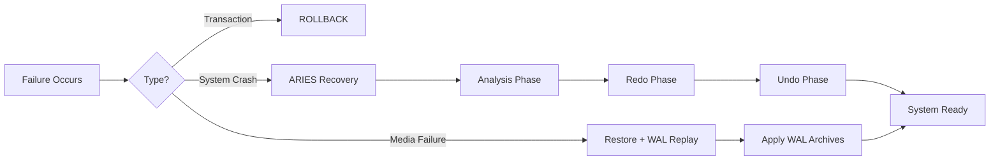
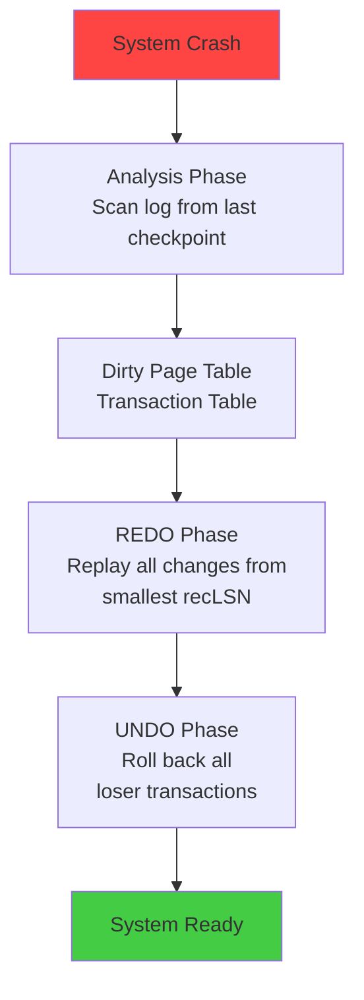

# Chapter 11: Recovery System

> **Previous:** [Chapter 10: Concurrency Control](./10-concurrency.md) | **Next:** [Chapter 12: Indexing](./12-indexing.md)

## Learning Objectives

- Classify types of database failures and their causes
- Understand the role of the log in database recovery
- Implement log-based recovery with undo and redo
- Explain checkpointing and its purpose
- Describe the ARIES recovery algorithm
- Understand steal/no-steal and force/no-force buffer policies
- Compare UNDO vs REDO vs UNDO/REDO logging methods
- Implement recovery algorithms in C++ and Python
- Analyze shadow paging and its trade-offs

## Chapter at a Glance

| Topic | Key Insight | Practical Takeaway |
|-------|-------------|-------------------|
| **Failure Types** | Four categories: transaction, system, media, catastrophic | Match recovery strategy to failure type |
| **Buffer Policies** | STEAL/NO-FORCE requires both undo and redo | Most DBMS use STEAL/NO-FORCE |
| **Write-Ahead Log** | Log record must reach stable storage before data page | Enable WAL in all production databases |
| **ARIES Algorithm** | Three-phase recovery: Analysis -> Redo -> Undo | Industry standard for PostgreSQL, Oracle, SQL Server |
| **Checkpoints** | Limit the scope of recovery scans | Monitor checkpoint frequency for optimal performance |
| **Media Recovery** | Full backups + WAL archiving = point-in-time recovery | Always test restores |
| **Shadow Paging** | Copy-on-write page replacement | No log needed, but poor concurrency |
| **Logging Methods** | UNDO, REDO, UNDO/REDO each have distinct use cases | Choose based on buffer policy |

## Chapter Roadmap



---

### 11.1 Failure Classification


Database systems face various failure scenarios. Each requires a different recovery strategy. Understanding failure classification is the first step in designing a robust recovery subsystem.

#### 11.1.1 Transaction Failures

A transaction fails when it cannot complete its execution successfully.

**Causes:**
- Logical errors: division by zero, constraint violation, type mismatch
- System errors: deadlock selected as victim, resource limit exceeded, timeout
- User intervention: manual ROLLBACK or application-level abort

**Real-World Analogy:** A bank teller starts processing a withdrawal but discovers the account is frozen. The teller cancels the transaction, returns the slip, and no money moves. The database equivalent is a ROLLBACK that restores all changes made by the aborted transaction.

**Numbered Steps for Handling Transaction Failure:**
1. Detect failure (exception, deadlock notification, user abort)
2. Identify all modified pages by the transaction
3. Read the log backward to find all UPDATE records for this transaction
4. Restore old values from UndoInfo for each UPDATE
5. Write an ABORT record to the log
6. Release all locks held by the transaction
7. Notify the application or scheduler

**Pseudocode:**
```
PROCEDURE HandleTransactionFailure(TID):
    logRecord = ReadLastLogRecord(TID)
    WHILE logRecord IS NOT NULL:
        IF logRecord.type == UPDATE:
            RestorePage(logRecord.pageID, logRecord.oldValue)
            WriteCLR(TID, logRecord.LSN, logRecord.pageID, logRecord.newValue, logRecord.oldValue)
        logRecord = ReadPreviousLogRecord(TID, logRecord.prevLSN)
    WriteLogRecord(TID, ABORT)
    ReleaseLocks(TID)
```

#### 11.1.2 System Failures (Soft Crashes)

The DBMS, OS, or hardware crashes, but non-volatile storage (disk) remains intact. Contents of volatile memory (buffers, cache) are lost.

**Causes:**
- Power failure
- OS kernel panic
- DBMS process crash (segfault, assertion failure)
- Hardware fault in CPU or memory

**Real-World Analogy:** An office worker has papers spread across their desk (buffer pool). A janitor turns off the lights, and in the dark, the worker cannot see what they were working on. They turn the lights back on and check their notebook (the log) to figure out which documents were finished (committed) and which were in progress (uncommitted), then redo finished work and discard in-progress work.

**Numbered Steps for System Failure Recovery:**
1. Restart the DBMS after the crash
2. Load the last checkpoint record from the log
3. Run Analysis phase to rebuild Transaction Table and Dirty Page Table
4. Run Redo phase from the REDO LSN to reapply all changes
5. Run Undo phase to roll back uncommitted transactions
6. Resume normal operation

**Pseudocode:**
```
PROCEDURE CrashRecovery():
    checkpoint = ReadLastCheckpoint()
    tt, dpt, redoLSN = Analysis(checkpoint)
    Redo(redoLSN, dpt)
    Undo(tt)
    ResumeNormalOperation()

PROCEDURE Analysis(checkpoint):
    tt = empty Transaction Table
    dpt = empty Dirty Page Table
    logRecord = ReadFrom(checkpoint.LSN)
    WHILE logRecord IS NOT NULL:
        IF logRecord.type == BEGIN:
            tt.Add(logRecord.TID, ACTIVE, logRecord.LSN)
        IF logRecord.type == UPDATE:
            tt.UpdateLastLSN(logRecord.TID, logRecord.LSN)
            IF logRecord.pageID NOT IN dpt:
                dpt.Add(logRecord.pageID, logRecord.LSN)
        IF logRecord.type == COMMIT:
            tt.SetStatus(logRecord.TID, COMMITTED)
        IF logRecord.type == ABORT:
            tt.SetStatus(logRecord.TID, ABORTED)
        logRecord = ReadNext()
    redoLSN = min(dpt.recoveryLSNs)
    RETURN tt, dpt, redoLSN

PROCEDURE Redo(redoLSN, dpt):
    logRecord = ReadFrom(redoLSN)
    WHILE logRecord IS NOT NULL:
        IF logRecord.type == UPDATE:
            page = ReadPage(logRecord.pageID)
            IF page.LSN < logRecord.LSN AND dpt.Contains(logRecord.pageID):
                ApplyUpdate(page, logRecord.newValue)
                page.LSN = logRecord.LSN
                WritePage(page)
        logRecord = ReadNext()

PROCEDURE Undo(tt):
    losers = tt.GetActiveTransactions()
    WHILE losers IS NOT EMPTY:
        tid = losers.GetLastLSN()
        logRecord = ReadByLSN(tid.lastLSN)
        WHILE logRecord IS NOT NULL AND logRecord.type != BEGIN:
            IF logRecord.type == UPDATE:
                RestorePage(logRecord.pageID, logRecord.oldValue)
                WriteCLR(tid, logRecord.LSN)
            logRecord = ReadPrevious(tid, logRecord.prevLSN)
        WriteLogRecord(tid, ABORT)
        losers.Remove(tid)
```

#### 11.1.3 Media Failures (Hard Crashes)

The storage device itself fails. Data on non-volatile storage is partially or fully lost.

**Causes:**
- Disk head crash
- SSD controller failure
- Sector corruption
- Accidental file deletion of database files

**Real-World Analogy:** A fire burns the filing cabinet in an office. The office manager retrieves the backup tape from the safe in another building (full backup), then applies the daily transaction log (WAL archives) to bring the records up to the minute before the fire.

**Numbered Steps for Media Failure Recovery:**
1. Detect media failure (I/O error, checksum mismatch)
2. Take the affected database partition offline
3. Restore the last full backup to a new storage device
4. Apply incremental/differential backups on top
5. Replay WAL archives from the backup point to the desired recovery point
6. Bring the database partition back online
7. Verify data integrity

**Pseudocode:**
```
PROCEDURE MediaRecovery(backupPath, walArchivePath, recoveryTargetLSN):
    OfflinePartition()
    RestoreFullBackup(backupPath)
    IF incrementalBackup exists:
        RestoreIncrementalBackup(incrementalBackup)
    IF differentialBackup exists:
        RestoreDifferentialBackup(differentialBackup)
    ReplayWAL(walArchivePath, recoveryTargetLSN)
    VerifyIntegrity()
    OnlinePartition()
```

#### 11.1.4 Complexity Analysis of Failure Handling

| Failure Type | Detection Cost | Recovery Cost | Notes |
|-------------|---------------|--------------|-------|
| Transaction | O(1) to detect | O(k) where k = log records for that Txn | Fast, localized |
| System Crash | O(1) on restart | O(L) where L = log size since last checkpoint | Dominated by log scan |
| Media Failure | O(1) on I/O error | O(D + W) where D = backup size, W = WAL size | I/O bound |

#### 11.1.5 Advantages & Disadvantages of Failure Classification

| Aspect | Advantage | Disadvantage |
|--------|-----------|-------------|
| Separation of concerns | Each failure has a specialized handler | Multiple handlers add complexity |
| Transaction failure handling | Fast, no disk I/O for small transactions | Long-running transactions accumulate many log records to undo |
| System crash recovery | Comprehensive, no data loss | Full log scan is expensive for large logs |
| Media failure recovery | Survives total disk loss | Requires off-site backups and WAL archiving |

#### 11.1.6 Edge Cases in Failure Handling

1. **System crash during transaction failure handling:** Recovery itself is interrupted. On next restart, the analysis phase re-detects the failed transaction and resumes undo. The CLRs written during the first attempt prevent double-undo.

2. **System crash during media recovery:** The backup restore is partially complete. Restart the media recovery process; the restore operation is idempotent when using block-level checksums.

3. **Log overflow:** The log device runs out of space. The DBMS must halt all new transactions until checkpointing frees log space or the DBA allocates more storage.

4. **Torn page:** A partial page write occurs during a crash (e.g., only 4KB of an 8KB page is written). The page has a mix of old and new data. Recovery detects this via the page LSN / checksum and must restore from the log or a clean copy.

5. **Catastrophic failure cascading:** A media failure occurs during the checkpoint write, corrupting both the data files and the checkpoint record. Recovery must scan the entire log from the beginning.

#### 11.1.7 C++ Implementation: Failure Classifier

```cpp
#include <iostream>
#include <string>
#include <vector>
#include <unordered_map>
#include <algorithm>

enum class FailureType { TRANSACTION, SYSTEM_CRASH, MEDIA, CATASTROPHIC };
enum class RecoveryMethod { ROLLBACK, ARIES, RESTORE_WAL, DISASTER_RECOVERY };

struct FailureEvent {
    FailureType type;
    std::string description;
    int64_t timestamp;
};

class FailureClassifier {
public:
    static RecoveryMethod Classify(FailureType ft) {
        switch (ft) {
            case FailureType::TRANSACTION:
                return RecoveryMethod::ROLLBACK;
            case FailureType::SYSTEM_CRASH:
                return RecoveryMethod::ARIES;
            case FailureType::MEDIA:
                return RecoveryMethod::RESTORE_WAL;
            case FailureType::CATASTROPHIC:
                return RecoveryMethod::DISASTER_RECOVERY;
        }
        return RecoveryMethod::ROLLBACK;
    }

    static void Handle(FailureEvent fe) {
        std::cout << "Handling " << fe.description << " (type="
                  << static_cast<int>(fe.type) << ") via "
                  << static_cast<int>(Classify(fe.type)) << "\n";
    }
};

int main() {
    FailureEvent fe{FailureType::SYSTEM_CRASH, "Power outage at t=1024", 1024};
    FailureClassifier::Handle(fe);
    return 0;
}
```

#### 11.1.8 Python Implementation: Failure Simulator

```python
from enum import Enum
from dataclasses import dataclass
from typing import List, Dict

class FailureType(Enum):
    TRANSACTION = 1
    SYSTEM_CRASH = 2
    MEDIA = 3
    CATASTROPHIC = 4

@dataclass
class FailureEvent:
    type: FailureType
    description: str
    timestamp: int

class FailureClassifier:
    CLASSIFICATION = {
        FailureType.TRANSACTION: "ROLLBACK",
        FailureType.SYSTEM_CRASH: "ARIES Recovery (Analysis -> Redo -> Undo)",
        FailureType.MEDIA: "Restore from backup + WAL replay",
        FailureType.CATASTROPHIC: "Disaster recovery from off-site backup"
    }

    @classmethod
    def classify(cls, event: FailureEvent) -> str:
        return cls.CLASSIFICATION[event.type]

events = [
    FailureEvent(FailureType.TRANSACTION, "Deadlock victim T42", 100),
    FailureEvent(FailureType.SYSTEM_CRASH, "Power failure", 200),
    FailureEvent(FailureType.MEDIA, "Disk head crash on /dev/sda", 300),
]
for e in events:
    print(f"[{e.timestamp}] {e.description} -> {FailureClassifier.classify(e)}")
```

---

### 11.2 Storage Hierarchy


Database systems use a hierarchy of storage types, each with different speed, cost, and persistence characteristics.

#### 11.2.1 Three Levels of Storage

**Volatile Storage (RAM, CPU Cache):**
- Contents lost when power is removed
- Used for buffer pool, transaction workspace, query intermediate results
- Access time: ~10-100 ns (L1 cache) to ~100 ns (main memory)

**Non-Volatile Storage (SSD, HDD):**
- Contents persist across power cycles
- Used for database files, logs, backups
- Access time: ~10-100 us (SSD) to ~5-15 ms (HDD)

**Stable Storage:**
- Fully replicated non-volatile storage (RAID, remote mirroring)
- Survives individual device failures
- Used for transaction logs, critical metadata

**Real-World Analogy:** An office has three types of storage:
1. **Notepad on the desk (volatile):** Quick to write and read, but easily lost if the janitor cleans the desk
2. **Filing cabinet (non-volatile):** Slower but survives overnight; documents filed here persist
3. **Safe deposit box at a bank (stable):** Replicated, fireproof, survives building-level disasters

#### 11.2.2 Storage Hierarchy Steps for Recovery

1. On transaction BEGIN: allocate workspace in volatile memory
2. On transaction UPDATE: modify page in buffer pool (volatile)
3. On log write: force log record to stable storage (synchronous write)
4. On checkpoint: flush dirty pages from volatile to non-volatile (async)
5. On COMMIT: write COMMIT record to stable storage, then acknowledge
6. On crash: volatile state lost; recover from non-volatile + stable storage

#### 11.2.3 Dry Run: Storage Behavior During Crash

| Time | Event | Volatile (Buffer) | Non-Volatile (Disk) | Stable (Log) |
|------|-------|-------------------|---------------------|--------------|
| T0 | T1: A=100 -> 50 | A=50 (dirty) | A=100 | <T1, UPDATE, A, 100, 50> |
| T1 | T1: COMMIT | A=50 (dirty) | A=100 | <T1, COMMIT> |
| T2 | T2: B=200 -> 250 | B=250 (dirty) | B=200 | <T2, UPDATE, B, 200, 250> |
| T3 | CRASH | Lost | A=100, B=200 | All log records survive |
| T4 | Recovery Redo | A=50, B=250 | A=50, B=250 | Log records reapplied |
| T5 | Recovery Undo T2 | A=50 | A=50 | T2 rolled back |

#### 11.2.4 C++ Implementation: Storage Simulator

```cpp
#include <iostream>
#include <unordered_map>
#include <string>
#include <cassert>

enum StorageLevel { VOLATILE, NON_VOLATILE, STABLE };

class StorageManager {
    std::unordered_map<std::string, int> volatile_store;
    std::unordered_map<std::string, int> nonvolatile_store;
    std::vector<std::string> stable_log;

public:
    int Read(const std::string& page, StorageLevel level) {
        switch (level) {
            case VOLATILE: return volatile_store.count(page) ? volatile_store[page] : -1;
            case NON_VOLATILE: return nonvolatile_store.count(page) ? nonvolatile_store[page] : -1;
            default: return -1;
        }
    }

    void Write(const std::string& page, int value, StorageLevel level) {
        if (level == VOLATILE) volatile_store[page] = value;
        if (level == NON_VOLATILE) nonvolatile_store[page] = value;
    }

    void Log(const std::string& record) {
        stable_log.push_back(record);
        std::cout << "WAL: " << record << "\n";
    }

    void Crash() {
        volatile_store.clear();
        std::cout << "Volatile memory lost on crash!\n";
    }

    std::vector<std::string> GetLog() const { return stable_log; }

    void FlushDirtyPage(const std::string& page) {
        if (volatile_store.count(page)) {
            nonvolatile_store[page] = volatile_store[page];
            std::cout << "Flushed " << page << " = " << volatile_store[page] << " to disk\n";
        }
    }

    void PrintState() {
        std::cout << "Volatile: "; for (auto& [k,v] : volatile_store) std::cout << k << "=" << v << " ";
        std::cout << "\nNon-Volatile: "; for (auto& [k,v] : nonvolatile_store) std::cout << k << "=" << v << " ";
        std::cout << "\n";
    }
};

int main() {
    StorageManager sm;
    sm.Write("A", 100, NON_VOLATILE);
    sm.Write("A", 50, VOLATILE);
    sm.Log("<T1, UPDATE, A, 100, 50>");
    sm.Log("<T1, COMMIT>");
    sm.Crash();
    sm.PrintState();
    std::cout << "Log survives: " << sm.GetLog().size() << " records\n";
    return 0;
}
```

#### 11.2.5 Python Implementation: Storage Hierarchy

```python
from abc import ABC, abstractmethod
from typing import Dict, List, Optional

class StorageLevel(ABC):
    @abstractmethod
    def read(self, key: str) -> Optional[int]: pass
    @abstractmethod
    def write(self, key: str, value: int): pass

class VolatileStorage(StorageLevel):
    def __init__(self):
        self.data: Dict[str, int] = {}
    def read(self, key: str) -> Optional[int]:
        return self.data.get(key)
    def write(self, key: str, value: int):
        self.data[key] = value
    def clear(self):
        self.data.clear()

class NonVolatileStorage(StorageLevel):
    def __init__(self):
        self.data: Dict[str, int] = {}
    def read(self, key: str) -> Optional[int]:
        return self.data.get(key)
    def write(self, key: str, value: int):
        self.data[key] = value

class StableStorage:
    def __init__(self):
        self.log: List[str] = []
    def append(self, record: str):
        self.log.append(record)
    def replay(self, start: int = 0):
        return self.log[start:]

vol = VolatileStorage()
nonvol = NonVolatileStorage()
stable = StableStorage()

nonvol.write("A", 100)
vol.write("A", 50)  # dirty page in buffer
stable.append("<T1, UPDATE, A, 100, 50>")
stable.append("<T1, COMMIT>")
print(f"Pre-crash: NonVol A={nonvol.read('A')}, Vol A={vol.read('A')}")
vol.clear()  # crash
print(f"Post-crash: NonVol A={nonvol.read('A')}, Vol A={vol.read('A')}")
print(f"Log records: {len(stable.log)}")
for rec in stable.log:
    print(f"  Replay: {rec}")
```

#### 11.2.6 Complexity Analysis

| Operation | Volatile | Non-Volatile | Stable Storage |
|-----------|----------|-------------|----------------|
| Read | O(1) hash lookup | O(1) page fetch + disk seek | O(log N) sequential scan |
| Write | O(1) | O(1) + disk write latency | O(1) append |
| Crash recovery cost | 0 (lost entirely) | O(D) scan dirty pages | O(L) log replay |

**Why this complexity matters:** Volatile operations are essentially free for recovery purposes because they disappear on crash. The bottleneck is stable storage log replay, which is O(L) where L is the number of log records since the last checkpoint. This is why checkpoints exist → to reduce L.

#### 11.2.7 Advantages & Disadvantages

| Aspect | Advantage | Disadvantage |
|--------|-----------|-------------|
| Volatile storage | Extremely fast reads/writes | Data lost on crash |
| Non-volatile storage | Persistent across restarts | 1000-100000x slower than RAM |
| Stable storage | Survives device failure | Requires replication = 2x cost |
| WAL on stable storage | Guarantees recoverability | Synchronous write = transaction latency |
| Buffer pool (volatile) | Reduces disk I/O significantly | Dirty pages complicate recovery |

#### 11.2.8 Edge Cases

1. **Partial stable storage failure:** RAID mirror fails on one device but the other survives. The system continues with degraded performance. Recovery reads from the surviving mirror.

2. **SSD write amplification:** Non-volatile storage (SSD) can exhibit write amplification where a small logical write causes a large physical write. This can cause unexpected latency during checkpoint flushing.

3. **Power-safe RAM (NVDIMM):** Emerging technology blurs the line between volatile and non-volatile. NVDIMM persists data through power loss, potentially simplifying recovery by avoiding redo for recently committed pages.

4. **Storage level crossing cost:** Moving a page from volatile to non-volatile during a checkpoint requires a full disk write. Too-frequent checkpoints waste I/O bandwidth.

### 11.3 Buffer Management Policies


Buffer management policies determine when modified pages are written from the volatile buffer pool to non-volatile storage. These policies directly impact what recovery algorithms must do.

#### 11.3.1 Force vs. No-Force

| Policy | Behavior | Recovery Need | Performance |
|--------|----------|--------------|-------------|
| **Force** | All modifies written to disk BEFORE commit | No redo needed | Poor (synchronous write on every commit) |
| **No-Force** | Modifies may stay in buffer after commit | Redo needed | Good (batch writes, async I/O) |

#### 11.3.2 Steal vs. No-Steal

| Policy | Behavior | Recovery Need | Performance |
|--------|----------|--------------|-------------|
| **No-Steal** | Dirty pages stay in buffer until commit | No undo needed | Poor (buffer may overflow) |
| **Steal** | Dirty pages can be written to disk before commit | Undo needed | Good (buffer can evict any page) |

#### 11.3.3 Four Policy Combinations

| Combination | Undo? | Redo? | Used By | Why |
|------------|-------|-------|---------|-----|
| STEAL / NO-FORCE | Yes | Yes | PostgreSQL, Oracle, SQL Server, DB2 | Best OLTP performance |
| NO-STEAL / FORCE | No | No | Simple embedded DBs | Simplest recovery, worst perf |
| STEAL / FORCE | Yes | No | Rare | Must undo but never redo |
| NO-STEAL / NO-FORCE | No | Yes | Theoretically possible | No undo but redo needed |

**Real-World Analogy:** A chef cooking multiple dishes:
- **STEAL:** The chef can wash and reuse a prep bowl before the dish is plated (evict dirty page before commit).
- **NO-STEAL:** The chef keeps all bowls until the dish is fully served.
- **FORCE:** The chef plates each component immediately as it's finished.
- **NO-FORCE:** The chef finishes all components, then plates everything at once.

#### 11.3.4 Why STEAL/NO-FORCE Dominates

Most commercial DBMS use **STEAL/NO-FORCE** because:
1. **STEAL** allows the buffer pool to operate with limited memory → dirty pages can be evicted under memory pressure
2. **NO-FORCE** batches writes → multiple updates to the same page in different transactions are written once
3. The combination requires both UNDO and REDO, but ARIES handles both efficiently

#### 11.3.5 C++: Buffer Policy Simulator

```cpp
#include <iostream>
#include <unordered_map>
#include <string>
#include <vector>

enum Policy { STEAL_NOFORCE, NOSTEAL_FORCE, STEAL_FORCE, NOSTEAL_NOFORCE };

class BufferPool {
    std::unordered_map<std::string, int> pages;
    std::unordered_map<std::string, bool> dirty;
    Policy policy;
    std::vector<std::string> log;

public:
    BufferPool(Policy p) : policy(p) {}

    void ReadPage(const std::string& pid, int diskValue) {
        if (!pages.count(pid)) pages[pid] = diskValue;
    }

    void WritePage(const std::string& pid, int newValue) {
        pages[pid] = newValue;
        dirty[pid] = true;
    }

    bool CanEvict(const std::string& pid) {
        if (!dirty[pid]) return true;  // clean pages always evictable
        if (policy == NOSTEAL_FORCE || policy == NOSTEAL_NOFORCE) return false;
        return true;  // STEAL policies allow eviction
    }

    void Evict(const std::string& pid) {
        if (!CanEvict(pid)) {
            std::cout << "Cannot evict dirty page " << pid << " under NO-STEAL\n";
            return;
        }
        if (dirty[pid]) log.push_back("UNDO needed for " + pid);
        pages.erase(pid);
        dirty.erase(pid);
        std::cout << "Evicted " << pid << "\n";
    }

    void ForceWrites() {
        for (auto& [pid, val] : pages) {
            if (dirty[pid]) {
                log.push_back("FORCE wrote " + pid);
                dirty[pid] = false;
            }
        }
    }

    void PrintStatus() {
        std::cout << "Policy " << policy << ": " << pages.size() << " pages, "
                  << std::count_if(dirty.begin(), dirty.end(),
                      [](auto& p) { return p.second; }) << " dirty\n";
    }
};

int main() {
    BufferPool bp(STEAL_NOFORCE);
    bp.ReadPage("P1", 100);
    bp.WritePage("P1", 200);
    bp.Evict("P1");  // Allowed under STEAL
    bp.PrintStatus();
    return 0;
}
```

#### 11.3.6 Python: Buffer Policy Analyzer

```python
from enum import Enum

class Policy(Enum):
    STEAL_NOFORCE = 1
    NOSTEAL_FORCE = 2
    STEAL_FORCE = 3
    NOSTEAL_NOFORCE = 4

class BufferManager:
    def __init__(self, policy: Policy):
        self.policy = policy
        self.pages: dict = {}
        self.dirty: set = set()

    def read(self, pid: str, disk_val: int):
        if pid not in self.pages:
            self.pages[pid] = disk_val

    def write(self, pid: str, new_val: int):
        self.pages[pid] = new_val
        self.dirty.add(pid)

    def can_evict(self, pid: str) -> bool:
        if pid not in self.dirty:
            return True
        if self.policy in (Policy.NOSTEAL_FORCE, Policy.NOSTEAL_NOFORCE):
            return False
        return True

    def evict(self, pid: str):
        if not self.can_evict(pid):
            print(f"Cannot evict {pid}: NO-STEAL policy")
            return
        if pid in self.dirty:
            print(f"Evicting dirty {pid}: UNDO may be needed later")
            self.dirty.discard(pid)
        self.pages.pop(pid, None)

    def commit(self, pid: str):
        if self.policy in (Policy.STEAL_FORCE, Policy.NOSTEAL_FORCE):
            print(f"FORCE writing {pid}")
            self.dirty.discard(pid)

bm = BufferManager(Policy.STEAL_NOFORCE)
bm.read("P1", 100)
bm.write("P1", 50)
bm.commit("P1")      # No FORCE write under NO-FORCE
bm.evict("P1")       # Allowed under STEAL
print(f"Policy {bm.policy} requires REDO={True}, UNDO={True}")
```

#### 11.3.7 Complexity Analysis

| Policy | Normal Op Cost | Recovery Cost |
|--------|--------------|--------------|
| STEAL/NO-FORCE | Low (async writes, flexible eviction) | High (both undo + redo phases) |
| NO-STEAL/FORCE | High (sync writes, restricted eviction) | Low (no undo, no redo) |
| STEAL/FORCE | Medium (async eviction, sync commit) | Medium (undo only) |
| NO-STEAL/NO-FORCE | Medium (restricted eviction, async writes) | Medium (redo only) |

**Why STEAL/NO-FORCE wins:** The normal-operation cost dominates because databases run 99.99% of the time in normal mode and only 0.01% in recovery. A slightly higher recovery cost is worth a much lower normal-operation cost.

#### 11.3.8 A&D Table

| Advantage | Disadvantage |
|-----------|-------------|
| STEAL enables memory-efficient buffer management | UNDO requires tracking all uncommitted changes |
| NO-FORCE enables write batching and group commit | REDO requires scanning log during recovery |
| Flexible eviction prevents buffer starvation | Recovery algorithm is more complex |
| Proven in thousands of production systems | Cannot recover without a complete log |

#### 11.3.9 Edge Cases

1. **Buffer pool exhaustion under NO-STEAL:** A long-running transaction modifies many pages. Under NO-STEAL, none can be evicted, and the buffer pool fills up, causing the DBMS to block.

2. **Group commit under NO-FORCE:** Multiple transactions commit around the same time. Their COMMIT log records can be written together in one fsync, vastly improving throughput. This is a NO-FORCE benefit.

3. **FORCE with SSD:** Synchronous write on every commit degrades SSD lifespan due to write amplification. NO-FORCE reduces total writes.

---

### 11.4 The Write-Ahead Log (WAL)


The Write-Ahead Log is the foundation of all modern database recovery. The rule is simple but absolute:

**WAL Principle:** Every log record must reach stable storage BEFORE the corresponding data page is written to disk.

#### 11.4.1 Two WAL Rules

1. **Undo rule:** Before a dirty page is written to non-volatile storage, all log records describing changes to that page must already be on stable storage.
2. **Redo rule:** Before a transaction is reported as committed, its COMMIT log record must be on stable storage.

#### 11.4.2 Log Record Structure

Every log record has this structure:
```
<LSN, TransactionID, PageID, RedoInfo, UndoInfo, PrevLSN>
```

**LSN (Log Sequence Number):** Monotonically increasing, typically the byte offset in the log file. Each new log record gets a higher LSN.

**PrevLSN:** Points to the previous log record of the same transaction, forming a backward chain per transaction.

**Log Record Types:**
- `<T1, BEGIN>` → Transaction start
- `<T1, UPDATE, P, Old=X, New=Y>` → Page modification
- `<T1, COMMIT>` → Transaction commit
- `<T1, ABORT>` → Transaction abort
- `<CLR, T1, UndoNext=L, P, RedoInfo>` → Compensation Log Record (undo tracking)

#### 11.4.3 Log Buffer vs. Write-Ahead Log

| Aspect | Log Buffer (Volatile) | Write-Ahead Log (Stable Storage) |
|--------|----------------------|---------------------------------|
| Location | RAM | Disk (SSD/HDD) |
| Speed | ~10-100 ns writes | ~10 us-10 ms writes |
| Persistence | Lost on crash | Survives crash |
| Size | MB-GB (limited by RAM) | GB-TB (disk-bound) |
| Write strategy | Batch writes, then fsync | Group commit, sequential append |
| Purpose | Absorb write bursts | Guarantee durability |

**How they work together:**
1. Transaction modifies a page. Log record is written to the **log buffer** (in-memory, fast)
2. At commit time (or when the buffer is full), the log buffer is flushed to the **WAL file** (synchronous fsync)
3. The WAL file on stable storage is the source of truth during recovery

**Real-World Analogy:** The log buffer is like a waiter's notepad → quick to scribble orders on. The WAL on disk is the kitchen's order ticket → once the ticket is in the kitchen, the order is guaranteed to be cooked even if the waiter loses their notepad.

#### 11.4.4 Physical vs. Logical vs. Physiological Logging

| Logging Type | Granularity | Size | Undo Complexity | Used By |
|-------------|------------|------|----------------|---------|
| **Physical** | Byte-level (page ID + offset + before/after image) | Large | Simple (just restore bytes) | MySQL InnoDB |
| **Logical** | Operation-level (INSERT, DELETE, UPDATE) | Small | Complex (must handle concurrent changes) | N/A (rare) |
| **Physiological** | Physical page, logical within page | Medium | Balanced | PostgreSQL, Oracle |

**Physiological logging** is the most common compromise. Example:
- Physical: `Page 42, Offset 128, Before=100, After=50` (16 bytes + page header)
- Logical: `UPDATE accounts SET balance=50 WHERE id=1` (varies, ~40 bytes)
- Physiological: `Page 42, Slot 3, Before=100, After=50` (12 bytes, page-level physical but slot-level logical)

#### 11.4.5 C++: Log Manager

```cpp
#include <iostream>
#include <fstream>
#include <string>
#include <vector>
#include <mutex>
#include <cstdint>

struct LogRecord {
    int64_t LSN;
    std::string TID;
    std::string type;   // BEGIN, UPDATE, COMMIT, ABORT, CLR
    std::string pageID;
    std::string oldValue;
    std::string newValue;
    int64_t prevLSN;
    int64_t undoNextLSN;  // for CLR records
};

class LogManager {
    std::vector<LogRecord> buffer;
    int64_t currentLSN = 0;
    int64_t flushedLSN = 0;
    std::ofstream walFile;
    std::mutex mtx;
    size_t bufferThreshold = 100;

public:
    LogManager(const std::string& walPath) : walFile(walPath, std::ios::binary | std::ios::app) {
        if (!walFile) throw std::runtime_error("Cannot open WAL file");
    }

    int64_t Append(const std::string& tid, const std::string& type,
                   const std::string& pageID = "",
                   const std::string& oldVal = "",
                   const std::string& newVal = "") {
        std::lock_guard<std::mutex> lock(mtx);
        LogRecord rec{++currentLSN, tid, type, pageID, oldVal, newVal,
                      GetLastLSN(tid), 0};
        buffer.push_back(rec);
        if (buffer.size() >= bufferThreshold) FlushBuffer();
        return currentLSN;
    }

    void AddCLR(const std::string& tid, int64_t undoNextLSN,
                const std::string& pageID, const std::string& redoInfo) {
        std::lock_guard<std::mutex> lock(mtx);
        LogRecord rec{++currentLSN, tid, "CLR", pageID, "", redoInfo,
                      GetLastLSN(tid), undoNextLSN};
        buffer.push_back(rec);
    }

    void FlushBuffer() {
        for (auto& rec : buffer) {
            walFile << rec.LSN << "|" << rec.TID << "|" << rec.type << "|"
                    << rec.pageID << "|" << rec.oldValue << "|" << rec.newValue
                    << "|" << rec.prevLSN << "|" << rec.undoNextLSN << "\n";
        }
        walFile.flush();
        flushedLSN = currentLSN;
        buffer.clear();
    }

    int64_t GetLastLSN(const std::string& tid) {
        for (auto it = buffer.rbegin(); it != buffer.rend(); ++it)
            if (it->TID == tid) return it->LSN;
        return 0;
    }

    void PrintState() {
        std::cout << "LSN=" << currentLSN << " Flushed=" << flushedLSN
                  << " Buffer=" << buffer.size() << "\n";
    }
};

int main() {
    LogManager lm("wal.log");
    lm.Append("T1", "BEGIN");
    lm.Append("T1", "UPDATE", "P1", "100", "50");
    lm.Append("T1", "COMMIT");
    lm.FlushBuffer();
    lm.PrintState();
    return 0;
}
```

#### 11.4.6 Python: WAL Manager

```python
import os
import json
from typing import List, Dict, Optional
from dataclasses import dataclass, asdict
from enum import Enum

class LogType(Enum):
    BEGIN = "BEGIN"
    UPDATE = "UPDATE"
    COMMIT = "COMMIT"
    ABORT = "ABORT"
    CLR = "CLR"

@dataclass
class LogRecord:
    LSN: int
    TID: str
    type: str
    pageID: str = ""
    oldValue: str = ""
    newValue: str = ""
    prevLSN: int = 0
    undoNextLSN: int = 0

class WALManager:
    def __init__(self, path: str = "wal.log"):
        self.path = path
        self.buffer: List[LogRecord] = []
        self.currentLSN = 0
        self.flushedLSN = 0
        self.buffer_size = 0
        self.max_buffer = 100 * 1024  # 100KB

    def append(self, tid: str, type: str, pageID: str = "",
               oldVal: str = "", newVal: str = "") -> int:
        prevLSN = self._get_last_lsn(tid)
        self.currentLSN += 1
        rec = LogRecord(self.currentLSN, tid, type, pageID, oldVal, newVal, prevLSN)
        self.buffer.append(rec)
        self.buffer_size += len(json.dumps(asdict(rec)))
        if self.buffer_size >= self.max_buffer:
            self.flush()
        return self.currentLSN

    def add_clr(self, tid: str, undo_next_lsn: int, pageID: str, redo_info: str) -> int:
        prevLSN = self._get_last_lsn(tid)
        self.currentLSN += 1
        rec = LogRecord(self.currentLSN, tid, "CLR", pageID, "", redo_info, prevLSN, undo_next_lsn)
        self.buffer.append(rec)
        return self.currentLSN

    def flush(self):
        with open(self.path, "a") as f:
            for rec in self.buffer:
                f.write(json.dumps(asdict(rec)) + "\n")
            os.fsync(f.fileno())
        self.flushedLSN = self.currentLSN
        self.buffer.clear()
        self.buffer_size = 0

    def read_log(self) -> List[LogRecord]:
        records = []
        if not os.path.exists(self.path):
            return records
        with open(self.path, "r") as f:
            for line in f:
                line = line.strip()
                if line:
                    data = json.loads(line)
                    records.append(LogRecord(**data))
        return records

    def _get_last_lsn(self, tid: str) -> int:
        for rec in reversed(self.buffer):
            if rec.TID == tid:
                return rec.LSN
        for rec in reversed(self.read_log()):
            if rec.TID == tid:
                return rec.LSN
        return 0

# Demo
wal = WALManager("demo_wal.log")
lsn1 = wal.append("T1", "BEGIN")
lsn2 = wal.append("T1", "UPDATE", "P1", "100", "50")
lsn3 = wal.append("T1", "COMMIT")
wal.flush()
for rec in wal.read_log():
    print(f"LSN={rec.LSN} {rec.TID} {rec.type} page={rec.pageID} {rec.oldValue}->{rec.newValue}")
```

#### 11.4.7 Logging Methods Comparison: UNDO vs REDO vs UNDO/REDO

| Aspect | UNDO Only | REDO Only | UNDO/REDO Combined |
|--------|-----------|-----------|-------------------|
| **When used** | NO-STEAL / FORCE | STEAL / FORCE | STEAL / NO-FORCE |
| **Log record content** | Old value only | New value only | Both old and new values |
| **What happens during recovery** | Undo uncommitted txns | Redo committed txns | Undo losers + Redo winners |
| **Normal operation overhead** | Low medium | Low medium | Higher (both values logged) |
| **Recovery complexity** | Low | Low | High (two phases) |
| **Buffer policy** | NO-STEAL/FORCE | STEAL/FORCE | STEAL/NO-FORCE |
| **Example systems** | Early System R | Early System R | PostgreSQL, Oracle, SQL Server |
| **Log record size** | Small (old value only) | Small (new value only) | Large (old + new) |

**UNDO Logging:**
- Only stores the **before-image** (old value)
- Used when dirty pages cannot be stolen (NO-STEAL) → because uncommitted dirty pages are never on disk, we only need to undo committed-but-not-yet-flushed changes
- During recovery: scan backward, restore old values for uncommitted transactions

**REDO Logging:**
- Only stores the **after-image** (new value)
- Used when dirty pages are never forced to disk at commit (NO-FORCE absence) → because all committed pages are on disk, we only need to redo the ones that didn't make it
- During recovery: scan forward, apply new values for committed transactions

**UNDO/REDO Combined:**
- Stores both **before and after images**
- Required for STEAL (undo needed) + NO-FORCE (redo needed) → the most common combination
- During recovery: redo all forward, then undo losers backward

#### 11.4.8 Deferred vs Immediate Update Comparison

| Aspect | Deferred Update | Immediate Update |
|--------|----------------|-----------------|
| **When page is modified** | At COMMIT time | At UPDATE time (in-place) |
| **Dirty pages in buffer** | Only after COMMIT | Immediately |
| **Undo needed?** | No (changes not yet applied) | Yes (changes may need reversal) |
| **Redo needed?** | Maybe (if COMMIT written but pages not flushed) | Maybe (if COMMIT written but pages not flushed) |
| **Concurrency** | Poor (locks held until commit) | Better (locks released earlier) |
| **Buffer usage** | High (all changes staged) | Low (changes applied in-place) |
| **Used by** | Early systems, some mainframe DBs | All modern DBMS |
| **Recovery complexity** | Low (no undo) | Higher (must undo losers) |

**Real-World Analogy:**
- **Deferred Update:** A chef writes orders on sticky notes. When the customer pays (commits), only then does the chef start cooking. If the order is canceled (aborts), the chef just throws away the sticky note → no food wasted.
- **Immediate Update:** The chef starts cooking immediately when the order arrives. If the customer cancels, the chef must scrape the half-cooked food into the trash (undo).

#### 11.4.9 Complexity Analysis of WAL Operations

| Operation | Time Complexity | Space Complexity | Why |
|-----------|----------------|-----------------|-----|
| Log record append | O(1) avg / O(N) when buffer full | O(1) per record | Append to in-memory buffer; occasional flush |
| Log flush (fsync) | O(B) where B = buffer size | O(1) | Write whole buffer sequentially to disk |
| Log scan from checkpoint | O(L) where L = records since checkpoint | O(1) | Sequential read of log file |
| Log record lookup by LSN | O(log L) with index | O(L) for index | Binary search on LSN index |
| Log truncation after checkpoint | O(1) truncate operation | O(1) | File system truncate; may cause fragmentation |

**Why WAL is fast:** The log is written sequentially, not randomly. Sequential disk I/O is 10-100x faster than random I/O. This is why WAL's additional write doesn't hurt performance as much as expected.

#### 11.4.10 A&D Table

| Advantage | Disadvantage |
|-----------|-------------|
| Guarantees durability (committed data never lost) | Every transaction pays a synchronous write cost |
| Sequential writes are fast | Log can grow very large without checkpointing |
| Enables point-in-time recovery | Requires additional storage for log files |
| Works with any buffer policy | Recovery time grows with log size |
| Simple, well-understood protocol | Log management adds operational complexity |

#### 11.4.11 Edge Cases

1. **WAL file corruption:** A bad sector on the log device corrupts a log record. The DBMS must detect this via checksums and may need to recover to the point before corruption, losing the most recent transactions.

2. **Log device full:** No more log records can be written. All transactions are blocked until checkpointing frees space or the DBA adds storage.

3. **Group commit race:** Multiple threads commit simultaneously. They share one fsync call. But if the system crashes between writing COMMIT records to the buffer and fsyncing, none of the group have actually committed.

4. **Very long-running transaction:** A transaction running for hours generates many log records. If it aborts, the UNDO phase must process all of them, which can take significant time.

5. **Log buffer too small:** Under heavy write load, the log buffer fills faster than it can be flushed. This becomes a bottleneck. Increasing the log buffer size can significantly improve throughput.

### 11.5 Log-Based Recovery Algorithms


Log-based recovery uses the Write-Ahead Log to restore the database to a consistent state after a failure. There are three main strategies: UNDO, REDO, and combined UNDO/REDO.

#### 11.5.1 UNDO Logging

UNDO logging records only the **old value** (before-image) of each modification. During recovery, uncommitted transactions are rolled back by restoring old values.

**When UNDO Logging Is Used:**
- Buffer policy: NO-STEAL / FORCE (or any policy where uncommitted data may be on disk)
- The system can guarantee that committed data has reached disk
- Recovery only needs to undo losers

**Real-World Analogy:** A person filling out a paper form writes in pencil. If they make a mistake, they use an eraser to go back to the previous correct value. The log is a carbon copy of each filled-out field before it was changed.

**Numbered Steps:**
1. When a transaction modifies page P: write `<T, P, old_value>` to log
2. When the transaction commits: write `<T, COMMIT>` to log and flush log to stable storage
3. During recovery: scan log backward; for each uncommitted UPDATE, restore old value
4. Write an ABORT record for each uncommitted transaction

**Pseudocode:**
```
PROCEDURE UndoLogRecovery():
    losers = FindUncommittedTransactions()
    Scan log BACKWARD:
        IF record.type == UPDATE AND record.TID in losers:
            RestorePage(record.pageID, record.oldValue)
        IF record.type == COMMIT:
            Remove record.TID from losers
    FOR each tid in losers:
        WriteLogRecord(tid, ABORT)
```

**Dry Run Trace Table → UNDO Recovery:**

Initial state: A=100, B=200 (both on disk).

| Log | Event | Buffer A | Buffer B | Disk A | Disk B |
|-----|-------|----------|----------|--------|--------|
| | Start | 100 | 200 | 100 | 200 |
| 1: &lt;T1, BEGIN&gt; | T1 begins | | | | |
| 2: &lt;T1, A, 100&gt; | T1: A=50 | 50 | | | |
| 3: &lt;T1, B, 200&gt; | T1: B=250 (FORCE) | 50 | 250 | 100 | 250 |
| 4: &lt;T1, COMMIT&gt; | T1 commits, flush log | | | | |
| 5: &lt;T2, BEGIN&gt; | T2 begins | | | | |
| 6: &lt;T2, A, 50&gt; | T2: A=70 | 70 | | | |
| --- CRASH --- | | Lost | Lost | 100 | 250 |

Recovery scan backward:
- LSN 6: T2 active? YES. Restore A=50.
- LSN 5: BEGIN → skip.
- LSN 4: T1 committed → remove from losers.
- LSN 3: T1 committed → skip.
- LSN 2: T1 committed → skip.
- LSN 1: BEGIN → skip.

Final state: A=50, B=250. T2's change to A is undone. T1's changes are fully applied.

**C++: UNDO Log Recovery**
```cpp
#include <iostream>
#include <vector>
#include <unordered_map>
#include <string>
#include <sstream>

struct UndoLogEntry {
    int LSN;
    std::string TID;
    std::string type; // BEGIN, UPDATE, COMMIT, ABORT
    std::string page;
    int oldVal;
};

class UndoLogRecovery {
    std::vector<UndoLogEntry> log;
    std::unordered_map<std::string, int> disk;

public:
    UndoLogRecovery(std::unordered_map<std::string, int> initial)
        : disk(std::move(initial)) {}

    void AddLog(int lsn, const std::string& tid, const std::string& type,
                const std::string& page = "", int oldVal = 0) {
        log.push_back({lsn, tid, type, page, oldVal});
    }

    void Recover() {
        std::unordered_map<std::string, bool> committed;
        for (auto& rec : log) {
            if (rec.type == "COMMIT") committed[rec.TID] = true;
            if (rec.type == "ABORT") committed[rec.TID] = true;
        }

        for (auto it = log.rbegin(); it != log.rend(); ++it) {
            if (it->type == "UPDATE" && !committed[it->TID]) {
                disk[it->page] = it->oldVal;
                std::cout << "UNDO: Restored " << it->page << "=" << it->oldVal << "\n";
            }
        }

        for (auto& rec : log) {
            if (rec.type == "UPDATE" && committed[rec.TID]) {
                std::cout << "REDO (not needed in UNDO-only): " << rec.page << "\n";
            }
        }
    }

    void PrintState() {
        for (auto& [k, v] : disk)
            std::cout << "Page " << k << " = " << v << "\n";
    }
};

int main() {
    UndoLogRecovery ur({{"A", 100}, {"B", 200}});
    ur.AddLog(1, "T1", "BEGIN");
    ur.AddLog(2, "T1", "UPDATE", "A", 100);
    ur.AddLog(3, "T1", "UPDATE", "B", 200);
    ur.AddLog(4, "T1", "COMMIT");
    ur.AddLog(5, "T2", "BEGIN");
    ur.AddLog(6, "T2", "UPDATE", "A", 50);
    // crash
    ur.Recover();
    ur.PrintState();
    return 0;
}
```

**Python: UNDO Log Recovery**
```python
from dataclasses import dataclass
from typing import Dict, List

@dataclass
class LogRecord:
    LSN: int
    TID: str
    type: str
    page: str = ""
    old_val: int = 0

def undo_recovery(log: List[LogRecord], disk: Dict[str, int]):
    committed = {r.TID for r in log if r.type == "COMMIT" or r.type == "ABORT"}
    for rec in reversed(log):
        if rec.type == "UPDATE" and rec.TID not in committed:
            disk[rec.page] = rec.old_val
            print(f"UNDO: {rec.page} -> {rec.old_val}")
    return disk

log = [
    LogRecord(1, "T1", "BEGIN"),
    LogRecord(2, "T1", "UPDATE", "A", 100),
    LogRecord(3, "T1", "UPDATE", "B", 200),
    LogRecord(4, "T1", "COMMIT"),
    LogRecord(5, "T2", "BEGIN"),
    LogRecord(6, "T2", "UPDATE", "A", 50),
]
disk = {"A": 100, "B": 200}
disk = undo_recovery(log, disk)
print(f"Final: {disk}")  # A=50, B=200 (T2's change to A undone)
```

---

#### 11.5.2 REDO Logging

REDO logging records only the **new value** (after-image). During recovery, committed transactions' changes are reapplied to ensure they reached disk.

**When REDO Logging Is Used:**
- Buffer policy: STEAL / FORCE (committed data may not have reached disk)
- Uncommitted data is never on disk (FORCE ensures commit-time flush)
- Recovery only needs to redo winners

**Real-World Analogy:** A teacher grades papers and records scores in a gradebook (log). If the gradebook is lost (crash), the teacher has a separate list of final scores and can re-enter them. Unfinished work is simply discarded.

**Numbered Steps:**
1. When a transaction modifies page P: write `<T, P, new_value>` to log
2. When the transaction commits: write `<T, COMMIT>` to log
3. During recovery: scan log forward; for each committed UPDATE, apply new value
4. Uncommitted transactions are simply ignored (their changes never made it to disk)

**Pseudocode:**
```
PROCEDURE RedoLogRecovery():
    winners = FindCommittedTransactions()
    Scan log FORWARD from last checkpoint:
        IF record.type == UPDATE AND record.TID in winners:
            ApplyUpdate(record.pageID, record.newValue)
```

**Dry Run Trace Table → REDO Recovery:**

Initial state: A=100, B=200.

| Log | Event | Buffer A | Buffer B | Disk A | Disk B |
|-----|-------|----------|----------|--------|--------|
| | Start | 100 | 200 | 100 | 200 |
| 1: &lt;T1, BEGIN&gt; | T1 begins | | | | |
| 2: &lt;T1, A, 50&gt; | T1: A=50 | 50 | | | |
| 3: &lt;T1, B, 250&gt; | T1: B=250 | 50 | 250 | | |
| 4: &lt;T1, COMMIT&gt; | T1 commits, flush log | | | | |
| 5: &lt;T2, BEGIN&gt; | T2 begins | | | | |
| 6: &lt;T2, A, 70&gt; | T2: A=70 | 70 | | | |
| --- CRASH --- | | Lost | Lost | 100 | 200 |

Recovery scan forward:
- LSN 4: T1 is committed -> winner
- Work backward from T1's last LSN:
  - LSN 3: T1 UPDATE B=250. Reapply.
  - LSN 2: T1 UPDATE A=50. Reapply.
- T2 has no COMMIT -> not a winner, ignore.

Final state: A=50, B=250. T2's change is lost (never committed).

**C++: REDO Log Recovery**
```cpp
#include <iostream>
#include <vector>
#include <unordered_map>
#include <string>

struct RedoLogEntry {
    int LSN;
    std::string TID;
    std::string type;
    std::string page;
    int newVal;
};

class RedoLogRecovery {
    std::vector<RedoLogEntry> log;
    std::unordered_map<std::string, int> disk;

public:
    RedoLogRecovery(std::unordered_map<std::string, int> initial)
        : disk(std::move(initial)) {}

    void AddLog(int lsn, const std::string& tid, const std::string& type,
                const std::string& page = "", int newVal = 0) {
        log.push_back({lsn, tid, type, page, newVal});
    }

    void Recover() {
        std::unordered_map<std::string, bool> committed;
        for (auto& rec : log)
            if (rec.type == "COMMIT") committed[rec.TID] = true;

        for (auto& rec : log) {
            if (rec.type == "UPDATE" && committed[rec.TID]) {
                disk[rec.page] = rec.newVal;
                std::cout << "REDO: Applied " << rec.page << "=" << rec.newVal << "\n";
            }
        }
    }

    void PrintState() {
        for (auto& [k, v] : disk)
            std::cout << "Page " << k << " = " << v << "\n";
    }
};

int main() {
    RedoLogRecovery rr({{"A", 100}, {"B", 200}});
    rr.AddLog(1, "T1", "BEGIN");
    rr.AddLog(2, "T1", "UPDATE", "A", 50);
    rr.AddLog(3, "T1", "UPDATE", "B", 250);
    rr.AddLog(4, "T1", "COMMIT");
    rr.AddLog(5, "T2", "BEGIN");
    rr.AddLog(6, "T2", "UPDATE", "A", 70);
    rr.Recover();
    rr.PrintState();
    return 0;
}
```

**Python: REDO Log Recovery**
```python
@dataclass
class RedoRecord:
    LSN: int
    TID: str
    type: str
    page: str = ""
    new_val: int = 0

def redo_recovery(log: List[RedoRecord], disk: Dict[str, int]):
    committed = {r.TID for r in log if r.type == "COMMIT"}
    for rec in log:
        if rec.type == "UPDATE" and rec.TID in committed:
            disk[rec.page] = rec.new_val
            print(f"REDO: {rec.page} -> {rec.new_val}")
    return disk

log = [
    RedoRecord(1, "T1", "BEGIN"),
    RedoRecord(2, "T1", "UPDATE", "A", 50),
    RedoRecord(3, "T1", "UPDATE", "B", 250),
    RedoRecord(4, "T1", "COMMIT"),
    RedoRecord(5, "T2", "BEGIN"),
    RedoRecord(6, "T2", "UPDATE", "A", 70),
]
disk = {"A": 100, "B": 200}
disk = redo_recovery(log, disk)
print(f"Final: {disk}")
```

---

#### 11.5.3 UNDO/REDO Combined Logging

Combined logging records **both old and new values**. During recovery, the system redoes all transactions (to bring the database to crash-time state), then undoes only the losers.

**When UNDO/REDO Is Used:**
- Buffer policy: STEAL / NO-FORCE (most common → used by PostgreSQL, Oracle, SQL Server)
- Dirty pages can be written to disk before commit (need UNDO)
- Committed pages may not have reached disk (need REDO)

**Real-World Analogy:** A surgeon performs an operation while a nurse records every step. If the patient's chart is lost (crash), the nurse's log allows recreating everything that was done (redo). If a step needs reversal, the log also records what was there before (undo).

**Numbered Steps:**
1. Before modifying page P: write `<T, P, old_value, new_value>` to log
2. When the transaction commits: write `<T, COMMIT>` and flush log to stable storage
3. During recovery → Analysis Phase: scan log to find winners and losers
4. During recovery → Redo Phase: scan forward, reapply all changes (both winners and losers)
5. During recovery → Undo Phase: scan backward, undo losers using old values
6. Write CLRs for each undo step to ensure idempotency

**Pseudocode:**
```
PROCEDURE UndoRedoRecovery():
    tt, dpt, redoLSN = Analysis()
    Redo(redoLSN, dpt)
    Undo(tt)

PROCEDURE Analysis():
    tt = {}  // TransactionID -> {status, lastLSN}
    dpt = {} // PageID -> recLSN
    Scan log FORWARD from last checkpoint:
        IF BEGIN: tt[TID] = {status: ACTIVE, lastLSN: LSN}
        IF UPDATE: tt[TID].lastLSN = LSN; IF page not in dpt: dpt[page] = LSN
        IF COMMIT: tt[TID].status = COMMITTED
        IF ABORT:  tt[TID].status = ABORTED
    redoLSN = min(dpt.recLSNs)
    RETURN tt, dpt, redoLSN

PROCEDURE Redo(redoLSN, dpt):
    Scan log FORWARD from redoLSN:
        IF UPDATE AND page in dpt AND pageLSN < LSN:
            ApplyUpdate(page, newValue)

PROCEDURE Undo(tt):
    losers = {TID: tt[TID].lastLSN for TID where status == ACTIVE}
    WHILE losers not empty:
        tid = select with max(lastLSN)
        Scan log BACKWARD from lastLSN:
            IF UPDATE AND tid in losers:
                RestorePage(page, oldValue)
                WriteCLR(tid, LSN, undoNextLSN, page, newValue)
    Write ABORT for each loser
```

**Dry Run Trace Table → UNDO/REDO Combined Recovery:**

Initial state: A=100, B=200.

| LSN | Log Record | Buffer A | Buffer B | Disk A | Disk B |
|-----|-----------|----------|----------|--------|--------|
| | Initial | 100 | 200 | 100 | 200 |
| 1 | <T1, BEGIN> | | | | |
| 2 | <T1, A, 100, 50> | 50 | | | |
| 3 | <T1, B, 200, 250> | 50 | 250 | | |
| 4 | <T1, COMMIT> | | | | |
| 5 | <T2, BEGIN> | | | | |
| 6 | <T2, A, 50, 70> | 70 | | | |
| -- CRASH -- | | LOST | LOST | 100 | 200 |

**Analysis Phase:**
Scan forward from LSN 1:
- LSN 1: T1 begins -> TT: {T1: ACTIVE, lastLSN=1}
- LSN 2: T1 update A -> TT: {T1: ACTIVE, lastLSN=2}, DPT: {A: 2}
- LSN 3: T1 update B -> TT: {T1: ACTIVE, lastLSN=3}, DPT: {A: 2, B: 3}
- LSN 4: T1 commits -> TT: {T1: COMMITTED, lastLSN=4}
- LSN 5: T2 begins -> TT: {T1: COMMITTED, T2: ACTIVE, lastLSN=5}
- LSN 6: T2 update A -> TT: {T1: COMMITTED, lastLSN=4, T2: ACTIVE, lastLSN=6}, DPT: {A: 2, B: 3}
- REDO LSN = min(2, 3) = 2
- Winners (REDO set) = {T1, T2}, Losers (UNDO set) = {T2}

**Redo Phase (LSN 2 to end):**
- LSN 2: Page A dirty? YES. Page LSN (0) &lt; 2? YES. Redo: A=50.
- LSN 3: Page B dirty? YES. Page LSN (0) &lt; 3? YES. Redo: B=250.
- LSN 4: COMMIT → no data change.
- LSN 5: BEGIN → no data change.
- LSN 6: Page A dirty? YES. Page LSN (50) &lt; 6? YES. Redo: A=70.

After Redo: A=70, B=250.

**Undo Phase (backward from LSN 6):**
- LSN 6: T2 active? YES. Undo: A=50. Write CLR: &lt;7, CLR, T2, UndoNext=5, A, 70, 50&gt;
- LSN 5: BEGIN → skip.
- Write &lt;T2, ABORT&gt;.

Final state: A=50, B=250. Correct!

**C++: UNDO/REDO Combined Recovery**
```cpp
#include <iostream>
#include <vector>
#include <unordered_map>
#include <unordered_set>
#include <string>

struct LogRec {
    int LSN;
    std::string TID;
    std::string type;
    std::string page;
    int oldVal;
    int newVal;
    int prevLSN;
};

class RecoveryManager {
    std::vector<LogRec> log;
    std::unordered_map<std::string, int> disk;

public:
    RecoveryManager(std::unordered_map<std::string, int> init) : disk(std::move(init)) {}

    void AddLog(int lsn, const std::string& tid, const std::string& type,
                const std::string& page = "", int oldV = 0, int newV = 0, int prev = 0) {
        log.push_back({lsn, tid, type, page, oldV, newV, prev});
    }

    struct TTEntry { std::string status; int lastLSN; };

    void Recover() {
        // Analysis Phase
        std::unordered_map<std::string, TTEntry> tt;
        std::unordered_map<std::string, int> dpt;

        for (auto& rec : log) {
            if (rec.type == "BEGIN") tt[rec.TID] = {"ACTIVE", rec.LSN};
            else if (rec.type == "UPDATE") {
                tt[rec.TID].lastLSN = rec.LSN;
                if (!dpt.count(rec.page)) dpt[rec.page] = rec.LSN;
            }
            else if (rec.type == "COMMIT") tt[rec.TID].status = "COMMITTED";
            else if (rec.type == "ABORT") tt[rec.TID].status = "ABORTED";
        }

        int redoLSN = INT_MAX;
        for (auto& [p, lsn] : dpt) redoLSN = std::min(redoLSN, lsn);

        std::cout << "Analysis: redoLSN=" << redoLSN << "\n";

        // Redo Phase
        for (auto& rec : log) {
            if (rec.LSN < redoLSN) continue;
            if (rec.type == "UPDATE" && dpt.count(rec.page)) {
                disk[rec.page] = rec.newVal;
                std::cout << "REDO: " << rec.page << "=" << rec.newVal << "\n";
            }
        }

        // Undo Phase
        for (auto it = log.rbegin(); it != log.rend(); ++it) {
            if (it->type == "UPDATE" && tt[it->TID].status == "ACTIVE") {
                disk[it->page] = it->oldVal;
                std::cout << "UNDO: " << it->page << "=" << it->oldVal << "\n";
            }
        }

        for (auto& [tid, entry] : tt)
            if (entry.status == "ACTIVE")
                std::cout << "ABORT: " << tid << "\n";
    }

    void PrintState() {
        for (auto& [k, v] : disk) std::cout << k << "=" << v << " ";
        std::cout << "\n";
    }
};

int main() {
    RecoveryManager rm({{"A", 100}, {"B", 200}});
    rm.AddLog(1, "T1", "BEGIN");
    rm.AddLog(2, "T1", "UPDATE", "A", 100, 50);
    rm.AddLog(3, "T1", "UPDATE", "B", 200, 250);
    rm.AddLog(4, "T1", "COMMIT");
    rm.AddLog(5, "T2", "BEGIN");
    rm.AddLog(6, "T2", "UPDATE", "A", 50, 70);
    rm.Recover();
    rm.PrintState();
    return 0;
}
```

**Python: UNDO/REDO Combined Recovery**
```python
@dataclass
class LogRec:
    LSN: int
    TID: str
    type: str
    page: str = ""
    old_val: int = 0
    new_val: int = 0

def undo_redo_recovery(log: List[LogRec], disk: Dict[str, int]):
    # Analysis
    tt = {}  # TID -> {status, last_lsn}
    dpt = {}  # page -> rec_lsn
    for rec in log:
        if rec.type == "BEGIN":
            tt[rec.TID] = {"status": "ACTIVE", "last_lsn": rec.LSN}
        elif rec.type == "UPDATE":
            tt.setdefault(rec.TID, {"status": "ACTIVE", "last_lsn": 0})["last_lsn"] = rec.LSN
            if rec.page not in dpt:
                dpt[rec.page] = rec.LSN
        elif rec.type in ("COMMIT", "ABORT"):
            tt.setdefault(rec.TID, {"status": "ACTIVE", "last_lsn": 0})["status"] = "COMMITTED" if rec.type == "COMMIT" else "ABORTED"
    redo_lsn = min(dpt.values()) if dpt else 1
    print(f"Analysis: redo_lsn={redo_lsn}, losers={[t for t,s in tt.items() if s['status']=='ACTIVE']}")

    # Redo
    for rec in log:
        if rec.LSN < redo_lsn: continue
        if rec.type == "UPDATE" and rec.page in dpt:
            disk[rec.page] = rec.new_val
            print(f"REDO: {rec.page}={rec.new_val}")

    # Undo
    for rec in reversed(log):
        if rec.type == "UPDATE" and tt[rec.TID]["status"] == "ACTIVE":
            disk[rec.page] = rec.old_val
            print(f"UNDO: {rec.page}={rec.old_val} (CLR written for LSN {rec.LSN})")

    for tid, entry in tt.items():
        if entry["status"] == "ACTIVE":
            print(f"ABORT: {tid}")
    return disk

log = [
    LogRec(1, "T1", "BEGIN"),
    LogRec(2, "T1", "UPDATE", "A", 100, 50),
    LogRec(3, "T1", "UPDATE", "B", 200, 250),
    LogRec(4, "T1", "COMMIT"),
    LogRec(5, "T2", "BEGIN"),
    LogRec(6, "T2", "UPDATE", "A", 50, 70),
]
disk = {"A": 100, "B": 200}
disk = undo_redo_recovery(log, disk)
print(f"Final: {disk}")
```

#### 11.5.4 Complexity Analysis of Log-Based Recovery

| Algorithm | Recovery Time | Log Space | Why |
|-----------|--------------|-----------|-----|
| UNDO only | O(L) backward scan | O(k) per txn (old values) | Must read all log records from end to find losers |
| REDO only | O(L) forward scan | O(k) per txn (new values) | Must read all log records from checkpoint |
| UNDO/REDO | O(2L) = O(L) forward + O(L) backward | O(2k) per txn (both values) | Two full log scans, plus ABORT writes |

**Where L = log records since last checkpoint, k = log records per transaction.**

**Why UNDO/REDO is 2x the work:** Each phase scans the entire relevant portion of the log once. The Redo phase goes forward, and the Undo phase goes backward. However, these are sequential scans, so the I/O pattern is efficient.

#### 11.5.5 A&D Table

| Feature | UNDO | REDO | UNDO/REDO |
|---------|------|------|-----------|
| Log record size | Small (old only) | Small (new only) | Large (both) |
| Recovery complexity | Low | Low | High |
| Buffer policy required | NO-STEAL | FORCE | STEAL/NO-FORCE |
| Normal op performance | Medium (can't steal) | Medium (must force) | Best |
| Recovery time | Fast | Fast | Slower (two passes) |
| Flexibility | Low | Low | High |

#### 11.5.6 Edge Cases

1. **UNDO-only with STEAL:** If the buffer manager steals a dirty page (writes uncommitted data to disk), UNDO-only recovery cannot correct it because it only tracks old values for committed transactions. Result: database corruption.

2. **REDO-only with NO-FORCE:** If the buffer manager does not force writes at commit, a committed page might not be on disk. REDO-only will reapply it, but REDO-only doesn't track old values, so it cannot handle STEAL.

3. **UNDO/REDO with partial page write:** The page contains a mix of old and new data. REDO reapplies the full new value, overwriting any partial write corruption. This is why UNDO/REDO is more robust.

4. **Recovery crash during UNDO phase:** CLRs ensure that on the next restart, already-undone operations are not undone again. The system reads the UndoNextLSN from the last CLR to skip already-processed records.

### 11.6 Checkpointing


A checkpoint records a consistent state of the database in the log, establishing a known-safe restart point. After a checkpoint, recovery can start from the checkpoint rather than from the beginning of the log.

#### 11.6.1 Why Checkpoints Matter

Without checkpoints, recovery would scan the entire log since the beginning of time. For a database running for months, this could be terabytes of log data. Checkpoints bound the recovery scan to only the log since the last checkpoint.

**Real-World Analogy:** A student takes notes throughout a semester. Before each exam, they create a summary document (checkpoint). If they lose their notes, they only need to reconstruct from the last summary, not from the first day of class.

#### 11.6.2 Consistent (Quiescent) Checkpoint

**Characteristics:**
- Database is quiescent: no active transactions, no in-progress operations
- All dirty pages are flushed to disk
- Simple implementation
- Database is unavailable during checkpointing

**Numbered Steps:**
1. Halt all new transaction starts
2. Wait for all active transactions to complete (commit or abort)
3. Flush all dirty buffer pages to non-volatile storage
4. Write a CHECKPOINT record to the log
5. Flush the log to stable storage
6. Resume accepting new transactions

**Pseudocode:**
```
PROCEDURE ConsistentCheckpoint():
    HaltNewTransactions()
    WaitForActiveTransactionsToFinish()
    FOR each dirty page in buffer pool:
        FlushPageToDisk(page)
    WriteLogRecord(CHECKPOINT)
    FlushLog()
    ResumeNewTransactions()
```

#### 11.6.3 Fuzzy Checkpoint

**Characteristics:**
- Database remains fully operational during checkpointing
- Dirty pages are flushed gradually (in background)
- Requires BEGIN_CHECKPOINT and END_CHECKPOINT markers
- Records current Transaction Table and Dirty Page Table

**Numbered Steps:**
1. Write BEGIN_CHECKPOINT record to log with current TT and DPT
2. Begin flushing dirty pages to disk in background (at a controlled rate)
3. Write END_CHECKPOINT record to log when all relevant pages are flushed
4. The BEGIN/END pair marks the checkpoint boundaries

**Pseudocode:**
```
PROCEDURE FuzzyCheckpoint():
    tt = CopyTransactionTable()
    dpt = CopyDirtyPageTable()
    WriteLogRecord(BEGIN_CHECKPOINT, tt, dpt)
    FOR each dirty page in dpt:
        FlushPageToDisk(page)  // background, rate-limited
    WriteLogRecord(END_CHECKPOINT)
```

#### 11.6.4 Checkpoint Types Comparison

| Aspect | Consistent (Quiescent) | Fuzzy | Action-Consistent |
|--------|----------------------|-------|-------------------|
| **DB available?** | No (quiescent) | Yes (fully available) | No (brief pause) |
| **Flush all dirty pages?** | Yes | Yes (maybe not all) | Only at action boundaries |
| **Implementation complexity** | Simple | Complex | Medium |
| **Recovery scan start** | Checkpoint LSN | BEGIN_CHECKPOINT LSN | Checkpoint LSN |
| **Overhead** | High (blocks all txns) | Low (background I/O) | Medium |
| **Used by** | Simple embedded DBs | PostgreSQL, Oracle, SQL Server | Rare |
| **Log space needed** | Minimal (one record) | More (BEGIN + END + metadata) | Medium |
| **Frequency** | Infrequent (avoid blocking) | Frequent (low overhead) | Medium |

#### 11.6.5 Dry Run Trace Table → Fuzzy Checkpoint Recovery

Scenario: Two checkpoints occurred. Crash after CP2.

| LSN | Log Record | Event |
|-----|-----------|-------|
| 1-50 | (normal operations) | Various transactions |
| 51 | BEGIN_CHECKPOINT {TT, DPT} | Fuzzy checkpoint starts |
| 52-100 | (background page flushes) | Dirty pages written gradually |
| 101 | END_CHECKPOINT | Checkpoint complete |
| 102-150 | (more transactions) | Normal operations continue |
| 151 | BEGIN_CHECKPOINT {TT, DPT} | Second checkpoint starts |
| 152-180 | (background flushes) | Pages being flushed |
| --- CRASH --- | | |

Recovery:
- Read last BEGIN_CHECKPOINT (LSN 151)
- Build TT and DPT from the checkpoint record
- Scan forward from LSN 151 to end of log (LSN 180 area)
- Apply changes since checkpoint
- REDO LSN = min DPT recovery LSNs from checkpoint

Because CP2 didn't finish (no END_CHECKPOINT), recovery uses CP1 as the base. Recovery must scan from LSN 51, not 151.

#### 11.6.6 C++: Checkpoint Manager

```cpp
#include <iostream>
#include <vector>
#include <unordered_map>
#include <string>
#include <algorithm>

struct CheckpointRecord {
    int64_t beginLSN;
    int64_t endLSN;
    std::unordered_map<std::string, std::string> transactionTable;
    std::unordered_map<std::string, int64_t> dirtyPageTable;
    bool complete;
};

class CheckpointManager {
    std::vector<CheckpointRecord> checkpoints;
    int64_t currentLSN = 0;

public:
    int64_t BeginCheckpoint(
        const std::unordered_map<std::string, std::string>& tt,
        const std::unordered_map<std::string, int64_t>& dpt) {
        currentLSN++;
        CheckpointRecord cp{currentLSN, 0, tt, dpt, false};
        checkpoints.push_back(cp);
        std::cout << "BEGIN_CHECKPOINT at LSN=" << currentLSN
                  << " with " << dpt.size() << " dirty pages\n";
        return currentLSN;
    }

    void EndCheckpoint() {
        currentLSN++;
        checkpoints.back().endLSN = currentLSN;
        checkpoints.back().complete = true;
        std::cout << "END_CHECKPOINT at LSN=" << currentLSN << "\n";
    }

    CheckpointRecord GetLastCompleteCheckpoint() {
        for (auto it = checkpoints.rbegin(); it != checkpoints.rend(); ++it)
            if (it->complete) return *it;
        return CheckpointRecord{};
    }

    int64_t GetRecoveryStartLSN() {
        auto cp = GetLastCompleteCheckpoint();
        if (cp.beginLSN == 0) return 1; // no checkpoint, start from beginning
        return cp.beginLSN;
    }

    void RecoverFromCheckpoint() {
        auto cp = GetLastCompleteCheckpoint();
        std::cout << "Recovering from LSN " << cp.beginLSN
                  << " (checkpoint at " << cp.endLSN << ")\n";
        // The redo phase starts from the earliest recLSN in the DPT
        int64_t redoLSN = INT64_MAX;
        for (auto& [page, recLSN] : cp.dirtyPageTable)
            redoLSN = std::min(redoLSN, recLSN);
        std::cout << "REDO starting from LSN=" << redoLSN << "\n";
    }
};

int main() {
    CheckpointManager cm;
    cm.BeginCheckpoint({{"T1", "ACTIVE"}}, {{"P1", 5}, {"P2", 8}});
    // background flush happens here
    cm.EndCheckpoint();
    cm.BeginCheckpoint({}, {{"P3", 12}});
    // crash before end checkpoint
    cm.RecoverFromCheckpoint();
    return 0;
}
```

#### 11.6.7 Python: Fuzzy Checkpoint Simulator

```python
import time
from dataclasses import dataclass, field
from typing import Dict, List, Optional
from enum import Enum

class PageState(Enum):
    CLEAN = 1
    DIRTY = 2
    FLUSHING = 3

@dataclass
class BufferPage:
    id: str
    state: PageState = PageState.CLEAN
    recLSN: int = 0

class FuzzyCheckpointer:
    def __init__(self, buffer_pages: Dict[str, BufferPage]):
        self.pages = buffer_pages
        self.checkpoints: List[Dict] = []

    def begin_checkpoint(self, lsns: Dict[str, int]):
        tt_snapshot = {"T1": "ACTIVE"}  # simplified
        dpt_snapshot = {pid: p.recLSN for pid, p in self.pages.items() if p.state == PageState.DIRTY}
        cp = {"beginLSN": max(lsns.values()), "tt": tt_snapshot, "dpt": dpt_snapshot, "complete": False}
        self.checkpoints.append(cp)
        print(f"BEGIN checkpoint: {len(dpt_snapshot)} dirty pages")
        return cp

    def flush_background(self, rate: int = 2):
        cp = self.checkpoints[-1]
        flushed = 0
        for pid in list(cp["dpt"].keys()):
            if flushed >= rate:
                break
            if self.pages[pid].state == PageState.DIRTY:
                self.pages[pid].state = PageState.CLEAN
                flushed += 1
                print(f"  Flushed {pid}")
        return flushed

    def end_checkpoint(self, lsns: Dict[str, int]):
        cp = self.checkpoints[-1]
        cp["endLSN"] = max(lsns.values())
        cp["complete"] = True
        print(f"END checkpoint: {len(cp['dpt'])} pages tracked, {sum(1 for p in self.pages.values() if p.state == PageState.DIRTY)} still dirty")

    def get_recovery_lsn(self) -> int:
        for cp in reversed(self.checkpoints):
            if cp.get("complete"):
                rec_lsns = list(cp["dpt"].values())
                if rec_lsns:
                    return min(rec_lsns)
        return 1

pages = {"P1": BufferPage("P1", PageState.DIRTY, 5),
         "P2": BufferPage("P2", PageState.DIRTY, 8),
         "P3": BufferPage("P3", PageState.CLEAN)}
cp = FuzzyCheckpointer(pages)
lsns = {"main": 10, "cp": 0}
cp.begin_checkpoint(lsns)
cp.flush_background(2)
cp.end_checkpoint(lsns)
print(f"Recovery would start from LSN {cp.get_recovery_lsn()}")
```

#### 11.6.8 Complexity Analysis

| Operation | Time Complexity | Why |
|-----------|----------------|-----|
| Consistent checkpoint | O(P + D) where P = dirty pages, D = flush duration | Must wait for all txns + flush all pages |
| Fuzzy checkpoint begin | O(T + P) where T = active txns, P = dirty pages | Snapshot TT and DPT |
| Fuzzy checkpoint end | O(1) | Just write marker |
| Checkpoint recovery benefit | Reduces from O(FullLog) to O(LogSinceCheckpoint) | Bounded recovery time |

**Why fuzzy checkpoints are preferred:** The cost of a fuzzy checkpoint is proportional to the number of dirty pages, not the number of transactions. A consistent checkpoint blocks ALL transactions, which is unacceptable for 24/7 systems.

#### 11.6.9 A&D Table

| Advantage | Disadvantage |
|-----------|-------------|
| Reduces recovery time dramatically | Checkpointing itself consumes I/O bandwidth |
| Fuzzy checkpoints don't block transactions | In-flight dirty pages extend recovery scope |
| Checkpoint metadata guides Analysis phase | Large DPT makes checkpoint record bigger |
| Bounds log growth (log can be truncated) | Too-frequent checkpoints hurt performance |
| Enables predictable RTO (Recovery Time Objective) | Crash during checkpoint = scan from prior checkpoint |

#### 11.6.10 Edge Cases

1. **Crash during fuzzy checkpoint:** The END_CHECKPOINT was never written. Recovery scans from the previous complete checkpoint, which includes more log records but is still correct.

2. **Page written during checkpoint flush:** A page being flushed in the background is modified by a new transaction. The flush writes a version that already includes the new change. Recovery handles this correctly because the page LSN will be >= the redo LSN.

3. **Checkpoint at peak load:** Fuzzy checkpoint begins when the buffer has thousands of dirty pages. The END_CHECKPOINT is delayed, and the next checkpoint begins before the current one finishes. Most systems allow at most one in-flight checkpoint.

4. **Log truncation race:** The checkpoint record is written, but log truncation removes records still needed for an in-progress recovery. The system must keep all log records from the oldest checkpoint needed by any replica.

---

### 11.7 The ARIES Algorithm


ARIES (Algorithm for Recovery and Isolation Exploiting Semantics) is the industry-standard recovery algorithm developed by C. Mohan at IBM in the 1990s. It powers IBM DB2, Microsoft SQL Server, and heavily influences PostgreSQL and Oracle.

#### 11.7.1 Three Core Principles

1. **Write-Ahead Logging:** Log records precede data page writes. This is non-negotiable.
2. **Repeating History During Redo:** On recovery, re-process all operations from the last known good state (checkpoint), even for transactions that will eventually be undone. This "repeat history" approach is simpler and more reliable than trying to skip uncommitted work.
3. **Logging During Undo:** Every undo action is itself logged via Compensation Log Records (CLRs). This makes recovery idempotent → if the system crashes during recovery, the next recovery attempt knows exactly how far undo progressed.

#### 11.7.2 ARIES Data Structures

**Transaction Table (TT):**
| Field | Description |
|-------|-------------|
| Transaction ID | Unique identifier |
| Status | ACTIVE, PREPARED, COMMITTED, ABORTED |
| LastLSN | LSN of the most recent log record for this transaction |

**Dirty Page Table (DPT):**
| Field | Description |
|-------|-------------|
| Page ID | Unique page identifier |
| RecLSN (Recovery LSN) | LSN of the first log record that dirtied this page |

#### 11.7.3 ARIES Recovery Phases

| Phase | Direction | Input | Output | Key Action |
|-------|-----------|-------|--------|------------|
| **1: Analysis** | Forward (from last checkpoint) | Log | TT + DPT + REDO LSN | Rebuild transaction and dirty page state |
| **2: Redo** | Forward (from REDO LSN) | Log + DPT | Updated database pages | Reapply all changes since checkpoint |
| **3: Undo** | Backward (from end of log) | Log + TT (losers) | CLRs + ABORT records | Roll back uncommitted transactions |

**Real-World Analogy:** A detective arrives at a crime scene (crash):
1. **Analysis:** Interview witnesses, review security footage to determine who was present and what was disturbed (rebuild TT and DPT)
2. **Redo:** Play back the security tape from the last known safe point to see everything that happened (reapply all changes)
3. **Undo:** Identify anyone who was in the middle of an action and undo that specific action (roll back losers)

#### 11.7.4 ARIES Recovery Phases in Detail

**Phase 1 → Analysis:**
1. Start from the most recent BEGIN_CHECKPOINT record
2. Load the Transaction Table and Dirty Page Table saved in the checkpoint
3. Scan forward from the checkpoint to the end of the log
4. For each BEGIN record: add transaction to TT with ACTIVE status
5. For each UPDATE record: update LastLSN in TT; if page not in DPT, add it with RecLSN = this LSN
6. For each COMMIT/ABORT record: update transaction status in TT
7. Determine the REDO LSN = min(RecLSN of all entries in DPT)

**Phase 2 → Redo:**
1. Start from the REDO LSN (determined in Analysis)
2. Scan forward to the end of the log
3. For each UPDATE record:
   - If the page is NOT in DPT: skip (page was clean at checkpoint, changes already on disk)
   - If the page IS in DPT but PageLSN >= LogLSN: skip (page already reflects this change)
   - Otherwise: reapply the change (write new value and update PageLSN)
4. No need to redo COMMIT/ABORT/BEGIN records

**Phase 3 → Undo:**
1. Collect all ACTIVE transactions from the TT (the losers)
2. Build a list of log records to undo (starting from each loser's LastLSN)
3. Process records in LSN order (descending):
   - For each UPDATE log record: restore old value, write a CLR
   - CLR format: `<CLR, TID, UndoNextLSN, PageID, RedoInfo>`
   - UndoNextLSN points to the next record to undo for this transaction
4. Skip CLR records (they were already processed in a previous recovery attempt)
5. Write ABORT END record when all losers are fully undone

#### 11.7.5 Full Dry Run Trace Table → ARIES Recovery

Initial disk state: P1=100, P2=200, P3=300.

| LSN | Log Record | Buffer P1 | Buffer P2 | Buffer P3 | Disk P1 | Disk P2 | Disk P3 |
|-----|-----------|-----------|-----------|-----------|---------|---------|---------|
| 10 | BEGIN_CHECKPOINT {TT: empty, DPT: empty} | | | | 100 | 200 | 300 |
| 20 | END_CHECKPOINT | | | | | | |
| 30 | <T1, BEGIN> | | | | | | |
| 40 | <T1, UPDATE, P1, 100, 50> | 50(dirty) | | | | | |
| 50 | <T1, UPDATE, P2, 200, 250> | 50 | 250(dirty) | | | | |
| 60 | <T1, COMMIT> | 50 | 250 | | | | |
| 70 | <T2, BEGIN> | | | | | | |
| 80 | <T2, UPDATE, P1, 50, 75> | 75(dirty) | 250 | | | | |
| 90 | <T3, BEGIN> | | | | | | |
| 100 | <T3, UPDATE, P3, 300, 150> | 75 | 250 | 150(dirty) | | | |
| --- CRASH --- | | LOST | LOST | LOST | 100 | 200 | 300 |

**Phase 1 → Analysis:**
Read last BEGIN_CHECKPOINT (LSN 10). Load TT={}, DPT={}.
Scan forward from LSN 10:
- LSN 30: T1 BEGIN -> TT: {T1: ACTIVE, lastLSN=30}
- LSN 40: T1 UPDATE P1 -> TT: {T1: ACTIVE, lastLSN=40}, DPT: {P1: RecLSN=40}
- LSN 50: T1 UPDATE P2 -> TT: {T1: ACTIVE, lastLSN=50}, DPT: {P1: 40, P2: 50}
- LSN 60: T1 COMMIT -> TT: {T1: COMMITTED, lastLSN=60}
- LSN 70: T2 BEGIN -> TT: {T1: COMMITTED, T2: ACTIVE, lastLSN=70}
- LSN 80: T2 UPDATE P1 -> TT: {T1: COMMITTED, lastLSN=60, T2: ACTIVE, lastLSN=80}, DPT: {P1: 40, P2: 50}
- LSN 90: T3 BEGIN -> TT: {T1: C, T2: ACTIVE, lastLSN=80, T3: ACTIVE, lastLSN=90}
- LSN 100: T3 UPDATE P3 -> TT: {T1: C, T2: A, lastLSN=80, T3: A, lastLSN=100}, DPT: {P1: 40, P2: 50, P3: 100}
- REDO LSN = min(40, 50, 100) = **40**
- Winners (REDO set): {T1, T2, T3} → all transactions are redone
- Losers (UNDO set): {T2, T3} → active at crash time

**Phase 2 → Redo:**
Start from LSN 40. For each UPDATE, check DPT and page LSN.

| LSN | Page | In DPT? | Current PageLSN | Action | New Disk Value |
|-----|------|---------|----------------|--------|----------------|
| 40 | P1 | YES (RecLSN=40) | 0 &lt; 40 | REDO P1=50 | P1=50 |
| 50 | P2 | YES (RecLSN=50) | 0 &lt; 50 | REDO P2=250 | P2=250 |
| 80 | P1 | YES (RecLSN=40) | 50 >= 40 | Skip? No, 50 &lt; 80 | REDO P1=75 |
| 100 | P3 | YES (RecLSN=100) | 0 &lt; 100 | REDO P3=150 | P3=150 |

After Redo: P1=75, P2=250, P3=150.

**Phase 3 → Undo:**
Losers: T2 (lastLSN=80), T3 (lastLSN=100).
Process in descending LSN order.

Undo T2 and T3, starting from highest LastLSN (T3=100):

| Step | LSN | TID | Action | New Disk Value | CLR Written |
|------|-----|-----|--------|----------------|-------------|
| 1 | 100 | T3 | Undo: P3=300 | P3=300 | <110, CLR, T3, UndoNext=90, P3, Redo=150> |
| 2 | 90 | T3 | BEGIN → skip | | |
| 3 | 80 | T2 | Undo: P1=50 | P1=50 | <120, CLR, T2, UndoNext=70, P1, Redo=75> |
| 4 | 70 | T2 | BEGIN → skip | | |
| 5 | | T2 | ABORT END | | <T2, ABORT> |
| 6 | | T3 | ABORT END | | <T3, ABORT> |

Final state: P1=50, P2=250, P3=300. T1's committed changes are preserved (P2=250). T2's changes are undone (P1 back to 50). T3's changes are undone (P3 back to 300).

#### 11.7.6 C++: ARIES Recovery Simulator

```cpp
#include <iostream>
#include <vector>
#include <unordered_map>
#include <string>
#include <algorithm>
#include <cstdint>
#include <sstream>

struct AriesLogRecord {
    int64_t LSN;
    std::string TID;
    std::string type;   // BEGIN, UPDATE, COMMIT, ABORT, CLR, CKPT_BEGIN, CKPT_END
    std::string pageID;
    std::string oldVal;
    std::string newVal;
    int64_t prevLSN;
    int64_t undoNextLSN;  // For CLRs
};

class AriesRecovery {
    std::vector<AriesLogRecord> log;
    std::unordered_map<std::string, int> disk;
    std::vector<AriesLogRecord> clrs;

public:
    AriesRecovery(std::unordered_map<std::string, int> init) : disk(std::move(init)) {}

    void AddRecord(const AriesLogRecord& rec) { log.push_back(rec); }

    void Run() {
        // Phase 1: Analysis
        struct TTEntry { std::string status; int64_t lastLSN; };
        std::unordered_map<std::string, TTEntry> tt;
        std::unordered_map<std::string, int64_t> dpt;

        int64_t lastCheckpointLSN = 1;
        for (auto& rec : log) {
            if (rec.type == "CKPT_BEGIN") lastCheckpointLSN = rec.LSN;
        }

        bool inCheckpoint = false;
        for (auto& rec : log) {
            if (rec.LSN < lastCheckpointLSN && rec.type != "CKPT_BEGIN" && rec.type != "CKPT_END")
                continue;
            if (rec.type == "CKPT_BEGIN") { inCheckpoint = true; continue; }
            if (rec.type == "CKPT_END") { inCheckpoint = false; continue; }
            if (rec.type == "BEGIN")
                tt[rec.TID] = {"ACTIVE", rec.LSN};
            else if (rec.type == "UPDATE") {
                tt[rec.TID] = {"ACTIVE", rec.LSN};
                if (!dpt.count(rec.pageID)) dpt[rec.pageID] = rec.LSN;
            }
            else if (rec.type == "COMMIT") tt[rec.TID].status = "COMMITTED";
            else if (rec.type == "ABORT") tt[rec.TID].status = "ABORTED";
        }

        int64_t redoLSN = INT64_MAX;
        for (auto& [p, lsn] : dpt) redoLSN = std::min(redoLSN, lsn);
        std::cout << "=== ANALYSIS ===\nREDO LSN: " << redoLSN << "\n";
        std::cout << "DPT: "; for (auto& [p,l] : dpt) std::cout << p << "(" << l << ") ";
        std::cout << "\nLosers: ";
        for (auto& [tid, e] : tt) if (e.status == "ACTIVE") std::cout << tid << " ";
        std::cout << "\n";

        // Phase 2: Redo
        std::cout << "\n=== REDO ===\n";
        for (auto& rec : log) {
            if (rec.LSN < redoLSN) continue;
            if (rec.type == "UPDATE" && dpt.count(rec.pageID)) {
                disk[rec.pageID] = std::stoi(rec.newVal);
                std::cout << "REDO " << rec.pageID << "=" << rec.newVal
                          << " (TXN " << rec.TID << ")\n";
            }
        }

        // Phase 3: Undo
        std::cout << "\n=== UNDO ===\n";
        std::vector<std::string> losers;
        for (auto& [tid, e] : tt)
            if (e.status == "ACTIVE") losers.push_back(tid);

        std::vector<AriesLogRecord> undoList;
        for (auto& rec : log) {
            if (rec.type == "UPDATE" && std::find(losers.begin(), losers.end(), rec.TID) != losers.end()) {
                undoList.push_back(rec);
            }
        }
        std::sort(undoList.begin(), undoList.end(),
                  [](auto& a, auto& b) { return a.LSN > b.LSN; });

        for (auto& rec : undoList) {
            disk[rec.pageID] = std::stoi(rec.oldVal);
            std::cout << "UNDO " << rec.pageID << "=" << rec.oldVal
                      << " (TXN " << rec.TID << ", CLR written)\n";
        }

        for (auto& tid : losers) {
            std::cout << "ABORT " << tid << "\n";
        }

        std::cout << "\n=== FINAL STATE ===\n";
        for (auto& [k, v] : disk) std::cout << k << "=" << v << " ";
        std::cout << "\n";
    }
};

int main() {
    AriesRecovery ar({{"P1", 100}, {"P2", 200}, {"P3", 300}});
    ar.AddRecord({10, "", "CKPT_BEGIN"});
    ar.AddRecord({20, "", "CKPT_END"});
    ar.AddRecord({30, "T1", "BEGIN"});
    ar.AddRecord({40, "T1", "UPDATE", "P1", "100", "50"});
    ar.AddRecord({50, "T1", "UPDATE", "P2", "200", "250"});
    ar.AddRecord({60, "T1", "COMMIT"});
    ar.AddRecord({70, "T2", "BEGIN"});
    ar.AddRecord({80, "T2", "UPDATE", "P1", "50", "75"});
    ar.AddRecord({90, "T3", "BEGIN"});
    ar.AddRecord({100, "T3", "UPDATE", "P3", "300", "150"});
    // crash
    ar.Run();
    return 0;
}
```

#### 11.7.7 Python: ARIES Recovery Simulator

```python
from dataclasses import dataclass, field
from typing import Dict, List, Tuple
from enum import Enum

@dataclass
class AriesLogRec:
    LSN: int
    TID: str
    type: str
    page: str = ""
    old_val: str = ""
    new_val: str = ""
    prev_LSN: int = 0
    undo_next_LSN: int = 0

class ARIESRecovery:
    def __init__(self, disk: Dict[str, int]):
        self.log: List[AriesLogRec] = []
        self.disk = disk
        self.CLRs: List[AriesLogRec] = []
        self._load_log()

    def _load_log(self):
        pass  # In real system, load from WAL file

    def add(self, rec: AriesLogRec):
        self.log.append(rec)

    def analysis(self) -> Tuple[int, Dict, List[str]]:
        tt = {}   # TID -> {"status": str, "last_lsn": int}
        dpt = {}  # page -> rec_lsn

        last_cp = max((r.LSN for r in self.log if r.type == "CKPT_BEGIN"), default=0)

        for rec in self.log:
            if rec.LSN < last_cp and rec.type not in ("CKPT_BEGIN", "CKPT_END"):
                continue
            if rec.type == "BEGIN":
                tt[rec.TID] = {"status": "ACTIVE", "last_lsn": rec.LSN}
            elif rec.type == "UPDATE":
                tt.setdefault(rec.TID, {"status": "ACTIVE", "last_lsn": 0})
                tt[rec.TID]["last_lsn"] = rec.LSN
                if rec.page not in dpt:
                    dpt[rec.page] = rec.LSN
            elif rec.type in ("COMMIT", "ABORT"):
                tt.setdefault(rec.TID, {"status": "ACTIVE", "last_lsn": 0})
                tt[rec.TID]["status"] = "COMMITTED" if rec.type == "COMMIT" else "ABORTED"

        redo_lsn = min(dpt.values()) if dpt else 1
        losers = [tid for tid, e in tt.items() if e["status"] == "ACTIVE"]
        return redo_lsn, dpt, losers

    def redo(self, redo_lsn: int, dpt: Dict):
        for rec in self.log:
            if rec.LSN < redo_lsn: continue
            if rec.type == "UPDATE" and rec.page in dpt:
                self.disk[rec.page] = int(rec.new_val)
                print(f"  REDO: {rec.page}={rec.new_val} (TXN {rec.TID})")

    def undo(self, losers: List[str]):
        undo_records = [r for r in self.log if r.type == "UPDATE" and r.TID in losers]
        undo_records.sort(key=lambda r: r.LSN, reverse=True)
        for rec in undo_records:
            self.disk[rec.page] = int(rec.old_val)
            print(f"  UNDO: {rec.page}={rec.old_val} (TXN {rec.TID}, CLR written)")
        for tid in losers:
            print(f"  ABORT: {tid}")

    def run(self):
        print("=== ANALYSIS ===")
        redo_lsn, dpt, losers = self.analysis()
        print(f"REDO LSN: {redo_lsn}")
        print(f"DPT: {dpt}")
        print(f"Losers: {losers}")

        print("\n=== REDO ===")
        self.redo(redo_lsn, dpt)

        print("\n=== UNDO ===")
        self.undo(losers)

        print(f"\n=== FINAL ===")
        print(f"Disk: {self.disk}")

disk = {"P1": 100, "P2": 200, "P3": 300}
ar = ARIESRecovery(disk)
for rec_data in [
    (10, "", "CKPT_BEGIN"), (20, "", "CKPT_END"),
    (30, "T1", "BEGIN"), (40, "T1", "UPDATE", "P1", "100", "50"),
    (50, "T1", "UPDATE", "P2", "200", "250"), (60, "T1", "COMMIT"),
    (70, "T2", "BEGIN"), (80, "T2", "UPDATE", "P1", "50", "75"),
    (90, "T3", "BEGIN"), (100, "T3", "UPDATE", "P3", "300", "150"),
]:
    ar.add(AriesLogRec(*rec_data))
ar.run()
```

#### 11.7.8 Why ARIES Is Idempotent

If the system crashes during recovery itself, ARIES starts over from the beginning. The key insight: **CLRs (Compensation Log Records)** are treated like regular UPDATE records during redo but are SKIPPED during undo.

**How idempotency works:**
1. First recovery attempt undoes T2's changes and writes CLRs
2. System crashes again before completing undo
3. Second recovery starts from scratch
4. Analysis phase: finds the CLRs written in the first attempt
5. Redo phase: reapplies everything, including the CLRs (which restores the correct post-undo state)
6. Undo phase: skips CLRs (they represent already-undone work), picks up where it left off using UndoNextLSN

#### 11.7.9 Complexity Analysis of ARIES

| Phase | Time Complexity | I/O Pattern | Why |
|-------|----------------|-------------|-----|
| Analysis | O(L) where L = records since checkpoint | Sequential read | Full forward scan of log |
| Redo | O(L + P) where P = pages to update | Sequential read + random writes | Forward scan + page updates |
| Undo | O(L') where L' = records of losers | Sequential backward read + random writes | Backward scan + page updates |
| Overall | O(3L) in worst case | Mix of sequential and random | Three passes over the log |

**Why ARIES is practical despite O(3L):** All three phases are sequential scans of the log, which is the most efficient I/O pattern (HDDs love sequential reads; SSDs are good at both). The random writes for page updates are unavoidable in any recovery scheme.

#### 11.7.10 A&D Table

| Advantage | Disadvantage |
|-----------|-------------|
| Industry standard, well-proven | Complexity → three phases, multiple data structures |
| Idempotent recovery via CLRs | CLRs add log volume |
| Works with STEAL/NO-FORCE (best perf) | Analysis phase must scan from checkpoint |
| Repeating history is simple and robust | Undo of long-running transactions is slow |
| Supports partial rollback (savepoints) | Page LSN tracking adds overhead |
| Handles media recovery via WAL archives | Requires page-level LSN management |

#### 11.7.11 Edge Cases

1. **System crash during Analysis phase:** On restart, analysis begins again from the checkpoint. No data structures were modified, so there is no corruption.

2. **System crash during Redo phase:** Some pages were updated, some were not. On restart, Redo checks each page's LSN. If PageLSN >= LogLSN, the update is skipped. This ensures each change is applied exactly once.

3. **System crash during Undo phase:** Some CLRs were written, some undo operations completed. On restart, the Redo phase reapplies the CLRs (which restore the correct post-undo state). The Undo phase skips CLRs and uses UndoNextLSN to pick up where it left off.

4. **Torn page during recovery:** A page write during Redo is interrupted (crash during crash recovery). On next restart, the page checksum fails. The system reads the page from the log (re-applies the full update record) and writes it cleanly.

5. **Log corruption near checkpoint:** The checkpoint record is unreadable. ARIES falls back to the previous checkpoint. Recovery takes longer but still produces the correct result.

6. **Deadlock during undo:** An undo operation needs a page that is locked by another recovery process. In single-node recovery, this doesn't happen. In distributed recovery, careful lock ordering prevents it.

### 11.8 Shadow Paging


Shadow paging is an alternative to log-based recovery that uses **copy-on-write** page management. Instead of modifying pages in place, shadow paging creates a copy (shadow) of each page before modification.

**How Shadow Paging Works:**
1. The database maintains a **current page table** pointing to the current versions of all pages
2. When a page is modified, a new copy is written to a free disk block
3. The current page table is updated atomically to point to the new copy
4. The old page remains on disk as the "shadow" → if the transaction aborts, the page table is simply reverted

**Real-World Analogy:** Insurance adjusters handle claims by making photocopies of every document before writing notes on them. If the adjuster makes a mistake, the original is still in the file. Only when the claim is finalized (committed) do they replace the originals with the annotated copies.

#### 11.8.1 Shadow Paging Steps

1. **Transaction begins:** DBMS records the current page table address
2. **Page is modified:**
   a. Find a free disk block
   b. Read the current page into the buffer
   c. Apply the modification to the buffer copy
   d. Write the modified page to the free disk block (new location)
   e. Update the current page table to point to the new location
3. **Transaction commits:**
   a. Flush all modified pages to disk
   b. Write the updated page table pointer to a well-known location on disk (atomic write)
   c. The old page table (shadow) is discarded
4. **Transaction aborts:**
   a. Simply discard the new page table
   b. The old page table (shadow) remains valid
   c. No explicit undo needed

**Pseudocode:**
```
PROCEDURE ShadowPaging_BeginTransaction():
    shadowPtr = currentPageTablePtr  // save for abort

PROCEDURE ShadowPaging_WritePage(pageID, newData):
    freeBlock = FindFreeDiskBlock()
    WriteBlock(freeBlock, newData)
    currentPageTable[pageID] = freeBlock

PROCEDURE ShadowPaging_Commit():
    FlushAllDirtyPages()
    // Atomic pointer switch
    WriteToWellKnownLocation(currentPageTablePtr)
    currentPageTablePtr = newLocation

PROCEDURE ShadowPaging_Abort():
    // Just restore the pointer
    currentPageTablePtr = shadowPtr
```

#### 11.8.2 Dry Run Trace Table → Shadow Paging

Initial state: Page table at disk address 1000, pointing to P1@block5 (value=100), P2@block10 (value=200).

| Step | Event | Current Page Table | Disk Blocks | Shadow Page Table |
|------|-------|-------------------|-------------|-------------------|
| 0 | Initial | P1->5, P2->10 | 5:P1=100, 10:P2=200 | (same) |
| 1 | T1: P1=50 | P1->15, P2->10 | 5:P1=100(s), 10:P2=200, 15:P1=50(new) | P1->5, P2->10 |
| 2 | T1: P2=250 | P1->15, P2->20 | 5:P1=100(s), 10:P2=200(s), 15:P1=50, 20:P2=250 | P1->5, P2->10 |
| 3 | T1 COMMIT | P1->15, P2->20 (atomic write) | 5:P1=100, 10:P2=200 (discarded) | (discarded) |
| 4 | T2: P1=75 | P1->25, P2->20 | 15:P1=50, 20:P2=250, 25:P1=75(new) | P1->15, P2->20 |
| 5 | T2 ABORT | P1->15, P2->20 (restore shadow) | 25:P1=75 (orphaned) | (restored) |

Final state after T1 commit, T2 abort: P1=50, P2=250. T2's change is discarded by restoring the shadow page table.

#### 11.8.3 C++: Shadow Paging Page Server

```cpp
#include <iostream>
#include <unordered_map>
#include <string>
#include <vector>
#include <cstdint>

class ShadowPageServer {
    struct Page { int id; int value; };

    std::unordered_map<int, Page> disk;
    std::unordered_map<int, int> currentPageTable;  // pageID -> blockID
    std::unordered_map<int, int> shadowPageTable;
    int nextBlock = 1;
    bool inTransaction = false;

public:
    ShadowPageServer() {
        currentPageTable[1] = 5;  // P1 at block 5
        currentPageTable[2] = 10; // P2 at block 10
        disk[5] = {1, 100};
        disk[10] = {2, 200};
    }

    void BeginTransaction() {
        shadowPageTable = currentPageTable;
        inTransaction = true;
        std::cout << "Transaction started, shadow saved\n";
    }

    int ReadPage(int pageID) {
        if (!currentPageTable.count(pageID)) return -1;
        return disk[currentPageTable[pageID]].value;
    }

    void WritePage(int pageID, int newValue) {
        if (!inTransaction) {
            std::cerr << "No active transaction!\n";
            return;
        }
        int newBlock = ++nextBlock;
        disk[newBlock] = {pageID, newValue};
        currentPageTable[pageID] = newBlock;
        std::cout << "Wrote P" << pageID << "=" << newValue
                  << " at block " << newBlock << "\n";
    }

    void Commit() {
        // Atomic: flush pages, then update well-known pointer
        std::cout << "Committing: pages at blocks: ";
        for (auto& [pid, block] : currentPageTable)
            std::cout << "P" << pid << "@" << block << " ";
        std::cout << "\n";
        inTransaction = false;
    }

    void Abort() {
        currentPageTable = shadowPageTable;
        std::cout << "Aborted: restored shadow page table\n";
    }

    void PrintState() {
        std::cout << "State (via current page table):\n";
        for (auto& [pid, block] : currentPageTable) {
            std::cout << "  P" << pid << " (block " << block
                      << "): " << disk[block].value << "\n";
        }
    }
};

int main() {
    ShadowPageServer sps;
    sps.BeginTransaction();
    sps.WritePage(1, 50);
    sps.WritePage(2, 250);
    sps.Commit();
    sps.BeginTransaction();
    sps.WritePage(1, 75);
    sps.Abort();
    sps.PrintState();
    return 0;
}
```

#### 11.8.4 Python: Shadow Paging Implementation

```python
from typing import Dict, Optional
from dataclasses import dataclass

@dataclass
class Page:
    id: int
    value: int

class ShadowPagingDB:
    def __init__(self):
        self.disk: Dict[int, Page] = {5: Page(1, 100), 10: Page(2, 200)}
        self.current_pt: Dict[int, int] = {1: 5, 2: 10}  # pageID -> block
        self.shadow_pt: Optional[Dict[int, int]] = None
        self.next_block = 11
        self.in_txn = False

    def begin(self):
        self.shadow_pt = self.current_pt.copy()
        self.in_txn = True
        print("BEGIN (shadow saved)")

    def read(self, page_id: int) -> int:
        block = self.current_pt.get(page_id)
        if block is None: return -1
        return self.disk[block].value

    def write(self, page_id: int, value: int):
        if not self.in_txn:
            raise RuntimeError("No active transaction")
        new_block = self.next_block
        self.next_block += 1
        self.disk[new_block] = Page(page_id, value)
        self.current_pt[page_id] = new_block
        print(f"  WROTE P{page_id}={value} @block {new_block}")

    def commit(self):
        self.in_txn = False
        self.shadow_pt = None
        print(f"COMMIT: page table frozen at {self.current_pt}")

    def abort(self):
        self.current_pt = self.shadow_pt
        self.in_txn = False
        print(f"ABORT: restored {self.current_pt}")

    def show(self):
        for pid, block in self.current_pt.items():
            p = self.disk[block]
            print(f"  P{p.id} (block {block}) = {p.value}")

db = ShadowPagingDB()
db.begin()
db.write(1, 50); db.write(2, 250)
db.commit()
print("State after commit:")
db.show()

db.begin()
db.write(1, 75)
db.abort()
print("State after abort:")
db.show()
```

#### 11.8.5 Shadow Paging vs. Log-Based Recovery

| Aspect | Shadow Paging | Log-Based Recovery (ARIES) |
|--------|--------------|---------------------------|
| **Log needed?** | No (uses copy-on-write) | Yes (WAL is essential) |
| **Undo mechanism** | Restore shadow page table | Read old values from log + CLRs |
| **Redo mechanism** | Not needed (atomic page table switch) | Reapply from log |
| **Concurrent transactions** | Poor (serializes page table updates) | Good (per-page locking) |
| **Storage overhead** | High (old pages waste space) | Low (log can be truncated) |
| **Recovery time** | Instant (just use shadow) | O(L) where L = log size |
| **Implementation complexity** | Medium | High |
| **Used by** | Early System R, research DBs | All major commercial DBMS |
| **Data fragmentation** | Pages scattered across disk | Pages can be contiguous |
| **Garbage collection** | Need to reclaim shadow pages | Log truncation handles it |

#### 11.8.6 Complexity Analysis of Shadow Paging

| Operation | Time Complexity | Why |
|-----------|----------------|-----|
| Read page | O(1) | Direct page table lookup |
| Write page | O(1) + disk write | Write new block, update in-memory page table |
| Commit | O(P) where P = modified pages | Flush all dirty pages to disk, atomic pointer write |
| Abort | O(1) | Just restore page table pointer |
| Recovery | O(1) | Current page table is always valid |

**Why recovery is O(1):** There is no log to scan. The current page table always points to a consistent state. If a crash occurred during a transaction, the shadow page table (from before the transaction) was the last valid one written atomically to disk.

#### 11.8.7 A&D Table

| Advantage | Disadvantage |
|-----------|-------------|
| Instant recovery (no log replay) | High storage overhead (shadow pages) |
| No log management complexity | Poor concurrency (page table is a bottleneck) |
| Simple abort (just restore pointer) | Data fragmentation (pages not contiguous) |
| No UNDO/REDO algorithms needed | Garbage collection of old shadow pages needed |
| Easy to understand | Not suitable for OLTP workloads |

#### 11.8.8 Edge Cases

1. **Crash during page write:** The new page copy is partially written. The shadow page table still points to the old page. On recovery, the system uses the shadow page table. The partially written page is orphaned and eventually garbage-collected.

2. **Crash during page table write:** The most critical moment is writing the updated page table pointer. If the system crashes during this atomic write, the old page table (shadow) is used. This means the most recent transaction's changes are lost.

3. **Storage exhaustion from shadow pages:** Each transaction creates new copies of modified pages. Without garbage collection, old pages accumulate and consume disk space.

4. **Page table too large to write atomically:** If the page table itself spans multiple disk blocks, updating it atomically is difficult. This limits the practical size of shadow-paged databases.

---

### 11.9 Recovery Techniques Comparison


| Aspect | Log-Based (UNDO/REDO) | Shadow Paging | ARIES |
|--------|----------------------|--------------|-------|
| **Log needed?** | Yes | No | Yes |
| **Recovery time** | O(L) log scan | O(1) pointer switch | O(3L) three-phase |
| **Normal op overhead** | Log writes (sequential) | Double page writes | Log writes (sequential) |
| **Concurrency** | Good | Poor (page table contention) | Good |
| **Storage overhead** | Low (log truncated) | High (shadow pages) | Low (log truncated) |
| **Undo method** | Read old value from log | Restore page table pointer | CLR + backward scan |
| **Redo method** | Forward log scan | Not needed | Forward log scan |
| **Idempotent?** | No (crashes during recovery) | Yes (pointers are atomic) | Yes (CLRs track progress) |
| **Used by** | PostgreSQL, Oracle | Research DBs only | SQL Server, DB2, PostgreSQL |
| **Complexity** | Medium | Low (concept) / Medium (impl) | High |

### 11.10 Interview Corner


**Q1: What is the Write-Ahead Log (WAL) principle and why is it non-negotiable?**

WAL states: "Every log record must be written to stable storage BEFORE the corresponding data page is written to disk." This guarantees that after a crash, the log contains enough information to either redo or undo every change. Without WAL, a committed transaction's changes could be on disk while its log record is lost, making it impossible to reconstruct what happened. Every serious DBMS enforces WAL because it's the only way to guarantee durability without sacrificing performance.

**Q2: How do you determine optimal checkpoint frequency?**

Checkpoint frequency balances two costs:
1. **Checkpoint overhead:** I/O bandwidth consumed by flushing dirty pages. Too frequent = wasted I/O.
2. **Recovery time:** The time to scan and reapply log records since the last checkpoint. Too infrequent = long recovery.

A common heuristic: set the checkpoint interval so that recovery time is within the RTO (Recovery Time Objective). For example, if the RTO is 5 minutes and the system generates 1 GB of log per minute, set checkpoints every 1-2 minutes to keep recovery log under 5 GB.

**Q3: How is recovery time estimated?**

Recovery Time = LogReadTime + RedoTime + UndoTime
- LogReadTime = LogSize / DiskThroughput (typical SSD: 500 MB/s sequential read)
- RedoTime = LogRecords * AvgPageReadTime (but many pages may already be up-to-date)
- UndoTime = LoserRecords * (AvgPageWriteTime + CLRWriteTime)

For a rough estimate: if a checkpoint interval generates 1 GB of log, and the SSD reads at 500 MB/s, the analysis+redo phases take ~2 seconds just for reading. Real-world recovery adds 50-200% overhead for page updates and undo.

**Q4: How does ARIES compare with shadow paging?**

ARIES dominates in production for three fundamental reasons:
1. **Concurrency:** ARIES allows fine-grained locking and many concurrent transactions. Shadow paging serializes page table updates.
2. **Storage efficiency:** ARIES truncates old log records after checkpoints. Shadow paging keeps old page copies that must be garbage-collected.
3. **Recovery flexibility:** ARIES supports point-in-time recovery, partial rollback (savepoints), and media recovery. Shadow paging can only recover to the last consistent snapshot.

Shadow paging wins only in specialized scenarios where instant recovery is paramount and write concurrency is low (e.g., embedded databases, read-mostly workloads).

**Q5: What happens if the system crashes during ARIES recovery itself?**

ARIES is designed for exactly this scenario. The recovery process is **idempotent**:
1. On the first attempt, some pages are redone and some CLRs are written during undo
2. Crash occurs during undo → some CLRs on disk, some not
3. On restart, Analysis finds both the original log and the CLRs
4. Redo phase reapplies everything, including the CLRs (which restore correct post-undo state)
5. Undo phase skips CLRs and uses UndoNextLSN to continue from where it left off

This ensures that repeated crash-recovery cycles always produce the same final state.

**Q6: What is a Compensation Log Record (CLR) and why is it needed?**

A CLR records the fact that an undo action was performed. It contains: `<CLR, TID, UndoNextLSN, PageID, RedoInfo>`. CLRs are needed for three reasons:
1. **Idempotent recovery:** If recovery crashes, CLRs prevent double-undo
2. **Forward progress:** Redo phase can reapply CLRs, so already-undone work doesn't need redoing
3. **Concurrent undo:** In systems that support parallel recovery, CLRs coordinate undo progress across threads

**Q7: What is the difference between STEAL/NO-FORCE and NO-STEAL/FORCE in terms of recovery?**

| Policy | UNDO needed? | REDO needed? | Why |
|--------|-------------|-------------|-----|
| STEAL/NO-FORCE | Yes | Yes | Dirty pages can hit disk before commit (need UNDO); committed pages may not have reached disk (need REDO) |
| NO-STEAL/FORCE | No | No | Dirty pages never on disk before commit (no UNDO); all committed pages are flushed (no REDO) |

STEAL/NO-FORCE dominates because it's the only combination that allows both memory-efficient buffer management (STEAL) and write-batching (NO-FORCE).

### 11.11 Applications in Real Systems


#### 11.11.1 PostgreSQL WAL

PostgreSQL implements a highly sophisticated WAL system:

**Architecture:**
- WAL files are 16 MB segments stored in `pg_wal/` directory
- Each segment has a unique 24-byte identifier (timeline + logSegNo)
- WAL records use physiological logging (page-level physical, tuple-level logical)
- Full-page writes are logged at first modification after a checkpoint (to handle torn pages)

**Key Parameters:**
- `wal_level`: minimal, replica, or logical
- `wal_buffers`: size of shared memory for WAL data (-1 = 1/32 of shared_buffers)
- `wal_sync_method`: open_datasync, fdatasync, fsync, fsync_writethrough
- `checkpoint_timeout`: maximum time between automatic checkpoints (default 5 min)
- `max_wal_size`: soft limit on WAL growth (default 1 GB)
- `min_wal_size`: minimum WAL to keep (default 80 MB)

**Recovery in PostgreSQL:**
```sql
-- recovery.conf parameters (PostgreSQL < 12)
restore_command = 'cp /mnt/wal_archive/%f %p'
recovery_target_time = '2026-06-09 14:30:00'
recovery_target_xid = '1234567'

-- PostgreSQL 12+ uses recovery.signal or standby.signal
-- Parameters in postgresql.conf:
-- restore_command = 'cp /mnt/wal_archive/%f %p'
-- recovery_target = 'immediate'  -- recover to consistent state
```

**Point-in-Time Recovery Steps:**
1. Take base backup: `pg_basebackup -D /backup/2026-06-09`
2. Configure `restore_command` to fetch WAL archives
3. Configure `recovery_target_time` to the desired point
4. Start the server → it enters recovery mode automatically
5. Server reaches target time, stops recovery, promotes to normal mode

#### 11.11.2 MySQL InnoDB Redo Log

MySQL's InnoDB storage engine uses a redo log for crash recovery:

**Architecture:**
- Redo log files: `ib_logfile0`, `ib_logfile1` (in `datadir`)
- Size controlled by `innodb_log_file_size` and `innodb_log_files_in_group`
- Uses physical logging at the page level
- Log sequence number (LSN) is the byte offset in the redo log

**Key Parameters:**
- `innodb_log_file_size`: size of each redo log file (default 48 MB)
- `innodb_log_files_in_group`: number of log files (default 2)
- `innodb_log_buffer_size`: size of the in-memory log buffer (default 16 MB)
- `innodb_flush_log_at_trx_commit`: controls fsync frequency (1=every commit, 2=once per second)

**Recovery Phases in InnoDB:**
1. **Find checkpoint:** Scan redo log from the checkpoint to find the last valid LSN
2. **Scan redo log:** Process log records from checkpoint LSN to end
3. **Apply redo:** For each log record whose page LSN is less than the record's LSN, apply the change
4. **Undo rollback:** The undo log (stored in the tablespace, not separate) is used to roll back uncommitted transactions

**InnoDB vs. PostgreSQL WAL differences:**
- InnoDB uses a circular redo log (fixed size) → old records are overwritten by checkpoints
- PostgreSQL uses append-only WAL segments → old segments are recycled or archived
- InnoDB's undo is stored in the tablespace files; PostgreSQL stores undo information in the WAL itself

#### 11.11.3 Oracle Undo and Redo

Oracle Database has separate redo and undo subsystems:

**Redo Log:**
- Online redo log files: multiplexed (at least two groups, each with members)
- Archived redo logs: for media recovery and point-in-time recovery
- Redo records are generated for every change to a data block
- Redo is managed by Log Writer (LGWR) background process

**Undo Segments:**
- Separate from redo → undo data is stored in undo tablespaces
- Undo records for transaction rollback, read consistency (MVCC), and flashback queries
- Managed by background processes (SMON for recovery, PMON for transaction cleanup)

**Oracle Recovery Mechanics:**
1. **Cache Recovery:** SMON reapplies all redo from the last checkpoint (redo phase)
2. **Transaction Recovery:** SMON rolls back uncommitted transactions using undo data
3. **Media Recovery:** Use RMAN (Recovery Manager) to restore backups + apply archived redo logs

**Key Features:**
- **Flashback** technology uses undo data to "rewind" the database to a past point in time
- **Active Data Guard** uses redo transport to maintain synchronized physical standbys
- **RMAN** manages backup and recovery with block-level corruption detection

### 11.12 Media Recovery


For media failures (disk failure), recovery from backups is needed:

```sql
-- Full backup
pg_dump database_name > backup.sql        -- Logical backup (PostgreSQL)
pg_basebackup -D /backup/location          -- Physical backup

-- Point-in-time recovery (PostgreSQL)
-- 1. Restore from base backup
-- 2. Apply WAL archives up to the desired point
-- 3. Start the server in recovery mode
```

**Backup Strategies:**
- **Full backup:** Complete copy of the database. Slow, large, but comprehensive.
- **Incremental backup:** Only data changed since last full or incremental backup. Faster, smaller.
- **Differential backup:** Only data changed since last full backup. Middle ground.
- **Continuous archiving:** Stream transaction logs to a remote location. Used for point-in-time recovery.

> **One-Sentence Takeaway:** Media recovery combines full backups with WAL archives (continuous archiving) to restore any point in time, making backup testing as critical as backup creation.

### 11.13 SQL Recovery Commands


```sql
-- Explicit transaction control
BEGIN;
UPDATE accounts SET balance = balance - 500 WHERE id = 1;
SAVEPOINT before_fee;
UPDATE accounts SET fee_applied = TRUE;
-- Oops, this was a mistake
ROLLBACK TO SAVEPOINT before_fee;
-- fee_applied change is undone, balance change is preserved
UPDATE accounts SET balance = balance - 10 WHERE id = 1;  -- Fee
COMMIT;

-- System-level recovery
-- PostgreSQL: Recovery settings in postgresql.conf
-- restore_command = 'cp /mnt/wal_archive/%f %p'
-- recovery_target_time = '2026-06-09 14:30:00'

-- MySQL: Binary log replay
-- mysqlbinlog mysql-bin.000001 | mysql -u root
```

> **One-Sentence Takeaway:** SQL recovery commands → SAVEPOINT, ROLLBACK TO, and COMMIT → give developers fine-grained control over transaction boundaries without waiting for crashes.

### 11.14 Recovery in Distributed Systems


Distributed transactions require the **Two-Phase Commit (2PC)** protocol:

**Phase 1 → Prepare:**
1. Coordinator sends PREPARE to all participants
2. Each participant writes prepare log record
3. Each participant responds YES (ready) or NO (abort)

**Phase 2 → Commit/Abort:**
1. If ALL responded YES: Coordinator writes COMMIT log record, sends COMMIT to all
2. If ANY responded NO: Coordinator writes ABORT log record, sends ABORT to all
3. Participants write the final log record and acknowledge

2PC ensures all participants agree on the outcome, even with failures. The **Three-Phase Commit (3PC)** protocol adds a pre-commit phase to avoid blocking under certain failure scenarios.

### Chapter Quiz

1. The fundamental rule of Write-Ahead Logging is:
   a) Data is written before the log
   b) The log record is written to stable storage before the data page
   c) The log and data are written simultaneously
   d) Logs are optional in crash recovery

2. The STEAL/NO-FORCE buffer policy requires:
   a) Only undo
   b) Only redo
   c) Both undo and redo
   d) Neither undo nor redo

3. The purpose of a checkpoint is to:
   a) Reduce the amount of log data
   b) Limit the scope of recovery scans
   c) Speed up query execution
   d) Create a backup copy

4. The three phases of ARIES are:
   a) Scan, Apply, Commit
   b) Analysis, Redo, Undo
   c) Prepare, Write, Validate
   d) Lock, Log, Recover

5. A Compensation Log Record (CLR) is used to:
   a) Record a transaction start
   b) Make undo operations idempotent during recovery
   c) Create a checkpoint
   d) Log a successful commit

6. Point-in-time recovery requires:
   a) Only a full backup
   b) Continuous WAL archiving plus backups
   c) A replica database
   d) Special hardware

7. Which backup type captures only data changed since the last full backup?
   a) Incremental
   b) Differential
   c) Full
   d) Partial

8. The Analysis phase of ARIES determines:
   a) Which queries were running
   b) Which pages were dirty and which transactions were active at crash time
   c) The cause of the crash
   d) The optimal recovery strategy

9. Shadow paging achieves instant recovery by:
   a) Using a compact log format
   b) Maintaining a shadow page table that can be restored atomically
   c) Pre-allocating recovery space
   d) Running recovery in the background

10. In PostgreSQL WAL, full-page writes are used to:
    a) Reduce log size
    b) Handle torn pages after a checkpoint
    c) Improve query performance
    d) Enable logical replication

**Answers:** 1-b, 2-c, 3-b, 4-b, 5-b, 6-b, 7-b, 8-b, 9-b, 10-b

### 11.11 TypeScript Write-Ahead Log Simulator

The code below simulates crash recovery using Write-Ahead Logging (WAL) with REDO and UNDO capabilities.

```typescript
// ============================================================
// WAL Crash Recovery Simulator — TypeScript
// ============================================================

enum LogEntryType { BEGIN, UPDATE, COMMIT, ABORT, CHECKPOINT }

interface LogEntry {
  lsn: number;            // Log Sequence Number
  type: LogEntryType;
  txId: number;
  pageId?: string;
  beforeImage?: string;
  afterImage?: string;
}

class WALSimulator {
  private log: LogEntry[] = [];
  private nextLSN = 1;
  private dbPages = new Map<string, string>();
  private dirtyPages = new Map<string, number>(); // page -> LSN of first modification
  private pagesOnDisk = new Map<string, string>();

  writeLog(type: LogEntryType, txId: number, pageId?: string, before?: string, after?: string): LogEntry {
    const entry: LogEntry = { lsn: this.nextLSN++, type, txId, pageId, beforeImage: before, afterImage: after };
    this.log.push(entry);
    return entry;
  }

  updatePage(txId: number, pageId: string, newValue: string): void {
    const oldValue = this.dbPages.get(pageId) || '0';
    this.writeLog(LogEntryType.UPDATE, txId, pageId, oldValue, newValue);
    this.dbPages.set(pageId, newValue);
    if (!this.dirtyPages.has(pageId)) {
      this.dirtyPages.set(pageId, this.nextLSN - 1);
    }
    console.log('[WAL] Page ' + pageId + ': ' + oldValue + ' -> ' + newValue + ' (LSN=' + (this.nextLSN - 1) + ')');
  }

  commit(txId: number): void {
    this.writeLog(LogEntryType.COMMIT, txId);
    // Force WAL flush (in real system: fsync)
    this.flushLog();
    console.log('[WAL] TX ' + txId + ' COMMITTED');
  }

  abort(txId: number): void {
    this.writeLog(LogEntryType.ABORT, txId);
    console.log('[WAL] TX ' + txId + ' ABORTED — UNDO in progress');
    // UNDO: revert all changes by this transaction (reverse scan)
    for (let i = this.log.length - 1; i >= 0; i--) {
      const entry = this.log[i];
      if (entry.txId === txId && entry.type === LogEntryType.UPDATE && entry.beforeImage !== undefined) {
        this.dbPages.set(entry.pageId!, entry.beforeImage);
        console.log('[UNDO] Page ' + entry.pageId + ' restored to ' + entry.beforeImage);
      }
    }
  }

  flushLog(): void {
    console.log('[WAL] Log flushed to disk (' + this.log.length + ' entries)');
  }

  crash(): void {
    console.log('\n*** SYSTEM CRASH ***\n');
  }

  recover(): void {
    console.log('=== CRASH RECOVERY START ===');
    // Phase 1: Analysis — find dirty pages and in-flight transactions
    const dirtyPages = new Map<string, number>();
    const activeTxs = new Set<number>();
    let lastCheckpointLSN = 0;

    for (const entry of this.log) {
      if (entry.type === LogEntryType.BEGIN) activeTxs.add(entry.txId);
      else if (entry.type === LogEntryType.COMMIT || entry.type === LogEntryType.ABORT) activeTxs.delete(entry.txId);
      else if (entry.type === LogEntryType.UPDATE && entry.pageId) {
        if (!dirtyPages.has(entry.pageId)) dirtyPages.set(entry.pageId, entry.lsn);
      } else if (entry.type === LogEntryType.CHECKPOINT) lastCheckpointLSN = entry.lsn;
    }

    console.log(' Dirty pages: ' + [...dirtyPages.keys()].join(', '));
    console.log(' Active transactions at crash: ' + (activeTxs.size > 0 ? [...activeTxs].join(', ') : 'none'));

    // Phase 2: REDO — replay all changes from the earliest dirty page LSN
    console.log('\n--- REDO Phase ---');
    for (const entry of this.log) {
      if (entry.type === LogEntryType.UPDATE && entry.afterImage !== undefined) {
        this.dbPages.set(entry.pageId!, entry.afterImage);
        console.log('[REDO] Page ' + entry.pageId + ' -> ' + entry.afterImage);
      }
    }
    this.flushLog();

    // Phase 3: UNDO — roll back all uncommitted transactions
    console.log('\n--- UNDO Phase ---');
    for (const txId of activeTxs) {
      this.abort(txId);
    }
    console.log('=== CRASH RECOVERY COMPLETE ===');
  }

  getPage(id: string): string { return this.dbPages.get(id) || '0'; }
}

// Demo
const wal = new WALSimulator();
// TX1: Transfer $500 from A to B
wal.writeLog(LogEntryType.BEGIN, 1);
wal.updatePage(1, 'A', '500');
wal.updatePage(1, 'B', '1500');
wal.commit(1);

// TX2: Another transfer
wal.writeLog(LogEntryType.BEGIN, 2);
wal.updatePage(2, 'A', '200');
wal.updatePage(2, 'C', '300');
// CRASH before commit!
wal.crash();
console.log('Pages in memory before recovery: A=' + wal.getPage('A') + ', B=' + wal.getPage('B') + ', C=' + wal.getPage('C'));

wal.recover();
console.log('\nPages after recovery: A=' + wal.getPage('A') + ', B=' + wal.getPage('B') + ', C=' + wal.getPage('C'));
```

**Mermaid Diagram: ARIES Recovery Algorithm**



### Additional Chapter Quiz Questions

11. The main purpose of the REDO phase in ARIES recovery is to:
    a) Revert uncommitted changes
    b) Reapply all committed changes that may not have been written to disk
    c) Delete the log file
    d) Rebuild indexes

12. A checkpoint in ARIES is used to:
    a) Stop all transactions
    b) Reduce the number of log entries that must be scanned during recovery
    c) Delete old log entries
    d) Reorganize database files

13. The Write-Ahead Log (WAL) protocol requires that:
    a) Data is written to disk before the log
    b) The log entry is written before the corresponding data page modification
    c) The log and data are written simultaneously
    d) The log is never written to disk

14. In the UNDO phase, the recovery manager processes:
    a) Only committed transactions
    b) Only transactions that were active at the time of crash
    c) All transactions in the log
    d) Only read-only transactions

**Answers:** 11-b, 12-b, 13-b, 14-b

---

## Summary

- Database failures are classified as transaction, system, media, or catastrophic.
- The buffer management policy (STEAL/NO-FORCE) determines whether undo and redo are needed.
- Write-Ahead Logging ensures log records precede data writes to disk.
- UNDO logging stores old values; REDO logging stores new values; UNDO/REDO stores both.
- Deferred update applies changes at commit (no undo); immediate update applies changes in-place (undo needed).
- Checkpoints reduce recovery time by establishing safe restart points.
- ARIES (Analysis -> Redo -> Undo) is the dominant recovery algorithm with idempotent recovery via CLRs.
- Shadow paging uses copy-on-write for instant recovery but poor concurrency.
- Compensation Log Records make recovery idempotent.
- Two-Phase Commit coordinates distributed transactions across multiple databases.
- Regular backups and continuous WAL archiving protect against media failures.
- PostgreSQL uses WAL with 16 MB segments; MySQL InnoDB uses circular redo log; Oracle separates redo and undo.

## One-Sentence Takeaways

- **11.1:** Database failures fall into four categories: transaction, system, media, and catastrophic.
- **11.2:** Storage hierarchy (volatile, non-volatile, stable) determines what survives crashes.
- **11.3:** The STEAL/NO-FORCE buffer policy requires both undo and redo → and is used by all major DBMS.
- **11.4:** Write-Ahead Logging ensures the log record is written to stable storage before the data page.
- **11.5:** UNDO logging reverts losers; REDO logging replays winners; UNDO/REDO does both.
- **11.6:** Checkpoints limit recovery time by establishing a known-safe restart point.
- **11.7:** ARIES uses three phases → Analysis, Redo, Undo → with CLRs for idempotent recovery.
- **11.8:** Shadow paging trades concurrency for instant recovery via copy-on-write.
- **11.9:** Media recovery combines full backups with WAL archives for point-in-time recovery.
- **11.10:** ARIES is the industry standard because it balances performance, concurrency, and recoverability.
