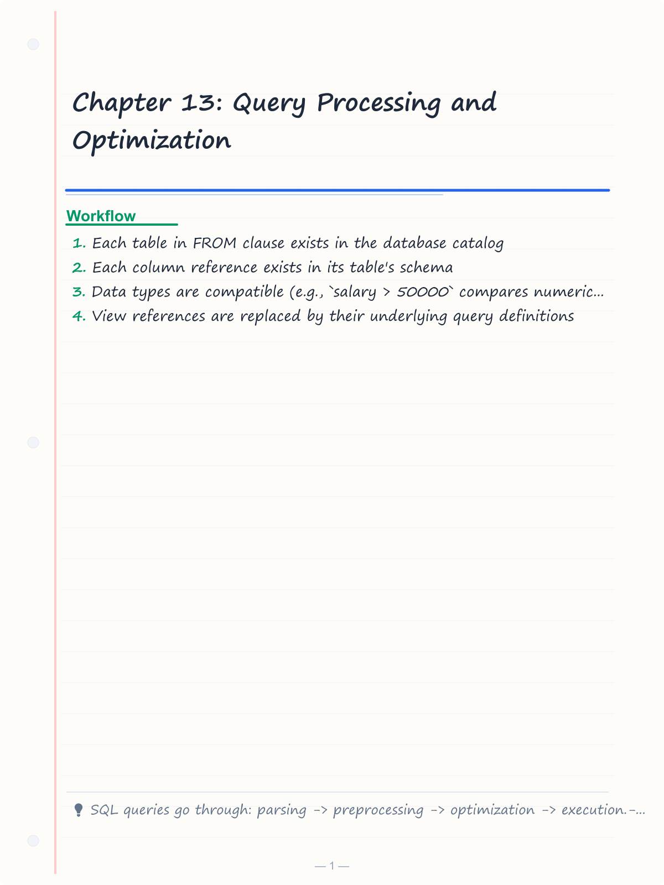
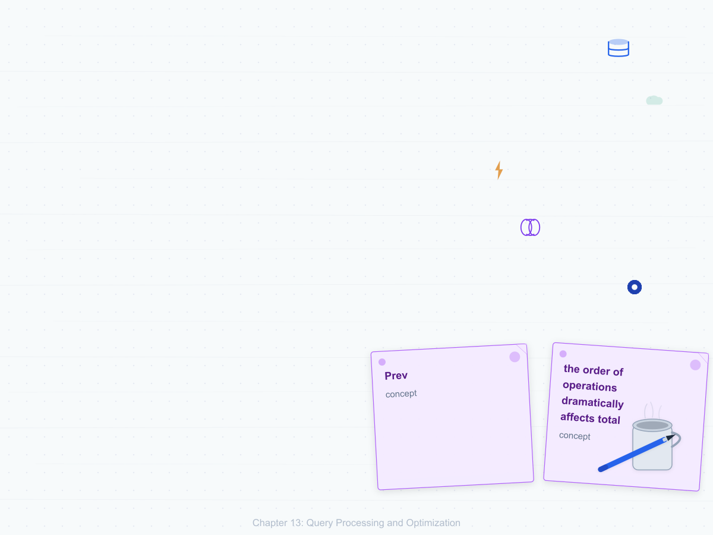
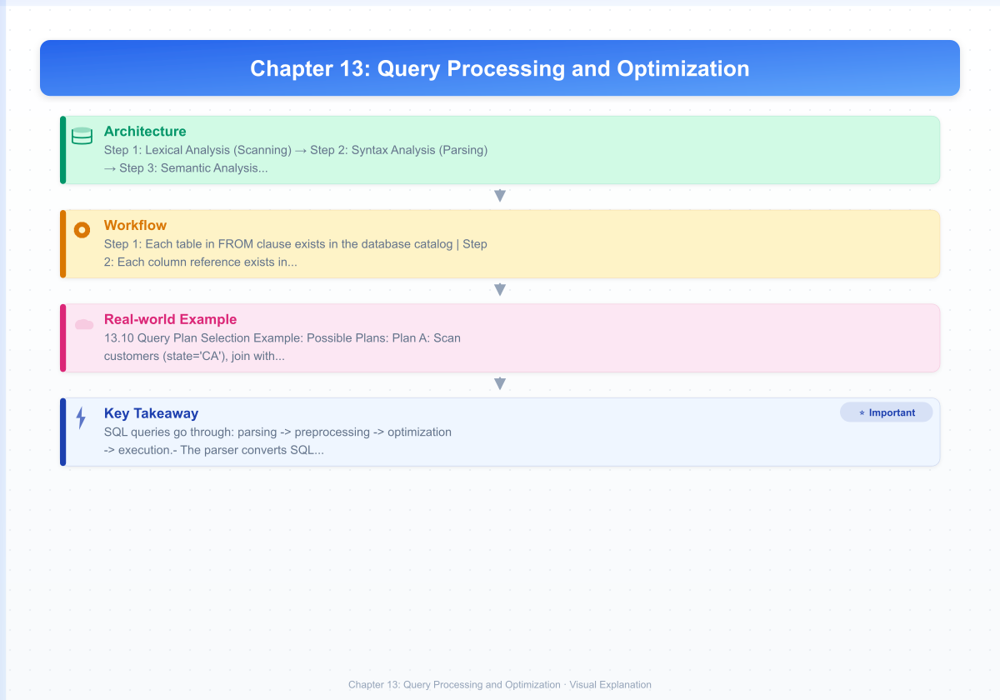
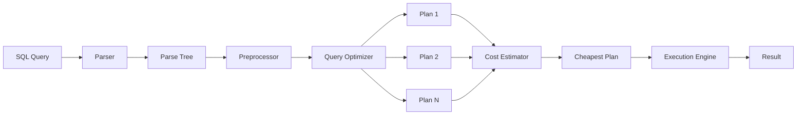
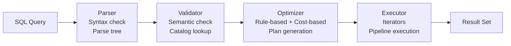

# Chapter 13: Query Processing and Optimization

> **Prev:** [Chapter 12: Indexing](12-indexing.md) | **Next:** [Chapter 14: NoSQL Databases](14-nosql.md)

## Learning Objectives

- Trace the lifecycle of a SQL query from text to result
- Explain how query parsing and validation works
- Understand query optimization and cost-based estimation
- Compare join algorithms: nested loop, hash join, merge join
- Describe pipelining and materialization in query execution
- Read and interpret query execution plans (EXPLAIN)
- Calculate external merge sort passes and I/O costs
- Implement cost-based optimizer logic and hash join simulation

<!-- Image Gallery -->
<section class="lesson-visuals" aria-label="Visual learning resources">
  <header><span>VISUAL LEARNING</span><h2>See it. Review it. Remember it.</h2></header>
  <a class="lesson-visual-card" href="../../assets/images/lessons/database-management-systems/13-query-processing/handwritten-notes.png" target="_blank" rel="noopener">
    
    <span><strong>Handwritten notes</strong>Condensed notes for deliberate review.</span>
  </a>
  <a class="lesson-visual-card" href="../../assets/images/lessons/database-management-systems/13-query-processing/sticky-notes.png" target="_blank" rel="noopener">
    
    <span><strong>Sticky-note revision</strong>Fast recall prompts for revision.</span>
  </a>
  <a class="lesson-visual-card" href="../../assets/images/lessons/database-management-systems/13-query-processing/visual-explanation.png" target="_blank" rel="noopener">
    
    <span><strong>Visual concept guide</strong>A connected explanation of the key ideas.</span>
  </a>
</section>
<!-- End Image Gallery -->


## Chapter at a Glance

| Topic | Key Insight | Practical Takeaway |
|-------|-------------|-------------------|
| **Query Lifecycle** | SQL text -> Parse -> Optimize -> Execute -> Result | Use EXPLAIN to see how your queries are executed |
| **Parsing** | Syntax check + semantic validation (tables/columns exist) | Pre-validate queries with EXPLAIN to catch errors early |
| **Cost-Based Optimization** | Multiple plans generated, cheapest selected | Keep statistics updated (ANALYZE) for accurate cost estimates |
| **Join Algorithms** | Nested Loop (small), Hash Join (equality), Merge Join (sorted) | Choose join type based on data size and access patterns |
| **Pipelining** | Stream results between operators without temp tables | Pipelined execution avoids expensive disk I/O for intermediate results |
| **Execution Plans** | Tree of operators with estimated costs per node | Read plans bottom-up; look for sequential scans on large tables |
| **External Sort** | Multi-pass merge sorting for memory-limited data | Number of passes = 1 + ceil(log_{B-1}(N/B)) where B = buffers |

## Chapter Roadmap



---

## Theory


### 13.1 Query Processing Overview


When a user submits a SQL query, the DBMS transforms it through several stages:

```
SQL Query Text
    |
[Parser] -- Checks syntax, produces parse tree
    |
[Preprocessor] -- Validates tables and columns, resolves views
    |
[Query Optimizer] -- Generates alternative plans, estimates costs
    |
[Execution Engine] -- Executes the chosen plan
    |
Result
```

> **One-Sentence Takeaway:** The SQL query lifecycle runs through four stages -- parsing, optimization, execution, and result delivery -- each adding its own processing cost.

#### Real-World Analogy: Chef Preparing a Meal

Think of the DBMS as a professional kitchen and the SQL query as a recipe order:

| Query Stage | Kitchen Analogy |
|-------------|----------------|
| **SQL text** | Customer hands a written order to the waiter |
| **Parsing** | Waiter reads the order aloud, checks it's legible and makes sense (no "spaghettibolognese" when the menu says "spaghetti bolognese") |
| **Preprocessing** | Chef checks all ingredients exist in the pantry, substitutes are noted |
| **Optimization** | Chef decides the best order of operations: chop vegetables while water boils, start sauce while pasta cooks -- multiple plans considered, fastest wins |
| **Execution** | Cooking happens: each station executes its task, results plated together |
| **Result** | Finished dish arrives at the customer's table |

The kitchen analogy is useful because it captures the key insight: **the order of operations dramatically affects total preparation time**, just as join order and access method selection dramatically affect query execution time.

#### Detailed Processing Steps

**Step 1: Lexical Analysis (Scanning)**

The SQL text is broken into tokens -- the smallest meaningful units.

SQL: `SELECT e.name FROM employees e WHERE e.salary > 50000;`

Tokens produced:
```
[SELECT] [e] [.] [name] [FROM] [employees] [e] [WHERE] [e] [.] [salary] [>] [50000] [;]
```

Each token is classified as a keyword (`SELECT`, `FROM`, `WHERE`), identifier (`e`, `name`, `employees`, `salary`), operator (`>`), literal (`50000`), or punctuation (`.`, `;`).

**Step 2: Syntax Analysis (Parsing)**

The tokens are assembled into a parse tree according to SQL grammar rules.

```
QUERY
├── SELECT
│   ├── e.name
│   └── (implicit all columns not shown)
├── FROM
│   └── employees AS e
└── WHERE
    └── Comparison (>)
        ├── Attribute: e.salary
        └── Literal: 50000
```

The parser uses a context-free grammar (CFG) with rules like:

```
<query> ::= SELECT <select_list> FROM <table_reference> [WHERE <condition>]
<select_list> ::= <column> | <column> , <select_list>
<condition> ::= <column> <op> <value>
```

If the SQL violates the grammar (e.g., `SELCET` instead of `SELECT`), the parser raises a syntax error and stops.

**Step 3: Semantic Analysis (Preprocessing)**

The preprocessor walks the parse tree and validates:
- Each table in FROM clause exists in the database catalog
- Each column reference exists in its table's schema
- Data types are compatible (e.g., `salary > 50000` compares numeric to numeric)
- View references are replaced by their underlying query definitions
- Ambiguous column references (same column name in two joined tables) are resolved

**Step 4: Query Optimization**

The optimizer receives the validated parse tree and generates multiple equivalent relational algebra expressions. For each, it estimates execution cost using table statistics (row count, page count, distinct values, histograms). The plan with the lowest estimated cost is selected.

**Step 5: Query Execution**

The execution engine runs the chosen plan, operator by operator. Each operator (scan, join, sort, aggregate) reads input and produces output until the entire result is materialized or streamed to the client.

#### Pseudocode: High-Level Query Processor

```
PROCEDURE ProcessQuery(sqlText)
    tokens = LexicalAnalyzer.Tokenize(sqlText)
    parseTree = Parser.Parse(tokens)
    IF parseTree.HasErrors THEN
        RETURN "Syntax error: " + parseTree.ErrorMessage
    END IF
    
    validatedTree = Preprocessor.Validate(parseTree)
    IF validatedTree.HasErrors THEN
        RETURN "Semantic error: " + validatedTree.ErrorMessage
    END IF
    
    candidatePlans = GenerateAllPlans(validatedTree)
    bestPlan = NULL
    bestCost = INFINITY
    FOR EACH plan IN candidatePlans:
        cost = EstimateCost(plan)
        IF cost < bestCost THEN
            bestCost = cost
            bestPlan = plan
        END IF
    END FOR
    
    result = ExecutionEngine.Execute(bestPlan)
    RETURN result
END PROCEDURE
```

#### Complexity Analysis

| Stage | Time Complexity | Why |
|-------|----------------|-----|
| Lexical Analysis | O(n) where n = query length | Single pass over characters |
| Parsing | O(n) for LR(1) parsers; O(n^3) worst-case for naive recursive descent | Linear for well-designed SQL grammars |
| Semantic Analysis | O(t + c) where t = #tables, c = #columns | Catalog lookups are hash-table O(1) each |
| Optimization | O(p * k) where p = #plans, k = cost estimation cost per plan | Number of join orders = Catalan number C(n) ~ 4^n / (n * sqrt(n*pi)) |
| Execution | Varies -- drives total wall-clock time | Depends on data volume, algorithms, indexes |

The optimization stage has exponential worst-case complexity in the number of joined relations (4^n join orderings), but modern optimizers use pruning (dynamic programming, genetic algorithms) to keep it tractable.

---

### 13.2 Parsing and Preprocessing


**Parsing:** The SQL text is tokenized into keywords, identifiers, operators, and literals. The parser builds a **parse tree** (or abstract syntax tree) representing the query structure.

```sql
SELECT e.name, d.dept_name
FROM employees e
JOIN departments d ON e.dept_id = d.dept_id
WHERE e.salary > 50000;
```

Parse tree (conceptual):
```
QUERY (type: SELECT)
├── SELECT_LIST
│   ├── QUALIFIED_COLUMN: e.name
│   └── QUALIFIED_COLUMN: d.dept_name
├── FROM_CLAUSE
│   ├── TABLE_REFERENCE: employees (alias: e)
│   └── TABLE_REFERENCE: departments (alias: d)
├── JOIN_CONDITION
│   └── EQUALS
│       ├── QUALIFIED_COLUMN: e.dept_id
│       └── QUALIFIED_COLUMN: d.dept_id
└── WHERE_CLAUSE
    └── GREATER_THAN
        ├── QUALIFIED_COLUMN: e.salary
        └── LITERAL: 50000
```

**Preprocessing (Semantic Analysis):**
- Validates that tables (`employees`, `departments`) exist in `pg_catalog`
- Validates that columns (`name`, `dept_name`, `salary`, `dept_id`) exist in those tables
- Resolves view references to their underlying queries
- Verifies data type compatibility in comparisons and joins
- Resolves `*` expansion to explicit column lists
- Checks for ambiguous column references

#### Pseudocode: SQL Parser

```
PROCEDURE Parse(tokens)
    index = 0
    
    FUNCTION ParseQuery()
        // Expect: SELECT select_list FROM table_ref [WHERE condition]
        Match("SELECT")
        selectList = ParseSelectList()
        Match("FROM")
        fromClause = ParseFromClause()
        
        condition = NULL
        IF Peek() == "WHERE" THEN
            Match("WHERE")
            condition = ParseCondition()
        END IF
        
        RETURN QueryNode(selectList, fromClause, condition)
    END FUNCTION
    
    FUNCTION ParseSelectList()
        items = []
        items.push(ParseColumn())
        WHILE Peek() == "," DO
            Match(",")
            items.push(ParseColumn())
        END WHILE
        RETURN items
    END FUNCTION
    
    FUNCTION ParseFromClause()
        tables = []
        tables.push(ParseTableRef())
        WHILE Peek() IN {"JOIN", ",", "LEFT", "RIGHT"} DO
            // Handle JOIN variants
            joinType = ParseJoinType()
            tables.push(ParseTableRef())
            IF Peek() == "ON" THEN
                Match("ON")
                joinCond = ParseCondition()
                tables.last().joinCondition = joinCond
            END IF
        END WHILE
        RETURN tables
    END FUNCTION
    
    RETURN ParseQuery()
END PROCEDURE
```

**Error Detection Examples:**

| Invalid SQL | Error Detected | Phase |
|-------------|----------------|-------|
| `SELCET * FROM t` | `SELCET` is not a recognized keyword | Lexical/Syntax |
| `SELECT * FORM t` | `FORM` not expected after SELECT list | Syntax |
| `SELECT * FROM nonexistent_table` | Relation "nonexistent_table" does not exist | Semantic |
| `SELECT salary + 'hello' FROM t` | Cannot compare integer and text | Semantic |
| `SELECT * FROM t WHERE` | Incomplete WHERE clause | Syntax |

> **One-Sentence Takeaway:** Parsing checks syntax and semantics; a valid parse tree means the query is structurally correct but not necessarily efficient.

---

### 13.3 Query Cost Estimation


The optimizer needs a way to compare alternative execution plans quantitatively. Cost estimation provides this measure.

#### Core Cost Formula

```
TotalCost = CPU_Cost + I/O_Cost + Memory_Cost + Communication_Cost
```

In practice, most cost models simplify to:

```
TotalCost = (#disk_pages_read * cost_per_page_read) 
          + (#disk_pages_written * cost_per_page_write)
          + (#tuples_processed * cost_per_tuple)
```

PostgreSQL uses arbitrary cost units with these default parameters:

| Parameter | Default | Meaning |
|-----------|---------|---------|
| `seq_page_cost` | 1.0 | Cost of reading a page sequentially |
| `random_page_cost` | 4.0 | Cost of reading a page via random I/O |
| `cpu_tuple_cost` | 0.01 | Cost of processing one row |
| `cpu_index_tuple_cost` | 0.005 | Cost of processing one index entry |
| `cpu_operator_cost` | 0.0025 | Cost of applying a single operator |

#### Selectivity Estimation

Selectivity is the fraction of rows that pass a filter. It ranges from 0 (no rows) to 1 (all rows). The optimizer estimates selectivity using statistics.

**Equality predicate (`col = value`):**
```
selectivity = 1 / n_distinct(col)
```

Example: If `state` has 50 distinct values, selectivity of `state = 'CA'` is 1/50 = 0.02 (2%).

**Range predicate (`col > value`, `col < value`):**
```
selectivity = (high_value - value) / (high_value - low_value)
```

If statistics include a histogram, the optimizer uses bucket boundaries instead of a uniform assumption.

**AND conjunction:**
```
selectivity(A AND B) = selectivity(A) * selectivity(B)
```
This assumes independence -- a critical simplification that can be wrong when columns are correlated.

**OR disjunction:**
```
selectivity(A OR B) = selectivity(A) + selectivity(B) - selectivity(A) * selectivity(B)
```

**Join selectivity:**
```
selectivity(R join S on key) = 1 / max(n_distinct(R.key), n_distinct(S.key))
```
Estimated result size = |R| * |S| * selectivity

#### Cost Estimation Walkthrough

Consider: `SELECT * FROM employees WHERE department_id = 5;`

Given:
- `employees` has 10,000 tuples, stored in 500 pages
- `department_id` has 100 distinct values
- There is an index on `department_id` with 3 B+ tree levels

**Plan A: Sequential Scan**
```
cost = seq_page_cost * pages 
     + cpu_tuple_cost * estimated_rows 
     + cpu_operator_cost * estimated_rows
cost = 1.0 * 500 + 0.01 * 10000 + 0.0025 * 10000
cost = 500 + 100 + 25
cost = 625
estimated_rows = 10000 / 100 = 100
```

**Plan B: Index Scan**
```
cost = random_page_cost * (index_height + estimated_pages)
     + cpu_index_tuple_cost * estimated_rows
     + cpu_tuple_cost * estimated_rows
cost = 4.0 * (3 + 1) + 0.005 * 100 + 0.01 * 100
cost = 16 + 0.5 + 1.0
cost = 17.5
```

Index scan is cheaper (17.5 vs 625), so the optimizer chooses Plan B.

#### Dry Run: Cost Comparison Trace Table

| Plan | Operator | Pages | Est Rows | Seq Cost | Rand Cost | CPU Cost | Total | Chosen? |
|------|----------|-------|----------|----------|-----------|----------|-------|---------|
| A | Seq Scan | 500 | 10000 | 500 | -- | 125 | 625 | |
| A | Filter | -- | 100 | -- | -- | 0.25 | 0.25 | |
| A | **Total** | -- | 100 | -- | -- | -- | **625.25** | |
| B | Index Scan | 3+1 | 100 | -- | 16 | 1.5 | 17.5 | **YES** |
| B | Fetch | 1 | 100 | -- | 4 | -- | 4 | |
| B | **Total** | -- | 100 | -- | -- | -- | **21.5** | |

#### Why Complexity Matters: The 10x Fallacy

If statistics are outdated (actual rows = 1M but stats say 10K), the optimizer will grossly underestimate sequential scan cost:
```
Actual: 1.0 * 50000 + 0.01 * 1000000 = 50000 + 10000 = 60000
Estimated: 1.0 * 500 + 0.01 * 10000 = 500 + 100 = 600
```
The optimizer would still pick the index (17.5 vs estimated 600), but the actual cost difference is 17.5 vs 60000 -- the index plan is even more favored. The real danger is the reverse: underestimating an index scan when the index has poor selectivity.

> **One-Sentence Takeaway:** Cost estimation combines disk I/O and CPU costs using table statistics; accurate statistics are essential for optimal plan selection.

---

### 13.4 Selection Operations


Selection operations retrieve rows from a table based on a predicate. The DBMS has several access methods, each with different cost characteristics.

#### Real-World Analogy: Finding a Book

| Access Method | Real-World Analogy |
|---------------|-------------------|
| **Linear Scan** | Check every book on every shelf one by one -- guaranteed to find what you need, but slow |
| **Binary Search** | Books sorted by title; open to middle, compare, discard half, repeat |
| **Index Scan** | Use the library card catalog to find the exact shelf and position |

#### 1. Sequential (Linear) Scan

Scans every page of the table from first to last, checking each row against the predicate.

**When used:** No suitable index exists, predicate is not selective enough to justify index overhead, or the table is very small.

```
Pseudocode:

PROCEDURE SequentialScan(table, predicate)
    result = empty list
    FOR page IN table.pages:
        FOR tuple IN page.tuples:
            IF predicate.Evaluate(tuple) THEN
                result.Add(tuple)
            END IF
        END FOR
    END FOR
    RETURN result
END PROCEDURE
```

**Cost Analysis:**
```
Cost = pages * seq_page_cost
Rows evaluated = total_tuples
I/O = pages (all pages read)
```

| Metric | Value |
|--------|-------|
| Complexity | O(N) where N = pages |
| I/O Cost | B pages read (B = total table pages) |
| CPU Cost | T tuples evaluated (T = total tuples) |
| Best for | Small tables, or when predicate is not selective |
| Worst case | Filtering to 1 row from a billion-row table |

#### 2. Binary Search (on sorted data)

If the table is physically sorted on the search column, binary search can locate the starting point in O(log N) page reads instead of O(N).

**Prerequisite:** Table must be stored in sorted order by the search key. Rare in practice -- usually only maintained for index-organized tables or specific clustering.

```
Pseudocode:

PROCEDURE BinarySearch(table, key, predicate)
    // Assumes table sorted on key
    low = 0, high = table.pages - 1
    result = empty list
    
    // Binary search for first matching page
    WHILE low <= high DO
        mid = (low + high) / 2
        page = ReadPage(table, mid)
        IF page.minKey() < key THEN
            low = mid + 1
        ELSE IF page.maxKey() > key THEN
            high = mid - 1
        ELSE
            // Found candidate page
            FOR tuple IN page.tuples:
                IF predicate.Evaluate(tuple) THEN
                    result.Add(tuple)
                END IF
            END FOR
            // Scan adjacent pages as needed
        END IF
    END WHILE
    
    RETURN result
END PROCEDURE
```

**Cost Analysis:**
```
Cost = log2(pages) * random_page_cost + result_pages * seq_page_cost
```

| Metric | Value |
|--------|-------|
| Complexity | O(log N) for location + O(K) for result pages |
| I/O Cost | log(B) random reads + K sequential reads |
| Best for | Sorted data, range queries |
| Limitation | Requires physical ordering (clustered index) |

#### 3. Index Scan

Uses a B+ tree index to locate matching tuples. The index is traversed from root to leaf, then the leaf pages provide tuple pointers.

**Two variants:**

- **Index Scan:** Find matching index entries, then fetch corresponding tuples from the heap (table) file
- **Index-Only Scan:** All needed columns are in the index itself; no heap fetch needed

```
Pseudocode:

PROCEDURE IndexScan(table, index, predicate)
    result = empty list
    key = ExtractKey(predicate)
    leafPage = TraverseBTree(index.root, key)
    
    // Scan leaf pages for matching entries
    FOR entry IN leafPage.entries:
        IF entry.key == key THEN
            IF predicate covered by index THEN
                result.Add(entry.GetTupleFromIndex())
            ELSE
                tuple = FetchFromHeap(table, entry.tuplePointer)
                IF predicate.Evaluate(tuple) THEN
                    result.Add(tuple)
                END IF
            END IF
        ELSE
            BREAK // keys beyond range
        END IF
    END FOR
    
    RETURN result
END PROCEDURE
```

**Cost Analysis:**
```
Cost = index_height * random_page_cost 
     + (index_leaf_pages_accessed * random_page_cost)
     + (result_tuples * random_page_cost [for heap fetches])
```

| Metric | Value |
|--------|-------|
| Complexity | O(log N + K) where K = result tuples |
| I/O Cost | H (index height) + L (leaf pages) + K (heap fetches) |
| Best for | Selective predicates (< 5-10% of rows) |
| Worst case | Non-selective predicates (fetching 30%+ of rows via random I/O is worse than sequential scan) |

#### Comparison: Selection Methods

| Aspect | Sequential Scan | Binary Search | Index Scan |
|--------|----------------|---------------|------------|
| **Precondition** | None | Data sorted by key | B+ tree index on key |
| **I/O (selective)** | B pages | log2(B) + K pages | H + L + K pages |
| **I/O (full scan)** | B pages | B pages | 2B pages (index + heap) |
| **Best Use** | Small tables, non-selective | Sorted data, range queries | Selective predicates |
| **Worst Use** | Large table, single row | Unsorted data | Non-selective predicate |
| **Supports range?** | Yes | Yes | Yes (efficient) |
| **Space overhead** | None | None | Additional index storage |
| **Maintenance cost** | None | None | Insert/update index on write |

> **One-Sentence Takeaway:** Sequential scan reads everything, index scan uses a tree to find specific rows, and binary search works on sorted data -- each has a clear cost tradeoff based on selectivity and data organization.

---

### 13.5 Sorting (External Merge Sort)


When data does not fit in memory, the DBMS cannot use in-memory sort algorithms (QuickSort, TimSort). Instead, it uses **external merge sort** -- a divide-and-conquer strategy that splits data into runs, sorts each run in memory, then merges them.

#### Real-World Analogy: Sorting a Million Exam Papers

Imagine you have a million exam papers to sort by student name, but your desk only fits 1000 papers:

1. **Phase 1 (Sort runs):** Take 1000 papers, sort them on your desk, place the sorted stack on the floor. Repeat until all papers are in sorted stacks on the floor. You now have 1000 sorted stacks of 1000 papers each.
2. **Phase 2 (Merge):** Take the top paper from each stack (1000 papers total on your desk), select the smallest name, write it to a new sorted output. When a stack runs out, grab the next batch from that pile. Continue until all papers are in one giant sorted sequence.

#### External Merge Sort Algorithm

**Number of buffers available:** B (e.g., B = 3 means 3 pages of memory)

**Pass 0 (Run Generation):**
- Read B pages at a time into memory
- Sort these B pages using an in-memory sort (QuickSort)
- Write the sorted run back to disk

**Pass 1, 2, ... (Merge Passes):**
- Use B-1 input buffers and 1 output buffer
- Read the first page from each of B-1 sorted runs
- Merge the B-1 input streams into a single sorted output
- Write merged output to new runs

**Number of passes:**
```
N = total pages of data
Runs after pass 0 = ceil(N / B)
Passes needed = 1 + ceil(log_{B-1}(ceil(N/B)))
```

**Total I/O cost:**
```
Total I/O = 2 * N * (passes + 1)
```
Factor of 2 because each pass reads and writes each page once.

#### Dry Run: Full Trace Table

**Setup:** N = 12 pages of data, B = 3 buffer pages available

**Pass 0 (Run Generation):**

| Input Pages | Buffer Contents (sorted) | Output Run |
|-------------|------------------------|------------|
| [7, 2, 9] | [2, 7, 9] | Run 1: [2, 7, 9] |
| [3, 1, 8] | [1, 3, 8] | Run 2: [1, 3, 8] |
| [5, 4, 6] | [4, 5, 6] | Run 3: [4, 5, 6] |
| [12, 11, 10] | [10, 11, 12] | Run 4: [10, 11, 12] |

Initial runs: 4 (each 3 pages long)

**Pass 1 (Merge with B-1 = 2-way merge):**

Merge Runs 1 and 2:

| Step | Buffer 1 (Run 1) | Buffer 2 (Run 2) | Output Buffer | Output Run |
|------|------------------|------------------|---------------|------------|
| 1 | [2, 7, 9] | [1, 3, 8] | [] | |
| 2 | [2, 7, 9] | [1, 3, 8] | [1] Run out buffer, flush |
| 3 | [2, 7, 9] | [3, 8] | [1, 2] | |
| 4 | [7, 9] | [3, 8] | [1, 2, 3] Flush |
| 5 | [7, 9] | [8] | [1, 2, 3, 7] | |
| 6 | [9] | [8] | [1, 2, 3, 7, 8] Flush |
| 7 | [9] | [] | [1, 2, 3, 7, 8, 9] | Run A: [1,2,3,7,8,9] |

Merge Runs 3 and 4:

| Step | Buffer 1 (Run 3) | Buffer 2 (Run 4) | Output Buffer | Output Run |
|------|------------------|------------------|---------------|------------|
| 1 | [4, 5, 6] | [10, 11, 12] | [] | |
| 2 | [4, 5, 6] | [10, 11, 12] | [4] | |
| 3 | [5, 6] | [10, 11, 12] | [4, 5] | |
| 4 | [6] | [10, 11, 12] | [4, 5, 6] Flush |
| 5 | [] | [10, 11, 12] | [4, 5, 6, 10] | |
| 6 | [] | [11, 12] | [4, 5, 6, 10, 11] Flush |
| 7 | [] | [12] | [4, 5, 6, 10, 11, 12] | Run B: [4,5,6,10,11,12] |

**Pass 2 (Final Merge):**

| Step | Buffer 1 (Run A) | Buffer 2 (Run B) | Output Buffer | Final Output |
|------|------------------|------------------|---------------|--------------|
| 1 | [1, 2, 3, 7, 8, 9] | [4, 5, 6, 10, 11, 12] | [] | |
| 2 | [1, 2, 3, 7, 8, 9] | [4, 5, 6, 10, 11, 12] | [1] | |
| 3 | [2, 3, 7, 8, 9] | [4, 5, 6, 10, 11, 12] | [1, 2] | |
| 4 | [3, 7, 8, 9] | [4, 5, 6, 10, 11, 12] | [1, 2, 3] | |
| 5 | [7, 8, 9] | [4, 5, 6, 10, 11, 12] | [1, 2, 3, 4] | |
| 6 | [7, 8, 9] | [5, 6, 10, 11, 12] | [1, 2, 3, 4, 5] | |
| 7 | [7, 8, 9] | [6, 10, 11, 12] | [1, 2, 3, 4, 5, 6] | |
| 8 | [7, 8, 9] | [10, 11, 12] | [1, 2, 3, 4, 5, 6, 7] | |
| 9 | [8, 9] | [10, 11, 12] | [1, 2, 3, 4, 5, 6, 7, 8] | |
| 10 | [9] | [10, 11, 12] | [1, 2, 3, 4, 5, 6, 7, 8, 9] | |
| 11 | [] | [10, 11, 12] | [1, 2, 3, 4, 5, 6, 7, 8, 9, 10] | |
| 12 | [] | [11, 12] | [1, 2, 3, 4, 5, 6, 7, 8, 9, 10, 11] | |
| 13 | [] | [12] | [1, 2, 3, 4, 5, 6, 7, 8, 9, 10, 11, 12] | **FINAL** |

**Passes calculation:**
```
N = 12 pages, B = 3 buffers
Pass 0 runs = ceil(12/3) = 4 runs
Total passes = 1 + ceil(log_{2}(4)) = 1 + 2 = 3 passes (Pass 0, Pass 1, Pass 2)
I/O cost = 2 * 12 * 3 = 72 page transfers
```

#### Number of Passes Formula

```
Given:
N = total pages in input
B = available buffer pages

Pass 0 produces: ceil(N/B) initial runs
Each merge pass reduces runs by factor of (B-1)
So number of merge passes = ceil(log_{B-1}(ceil(N/B)))
Total passes = 1 + ceil(log_{B-1}(ceil(N/B)))
```

| N (pages) | B (buffers) | Passes | I/O Cost |
|-----------|-------------|--------|----------|
| 100 | 5 | 1 + ceil(log4(20)) = 1+3 = 4 | 2*100*4 = 800 |
| 100 | 10 | 1 + ceil(log9(10)) = 1+2 = 3 | 2*100*3 = 600 |
| 1000 | 10 | 1 + ceil(log9(100)) = 1+3 = 4 | 2*1000*4 = 8000 |
| 1000 | 100 | 1 + ceil(log99(10)) = 1+1 = 2 | 2*1000*2 = 4000 |
| 1,000,000 | 1000 | 1 + ceil(log999(1000)) = 1+1 = 2 | 2*1e6*2 = 4,000,000 |

#### C++ Implementation of External Merge Sort

```cpp
#include <iostream>
#include <fstream>
#include <vector>
#include <algorithm>
#include <queue>
#include <cstdlib>
#include <string>

struct Page {
    std::vector<int> records;
    
    void Sort() { std::sort(records.begin(), records.end()); }
};

// Min-heap entry for k-way merge
struct HeapEntry {
    int value;
    int runId;
    
    bool operator>(const HeapEntry& other) const {
        return value > other.value;
    }
};

class ExternalMergeSort {
private:
    int bufferPages;
    std::string inputFile;
    std::string outputFile;
    
public:
    ExternalMergeSort(int buffers, const std::string& in, const std::string& out)
        : bufferPages(buffers), inputFile(in), outputFile(out) {}
    
    // Phase 0: Generate initial sorted runs
    std::vector<std::string> GenerateRuns() {
        std::ifstream in(inputFile);
        std::vector<std::string> runFiles;
        int value;
        int runId = 0;
        
        while (in.peek() != EOF) {
            Page page;
            page.records.clear();
            
            // Read B pages (B * pageSize records)
            for (int i = 0; i < bufferPages * 100; i++) {
                if (!(in >> value)) break;
                page.records.push_back(value);
            }
            
            if (page.records.empty()) break;
            
            // Sort run in memory
            page.Sort();
            
            // Write sorted run to disk
            std::string runFile = "run_" + std::to_string(runId++) + ".dat";
            std::ofstream out(runFile);
            for (int v : page.records) {
                out << v << "\n";
            }
            out.close();
            runFiles.push_back(runFile);
        }
        
        in.close();
        return runFiles;
    }
    
    // Merge runs using a min-heap (replacement selection)
    std::string MergeRuns(const std::vector<std::string>& runFiles, int pass) {
        int k = runFiles.size();
        std::vector<std::ifstream*> inputs(k);
        std::priority_queue<HeapEntry, std::vector<HeapEntry>, 
                            std::greater<HeapEntry>> minHeap;
        
        // Open all input runs and read first value from each
        for (int i = 0; i < k; i++) {
            inputs[i] = new std::ifstream(runFiles[i]);
            int val;
            if (*inputs[i] >> val) {
                minHeap.push({val, i});
            }
        }
        
        std::string mergedFile = "merged_pass_" + std::to_string(pass) + ".dat";
        std::ofstream out(mergedFile);
        
        while (!minHeap.empty()) {
            HeapEntry smallest = minHeap.top();
            minHeap.pop();
            out << smallest.value << "\n";
            
            // Read next value from the same run
            int nextVal;
            if (*inputs[smallest.runId] >> nextVal) {
                minHeap.push({nextVal, smallest.runId});
            }
        }
        
        out.close();
        for (int i = 0; i < k; i++) {
            inputs[i]->close();
            delete inputs[i];
        }
        return mergedFile;
    }
    
    void Sort() {
        auto runs = GenerateRuns();
        int pass = 0;
        
        while (runs.size() > 1) {
            std::vector<std::string> nextRuns;
            pass++;
            
            // Merge (bufferPages - 1) runs at a time
            for (size_t i = 0; i < runs.size(); i += (bufferPages - 1)) {
                std::vector<std::string> batch;
                for (size_t j = i; j < runs.size() && j < i + (bufferPages - 1); j++) {
                    batch.push_back(runs[j]);
                }
                std::string merged = MergeRuns(batch, pass);
                nextRuns.push_back(merged);
            }
            
            // Cleanup old run files
            for (const auto& rf : runs) {
                std::remove(rf.c_str());
            }
            
            runs = nextRuns;
        }
        
        // Rename final output
        if (!runs.empty()) {
            std::rename(runs[0].c_str(), outputFile.c_str());
        }
        
        std::cout << "External sort complete. Passes: " << pass << std::endl;
    }
};

int main() {
    ExternalMergeSort sorter(3, "input.dat", "sorted_output.dat");
    sorter.Sort();
    return 0;
}
```

#### Python Implementation of External Merge Sort

```python
import heapq
import os
import tempfile
import math


class ExternalMergeSort:
    """
    External merge sort for data that does not fit in memory.
    
    Usage:
        sorter = ExternalMergeSort(buffer_pages=3)
        sorter.sort('input.txt', 'output.txt')
    """
    
    def __init__(self, buffer_pages: int = 100):
        self.B = buffer_pages
        self.page_size = 100  # records per page
        
    def _sort_run(self, records, run_id):
        """Sort a chunk of records in memory and write to temp file."""
        records.sort()
        tmp = tempfile.NamedTemporaryFile(mode='w', delete=False, 
                                          prefix=f'run_{run_id}_')
        for r in records:
            tmp.write(f"{r}\n")
        tmp.close()
        return tmp.name
    
    def _merge_runs(self, run_files, pass_num):
        """Merge multiple sorted runs into one using a min-heap."""
        merged = tempfile.NamedTemporaryFile(mode='w', delete=False,
                                              prefix=f'pass_{pass_num}_')
        heap = []
        file_handles = []
        
        # Open each run file and push first record
        for i, fname in enumerate(run_files):
            f = open(fname, 'r')
            file_handles.append(f)
            first_val = f.readline().strip()
            if first_val:
                heapq.heappush(heap, (int(first_val), i))
        
        # k-way merge
        while heap:
            val, run_id = heapq.heappop(heap)
            merged.write(f"{val}\n")
            
            next_line = file_handles[run_id].readline().strip()
            if next_line:
                heapq.heappush(heap, (int(next_line), run_id))
        
        # Cleanup
        for f in file_handles:
            f.close()
        for fname in run_files:
            os.unlink(fname)
        
        merged.close()
        return merged.name
    
    def sort(self, input_path, output_path):
        """External sort: runs + multi-pass merge."""
        # Phase 0: Generate sorted runs
        run_files = []
        run_id = 0
        chunk_size = self.B * self.page_size
        
        with open(input_path, 'r') as f:
            while True:
                records = []
                for _ in range(chunk_size):
                    line = f.readline()
                    if not line:
                        break
                    records.append(int(line.strip()))
                if not records:
                    break
                run_files.append(self._sort_run(records, run_id))
                run_id += 1
        
        # Compute expected passes
        n = run_id
        passes = 1 + math.ceil(math.log(n, self.B - 1)) if n > 1 else 0
        print(f"Initial runs: {n}, B={self.B}, expected passes: {passes}")
        
        # Merge passes
        pass_num = 0
        while len(run_files) > 1:
            pass_num += 1
            merged_runs = []
            batch_size = self.B - 1  # merge B-1 runs at a time
            
            for i in range(0, len(run_files), batch_size):
                batch = run_files[i:i + batch_size]
                merged_runs.append(self._merge_runs(batch, pass_num))
            
            run_files = merged_runs
            print(f"Pass {pass_num}: {len(run_files)} runs remaining")
        
        # Final output
        if run_files:
            os.rename(run_files[0], output_path)
        
        total_passes = pass_num + 1  # +1 for pass 0
        print(f"External sort complete in {total_passes} passes")
        print(f"Total I/O: {2 * n * total_passes} page transfers")


# Example usage
if __name__ == "__main__":
    # Create test data: 10000 random integers
    import random
    with open('test_input.txt', 'w') as f:
        for _ in range(10000):
            f.write(f"{random.randint(0, 100000)}\n")
    
    # Sort with B=5 buffer pages
    sorter = ExternalMergeSort(buffer_pages=5)
    sorter.sort('test_input.txt', 'test_output.txt')
    
    # Verify
    with open('test_output.txt') as f:
        numbers = [int(line.strip()) for line in f]
    assert numbers == sorted(numbers), "Sort verification failed"
    print("Verification passed: output is correctly sorted")
```

#### Complexity Analysis

| Aspect | Complexity | Why |
|--------|-----------|-----|
| **Time (I/O)** | O(N * passes) | Each pass reads and writes all N pages. Pass count depends on B. |
| **Time (CPU)** | O(N log N) in run gen + O(N log K) in merge | Run gen uses in-memory O(N/B * B log B) = O(N log B). Merge does O(N * log K) comparisons for K-way merge. |
| **Space (disk)** | O(N) | Temporary files store intermediate runs |
| **Space (memory)** | O(B) | B buffer pages in memory |

**Key insight:** The I/O cost dominates. CPU sorting cost is negligible compared to page reads/writes. The goal of external sort is to MINIMIZE the number of passes by maximizing available buffer memory.

| Metric | Explanation |
|--------|-------------|
| More buffers = fewer passes | Each buffer adds a merge fan-in, reducing pass count logarithmically |
| Twice the memory = one fewer pass | Doubling B roughly halves the number of passes |
| Passes cost 2N I/O each | Each pass reads all pages once and writes them once |

#### A&D Table: External Merge Sort

| Advantage | Disadvantage |
|-----------|-------------|
| Handles arbitrarily large data that does not fit in memory | O(N log N) I/O cost can be high for very large N |
| Well-understood, predictable performance | Requires temporary disk space for runs |
| Merge fan-in adaptable to available memory | Sorting overhead even if data is nearly sorted |
| Stable sort (preserves input order of equal keys) | Standard external sort does not exploit partial ordering |
| Parallelizable (multiple runs sorted independently) | I/O bound; disk becomes bottleneck |
| Foundation for merge join | Not suitable for real-time/streaming workloads |

#### Edge Cases

**1. Memory overflow:** If the input data contains records larger than the buffer, the sort must read less per run. Some DBMS handle this by spilling individual records.

**2. Data fits in memory:** If N &lt;= B, the sort completes in one pass (just in-memory sort, no merge needed) with I/O = 2N (read once, write once).

**3. Key duplication:** External merge sort is stable if the merge step maintains input order for equal keys. Most DBMS sort implementations are not stable by default.

**4. Concurrent writes:** If data is being modified during the sort, the result is undefined. DBMS snapshot isolation solves this.

> **One-Sentence Takeaway:** External merge sort enables sorting data larger than memory by creating sorted runs and merging them in multiple passes, with I/O cost proportional to data size times number of passes.

---

### 13.6 Join Operations


Join operations combine rows from two tables based on a related column. They are the most performance-critical operations in query processing.

#### Comparison at a Glance

| Algorithm | I/O Complexity | Requires Index | Requires Sort | Best For |
|-----------|---------------|---------------|---------------|----------|
| Nested Loop Join (NLJ) | O(|R| * |S|) pages | No | No | Small tables (one side &lt; 100 pages) |
| Block Nested Loop Join (BNLJ) | O(|R| * ceil(|S|/B)) pages | No | No | Medium tables, no indexes |
| Indexed Nested Loop Join (INLJ) | O(|R| * cost_per_index_probe) | Yes (inner) | No | Small outer + indexed inner |
| Sort-Merge Join (SMJ) | O(N log N + M log M + N + M) | No | Yes | Large sorted data, ORDER BY already needed |
| Hash Join | O(3*(N + M)) pages | No | No | Large unsorted equi-joins |

#### 13.6.1 Nested Loop Join (NLJ)

**Real-World Analogy:** For each student in a classroom (outer table), check every book in the library (inner table) to find which ones the student has borrowed. Simple but slow -- O(students * books).

```
Pseudocode:

PROCEDURE NestedLoopJoin(outer, inner, joinPredicate)
    result = empty list
    FOR outerTuple IN outer:
        FOR innerTuple IN inner:
            IF joinPredicate.Evaluate(outerTuple, innerTuple) THEN
                result.Add( (outerTuple, innerTuple) )
            END IF
        END FOR
    END FOR
    RETURN result
END PROCEDURE
```

**I/O Cost Analysis:**

Let M = pages of outer table, N = pages of inner table.

```
Cost = M + (M * N)
```
The outer table is scanned once (M pages). For each of M pages, the inner table is scanned completely (N pages). Total: M + M*N page reads.

If the outer table has 1000 pages and inner has 500 pages:
```
Cost = 1000 + 1000 * 500 = 501,000 page reads
```

**Optimization:** Always choose the smaller table as the outer table.

| Outer | Inner | Cost |
|-------|-------|------|
| 1000 pages | 500 pages | 1000 + 1000*500 = 501,000 |
| 500 pages | 1000 pages | 500 + 500*1000 = 500,500 |

The difference is small when both are large. The real savings come from using indexes.

**When to use:** One table is very small (fits in a few pages), or when no indexes exist and tables are tiny.

#### 13.6.2 Block Nested Loop Join (BNLJ)

Instead of reading one page at a time from the outer table, BNLJ reads B-2 pages (a block) into memory.

```
Pseudocode:

PROCEDURE BlockNestedLoopJoin(outer, inner, B, joinPredicate)
    // B = available buffer pages
    // Use B-2 pages for outer block, 1 page for inner, 1 for output
    result = empty list
    blockSize = B - 2
    
    FOR blockStart = 0 TO outer.pages STEP blockSize:
        block = ReadPages(outer, blockStart, blockSize)
        
        FOR innerPage IN inner.pages:
            FOR outerTuple IN block:
                FOR innerTuple IN innerPage:
                    IF joinPredicate.Evaluate(outerTuple, innerTuple) THEN
                        result.Add( (outerTuple, innerTuple) )
                    END IF
                END FOR
            END FOR
        END FOR
    END FOR
    
    RETURN result
END PROCEDURE
```

**I/O Cost Analysis:**

B = available buffer pages, M = outer pages, N = inner pages.

```
Cost = M + ceil(M / (B-2)) * N
```

The outer table is always read once (M). The inner table is read once per outer block (ceil(M/(B-2)) times).

| M | N | B | Cost | Savings vs NLJ |
|---|---|---|---|-----------------|
| 1000 | 500 | 3 | 1000 + 1000*500 = 501,000 | Same (B-2 = 1) |
| 1000 | 500 | 10 | 1000 + 125*500 = 63,500 | 87% reduction |
| 1000 | 500 | 100 | 1000 + 11*500 = 6,500 | 98.7% reduction |

**Key insight:** With B = 10, the inner table is scanned only 125 times instead of 1000 times. With B = 100, only 11 times.

#### 13.6.3 Indexed Nested Loop Join (INLJ)

If the inner table has an index on the join column, each outer tuple can probe the index instead of scanning the entire inner table.

```
Pseudocode:

PROCEDURE IndexedNestedLoopJoin(outer, inner, index, joinPredicate)
    result = empty list
    
    FOR outerTuple IN outer:
        key = ExtractJoinValue(outerTuple)
        matchingTuples = IndexLookup(index, key)
        
        FOR innerTuple IN matchingTuples:
            result.Add( (outerTuple, innerTuple) )
        END FOR
    END FOR
    
    RETURN result
END PROCEDURE
```

**I/O Cost Analysis:**

Let H = height of B+ tree (typically 2-4 for large tables).
Let K = estimated matching tuples in inner per outer tuple.

```
Cost = M + M * (H + K)
```

| M (outer pages) | Inner Size | H | K | Cost | vs NLJ |
|-----------------|-----------|----|----|-------|--------|
| 100 | 10,000 pages | 3 | 1 | 100 + 100*4 = 500 | 100 + 100*10000 = 1,000,100 |
| 1000 | 10,000 pages | 3 | 1 | 1000 + 1000*4 = 5,000 | 1000 + 1000*10000 = 10,001,000 |

**INLJ is the most efficient join when the outer table is small and there is an index on the inner join column.**

#### 13.6.4 Sort-Merge Join (SMJ)

Sorts both tables on the join attribute, then merges them in a single pass.

```
Pseudocode:

PROCEDURE SortMergeJoin(R, S, joinAttr)
    // Phase 1: Sort both inputs
    Sort(R, joinAttr)
    Sort(S, joinAttr)
    
    // Phase 2: Merge
    result = empty list
    i = 0, j = 0
    
    WHILE i < len(R) AND j < len(S):
        cmp = Compare(R[i][joinAttr], S[j][joinAttr])
        
        IF cmp == EQUAL:
            // Handle duplicates: scan all matching pairs
            jStart = j
            
            WHILE j < len(S) AND Compare(R[i][joinAttr], S[j][joinAttr]) == EQUAL:
                result.Add(R[i], S[j])
                j++
            END WHILE
            
            WHILE i + 1 < len(R) AND Compare(R[i+1][joinAttr], S[jStart][joinAttr]) == EQUAL:
                i++
                j = jStart
                WHILE j < len(S) AND Compare(R[i][joinAttr], S[j][joinAttr]) == EQUAL:
                    result.Add(R[i], S[j])
                    j++
                END WHILE
            END WHILE
            
            j = jStart + 1; i++
            
        ELSE IF cmp < 0:
            i++
        ELSE:
            j++
        END IF
    END WHILE
    
    RETURN result
END PROCEDURE
```

**I/O Cost Analysis:**

Let M = pages of R, N = pages of S.

```
Sort(R) cost = 2 * M * passes_R
Sort(S) cost = 2 * N * passes_S
Merge cost = M + N
Total = 2*M*passes_R + 2*N*passes_S + M + N
```

If M = 1000, N = 500, B = 10:
```
passes_R = 1 + ceil(log_9(100)) = 4
passes_S = 1 + ceil(log_9(50)) = 3
Sort(R) cost = 2 * 1000 * 4 = 8000
Sort(S) cost = 2 * 500 * 3 = 3000
Merge cost = 1000 + 500 = 1500
Total = 8000 + 3000 + 1500 = 12,500 page reads
```

**Duplicate handling complexity:** When there are many duplicate join keys, the merge phase can degenerate. In the worst case (all rows have the same key), SMJ produces a cross-product of both tables, and the merge pointer may need to backtrack repeatedly. This worst-case complexity is O(N * M).

#### 13.6.5 Hash Join

Builds a hash table on the smaller table (build side), then probes it with the larger table (probe side).

```
Pseudocode:

PROCEDURE HashJoin(R, S, joinAttr)
    // Choose smaller table as build side
    build = (pages(R) < pages(S)) ? R : S
    probe = (pages(R) < pages(S)) ? S : R
    
    // Phase 1: Build hash table
    hashTable = new HashTable()
    
    FOR tuple IN build:
        key = tuple[joinAttr]
        hashTable.Insert(key, tuple)
    END FOR
    
    // Phase 2: Probe hash table
    result = empty list
    
    FOR tuple IN probe:
        key = tuple[joinAttr]
        matches = hashTable.Lookup(key)
        
        FOR match IN matches:
            result.Add(match, tuple)
        END FOR
    END FOR
    
    RETURN result
END PROCEDURE
```

**I/O Cost Analysis:**

If the hash table fits in memory:
```
Cost = p(build) + p(probe) = M + N
```
Read both tables once. Build hash table, probe, done.

If the hash table does NOT fit in memory, the DBMS uses **Grace Hash Join** (partitioned hash join):

**Phase 1 (Partition):** Hash both tables into partitions using a hash function. Write partitions to disk.
**Phase 2 (Build/Probe):** For each partition, build hash table (mem) and probe (disk).

```
Cost = 2*(M+N) + (M+N) = 3*(M+N) approximately
```
Read both tables for partitioning (2*(M+N)), then read partitions back for build/probe (M+N).

**Dry Run: Hash Join**

Tables:
- R = { (1, 'A'), (3, 'B'), (2, 'C'), (1, 'D'), (4, 'E') }
- S = { (1, 'X'), (2, 'Y'), (5, 'Z'), (1, 'W') }
- Join on col1

Build side (assume R is smaller):

| Build Step | Key | Tuple | Hash Bucket |
|-----------|-----|-------|-------------|
| 1 | 1 | (1, 'A') | bucket[1 % 3] = [(1, 'A')] |
| 2 | 3 | (3, 'B') | bucket[0] = [(3, 'B')] |
| 3 | 2 | (2, 'C') | bucket[2] = [(2, 'C')] |
| 4 | 1 | (1, 'D') | bucket[1] = [(1, 'A'), (1, 'D')] |
| 5 | 4 | (4, 'E') | bucket[1] = [(1, 'A'), (1, 'D'), (4, 'E')] |

Hash table state (hash mod 3):
- bucket[0]: [(3, 'B')]
- bucket[1]: [(1, 'A'), (1, 'D'), (4, 'E')]
- bucket[2]: [(2, 'C')]

Probe phase:

| Probe Key | Bucket | Matches | Output |
|-----------|--------|---------|--------|
| 1 (from S) | bucket[1] | (1, 'A'), (1, 'D') | (1, 'A')-(1, 'X'), (1, 'D')-(1, 'X') |
| 2 (from S) | bucket[2] | (2, 'C') | (2, 'C')-(2, 'Y') |
| 5 (from S) | bucket[2] | (none -- 5 != 2) | -- |
| 1 (from S) | bucket[1] | (1, 'A'), (1, 'D') | (1, 'A')-(1, 'W'), (1, 'D')-(1, 'W') |

**Final result:** 5 rows.

#### C++ Implementation: Hash Join Simulator

```cpp
#include <iostream>
#include <vector>
#include <unordered_map>
#include <string>
#include <utility>

struct Tuple {
    int key;
    std::string value;
    
    Tuple(int k, const std::string& v) : key(k), value(v) {}
    void Print() const {
        std::cout << "(" << key << ", " << value << ")";
    }
};

class HashJoinSimulator {
private:
    std::vector<Tuple> R; // build relation
    std::vector<Tuple> S; // probe relation
    
public:
    HashJoinSimulator(const std::vector<Tuple>& r, const std::vector<Tuple>& s)
        : R(r), S(s) {}
    
    struct JoinResult {
        Tuple left;
        Tuple right;
        JoinResult(const Tuple& l, const Tuple& r) : left(l), right(r) {}
    };
    
    std::vector<JoinResult> Execute() {
        // Choose smaller as build side
        const auto& build = (R.size() <= S.size()) ? R : S;
        const auto& probe = (R.size() <= S.size()) ? S : R;
        
        std::cout << "Build side size: " << build.size() << " tuples\n";
        std::cout << "Probe side size: " << probe.size() << " tuples\n";
        
        // Phase 1: Build hash table
        std::unordered_map<int, std::vector<Tuple>> hashTable;
        for (const auto& t : build) {
            hashTable[t.key].push_back(t);
            std::cout << "  Hashed: (" << t.key << ", " << t.value << ")\n";
        }
        
        // Phase 2: Probe
        std::vector<JoinResult> results;
        for (const auto& t : probe) {
            auto it = hashTable.find(t.key);
            if (it != hashTable.end()) {
                for (const auto& match : it->second) {
                    results.push_back(JoinResult(match, t));
                    std::cout << "  Matched: ";
                    match.Print();
                    std::cout << " x ";
                    t.Print();
                    std::cout << "\n";
                }
            }
        }
        
        return results;
    }
    
    void PrintResults(const std::vector<JoinResult>& results) {
        std::cout << "\n=== Hash Join Results (" << results.size() 
                  << " rows) ===\n";
        for (const auto& r : results) {
            r.left.Print();
            std::cout << " JOIN ";
            r.right.Print();
            std::cout << "\n";
        }
    }
};

int main() {
    std::vector<Tuple> R = {
        Tuple(1, "Alice"), Tuple(3, "Bob"),
        Tuple(2, "Charlie"), Tuple(1, "Diana"),
        Tuple(4, "Eve")
    };
    
    std::vector<Tuple> S = {
        Tuple(1, "Engineer"), Tuple(2, "Designer"),
        Tuple(5, "Manager"), Tuple(1, "Analyst")
    };
    
    HashJoinSimulator hj(R, S);
    auto results = hj.Execute();
    hj.PrintResults(results);
    
    return 0;
}
```

#### Python Implementation: Hash Join with I/O Cost Tracking

```python
from dataclasses import dataclass
from typing import List, Dict, Tuple, Optional
import math


@dataclass
class Tuple:
    key: int
    value: str

    def __repr__(self):
        return f"({self.key}, '{self.value}')"


class HashJoinWithIO:
    """
    Hash join implementation with detailed I/O cost tracking
    and memory budget simulation.
    """
    
    def __init__(self, buffer_pages: int, page_size: int = 2):
        self.B = buffer_pages       # available memory in pages
        self.page_size = page_size  # tuples per page
        self.io_reads = 0
        self.io_writes = 0
    
    def _partition(self, relation: List[Tuple], name: str) -> Dict[int, List[Tuple]]:
        """Partition relation by hash of key."""
        partitions: Dict[int, List[Tuple]] = {}
        for t in relation:
            bucket = t.key % self.B  # hash to partition
            if bucket not in partitions:
                partitions[bucket] = []
            partitions[bucket].append(t)
        
        # Track I/O: reading relation
        pages = math.ceil(len(relation) / self.page_size)
        self.io_reads += pages
        # Track I/O: writing partitions
        for bucket, tuples in partitions.items():
            part_pages = math.ceil(len(tuples) / self.page_size)
            self.io_writes += part_pages
            print(f"  Partition {name}[{bucket}]: {len(tuples)} tuples, "
                  f"{part_pages} pages")
        
        return partitions
    
    def join(self, R: List[Tuple], S: List[Tuple]) -> List[Tuple[Tuple, Tuple]]:
        """
        Grace Hash Join: partition both sides, then build/probe per partition.
        """
        self.io_reads = 0
        self.io_writes = 0
        
        print(f"\n=== Grace Hash Join ===")
        print(f"Buffer pages: {self.B}, Page size: {self.page_size} tuples")
        print(f"R: {len(R)} tuples, S: {len(S)} tuples")
        
        # Phase 1: Partition both relations
        print(f"\nPhase 1: Partitioning")
        r_partitions = self._partition(R, "R")
        s_partitions = self._partition(S, "S")
        
        # Phase 2: Build and probe per partition
        print(f"\nPhase 2: Build & Probe")
        results: List[Tuple[Tuple, Tuple]] = []
        
        for bucket in range(self.B):
            if bucket not in r_partitions and bucket not in s_partitions:
                continue
            
            build = r_partitions.get(bucket, [])
            probe = s_partitions.get(bucket, [])
            
            # Choose smaller as build side
            if len(probe) < len(build):
                build, probe = probe, build
            
            if not build or not probe:
                continue
            
            print(f"  Bucket {bucket}: build={len(build)}, probe={len(probe)}")
            
            # Build hash table (in memory for this partition)
            ht: Dict[int, List[Tuple]] = {}
            for t in build:
                if t.key not in ht:
                    ht[t.key] = []
                ht[t.key].append(t)
            
            # Probe
            for t in probe:
                if t.key in ht:
                    for match in ht[t.key]:
                        results.append((match, t))
            
            # Track I/O: reading partitions back
            self.io_reads += math.ceil(len(build) / self.page_size)
            self.io_reads += math.ceil(len(probe) / self.page_size)
        
        # Print I/O summary
        total_io = self.io_reads + self.io_writes
        print(f"\n=== I/O Summary ===")
        print(f"Reads: {self.io_reads} pages")
        print(f"Writes: {self.io_writes} pages")
        print(f"Total I/O: {total_io} pages")
        print(f"Approx 3*(|R|+|S|): {3 * (math.ceil(len(R)/self.page_size) + math.ceil(len(S)/self.page_size))} pages")
        
        return results


# Example usage
if __name__ == "__main__":
    R = [Tuple(1, 'A'), Tuple(3, 'B'), Tuple(2, 'C'), 
         Tuple(1, 'D'), Tuple(4, 'E'), Tuple(6, 'F')]
    S = [Tuple(1, 'X'), Tuple(2, 'Y'), Tuple(5, 'Z'), 
         Tuple(1, 'W'), Tuple(3, 'V')]
    
    hj = HashJoinWithIO(buffer_pages=3, page_size=2)
    results = hj.join(R, S)
    
    print(f"\nResult rows: {len(results)}")
    for left, right in results:
        print(f"  {left} JOIN {right}")
```

#### Complexity Analysis: Join Algorithms

| Algorithm | Time Complexity | I/O Complexity | Why |
|-----------|----------------|---------------|-----|
| **NLJ** | O(|R| * |S|) tuples | O(M + M*N) pages | For each outer tuple, scan entire inner |
| **BNLJ** | O(|R| * |S|) tuples | O(M + (M/(B-2))*N) pages | Block scanning reduces inner scans |
| **INLJ** | O(|R| * log|S|) tuples | O(M + M*(H+K)) pages | Index probe is O(log|S|) |
| **SMJ** | O(|R|log|R| + |S|log|S| + |R|+|S|) | O(2M*p + 2N*p + M+N) pages | Sort dominates; merge is linear |
| **Hash** | O(|R| + |S|) average tuples | O(3*(M+N)) pages | Build+probe is amortized O(1) per tuple |

#### A&D Table: Join Algorithms

| Algorithm | Advantage | Disadvantage |
|-----------|-----------|-------------|
| **NLJ** | Simple, works with any join condition, no index needed | Worst-case O(M*N) I/O -- catastrophic for large tables |
| **BNLJ** | Much less I/O than NLJ with more buffers | Still O(M*N/B) I/O, not great for very large data |
| **INLJ** | Excellent for small outer + indexed inner | Requires index; multiple index lookups are random I/O |
| **SMJ** | Fast merge once sorted; good for pre-sorted data | Sorting overhead; degenerates on duplicate keys |
| **Hash Join** | Fastest for large equi-joins; O(N) amortized | Only equi-joins; hash table memory requirements |

#### Edge Cases in Join Operations

**1. Data skew in hash join:** If many tuples hash to the same bucket, that partition may not fit in memory, causing recursive partitioning or spill-to-disk.

**2. Null values in join key:** Hash functions on null produce undetermined results. Most DBMS handle null-by-null joins by not matching them (NULL != NULL in SQL).

**3. Many-to-many joins:** Both SMJ and hash join can produce large intermediate results. SMJ degenerates to O(N*M) when all keys are equal.

**4. Memory pressure:** NLJ with a large outer table that was supposed to be "small" can cause severe performance degradation if statistics are wrong.

> **One-Sentence Takeaway:** Join algorithm selection depends on data size, index availability, sortedness, and join predicate type -- hash join dominates for unsorted equi-joins while merge join excels with pre-sorted data.

---

### 13.7 Query Optimization


Query optimization transforms the parse tree into an efficient execution plan. It is the most complex and important part of query processing.

#### Real-World Analogy: GPS Route Planning

| Optimization Concept | GPS Analogy |
|---------------------|-------------|
| **Parse tree** | "Drive from current location to destination" |
| **Equivalence rules** | Different routes that reach the same destination |
| **Cost-based selection** | GPS picks the fastest route based on current traffic data |
| **Heuristic optimization** | "Always prefer highways" -- simple rules that usually work |
| **Statistics** | Traffic data, road closures, typical congestion patterns |

#### 13.7.1 Equivalence Rules

Equivalence rules define transformations that preserve query semantics but change execution order.

**Selection rules:**

| Rule | Transformation | Example |
|------|---------------|---------|
| **Selection cascade** | sigma_{c1 AND c2}(R) = sigma_{c1}(sigma_{c2}(R)) | Break complex filters into simpler ones |
| **Selection commutativity** | sigma_{c1}(sigma_{c2}(R)) = sigma_{c2}(sigma_{c1}(R)) | Order of filters does not matter |
| **Selection pushing (join)** | sigma_{c}(R JOIN S) = sigma_{c}(R) JOIN S if c references only R | Filter first, then join |
| **Selection pushing (union)** | sigma_{c}(R UNION S) = sigma_{c}(R) UNION sigma_{c}(S) | Push filter into each branch |

**Projection rules:**

| Rule | Transformation |
|------|---------------|
| **Projection pushing** | pi_{cols}(R JOIN S) = pi_{cols}(pi_{R.cols}(R) JOIN pi_{S.cols}(S)) |
| **Projection elimination** | pi_{all}(R) = R |

**Join rules:**

| Rule | Transformation |
|------|---------------|
| **Join commutativity** | R JOIN S = S JOIN R |
| **Join associativity** | (R JOIN S) JOIN T = R JOIN (S JOIN T) |
| **Left-deep vs right-deep** | Different join tree shapes are equivalent |

#### 13.7.2 Cost-Based Optimization

The optimizer enumerates alternative plans and picks the cheapest.

**Step-by-step optimization trace:**

Query: `SELECT e.name, d.dept_name FROM employees e JOIN departments d ON e.dept_id = d.dept_id WHERE e.salary > 50000;`

Statistics:
- employees: 10,000 rows, 500 pages, 100 distinct dept_ids
- departments: 100 rows, 5 pages
- salary > 50000 selectivity: 0.3 (30% of employees)

**Step 1: Generate initial logical plan**

```
Project [e.name, d.dept_name]
    |
Join (e.dept_id = d.dept_id)
    |
Select (e.salary > 50000)
    |
employees         departments
```

**Step 2: Apply equivalence rules to generate alternatives**

Plan 1 (No pushdown):
```
Project
    |
Join (Hash)
    |
Select (Filter)     Seq Scan (departments)
    |
Seq Scan (employees)
```

Plan 2 (Selection pushdown + join reorder):
```
Project
    |
Join (Hash)
    |
Select (Filter)     Seq Scan (departments)
    |
Seq Scan (employees)
```
Same as Plan 1 but filter is applied earlier.

Plan 3 (Index NLJ with departments as outer):
```
Project
    |
Nested Loop
    |
Seq Scan (depts)    Index Scan (employees.dept_id)
                        |
                    Select (salary > 50000 on fetched rows)
```

Plan 4 (Merge join with explicit sort):
```
Project
    |
Merge Join
    |
Sort (dept_id)      Sort (dept_id)
    |                    |
Select (Filter)     Seq Scan (departments)
    |
Seq Scan (employees)
```

**Step 3: Estimate costs**

Plan 1 (Hash Join):
```
Seq Scan employees: 500 pages * 1.0 = 500
Filter: 10000 * 0.01 = 100
  -> 3000 rows (after 30% selectivity)

Hash build (departments): 5 pages * 1.0 = 5
Hash probe: 3000 * O(1) = negligible
Hash Join total: 500 + 100 + 5 = 605
Project: negligible
Total: ~605
```

Plan 3 (NLJ with index):
```
Seq Scan departments: 5 pages * 1.0 = 5
  -> 100 rows
For each of 100 dept rows, probe employees index:
Index probe: 100 * (3 + 1) * 4.0 = 1600  (B+ tree height 3, 1 leaf, random I/O)
Fetch + filter: 100 * 1 * 1.0 + 100 * 0.01 = 101
Total: 5 + 1600 + 101 = 1706
```

Plan 4 (Merge Join):
```
Sort employees: 2*500*4 + 500 = 4500 (assuming 4 passes)
Sort departments: 2*5*1 + 5 = 15 (1 pass, fits in memory)
Merge: 500 + 5 = 505
Total: 4500 + 15 + 505 = 5020
```

**Final decision:** Plan 1 (Hash Join) has the lowest estimated cost at ~605.

#### 13.7.3 Heuristic Optimization

Heuristic optimization applies fixed rules without cost estimation. It is faster but may produce suboptimal plans.

**Common heuristic rules:**

1. **Push selections down** -- Filter as early as possible (reduces rows early)
2. **Push projections down** -- Remove unnecessary columns early
3. **Replace Cartesian products with joins** -- If there is a join condition
4. **Reorder joins so the smallest relation is inner-most** -- For NLJ
5. **Replace UNION with UNION ALL if no duplicates** -- Avoid sort
6. **Use indexes when available** -- Always prefer index scan over seq scan if predicate is selective

**Example of heuristic optimization:**

Original:
```
Project [e.name, d.dept_name]
    |
Join (e.dept_id = d.dept_id)
    |
Select (e.salary > 50000)
    |
Cartesian Product
    |
employees           departments
```

After heuristic rules:
1. Replace Cartesian product with join -> `employees JOIN departments ON e.dept_id = d.dept_id`
2. Push selection down -> Filter employees before join
3. Push projection down -> Only keep needed columns early
4. Check for index usage -> Use index on dept_id if available

Final (without cost estimation):
```
Project [e.name, d.dept_name]
    |
Index NLJ (dept_id)
    |
Filter (salary > 50000)     Seq Scan (departments)
    |
Index Scan (employees.dept_id)
```

#### Comparison: Heuristic vs Cost-Based Optimization

| Aspect | Heuristic Optimization | Cost-Based Optimization |
|--------|----------------------|-----------------------|
| **Approach** | Apply fixed rules blindly | Evaluate multiple plans, choose cheapest |
| **Performance** | Fast, no overhead | Slower optimization, better execution |
| **Quality** | Good for simple queries | May miss optimal plan if not all plans considered |
| **Statistics needed** | No | Yes (histograms, row counts, distinct values) |
| **Adaptability** | Same rules always applied | Adapts to data distribution |
| **Worst case** | Bad plan for unusual data shapes | Exponential enumeration time |
| **Example DBMS** | MySQL (before 8.0, simple queries) | PostgreSQL, Oracle, SQL Server |

**Hybrid approach:** Most modern DBMS use both. Heuristics prune the search space, and cost-based selection chooses among the remaining candidates.

> **One-Sentence Takeaway:** Query optimization uses equivalence rules to generate alternative plans, heuristics to prune the search space, and cost estimation to select the cheapest plan.

---

### 13.8 Materialization vs Pipelining


These two strategies determine how results flow between operators in the execution plan.

#### Real-World Analogy: Restaurant Kitchen

| Strategy | Kitchen Analogy |
|----------|----------------|
| **Pipelining** | Cook prepares one plate at a time: chop, cook, plate, send to waiter. Next plate starts immediately. First customer gets food quickly. |
| **Materialization** | Cook chops ALL vegetables first, stores them in a bowl. Then cooks ALL portions. Then plates ALL dishes. First customer waits longer, but batch operations are more efficient. |

#### Pipelining (Iterator Model)

Each operator in the query plan is an iterator with `Open()`, `Next()`, and `Close()` methods. Data flows one tuple at a time.

```
Operator A calls Operator B.Next()
  -> Operator B processes one tuple and returns it
  -> Operator A processes the tuple
  -> Operator A calls Operator B.Next() again
  -> ...
```

**When to use:**
- Low latency needed (first row appears quickly)
- Result set is very large (avoid storing it all)
- Intermediate results do not need to be reused

**Example:** `SELECT * FROM employees WHERE salary > 100000 ORDER BY name`

Pipeline execution:
```
Sort (Top-N, using heap)
   |
   |-- Open -> read all input to build heap, then pop one at a time
   |
Filter (salary > 100000)
   |
   |-- Next() called by Sort for each input tuple
   |
Table Scan (employees)
   |
   |-- Reads one page at a time, one tuple at a time
```

The filter can start producing rows as soon as the first page is scanned. The sort cannot produce its first row until all input is consumed (blocking operator).

#### Materialization

An operator produces its full output before the parent operator starts consuming it. Intermediate results are stored in temporary tables (on disk or in memory).

**When to use:**
- Operator needs random access to its input (hash table build, sort)
- Intermediate result must be reused (common table expressions, subqueries)
- Pipeline would cause excessive random I/O

**Example:** Hash join requires materializing the hash table:

```
Hash Join
   |
   |-- Build phase: read ALL of departments, create hash table (materialized)
   |-- Probe phase: read employees one by one, probe hash table
   |
employees (probe)    departments (build, materialized)
```

The build side MUST be materialized because the hash table requires all tuples to be present for lookups.

#### Comparison Table

| Aspect | Pipelining | Materialization |
|--------|-----------|----------------|
| **Memory usage** | Low (one tuple at a time) | High (entire intermediate result) |
| **Latency to first row** | Low (immediate) | High (must complete first) |
| **Disk I/O** | Minimal (no intermediate writes) | High (temporary tables) |
| **Blocking operators** | Cannot pipeline through sort, hash build | Required for blocking operators |
| **Reuse** | Not possible (stream consumed) | Possible (stored result can be referenced multiple times) |
| **Implementation** | Iterator pattern (Open/Next/Close) | Write intermediate result to temp relation |
| **Best for** | OLTP, simple queries | OLAP, complex queries with CTEs |

#### Operator Classification

| Operator | Pipelinable? | Why |
|----------|-------------|-----|
| Seq Scan | Yes | Produces one tuple at a time from pages |
| Index Scan | Yes | Produces one tuple at a time from index |
| Filter | Yes | Processes one tuple at a time |
| Project | Yes | Processes one tuple at a time |
| Nested Loop Join | Yes (outer pipelinable, inner rescanned) | Outer is pipelinable; inner may be rescanned |
| Sort | **No** (blocking) | Must see all tuples before output |
| Hash Join Build | **No** (blocking) | Must build hash table before probing |
| Hash Join Probe | Yes | Probes hash table tuple by tuple |
| Aggregate (sort) | **No** (blocking) | Must see all groups before output |
| Aggregate (hash) | **No** (blocking) | Must process all tuples before output |
| Limit | Yes | Stops early after N tuples |
| Distinct (hash) | **No** (blocking) | Must process all tuples |

> **One-Sentence Takeaway:** Pipelining streams results with low latency and minimal memory, while materialization stores intermediate results for blocking operators like sort and hash table build.

---

### 13.9 Reading Execution Plans


```sql
-- PostgreSQL: View query plan without executing
EXPLAIN SELECT * FROM employees WHERE salary > 100000;

-- Output:
-- Seq Scan on employees  (cost=0.00..17340.00 rows=500 width=120)
--   Filter: (salary > 100000)

-- With actual execution statistics
EXPLAIN ANALYZE SELECT e.name, d.dept_name
FROM employees e
JOIN departments d ON e.dept_id = d.dept_id
WHERE e.salary > 100000;

-- Output might show:
-- Hash Join  (cost=350.00..4200.00 rows=450 width=80)
--   Hash Cond: (e.dept_id = d.dept_id)
--   -> Seq Scan on employees e  (cost=0.00..3400.00 rows=500 width=40)
--        Filter: (salary > 100000)
--   -> Hash  (cost=30.00..30.00 rows=100 width=44)
--        -> Seq Scan on departments d  (cost=0.00..30.00 rows=100 width=44)
```

**Reading Plans -- Key Terms:**
- **cost:** Arbitrary units (lower is better). Format: startup_cost..total_cost
- **rows:** Estimated number of output rows
- **width:** Average output row width in bytes
- **actual time:** With EXPLAIN ANALYZE, real execution time
- **loops:** How many times the node executed

**Common Plan Nodes:**
| Node Type | Meaning |
|-----------|---------|
| Seq Scan | Full table scan |
| Index Scan | B+ tree index lookup |
| Index Only Scan | All needed data in index |
| Bitmap Scan | Bitmap of matching pages |
| Nested Loop | For each outer row, probe inner |
| Hash Join | Build hash on one side, probe with other |
| Merge Join | Sort both sides, then merge |
| Sort | External sort |
| Aggregate | GROUP BY or other aggregation |
| Limit | Stop after N rows |

> **One-Sentence Takeaway:** Execution plans are tree structures read bottom-up -- the leaf nodes (sequential/index scans) show where the real work happens.

---

### 13.10 Query Plan Selection Example


```sql
SELECT o.order_id, c.name
FROM orders o
JOIN customers c ON o.customer_id = c.customer_id
WHERE c.state = 'CA'
  AND o.order_date >= '2026-01-01';
```

**Possible Plans:**

Plan A: Scan customers (state='CA'), join with orders via index
```
Index Scan on customers (state='CA') -> Nested Loop -> Output
                                            |
                                     Index Scan on orders(customer_id, order_date)
```
Good if: Many customers in state='CA' -> Actually, if only 2% of customers are in CA, this is excellent.

Plan B: Scan orders (date), join with customers via index
```
Index Scan on orders (date >= '2026-01-01') -> Nested Loop -> Output
                                                    |
                                            Index Scan on customers(customer_id)
```
Good if: Few orders in 2026.

Plan C: Hash join
```
Seq Scan on customers (state='CA') -> Hash Join -> Output
                                          |
                                Seq Scan on orders (date >= '2026-01-01')
```
Good if: Both tables are large and moderate portions are filtered.

The optimizer estimates which plan has the lowest total cost.

> **One-Sentence Takeaway:** Query plan selection depends on table size, available indexes, join order, and up-to-date statistics.

---

### 13.11 Optimization Hints


Most DBMS allow hints to override the optimizer:

```sql
-- PostgreSQL (via extension):
SET pg_hint_plan.enable_hint = ON;
SELECT /*+ SeqScan(employees) */ * FROM employees;

-- Oracle:
SELECT /*+ FULL(employees) */ * FROM employees;
SELECT /*+ INDEX(employees idx_salary) */ * FROM employees WHERE salary > 50000;

-- MySQL:
SELECT STRAIGHT_JOIN e.* FROM employees e JOIN departments d ON e.dept_id = d.dept_id;
```

**When to hint:** Rarely. Modern optimizers make good choices for 95%+ of queries. Hints should only be used when:
- The optimizer consistently chooses a bad plan
- The statistics are out of date
- The query has unusual characteristics

> **One-Sentence Takeaway:** Optimization hints let developers override the optimizer's choices when statistics are stale or queries are unusual.

---

### 13.12 Interview Corner


#### Q1: Hash Join vs Sort-Merge Join -- When to Use Which?

**Hash Join:**
- Use for: Large unsorted data, equi-joins only
- Complexity: O(N) average (build + probe)
- Memory: Build side should fit in memory (or use Grace Hash Join with partitioning)
- Not for: Inequality joins, range conditions

**Sort-Merge Join:**
- Use for: Pre-sorted data (e.g., data already sorted by index), equi-joins and non-equi joins
- Complexity: O(N log N + M log M + N + M)
- Memory: Sort may require external sorting; merge is linear
- Not for: Highly unsorted data (sorting cost dominates)

**Interview answer template:** "Hash join is typically faster for large, unsorted data with equality predicates because it's O(N) average. Sort-merge join is better when data is already sorted by the join key, eliminating the sort overhead. Hash join also requires the build side to fit in memory, whereas sort-merge can handle any size with external sorting."

#### Q2: How to Read a Query Plan?

Read plans **bottom-up and left-to-right**:

```
Hash Join  (cost=350.00..4200.00 rows=450 width=80)       Level 2
  Hash Cond: (e.dept_id = d.dept_id)
  -> Seq Scan on employees e  (cost=0.00..3400.00)         Level 1 (left)
        Filter: (salary > 100000)
  -> Hash  (cost=30.00..30.00)                             Level 1 (right)
        -> Seq Scan on departments d  (cost=0.00..30.00)
```

Reading order:
1. Level 1 left: Seq Scan employees, apply filter (most expensive node)
2. Level 1 right: Seq Scan departments, build hash table
3. Level 2: Hash Join combines both inputs

**Cost interpretation:**
- `cost=0.00..3400.00` means startup cost = 0.00, total cost = 3400.00
- Startup cost is the cost before the first row is produced
- Total cost is the cost when all rows are produced
- The difference (3400.00) is the marginal cost of producing all rows

#### Q3: Left-Deep vs Right-Deep vs Bushy Trees

Join tree shapes affect how many intermediate results are materialized.

```
Left-Deep:                        Right-Deep:                     Bushy:
    JOIN                              JOIN                           JOIN
   /    \                            /    \                        /    \
  R1   JOIN                         JOIN  R4                     JOIN   JOIN
      /    \                       /    \                       /    \ /    \
     R2   JOIN                    JOIN  R3                     R1   R2 R3   R4
         /    \                  /    \
        R3   R4                 R1   R2
```

| Shape | Materialization | Parallelism | Typical Use |
|-------|----------------|-------------|-------------|
| **Left-deep** | Minimal (one input always pipelined) | Low (sequential) | Most common in PostgreSQL, Oracle |
| **Right-deep** | More materialization | Medium | Some specialized optimizers |
| **Bushy** | Most materialization | High (can parallelize subtrees) | Data warehouse, parallel query |

PostgreSQL and most OLTP databases prefer left-deep trees because they minimize materialization. Data warehouses (e.g., Greenplum) use bushy trees for parallelism.

#### Q4: Why Are Statistics So Important?

Without accurate statistics, the optimizer flies blind. Examples of statistic-driven decisions:

| Statistic | What It Enables | If Stale |
|-----------|-----------------|----------|
| `reltuples` (row count) | Cost estimation for all operations | Grossly underestimated/overestimated costs |
| `n_distinct` | Selectivity estimation for equality predicates | Wrong join algorithm selection |
| `most_common_vals` | Accurate filter estimation for skewed data | Index selected when scan would be better (or vice versa) |
| `histogram_bounds` | Range predicate selectivity | Bad plan for date-range queries |
| `correlation` | Whether index scan I/O is sequential or random | Wrong access method for range queries |

**Consequences of stale statistics:**
1. Sequential scan chosen when index scan would be better (see 10x selectivity error)
2. Hash join chosen for a table that has grown to 100x its stat-recorded size
3. Nested loop join chosen when hash join would be better because outer table is much larger than expected

**Always run ANALYZE after bulk operations:**

```sql
-- After loading 1M rows
ANALYZE employees;

-- After bulk DELETE
VACUUM ANALYZE employees;

-- Check last analyzed time
SELECT relname, last_analyze, last_autoanalyze 
FROM pg_stat_user_tables 
WHERE relname = 'employees';
```

---

### 13.13 Applications in Real Systems


#### PostgreSQL Query Planner

PostgreSQL uses a **dynamic programming** approach (System R style) for join enumeration.

```sql
-- Show available statistics
SELECT tablename, attname, null_frac, n_distinct, 
       most_common_vals, most_common_freqs,
       correlation
FROM pg_stats
WHERE tablename = 'employees';

-- Force specific join order with JOIN syntax
SELECT *
FROM (employees e CROSS JOIN departments d)
JOIN salaries s ON e.emp_id = s.emp_id;

-- Check which plans were considered (but not materialized)
SET debug_print_plan = ON;

-- Genetic query optimizer for large JOINs (geqo)
-- PostgreSQL uses GEQO (genetic algorithm) when join count > geqo_threshold (default 12)
SHOW geqo_threshold; -- Default: 12
```

PostgreSQL's optimizer features:
- **Dynamic programming** up to 12 joins (exhaustive)
- **Genetic algorithm** (GEQO) for 12+ joins
- **Semi-join/anti-join** optimization for EXISTS/IN/NOT EXISTS
- **Partial index** consideration
- **Parameterized paths** (inner index scans with outer correlation)
- **Parallel query** plan generation

#### MySQL EXPLAIN

MySQL uses a simpler optimization approach. Before 8.0, it mainly used heuristic optimization. From 8.0+, it has cost-based optimization for many cases.

```sql
-- Basic EXPLAIN
EXPLAIN SELECT * FROM employees WHERE salary > 50000;

-- Extended EXPLAIN with warnings
EXPLAIN EXTENDED SELECT * FROM employees WHERE salary > 50000;
SHOW WARNINGS;

-- JSON format (most detailed)
EXPLAIN FORMAT=JSON 
SELECT e.name, d.dept_name
FROM employees e
JOIN departments d ON e.dept_id = d.dept_id;

-- Output key fields:
-- id: SELECT identifier
-- select_type: SIMPLE, PRIMARY, SUBQUERY, etc.
-- table: Table name
-- type: Access method (system > const > eq_ref > ref > range > index > ALL)
-- possible_keys: Indexes that could be used
-- key: Actual index used
-- rows: Estimated rows examined
-- Extra: Using index, Using where, Using temporary, Using filesort
```

**MySQL access methods (sorted by efficiency):**

| Type | Meaning | Rows Examined |
|------|---------|---------------|
| `system` | Table has 1 row (const) | 1 |
| `const` | Primary key lookup | 1 |
| `eq_ref` | Join with unique key lookup | 1 per outer row |
| `ref` | Non-unique index lookup | Few |
| `range` | Index range scan | Some |
| `index` | Full index scan | All index entries |
| `ALL` | Full table scan | All rows |

**MySQL Extra column signals:**

| Signal | Meaning |
|--------|---------|
| `Using index` | Index-only scan (covering index) |
| `Using where` | Filter applied after storage engine |
| `Using temporary` | Implicit temp table (bad for large data) |
| `Using filesort` | External sort (bad for large data) |
| `Using index condition` | Index condition pushdown (ICP) |

#### Oracle Optimizer

Oracle's **Cost-Based Optimizer (CBO)** is one of the most sophisticated in the industry.

```sql
-- EXPLAIN PLAN (writes to PLAN_TABLE)
EXPLAIN PLAN FOR
SELECT e.name, d.dept_name
FROM employees e
JOIN departments d ON e.dept_id = d.dept_id
WHERE e.salary > 50000;

SELECT * FROM TABLE(DBMS_XPLAN.DISPLAY);

-- Plan output:
-- -----------------------------------------------
-- | Id  | Operation          | Name       | Rows  |
-- -----------------------------------------------
-- |   0 | SELECT STATEMENT   |            |   450 |
-- |*  1 |  HASH JOIN         |            |   450 |
-- |*  2 |   TABLE ACCESS FULL| EMPLOYEES  |  3000 |
-- |   3 |   TABLE ACCESS FULL| DEPARTMENTS|   100 |
-- -----------------------------------------------

-- Display actual execution statistics
SELECT * FROM TABLE(DBMS_XPLAN.DISPLAY_CURSOR);

-- Gather statistics for optimizer
EXEC DBMS_STATS.GATHER_TABLE_STATS('HR', 'EMPLOYEES');

-- View optimizer parameters
SELECT name, value FROM v$parameter WHERE name LIKE '%optimizer%';

-- Oracle optimizer features:
-- - Adaptive query optimization
-- - Dynamic sampling (run statistics gathering during optimization)
-- - Automatic reoptimization based on cardinality feedback
-- - SQL plan management (baselines)
-- - Adaptive joins (switch algorithms mid-execution)
-- - Vector I/O (smart scan in Exadata)
```

**Oracle optimizer modes:**

| Mode | Behavior |
|------|----------|
| `ALL_ROWS` (default) | Optimize for total throughput (batch) |
| `FIRST_ROWS_N` | Optimize for first N rows (interactive) |
| `FIRST_ROWS` | Optimize for first row (legacy) |

#### Summary of Real-System Behavior

| Feature | PostgreSQL | MySQL | Oracle |
|---------|-----------|-------|--------|
| **Optimizer type** | Cost-based | Cost-based (8.0+) | Cost-based |
| **Join enumeration** | DP up to 12, GEQO after | Heuristic + limited DP | DP with pruning |
| **Statistics** | pg_stats, auto-analyze | SHOW INDEX, EXPLAIN | DBMS_STATS |
| **Plan display** | EXPLAIN (ANALYZE, BUFFERS) | EXPLAIN (FORMAT=JSON) | DBMS_XPLAN |
| **Adaptive** | No | No | Yes (19c+) |
| **Hints** | pg_hint_plan ext | Optimizer hints | /*+ FULL */ style |
| **Parallel query** | Yes (fork-based) | Yes (8.0.17+) | Yes (PX) |

---

## Examples

**Example 13.1: EXPLAIN Analysis**

```sql
-- Create a sample table and analyze a query
CREATE TABLE large_orders AS
SELECT generate_series(1, 1000000) AS order_id,
       (random() * 10000)::INT AS customer_id,
       NOW() - (random() * 365 * '1 day'::INTERVAL) AS order_date;

CREATE INDEX idx_customer ON large_orders(customer_id);

-- Query 1: Single row lookup
EXPLAIN ANALYZE SELECT * FROM large_orders WHERE order_id = 500000;
-- Output: Index Scan using large_orders_pkey (cost=0.42..8.44 rows=1 width=20)
--         Actual time: 0.043..0.044 rows=1 loops=1

-- Query 2: Range lookup
EXPLAIN ANALYZE SELECT * FROM large_orders WHERE order_id BETWEEN 500000 AND 501000;
-- Output: Index Scan using large_orders_pkey (cost=0.42..35.50 rows=1000 width=20)
--         Actual time: 0.052..0.350 rows=1001 loops=1

-- Query 3: Large range (may choose full scan vs. index)
EXPLAIN ANALYZE SELECT * FROM large_orders WHERE order_id < 500000;
-- Might switch to Seq Scan if optimizer decides it covers too many rows

-- Query 4: No useful index (date function)
EXPLAIN ANALYZE SELECT * FROM large_orders
WHERE order_date > NOW() - INTERVAL '7 days';
-- Seq Scan (unless we create an index on order_date)
```

**Example 13.2: Join Strategy Comparison**

```sql
-- Table sizes: employees (10K rows), departments (100 rows)

-- Join with small result set
EXPLAIN ANALYZE
SELECT e.name, d.dept_name
FROM employees e
JOIN departments d ON e.dept_id = d.dept_id
WHERE e.emp_id = 42;
-- Likely: Nested Loop -- Index Scan on employees, then Index Scan on departments

-- Join selecting many employees
EXPLAIN ANALYZE
SELECT e.name, d.dept_name
FROM employees e
JOIN departments d ON e.dept_id = d.dept_id
WHERE e.salary > 30000;
-- Likely: Hash Join -- because many employees will match

-- Join with no filtering
EXPLAIN ANALYZE
SELECT * FROM employees e
JOIN departments d ON e.dept_id = d.dept_id;
-- Likely: Nested Loop or Hash Join depending on data sizes and indexes
```

**Example 13.3: External Sort Pass Calculation**

```sql
-- Create large table that requires external sorting
CREATE TABLE big_table AS
SELECT generate_series(1, 5000000) AS id,
       md5(random()::TEXT) AS data;

-- Sort by data (no useful index, external sort required)
EXPLAIN ANALYZE SELECT * FROM big_table ORDER BY data;
-- Output:
-- Sort (cost=... rows=... width=...)
--   Sort Key: data
--   Sort Method: external sort  Disk: 423104kB
--   -> Seq Scan on big_table (cost=...)
--
-- The "external sort" and "Disk" indicate multi-pass external merge sort
```

**Example 13.4: Hash Join vs Merge Join in Practice**

```sql
-- Hash Join (no pre-sorted data)
EXPLAIN ANALYZE
SELECT t1.*, t2.*
FROM big_table t1
JOIN big_table t2 ON t1.id = t2.id;

-- Merge Join (with pre-sorted index)
CREATE INDEX idx_id ON big_table(id);

EXPLAIN ANALYZE
SELECT t1.*, t2.*
FROM (SELECT * FROM big_table ORDER BY id) t1
JOIN (SELECT * FROM big_table ORDER BY id) t2 ON t1.id = t2.id;
-- Note: Subquery sorts prevent the index from being used directly.
-- Better: use the primary key ordering directly.
```

**Example 13.5: Selectivity Estimation in Practice**

```sql
-- Create table with skewed data
CREATE TABLE skewed (
    id SERIAL PRIMARY KEY,
    category INT DEFAULT (random() < 0.9)::INT  -- 90% category=1, 10% category=0
);

INSERT INTO skewed (category) 
SELECT (random() < 0.9)::INT
FROM generate_series(1, 100000);

-- Check statistics
SELECT attname, n_distinct, most_common_vals, most_common_freqs
FROM pg_stats
WHERE tablename = 'skewed' AND attname = 'category';

-- For category=0 (10%), optimizer will choose index scan
EXPLAIN SELECT * FROM skewed WHERE category = 0;

-- For category=1 (90%), optimizer will choose sequential scan
EXPLAIN SELECT * FROM skewed WHERE category = 1;
```

---

## Pro Tips

1. **Always run EXPLAIN ANALYZE before optimizing a query** -- never guess what the optimizer is doing. The actual execution plan reveals index usage, join algorithms, and bottlenecks.

2. **Hash joins are your best friend for large, unsorted data** -- they are O(n) build + O(n) probe with no sorting required. Most OLAP workloads rely heavily on hash joins.

3. **Nested loop joins are not always bad** -- for small result sets (a few hundred rows) with proper indexes, they can outperform hash joins by avoiding hash table build overhead.

4. **Pipelining beats materialization** -- PostgreSQL's iterator model processes rows one at a time through the plan tree, avoiding expensive intermediate result storage.

5. **Keep your statistics up to date** -- stale statistics (from missing ANALYZE or VACUUM) are the #1 cause of bad query plans in production.

6. **Check the sort method** in EXPLAIN ANALYZE output. If you see "external sort" and "Disk" with large numbers, consider creating an index on the sort column.

7. **Watch for "Using temporary" and "Using filesort" in MySQL EXPLAIN output** -- these indicate expensive intermediate operations that may need optimization.

8. **The join order matters** -- even with cost-based optimization, starting with the smallest filtered result set produces the best plans. Use `pg_hint_plan` or explicit `JOIN` ordering when PostgreSQL chooses poorly.

---

## One-Sentence Takeaways

- **13.1:** Query processing transforms SQL into an executable plan through parsing, preprocessing, optimization, and execution.
- **13.2:** Parsing checks syntax and semantics; a valid parse tree means the query is structurally correct but not necessarily efficient.
- **13.3:** Cost estimation combines disk I/O and CPU costs using table statistics; accurate statistics are essential for optimal plan selection.
- **13.4:** Sequential scan reads everything, index scan uses a tree to find specific rows, and binary search works on sorted data.
- **13.5:** External merge sort enables sorting data larger than memory by creating sorted runs and merging them in multiple passes.
- **13.6:** Join algorithm selection depends on data size, index availability, sortedness, and join predicate type.
- **13.7:** Query optimization uses equivalence rules to generate alternative plans, heuristics to prune, and cost estimation to select.
- **13.8:** Pipelining streams results with low latency and minimal memory; materialization stores intermediate results for blocking operators.
- **13.9:** Execution plans are tree structures read bottom-up -- leaf nodes show where the real work happens.
- **13.10:** Query plan selection depends on table size, available indexes, join order, and up-to-date statistics.
- **13.11:** Optimization hints let developers override the optimizer's choices when statistics are stale or queries are unusual.
- **13.12:** Hash join is O(N) for unsorted equi-joins; sort-merge join excels with pre-sorted data.
- **13.13:** PostgreSQL uses dynamic programming up to 12 joins; MySQL uses simpler heuristics; Oracle has adaptive optimization.

---

## Concept Comparison Tables

### Join Algorithm Comparison

| Join Algorithm | Time Complexity | I/O Complexity | Requires Sorted? | Requires Index? | Best When |
|--------------|----------------|---------------|-----------------|----------------|-----------|
| **Nested Loop** | O(n x m) | O(M + M*N) pages | No | No | One relation is very small |
| **Block NLJ** | O(n x m) | O(M + (M/B)*N) pages | No | No | Medium tables, no indexes |
| **Index NLJ** | O(n x log m) | O(M + M*(H+K)) pages | No | Yes (inner) | Small outer, indexed inner |
| **Hash Join** | O(n + m) avg | O(3*(M+N)) pages | No | No | Large unsorted equi-joins |
| **Merge Join** | O(n + m) merge | O(2M*p + 2N*p + M+N) | Yes (both) | Optional | Pre-sorted data, large sets |

### Selection Methods Comparison

| Aspect | Sequential Scan | Binary Search | Index Scan |
|--------|----------------|---------------|------------|
| **Precondition** | None | Data sorted by key | B+ tree index on key |
| **I/O (selective)** | B pages | log2(B) + K pages | H + L + K pages |
| **I/O (full scan)** | B pages | B pages | ~2B pages |
| **Complexity** | O(B) | O(log B + K) | O(log B + K) |
| **Best Use** | Small tables, no predicate | Sorted data, range queries | Selective equality/range |
| **Overhead** | None | None | Index maintenance on writes |

### Query Optimization Comparison

| Aspect | Heuristic | Cost-Based |
|--------|-----------|------------|
| **Method** | Apply fixed rules | Enumerate + estimate costs |
| **Statistics** | Not needed | Required (histograms, row counts) |
| **Speed** | Fast | Slower (enumeration overhead) |
| **Quality** | Good for common cases | Optimal (if statistics are accurate) |
| **Example** | Simple MySQL queries | PostgreSQL, Oracle CBO |

### Materialization vs Pipelining

| Aspect | Pipelining | Materialization |
|--------|-----------|----------------|
| **Memory** | Low (one tuple at a time) | High (full intermediate result) |
| **Latency** | Low (first row quickly) | High (must complete processing) |
| **Disk I/O** | None for intermediate results | Writes to temp tables |
| **Blocking operators** | Not supported | Required for sort, hash build |
| **Reuse** | No | Yes |

### External Sort Passes

| Data Size (pages) | Buffers (B) | Passes | I/O Cost |
|-------------------|-------------|--------|----------|
| 100 | 3 | 1 + ceil(log2(34)) = 7 | 1400 |
| 100 | 10 | 1 + ceil(log9(10)) = 3 | 600 |
| 1000 | 10 | 1 + ceil(log9(100)) = 4 | 8000 |
| 1000 | 100 | 1 + ceil(log99(10)) = 2 | 4000 |
| 1,000,000 | 100 | 1 + ceil(log99(10000)) = 3 | 6,000,000 |
| 1,000,000 | 1000 | 1 + ceil(log999(1000)) = 2 | 4,000,000 |

---

## Query Processing Stage Summary

| Stage | What Happens | Output | Complexity |
|-------|-------------|--------|-----------|
| **Lexical Analysis** | SQL text to tokens | Token stream | O(n) |
| **Parsing** | Tokens to parse tree | Parse tree (AST) | O(n) |
| **Preprocessing** | Semantic checks, view expansion | Validated query | O(t + c) |
| **Optimization** | Plan enumeration, cost estimation | Execution plan | O(p * k) |
| **Execution** | Run the plan, produce results | Query result rows | Varies |

---

## Cross-Application Matrix

| Query Processing Concept | Applied In | Why It Matters |
|------------------------|-----------|----------------|
| **Index Nested Loop Join** | OLTP queries joining a few rows | Fast for single-record lookups (e.g., order + customer) |
| **Hash Join** | Data warehouse queries | Joining fact tables with millions of rows |
| **Merge Join** | Reporting with sorted data | Monthly reports where data is naturally ordered by date |
| **Pipelining** | Streaming queries | Large result sets processed row-by-row without memory exhaustion |
| **Statistics (Histograms)** | All accurate query plans | Underpins correct cardinality estimation |
| **Index Only Scan** | High-read OLTP | Avoids table access when index covers the query |
| **External Sort** | ORDER BY, sort-merge join, aggregation | Sorting data larger than available memory |
| **Cost-Based Optimization** | All modern DBMS | Adapts to actual data distribution |
| **Heuristic Rules** | Rapid plan generation, simple queries | Cheap alternative to full cost enumeration |

---

## A&D Reference Table

### External Merge Sort

| Advantage | Disadvantage |
|-----------|-------------|
| Handles arbitrarily large data | O(N log N) I/O for very large N |
| Predictable performance | Requires temp disk space |
| Merge fan-in adapts to memory | Overhead even for nearly-sorted data |
| Foundation for merge join | I/O-bound; disk is bottleneck |

### Hash Join

| Advantage | Disadvantage |
|-----------|-------------|
| O(N) average time for build+probe | Only works with equi-joins |
| No sorting required | Hash table memory requirements |
| Excellent for large unsorted data | Data skew causes bucket overflow |
| Grace hash join handles spill-to-disk | Recursive partitioning overhead |

### Nested Loop Join

| Advantage | Disadvantage |
|-----------|-------------|
| Works with any join condition | O(M*N) I/O -- worst for large tables |
| No indexes or sorting needed | Inner table rescanned for each outer tuple |
| Excellent with index on inner | Random I/O for index lookups |
| Pipelinable outer scan | Performance collapses with large outer |

### Cost-Based Optimization

| Advantage | Disadvantage |
|-----------|-------------|
| Adapts to data distribution | Exponential enumeration time for many joins |
| Transparent (EXPLAIN shows choices) | Depends on accurate statistics |
| Can handle complex queries | Stale statistics cause bad plans |
| Extensible (new algorithms, indexes) | Overhead for simple queries |

---

### 13.10 TypeScript Query Cost Model

The following code simulates a query optimizer that estimates costs for different join strategies and access paths.

```typescript
// ============================================================
// Query Cost Model Simulator — TypeScript
// ============================================================

interface TableStats {
  name: string;
  rows: number;
  pages: number;
  indexPages: number;
}

interface JoinPlan {
  type: 'NestedLoop' | 'HashJoin' | 'SortMerge';
  outerTable: string;
  innerTable: string;
  estimatedCost: number;
  estimatedRows: number;
}

class QueryOptimizer {
  private stats: Map<string, TableStats> = new Map();

  addStats(stat: TableStats): void {
    this.stats.set(stat.name, stat);
  }

  estimateSeqScanCost(tableName: string): number {
    const stat = this.stats.get(tableName);
    if (!stat) return Infinity;
    // Cost = pages read (assuming full table scan)
    return stat.pages;
  }

  estimateIndexScanCost(tableName: string, selectivity: number): number {
    const stat = this.stats.get(tableName);
    if (!stat) return Infinity;
    // Cost = index pages + selectivity * data pages
    return stat.indexPages + selectivity * stat.pages;
  }

  estimateJoinCost(
    outer: string, inner: string,
    joinKey: string
  ): JoinPlan[] {
    const outerStat = this.stats.get(outer);
    const innerStat = this.stats.get(inner);
    if (!outerStat || !innerStat) return [];

    const plans: JoinPlan[] = [];

    // Nested Loop: O(outer * inner)
    const nlCost = outerStat.rows * innerStat.rows;
    plans.push({
      type: 'NestedLoop',
      outerTable: outer,
      innerTable: inner,
      estimatedCost: nlCost,
      estimatedRows: outerStat.rows * innerStat.rows / Math.max(outerStat.rows, innerStat.rows)
    });

    // Hash Join: O(outer + inner) for build + probe
    const hjCost = outerStat.pages + innerStat.pages;
    plans.push({
      type: 'HashJoin',
      outerTable: outer,
      innerTable: inner,
      estimatedCost: hjCost,
      estimatedRows: outerStat.rows * innerStat.rows / Math.max(outerStat.rows, innerStat.rows)
    });

    // Sort-Merge: O(outer log outer + inner log inner)
    const smCost = outerStat.rows * Math.log2(outerStat.rows) + innerStat.rows * Math.log2(innerStat.rows);
    plans.push({
      type: 'SortMerge',
      outerTable: outer,
      innerTable: inner,
      estimatedCost: smCost,
      estimatedRows: outerStat.rows * innerStat.rows / Math.max(outerStat.rows, innerStat.rows)
    });

    return plans.sort((a, b) => a.estimatedCost - b.estimatedCost);
  }

  optimize(query: string, tables: string[], joins: Array<{ t1: string; t2: string; key: string }>): void {
    console.log('=== Query Optimizer ===');
    console.log('Query: ' + query);
    console.log('Tables: ' + tables.join(', '));
    console.log('');

    for (const join of joins) {
      console.log('Join: ' + join.t1 + '.' + join.key + ' = ' + join.t2 + '.' + join.key);
      const plans = this.estimateJoinCost(join.t1, join.t2, join.key);
      for (const plan of plans) {
        console.log('  [' + plan.type + '] Cost=' + plan.estimatedCost.toFixed(0) + ', EstRows=' + plan.estimatedRows.toFixed(0));
      }
      console.log('  Recommended: ' + plans[0].type);
      console.log('');
    }
  }
}

// Demo
const opt = new QueryOptimizer();
opt.addStats({ name: 'employees', rows: 10000, pages: 500, indexPages: 50 });
opt.addStats({ name: 'departments', rows: 50, pages: 5, indexPages: 2 });
opt.addStats({ name: 'salaries', rows: 100000, pages: 5000, indexPages: 200 });

opt.optimize(
  'SELECT e.name, d.name FROM employees e JOIN departments d ON e.dept_id = d.dept_id',
  ['employees', 'departments'],
  [{ t1: 'employees', t2: 'departments', key: 'dept_id' }]
);
```

**Mermaid Diagram: Query Processing Pipeline**



### Additional Chapter Quiz Questions

11. The main goal of query optimization is to:
    a) Rewrite the SQL query
    b) Find the most efficient execution plan
    c) Validate the SQL syntax
    d) Create indexes

12. A full table scan is preferred over an index scan when:
    a) The table is very large
    b) The query selects a large fraction of rows (> 10-20%)
    c) The table has no primary key
    d) The query uses ORDER BY

13. The cost of a Hash Join is primarily determined by:
    a) The size of the outer table only
    b) The size of both tables
    c) The number of indexes
    d) The number of columns selected

14. In query optimization, selectivity of a predicate σ<col='value'>(R) is:
    a) The number of rows in R
    b) The fraction of rows that satisfy the predicate
    c) The size of the index
    d) The cost of the query

**Answers:** 11-b, 12-b, 13-b, 14-b

---

## Chapter Quiz

1. The correct order of query processing stages is:
   a) Optimization -> Parsing -> Execution -> Preprocessing
   b) Parsing -> Preprocessing -> Optimization -> Execution
   c) Parsing -> Optimization -> Preprocessing -> Execution
   d) Execution -> Parsing -> Preprocessing -> Optimization

2. Which join algorithm builds a hash table and then probes it?
   a) Nested Loop Join
   b) Hash Join
   c) Merge Join
   d) Index Nested Loop Join

3. A nested loop join is most efficient when:
   a) Both tables are large
   b) One table is small and the other has an index on the join column
   c) Both tables are sorted
   d) No indexes exist

4. The most common cause of bad query plans is:
   a) Hardware failure
   b) Stale statistics
   c) Network latency
   d) Wrong SQL syntax

5. Pipelining in query processing means:
   a) Results flow through operators without intermediate storage
   b) Multiple queries run in parallel
   c) Data is sorted before processing
   d) Indexes are rebuilt automatically

6. EXPLAIN ANALYZE differs from EXPLAIN because:
   a) It shows the same information but formatted differently
   b) It executes the query and shows actual timing and row counts
   c) It only works for SELECT queries
   d) It requires superuser privileges

7. A merge join requires:
   a) Both inputs to be sorted
   b) At least one input to have an index
   c) Both inputs to be hashed
   d) The join condition to be inequality

8. The query optimizer selects a plan based on:
   a) Random selection
   b) Alphabetical order of tables
   c) Lowest estimated cost using statistics
   d) The order tables appear in the FROM clause

9. In external merge sort with N=1000 pages and B=10 buffers, how many passes are needed?
   a) 1
   b) 2
   c) 3
   d) 4

10. Which operator is NOT pipelinable?
    a) Seq Scan
    b) Filter
    c) Sort
    d) Project

11. Left-deep join trees are preferred because they:
    a) Minimize materialization
    b) Maximize parallelism
    c) Require fewer indexes
    d) Support more join algorithms

12. The statement `SELECT * FROM t WHERE state = 'CA'` has selectivity of 0.02 (50 distinct states). Which access method is likely optimal?
    a) Sequential scan (table is 100 pages)
    b) Index scan (B+ tree height 3)
    c) Both are equivalent
    d) Neither -- the query is invalid

**Answers:** 1-b, 2-b, 3-b, 4-b, 5-a, 6-b, 7-a, 8-c, 9-d (1 + ceil(log9(100)) = 1 + ceil(2.09) = 1 + 3 = 4), 10-c, 11-a, 12-b (Index: 4*4 + 1.5 = 17.5; Seq: 100*1 + 1 = 101; Index wins)

---

## Summary

- SQL queries go through: parsing -> preprocessing -> optimization -> execution.
- The parser converts SQL text to a parse tree; the preprocessor validates semantics.
- The optimizer uses statistics to estimate costs and select the best plan.
- Cost estimation combines I/O cost (page reads) and CPU cost (tuple processing).
- Selection methods: sequential scan (all pages), binary search (sorted data), index scan (B+ tree).
- External merge sort handles data larger than memory by creating sorted runs and merging in passes.
- Join algorithms: Nested Loop (small result sets), Hash Join (large unsorted equi-joins), Merge Join (pre-sorted data).
- Block NLJ improves NLJ by reading outer in blocks.
- Query optimization: heuristic rules (fast, no stats) vs cost-based (accurate, needs stats).
- Pipelining streams results without intermediate storage; materialization stores intermediate results.
- EXPLAIN shows the query plan; EXPLAIN ANALYZE includes actual execution statistics.
- The optimizer's statistics must be kept up to date (ANALYZE / VACUUM).
- Left-deep join trees are preferred for pipelining; bushy trees for parallelism.

---

## Exercises

### Basic

1. List the main stages of query processing from SQL text to result.

2. What information does the optimizer use to estimate query costs?

3. Describe three join algorithms and when each is most appropriate.

4. Execute and interpret: `EXPLAIN SELECT * FROM employees WHERE department_id = 5;`

5. Calculate the number of passes needed for external merge sort on 500 pages with 5 buffer pages.

### Intermediate

6. Given the query `SELECT * FROM orders WHERE customer_id = 42 AND order_date > '2026-01-01'` and an index on (customer_id, order_date), explain why the optimizer can use the index efficiently. What if the index were (order_date, customer_id)?

7. For a table with 1 million rows and an equality filter on a column with 10,000 distinct values, estimate the number of result rows. Would the optimizer prefer an index scan or a full table scan? How does the answer change if the column has only 2 distinct values?

8. Create a table and populate it with at least 100,000 rows. Use EXPLAIN ANALYZE to compare:
   - A query with an index on the filtered column
   - Same query without the index
   Document the difference in execution time and cost estimates.

9. What is the difference between pipelining and materialization in query execution? Give an example of an operator that requires materialization.

10. For the data R = {(1, 'A'), (3, 'B'), (2, 'C'), (1, 'D')} and S = {(1, 'X'), (2, 'Y'), (4, 'Z')}, trace a hash join execution showing each build and probe step.

11. Calculate the I/O cost for a Block Nested Loop Join where M=200, N=100, B=6. Then compare with standard NLJ.

### Advanced

12. Analyze the following query plan and identify potential problems:
```
Sort (cost=25000.00..25500.00 rows=200000 width=40)
  Sort Key: o.order_date
  -> Hash Join (cost=5000.00..15000.00 rows=200000 width=40)
       Hash Cond: (o.customer_id = c.customer_id)
       -> Seq Scan on orders o (cost=0.00..8000.00 rows=500000 width=28)
       -> Hash (cost=1000.00..1000.00 rows=50000 width=16)
            -> Seq Scan on customers c (cost=0.00..1000.00 rows=50000 width=16)
```
What indexes would you recommend? Why is the sort needed?

13. Design a query optimization experiment:
    - Create a table `sales(product_id INT, sale_date DATE, amount DECIMAL)` with 5M rows
    - Write a complex query with GROUP BY, JOIN to a products table, and ORDER BY
    - Create appropriate indexes
    - Compare execution plans with and without indexes
    - Which plan has the lowest cost? Is it the fastest?

14. Some databases support "adaptive" join methods (e.g., Adaptive Join in SQL Server). How do adaptive joins work? When would they choose a different join algorithm mid-execution?

15. Implement a Python function that simulates a cost-based optimizer: given table statistics (row count, page count, index height, distinct values), it should return the optimal join algorithm for a query joining two tables on a single equi-join column with an equality filter on one table.

16. Trace the external merge sort for 8 pages of data with 3 buffer pages. Show the contents of each run after every pass. How many page transfers occur?
