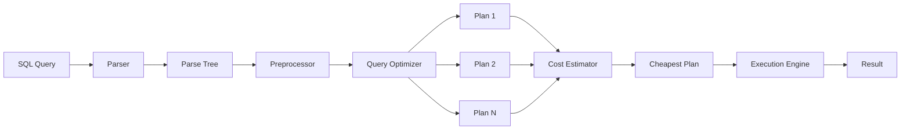

# Chapter 13: Query Processing and Optimization

> **Prev:** [Chapter 12: Indexing](12-indexing.md) | **Next:** [Chapter 14: NoSQL Databases](14-nosql.md)

## Learning Objectives

- Trace the lifecycle of a SQL query from text to result
- Explain how query parsing and validation works
- Understand query optimization and cost-based estimation
- Compare join algorithms: nested loop, hash join, merge join
- Describe pipelining and materialization in query execution
- Read and interpret query execution plans (EXPLAIN)

## Chapter at a Glance

| Topic | Key Insight | Practical Takeaway |
|-------|-------------|-------------------|
| **Query Lifecycle** | SQL text → Parse → Optimize → Execute → Result | Use EXPLAIN to see how your queries are executed |
| **Parsing** | Syntax check + semantic validation (tables/columns exist) | Pre-validate queries with EXPLAIN to catch errors early |
| **Cost-Based Optimization** | Multiple plans generated, cheapest selected | Keep statistics updated (ANALYZE) for accurate cost estimates |
| **Join Algorithms** | Nested Loop (small), Hash Join (equality), Merge Join (sorted) | Choose join type based on data size and access patterns |
| **Pipelining** | Stream results between operators without temp tables | Pipelined execution avoids expensive disk I/O for intermediate results |
| **Execution Plans** | Tree of operators with estimated costs per node | Read plans bottom-up; look for sequential scans on large tables |

## Chapter Roadmap




## Theory


### 13.1 Query Processing Overview

When a user submits a SQL query, the DBMS transforms it through several stages:

```
SQL Query Text
    ↓
[Parser] — Checks syntax, produces parse tree
    ↓
[Preprocessor] — Validates tables and columns, resolves views
    ↓
[Query Optimizer] — Generates alternative plans, estimates costs
    ↓
[Execution Engine] — Executes the chosen plan
    ↓
Result
```


> **One-Sentence Takeaway:** The SQL query lifecycle runs through four stages — parsing, optimization, execution, and result delivery — each adding its own processing cost.

### 13.2 Parsing and Preprocessing

**Parsing:** The SQL text is tokenized into keywords, identifiers, operators, and literals. The parser builds a **parse tree** (or abstract syntax tree) representing the query structure.

```sql
SELECT e.name, d.dept_name
FROM employees e
JOIN departments d ON e.dept_id = d.dept_id
WHERE e.salary > 50000;
```

Parse tree (conceptual):
```
QUERY
├── SELECT
│   ├── e.name
│   └── d.dept_name
├── FROM
│   ├── employees AS e
│   └── departments AS d
├── JOIN condition: e.dept_id = d.dept_id
└── WHERE: e.salary > 50000
```

**Preprocessing (Semantic Analysis):**
- Validates that tables (`employees`, `departments`) exist
- Validates that columns (`name`, `dept_name`, `salary`, `dept_id`) exist in those tables
- Resolves view references to their underlying queries
- Verifies data type compatibility in comparisons and joins


> **One-Sentence Takeaway:** Parsing checks syntax and semantics; a valid parse tree means the query is structurally correct but not necessarily efficient.

### 13.3 Query Optimization

The optimizer transforms the parse tree into an efficient **execution plan**. This is the most complex and important part of query processing.

**Relational Algebra Equivalences (used for rewriting):**

```sql
-- Original query
SELECT * FROM employees WHERE salary > 50000 AND department = 'Engineering'

-- Equivalent forms:
-- 1. σ_salary>50000(σ_dept='Eng'(employees))
-- 2. σ_dept='Eng'(σ_salary>50000(employees))
-- 3. σ_salary>50000 AND dept='Eng'(employees)
```

The optimizer applies transformations:

- **Selection pushing:** Move selections closer to the tables they filter
- **Join reordering:** Consider different join orders
- **Projection pushing:** Reduce column width early
- **View inlining:** Expand views into their base queries

**Cost-Based Optimization:**

The optimizer generates multiple alternative plans and estimates costs:

```sql
-- Different access methods for: SELECT * FROM employees WHERE id = 100

-- Plan A: Sequential scan
-- Cost: N pages (read all pages)

-- Plan B: Index scan on PRIMARY KEY
-- Cost: 3-4 B+ tree levels + 1 page read
```

**Cost Estimation Formula:**
```
Total Cost = CPU Cost + I/O Cost
I/O Cost = Number of disk pages read × Cost per page
CPU Cost = Number of tuples processed × Cost per tuple
```

The optimizer uses **statistics** from the system catalog:

```sql
-- PostgreSQL: View table statistics
SELECT relname, reltuples, relpages FROM pg_class WHERE relname = 'employees';

-- Column statistics
SELECT attname, n_distinct, most_common_vals, most_common_freqs
FROM pg_stats WHERE tablename = 'employees';
```

**Cardinality Estimation:** The optimizer estimates the number of rows at each stage:

- Equality filter: Estimate = total_rows / n_distinct
- Range filter: Estimate ≈ total_rows / 3 (heuristic)
- AND of two conditions: Estimate = rows_after_first × selectivity_of_second
- Join: Estimate ≈ rows_left × rows_right / max(n_distinct(join_column))


> **One-Sentence Takeaway:** The cost-based optimizer evaluates multiple execution plans using table statistics and chooses the cheapest estimated plan.

### 13.4 Join Algorithms

Join operations are the most performance-critical part of query processing. Three main algorithms:

**1. Nested Loop Join:**

```python
# For each row in outer table, scan inner table for matches
for each row_r in R:
    for each row_s in S:
        if row_r.join_attr == row_s.join_attr:
            output(row_r, row_s)
```

- Cost (no indexes): M × N (M = pages of R, N = pages of S)
- Cost (with index on inner): M + M × index_lookup_cost
- Best when: Small outer table, inner table joined via index
- Used for: Small-to-medium tables, or when one side is small

**2. Hash Join:**

```python
# Phase 1: Build a hash table on the smaller table
# Phase 2: Probe the hash table with the larger table
build_table = smaller_table(R, S)
for each row in build_table:
    hash[hash_func(row.join_attr)] = row

for each row in probe_table:
    matches = hash[hash_func(row.join_attr)]
    for each match in matches:
        if row.join_attr == match.join_attr:
            output(row, match)
```

- Cost: 3 × (pages(R) + pages(S)) approximately
- Best when: No useful indexes, equi-joins, one table is much smaller
- Used for: Large tables, data warehouse queries

**3. Merge Join (Sort-Merge Join):**

```python
# Phase 1: Sort both tables on the join attribute
# Phase 2: Merge the sorted lists
sort(R, join_attr)
sort(S, join_attr)

i, j = 0, 0
while i < len(R) and j < len(S):
    if R[i].join_attr == S[j].join_attr:
        output(R[i], S[j])
        # Handle duplicates
        if next(R) also matches: output all combinations
        i += 1; j += 1
    elif R[i].join_attr < S[j].join_attr:
        i += 1
    else:
        j += 1
```

- Cost: O(M log M + N log N + M + N) for sorting + merge
- Best when: Data is already sorted (e.g., via index), or large equi-joins
- Used for: Large tables when sorting is already needed for ORDER BY


> **One-Sentence Takeaway:** Nested Loop joins work best for small datasets, Hash Join for large unsorted equality joins, and Merge Join for pre-sorted data.

### 13.5 Other Operations

**Aggregation:**

Two approaches:
- **Sort-based:** Sort by GROUP BY columns, then scan and aggregate adjacent rows
- **Hash-based:** Build a hash table keyed by group-by columns, compute aggregates per bucket

**Duplicate Elimination (DISTINCT):**
- Sort and remove adjacent duplicates, or
- Hash and track seen values

**Sorting (ORDER BY):**
- If an index provides the desired order, use it
- Otherwise, sort in memory (if fits) or use external merge sort


> **One-Sentence Takeaway:** Sort, aggregation, and set operations follow the same optimization principles as joins — minimize data movement.

### 13.6 Pipelining vs. Materialization

**Pipelining:** Results flow upward through the query plan tree without intermediate storage. Each operator processes one row at a time and passes it to the parent operator.

```
Index Scan → Nested Loop → Projection → Output
               ↑
           Index Scan
```
Result: First row appears quickly (low latency).

**Materialization:** Intermediate results are fully computed and stored in temporary tables.

```
Hash Join
   (build hash table from small table first)
   ↓
Materialized build side
```

Result: Better for algorithms needing random access (hash joins, sort operations).


> **One-Sentence Takeaway:** Pipelining streams results between operators without intermediate storage, avoiding expensive disk writes during query execution.

### 13.7 Reading Execution Plans

```sql
-- PostgreSQL: View query plan without executing
EXPLAIN SELECT * FROM employees WHERE salary > 100000;

-- Output:
-- Seq Scan on employees  (cost=0.00..17340.00 rows=500 width=120)
--   Filter: (salary > 100000)

-- With actual execution statistics
EXPLAIN ANALYZE SELECT e.name, d.dept_name
FROM employees e
JOIN departments d ON e.dept_id = d.dept_id
WHERE e.salary > 100000;

-- Output might show:
-- Hash Join  (cost=350.00..4200.00 rows=450 width=80)
--   Hash Cond: (e.dept_id = d.dept_id)
--   -> Seq Scan on employees e  (cost=0.00..3400.00 rows=500 width=40)
--        Filter: (salary > 100000)
--   -> Hash  (cost=30.00..30.00 rows=100 width=44)
--        -> Seq Scan on departments d  (cost=0.00..30.00 rows=100 width=44)
```

**Reading Plans — Key Terms:**
- **cost:** Arbitrary units (lower is better). Format: startup_cost..total_cost
- **rows:** Estimated number of output rows
- **width:** Average output row width in bytes
- **actual time:** With EXPLAIN ANALYZE, real execution time
- **loops:** How many times the node executed

**Common Plan Nodes:**
| Node Type | Meaning |
|-----------|---------|
| Seq Scan | Full table scan |
| Index Scan | B+ tree index lookup |
| Index Only Scan | All needed data in index |
| Bitmap Scan | Bitmap of matching pages |
| Nested Loop | For each outer row, probe inner |
| Hash Join | Build hash on one side, probe with other |
| Merge Join | Sort both sides, then merge |
| Sort | External sort |
| Aggregate | GROUP BY or other aggregation |
| Limit | Stop after N rows |


> **One-Sentence Takeaway:** Execution plans are tree structures read bottom-up — the leaf nodes (sequential/index scans) show where the real work happens.

### 13.8 Query Plan Selection Example

```sql
SELECT o.order_id, c.name
FROM orders o
JOIN customers c ON o.customer_id = c.customer_id
WHERE c.state = 'CA'
  AND o.order_date >= '2026-01-01';
```

**Possible Plans:**

Plan A: Scan customers (state='CA'), join with orders via index
```
Index Scan on customers (state='CA') → Nested Loop → Output
                                            ↑
                                     Index Scan on orders(customer_id, order_date)
```
Good if: Many customers in state='CA' ← Actually, if only 2% of customers are in CA, this is excellent.

Plan B: Scan orders (date), join with customers via index
```
Index Scan on orders (date >= '2026-01-01') → Nested Loop → Output
                                                    ↑
                                            Index Scan on customers(customer_id)
```
Good if: Few orders in 2026.

Plan C: Hash join
```
Seq Scan on customers (state='CA') → Hash Join → Output
                                          ↑
                                Seq Scan on orders (date >= '2026-01-01')
```
Good if: Both tables are large and moderate portions are filtered.

The optimizer estimates which plan has the lowest total cost.


> **One-Sentence Takeaway:** Query plan selection depends on table size, available indexes, join order, and up-to-date statistics.

### 13.9 Optimization Hints

Most DBMS allow hints to override the optimizer:

```sql
-- PostgreSQL (via extension):
SET pg_hint_plan.enable_hint = ON;
SELECT /*+ SeqScan(employees) */ * FROM employees;

-- Oracle:
SELECT /*+ FULL(employees) */ * FROM employees;
SELECT /*+ INDEX(employees idx_salary) */ * FROM employees WHERE salary > 50000;

-- MySQL:
SELECT STRAIGHT_JOIN e.* FROM employees e JOIN departments d ON e.dept_id = d.dept_id;
```

**When to hint:** Rarely. Modern optimizers make good choices for 95%+ of queries. Hints should only be used when:
- The optimizer consistently chooses a bad plan
- The statistics are out of date
- The query has unusual characteristics


> **One-Sentence Takeaway:** Optimization hints let developers override the optimizer's choices when statistics are stale or queries are unusual.

## Examples

**Example 13.1: EXPLAIN Analysis**

```sql
-- Create a sample table and analyze a query
CREATE TABLE large_orders AS
SELECT generate_series(1, 1000000) AS order_id,
       (random() * 10000)::INT AS customer_id,
       NOW() - (random() * 365 * '1 day'::INTERVAL) AS order_date;

CREATE INDEX idx_customer ON large_orders(customer_id);

-- Query 1: Single row lookup
EXPLAIN ANALYZE SELECT * FROM large_orders WHERE order_id = 500000;
-- Output: Index Scan using large_orders_pkey (cost=0.42..8.44 rows=1 width=20)
--         Actual time: 0.043..0.044 rows=1 loops=1

-- Query 2: Range lookup
EXPLAIN ANALYZE SELECT * FROM large_orders WHERE order_id BETWEEN 500000 AND 501000;
-- Output: Index Scan using large_orders_pkey (cost=0.42..35.50 rows=1000 width=20)
--         Actual time: 0.052..0.350 rows=1001 loops=1

-- Query 3: Large range (may choose full scan vs. index)
EXPLAIN ANALYZE SELECT * FROM large_orders WHERE order_id < 500000;
-- Might switch to Seq Scan if optimizer decides it covers too many rows

-- Query 4: No useful index (date function)
EXPLAIN ANALYZE SELECT * FROM large_orders
WHERE order_date > NOW() - INTERVAL '7 days';
-- Seq Scan (unless we create an index on order_date)
```

**Example 13.2: Join Strategy Comparison**

```sql
-- Table sizes: employees (10K rows), departments (100 rows)

-- Join with small result set
EXPLAIN ANALYZE
SELECT e.name, d.dept_name
FROM employees e
JOIN departments d ON e.dept_id = d.dept_id
WHERE e.emp_id = 42;
-- Likely: Nested Loop — Index Scan on employees, then Index Scan on departments

-- Join selecting many employees
EXPLAIN ANALYZE
SELECT e.name, d.dept_name
FROM employees e
JOIN departments d ON e.dept_id = d.dept_id
WHERE e.salary > 30000;
-- Likely: Hash Join — because many employees will match

-- Join with no filtering
EXPLAIN ANALYZE
SELECT * FROM employees e
JOIN departments d ON e.dept_id = d.dept_id;
-- Likely: Nested Loop or Hash Join depending on data sizes and indexes
```

## 💡 Pro Tips

1. **Always run EXPLAIN ANALYZE before optimizing a query** — never guess what the optimizer is doing. The actual execution plan reveals index usage, join algorithms, and bottlenecks.
2. **Hash joins are your best friend for large, unsorted data** — they are O(n) build + O(n) probe with no sorting required. Most OLAP workloads rely heavily on hash joins.
3. **Nested loop joins are not always bad** — for small result sets (a few hundred rows) with proper indexes, they can outperform hash joins by avoiding hash table build overhead.
4. **Pipelining beats materialization** — PostgreSQL's iterator model processes rows one at a time through the plan tree, avoiding expensive intermediate result storage.
5. **Keep your statistics up to date** — stale statistics (from missing ANALYZE or VACUUM) are the #1 cause of bad query plans in production.

## One-Sentence Takeaways

- **13.1:** Query processing transforms SQL into an executable plan through parsing, preprocessing, optimization, and execution.
- **13.2:** The query optimizer enumerates alternative execution plans and selects the one with the lowest estimated cost based on statistics.
- **13.3:** Nested loop join is best for small result sets with index support; hash join excels at large, unsorted data with no indexes.
- **13.4:** Merge join requires sorted input but provides fast, single-pass joins for pre-sorted data.
- **13.5:** Sorting, aggregation, and set operations can use sort-based or hash-based algorithms.
- **13.6:** Pipelining streams results without intermediate storage; materialization stores intermediate results for later use.
- **13.7:** EXPLAIN shows the query plan; EXPLAIN ANALYZE executes it and includes actual timing and row counts.
- **13.8:** The optimizer uses histograms, most-common-values lists, and correlation statistics to estimate cardinality.

## Concept Comparison Table

| Join Algorithm | Time Complexity | Requires Sorted Input? | Best When |
|--------------|----------------|----------------------|-----------|
| **Nested Loop** | O(n × m) | No | One relation is small, index on inner |
| **Index Nested Loop** | O(n × log m) | No | Index on join column, small outer |
| **Hash Join** | O(n + m) build + probe | No | Large, unsorted data; no indexes |
| **Merge Join** | O(n + m) | Yes (both inputs) | Pre-sorted data, large datasets |

| Query Processing Stage | What Happens | Output |
|----------------------|-------------|--------|
| **Parsing** | SQL text → parse tree | Parse tree |
| **Preprocessing** | Semantic checks, view expansion | Logical query plan (relational algebra) |
| **Optimization** | Plan enumeration, cost estimation | Physical query plan |
| **Execution** | Run the plan, produce results | Query result rows |

## Quick Reference

| EXPLAIN Output Terminology | Meaning |
|---------------------------|---------|
| **Seq Scan** | Sequential (full table) scan — no index used |
| **Index Scan** | B+ tree traversal to find matching rows |
| **Index Only Scan** | All needed columns in the index (no table access) |
| **Bitmap Index Scan** | Bitmap builds a bitmap of matching pages, then fetches |
| **Nested Loop** | For each outer row, probe inner (often with index) |
| **Hash Join** | Build hash table on inner, probe with outer |
| **Merge Join** | Merge two sorted streams |
| **Sort** | Explicit sort (often for ORDER BY or merge join) |
| **Materialize** | Store intermediate result for reuse or rescan |
| **Limit** | Stop early after N rows |

## Cross-Application Matrix

| Query Processing Concept | Applied In | Why It Matters |
|------------------------|-----------|----------------|
| **Index Nested Loop Join** | OLTP queries joining a few rows | Fast for single-record lookups (e.g., order + customer) |
| **Hash Join** | Data warehouse queries | Joining fact tables with millions of rows |
| **Merge Join** | Reporting with sorted data | Monthly reports where data is naturally ordered by date |
| **Pipelining** | Streaming queries | Large result sets processed row-by-row without memory exhaustion |
| **Statistics (Histograms)** | All accurate query plans | Underpins correct cardinality estimation |
| **Index Only Scan** | High-read OLTP | Avoids table access when index covers the query |

## Chapter Quiz

1. The correct order of query processing stages is:
   a) Optimization → Parsing → Execution → Preprocessing
   b) Parsing → Preprocessing → Optimization → Execution
   c) Parsing → Optimization → Preprocessing → Execution
   d) Execution → Parsing → Preprocessing → Optimization

2. Which join algorithm builds a hash table and then probes it?
   a) Nested Loop Join
   b) Hash Join
   c) Merge Join
   d) Index Nested Loop Join

3. A nested loop join is most efficient when:
   a) Both tables are large
   b) One table is small and the other has an index on the join column
   c) Both tables are sorted
   d) No indexes exist

4. The most common cause of bad query plans is:
   a) Hardware failure
   b) Stale statistics
   c) Network latency
   d) Wrong SQL syntax

5. Pipelining in query processing means:
   a) Results flow through operators without intermediate storage
   b) Multiple queries run in parallel
   c) Data is sorted before processing
   d) Indexes are rebuilt automatically

6. EXPLAIN ANALYZE differs from EXPLAIN because:
   a) It shows the same information but formatted differently
   b) It executes the query and shows actual timing and row counts
   c) It only works for SELECT queries
   d) It requires superuser privileges

7. A merge join requires:
   a) Both inputs to be sorted
   b) At least one input to have an index
   c) Both inputs to be hashed
   d) The join condition to be inequality

8. The query optimizer selects a plan based on:
   a) Random selection
   b) Alphabetical order of tables
   c) Lowest estimated cost using statistics
   d) The order tables appear in the FROM clause

**Answers:** 1-b, 2-b, 3-b, 4-b, 5-a, 6-b, 7-a, 8-c

## Summary

- SQL queries go through: parsing → preprocessing → optimization → execution.
- The optimizer uses statistics to estimate costs and select the best plan.
- Join algorithms: Nested Loop (small result sets), Hash Join (large, no indexes), Merge Join (sorted data).
- Pipelining streams results without intermediate storage; materialization stores intermediate results.
- EXPLAIN shows the query plan; EXPLAIN ANALYZE includes actual execution statistics.
- The optimizer's statistics must be kept up to date (ANALYZE / VACUUM).

## Exercises

### Basic

1. List the main stages of query processing from SQL text to result.

2. What information does the optimizer use to estimate query costs?

3. Describe three join algorithms and when each is most appropriate.

4. Execute and interpret: `EXPLAIN SELECT * FROM employees WHERE department_id = 5;`

### Intermediate

5. Given the query `SELECT * FROM orders WHERE customer_id = 42 AND order_date > '2026-01-01'` and an index on (customer_id, order_date), explain why the optimizer can use the index efficiently. What if the index were (order_date, customer_id)?

6. For a table with 1 million rows and an equality filter on a column with 10,000 distinct values, estimate the number of result rows. Would the optimizer prefer an index scan or a full table scan? How does the answer change if the column has only 2 distinct values?

7. Create a table and populate it with at least 100,000 rows. Use EXPLAIN ANALYZE to compare:
   - A query with an index on the filtered column
   - Same query without the index
   Document the difference in execution time and cost estimates.

8. What is the difference between pipelining and materialization in query execution? Give an example of an operator that requires materialization.

### Advanced

9. Analyze the following query plan and identify potential problems:
```
Sort (cost=25000.00..25500.00 rows=200000 width=40)
  Sort Key: o.order_date
  -> Hash Join (cost=5000.00..15000.00 rows=200000 width=40)
       Hash Cond: (o.customer_id = c.customer_id)
       -> Seq Scan on orders o (cost=0.00..8000.00 rows=500000 width=28)
       -> Hash (cost=1000.00..1000.00 rows=50000 width=16)
            -> Seq Scan on customers c (cost=0.00..1000.00 rows=50000 width=16)
```
What indexes would you recommend? Why is the sort needed?

10. Design a query optimization experiment:
    - Create a table `sales(product_id INT, sale_date DATE, amount DECIMAL)` with 5M rows
    - Write a complex query with GROUP BY, JOIN to a products table, and ORDER BY
    - Create appropriate indexes
    - Compare execution plans with and without indexes
    - Which plan has the lowest cost? Is it the fastest?

11. Some databases support "adaptive" join methods (e.g., Adaptive Join in SQL Server). How do adaptive joins work? When would they choose a different join algorithm mid-execution?
