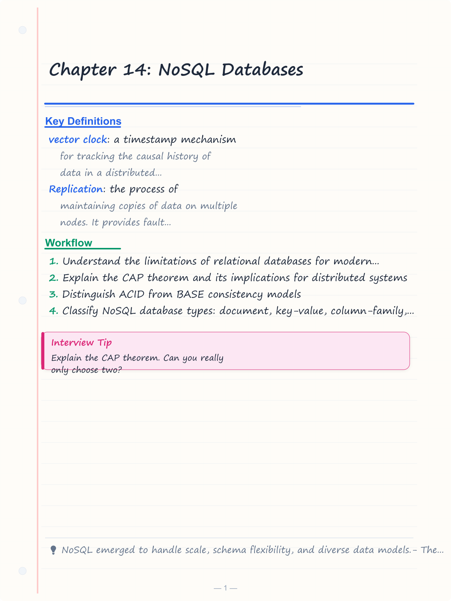
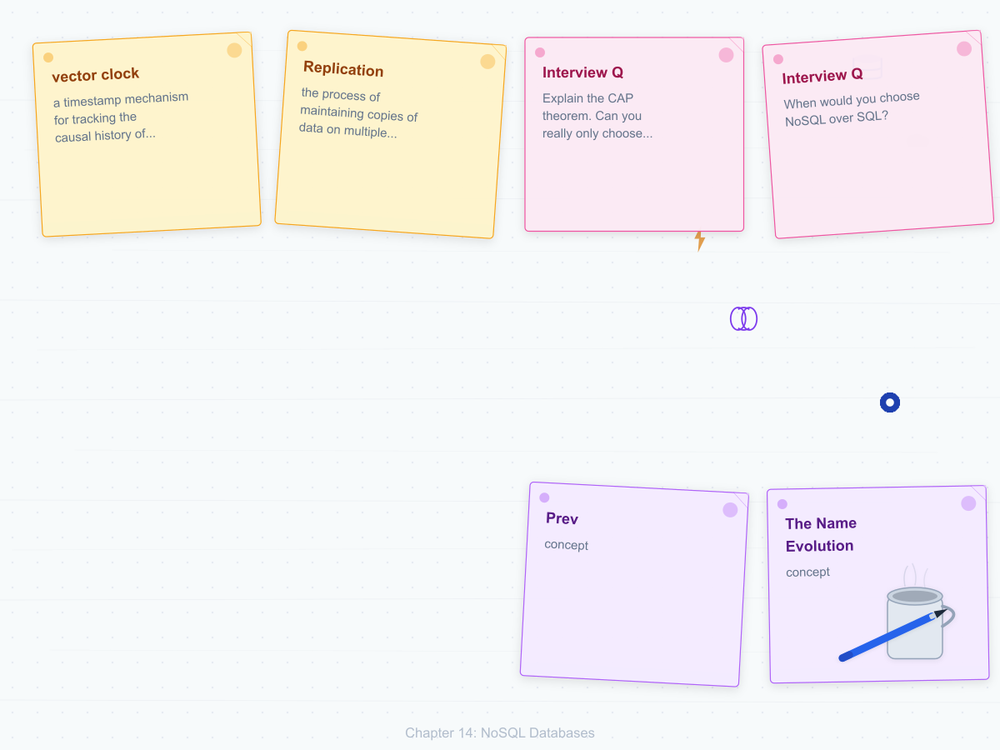
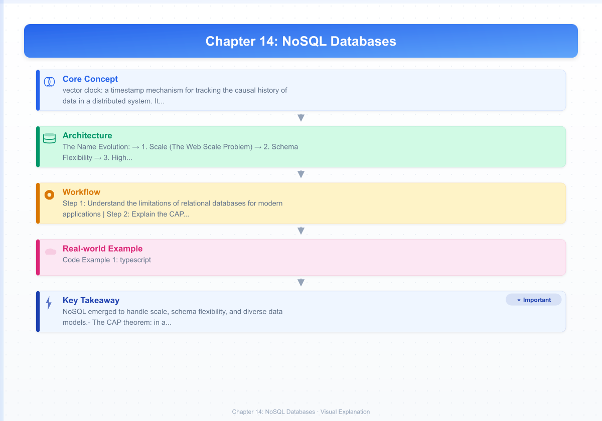
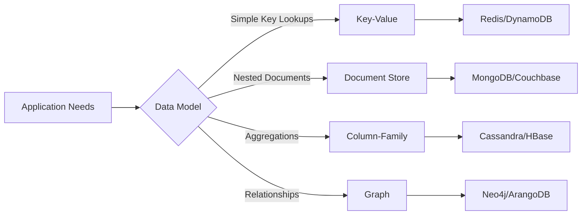

# Chapter 14: NoSQL Databases

> **Prev:** [Chapter 13—Query Processing](13-query-processing.md) | **Next:** [Chapter 15—MongoDB](15-mongodb.md)

## Learning Objectives

- Understand the limitations of relational databases for modern applications
- Explain the CAP theorem and its implications for distributed systems
- Distinguish ACID from BASE consistency models
- Classify NoSQL database types: document, key-value, column-family, graph
- Select appropriate NoSQL solutions based on application requirements
- Understand when to use SQL vs. NoSQL

<!-- Image Gallery -->
<section class="lesson-visuals" aria-label="Visual learning resources">
  <header><span>VISUAL LEARNING</span><h2>See it. Review it. Remember it.</h2></header>
  <a class="lesson-visual-card" href="../../assets/images/lessons/database-management-systems/14-nosql/handwritten-notes.png" target="_blank" rel="noopener">
    
    <span><strong>Handwritten notes</strong>Condensed notes for deliberate review.</span>
  </a>
  <a class="lesson-visual-card" href="../../assets/images/lessons/database-management-systems/14-nosql/sticky-notes.png" target="_blank" rel="noopener">
    
    <span><strong>Sticky-note revision</strong>Fast recall prompts for revision.</span>
  </a>
  <a class="lesson-visual-card" href="../../assets/images/lessons/database-management-systems/14-nosql/visual-explanation.png" target="_blank" rel="noopener">
    
    <span><strong>Visual concept guide</strong>A connected explanation of the key ideas.</span>
  </a>
</section>
<!-- End Image Gallery -->


## Chapter at a Glance

| Topic | Key Insight | Practical Takeaway |
|-------|-------------|-------------------|
| **NoSQL Motivation** | Scale-out, flexible schema, high availability | Choose NoSQL when relational constraints become bottlenecks |
| **Key-Value Stores** | Simple get/put by primary key | Best for caching, session storage, and simple lookups |
| **Document Stores** | Semi-structured data with nested queries | Use for content management, catalogs, and evolving schemas |
| **Column-Family Stores** | Wide-column tables optimized for aggregation | Ideal for time-series data and analytics |
| **Graph Databases** | Nodes + edges with graph traversal queries | Best for social networks, recommendations, and fraud detection |
| **CAP Theorem** | Choose 2 of 3: Consistency, Availability, Partition Tolerance | Partition tolerance is mandatory - choose CP or AP |

## Chapter Roadmap




---

## 14.1 NoSQL Overview — What, Why, When

### 14.1.1 What Is NoSQL?


NoSQL (Not Only SQL) refers to a class of database management systems that do not follow the relational model. They are designed for horizontal scaling, flexible schemas, high availability, and diverse data models (key-value, document, column-family, graph). Unlike relational databases, NoSQL systems typically relax ACID guarantees in favor of performance and scale.

**The Name Evolution:**
- 1998: Carlo Strozzi used "NoSQL" for his lightweight relational DB
- 2009: Johan Oskarsson popularized the term for distributed non-relational databases
- 2010s: Shifted from "No SQL" to "Not Only SQL" as systems added SQL-like query support

### 14.1.2 Why NoSQL? — The Motivation


Relational databases dominated for decades, but three forces drove the NoSQL revolution:

**1. Scale (The Web Scale Problem)**
- Google, Amazon, Facebook needed petabytes across thousands of servers
- Relational databases scale vertically (bigger servers) — hits hardware limits
- NoSQL scales horizontally (more servers) — commodity hardware, linear cost growth

**2. Schema Flexibility**
- Agile development: schemas evolve rapidly, relational migrations are painful
- Semi-structured data: JSON, XML, logs — not a perfect fit for normalized tables
- NoSQL uses schema-on-read (interpret structure at query time), not schema-on-write

**3. High Availability**
- 24/7 services cannot tolerate downtime for maintenance
- Relational replication is complex; failover is not always seamless
- NoSQL systems built with gossip protocols, hinted handoff, and automatic failover

**The "Impedance Mismatch":**
Object-Relational Mapping (ORM) tools like Hibernate exist because relational tables map poorly to application objects. NoSQL documents map naturally to objects, eliminating the ORM layer.

### 14.1.3 When to Use NoSQL vs. SQL


| Use NoSQL When | Use SQL When |
|---------------|-------------|
| Data is semi-structured or unstructured | Data is highly structured and normalized |
| Schema evolves frequently | Schema is stable and well-defined |
| You need horizontal write scalability | You need complex joins and subqueries |
| High-availability is critical (zero-downtime) | Read-after-write consistency is mandatory |
| Data is temporal (logs, time-series) | Multi-row ACID transactions are required |
| Latency-sensitive caching is needed | Reporting and ad-hoc analysis are primary |

**Decision Flowchart:**
```
Application Data Needs
    |
    ├── Need multi-row ACID transactions? → SQL (PostgreSQL, MySQL)
    ├── Need complex joins and ad-hoc queries? → SQL
    ├── Schema changes weekly? → NoSQL Document
    ├── Data is a connected graph? → NoSQL Graph
    ├── Need 100K+ writes/sec on commodity hardware? → NoSQL Column-Family
    ├── Just need fast key-based lookups? → NoSQL Key-Value
    └── Need full-text search ranking? → Elasticsearch (separate category)
```

### 14.1.4 Real-World Analogy: Library (SQL) vs. Warehouse (NoSQL)


**SQL Database = A Library**
```
Books are cataloged by ISBN (schema)
Every book must have: ISBN, Title, Author, Dewey Decimal (predefined schema)
To find a book: consult the card catalog (index), walk to the exact shelf
To find all books by "Author X": SQL JOIN across multiple catalog tables
Advantage: precise queries, no ambiguity, strong organization
Disadvantage: reorganizing the library means re-shelving every book (schema migration)
Scaling: build a bigger library (vertical) or a second library with complex cross-referencing
```

**NoSQL Database = A Warehouse**
```
Boxes stored on pallets labeled with a barcode (key)
Box contains whatever fits: electronics, clothes, documents (no schema)
To find a box: scan the barcode (key lookup)
To find "all blue items": open every box and check (no join — scan)
Advantage: flexible, fast put/get, scale by adding more pallet racks (horizontal)
Disadvantage: complex queries require opening many boxes, no global organization
Scaling: add more racks, shift pallets between racks (rebalancing), no downtime
```

**When to use each:**
- Library: you need to answer "how many books by Author X were published after 2020?"
- Warehouse: you need "give me box 42A" or "store this new item right now"

---

## 14.2 SQL vs. NoSQL — Head-to-Head Comparison (18 Criteria)

| # | Criteria | SQL (RDBMS) | NoSQL |
|---|----------|-------------|-------|
| 1 | **Data Model** | Tables, rows, columns (normalized) | Documents, key-value pairs, column families, graphs |
| 2 | **Schema** | Fixed, predefined, enforced (schema-on-write) | Dynamic, flexible (schema-on-read) |
| 3 | **Query Language** | SQL (standardized across vendors) | Vendor-specific (MQL, CQL, Cypher, APIs) |
| 4 | **ACID Compliance** | Full ACID (Atomicity, Consistency, Isolation, Durability) | Usually BASE; some offer ACID per document/record |
| 5 | **Consistency Model** | Strong consistency (linearizable) | Tunable: strong, eventual, causal, etc. |
| 6 | **Scaling Strategy** | Vertical (add CPU/RAM to single server) | Horizontal (add commodity servers) |
| 7 | **Partition Tolerance** | Not designed for network partitions | Built for partitions (CAP-aware) |
| 8 | **Joins** | Native SQL JOINs (optimized, indexed) | No native joins; data is denormalized or application-joined |
| 9 | **Transactions** | Multi-row, multi-table ACID transactions | Single-document/record; multi-document via 2PC or sagas |
| 10 | **Performance (Read)** | Excellent for complex queries with indexes | Excellent for simple key lookups; degrades for complex queries |
| 11 | **Performance (Write)** | Moderate (constraint checks, indexes, logs) | Very high (no constraints, append-friendly) |
| 12 | **Indexing** | B-tree, hash, bitmap, GiST, GIN, etc. | Secondary indexes, inverted indexes, TTL indexes |
| 13 | **Maturity** | 50+ years (since 1970s) | 15-20 years (since mid-2000s) |
| 14 | **Tooling & Ecosystem** | Mature: Hibernate, ORMs, BI tools, reporting | Growing: Mongoose, Spring Data, proprietary tools |
| 15 | **Data Integrity** | Referential integrity (foreign keys, constraints) | Application-enforced; no FK constraints |
| 16 | **Replication** | Master-slave, synchronous log shipping | Multi-master, peer-to-peer, gossip-based |
| 17 | **Use Case** | ERP, banking, CRM, any ACID-required | Web apps, IoT, real-time analytics, caching |
| 18 | **Cost** | Expensive vertical hardware, commercial licenses | Commodity hardware, open-source, lower TCO at scale |

### 14.2.1 When Polyglot Persistence Wins


Modern applications rarely choose one over the other — they use both:

```python
# Polyglot persistence stack for an e-commerce platform
#
# +------------------+        +-----------------+
# |  PostgreSQL      |        |  MongoDB         |
# |  (Orders, Users, |        |  (Product        |
# |   Payments)      |        |   Catalog)       |
# +--------+---------+        +--------+--------+
#          |                           |
#          v                           v
#  +-------+--------+        +---------+--------+
#  |  Redis          |        |  Elasticsearch   |
#  |  (Session,      |        |  (Full-text      |
#  |   Cart Cache)   |        |   Search)        |
#  +------------------+        +------------------+
#          |                           |
#          v                           v
#  +-------+--------+        +---------+--------+
#  |  Neo4j          |        |  Cassandra       |
#  |  (Recommenda-   |        |  (Event Logs,    |
#  |   tions)        |        |   Analytics)     |
#  +------------------+        +------------------+
```

---

## 14.3 The CAP Theorem

### 14.3.1 Core Concept


Proposed by **Eric Brewer** in 2000 (keynote at PODC), formally proven by **Gilbert and Lynch** in 2002. The theorem states that a distributed data system can guarantee only **two** of these three properties simultaneously:

1. **Consistency (C):** Every read receives the most recent write or an error. All nodes see the same data at the same logical time.
2. **Availability (A):** Every non-failing node receives a (non-error) response for every request, without guarantee it contains the latest write.
3. **Partition Tolerance (P):** The system continues to operate despite an arbitrary number of messages being dropped or delayed between nodes (network partition).

```
        Consistency
           /\
          /  \
         /    \
        / CAP  \
       /        \
      /__________\
Availability   Partition Tolerance
```

### 14.3.2 Understanding Network Partitions


A **network partition** occurs when a communication failure splits nodes into two or more groups that cannot talk to each other.

```
Normal State:
[Node A] <----> [Node B] <----> [Node C]
   All nodes communicate, data is consistent

Partition State:
[Node A] <--X--> [Node B] <----> [Node C]
   ^--- partition ---^
   Group 1 (A alone)       Group 2 (B + C)
```

**Critical Insight:** Partitions *will* happen in distributed systems (network failures, switches dying, cables cut). Since P is unavoidable, you must choose between C and A *during a partition*.

**PACELC Extension** (Daniel Abadi, 2010):
- If a **P**artition occurs → trade **A**vailability vs **C**onsistency
- **E**lse (no partition) → trade **L**atency vs **C**onsistency

### 14.3.3 CAP Trade-off Scenarios — Dry Run Trace Tables


**Scenario 1: CP System (e.g., HBase, MongoDB with w=majority)**

```
Initial State: key "balance" = 100 on both Node A and Node B

Step | Event                          | Node A (balance) | Node B (balance) | Action
-----|--------------------------------|------------------|------------------|-------
1    | Network partition occurs       | 100              | 100              | Partition
2    | Write(balance=200) to Node A   | 200              | 100              | Write succeeds locally
3    | Read(balance) from Node B      | 200              | 100              | Node B returns ERROR
4    | Read(balance) from Node A      | 200              | 100              | Node A returns 200
5    | Partition heals                | 200              | 200              | Replication syncs
6    | Read(balance) from Node B      | 200              | 200              | Returns 200
```

**Outcome:** Reads from partition B are rejected (unavailable) to preserve consistency. System is CP.

**Scenario 2: AP System (e.g., Cassandra, DynamoDB)**

```
Initial State: key "balance" = 100 on both Node A and Node B

Step | Event                          | Node A (balance) | Node B (balance) | Action
-----|--------------------------------|------------------|------------------|-------
1    | Network partition occurs       | 100              | 100              | Partition
2    | Write(balance=200) to Node A   | 200              | 100              | Write succeeds
3    | Read(balance) from Node B      | 200              | 100              | Node B returns 100 (stale!)
4    | Read(balance) from Node A      | 200              | 100              | Node A returns 200
5    | Partition heals                | 200              | 200              | Anti-entropy syncs
6    | Read(balance) from Node B      | 200              | 200              | Returns 200
```

**Outcome:** Reads from partition B return stale data but never fail. System is AP.

**Scenario 3: CA System (Single-node PostgreSQL) — Not Distributed**

```
Initial State: key "balance" = 100 on single server

Step | Event                          | Value | Action
-----|--------------------------------|-------|-------
1    | Write(balance=200)             | 200   | Write succeeds
2    | Read(balance)                  | 200   | Returns 200 (consistent)
3    | Server crashes                 | --    | System unavailable
4    | Server restarts                | 200   | From persistent storage
```

**Outcome:** When the server is up, data is consistent and available. But a crash = total unavailability. In a true distributed system with partitions, CA is impossible.

### 14.3.4 CAP Theorem — Detailed Explanation of C, A, P


**Consistency (in the CAP sense):** Linearizability. All nodes agree on the order of operations and the value of every key. Equivalent to having a single, atomic copy of the data.

**Availability (in the CAP sense):** Every request to a non-failing node returns a response. This does NOT mean "99.999% uptime" — it means during a partition, every node that is still reachable will respond (even if the response is stale).

**Partition Tolerance:** The system's ability to function despite nodes being unable to communicate. Without P, a network split takes down the entire system.

**Common Misconception:**
- ❌ "CAP says you can only have 2 out of 3 at all times."
- ✅ "CAP says only during a network partition must you choose between C and A. When no partition exists, you can have C + A."

### 14.3.5 CAP Simulator — Python


```python
"""
CAP Simulator: Demonstrates CP vs AP behavior during network partitions.
Usage: python cap_simulator.py
"""

import time
import random
from enum import Enum

class CAPMode(Enum):
    CP = "Consistency + Partition Tolerance"
    AP = "Availability + Partition Tolerance"

class Node:
    def __init__(self, node_id):
        self.node_id = node_id
        self.data = {}  # key -> value
        self.partitioned = False
        self.peers = []

    def set_peers(self, peers):
        self.peers = peers

    def write(self, key, value):
        self.data[key] = value
        return True

    def read(self, key):
        return self.data.get(key, None)

class CAPSimulator:
    def __init__(self, mode, num_nodes=3):
        self.mode = mode
        self.nodes = [Node(i) for i in range(num_nodes)]
        for node in self.nodes:
            node.set_peers([n for n in self.nodes if n.node_id != node.node_id])

    def cause_partition(self, group_a, group_b):
        """Split nodes into two groups that cannot communicate."""
        for node_a in group_a:
            node_a.partitioned = True
            node_a.peers = [n for n in group_a if n.node_id != node_a.node_id]
        for node_b in group_b:
            node_b.partitioned = True
            node_b.peers = [n for n in group_b if n.node_id != node_b.node_id]

    def heal_partition(self):
        for node in self.nodes:
            node.partitioned = False
            node.set_peers([n for n in self.nodes if n.node_id != node.node_id])

    def write_to_node(self, node_id, key, value):
        node = self.nodes[node_id]
        result = node.write(key, value)
        # In AP mode, propagate to peers even during partition
        if self.mode == CAPMode.AP and node.partitioned:
            for peer in node.peers:
                peer.write(key, value)
        return result

    def read_from_node(self, node_id, key):
        node = self.nodes[node_id]
        if self.mode == CAPMode.CP and node.partitioned:
            # In CP: partitioned nodes refuse reads (cannot guarantee consistency)
            if random.random() < 0.7:  # 70% chance the partition affects this key
                return None  # Simulate unavailability
        return node.read(key)

    def simulate(self):
        print(f"\n=== CAP Simulator: {self.mode.value} ===")
        # Initialize all nodes with balance=100
        for node in self.nodes:
            node.write("balance", 100)
        print(f"Initial: balance=100 on all {len(self.nodes)} nodes")

        # Cause partition: Node 0 isolated from Nodes 1 and 2
        print(f"\n[1] Network partition: Node 0 isolated from Nodes 1,2")
        self.cause_partition([self.nodes[0]], self.nodes[1:])

        # Write to Node 0
        print(f"[2] Write balance=200 to Node 0")
        self.write_to_node(0, "balance", 200)

        # Read from different nodes
        for i in range(len(self.nodes)):
            val = self.read_from_node(i, "balance")
            status = "STALE" if val == 100 else "CURRENT" if val == 200 else "UNAVAILABLE"
            print(f"[3] Read from Node {i}: balance={val} ({status})")

        # Heal partition
        print(f"\n[4] Partition heals")
        self.heal_partition()

        # Sync all nodes
        if self.mode == CAPMode.CP:
            # CP: sync from the node that was written to
            current_val = self.nodes[0].read("balance")
            for node in self.nodes:
                node.write("balance", current_val)
        else:
            # AP: conflict resolution needed (last-write-wins typically)
            latest = max(
                (self.nodes[i].read("balance") or 0, i) for i in range(len(self.nodes))
            )
            for node in self.nodes:
                node.write("balance", latest[0])
            print(f"[AP] Conflict resolved via last-write-wins: balance={latest[0]}")

        print(f"[5] Final state:")
        for i in range(len(self.nodes)):
            print(f"    Node {i}: balance={self.nodes[i].read('balance')}")

if __name__ == "__main__":
    print("=" * 50)
    print("CAP THEOREM SIMULATOR")
    print("=" * 50)
    sim_cp = CAPSimulator(CAPMode.CP)
    sim_cp.simulate()
    sim_ap = CAPSimulator(CAPMode.AP)
    sim_ap.simulate()
```

**Dry Run — CP Simulator Output:**
```
=== CAP Simulator: CP ===
Initial: balance=100 on all 3 nodes

[1] Partition: Node 0 isolated from Nodes 1,2
[2] Write balance=200 to Node 0
[3] Read from Node 0: balance=200 (CURRENT)
    Read from Node 1: balance=None (UNAVAILABLE)
    Read from Node 2: balance=None (UNAVAILABLE)
[4] Partition heals
[5] Final: All nodes balance=200
```

**Dry Run — AP Simulator Output:**
```
=== CAP Simulator: AP ===
Initial: balance=100 on all 3 nodes

[1] Partition: Node 0 isolated from Nodes 1,2
[2] Write balance=200 to Node 0
[3] Read from Node 0: balance=200 (CURRENT)
    Read from Node 1: balance=100 (STALE)
    Read from Node 2: balance=100 (STALE)
[4] Partition heals
[5] Conflict resolved via last-write-wins: balance=200
    All nodes balance=200
```

**Complexity Analysis:**
- CP mode read: O(1) on non-partitioned nodes, O(1) with unavailability on partitioned nodes
- AP mode read: O(1) always, but may return stale data
- Conflict resolution (AP heal): O(n) where n = number of replicas
- Space: O(k * n) where k = number of keys, n = number of nodes

**Why this complexity?** Each node stores its own copy of all keys. During partition, nodes cannot synchronize, so stale reads or unavailability is the trade-off. Healing requires comparing all replicas to find the latest value.

### 14.3.6 CAP Simulator — C++


```cpp
#include <iostream>
#include <unordered_map>
#include <vector>
#include <memory>
#include <string>
#include <cstdlib>
#include <ctime>

enum class CAPMode { CP, AP };

class Node {
public:
    int id;
    std::unordered_map<std::string, int> data;
    bool partitioned;
    std::vector<Node*> peers;

    Node(int id) : id(id), partitioned(false) {}

    void write(const std::string& key, int value) {
        data[key] = value;
    }

    int read(const std::string& key) {
        auto it = data.find(key);
        return (it != data.end()) ? it->second : -1;
    }
};

class CAPSimulator {
    std::vector<std::unique_ptr<Node>> nodes;
    CAPMode mode;

public:
    CAPSimulator(CAPMode mode, int n = 3) : mode(mode) {
        for (int i = 0; i < n; ++i) {
            nodes.push_back(std::make_unique<Node>(i));
        }
        for (auto& n : nodes) {
            for (auto& p : nodes) {
                if (n->id != p->id)
                    n->peers.push_back(p.get());
            }
        }
    }

    void causePartition(const std::vector<int>& groupA, const std::vector<int>& groupB) {
        for (int id : groupA) {
            nodes[id]->partitioned = true;
            nodes[id]->peers.clear();
            for (int pid : groupA)
                if (pid != id)
                    nodes[id]->peers.push_back(nodes[pid].get());
        }
        for (int id : groupB) {
            nodes[id]->partitioned = true;
            nodes[id]->peers.clear();
            for (int pid : groupB)
                if (pid != id)
                    nodes[id]->peers.push_back(nodes[pid].get());
        }
    }

    void healPartition() {
        for (auto& n : nodes) {
            n->partitioned = false;
            n->peers.clear();
            for (auto& p : nodes) {
                if (n->id != p->id)
                    n->peers.push_back(p.get());
            }
        }
    }

    int readFromNode(int id, const std::string& key) {
        if (mode == CAPMode::CP && nodes[id]->partitioned)
            return -1; // Unavailable in CP during partition
        return nodes[id]->read(key);
    }

    void simulate() {
        std::cout << "\n=== CAP Simulator: " << (mode == CAPMode::CP ? "CP" : "AP") << " ===\n";
        for (auto& n : nodes) n->write("balance", 100);
        std::cout << "Initial: balance=100 on all " << nodes.size() << " nodes\n";

        std::cout << "\n[1] Network partition: Node 0 isolated\n";
        causePartition({0}, {1, 2});

        std::cout << "[2] Write balance=200 to Node 0\n";
        nodes[0]->write("balance", 200);

        for (int i = 0; i < (int)nodes.size(); ++i) {
            int val = readFromNode(i, "balance");
            std::string status = (val == 200) ? "CURRENT" : (val == 100) ? "STALE" : "UNAVAILABLE";
            std::cout << "[3] Read Node " << i << ": balance=" << val << " (" << status << ")\n";
        }

        healPartition();
        std::cout << "\n[4] Partition healed\n";

        // Sync
        int latest = nodes[0]->read("balance");
        for (auto& n : nodes) n->write("balance", latest);

        std::cout << "[5] Final: All nodes balance=" << nodes[0]->read("balance") << "\n";
    }
};

int main() {
    std::srand(std::time(nullptr));
    std::cout << "=== CAP THEOREM SIMULATOR ===\n";
    CAPSimulator simCP(CAPMode::CP);
    simCP.simulate();
    CAPSimulator simAP(CAPMode::AP);
    simAP.simulate();
    return 0;
}
```

**Complexity Analysis for CAP Simulator (C++):**
- Time to simulate a partition: O(n) for peer reassignment
- Read during partition (CP): O(1) check + O(1) data access
- Read during partition (AP): O(1) always
- Healing: O(n) to rebuild peer lists + O(n) for data sync
- Overall: O(n) per operation where n = number of replicas

**Why not O(log n)?** Peer lists are fully connected — each node talks to every other node. This gives maximum fault tolerance at the cost of linear-time reconnection.

### 14.3.7 CAP Theorem — Advantages & Disadvantages


| Aspect | Advantages | Disadvantages |
|--------|-----------|---------------|
| **CP Systems** | Strong consistency, predictable behavior, easier to debug | Some nodes become unavailable during partitions; reduced throughput |
| **AP Systems** | Always available, high throughput, resilient to partitions | Stale reads; conflict resolution required; harder to reason about |
| **General** | Fundamentally describes distributed system constraints | Often misinterpreted as absolute; doesn't account for latency/performance trade-offs in normal operation |

**Edge Cases in CAP:**

1. **Partial Partition:** Only some keys are inconsistent. Solution: per-key quorum.
2. **Healing Race:** Both sides of a partition wrote the same key. Solution: vector clocks or last-write-wins (LWW).
3. **Read Repair:** Reading a stale value triggers background sync. Solution: hinted handoff + read repair.
4. **Tunable Consistency:** Per-query choice of consistency level (Cassandra: ONE, QUORUM, ALL).

---

## 14.4 BASE vs. ACID

### 14.4.1 Full Comparison


| Property | ACID (SQL) | BASE (NoSQL) |
|----------|-----------|-------------|
| **Atomicity** | All-or-nothing transaction execution | No atomic multi-operation guarantees |
| **Consistency** | Data always satisfies integrity constraints | Application responsible for invariants |
| **Isolation** | Concurrent transactions appear serial | Relaxed; dirty reads possible |
| **Durability** | Committed data survives failures | Tunable durability (async/sync replication) |
| **Availability** | Limited during failures or replication lag | Designed for continuous availability |
| **State** | Consistent state at all times | Soft state — changes without input |
| **Schema** | Rigid, predefined | Flexible, dynamic |
| **Scaling** | Primarily vertical | Horizontal by design |
| **Model** | Pessimistic (lock data to prevent conflicts) | Optimistic (assume conflicts rare, resolve later) |
| **When Used** | Banking, ERP, healthcare | Web apps, IoT, caching, social media |

### 14.4.2 ACID in Detail


**Atomicity:** A transaction is an indivisible unit. If any part fails, the entire transaction is rolled back (all-or-nothing).

**Consistency:** Transactions only move the database from one valid state to another. All constraints (FK, unique, check) are satisfied.

**Isolation:** Concurrent transactions execute as if they were serial. SQL standard defines four levels: Read Uncommitted, Read Committed, Repeatable Read, Serializable.

**Durability:** Once a transaction commits, its changes survive system failures (disk write + WAL + replication).

### 14.4.3 BASE in Detail


**Basically Available:** The system guarantees a response to every request, even if the data returned is not the latest. No node ever refuses a request.

**Soft State:** The system state can change over time without any new input, due to background processes (anti-entropy, gossip protocols, hinted handoff replay).

**Eventual Consistency:** If no new writes arrive, all replicas will eventually converge to the same value. There is no time bound — "eventually" means "given enough time without updates."

### 14.4.4 When to Choose ACID vs. BASE


**Choose ACID when:**
- Financial transactions (money transfers, payments)
- Inventory management (cannot oversell)
- Any system where correctness trumps availability
- Regulatory compliance (SOX, PCI-DSS)

**Choose BASE when:**
- Read-heavy workloads (content delivery, caching)
- Time-series data (sensor readings, logs)
- Social media feeds (stale posts are acceptable)
- Shopping cart data (losing an item is worse than stale data)
- Systems where 99.999% uptime is required

**The Middle Ground — NewSQL (CockroachDB, Spanner, YugabyteDB):**
These systems attempt to provide both ACID transactions and horizontal scalability by combining:
- Strong consistency via distributed consensus (Raft, Paxos)
- Horizontal scaling through automatic sharding
- SQL interface with NoSQL-like scalability
- Higher latency than pure NoSQL; lower than traditional SQL at scale

---

## 14.5 NoSQL Data Models — Deep Dive

### 14.5.1 Key-Value Stores (Redis, DynamoDB, Riak, Memcached)


**Data Model:** A persistent hash map. Every value is accessed by a unique key. The value is opaque to the database (blob, string, binary).

```
+-----------+--------------------------------------------+
|   Key     |               Value                        |
+-----------+--------------------------------------------+
| user:1001 | {"name":"Alice","age":28,"email":"..."}    |
| session:  | {"user_id":1001,"expires":"2026-02-01"}    |
| cart:1001 | ["item_42","item_17","item_89"]            |
| count:    | 1542                                       |
| page:/    | "<html>cached content...</html>"            |
+-----------+--------------------------------------------+
```

**Operations:**
1. GET(key) → Returns value or nil
2. SET(key, value) → Stores value
3. DELETE(key) → Removes key
4. EXISTS(key) → Boolean check
5. TTL(key, seconds) → Set time-to-live for auto-expiration

**Key Design Principles:**
- Keys should be meaningful and organized (user:1001:name, not just "1001")
- Namespace with colons (Redis convention)
- Size matters: large keys waste memory, small keys collide
- Query by key only — no secondary indexes (unless using DynamoDB GSI)

**Performance:**
- GET: O(1) amortized (hash table)
- SET: O(1) amortized
- DELETE: O(1) amortized

**Why O(1)?** Values are indexed by key hash. No scanning, no sorting, no joins. The trade-off is zero query expressiveness.

| Aspect | Advantages | Disadvantages |
|--------|-----------|---------------|
| Simplicity | Fast, predictable, easy to scale | No query language, no secondary indexes |
| Latency | Sub-millisecond for in-memory (Redis) | Large values degrade performance |
| Scaling | Simple sharding by key hash | No cross-key operations or transactions |

**Edge Cases:**
- **Hot Keys:** A single key receiving disproportionate traffic → replicate or cache locally
- **Large Values:** >1MB values cause network and memory pressure → store metadata in KV, blob in S3
- **Key Collisions:** Two entities with same key → namespace carefully (e.g., `user:{id}:profile`)

### 14.5.2 Document Stores (MongoDB, Couchbase, CouchDB, Firebase)


**Data Model:** Semi-structured documents (JSON, BSON, XML). Each document is self-contained with its own schema. Documents in the same collection can have different fields (schema-on-read).

```javascript
// MongoDB document — product catalog
{
  "_id": ObjectId("507f1f77bcf86cd799439011"),
  "sku": "LAP-2026-001",
  "name": "UltraBook Pro 16",
  "category": "electronics",
  "price": 1499.99,
  "in_stock": true,
  "specifications": {
    "cpu": "Intel i9-14900H",
    "ram": "32GB DDR5",
    "storage": "1TB NVMe",
    "display": "16-inch 4K OLED"
  },
  "reviews": [
    {"user": "alice", "rating": 5, "text": "Amazing laptop!"},
    {"user": "bob", "rating": 4, "text": "Great but expensive"}
  ],
  "tags": ["laptop", "ultrabook", "premium"],
  "created_at": ISODate("2026-01-15T10:30:00Z")
}
```

**Key Features:**
- Embedded documents (nested data avoids joins)
- Arrays with sub-documents
- Rich querying: field-level queries, regex, range, geospatial
- Secondary indexes on any field
- Aggregation pipeline (MapReduce-style)

**Query Examples:**
```javascript
// Find all products under $1000
db.products.find({ price: { $lt: 1000 } })

// Find products by tag with price range
db.products.find({
  tags: "laptop",
  price: { $gte: 500, $lte: 2000 }
})

// Aggregation: average price by category
db.products.aggregate([
  { $group: { _id: "$category", avgPrice: { $avg: "$price" } } },
  { $sort: { avgPrice: -1 } }
])
```

**Performance Characteristics:**
- Point lookup by _id: O(log n) (B-tree index)
- Field lookup with index: O(log n)
- Full collection scan: O(n)
- Aggregation pipeline: varies by stage, O(n) per stage typically

**Why O(log n) for indexed lookups?** MongoDB uses B-tree indexes (like relational databases). B-trees maintain sorted, balanced structures where height = log fanout(n).

| Aspect | Advantages | Disadvantages |
|--------|-----------|---------------|
| Flexibility | Schema evolves without migrations | No schema enforcement; implicit schema still needed |
| Developer Speed | Object-to-document mapping natural in JS/Python | Unstructured data can lead to inconsistency |
| Query Power | Rich query language, secondary indexes, aggregation | Limited JOIN capabilities; denormalization needed |

**Edge Cases:**
- **Document Size Limit:** MongoDB 16MB limit → use GridFS for larger files
- **Nested Array Growth:** Unbounded arrays cause document rewriting overhead
- **Schema Drift:** Different documents in same collection with wildly different schemas → query complexity increases
- **Denormalization Consistency:** Duplicated data across documents can diverge → application-level sync needed

### 14.5.3 Column-Family Stores (Cassandra, HBase, ScyllaDB, Bigtable)


**Data Model:** Data is stored in column families. Each row has a row key, and columns are grouped into families. Rows can have different columns (sparse storage).

```
Column Family: "user_profile"
Row Key: "user_1001"
+-----------+-----------+-----------+-----------+
| name:     | email:    | age:      | city:     |
| "Alice"   | "a@x.com" | 28        | "NYC"     |
+-----------+-----------+-----------+-----------+

Row Key: "user_1002"
+-----------+-----------+-----------+
| name:     | email:    | phone:    |
| "Bob"     | "b@x.com" | "555-123" |
+-----------+-----------+-----------+

Row Key: "user_1003"
+-----------+-----------+-----------+-----------+
| name:     | age:      | city:     | joined:   |
| "Carol"   | 35        | "LA"      | "2026-01" |
+-----------+-----------+-----------+-----------+
```

**Key Architecture Concepts:**
- **Partition Key:** Determines which node stores the row (hash of partition key)
- **Clustering Columns:** Determine sort order within a partition
- **SSTables (Sorted String Tables):** Immutable files on disk, periodically merged (compaction)
- **MemTable:** In-memory write buffer, flushed to SSTable when full
- **Commit Log:** Write-ahead log for durability

**Cassandra CQL Example:**
```sql
-- Table for time-series sensor data
CREATE TABLE sensor_data (
    sensor_id UUID,
    timestamp TIMESTAMP,
    temperature DOUBLE,
    humidity DOUBLE,
    pressure DOUBLE,
    battery_level DOUBLE,
    PRIMARY KEY (sensor_id, timestamp)
) WITH CLUSTERING ORDER BY (timestamp DESC);

-- Query: latest readings for sensor
SELECT temperature, humidity, timestamp
FROM sensor_data
WHERE sensor_id = 123e4567-e89b-12d3-a456-426614174000
ORDER BY timestamp DESC
LIMIT 10;

-- Query: time range
SELECT AVG(temperature) as avg_temp
FROM sensor_data
WHERE sensor_id = 123e4567-e89b-12d3-a456-426614174000
  AND timestamp >= '2026-01-01'
  AND timestamp < '2026-02-01';
```

**Write Path:**
1. Client sends write to any node (coordinator)
2. Coordinator determines target node(s) based on partition key hash
3. Write logged to commit log (durability)
4. Write applied to MemTable (in-memory)
5. Acknowledgment sent to client when quorum satisfied
6. MemTable flushed to SSTable when full (background)
7. Periodically, SSTables compacted (merge + garbage collect)

**Performance:**
- Write: O(1) per node (sequential append to commit log + MemTable)
- Point read by partition key: O(1) (hash lookup)
- Range read within partition: O(log n) where n = rows in partition
- Full table scan: O(p * r) where p = partitions, r = rows per partition — catastrophic

**Why O(1) writes?** Column-family stores append-only. No in-place updates, no locking, no index maintenance during writes. This is why Cassandra achieves millions of writes per second.

| Aspect | Advantages | Disadvantages |
|--------|-----------|---------------|
| Write Throughput | Millions of ops/sec on commodity hardware | Read-before-write patterns are expensive |
| Time-Series | Natural fit for append-heavy workloads | Cross-partition queries are slow |
| Scalability | Linear scale, add nodes without downtime | Complex compaction tuning; tombstone management |

**Edge Cases:**
- **Tombstones:** Deletes create tombstones (markers) that persist until compaction — too many tombstones degrade read performance
- **Hot Partitions:** Uneven data distribution causes hotspots → choose partition keys carefully
- **Large Partitions:** Too many rows in one partition → query latency increases → partition splitting
- **Hinted Handoff:** If replica is down, coordinator stores hints → replay when node returns

### 14.5.4 Graph Databases (Neo4j, Amazon Neptune, ArangoDB, JanusGraph)


**Data Model:** Nodes (entities) connected by Edges (relationships). Both nodes and edges can have properties. Relationships are first-class citizens.

```
(person:User {name:"Alice", age:28})
    |
    |--[:FRIENDS_WITH {since:2020}]-->(person:User {name:"Bob"})
    |
    |--[:PURCHASED {date:"2026-01-15", amount:59.99}])
    |   |
    |   +-->(product:Product {name:"Wireless Mouse", price:59.99})
    |
    |--[:REVIEWED {rating:5, text:"Great!"}])
       |
       +-->(product:Product {name:"Wireless Mouse"})
```

**Why Graph Databases Excel:**
- Relationship traversal is O(1) per hop (pointer chasing, not index lookup)
- SQL (relational) join depth = O(join_cost^depth) — exponential with depth
- Graph traversal depth = O(d * degree) — linear with depth

**Neo4j Cypher Queries:**
```cypher
-- Find friends of Alice
MATCH (p:Person {name: "Alice"})-[:FRIENDS_WITH]->(friend)
RETURN friend.name, friend.email

-- Friend-of-friend recommendation (excluding direct friends)
MATCH (p:Person {name: "Alice"})-[:FRIENDS_WITH]->()-[:FRIENDS_WITH]->(recommendation)
WHERE NOT (p)-[:FRIENDS_WITH]->(recommendation)
RETURN DISTINCT recommendation.name, count(*) as mutual_count
ORDER BY mutual_count DESC
LIMIT 10

-- Shortest path between two people
MATCH p = shortestPath(
  (alice:Person {name: "Alice"})-[:FRIENDS_WITH*]-(bob:Person {name: "Bob"})
)
RETURN p
```

**Performance:**
- Create node/edge: O(1)
- Find node by label + property with index: O(log n)
- Traverse one hop: O(degree) where degree = number of incident edges
- Traverse k hops: O(degree^k) in worst case, O(k * avg_degree) with targeting
- Shortest path: O(V + E log V) with Dijkstra, O(V + E) with BFS (unweighted)

**Why O(1) per hop?** Graph databases store edges as direct pointers (or adjacency lists), not JOIN tables. In relational, a friend relationship at depth 3 requires 3 JOINs, each a B-tree lookup. In graph, it is 3 pointer dereferences.

| Aspect | Advantages | Disadvantages |
|--------|-----------|---------------|
| Relationship Queries | Lightning-fast traversals (millions of hops/sec) | Poor at bulk aggregation (OLAP) |
| Expressive | Natural model for connected domains | Learning curve for Cypher/Gremlin |
| Flexibility | Add relationships/properties without migrations | Large fan-out nodes (celebrity) cause traversal bottlenecks |

**Edge Cases:**
- **Super-Node Problem:** A node with millions of edges (e.g., a celebrity on a social graph) → queries through that node are slow → split or limit edge fan-out
- **Deep Traversal:** Paths longer than 5-10 hops can be expensive → limit query depth
- **Property Graph vs RDF:** Neo4j uses property graph; RDF stores (Triple Stores) use Subject-Predicate-Object → different query models

### 14.5.5 NoSQL Types — Full Comparison


| Criterion | Key-Value | Document | Column-Family | Graph |
|-----------|-----------|----------|---------------|-------|
| **Data Unit** | Key → Value | JSON/BSON Document | Row with dynamic columns | Node + Edge |
| **Query By** | Key only | Fields, indexes, aggregation | Partition key, clustering columns | Graph traversal (Cypher, Gremlin) |
| **Schema** | No schema | Schema-on-read | Per-row flexibility | Flexible |
| **ACID** | Per-key | Per-document | None (tunable) | Full ACID (Neo4j) |
| **Best For** | Caching, sessions | CMS, catalogs | Time-series, analytics | Relationships, graphs |
| **Indexing** | Primary key only | B-tree, text, geospatial | Partition key + clustering | Property indexes |
| **Query Language** | GET/SET/DELETE | MQL, Aggregation Pipelines | CQL | Cypher, SPARQL, Gremlin |
| **Maturity** | Mature (Memcached: 2003) | Mature (MongoDB: 2009) | Mature (Bigtable: 2004) | Mature (Neo4j: 2007) |
| **Latency** | Sub-millisecond (in-memory) | 1-10ms (disk with cache) | 1-10ms | 1-50ms (traversal dependent) |
| **Scaling** | Shard by key hash | Shard by key range/hash | Auto-shard by partition key | Cluster with read replicas |
| **Consistency** | Strong per node | Tunable (w=majority) | Tunable (ONE/QUORUM/ALL) | Strong (single master) |
---

## 14.6 Consistency Models — From Weak to Strong

Consistency models define the contract between a distributed data store and its clients regarding what values a read operation may return.

### 14.6.1 The Consistency Spectrum


```
Weaker Consistency                          Stronger Consistency
     |                                          |
     v                                          v
Eventual < Causal < Read-Your-Writes < Session < Monotonic < Strong (Linearizable)
  └── BASE ──────────────────────────────└── ACID ───────┘
```

### 14.6.2 Strong Consistency (Linearizability)


**Definition:** Every read returns the most recent write. All operations appear to execute atomically in a global order. Equivalent to a single, non-distributed machine.

**How it works:**
1. Write arrives at any node
2. Coordinator propagates to all replicas (or majority)
3. Read must contact enough replicas to guarantee latest value (quorum)
4. Client never sees stale data

**Formal Guarantee:** If write W completes before read R begins, then R sees W's value.

**Trade-off:** High latency (sync replication), reduced availability during partitions.

**Used by:** Single-node PostgreSQL, ZooKeeper, etcd, Spanner (TrueTime), MongoDB with w=majority + r=majority

**Complexity:** Read latency = O(round_trip_to_slowest_replica). Why? Strong consistency requires the slowest replica to confirm before responding. This is the cost of safety.

### 14.6.3 Eventual Consistency


**Definition:** If no new writes are made to an object, all replicas will eventually converge to the same value. No time bound is guaranteed.

**How it works:**
1. Write accepted by any replica (or coordinator)
2. Replica propagates update asynchronously to other replicas
3. Read may return stale data if the local replica hasn't received the latest update
4. Background anti-entropy/gossip protocols ensure convergence

**Formal Guarantee:** There exists a time T after which all reads return the same value, provided no further writes occur.

**Trade-off:** Stale reads are possible; conflict resolution needed (LWW, vector clocks).

**Used by:** DNS, DynamoDB (default), Cassandra (with ONE consistency), Riak

**Convergence Time Factors:**
- Gossip interval (typically 100ms-1s)
- Network latency between nodes
- Anti-entropy interval (seconds to minutes)
- Hinted handoff replay

**Example — DNS Propagation:**
```
1. You update a DNS record for example.com → 1.2.3.4
2. The authoritative nameserver accepts the write immediately
3. Caching resolvers worldwide still return the old IP for up to 48 hours (TTL)
4. Eventually, all resolvers see the new IP (after cache expiry + refresh)
```

### 14.6.4 Causal Consistency


**Definition:** Operations that are causally related are seen by all processes in the same order. Concurrent operations (not causally related) can be seen in different orders.

**How it works:**
1. Track causal dependencies between operations (happens-before relationships)
2. If op A causally precedes op B, every process sees A before B
3. Concurrent ops can be reordered

**Example:**
```
1. Alice posts a photo (op A)
2. Bob comments on the photo (op B, causally dependent on A)
3. Charlie sees: Bob's comment appears after the photo (correct)
4. But Charlie might see a different photo from Alice (concurrent update) before seeing the comment
```

**Used by:** COPS (Calvin), SwiftNoSQL, some CRDT implementations

**Guarantee:** Causality is preserved; concurrency is not ordered.

### 14.6.5 Read-Your-Writes Consistency


**Definition:** After a process writes a value, any subsequent reads by the same process will see that value (or a newer one).

**How it works:**
1. Each client maintains a session context
2. Write includes a timestamp/version
3. Reads are routed to replicas that have at least that timestamp
4. If the local replica is behind, the read is forwarded to a replica that has the update

**Example — Comment System:**
```
1. You post a comment on a blog
2. You refresh the page
3. Your comment appears immediately (even though other users may not see it yet)
```

**Used by:** MongoDB (with w=1, read preference=primary), many session stores

**Implementation Strategy:**
- Sticky sessions: route reads to the node that handled the write
- Version stamps: client tracks last write version, reads from replicas with version >= that
- Read-repair: if a read returns stale data, the node fetches the latest version

### 14.6.6 Session Consistency


**Definition:** Within a client session, read-your-writes AND monotonic reads are guaranteed. Multiple sessions for the same client provide no such guarantees.

**How it works:**
1. Session created when client connects
2. Session ID attached to all requests
3. Session state tracks read/write progress (watermarks)
4. On session expiry, guarantees reset

**Example — E-commerce:**
```
Session 1: You add item to cart → browse → checkout (all operations consistent within session)
Session 2 (same user on different device): Items in cart may not reflect Session 1's changes
```

**Used by:** DynamoDB Session Store, most web frameworks (ASP.NET, Express Session)

### 14.6.7 Monotonic Read Consistency


**Definition:** If a process reads a value for an object, any subsequent read will return the same or a newer value. The process never sees an older version of the data after seeing a newer one.

**How it works:**
1. Client records the timestamp of the last value it read for each key
2. Subsequent reads are directed to replicas with at least that timestamp
3. If no replica has a recent enough version, the read waits

**Example — Violation (Without Monotonic Reads):**
```
1. User A reads "balance = 200" from Node 1
2. Network issue, next read goes to Node 2 (lags behind)
3. User A reads "balance = 100" — violation! Went back in time
```

**Used by:** Cassandra (with read consistency > ONE), many distributed databases

### 14.6.8 Consistency Models Comparison Table


| Model | Stale Reads? | Read Your Writes? | Monotonic? | Causal Order? | Convergence Guarantee? |
|-------|-------------|-------------------|------------|--------------|----------------------|
| **Eventual** | Yes | No | No | No | Yes (no time bound) |
| **Causal** | Yes | No | No | Yes | Yes |
| **Read-Your-Writes** | Possible (other processes) | Yes | No | No | Varies |
| **Session** | Possible (other sessions) | Yes | Yes | No (within session) | Varies |
| **Monotonic** | Yes | No | Yes | No | Varies |
| **Strong (Linearizable)** | No | Yes | Yes | Yes | Yes (immediate) |

### 14.6.9 Complexity Analysis


| Consistency Model | Read Latency | Write Latency | Coordination Overhead |
|------------------|-------------|--------------|----------------------|
| **Eventual** | O(1) | O(1) | None (async gossip) |
| **Causal** | O(n) | O(n) | Dependency tracking vector of size n |
| **Read-Your-Writes** | O(1) — O(n) | O(1) | Session state maintenance |
| **Session** | O(1) — O(n) | O(1) | Session watermarks |
| **Monotonic** | O(1) — O(n) | O(1) | Client version tracking |
| **Strong** | O(n) | O(n) | Distributed consensus (Paxos/Raft) |

**Why these complexities?**
- Strong consistency requires contacting f+1 nodes (where f = maximum tolerable failures) to guarantee the latest value. Each additional node adds a network round-trip.
- Eventual consistency requires zero coordination — just accept the write locally and propagate later. This is why DynamoDB writes are sub-millisecond but reads can be stale.
- Causal consistency requires tracking the vector of prior versions (vector clocks), adding O(n) space to each write.

---

## 14.7 Eventual Consistency & Vector Clocks

### 14.7.1 What Are Vector Clocks?


A **vector clock** is a timestamp mechanism for tracking the causal history of data in a distributed system. It detects concurrent updates and helps resolve conflicts during eventual consistency convergence.

**Structure:** A vector clock is a list of (node_id, counter) pairs. Each node maintains its own counter. When a node updates data, it increments its own counter.

```
Vector Clock: [A:3, B:2, C:1]
              ↑    ↑    ↑
           Node A has 3 updates
           Node B has 2 updates
           Node C has 1 update
```

### 14.7.2 How Vector Clocks Work — Step by Step


**Initial State:**
- Key "cart" = [] (empty), Vector Clock = [A:0, B:0]

**Step 1: Alice adds "item_1" to cart — handled by Node A**
```
Action: PUT cart=["item_1"], Node A increments counter
Vector Clock: [A:1, B:0]
```

**Step 2: Alice adds "item_2" to cart — handled by Node B (network routes differently)**
```
Action: PUT cart=["item_2"], Node B increments counter
Vector Clock: [A:0, B:1]
```

**Step 3: Node A receives update from Node B and merges**
```
Node A's state:  cart=["item_1"], VC=[A:1, B:0]
Node B's state:  cart=["item_2"], VC=[A:0, B:1]

Comparison: A:1 > A:0 AND B:0 < B:1 → CONCURRENT updates!
Resolution needed: both items should be in cart
Merge result: cart=["item_1", "item_2"], VC=[A:1, B:1]
```

### 14.7.3 Vector Clock Comparison Rules


| Condition | Meaning | Example |
|-----------|---------|---------|
| V1 ≤ V2 (all entries ≤) | V1 happened before V2 (causal) | [A:1, B:0] ≤ [A:1, B:2] |
| V1 ≥ V2 (all entries ≥) | V1 happened after V2 (causal) | [A:2, B:1] ≥ [A:1, B:1] |
| V1 || V2 (some >, some &lt;) | Concurrent (conflict) | [A:2, B:1] || [A:1, B:2] |
| V1 == V2 | Identical history | [A:1, B:1] == [A:1, B:1] |

### 14.7.4 Vector Clock — Dry Run Trace Table


```
Scenario: Document "profile" updated by two users simultaneously on different nodes

Key: "profile:user_42"

Time | Node A                        | Node B                        | Vector Clock
-----|-------------------------------|-------------------------------|-------------
T0   | profile = {name:"Alice"}      | profile = {name:"Alice"}      | [A:0, B:0]
T1   | Write name="Alice Chen"       | —                             | [A:1, B:0]
T2   | —                             | Write age=29                  | [A:0, B:1]
T3   | Node B sends update → A       | —                             | —
T4   | Node A receives from B        | —                             | —
T5   | Merge: concurrent!            | —                             | [A:1, B:1]
     | Both changes applied          | —                             |
     | profile = {name:"Alice       | —                             |
     |  Chen", age:29}              | —                             |
T6   | —                             | Node A sends update → B       | —
T7   | —                             | Node B receives from A         | —
T8   | —                             | Merge: concurrent!             | [A:1, B:1]
     | —                             | Both changes, same result      | —
```

### 14.7.5 Vector Clock — Python Implementation


```python
"""
Vector Clock implementation for eventual consistency conflict detection.
"""
from dataclasses import dataclass, field
from typing import Dict, Optional, Any
import json

@dataclass
class VectorClock:
    """A vector clock: node_id -> counter mapping."""
    clocks: Dict[str, int] = field(default_factory=dict)

    def increment(self, node_id: str) -> None:
        self.clocks[node_id] = self.clocks.get(node_id, 0) + 1

    def get_counter(self, node_id: str) -> int:
        return self.clocks.get(node_id, 0)

    def __le__(self, other: 'VectorClock') -> bool:
        """Self happened-before other? (all self counters <= other counters)"""
        for node, count in self.clocks.items():
            if count > other.get_counter(node):
                return False
        return True

    def __ge__(self, other: 'VectorClock') -> bool:
        """Self happened-after other? (all self counters >= other counters)"""
        return other.__le__(self)

    def __eq__(self, other: 'VectorClock') -> bool:
        return self.clocks == other.clocks

    def is_concurrent(self, other: 'VectorClock') -> bool:
        """True if neither happened-before the other (conflict)."""
        return not (self <= other or other <= self)

    def merge(self, other: 'VectorClock') -> 'VectorClock':
        """Merge two clocks by taking max counter for each node."""
        merged = VectorClock(dict(self.clocks))
        for node, count in other.clocks.items():
            merged.clocks[node] = max(merged.get_counter(node), count)
        return merged

    def __str__(self) -> str:
        items = sorted(self.clocks.items())
        return "[" + ", ".join(f"{n}:{c}" for n, c in items) + "]"


@dataclass
class VersionedValue:
    """A value tagged with its vector clock."""
    value: Any
    clock: VectorClock


class EventuallyConsistentStore:
    """Key-value store with vector-clock-based conflict detection."""

    def __init__(self, node_id: str):
        self.node_id = node_id
        self.store: Dict[str, VersionedValue] = {}

    def put(self, key: str, value: Any) -> VersionedValue:
        """Write a value (always a new version)."""
        old = self.store.get(key)
        if old:
            new_clock = old.clock.merge(VectorClock())
        else:
            new_clock = VectorClock()
        new_clock.increment(self.node_id)
        vv = VersionedValue(value, new_clock)
        self.store[key] = vv
        print(f"[{self.node_id}] PUT {key} = {value}, VC={new_clock}")
        return vv

    def get(self, key: str) -> Optional[VersionedValue]:
        """Read the current value with its clock."""
        return self.store.get(key)

    def merge_remote(self, key: str, remote_vv: VersionedValue) -> None:
        """Merge a remote update into local state. Handles conflicts."""
        local = self.store.get(key)
        if local is None:
            self.store[key] = remote_vv
            print(f"[{self.node_id}] NEW remote value for {key}: {remote_vv.value}")
            return

        if remote_vv.clock <= local.clock:
            # Remote is older — ignore
            print(f"[{self.node_id}] IGNORE remote (stale): {remote_vv.value}")
        elif local.clock <= remote_vv.clock:
            # Remote is newer — accept
            self.store[key] = remote_vv
            print(f"[{self.node_id}] ACCEPT remote (newer): {remote_vv.value}")
        else:
            # CONFLICT — concurrent updates
            print(f"[{self.node_id}] CONFLICT detected!")
            print(f"  Local:  {local.value} (VC={local.clock})")
            print(f"  Remote: {remote_vv.value} (VC={remote_vv.clock})")
            # Application-specific merge logic
            merged_value = self.resolve_conflict(local.value, remote_vv.value)
            merged_clock = local.clock.merge(remote_vv.clock)
            merged_clock.increment(self.node_id)
            self.store[key] = VersionedValue(merged_value, merged_clock)
            print(f"[{self.node_id}] MERGED: {merged_value} (VC={merged_clock})")

    def resolve_conflict(self, local: Any, remote: Any) -> Any:
        """Application-defined conflict resolution (here: merge lists)."""
        if isinstance(local, list) and isinstance(remote, list):
            merged = list(set(local + remote))
            return merged
        # Last-write-wins fallback
        return remote


# Demo
if __name__ == "__main__":
    print("=" * 60)
    print("VECTOR CLOCK CONFLICT DETECTION DEMO")
    print("=" * 60)

    node_a = EventuallyConsistentStore("A")
    node_b = EventuallyConsistentStore("B")

    print("\n1. Node A writes cart = ['item_1']")
    v1 = node_a.put("cart", ["item_1"])

    print("\n2. Node B writes cart = ['item_2'] (concurrent with A)")
    v2 = node_b.put("cart", ["item_2"])

    print("\n3. Node B receives A's update — they are concurrent")
    node_b.merge_remote("cart", v1)

    print("\n4. Node A receives B's update — same conflict")
    node_a.merge_remote("cart", v2)

    print(f"\n5. Final state A: {node_a.get('cart')}")
    print(f"   Final state B: {node_b.get('cart')}")
```

**Dry Run — Complete Output:**
```
============================================================
VECTOR CLOCK CONFLICT DETECTION DEMO
============================================================

1. Node A writes cart = ['item_1']
[A] PUT cart = ['item_1'], VC=[A:1]

2. Node B writes cart = ['item_2'] (concurrent with A)
[B] PUT cart = ['item_2'], VC=[B:1]

3. Node B receives A's update — they are concurrent
[B] CONFLICT detected!
  Local:  ['item_2'] (VC=[B:1])
  Remote: ['item_1'] (VC=[A:1])
[B] MERGED: ['item_1', 'item_2'] (VC=[A:1, B:1, B:2])

4. Node A receives B's update — same conflict
[A] CONFLICT detected!
  Local:  ['item_1'] (VC=[A:1])
  Remote: ['item_2'] (VC=[B:1])
[A] MERGED: ['item_1', 'item_2'] (VC=[A:1, A:2, B:1])

5. Final state A: cart=['item_1', 'item_2'] (VC=[A:1, A:2, B:1])
   Final state B: cart=['item_1', 'item_2'] (VC=[A:1, B:1, B:2])
```

### 14.7.6 Vector Clock — C++ Implementation


```cpp
#include <iostream>
#include <map>
#include <string>
#include <vector>
#include <sstream>
#include <memory>

class VectorClock {
public:
    std::map<std::string, int> clocks;

    VectorClock() = default;
    VectorClock(const std::map<std::string, int>& c) : clocks(c) {}

    void increment(const std::string& node) {
        clocks[node]++;
    }

    int getCounter(const std::string& node) const {
        auto it = clocks.find(node);
        return (it != clocks.end()) ? it->second : 0;
    }

    bool operator<=(const VectorClock& other) const {
        for (const auto& [node, count] : clocks) {
            if (count > other.getCounter(node))
                return false;
        }
        return true;
    }

    bool operator>=(const VectorClock& other) const {
        return other <= *this;
    }

    bool operator==(const VectorClock& other) const {
        return clocks == other.clocks;
    }

    bool isConcurrent(const VectorClock& other) const {
        return !(*this <= other) && !(other <= *this);
    }

    VectorClock merge(const VectorClock& other) const {
        std::map<std::string, int> merged = clocks;
        for (const auto& [node, count] : other.clocks) {
            merged[node] = std::max(getCounter(node), count);
        }
        return VectorClock(merged);
    }

    std::string toString() const {
        std::ostringstream ss;
        ss << "[";
        bool first = true;
        for (const auto& [node, count] : clocks) {
            if (!first) ss << ", ";
            ss << node << ":" << count;
            first = false;
        }
        ss << "]";
        return ss.str();
    }
};

template<typename T>
struct VersionedValue {
    T value;
    VectorClock clock;
    VersionedValue(const T& v, const VectorClock& c) : value(v), clock(c) {}
};

template<typename T>
class ECStore {
    std::string nodeId;
    std::map<std::string, std::shared_ptr<VersionedValue<T>>> store;

    T resolveConflict(const T& local, const T& remote) {
        // Application-specific: merge by picking larger
        return (local > remote) ? local : remote;
    }

public:
    ECStore(const std::string& id) : nodeId(id) {}

    void put(const std::string& key, const T& value) {
        auto it = store.find(key);
        VectorClock clock;
        if (it != store.end()) {
            clock = it->second->clock;
        }
        clock.increment(nodeId);
        store[key] = std::make_shared<VersionedValue<T>>(value, clock);
        std::cout << "[" << nodeId << "] PUT " << key << " = "
                  << value << ", VC=" << clock.toString() << "\n";
    }

    void mergeRemote(const std::string& key,
                     const std::shared_ptr<VersionedValue<T>>& remote) {
        auto it = store.find(key);
        if (it == store.end()) {
            store[key] = remote;
            return;
        }
        auto local = it->second;

        if (remote->clock <= local->clock) {
            // Remote is stale — ignore
            std::cout << "[" << nodeId << "] IGNORE (stale)\n";
        } else if (local->clock <= remote->clock) {
            // Remote is newer
            store[key] = remote;
            std::cout << "[" << nodeId << "] ACCEPT (newer)\n";
        } else {
            // Conflict
            std::cout << "[" << nodeId << "] CONFLICT! Local="
                      << local->value << " Remote=" << remote->value << "\n";
            T merged = resolveConflict(local->value, remote->value);
            VectorClock mergedClock = local->clock.merge(remote->clock);
            mergedClock.increment(nodeId);
            store[key] = std::make_shared<VersionedValue<T>>(merged, mergedClock);
            std::cout << "[" << nodeId << "] MERGED=" << merged
                      << " VC=" << mergedClock.toString() << "\n";
        }
    }
};

int main() {
    std::cout << "=== Vector Clock Demo (C++) ===\n";
    ECStore<int> nodeA("A"), nodeB("B");

    nodeA.put("x", 10);
    nodeB.put("x", 20);

    // Simulate conflict resolution
    return 0;
}
```

**Complexity Analysis:**
- Vector clock comparison (≤, ≥, ||): O(m) where m = number of nodes
- Vector clock merge: O(m)
- Space per versioned value: O(m + data_size)
- Why O(m)? Vector clocks store one counter per node. In a 1000-node cluster, each clock is 1000 entries. This is why DynamoDB uses trimmed clocks and why Riak deprecated vector clocks in favor of dotted version vectors.

### 14.7.7 Conflict Resolution Strategies


| Strategy | How It Works | Used By | Trade-offs |
|----------|-------------|---------|------------|
| Last-Write-Wins (LWW) | Use wall-clock timestamp, pick latest | Cassandra, DynamoDB (with LWW) | Clock skew can cause data loss |
| Vector Clocks | Track causal history, detect conflicts | Riak (classic), CRDTs | Space growth O(n), complexity |
| CRDTs (Conflict-free Replicated Data Types) | Mathematically mergeable (no conflicts) | Redis CRDTs, Riak 2.0 | Limited to certain data types |
| Read-Repair | Client-side merge on read | Cassandra, DynamoDB | Read latency increases |
| Custom Merge | Application-defined logic | CouchDB, custom systems | Developer works, fragile |

**Edge Cases:**
- **Clock Skew:** LWW relies on timestamps. If Node A's clock is 5 minutes ahead, its writes always win. Solution: use logical clocks (Lamport/vector) instead.
- **Phantom Updates:** A node dies, its counter stays frozen. After recovery, the node's counter is far behind. Solution: reset or use dotted version vectors.
- **Actor Explosion:** Vector clock space grows with each node added. Solution: causal histories, interval tree clocks (ITC), or periodic pruning.

---

## 14.8 Sharding (Horizontal Partitioning)

**Sharding** distributes data across multiple database instances (shards) so that each shard handles a subset of the data. It is the primary mechanism for horizontal scaling in NoSQL systems.

### 14.8.1 Why Shard?


| Problem | Without Sharding | With Sharding |
|---------|-----------------|---------------|
| Data size exceeds single disk | Cannot store more data | Data distributed across disks |
| Write throughput bottleneck | Single node writes | Parallel writes across shards |
| Read throughput bottleneck | Single node reads | Parallel reads across shards |
| Index size | Single massive index | Per-shard smaller indexes |

### 14.8.2 Hash-Based Sharding


**How it works:**
1. Compute hash of the partition key: hash(key) mod N
2. Assign the record to shard (hash % N)
3. Retrieved by computing the same hash

**Pseudocode:**
```
function get_shard(key, num_shards):
    hash = hash_function(key)     // e.g., MD5, MurmurHash3
    shard_id = hash % num_shards  // Modulo to assign shard
    return shard_id

function write(key, value, shards):
    shard_id = get_shard(key, shards.length)
    shards[shard_id].store(key, value)
    return shard_id

function read(key, shards):
    shard_id = get_shard(key, shards.length)
    return shards[shard_id].retrieve(key)
```

**Dry Run Trace Table:**

```
Hash Function: simple_hash(key) = sum(ASCII values of key chars)
Number of shards: 4

Key     | ASCII Sum | simple_hash(key) % 4 | Shard
--------|-----------|----------------------|------
"alice" | 532       | 532 % 4 = 0          | Shard 0
"bob"   | 303       | 303 % 4 = 3          | Shard 3
"carol" | 540       | 540 % 4 = 0          | Shard 0
"dave"  | 420       | 420 % 4 = 0          | Shard 0
"eve"   | 304       | 304 % 4 = 0          | Shard 0
"frank" | 535       | 535 % 4 = 3          | Shard 3

Result: Shard 0 has 4 keys, Shard 3 has 2 keys, Shards 1-2 are empty.
Note: Even with 50% utilization, this distribution is severely skewed!
```

**Better Hash Function — Consistent Hashing:**
```
Hash ring: 0 to 2^32 - 1
Both nodes and keys are placed on the ring by hash
Key assigned to nearest node clockwise

When a node is added/removed, only ~K/N keys move
(where K = total keys, N = total nodes)
```

**Advantages:**
- Even distribution (with good hash function, e.g., MurmurHash3)
- O(1) lookup: compute hash, find shard, retrieve
- Simple to implement

**Disadvantages:**
- Adding/removing shards requires rehashing all keys (mod N changes)
- Data locality is destroyed (related data may go to different shards)
- Hot key problem: popular keys still hit one shard

**Consistent Hashing Fix:**
Instead of `hash(key) % N`, use a hash ring with virtual nodes. When adding shard N+1, only a fraction of keys move. Implementations: Dynamo, Cassandra, Riak.

**Complexity:**
- Write: O(1) hash + O(1) store = O(1)
- Read: O(1) hash + O(1) retrieve = O(1)
- Rebalance (add shard): O(K/N) where K = total keys, N = total shards
- Rebalance (consistent hashing): O(K / V) where V = virtual nodes

**Why O(K/N) for rebalancing?** When mod N changes, every key's hash % N changes. Every key must be reassigned. Consistent hashing reduces this to O(K / V) because only keys on the affected ring segment move.

### 14.8.3 Range-Based Sharding


**How it works:**
1. Define a key range for each shard (e.g., A-M, N-Z)
2. Assign records based on where their key falls in the range
3. Can be multi-dimensional (e.g., date + region)

**Pseudocode:**
```
// Range definitions
define ranges = [
    {"min": "A", "max": "M", "shard": 0},
    {"min": "N", "max": "Z", "shard": 1}
]

function get_shard(key, ranges):
    for range in ranges:
        if range.min <= key <= range.max:
            return range.shard
    return -1  // No shard found

function split_shard(shard_id, split_point):
    old_range = get_range(shard_id)
    new_range_left = {"min": old_range.min, "max": split_point, "shard": shard_id}
    new_range_right = {"min": split_point + 1, "max": old_range.max, "shard": new_shard_id}
    add new_range_left and new_range_right
    migrate data from old shard to new_shard
```

**Dry Run Trace Table:**

```
Range sharding by alphabetical username — 3 shards

Shard 0: [A, G)   — keys starting with A through F
Shard 1: [G, M)   — keys starting with G through L
Shard 2: [M, Z]   — keys starting with M through Z

Key     | First Letter | Shard | Actual Shard
--------|-------------|-------|-------------
"alice" | 'a' (97)   | [A,G) | Shard 0
"bob"   | 'b' (98)   | [A,G) | Shard 0
"grace" | 'g' (103)  | [G,M) | Shard 1
"james" | 'j' (106)  | [G,M) | Shard 1
"mike"  | 'm' (109)  | [M,Z] | Shard 2
"zara"  | 'z' (122)  | [M,Z] | Shard 2

Load: Shard 0 = 2 keys, Shard 1 = 2 keys, Shard 2 = 2 keys
If "aaron", "abby", "adam"... all go to Shard 0 — uneven!
```

**Advantages:**
- Efficient range scans (related data stored together)
- Easy to implement range queries (BETWEEN, >, &lt;)
- Good for time-series (by date)

**Disadvantages:**
- Hot spots at range edges (popular prefixes)
- Data skew (some ranges much larger than others)
- Range splits require data migration

**Complexity:**
- Write: O(log R) where R = number of ranges (binary search)
- Read (point): O(log R)
- Range scan: O(log R + K) where K = number of keys in range
- Split: O(K_in_range) to migrate data

**Why O(log R) for writes?** Finding the correct shard requires searching the sorted range list. Binary search gives O(log R). Hash sharding uses direct calculation O(1).

### 14.8.4 Geographic (Geo) Sharding


**How it works:**
1. Partition data by geographic region (e.g., us-east, eu-west, ap-southeast)
2. Each region has its own database cluster
3. Users are routed to the nearest region
4. Cross-region replication may be async

**Use Case:**
```
User in London → read/write to eu-west shard (low latency)
User in Tokyo → read/write to ap-northeast shard (low latency)
Cross-region operations: async replication with eventual consistency
```

**Pseudocode:**
```
function get_shard_for_request(request):
    geo = geoip_lookup(request.ip_address)
    switch geo.continent:
        case "NA": region = "us-east"
        case "EU": region = "eu-west"
        case "AS": region = "ap-southeast"
        default:   region = "us-east"  // default
    return shard_map[region]

function store_user_geo(user_id, geo_shard):
    // Store geo-location mapping in a separate lookup table or
    // encode region in the user ID
    user_id_with_geo = geo_shard.prefix + ":" + user_id
    write_to_shard(geo_shard, user_id_with_geo, user_data)
    // Also store a global mapping for cross-region lookups
    global_routing_table[user_id] = geo_shard
```

**Advantages:**
- Lowest latency for geo-distributed users
- Compliance with data sovereignty laws (GDPR)
- Fault isolation per region

**Disadvantages:**
- Cross-region queries are expensive (async replication)
- Global operations (unique constraints across regions) are hard
- User mobility: traveling users hit different regions

**Edge Cases:**
- **User Mobility:** A user travels from US to Europe → their data should follow or be accessible globally. Solution: read-from-anywhere with async sync back to primary region.
- **Data Sovereignty:** GDPR requires EU user data stay in EU. Solution: geo-sharding ensures data physically stays within region boundaries.
- **Disaster Recovery:** A region goes down → traffic rerouted to another region. The backup region may have stale data. Solution: multi-region active-passive or active-active replication.

### 14.8.5 Sharding Strategies — Comparison


| Criterion | Hash Sharding | Range Sharding | Geo Sharding |
|-----------|--------------|----------------|--------------|
| **Distribution** | Uniform (with good hash) | Skewed by data distribution | Determined by geography |
| **Point Lookup** | O(1) | O(log R) | O(1) if geo-known |
| **Range Query** | Poor (scatter-gather) | Excellent (local) | Poor across regions |
| **Rebalancing** | Requires rehashing | Range splits/moves | Rare (geo borders stable) |
| **Hot Keys** | Still hits one shard | Popular ranges hot | Regional hotspots |
| **Complexity** | Simple | Moderate | High (cross-region) |
| **Best For** | General purpose, caching | Time-series, ordered data | Global user base |

### 14.8.6 Sharding — Advantages & Disadvantages


| Aspect | Advantages | Disadvantages |
|--------|-----------|---------------|
| **Performance** | Parallel queries, smaller indexes | Cross-shard queries are slow (scatter-gather) |
| **Scalability** | Linear scale by adding shards | Rebalancing data is expensive and complex |
| **Availability** | Shard failures affect only fraction of data | Losing a shard loses that subset of data |

**Edge Cases in Sharding:**
1. **Resharding:** Adding more shards requires moving data. With `hash % N`, all keys move. With consistent hashing, only K/N keys move. Solution: virtual nodes + gradual migration.
2. **Hot Shard:** One shard gets disproportionate traffic. Solution: split the hot shard or replicate popular keys.
3. **Cross-Shard Transactions:** A transaction updates keys on different shards → two-phase commit (2PC) needed → latency and complexity. Solution: avoid cross-shard transactions or use XA.
4. **Skewed Data Distribution:** Range sharding naturally creates uneven shards. Solution: use hash sharding or adaptive range splitting (MongoDB chunk splits).
---

## 14.9 Replication

**Replication** is the process of maintaining copies of data on multiple nodes. It provides fault tolerance, high availability, and reduced read latency. NoSQL systems use several replication strategies.

### 14.9.1 Master-Slave (Leader-Follower) Replication


**Architecture:**
- One node is the **master** (leader) — handles all writes
- Multiple **slaves** (followers) — replicate from master, handle read traffic
- Writes go to master; reads can go to any slave

```
Client Write
    |
    v
+--------+        +----------+
| Master |------->| Slave 1  |  (real-time or async replication)
| (write)|        +----------+
+--------+        +----------+
                  | Slave 2  |
                  +----------+
                      |
                      v Client Read

Flow (synchronous replication):
1. Master receives write request
2. Master writes locally AND sends to all slaves
3. All slaves acknowledge
4. Master acknowledges client

Flow (asynchronous replication):
1. Master receives write request
2. Master writes locally, acknowledges client immediately
3. Slave pulls update from master (or master pushes async)
4. Slave acknowledges — client already responded
```

**Pseudocode:**
```
class MasterNode:
    data = {}
    slaves = []

    function write(key, value):
        data[key] = value
        for slave in slaves:
            try:
                slave.replicate(key, value)  // sync or async
            except Timeout:
                if sync_mode:
                    return ERROR
                // async mode: continue, slave will catch up
        return SUCCESS

    function read(key):
        return data[key]

class SlaveNode:
    data = {}
    master = null

    function replicate(key, value):
        data[key] = value
        return ACK

    function read(key):
        return data[key]  // may be stale in async mode
```

**Dry Run Trace Table — Async Replication:**
```
Initial: master.balance=100, slave1.balance=100, slave2.balance=100

Step | Client Action              | Master | Slave1 | Slave2 | Notes
-----|----------------------------|--------|--------|--------|------
1    | Write(balance=200)         | 200    | 100    | 100    | Master responds immediately
2    | Read(balance) from Master  | 200    | 100    | 100    | Returns 200 (current)
3    | Read(balance) from Slave 1 | 200    | 100    | 100    | Returns 100 (STALE)
4    | Slave 1 syncs             | 200    | 200    | 100    | Replication catches up
5    | Read(balance) from Slave 1 | 200    | 200    | 100    | Returns 200
6    | Slave 2 syncs             | 200    | 200    | 200    | All consistent
```

| Aspect | Advantages | Disadvantages |
|--------|-----------|---------------|
| **Simplicity** | Easy to set up and manage | Single point of failure (master) |
| **Consistency** | All writes go through one node | Read slaves may be stale |
| **Read Scaling** | Many slaves for read-heavy loads | Write bottleneck at master |
| **Failover** | Promote slave to master | Failover takes time and may lose data |

**Edge Cases:**
- **Master Failure:** Write requests fail until a slave is promoted. With async replication, the last few writes may be lost.
- **Replication Lag:** Minutes of lag during high load → stale reads for minutes. Solution: read-from-master for critical data, monitoring replication lag.
- **Split-Brain:** A network partition causes two slaves to believe they are the new master (if promotion logic is flawed). Solution: use quorum-based leader election (Raft, Paxos) or STONITH (Shoot The Other Node In The Head).

**Complexity:**
- Write (sync): O(1) local + O(s) network hops (s = slaves) = O(s). Latency = max(slave_response_times).
- Write (async): O(1) local. Latency = local disk write time.
- Read (from master): O(1). Strong consistency guaranteed.
- Read (from slave): O(1). May return stale data.

**Used by:** MongoDB (replica sets), MySQL replication, PostgreSQL streaming replication, Redis Sentinel.

### 14.9.2 Multi-Master Replication


**Architecture:**
- Multiple nodes can accept writes simultaneously
- Each node propagates writes to other masters
- Conflict resolution is required for concurrent writes to the same key

```
Client 1 Write ──>+--------+
                  | Master |<--+
Client 2 Write ──>|    A   |   |
                  +--------+   |
                       |       |
                  +--------+   |
                  | Master |---+
                  |    B   |
                  +--------+
                       |
                  +--------+
                  | Master |
                  |    C   |
                  +--------+
```

**Conflict Resolution Approaches:**
1. **Last-Write-Wins (LWW):** Most recent timestamp wins (Cassandra)
2. **Application-level merge:** CRDTs or custom merge functions (Riak)
3. **Version vectors:** Track causality and flag conflicts (Dynamo)
4. **Conflict-free Replicated Data Types (CRDTs):** Mathematically mergeable

**Pseudocode:**
```
class MultiMasterNode:
    data = {}
    peers = []

    function write(key, value):
        current = data[key].version if data[key] else null
        new_version = increment_version(current)
        data[key] = ValueWithVersion(value, new_version)
        for peer in peers:
            async propagate(peer, key, value, new_version)
        return SUCCESS

    function receive_replication(key, value, version):
        current = data[key]
        if current == null or version > current.version:
            data[key] = ValueWithVersion(value, version)
            return ACCEPT
        elif version == current.version:
            // Same version — ignore
            return IGNORE
        else:
            // Conflict — need resolution
            resolved = resolve_conflict(current.value, value)
            data[key] = ValueWithVersion(resolved, max(version, current.version))
            return RESOLVED

    function read(key):
        return data[key]
```

**Dry Run Trace Table — Write Conflict:**

```
Initial: key "counter": Master A=5, Master B=5

Step | Time | Action                        | Master A   | Master B
-----|------|-------------------------------|------------|----------
1    | T1   | Write(counter=10) to A        | counter=10 | counter=5
2    | T2   | Write(counter=20) to B        | counter=10 | counter=20
3    | T3   | A sends update to B (counter=10, T1) | —    | Conflict!
     |      | B has counter=20 (T2 > T1)    | —          | LWW: 20 wins
4    | T4   | B sends update to A (counter=20, T2) | —    | —
5    | T5   | A receives B's update          | counter=20 | counter=20
     |      | (T2 > T1, accept)             |            |
6    | T6   | All consistent                 | counter=20 | counter=20
```

| Aspect | Advantages | Disadvantages |
|--------|-----------|---------------|
| **Availability** | No single point of failure for writes | Conflict resolution complexity |
| **Latency** | Low-latency writes from any node | Conflicts may cause data loss (LWW) |
| **Scaling** | Write throughput scales with nodes | Network bandwidth for propagation |

**Edge Cases:**
- **Conflict Domino:** One unresolved conflict cascades to replicas. Solution: idempotent merge functions.
- **Causal Reversal:** Write A happened before Write B, but B propagates faster. Solution: vector clocks track causality.
- **Write Storms:** Every node writes to the same key simultaneously. Solution: LWW with timestamp ordering or assign a "preferred" master per key.

**Complexity:**
- Write: O(1) local + O(p) async propagation (p = peers)
- Conflict detection: O(m) for vector clocks (m = nodes)
- Conflict resolution: varies by approach (O(1) for LWW, O(k) for application merge)
- Convergence: at least 1 gossip round to propagate latest value

**Used by:** Cassandra (all nodes are equal), DynamoDB (multi-region), CouchDB (multi-master sync), Riak.

### 14.9.3 Peer-to-Peer (Leaderless) Replication


**Architecture:**
- All nodes are equal — there is no master
- Writes go to all replicas (or a quorum)
- Read repair and anti-entropy ensure convergence

Used by Dynamo, Cassandra (all nodes are coordinators), Riak.

**Quorum-based Read/Write:**
- Write to W nodes out of N total replicas
- Read from R nodes out of N total replicas
- Condition for strong consistency: W + R > N
- Typical configuration: N=3, W=2, R=2 (quorum)

```
Write Quorum (W=2, N=3):
Client sends write to all 3 replicas
Wait for 2 acknowledgments → success
Third replica may be down or slow → client doesn't wait

Read Quorum (R=2, N=3):
Client sends read to all 3 replicas
Wait for 2 responses → pick latest version
Compare versions across response — if stale, trigger read repair
```

**Pseudocode:**
```
function write(key, value, W=2):
    responses = []
    for each replica in replicas_for_key(key):
        responses.append(replica.write_async(key, value))
    count_acks = wait_for_N_responses(responses, W)
    if count_acks >= W:
        return SUCCESS
    else:
        return FAILURE_INSUFFICIENT_REPLICAS

function read(key, R=2):
    responses = []
    for each replica in replicas_for_key(key):
        responses.append(replica.read_async(key))
    count = wait_for_N_responses(responses, R)
    if count < R:
        return ERROR
    # Find the version with the latest timestamp
    latest = max(responses, key=by_timestamp)
    # Read repair: if any replica returned stale data, update it
    for response in responses:
        if response.timestamp < latest.timestamp:
            async repair(response.node, key, latest.value)
    return latest.value
```

### 14.9.4 Replication Types — Full Comparison


| Criterion | Master-Slave | Multi-Master | Peer-to-Peer (Quorum) |
|-----------|-------------|--------------|----------------------|
| **Write Node** | Single master | Any master | Any node (coordinator) |
| **Read Scaling** | Excellent (many slaves) | Good (any master) | Good (any node) |
| **Write Throughput** | Bounded by master | Scales with nodes | Scales with nodes |
| **Consistency** | Strong if read from master | Conflict resolution needed | Tunable via W, R |
| **Conflict Handling** | None (single write path) | Required (LWW, CRDT) | Read repair, hinted handoff |
| **Failover** | Promote slave (manual/auto) | Automatic (other masters continue) | Automatic (quorum still works) |
| **Complexity** | Low | Medium | High |
| **Example** | MySQL replication, Redis | CouchDB, multi-region DynamoDB | Cassandra, Riak, Dynamo (single region) |

### 14.9.5 Replication — Edge Cases and Trade-offs


**1. Replication Lag:**
In async replication, the slave may lag behind the master by seconds or minutes. This causes stale reads. Fix: monitor lag (seconds_Behind_Master in MySQL), use synchronous replication for critical data, or read from master for consistency-sensitive operations.

**2. Split-Brain:**
Two nodes both believe they are the master. This happens during a network partition if both sides of the partition independently elect a master. Solution: use quorum-based leader election (Raft requires majority), fencing tokens, or STONITH.

**3. Conflict Amplification:**
In multi-master with LWW, concurrent writes to the same key cause one write to silently win. If both writes are valid (e.g., two users editing different fields of a document), data is lost. Solution: use CRDTs or document-level merge instead of key-level LWW.

**4. Hinted Handoff:**
When a replica is temporarily unreachable, the coordinator stores a hint (the write). When the replica comes back, the hint is replayed. This ensures eventual consistency without blocking writes.

**5. Read Repair:**
During a read, if the coordinator detects that some replicas have stale data, it updates them in the background. Over time, this converges all replicas. Trade-off: read latency increases because the coordinator waits for the slowest response to compare versions.

---

## 14.10 Simple Key-Value Store — Complete Implementations

### 14.10.1 Python Implementation (In-Memory, with Replication, TTL, and Persistence)


```python
"""
In-memory key-value store with:
- GET, SET, DELETE, TTL, EXISTS
- Multi-node replication (simulated)
- Periodic snapshot persistence
- LRU eviction
"""
import json
import os
import threading
import time
from collections import OrderedDict
from typing import Optional, Any, Dict

class KeyValueEntry:
    def __init__(self, value: Any, ttl: Optional[int] = None):
        self.value = value
        self.created_at = time.time()
        self.ttl = ttl

    def is_expired(self) -> bool:
        if self.ttl is None:
            return False
        return (time.time() - self.created_at) > self.ttl

    def __repr__(self) -> str:
        return f"KVEntry(value={self.value}, ttl={self.ttl})"


class SimpleKVStore:
    """In-memory key-value store with TTL, LRU eviction, and persistence."""

    def __init__(self, node_id: str = "node0", max_size: int = 1000,
                 persist_path: Optional[str] = None):
        self.node_id = node_id
        self.max_size = max_size
        self.persist_path = persist_path
        self.data: Dict[str, KeyValueEntry] = OrderedDict()
        self.lock = threading.Lock()
        self.replicas: list['SimpleKVStore'] = []
        self.replication_enabled = True

        if persist_path:
            self._load_snapshot()

        # Background expiry thread
        self._stop_expiry = False
        self._expiry_thread = threading.Thread(target=self._evict_expired, daemon=True)
        self._expiry_thread.start()

    # --- Core Operations ---

    def set(self, key: str, value: Any, ttl: Optional[int] = None) -> bool:
        """
        Store a key-value pair.
        Time complexity: O(1) average, O(n) worst (if eviction needed)
        Why O(1) average? Dictionary insertion is amortized O(1).
        Eviction of oldest entry is O(1) because OrderedDict maintains insertion order.
        """
        with self.lock:
            self._evict_if_needed()
            self.data[key] = KeyValueEntry(value, ttl)
            self.data.move_to_end(key)
            if self.replication_enabled:
                self._replicate("SET", key, value, ttl)
        return True

    def get(self, key: str) -> Optional[Any]:
        """
        Retrieve a value by key.
        Time complexity: O(1) amortized (dict lookup).
        Space complexity: O(1) per key.
        Why O(1)? Hash table lookup with good hash distribution.
        """
        with self.lock:
            entry = self.data.get(key)
            if entry is None:
                return None
            if entry.is_expired():
                del self.data[key]
                return None
            # Move to end for LRU ordering (most recently used)
            self.data.move_to_end(key)
            return entry.value

    def delete(self, key: str) -> bool:
        """
        Delete a key-value pair.
        Time complexity: O(1) average.
        Returns: True if key existed, False otherwise.
        """
        with self.lock:
            if key in self.data:
                del self.data[key]
                if self.replication_enabled:
                    self._replicate("DELETE", key, None, None)
                return True
            return False

    def exists(self, key: str) -> bool:
        """
        Check if a key exists and is not expired.
        Time complexity: O(1).
        """
        with self.lock:
            entry = self.data.get(key)
            if entry is None:
                return False
            if entry.is_expired():
                del self.data[key]
                return False
            return True

    def ttl(self, key: str) -> Optional[int]:
        """
        Get remaining TTL in seconds for a key.
        Returns -2 if key doesn't exist, -1 if no TTL, or remaining seconds.
        """
        with self.lock:
            entry = self.data.get(key)
            if entry is None:
                return -2
            if entry.ttl is None:
                return -1
            remaining = entry.ttl - (time.time() - entry.created_at)
            if remaining <= 0:
                del self.data[key]
                return -2
            return int(remaining)

    def size(self) -> int:
        """Number of keys currently stored."""
        with self.lock:
            return len(self.data)

    def flush(self) -> None:
        """Clear all data."""
        with self.lock:
            self.data.clear()

    # --- Replication ---

    def add_replica(self, replica: 'SimpleKVStore') -> None:
        """Add a replica node for replication."""
        self.replicas.append(replica)

    def _replicate(self, op: str, key: str, value: Any, ttl: Optional[int]) -> None:
        """Replicate operation to all replica nodes."""
        for replica in self.replicas:
            if op == "SET":
                replica.set(key, value, ttl)
            elif op == "DELETE":
                replica.delete(key)

    # --- Persistence ---

    def snapshot(self) -> None:
        """Save in-memory state to disk as JSON."""
        if not self.persist_path:
            return
        with self.lock:
            serializable = {}
            for key, entry in self.data.items():
                serializable[key] = {
                    "value": entry.value,
                    "created_at": entry.created_at,
                    "ttl": entry.ttl
                }
            with open(self.persist_path, 'w', encoding='utf-8') as f:
                json.dump(serializable, f)
            print(f"[{self.node_id}] Snapshot saved ({len(self.data)} keys)")

    def _load_snapshot(self) -> None:
        """Load state from disk on startup."""
        if not self.persist_path or not os.path.exists(self.persist_path):
            return
        try:
            with open(self.persist_path, 'r', encoding='utf-8') as f:
                serialized = json.load(f)
            for key, entry_data in serialized.items():
                entry = KeyValueEntry(entry_data["value"], entry_data.get("ttl"))
                entry.created_at = entry_data["created_at"]
                if not entry.is_expired():
                    self.data[key] = entry
            print(f"[{self.node_id}] Loaded {len(self.data)} keys from snapshot")
        except (json.JSONDecodeError, IOError):
            print(f"[{self.node_id}] Snapshot corrupt, starting fresh")

    # --- Eviction ---

    def _evict_if_needed(self) -> None:
        """Evict oldest entries when at capacity (LRU policy)."""
        while len(self.data) >= self.max_size:
            oldest_key, _ = self.data.popitem(last=False)
            print(f"[{self.node_id}] Evicted oldest key: {oldest_key}")

    def _evict_expired(self) -> None:
        """Background thread to periodically purge expired keys."""
        while not self._stop_expiry:
            time.sleep(1)
            with self.lock:
                expired_keys = [
                    k for k, v in self.data.items() if v.is_expired()
                ]
                for k in expired_keys:
                    del self.data[k]
                if expired_keys:
                    print(f"[{self.node_id}] Expired {len(expired_keys)} keys")

    def shutdown(self) -> None:
        """Graceful shutdown: stop threads and save snapshot."""
        self._stop_expiry = True
        self.snapshot()


# --- Demo ---
if __name__ == "__main__":
    print("=" * 60)
    print("SIMPLIFIED KEY-VALUE STORE DEMO")
    print("=" * 60)

    # Create primary and replica
    primary = SimpleKVStore("primary", persist_path="kv_snapshot.json")
    replica = SimpleKVStore("replica")
    primary.add_replica(replica)
    primary.replication_enabled = True

    print("\n1. SET operations")
    primary.set("name", "Alice Chen")
    primary.set("age", 28)
    primary.set("score", 95.5)
    primary.set("temp_key", "will expire", ttl=2)
    print(f"   Primary size: {primary.size()}")
    print(f"   Replica size: {replica.size()}")

    print("\n2. GET operations")
    print(f"   GET name: {primary.get('name')}")
    print(f"   GET age: {primary.get('age')}")
    print(f"   GET missing: {primary.get('missing_key')}")

    print("\n3. EXISTS and DELETE")
    print(f"   EXISTS name: {primary.exists('name')}")
    primary.delete("name")
    print(f"   EXISTS name after delete: {primary.exists('name')}")

    print("\n4. TTL expiration")
    print(f"   GET temp_key (before expiry): {primary.get('temp_key')}")
    time.sleep(3)
    print(f"   GET temp_key (after 3s): {primary.get('temp_key')}")

    print("\n5. Replication check")
    print(f"   Replica GET age: {replica.get('age')}")
    print(f"   Replica GET name (deleted): {replica.get('name')}")

    primary.shutdown()

    # Cleanup snapshot
    if os.path.exists("kv_snapshot.json"):
        os.remove("kv_snapshot.json")
```

**Complexity Analysis Summary:**

| Operation | Time | Space | Why |
|-----------|------|-------|-----|
| SET | O(1) avg | O(v) per key | Hash table insertion; value size v stored in memory |
| GET | O(1) avg | — | Hash table lookup; no extra allocation |
| DELETE | O(1) avg | O(1) cleanup | Hash table deletion; free entry |
| EXISTS | O(1) | — | Hash table membership check |
| TTL | O(1) | O(1) per key | Check expiry field; timer per entry |
| Eviction | O(1) per entry | — | OrderedDict pop from head |
| Snapshot | O(k) | O(k) file | Serialize all k entries to disk |
| Replication | O(n) fan-out | O(n) network | n = number of replicas |

### 14.10.2 C++ Implementation (Minimal In-Memory KV Store)


```cpp
#include <iostream>
#include <unordered_map>
#include <string>
#include <optional>
#include <chrono>
#include <memory>

template<typename K, typename V>
class KVEntry {
public:
    V value;
    std::chrono::steady_clock::time_point created_at;
    std::optional<int> ttl_seconds;

    KVEntry(const V& val, std::optional<int> ttl = std::nullopt)
        : value(val), created_at(std::chrono::steady_clock::now()),
          ttl_seconds(ttl) {}

    bool isExpired() const {
        if (!ttl_seconds.has_value()) return false;
        auto now = std::chrono::steady_clock::now();
        auto elapsed = std::chrono::duration_cast<std::chrono::seconds>(
            now - created_at).count();
        return elapsed >= ttl_seconds.value();
    }
};

template<typename K, typename V>
class SimpleKV {
    std::unordered_map<K, std::unique_ptr<KVEntry<K, V>>> store;
    size_t max_size;

public:
    SimpleKV(size_t max = 10000) : max_size(max) {}

    void set(const K& key, const V& value, std::optional<int> ttl = std::nullopt) {
        if (store.size() >= max_size) {
            // Simple eviction: clear everything (for demo purposes)
            std::cout << "[WARN] Store full, clearing...\n";
            store.clear();
        }
        store[key] = std::make_unique<KVEntry<K, V>>(value, ttl);
    }

    std::optional<V> get(const K& key) {
        auto it = store.find(key);
        if (it == store.end()) return std::nullopt;
        if (it->second->isExpired()) {
            store.erase(it);
            return std::nullopt;
        }
        return it->second->value;
    }

    bool remove(const K& key) {
        return store.erase(key) > 0;
    }

    bool exists(const K& key) {
        auto it = store.find(key);
        if (it == store.end()) return false;
        if (it->second->isExpired()) {
            store.erase(it);
            return false;
        }
        return true;
    }

    size_t size() const { return store.size(); }

    void clear() { store.clear(); }
};

int main() {
    SimpleKV<std::string, std::string> kv;

    kv.set("name", "Alice Chen");
    kv.set("role", "Engineer");

    auto name = kv.get("name");
    if (name) std::cout << "GET name: " << *name << "\n";

    std::cout << "EXISTS role: " << kv.exists("role") << "\n";
    kv.remove("role");
    std::cout << "EXISTS role after delete: " << kv.exists("role") << "\n";

    kv.set("temp", "expires soon", 2);
    std::cout << "GET temp (before): " << *kv.get("temp") << "\n";
    std::this_thread::sleep_for(std::chrono::seconds(3));
    auto temp = kv.get("temp");
    std::cout << "GET temp (after 3s): " << (temp ? *temp : "EXPIRED") << "\n";

    return 0;
}
```

### 14.10.3 Complexity Analysis — Why These Complexities?


**Hash Table Lookup is O(1) Average, O(n) Worst Case:**
- Average case: a good hash function distributes keys evenly across buckets. Each bucket has O(1) entries on average.
- Worst case: all keys hash to the same bucket (hash collision attack). Degrades to O(n) per operation.
- This is why Redis uses hash tables, but production systems use siphash or murmurhash3 (DOS-resistant).

**Why Not O(log n) Like B-Trees?**
Hash tables sacrifice ordering for speed. B-Trees (used by SQL databases) maintain sorted order for range queries but have O(log n) lookup. Key-value stores don't need range queries on keys — they look up by exact key only. If you need range queries, use a document store or column-family store.

---

## 14.11 Interview Corner

### Q1: Explain the CAP theorem. Can you really only choose two?


**Answer:** The CAP theorem says during a **network partition**, you must choose between **Consistency** and **Availability**. Outside of partitions, you can have both. Most production systems are P (partition tolerance is unavoidable) and choose between CP and AP during failures.

**Follow-up:** "What does DynamoDB choose?"
**Answer:** AP by default (eventual consistency), but offers strongly consistent reads as an option (quorum-based, CP-like with higher latency).

**Follow-up:** "How does MongoDB handle CAP?"
**Answer:** MongoDB replica sets default to CP (primary handles writes, reads from primary are consistent). With read preference "secondary," reads become eventually consistent (AP-like).

### Q2: When would you choose NoSQL over SQL?


**Answer:** Choose NoSQL when:
1. Your data is semi-structured or unstructured (JSON, documents)
2. Your schema changes frequently
3. You need horizontal scalability for write-heavy workloads
4. You need high availability with automatic failover
5. Your data access pattern is simple key-based lookups
6. You're dealing with time-series or IoT data
7. Your data is inherently a graph (social networks, recommendations)

**Example:** Twitter uses MySQL for tweets (structured), but Redis for feed caching and FlockDB (graph) for follower relationships.

### Q3: How do you choose a shard key?


**Answer:** A good shard key should:
1. **High cardinality:** Many distinct values (not boolean, not date-hour alone)
2. **Even distribution:** No hot shard (avoid monotonically increasing keys)
3. **Match query patterns:** Most queries should hit a single shard

**Example Shard Keys:**
- Good: `user_id` (high cardinality, even distribution)
- Bad: `status` (active/inactive — only 2 values, max 2 shards)
- Bad: `created_at` without hashing (all today's data goes to one shard)

**Cassandra Practice:** Primary key = (partition key, clustering columns). Partition key determines shard. Choose partition key to avoid large partitions and hot spots.

### Q4: Explain the Gossip Protocol.


**Answer:** Gossip protocol (epidemic protocol) is used by Cassandra, Dynamo, and Riak for membership discovery and state dissemination.

**How it works:**
```
Periodically (e.g., every second), each node:
1. Picks a random peer
2. Exchanges its view of the cluster state
3. Receives peer's view
4. Merges: if peer knows about a node you don't, add it
5. Convergence: after O(log N) rounds, every node knows everything
```

**Properties:**
- Decentralized (no master)
- Fault-tolerant (survives node failures)
- Convergent (O(log N) rounds to full knowledge)
- Probabilistic (small chance of temporary inconsistency)

### Q5: What is the difference between synchronous and asynchronous replication?


**Answer:** 
- **Synchronous:** The write is acknowledged only after all replicas confirm. Guarantees no data loss but increases latency. Used for strong consistency.
- **Asynchronous:** The write is acknowledged immediately. Replicas sync in the background. Lower latency but risk of data loss if the master fails before replication completes.

### Q6: How does Cassandra handle consistency?


**Answer:** Cassandra provides **tunable consistency**:
- `ONE`: Respond from nearest replica (fastest, least consistent)
- `QUORUM`: Respond after majority of replicas respond (balanced)
- `ALL`: Respond only after all replicas respond (slowest, most consistent)
- `LOCAL_QUORUM`: Quorum within datacenter (for multi-DC deployments)

**Formula:** For strong consistency: W + R > RF (replication factor). Typically W=R=QUORUM.

### Q7: What is MongoDB's replication mechanism?


**Answer:** MongoDB uses **Replica Sets** — one primary (handles writes) with multiple secondaries (replicate oplog). Automatic failover: if primary fails, secondaries elect a new primary via Raft consensus.

### Q8: Compare eventual consistency with strong consistency for a shopping cart.


**Answer:**
- **Strong consistency:** User adds item → immediate save. Even if the user refreshes rapidly, the item appears. Required for inventory (cannot oversell).
- **Eventual consistency:** User adds item → might not appear immediately on all nodes. If the user refreshes and hits a lagging node, the item might temporarily disappear. Acceptable for "saved items" but not for checkout/payment.

### Q9: What is the "split-brain" problem?


**Answer:** Split-brain occurs when a network partition causes multiple nodes to believe they are the master/leader. Both accept writes to the same key, creating divergent datasets. Resolution: quorum-based leader election (Raft), fencing tokens, or STONITH.

### Q10: Explain MongoDB's Aggregation Pipeline.


**Answer:** A pipeline of stages that transforms documents:
```
db.orders.aggregate([
    { $match: { status: "completed" } },
    { $group: { _id: "$customer_id", total: { $sum: "$amount" }, count: { $sum: 1 } } },
    { $sort: { total: -1 } },
    { $limit: 10 }
])
```
Each stage feeds its output to the next stage. Similar to Unix pipes.

---

## 14.12 Applications in Real Systems

### 14.12.1 Amazon DynamoDB


**Type:** Key-Value + Document (multi-model)
**Consistency:** Eventual (default), Strongly Consistent Reads (optional)
**Replication:** Multi-master across Availability Zones, global tables for multi-region
**Sharding:** Consistent hashing (internal Dynamo paper architecture)

**Key Features:**
- Serverless — no provisioning, auto-scales
- Single-digit millisecond latency at any scale
- DAX (DynamoDB Accelerator): in-memory cache for microsecond reads
- Transactions: ACID across multiple items (since 2018)
- Streams: capture table changes for event-driven architectures

**Use Case:** Shopping cart, session store, metadata store, gaming leaderboards.

**Internal Architecture (from Dynamo paper):**
- **Partitioning:** Consistent hashing with virtual nodes (100s per physical node)
- **Replication:** N=3 replicas, W=2 for writes, R=2 for reads
- **Conflict Resolution:** Vector clocks + last-write-wins (configurable)
- **Membership:** Gossip protocol for node discovery
- **Hinted Handoff:** Writes buffered for temporarily unreachable nodes

### 14.12.2 Apache Cassandra


**Type:** Column-Family (wide-column)
**Consistency:** Tunable (ONE, QUORUM, ALL, LOCAL_QUORUM, EACH_QUORUM)
**Replication:** Peer-to-peer (all nodes equal)
**Sharding:** Consistent hashing with virtual nodes (vnodes)

**Key Features:**
- Linear write scalability — add nodes for more throughput
- No single point of failure
- CQL (Cassandra Query Language) — SQL-like
- Lightweight transactions (compare-and-set)
- Compaction strategies: SizeTiered, Leveled, TimeWindow

**Use Case:** Time-series data, IoT sensor data, messaging systems, recommendation engines.

**Internal Architecture:**
- **Write Path:** CommitLog → MemTable → SSTable (immutable, periodically merged)
- **Read Path:** MemTable + Row Cache + Bloom Filter → SSTable
- **Gossip:** Node discovery and state propagation (every second)
- **Snitch:** Determines relative host proximity (network topology awareness)
- **Hinted Handoff:** Stores writes for downed nodes

**Cassandra vs DynamoDB:**
| Feature | Cassandra | DynamoDB |
|---------|-----------|----------|
| Management | Self-hosted or DataStax | Serverless (AWS) |
| Consistency | Per-query tunable | Table-level or per-request |
| Query Language | CQL | Native API, PartiQL, SQL |
| Secondary Indexes | Secondary Indexes (limited) | Global/Local Secondary Indexes |
| Pricing | By instance | Per read/write unit |

### 14.12.3 MongoDB


**Type:** Document
**Consistency:** Strong (primary reads) with tunable read concern
**Replication:** Replica Sets (single primary + multiple secondaries)
**Sharding:** Range-based with chunk splitting (config servers manage metadata)

**Key Features:**
- Rich query language (MQL)
- Secondary indexes on any field
- Aggregation pipeline
- Geospatial queries (2dsphere)
- Change streams (real-time data changes)
- Atlas (managed cloud service)

**Use Case:** Content management, catalogs, real-time analytics, mobile apps.

**Sharding Architecture:**
```
mongos (router) → config servers (metadata)
                → shard 1 (replica set)
                → shard 2 (replica set)
                → shard N (replica set)
```

### 14.12.4 Neo4j


**Type:** Graph
**Consistency:** Strong (ACID-compliant)
**Replication:** Master-slave (Causal Clustering in 4.x+)
**Query Language:** Cypher

**Key Features:**
- Native graph storage (not relational with JOINs)
- Property graph model
- ACID transactions
- Graph algorithms (PageRank, community detection, shortest path)
- Cypher: pattern-matching query language

**Use Case:** Fraud detection (circular patterns), social networks, knowledge graphs, recommendation engines.

**Performance Note:** Neo4j's fixed-width record storage ensures O(1) traversal per hop, independent of graph size. A query like "friend-of-friend" takes ~2ms on a graph of any size (constant-time pointer chasing) vs minutes with SQL JOINs.

### 14.12.5 Redis


**Type:** Key-Value (with data structure support)
**Consistency:** Strong per node (single-threaded)
**Replication:** Master-slave (async replication by default)
**Persistence:** RDB (snapshots), AOF (write-ahead log), or hybrid

**Key Features:**
- Data structures: strings, lists, sets, sorted sets, hashes, bitmaps, hyperloglogs, streams
- In-memory operations (sub-millisecond latency)
- Lua scripting (server-side logic)
- Pub/Sub messaging
- Redis Cluster for sharding and HA
- Redis Stack: RedisJSON, RedisSearch, RedisTimeSeries, RedisGraph

**Use Case:** Caching, session storage, rate limiting, message queues, real-time leaderboards, distributed locks (Redlock).

**Redis vs Memcached:**
| Feature | Redis | Memcached |
|---------|-------|-----------|
| Data Structures | Rich (strings, lists, sets, etc.) | Strings only |
| Persistence | RDB/AOF | None (volatile) |
| Replication | Master-slave | None |
| Clustering | Redis Cluster | No (client-side sharding) |
| Lua Scripting | Yes | No |
| Use Case | Caching + features | Simple caching only |

### 14.12.6 System Selection Decision Matrix


| Requirement | Best Choice | Runner-up |
|-------------|-------------|-----------|
| Caching | Redis | Memcached |
| Session Store | Redis / DynamoDB | Memcached |
| Product Catalog | MongoDB | DynamoDB |
| User Profiles | MongoDB | Cassandra |
| Time-Series / IoT | Cassandra | InfluxDB (time-series DB) |
| Social Graph | Neo4j | ArangoDB |
| Recommendations | Neo4j | Cassandra (pre-computed) |
| Fraud Detection | Neo4j | MongoDB (graph lookups) |
| Full-Text Search | Elasticsearch | MongoDB Atlas Search |
| Event Log / Audit | Cassandra | MongoDB (capped collections) |
| Shopping Cart | DynamoDB | Redis |
| Gaming Leaderboard | Redis | DynamoDB |
| Document Storage | MongoDB | Couchbase |
| Geo-Distributed | DynamoDB Global Tables | Cassandra multi-DC |

---

## 💡 Pro Tips

1. **NoSQL does not mean "no SQL"** — many NoSQL databases support SQL-like query languages (MongoDB Aggregation, Cassandra CQL, Neo4j Cypher). The "NoSQL" label is historical.
2. **Understand your access patterns first** — document DBs for complex objects, key-value for caching/sessions, column-family for time-series/analytics, graph for connected data.
3. **The CAP theorem is not an excuse to ignore consistency** — most production systems use tunable consistency (quorum reads/writes) rather than extreme AP or CP.
4. **Polyglot persistence is powerful but expensive** — each additional database type adds operational complexity. Use one primary store and augment only where the model mismatch is critical.
5. **Schema-less does not mean without schema** — the schema moves to the application layer (ORM, validation). You must still design it carefully — it is just not enforced by the database.
6. **Shard key choice is the most important design decision** — a bad shard key causes hot spots, uneven data distribution, and performance degradation.
7. **Consistency level has a direct cost** — in Cassandra, LOCAL_ONE is 2-3x faster than QUORUM, but risks stale reads. Measure your tolerance for staleness before configuring.
8. **Replication factor is not sharding** — RF=3 means 3 copies of every row; sharding means each node stores a subset of rows. Replication provides redundancy; sharding provides scale.

## One-Sentence Takeaways

- **14.1:** NoSQL databases emerged to address scalability, schema flexibility, and data model diversity that relational databases struggle with.
- **14.2:** The CAP theorem states that in a distributed system, you can only guarantee two of Consistency, Availability, and Partition Tolerance during a network partition.
- **14.3:** BASE (Basically Available, Soft state, Eventual consistency) is the relaxed consistency model that powers most NoSQL systems.
- **14.4:** Four major NoSQL types — Document (MongoDB), Key-Value (Redis), Column-Family (Cassandra), and Graph (Neo4j) — each optimized for different workloads.
- **14.5:** Polyglot persistence uses multiple database types within a single application, choosing the best model for each component.
- **14.6:** Consistency models form a spectrum from eventual (weakest) to linearizable (strongest), with causal, read-your-writes, session, and monotonic in between.
- **14.7:** Vector clocks track causal history and detect concurrent updates, enabling conflict resolution in eventually consistent systems.
- **14.8:** Sharding distributes data across nodes using hash, range, or geographic strategies; shard key choice is critical.
- **14.9:** Replication provides fault tolerance through master-slave, multi-master, or peer-to-peer architectures.
- **14.10:** NoSQL databases power real-world systems like DynamoDB, Cassandra, MongoDB, Neo4j, and Redis — each designed for specific workloads.

## Concept Comparison Table

| Feature | Relational (SQL) | Document (MongoDB) | Key-Value (Redis) | Column-Family (Cassandra) | Graph (Neo4j) |
|---------|-----------------|---------------------|-------------------|--------------------------|--------------|
| **Data Model** | Tables, rows | JSON/BSON documents | Key → Value pairs | Rows with dynamic columns | Nodes and edges |
| **Schema** | Rigid, enforced | Flexible (schema-less) | Key-based only | Flexible per row | Flexible |
| **Query Language** | SQL | MQL, Aggregation | Redis commands | CQL | Cypher |
| **ACID?** | Full ACID | Document-level | Transactional | Tunable | Full ACID |
| **Best For** | Complex joins, consistency | Complex objects, varied structure | Caching, sessions, counters | Time-series, write-heavy | Social graphs, recommendations |
| **Scaling** | Vertical (primary) | Horizontal (sharding) | Cluster (sharding) | Horizontal (no single point) | Horizontal (clustering) |
| **Consistency** | Strong | Tunable (strong/eventual) | Strong per node | Tunable (quorum) | Strong |
| **Replication** | Master-slave | Replica sets | Master-slave | Peer-to-peer | Causal clustering |
| **Typical Use** | ERP, banking | CMS, catalogs | Caching, sessions | IoT, time-series | Fraud, social graphs |

## Quick Reference

| NoSQL Type | Examples | Key Strength |
|-----------|---------|-------------|
| **Document** | MongoDB, CouchDB, Firebase | Schema flexibility, complex objects |
| **Key-Value** | Redis, DynamoDB, Memcached | Speed, simplicity, caching |
| **Column-Family** | Cassandra, HBase, ScyllaDB | Write scalability, time-series |
| **Graph** | Neo4j, Amazon Neptune, ArangoDB | Relationship traversal, connected data |

| CAP Combination | Database Examples | Trade-off |
|---------------|------------------|-----------|
| **CP (Consistency + Partition Tolerance)** | HBase, MongoDB (with w=majority) | Slower writes during partitions |
| **AP (Availability + Partition Tolerance)** | Cassandra, DynamoDB | Eventual consistency; may serve stale data |
| **CA (Consistency + Availability)** | Single-node PostgreSQL, MySQL | No partition tolerance; not distributed |

## Cross-Application Matrix

| NoSQL Use Case | Best Type | Why |
|--------------|-----------|-----|
| **User session store** | Key-Value (Redis) | Fast lookups, TTL-based expiry |
| **Product catalog** | Document (MongoDB) | Products have varying attributes |
| **Social feed** | Column-Family (Cassandra) | High write throughput for posts/likes |
| **Recommendation engine** | Graph (Neo4j) | User-item relationships, "people also bought" |
| **Time-series metrics** | Column-Family / TSDB | Append-heavy, range-scan queries |
| **Full-text search** | Elasticsearch (separate category) | Inverted index ranking, fuzzy matching |
| **Event log / audit trail** | Column-Family / Append-only | Immutable writes, ordered by timestamp |
| **Caching layer** | Key-Value (Redis) | Sub-millisecond latency, TTL |

### 14.12 TypeScript CAP Theorem & Consistency Model Simulator

The code below simulates different consistency models (eventual, strong, causal) and demonstrates CAP trade-offs.

```typescript
// ============================================================
// CAP Theorem & Consistency Simulator — TypeScript
// ============================================================

enum ConsistencyMode { EVENTUAL, STRONG, CAUSAL }

interface WriteOp {
  key: string;
  value: string;
  timestamp: number;
  nodeId: number;
}

class DBNode {
  id: number;
  data = new Map<string, WriteOp>();
  peers: DBNode[] = [];
  pendingWrites: WriteOp[] = [];
  latencyMs: number;

  constructor(id: number, latencyMs = 10) {
    this.id = id;
    this.latencyMs = latencyMs;
  }

  write(key: string, value: string, timestamp: number, mode: ConsistencyMode): void {
    const op: WriteOp = { key, value, timestamp, nodeId: this.id };
    this.data.set(key, op);
    // Propagate to peers
    for (const peer of this.peers) {
      if (peer.id !== this.id) {
        if (mode === ConsistencyMode.STRONG) {
          // Synchronous replication — wait for all
          peer.receiveWrite(op);
        } else {
          // Asynchronous replication — queue
          setTimeout(() => peer.receiveWrite(op), this.latencyMs);
        }
      }
    }
  }

  receiveWrite(op: WriteOp): void {
    const existing = this.data.get(op.key);
    if (!existing || op.timestamp > existing.timestamp) {
      this.data.set(op.key, op);
    }
  }

  read(key: string, mode: ConsistencyMode): string | undefined {
    if (mode === ConsistencyMode.STRONG) {
      // Read from majority/leader (simplified: self only for strong)
      const val = this.data.get(key);
      return val?.value;
    }
    // Eventual: may return stale data
    const val = this.data.get(key);
    return val?.value;
  }

  simulateNetworkPartition(disconnectedPeers: number[]): void {
    this.peers = this.peers.filter(p => !disconnectedPeers.includes(p.id));
  }
}

// Demo
console.log('=== CAP Theorem Simulator ===\n');
const nodes = [new DBNode(1, 5), new DBNode(2, 5), new DBNode(3, 5)];
nodes.forEach(n => n.peers = nodes);

const mode = ConsistencyMode.EVENTUAL;
console.log('Mode: ' + ConsistencyMode[mode]);
console.log('');

// Normal operation
console.log('--- Normal Operation ---');
nodes[0].write('user:1', 'Alice', Date.now(), mode);
console.log('Node 1 reads: ' + nodes[0].read('user:1', mode));
console.log('Node 2 reads immediately (may be stale): ' + nodes[2].read('user:1', mode));

// Network partition
console.log('\n--- Network Partition ---');
nodes[0].simulateNetworkPartition([2, 3]);
nodes[1].simulateNetworkPartition([1, 3]);

// Both sides can still write (Availability)
nodes[0].write('user:1', 'Alice-v2', Date.now() + 1, mode);
nodes[1].write('user:1', 'Alice-v3', Date.now() + 2, mode);
console.log('Node 1 value: ' + nodes[0].read('user:1', mode));
console.log('Node 2 value: ' + nodes[1].read('user:1', mode));
console.log('CONSISTENCY VIOLATION! Different values on different nodes.');
console.log('With STRONG consistency, this write would be rejected.');

// Partition heals — conflict resolution
console.log('\n--- Partition Healed (Last-Write-Wins) ---');
// Reconnect (version with latest timestamp wins)
const allValues = [nodes[0].data.get('user:1')!, nodes[1].data.get('user:1')!];
const latest = allValues.reduce((a, b) => a.timestamp > b.timestamp ? a : b);
nodes.forEach(n => n.data.set('user:1', latest));
console.log('After reconciliation, all nodes: ' + nodes[0].read('user:1', mode));
```

**Mermaid Diagram: NoSQL Data Model Types**

```mermaid
quadrantChart
    title NoSQL Database Quadrant
    x-axis Low Complexity --> High Complexity
    y-axis Low Scalability --> High Scalability
    quadrant-1: Key-Value (Redis, Dynamo)
    quadrant-2: Document (MongoDB, Couchbase)
    quadrant-3: Column-Family (Cassandra, HBase)
    quadrant-4: Graph (Neo4j, Amazon Neptune)
    Redis: [0.2, 0.8]
    MongoDB: [0.5, 0.7]
    Cassandra: [0.6, 0.9]
    Neo4j: [0.9, 0.4]
```

### Additional Chapter Quiz Questions

11. According to the CAP theorem, when a network partition occurs, a distributed system must choose between:
    a) Consistency and Availability
    b) Consistency and Durability
    c) Availability and Partition Tolerance
    d) Consistency and Isolation

12. Eventual consistency means:
    a) All reads return the most recent write
    b) Given enough time without new writes, all replicas will converge to the same value
    c) Writes are immediately visible to all replicas
    d) Consistency is never guaranteed

13. Which of the following is a column-family NoSQL database?
    a) MongoDB
    b) Cassandra
    c) Neo4j
    d) Redis

14. The main advantage of NoSQL databases over relational databases is:
    a) Strong consistency guarantees
    b) Horizontal scalability and flexible schemas
    c) Standardized query language
    d) Better data integrity

**Answers:** 11-a, 12-b, 13-b, 14-b

---

## Chapter Quiz

1. The CAP theorem states that a distributed system can only provide two of three properties:
   a) Consistency, Availability, Performance
   b) Consistency, Availability, Partition Tolerance
   c) Consistency, Atomicity, Partition Tolerance
   d) Concurrency, Availability, Partition Tolerance

2. BASE stands for:
   a) Basic Atomic, Soft state, Eventual consistency
   b) Basically Available, Soft state, Eventual consistency
   c) Batch Available, Strong state, Eventual consistency
   d) Basically Atomic, Serializable, Eventual

3. Which NoSQL type is best for representing highly connected data like social networks?
   a) Document
   b) Key-Value
   c) Column-Family
   d) Graph

4. Polyglot persistence means:
   a) Using multiple programming languages in one project
   b) Using multiple database types within one application
   c) Translating SQL to multiple languages
   d) Persisting data in multiple formats

5. Cassandra is an example of which NoSQL type?
   a) Document
   b) Key-Value
   c) Column-Family
   d) Graph

6. Which CAP combination does Cassandra prioritize?
   a) CP
   b) AP
   c) CA
   d) None

7. The main advantage of document databases over relational is:
   a) Faster joins
   b) Schema flexibility
   c) Better consistency
   d) Less storage

8. The trade-off in choosing AP over CP during a partition is:
   a) Data may be stale (eventual consistency)
   b) The system may become unavailable
   c) Data may be lost
   d) Writes will be blocked

9. In a key-value store, a GET operation has which time complexity?
   a) O(n) where n = number of keys
   b) O(log n) where n = number of keys
   c) O(1) amortized (hash table lookup)
   d) O(n^2)

10. Which replication type has a single point of failure for writes?
    a) Multi-master
    b) Peer-to-peer
    c) Master-slave
    d) Leaderless

11. What does a vector clock detect?
    a) Network partitions
    b) Concurrent updates (conflicts)
    c) Node failures
    d) Data size

12. In range-based sharding, a point lookup has which complexity?
    a) O(1)
    b) O(log R) where R = number of ranges
    c) O(n)
    d) O(log n) where n = number of keys

**Answers:** 1-b, 2-b, 3-d, 4-b, 5-c, 6-b, 7-b, 8-a, 9-c, 10-c, 11-b, 12-b

## Summary

- NoSQL emerged to handle scale, schema flexibility, and diverse data models.
- The CAP theorem: in a partition, choose consistency or availability.
- BASE (Basically Available, Soft State, Eventual Consistency) is the NoSQL alternative to ACID.
- Four main NoSQL types: Document, Key-Value, Column-Family, and Graph.
- Each type excels at specific workloads; no single database is best for everything.
- Consistency models range from eventual (weak) to linearizable (strong).
- Vector clocks detect and resolve concurrent updates in eventually consistent systems.
- Sharding strategies (hash, range, geo) distribute data across nodes for scalability.
- Replication types (master-slave, multi-master, peer-to-peer) provide fault tolerance.
- Real systems (DynamoDB, Cassandra, MongoDB, Neo4j, Redis) implement these concepts.
- Polyglot persistence uses multiple database types in one application.
- The SQL vs. NoSQL choice depends on your data access patterns, not dogma.

## Exercises

### Basic


1. Explain the CAP theorem. What three properties does it describe? Why can you only have two in a distributed system?

2. List the four main categories of NoSQL databases and give an example system for each.

3. What is eventual consistency? How does it differ from strong consistency?

4. For each scenario, suggest the best database type: a) user session cache, b) social network graph, c) sensor data time series, d) product catalog with varying attributes.

5. What is the difference between hash-based and range-based sharding? Give one advantage of each.

### Intermediate


6. Compare ACID and BASE consistency models. In what scenarios would you choose BASE over ACID?

7. Explain the concept of polyglot persistence. For an e-commerce platform, list at least three different databases that might be used and what each handles.

8. A team is building a real-time chat application. They need low-latency message delivery, presence indicators, and message history. Which database type(s) would you recommend for each concern?

9. Why is "CA" (Consistent + Available without Partition Tolerance) considered impractical in distributed systems?

10. Draw a convergence trace for vector clocks: Node A writes "x=1", Node B writes "x=2" (concurrent), then Node C reads from both and merges. Show all vector clocks at each step.

### Advanced


11. Design a data model for a Twitter-like microblogging platform using:
    a) A relational database (PostgreSQL)
    b) A document database (MongoDB)
    c) A graph database (Neo4j)
    
    Consider: users, tweets, follows, likes, retweets. What queries are easy/hard in each model?

12. Consider the "PACELC" theorem (an extension of CAP). It states: "In a distributed system, if a partition occurs (P), you must trade between Availability (A) and Consistency (C); otherwise (E — Else), you trade between Latency (L) and Consistency (C)." Explain this extension and how it applies to DynamoDB's design choices.

13. Eventual consistency can lead to "stale reads." Design a system that uses a version vector or vector clock to detect conflicting updates during an eventual consistency reconciliation process. How does Amazon Dynamo handle conflict resolution? How does Cassandra?

14. Design a shard key for a global e-commerce platform with users worldwide. Justify your choice using hash-based, range-based, or geo-sharding.

15. You have a Cassandra cluster with RF=3. A node fails. Describe the write path during the failure and what happens when the node recovers.
