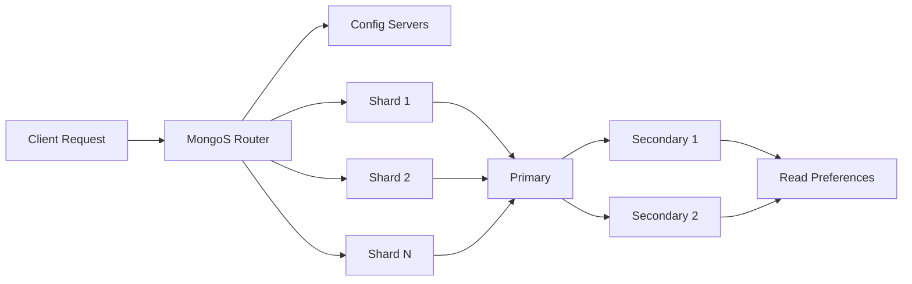

# Chapter 15: MongoDB

> **Prev:** [Chapter 14: NoSQL](14-nosql.md) | **Next:** [Chapter 16: Redis](16-redis.md)

## Learning Objectives

- Understand MongoDB's document data model and BSON format
- Perform CRUD operations using MongoDB Query Language
- Design and use indexes for query optimization
- Build aggregation pipelines for data analysis
- Explain replication and sharding for high availability and scaling
- Apply best practices for schema design
- Compare MongoDB with RDBMS for architectural decisions

<!-- Image Gallery -->
<div style="display:flex;flex-wrap:wrap;gap:4px;margin:16px 0;padding:12px;background:#f8fafc;border-radius:8px;border:1px solid #e2e8f0;">
<a href="../../../assets/images/lessons/database-management-systems/15-mongodb/hero.svg" target="_blank" rel="noopener">
  
</a>
<a href="../../../assets/images/lessons/database-management-systems/15-mongodb/handwritten-notes.svg" target="_blank" rel="noopener">
  
</a>
<a href="../../../assets/images/lessons/database-management-systems/15-mongodb/sticky-notes.svg" target="_blank" rel="noopener">
  
</a>
<a href="../../../assets/images/lessons/database-management-systems/15-mongodb/visual-explanation.svg" target="_blank" rel="noopener">
  
</a>
<a href="../../../assets/images/lessons/database-management-systems/15-mongodb/architecture.svg" target="_blank" rel="noopener">
  
</a>
<a href="../../../assets/images/lessons/database-management-systems/15-mongodb/workflow.svg" target="_blank" rel="noopener">
  
</a>
<a href="../../../assets/images/lessons/database-management-systems/15-mongodb/mindmap.svg" target="_blank" rel="noopener">
  
</a>
<a href="../../../assets/images/lessons/database-management-systems/15-mongodb/comparison.svg" target="_blank" rel="noopener">
  
</a>
<a href="../../../assets/images/lessons/database-management-systems/15-mongodb/cheatsheet.svg" target="_blank" rel="noopener">
  
</a>
<a href="../../../assets/images/lessons/database-management-systems/15-mongodb/interview-quiz.svg" target="_blank" rel="noopener">
  
</a>
<a href="../../../assets/images/lessons/database-management-systems/15-mongodb/social-card.svg" target="_blank" rel="noopener">
  
</a>
</div>
<!-- End Image Gallery -->


## Chapter at a Glance

| Topic | Key Insight | Practical Takeaway |
|-------|-------------|-------------------|
| **Document Model** | JSON-like documents with embedded arrays and nested objects | Design for read patterns → embed what's accessed together |
| **MongoDB Query Language** | Rich query operators ($match, $group, $sort, $lookup) | Use aggregation pipeline for multi-stage transformations |
| **Indexing in MongoDB** | B-tree indexes: single, compound, text, geospatial, TTL | Index fields used in query filters, sort, and join conditions |
| **Replication** | Primary-secondary with automatic failover via election | Deploy with at least 3 voting replica nodes for HA |
| **Sharding** | Horizontal partition across shard keys with mongos routing | Choose shard key with high cardinality to avoid hotspots |
| **Aggregation Pipeline** | Stage-based data processing ($match → $group → $sort → $project) | Push $match early to reduce data flowing through pipeline |
| **Atomicity** | Document-level atomic operations in MongoDB | Use embedded documents for transactional consistency |

## Chapter Roadmap



## Theory


---

### 15.1 MongoDB Overview

<a href="../../../assets/images/diagrams/database-management-systems/15-mongodb/15-1-mongodb-overview-handwritten.svg" target="_blank" rel="noopener">
  
</a>
<a href="../../../assets/images/diagrams/database-management-systems/15-mongodb/15-1-mongodb-overview-diagram.svg" target="_blank" rel="noopener">
  
</a>
<a href="../../../assets/images/diagrams/database-management-systems/15-mongodb/15-1-mongodb-overview-sticky.svg" target="_blank" rel="noopener">
  
</a>


#### 15.1.1 What is MongoDB?

MongoDB is a **document-oriented NoSQL database** released in 2009 by MongoDB Inc. (originally 10gen). It stores data as **BSON (Binary JSON)** documents in **collections** within **databases**. Unlike relational databases that require predefined schemas with tables, rows, and columns, MongoDB uses a **schema-flexible** document model where each document can have a different structure.

**Core Terminology Mapping:**

| MongoDB Term | SQL Equivalent | Description |
|-------------|----------------|-------------|
| Database | Database | Logical container for collections |
| Collection | Table | Group of related documents |
| Document | Row / Record | Individual unit of data (BSON) |
| Field | Column | Key-value pair within a document |
| _id | Primary Key | Unique immutable identifier |
| Index | Index | Data structure for fast lookups |
| Aggregation Pipeline | GROUP BY / JOIN | Multi-stage data processing |
| Replica Set | → | High-availability group of mongod instances |
| Shard | Partition | Horizontal data split across servers |

**Real-World Analogy: Filing Cabinet System**

Think of MongoDB as a modern **filing cabinet system** where each drawer (database) contains folders (collections), and each folder contains individual forms (documents).

- **Filing Cabinet** → MongoDB Server
- **Drawer** → Database (e.g., `ecommerce`, `analytics`)
- **Tabbed Folder** → Collection (e.g., `users`, `orders`, `products`)
- **Form/Sheet** → Document (a single JSON-like record)
- **Form Fields** → Document Fields (name, age, email)
- **Color-coded Tabs** → Indexes (fast lookup by field)
- **Photo-copier** → Replication (copies of the same data)
- **File Room Expansion** → Sharding (adding more cabinets)

Each form (document) can have a different set of fields. One user form might have `name`, `email`, `phone` while another might have `name`, `email`, `twitter_handle`, `address`. In a relational database, you'd need nullable columns or separate tables. In MongoDB, you just include the fields that apply.

#### 15.1.2 Key Concepts → Detailed

**Database:**
```javascript
// Use/switch to a database (created lazily on first document insert)
use ecommerce

// Show all databases
show dbs

// Database names must be all lowercase, max 64 bytes
// Reserved: admin, local, config
```

**Collection:**
```javascript
// Collections are created implicitly on first insert
db.createCollection("users", {
    capped: true,      // fixed-size collection (circular buffer)
    size: 100000,      // max size in bytes
    max: 5000          // max document count
})

// Show collections
show collections
```

**Document:**
```javascript
// A document is a BSON object with key-value pairs
// Maximum document size: 16MB (BSON limit)
// Nested depth: max 100 levels
{
    _id: ObjectId("507f1f77bcf86cd799439011"),  // unique, immutable
    name: "Alice Chen",
    email: "alice@example.com",
    age: 28,
    address: {
        street: "123 Main St",
        city: "San Francisco",
        state: "CA",
        zip: "94102"
    },
    interests: ["reading", "hiking", "photography"],
    metadata: {                                // embedded sub-object
        created_at: ISODate("2024-01-15T10:30:00Z"),
        last_login: ISODate("2024-03-20T08:15:00Z"),
        login_count: 47
    }
}
```

#### 15.1.3 BSON Format in Depth

**BSON (Binary JSON)** is the binary-encoded serialization of JSON-like documents that MongoDB uses internally. BSON extends JSON with additional data types and is designed to be **traversable** (each element includes type and length information, unlike JSON which must be scanned character by character).

**BSON Type System:**

| BSON Type | Alias | Example | JSON Equivalent |
|-----------|-------|---------|-----------------|
| Double | 1 | `3.14159` | number |
| String | 2 | `"hello"` | string |
| Object | 3 | `{a: 1}` | object |
| Array | 4 | `[1, 2, 3]` | array |
| Binary | 5 | `BinData(0, "SGVsbG8=")` | → |
| ObjectId | 7 | `ObjectId("507f1f77bcf86cd799439011")` | → |
| Boolean | 8 | `true` | boolean |
| Date | 9 | `ISODate("2024-01-01")` | → |
| Null | 10 | `null` | null |
| Regular Expression | 11 | `/pattern/i` | → |
| JavaScript | 13 | `Code("function(x) { return x; }")` | → |
| 32-bit Integer | 16 | `NumberInt(42)` | number |
| Timestamp | 17 | `Timestamp(0, 1)` | → |
| 64-bit Integer | 18 | `NumberLong(4294967295)` | → |
| Decimal128 | 19 | `NumberDecimal("10.99")` | → |
| Min Key | -1 | `MinKey` | → |
| Max Key | 127 | `MaxKey` | → |

**BSON Binary Encoding Example:**

The JSON document `{"hello": "world"}` in BSON is encoded as:

```
\x16\x00\x00\x00           // total document size (22 bytes)
\x02                       // type: String (0x02)
hello\x00                  // field name (C-string: null-terminated)
\x06\x00\x00\x00           // string length (6 bytes)
world\x00                  // string value (C-string)
\x00                       // terminating null byte for document
```

Each field in BSON encodes:
1. **Type** (1 byte) → identifies the BSON data type
2. **Field name** (C-string, null-terminated)
3. **Value** → type-specific encoding with length prefix for variable-length types

This makes BSON **traversable** → you can skip unknown fields without parsing them, unlike JSON where you must parse the entire structure.

#### 15.1.4 BSON vs JSON Comparison

| Aspect | BSON | JSON |
|--------|------|------|
| **Encoding** | Binary | Text (UTF-8/UTF-16) |
| **Data types** | 20+ types incl. Date, ObjectId, Binary, Decimal128 | 6 types: string, number, object, array, boolean, null |
| **Size efficiency** | More compact for binary data, less compact for simple strings | Compact for text-only data |
| **Parsing speed** | Fast → type and length pre-encoded, traversable | Slower → must scan and parse character by character |
| **Schema flexibility** | Supports schema-less documents | Schema-less |
| **Numeric precision** | Int32, Int64, Double, Decimal128 | Single "number" type (IEEE-754 double precision) |
| **Date handling** | Native Date type (milliseconds since epoch) | Must store as string or number convention |
| **Binary data** | Native Binary type (Base64-encoded or raw) | Must Base64-encode into string |
| **Human readability** | Not human-readable | Fully human-readable |
| **Network overhead** | Lower for complex documents | Higher for documents with binary/numeric data |
| **Indexability** | Designed for efficient index creation on any field | Must be parsed to index |
| **ObjectId support** | Native 12-byte ObjectId type | Must use string representation |

**When does BSON matter in practice?**
- **Traversability**: BSON lets MongoDB skip unindexed fields without scanning them. This makes queries faster than a JSON-based database.
- **ObjectId**: BSON's native ObjectId (12 bytes) embeds a 4-byte timestamp + 5-byte random value + 3-byte counter, enabling distributed ID generation without a central coordinator.
- **Decimal128**: For financial applications needing exact precision, BSON's Decimal128 avoids IEEE-754 floating-point rounding errors.

#### 15.1.5 Numbered Steps: How MongoDB Stores and Retrieves Documents

**Step-by-step document insertion:**
```
STEP 1: Client connects to mongos or primary mongod
        → mongos:port (default 27017)
STEP 2: Client sends insert command { insert: "users", documents: [...] }
STEP 3: Server validates document size ≤ 16MB BSON limit
        → If exceeded, returns "BSON object too large" error
STEP 4: Server generates _id if missing (ObjectId generation)
        → ObjectId = 4-byte timestamp + 5-byte random + 3-byte counter
STEP 5: Server serializes document to BSON binary format
STEP 6: WiredTiger storage engine writes to journal (write-ahead log)
STEP 7: Document is written to data files in memory-mapped storage
STEP 8: If indexed fields exist, B-tree index entries are updated
        → Each index key points to the document's RecordId
STEP 9: Acknowledgment sent back to client (write concern satisfied)
STEP 10: If part of a replica set, oplog entry is created for replication
```

**Step-by-step document retrieval:**
```
STEP 1: Client sends find command { find: "users", filter: { email: "..." } }
STEP 2: Query planner analyzes the filter and available indexes
        → Checks viable indexes via IndexStats and query shape
STEP 3: If matching index exists, index scan is performed on B-tree
        → Navigates B-tree from root → internal nodes → leaf
STEP 4: Index leaf returns RecordId → data file offset
STEP 5: Document is fetched from storage engine using RecordId
STEP 6: If no matching index, collection scan (COLLSCAN) is performed
        → Scans every BSON document in collection sequentially
STEP 7: BSON document is deserialized into MongoDB's internal representation
STEP 8: Projection is applied (if specified)
        → Only requested fields are materialized
STEP 9: Document is serialized to BSON for network transport
STEP 10: Client receives response with result set
```

#### 15.1.6 Pseudocode: Document Storage Engine Operations

```
FUNCTION InsertDocument(collection, document):
    IF document.size > 16MB:
        RAISE "BSON object too large"
    
    IF document._id is NULL:
        document._id = GenerateObjectId()
    
    bson_bytes = SerializeToBSON(document)
    
    // WiredTiger storage engine
    txn = BeginTransaction()
    
    // Write to journal first (write-ahead logging)
    journal_entry = { type: "insert", collection: collection.name, 
                      _id: document._id, data: bson_bytes }
    WriteJournal(journal_entry)
    
    // Allocate storage space
    record_id = StorageEngine.AllocateRecord(collection.id, bson_bytes.length)
    StorageEngine.WriteData(record_id, bson_bytes)
    
    // Update indexes
    FOR EACH index IN collection.indexes:
        key_value = ExtractIndexKey(document, index.keyPattern)
        BTreeInsert(index.tree, key_value, record_id)
    
    // Oplog for replication (if replica set)
    IF isReplicaSet:
        CreateOplogEntry("i", collection.fullName, document._id, document)
    
    CommitTransaction(txn)
    RETURN document._id

FUNCTION FindDocument(collection, filter, projection):
    query_shape = AnalyzeQuery(filter)
    best_index = QueryPlanner.SelectIndex(collection.indexes, query_shape)
    
    IF best_index is not NULL:
        // Index scan
        index_keys = ExtractIndexKeysFromFilter(filter, best_index.keyPattern)
        record_ids = BTreeSearch(best_index.tree, index_keys)
    ELSE:
        // Collection scan
        record_ids = StorageEngine.ScanAllRecords(collection.id)
    
    results = []
    FOR EACH record_id IN record_ids:
        bson_bytes = StorageEngine.ReadData(record_id)
        document = DeserializeBSON(bson_bytes)
        
        IF projection not empty:
            document = ApplyProjection(document, projection)
        
        results.APPEND(document)
        IF results.size >= limit:
            BREAK
    
    RETURN results
```

#### 15.1.7 Complexity Analysis

| Operation | Time Complexity | Space Complexity | Why |
|-----------|----------------|-----------------|-----|
| **Document Insert (no index)** | O(1) | O(d) | Appending to storage is constant time; d = document size |
| **Document Insert (k indexes)** | O(k log n) | O(d + k * log n) | Each index requires B-tree insertion O(log n); k indexes → O(k log n) |
| **Find by _id (hashed index)** | O(1) expected | O(1) | _id has unique hashed index → direct lookup |
| **Find by indexed field (equality)** | O(log n) | O(1) | B-tree traversal from root to leaf: height = log_fanout(n) |
| **Find by indexed field (range)** | O(log n + m) | O(1) | O(log n) to find start + O(m) to scan m results |
| **Find by compound index** | O(log n + m) | O(1) | Same as single index → compound index is one B-tree |
| **Collection scan (no index)** | O(n) | O(1) | Scans all n documents sequentially |
| **Aggregation $match** | O(n) or O(log n) | O(1) | O(n) if no index; O(log n + m) if indexed filter |
| **Aggregation $group** | O(n) | O(g) | Scans all n docs; stores g groups in hash table |
| **Aggregation $sort** | O(n log n) | O(n) | In-memory or external sort of n documents |
| **Index creation** | O(n log n) | O(i) | Scans all n documents, inserts into B-tree; i = index size |

**Why B-tree in MongoDB?**
- MongoDB uses B-trees (not B+ trees like MySQL) because B-trees store values at every node, making single-document lookups faster when the key is found at a non-leaf level.
- The fanout factor (≈ 100-500 keys per node for 8KB pages) keeps tree height at 3-4 levels for billions of documents.

#### 15.1.8 Advantages & Disadvantages of MongoDB Document Model

| Advantages | Disadvantages |
|------------|---------------|
| **Schema flexibility**: Different documents can have different fields | **No built-in referential integrity**: No foreign key constraints |
| **Natural object mapping**: Documents map directly to application objects (JSON → object) | **Data duplication**: Embedding leads to data redundancy |
| **Reduced joins**: Related data can be embedded in one document | **16MB document limit**: Large blobs must be stored via GridFS |
| **Fast reads**: Single document read fetches all related data | **Complex updates**: Updating data in multiple embedded documents is expensive |
| **Horizontal scaling**: Built-in sharding for distributed data | **Write amplification**: Multi-index updates increase write cost |
| **Rich query language**: Aggregation pipeline, geospatial, text search | **No SQL**: Different query paradigm → learning curve for SQL developers |
| **High availability**: Replica sets with automatic failover | **Memory pressure**: Working set must fit in RAM for best performance |

#### 15.1.9 Edge Cases in MongoDB Document Model

| Edge Case | Problem | Solution |
|-----------|---------|----------|
| **Document exceeds 16MB** | Insert fails with "BSON object too large" | Use GridFS for files > 16MB; reference large data via URL |
| **Deeply nested documents ( > 100 levels)** | Query performance degrades; update notation becomes complex | Flatten schema; reference sub-objects |
| **Arrays growing unboundedly** | Document size increases; write performance degrades | Max ~100-200 embedded array items; move to separate collection |
| **Missing _id field** | MongoDB automatically generates ObjectId; can cause confusion | Always set _id explicitly if idempotency required |
| **Field names as data** | Using dynamic field names (e.g., `{ "2024-01": value }`) | Store as array values, not field names |
| **Over-embedding** | Reading full document just to access one field | Separate collection with reference; use projection |
| **Empty field names** | MongoDB disallows empty string field names | Validate field names before insert |
| **Duplicated _id** | E11000 duplicate key error on _id | Use upsert with unique identifier, or catch error |

---

### 15.2 Document Model and Schema Design

<a href="../../../assets/images/diagrams/database-management-systems/15-mongodb/15-2-document-model-and-schema-design-handwritten.svg" target="_blank" rel="noopener">
  
</a>
<a href="../../../assets/images/diagrams/database-management-systems/15-mongodb/15-2-document-model-and-schema-design-diagram.svg" target="_blank" rel="noopener">
  
</a>
<a href="../../../assets/images/diagrams/database-management-systems/15-mongodb/15-2-document-model-and-schema-design-sticky.svg" target="_blank" rel="noopener">
  
</a>


#### 15.2.1 Embedding vs Referencing → Decision Framework

**Real-World Analogy:**

- **Embedding**: Like a printed catalog page that shows the product photo, description, and price all on the same page. You see everything in one glance.
- **Referencing**: Like a library catalog card that says "see Volume 3, Page 142." You need an extra trip to get the full content.

**When to Embed (One-to-Few):**
```javascript
// GOOD: Addresses are few, accessed with user, rarely change independently
{
    _id: ObjectId("..."),
    name: "Alice",
    addresses: [
        { label: "home", street: "123 Main St", city: "SF" },
        { label: "work", street: "456 Market St", city: "SF" }
    ]
}
```

**When to Reference (One-to-Many / Many-to-Many):**
```javascript
// GOOD: Orders are many, grow unbounded, accessed independently
db.users.insertOne({ _id: ObjectId("user1"), name: "Alice" })

db.orders.insertMany([
    { user_id: ObjectId("user1"), total: 99.99, items: 3 },
    { user_id: ObjectId("user1"), total: 149.99, items: 5 }
])
// Query: db.orders.find({ user_id: ObjectId("user1") }).sort({ created_at: -1 })
```

#### 15.2.2 MongoDB Sample Documents with Sample Data

**Users Collection (Sample Data):**
```javascript
db.users.insertMany([
    {
        _id: ObjectId("64a1b2c3d4e5f60001000001"),
        name: "Alice Chen",
        email: "alice@example.com",
        age: 28,
        address: { street: "123 Main St", city: "San Francisco", state: "CA" },
        interests: ["reading", "hiking", "photography"],
        metadata: { created_at: ISODate("2024-01-15T10:30:00Z"), login_count: 47 }
    },
    {
        _id: ObjectId("64a1b2c3d4e5f60001000002"),
        name: "Bob Smith",
        email: "bob@example.com",
        age: 35,
        address: { street: "456 Oak Ave", city: "New York", state: "NY" },
        interests: ["gaming", "cooking"],
        metadata: { created_at: ISODate("2024-02-01T08:00:00Z"), login_count: 12 }
    },
    {
        _id: ObjectId("64a1b2c3d4e5f60001000003"),
        name: "Carol Davis",
        email: "carol@example.com",
        age: 42,
        address: { street: "789 Pine Rd", city: "Austin", state: "TX" },
        interests: ["yoga", "reading", "travel"],
        metadata: { created_at: ISODate("2024-01-20T14:00:00Z"), login_count: 89 }
    },
    {
        _id: ObjectId("64a1b2c3d4e5f60001000004"),
        name: "Dave Wilson",
        email: "dave@example.com",
        age: 29,
        address: { street: "321 Elm St", city: "San Francisco", state: "CA" },
        interests: ["photography", "cycling"],
        metadata: { created_at: ISODate("2024-03-01T09:00:00Z"), login_count: 5 }
    },
    {
        _id: ObjectId("64a1b2c3d4e5f60001000005"),
        name: "Eve Johnson",
        email: "eve@example.com",
        age: 31,
        address: { street: "654 Birch Ln", city: "Seattle", state: "WA" },
        interests: ["hiking", "photography", "cooking"],
        metadata: { created_at: ISODate("2024-01-10T11:00:00Z"), login_count: 34 }
    }
])
```

**Query Output:**
```javascript
// db.users.find({ "address.city": "San Francisco" }, { name: 1, age: 1 })
// Output:
[
    { _id: ObjectId("64a1b2c3d4e5f60001000001"), name: "Alice Chen", age: 28 },
    { _id: ObjectId("64a1b2c3d4e5f60001000004"), name: "Dave Wilson", age: 29 }
]
```

#### 15.2.3 C++ Implementation (MongoDB C++ Driver)

```cpp
#include <bsoncxx/builder/stream/document.hpp>
#include <bsoncxx/json.hpp>
#include <mongocxx/client.hpp>
#include <mongocxx/instance.hpp>
#include <mongocxx/uri.hpp>
#include <iostream>

using bsoncxx::builder::stream::document;
using bsoncxx::builder::stream::open_document;
using bsoncxx::builder::stream::close_document;
using bsoncxx::builder::stream::open_array;
using bsoncxx::builder::stream::close_array;
using bsoncxx::builder::stream::finalize;

class MongoDBManager {
private:
    mongocxx::instance instance{};
    mongocxx::client client{mongocxx::uri{"mongodb://localhost:27017"}};
    mongocxx::database db;

public:
    MongoDBManager(const std::string& dbName) : db(client[dbName]) {}

    // Insert a document
    bsoncxx::document::value insertUser(const std::string& name,
                                        const std::string& email,
                                        int age) {
        auto doc = document{};
        doc << "name" << name
            << "email" << email
            << "age" << age
            << "created_at" << bsoncxx::types::b_date{
                   std::chrono::system_clock::now()};

        auto collection = db["users"];
        auto result = collection.insert_one(doc.view());

        std::cout << "Inserted _id: "
                  << result->inserted_id().get_oid().value.to_string()
                  << std::endl;
        return doc << finalize;
    }

    // Find documents with filter
    void findUsersByAge(int minAge, int maxAge) {
        auto collection = db["users"];
        auto filter = document{} << "age"
                                 << open_document
                                     << "$gte" << minAge
                                     << "$lte" << maxAge
                                 << close_document
                              << finalize;

        auto cursor = collection.find(filter.view());
        for (auto&& doc : cursor) {
            std::cout << bsoncxx::to_json(doc) << std::endl;
        }
    }

    // Update with $set
    void updateUserEmail(const std::string& oldEmail,
                         const std::string& newEmail) {
        auto collection = db["users"];
        auto filter = document{} << "email" << oldEmail << finalize;
        auto update = document{} << "$set"
                                 << open_document
                                     << "email" << newEmail
                                 << close_document
                              << finalize;

        auto result = collection.update_one(filter.view(), update.view());
        std::cout << "Matched: " << result->matched_count()
                  << ", Modified: " << result->modified_count() << std::endl;
    }

    // Delete documents
    void deleteUsersUnderAge(int age) {
        auto collection = db["users"];
        auto filter = document{} << "age" << open_document
                                 << "$lt" << age
                                 << close_document
                              << finalize;

        auto result = collection.delete_many(filter.view());
        std::cout << "Deleted: " << result->deleted_count() << std::endl;
    }

    // Aggregation pipeline
    void aggregateUsersByCity() {
        auto collection = db["users"];
        mongocxx::pipeline p{};

        // $match: only active users with age >= 18
        p.match(document{} << "age" << open_document
                           << "$gte" << 18
                           << close_document
                        << finalize);

        // $group: count by city
        p.group(document{} << "_id" << "$address.city"
                           << "count" << open_document
                               << "$sum" << 1
                           << close_document
                        << finalize);

        // $sort: descending by count
        p.sort(document{} << "count" << -1 << finalize);

        auto cursor = collection.aggregate(p);
        for (auto&& doc : cursor) {
            std::cout << bsoncxx::to_json(doc) << std::endl;
        }
    }
};

int main() {
    MongoDBManager mgr("ecommerce");

    mgr.insertUser("Alice Chen", "alice@example.com", 28);
    mgr.insertUser("Bob Smith", "bob@example.com", 35);

    mgr.findUsersByAge(25, 40);
    mgr.updateUserEmail("bob@example.com", "bob.new@example.com");
    mgr.aggregateUsersByCity();

    return 0;
}
```

#### 15.2.4 Python (PyMongo) Implementation

```python
"""
MongoDB CRUD Operations with PyMongo
Install: pip install pymongo
"""
import pymongo
from pymongo import MongoClient
from pymongo.errors import DuplicateKeyError, BulkWriteError
from datetime import datetime, timezone
from typing import Optional


class MongoDBManager:
    """Production-grade MongoDB wrapper with full CRUD and aggregation."""

    def __init__(self, uri: str = "mongodb://localhost:27017",
                 db_name: str = "ecommerce"):
        self.client = MongoClient(uri)
        self.db = self.client[db_name]

    def insert_user(self, name: str, email: str, age: int,
                    address: Optional[dict] = None,
                    interests: Optional[list] = None) -> str:
        """Insert a single user document. Returns the inserted _id."""
        doc = {
            "name": name,
            "email": email,
            "age": age,
            "address": address or {},
            "interests": interests or [],
            "metadata": {
                "created_at": datetime.now(timezone.utc),
                "login_count": 0
            }
        }
        try:
            result = self.db.users.insert_one(doc)
            print(f"Inserted _id: {result.inserted_id}")
            return str(result.inserted_id)
        except DuplicateKeyError as e:
            print(f"Duplicate key error: {e}")
            raise

    def find_users(self, filter_query: Optional[dict] = None,
                   projection: Optional[dict] = None,
                   limit: int = 0) -> list:
        """Find users with optional filter, projection, and limit."""
        filter_query = filter_query or {}
        cursor = self.db.users.find(filter_query, projection).limit(limit)
        return list(cursor)

    def find_users_by_age_range(self, min_age: int, max_age: int) -> list:
        """Find users within an age range."""
        return self.find_users(
            filter_query={"age": {"$gte": min_age, "$lte": max_age}},
            projection={"name": 1, "email": 1, "age": 1, "_id": 0}
        )

    def update_user_email(self, old_email: str, new_email: str) -> int:
        """Update a user's email. Returns count of modified documents."""
        result = self.db.users.update_one(
            {"email": old_email},
            {"$set": {"email": new_email}}
        )
        print(f"Matched: {result.matched_count}, Modified: {result.modified_count}")
        return result.modified_count

    def increment_login(self, user_email: str) -> None:
        """Atomically increment login counter."""
        self.db.users.update_one(
            {"email": user_email},
            {"$inc": {"metadata.login_count": 1}}
        )

    def add_interest(self, user_email: str, interest: str) -> None:
        """Add interest to array (no duplicates)."""
        self.db.users.update_one(
            {"email": user_email},
            {"$addToSet": {"interests": interest}}
        )

    def remove_interest(self, user_email: str, interest: str) -> None:
        """Remove interest from array."""
        self.db.users.update_one(
            {"email": user_email},
            {"$pull": {"interests": interest}}
        )

    def delete_users_under_age(self, age: int) -> int:
        """Delete all users under a given age."""
        result = self.db.users.delete_many({"age": {"$lt": age}})
        print(f"Deleted: {result.deleted_count}")
        return result.deleted_count

    def aggregate_users_by_city(self) -> list:
        """Aggregate: count users per city, sorted descending."""
        pipeline = [
            {"$match": {"age": {"$gte": 18}}},
            {"$group": {
                "_id": "$address.city",
                "count": {"$sum": 1},
                "avg_age": {"$avg": "$age"}
            }},
            {"$sort": {"count": -1}},
            {"$project": {
                "city": "$_id",
                "count": 1,
                "avg_age": {"$round": ["$avg_age", 1]},
                "_id": 0
            }}
        ]
        return list(self.db.users.aggregate(pipeline))

    def create_indexes(self) -> None:
        """Create recommended indexes."""
        self.db.users.create_index([("email", pymongo.ASCENDING)],
                                   unique=True)
        self.db.users.create_index([("age", pymongo.ASCENDING)])
        self.db.users.create_index([("interests", pymongo.ASCENDING)])
        self.db.users.create_index([
            ("address.city", pymongo.ASCENDING),
            ("age", pymongo.DESCENDING)
        ])
        print("Indexes created.")

    def close(self):
        self.client.close()


# Usage example
if __name__ == "__main__":
    mgr = MongoDBManager()

    # Insert users
    mgr.insert_user("Alice Chen", "alice@example.com", 28,
                    {"street": "123 Main St", "city": "San Francisco", "state": "CA"},
                    ["reading", "hiking", "photography"])
    mgr.insert_user("Bob Smith", "bob@example.com", 35,
                    {"street": "456 Oak Ave", "city": "New York", "state": "NY"},
                    ["gaming", "cooking"])

    # Find users by age
    users = mgr.find_users_by_age_range(25, 40)
    print("Users aged 25-40:", users)

    # Update email
    mgr.update_user_email("bob@example.com", "bob.new@example.com")

    # Atomic increment
    mgr.increment_login("alice@example.com")

    # Aggregation
    city_stats = mgr.aggregate_users_by_city()
    print("Users per city:", city_stats)

    # Create indexes
    mgr.create_indexes()
    mgr.close()
```

#### 15.2.5 Dry Run Trace: Insert with Index Updates

**Scenario:** Insert user "Alice Chen" into an empty `users` collection with a unique index on `email`.

```
INPUT: db.users.insertOne({ name: "Alice", email: "alice@example.com", age: 28 })

TRACE:
+--------+------------------------------------------+------------------+
| Step   | Operation                                | State            |
+--------+------------------------------------------+------------------+
| 1      | Receive insert command                   | Pending          |
| 2      | Validate document (size ≤ 16MB)          | 112 bytes → OK   |
| 3      | Generate _id if missing                  | ObjectId(64a1..) |
| 4      | Serialize to BSON                        | Binary blob      |
| 5      | WiredTiger: begin transaction            | Txn#1 started    |
| 6      | Write journal entry (write-ahead log)    | Journal synced   |
| 7      | Allocate storage RecordId                | RID=1001         |
| 8      | Write BSON data at RecordId=1001         | Data written     |
| 9      | Update _id index (primary key, unique)   | B-tree insert    |
| 10     | Update email index (unique)              | B-tree insert    |
| 11     | Update age index (non-unique)            | B-tree insert    |
| 12     | WiredTiger: commit transaction           | Txn#1 committed  |
| 13     | Create oplog entry                       | "i" type logged  |
| 14     | Return { acknowledged: true, insertedId: | Response sent    |
|        |   ObjectId("64a1..") }                   |                  |
+--------+------------------------------------------+------------------+
```

**If the email index detects a duplicate:**
```
+--------+------------------------------------------+------------------+
| 9a     | Email index insert → key exists          | E11000 error     |
| 10a    | WiredTiger: abort transaction            | Txn#1 rolled back|
| 11a    | Return { acknowledged: false, error:     | Error response   |
|        |   "E11000 duplicate key" }               |                  |
+--------+------------------------------------------+------------------+
```
---

### 15.3 CRUD Operations → Complete Reference

<a href="../../../assets/images/diagrams/database-management-systems/15-mongodb/15-3-crud-operations-complete-reference-handwritten.svg" target="_blank" rel="noopener">
  
</a>
<a href="../../../assets/images/diagrams/database-management-systems/15-mongodb/15-3-crud-operations-complete-reference-diagram.svg" target="_blank" rel="noopener">
  
</a>
<a href="../../../assets/images/diagrams/database-management-systems/15-mongodb/15-3-crud-operations-complete-reference-sticky.svg" target="_blank" rel="noopener">
  
</a>


#### 15.3.1 CRUD Operations Summary Table

| Operation | MQL Method | SQL Equivalent | Description | Atomic? | Complexity |
|-----------|-----------|----------------|-------------|---------|------------|
| **Create Single** | `insertOne()` | INSERT INTO ... VALUES | Insert one document | Document-level | O(1) + O(k log n) for k indexes |
| **Create Many** | `insertMany()` | INSERT INTO ... VALUES (...), (...) | Insert multiple documents | Ordered: full atomic; Unordered: per-doc | O(m) + O(mk log n) |
| **Read** | `find()` | SELECT ... FROM | Query documents with filter | Read-only | O(log n) indexed, O(n) scan |
| **Read One** | `findOne()` | SELECT ... LIMIT 1 | Return first matching document | Read-only | O(log n) indexed |
| **Count** | `countDocuments()` | SELECT COUNT(*) | Count matching documents | Read-only | O(log n) with index |
| **Update Single** | `updateOne()` | UPDATE ... WHERE ... LIMIT 1 | Update first matching document | Document-level | O(log n) find + O(k log n) reindex |
| **Update Many** | `updateMany()` | UPDATE ... WHERE | Update all matching documents | Batch (not multi-doc atomic) | O(m log n) |
| **Replace** | `replaceOne()` | UPDATE ... SET all columns | Replace entire document | Document-level | O(log n) |
| **Delete Single** | `deleteOne()` | DELETE ... LIMIT 1 | Delete first matching document | Document-level | O(log n) find + O(k log n) index cleanup |
| **Delete Many** | `deleteMany()` | DELETE FROM ... WHERE | Delete all matching documents | Batch (not multi-doc atomic) | O(m log n) |
| **Bulk Write** | `bulkWrite()` | Batch INSERT/UPDATE/DELETE | Execute mixed operations in batch | Configurable ordered/unordered | Varies |

#### 15.3.2 Create (Insert) → Detailed with Variations

**Real-World Analogy:** Adding a new patient form to the filing cabinet. You fill out the form (document) and place it in the patient folder (collection).

```javascript
// === INSERT ONE ===
// Insert a single document into the users collection
// If the collection doesn't exist, MongoDB creates it implicitly
db.users.insertOne({
    name: "Alice Chen",
    email: "alice@example.com",
    age: 28
})
// Output: { acknowledged: true, insertedId: ObjectId("64a1b2c3d4e5f60001000001") }

// === INSERT MANY ===
// Insert multiple documents in one command (more efficient than individual inserts)
db.users.insertMany([
    { name: "Bob Smith", email: "bob@example.com", age: 35 },
    { name: "Carol Davis", email: "carol@example.com", age: 42 },
    { name: "Dave Wilson", email: "dave@example.com", age: 29 }
])
// Output: { acknowledged: true, insertedIds: { "0": ObjectId("..."), "1": ObjectId("..."), "2": ObjectId("...") } }

// === INSERT WITH EXPLICIT _id ===
// You can specify your own _id (must be unique in the collection)
db.users.insertOne({
    _id: "user_alice_001",
    name: "Alice Chen",
    email: "alice@example.com"
})
// If _id "user_alice_001" already exists → E11000 duplicate key error

// === INSERT WITH ORDERED FALSE ===
// Continue inserting even if some documents fail
db.users.insertMany([
    { _id: 1, name: "Alice" },
    { _id: 1, name: "Bob" },    // This will fail (duplicate _id)
    { _id: 2, name: "Carol" }
], { ordered: false })
// Output: Inserted 2 documents; error for duplicate _id. Carol is still inserted.

// === INSERT WITH WRITE CONCERN ===
// Wait for acknowledgment from majority of replica set members
db.users.insertOne(
    { name: "Critical", email: "critical@example.com" },
    { writeConcern: { w: "majority", j: true, wtimeout: 5000 } }
)
```

#### 15.3.3 Sample Data for CRUD Operations

Let's establish sample data used throughout the CRUD examples:

```javascript
// Insert sample orders collection
db.orders.insertMany([
    {
        _id: ObjectId("64b1c2d3e4f5a60001000001"),
        customer_id: ObjectId("64a1b2c3d4e5f60001000001"),
        items: [
            { product_id: ObjectId("64c1d2e3f4a5b60001000001"), name: "Laptop", qty: 1, price: 1499.99 },
            { product_id: ObjectId("64c1d2e3f4a5b60001000002"), name: "Mouse", qty: 2, price: 24.99 }
        ],
        total: 1549.97,
        status: "delivered",
        shipping_address: { street: "123 Main St", city: "San Francisco", zip: "94102" },
        created_at: ISODate("2024-03-15T10:30:00Z"),
        delivered_at: ISODate("2024-03-18T14:00:00Z")
    },
    {
        _id: ObjectId("64b1c2d3e4f5a60001000002"),
        customer_id: ObjectId("64a1b2c3d4e5f60001000002"),
        items: [
            { product_id: ObjectId("64c1d2e3f4a5b60001000003"), name: "Desk Chair", qty: 1, price: 399.99 }
        ],
        total: 399.99,
        status: "shipped",
        shipping_address: { street: "456 Oak Ave", city: "New York", zip: "10001" },
        created_at: ISODate("2024-03-20T09:00:00Z"),
        delivered_at: null
    },
    {
        _id: ObjectId("64b1c2d3e4f5a60001000003"),
        customer_id: ObjectId("64a1b2c3d4e5f60001000001"),
        items: [
            { product_id: ObjectId("64c1d2e3f4a5b60001000004"), name: "Monitor", qty: 1, price: 499.99 }
        ],
        total: 499.99,
        status: "pending",
        shipping_address: { street: "123 Main St", city: "San Francisco", zip: "94102" },
        created_at: ISODate("2024-03-25T16:45:00Z"),
        delivered_at: null
    }
])
```

#### 15.3.4 Read (Query) → Query Operators Reference

```javascript
// === BASIC FILTERS ===

// Equality
db.orders.find({ status: "shipped" })
// Output: Returns order #2 (Bob's desk chair)

// Comparison operators
db.orders.find({ total: { $gte: 500, $lt: 2000 } })
// Output: Returns orders #1 ($1549.97) and #3 ($499.99 → no, $499.99 < 500)
// Wait: $gte: 500 → $1499.99 and $1549.97 but $499.99 not included
// Only order #1 ($1549.97)

// $in and $nin
db.orders.find({ status: { $in: ["shipped", "delivered"] } })
// Output: Returns orders #1 (delivered) and #2 (shipped)

// $exists → check if field exists
db.orders.find({ delivered_at: { $exists: true } })
// Output: Returns orders #1 (has delivered_at) and #2 (delivered_at is null but field exists)
// Note: $exists checks for field presence, not null

// $type → match by BSON type
db.orders.find({ delivered_at: { $type: "date" } })
// Output: Returns order #1 only (delivered_at is Date; order #2 has null type)

// === ARRAY QUERIES ===

// Match exact array
db.orders.find({ "items.name": ["Laptop", "Mouse"] })
// Note: This matches arrays with exactly these elements in this order

// Array contains element
db.orders.find({ "items.name": "Laptop" })
// Output: Returns order #1

// Array with $elemMatch (multiple conditions on same array element)
db.orders.find({
    items: { $elemMatch: { name: "Laptop", qty: 1 } }
})
// Output: Returns order #1 (exactly one item element matches both conditions)

// Array length
db.orders.find({ "items": { $size: 2 } })
// Output: Returns order #1 (has 2 items)

// === NESTED FIELD QUERIES ===

// Dot notation for nested fields
db.orders.find({ "shipping_address.city": "San Francisco" })
// Output: Returns orders #1 and #3

// === ELEMENT OPERATORS ===

// $expr → use aggregation expressions in queries (4.2+)
db.orders.find({ $expr: { $gt: ["$total", 500] } })
// Output: Returns orders #1 and #2

// $regex → pattern matching
db.users.find({ name: { $regex: /^A/, $options: "i" } })
// Output: Returns Alice Chen

// === SORT, LIMIT, SKIP ===

// Sorting: 1 = ascending, -1 = descending
db.orders.find({ customer_id: ObjectId("64a1b2c3d4e5f60001000001") })
    .sort({ created_at: -1 })   // newest first
    .limit(5)
    .skip(0)                     // pagination: skip 0, limit 5 = page 1

// === PROJECTION ===
// 1 = include, 0 = exclude (mix of 1s excludes _id by default)
db.orders.find(
    { customer_id: ObjectId("64a1b2c3d4e5f60001000001") },
    { total: 1, status: 1, "items.name": 1, _id: 0 }
)
// Output:
// { total: 1549.97, status: "delivered", items: [{ name: "Laptop" }, { name: "Mouse" }] }
// { total: 499.99, status: "pending", items: [{ name: "Monitor" }] }
```

#### 15.3.5 Update → Update Operators Reference

```javascript
// === $set: Set/overwrite field values ===
db.orders.updateOne(
    { _id: ObjectId("64b1c2d3e4f5a60001000003") },
    { $set: { status: "shipped", shipped_at: new Date() } }
)

// === $unset: Remove a field ===
db.users.updateOne(
    { email: "temp@example.com" },
    { $unset: { temporary_data: "" } }  // Field value doesn't matter
)

// === $inc: Increment/decrement numeric field ===
db.users.updateOne(
    { email: "alice@example.com" },
    { $inc: { "metadata.login_count": 1, points: 10 } }
)

// === $mul: Multiply numeric field ===
db.products.updateOne(
    { sku: "LAP-001" },
    { $mul: { price: 0.9 } }  // 10% discount
)

// === $min / $max: Conditional update (only if new value is lower/higher) ===
db.orders.updateOne(
    { _id: ObjectId("64b1c2d3e4f5a60001000001") },
    { $min: { total: 1500 } }  // Only decrease if 1500 < current
)

// === $rename: Rename a field ===
db.users.updateOne(
    { email: "alice@example.com" },
    { $rename: { "metadata.login_count": "metadata.logins" } }
)

// === ARRAY UPDATE OPERATORS ===

// $push: Add element to array
db.users.updateOne(
    { email: "alice@example.com" },
    { $push: { interests: "cycling" } }
)

// $push with modifiers
db.users.updateOne(
    { email: "alice@example.com" },
    { $push: { interests: { $each: ["swimming", "running"], $position: 0, $sort: 1 } } }
)
// Adds both at position 0, then sorts alphabetically

// $addToSet: Add element only if not already present (no duplicates)
db.users.updateOne(
    { email: "alice@example.com" },
    { $addToSet: { interests: "hiking" } }  // Already exists → no-op
)

// $pull: Remove all occurrences matching condition
db.users.updateOne(
    { email: "alice@example.com" },
    { $pull: { interests: "photography" } }
)

// $pullAll: Remove all specified values
db.users.updateOne(
    { email: "alice@example.com" },
    { $pullAll: { interests: ["reading", "cycling"] } }
)

// $pop: Remove first (-1) or last (1) element
db.users.updateOne(
    { email: "alice@example.com" },
    { $pop: { interests: 1 } }  // Remove last interest
)

// $: Positional operator (update matching array element)
db.orders.updateOne(
    { _id: ObjectId("64b1c2d3e4f5a60001000001"), "items.name": "Laptop" },
    { $set: { "items.$.price": 1399.99 } }  // Update price of Laptop specifically
)

// $[]: All positional operator (update all array elements)
db.orders.updateOne(
    { _id: ObjectId("64b1c2d3e4f5a60001000001") },
    { $mul: { "items.$[].price": 1.1 } }  // 10% price increase on ALL items
)

// $[identifier]: Filtered positional operator
db.orders.updateOne(
    { _id: ObjectId("64b1c2d3e4f5a60001000001") },
    { $set: { "items.$[elem].price": 0 } },
    { arrayFilters: [{ "elem.name": "Mouse" }] }  // Only Mouse items get price=0
)
```

#### 15.3.6 Delete → Variations

```javascript
// === deleteOne: Remove a single document ===
db.orders.deleteOne({ _id: ObjectId("64b1c2d3e4f5a60001000003") })

// === deleteMany: Remove all matching documents ===
db.orders.deleteMany({ status: "cancelled" })

// === deleteMany with empty filter: Remove all documents (keep collection) ===
db.orders.deleteMany({})
// Collection is now empty but indexes, schema remain

// === drop(): Remove collection entirely ===
db.orders.drop()
// Removes collection, its indexes, and all documents

// === findOneAndDelete: Atomically find and delete ===
// Returns the deleted document
db.orders.findOneAndDelete(
    { status: "pending" },
    { sort: { created_at: 1 }, projection: { _id: 1, total: 1 } }
)
```

#### 15.3.7 Numbered Steps: CRUD Operation Execution

**Insert execution:**
```
STEP 1: Client sends insert command with document(s)
STEP 2: Server validates document BSON size (max 16MB per doc, max 48MB per batch)
STEP 3: Server generates ObjectId for documents missing _id
STEP 4: For each document, WiredTiger begins internal transaction
STEP 5: Document serialized to BSON, written to data files
STEP 6: All indexes updated → each index is a B-tree insert O(log n)
STEP 7: Oplog entry written (replica set only)
STEP 8: Write concern satisfied (default: acknowledged by primary)
STEP 9: Transaction committed
STEP 10: Acknowledgment returned to client
```

**Query execution with index:**
```
STEP 1: Query arrives at mongod
STEP 2: Query planner parses filter, sort, projection
STEP 3: Planner evaluates all viable indexes using:
        - IndexStats (cardinality, distribution)
        - Query shape (equality vs range vs sort)
STEP 4: Winning plan selected (lowest estimated cost)
STEP 5: B-tree index traversed: root → internal → leaf node
        ≈ 3-4 I/O operations for billions of documents
STEP 6: RecordIds extracted from index leaf entries
STEP 7: Documents fetched from storage engine
STEP 8: Projection applied, results serialized to BSON
STEP 9: Results returned to client (cursor established)
```

#### 15.3.8 Pseudocode: CRUD Operations

```
FUNCTION InsertDocument(collection, document):
    ValidateDocSize(document)  // Throws if > 16MB
    IF no _id: document._id = GenerateObjectId()
    
    txn = WT.BeginTransaction()
    WT.WriteJournal({ op: "insert", doc: document })
    record_id = WT.AllocateRecord(collection)
    WT.WriteData(record_id, BSON(document))
    
    FOR index IN collection.indexes:
        key = ExtractKey(document, index.fields)
        BTree.Insert(index.tree, key, record_id)
    
    IF ReplicaSet: WriteOplog("i", document)
    WT.Commit(txn)
    RETURN document._id

FUNCTION FindDocuments(collection, filter, projection, sort, limit):
    plan = QueryPlanner.Optimize(collection, filter, sort)
    
    IF plan.type == "IXSCAN":
        cursor = IndexScan(plan.index, plan.keys, plan.direction)
    ELSE:
        cursor = CollectionScan(collection)
    
    results = []
    WHILE cursor.HasNext() AND len(results) < limit:
        record_id = cursor.Next()
        doc = WT.ReadData(record_id)
        
        IF MatchesFilter(doc, filter):
            IF projection: doc = ApplyProjection(doc, projection)
            results.APPEND(doc)
    
    IF sort: results = SortResults(results, sort)
    RETURN results

FUNCTION UpdateDocument(collection, filter, update, options):
    doc = FindOne(collection, filter)
    IF doc IS NULL:
        IF options.upsert:
            RETURN InsertDocument(collection, Merge(doc, update.$set))
        RETURN { matched: 0, modified: 0 }
    
    txn = WT.BeginTransaction()
    old_record_id = doc._recordId
    
    // Apply update operators
    FOR op IN update:
        SWITCH op:
            CASE "$set": doc = SetFields(doc, update.$set)
            CASE "$inc": doc = IncrementFields(doc, update.$inc)
            CASE "$push": doc = PushToArray(doc, update.$push)
            CASE "$pull": doc = PullFromArray(doc, update.$pull)
    
    WT.WriteData(old_record_id, BSON(doc))
    
    // Update indexes
    FOR index IN collection.indexes:
        old_key = ExtractKey(doc, index.fields, before_update)
        new_key = ExtractKey(doc, index.fields, after_update)
        IF old_key != new_key:
            BTree.Remove(index.tree, old_key, old_record_id)
            BTree.Insert(index.tree, new_key, old_record_id)
    
    IF ReplicaSet: WriteOplog("u", { _id: doc._id, diff: update })
    WT.Commit(txn)
    RETURN { matched: 1, modified: 1 }
```

#### 15.3.9 Dry Run Trace: Update with Index Maintenance

**Scenario:** Update Alice's email from "alice@example.com" to "alice.new@example.com"

```
UPDATE: db.users.updateOne(
            { email: "alice@example.com" },
            { $set: { email: "alice.new@example.com" } }
        )

TRACE:
+-------+--------------------------------------------+---------------------+
| Step  | Operation                                  | State / Detail      |
+-------+--------------------------------------------+---------------------+
| 1     | Parse update command                       | Collection: users   |
| 2     | Find document matching filter              |                     |
| 2a    | Query planner selects email index          | IXSCAN on email_1   |
| 2b    | B-tree search for "alice@example.com"      | Found at leaf node  |
| 2c    | Read RecordId from index leaf              | RID=1001            |
| 2d    | Fetch document at RID=1001                 | Alice's full doc    |
| 3     | Begin WiredTiger transaction               | Txn#5 started       |
| 4     | Apply $set: change email field             | Old: alice@ex..     |
|       |                                            | New: alice.new@ex.. |
| 5     | Write updated document at RID=1001         | Data overwritten    |
| 6     | Update email index:                        |                     |
| 6a    | Remove old key from email B-tree           | "alice@example.com" |
| 6b    | Check new key doesn't violate uniqueness   | "alice.new@ex.."    |
| 6c    | Insert new key into email B-tree           | → "alice.new@ex.."  |
| 7     | Write oplog entry                          | "u" opcode          |
| 8     | Commit transaction                         | Txn#5 committed     |
| 9     | Return { matchedCount: 1, modifiedCount:1} |                     |
+-------+--------------------------------------------+---------------------+

Index states during step 6:
  Before: [..., "alice@example.com" → RID=1001, "bob@example.com" → RID=1002]
  Step 6a: Remove "alice@example.com" → RID=1001
  Step 6b: Check "alice.new@example.com" not in tree ✓
  Step 6c: [..., "alice.new@example.com" → RID=1001, "bob@example.com" → RID=1002]
```

#### 15.3.10 Edge Cases in CRUD Operations

| Edge Case | Problem | Solution |
|-----------|---------|----------|
| **Upsert creates document with partial fields** | Upsert only sets fields in the update, not the full document | Initialize with defaults before upsert |
| **Large batch insert ( > 100MB )** | insertMany with 1000+ large documents may exceed batch limits | Split into smaller batches (500 docs or 48MB) |
| **Update reordering** | $push and $pull in same update → order of operations defined by operator precedence | Use two separate updates or $each with $position |
| **Array field with $ and $elemMatch interaction** | Positional operator $ targets the first match from query, not from arrayFilters | Use filtered positional $[identifier] for precision |
| **findOneAndDelete with no matching doc** | Returns null → must handle client-side | Check return value before accessing |
| **Immutable _id field** | $set on _id returns "Modification on _id is not allowed" | Use replaceOne with new document (but better to avoid changing _id) |
| **Time-series with unbounded arrays** | $push on a time-series field creates ever-growing document | Use bucketing: store 1-hour summaries, not raw events |
| **Concurrent update conflicts** | WiredTiger uses document-level locking; concurrent writes to same doc cause WriteConflict | Retry on WriteConflict; design for low contention |
---

### 15.4 Indexing in MongoDB

<a href="../../../assets/images/diagrams/database-management-systems/15-mongodb/15-4-indexing-in-mongodb-handwritten.svg" target="_blank" rel="noopener">
  
</a>
<a href="../../../assets/images/diagrams/database-management-systems/15-mongodb/15-4-indexing-in-mongodb-diagram.svg" target="_blank" rel="noopener">
  
</a>
<a href="../../../assets/images/diagrams/database-management-systems/15-mongodb/15-4-indexing-in-mongodb-sticky.svg" target="_blank" rel="noopener">
  
</a>


#### 15.4.1 Index Types Comparison

| Index Type | Definition | Use Case | B-tree Structure | Max Keys | Limitations |
|-----------|------------|----------|-----------------|----------|-------------|
| **Single Field** | Index on one field | Equality, range, sort on a single field | Single key per entry | One field | Only optimizes queries filtered on this field |
| **Compound** | Index on 2+ fields | Multi-field queries, covering indexes | Lexicographic ordering of combined key | 32 fields | Order of fields matters (ESR rule) |
| **Multikey** | Index on array field | Queries filtering on array elements | One index entry per array element | One array field per index | Cannot be compound with another multikey field |
| **Text** | Full-text search on string fields | Text search with stemming and stop words | Tokenized terms → inverted index | Multiple text fields | One text index per collection; no exact match |
| **Geospatial (2d)** | 2D coordinate index | Flat-earth geo queries | Quadtree / geohash | One coordinate field | Limited to flat-earth calculations |
| **Geospatial (2dsphere)** | Spherical geo index | Earth-like geo queries on GeoJSON | Geohash on sphere | One GeoJSON field | Requires valid GeoJSON |
| **TTL** | Auto-expire documents after time | Session stores, logs, temp data | Single field (usually Date) with expireAt | One field | Cannot be compound; no guarantee on deletion timing |
| **Hashed** | Hash of field value for sharding | Shard key distribution | Hash → bucket | One field | Only equality queries; no range queries |
| **Unique** | Enforces unique values on field | Email, username uniqueness | Any index + unique constraint | Per index creation | Cannot be applied to existing dupes |
| **Partial** | Indexes only matching documents | Sparse query patterns | Standard + filter expression | One per index | Query must match filter to use index |
| **Sparse** | Only indexes docs with field | Optional field queries | Standard + null skip | One per index | Can cause inconsistent results if not understood |

#### 15.4.2 Single Field Index

**Real-World Analogy:** A book's index at the back → one entry per topic, alphabetically sorted. You find the topic, jump to the page.

```javascript
// Create ascending index on email field
db.users.createIndex({ email: 1 })
// 1 = ascending order, -1 = descending order

// Queries optimized:
db.users.find({ email: "alice@example.com" })           // Equality
db.users.find({ email: { $gt: "a" } })                  // Range
db.users.find().sort({ email: 1 })                       // Sort

// .explain() output for indexed query:
// "IXSCAN" instead of "COLLSCAN"
// "keysExamined": 1 (only 1 B-tree entry)
// "nReturned": 1
// "executionTimeMillis": 0-2ms (vs 50+ms for COLLSCAN on 100K docs)

// Behind the scenes B-tree (conceptual):
//                  [g, m, s]
//                 /    |     \
//           [a-e]    [h-l]   [n-r]
//          /  |  \   /  \    /  \
//        a.. d.. f.. h.. k.. n.. q..
// Email entries as leaf nodes:
// ["alice@ex.." → RID1, "bob@ex.." → RID2, ...]
```

#### 15.4.3 Compound Index

**Real-World Analogy:** A restaurant menu organized by cuisine type first, then by price. You first pick the cuisine section (e.g., Italian), then scan prices within that section.

**ESR Rule (Equality, Sort, Range):**
- **E**quality fields first: exact-match filters
- **S**ort fields second: fields used in .sort()
- **R**ange fields last: $gt, $lt, $gte, $lte

```javascript
// Compound index: user_id (equality) + created_at (sort)
db.orders.createIndex({ customer_id: 1, created_at: -1 })

// This optimizes:
db.orders.find({ customer_id: "user1" }).sort({ created_at: -1 })
// Step 1: B-tree equality lookup on customer_id → narrows to all user1 orders
// Step 2: Within that subtree, created_at is already sorted desc → no extra sort

// Compound index: status (equality) + created_at (sort) + total (range)
db.orders.createIndex({ status: 1, created_at: -1, total: 1 })
// ESR pattern: status=E, created_at=S, total=R

// Optimizes:
db.orders.find({
    status: "shipped",
    total: { $gte: 100 }
}).sort({ created_at: -1 })

// Covering query (all fields in index → no document fetch needed)
db.orders.find(
    { customer_id: "user1" },
    { customer_id: 1, created_at: 1, _id: 0 }
).sort({ created_at: -1 })
// "totalDocsExamined": 0  ← FETCH stage might be skipped!
```

#### 15.4.4 Multikey Index

**Real-World Analogy:** Indexing a book's topics where each topic appears in multiple chapters. The index lists the topic once with all chapter numbers.

```javascript
// Create index on an array field
db.users.createIndex({ interests: 1 })

// MongoDB creates an index entry for EACH array element
// Document: { name: "Alice", interests: ["reading", "hiking", "photography"] }
// Index entries:
//   "hiking" → RID1
//   "photography" → RID1
//   "reading" → RID1

// This query uses the multikey index:
db.users.find({ interests: "hiking" })
// B-tree lookup for "hiking" → finds RID1 (Alice), RID5 (Eve)

// Compound multikey: only ONE field can be an array
// OK: db.articles.createIndex({ author: 1, tags: 1 })  ← tags is array, author is not
// Error: db.articles.createIndex({ tags: 1, categories: 1 })  ← both arrays
// "Cannot create index with parallel arrays [tags] [categories]"
```

#### 15.4.5 Text Index

```javascript
// Create a text index on one or more string fields
db.articles.createIndex({ title: "text", content: "text" })

// Optional: assign weights for relevance scoring
db.articles.createIndex(
    { title: "text", content: "text" },
    { weights: { title: 10, content: 1 }, name: "articles_text_index" }
)

// Text search query
db.articles.find(
    { $text: { $search: "mongodb aggregation pipeline" } },
    { score: { $meta: "textScore" } }
).sort({ score: { $meta: "textScore" } })

// Text search with negation
db.articles.find({ $text: { $search: "mongodb -sql" } })

// Text search with exact phrase
db.articles.find({ $text: { $search: "\"aggregation pipeline\"" } })
```

**How Text Index Works:**
```
STEP 1: Tokenization: "MongoDB aggregation pipeline" → ["mongodb", "aggregation", "pipeline"]
STEP 2: Stemming: "running" → "run", "pipeline" → "pipelin" (Porter stemmer)
STEP 3: Stop words removed: "the", "a", "an", "is", ... (language-specific)
STEP 4: Inverted index built:
         "mongodb"     → [{doc1, weight:10}, {doc3, weight:1}]
         "aggregation" → [{doc1, weight:10}, {doc2, weight:1}]
STEP 5: TextScore = sum(weight * frequency) / document_length_factor
```

#### 15.4.6 Geospatial Index

```javascript
// 2dsphere index for spherical (Earth) geometry
db.places.createIndex({ location: "2dsphere" })

// Sample data
db.places.insertMany([
    { name: "Central Park", location: { type: "Point", coordinates: [-73.9654, 40.7829] } },
    { name: "Times Square", location: { type: "Point", coordinates: [-73.9855, 40.7580] } },
    { name: "Brooklyn Bridge", location: { type: "Point", coordinates: [-73.9969, 40.7061] } }
])

// $near: Find points near a coordinate (sorted by distance)
db.places.find({
    location: {
        $near: {
            $geometry: { type: "Point", coordinates: [-73.97, 40.77] },
            $minDistance: 0,
            $maxDistance: 5000  // 5km in meters
        }
    }
})

// $geoWithin: Find points within a polygon
db.places.find({
    location: {
        $geoWithin: {
            $geometry: {
                type: "Polygon",
                coordinates: [[
                    [-74.0, 40.7], [-73.9, 40.7],
                    [-73.9, 40.8], [-74.0, 40.8], [-74.0, 40.7]
                ]]
            }
        }
    }
})
```

#### 15.4.7 TTL Index

```javascript
// TTL index → documents auto-delete after 3600 seconds (1 hour)
db.sessions.createIndex(
    { created_at: 1 },
    { expireAfterSeconds: 3600 }
)

// TTL with specific expiry time (instead of relative)
db.event_log.createIndex(
    { expire_at: 1 },
    { expireAfterSeconds: 0 }
)
// Document: { message: "test", expire_at: new Date("2024-12-31T23:59:59Z") }
// Deletes exactly at the expire_at time

// Check TTL monitor status
db.adminCommand({ currentOp: true, "desc": "TTLMonitor" })

// TTL behavior:
// - Runs every 60 seconds (default interval)
// - Deletes documents where created_at + expireAfterSeconds < now
// - Not real-time → up to 60s delay in deletion
// - Cannot be compound index
// - Only works on date fields (ISODate, Date)
```

#### 15.4.8 Numbered Steps: Index Creation and Query Optimization

**Index Creation:**
```
STEP 1: createIndex command received by primary mongod
STEP 2: MongoDB acquires an exclusive collection lock (blocking writes)
        (In background mode: yields periodically to allow interleaved operations)
STEP 3: Storage engine allocates B-tree structure
STEP 4: Collection scan begins: reads each document sequentially
STEP 5: For each document, index key is extracted
STEP 6: Key + RecordId inserted into B-tree (sorted position)
STEP 7: Progress reported to client periodically
STEP 8: When scan completes, index statistics computed
STEP 9: Index marked as "ready" in collection metadata
STEP 10: Lock released → collection now visible for queries via this index
```

**Query Planner Index Selection:**
```
STEP 1: Query arrives with filter and sort specification
STEP 2: Planner generates multiple candidate plans:
        - Each candidate uses a different viable index
        - COLLSCAN is always considered as fallback
STEP 3: For each candidate, estimated cost is computed:
        - Index cardinality (selectivity)
        - Number of documents to examine
        - Sort cost (in-memory sort vs. index-provided sort)
STEP 4: Candidates are trialed in parallel (trial period):
        - Each candidate processes ~100 documents
        - Winner = first to return results (not cheapest estimate)
STEP 5: Winning plan cached for future identical query shapes
        (invalidated after 1000 writes or index changes)
STEP 6: Query executes using the winning plan
```

#### 15.4.9 Pseudocode: Index Selection and B-tree Operations

```
FUNCTION SelectIndex(collection, query):
    best_plan = { type: "COLLSCAN", cost: INFINITY }
    
    FOR index IN collection.indexes:
        IF not IndexSupportsQuery(index, query.filter, query.sort):
            CONTINUE
        
        cost = EstimateIndexCost(index, query)
        
        // Cost = index_traversal_cost + doc_fetch_cost + sort_cost
        index_levels = log_f(index.cardinality)  // B-tree height
        matched_docs = EstimateSelectivity(index, query.filter)
        doc_fetch_cost = matched_docs * PAGE_READ_COST
        sort_cost = If index.supportsSort(query.sort) THEN 0 
                    ELSE matched_docs * log(matched_docs)
        
        total_cost = index_levels + doc_fetch_cost + sort_cost
        
        IF total_cost < best_plan.cost:
            best_plan = { type: "IXSCAN", index: index, cost: total_cost }
    
    return best_plan

FUNCTION BTreeInsert(tree, key, record_id):
    // 1. Find leaf node where key belongs
    node = tree.root
    WHILE not node.isLeaf:
        node = TraverseChild(node, key)
    
    // 2. Insert into leaf (maintain sorted order)
    node.keys.INSERT_SORTED(key, record_id)
    
    // 3. Split if node exceeds maximum capacity
    IF node.keys.length > tree.maxKeys:
        mid = tree.maxKeys / 2
        right_node = new BTreeNode(node.keys[mid:])
        
        // Promote middle key to parent
        parent_key = node.keys[mid - 1]
        parent = node.parent ?? new BTreeNode() // Create new root if needed
        parent.keys.INSERT_SORTED(parent_key, right_node)
        
        IF node.parent IS NULL:
            tree.root = parent

FUNCTION BTreeSearch(tree, key):
    node = tree.root
    WHILE not node.isLeaf:
        child_index = FindChildIndex(node, key)
        node = node.children[child_index]
    
    // Leaf: binary search within node
    return BinarySearch(node.keys, key)  // Returns RecordId(s)
```

#### 15.4.10 Dry Run Trace: Query with Compound Index

**Scenario:** Query `db.orders.find({ customer_id: "user1", status: "shipped" }).sort({ created_at: -1 })` with compound index `{ customer_id: 1, status: 1, created_at: -1 }`

```
Trace of B-tree traversal (conceptual):

Index entries sorted lexicographically by (customer_id, status, created_at):

Leaf Node Layout:
┌─────────────────────────────────────────────────────────────────────┐
│ ("user0","pending",Mar20) → RID7                                    │
│ ("user1","delivered",Mar15) → RID1                                  │
│ ("user1","pending",Mar25) → RID3                                    │
│ ("user1","shipped",Mar22) → RID2      ← exact match found here      │
│ ("user2","cancelled",Mar10) → RID4                                   │
│ ("user2","shipped",Mar18) → RID5                                    │
│ ("user3","shipped",Mar12) → RID6                                    │
└─────────────────────────────────────────────────────────────────────┘

Execution Trace:
+--------+----------------------------------------------+------------------+
| Step   | Operation                                    | Detail           |
+--------+----------------------------------------------+------------------+
| 1      | Query arrives                                | Filter: cust=u1  |
|        |                                              | status=shipped   |
| 2      | Query planner analyzes query shape            |                   |
| 3      | Candidate plans:                              |                   |
| 3a     | Use compound index {c:1,s:1,cr:-1}            | Estimated 1 doc  |
| 3b     | Use single index {customer_id:1} + sort       | Estimated 3 docs |
| 3c     | COLLSCAN                                      | Estimated 100K   |
| 4      | Winner: compound index                        | Lowest cost      |
| 5      | B-tree traversal:                              |                   |
| 5a     | Root node: find "user1" range                 | [u0-u5] range    |
| 5b     | Internal node: narrow by "user1"+"shipped"    | Exact prefix     |
| 5c     | Leaf node: scan backwards for -1 sort         | ← backward scan  |
| 6      | Found: ("user1","shipped",Mar22) → RID2       | 1 key examined   |
| 7      | Fetch document at RID2                        | 1 doc fetched    |
| 8      | Apply projection (none specified)             | Full doc         |
| 9      | Return result set of 1 document               | Done             |
+--------+----------------------------------------------+------------------+

Compare with COLLSCAN:
+--------+----------------------------------------------+------------------+
| 2a     | Collection scan all 100K documents            | 100K docs read   |
| 2b     | Check each doc: customer_id==user1?           | ~3 match         |
| 2c     | Filter: status=="shipped"?                    | 1 match          |
| 2d     | Sort in memory: 1 result (trivial)            | O(1)             |
| Execution time: ~50ms                          | vs IXSCAN: ~1ms  |
+--------+----------------------------------------------+------------------+
```

#### 15.4.11 C++ Index Operations

```cpp
#include <bsoncxx/builder/stream/document.hpp>
#include <mongocxx/client.hpp>
#include <mongocxx/instance.hpp>
#include <mongocxx/uri.hpp>
#include <iostream>

using bsoncxx::builder::stream::document;
using bsoncxx::builder::stream::open_document;
using bsoncxx::builder::stream::close_document;
using bsoncxx::builder::stream::finalize;

void createAllIndexes() {
    mongocxx::instance instance{};
    mongocxx::client client{mongocxx::uri{"mongodb://localhost:27017"}};
    auto db = client["ecommerce"];

    // Single field index
    db["users"].create_index(
        document{} << "email" << 1 << finalize,
        mongocxx::options::index{}.unique(true)
    );
    std::cout << "Created unique index on email" << std::endl;

    // Compound index
    db["orders"].create_index(
        document{} << "customer_id" << 1
                   << "created_at" << -1
                   << finalize
    );
    std::cout << "Created compound index on customer_id + created_at" << std::endl;

    // Text index
    auto text_doc = document{};
    text_doc << "title" << "text" << "content" << "text";
    mongocxx::options::index text_opts{};
    bsoncxx::document::value weights = document{}
        << "weights" << open_document
            << "title" << 10
            << "content" << 1
        << close_document
        << finalize;
    // Note: In practice, pass weights via text_opts
    db["articles"].create_index(text_doc.view());
    std::cout << "Created text index on articles" << std::endl;

    // TTL index
    db["sessions"].create_index(
        document{} << "created_at" << 1 << finalize,
        mongocxx::options::index{}.expire_after(
            std::chrono::seconds(3600)
        )
    );
    std::cout << "Created TTL index (1-hour expiry) on sessions" << std::endl;

    // Explain query execution
    auto collection = db["orders"];
    auto filter = document{} << "customer_id"
                             << ObjectId("64a1b2c3d4e5f60001000001")
                             << finalize;
    auto explain_doc = document{} << "find" << "orders"
                                  << "filter" << filter
                                  << finalize;
    auto result = db.run_command(explain_doc.view());
    std::cout << "Query plan: " << bsoncxx::to_json(result) << std::endl;
}

int main() {
    createAllIndexes();
    return 0;
}
```

#### 15.4.12 Python Index Operations

```python
import pymongo
from pymongo import MongoClient, ASCENDING, DESCENDING, TEXT
from pymongo.operations import IndexModel
import time


class MongoDBIndexManager:
    """Manages MongoDB indexes with monitoring."""

    def __init__(self, uri="mongodb://localhost:27017", db_name="ecommerce"):
        self.client = MongoClient(uri)
        self.db = self.client[db_name]

    def create_standard_indexes(self):
        """Create recommended indexes for e-commerce schema."""

        # Users indexes
        self.db.users.create_index([("email", ASCENDING)],
                                   unique=True,
                                   background=True)
        self.db.users.create_index([("age", ASCENDING)],
                                   background=True)
        self.db.users.create_index([("interests", ASCENDING)],
                                   background=True)
        self.db.users.create_index([
            ("address.city", ASCENDING),
            ("age", DESCENDING)
        ], background=True)

        # Orders indexes → ESR pattern
        self.db.orders.create_index([
            ("customer_id", ASCENDING),
            ("status", ASCENDING),
            ("created_at", DESCENDING)
        ], background=True)
        self.db.orders.create_index([
            ("status", ASCENDING),
            ("created_at", DESCENDING),
            ("total", ASCENDING)
        ], background=True)

        # Products indexes
        self.db.products.create_index([
            ("category", ASCENDING),
            ("price", ASCENDING)
        ], background=True)
        self.db.products.create_index([
            ("name", TEXT),
            ("description", TEXT)
        ], weights={"name": 10, "description": 1},
           name="products_text_index",
           default_language="english")

        # Sessions TTL index
        self.db.sessions.create_index(
            [("created_at", ASCENDING)],
            expireAfterSeconds=3600
        )

        print("All indexes created successfully.")

    def create_indexes_in_bulk(self):
        """Create multiple indexes atomically."""
        indexes = [
            IndexModel([("sku", ASCENDING)], unique=True),
            IndexModel([("category", ASCENDING), ("stock", ASCENDING)]),
            IndexModel([("tags", ASCENDING)]),
            IndexModel([("created_at", ASCENDING)],
                       expireAfterSeconds=86400)
        ]
        result = self.db.products.create_indexes(indexes)
        print(f"Created {len(result)} indexes.")

    def analyze_query_performance(self, collection_name, filter_query):
        """Explain a query and log performance metrics."""
        collection = self.db[collection_name]
        result = collection.find(filter_query).explain()
        plan = result.get("queryPlanner", {})
        execution = result.get("executionStats", {})

        print(f"Winning plan: {plan.get('winningPlan', {}).get('stage', 'N/A')}")
        print(f"Execution time: {execution.get('executionTimeMillis', 'N/A')}ms")
        print(f"Docs examined: {execution.get('totalDocsExamined', 'N/A')}")
        print(f"Docs returned: {execution.get('nReturned', 'N/A')}")

        # Check if index was used
        if execution.get("totalDocsExamined", 0) > execution.get("nReturned", 0) * 2:
            print("WARNING: High document examination ratio → consider adding/improving index")

    def list_indexes(self, collection_name):
        """List all indexes on a collection."""
        indexes = self.db[collection_name].list_indexes()
        for idx in indexes:
            print(f"Name: {idx['name']}, Keys: {idx['key']}, " +
                  f"Unique: {idx.get('unique', False)}, " +
                  f"Background: {idx.get('background', False)}")

    def drop_unused_indexes(self, collection_name):
        """Remove all non-essential indexes (keep _id only)."""
        collection = self.db[collection_name]
        indexes = list(collection.list_indexes())
        for idx in indexes:
            if idx["name"] != "_id_":
                collection.drop_index(idx["name"])
                print(f"Dropped index: {idx['name']}")

    def close(self):
        self.client.close()


# Usage
if __name__ == "__main__":
    mgr = MongoDBIndexManager()
    mgr.create_standard_indexes()
    mgr.analyze_query_performance("orders", {"customer_id": "user1"})
    mgr.list_indexes("users")
    mgr.close()
```

#### 15.4.13 Complexity Analysis for Indexing

| Operation | Time Complexity | Space Complexity | Why |
|-----------|----------------|-----------------|-----|
| **Single index creation** | O(n log n) | O(n) | Full collection scan + B-tree insert per document |
| **Index lookup (equality)** | O(log n) | O(1) | B-tree height ≈ log_f(n); f = fanout (≈ 500) |
| **Index lookup (range)** | O(log n + m) | O(m) | B-tree to find start + sequential scan of m leaves |
| **Compound index lookup** | O(log n + m) | O(m) | Single B-tree traversal regardless of fields count |
| **Index insert (write)** | O(log n) | O(1) | B-tree insert at leaf; potential rebalance |
| **Index delete** | O(log n) | O(1) | B-tree search + remove; potential rebalance |
| **Multikey index insert** | O(k log n) | O(k) | k = number of array elements; each gets its own entry |
| **Text index build** | O(n * t log t) | O(t * n) | Tokenization (t tokens per doc) + inverted index build |
| **Text search** | O(log t + m) | O(m) | Token lookup + document ID merge; t = unique tokens |
| **TTL cleanup (per cycle)** | O(d) | O(1) | d = expired documents; background thread deletes in batches |

#### 15.4.14 Advantages & Disadvantages of Each Index Type

| Index Type | Advantages | Disadvantages |
|-----------|------------|---------------|
| **Single** | Simple, low maintenance, fast equality lookups | Only optimizes queries on that field |
| **Compound** | Multi-field queries, covering indexes, sort support | Field order is critical; wrong order = useless |
| **Multikey** | Enables efficient array queries | Only one array field per compound index |
| **Text** | Full-text search, stemming, relevance scoring | One text index per collection; no exact match |
| **Geospatial** | Proximity and containment queries on geo data | Only works with GeoJSON format coordinates |
| **TTL** | Automatic data expiry, no cron jobs needed | Not immediate (60s delay), single field only |
| **Hashed** | Uniform distribution for sharding | No range queries; equality-only |

#### 15.4.15 Edge Cases in Indexing

| Edge Case | Problem | Solution |
|-----------|---------|----------|
| **Index size exceeds RAM** | If index doesn't fit in memory, B-tree page faults cause severe slowdown | Ensure working set fits in RAM; monitor `indexSize` vs `totalIndexSize` |
| **Compound index field order wrong** | Query doesn't use index prefix | Apply ESR rule; verify with .explain() |
| **Multikey compound with two arrays** | "Cannot create index with parallel arrays" error | Rewrite schema; move one array to separate collection |
| **Text index with non-English text** | Stemmer doesn't understand the language | Set `default_language` to `"none"` for no stemming |
| **TTL index delay** | Documents persist up to 60s after expiry | Acceptable for most session/log use cases; not for compliance |
| **Unique index on sparse field** | Multiple nulls are allowed (sparse skips null docs) | Use `{ unique: true, sparse: false }` for true uniqueness |
| **Partial index filter mismatch** | Query not using partial index even with matching fields | Ensure query filter exactly matches partialFilterExpression |
| **Background index building** | Foreground: blocks all operations; Background: slower | Use `{ background: true }` for production (MongoDB 4.2+ default) |
| **Index intersection** | MongoDB can use two separate indexes for one query | Usually worse than compound index; avoid as workaround |
| **Large key in index** | Index key > 1024 bytes (Index Key Too Large error) | Use hashed index or hash the value before storage |
---

### 15.5 Aggregation Pipeline

<a href="../../../assets/images/diagrams/database-management-systems/15-mongodb/15-5-aggregation-pipeline-handwritten.svg" target="_blank" rel="noopener">
  
</a>
<a href="../../../assets/images/diagrams/database-management-systems/15-mongodb/15-5-aggregation-pipeline-diagram.svg" target="_blank" rel="noopener">
  
</a>
<a href="../../../assets/images/diagrams/database-management-systems/15-mongodb/15-5-aggregation-pipeline-sticky.svg" target="_blank" rel="noopener">
  
</a>


#### 15.5.1 Aggregation Pipeline Stages Reference

The aggregation pipeline is MongoDB's equivalent of SQL's GROUP BY, JOIN, and complex transformations → but more powerful. Documents pass through a sequence of **stages**, where each stage transforms the document stream.

**Real-World Analogy:** An assembly line in a car factory.
- **Stage 1 ($match)**: Inspect parts, keep only those that meet specs
- **Stage 2 ($group)**: Sort similar parts into bins
- **Stage 3 ($sort)**: Arrange bins in order
- **Stage 4 ($project)**: Stamp each part with serial number
- **Stage 5 ($limit)**: Ship only the first 10 bins

```
db.collection.aggregate([
    { $match:   { status: "active" } },     // Stage 1: Filter documents
    { $group:   { _id: "$city",             // Stage 2: Group by city
                  count: { $sum: 1 } } },    //          Count per group
    { $sort:    { count: -1 } },             // Stage 3: Sort descending
    { $limit:   10 }                         // Stage 4: Top 10
])
```

| Stage | SQL Equivalent | Purpose | Memory/IO Impact |
|-------|----------------|---------|------------------|
| **$match** | WHERE / HAVING | Filter documents by conditions | Reduces pipeline size (place first!) |
| **$group** | GROUP BY + aggregate functions | Group documents by key, compute aggregates | O(n) memory for groups |
| **$sort** | ORDER BY | Sort document stream | O(n log n) → may spill to disk |
| **$project** | SELECT (columns + expressions) | Reshape documents, include/exclude fields, compute expressions | Per-document transformation |
| **$lookup** | LEFT JOIN (outer) | Join with another collection | May be slow without indexes on foreignField |
| **$unwind** | UNNEST / LATERAL VIEW | Deconstruct array into multiple documents | Multiplies document count |
| **$limit** | LIMIT | Pass first N documents | Truncates stream |
| **$skip** | OFFSET / SKIP | Skip first N documents | Must still process all skipped docs |
| **$count** | COUNT(*) | Return count of documents | Returns single document |
| **$addFields** | → | Add new fields to documents | Per-document |
| **$bucket** | WIDTH_BUCKET / CASE WHEN | Categorize into buckets | Groups into ranges |
| **$facet** | → | Multiple pipelines in parallel | Parallel branching |
| **$unionWith** | UNION ALL | Combine results from same collection | Appends streams |
| **$setWindowFields** | Window functions (RANK, ROW_NUMBER) | Rank, running total, moving average | 5.2+ feature; requires sort |
| **$out** | SELECT INTO | Write results to new collection | Materializes pipeline |
| **$merge** | MERGE INTO | Merge results into existing collection | Upserts into target |

#### 15.5.2 Key Stages → Detailed Examples

**$match → Filter documents (always push this first):**
```javascript
// Place $match as the FIRST stage for optimal performance
// If there's an index on the filtered field, $match uses it
db.orders.aggregate([
    { $match: {
        status: { $in: ["shipped", "delivered"] },
        total: { $gte: 50 }
    }}
])
// Without $match first: ALL documents pass through every stage
// With $match first: Only ~20% of documents continue downstream
```

**$group → Group and aggregate:**
```javascript
// Compute customer purchase statistics
db.orders.aggregate([
    { $group: {
        _id: "$customer_id",           // Group key
        total_spent: { $sum: "$total" },
        order_count: { $sum: 1 },
        avg_order_value: { $avg: "$total" },
        first_purchase: { $min: "$created_at" },
        last_purchase: { $max: "$created_at" },
        unique_items: { $addToSet: "$items.name" }  // Collect unique item names
    }},
    { $sort: { total_spent: -1 } },
    { $limit: 10 }
])

// Available accumulator operators:
// $sum, $avg, $min, $max, $first, $last, $stdDevPop, $stdDevSamp
// $addToSet (unique array), $push (all values array)
```

**$sort → Order documents:**
```javascript
// Sort uses index if $match provides equality on the sort key's prefix
// Otherwise, in-memory or disk-based sort
db.orders.aggregate([
    { $match: { status: "shipped" } },
    { $sort: { total: -1, created_at: -1 } }
])

// Large sorts (>100MB) require allowDiskUse: true
db.orders.aggregate([
    { $sort: { total: -1 } }
], { allowDiskUse: true })
```

**$project → Reshape documents with expressions:**
```javascript
// $project controls which fields pass through and can compute new fields
db.orders.aggregate([
    { $match: { status: "delivered" } },
    { $project: {
        _id: 0,                          // Hide _id
        order_id: { $toString: "$_id" }, // Convert ObjectId to string
        customer: "$customer_id",        // Rename field
        total_rounded: { $round: ["$total", 0] },  // Round to nearest dollar
        item_count: { $size: "$items" }, // Array length
        is_expensive: { $gte: ["$total", 1000] },  // Boolean computed field
        full_address: {
            $concat: [                   // String concatenation
                "$shipping_address.street", ", ",
                "$shipping_address.city", ", ",
                "$shipping_address.zip"
            ]
        },
        delivery_days: {
            $dateDiff: {                 // Date difference (5.0+)
                startDate: "$created_at",
                endDate: "$delivered_at",
                unit: "day"
            }
        }
    }}
])

// Output:
// { order_id: "64b1c2d3...", customer: ObjectId("..."), total_rounded: 1550,
//   item_count: 2, is_expensive: true,
//   full_address: "123 Main St, San Francisco, 94102",
//   delivery_days: 3 }
```

**$lookup → Join collections:**
```javascript
// === BASIC LOOKUP (LEFT JOIN) ===
// Join orders with customers
db.orders.aggregate([
    { $match: { status: "delivered" } },
    { $lookup: {
        from: "customers",                    // Target collection
        localField: "customer_id",             // Field in orders
        foreignField: "_id",                   // Field in customers
        as: "customer"                         // Output array field
    }},
    { $unwind: "$customer" },                  // Deconstruct the array
    { $project: {
        total: 1,
        status: 1,
        "customer.name": 1,
        "customer.email": 1
    }}
])

// Output:
// { total: 1549.97, status: "delivered", customer: { name: "Alice Chen", email: "alice@example.com" } }

// === PIPELINE LOOKUP (JOIN WITH SUB-QUERY) (3.6+) ===
// Join with additional filtering inside the lookup
db.customers.aggregate([
    { $lookup: {
        from: "orders",
        let: { cust_id: "$_id" },
        pipeline: [
            { $match: {
                $expr: { $eq: ["$customer_id", "$$cust_id"] },
                status: "delivered"
            }},
            { $project: { total: 1, created_at: 1 } },
            { $sort: { created_at: -1 } },
            { $limit: 5 }
        ],
        as: "recent_orders"
    }}
])

// Output per customer:
// { _id: ObjectId("..."), name: "Alice", recent_orders: [{ total: 1549.97, ... }, { total: 499.99, ... }] }
```

**$unwind → Deconstruct arrays:**
```javascript
// Deconstruct items array so each item becomes a separate document
db.orders.aggregate([
    { $match: { status: "delivered" } },
    { $unwind: {
        path: "$items",
        preserveNullAndEmptyArrays: true  // Keep orders with no items
    }},
    { $group: {
        _id: "$items.name",
        total_revenue: { $sum: { $multiply: ["$items.qty", "$items.price"] } },
        total_qty: { $sum: "$items.qty" }
    }},
    { $sort: { total_revenue: -1 } }
])

// Before $unwind:
// { _id: 1, items: [{ name: "Laptop", qty: 1, price: 1499.99 }, { name: "Mouse", qty: 2, price: 24.99 }] }
//
// After $unwind:
// { _id: 1, items: { name: "Laptop", qty: 1, price: 1499.99 } }
// { _id: 1, items: { name: "Mouse", qty: 2, price: 24.99 } }
```

#### 15.5.3 Aggregation Pipeline vs SQL Reference Table

| SQL Operation | Aggregation Stage | Notes |
|--------------|-------------------|-------|
| `WHERE status = 'active'` | `{ $match: { status: "active" } }` | Use index if available |
| `GROUP BY city` | `{ $group: { _id: "$city", ... } }` | _id is the group key |
| `HAVING count > 5` | `{ $match: { count: { $gt: 5 } } }` | Must come AFTER $group |
| `SELECT name, age + 1 AS new_age` | `{ $project: { name: 1, new_age: { $add: ["$age", 1] } } }` | Supports expressions |
| `ORDER BY name DESC` | `{ $sort: { name: -1 } }` | -1 = descending |
| `LIMIT 10` | `{ $limit: 10 }` | Should come late in pipeline |
| `OFFSET 20` | `{ $skip: 20 }` | Processes all skipped docs |
| `LEFT JOIN customers ON ...` | `{ $lookup: { from: "customers", ... } }` | See $lookup for syntax |
| `UNNEST(items)` | `{ $unwind: "$items" }` | Deconstructs arrays |
| `SELECT COUNT(*)` | `{ $count: "count" }` | Single document output |
| `SELECT DISTINCT category` | `{ $group: { _id: "$category" } }` | Or `$group: { _id: null, ... }` |
| `CASE WHEN total > 100 THEN 'big' ELSE 'small' END` | `{ $project: { size: { $cond: [{$gt: ["$total",100]}, "big", "small"] } } }` | $cond for conditional |
| `WIDTH_BUCKET(...)` | `{ $bucket: { groupBy: "$total", ... } }` | Histogram generation |
| `ROW_NUMBER() OVER (...)` | Set window fields stage (5.2+) | `{ $setWindowFields: { ... } }` |
| `SELECT ... UNION ALL SELECT ...` | Not directly | Use $unionWith (4.4+) |

#### 15.5.4 Numbered Steps: Aggregation Pipeline Execution

```
STEP 1: Client sends aggregate command with pipeline stages array
STEP 2: mongod validates each stage's syntax and operator availability
STEP 3: Query planner analyzes early stages:
        - $match at position 0? Can use index → IXSCAN
        - $sort at position 0 or 1? Can use index for sort
STEP 4: If $match is not first, MongoDB may optimize by reordering:
        - Automatic $match optimization: $match moves before $project
        - $sort + $limit optimization: if adjacent, uses top-k sort
STEP 5: Documents are read from disk (or cache) into pipeline
STEP 6: Stage-by-stage processing:
        - Each stage receives documents from the previous stage
        - Each stage process documents and emits transformed documents
        - Pipeline execution is lazy: documents flow one-by-one
STEP 7: Memory management:
        - If any stage exceeds 100MB, allowDiskUse flag is checked
        - Without allowDiskUse, error is thrown
        - $group and $sort are the memory-intensive stages
STEP 8: Results are streamed back to the client as a cursor
```

#### 15.5.5 Pseudocode: Aggregation Pipeline Engine

```
FUNCTION ExecutePipeline(collection, stages, options):
    // 1. Parse and validate stages
    FOR stage IN stages:
        ValidateStage(stage)
    
    // 2. Apply optimizer reorderings
    stages = OptimizePipeline(stages)
    // Moves $match before $project where possible
    // Merges adjacent $match and $sort where possible
    
    // 3. Initialize document source
    first_stage = stages[0]
    IF first_stage.type == "$match" AND HasIndex(first_stage.filter):
        source = IndexScan(collection, first_stage.filter)
        stages = stages[1:]  // Consumed $match
    ELSE:
        source = CollectionScan(collection)
    
    // 4. Execute pipeline
    current_stream = source
    
    FOR stage IN stages:
        SWITCH stage.type:
            CASE "$match":
                current_stream = FilterStream(current_stream, stage.filter)
            
            CASE "$group":
                current_stream = GroupDocuments(current_stream, stage.groupDef)
                // Hash-based grouping: O(n) memory for unique groups
            
            CASE "$sort":
                current_stream = SortStream(current_stream, stage.sortDef, options)
                // External merge sort if total > 100MB
            
            CASE "$project":
                current_stream = ProjectStream(current_stream, stage.spec)
            
            CASE "$lookup":
                current_stream = LookupJoin(current_stream, stage.lookupDef)
                // For each input doc, query foreign collection
            
            CASE "$unwind":
                current_stream = UnwindArray(current_stream, stage.path)
            
            CASE "$limit":
                current_stream = LimitStream(current_stream, stage.count)
            
            CASE "$skip":
                current_stream = SkipStream(current_stream, stage.count)
    
    // 5. Return result cursor
    RETURN Cursor(current_stream)


FUNCTION OptimizePipeline(stages):
    // Optimization #1: Co-locate $match before $project
    // (Project reduces available fields; match can't use them)
    FOR i WHERE stages[i].type == "$match":
        j = FindPrevious(stages, i, ["$project", "$addFields"])
        IF j found: Swap(stages, i, j)
    
    // Optimization #2: Merge adjacent $sort + $limit
    // ($sort + $limit can use top-k algorithm instead of full sort)
    FOR i WHERE stages[i].type == "$sort" AND stages[i+1].type == "$limit":
        stages[i].limit = stages[i+1].count
        stages.RemoveAt(i+1)  // Top-k sort replaces both
    
    // Optimization #3: Push $match before $redact, $geoNear
    // (Reduce data before expensive operations)
    
    RETURN stages
```

#### 15.5.6 Dry Run Trace: Aggregation Pipeline Stages

**Pipeline:** Sales report by city → $match → $unwind → $lookup → $group → $sort → $limit

```javascript
db.orders.aggregate([
    { $match: { status: "delivered" } },                               // Stage 1
    { $unwind: "$items" },                                              // Stage 2
    { $lookup: { from: "products", localField: "items.product_id",     // Stage 3
                 foreignField: "_id", as: "product" } },
    { $unwind: "$product" },                                            // Stage 4
    { $group: { _id: "$product.category",                              // Stage 5
                revenue: { $sum: { $multiply: ["$items.qty", "$items.price"] } },
                units: { $sum: "$items.qty" } } },
    { $sort: { revenue: -1 } },                                         // Stage 6
    { $limit: 5 }                                                       // Stage 7
])
```

**Dry Run Trace with 3 sample orders:**

```
Initial Collection: 3 orders (2 delivered, 1 pending)

+========+=========================================+============================+
| Stage  | Operation                               | Document Stream            |
+========+=========================================+============================+
| INPUT  | Raw orders collection                    | {_id:1, status:"delivered", |
|        |                                         |  items: [{pid:A, qty:1,    |
|        |                                         |  price:100}, {pid:B,       |
|        |                                         |  qty:2, price:25}],        |
|        |                                         |  shipping_address:{city:SF}}|
|        |                                         | {_id:2, status:"delivered", |
|        |                                         |  items:[{pid:C, qty:1,     |
|        |                                         |  price:400}],              |
|        |                                         |  shipping_address:{city:NY}}|
|        |                                         | {_id:3, status:"pending",  |
|        |                                         |  items:[{pid:A, qty:1,     |
|        |                                         |  price:100}],              |
|        |                                         |  shipping_address:{city:SF}}|
+--------+-----------------------------------------+----------------------------+
| $match | Filter: status == "delivered"            | {_id:1, status:"delivered", |
|        | Output: 2/3 docs pass                    |  items:[{pid:A,qty:1,      |
|        |                                         |  price:100},{pid:B,qty:2,  |
|        |                                         |  price:25}],city:SF}       |
|        |                                         | {_id:2, status:"delivered", |
|        |                                         |  items:[{pid:C,qty:1,      |
|        |                                         |  price:400}],city:NY}      |
+--------+-----------------------------------------+----------------------------+
| $unwind| Deconstruct items array                  | {_id:1, items:{pid:A,qty:1,|
|        | Output: 3 docs (order1→2, order2→1)      |  price:100},city:SF}       |
|        |                                         | {_id:1, items:{pid:B,qty:2,|
|        |                                         |  price:25},city:SF}        |
|        |                                         | {_id:2, items:{pid:C,qty:1,|
|        |                                         |  price:400},city:NY}       |
+--------+-----------------------------------------+----------------------------+
| $lookup| Join with products collection             | {_id:1, items:{pid:A,qty:1,|
|        | For each item, find matching product     |  price:100},city:SF,       |
|        | Output: 3 docs with product embedded     |  product:[{_id:A,          |
|        |                                         |  category:"Electronics"}]} |
|        |                                         | {_id:1, items:{pid:B,qty:2,|
|        |                                         |  price:25},city:SF,        |
|        |                                         |  product:[{_id:B,          |
|        |                                         |  category:"Accessories"}]} |
|        |                                         | {_id:2, items:{pid:C,qty:1,|
|        |                                         |  price:400},city:NY,       |
|        |                                         |  product:[{_id:C,          |
|        |                                         |  category:"Electronics"}]} |
+--------+-----------------------------------------+----------------------------+
| $unwind | Deconstruct products array               | Same documents but         |
|         | (products is always 1-element after     | product field is now an    |
|         | lookup on _id)                          | object, not array          |
+--------+-----------------------------------------+----------------------------+
| $group | Group by product.category                | {_id:"Electronics",        |
|        | revenue=Σ(qty*price), units=Σ(qty)      |  revenue:500, units:2}     |
|        | Output: 2 groups                         | {_id:"Accessories",        |
|        |                                         |  revenue:50, units:2}      |
+--------+-----------------------------------------+----------------------------+
| $sort  | Sort descending by revenue               | {_id:"Electronics",        |
|        | Output: sorted 2 docs                    |  revenue:500, units:2}     |
|        |                                         | {_id:"Accessories",        |
|        |                                         |  revenue:50, units:2}      |
+--------+-----------------------------------------+----------------------------+
| $limit | Keep top 5 (we have 2, all kept)         | Same as above              |
+========+=========================================+============================+
```

#### 15.5.7 C++ Aggregation Pipeline

```cpp
#include <bsoncxx/builder/stream/document.hpp>
#include <bsoncxx/builder/stream/array.hpp>
#include <bsoncxx/json.hpp>
#include <mongocxx/client.hpp>
#include <mongocxx/instance.hpp>
#include <mongocxx/pipeline.hpp>
#include <mongocxx/uri.hpp>
#include <iostream>

using bsoncxx::builder::stream::document;
using bsoncxx::builder::stream::open_document;
using bsoncxx::builder::stream::close_document;
using bsoncxx::builder::stream::open_array;
using bsoncxx::builder::stream::close_array;
using bsoncxx::builder::stream::finalize;

void runSalesAggregation() {
    mongocxx::instance instance{};
    mongocxx::client client{mongocxx::uri{"mongodb://localhost:27017"}};
    auto db = client["ecommerce"];

    mongocxx::pipeline p;

    // Stage 1: Filter delivered orders
    p.match(document{} << "status" << "delivered" << finalize);

    // Stage 2: Unwind items array
    p.unwind(document{} << "path" << "$items" << finalize);

    // Stage 3: Group by product category
    p.group(document{}
        << "_id" << "$product.category"
        << "total_revenue" << open_document
            << "$sum" << open_document
                << "$multiply" << open_array
                    << "$items.qty" << "$items.price"
                << close_array
            << close_document
        << close_document
        << "units_sold" << open_document
            << "$sum" << "$items.qty"
        << close_document
        << "avg_price" << open_document
            << "$avg" << "$items.price"
        << close_document
        << finalize);

    // Stage 4: Sort by revenue
    p.sort(document{} << "total_revenue" << -1 << finalize);

    // Stage 5: Limit
    p.limit(10);

    // Execute
    auto cursor = db["orders"].aggregate(p);

    for (auto&& doc : cursor) {
        std::cout << bsoncxx::to_json(doc) << std::endl;
    }
}

void runLookupJoin() {
    mongocxx::pipeline p;

    // $lookup: join orders with customers
    bsoncxx::builder::stream::document lookup_stage;
    lookup_stage << "$lookup" << open_document
        << "from" << "customers"
        << "localField" << "customer_id"
        << "foreignField" << "_id"
        << "as" << "customer"
        << close_document;

    p.match(document{} << "total" << open_document
                       << "$gt" << 100
                       << close_document
                    << finalize);

    // Raw BSON for $lookup (pipeline wrapper may not support all options)
    bsoncxx::document::value pipeline_doc = bsoncxx::builder::stream::document{}
        << "$lookup" << open_document
            << "from" << "customers"
            << "localField" << "customer_id"
            << "foreignField" << "_id"
            << "as" << "customer_info"
        << close_document
        << finalize;
    // Append raw document to pipeline via append_stage equivalent
    // mongocxx::pipeline doesn't support arbitrary stages directly
    // Workaround: use db.run_command or mongocxx::pipeline with builder
}

int main() {
    runSalesAggregation();
    return 0;
}
```

#### 15.5.8 Python Aggregation Pipeline

```python
from pymongo import MongoClient, ASCENDING, DESCENDING
from datetime import datetime, timezone
from bson.son import SON


class MongoDBAggregation:
    """MongoDB Aggregation Pipeline examples."""

    def __init__(self, uri="mongodb://localhost:27017", db_name="ecommerce"):
        self.client = MongoClient(uri)
        self.db = self.client[db_name]

    def sales_by_category(self, days_back=30):
        """Revenue grouped by product category from last N days."""
        pipeline = [
            # Stage 1: Filter recent delivered orders
            {"$match": {
                "status": {"$in": ["shipped", "delivered"]},
                "created_at": {
                    "$gte": datetime.now(timezone.utc).replace(
                        day=datetime.now(timezone.utc).day - days_back
                    )
                }
            }},
            # Stage 2: Unwind items array
            {"$unwind": "$items"},
            # Stage 3: Join with products collection
            {"$lookup": {
                "from": "products",
                "localField": "items.product_id",
                "foreignField": "_id",
                "as": "product"
            }},
            # Stage 4: Unwind products (since lookup returns array)
            {"$unwind": "$product"},
            # Stage 5: Group by category
            {"$group": {
                "_id": "$product.category",
                "total_revenue": {
                    "$sum": {"$multiply": ["$items.qty", "$items.price"]}
                },
                "units_sold": {"$sum": "$items.qty"},
                "unique_customers": {"$addToSet": "$customer_id"},
                "avg_item_price": {"$avg": "$items.price"},
                "order_count": {"$sum": 1}
            }},
            # Stage 6: Add computed fields
            {"$addFields": {
                "unique_customer_count": {"$size": "$unique_customers"}
            }},
            # Stage 7: Sort by revenue descending
            {"$sort": SON([("total_revenue", -1)])},
            # Stage 8: Top 10
            {"$limit": 10},
            # Stage 9: Clean up output
            {"$project": {
                "category": "$_id",
                "total_revenue": {"$round": ["$total_revenue", 2]},
                "units_sold": 1,
                "unique_customers": "$unique_customer_count",
                "avg_item_price": {"$round": ["$avg_item_price", 2]},
                "order_count": 1,
                "_id": 0
            }}
        ]

        results = list(self.db.orders.aggregate(pipeline))
        return results

    def customer_lifetime_value(self):
        """Compute CLV: total spent per customer with ranking."""
        pipeline = [
            {"$match": {"status": {"$ne": "cancelled"}}},
            {"$group": {
                "_id": "$customer_id",
                "total_spent": {"$sum": "$total"},
                "order_count": {"$sum": 1},
                "avg_order_value": {"$avg": "$total"},
                "first_order": {"$min": "$created_at"},
                "last_order": {"$max": "$created_at"}
            }},
            {"$addFields": {
                "customer_lifetime_days": {
                    "$dateDiff": {
                        "startDate": "$first_order",
                        "endDate": "$$NOW",
                        "unit": "day"
                    }
                }
            }},
            {"$sort": SON([("total_spent", -1)])},
            {"$limit": 100},
            # Lookup customer name
            {"$lookup": {
                "from": "users",
                "localField": "_id",
                "foreignField": "_id",
                "as": "customer"
            }},
            {"$unwind": {"path": "$customer", "preserveNullAndEmptyArrays": True}},
            {"$project": {
                "customer_name": "$customer.name",
                "total_spent": 1,
                "order_count": 1,
                "avg_order_value": {"$round": ["$avg_order_value", 2]},
                "customer_since": "$first_order",
                "lifetime_days": "$customer_lifetime_days",
                "_id": 0
            }}
        ]
        return list(self.db.orders.aggregate(pipeline))

    def geo_sales_dashboard(self):
        """Sales by city with geographic grouping."""
        pipeline = [
            {"$match": {"status": "delivered"}},
            {"$group": {
                "_id": "$shipping_address.city",
                "total_revenue": {"$sum": "$total"},
                "order_count": {"$sum": 1}
            }},
            {"$sort": SON([("total_revenue", -1)])},
            {"$project": {
                "city": "$_id",
                "total_revenue": {"$round": ["$total_revenue", 2]},
                "order_count": 1,
                "_id": 0
            }}
        ]
        return list(self.db.orders.aggregate(pipeline))

    def realtime_dashboard(self):
        """Multiple aggregations in parallel using $facet."""
        pipeline = [
            {"$match": {
                "created_at": {
                    "$gte": datetime.now(timezone.utc).replace(hour=0, minute=0,
                                                               second=0, microsecond=0)
                }
            }},
            {"$facet": {
                "revenue_by_hour": [
                    {"$group": {
                        "_id": {"$hour": "$created_at"},
                        "revenue": {"$sum": "$total"},
                        "orders": {"$sum": 1}
                    }},
                    {"$sort": SON([("_id", 1)])}
                ],
                "top_products": [
                    {"$unwind": "$items"},
                    {"$group": {
                        "_id": "$items.name",
                        "units_sold": {"$sum": "$items.qty"}
                    }},
                    {"$sort": SON([("units_sold", -1)])},
                    {"$limit": 5}
                ],
                "status_breakdown": [
                    {"$group": {
                        "_id": "$status",
                        "count": {"$sum": 1}
                    }}
                ],
                "total_metrics": [
                    {"$group": {
                        "_id": None,
                        "total_revenue": {"$sum": "$total"},
                        "total_orders": {"$sum": 1},
                        "avg_order": {"$avg": "$total"}
                    }}
                ]
            }}
        ]
        return list(self.db.orders.aggregate(pipeline))

    def close(self):
        self.client.close()


if __name__ == "__main__":
    agg = MongoDBAggregation()
    sales = agg.sales_by_category()
    print("Sales by category:", sales)
    clv = agg.customer_lifetime_value()
    print("Top customers:", clv[:3])
    dashboard = agg.realtime_dashboard()
    print("Dashboard:", dashboard)
    agg.close()
```

#### 15.5.9 Complexity Analysis for Aggregation Pipeline

| Stage | Time Complexity | Space Complexity | Why |
|-------|----------------|-----------------|-----|
| **$match** (with index) | O(log n + m) | O(m) | Index lookup + streaming m results |
| **$match** (no index) | O(n) | O(m) | Full scan n documents, output m |
| **$group** (hash-based) | O(n) | O(g) | Hash all n documents into g groups |
| **$sort** (in-memory) | O(n log n) | O(n) | Standard comparison sort |
| **$sort** (external) | O(n log n) | O(n / memory) | Merge sort with disk spills |
| **$project** | O(n) | O(m) | Per-document transformation; n in, m out |
| **$lookup** (indexed foreign) | O(n * log f) | O(n + f) | For each of n docs, B-tree lookup in f foreign docs |
| **$lookup** (unindexed) | O(n * f) | O(n + f) | For each of n docs, scan all f foreign docs |
| **$unwind** | O(n * a) | O(n * a) | Each doc with array size a becomes a docs |
| **$limit** | O(1) | O(1) | Truncates stream after k docs |
| **$skip** | O(k) | O(1) | Must process k docs before emitting |
| **$facet** | O(k) | O(k * sub-pipelines) | Runs k sub-pipelines in parallel |
| **$bucket** | O(n) | O(b) | b = number of bucket boundaries |
| **Full pipeline** | O(sum of stages) | O(max stage) | Pipelines are stage composition |

#### 15.5.10 Advantages & Disadvantages of Aggregation Pipeline

| Advantages | Disadvantages |
|------------|---------------|
| **Powerful transformations**: Multi-stage processing without leaving DB | **Memory-bound**: 100MB limit per stage (allowDiskUse for spillover) |
| **Index-aware**: $match and $sort leverage indexes | **No recursive operations**: Can't process hierarchical/tree data easily |
| **Streaming**: Lazy evaluation → results available incrementally | **Debugging**: Hard to debug → can't inspect intermediate stages |
| **$facet parallel**: Multiple pipelines in one pass | **Write bottleneck**: $out and $merge stages lock collections |
| **Expressions**: Rich expression language ($cond, $map, $reduce) | ****Complexity**: Deeply nested pipelines become unreadable |
| **Schema evolution**: Handles varying document structures | **Stage ordering**: Wrong order (e.g., $group before $match) kills performance |

#### 15.5.11 Edge Cases in Aggregation Pipeline

| Edge Case | Problem | Solution |
|-----------|---------|----------|
| **$group memory exceeds 100MB** | "Exceeded memory limit for $group" error | Add `{ allowDiskUse: true }` to pipeline options |
| **$lookup on unindexed foreignField** | Full collection scan per input document | Create index on foreignField (and localField) |
| **$unwind on non-array field** | Error unless `preserveNullAndEmptyArrays: true` | Validate the field is an array; handle missing cases |
| **$sort + $limit > 100MB** | Error or OOM | Place $limit AFTER $sort; use top-k optimization |
| **$facet with output > 16MB** | Sub-pipeline result exceeds BSON doc size | Reduce facet stages; use $out for large results |
| **Pipeline returns no results** | Empty cursor; not an error | Check stage logic: wrong field names, empty source |
| **Data type mismatch in $group** | $sum on string field returns 0 | Use $convert or $toDouble in $project before $group |
| **$lookup with large result set** | Result array embedded in each doc (bloated) | Add $match inside pipeline lookup; limit fields |
| **Time-series $group granularity** | Wrong bucket alignment due to timezone | Use $dateTrunc for consistent boundaries |
---

### 15.6 Replication

<a href="../../../assets/images/diagrams/database-management-systems/15-mongodb/15-6-replication-handwritten.svg" target="_blank" rel="noopener">
  
</a>
<a href="../../../assets/images/diagrams/database-management-systems/15-mongodb/15-6-replication-diagram.svg" target="_blank" rel="noopener">
  
</a>
<a href="../../../assets/images/diagrams/database-management-systems/15-mongodb/15-6-replication-sticky.svg" target="_blank" rel="noopener">
  
</a>


#### 15.6.1 Replica Set Overview

A **replica set** is a group of MongoDB servers that maintain the same data set, providing **high availability** and **data redundancy**. All writes go to the **primary** node, which records changes in an **oplog** (operations log). **Secondary** nodes replicate the oplog and apply the same operations asynchronously.

**Real-World Analogy:** A team of scribes in a medieval scriptorium.
- **Primary Scribe**: The master scribe who writes the original manuscript (all writes).
- **Secondary Scribes**: Apprentices copying the manuscript (read-only replicas).
- **Oplog**: The master's dictation notes → each scribe reads these to create their copy.
- **Election**: When the master scribe falls ill, the apprentices vote to choose a new master.

```
Replica Set Architecture (3-node):

                     ┌──────────────────────────────┐
                     │      Client Application       │
                     │  Write: primary only          │
                     │  Read: configurable pref      │
                     └────────┬─────────────────────┘
                              │
                    writes ───┤ reads (optional)
                              │
                ┌─────────────▼──────────────────┐
                │       PRIMARY (mongod)          │
                │  State: PRIMARY                 │
                │  Priority: 2                    │
                │  Oplog: last 24h or 10% disk    │
                └──────────┬──────────────────────┘
                           │ oplog replication
               ┌───────────┼───────────────┐
               │           │               │
               â–¼           â–¼               â–¼
    ┌──────────────────┐ ┌──────────────────┐ ┌──────────────────┐
    │  SECONDARY 1     │ │  SECONDARY 2     │ │  ARBITER         │
    │  State: SECONDARY│ │  State: SECONDARY│ │  State: ARBITER  │
    │  Priority: 1     │ │  Priority: 1     │ │  Priority: 0     │
    │  Votes: 1        │ │  Votes: 1        │ │  Votes: 1        │
    │  Hidden: false   │ │  Hidden: true    │ │  Data: none      │
    │  Reads: allowed  │ │  Reads: no       │ │  Reads: no       │
    └──────────────────┘ └──────────────────┘ └──────────────────┘
```

#### 15.6.2 Replica Set Components

| Component | Role | Data | Voting | Notes |
|-----------|------|------|--------|-------|
| **Primary** | Accepts all writes, processes reads | Full data set | Yes | Only one primary at a time |
| **Secondary** | Replicates primary's oplog | Full data set | Yes | Can be configured as hidden, delayed, or read-only |
| **Arbiter** | Participates in elections only | No data | Yes | Lightweight, no storage requirements |
| **Delayed Secondary** | Replicates with time delay (e.g., 1 hour) | Full data set (delayed) | No (priority 0) | For point-in-time recovery |
| **Hidden Secondary** | Not visible to application queries | Full data set | Yes | For analytics, backup, reporting |

#### 15.6.3 Replica Set Election Process → Numbered Steps

The election process determines which secondary becomes the new primary when the current primary becomes unavailable.

```
STEP 1: HEARTBEAT FAILURE DETECTION
        Secondary nodes send heartbeats to primary every 2 seconds
        If primary doesn't respond for 10 seconds (electionTimeoutMillis),
        secondary marks primary as unreachable

STEP 2: ELECTION TRIGGER
        A secondary with priority > 0 detects primary is down
        or a secondary receives a vote request from another secondary

STEP 3: CANDIDATE ANNOUNCEMENT
        The secondary transitions to CANDIDATE state
        Candidate increments its term number (monotonically increasing)
        Candidate sends voteRequest to all other voting members

STEP 4: VOTING
        Each voting member evaluates the candidate:
        - Am I aware of a higher-term primary? → Vote NO
        - Is candidate's oplog ahead of mine? → Vote NO (lagging secondary)
        - Has candidate's oplog advanced far enough to be primary? → Check freshness
        - Am I within the same network partition? → Basic health check

        Voting rules:
        - A node votes YES if:
          1) It cannot see the current primary (or there is none)
          2) The candidate's oplog is at least as fresh as its own
          3) It hasn't already voted in this term
        - Otherwise: Vote NO

STEP 5: VOTE COUNT
        Candidate needs a MAJORITY of all voting members to win
        Majority = floor(total_voting_members / 2) + 1
        Example: 3 voting members → majority = 2 votes needed
        Example: 5 voting members → majority = 3 votes needed
        Example: 7 voting members → majority = 4 votes needed

STEP 6: PRIMARY TRANSITION (if won)
        Candidate transitions to PRIMARY state
        Opens connections for client writes
        Starts accepting write operations

STEP 7: OPLOG SYNCHRONIZATION (if lost)
        Loser returns to SECONDARY state
        Starts replicating from the new primary
        Syncs missing oplog entries

STEP 8: SPLIT BRAIN PREVENTION
        Two nodes that can't see each other may both believe they are primary.
        MongoDB prevents this by:
        - Requiring majority vote (no split majority possible in 3-node sets)
        - Using rollback: old primary, when it reconnects, reverts writes
          that weren't replicated to the majority
```

#### 15.6.4 Dry Run Trace: Replica Set Failover

**Scenario:** 3-node replica set (P1, S1, S2). P1 loses network connectivity.

```
Time 0: Normal operation
+────────+──────────+──────────────────────────────────────────+
| Node   | State    | Details                                  |
+────────+──────────+──────────────────────────────────────────+
| P1     | PRIMARY  | Accepts writes. Oplog: term 1, last opt=100|
| S1     | SECONDARY| Replicating from P1. Oplog term 1, opt=100|
| S2     | SECONDARY| Replicating from P1. Oplog term 1, opt=100|
+────────+──────────+──────────────────────────────────────────+

Time 5s: Network partition → P1 can't reach S1, S2
+────────+──────────+──────────────────────────────────────────+
| P1     | PRIMARY  | Still primary (no heartbeat response)    |
| S1     | SECONDARY| Heartbeat to P1: TIMEOUT (2s elapsed)   |
| S2     | SECONDARY| Heartbeat to P1: TIMEOUT                 |
+────────+──────────+──────────────────────────────────────────+

Time 10s: Election timeout reached
+────────+──────────+──────────────────────────────────────────+
| P1     | PRIMARY  | Still accepting writes (isolated)        |
| S1     | CANDIDATE| electionTimeoutMillis=10s elapsed        |
| S2     | CANDIDATE| Also detecting absence and starting       |
+────────+──────────+──────────────────────────────────────────+

Time 10.5s: Vote exchange
+────────+──────────+──────────────────────────────────────────+
| S1     | CANDIDATE| Sends voteRequest to S2                  |
| S2     | CANDIDATE| Receives S1's request. Check:             |
|        |          | - Can't see P1? YES (vote YES)           |
|        |          | - S1's oplog as fresh? YES (both opt=100) |
|        |          | - Already voted this term? NO             |
|        |          | → Votes YES for S1                        |
|        |          | Sends own voteRequest to S1               |
+────────+──────────+──────────────────────────────────────────+

Time 11s: Vote count
+────────+──────────+──────────────────────────────────────────+
| S1     | PRIMARY  | Votes: S1 (self) = 1, S2 = 1 = 2 votes  |
|        |          | Majority needed: floor(3/2)+1 = 2         |
|        |          | Has 2 → ELECTED! Name: "rs0:27018"        |
| S2     | SECONDARY| S1 already elected → returns to SECONDARY |
|        |          | Starts replicating from S1 (now primary)   |
| P1     | PRIMARY  | Still isolated, still accepting writes    |
|        |          | (writes will be rolled back on reconnect)  |
+────────+──────────+──────────────────────────────────────────+

Time 30s: Partition heals
+────────+──────────+──────────────────────────────────────────+
| P1     |          | Detects S1 as PRIMARY with higher term    |
|        | ROLLBACK | P1 was term 1, S1 is term 2              |
|        |          | P1 must roll back any writes not in S1's  |
|        |          | oplog (opt > 100 if any writes happened)   |
|        | SECONDARY| Rollback complete. Becomes SECONDARY.     |
|        |          | Starts replicating from S1                 |
+────────+──────────+──────────────────────────────────────────+
```

#### 15.6.5 Numbered Steps: Oplog Replication

```
STEP 1: Primary records each write operation as an oplog entry
        Oplog format: { ts: Timestamp, t: term, op: "i"|"u"|"d", 
                        ns: "db.collection", o: document, o2: update_criteria }
STEP 2: Secondary initiates initial sync (first time) or steady-state sync
        - Initial sync: copies all data files from primary (rs.initiate)
        - Steady-state: tails the primary's oplog (continuous)
STEP 3: Secondary uses tailable cursor to read primary's oplog
        - Cursor position: secondary's lastAppliedOpTime
STEP 4: Primary sends oplog entries to secondary
        - Batched for efficiency (default: ~10ms batch delay)
STEP 5: Secondary applies oplog entries to its own data files
        - Each operation is idempotent (can be safely re-applied)
STEP 6: Secondary updates its lastAppliedOpTime
STEP 7: Secondary reports its oplog lag back to primary
        - Lag = primary's last optime − secondary's last optime
        - Warning threshold: 10 seconds (rs.printSecondaryReplicationInfo())
```

#### 15.6.6 Read Preference Options

| Preference | Behavior | Use Case |
|-----------|----------|----------|
| **primary** (default) | All reads from primary | Strong consistency required |
| **primaryPreferred** | Read from primary; fallback to secondary | Low latency with consistency |
| **secondary** | Read only from secondaries | Reporting, analytics, backups |
| **secondaryPreferred** | Read from secondary; fallback to primary | Reduce primary read load |
| **nearest** | Read from lowest-latency node (any type) | Geo-distributed, cross-region deployments |

```javascript
// Connection string with read preference
mongodb://host1:27017,host2:27017,host3:27017/mydb?replicaSet=rs0&readPreference=secondaryPreferred

// Read preference tags (direct reads to specific secondary)
mongodb://host1:27017,host2:27017,host3:27017/mydb?replicaSet=rs0&readPreference=secondary&readPreferenceTags=nodeType:reporting

// Driver-level read preference (Node.js)
const { MongoClient } = require('mongodb');
const client = new MongoClient(uri, {
    readPreference: 'secondaryPreferred',
    readConcern: { level: 'local' },
    writeConcern: { w: 'majority' }
});
```

#### 15.6.7 C++ Replication Setup

```cpp
#include <bsoncxx/json.hpp>
#include <mongocxx/client.hpp>
#include <mongocxx/instance.hpp>
#include <mongocxx/uri.hpp>
#include <iostream>

void configureReplicaSet() {
    mongocxx::instance instance{};
    
    // Connect to replica set (connection string includes all members)
    mongocxx::uri uri("mongodb://host1:27017,host2:27017,host3:27017/"
                      "ecommerce?replicaSet=rs0&"
                      "w=majority&"
                      "readPreference=secondaryPreferred");
    
    mongocxx::client client(uri);
    auto db = client["ecommerce"];

    // Write with majority write concern
    mongocxx::options::insert insert_opts;
    insert_opts.write_concern(mongocxx::write_concern{});
    // Set majority write concern
    mongocxx::write_concern wc;
    wc.acknowledge_level(mongocxx::write_concern::level::k_majority);
    insert_opts.write_concern(wc);

    auto collection = db["users"];
    auto doc = document{} << "name" << "Alice" 
                          << "email" << "alice@example.com" 
                          << finalize;
    auto result = collection.insert_one(doc.view(), insert_opts);
    
    std::cout << "Inserted with majority write concern, _id: "
              << result->inserted_id().get_oid().value.to_string()
              << std::endl;

    // Check replica set status
    auto status = db.run_command(
        document{} << "replSetGetStatus" << 1 << finalize
    );
    std::cout << "Replica set status: " 
              << bsoncxx::to_json(status) << std::endl;
}
```

#### 15.6.8 Python Replication Configuration

```python
from pymongo import MongoClient, ReadPreference, WriteConcern
from pymongo.errors import ConnectionFailure, OperationFailure
import time


class ReplicaSetManager:
    """MongoDB Replica Set operations from Python driver."""

    def __init__(self, replica_set_name="rs0", hosts=None):
        hosts = hosts or ["localhost:27017", "localhost:27018", "localhost:27019"]
        self.replica_uri = (
            f"mongodb://{','.join(hosts)}/"
            f"?replicaSet={replica_set_name}"
            f"&w=majority"
            f"&readPreference=secondaryPreferred"
            f"&retryWrites=true"
        )
        self.client = MongoClient(self.replica_uri)
        self.db = self.client["ecommerce"]

    def get_replica_set_status(self):
        """Get detailed replica set status."""
        try:
            status = self.db.admin.command("replSetGetStatus")
            for member in status.get("members", []):
                print(f"  {member['name']}: state={member['stateStr']}, "
                      f"health={member['health']}, "
                      f"optime={member.get('optimeDate', 'N/A')}")
            return status
        except OperationFailure as e:
            print(f"Not connected to a replica set: {e}")
            return None

    def write_with_consistency(self, collection, document,
                                write_concern="majority",
                                journal=True):
        """Write with specified write concern."""
        wc = WriteConcern(w=write_concern, j=journal, wtimeout=5000)
        coll = self.db[collection].with_options(write_concern=wc)
        try:
            result = coll.insert_one(document)
            print(f"Inserted: {result.inserted_id} "
                  f"(write concern: {write_concern})")
            return result
        except ConnectionFailure as e:
            print(f"Write failed (may not have reached majority): {e}")
            return None

    def read_with_preference(self, collection, filter_query,
                              preference=ReadPreference.SECONDARY):
        """Read with specified read preference."""
        coll = self.db[collection].with_options(
            read_preference=preference
        )
        results = list(coll.find(filter_query).limit(5))
        print(f"Read from {preference}: found {len(results)} docs")
        return results

    def simulate_failover(self, primary_host):
        """Simulate primary failure (use with caution in dev)."""
        admin = self.client.admin
        try:
            admin.command("replSetStepDown", 60, force=True)
            print(f"Stepped down primary: {primary_host}")
        except OperationFailure as e:
            print(f"Failed to step down: {e}")

    def monitor_replication_lag(self):
        """Monitor replication lag."""
        status = self.get_replica_set_status()
        if status:
            primary_optime = None
            for member in status.get("members", []):
                if member["stateStr"] == "PRIMARY":
                    primary_optime = member.get("optimeDate")
                    break
            if primary_optime:
                for member in status.get("members", []):
                    if member["stateStr"] == "SECONDARY":
                        lag = (primary_optime - member.get("optimeDate")).total_seconds()
                        print(f"  Replication lag to {member['name']}: {lag}s")
                        if lag > 10:
                            print("  WARNING: Replication lag exceeds 10 seconds!")

    def close(self):
        self.client.close()


# Usage
if __name__ == "__main__":
    mgr = ReplicaSetManager()
    status = mgr.get_replica_set_status()
    if status:
        mgr.write_with_consistency("test", {"msg": "hello", "ts": time.time()})
        mgr.read_with_preference("test", {})
        mgr.monitor_replication_lag()
    mgr.close()
```

#### 15.6.9 Complexity Analysis for Replication

| Operation | Time Complexity | Space Complexity | Why |
|-----------|----------------|-----------------|-----|
| **Write to primary** | O(1) + O(k log n) | O(d) | Document write + index updates |
| **Oplog entry creation** | O(1) | O(op) | Append to capped collection |
| **Oplog replication (steady-state)** | O(b) | O(b) | Batch b oplog entries transferred |
| **Initial sync** | O(n) | O(n) | Full data copy from primary to secondary |
| **Election** | O(V) | O(1) | V = voting members; messages exchanged |
| **Rollback** | O(r) | O(r) | r = rolled-back operations |
| **Heartbeat** | O(V²) network | O(1) | Every node heartbeats every other node |

#### 15.6.10 Advantages & Disadvantages of Replication

| Advantages | Disadvantages |
|------------|---------------|
| **High availability**: Automatic failover within 10-15s | **Write latency**: Majority write concern requires network round-trip |
| **Data redundancy**: Multiple copies of data | **Replication lag**: Async by default → stale reads possible |
| **Read scaling**: Distribute reads to secondaries | **Rollback**: Unreplicated writes lost on primary failure |
| **Disaster recovery**: Delayed secondary for point-in-time recovery | **Complexity**: Requires minimum 3 nodes for production |
| **No downtime maintenance**: Rolling upgrades | **Network overhead**: Heartbeats and oplog transfer |
| **Automatic healing**: Nodes rejoin and sync automatically | **Write conflict**: Not designed for multi-primary (no active-active) |

#### 15.6.11 Edge Cases in Replication

| Edge Case | Problem | Solution |
|-----------|---------|----------|
| **Network partition (split-brain)** | Two nodes may think they're primary | Majority vote prevents split-brain; old primary rolls back writes |
| **Rollback of confirmed writes** | Write acknowledged with w:1, primary fails before replicating | Use w:"majority" for critical data |
| **Stale secondary becomes primary** | Node with outdated data takes over | Set priority low for lagging nodes; monitor replication lag |
| **Arbiter in a 2-node set** | Arbiter can cause elections to fail if network partitions | Prefer 3 data-bearing nodes; arbiters don't provide redundancy |
| **Chained replication** | Secondary replicates from another secondary (higher latency) | Set chainingAllow=false if strict lag requirements exist |
| **Oplog too small** | Oldest oplog entry removed before secondary syncs | Set oplog size to >= 24h worth of writes (default: 10% disk) |
| **Primary stepdown with in-progress writes** | Writes in progress may fail | Enable retryable writes (drivers retry once) |

---

### 15.7 Sharding

<a href="../../../assets/images/diagrams/database-management-systems/15-mongodb/15-7-sharding-handwritten.svg" target="_blank" rel="noopener">
  
</a>
<a href="../../../assets/images/diagrams/database-management-systems/15-mongodb/15-7-sharding-diagram.svg" target="_blank" rel="noopener">
  
</a>
<a href="../../../assets/images/diagrams/database-management-systems/15-mongodb/15-7-sharding-sticky.svg" target="_blank" rel="noopener">
  
</a>


#### 15.7.1 Sharding Architecture

**Sharding** is MongoDB's approach to **horizontal scaling** → distributing data across multiple servers (shards) so that the database can handle datasets and throughput that exceed a single server's capacity.

**Real-World Analogy:** A library that has outgrown one building.
- **Librarian (mongos)**: The router that knows which book is in which building.
- **Card Catalog (config server)**: The metadata that maps book IDs to buildings.
- **Buildings (shards)**: Each building holds a subset of the books.
- **Patrons (clients)**: Ask the librarian for books; the librarian fetches from the right building.

```
Sharded Cluster Architecture:

                     ┌──────────────────────────────┐
                     │       Client Application      │
                     │  Connects to mongos router    │
                     └──────────────┬───────────────┘
                                    │
                           ┌────────▼────────┐
                           │    mongos (x2)  │
                           │  Query Router   │
                           │  Routes queries │
                           │  to correct shard│
                           └────────┬────────┘
                                    │
              ┌─────────────────────┼─────────────────────┐
              │                     │                      │
              â–¼                     â–¼                      â–¼
     ┌───────────────┐   ┌───────────────┐    ┌───────────────┐
     │   Shard A     │   │   Shard B     │    │   Shard C     │
     │  (ReplicaSet) │   │  (ReplicaSet) │    │  (ReplicaSet) │
     │  P ── S1      │   │  P ── S1      │    │  P ── S1      │
     │  └── S2       │   │  └── S2       │    │  └── S2       │
     │  chunks:      │   │  chunks:      │    │  chunks:      │
     │  user_0000-   │   │  user_1M-2M   │    │  user_2M-3M   │
     │  1M           │   │               │    │               │
     └───────────────┘   └───────────────┘    └───────────────┘
              │                     │                      │
              └─────────────────────┼──────────────────────┘
                                    │
                           ┌────────▼────────┐
                           │ Config Server   │
                           │ (ReplicaSet)    │
                           │ Metadata store  │
                           │ routing info    │
                           └─────────────────┘
```

#### 15.7.2 Shard Key Selection → Detailed Analysis

**What is a shard key?** A field (or compound fields) MongoDB uses to distribute documents across shards. The shard key determines which chunk a document belongs to.

**Shard Key Requirements:**
- Must be an indexed field (or compound index prefix)
- Must exist in every document
- Immutable (cannot change after creation)
- Selected at collection creation time (or after enabling sharding)

**Shard Key Selection Criteria:**

| Criterion | Why It Matters | Good Example | Bad Example |
|-----------|---------------|--------------|-------------|
| **Cardinality** | More unique values → better distribution | `user_id` (10M users) | `gender` (2 values) |
| **Frequency** | Avoid values that dominate writes | Hashed `_id` | `country: "USA"` for 60% of users |
| **Monotonic change** | Monotonically increasing → all writes to last chunk | Regular `_id` (auto-increment) | Use hashed instead |
| **Write distribution** | Writes should spread across all shards | Hashed email domain | `created_at` (all today's data on one shard) |
| **Query isolation** | Queries should target few shards | `customer_id` for customer queries | `status` (scatter-gather queries) |

**Shard Key Selection Decision Tree:**
```
Q1: Do queries always include shard key?
    YES → Range-based sharding (good query locality)
    NO → Hashed sharding (better write distribution)

Q2: Is the shard key monotonically increasing?
    YES → Use hashed sharding (avoid hotspotting)
    NO → Range sharding may be acceptable

Q3: High cardinality (> 1000 unique values)?
    YES → Suitable for shard key
    NO → Use compound shard key (add another field)

Q4: Does shard key support targeted queries?
    YES → Queries go to 1-2 shards (scatter-gather avoided)
    NO → All queries broadcast to all shards
```

#### 15.7.3 Hashed vs Ranged Sharding → Comparison

| Aspect | Hashed Sharding | Ranged Sharding |
|--------|----------------|-----------------|
| **Distribution** | Hash function maps key → evenly distributed | Key ranges split across shards |
| **Write distribution** | Uniform (no hotspots) | May hotspot on monotonically increasing keys |
| **Range queries** | Not supported (hash destroys ordering) | Efficient (range query targets few shards) |
| **Sort queries** | Scatter-gather (no ordering per shard) | Can use index-based sort per shard |
| **Targeted queries** | Exact match → single shard | Exact match → single shard |
| **Shard splitting** | Chunks split when full (stable) | Range chunks split at boundaries |
| **Best for** | High-write, no range queries | Reporting, analytics, range-based queries |
| **Config example** | `{ _id: "hashed" }` | `{ customer_id: 1, date: -1 }` |

```javascript
// === HASHED SHARDING ===
// Best for: uniform write distribution
sh.shardCollection("ecommerce.orders", { _id: "hashed" })
// MongoDB applies MD5 hash to _id, uses first 4 bytes as chunk key
// Pros: Even write distribution
// Cons: No range query isolation; sort must merge across shards

// === RANGED SHARDING ===
// Best for: range queries, reporting
sh.shardCollection("ecommerce.users", { country: 1, user_id: 1 })
// Data organized by (country, user_id) ranges
// Chunks: [("AF",-∞) → ("AF","user5")], [("AF","user5") → ("IN","user100")], ...
// Pros: Efficient range queries on shard key prefix
// Cons: Hotspot risks with monotonically increasing keys
```

#### 15.7.4 Numbered Steps: Shard Routing for a Query

**Scenario:** Ranged sharding on `{ customer_id: 1 }`. Query for customer "user_abc123".

```
STEP 1: Client sends query to mongos router
        db.orders.find({ customer_id: "user_abc123" })

STEP 2: mongos extracts shard key value from the query
        shard_key = "user_abc123"

STEP 3: mongos queries config server for chunk metadata
        Config server has the chunk distribution map:
        Chunk 1: ["" → "user_999999"]     → Shard A
        Chunk 2: ["user_1000000" → ...]   → Shard B
        
        But wait → the chunk map is cached locally by mongos
        for performance (refreshed on miss)

STEP 4: mongos determines target shard(s)
        "user_abc123" falls in Chunk 1 → target Shard A
        (Single targeted query → only one shard contacted)

STEP 5: mongos forwards query to the target shard's primary
STEP 6: Shard A's primary executes the query on its local replica set
STEP 7: Results returned to mongos
STEP 8: mongos merges/aggregates results (if multiple shards)
STEP 9: mongos returns final results to client
```

**Scatter-gather query (no shard key in filter):**
```
STEP 1: Client sends: db.orders.find({ status: "active" })
                                          ↑ no shard key in filter!

STEP 2: mongos determines this is a scatter-gather query
        (cannot route to a single shard)

STEP 3: mongos broadcasts query to ALL shards in parallel
        → Shard A primary
        → Shard B primary
        → Shard C primary

STEP 4: Each shard executes the query on its local data

STEP 5: Each shard returns its result set to mongos

STEP 6: mongos merges results (applies sort, limit, skip)

STEP 7: mongos returns merged results to client
```

#### 15.7.5 Dry Run Trace: Shard Routing with Chunk Migration

**Scenario:** Sharded collection `users` on `{ country: 1, user_id: 1 }` with 4 chunks on 2 shards.

```
Initial Shard Key Distribution:
  Shard A (chunks): 
    [country:"AF", user_id:MinKey → country:"IN", user_id:MaxKey]
    [country:"IN", user_id:MinKey → country:"US", user_id:MaxKey]
  Shard B (chunks):
    [country:"US", user_id:MinKey → country:"ZW", user_id:MaxKey]
    [country:"ZW", user_id:MinKey → country:MaxKey, user_id:MaxKey]

Chunk metadata (on config server):
+-------------+------------------------------+--------------+-----------+
| Chunk ID    | Range                         | Shard        | Size      |
+-------------+------------------------------+--------------+-----------+
| C001        | {"AF",Min}→{"IN",Max}        | Shard A      | 512MB     |
| C002        | {"IN",Min}→{"US",Max}        | Shard A      | 800MB  ←  |
| C003        | {"US",Min}→{"ZW",Max}        | Shard B      | 256MB     |
| C004        | {"ZW",Min}→{MaxKey,Max}      | Shard B      | 200MB     |
+-------------+------------------------------+--------------+-----------+

Chunk C002 on Shard A has exceeded the recommended chunk size (default: 128MB, 
shown here as larger for illustration). The balancer will split it.

STEP 1 (Balancer): C002 exceeds maximum chunk size (e.g., 800MB vs target ~128MB)
STEP 2 (Split): C002 split at midpoint → C002a and C002b
    C002a: {"IN",Min} → {"IN","user_500000"}
    C002b: {"IN","user_500000"} → {"US",Max}
STEP 3 (Migrate): Balancer decides to move C002b to Shard B (load balancing)
STEP 4: C002b data is copied from Shard A to Shard B
STEP 5: Metadata updated on config server
STEP 6: Source chunk on Shard A is dropped

Final distribution:
  Shard A: C001, C002a
  Shard B: C002b, C003, C004
```

#### 15.7.6 Pseudocode: Shard Routing Engine

```
FUNCTION RouteQuery(mongos, query):
    shard_key = ExtractShardKey(query)
    
    IF shard_key IS NOT NULL:
        // Targeted query → route to specific shard
        chunk = FindContainingChunk(mongos.chunkCache, shard_key)
        IF chunk IS NULL:
            // Cache miss → refresh from config server
            mongos.chunkCache = RefreshChunkCache(configServer)
            chunk = FindContainingChunk(mongos.chunkCache, shard_key)
        
        target_shard = chunk.shard
        result = ForwardToShard(target_shard, query)
        RETURN result
    
    ELSE:
        // Scatter-gather → query all shards
        results = Parallel.ForEach(mongos.shards, shard => {
            return ForwardToShard(shard, query)
        })
        
        // Merge partial results
        IF query.hasSort:
            results = MergeSorted(results, query.sort)
        IF query.hasLimit:
            results = results.Take(query.limit + query.skip)
        IF query.hasSkip:
            results = results.Skip(query.skip)
        
        RETURN results


FUNCTION FindContainingChunk(chunk_cache, shard_key):
    // Binary search over sorted chunk ranges
    low = 0
    high = chunk_cache.length - 1
    
    WHILE low <= high:
        mid = (low + high) / 2
        chunk = chunk_cache[mid]
        
        IF shard_key < chunk.min_key:
            high = mid - 1
        ELSE IF shard_key >= chunk.max_key:
            low = mid + 1
        ELSE:
            RETURN chunk  // shard_key falls in this chunk
    
    RETURN NULL  // Not found (cache miss)


FUNCTION BalanceChunks(mongos):
    WHILE True:
        // Get chunk distribution from config server
        distribution = GetChunkDistribution(configServer)
        
        // Find shard with most chunks (max) and least (min)
        max_shard = distribution.MaxBy(chunks => chunks.count)
        min_shard = distribution.MinBy(chunks => chunks.count)
        
        IF max_shard.chunks.count - min_shard.chunks.count <= THRESHOLD:
            SLEEP(10 seconds)
            CONTINUE
        
        // Select a chunk from max_shard to migrate
        chunk_to_move = SelectChunkToMove(max_shard, min_shard)
        
        // Begin migration
        MigrationCopyData(chunk_to_move, max_shard, min_shard)
        
        // Update metadata when copy is complete
        UpdateChunkMetadata(configServer, chunk_to_move, min_shard)
        
        // Drop chunk from source
        DropChunk(max_shard, chunk_to_move)
```

#### 15.7.7 C++ Sharding Operations

```cpp
#include <bsoncxx/json.hpp>
#include <mongocxx/client.hpp>
#include <mongocxx/instance.hpp>
#include <mongocxx/uri.hpp>
#include <iostream>

using bsoncxx::builder::stream::document;
using bsoncxx::builder::stream::finalize;

void configureSharding() {
    mongocxx::instance instance{};
    
    // Connect to mongos (router) not to individual mongod
    mongocxx::uri uri("mongodb://mongos1:27017,mongos2:27017/ecommerce");
    mongocxx::client client(uri);
    auto admin = client["admin"];
    auto db = client["ecommerce"];

    // Step 1: Enable sharding on database
    auto result = admin.run_command(
        document{} << "enableSharding" << "ecommerce" << finalize
    );
    std::cout << "enableSharding: " << bsoncxx::to_json(result) << std::endl;

    // Step 2: Create index on shard key (required before sharding)
    db["orders"].create_index(
        document{} << "_id" << "hashed" << finalize
    );

    // Step 3: Shard the collection
    result = admin.run_command(document{}
        << "shardCollection" << "ecommerce.orders"
        << "key" << document{} << "_id" << "hashed" << finalize
        << finalize
    );
    std::cout << "shardCollection: " << bsoncxx::to_json(result) << std::endl;

    // Step 4: Check sharding status
    result = admin.run_command(
        document{} << "shardingStatus" << 1 << finalize
    );
    std::cout << "Shard status: " << bsoncxx::to_json(result) << std::endl;
}

int main() {
    configureSharding();
    return 0;
}
```

#### 15.7.8 Python Sharding Operations

```python
from pymongo import MongoClient, ASCENDING, DESCENDING, HASHLED
from pymongo.errors import OperationError
import time


class MongoDBShardManager:
    """Manage MongoDB sharded cluster operations."""

    def __init__(self, mongos_uri="mongodb://localhost:27017"):
        # Connect to mongos (not individual shard)
        self.client = MongoClient(mongos_uri)
        self.admin = self.client.admin
        self.config = self.client.config

    def enable_sharding(self, db_name):
        """Enable sharding on a database."""
        try:
            result = self.admin.command("enableSharding", db_name)
            print(f"Sharding enabled on {db_name}: {result}")
            return result
        except OperationError as e:
            print(f"Error enabling sharding: {e}")
            return None

    def shard_collection_hashed(self, db_name, collection, field="_id"):
        """Shard a collection using hashed shard key."""
        full_name = f"{db_name}.{collection}"

        # Create hashed index first
        self.client[db_name][collection].create_index(
            [(field, HASHLED)],
            background=True
        )

        # Shard with hashed key
        try:
            result = self.admin.command("shardCollection", full_name, key={field: "hashed"})
            print(f"Sharded {full_name} with hashed key on {field}")
            return result
        except OperationError as e:
            print(f"Error sharding collection: {e}")
            return None

    def shard_collection_ranged(self, db_name, collection, key_spec):
        """Shard a collection using ranged shard key."""
        full_name = f"{db_name}.{collection}"

        # Create compound index matching shard key
        self.client[db_name][collection].create_index(
            list(key_spec.items()),
            background=True
        )

        try:
            result = self.admin.command("shardCollection", full_name, key=key_spec)
            print(f"Sharded {full_name} with ranged key {key_spec}")
            return result
        except OperationError as e:
            print(f"Error sharding collection: {e}")
            return None

    def get_shard_distribution(self, db_name, collection):
        """Get chunk distribution across shards."""
        namespace = f"{db_name}.{collection}"
        chunks = list(self.config["chunks"].find({"ns": namespace}))
        distribution = {}
        for chunk in chunks:
            shard = chunk.get("shard", "unknown")
            distribution[shard] = distribution.get(shard, 0) + 1
        print(f"Chunk distribution for {namespace}:")
        for shard, count in sorted(distribution.items()):
            print(f"  {shard}: {count} chunks")
        return distribution

    def get_shard_status(self):
        """Get detailed sharding status."""
        status = self.admin.command("shardingStatus")
        shards = status.get("shards", [])
        print(f"Shards ({len(shards)}):")
        for shard in shards:
            print(f"  {shard['_id']}: {shard.get('host')}")
        databases = status.get("databases", [])
        for db in databases:
            if db.get("partitioned"):
                print(f"  DB {db['_id']}: sharded")
                for coll in db.get("collections", []):
                    print(f"    Collection {coll['_id']}: "
                          f"key={coll.get('key')}, "
                          f"chunks={coll.get('chunks', 0)}")
        return status

    def move_chunk(self, namespace, shard_key_value, target_shard):
        """Manually move a chunk to a different shard (for testing)."""
        try:
            result = self.admin.command("moveChunk", namespace,
                                         find={"shard_key": shard_key_value},
                                         to=target_shard)
            print(f"Moved chunk to {target_shard}: {result}")
            return result
        except OperationError as e:
            print(f"Error moving chunk: {e}")
            return None

    def enable_balancer(self, enabled=True):
        """Enable or disable the balancer."""
        try:
            self.config["settings"].update_one(
                {"_id": "balancer"},
                {"$set": {"stopped": not enabled}},
                upsert=True
            )
            print(f"Balancer {'enabled' if enabled else 'disabled'}")
        except OperationError as e:
            print(f"Error setting balancer: {e}")

    def add_shard(self, host):
        """Add a new shard to the cluster."""
        try:
            result = self.admin.command("addShard", host)
            print(f"Added shard {host}: {result}")
            return result
        except OperationError as e:
            print(f"Error adding shard: {e}")
            return None

    def close(self):
        self.client.close()


# Usage
if __name__ == "__main__":
    mgr = MongoDBShardManager("mongodb://mongos:27017")
    mgr.enable_sharding("ecommerce")
    mgr.shard_collection_hashed("ecommerce", "orders")
    mgr.shard_collection_ranged("ecommerce", "users",
                                 {"country": 1, "user_id": 1})
    mgr.get_shard_distribution("ecommerce", "orders")
    mgr.get_shard_status()
    mgr.close()
```

#### 15.7.9 Complexity Analysis for Sharding

| Operation | Time Complexity | Space Complexity | Why |
|-----------|----------------|-----------------|-----|
| **Targeted query (by shard key)** | O(log n/s) | O(1) | Query routed to 1 shard; local index O(log(n/s)) |
| **Scatter-gather query** | O(s * log n/s) | O(s * m) | Broadcast to s shards, result merge |
| **Write with shard key** | O(1) + O(k log n/s) | O(d) | Single shard write + local index updates |
| **Chunk split** | O(c) | O(c) | c = documents in chunk; metadata update |
| **Chunk migration** | O(c) network | O(c) | Full data copy of chunk between shards |
| **Add new shard** | O(n) | O(n) | Balancer redistributes chunks to new shard |

#### 15.7.10 Advantages & Disadvantages of Sharding

| Advantages | Disadvantages |
|------------|---------------|
| **Unlimited storage**: Scale horizontally by adding shards | **Operational complexity**: 3x more infrastructure to manage |
| **Write throughput**: Distribute writes across many servers | **Shard key is permanent**: Cannot change after sharding |
| **Read throughput**: Parallel queries across shards | **Scatter-gather queries**: Queries without shard key hit all shards |
| **Geo-distribution**: Locate shards near users | **Cross-shard transactions**: Slower, coordinator overhead |
| **No single point of write contention**: Writes spread | **Balancer overhead**: Chunk migration impacts performance |
| **Elastic capacity**: Add/remove shards without downtime | **Index space multiplied**: Each shard has its own indexes |

#### 15.7.11 Edge Cases in Sharding

| Edge Case | Problem | Solution |
|-----------|---------|----------|
| **Shard key hotspotting** | All writes go to one chunk (monotonically increasing key) | Use hashed shard key; or use compound key with monotonically varying suffix |
| **Jumbo chunks** | Chunk exceeds max size (e.g., 200MB) and can't split | Identify cause: shard key with low cardinality; manual split with force |
| **Scatter-gather on large collection** | Query hits all shards with no filter | Always include shard key in queries; create useful secondary indexes |
| **Uneven shard fill** | Balancer can't keep up with ingestion rate | Pre-split chunks; increase balancer window; tune chunk size |
| **Config server loss** | All mongos routers lose routing metadata | Config servers must be a 3-node replica set |
| **Cross-shard join ($lookup)** | Slow; data must be broadcast to all shards | Avoid $lookup across shards; embed related data |
| **Shard key with low cardinality** | Only a few chunks; can't split further | Use compound shard key with high-cardinality suffix |
| **Adding shard doesn't immediately rebalance** | Existing chunk distribution unchanged | Enable balancer; chunks migrate slowly over time |
| **Missing shard key in insert** | MongoDB adds null shard key → all nulls go to same chunk | Always include shard key; validate at application level |
| **Remove shard (drain)** | Draining a shard requires migrating all its chunks | Draining is slow; plan hours or days for large shards |
---

### 15.8 MongoDB vs RDBMS → Comprehensive Comparison

<a href="../../../assets/images/diagrams/database-management-systems/15-mongodb/15-8-mongodb-vs-rdbms-comprehensive-comparison-handwritten.svg" target="_blank" rel="noopener">
  
</a>
<a href="../../../assets/images/diagrams/database-management-systems/15-mongodb/15-8-mongodb-vs-rdbms-comprehensive-comparison-diagram.svg" target="_blank" rel="noopener">
  
</a>
<a href="../../../assets/images/diagrams/database-management-systems/15-mongodb/15-8-mongodb-vs-rdbms-comprehensive-comparison-sticky.svg" target="_blank" rel="noopener">
  
</a>


| Aspect | MongoDB | RDBMS (MySQL, PostgreSQL) |
|--------|---------|---------------------------|
| **Data Model** | Document-oriented (BSON/JSON) | Table-oriented (rows and columns) |
| **Schema** | Schema-flexible (documents can differ) | Fixed schema (defined in advance) |
| **Relationships** | Embedded documents or $lookup joins | Foreign keys + JOIN operations |
| **Query Language** | MQL (JSON-like query syntax) | SQL (Structured Query Language) |
| **Transactions** | Multi-document ACID (4.0+), document-level atomic | Full ACID across tables |
| **Joins** | $lookup (less performant, avoid when possible) | JOIN (optimized, expected) |
| **Indexing** | B-tree, text, geospatial, TTL, hashed | B-tree, hash, bitmap, GiST, GIN |
| **Scaling** | Horizontal (sharding built-in) | Vertical (sharding requires external tools) |
| **Consistency** | Eventual consistency (replica sets, async) | Strong consistency (ACID) |
| **Normalization** | De-normalization encouraged (embedding) | Normalization encouraged (3NF) |
| **Primary Key** | _id (ObjectId, auto-generated) | Usually auto-increment integer or UUID |
| **Migration** | Schema changes: just change the code | ALTER TABLE (may lock tables) |
| **Full-text search** | Built-in text indexes | External (Elasticsearch) or built-in (PostgreSQL) |
| **Geospatial** | Native 2dsphere/2d indexes | PostGIS extension (PostgreSQL) |
| **Aggregation** | Aggregation pipeline (stages) | GROUP BY, window functions |
| **Maturity** | 2009 (15+ years) | 1970s (50+ years) |
| **Use case** | Fast prototyping, flexible schema, hierarchical data | Strict consistency, complex relationships, reporting |

#### 15.8.1 When to Choose MongoDB

| Use Case | Why MongoDB? | Example |
|----------|-------------|---------|
| **Content Management** | Schema-flexible → different content types have different fields | CMS, blogs, product catalogs |
| **Real-time Analytics** | Aggregation pipeline for fast, in-database analysis | User behavior tracking, clickstream |
| **IoT / Sensor Data** | High write throughput, TTL indexes for auto-expiry | Sensor readings, device logs |
| **Mobile Apps** | JSON-like documents map naturally to mobile objects | User profiles, social feeds |
| **Catalog / Inventory** | Products with varying attributes (no EAV antipattern) | E-commerce, parts catalog |
| **Personalization** | Per-user schema customization | Recommendation engines, user settings |
| **Rapid Prototyping** | Schema changes don't require migrations | MVPs, hackathons, early-stage products |

#### 15.8.2 When Choose RDBMS Over MongoDB

| Scenario | Why RDBMS? |
|----------|------------|
| **Highly relational data** | Many-to-many relationships, complex joins |
| **Strong consistency required** | Financial transactions, banking, accounting |
| **Complex reporting queries** | Multi-table aggregates, CTEs, window functions |
| **Established SQL ecosystem** | Existing tools, BI platforms, reporting |
| **Complex multi-row transactions** | ACID across many rows and tables |
| **Well-defined, stable schema** | Schema changes are rare and well-planned |

#### 15.8.3 Performance Comparison (General Benchmarks)

| Operation | MongoDB | RDBMS | Notes |
|-----------|---------|-------|-------|
| **Simple read by primary key** | 1-2ms | 1-3ms | Similar for indexed lookups |
| **Write (single document/row)** | 2-5ms | 3-8ms | Document writes are slightly faster |
| **Bulk insert (1000 docs)** | 20-50ms | 50-150ms | MongoDB batch insert is efficient |
| **Join (2 tables)** | $lookup: 5-20ms | JOIN: 3-10ms | RDBMS wins on joins |
| **Group by + aggregate** | Pipeline: 10-50ms | GROUP BY: 5-30ms | RDBMS wins on complex aggregations |
| **Full data scan** | COLLSCAN: O(n) | Full table scan: O(n) | Similar without indexes |
| **Geospatial query** | 2-10ms (native) | 10-30ms (PostGIS) | MongoDB wins on geo |

---

### 15.9 MongoDB Atomicity and Transactions

<a href="../../../assets/images/diagrams/database-management-systems/15-mongodb/15-9-mongodb-atomicity-and-transactions-handwritten.svg" target="_blank" rel="noopener">
  
</a>
<a href="../../../assets/images/diagrams/database-management-systems/15-mongodb/15-9-mongodb-atomicity-and-transactions-diagram.svg" target="_blank" rel="noopener">
  
</a>
<a href="../../../assets/images/diagrams/database-management-systems/15-mongodb/15-9-mongodb-atomicity-and-transactions-sticky.svg" target="_blank" rel="noopener">
  
</a>


#### 15.9.1 Document-Level Atomicity

In MongoDB, **write operations are atomic at the document level**. When you update a single document, either all fields are updated or none are → even if the server crashes mid-operation.

```javascript
// This update is atomic at the document level
db.orders.updateOne(
    { _id: ObjectId("64b1c2d3e4f5a60001000001") },
    {
        $set: { status: "shipped", shipped_at: new Date() },
        $inc: { total: 5 }  // shipping charge
    }
)
// Either BOTH $set and $inc are applied, OR neither
// Partial application is impossible
```

**However**, operations affecting multiple documents (updateMany, deleteMany) are **not atomic** across documents. Each document operation is atomic individually, but there's no rollback if one fails partway.

#### 15.9.2 Multi-Document Transactions (MongoDB 4.0+)

MongoDB 4.0 introduced multi-document ACID transactions for replica sets, and 4.2 extended them to sharded clusters.

```javascript
// Start a transaction (replica set, 4.0+)
const session = db.getMongo().startSession();
session.startTransaction({
    readConcern: { level: "snapshot" },
    writeConcern: { w: "majority" }
});

try {
    const orders = session.getDatabase("ecommerce").orders;
    const inventory = session.getDatabase("ecommerce").inventory;

    // Step 1: Create order
    orders.insertOne({
        customer_id: "user1",
        items: [{ product_id: "PROD-001", qty: 1 }],
        total: 99.99,
        status: "pending",
        created_at: new Date()
    });

    // Step 2: Decrement inventory
    inventory.updateOne(
        { product_id: "PROD-001", stock: { $gte: 1 } },
        { $inc: { stock: -1 } }
    );

    // Step 3: Commit (both operations succeed together)
    session.commitTransaction();
    print("Order placed and inventory updated atomically");
} catch (error) {
    // Any operation fails → ALL changes rolled back
    session.abortTransaction();
    print("Transaction aborted: " + error);
} finally {
    session.endSession();
}
```

**Python transaction example:**
```python
from pymongo import MongoClient
from pymongo.errors import ConnectionFailure, OperationFailure

def transfer_funds(from_id, to_id, amount):
    """Atomic transfer between two accounts using transaction."""
    client = MongoClient("mongodb://localhost:27017")
    db = client.banking

    with client.start_session() as session:
        try:
            session.start_transaction(
                read_concern={"level": "snapshot"},
                write_concern={"w": "majority"}
            )

            # Withdraw
            result = db.accounts.update_one(
                {"_id": from_id, "balance": {"$gte": amount}},
                {"$inc": {"balance": -amount}},
                session=session
            )
            if result.modified_count == 0:
                raise Exception("Insufficient funds or account not found")

            # Deposit
            db.accounts.update_one(
                {"_id": to_id},
                {"$inc": {"balance": amount}},
                session=session
            )

            session.commit_transaction()
            print(f"Transferred ${amount} from {from_id} to {to_id}")

        except Exception as e:
            session.abort_transaction()
            print(f"Transfer failed, rolled back: {e}")
        finally:
            session.end_session()
```

**Transaction Caveats:**
- **60-second limit**: Default transaction timeout
- **Max 1000 documents modified** in a single transaction
- **Multiple collections allowed** but within same replica set
- **Sharded transactions**: 4.2+ supports multi-shard transactions (with limitations)
- **Performance overhead**: ~2-5x slower than individual operations → use only when needed

---

### 15.10 Interview Corner

<a href="../../../assets/images/diagrams/database-management-systems/15-mongodb/15-10-interview-corner-handwritten.svg" target="_blank" rel="noopener">
  
</a>
<a href="../../../assets/images/diagrams/database-management-systems/15-mongodb/15-10-interview-corner-diagram.svg" target="_blank" rel="noopener">
  
</a>
<a href="../../../assets/images/diagrams/database-management-systems/15-mongodb/15-10-interview-corner-sticky.svg" target="_blank" rel="noopener">
  
</a>


#### Q1: When would you choose MongoDB over a relational database?

**Answer:** MongoDB is ideal when:
- The data has a **flexible or evolving schema** (product catalogs, content management)
- You need **fast prototyping** without migration overhead
- Data is **hierarchical or document-oriented** (user profiles, orders with line items)
- You need **horizontal scaling** with built-in sharding
- **Write throughput** must be high across many nodes
- The application is **JSON-native** (Node.js, React, mobile apps)

Avoid MongoDB when you need complex multi-table joins, strict ACID across many entities, or have established SQL-based reporting tools.

#### Q2: How do you design a good shard key?

**Answer:** A good shard key must have:
1. **High cardinality** → Many unique values (millions, not boolean)
2. **Low frequency** → No single value dominates writes
3. **Monotonically distributed** → Not monotonically increasing (or use hashed)
4. **Write distribution** → Writes spread evenly across shards
5. **Query isolation** → Most queries include the shard key (targeted queries)

**Good:** `{ customer_id: "hashed" }` (high cardinality, even writes, targeted queries)
**Bad:** `{ status: 1 }` (only 3-5 values → 3-5 chunks → 3-5 shards max)
**Better:** `{ country: 1, user_id: 1 }` (range on country, high-card suffix)

#### Q3: Aggregation Pipeline vs Map-Reduce → which to use?

| Aspect | Aggregation Pipeline | Map-Reduce |
|--------|---------------------|------------|
| **Performance** | Native C++, optimized | JavaScript execution, slower |
| **Complexity** | Declarative stages | Two JS functions (map + reduce) |
| **Output** | Streaming cursor | Collection or inline |
| **Use case** | 95% of data processing | Legacy, very complex transforms |
| **Status** | Recommended (primary) | Deprecated in 5.0+ |

**Rule:** Always prefer aggregation pipeline. Only use map-reduce if you need JavaScript logic that can't be expressed with pipeline operators.

#### Q4: Explain MongoDB transactions (4.0+). When should you NOT use them?

**Answer:** MongoDB 4.0 added multi-document ACID transactions for replica sets; 4.2 extended to sharded clusters. Use them for operations that must atomically update multiple documents across collections.

**Don't use transactions when:**
- A single document update suffices (document-level atomicity is free)
- You can use embedded documents (atomic by design)
- Performance is critical (transactions are 2-5x slower)
- You're doing bulk operations (1000+ document limit)

#### Q5: How does MongoDB ensure data durability in a replica set?

**Answer:** Through a combination of:
1. **Write concern** → `{ w: "majority" }` waits for acknowledgment from majority of voting members
2. **Journaling** → `{ j: true }` forces write to the on-disk journal before acknowledgment
3. **Oplog replication** → Operations are replayed on secondaries asynchronously
4. **Election protocol** → Automatic failover when primary fails
5. **Rollback** → Old primary rolls back unreplicated writes on rejoin

#### Q6: What causes the "N+1 problem" in MongoDB and how to avoid it?

**Answer:** The N+1 problem occurs when you fetch a list of N documents, then for each document, make an additional query for related data.

```javascript
// BAD: N+1 queries
const users = db.users.find({}).toArray();
for (const user of users) {
    // 1 query per user → N additional queries
    const orders = db.orders.find({ customer_id: user._id }).toArray();
}

// GOOD: Single query with $lookup (still a join, but 1 query)
db.users.aggregate([
    { $match: {} },
    { $lookup: {
        from: "orders",
        localField: "_id",
        foreignField: "customer_id",
        as: "orders"
    }}
])
// OR: Embed related data (best for MongoDB)
db.users.find({}).toArray();  // If orders are embedded, no extra query
```

#### Q7: How do you handle schema migration in MongoDB?

**Answer:** Since MongoDB is schema-flexible, you handle migrations in application code:
1. **Lazy migration** → When reading a document, check its schema version and upgrade in place
2. **Background migration** → Script that finds old-format documents and updates them incrementally
3. **Dual-write** → Write both old and new formats during transition
4. **Schema version field** → Each document has a `schema_version` field for the app to check

```javascript
// App code handles both old and new schema
function getDisplayName(user) {
    if (user.schema_version === 2) {
        return `${user.first_name} ${user.last_name}`;
    } else {
        // Old format: { name: "Alice Chen" }
        // Lazy migration: return, but also upgrade
        upgradeUserSchema(user);
        return user.name;
    }
}
```

#### Q8: What is the ESR (Equality-Sort-Range) rule for compound indexes?

**Answer:** The ESR rule governs the order of fields in a compound index:
1. **Equality fields first** → Fields with exact-match filters (`=`)
2. **Sort fields next** → Fields used in `.sort()` 
3. **Range fields last** → Fields with range filters (`$gt`, `$lt`, `$gte`, `$lte`)

```javascript
// Query: db.orders.find({ status: "shipped", total: { $gte: 100 } })
//                 .sort({ created_at: -1 })
// Index: { status: 1, created_at: -1, total: 1 }
//         ↑E         ↑S               ↑R
```

This order lets MongoDB find the exact equality value in the B-tree, then iterate in sort order, applying the range filter without needing an in-memory sort.

#### Q9: Difference between MongoDB and traditional database scaling?

**Answer:**
- **MongoDB**: Scales horizontally via **sharding** → add more commodity servers, data auto-distributes
- **RDBMS**: Scales vertically (more CPU, RAM, SSD on one server) or requires manual sharding (vitess, citus)

MongoDB's sharding is built-in and automatic (balancer splits and migrates chunks). RDBMS sharding requires application-level changes or middleware.

#### Q10: How does MongoDB handle full-text search differently from Elasticsearch?

**Answer:**
| Aspect | MongoDB Text Index | Elasticsearch |
|--------|-------------------|---------------|
| **Indexing** | Inverted index (tokenized) | Inverted index with analysis pipeline |
| **Scoring** | TF-IDF based | BM25 (improved TF-IDF) |
| **Fuzzy search** | $text (basic word variants) | Edit distance, n-gram, prefix |
| **Relevance tuning** | Weights per field | Function scoring, boosting |
| **Aggregation** | Text search integrated with pipeline | Separate query DSL |
| **Scale** | Single collection | Distributed search cluster |
| **Use case** | "Good enough" search in-app | Dedicated search engine |

---

### 15.11 Applications in Real Systems

<a href="../../../assets/images/diagrams/database-management-systems/15-mongodb/15-11-applications-in-real-systems-handwritten.svg" target="_blank" rel="noopener">
  
</a>
<a href="../../../assets/images/diagrams/database-management-systems/15-mongodb/15-11-applications-in-real-systems-diagram.svg" target="_blank" rel="noopener">
  
</a>
<a href="../../../assets/images/diagrams/database-management-systems/15-mongodb/15-11-applications-in-real-systems-sticky.svg" target="_blank" rel="noopener">
  
</a>


#### 15.11.1 MongoDB Atlas (Managed Cloud)

MongoDB Atlas is the official DBaaS (Database as a Service) offering. Features:
- **Multi-cloud**: Deploy across AWS, Azure, GCP
- **Auto-scaling**: Storage and compute scale automatically
- **Global clusters**: Geo-distributed for low-latency worldwide access
- **Backup**: Continuous backup with point-in-time recovery
- **Security**: Encryption at rest, VPC peering, IP whitelisting
- **Monitoring**: Built-in performance advisor, query profiler

#### 15.11.2 IoT / Time-Series Applications

```javascript
// Time-series schema: bucketed sensor readings
db.sensor_readings.createIndex({ sensor_id: 1, timestamp: -1 })
db.sensor_readings.createIndex(
    { timestamp: 1 },
    { expireAfterSeconds: 86400 * 30 }  // Auto-expire after 30 days
)

// Bucketed design (reduce number of documents)
db.sensor_buckets.insertOne({
    sensor_id: "temp-sensor-001",
    location: { type: "Point", coordinates: [-73.97, 40.77] },
    readings: [
        { ts: ISODate("2024-03-25T10:00:00Z"), value: 22.5 },
        { ts: ISODate("2024-03-25T10:01:00Z"), value: 22.7 },
        // ... up to 1000 readings per bucket
    ],
    bucket_start: ISODate("2024-03-25T10:00:00Z"),
    bucket_end: ISODate("2024-03-25T10:59:00Z"),
    reading_count: 60,
    avg_value: 22.6
})
```

#### 15.11.3 Content Management Systems

```javascript
// CMS page with flexible content blocks
db.pages.insertOne({
    slug: "about-us",
    title: "About Our Company",
    status: "published",
    seo: {
        meta_title: "About Us | Company Name",
        meta_description: "Learn about our mission and team",
    },
    content_blocks: [
        { type: "hero", heading: "Our Story", image_url: "/hero.jpg" },
        { type: "text", body: "Founded in 2020, we..." },
        { type: "team_grid", members: [
            { name: "Alice", role: "CEO", photo: "/alice.jpg" },
            { name: "Bob", role: "CTO", photo: "/bob.jpg" }
        ]},
        { type: "cta", text: "Get Started", link: "/signup" }
    ],
    tags: ["company", "about"],
    created_at: new Date(),
    updated_at: new Date()
})
```

#### 15.11.4 Gaming Leaderboards

```javascript
// Gaming player scores (high write throughput, sorted queries)
db.scores.createIndex({ game_id: 1, score: -1 })

// Insert player score
db.scores.insertOne({
    game_id: "space-invaders",
    player_id: "player_abc",
    player_name: "Alice",
    score: 15000,
    level: 12,
    timestamp: new Date()
})

// Get top 10 leaderboard
db.scores.find({ game_id: "space-invaders" })
    .sort({ score: -1 })
    .limit(10)
    .projection({ player_name: 1, score: 1, level: 1, _id: 0 })

// Update personal best (only if new score is higher)
db.scores.updateOne(
    { game_id: "space-invaders", player_id: "player_abc" },
    { $max: { score: 20000 } }  // $max only updates if new value is higher
)
```

---

### 15.12 Schema Design Best Practices

<a href="../../../assets/images/diagrams/database-management-systems/15-mongodb/15-12-schema-design-best-practices-handwritten.svg" target="_blank" rel="noopener">
  
</a>
<a href="../../../assets/images/diagrams/database-management-systems/15-mongodb/15-12-schema-design-best-practices-diagram.svg" target="_blank" rel="noopener">
  
</a>
<a href="../../../assets/images/diagrams/database-management-systems/15-mongodb/15-12-schema-design-best-practices-sticky.svg" target="_blank" rel="noopener">
  
</a>


#### 15.12.1 Embedding vs. Referencing → Decision Table

```javascript
// EMBEDDING (preferred when data is accessed together)
{
    user: "Alice",
    orders: [
        { item: "laptop", price: 999 },
        { item: "mouse", price: 25 }
    ]
}

// REFERENCING (preferred when data grows unbounded or shared)
{
    user: "Alice"
}
// Separate collection
{
    user_id: "user1",
    item: "laptop",
    price: 999
}
```

| When to Embed | When to Reference |
|---------------|-------------------|
| Data accessed together | Data grows unbounded |
| One-to-few relationship | One-to-many relationship |
| Data changes together | Data updated independently |
| Read-heavy access pattern | Write-heavy on sub-document |
| Sub-document size &lt; 16MB | Sub-document content shared across parents |

#### 15.12.2 Design Principles → Numbered

```
1. DATA TOGETHER → STORE TOGETHER
   Embed sub-documents that are always read with the parent.
   Example: Address embedded in User (always need both).

2. ARRAYS MUST NOT GROW UNBOUNDEDLY
   Limit embedded arrays to ~100-200 elements.
   Example: User's orders → separate collection; User's phone numbers → embed.

3. USE REFERENCES FOR SHARED OR HOT DATA
   Frequently updated shared data should be a separate collection.
   Example: Product details referenced in orders (product info changes → all orders update).

4. PREFER $lookup OVER APPLICATION-SIDE JOINS
   If you must join, let MongoDB do it. App-side joins are N+1.

5. DESIGN FOR QUERY PATTERNS, NOT NORMALIZATION
   In MongoDB, your data model follows how you query it.
   Don't normalize "because SQL would." Duplicate data is acceptable if it serves reads.

6. ONE COLLECTION PER "AGGREGATE ROOT"
   An aggregate root (DDD) is the entity that's accessed as a unit.
   User + Profile → embed. User + Orders → reference.

7. USE BUCKETING FOR TIME-SERIES DATA
   Group time-series readings into fixed-size buckets.
   Avoid one document per reading → use 100-readings per document.

8. USE POLYMORPHIC SCHEMA FOR SIMILAR-YET-DIFFERENT DATA
   Different document shapes in the same collection.
   Example: Different product types in a catalog collection.
```

---

## Examples

**Example 15.1: Complete E-commerce Schema**

```javascript
db.users.createIndex({ email: 1 }, { unique: true })
db.users.insertOne({
    _id: ObjectId(),
    name: "Alice Chen",
    email: "alice@example.com",
    addresses: [
        { label: "home", street: "123 Main St", city: "SF", zip: "94102" },
        { label: "work", street: "456 Market St", city: "SF", zip: "94105" }
    ],
    created_at: new Date()
})

db.products.createIndex({ category: 1, price: 1 })
db.products.insertOne({
    sku: "LAP-001",
    name: "UltraBook Pro 15",
    category: "electronics",
    price: 1499.99,
    stock: 50,
    specs: { cpu: "Intel i7", ram: "16GB", storage: "512GB SSD" },
    tags: ["laptop", "ultrabook", "new"]
})

db.orders.createIndex({ customer_id: 1, created_at: -1 })
db.orders.insertOne({
    customer_id: ObjectId("..."),
    items: [
        { product_id: ObjectId("..."), qty: 1, price: 1499.99 },
        { product_id: ObjectId("..."), qty: 2, price: 24.99 }
    ],
    shipping_address: { street: "123 Main St", city: "SF", zip: "94102" },
    total: 1549.97,
    status: "pending",
    created_at: new Date()
})
```

**Example 15.2: Aggregation for Monthly Sales Report**

```javascript
db.orders.aggregate([
    { $match: { status: { $in: ["shipped", "delivered"] } } },
    { $unwind: "$items" },
    { $lookup: {
        from: "products",
        localField: "items.product_id",
        foreignField: "_id",
        as: "product"
    }},
    { $unwind: "$product" },
    { $group: {
        _id: {
            year: { $year: "$created_at" },
            month: { $month: "$created_at" },
            category: "$product.category"
        },
        total_sales: { $sum: { $multiply: ["$items.qty", "$items.price"] } },
        units_sold: { $sum: "$items.qty" },
        avg_price: { $avg: "$items.price" }
    }},
    { $sort: { "_id.year": 1, "_id.month": 1 } }
])
```

**Example 15.3: Change Streams (MongoDB 3.6+) → Real-time Notifications**

```javascript
// Watch for changes on a collection (replica set required)
const changeStream = db.orders.watch([
    { $match: { "fullDocument.status": "shipped" } }
])

// Listen for new shipped orders
changeStream.on("change", (change) => {
    print(`Order ${change.documentKey._id} was shipped!`)
    // Send notification, update cache, trigger fulfillment workflow
})
```

## Pro Tips

1. **Design your schema around your application's access patterns** → In MongoDB, how you query determines how you structure your data (unlike SQL where normalization rules come first).
2. **Embedding is usually better than referencing** → MongoDB can read an entire embedded document in one I/O operation. Joins ($lookup) are expensive.
3. **Only embed what is accessed together** → If you often need a user but not their orders, keep them in separate collections.
4. **Choose your shard key carefully** → A bad shard key (low cardinality, monotonically increasing) creates "hot spots" where all writes go to one shard. Hashed shard keys are often safer.
5. **Use TTL indexes for expiring data** → They automatically delete documents after a configured time, perfect for session data, logs, and temporary caches.
6. **Always use .explain("executionStats")** → Verify your queries use indexes. A COLLSCAN on a large collection is the #1 performance killer.
7. **Push $match to the start of the pipeline** → Filter early to reduce the number of documents flowing through subsequent stages.
8. **Monitor replication lag** → Use `rs.printSecondaryReplicationInfo()` to ensure secondaries aren't falling behind.
9. **Use write concern "majority" for critical data** → This ensures data is replicated to a majority of nodes before acknowledging the write.
10. **Enable retryable writes** → The driver can automatically retry write operations that fail due to network errors or replica set elections.

## One-Sentence Takeaways

- **15.1:** MongoDB stores data as BSON documents in collections → schema-flexible, self-describing, and easy to map to application objects.
- **15.2:** CRUD operations use a JSON-like query syntax with rich operators for filtering, projection, sorting, and aggregation.
- **15.3:** Indexes in MongoDB include single, compound, multikey (arrays), text, geospatial, TTL, and partial types → each designed for specific query patterns.
- **15.4:** The aggregation pipeline processes documents through sequential stages ($match, $group, $lookup, $unwind, $project) → MongoDB's equivalent of SQL's GROUP BY and JOIN.
- **15.5:** Replica sets provide high availability with automatic failover; reads can be distributed to secondaries for load balancing.
- **15.6:** Sharding horizontally partitions data using a shard key across multiple servers for near-linear horizontal scaling.
- **15.7:** Schema design in MongoDB favors embedding for co-accessed data and referencing for shared/growing/independently-updated data.
- **15.8:** MongoDB excels at flexible schemas, high write throughput, and horizontal scaling; RDBMS excels at complex relationships and strong consistency.
- **15.9:** Write operations are atomic at the document level; multi-document ACID transactions available in 4.0+ with performance trade-offs.

## Concept Comparison Table

| Concept | MongoDB | SQL Equivalent |
|---------|---------|----------------|
| **Database** | Database | Database |
| **Collection** | Collection | Table |
| **Document** | BSON document | Row |
| **Field** | Field | Column |
| **Index** | Index (various types) | Index |
| **$match** | Filter stage | WHERE |
| **$group** | Aggregation stage | GROUP BY |
| **$lookup** | Aggregation stage | LEFT JOIN |
| **$unwind** | Deconstructs arrays | UNNEST / LATERAL |
| **$sort** | Aggregation stage | ORDER BY |
| **$project** | Reshapes documents | SELECT columns |
| **$bucket** | Histogram creation | WIDTH_BUCKET / CASE |
| **_id** | Primary key | PRIMARY KEY |
| **ObjectId** | Auto-generated ID (distributed) | AUTO_INCREMENT / UUID |

## Quick Reference

| MongoDB Index Type | Purpose | Example Use |
|-------------------|---------|-------------|
| **Single Field** | Basic index on one field | `{ email: 1 }` |
| **Compound** | Index on multiple fields (ESR order) | `{ status: 1, created_at: -1 }` |
| **Multikey** | Index on array fields | `{ tags: 1 }` |
| **Text** | Full-text search with stemming | `{ description: "text" }` |
| **Geospatial (2dsphere)** | Geo queries on sphere | `{ location: "2dsphere" }` |
| **TTL** | Auto-expire documents after time | `{ createdAt: 1 }, { expireAfterSeconds: 3600 }` |
| **Partial** | Index subset of documents | `{ status: 1 }, { partialFilterExpression: { status: "active" } }` |
| **Hashed** | Hash-based sharding distribution | `{ user_id: "hashed" }` |
| **Unique** | Enforce unique values | `{ email: 1 }, { unique: true }` |

## Cross-Application Matrix

| MongoDB Feature | Applied In | Why It Matters |
|----------------|-----------|----------------|
| **Document Model** | Product catalogs, CMS | Products have varying attributes → no EAV pattern needed |
| **Aggregation Pipeline** | Analytics, reporting dashboards | Complex data processing without leaving the database |
| **Replica Sets** | Production HA systems | Automatic failover, read scaling to secondaries |
| **Sharding** | Applications exceeding single-node cap | Horizontal scaling with range/hashed shard keys |
| **Geospatial Index** | Location-based services | Proximity search, geofencing, $near queries |
| **TTL Index** | Session stores, temp data, logs | Automatic cleanup without scheduled jobs |
| **Change Streams** | Real-time apps, event pipelines | React to data changes without polling |
| **Atlas Search** | Full-text search in managed MongoDB | Built-in search without managing Elasticsearch |

### 15.8 TypeScript MongoDB Query Builder & Aggregation Pipeline

The code below simulates the MongoDB query and aggregation pipeline mechanics with TypeScript types.

```typescript
// ============================================================
// MongoDB Query & Aggregation Simulator — TypeScript
// ============================================================

interface Document {
  _id: string;
  [key: string]: unknown;
}

type Filter = { [field: string]: { $eq?: unknown; $gt?: number; $lt?: number; $in?: unknown[]; $regex?: string } | unknown };
type Projection = { [field: string]: 0 | 1 };

class MongoCollection {
  private docs: Document[] = [];

  insert(doc: Document): void {
    this.docs.push(doc);
  }

  insertMany(docs: Document[]): void {
    this.docs.push(...docs);
  }

  // Simulate MongoDB-style query with filtering and projection
  find(filter: Filter, projection?: Projection): Document[] {
    let result = [...this.docs];

    // Apply filters
    for (const [field, condition] of Object.entries(filter)) {
      if (typeof condition === 'object' && condition !== null) {
        const cond = condition as Record<string, unknown>;
        if ('$eq' in cond) result = result.filter(d => d[field] === cond['$eq']);
        if ('$gt' in cond) result = result.filter(d => (d[field] as number) > (cond['$gt'] as number));
        if ('$lt' in cond) result = result.filter(d => (d[field] as number) < (cond['$lt'] as number));
        if ('$in' in cond) result = result.filter(d => (cond['$in'] as unknown[]).includes(d[field]));
        if ('$regex' in cond) result = result.filter(d => String(d[field]).match(new RegExp(cond['$regex'] as string)));
      } else {
        // Equality shorthand
        result = result.filter(d => d[field] === condition);
      }
    }

    // Apply projection
    if (projection) {
      result = result.map(d => {
        const projected: Document = { _id: d._id as string };
        for (const [field, val] of Object.entries(projection)) {
          if (val === 1 && field !== '_id') projected[field] = d[field];
        }
        return projected;
      });
    }

    return result;
  }

  // Simulate aggregation pipeline
  aggregate(pipeline: Array<Record<string, unknown>>): Document[] {
    let result: Document[] = [...this.docs];

    for (const stage of pipeline) {
      if ('$match' in stage) {
        result = this.find(stage['$match'] as Filter);
      } else if ('$project' in stage) {
        result = this.find({}, stage['$project'] as Projection);
      } else if ('$group' in stage) {
        const groupStage = stage['$group'] as { _id: string; [key: string]: unknown };
        const idField = groupStage._id;
        const groups = new Map<string, Document[]>();
        for (const doc of result) {
          const key = String(doc[idField] ?? 'null');
          if (!groups.has(key)) groups.set(key, []);
          groups.get(key)!.push(doc);
        }
        const grouped: Document[] = [];
        for (const [key, group] of groups) {
          const out: Document = { _id: key };
          for (const [aggField, aggExpr] of Object.entries(groupStage)) {
            if (aggField === '_id') continue;
            const aggSpec = aggExpr as { $sum?: string; $avg?: string; $count?: boolean };
            if (aggSpec.$sum) {
              out[aggField] = group.reduce((s, d) => s + Number(d[aggSpec.$sum!] ?? 0), 0);
            } else if (aggSpec.$avg) {
              const vals = group.map(d => Number(d[aggSpec.$avg!] ?? 0));
              out[aggField] = vals.reduce((s, v) => s + v, 0) / vals.length;
            } else if (aggSpec.$count) {
              out[aggField] = group.length;
            }
          }
          grouped.push(out);
        }
        result = grouped;
      } else if ('$sort' in stage) {
        const sortSpec = stage['$sort'] as Record<string, 1 | -1>;
        const field = Object.keys(sortSpec)[0];
        const dir = sortSpec[field];
        result.sort((a, b) => dir * (String(a[field] ?? '').localeCompare(String(b[field] ?? ''))));
      } else if ('$limit' in stage) {
        result = result.slice(0, stage['$limit'] as number);
      }
    }

    return result;
  }

  // Create index (conceptual — marks fields)
  createIndex(fields: Record<string, 1 | -1>): void {
    console.log('[Index] Created on: ' + Object.keys(fields).join(', '));
  }
}

// Demo
const col = new MongoCollection();
col.insertMany([
  { _id: '1', name: 'Alice', salary: 75000, dept: 'Engineering' },
  { _id: '2', name: 'Bob', salary: 82000, dept: 'Engineering' },
  { _id: '3', name: 'Charlie', salary: 65000, dept: 'Sales' },
  { _id: '4', name: 'Diana', salary: 90000, dept: 'Engineering' },
  { _id: '5', name: 'Eve', salary: 55000, dept: 'Marketing' },
]);

console.log('=== MongoDB Query Simulator ===\n');
console.log('Find engineers with salary > 70000:');
col.find({ dept: 'Engineering', salary: { $gt: 70000 } }).forEach(d =>
  console.log('  ' + d.name + ': $' + d.salary)
);

console.log('\nAggregation: Average salary by department:');
const result = col.aggregate([
  { $group: { _id: 'dept', avgSalary: { $avg: 'salary' }, count: { $count: true } } }
]);
result.forEach(d => console.log('  ' + d._id + ': avg=' + Number(d.avgSalary).toFixed(0) + ', count=' + d.count));
```

### Additional Chapter Quiz Questions

11. MongoDB uses which of the following as its default storage engine?
    a) MMAPv1
    b) WiredTiger
    c) RocksDB
    d) InnoDB

12. A MongoDB $lookup stage is equivalent to which SQL operation?
    a) INNER JOIN
    b) LEFT OUTER JOIN
    c) CROSS JOIN
    d) UNION

13. Sharding in MongoDB distributes data across nodes based on:
    a) The document size
    b) The shard key
    c) The write timestamp
    d) The index type

14. MongoDB supports multi-document ACID transactions starting from version:
    a) 3.6
    b) 4.0
    c) 4.2
    d) 5.0

**Answers:** 11-b, 12-b, 13-b, 14-b

---

## Chapter Quiz

1. MongoDB stores documents in which format?
   a) XML  b) BSON  c) CSV  d) YAML

2. The `$lookup` stage in the aggregation pipeline is equivalent to which SQL operation?
   a) GROUP BY  b) LEFT JOIN  c) WHERE  d) UNION

3. Which is NOT a valid reason to embed a sub-document?
   a) Data is always accessed together with the parent
   b) Sub-document is large and frequently grows
   c) Relationship is one-to-few
   d) Updates to the sub-document are infrequent

4. A shard key should ideally have:
   a) Low cardinality  b) High cardinality and even distribution  c) Monotonically increasing  d) Boolean values

5. A TTL index is used to:
   a) Speed up queries on timestamp fields  b) Automatically delete documents after specified time  c) Index time-series data  d) Improve write performance

6. In a replica set, the primary node:
   a) Only serves read queries  b) Accepts all write operations  c) Does not participate in elections  d) Must be manually specified

7. The multikey index is specifically designed for:
   a) Numeric fields  b) Array fields  c) Nested objects  d) String fields

8. Which aggregation stage is used to deconstruct an array field into multiple documents?
   a) $match  b) $group  c) $unwind  d) $project

9. What is the maximum BSON document size in MongoDB?
   a) 4MB  b) 16MB  c) 64MB  d) 256MB

10. What does the ESR rule in compound indexing stand for?
    a) Exact-Sort-Range  b) Equality-Sort-Range  c) Efficient-Sort-Retrieval  d) Element-Sort-Reduce

**Answers:** 1-b, 2-b, 3-b, 4-b, 5-b, 6-b, 7-b, 8-c, 9-b, 10-b

## Summary

- MongoDB stores documents in **BSON format** within collections → schema-flexible with up to 20+ native data types.
- **CRUD operations** use a JSON-like query syntax with rich operators ($set, $inc, $push, $pull, $elemMatch).
- **Indexes** include single, compound, multikey, text, geospatial, TTL, partial, and hashed → each optimized for specific query patterns.
- The **aggregation pipeline** provides powerful multi-stage data processing with $match, $group, $lookup, $unwind, $project, $sort, $bucket, and $facet.
- **Replica sets** provide high availability via primary-secondary replication with automatic failover elections.
- **Sharding** horizontally partitions data across servers using a shard key → with built-in balancer for automatic chunk distribution.
- **Schema design** favors embedding for co-accessed data and referencing for shared/growing data.
- **MongoDB vs RDBMS**: MongoDB for flexible schemas and horizontal scaling; RDBMS for complex relationships and strong consistency.
- **Atomicity**: Document-level atomic writes are free; multi-document ACID transactions available from 4.0+ with performance cost.

## Exercises

### Basic

1. Create a MongoDB collection called `books`. Insert five book documents with fields: title, author, year, genres (array), rating.

2. Write queries to: a) Find books published after 2020, b) Find books by a specific author, c) Find books containing "sci-fi" in their genres array.

3. Create an index on the `author` field and verify the query uses it with `.explain()`.

4. Update a book's rating by 0.5. Then delete a book by its `_id`.

### Intermediate

5. Design a MongoDB schema for a blog platform with users, posts, comments, and tags. Show embedded vs. referenced relationships. Justify your choices.

6. Write an aggregation pipeline that counts the number of posts per tag, sorted by popularity, returning the top 10 tags.

7. Create a compound index on `{ category: 1, price: -1 }`. Write a query that uses it. Verify with `.explain("executionStats")`. What happens if you filter by price without category?

8. A product collection has 500,000 documents with schema: name, category, price, stock. Queries filter by category + sort by price, or filter by price range only. Design the indexes. Explain why.

### Advanced

9. Design a shard key for a global e-commerce order database with 100M+ orders. Queries: by customer_id (customer sees their own orders), by date range (admin reports), by order_id (lookup). What shard key do you choose? What are the trade-offs?

10. In a MongoDB replica set, a network partition isolates the primary from two secondaries. What happens? Can the secondaries elect a new primary? What happens to writes sent to the isolated primary? How does the system recover when the partition heals?

11. Design and implement an aggregation pipeline that generates a real-time sales dashboard:
    - Revenue by hour (last 24 hours)
    - Top 5 selling products this week
    - Average order value by customer segment
    - Geographic distribution of orders
    Show the complete pipeline stages for each metric.

12. Implement a Python script using PyMongo that reads from a MongoDB replica set with `secondaryPreferred` read preference and writes with `w: "majority"` write concern. Handle the case where the primary fails during a write and the driver retries automatically.
