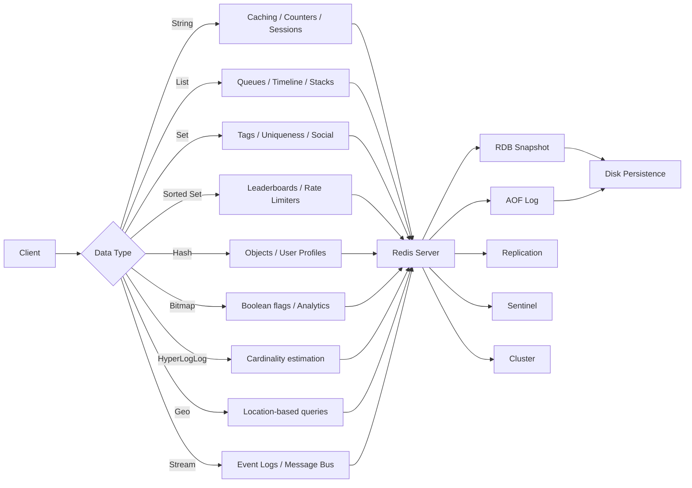

# Chapter 16: Redis — In-Memory Data Store

> **Prev:** [Chapter 15 — MongoDB](15-mongodb.md) | **Next:** [Chapter 17 — Distributed DB](17-distributed-db.md)

## Learning Objectives

- Understand Redis's in-memory, key-value architecture and its single-threaded event loop
- Work with all Redis data types: strings, lists, sets, sorted sets, hashes, bitmaps, HyperLogLog, geospatial, streams
- Implement caching patterns: cache-aside, read-through, write-through, write-behind, refresh-ahead
- Configure persistence: RDB snapshots, AOF logs, and hybrid mode
- Set up replication, Sentinel-based HA, and Redis Cluster for horizontal scaling
- Use Redis for real-world use cases: caching, sessions, rate limiters, message brokers, leaderboards, distributed locks
- Understand eviction policies, transactions, Lua scripting, and Pub/Sub vs Streams

## Chapter at a Glance

| Topic | Key Insight | Practical Takeaway |
|-------|-------------|-------------------|
| **In-Memory Storage** | All data in RAM, disk for persistence only | Monitor memory usage — Redis performance drops sharply when data exceeds RAM |
| **Data Structures** | Strings, Lists, Sets, Hashes, Sorted Sets, Bitmaps, HLL, Geo, Streams | Choose the structure that matches your access pattern |
| **Persistence** | RDB (snapshot) + AOF (append-only log) | Use both: RDB for recovery, AOF for durability |
| **Pub/Sub** | Real-time message broadcasting to channels | Ideal for chat, notifications, and live updates; messages are fire-and-forget |
| **Streams** | Persistent, consumer-group-aware message log | Superior to Pub/Sub when message durability and replay matter |
| **Replication & Sentinel** | Primary-replica with automatic failover | Sentinel provides HA: 3 nodes recommended for quorum |
| **Redis Cluster** | Automatic sharding across 16384 hash slots | Minimum 3 master nodes for production deployment |
| **Eviction Policies** | LRU, LFU, TTL, random, noeviction | Choose policy based on data access pattern and criticality |

## Chapter Roadmap



## Theory

### 16.1 Redis Overview

**Analogy:** Redis is like a **mechanical keyboard** for data access. A mechanical keyboard registers every keystroke instantly with zero lag because the switch is directly under your finger — no membrane layer to press through. Redis keeps every byte in RAM, so reads and writes complete in microseconds without waiting for spinning disks or SSD controllers. Just as a typist relies on that instant key registration for speed, every Redis operation fires directly from RAM with microsecond latency.

Redis (Remote Dictionary Server) is an **in-memory data structure store** used as a cache, message broker, and database. Created by Salvatore Sanfilippo in 2009. It processes over 100,000 operations per second on modest hardware.

**Core Characteristics:**

- **In-memory:** All data resides in RAM (microsecond latency). Disk is only for persistence.
- **Single-threaded event loop:** All commands execute sequentially on one thread using an event-driven reactor pattern (like Node.js). This means every command is atomic — no race conditions within a single instance.
- **Persistence optional:** RDB snapshots, AOF logs, hybrid mode, or purely ephemeral.
- **Rich data types:** Strings, lists, sets, sorted sets, hashes, bitmaps, HyperLogLog, geospatial, streams.
- **Client-server protocol:** RESP (REdis Serialization Protocol) — simple, human-readable, binary-safe.
- **Built-in replication, HA, and clustering:** Master-replica for read scaling, Sentinel for failover, Cluster for sharding.

**When to use Redis:**

- Caching (reducing database load, sub-millisecond response)
- Session storage (ephemeral with TTL expiry)
- Real-time analytics, counters, rate limiters
- Message queues and pub/sub
- Leaderboards and ranking systems
- Distributed locks (Redlock algorithm)
- Geospatial queries (nearby locations)
- Real-time event sourcing (streams)

**When NOT to use Redis:**

- Primary data store for critical financial data (RDBMS provides stronger ACID guarantees)
- Complex queries with joins, subqueries, or aggregations
- Data larger than available RAM (in-memory limitation — can lead to OOM or heavy eviction)
- ACID transactions across multiple keys (limited rollback — Redis transactions don't roll back on failure)
- Long-term archival storage (use a disk-based database)

**How RESP Works:**

```
Client: *3\r\n$3\r\nSET\r\n$5\r\nmykey\r\n$7\r\nmyvalue\r\n
Meaning: Array of 3 bulk strings: ["SET", "mykey", "myvalue"]

Server: +OK\r\n
Simple string reply: "OK"
```

| Component | Description |
|-----------|-------------|
| `*3` | Array of 3 elements |
| `$3` | Bulk string of length 3 |
| `\r\n` | CRLF delimiter |
| `+OK` | Simple string reply |

**Key Design Decision — Why Single-Threaded?**

| Aspect | Consequence |
|--------|-------------|
| No locks needed | Atomicity is free — no mutex, no contention |
| Predictable latency | No context-switch jitter from thread preemption |
| Simple codebase | No concurrent data structure complexity |
| CPU-bound operations slow everything | A slow O(n) command like KEYS * blocks all other commands |

**Architecture & Design Decisions:**

| Decision | Redis Choice | Trade-off |
|----------|-------------|-----------|
| Storage engine | In-memory with optional persistence | Fastest possible reads/writes; limited by RAM size |
| Execution model | Single-threaded event loop (reactor pattern) | Atomic operations without locks; CPU-bound on single core |
| Data structure encoding | Custom (ziplist, skiplist, hashtable, intset) | Memory-efficient at small sizes; transparent to user |
| Protocol | RESP (text-based, binary-safe) | Human-debuggable; slightly more verbose than binary protocols |
| Persistence | Fork-based copy-on-write (RDB) + append log (AOF) | RDB: compact but lossy; AOF: durable but larger |
| Clustering | Client-coordinated hash slots (16384 slots) | Predictable key distribution; limited multi-key ops across nodes |

**Complexity Analysis:**

| Operation | Complexity | Why |
|-----------|------------|-----|
| SET key value | O(1) | Direct hash table insert — key hashed to bucket, value stored |
| GET key | O(1) | Direct hash table lookup — no iteration needed |
| DEL key | O(1) | Hash table delete and free value pointer |
| EXISTS key | O(1) | Hash table membership check |
| KEYS pattern | O(N) | Must iterate every key in the keyspace — blocks event loop |
| FLUSHALL | O(N) | Deletes every key — O(N) in total keys; instantaneous in effect but blocking |

**Edge Cases:**

| Scenario | Behavior | Mitigation |
|----------|----------|------------|
| Key does not exist | GET returns nil; EXISTS returns 0 | Always check EXISTS or handle nil in application code |
| Memory full (maxmemory reached) | Write commands fail with OOM error (noeviction) or keys are evicted | Set appropriate maxmemory + eviction policy; monitor with INFO memory |
| Large value (>512MB) | String values capped at 512MB; larger values cause errors | Split large objects into chunks or use compression |
| Binary data in keys | Keys are binary-safe but keep them short (< 1024 bytes recommended) | Use semantic key naming conventions |
| Write during replica fullsync | Replication buffers accumulate; memory may spike | Monitor repl-backlog-size and client-output-buffer-limit |

> **One-Sentence Takeaway:** Redis keeps all data in memory for sub-millisecond latency, with optional disk persistence for recovery, and uses a single-threaded event loop that makes every command atomic by default.

### 16.2 Data Types and Commands

**Analogy:** Think of Redis data types as a **Swiss Army knife** — each tool is designed for a specific cut. A blade (string) does the common jobs, scissors (list) handle linear sequences, pliers (hash) grip multi-faceted objects, and the awl (sorted set) pierces with precision scoring. Using the wrong tool is like cutting rope with scissors — it works, but slowly.

Each type is a first-class data structure with specialized commands. Memcached only stores opaque byte blobs; Redis stores **typed** data that it can manipulate server-side.

#### 16.2.1 Strings

**Analogy:** Strings are like **sticky notes on a monitor** — you write a short value, stick it somewhere memorable, and read it instantly. The value can be a number you increment (like a tally mark), a JSON blob (like a detailed note), or binary data (like a photo). They're the simplest and most versatile tool.

The most basic Redis type. A value can be a string, number, binary data, or serialized JSON. Maximum value size: 512MB.

**Numbered Steps — String Operations:**

1. Client sends `SET user:1:name "Alice"` as RESP array to server
2. Server receives command in event loop, parses key `user:1:name` and value `"Alice"`
3. Redis hashes the key to locate the hash table bucket
4. If key exists, overwrites value; if not, inserts new entry
5. Returns `+OK` to client
6. On `GET user:1:name`, Redis looks up key in dict, returns `$5\r\nAlice\r\n`

**Pseudocode — Core String Implementation:**

```
function SET(key, value):
    dict[key] = value         // O(1) hash table insert
    if key has TTL:
        start expiration timer
    return OK

function GET(key):
    if key not in dict:
        return nil              // O(1) lookup, not an error
    if key is expired:
        delete key
        return nil
    return dict[key].value

function INCR(key):
    if key not in dict:
        dict[key] = 0           // Create with default 0
    if value is not integer:
        return error
    dict[key] += 1
    return dict[key]
```

**Dry Run — INCR Operations:**

| Step | Command | State (key: counter) | Result | Explanation |
|------|---------|---------------------|--------|-------------|
| 1 | `SET counter 100` | counter = "100" | OK | String value "100" stored |
| 2 | `INCR counter` | counter = "101" | 101 | Parsed as integer, incremented, stored back |
| 3 | `INCRBY counter 50` | counter = "151" | 151 | Atomic add of 50 — no race possible |
| 4 | `DECR counter` | counter = "150" | 150 | Atomic decrement |
| 5 | `GET counter` | counter = "150" | "150" | Returns string representation |
| 6 | `INCR nonexistent` | nonexistent = "1" | 1 | Auto-creates key with value 0 before increment |

**String Commands with Sample Data:**

```bash
# Basic CRUD
SET user:1:name "Alice"                    # OK
SET user:1:email "alice@example.com"       # OK
GET user:1:name                            # "Alice"
EXISTS user:1:name                         # (integer) 1
EXISTS user:1:phone                        # (integer) 0
DEL user:1:email                           # (integer) 1 — returns count of deleted keys

# Numeric operations
SET counter 100                            # OK
INCR counter                               # 101
INCRBY counter 50                          # 151
DECR counter                               # 150
DECRBY counter 10                          # 140
INCRBYFLOAT price 15.99                    # 115.99 — floating-point increment

# Expiration (TTL)
SET session:abc123 "user_data" EX 3600     # Expire in 1 hour
SETEX session:abc123 3600 "user_data"      # Same as above, atomic
TTL session:abc123                          # e.g., 3599 (seconds remaining)
EXPIRE session:abc123 7200                  # Extend TTL to 2 hours
PERSIST session:abc123                      # Remove TTL — persists forever

# Batch operations
MSET user:1:name "Alice" user:1:email "alice@example.com"   # OK
MGET user:1:name user:1:email                                # 1) "Alice" 2) "alice@example.com"

# Set with conditions
SET user:1:email "new@example.com" NX       # Set only if key doesn't exist
SET user:1:email "new@example.com" XX       # Set only if key exists
SET user:1:email "new@example.com" NX EX 3600  # If not exists, set with TTL

# Get old value and set new
GETSET user:1:name "Bob"                   # "Alice" — returns old, sets new

# Range operations (bit-level)
SET mykey "hello"                          # OK
GETRANGE mykey 0 2                         # "hel" — substring
STRLEN mykey                                # 5 — string length

# Append to string
APPEND mykey " world"                      # 11 — new length
GET mykey                                   # "hello world"
```

**C++ Implementation (using redis-plus-plus):**

```cpp
#include <sw/redis++/redis++.h>
#include <iostream>
#include <string>

using namespace sw::redis;

void stringOperations() {
    auto redis = Redis("tcp://localhost:6379");

    try {
        // Basic SET/GET
        redis.set("user:1:name", "Alice");
        auto name = redis.get("user:1:name");
        if (name) {
            std::cout << "Name: " << *name << std::endl;
        }

        // Numeric operations (atomic)
        redis.set("counter", "100");
        long val = redis.incr("counter");        // 101 — atomic increment
        std::cout << "Counter: " << val << std::endl;

        val = redis.incrby("counter", 50);        // 151
        val = redis.decr("counter");              // 150

        // Set with TTL and condition
        auto result = redis.set("session:abc", "data_here",
                                std::chrono::seconds(3600),
                                UpdateType::NOT_EXISTS);  // NX flag
        if (result) {
            std::cout << "Session set with TTL" << std::endl;
        }

        // Check expiry
        auto ttl = redis.ttl("session:abc");
        if (ttl && *ttl > 0) {
            std::cout << "TTL remaining: " << *ttl << "s" << std::endl;
        }

        // Batch operations
        std::vector<std::pair<std::string, std::string>> kvs = {
            {"user:1:name", "Alice"},
            {"user:1:email", "alice@example.com"}
        };
        redis.mset(kvs.begin(), kvs.end());

        std::vector<std::string> keys = {"user:1:name", "user:1:email"};
        std::vector<OptionalString> values;
        redis.mget(keys.begin(), keys.end(), std::back_inserter(values));

        for (size_t i = 0; i < keys.size(); ++i) {
            if (values[i]) {
                std::cout << keys[i] << ": " << *values[i] << std::endl;
            }
        }

    } catch (const Error& e) {
        std::cerr << "Redis error: " << e.what() << std::endl;
    }
}
```

**Python Implementation (redis-py):**

```python
import redis

r = redis.Redis(host='localhost', port=6379, decode_responses=True)

# Basic CRUD
r.set('user:1:name', 'Alice')
name = r.get('user:1:name')       # 'Alice'
exists = r.exists('user:1:name')  # 1 (True)
r.delete('user:1:phone')          # 0 (key didn't exist)

# Numeric operations (atomic — no race conditions across processes)
r.set('counter', 100)
val = r.incr('counter')           # 101
val = r.incrby('counter', 50)     # 151
val = r.decr('counter')           # 150
val = r.incrbyfloat('price', 15.99)  # 115.99

# TTL — automatic expiration
r.set('session:abc123', 'user_data', ex=3600)  # Expires in 1 hour
ttl = r.ttl('session:abc123')     # ~3599 seconds

# Conditional SET
r.set('user:1:email', 'new@example.com', nx=True)  # Only if not exists
r.set('user:1:email', 'new@example.com', xx=True)  # Only if exists

# Batch operations
r.mset({'user:1:name': 'Alice', 'user:1:email': 'alice@example.com'})
vals = r.mget(['user:1:name', 'user:1:email'])  # ['Alice', 'alice@example.com']

# String length and range
r.set('mykey', 'hello world')
length = r.strlen('mykey')          # 11
substr = r.getrange('mykey', 0, 4)  # 'hello'
```

**Complexity Analysis:**

| Operation | Complexity | Why |
|-----------|------------|-----|
| SET | O(1) | Direct hash table insert; no iteration needed |
| GET | O(1) | Direct hash table lookup by key |
| INCR | O(1) | Parse string to int, increment, store — all constant time |
| APPEND | O(1) amortized | String reallocation may copy data, but amortized O(1) |
| STRLEN | O(1) | String length stored as metadata |
| GETRANGE | O(N) for N chars | Must copy substring bytes |
| MSET | O(N) for N keys | N individual hash table inserts |

**A&D Table:**

| Advantage | Disadvantage |
|-----------|-------------|
| Simplest data type with universal support | No field-level access within a value |
| Supports numeric operations (INCR, INCRBY) | 512MB max value size |
| Binary-safe — can store images, serialized data | String encoding wastes space for numeric types |
| Built-in TTL expiry for automatic cleanup | Large strings block replication (10MB+ is dangerous) |
| Batch operations (MSET/MGET) reduce RTT | No server-side sub-string manipulation (only getrange) |

**Edge Cases:**

| Scenario | Behavior | Mitigation |
|----------|----------|------------|
| INCR on non-numeric string | Returns error: "ERR value is not an integer" | Validate value type before increment |
| Key with TTL already expired | GET returns nil, key auto-deleted | Check return value — never assume key exists |
| Value exceeds 512MB | Returns error for string commands | Compress large data or chunk into multiple keys |
| SET NX on existing key | Returns nil (not error) | Check return value before proceeding |
| MGET with mixed existing/non-existing keys | Returns array with nil for missing keys | Handle nil values in application code |
| INCR on key with TTL | Preserves TTL — never clears it | Use SET with EX to reset TTL if needed |

#### 16.2.2 Lists

**Analogy:** A Redis list is like a **conveyor belt in a warehouse** — items arrive on the left (LPUSH), workers pick them off the right (RPOP) for processing. It's a perfect FIFO queue. You can also use it as a stack (LPUSH + LPOP = LIFO), or a timeline (LPUSH + LRANGE to show recent items). The linked-list implementation means millions of items barely slow down head/tail operations.

Ordered sequences of strings implemented as **linked lists** — fast head/tail operations (O(1)), slow random access by index (O(N)). Maximum length: 2^32 - 1 (over 4 billion elements).

**Numbered Steps — List Queue Pattern (FIFO):**

1. Producer calls `LPUSH queue:task "process_email"` — item prepended to list head
2. Redis creates/updates key as list type; links new node at head
3. Consumer calls `RPOP queue:task` — item removed from tail
4. If list empties, consumer can use `BRPOP queue:task 0` to block indefinitely
5. On blocking pop, Redis subscribes client to key notifications; when new LPUSH arrives, the waiting client is notified and given the element
6. Multiple consumers can block on the same key — each element goes to exactly one consumer

**Pseudocode — List Queue Implementation:**

```
function LPUSH(key, value):
    if key not in dict:
        dict[key] = new LinkedList()
    list = dict[key]
    list.prepend(value)              // O(1) — link new head node
    notify_waiting_blocked_clients(key)
    return list.length

function RPOP(key):
    if key not in dict:
        return nil
    list = dict[key]
    if list is empty:
        return nil
    value = list.removeTail()        // O(1) — unlink tail node
    return value

function LRANGE(key, start, stop):
    if key not in dict:
        return []
    list = dict[key]
    // Convert negative indices (Python-style)
    if start < 0: start = max(length + start, 0)
    if stop < 0: stop = length + stop
    result = []
    node = list.head
    for i = 0 to stop:
        if i >= start: result.append(node.value)
        node = node.next
        if node is None: break
    return result

function BRPOP(key, timeout_ms):
    start = now()
    while true:
        value = RPOP(key)
        if value is not nil:
            return [key, value]
        if timeout_ms == 0:
            // Block indefinitely — subscribe to push notifications
            wait_on_key_notifications(key)
        else if elapsed >= timeout_ms:
            return nil
        else:
            wait_on_key_notifications(key, remaining_time)
```

**Dry Run — List Timeline (Recent Items):**

| Step | Command | List State (left → right) | Result | Explanation |
|------|---------|---------------------------|--------|-------------|
| 1 | `LPUSH timeline:user1 "post:3"` | ["post:3"] | 1 | Head insert |
| 2 | `LPUSH timeline:user1 "post:2"` | ["post:2", "post:3"] | 2 | Prepended to head |
| 3 | `LPUSH timeline:user1 "post:1"` | ["post:1", "post:2", "post:3"] | 3 | Most recent first |
| 4 | `LRANGE timeline:user1 0 1` | unchanged | ["post:1", "post:2"] | First 2 items |
| 5 | `LTRIM timeline:user1 0 1` | ["post:1", "post:2"] | OK | Dropped "post:3" |
| 6 | `LLEN timeline:user1` | unchanged | 2 | Length check |

**List Commands with Sample Data:**

```bash
# Create a queue (FIFO: RPUSH + LPOP)
RPUSH queue:tasks "task:1"           # 1
RPUSH queue:tasks "task:2"           # 2
RPUSH queue:tasks "task:3"           # 3
LPOP queue:tasks                     # "task:1" — oldest item first

# Create a stack (LIFO: LPUSH + LPOP)
LPUSH stack:actions "action:1"       # 1
LPUSH stack:actions "action:2"       # 2
LPOP stack:actions                   # "action:2" — most recent first

# Timeline (most recent first)
LPUSH timeline:user:42 "post:301"    # 1
LPUSH timeline:user:42 "post:300"    # 2
LPUSH timeline:user:42 "post:299"    # 3
LRANGE timeline:user:42 0 2          # "post:301", "post:300", "post:299"

# Blocking pop (queue consumer)
BRPOP queue:tasks 30                 # Wait up to 30s for element
BLPOP queue:tasks 0                  # Wait indefinitely

# Move element between lists (reliable queue)
RPOPLPUSH queue:processing queue:backup "task:1"
# Atomic: RPOP from source → LPUSH to destination

# Blocking variant — used for reliable queues
BRPOPLPUSH queue:processing queue:backup 30

# Insert at position
LSET mylist 2 "new_value"            # Set element at index 2 (O(N))
LINSERT mylist BEFORE "existing" "new"  # Insert before pivot

# Get length
LLEN queue:tasks                     # e.g., 3

# Remove elements
LREM queue:tasks 2 "task:1"          # Remove 2 occurrences of "task:1"
LTRIM mylist 0 99                    # Keep only first 100 elements
```

**C++ Implementation (List Queue):**

```cpp
#include <sw/redis++/redis++.h>
#include <iostream>
#include <string>
#include <thread>

using namespace sw::redis;

void producer(Redis& redis) {
    for (int i = 0; i < 10; ++i) {
        std::string task = "task:" + std::to_string(i);
        redis.lpush("task:queue", task);
        std::cout << "Produced: " << task << std::endl;
        std::this_thread::sleep_for(std::chrono::milliseconds(100));
    }
}

void consumer(Redis& redis, int id) {
    while (true) {
        // Blocking pop with 30s timeout
        auto result = redis.blpop("task:queue", 30);
        if (result) {
            auto [key, task] = *result;
            std::cout << "Consumer " << id << " got: " << task << std::endl;
        }
    }
}

int main() {
    auto redis = Redis("tcp://localhost:6379");

    std::thread prod(producer, std::ref(redis));
    std::thread cons1(consumer, std::ref(redis), 1);
    std::thread cons2(consumer, std::ref(redis), 2);

    prod.join();
    // Note: consumers run forever in this example
    return 0;
}
```

**Python Implementation (List Queue):**

```python
import redis
import threading
import time
import json

r = redis.Redis(host='localhost', port=6379, decode_responses=True)
QUEUE = 'task:queue'

# Producer
def enqueue(task_data):
    r.lpush(QUEUE, json.dumps(task_data))

# Consumer with blocking pop
def worker(worker_id):
    while True:
        # Block indefinitely (timeout=0)
        result = r.brpop(QUEUE, timeout=0)
        # result is (key, value) tuple
        _, task_json = result
        task = json.loads(task_json)
        print(f"Worker {worker_id} processing: {task['type']}")
        time.sleep(0.5)
        print(f"Worker {worker_id} done: {task['type']}")

# Start 3 consumer threads
for i in range(3):
    t = threading.Thread(target=worker, args=(i,), daemon=True)
    t.start()

# Produce tasks
for i in range(10):
    enqueue({"type": "email", "to": f"user{i}@example.com"})
    time.sleep(0.1)

time.sleep(5)  # Let consumers process
```

**Complexity Analysis:**

| Operation | Complexity | Why |
|-----------|------------|-----|
| LPUSH / RPUSH | O(1) | Link new node at head or tail — pointer assignment |
| LPOP / RPOP | O(1) | Unlink head or tail node — pointer reassignment |
| LINDEX | O(N) | Must traverse from head to index N |
| LRANGE start stop | O(S + N) for start offset S + N elements | Must skip S nodes, then collect N |
| LINSERT | O(N) | Traverse to pivot position, then link |
| LREM | O(N) | Traverse entire list to find and remove matches |
| LLEN | O(1) | List length stored as integer metadata |
| LTRIM | O(N) | May need to delete N elements outside range |

**A&D Table:**

| Advantage | Disadvantage |
|-----------|-------------|
| O(1) head/tail operations — ideal for queues/stacks | O(N) random access — no indexed lookup |
| Blocking pop (BRPOP/BLPOP) for consumer patterns | Linked list overhead per element (extra pointers) |
| Atomic RPOPLPUSH for reliable queue processing | No built-in TTL per element (entire key expires) |
| Can be used as timeline, queue, stack, or deque | No built-in deduplication (use Set for that) |
| No limit on list length (2^32 - 1 elements) | Single list cannot be partitioned across cluster nodes |

**Edge Cases:**

| Scenario | Behavior | Mitigation |
|----------|----------|------------|
| LPOP on empty list | Returns nil | Check return, or use blocking variant BRPOP |
| BRPOP with no timeout on empty list | Blocks until a producer LPUSHes | Set timeout for production use |
| LINDEX with negative index | Counts from tail (-1 is last element) | Document this behavior for team |
| LSET on non-existent index | Returns error "ERR index out of range" | Validate list length first with LLEN |
| Single element left after RPOP | Key is deleted from keyspace | Key disappears; EXISTS returns 0 |
| LRANGE start exceeds list length | Returns empty array | No error — safe to call |
| LTRIM removes all elements | Key is deleted (empty list removed) | EXISTS returns 0 after LTRIM 0 0 on single element |

#### 16.2.3 Sets

**Analogy:** Redis sets are like a **bouncer's clipboard at an exclusive club** — each name is checked once (unique), membership is instant (SISMEMBER), and you can combine two clipboards to find the combined guest list (union), the mutual friends (intersection), or who's on one list but not the other (difference). No duplicates allowed — the bouncer crosses out repeated names instantly.

Unordered collections of unique strings. Implemented as hash tables (or integer-sets for small integer-only sets). Maximum membership: 2^32 - 1 elements per set.

**Numbered Steps — Set Intersection (Mutual Friends):**

1. Pre-populate `SADD group:friends:alice "bob" "carol" "dave"`
2. Pre-populate `SADD group:friends:bob "alice" "carol" "eve"`
3. Client sends `SINTER group:friends:alice group:friends:bob`
4. Redis picks the smaller set as the iteration base (optimization)
5. For each member in the smaller set, Redis checks membership in the larger set (O(1) per check)
6. Collects matching members and returns them
7. Result: `"carol"` — the mutual friend

**Pseudocode — Set Intersection:**

```
function SINTER(key1, key2, ...):
    // Optimization: iterate smallest set for membership checks
    sets = [dict[key] for key in keys if key in dict]
    if len(sets) == 0: return []
    sort sets by size ascending
    smallest = sets[0]
    result = []
    for member in smallest:
        member_in_all = true
        for other in sets[1:]:
            if member not in other:   // O(1) hash lookup
                member_in_all = false
                break
        if member_in_all:
            result.append(member)
    return result

function SADD(key, member):
    if key not in dict:
        dict[key] = new HashSet()
    set = dict[key]
    if member not in set:
        set.add(member)             // O(1) hash insert
        return 1                    // Added
    return 0                        // Already existed
```

**Dry Run — Set Operations (Social Graph):**

| Step | Command | Set State (alice) | Set State (bob) | Result | Explanation |
|------|---------|-------------------|------------------|--------|-------------|
| 1 | `SADD friends:alice "bob"` | {bob} | — | 1 | Added |
| 2 | `SADD friends:alice "carol"` | {bob, carol} | — | 1 | Added |
| 3 | `SADD friends:bob "alice"` | {bob, carol} | {alice} | 1 | Added |
| 4 | `SADD friends:bob "carol"` | {bob, carol} | {alice, carol} | 1 | Added |
| 5 | `SINTER friends:alice friends:bob` | unchanged | unchanged | {"carol"} | Mutual friend |
| 6 | `SUNION friends:alice friends:bob` | unchanged | unchanged | {"bob","carol","alice"} | All unique |
| 7 | `SDIFF friends:alice friends:bob` | unchanged | unchanged | {"bob"} | Alice-only friends |
| 8 | `SREM friends:alice "bob"` | {carol} | unchanged | 1 | Removed |

**Set Commands with Sample Data:**

```bash
# Adding members
SADD user:1:interests "hiking"                                   # 1
SADD user:1:interests "reading" "photography" "hiking"            # 2 (hiking already exists)

# Membership check
SISMEMBER user:1:interests "hiking"                               # 1
SISMEMBER user:1:interests "swimming"                              # 0

# Get all members
SMEMBERS user:1:interests                                          # all members (unordered)
SCARD user:1:interests                                             # 3 — cardinality

# Set operations — social features
SADD group:devs "alice" "bob" "carol"                              # 3
SADD group:managers "carol" "dave"                                 # 2

# Union (all unique members of both groups)
SUNION group:devs group:managers                                   # "alice", "bob", "carol", "dave"

# Intersection (who is in both?)
SINTER group:devs group:managers                                   # "carol"

# Difference (devs who are NOT managers)
SDIFF group:devs group:managers                                    # "alice", "bob"

# Store results in a new set
SINTERSTORE group:dev_managers group:devs group:managers           # 1 — creates new set
SUNIONSTORE group:all_employees group:devs group:managers          # 4

# Random member (for sampling)
SRANDMEMBER user:1:interests 2                                     # 2 random members
SPOP user:1:interests 1                                            # Remove and return random member

# Move member between sets
SMOVE group:devs group:managers "carol"                            # Move carol to managers
```

**C++ Implementation (Set — Social Graph):**

```cpp
#include <sw/redis++/redis++.h>
#include <iostream>
#include <vector>

using namespace sw::redis;

void setOperations() {
    auto redis = Redis("tcp://localhost:6379");

    // User interests
    std::vector<std::string> interests = {"hiking", "reading", "photography"};
    redis.sadd("user:1:interests", interests.begin(), interests.end());

    // Check membership
    bool likesHiking = redis.sismember("user:1:interests", "hiking");
    bool likesSwimming = redis.sismember("user:1:interests", "swimming");
    std::cout << "Likes hiking: " << likesHiking << std::endl;      // 1
    std::cout << "Likes swimming: " << likesSwimming << std::endl;  // 0

    // Group management
    std::vector<std::string> devs = {"alice", "bob", "carol"};
    std::vector<std::string> managers = {"carol", "dave"};
    redis.sadd("group:devs", devs.begin(), devs.end());
    redis.sadd("group:managers", managers.begin(), managers.end());

    // Intersection — mutual members
    std::vector<std::string> mutual;
    redis.sinter({"group:devs", "group:managers"}, std::back_inserter(mutual));
    for (const auto& m : mutual) {
        std::cout << "Mutual: " << m << std::endl;  // "carol"
    }

    // Difference
    std::vector<std::string> devsOnly;
    redis.sdiff({"group:devs", "group:managers"}, std::back_inserter(devsOnly));

    // Cardinality
    auto count = redis.scard("user:1:interests");
    std::cout << "Interest count: " << *count << std::endl;
}
```

**Python Implementation (Set — Tags and Filtering):**

```python
import redis

r = redis.Redis(decode_responses=True)

# Article tags
r.sadd('article:42:tags', 'redis', 'database', 'caching', 'tutorial')
r.sadd('article:99:tags', 'redis', 'nosql', 'performance')

# Find articles by tag intersection
redis_articles = r.smembers('article:42:tags')
print(f"Article 42 tags: {redis_articles}")

# Tag intersection — find common tags
common = r.sinter('article:42:tags', 'article:99:tags')
print(f"Common tags: {common}")  # {'redis'}

# Tag union — all unique tags across articles
all_tags = r.sunion('article:42:tags', 'article:99:tags')
print(f"All tags: {all_tags}")

# Tagged article lookup (inverted index pattern)
r.sadd('tag:redis:articles', '42', '99')
r.sadd('tag:database:articles', '42')
r.sadd('tag:nosql:articles', '99')

# Find articles tagged with BOTH redis AND nosql
both = r.sinter('tag:redis:articles', 'tag:nosql:articles')
print(f"Articles with redis AND nosql: {both}")  # {'99'}

# Random sampling
sample = r.srandmember('article:42:tags', 2)  # 2 random tags

# Spop — remove and return (useful for job assignment)
task = r.spop('queue:pending')
```

**Complexity Analysis:**

| Operation | Complexity | Why |
|-----------|------------|-----|
| SADD | O(1) | Hash table insert — direct bucket insertion |
| SREM | O(1) | Hash table delete — direct bucket removal |
| SISMEMBER | O(1) | Hash table lookup — constant time |
| SCARD | O(1) | Set cardinality stored as metadata counter |
| SMEMBERS | O(N) | Must iterate and return all N elements |
| SINTER | O(N * M) | N = smallest set size, M = number of sets |
| SUNION | O(N) | Sum of all set sizes — iterate and deduplicate |
| SDIFF | O(N) | Size of first set — iterate and check exclusion |
| SRANDMEMBER | O(1) | Random index into hash table (with compact encoding) |

**A&D Table:**

| Advantage | Disadvantage |
|-----------|-------------|
| O(1) membership check — instant existence test | Unordered — no ranking or ordering within set |
| Built-in set algebra (union, intersect, diff) | No duplicate tracking — duplicates silently ignored |
| Automatic deduplication | SMEMBERS on large sets can block Redis (O(N)) |
| Scalable to millions of elements | Higher memory overhead than List per element |
| SPOP for fair random selection | No TTL per element (entire key expires) |

**Edge Cases:**

| Scenario | Behavior | Mitigation |
|----------|----------|------------|
| SADD of existing member | Returns 0 (not error) | Check return value to know if added |
| SREM of non-existing member | Returns 0 | No error — idempotent operation |
| SINTER with empty set | Returns empty array | Handle empty results gracefully |
| SMEMBERS on set with millions | Blocks Redis for seconds | Use SSCAN for cursor-based iteration |
| Set with all integer members | Automatically encoded as intset (memory efficient) | No action needed — Redis handles encoding |
| Last member removed by SREM | Key is deleted from keyspace | EXISTS returns 0 automatically |
#### 16.2.4 Sorted Sets

**Analogy:** A sorted set is like a **gaming leaderboard at an arcade** — each player has a high score (the "score"), and the machine displays them in perfect order. When a player beats their score, the board updates instantly, sliding them up or down without reshuffling every entry. Ties are broken by insertion order (earliest first). You can query the top 10, check your rank, or ask "who's in the 1000-2000 score range?" — all in logarithmic time.

Sets with a score for each member. Ordered by score (ascending). Implemented using a **skip list + hash table** dual structure. Indispensable for leaderboards, rate limiters, and time-series queries.

**Numbered Steps — Sorted Set Leaderboard Update:**

1. `ZADD leaderboard:week1 1500 "alice"` — Redis looks up key in dict
2. If key exists as sorted set, inserts member `"alice"` with score `1500`
3. Insert into skip list: O(log N) find position, O(1) link node
4. Insert into hash table: O(1) map member → score for direct lookups
5. On `ZINCRBY leaderboard:week1 300 "alice"`:
   - Hash table lookup finds current score: 1500 (O(1))
   - Remove from skip list (O(log N))
   - Update score to 1800
   - Re-insert into skip list at correct position (O(log N))
   - Update hash table entry (O(1))
6. On `ZREVRANGE leaderboard:week1 0 2 WITHSCORES`:
   - Traverse skip list from tail (highest score), collect 3 members
   - O(log N) to find start position + O(M) for M elements returned

**Pseudocode — Sorted Set Implementation:**

```
function ZADD(key, score, member):
    if key not in dict:
        dict[key] = new SortedSet()          // skiplist + hashtable
    ss = dict[key]
    if member in ss.hashtable:
        old_score = ss.hashtable[member]
        ss.skiplist.remove(member, old_score)  // O(log N)
    ss.skiplist.insert(score, member)          // O(log N)
    ss.hashtable[member] = score               // O(1)
    return 1 if new, 0 if updated

function ZRANK(key, member):
    if key not in dict: return nil
    ss = dict[key]
    if member not in ss.hashtable: return nil
    score = ss.hashtable[member]
    return ss.skiplist.getRank(member, score)  // O(log N)

function ZREVRANGE(key, start, stop, WITHSCORES?):
    if key not in dict: return []
    ss = dict[key]
    // Convert negative indices
    start = normalize(start, ss.length)
    stop = normalize(stop, ss.length)
    result = []
    node = ss.skiplist.tail                          // highest score first
    for i = 0 to start: node = node.prev             // skip to start
    for i = start to stop:
        result.append(node.member)
        if WITHSCORES: result.append(node.score)
        node = node.prev
        if node is None: break
    return result
```

**Dry Run — Sorted Set Leaderboard:**

| Step | Command | State (member → score) | Rank Order (low→high) | Result | Explanation |
|------|---------|----------------------|----------------------|--------|-------------|
| 1 | `ZADD lb 1500 "alice"` | alice=1500 | [(alice,1500)] | 1 | Inserted |
| 2 | `ZADD lb 2200 "bob"` | alice=1500, bob=2200 | [(alice,1500),(bob,2200)] | 1 | Bob at end (higher score) |
| 3 | `ZADD lb 1800 "carol"` | +carol=1800 | [(alice,1500),(carol,1800),(bob,2200)] | 1 | Carol between alice and bob |
| 4 | `ZADD lb 950 "dave"` | +dave=950 | [(dave,950),(alice,1500),(carol,1800),(bob,2200)] | 1 | Dave at lowest |
| 5 | `ZRANK lb "alice"` | unchanged | unchanged | 2 | 0-indexed rank: 2nd from bottom |
| 6 | `ZREVRANK lb "alice"` | unchanged | unchanged | 1 | 2nd from top (0-indexed) |
| 7 | `ZINCRBY lb 300 "alice"` | alice=1500→1800 | [(dave,950),(carol,1800),(alice,1800),(bob,2200)] | "1800" | Alice ties carol at 1800; alice after carol (insertion order) |
| 8 | `ZREVRANGE lb 0 1` | unchanged | unchanged | [bob, alice/carol] | Top 2 |
| 9 | `ZSCORE lb "alice"` | unchanged | unchanged | "1800" | Direct score lookup |

**Sorted Set Commands with Sample Data:**

```bash
# Add members with scores
ZADD leaderboard:week1 1500 "alice"                           # 1
ZADD leaderboard:week1 2200 "bob"                             # 1
ZADD leaderboard:week1 1800 "carol"                           # 1
ZADD leaderboard:week1 950 "dave"                             # 1

# Rank queries (0-indexed, ascending)
ZRANK leaderboard:week1 "alice"                               # 2 (3rd place ascending)
ZREVRANK leaderboard:week1 "alice"                            # 1 (2nd place descending)
ZREVRANK leaderboard:week1 "bob"                              # 0 (1st place)

# Range queries
ZREVRANGE leaderboard:week1 0 2 WITHSCORES                    # Top 3 with scores
# 1) "bob" -> 2200
# 2) "alice" -> 1500  # (or carol if score changed)
# 3) "dave" -> 950

ZRANGE leaderboard:week1 0 -1 WITHSCORES                      # All members ascending

# Score updates
ZINCRBY leaderboard:week1 300 "alice"                          # "1800" — atomic increment
ZADD leaderboard:week1 2500 "alice"                            # Direct score update to 2500

# Score-based queries
ZSCORE leaderboard:week1 "alice"                               # "1800"
ZRANGEBYSCORE leaderboard:week1 1500 2000 WITHSCORES           # Members with 1500 <= score <= 2000
ZCOUNT leaderboard:week1 1000 2000                             # 2 — count in score range

# Remove
ZREM leaderboard:week1 "dave"                                  # 1
ZREMRANGEBYRANK leaderboard:week1 0 0                          # Remove lowest
ZREMRANGEBYSCORE leaderboard:week1 0 1000                      # Remove scores <= 1000

# Lexicographical operations (same score)
ZADD lex:set 0 "apple" 0 "banana" 0 "cherry"                   # All score 0
ZRANGEBYLEX lex:set "[banana" "[cherry"                        # Lex range: banana, cherry
ZLEXCOUNT lex:set "-" "+"                                      # 3 — all members
ZREMRANGEBYLEX lex:set "[a" "[c"                               # Remove members lexicographically

# Intersection / Union (weighted)
ZINTERSTORE dest 2 zset1 zset2 WEIGHTS 1 2 AGGREGATE SUM       # Weighted intersection
ZUNIONSTORE dest 2 zset1 zset2 AGGREGATE MAX                    # Union with max score

# Blocking pop — BZPOPMIN / BZPOPMAX (Redis 6.2+)
BZPOPMIN leaderboard:week1 30                                  # Pop lowest with score
```

**C++ Implementation (Sorted Set — Leaderboard):**

```cpp
#include <sw/redis++/redis++.h>
#include <iostream>
#include <vector>
#include <random>

using namespace sw::redis;

void leaderboard() {
    auto redis = Redis("tcp://localhost:6379");

    // Record game scores for 10 players
    std::random_device rd;
    std::mt19937 gen(rd());
    std::uniform_int_distribution<> scoreDist(100, 10000);

    for (int i = 1; i <= 10; ++i) {
        int score = scoreDist(gen);
        redis.zadd("leaderboard:global", "player:" + std::to_string(i), score);
    }

    // Get top 5
    std::vector<std::pair<std::string, double>> top5;
    redis.zrevrange("leaderboard:global", 0, 4,
                    std::back_inserter(top5));

    std::cout << "=== TOP 5 ===" << std::endl;
    int rank = 1;
    for (const auto& [player, score] : top5) {
        std::cout << "#" << rank++ << " " << player << " - " << score << std::endl;
    }

    // Get a specific player's rank and score
    auto playerRank = redis.zrevrank("leaderboard:global", "player:5");
    auto playerScore = redis.zscore("leaderboard:global", "player:5");

    if (playerRank && playerScore) {
        std::cout << "player:5 is #" << (*playerRank + 1)
                  << " with score " << *playerScore << std::endl;

        // Get neighbors around player
        std::vector<std::pair<std::string, double>> neighbors;
        auto start = std::max(0L, *playerRank - 2);
        auto end = *playerRank + 2;
        redis.zrevrange("leaderboard:global", start, end,
                        std::back_inserter(neighbors));
    }

    // Count players in score range
    auto count = redis.zcount("leaderboard:global",
                              std::pair<double, double>{1000, 5000});
    std::cout << "Players between 1000-5000: " << *count << std::endl;

    // Increment score (when player wins)
    redis.zincrby("leaderboard:global", 500, "player:3");
}
```

**Python Implementation (Sorted Set — Rate Limiter with Sliding Window):**

```python
import redis
import time

r = redis.Redis(decode_responses=True)

class SlidingWindowRateLimiter:
    """Rate limiter using sorted sets for sliding window precision."""

    def __init__(self, redis_client, window_seconds=60, max_requests=100):
        self.r = redis_client
        self.window = window_seconds
        self.max_reqs = max_requests

    def is_allowed(self, user_id: str) -> bool:
        key = f"ratelimit:{user_id}"
        now = time.time()
        window_start = now - self.window

        # Use pipeline for atomicity
        pipe = self.r.pipeline()

        # Remove entries outside the sliding window
        pipe.zremrangebyscore(key, 0, window_start)
        # Count remaining entries in window
        pipe.zcard(key)
        # Add current request with timestamp as both member and score
        pipe.zadd(key, {str(now): now})
        # Set TTL for automatic cleanup
        pipe.expire(key, self.window)

        # Execute pipeline — returns list of results
        _, count, _, _ = pipe.execute()

        return count <= self.max_reqs   # Allow if under limit

limiter = SlidingWindowRateLimiter(r, window_seconds=60, max_requests=5)

# Simulate requests
for i in range(10):
    user_id = "user:42"
    allowed = limiter.is_allowed(user_id)
    print(f"Request {i+1}: {'ALLOWED' if allowed else 'BLOCKED'} for {user_id}")
    time.sleep(0.5)
```

**Complexity Analysis:**

| Operation | Complexity | Why |
|-----------|------------|-----|
| ZADD | O(log N) | Skip list insertion at sorted position (log N level traversal) |
| ZRANK | O(log N) | Skip list rank query — traverse levels summing span |
| ZREVRANK | O(log N) | Same as ZRANK, traversing from tail |
| ZSCORE | O(1) | Hash table lookup — direct member → score map |
| ZRANGE by index | O(log N + M) | Skip to start (log N) then traverse M elements |
| ZRANGEBYSCORE | O(log N + M) | Find first score in range (log N), traverse M |
| ZINCRBY | O(log N) | Remove (log N) + re-insert (log N) |
| ZINTERSTORE | O(N * K + M log M) | N = smallest set, K = number of sets, M = result |
| ZREM | O(log N) | Remove from skip list and hash table |
| ZCARD | O(1) | Cardinality stored as metadata |

**A&D Table:**

| Advantage | Disadvantage |
|-----------|-------------|
| Dual structure: O(1) score lookup + O(log N) ordered access | Higher memory overhead (skip list levels + hash table) |
| Built-in ranking and range queries | Score is a single 64-bit double — precision limits for large integers |
| Atomic score increment (ZINCRBY) — no race conditions | Members with equal scores ordered lexicographically |
| Weighted union/intersection for aggregated scores | Limited to 2^32 members (practically infinite) |
| Lexicographical operations on same-score members | Complex implementation (~2,000 lines of C in redis/src/t_zset.c) |

**Edge Cases:**

| Scenario | Behavior | Mitigation |
|----------|----------|------------|
| ZADD member with existing different score | Old entry removed, new score inserted, rank recalculated | Use ZINCRBY for idempotent increments |
| ZSCORE for non-existing member | Returns nil | Always check return value |
| Score equals NaN or infinity | Returns error | Validate scores before insertion |
| Multiple members same score | Ordered lexicographically | Use lex commands (ZRANGEBYLEX) for deterministic ordering |
| ZREVRANGE start > length | Returns empty array | Safe — no error thrown |
| ZINCRBY on non-existing member | Creates member with score = increment amount | Auto-creates — may not be desired |
| Elements with scores near double precision limit | Precision loss possible for very large integers | Use two sorted sets or string-encoded scores |

#### 16.2.5 Hashes

**Analogy:** A Redis hash is like a **file folder with labeled tabs** — the folder is the key (user:1001), each tab is a field (name, email, age), and behind each tab is a specific value. Unlike a string that stores a whole JSON blob, a hash lets you read or write a single field without touching the others. It's the difference between pulling one document from a filing cabinet (hash) vs photocopying the entire drawer (string).

Maps of field-value pairs. Ideal for representing objects with multiple attributes. Memory-efficient for small objects (uses ziplist encoding internally).

**Numbered Steps — Hash Object Operations:**

1. `HSET user:1001 name "Alice Chen"` — creates hash key if not exists
2. Redis checks encoding: small hash → ziplist (memory efficient), large → hash table
3. Inserts field "name" with value "Alice Chen" into internal structure
4. `HGET user:1001 name` — direct field lookup, returns value
5. `HGETALL user:1001` — iterate all field-value pairs
6. `HINCRBY user:1001 login_count 1` — atomic field increment (like INCR for hash fields)

**Pseudocode — Hash Operations:**

```
function HSET(key, field, value):
    if key not in dict:
        dict[key] = new Hash()
    h = dict[key]
    is_new = field not in h
    h[field] = value                    // O(1) hash table insert
    if is_new: return 1                 // New field added
    else: return 0                      // Updated existing

function HGETALL(key):
    if key not in dict: return []
    h = dict[key]
    result = []
    for field, value in h:
        result.append(field)
        result.append(value)
    return result

function HINCRBY(key, field, increment):
    if key not in dict:
        dict[key] = new Hash()
        dict[key][field] = "0"
    h = dict[key]
    if field not in h:
        h[field] = "0"
    val = parse_int(h[field])
    val += increment
    h[field] = str(val)
    return val
```

**Dry Run — Hash User Profile:**

| Step | Command | Hash State (field → value) | Result | Explanation |
|------|---------|---------------------------|--------|-------------|
| 1 | `HSET user:1001 name "Alice"` | name="Alice" | 1 | New field |
| 2 | `HSET user:1001 email "a@x.com"` | +email="a@x.com" | 1 | New field |
| 3 | `HSET user:1001 age 28` | +age="28" | 1 | New field |
| 4 | `HGET user:1001 name` | unchanged | "Alice" | Direct field read |
| 5 | `HINCRBY user:1001 login_count 1` | +login_count="1" | 1 | Auto-created, incremented |
| 6 | `HINCRBY user:1001 login_count 1` | login_count="2" | 2 | Incremented |
| 7 | `HGETALL user:1001` | unchanged | [name,Alice,email,a@x.com,age,28,login_count,2] | All fields |
| 8 | `HDEL user:1001 age` | age removed | 1 | Field deleted |

**Hash Commands with Sample Data:**

```bash
# Set single field
HSET user:1001 name "Alice Chen"                          # 1
HSET user:1001 email "alice@example.com"                  # 1

# Set multiple fields
HMSET user:1002 name "Bob Smith" email "bob@example.com" age 35  # OK

# Get fields
HGET user:1001 name                                       # "Alice Chen"
HGET user:1001 age                                        # (nil) — not set

# Get all fields and values
HGETALL user:1001                                         # name, email, age

# Get multiple specific fields
HMGET user:1001 name email                                # "Alice Chen", "alice@example.com"

# Check field existence
HEXISTS user:1001 phone                                   # 0 (false)
HEXISTS user:1001 name                                    # 1 (true)

# Increment numeric field
HINCRBY user:1001 login_count 1                           # 1
HINCRBY user:1001 login_count 1                           # 2
HINCRBYFLOAT user:1001 balance 150.50                     # 150.50

# Get field count
HLEN user:1001                                            # e.g., 4

# Get field names or values only
HKEYS user:1001                                           # "name", "email", "login_count"
HVALS user:1001                                           # "Alice Chen", "alice@example.com", "2"

# Delete field
HDEL user:1001 phone                                      # 0 (didn't exist)
HDEL user:1001 age                                        # 1

# Set if field not exists
HSETNX user:1001 phone "555-0100"                         # 1 (set)
HSETNX user:1001 phone "555-0200"                         # 0 (already exists)

# Incremental fetch — HSCAN (non-blocking)
HSCAN user:1001 0 COUNT 100                               # Cursor-based iteration
```

**C++ Implementation (Hash — Session Store):**

```cpp
#include <sw/redis++/redis++.h>
#include <iostream>
#include <unordered_map>

using namespace sw::redis;

void hashSessionExample() {
    auto redis = Redis("tcp://localhost:6379");

    // Create a session using hash
    std::unordered_map<std::string, std::string> session = {
        {"user_id", "1001"},
        {"username", "alice"},
        {"role", "admin"},
        {"ip", "192.168.1.100"},
        {"login_time", "2026-01-15T10:30:00Z"}
    };
    redis.hset("session:abc123", session.begin(), session.end());

    // Set TTL on the entire key
    redis.expire("session:abc123", 3600);

    // Get single field
    auto username = redis.hget("session:abc123", "username");
    if (username) {
        std::cout << "User: " << *username << std::endl;
    }

    // Get multiple fields
    std::vector<std::string> fields = {"username", "role"};
    std::vector<OptionalString> values;
    redis.hmget("session:abc123", fields.begin(), fields.end(),
                std::back_inserter(values));

    // Increment visit counter
    redis.hincrby("session:abc123", "visit_count", 1);

    // Get all fields
    std::unordered_map<std::string, std::string> allFields;
    redis.hgetall("session:abc123", std::inserter(allFields, allFields.end()));

    for (const auto& [field, value] : allFields) {
        std::cout << field << ": " << value << std::endl;
    }
}
```

**Python Implementation (Hash — User Profile):**

```python
import redis

r = redis.Redis(decode_responses=True)

# Create user profile as hash
user_data = {
    'name': 'Alice Chen',
    'email': 'alice@example.com',
    'age': 28,
    'city': 'San Francisco',
    'occupation': 'Engineer'
}
r.hset('user:1001', mapping=user_data)

# Read single field
name = r.hget('user:1001', 'name')         # b'Alice Chen'
# Read all fields
profile = r.hgetall('user:1001')
print(f"User profile: {profile}")

# Update single field
r.hset('user:1001', 'age', 29)              # Updated

# Increment counter field
r.hincrby('user:1001', 'login_count', 1)

# Conditional field set
set_if_not_exists = r.hsetnx('user:1001', 'phone', '555-0100')

# Get specific fields
fields = r.hmget('user:1001', 'name', 'email', 'phone')
print(f"Specific fields: {fields}")

# Check field existence
has_email = r.hexists('user:1001', 'email')

# Get keys and values separately
keys = r.hkeys('user:1001')
values = r.hvals('user:1001')

# Non-blocking iteration
cursor = '0'
while cursor != 0:
    cursor, data = r.hscan('user:1001', cursor=cursor, count=10)
    for field, value in data.items():
        print(f"  {field}: {value}")
```

**Complexity Analysis:**

| Operation | Complexity | Why |
|-----------|------------|-----|
| HSET | O(1) | Hash table insert — direct bucket placement |
| HGET | O(1) | Hash table lookup by field |
| HDEL | O(1) | Hash table delete by field |
| HGETALL | O(N) | Must iterate all N field-value pairs |
| HKEYS / HVALS | O(N) | Must iterate all fields |
| HLEN | O(1) | Field count stored as metadata |
| HEXISTS | O(1) | Hash table membership check |
| HINCRBY | O(1) | Parse, add, store — all constant time |
| HSCAN | O(1) per cursor step | Incremental, non-blocking iteration |

**A&D Table:**

| Advantage | Disadvantage |
|-----------|-------------|
| Field-level access — no need to read/write entire object | Cannot set TTL on individual fields (entire key expires) |
| Memory efficient for small objects (ziplist encoding) | HGETALL on large hash blocks Redis (O(N)) |
| Atomic field operations (HINCRBY for counters) | No nested structures (cannot have hash-of-hashes) |
| Avoids key explosion (user:1001:name, etc.) | Fixed field order not guaranteed after modification |
| HSCAN for non-blocking iteration on large hashes | Max 2^32 - 1 fields per hash |

**Edge Cases:**

| Scenario | Behavior | Mitigation |
|----------|----------|------------|
| HSET on string-typed key | Returns error: WRONGTYPE | Use DEL first or ensure type consistency |
| HGET for non-existing field | Returns nil | Handle nil in application code |
| Empty hash after HDEL all fields | Key deleted from keyspace | EXISTS returns 0 |
| Hash with many fields (>512 by default) | Encoding changes from ziplist to hashtable | Memory increases; monitor hash-max-ziplist-entries |
| HINCRBY on non-numeric value | Returns error | Validate field type before increment |

#### 16.2.6 Bitmaps

**Analogy:** A bitmap is like a **parking lot occupancy board** — each parking spot is either occupied (1) or empty (0). You can ask "is spot #42 occupied?" (GETBIT), count all occupied spots (BITCOUNT), or find empty spots between rows (BITOP). At 1 bit per entry, a million users' daily activity fits in just 122 KB.

**Commands with Sample Data:**

```bash
# Track user active status for January 2026 (key: user:active:202601)
SETBIT user:active:202601 42 1           # User 42 active on day index 42
SETBIT user:active:202601 100 1          # User 100 active
GETBIT user:active:202601 42             # 1 — user 42 was active
GETBIT user:active:202601 999            # 0 — user 999 wasn't

# Count active users
BITCOUNT user:active:202601              # e.g., 2

# Daily active users (D1, D2)
SETBIT dau:2026-01-01 100 1              # User 100 active Jan 1
SETBIT dau:2026-01-01 200 1              # User 200 active Jan 1
SETBIT dau:2026-01-02 100 1              # User 100 active Jan 2
SETBIT dau:2026-01-02 300 1              # User 300 active Jan 2

# Union — users active on either day
BITOP OR dau:week1 dau:2026-01-01 dau:2026-01-02
BITCOUNT dau:week1                        # 3 — users 100, 200, 300

# Intersection — users active on both days
BITOP AND dau:both dau:2026-01-01 dau:2026-01-02
BITCOUNT dau:both                         # 1 — user 100

# Find first set bit
BITPOS user:active:202601 1               # Position of first active user
```

**Complexity:** O(1) for GETBIT/SETBIT (byte-aligned). O(N) for BITCOUNT/BITOP (N = bytes processed). BITCOUNT uses Hamming weight (popcount) hardware instructions on modern CPUs — extremely fast.

#### 16.2.7 HyperLogLog

**Analogy:** HyperLogLog is like **estimating the crowd at a concert** without counting every person — you look at the number of unique birthday months in the first 100 people (if you see Jan, Feb, Mar... then Dec, you have probably ~365+ people). HLL uses clever probability theory to estimate cardinality using ~12KB of memory, regardless of whether you've seen 1,000 or 1 billion unique items.

**Commands with Sample Data:**

```bash
# Track unique visitors per day
PFADD daily:visitors:2026-01-01 "ip:192.168.1.1" "ip:192.168.1.2" "ip:10.0.0.1"
PFADD daily:visitors:2026-01-01 "ip:192.168.1.1"                    # Duplicate — not counted
PFCOUNT daily:visitors:2026-01-01                                    # ~3 (actual count)

# Merge multiple days
PFADD day1 "a" "b" "c" "d"
PFADD day2 "c" "d" "e" "f"
PFMERGE week1 day1 day2                                               # Merge into week1
PFCOUNT week1                                                         # ~6 (unique: a,b,c,d,e,f)

# Error rate: ~0.81% standard error
# 12KB constant memory regardless of cardinality
```

**Complexity:** O(1) for PFADD, PFCOUNT (amortized constant). PFMERGE is O(N) where N = number of HLLs merged.

#### 16.2.8 Geospatial

**Analogy:** Geo indices are like a **GPS-enabled friend-finder app** — you can register your location (GEOADD), ask "who's within 5km?" (GEORADIUS), or "how far is Alice from Bob?" (GEODIST). Internally, Redis encodes lat/lon pairs as a 52-bit Geohash stored in a sorted set.

**Commands with Sample Data:**

```bash
# Add locations
GEOADD locations 13.361389 38.115556 "Palermo"    # Longitude, Latitude, Member
GEOADD locations 15.087269 37.502669 "Catania"

# Distance between points
GEODIST locations "Palermo" "Catania" km           # "166.2742"
GEODIST locations "Palermo" "Catania" mi           # Miles

# Find nearby points
GEORADIUS locations 15 37 100 km                   # Points within 100km of (15, 37)
# 1) "Catania"
# 2) "Palermo"

GEORADIUS locations 15 37 100 km WITHCOORD WITHDIST COUNT 5
# Returns distance + coordinates for each match

# Find nearby by member position
GEORADIUSBYMEMBER locations "Palermo" 200 km        # Points within 200km of Palermo

# Get coordinates
GEOPOS locations "Palermo"                          # 13.361389, 38.115556

# Geohash (11-character string)
GEOHASH locations "Palermo"                         # "sqc8b49rny0"
```

**Complexity:** O(log N) for GEOADD (sorted set insert). O(log N + M) for GEORADIUS (range query in sorted set by geohash).

#### 16.2.9 Streams

**Analogy:** Streams are like an **airport black box flight recorder** — every event is logged sequentially with a timestamp (the entry ID), you can replay from any point, and multiple analysts (consumer groups) can independently read the same log without interfering. Unlike Pub/Sub (think: radio broadcast — if you tune in late, you missed it), streams persist messages until explicitly trimmed.

Append-only log data structure (added in Redis 5.0). Each entry has a unique auto-generated ID (`timestamp-sequence`) and field-value pairs. Supports consumer groups for work distribution across multiple consumers.

**Numbered Steps — Stream Consumer Group Processing:**

1. `XADD sensor:temp * sensor_id "s1" temperature 22.5` — server generates ID `1735689600000-0`
2. Entry appended to radix tree at the key `sensor:temp`
3. `XGROUP CREATE sensor:temp group1 $` — creates consumer group, $ means "new entries only"
4. `XREADGROUP GROUP group1 consumer1 COUNT 1 STREAMS sensor:temp >` — ">" means "give me entries I haven't read"
5. Redis tracks pending entries per consumer (PEL — Pending Entry List)
6. Consumer processes message and calls `XACK sensor:temp group1 <entry-id>` to acknowledge
7. Unacknowledged entries remain in PEL — other consumers can claim them via `XAUTOCLAIM`

**Pseudocode — Stream Consumer Group:**

```
function XADD(key, id, field1, value1, ...):
    if key not in dict:
        dict[key] = new Stream()          // Radix tree of entries
    if id == "*": id = generateUniqueID() // timestamp-seq
    entry = {id: {field1: value1, ...}}
    dict[key].entries.append(entry)
    // Notify consumer groups waiting for new data
    for group in dict[key].groups:
        if group.pendingEntries:
            notify_waiting_consumers(group)
    return id

function XREADGROUP(group, consumer, streams, timeout):
    for stream_key in streams:
        stream = dict[stream_key]
        grp = stream.groups[group]
        // ">" means entries not yet delivered to any consumer
        if mode == ">":
            entries = stream.get_unread_entries(grp.last_id)
            for entry in entries:
                grp.pending_list.add(entry.id, consumer, now())
                grp.last_id = entry.id
            return entries
        // Otherwise: entries explicitly referenced by ID
        ...
```

**Dry Run — Stream Consumer Group:**

| Step | Command | Stream State | PEL (pending) | Explanation |
|------|---------|-------------|---------------|-------------|
| 1 | `XADD events * type "login"` | ID: 1735689600000-0 | — | Entry added |
| 2 | `XADD events * type "purchase"` | ID: 1735689600001-0 | — | 2nd entry |
| 3 | `XADD events * type "logout"` | ID: 1735689600002-0 | — | 3rd entry |
| 4 | `XGROUP CREATE events grp1 $` | — | — | Group created, starts after last entry |
| 5 | `XADD events * type "search"` | ID: 1735689600003-0 | — | New entry (readable by group) |
| 6 | `XREADGROUP GROUP grp1 c1 COUNT 2 STREAMS events >` | — | {0003-0: c1} | c1 gets 2 pending entries |
| 7 | `XACK events grp1 1735689600003-0` | — | {0004-0: c1} | First entry acknowledged |
| 8 | `XREADGROUP GROUP grp1 c1 STREAMS events >` | — | {0004-0: c1} | No more new entries |
| 9 | `XADD events * type "click"` | ID: 1735689600005-0 | {0004-0: c1, 0005-0: c1} | Auto-assigned to c1 |

**Stream Commands with Sample Data:**

```bash
# Add entries to stream
XADD sensor:temp * sensor_id "s1" temperature 22.5 humidity 55
# "1735689600000-0"
XADD sensor:temp * sensor_id "s2" temperature 23.1 humidity 52
# "1735689600001-0"

# Read entire stream
XRANGE sensor:temp - +                          # All entries oldest to newest
XRANGE sensor:temp 1735689600000-0 1735689600001-0  # Specific range

# Read N newest entries
XREVRANGE sensor:temp + - COUNT 5               # 5 newest entries

# Blocking read (wait for new data)
XREAD BLOCK 0 STREAMS sensor:temp $              # $ means "only new entries"

# Consumer groups (parallel processing)
XGROUP CREATE sensor:temp temp_group $           # Create group for new entries
XREADGROUP GROUP temp_group consumer1 COUNT 10 STREAMS sensor:temp >

# Acknowledge processed entries
XACK sensor:temp temp_group 1735689600000-0

# Check pending entries
XPENDING sensor:temp temp_group                   # Summary of pending per consumer

# Autoclaim — handle crashed consumers (after 60 seconds)
XAUTOCLAIM sensor:temp temp_group consumer1 60000 0-0

# Stream length & trimming
XLEN sensor:temp
XTRIM sensor:temp MAXLEN ~ 10000                  # Trim to ~10000 entries (optimized)

# Get information
XINFO GROUPS sensor:temp                          # List consumer groups
XINFO CONSUMERS sensor:temp temp_group             # List consumers in group
```

**C++ Implementation (Stream — Producer/Consumer):**

```cpp
#include <sw/redis++/redis++.h>
#include <iostream>
#include <string>
#include <thread>

using namespace sw::redis;

void producer(Redis& redis) {
    for (int i = 0; i < 5; ++i) {
        std::unordered_map<std::string, std::string> entry = {
            {"order_id", "ORD-" + std::to_string(1000 + i)},
            {"amount", std::to_string(50 + i * 10)},
            {"status", "pending"}
        };
        auto id = redis.xadd("orders", "*", entry.begin(), entry.end());
        std::cout << "Added: " << *id << std::endl;
        std::this_thread::sleep_for(std::chrono::milliseconds(200));
    }
}

void consumer(Redis& redis, const std::string& name) {
    try {
        redis.xgroup_create("orders", "order_workers", "$",
                            XgroupCreateOptions::MKSTREAM);
    } catch (const Error&) {
        // Group already exists — ignore
    }

    while (true) {
        auto items = redis.xreadgroup("order_workers", name, "orders", ">",
                                       std::chrono::seconds(1), 10);
        for (const auto& [stream, entries] : items) {
            for (const auto& [id, fields] : entries) {
                auto it = fields.find("order_id");
                if (it != fields.end()) {
                    std::cout << name << " processing: " << it->second << std::endl;
                }
                redis.xack("orders", "order_workers", id);
            }
        }
    }
}
```

**Python Implementation (Stream — Event Processing):**

```python
import redis
import json
import threading
import time

r = redis.Redis(decode_responses=True)
STREAM = 'orders'
GROUP = 'order_workers'

# Create consumer group (MKSTREAM creates stream if not exists)
try:
    r.xgroup_create(STREAM, GROUP, id='$', mkstream=True)
except redis.exceptions.ResponseError:
    pass  # Group already exists

# Producer
def produce_orders():
    for i in range(20):
        data = {
            'order_id': f'ORD-{1000 + i}',
            'user_id': f'USER-{i % 5}',
            'amount': 50 + i * 10,
            'status': 'pending'
        }
        r.xadd(STREAM, data, maxlen=10000)
        time.sleep(0.1)

# Consumer
def process_orders(consumer_name):
    while True:
        try:
            # Read new entries with blocking (timeout=1s)
            results = r.xreadgroup(
                GROUP, consumer_name,
                {STREAM: '>'},
                count=5,
                block=1000
            )
            for stream_name, entries in results:
                for entry_id, fields in entries:
                    print(f"{consumer_name} processing {fields['order_id']}")
                    time.sleep(0.3)  # Simulate work

                    # Acknowledge — remove from pending list
                    r.xack(STREAM, GROUP, entry_id)

                    # Optional: store processing result
                    r.hset(f"order:{fields['order_id']}", mapping=fields)

        except Exception as e:
            print(f"Error: {e}")
            time.sleep(1)

# Start 3 consumers
for i in range(3):
    t = threading.Thread(target=process_orders, args=(f'worker-{i}',), daemon=True)
    t.start()

# Produce
produce_orders()
time.sleep(10)  # Let consumers process
```

**Complexity Analysis:**

| Operation | Complexity | Why |
|-----------|------------|-----|
| XADD | O(1) amortized | Append to radix tree leaf; amortized by tree rebalancing |
| XRANGE | O(log N + M) | Radix tree search (log N) + traverse M entries |
| XREAD | O(log N + M) | Find starting position in radix tree + read M |
| XGROUP CREATE | O(1) | Create consumer group metadata structure |
| XREADGROUP | O(log N + M) | Navigate pending list + read new entries |
| XACK | O(1) | Remove one entry from PEL hash set |
| XPENDING | O(1) | Return summary counters |
| XTRIM | O(log N + M) | Delete oldest entries; N = trimmed count |
| XLEN | O(1) | Length stored as metadata |

### 16.2.10 Data Types Comparison

| Property | String | List | Set | Sorted Set | Hash | Bitmap | HyperLogLog | Geo | Stream |
|----------|--------|------|-----|-----------|------|--------|-------------|-----|--------|
| **Internal Encoding** | Byte array (SDS) | Linked list / quicklist | Hash table / intset | Skip list + hash table | Hash table / ziplist | Bit array | Probabilistic HLL | Sorted set + geohash | Radix tree |
| **Max Size** | 512MB | 2^32-1 elements | 2^32-1 members | 2^32-1 members | 2^32-1 fields | 512MB | 12KB constant | 2^32-1 members | ~2^32 entries |
| **Ordering** | N/A | Insertion order | None (unordered) | Score-based | Field-key based | Bit-index | N/A | Geohash order | By entry ID |
| **Write Ops/sec** | 1M+ | 1M+ (head/tail) | 1M+ | 500K+ | 1M+ | 1M+ | 100K+ | 500K+ | 500K+ |
| **Duplicate Handling** | N/A | Allows | Rejects | Rejects (updates score) | Rejects fields | N/A | Approximate | N/A | Allows duplicate data |
| **Memory per element** | ~value size | ~40-80 bytes | ~40-80 bytes | ~80-120 bytes | ~40-80 bytes | 1 bit | ~12KB total | ~80-120 bytes | ~entry size |
| **TTL** | Key-level | Key-level | Key-level | Key-level | Key-level | Key-level | Key-level | Key-level | Entry-level (XTRIM) |
| **Blocking operations** | No | Yes (BRPOP) | No | Yes (BZPOP) | No | No | No | No | Yes (XREAD) |
| **Atomic field op** | No | No | No | No | Yes (HINCRBY) | No | No | No | No |
| **Best for** | Caching, counters | Queues, timelines | Tags, uniqueness | Leaderboards, rate limits | Objects, profiles | Analytics, flags | Cardinality estimation | Location queries | Event sourcing, messaging |
| **Worst for** | Field-level access | Random access | Ordered queries | Memory-critical | Nested objects | String data | Exact counts | Exact distance | Low-throughput |
### 16.3 Persistence

**Analogy:** Redis persistence is like a **journal and a photograph** of your desk. The AOF (journal) records every single action you take — "picked up pen," "wrote note," "moved paper" — so you can replay everything exactly. The RDB (photograph) takes a picture of the current state — fast to load, but any changes after the photo are lost. The hybrid mode is like taking a photo and then keeping a small journal of changes since the photo: best of both.

#### 16.3.1 RDB (Redis Database File)

Point-in-time snapshots. Redis forks a child process that writes the entire dataset to disk.

**Numbered Steps — RDB Save:**

1. Client issues `SAVE` (sync) or `BGSAVE` (async), or a `save` config condition triggers
2. On `BGSAVE`, parent process forks via `fork()` — creates a child process
3. Child process inherits parent's memory pages (copy-on-write)
4. While child writes RDB file, parent continues serving requests
5. Parent's COW: if parent modifies a page, OS copies the page before writing (parent writes to copy, child writes original to RDB)
6. Child writes RDB to a temp file (e.g., `temp-12345.rdb`)
7. After complete, child atomically renames temp to `dump.rdb`
8. Child signals parent and exits

**Pseudocode — RDB Save:**

```
function BGSAVE():
    if already_saving: return error
    pid = fork()
    if pid == 0:  // Child process
        tmpfile = "temp-" + getpid() + ".rdb"
        for each database:
            for each key, value in database:
                write_key_value(tmpfile, key, value, expiry)
        atomic_rename(tmpfile, "dump.rdb")
        signal_parent_done()
        exit(0)
    else:  // Parent process
        saving_pid = pid
        return OK

function SAVE():
    // Blocking — no fork needed
    for each database:
        for each key, value in database:
            write_key_value("dump.rdb", key, value, expiry)
    return OK
```

**RDB Configuration:**

```
# Automatic save conditions (triggered by checkpoint)
save 900 1       # At least 1 key changed in 900 seconds
save 300 10      # At least 10 keys changed in 300 seconds
save 60 10000    # At least 10000 keys changed in 60 seconds

# RDB file settings
dbfilename dump.rdb
dir /var/lib/redis
rdbcompression yes     # LZF compression (smaller file, more CPU)
rdbchecksum yes        # CRC64 checksum for integrity
stop-writes-on-bgsave-error yes  # Reject writes if BGSAVE fails
```

**Dry Run — COW Memory During BGSAVE:**

| Step | Time | Process | Action | RSS (Memory) |
|------|------|---------|--------|-------------|
| 1 | T0 | Parent | Running normally with 4GB data | 4.0 GB |
| 2 | T1 | Parent | BGSAVE called, fork() | 4.0 GB (shared) |
| 3 | T1 | Child | Starts writing RDB, reading shared pages | ~0 MB (shared pages) |
| 4 | T2 | Parent | Modifies a key — page fault, OS copies page | 4.0 GB + 4KB per modified page |
| 5 | T3 | Parent | Continue accepting writes | Grows by modified pages × 4KB |
| 6 | T4 | Child | Finishes writing RDB | Child exits, pages freed |
| 7 | T5 | Parent | COW pages reclaimed | Back to ~4.0 GB |

**Python — Manual RDB Save with Monitoring:**

```python
import redis

r = redis.Redis(decode_responses=True)

# Trigger async save
r.bgsave()

# Check save status
info = r.info('persistence')
print(f"RDB last save: {info['rdb_last_save_time']}")
print(f"RDB status: {'saving' if info['rdb_bgsave_in_progress'] else 'idle'}")

# Or trigger sync save (blocking — do not use in production)
# r.save()

# Configure save conditions
r.config_set('save', '900 1 300 10 60 10000')
```

**Complexity Analysis:**

| Aspect | Complexity | Why |
|--------|------------|-----|
| BGSAVE fork() | O(1) time, O(N) memory COW | Fork copies page tables (not pages); modified pages copied on write |
| RDB write | O(N) where N = number of keys | Must serialize every key-value pair |
| RDB load | O(N) | Must deserialize and insert every key |
| RDB file size | Compressed ~30-50% of dataset | LZF compression (configurable) |

#### 16.3.2 AOF (Append-Only File)

Logs every write operation. Redis rewrites the AOF periodically to compact it.

**Numbered Steps — AOF Rewrite:**

1. `BGREWRITEAOF` called (manual or auto-triggered)
2. Parent forks child process
3. Child builds new AOF by reading current database state (not replaying old AOF)
4. While child writes, parent accumulates new commands in a buffer
5. When child finishes, parent appends buffered commands to new AOF
6. Parent atomically swaps new AOF for old one

**Pseudocode — AOF Logging:**

```
function log_to_aof(command, args):
    if not aof_enabled: return
    // Format command as RESP protocol
    resp = "*" + len(args) + "\r\n"
    for arg in args:
        resp += "$" + len(arg) + "\r\n" + arg + "\r\n"
    // Append to AOF buffer
    aof_buffer += resp
    if aof_buffer is large enough:
        flush_buffer_to_aof_file()
    if appendfsync == "always":
        fsync(aof_file)
    elif appendfsync == "everysec":
        // Background thread fsyncs every second
```

**AOF Configuration:**

```
appendonly yes
appendfilename "appendonly.aof"
appendfsync everysec       # Default: fsync every second
# appendfsync always       # fsync every write (safest, 100x slower)
# appendfsync no           # OS manages fsync (unsafe)

# Auto-rewrite triggers
auto-aof-rewrite-percentage 100   # Rewrite when AOF size doubles
auto-aof-rewrite-min-size 64mb    # Minimum size for rewrite

# Truncation handling
aof-load-truncated yes            # Load truncated AOF (for crash recovery)
```

**Dry Run — AOF Contents:**

```
# After SET user:1 "Alice":
*3\r\n$3\r\nSET\r\n$6\r\nuser:1\r\n$5\r\nAlice\r\n

# After INCR counter (counter was 100):
*2\r\n$4\r\nINCR\r\n$7\r\ncounter\r\n

# After HSET user:1001 name "Bob":
*4\r\n$4\r\nHSET\r\n$9\r\nuser:1001\r\n$4\r\nname\r\n$3\r\nBob\r\n
```

**Python — AOF Configuration:**

```python
import redis

r = redis.Redis(decode_responses=True)

# Enable AOF
r.config_set('appendonly', 'yes')
r.config_set('appendfsync', 'everysec')

# Check AOF status
info = r.info('persistence')
print(f"AOF enabled: {info['aof_enabled']}")
print(f"AOF rewrite in progress: {info['aof_rewrite_in_progress']}")
print(f"AOF current size: {info['aof_current_size']} bytes")
print(f"AOF base size: {info['aof_base_size']} bytes")
```

#### 16.3.3 Hybrid Persistence (RDB + AOF — Redis 6.2+)

**Numbered Steps — Hybrid Persistence Load:**

1. On startup, Redis checks for AOF file (if `appendonly yes`)
2. AOF file begins with RDB format header (hybrid mode)
3. Redis loads the RDB portion — fast bulk load of all data
4. Then replays the incremental AOF commands after the RDB portion
5. Result: fast load (RDB) + full durability (AOF)

```
# redis.conf
appendonly yes
aof-use-rdb-preamble yes     # Hybrid mode (default in Redis 6.2+)
```

**AOF+RDB hybrid file structure:**
```
[RDB preamble: full dataset snapshot]
[INCR user:1:counter ...]          ← incremental commands after snapshot
[SET user:2:name "Bob" ...]
[...more AOF entries...]
```

#### 16.3.4 Persistence Comparison

| Aspect | RDB | AOF | Hybrid (RDB+AOF) |
|--------|-----|-----|-------------------|
| **Data loss window** | Last N minutes (configurable) | ~1 second (everysec) / 0 (always) | ~1 second (everysec) |
| **File size** | Compact (~30-50% of dataset) | Larger (command replay) | Medium (compact + commands) |
| **Load speed** | Fast — single file load | Slow — replay all commands | Medium — RDB load + command replay |
| **Impact on writes** | Minimal (fork + COW) | Moderate (append + fsync) | Similar to AOF |
| **Human readable** | No (binary) | Yes (RESP protocol) | Partial (RDB binary + AOF text) |
| **Backup strategy** | Copy dump.rdb | Copy .aof (may be large) | Copy file |
| **Fork memory spike** | Yes (COW pages) | Only on rewrite | Only on AOF rewrite |
| **Auto-trimming** | Not needed (snapshot) | BGREWRITEAOF | Same as AOF |
| **Use when** | Recovery speed critical | Durability critical | Most cases |
| **Avoid when** | Cannot tolerate data loss | Load speed critical | Memory-bounded (fork spike) |

**Recommendations:**

| Use Case | Persistence Choice |
|----------|-------------------|
| **Cache only** (no persistence) | None — max performance |
| **Session store** with restart tolerance | RDB — fast restart |
| **Message queue** (no message loss) | AOF everysec — minimal data loss |
| **Database + cache** | Hybrid (RDB+AOF) |
| **Analytics / time series** | RDB — periodic snapshots |
| **Financial / critical data** | AOF always — zero data loss (at performance cost) |

**Edge Cases:**

| Scenario | Behavior | Mitigation |
|----------|----------|------------|
| BGSAVE fails (disk full) | `stop-writes-on-bgsave-error yes` — writes rejected | Monitor disk space; disable in cache-only mode |
| Fork fails (OOM) | BGSAVE returns error; no snapshot taken | Set `vm.overcommit_memory=1` in sysctl |
| AOF file truncated (crash) | `aof-load-truncated yes` — loads partially | Enable; set to no for strict environments |
| AOF rewrite fails mid-way | New temp file deleted; old AOF preserved | No data loss — retry on next trigger |
| Large key (>10MB) in COW | Every write to that key copies 10MB during BGSAVE | Avoid giant keys; split into chunks |
| Multiple BGSAVE/AOF rewrites | Serialized — second call returns error | Check `info persistence` before triggering |

> **One-Sentence Takeaway:** RDB provides fast point-in-time snapshots; AOF provides durability with second-level granularity; hybrid mode (Redis 6.2+) offers fast recovery and minimal data loss.

### 16.4 Replication

**Analogy:** Redis replication is like **a professor writing on a whiteboard while students copy into their notebooks**. The professor (master) writes everything. Each student (replica) maintains their own notebook (copy of data). If the professor leaves (master goes down), the class can have one student step up and continue (failover). Students can raise their hands and ask questions (read requests), but only the professor can make changes (write requests).

**Numbered Steps — Replication Handshake:**

1. Replica sends `REPLICAOF master_host master_port` 
2. Master and replica: TCP connection established (non-blocking)
3. Master: `PSYNC ? -1` — replica asks for full sync (no partial sync state)
4. Master: starts background save (BGSAVE) to generate RDB
5. Master: buffers all write commands during BGSAVE in replication buffer
6. Master: sends RDB file to replica over socket
7. Replica: discards old data, loads RDB into memory
8. Master: sends buffered write commands (since BGSAVE started)
9. Replica: replays buffered commands to catch up
10. Steady state: master sends live commands as RESP (replication stream)
11. Master: sends periodic `PING` every 10s to check replica liveness

**Pseudocode — Replication Stream (Steady State):**

```
// On every write command to master:
function propagate_to_replicas(command):
    for each connected_replica:
        if replica is in sync:
            send(replica.socket, command_resp_string)
            // Non-blocking send; buffer if replica is slow

// Replica receives and replays:
function replica_receive_loop():
    while connected:
        resp = read_from_master()     // Blocking read
        if resp is PING:
            send_pong()
        else if resp is SET/INCR/etc:
            execute_command(resp)      // Same as client command
        else if resp is REPLCONF:
            handle_replication_config()
```

**Replication Configuration:**

```
# Master config (no special settings needed)
bind 0.0.0.0
requirepass strongpassword       # Optional: auth

# Replica config
replicaof redis-master 6379      # Connect to master
masterauth strongpassword        # Auth for master
replica-read-only yes            # Reject writes on replica
replica-serve-stale-data yes     # Serve data during resync (use "no" for strict consistency)
repl-backlog-size 64mb           # Ring buffer for partial resync
repl-backlog-ttl 3600            # Backlog TTL when no replicas connected
replica-lazy-flush no            # Flush old data before RDB load
min-replicas-to-write 1          # Require at least 1 replica connected
min-replicas-max-lag 10          # Max replica lag (seconds)
```

**Dry Run — Replication Synchronization:**

| Time | Master | Replica | Explanation |
|------|--------|---------|-------------|
| T0 | Running, data=4GB | Empty, connects | — |
| T1 | BGSAVE starts | Waiting | Fork + COW begins |
| T2 | Writes continue (buffered) | Waiting | Buffer accumulates |
| T3 | BGSAVE done, RDB ready | Waiting | ~15 seconds for 4GB on SSD |
| T4 | Sends RDB (4GB) | Receives and loads | Network transfer time (~40s on 1Gbps) |
| T5 | Sends buffered writes | Replays buffer | Catch-up phase |
| T6 | Steady state: streams commands | Replays in real-time | Lag < 1 second |
| T7 | PING every 10s | Responds PONG | Health check |

**C++ — Minimal Replication Check:**

```cpp
#include <sw/redis++/redis++.h>
#include <iostream>

using namespace sw::redis;

void checkReplication() {
    auto redis = Redis("tcp://localhost:6379");

    // Get replication info
    auto info = redis.info("replication");

    // Print relevant lines
    std::cout << "=== Replication Info ===" << std::endl;
    std::cout << info << std::endl;

    // Check if this is a replica
    auto role = redis.replicaof("no", "one");  // Promote standalone
    std::cout << "Promoted to standalone" << std::endl;

    // Connect as replica
    redis.replicaof("192.168.1.10", 6379);
    std::cout << "Now a replica of 192.168.1.10:6379" << std::endl;
}
```

**Python — Replication Monitoring:**

```python
import redis

# Connect to master
master = redis.Redis(host='redis-master', port=6379, decode_responses=True)

# Check replication info
info = master.info('replication')
print(f"Role: {info['role']}")
print(f"Connected replicas: {info['connected_slaves']}")

# Check each replica's lag
for i in range(info['connected_slaves']):
    replica_info = info[f'slave{i}']
    print(f"  Replica {i}: {replica_info['ip']}:{replica_info['port']}, "
          f"lag={replica_info['lag']}s, state={replica_info['state']}")

# On replica: check replication lag
replica = redis.Redis(host='redis-replica-1', port=6379, decode_responses=True)
replica_info = replica.info('replication')
if replica_info['role'] == 'slave':
    lag = replica_info.get('master_last_io_seconds_ago', -1)
    print(f"Replication lag: {lag}s")
    print(f"Sync in progress: {replica_info.get('master_sync_in_progress', False)}")
    print(f"Replica offset: {replica_info.get('master_repl_offset', 0)}")
```

**Complexity Analysis:**

| Aspect | Complexity | Why |
|--------|------------|-----|
| Full sync | O(N) time, O(N) network | Send entire dataset over network |
| Partial sync | O(M) where M = buffered commands | Replay from replication backlog |
| Steady state command propagation | O(1) per command | Non-blocking socket write |
| Replication backlog | O(B) memory (configurable) | Fixed-size ring buffer |

**Edge Cases:**

| Scenario | Behavior | Mitigation |
|----------|----------|------------|
| Replica slow (client-output-buffer-limit) | Connection dropped; full resync | Increase replica buffer limit; improve network |
| Master fails during full sync | Partial RDB written; discarded on restart | RDB atomic rename prevents corruption |
| Network partition heals | Partial resync if backlog still has offset | Tune repl-backlog-size for your network |
| Write during replica-read-only=yes | Returns error: READONLY | Route all writes to master |
| Stale replica reads | Replica-serve-stale-data=yes returns possibly stale data | Set to "no" for strict consistency requirements |

> **One-Sentence Takeaway:** Replication provides read scaling by maintaining one or more read-only copies of the data, with automatic reconnection and partial resync.

### 16.5 Redis Sentinel — High Availability

**Analogy:** Sentinel is like a **building's emergency generator system with automatic switchover**. Multiple backup generators (3 Sentinels) monitor the main power (master Redis). If the main power fails, the generators automatically detect the outage, decide among themselves which takes over (quorum), and switch on a backup generator (promote a replica to master). The building's tenants (clients) barely notice the flicker.

**Numbered Steps — Sentinel Failover:**

1. Sentinel checks master health every `sentinel down-after-milliseconds` (default 30s)
2. If master doesn't respond, Sentinel marks it as **subjectively down** (S-DOWN)
3. Sentinel queries other Sentinels: "Do you also see master as down?"
4. If ≥ `quorum` Sentinels agree, master marked **objectively down** (O-DOWN)
5. Sentinel leader election: Sentinels use Raft consensus to elect a leader to orchestrate failover
6. Leader Sentinel selects best replica as new master (highest replication offset, lowest run ID)
7. Leader sends `SLAVEOF NO ONE` to the chosen replica → it becomes master
8. Leader reconfigures other replicas to follow new master
9. If old master reconnects, it's configured as replica of new master
10. Clients receive notifications via Pub/Sub on `+switch-master` channel

**Pseudocode — Sentinel Leader Election (Raft-like):**

```
function failover_if_needed(master_name):
    sentinels = get_all_sentinels_for_master(master_name)
    down_votes = count(s.downvote_master for s in sentinels)
    if down_votes >= quorum:
        // Master is O-DOWN
        leader = elect_leader(sentinels)
        if leader == myself:
            new_master = select_best_replica(master_name)
            send_command(new_master, "SLAVEOF NO ONE")
            for replica in get_replicas(master_name):
                if replica != new_master:
                    send_command(replica, "SLAVEOF", new_master_ip, new_master_port)
            publish("+switch-master", master_name, new_master_ip, new_master_port)

function select_best_replica(master_name):
    replicas = get_replicas(master_name)
    // Priority: lowest priority (0 = never promote)
    // Then: highest replication offset
    // Then: lowest run ID (lexicographically)
    sort replicas by (priority ASC, offset DESC, run_id ASC)
    return replicas[0]
```

**Dry Run — Sentinel Failover:**

| Time | Master M1 | Replica R1 | Replica R2 | Sentinel S1 | Sentinels S2,S3 |
|------|-----------|------------|------------|-------------|-----------------|
| T0 | Active | Connected to M1 | Connected to M1 | Monitoring | Monitoring |
| T1 | CRASHES | Connected | Connected | PING timeout | PING timeout |
| T2 | Down | Connected to M1 | Connected to M1 | S-DOWN (subjective) | S-DOWN for some |
| T3 | Down | Connected to M1 | Connected to M1 | O-DOWN (quorum=2) | Vote for leader |
| T4 | Down | Receives SLAVEOF NO ONE | Connected | Leader elected | Waiting |
| T5 | Down | Now MASTER | SLAVEOF R1 | Published switch | Updated config |
| T6 | Restarts | Master R1 is active | Connected to R1 | Monitors | R1 is now master |
| T7 | Connects as replica | SLAVEOF new-master | Replicates | OK | R1 + M1(old) as replicas |

**Sentinel Configuration (`sentinel.conf`):**

```
sentinel monitor mymaster 127.0.0.1 6379 2      # Master name, IP, port, quorum
sentinel down-after-milliseconds mymaster 30000  # 30s timeout before marking down
sentinel parallel-syncs mymaster 1               # 1 replica at a time during failover
sentinel failover-timeout mymaster 180000        # 3 min failover timeout
sentinel auth-pass mymaster strongpassword       # Auth for master
sentinel notification-script mymaster /path/to/notify.sh  # Alert on failover
sentinel client-reconfig-script mymaster /path/to/reconfig.sh  # Update client configs
```

**Python — Sentinel Client with Auto-Failover:**

```python
from redis.sentinel import Sentinel

# Connect to Sentinel cluster
sentinel = Sentinel([('sentinel1', 26379),
                     ('sentinel2', 26379),
                     ('sentinel3', 26379)],
                    socket_timeout=0.1)

# Get master connection (reads/writes go here)
master = sentinel.master_for('mymaster', socket_timeout=0.1,
                             password='strongpassword')

# Get replica connection (read scaling)
replica = sentinel.slave_for('mymaster', socket_timeout=0.1,
                              password='strongpassword')

# Normal operations — auto-failover handled by Sentinel
master.set('foo', 'bar')          # Writes to current master
result = replica.get('foo')       # Reads from replica (may be stale)

# Monitor Sentinel events
pubsub = sentinel.master_for('mymaster').pubsub()
pubsub.psubscribe('*')
for message in pubsub.listen():
    if message['type'] == 'pmessage':
        channel = message['channel']
        data = message['data']
        print(f"Sentinel event: {channel} -> {data}")
        # +switch-master mymaster 10.0.0.1 6379 10.0.0.2 6379
```

**C++ — Sentinel Client:**

```cpp
#include <sw/redis++/redis++.h>
#include <iostream>

using namespace sw::redis;

int main() {
    // Sentinel-based connection
    auto sentinel = Sentinel({"tcp://sentinel1:26379",
                              "tcp://sentinel2:26379",
                              "tcp://sentinel3:26379"});

    // Get master connection
    auto master = sentinel.create_master("mymaster");
    master->set("key", "value");

    // Get replica connection
    auto replica = sentinel.create_slave("mymaster");
    auto val = replica->get("key");
    if (val) {
        std::cout << "Got: " << *val << std::endl;
    }

    return 0;
}
```

**Complexity Analysis:**

| Aspect | Complexity | Why |
|--------|------------|-----|
| Health check | O(1) per check | Simple PING/PONG |
| Failover election | O(S) where S = sentinels | Raft-like consensus: S messages to gather votes |
| Failover total time | ~10-30 seconds | Detection (30s) + election + promotion + reconfig |
| Client reconnection | O(1) per client | One switch-master notification per client |

**Edge Cases:**

| Scenario | Behavior | Mitigation |
|----------|----------|------------|
| Split-brain | Two masters may briefly exist | Sentinel eventually demotes old master |
| Quorum not reached | No failover — all replicas stale | Deploy odd number of Sentinels (3, 5, 7) |
| Old master rejoins after promotion | Becomes replica of new master | Auto-handled by Sentinel |
| All Sentinels lose master simultaneously | No O-DOWN — no failover | Impossible with proper quorum |
| Failover during heavy write load | Data loss — unsynced writes on old master | Use WAIT command for synchronous replication |
### 16.6 Redis Cluster — Automatic Sharding

**Analogy:** A Redis Cluster is like a **warehouse with multiple shelves labeled A-Z** — you don't search every shelf for an item; the manifest tells you which shelf holds which items. Each shelf (node) holds a range of letters (hash slots). Adding a shelf means redistributing labels — you can expand without rebuilding the warehouse. If one shelf collapses, its backup shelf takes over while you fix it.

Automatic sharding across multiple Redis nodes. Uses a **hash slot** scheme: 16384 slots total, each key hashed to a slot via CRC16 modulo 16384.

**Numbered Steps — Cluster Key Lookup:**

1. Client computes CRC16(`user:1001`) & 16383 → slot 1234
2. Client's cluster client knows slot → node mapping
3. Client sends command directly to the correct node (smart client)
4. If client sends to wrong node: node returns `-MOVED 1234 10.0.0.1:6379`
5. Smart client updates its slot map and redirects to correct node
6. `-ASK` redirection: slot is being migrated (temporary redirect)

**Pseudocode — Cluster Key Routing:**

```
function get_slot(key):
    // Hash tag: keys with {tag} use hash of tag only
    if key contains "{":
        key = extract_hash_tag(key)    // e.g., {user:1001}
    return crc16(key) % 16384

function send_command(key, command, args):
    slot = get_slot(key)
    node = slot_table[slot]
    response = send_to_node(node, command, args)
    if response.type == "MOVED":
        // Permanent slot migration — update table
        slot_table[slot] = response.node
        return send_to_node(response.node, command, args)
    if response.type == "ASK":
        // Temporary migration in progress
        return send_to_node(response.node, "ASKING", command, args)
    return response
```

**Cluster Configuration:**

```
# redis.conf (on each node)
cluster-enabled yes
cluster-config-file nodes.conf
cluster-node-timeout 5000          # 5s timeout
cluster-migration-barrier 1        # Min replicas before replica migration
cluster-replica-validity-factor 10 # Max data staleness for replica promotion
appendonly yes

# Create cluster (on first setup):
# redis-cli --cluster create 10.0.0.1:6379 10.0.0.2:6379 10.0.0.3:6379 \
#   --cluster-replicas 1
```

**Dry Run — Cluster Slot Redirection:**

| Step | Client | Node 1 (slots 0-5460) | Node 2 (slots 5461-10922) | Node 3 (slots 10923-16383) |
|------|--------|----------------------|--------------------------|---------------------------|
| 1 | Computes slot for `user:1001` | slot 8964 (node 2) | — | — |
| 2 | Sends GET `user:1001` | Wrong node! | Correct node | — |
| 3 | | Returns `-MOVED 8964 10.0.0.2:6379` | — | — |
| 4 | Updates slot map, resends | — | Returns "Alice" | — |
| 5 | Re-sharding: slot 8964 moves to node 3 | — | Returns `-ASK 8964 10.0.0.3:6379` | Ready to receive |
| 6 | Sends ASKING, then GET | — | — | Returns "Alice" |

**Python — Cluster Client:**

```python
from redis.cluster import RedisCluster

# Connect to cluster (discovers all nodes automatically)
rc = RedisCluster(host='10.0.0.1', port=6379,
                  password='strongpassword',
                  decode_responses=True)

# Normal operations — client handles routing
rc.set('user:1001:name', 'Alice')
rc.set('user:2001:name', 'Bob')
name = rc.get('user:1001:name')

# Pipeline in cluster — keys must be in same slot (use hash tags)
pipe = rc.pipeline()
pipe.set('{user:1001}:name', 'Alice')
pipe.set('{user:1001}:email', 'alice@example.com')
pipe.execute()

# Cross-slot operations fail
try:
    rc.mset({'user:1001': 'alice', 'user:2001': 'bob'})  # Different slots!
except Exception as e:
    print(f"Cross-slot error: {e}")

# Key iteration across cluster
for key in rc.scan_iter(match='user:*', count=100):
    print(f"Found: {key}")

# Check cluster info
cluster_info = rc.cluster_info()
print(f"Cluster state: {cluster_info['cluster_state']}")
print(f"Cluster slots: {cluster_info['cluster_slots_ok']} ok, "
      f"{cluster_info['cluster_slots_fail']} fail")

# Nodes
for node in rc.get_nodes():
    print(f"Node: {node.host}:{node.port}, slots: {node.slots}")
```

**Complexity Analysis:**

| Aspect | Complexity | Why |
|--------|------------|-----|
| Key routing | O(1) | CRC16 + modulo + slot table lookup |
| Cluster resharding | O(N) where N = keys moved | Must migrate each key individually |
| Failover detection | ~5s (cluster-node-timeout) | Gossip-based failure detection |
| Replica promotion | ~5-15s | Detection + election + promotion |
| Gossip messages | O(N) per node per heartbeat | Each node talks to random subset each second |

**A&D Table — Sentinel vs Cluster:**

| Aspect | Sentinel | Cluster |
|--------|----------|---------|
| Purpose | High availability | High availability + horizontal scaling |
| Data sharding | No — all nodes have full data | Yes — 16384 hash slots across nodes |
| Max dataset | Limited by single node RAM | Sum of all node RAM (scales linearly) |
| Write throughput | Limited to single master CPU | Scales with number of master nodes |
| Multi-key operations | Any keys | Same slot only (use hash tags) |
| Client complexity | Sentinel-aware SDK | Cluster-aware SDK (smart client) |
| Failover time | ~10-30s | ~5-15s |
| Deployment complexity | Moderate (3 sentinels + 2+ nodes) | Higher (3+ master nodes + replicas) |
| Read scaling | Yes (replicas) | Yes (replicas per shard) |
| Protocol | Standard RESP | RESP + CLUSTER commands |
| Minimum nodes | 5 (3 sentinel + 1M + 1R) | 6 (3M + 3R) |

**Edge Cases:**

| Scenario | Behavior | Mitigation |
|----------|----------|------------|
| Hash tag collision | All keys with same {tag} on one node = hotspot | Design hash tags carefully |
| Resharding in progress | Latency spikes; ASKING redirects | Perform during low traffic |
| Node failure | Cluster unavailable if replica missing | Always have 1+ replica per master |
| Network partition | Minority partition stops accepting writes | cluster-require-full-coverage may be "yes" |
| Large dataset reshard | Slow — one key at a time | Use Redis Enterprise for live resharding |
| Cluster down (majority lost) | All operations fail | Ensure odd number of nodes across failure domains |

> **One-Sentence Takeaway:** Redis Cluster provides automatic sharding across multiple nodes with master-replica replication and failure tolerance for datasets exceeding a single machine's RAM.

### 16.7 Pub/Sub

**Analogy:** Redis Pub/Sub is like a **radio station** — the DJ (publisher) broadcasts music on a frequency (channel), and anyone with a radio tuned to that frequency (subscriber) hears the broadcast in real-time. If you tune in late, you miss what was played. There's no recording, no replay, no guarantee you heard everything. It's perfect for live events, not for important announcements.

**Numbered Steps — Pub/Sub Messaging:**

1. Subscriber: `SUBSCRIBE news:sports` — joins the channel
2. Redis adds subscriber's connection to channel's subscriber list
3. Publisher: `PUBLISH news:sports "Lakers win 112-108"`
4. Redis iterates subscriber list for channel `news:sports`
5. For each subscriber: writes message to connection buffer
6. If subscriber's buffer full (slow consumer): message dropped
7. Message is **fire-and-forget** — no persistence, no delivery guarantee

**Pub/Sub Commands with Sample Data:**

```bash
# Terminal 1: Subscribe to channels
SUBSCRIBE news:general news:sports
# 1) "subscribe"
# 2) "news:general"
# 3) (integer) 1

# Terminal 2: Publish messages
PUBLISH news:general "Welcome to Redis Pub/Sub"     # 1 (subscribers received)
PUBLISH news:sports "Scores updated"                # 1

# Pattern subscribe (wildcards)
PSUBSCRIBE news:*                                     # Subscribe to all news channels
# 1) "psubscribe"
# 2) "news:*"
# 3) (integer) 1

# Pub/sub in channels
PUBSUB CHANNELS                                     # List active channels
PUBSUB CHANNELS news:*                              # List channels matching pattern
PUBSUB NUMSUB news:sports                           # Count subscribers per channel
PUBSUB NUMPAT                                       # Count pattern subscriptions
```

**Python — Pub/Sub Chat Application:**

```python
import redis
import threading

r = redis.Redis(decode_responses=True)
CHANNEL = 'chat:general'

# Subscriber (runs in background thread)
def subscriber():
    pubsub = r.pubsub()
    pubsub.subscribe(CHANNEL)
    print(f"Subscribed to {CHANNEL}")
    for message in pubsub.listen():
        if message['type'] == 'message':
            print(f"[{message['channel']}] {message['data']}")

# Start subscriber thread
t = threading.Thread(target=subscriber, daemon=True)
t.start()

# Publisher (main thread)
import time
import sys

messages = ["Hello everyone!", "How's it going?", "Redis is awesome!", "/exit"]
for msg in messages:
    if msg == "/exit":
        sys.exit(0)
    count = r.publish(CHANNEL, msg)
    print(f"Published to {count} subscribers: {msg}")
    time.sleep(1)

# Keep alive
time.sleep(5)
```

**Python — Pattern Subscribe for Monitoring:**

```python
import redis

r = redis.Redis(decode_responses=True)
pubsub = r.pubsub()

# Subscribe to Redis monitoring events
pubsub.psubscribe('__keyspace@0__:*')  # Key events in database 0
# Or: pubsub.psubscribe('__keyevent@0__:expired')  # Expiry events only

for message in pubsub.listen():
    if message['type'] == 'pmessage':
        channel = message['channel']
        data = message['data']
        print(f"Key event: {channel} -> {data}")
        # Example: __keyspace@0__:user:1001 -> set
        # Example: __keyspace@0__:session:abc -> expired
```

**Complexity Analysis:**

| Operation | Complexity | Why |
|-----------|------------|-----|
| SUBSCRIBE | O(1) | Add connection to channel list |
| PUBLISH | O(N) where N = subscribers | Must write to each subscriber's socket |
| PSUBSCRIBE | O(1) | Add pattern to pattern list |
| UNSUBSCRIBE | O(1) | Remove connection from channel list |
| PUBSUB CHANNELS | O(M) where M = active channels | Scan channel dictionary |

**A&D Table — Pub/Sub vs Streams:**

| Aspect | Pub/Sub | Streams |
|--------|---------|---------|
| Message persistence | None — fire and forget | Persistent until trimmed |
| Consumer groups | No — broadcast to all | Yes — load-balanced delivery |
| Message replay | Impossible | Full replay from any entry ID |
| Delivery guarantee | At-most-once | At-least-once (with XACK) |
| Ordering | Within a published batch | Strict by entry ID (timestamp-seq) |
| Backpressure | Dropped (slow consumer = lost messages) | Blocked or pending (controlled) |
| Use case | Real-time broadcasts, notifications | Event sourcing, reliable queues |
| Performance | Higher (no persistence) | Slightly lower (disk + tracking) |
| Message filtering | Pattern-based channel matching | Client-side filtering |
| Scaling | All subscribers get all messages | Consumer groups partition work |

**When to use Pub/Sub vs Streams:**

| I need... | Use... |
|-----------|--------|
| Live notifications (everyone gets every message) | Pub/Sub |
| Reliable message queue (each message processed once) | Streams |
| Chat application (fire-and-forget broadcast) | Pub/Sub |
| Order processing (must not lose messages) | Streams |
| Event sourcing / audit log | Streams |
| Live metrics dashboard | Pub/Sub |
| Microservice integration (async RPC) | Streams |

> **One-Sentence Takeaway:** Pub/Sub provides real-time fire-and-forget broadcasting; Streams provide persistent, consumer-group-aware message delivery with replay capability.

### 16.8 Transactions (MULTI/EXEC)

**Analogy:** Redis transactions are like a **batch of commands on a shopping list** — you write down everything you want to do (MULTI), check the list once, then execute every item in sequence (EXEC). If the store closes mid-list, you keep going and finish the rest (no rollback). Unlike SQL databases where a failed transaction undoes everything, Redis guarantees everything in the batch runs **without interruption** but keeps going past failures.

**Numbered Steps — Transaction with WATCH:**

1. Client: `WATCH balance` — sets optimistic lock on key
2. Client: `GET balance` → 100 (outside transaction, for logic)
3. Client: `MULTI` — enters transaction mode
4. Client: `DECRBY balance 50` — queued (not executed)
5. Client: `EXEC` — Redis checks if `balance` was modified since WATCH
6. If modified → return nil (transaction aborted)
7. If not modified → execute all queued commands atomically

**Pseudocode — WATCH/MULTI/EXEC:**

```
function WATCH(keys):
    for key in keys:
        client.watched_keys[key] = current_version(key)

function EXEC():
    for key in client.watched_keys:
        if current_version(key) != client.watched_keys[key]:
            client.watched_keys = {}
            return nil              // Transaction aborted: key modified
    // Execute all queued commands without interruption
    results = []
    for cmd in client.queued_commands:
        results.append(execute(cmd))
    client.watched_keys = {}
    client.queued_commands = []
    return results
```

**Dry Run — Transaction with WATCH:**

| Step | Client A | Client B | Balance | Explanation |
|------|----------|----------|---------|-------------|
| 1 | WATCH balance | — | 100 | A sets watch |
| 2 | GET balance → 100 | — | 100 | Read current value |
| 3 | MULTI | — | 100 | Begin transaction |
| 4 | DECRBY balance 50 | — | 100 | Queued |
| 5 | — | SET balance 200 | 200 | B modifies! |
| 6 | EXEC | — | 200 | **FAILS** — balance changed since WATCH |
| 7 | Returns nil | — | 200 | A must retry |

**Python — Transaction with WATCH and Retry:**

```python
import redis

r = redis.Redis(decode_responses=True)

def transfer_funds(from_key, to_key, amount, max_retries=5):
    """Atomic fund transfer with optimistic locking."""
    for attempt in range(max_retries):
        # Watch both keys
        r.watch(from_key, to_key)

        from_bal = int(r.get(from_key) or 0)
        to_bal = int(r.get(to_key) or 0)

        if from_bal < amount:
            r.unwatch()
            raise ValueError(f"Insufficient funds: {from_bal} < {amount}")

        # Start transaction
        pipe = r.pipeline()
        pipe.multi()
        pipe.decrby(from_key, amount)
        pipe.incrby(to_key, amount)
        try:
            results = pipe.execute()
            print(f"Transfer successful. From: {from_bal - amount}, To: {to_bal + amount}")
            return results
        except redis.exceptions.WatchError:
            # Someone modified watched keys — retry
            if attempt == max_retries - 1:
                raise
            print(f"Retry attempt {attempt + 1}")
            continue

# Initialize
r.set('account:a', 1000)
r.set('account:b', 500)

# Transfer 200 from A to B
transfer_funds('account:a', 'account:b', 200)
# Result: A=800, B=700
```

**Complexity Analysis:**

| Operation | Complexity | Why |
|-----------|------------|-----|
| MULTI | O(1) | Set transaction flag on connection |
| Command queue in MULTI | O(1) per command | Append to client's queue array |
| EXEC (no WATCH) | O(N) for N queued commands | Execute sequentially, no isolation check |
| WATCH | O(1) per key | Record key version in client state |
| DISCARD | O(1) | Clear queued commands and transaction flag |
| UNWATCH | O(1) | Clear all watched keys |

**Edge Cases:**

| Scenario | Behavior | Mitigation |
|----------|----------|------------|
| Command failure in transaction | Remaining commands still execute (no rollback) | Validate inputs before transaction |
| WATCH key modified after WATCH before MULTI | Transaction will fail at EXEC | Retry immediately |
| WATCH key modified but same value | Still fails — version changed | Race condition; retry |
| Transaction buffer overflow | Returns error; EXEC refused | Keep transactions small |
| WATCH + UNWATCH mid-stream | Watched keys cleared; EXEC proceeds | Rare usage; document pattern |

> **One-Sentence Takeaway:** Redis transactions provide atomic, isolated batch execution without rollback; WATCH provides optimistic locking for conditional transactions.

### 16.9 Lua Scripting

**Analogy:** Lua scripts are like a **macro recording on your keyboard** — you record a sequence of complex keystrokes (commands), save it as one key (EVALSHA), and replay it with a single press. The macro runs entirely inside the application (Redis server), processing data locally without network round-trips between each step.

**Numbered Steps — Lua Script Execution:**

1. Client sends `EVAL "script" numkeys key1 ... arg1 ...`
2. Redis loads script into Lua VM (embedded in Redis process)
3. Redis temporarily switches to atomic mode (script blocks all other commands)
4. Lua script executes, calling `redis.call()` for each Redis command
5. Script runs in sandboxed environment (no file I/O, no global access)
6. Script returns value to Redis, which returns to client
7. If `EVALSHA`: Redis uses SHA1 hash; loads script only if not cached

**Pseudocode — Lua Script in Redis:**

```lua
-- Atomic compare-and-delete (CAS for cache invalidation)
-- KEYS[1]: cache key
-- ARGV[1]: expected value
-- ARGV[2]: new value (or empty to delete)

local current = redis.call("GET", KEYS[1])
if current == ARGV[1] then
    if ARGV[2] == "" then
        redis.call("DEL", KEYS[1])
        return 1   -- Deleted
    else
        redis.call("SET", KEYS[1], ARGV[2])
        return 2   -- Updated
    end
end
return 0   -- No change (value didn't match)
```

**Python — Atomic Inventory Check with Lua:**

```python
import redis

r = redis.Redis(decode_responses=True)

# Lua script: atomic check-and-decrement
INVENTORY_SCRIPT = """
    local stock = redis.call("GET", KEYS[1])
    if not stock then
        return {err = "Key not found"}
    end
    stock = tonumber(stock)
    if stock >= tonumber(ARGV[1]) then
        redis.call("DECRBY", KEYS[1], ARGV[1])
        return {ok = stock - tonumber(ARGV[1])}
    else
        return {err = "Insufficient stock: " .. stock}
    end
"""

# Load script (returns SHA1)
sha = r.script_load(INVENTORY_SCRIPT)

# Reserve 5 items from inventory
r.set('inventory:item:42', 10)

# Use EVALSHA for efficiency
remaining = r.evalsha(sha, 1, 'inventory:item:42', 3)
print(f"Remaining: {remaining}")  # 7

# Try to reserve more than available
try:
    remaining = r.evalsha(sha, 1, 'inventory:item:42', 20)
except redis.exceptions.ResponseError as e:
    print(f"Error: {e}")  # Insufficient stock

# Check final value
print(f"Final stock: {r.get('inventory:item:42')}")  # 7
```

**Rate Limiter via Lua (atomic token bucket):**

```lua
-- KEYS[1]: rate limit key
-- ARGV[1]: max tokens
-- ARGV[2]: refill rate (tokens per second)
-- ARGV[3]: current time in seconds

local bucket = redis.call("HGETALL", KEYS[1])
local last_time, tokens
if #bucket == 0 then
    last_time = tonumber(ARGV[3])
    tokens = tonumber(ARGV[1])
else
    last_time = tonumber(bucket[2])
    tokens = tonumber(bucket[4])
end

-- Refill tokens based on elapsed time
local now = tonumber(ARGV[3])
local elapsed = now - last_time
tokens = math.min(tokens + elapsed * tonumber(ARGV[2]), tonumber(ARGV[1]))

if tokens >= 1 then
    tokens = tokens - 1
    redis.call("HSET", KEYS[1], "last_time", now, "tokens", tokens)
    return 1  -- Allowed
else
    return 0  -- Rate limited
end
```

**Complexity Analysis:**

| Aspect | Complexity | Why |
|--------|------------|-----|
| EVAL (first call) | O(N + S) loading + execution | Load script (O(S) parse) + execute N commands |
| EVALSHA (cached) | O(N) execution only | No parse overhead — just execute |
| Script execution | Blocking — all other commands queued | Single-threaded: script holds event loop |
| Script replication | O(N) across replicas | Scripts replicated as commands + effects |

**A&D Table:**

| Advantage | Disadvantage |
|-----------|-------------|
| Atomic multi-command logic without network RTT | Blocks the event loop — no other commands processed during execution |
| Script caching via EVALSHA (reduces bandwidth) | No debugging support — error messages are cryptic |
| Conditional logic (if/else) impossible with plain MULTI/EXEC | Memory limit — must not exceed `lua-time-limit` (5s default) |
| Replicated to replicas (deterministic) | Must be deterministic — no random/date calls unless using `redis.replicate_commands()` |
| Server-side data processing | Scripts use `redis.sha1hex` for hashing; no external calls |
### 16.10 Caching Patterns

**Analogy:** Caching strategies are like different **meal-prep approaches** for a busy week. Cache-aside: you check the fridge first; if the meal isn't there, you cook it and put leftovers in the fridge. Read-through: a personal chef (cache library) checks the fridge and cooks if needed without you thinking about it. Write-through: you cook and immediately package the leftovers — nothing is raw. Refresh-ahead: you guess tomorrow's lunch and pre-cook it while everyone's asleep.

#### 16.10.1 Cache-Aside (Lazy Loading)

The application is responsible for both the cache and the database. Most common pattern.

**Numbered Steps:**

1. Application checks cache (`GET user:42`): cache miss
2. Application queries database (`SELECT * FROM users WHERE id=42`)
3. Application stores result in cache with TTL (`SET user:42 data EX 3600`)
4. Application returns data to caller
5. Next request: cache hit → return immediately

```python
import redis
import json

r = redis.Redis(decode_responses=True)

class UserRepository:
    def __init__(self, db_connection, redis_client):
        self.db = db_connection
        self.cache = redis_client
        self.cache_ttl = 3600  # 1 hour

    def get_user(self, user_id):
        cache_key = f"user:{user_id}"

        # 1. Try cache first
        cached = self.cache.get(cache_key)
        if cached is not None:
            return json.loads(cached)  # Cache hit

        # 2. Cache miss — load from database
        user = self.db.query(
            "SELECT id, name, email, age FROM users WHERE id = ?",
            [user_id]
        )
        if user is None:
            return None

        # 3. Store in cache with TTL
        self.cache.setex(cache_key, self.cache_ttl, json.dumps(user._asdict()))

        # 4. Return
        return user._asdict()

    def update_user(self, user_id, data):
        """Update DB and invalidate cache (cache-aside style)."""
        self.db.execute(
            "UPDATE users SET name = ?, email = ? WHERE id = ?",
            [data['name'], data['email'], user_id]
        )
        # Invalidate cache — next read will repopulate
        self.cache.delete(f"user:{user_id}")
```

**Advantages:** Simple, handles cache misses gracefully, efficient for read-heavy.
**Disadvantages:** Cache stampede (multiple misses on the first request after expiry), stale data window (TTL gap).

**Complexity:** O(1) cache read + O(1) cache write + DB query cost.

#### 16.10.2 Read-Through

A cache library/loader abstraction sits between app and cache. The app always talks to the cache layer.

**Numbered Steps:**

1. Application calls `cache.get("user:42")` — the cache library handles the logic
2. Cache misses → loader function is called automatically
3. Loader queries DB and returns data
4. Cache library stores data with TTL and returns to app
5. Application is unaware of the database — it just asks the cache

```python
import redis
import json

class ReadThroughCache:
    """Generic read-through cache with a loader function."""

    def __init__(self, redis_client, loader_func, ttl=3600):
        self.cache = redis_client
        self.loader = loader_func
        self.ttl = ttl

    def get(self, key):
        cached = self.cache.get(key)
        if cached is not None:
            return json.loads(cached)

        # Cache miss — call loader
        data = self.loader(key)
        if data is None:
            return None

        self.cache.setex(key, self.ttl, json.dumps(data))
        return data

    def invalidate(self, key):
        self.cache.delete(key)


# Usage
def load_user_from_db(cache_key):
    """Called automatically on cache miss."""
    user_id = cache_key.split(':')[1]
    return db_query(f"SELECT * FROM users WHERE id = {user_id}")

user_cache = ReadThroughCache(
    redis_client=r,
    loader_func=load_user_from_db,
    ttl=3600
)

# App just calls get() — cache library handles everything
user = user_cache.get("user:42")
```

**Advantages:** App simpler (no cache logic), centralized caching policy.
**Disadvantages:** Still has cache stampede risk, loader must be fast (blocks cache).

#### 16.10.3 Write-Through

Data is written to both cache and DB *synchronously*. The cache is always fresh.

**Numbered Steps:**

1. Application writes data to cache first (or DB first, patterns vary)
2. Cache returns success
3. Application writes to database
4. Both stores always have the latest data

```python
class WriteThroughCache:
    def __init__(self, redis_client, db_connection, ttl=3600):
        self.cache = redis_client
        self.db = db_connection
        self.ttl = ttl

    def set_user(self, user_id, data):
        cache_key = f"user:{user_id}"

        # 1. Write to cache (with TTL)
        self.cache.setex(cache_key, self.ttl, json.dumps(data))

        # 2. Write to database
        self.db.execute(
            "INSERT INTO users (id, name, email) VALUES (?, ?, ?) "
            "ON DUPLICATE KEY UPDATE name=VALUES(name), email=VALUES(email)",
            [user_id, data['name'], data['email']]
        )
        # Note: if DB fails, cache has stale data — rollback pattern needed

    def get_user(self, user_id):
        cached = self.cache.get(f"user:{user_id}")
        if cached:
            return json.loads(cached)
        return None  # Cache is authoritative for reads
```

**Advantages:** Cache always consistent with DB, no stale reads.
**Disadvantages:** Higher write latency (two writes), more write failures.

#### 16.10.4 Write-Behind (Write-Back)

Write to cache immediately, defer DB write asynchronously.

```python
import redis
import json
from threading import Thread
import time

class WriteBehindCache:
    def __init__(self, redis_client, db_connection, batch_size=10):
        self.cache = redis_client
        self.db = db_connection
        self.queue_key = "writebehind:queue"
        self.batch_size = batch_size
        self._start_flusher()

    def set_user(self, user_id, data):
        cache_key = f"user:{user_id}"

        # 1. Write to cache immediately
        self.cache.setex(cache_key, 3600, json.dumps(data))

        # 2. Queue DB write asynchronously
        self.cache.lpush(self.queue_key, json.dumps({
            "key": cache_key,
            "data": data,
            "timestamp": time.time()
        }))

    def _flush_to_db(self):
        while True:
            # Batch process queued writes
            pipe = self.cache.pipeline()
            for _ in range(self.batch_size):
                pipe.rpop(self.queue_key)
            results = pipe.execute()

            writes = [json.loads(r) for r in results if r]
            for write in writes:
                data = write['data']
                self.db.execute(
                    "UPDATE users SET name=?, email=? WHERE id=?",
                    [data['name'], data['email'], write['key'].split(':')[1]]
                )
            time.sleep(1)  # Flush interval

    def _start_flusher(self):
        t = Thread(target=self._flush_to_db, daemon=True)
        t.start()
```

**Advantages:** Fast writes (cache only), DB batch writes.
**Disadvantages:** Data loss risk if cache fails before DB flush, eventual consistency.

#### 16.10.5 Refresh-Ahead (Proactive Refresh)

Predict cache expiry and refresh before the data goes stale.

```python
import redis
import json
import time
import threading

class RefreshAheadCache:
    """Preemptively refresh cache entries nearing expiry."""

    def __init__(self, redis_client, loader_func, ttl=3600, refresh_before=300):
        self.cache = redis_client
        self.loader = loader_func
        self.ttl = ttl
        self.refresh_before = refresh_before  # Refresh this many seconds before expiry

    def get(self, key):
        # Check remaining TTL
        ttl = self.cache.ttl(key)

        if ttl < 0:
            # Key expired or doesn't exist — load fresh
            data = self.loader(key)
            if data:
                self.cache.setex(key, self.ttl, json.dumps(data))
            return data

        if ttl < self.refresh_before:
            # Nearing expiry — trigger async refresh in background
            threading.Thread(target=self._async_refresh, args=(key,), daemon=True).start()

        # Return cached value (even if refresh is happening)
        cached = self.cache.get(key)
        return json.loads(cached) if cached else None

    def _async_refresh(self, key):
        data = self.loader(key)
        if data:
            # Atomic: only update if TTL hasn't been extended by someone else
            current_ttl = self.cache.ttl(key)
            if 0 < current_ttl < self.refresh_before:
                self.cache.setex(key, self.ttl, json.dumps(data))
```

**Advantages:** No cache miss for popular keys, consistent performance.
**Disadvantages:** Extra threads for refresh, may refresh cold keys unnecessarily.

### 16.10.6 Caching Strategies Comparison

| Strategy | Read Performance | Write Performance | Consistency | Complexity | Cache Stampede |
|----------|-----------------|------------------|-------------|------------|---------------|
| **Cache-Aside** | Fast (hit) / Slow (miss) | Medium (invalidate) | Eventual | Low | Yes |
| **Read-Through** | Fast (hit) / Slow (miss) | Medium (invalidate) | Eventual | Medium | Yes |
| **Write-Through** | Fast | Slow (double write) | Strong | Medium | No |
| **Write-Behind** | Fast | Fast (deferred DB) | Eventual | High | No (pre-populated) |
| **Refresh-Ahead** | Fast (always hit for popular) | Medium | Eventual | High | No (pre-refresh) |

### 16.11 Eviction Policies

**Analogy:** Eviction policies are like **cleaning out a closet when it's full**. Noeviction: you refuse to put anything new in (writes fail). Allkeys-LRU: you throw out the least recently worn item. Allkeys-LFU: you throw out the item you've worn least often. Volatile-TTL: you throw out the item closest to its expiration date. Allkeys-Random: you grab whatever and toss it.

**Configuration:**

```
maxmemory 1gb                       # Maximum memory usage
maxmemory-policy allkeys-lru        # Default eviction policy
maxmemory-samples 5                 # LRU/LFU sample size (higher = more accurate, slower)
```

**Policies in Detail:**

| Policy | Scope | Eviction Target | Use Case |
|--------|-------|----------------|----------|
| **noeviction** | All keys | None (writes fail with OOM) | Critical data that must never be evicted |
| **allkeys-lru** | All keys | Least recently used | General-purpose caching |
| **volatile-lru** | Keys with TTL | Least recently used | Session stores (only evicts expiring keys) |
| **allkeys-lfu** | All keys | Least frequently used | Hot data with skewed access patterns |
| **volatile-lfu** | Keys with TTL | Least frequently used | Caching with TTL + popularity tracking |
| **allkeys-random** | All keys | Random | Testing / uniform access patterns |
| **volatile-random** | Keys with TTL | Random | Testing with TTL keys |
| **volatile-ttl** | Keys with TTL | Shortest TTL first | Preferentially evicts soon-to-expire keys |

**How LRU Works in Redis (Approximated):**

```
1. Client sets key with no memory left
2. Redis needs to evict: sample `maxmemory-samples` (5) keys from keyspace
3. Among sampled keys, find the one with oldest `lru` timestamp
4. Evict that key
5. Retry the client's command

This is NOT true LRU — it's an approximation that works well in practice.
Higher maxmemory-samples (10) → more accurate, more CPU.
```

```python
import redis

r = redis.Redis(decode_responses=True)

# Current eviction policy
current = r.config_get('maxmemory-policy')
print(f"Policy: {current['maxmemory-policy']}")
print(f"Max memory: {r.config_get('maxmemory')['maxmemory']} bytes")

# Stats
info = r.info('stats')
print(f"Evicted keys: {info['evicted_keys']}")

# Monitor eviction rate
import time
prev_evicted = int(info['evicted_keys'])
time.sleep(10)
curr_evicted = int(r.info('stats')['evicted_keys'])
print(f"Eviction rate: {(curr_evicted - prev_evicted) / 10:.1f} keys/second")
```

**Choosing the Right Policy:**

| Scenario | Recommended Policy | Reason |
|----------|-------------------|--------|
| Cache (all keys are ephemeral) | allkeys-lru | Evict least-used regardless of TTL |
| Session store with TTL | volatile-ttl | Evict sessions closest to expiry |
| Mixed (permanent keys + cache) | volatile-lru | Permanent keys never evicted |
| Analytics with skewed access | allkeys-lfu | Frequently accessed keys stay |
| Critical data only | noeviction | Data loss is unacceptable |
| Unknown access pattern | allkeys-lru | Safest default |

### 16.12 Redis vs Memcached

| Aspect | Redis | Memcached |
|--------|-------|-----------|
| **Data types** | 9 types (String, List, Set, Sorted Set, Hash, Bitmap, HLL, Geo, Stream) | Simple key-value (opaque byte blobs) |
| **Persistence** | RDB snapshots, AOF logs, hybrid | None (purely ephemeral) |
| **Eviction** | 8 policies (LRU, LFU, TTL, random, noeviction) | LRU only (slab allocator) |
| **Replication** | Master-replica with automatic failover | Third-party solutions, no built-in |
| **Clustering** | Redis Cluster (hash slots), Sentinel (HA) | None (client-side sharding only) |
| **Transactions** | MULTI/EXEC, WATCH, Lua scripting | None |
| **Pub/Sub** | Built-in channels + patterns | None |
| **Lua scripting** | Full support (embedded Lua VM) | None |
| **Memory efficiency** | Lower (richer data structures) | Higher (minimal overhead, slab allocation) |
| **Performance** | ~100K-1M ops/sec (single-threaded) | ~1M+ ops/sec (multi-threaded) |
| **Max value size** | 512MB | 1MB |
| **Architecture** | Single-threaded event loop | Multi-threaded (worker threads) |
| **Protocol** | RESP (binary-safe text) | ASCII protocol |
| **Use as DB** | Yes (with persistence) | No (cache only) |
| **Complexity** | Higher (more features) | Lower (simple, focused) |

**When to choose Redis:**
- Need data structures beyond simple key-value (lists, sets, sorted sets)
- Need persistence (restart-safe cache or lightweight database)
- Need replication, clustering, or high availability
- Need Pub/Sub, streams, or Lua scripting
- Value size > 1MB

**When to choose Memcached:**
- Simple key-value caching only
- Maximum throughput needed (multi-threaded)
- Very memory-constrained (Memcached has lower overhead)
- No persistence or replication needed
- Need multi-threaded performance for many small values

### 16.13 Interview Corner

#### Q1: When should I use Redis vs a traditional database?

**Answer:** Use Redis when your workload is **read-heavy, latency-sensitive, and fits in RAM**. Redis excels at sub-millisecond reads for caching, session storage, real-time analytics, and leaderboards. Use PostgreSQL/MySQL when you need complex queries, joins, ACID transactions across keys, data larger than RAM, or long-term durability. Redis is a force multiplier for your database — not a replacement.

#### Q2: How does cache invalidation work in Redis?

**Answer:** Three strategies: (a) **TTL-based**: set `EXPIRE` and let Redis auto-delete — simplest, but may serve stale data within TTL window. (b) **Explicit invalidation**: on data update, `DEL` the cache key — next read repopulates (cache-aside). (c) **Write-through**: update cache and DB simultaneously — strong consistency, higher write latency. Redis keyspace notifications (`__keyspace@0__:*`) can trigger invalidation across services.

#### Q3: Redis vs Memcached — which and when?

**Answer:** Memcached for simple caching with maximum throughput (multi-threaded, lower overhead). Redis when you need data structures (lists, sets, sorted sets), persistence (RDB/AOF), replication, Pub/Sub, or value sizes > 1MB. In modern systems, Redis is almost always preferred because the feature advantage outweighs the minor performance gap. Benchmarks show Redis on modern hardware handles 100K-1M ops/sec — sufficient for most applications.

#### Q4: Sentinel vs Cluster — which deployment should I use?

**Answer:** **Sentinel** when your dataset fits in a single node's RAM and you need HA with automatic failover. **Cluster** when your dataset exceeds a single node's RAM and you need to scale writes horizontally. Sentinel: simpler, supports multi-key operations on any keys, 3+ Sentinel nodes + master + replica. Cluster: 6+ nodes (3 master + 3 replica minimum), keys must use hash tags for multi-key operations, smarter client required.

#### Q5: How do distributed locks work — is Redlock safe?

**Answer:** Use `SET key uuid NX PX 30000` — acquire by setting key with unique ID, release by comparing UUID and DEL. **Redlock** (Redis-based distributed lock) uses N independent Redis instances: acquire lock on majority, release on all. Martin Kleppmann argued Redlock has flaws with GC pauses and clock drift. Practical advice: for most systems, single-node Redis lock with fencing tokens is sufficient. Redlock is overkill for internal systems with reasonable clock synchronization. Consider ZooKeeper or etcd if you need absolute distributed lock safety.

#### Q6: How does the N+1 query problem apply to Redis caching?

**Answer:** N+1 happens when an application loads N items via N individual cache calls instead of one batch call. Always use `MGET` instead of N `GET` calls. In pipelines, batch the requests. For hash lookups, use `HMGET` for multiple fields. Redis pipelining reduces RTT from N round-trips to 1 (at the cost of a single larger response).

#### Q7: How do you handle cache stampede (thundering herd)?

**Answer:** When a cached key expires and N concurrent requests all trigger a cache miss, they all hit the database simultaneously. Solutions: (a) **Mutex lock**: first request acquires a lock on the cache key, others wait. (b) **Stale-while-revalidate**: serve expired data while asynchronously refreshing (Redis doesn't support this natively — implement in application). (c) **Early recalculation** (refresh-ahead): proactively refresh before expiry. (d) **Jittered TTL**: add random variance to TTL values so keys don't expire simultaneously.

### 16.14 Applications in Real Systems

| Pattern | Use Case | Key Redis Features | Example Companies |
|---------|----------|-------------------|-------------------|
| **Read Cache** | Database query result caching | String + TTL, MGET | Twitter (timeline cache), GitHub (repo data) |
| **Session Store** | Web application sessions | Hash + TTL, automatic expiry | Instagram (Django sessions), Stack Overflow |
| **Rate Limiter** | API request throttling | Sorted Set (sliding window), INCR + EXPIRE | GitHub API, Twitter API |
| **Leaderboard** | Gaming scores, contest rankings | Sorted Set (ZADD, ZREVRANGE) | Zynga, GameAnalytics |
| **Message Queue** | Async job processing | List (LPUSH + BRPOP), Streams | Sidekiq (Ruby), Celery (Python) |
| **Real-Time Chat** | Instant messaging | Pub/Sub, Streams with consumer groups | Slack (presence), Discord |
| **Distributed Lock** | Mutual exclusion across servers | SETNX + TTL, Redlock | Many distributed systems |
| **Event Sourcing** | Audit log, change data capture | Streams with consumer groups | Event-driven microservices |
| **Geospatial Search** | Nearby places, ride-hailing | GEOADD, GEORADIUS | Uber (H3 + Redis Geo) |
| **Real-Time Analytics** | Page views, unique visitors | HyperLogLog (PFADD), Bitmaps | Google Analytics, Mixpanel |
| **Session Cache** | API gateway token caching | String with TTL | Netflix Zuul, Kong Gateway |
| **Feature Flags** | Real-time feature toggles | String, Pub/Sub for live updates | LaunchDarkly |


## Examples

**Example 16.1: Session Store**

```python
import redis
import json
import uuid

r = redis.Redis(host='localhost', port=6379, decode_responses=True)

# Create session
session_id = str(uuid.uuid4())
session_data = {
    "user_id": 1001,
    "username": "alice",
    "role": "admin",
    "ip": "192.168.1.100",
    "login_time": "2026-01-15T10:30:00Z"
}
r.hset(f"session:{session_id}", mapping=session_data)
r.expire(f"session:{session_id}", 3600)  # 1 hour

# Verify session
if r.exists(f"session:{session_id}"):
    session = r.hgetall(f"session:{session_id}")
    print(f"Welcome {session['username']}")
else:
    print("Session expired")

# Extend session on activity
r.expire(f"session:{session_id}", 3600)  # Refresh TTL
```

**Example 16.2: Real-Time Leaderboard**

```python
import redis
import random

r = redis.Redis(decode_responses=True)

# Record game scores
for player_id in range(1, 1001):
    score = random.randint(0, 10000)
    r.zadd("leaderboard:global", {f"player:{player_id}": score})

# Get top 10
top = r.zrevrange("leaderboard:global", 0, 9, withscores=True)
for rank, (player, score) in enumerate(top, 1):
    print(f"#{rank} {player}: {score}")

# Get player rank and nearby competitors
rank = r.zrevrank("leaderboard:global", "player:500")
score = r.zscore("leaderboard:global", "player:500")
print(f"player:500 is #{rank + 1} with score {score}")

# Get players around me
neighbors = r.zrevrange("leaderboard:global", max(rank-3, 0), rank+3, withscores=True)
```

**Example 16.3: Message Queue (Streams)**

```python
import redis
import json
import threading
import time

r = redis.Redis(decode_responses=True)
STREAM = "task:stream"
GROUP = "workers"

try:
    r.xgroup_create(STREAM, GROUP, id='$', mkstream=True)
except redis.exceptions.ResponseError:
    pass  # Group exists

# Producer
def produce(task_type, payload):
    r.xadd(STREAM, {
        "type": task_type,
        "payload": json.dumps(payload),
        "created_at": str(time.time())
    }, maxlen=10000)

# Consumer
def consume(worker_id):
    while True:
        results = r.xreadgroup(GROUP, f"worker-{worker_id}",
                               {STREAM: ">"}, count=1, block=1000)
        for stream, entries in results:
            for entry_id, fields in entries:
                print(f"Worker {worker_id}: {fields['type']}")
                time.sleep(0.5)
                r.xack(STREAM, GROUP, entry_id)

# Start consumers
for i in range(3):
    threading.Thread(target=consume, args=(i,), daemon=True).start()

# Produce
for i in range(10):
    produce("email", {"to": f"user{i}@example.com"})
    time.sleep(0.1)

time.sleep(5)
```

## Pro Tips

1. **Use hashes instead of plain keys for objects** — individual keys for each field (user:1001:name, user:1001:email) cause key explosion. Use `HSET user:1001 name "Alice" email "alice@example.com"` instead.
2. **Always set TTL for cache data** — without expiration, unused keys waste memory forever. Redis eviction policies are a safety net, not a strategy.
3. **SCAN is your production friend, not KEYS** — `KEYS *` blocks Redis for potentially seconds on large datasets. `SCAN` with cursor-based iteration is non-blocking.
4. **Sorted sets are Redis's superpower** — leaderboards, rate limiters, priority queues, and time-series queries all benefit from the O(log N) insertion + O(log N + M) range query.
5. **Be careful with large keys/values** — a single key larger than 10MB can block replication and slow down the entire instance. Consider compression or splitting.
6. **Hash tags for cluster multi-key ops** — use `{user:1001}:name` and `{user:1001}:email` to force same slot, enabling atomic multi-key operations in Cluster mode.
7. **Pipeline or lose throughput** — sending 100 commands individually costs 100 round-trips. Pipelining sends them all in one batch for ~1 round-trip.
8. **Monitor for BGSAVE memory spikes** — `fork()` may cause 2x memory usage with COW under heavy writes. Set `vm.overcommit_memory=1` and monitor RSS.

## One-Sentence Takeaways

- **16.1:** Redis is an in-memory data structure store offering sub-millisecond latency for strings, lists, sets, sorted sets, hashes, and streams.
- **16.2:** Each data type has specialized commands optimized for its structure — LPUSH/RPOP for queues, ZADD/ZRANGE for leaderboards, HSET/HGET for objects.
- **16.3:** Persistence options — RDB (point-in-time snapshots), AOF (append-only log), and hybrid — offer different durability vs. performance trade-offs.
- **16.4:** Replication provides read scaling; Sentinel provides automatic failover with Raft-like consensus.
- **16.5:** Redis Cluster provides automatic sharding across 16384 hash slots for datasets exceeding a single node's RAM.
- **16.6:** Pub/Sub is fire-and-forget broadcast; Streams are persistent, consumer-group-aware message logs.
- **16.7:** Redis transactions batch commands atomically; Lua scripts provide atomic multi-step logic.
- **16.8:** Common patterns include caching (cache-aside, read-through, write-through), rate limiting, distributed locks, leaderboards, and message queues.

## Concept Comparison Table

| Data Type | Internal Structure | Use Case | Key Commands |
|-----------|------------------|----------|-------------|
| **String** | Byte array | Caching, counters, sessions | SET, GET, INCR, DECR, MSET |
| **List** | Linked list / quicklist | Queue, stack, timeline | LPUSH, RPUSH, LPOP, BRPOP, LRANGE |
| **Set** | Hash table / intset | Tags, uniqueness, intersections | SADD, SREM, SISMEMBER, SUNION, SINTER |
| **Sorted Set** | Skip list + hash table | Leaderboards, rate limiters | ZADD, ZRANGE, ZRANK, ZINCRBY, ZREM |
| **Hash** | Hash table / ziplist | Objects, field-level access | HSET, HGET, HGETALL, HINCRBY |
| **Stream** | Radix tree | Event log, message queue | XADD, XREAD, XRANGE, XGROUP |

| Persistence | Durability | Performance Impact | Restore Speed |
|------------|-----------|-------------------|---------------|
| **None** | None (cache only) | Best | Instant (empty) |
| **RDB (snapshot)** | Point-in-time (lose last N min) | Moderate (fork on save) | Fast (load single file) |
| **AOF (append log)** | Configurable (always/every sec) | Slower writes | Slower (replay all commands) |
| **RDB + AOF (hybrid)** | Best (both) | Highest | Medium (RDB load + AOF replay) |

## Quick Reference

| Redis Pattern | Implementation | Use Case |
|--------------|---------------|----------|
| **Cache-aside** | Check cache -> miss -> query DB -> set cache | Read-heavy workloads |
| **Rate Limiting** | INCR + EXPIRE or Sorted Set sliding window | API rate limiting |
| **Distributed Lock** | SET key uuid NX EX 10 -> DEL if matches | Mutual exclusion across nodes |
| **Leaderboard** | ZINCRBY scores -> ZRANGE | Gaming, contests |
| **Message Queue** | LPUSH + BRPOP / XADD + XREADGROUP | Async job processing |
| **Session Store** | HSET + EXPIRE | Web app sessions |
| **Pub/Sub** | PUBLISH -> SUBSCRIBE | Real-time notifications |

## Cross-Application Matrix

| Redis Feature | Applied In | Why It Matters |
|--------------|-----------|----------------|
| **String + TTL** | HTTP caching, API response cache | Sub-millisecond cache hits reduce DB load |
| **Sorted Sets** | Gaming leaderboards | O(log n) score updates, O(log n + m) range queries |
| **Lists + BRPOP** | Job queues (Sidekiq, Celery) | Reliable task distribution with blocking pop |
| **Streams** | Event sourcing, activity feeds | Persistent, consumer-group-aware message bus |
| **Hashes** | User profiles, session data | Efficient field-level reads/writes with TTL |
| **SETNX (Lock)** | Distributed rate limiting | Prevents race conditions in multi-server deployments |
| **Pub/Sub** | Live dashboards, chat | Real-time push without polling |
| **HyperLogLog** | Unique visitor counting | ~12KB for billions of uniques |

## Chapter Quiz

1. Which Redis data type is best for implementing a real-time leaderboard?
   a) List
   b) Set
   c) Sorted Set
   d) Hash

2. The command SCAN should be preferred over KEYS because:
   a) SCAN is non-blocking
   b) SCAN returns more results
   c) KEYS is deprecated
   d) SCAN requires fewer arguments

3. Which persistence option provides the best durability?
   a) No persistence
   b) RDB only
   c) AOF with fsync every second
   d) AOF with fsync always

4. The cache-aside pattern works as follows:
   a) Write to cache first, then DB
   b) Check cache -> miss -> query DB -> store in cache
   c) Always write to DB and cache simultaneously
   d) Only use cache, never query the DB

5. Redis is primarily designed for:
   a) Long-term archival storage
   b) In-memory workloads with sub-millisecond latency
   c) Complex relational queries
   d) Document storage with aggregation

6. Which command atomically increments a counter?
   a) SET counter 0 then counter = counter + 1
   b) INCR counter
   c) ADD counter 1
   d) UPDATE counter

7. Redis Cluster provides:
   a) Automatic failover only
   b) Automatic sharding across nodes
   c) SQL compatibility
   d) Cross-database joins

8. Which Sentinels should be deployed for HA?
   a) 1 Sentinel + 1 master
   b) 2 Sentinels + master + replica
   c) 3 Sentinels + master + replica
   d) 5 Sentinels + 3 masters

9. Redis Streams differ from Pub/Sub primarily because:
   a) Streams are slower
   b) Streams persist messages and support consumer groups
   c) Streams use JSON instead of RESP
   d) Streams require Lua scripting

10. The purpose of `WATCH` in Redis transactions is:
    a) To watch new keys being created
    b) To provide optimistic locking for conditional transactions
    c) To monitor connection health
    d) To log all commands

**Answers:** 1-c, 2-a, 3-d, 4-b, 5-b, 6-b, 7-b, 8-c, 9-b, 10-b

## Summary

- Redis is an in-memory data structure store with sub-millisecond latency and a single-threaded event loop.
- Key data types: strings (caching, counters), lists (queues), sets (tagging), sorted sets (leaderboards), hashes (objects), streams (event logs), bitmaps (analytics), HyperLogLog (cardinality), geospatial (location).
- Use `EXPIRE` / `TTL` for automatic cache invalidation.
- Persistence: RDB (snapshots) vs. AOF (append-only log) vs. hybrid (RDB + AOF).
- Replication provides read scaling; Sentinel provides automatic failover with Raft consensus.
- Redis Cluster provides automatic sharding across 16384 hash slots for horizontal scaling.
- Common patterns: cache-aside, read-through, write-through, write-behind, rate limiting, distributed locks, Pub/Sub, streams.
- 8 eviction policies: noeviction, allkeys-lru, volatile-lru, allkeys-lfu, volatile-lfu, allkeys-random, volatile-random, volatile-ttl.
- Lua scripts provide atomic, server-side multi-step logic for complex operations.
