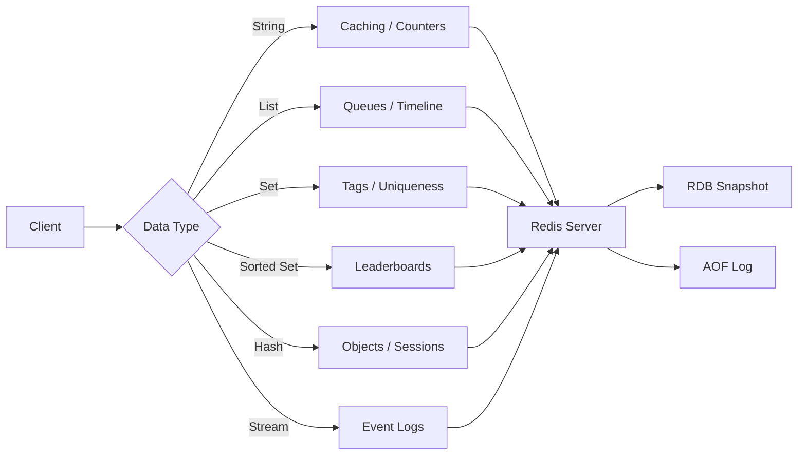

# Chapter 16:

> **Prev:** [Chapter 15mongodb](15-mongodb.md) | **Next:** [Chapter 17distributed-db](17-distributed-db.md) Redis

## Learning Objectives

- Understand Redis's in-memory, key-value architecture
- Work with Redis data types: strings, lists, sets, sorted sets, hashes, streams
- Implement caching patterns: TTL, cache-aside, rate limiting
- Configure persistence: RDB snapshots and AOF logs
- Set up replication and clustering for availability and scaling
- Use Redis for real-world use cases: sessions, queues, leaderboards

## Chapter at a Glance

| Topic | Key Insight | Practical Takeaway |
|-------|-------------|-------------------|
| **In-Memory Storage** | All data in RAM, disk for persistence only | Monitor memory usage — Redis performance drops sharply when data exceeds RAM |
| **Data Structures** | Strings, Lists, Sets, Hashes, Sorted Sets, Streams | Choose the structure that matches your access pattern |
| **Persistence** | RDB (snapshot) + AOF (append-only log) | Use both: RDB for recovery, AOF for durability |
| **Pub/Sub** | Real-time message broadcasting to channels | Ideal for chat, notifications, and live updates |
| **Replication & Sentinel** | Primary-replica with automatic failover | Sentinel provides HA: 3 nodes recommended |
| **Redis Cluster** | Automatic sharding across 16384 hash slots | Minimum 3 master nodes for production deployment |

## Chapter Roadmap




## Theory


### 16.1 Redis Overview

Redis (Remote Dictionary Server) is an **in-memory data structure store** often used as a cache, message broker, and database. Created by Salvatore Sanfilippo in 2009.

**Core Characteristics:**
- **In-memory:** All data resides in RAM (microsecond latency)
- **Single-threaded event loop:** Operations are atomic and serialized
- **Persistence optional:** Can persist to disk (RDB/AOF) or be purely ephemeral
- **Rich data types:** Beyond simple key-value — strings, lists, sets, sorted sets, hashes, bitmaps, hyperloglogs, streams, geospatial
- **Client-server protocol:** RESP (REdis Serialization Protocol) — simple, human-readable

**When to use Redis:**
- Caching (reducing database load)
- Session storage
- Real-time analytics, counters, rate limiters
- Message queues and pub/sub
- Leaderboards and ranking systems
- Distributed locks

**When NOT to use Redis:**
- Primary data store for critical data (RDBMS is safer)
- Complex queries or joins
- Data larger than available RAM (in-memory limitation)
- ACID transactions across multiple keys (limited multi-key transactions)


> **One-Sentence Takeaway:** Redis keeps all data in memory for sub-millisecond latency, with optional disk persistence for recovery.

### 16.2 Data Types and Commands


> **One-Sentence Takeaway:** Redis supports multiple data structures — strings, lists, sets, hashes, sorted sets, bitmaps, and streams.

#### 16.2.1 Strings

The most basic type. A value can be a string, number, binary data, or JSON.

```bash
# Basic operations
SET user:1:name "Alice"
SET user:1:email "alice@example.com"
GET user:1:name
# "Alice"

# Check existence
EXISTS user:1:name   # (integer) 1
EXISTS user:1:phone  # (integer) 0

# Delete
DEL user:1:phone

# Numeric operations
SET counter 100
INCR counter        # 101
INCRBY counter 50   # 151
DECR counter        # 150
DECRBY counter 10   # 140

# Expiration (TTL)
SET session:abc123 "user_data" EX 3600  # Expire in 1 hour
TTL session:abc123   # Time remaining in seconds
EXPIRE session:abc123 7200  # Extend TTL

# Batch operations
MSET user:1:name "Alice" user:1:email "alice@example.com"
MGET user:1:name user:1:email
# 1) "Alice"
# 2) "alice@example.com"

# SET with conditions
SET user:1:email "new@example.com" NX  # Set only if key doesn't exist
SET user:1:email "new@example.com" XX  # Set only if key exists
```

#### 16.2.2 Lists

Ordered sequences of strings. Implemented as linked lists — fast head/tail operations, slow random access by index.

```bash
# Add elements (left/right)
LPUSH queue:notifications "user1_liked"
LPUSH queue:notifications "user2_commented"
RPUSH queue:notifications "user3_followed"

# Remove and get elements
LPOP queue:notifications  # Left pop: "user3_followed"
RPOP queue:notifications  # Right pop: "user1_liked"

# Range queries
LRANGE queue:notifications 0 -1  # All elements

# Trim to length
LTRIM queue:notifications 0 99  # Keep only first 100

// Use as a queue (FIFO):
// Producer: RPUSH queue task
// Consumer: LPOP queue (blocking: BLPOP)
```

**Blocking operations:**

```bash
# Blocking pop (wait up to 30 seconds for an element)
BRPOP queue:notifications 30
BLPOP queue:notifications 30
```

#### 16.2.3 Sets

Unordered collections of unique strings. Fast membership checks.

```bash
# Add members
SADD user:1:interests "hiking"
SADD user:1:interests "reading" "photography" "hiking"

# Check membership
SISMEMBER user:1:interests "hiking"    # 1 (true)
SISMEMBER user:1:interests "swimming"  # 0 (false)

# Get all members
SMEMBERS user:1:interests

# Set operations (critical for real-time features)
SADD group:devs "alice" "bob" "carol"
SADD group:managers "carol" "dave"

# Union (all unique members)
SUNION group:devs group:managers
# "alice", "bob", "carol", "dave"

# Intersection (members in both)
SINTER group:devs group:managers
# "carol"

# Difference (members in first but not second)
SDIFF group:devs group:managers
# "alice", "bob"

# Count members
SCARD user:1:interests  # 3
```

#### 16.2.4 Sorted Sets

Sets with a score for each member. Ordered by score — critical for leaderboards.

```bash
# Add members with scores
ZADD leaderboard:week1 1500 "alice"
ZADD leaderboard:week1 2200 "bob"
ZADD leaderboard:week1 1800 "carol"
ZADD leaderboard:week1 950 "dave"

# Get rank (0-based, ascending)
ZRANK leaderboard:week1 "alice"   # 2 (3rd place)

# Get rank with scores (descending)
ZREVRANK leaderboard:week1 "alice"  # 1 (2nd from top)
ZREVRANK leaderboard:week1 "bob"    # 0 (top)

# Get top players
ZREVRANGE leaderboard:week1 0 2 WITHSCORES
# 1) "bob" -> 2200
# 2) "carol" -> 1800
# 3) "alice" -> 1500

// Increment score (update)
ZINCRBY leaderboard:week1 300 "alice"
// alice now has 1800

// Get score
ZSCORE leaderboard:week1 "alice"  // 1800

// Range by score
ZRANGEBYSCORE leaderboard:week1 1500 2000 WITHSCORES

// Count members in score range
ZCOUNT leaderboard:week1 1000 2000  // 2

// Remove
ZREM leaderboard:week1 "dave"
```

#### 16.2.5 Hashes

Maps of field-value pairs (like a mini-document). Ideal for objects.

```bash
# Set fields
HSET user:1001 name "Alice Chen"
HSET user:1001 email "alice@example.com"
HSET user:1001 age 28

# Set multiple fields
HMSET user:1002 name "Bob" email "bob@example.com" age 35

# Get fields
HGET user:1001 name
# "Alice Chen"

HGETALL user:1001
# 1) "name" -> "Alice Chen"
# 2) "email" -> "alice@example.com"
# 3) "age" -> 28

# Get multiple fields
HMGET user:1001 name email

# Check field
HEXISTS user:1001 phone  # 0

# Increment field
HINCRBY user:1001 login_count 1

# Get all fields or values
HKEYS user:1001
HVALS user:1001

// Hash vs. string: Prefer hashes for objects with multiple fields.
// Use hashes to avoid key explosion (e.g., user:1001:name, user:1001:email).
```

#### 16.2.6 Streams

Append-only log data structure (added in Redis 5.0). Similar to Kafka topics.

```bash
# Add entry to stream
XADD sensor:temp * sensor_id "s1" temperature 22.5 humidity 55
XADD sensor:temp * sensor_id "s2" temperature 23.1 humidity 52

# Read stream (starting from beginning)
XRANGE sensor:temp - +

# Read new entries (blocking)
XREAD BLOCK 0 STREAMS sensor:temp $

# Consumer groups (multiple consumers share work)
XGROUP CREATE sensor:temp group1 $
XREADGROUP GROUP group1 consumer1 COUNT 10 STREAMS sensor:temp >

// Use cases: event sourcing, message queues, activity feeds
```

#### 16.2.7 Other Types

```bash
# Bitmaps (compact boolean arrays)
SETBIT user:active:2026-01 100 1   # User 100 active on Jan
GETBIT user:active:2026-01 100     # 1
BITCOUNT user:active:2026-01       # Count active users

# HyperLogLog (approximate cardinality, ~0.81% error)
PFADD daily:visitors:2026-01-01 "ip1" "ip2" "ip3"
PFCOUNT daily:visitors:2026-01-01  # ~3

# Geospatial (latitude/longitude)
GEOADD locations 13.361389 38.115556 "Palermo"
GEODIST locations "Palermo" "Catania" km
```

### 16.3 Transactions

Redis transactions batch commands for atomic execution:

```bash
MULTI              # Start transaction
SET balance 100
DECRBY balance 50
SET last_withdrawal "50"
EXEC               # Execute all commands atomically

# Discard (rollback)
MULTI
SET key1 "value"
DISCARD  # Cancel transaction
```

**Note:** Unlike SQL transactions, Redis transactions provide no rollback. If a command fails, subsequent commands still execute. `MULTI`/`EXEC` guarantees atomicity and isolation but not rollback.

**Optimistic locking with WATCH:**

```bash
WATCH balance           # Watch for changes
val = GET balance       # e.g., 100
MULTI
DECRBY balance 50        # New value: 50
EXEC                    # Fails if "balance" changed since WATCH
```


> **One-Sentence Takeaway:** RDB snapshots provide point-in-time recovery; AOF logs provide durability with second-level granularity.

### 16.4 Caching Patterns

**1. Cache-Aside (Lazy Loading):**

```python
def get_user(user_id):
    # Try cache first
    user = redis.get(f"user:{user_id}")
    if user:
        return deserialize(user)

    # Cache miss — load from database
    user = db.query("SELECT * FROM users WHERE id = ?", user_id)

    # Store in cache with TTL
    redis.setex(f"user:{user_id}", 3600, serialize(user))
    return user
```

**2. Write-Through:**

```python
def update_user(user_id, data):
    # Always update database first
    db.execute("UPDATE users SET ... WHERE id = ?", data, user_id)
    # Then update cache
    redis.setex(f"user:{user_id}", 3600, serialize(data))
```

**3. Write-Behind (Async):**

```python
# Write to cache immediately, defer database write
def update_user_async(user_id, data):
    redis.setex(f"user:{user_id}", 3600, serialize(data))
    # Enqueue async job to write to DB
    redis.lpush("db:write:queue", json.dumps({"user_id": user_id, "data": data}))
```

**4. Rate Limiting (Sliding Window):**

```python
def is_rate_limited(user_id, limit=100, window_seconds=60):
    key = f"ratelimit:{user_id}"
    pipe = redis.pipeline()
    now = int(time.time())
    window_start = now - window_seconds

    # Remove old entries outside the window
    pipe.zremrangebyscore(key, 0, window_start)
    # Count current entries
    pipe.zcard(key)
    # Add current request
    pipe.zadd(key, {now: now})
    # Set TTL for cleanup
    pipe.expire(key, window_seconds)
    _, count, _, _ = pipe.execute()

    return count > limit
```

**5. Distributed Lock (Redlock):**

```python
# Acquire lock
lock_key = f"lock:resource:{resource_id}"
locked = redis.set(lock_key, "locked", nx=True, px=10000)  # 10s TTL

if locked:
    try:
        # Critical section
        process_resource(resource_id)
    finally:
        redis.delete(lock_key)
else:
    raise Exception("Resource locked, try again")
```


> **One-Sentence Takeaway:** Redis Pub/Sub enables real-time message broadcasting without message persistence or replay.

### 16.5 Persistence

**RDB (Redis Database file):** Point-in-time snapshots.

```
# Configuration (redis.conf)
save 900 1       # Snapshot if at least 1 key changed in 900 seconds
save 300 10      # Snapshot if at least 10 keys changed in 300 seconds
save 60 10000    # Snapshot if at least 10000 keys changed in 60 seconds
```

- **Pros:** Compact file, fast recovery, good for backups
- **Cons:** Potential data loss (last few minutes of writes)

**AOF (Append-Only File):** Logs every write operation.

```
# Configuration
appendonly yes
appendfsync everysec   # fsync every second (good balance)
# appendfsync always   # Every write (safest, slowest)
# appendfsync no       # OS handles (fastest, least safe)
```

- **Pros:** Minimal data loss (1 second with everysec), human-readable
- **Cons:** Larger file than RDB, slower recovery

**Hybrid (Redis 6.2+):** Combines RDB + AOF for the best of both.


> **One-Sentence Takeaway:** Redis Sentinel provides high availability through automatic failover and client notification.

### 16.6 Replication and High Availability

**Master-Replica Replication:**

```
Master (read/write)
  │
  ├── Replica 1 (read-only)
  │
  └── Replica 2 (read-only)
```

```bash
# Replica connects to master
REPLICAOF redis-master 6379
```

**Sentinel (High Availability):**

```
┌────────────┐      ┌────────────┐      ┌────────────┐
│ Sentinel 1  │      │ Sentinel 2  │      │ Sentinel 3  │
└──────┬──────┘      └──────┬──────┘      └──────┬──────┘
       │                    │                    │
       └────────────────────┼────────────────────┘
                            │
                      ┌─────┴──────┐
                      │   Master    │  ← Failover if master dies
                      │  (primary)  │      (promote replica)
                      └────────────┘
```


> **One-Sentence Takeaway:** Redis Cluster automatically shards data across 16384 hash slots with partial support for multi-key operations.

### 16.7 Redis Cluster

Automatic sharding across multiple Redis nodes.

```
                    Client
                      │
                      â–¼
              ┌───────────────┐
              │  Redis Cluster │
              │  (16384 slots) │
              └───────┬───────┘
                      │
          ┌───────────┼───────────┐
          │           │           │
          â–¼           â–¼           â–¼
    ┌──────────┐ ┌──────────┐ ┌──────────┐
    │ Node 1    │ │ Node 2    │ │ Node 3    │
    │ slots     │ │ slots     │ │ slots     │
    │ 0-5460   │ │ 5461-10921│ │ 10922-16383│
    │ +replica  │ │ +replica  │ │ +replica  │
    └──────────┘ └──────────┘ └──────────┘
```

- **16384 hash slots** total; each key is hashed to a slot
- Automatic failover (each node has replicas)
- No single point of failure
- **Limitation:** Multi-key operations only work if keys share the same slot

> **One-Sentence Takeaway:** Redis Cluster provides automatic sharding across multiple nodes with master-replica replication and partial failure tolerance.


### 16.8 Memory Management

```bash
> **One-Sentence Takeaway:** Redis memory management uses LRU eviction policies, key expiration, and memory-max configuration to prevent out-of-memory crashes.


# View memory stats
INFO memory
# used_memory: 1048576
# maxmemory: 1073741824  (1GB)

# Set max memory
CONFIG SET maxmemory 1gb

# Eviction policies (when maxmemory is reached):
# noeviction:       Return errors on writes
# allkeys-lru:      Evict least recently used keys
# volatile-lru:     Evict LRU among keys with TTL
# allkeys-lfu:      Evict least frequently used keys
# volatile-lfu:     Evict LFU among keys with TTL
# allkeys-random:   Evict random keys
# volatile-random:  Evict random keys with TTL
# volatile-ttl:     Evict keys with nearest TTL

# View keys with high memory usage
MEMORY USAGE user:1001
MEMORY STATS
```

## Examples

**Example 16.1: Session Store**

```python
import redis
import json
import uuid

r = redis.Redis(host='localhost', port=6379, decode_responses=True)

# Create session
session_id = str(uuid.uuid4())
session_data = {
    "user_id": 1001,
    "username": "alice",
    "role": "admin",
    "ip": "192.168.1.100",
    "login_time": "2026-01-15T10:30:00Z"
}
r.hset(f"session:{session_id}", mapping=session_data)
r.expire(f"session:{session_id}", 3600)  # 1 hour

# Verify session
if r.exists(f"session:{session_id}"):
    session = r.hgetall(f"session:{session_id}")
    print(f"Welcome {session['username']}")
else:
    print("Session expired")

# Extend session on activity
r.expire(f"session:{session_id}", 3600)  # Refresh TTL
```

**Example 16.2: Real-Time Leaderboard**

```python
import redis
import random

r = redis.Redis(decode_responses=True)

# Record game scores
for player_id in range(1, 1001):
    score = random.randint(0, 10000)
    r.zadd("leaderboard:global", {f"player:{player_id}": score})

# Get top 10
top = r.zrevrange("leaderboard:global", 0, 9, withscores=True)
for rank, (player, score) in enumerate(top, 1):
    print(f"#{rank} {player}: {score}")

# Get player rank and nearby competitors
rank = r.zrevrank("leaderboard:global", "player:500")
score = r.zscore("leaderboard:global", "player:500")
print(f"player:500 is #{rank + 1} with score {score}")

# Get players around me
neighbors = r.zrevrange("leaderboard:global", max(rank-3, 0), rank+3, withscores=True)
```

**Example 16.3: Message Queue**

```python
import redis
import json
import time
import threading

r = redis.Redis(decode_responses=True)
QUEUE = "task:queue"

# Producer
def enqueue_task(task_type, payload):
    task = {"type": task_type, "payload": payload, "created_at": time.time()}
    r.lpush(QUEUE, json.dumps(task))

# Consumer (blocking)
def worker(worker_id):
    while True:
        _, task_json = r.brpop(QUEUE, timeout=0)  # Block indefinitely
        task = json.loads(task_json)
        print(f"Worker {worker_id} processing: {task['type']}")
        time.sleep(1)  # Simulate work
        print(f"Worker {worker_id} done")

# Start workers
for i in range(3):
    threading.Thread(target=worker, args=(i,), daemon=True).start()

# Produce tasks
for i in range(10):
    enqueue_task("email", {"to": f"user{i}@example.com", "template": "welcome"})
```

## 💡 Pro Tips

1. **Use hashes instead of plain keys for objects** — `user:1001:name`, `user:1001:email` causes key explosion. Use `HSET user:1001 name "Alice" email "alice@example.com"` instead.
2. **Always set TTL for cache data** — without expiration, unused keys waste memory forever. Redis eviction policies are a safety net, not a strategy.
3. **SCAN is your production friend, not KEYS** — `KEYS *` blocks Redis for potentially seconds on large datasets. `SCAN` with cursor-based iteration is non-blocking.
4. **Sorted sets are Redis's superpower** — leaderboards, rate limiters, priority queues, and time-series queries all benefit from the O(log n) insertion + O(log n+ m) range query.
5. **Be careful with large keys/values** — a single key larger than 10MB can block replication and slow down the entire instance. Consider compression or splitting.

## One-Sentence Takeaways

- **16.1:** Redis is an in-memory data structure store offering sub-millisecond latency for strings, lists, sets, sorted sets, hashes, and streams.
- **16.2:** Each data type has specialized commands optimized for its structure — LPUSH/RPOP for queues, ZADD/ZRANGE for leaderboards, HSET/HGET for objects.
- **16.3:** Pipelining and transactions batch multiple commands to reduce round-trip latency.
- **16.4:** Pub/Sub enables real-time messaging between publishers and subscribers.
- **16.5:** Persistence options — RDB (point-in-time snapshots) and AOF (append-only log) — offer different durability vs. performance trade-offs.
- **16.6:** Redis replication provides read scaling; Sentinel provides automatic failover.
- **16.7:** Redis Cluster provides automatic sharding across multiple nodes for horizontal scaling.
- **16.8:** Common patterns include caching, rate limiting, distributed locks, leaderboards, and message queues.

## Concept Comparison Table

| Data Type | Internal Structure | Use Case | Key Commands |
|-----------|------------------|----------|-------------|
| **String** | Byte array | Caching, counters, sessions | SET, GET, INCR, DECR, MSET |
| **List** | Linked list | Queue, stack, timeline | LPUSH, RPUSH, LPOP, BRPOP, LRANGE |
| **Set** | Hash table | Tags, uniqueness, intersections | SADD, SREM, SISMEMBER, SUNION, SINTER |
| **Sorted Set** | Skip list + hash table | Leaderboards, rate limiters | ZADD, ZRANGE, ZRANK, ZINCBY, ZREM |
| **Hash** | Hash table | Objects, field-level access | HSET, HGET, HGETALL, HINCRBY |
| **Stream** | Radix tree | Event log, message queue | XADD, XREAD, XRANGE, XGROUP |

| Persistence | Durability | Performance Impact | Restore Speed |
|------------|-----------|-------------------|---------------|
| **None** | None (cache only) | Best | Instant (empty) |
| **RDB (snapshot)** | Point-in-time (lose last N min) | Moderate (fork on save) | Fast (load single file) |
| **AOF (append log)** | Configurable (always/every sec) | Slower writes | Slower (replay all commands) |
| **RDB + AOF** | Best (both) | Highest | Depends on size |

## Quick Reference

| Redis Pattern | Implementation | Use Case |
|--------------|---------------|----------|
| **Cache-aside** | Check cache → miss → query DB → set cache | Read-heavy workloads |
| **Rate Limiting** | INCR + EXPIRE per user/timestamp window | API rate limiting |
| **Distributed Lock** | SET key uuid NX EX 10 → DEL if matches | Mutual exclusion across nodes |
| **Leaderboard** | ZINCBY scores → ZRANGE | Gaming, contests |
| **Message Queue** | LPUSH + BRPOP / XADD + XREADGROUP | Async job processing |
| **Session Store** | SET with TTL | Web app sessions |
| **Pub/Sub** | PUBLISH → SUBSCRIBE | Real-time notifications |

## Cross-Application Matrix

| Redis Feature | Applied In | Why It Matters |
|--------------|-----------|----------------|
| **String + TTL** | HTTP caching, API response cache | Sub-millisecond cache hits reduce DB load |
| **Sorted Sets** | Gaming leaderboards | O(log n) score updates, O(log n + m) range queries |
| **Lists + BRPOP** | Job queues (Sidekiq, Celery) | Reliable task distribution with blocking pop |
| **Streams** | Event sourcing, activity feeds | Persistent, consumer-group-aware message bus |
| **Hashes** | User profiles, session data | Efficient field-level reads/writes with TTL |
| **SETNX (Lock)** | Distributed rate limiting | Prevents race conditions in multi-server deployments |
| **Pub/Sub** | Live dashboards, chat | Real-time push without polling |

## Chapter Quiz

1. Which Redis data type is best for implementing a leaderboard?
   a) List
   b) Set
   c) Sorted Set
   d) Hash

2. The command SCAN should be preferred over KEYS because:
   a) SCAN is non-blocking
   b) SCAN returns more results
   c) KEYS is deprecated
   d) SCAN requires fewer arguments

3. Which persistence option provides the best durability?
   a) No persistence
   b) RDB only
   c) AOF with fsync every second
   d) AOF with fsync always

4. The cache-aside pattern works as follows:
   a) Write to cache first, then DB
   b) Check cache → miss → query DB → store in cache
   c) Always write to DB and cache simultaneously
   d) Only use cache, never query the DB

5. Redis is primarily designed for:
   a) Long-term archival storage
   b) In-memory workloads with sub-millisecond latency
   c) Complex relational queries
   d) Document storage with aggregation

6. Which command atomically increments a counter?
   a) SET counter 0 then counter = counter + 1
   b) INCR counter
   c) ADD counter 1
   d) UPDATE counter

7. Redis Cluster provides:
   a) Automatic failover only
   b) Automatic sharding across nodes
   c) SQL compatibility
   d) Cross-database joins

8. A Redis distributed lock uses SET with which flags?
   a) SET key value NX EX seconds
   b) SET key value XX PX milliseconds
   c) SET key value GET
   d) SET key value KEEPTTL

**Answers:** 1-c, 2-a, 3-d, 4-b, 5-b, 6-b, 7-b, 8-a

## Summary

- Redis is an in-memory data structure store with sub-millisecond latency.
- Key data types: strings (caching, counters), lists (queues), sets (tagging), sorted sets (leaderboards), hashes (objects), streams (event logs).
- Use `EXPIRE` / `TTL` for automatic cache invalidation.
- Persistence: RDB (snapshots) vs. AOF (append-only log) vs. hybrid.
- Replication provides read scaling; Sentinel provides automatic failover.
- Redis Cluster provides automatic sharding across nodes.
- Common patterns: cache-aside, rate limiting, distributed locks, pub/sub.

## Exercises

### Basic

1. Connect to a Redis instance and perform: SET a key, GET the value, INCR a counter.

2. Use a Redis list to implement a simple FIFO queue. Push three items, then pop them in order.

3. Create a sorted set representing a quiz leaderboard. Add five players with scores. Retrieve the top 3 in descending order.

4. Set a key with 10-second TTL. Verify it expires by checking with GET after 12 seconds.

### Intermediate

5. Implement a rate limiter in Python/Node.js that allows 100 requests per minute per IP address. Use Redis sorted sets for a sliding window approach.

6. Design a session store using Redis hashes. Each session should store user_id, login_time, last_access, and expire after 30 minutes of inactivity. Show the operations to create, read, and extend a session.

7. Compare RDB and AOF persistence. Under what conditions would you choose each? What is the impact on performance and data safety?

8. Using Redis streams and consumer groups, implement a task processing system where:
   - Producers add tasks to a stream
   - Multiple consumers process tasks from consumer groups
   - Unacknowledged tasks are redelivered after 60 seconds

### Advanced

9. Design a leaderboard system that supports:
   - Global rankings by score
   - Weekly and daily rankings (separate keys)
   - Tie-breaking (earliest player wins ties — hint: use fractional scores)
   - Efficient top-N retrieval
   - A player's rank and nearby competitors
   Show the exact Redis data structures and commands.

10. Redis Cluster has a limitation: multi-key operations only work if all keys hash to the same slot. Design a solution for storing and querying user sessions where you need to batch-delete all sessions for a user across multiple cluster nodes.

11. Implement a distributed lock using Redis that handles:
   - Mutual exclusion (only one process holds the lock at a time)
   - Deadlock protection (TTL on the lock key)
   - Lock reentrancy (same process can re-acquire)
   - Fencing tokens (version-based protection against delayed GC pauses)
   Compare this with the Redlock algorithm. When would you prefer one over the other?
