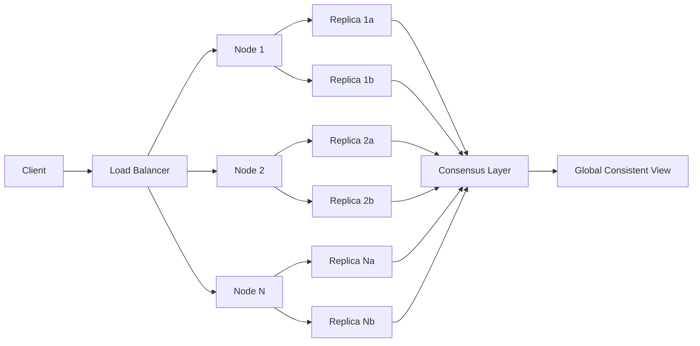
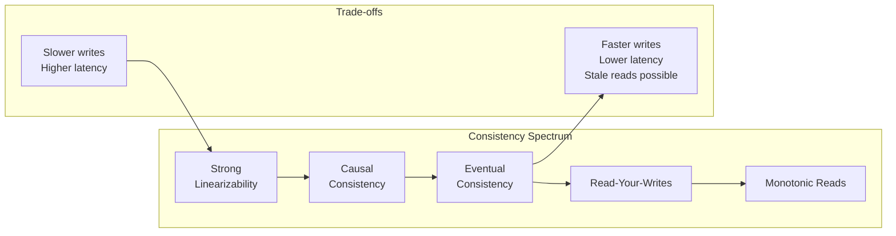

# Chapter 17: Distributed Database Systems

> **Prev:** [Chapter 16 → Redis](16-redis.md) | **Next:** [Chapter 18 → Security](18-security.md)

## Learning Objectives

- Understand distributed database architecture and design goals
- Explain data fragmentation (horizontal, vertical, hybrid) and replication (full, partial) strategies
- Compare distributed query processing techniques with semi-join optimization
- Implement distributed transactions using 2PC and 3PC protocols
- Analyze transparency types (location, fragmentation, replication, failure)
- Differentiate homogeneous vs heterogeneous distributed databases
- Evaluate CAP theorem trade-offs and consistency models in practice
- Understand real-world systems (Spanner, DynamoDB, Cassandra, CockroachDB)

## Chapter at a Glance

| Topic | Key Insight | Practical Takeaway |
|-------|-------------|-------------------|
| **Distributed DB Overview** | Logically related DBs across a network appear as one system | Design for failure → any node can go down at any time |
| **Data Fragmentation** | Split data by rows (horizontal), columns (vertical), or both (hybrid) | Choose fragmentation based on query access patterns |
| **Data Replication** | Full copy vs subset copy across nodes | Full replication → fast reads, slow writes; partial → balanced |
| **Transparency** | Hide distribution details from users | Users write queries without knowing where data lives |
| **2PC / 3PC** | Two-phase and three-phase commit for distributed transactions | 2PC blocks on coordinator failure; 3PC is non-blocking but slower |
| **Query Processing** | Decompose global queries into site-local sub-queries | Semi-joins minimize network data transfer |
| **Homogeneous vs Heterogeneous** | Same DBMS everywhere vs different DBMS at each site | Heterogeneous adds translation complexity |
| **CAP Theorem** | Consistency vs Availability during partitions | Choose CP or AP based on business requirements |
| **Real Systems** | Spanner (TrueTime+Paxos), DynamoDB (AP), Cassandra (AP), CockroachDB (Spanner-like) | Each makes different CAP trade-offs |

## Chapter Roadmap



---

## Theory


### 17.1 Distributed Database Concepts

<a href="../../../assets/images/diagrams/database-management-systems/17-distributed-db/17-1-distributed-database-concepts-handwritten.svg" target="_blank" rel="noopener">
  
</a>
<a href="../../../assets/images/diagrams/database-management-systems/17-distributed-db/17-1-distributed-database-concepts-diagram.svg" target="_blank" rel="noopener">
  
</a>
<a href="../../../assets/images/diagrams/database-management-systems/17-distributed-db/17-1-distributed-database-concepts-sticky.svg" target="_blank" rel="noopener">
  
</a>


A **distributed database** is a collection of logically related databases distributed across a computer network, appearing as a single system to the user.

#### Real-World Analogy: Retail Chain Branches

Imagine a retail chain with stores in New York, London, and Tokyo. Each store has its own local inventory database containing products specific to that region. However, the corporate headquarters treats all stores as a single unified inventory system:

- **New York store**: Sells winter coats and local merchandise (stores rows where region = 'NA')
- **London store**: Sells different inventory suitable for European customers
- **Tokyo store**: Sells electronics and local goods for Asian market
- **Headquarters**: Runs global queries like "total revenue across all stores" without caring where each sale was recorded

This is exactly how a distributed database works → each node (store) has autonomy over its local data, but from the user's perspective it appears as one logical database.

#### Key Properties (Date's 12 Rules for DDBMS)

| # | Rule | Description | Real-World Parallel |
|---|------|-------------|-------------------|
| 1 | **Local autonomy** | Each site operates independently | Each store manages its own stock |
| 2 | **No central reliance** | No single point of failure | No HQ doesn't mean stores stop |
| 3 | **Continuous operation** | No planned downtime for changes | Stores stay open during system updates |
| 4 | **Location transparency** | Users don't need to know where data resides | Customer doesn't care which warehouse has the item |
| 5 | **Fragmentation transparency** | Users see logical tables, not fragments | Customer sees one product catalog |
| 6 | **Replication transparency** | Users don't know about copies | Customer doesn't know backup locations |
| 7 | **Distributed query processing** | Queries span sites transparently | HQ aggregates all store data seamlessly |
| 8 | **Distributed transaction mgmt** | ACID across sites | Transferring stock between stores is atomic |
| 9 | **Hardware independence** | Runs on heterogeneous hardware | Different POS systems at each store |
| 10 | **OS independence** | Runs on different OS | Windows at one store, Linux at another |
| 11 | **Network independence** | Works across different protocols | Different ISPs per location |
| 12 | **DBMS independence** | Works with different DB vendors | Oracle at one site, PostgreSQL at another |

#### Advantages & Challenges

| Aspect | Advantage | Challenge |
|--------|-----------|-----------|
| **Reliability** | No single point of failure | More components = more things that can fail |
| **Scalability** | Add nodes horizontally | Data redistribution is complex |
| **Performance** | Data closer to users | Network latency for cross-node queries |
| **Modularity** | Incremental expansion | Schema changes must propagate |
| **Cost** | Use commodity hardware | Network infrastructure costs |
| **Autonomy** | Local control at each site | Global consistency requires coordination |

#### Advantages & Disadvantages Table

| Dimension | Benefit | Drawback |
|-----------|---------|----------|
| **Availability** | System continues if one node fails | Partition handling adds complexity |
| **Response time** | Local data access is fast | Distributed joins are slow |
| **Throughput** | Parallel processing across nodes | Coordination overhead limits gains |
| **Data freshness** | Local updates are immediate | Replica lag causes stale reads |
| **Management** | Decentralized admin | Global schema management is hard |
| **Security** | No single breach point | More attack surfaces; cross-node auth |

---

### 17.2 Data Fragmentation

<a href="../../../assets/images/diagrams/database-management-systems/17-distributed-db/17-2-data-fragmentation-handwritten.svg" target="_blank" rel="noopener">
  
</a>
<a href="../../../assets/images/diagrams/database-management-systems/17-distributed-db/17-2-data-fragmentation-diagram.svg" target="_blank" rel="noopener">
  
</a>
<a href="../../../assets/images/diagrams/database-management-systems/17-distributed-db/17-2-data-fragmentation-sticky.svg" target="_blank" rel="noopener">
  
</a>


Fragmentation splits a table into smaller pieces (fragments) stored at different sites. The goal is to place data physically close to where it's most frequently accessed.

#### Real-World Analogy: Department Store Layout

A department store doesn't put all items in one pile. Instead:
- **Horizontal fragmentation**: Each section (Menswear, Womenswear, Electronics) has its own rack with a subset of products (rows)
- **Vertical fragmentation**: Customer information is split → basic info (name, email) at the checkout counter, sensitive info (credit card, SSN) in the secure back office
- **Hybrid fragmentation**: Electronics section further splits TVs and laptops into sub-sections, and within each, only publicly visible specs vs internal pricing

#### Horizontal Fragmentation

Splits a table by rows → each fragment contains a subset of tuples based on a selection condition.

**Real-World Analogy**: A global hotel chain stores booking records for each region at the regional headquarters. North American bookings stay in New York, European bookings in London, Asian bookings in Singapore.

**Numbered Steps**:
1. Identify the fragmentation attribute (e.g., region, dept_id)
2. Define partitioning predicate for each fragment (e.g., region = 'NA', region = 'EU')
3. Apply selection operation (σ) to create each fragment
4. Assign each fragment to a site based on access patterns
5. Create a fragmentation schema mapping each row to its home site

**Pseudocode**:
```
PROCEDURE horizontal_fragmentation(table, attribute, partition_map)
    // partition_map: {site_id: predicate}
    fragments = {}
    FOR EACH (site_id, predicate) IN partition_map:
        fragment = SELECT * FROM table WHERE predicate
        fragments[site_id] = fragment
        SEND fragment TO site_id
    END FOR
    // Maintain global catalog with fragmentation metadata
    UPDATE catalog SET fragmentation_type = 'HORIZONTAL',
                        attribute = attribute,
                        partition_rules = partition_map
    RETURN fragments
END PROCEDURE
```

**Dry Run Trace: Horizontal Fragmentation**

Input table `employees`:

| id | name | dept | salary |
|----|------|------|--------|
| 1 | Alice | Sales | 60000 |
| 2 | Bob | Sales | 55000 |
| 3 | Carol | Eng | 80000 |
| 4 | Dave | Eng | 75000 |
| 5 | Eve | Sales | 62000 |
| 6 | Frank | Eng | 90000 |

Partition rule: `dept = 'Sales'` → Site 1, `dept = 'Eng'` → Site 2

| Step | Action | Fragment Size | Destination |
|------|--------|---------------|-------------|
| 1 | Read table employees | 6 rows | → |
| 2 | Evaluate σ(dept='Sales') | 3 rows (id:1,2,5) | Site 1 |
| 3 | Evaluate σ(dept='Eng') | 3 rows (id:3,4,6) | Site 2 |
| 4 | Transfer fragment to Site 1 | 3 rows | Site 1 |
| 5 | Transfer fragment to Site 2 | 3 rows | Site 2 |
| 6 | Update global catalog | → | Catalog server |

Result at Site 1 (Sales):

| id | name | dept | salary |
|----|------|------|--------|
| 1 | Alice | Sales | 60000 |
| 2 | Bob | Sales | 55000 |
| 5 | Eve | Sales | 62000 |

Result at Site 2 (Engineering):

| id | name | dept | salary |
|----|------|------|--------|
| 3 | Carol | Eng | 80000 |
| 4 | Dave | Eng | 75000 |
| 6 | Frank | Eng | 90000 |

**SQL Implementation**:
```sql
-- Horizontal fragmentation rule definition
CREATE VIEW emp_sales AS
    SELECT * FROM employees WHERE dept = 'Sales';
CREATE VIEW emp_eng AS
    SELECT * FROM employees WHERE dept = 'Eng';

-- Each view can be mapped to a different physical site
-- Site 1: emp_sales, Site 2: emp_eng
```

**C++ Implementation**:
```cpp
#include <iostream>
#include <vector>
#include <string>
#include <map>
#include <functional>

struct Employee {
    int id;
    std::string name;
    std::string dept;
    double salary;
};

class HorizontalFragmenter {
private:
    std::vector<Employee> table;
    std::map<std::string, std::vector<Employee>> fragments;

public:
    HorizontalFragmenter(const std::vector<Employee>& data) : table(data) {}

    std::map<std::string, std::vector<Employee>> fragment(
        const std::string& attr,
        const std::map<std::string, std::function<bool(const Employee&)>>& predicates) {

        for (const auto& emp : table) {
            for (const auto& [site, pred] : predicates) {
                if (pred(emp)) {
                    fragments[site].push_back(emp);
                    break;
                }
            }
        }

        std::cout << "Horizontal fragmentation complete. "
                  << fragments.size() << " fragments created.\n";
        for (const auto& [site, frag] : fragments) {
            std::cout << "  Site " << site << ": " << frag.size() << " rows\n";
        }
        return fragments;
    }
};

int main() {
    std::vector<Employee> data = {
        {1, "Alice", "Sales", 60000},
        {2, "Bob", "Sales", 55000},
        {3, "Carol", "Eng", 80000},
        {4, "Dave", "Eng", 75000},
        {5, "Eve", "Sales", 62000}
    };

    HorizontalFragmenter hf(data);
    std::map<std::string, std::function<bool(const Employee&)>> preds;
    preds["Site1"] = [](const Employee& e) { return e.dept == "Sales"; };
    preds["Site2"] = [](const Employee& e) { return e.dept == "Eng"; };
    hf.fragment("dept", preds);

    return 0;
}
```

**Python Implementation**:
```python
from typing import List, Dict, Callable, Any

class HorizontalFragmenter:
    def __init__(self, table: List[Dict[str, Any]]):
        self.table = table
        self.fragments: Dict[str, List[Dict[str, Any]]] = {}

    def fragment(self, attr: str,
                 predicates: Dict[str, Callable[[Dict[str, Any]], bool]]) -> Dict[str, List[Dict[str, Any]]]:
        for row in self.table:
            for site_id, predicate in predicates.items():
                if predicate(row):
                    if site_id not in self.fragments:
                        self.fragments[site_id] = []
                    self.fragments[site_id].append(row)
                    break
        for site_id, frag in self.fragments.items():
            print(f"  Site {site_id}: {len(frag)} rows")
        return self.fragments


if __name__ == "__main__":
    data = [
        {"id": 1, "name": "Alice", "dept": "Sales", "salary": 60000},
        {"id": 2, "name": "Bob", "dept": "Sales", "salary": 55000},
        {"id": 3, "name": "Carol", "dept": "Eng", "salary": 80000},
        {"id": 4, "name": "Dave", "dept": "Eng", "salary": 75000},
        {"id": 5, "name": "Eve", "dept": "Sales", "salary": 62000},
    ]

    hf = HorizontalFragmenter(data)
    hf.fragment("dept", {
        "Site1": lambda r: r["dept"] == "Sales",
        "Site2": lambda r: r["dept"] == "Eng",
    })
```

**Complexity Analysis**:

| Metric | Value | Why |
|--------|-------|-----|
| **Time** | O(N × S) | N = total rows, S = number of sites. Each row is evaluated against each site's predicate (worst case). |
| **Space** | O(N) | Total storage across all fragments equals original table size + metadata overhead. |
| **Network** | O(N × avg_row_size × S) | Each row is transmitted to at most one site (if predicates are disjoint). |
| **Query cost** | O(N/S) per site | After fragmentation, queries only scan local fragment (S fragments of avg N/S rows). |

**Why O(N × S)?** Each of the N rows must be tested against up to S predicates to determine its destination. If predicates are mutually exclusive and exhaustive, we can optimize to O(N) by using a hash function.

**Advantages & Disadvantages Table**:

| Dimension | Advantage | Disadvantage |
|-----------|-----------|--------------|
| **Performance** | Local queries scan fewer rows | Global queries need UNION across sites |
| **Locality** | Data stored near frequent users | Poor locality for cross-fragment queries |
| **Parallelism** | Fragments can be processed in parallel | Join across fragments is expensive |
| **Availability** | Failure of one fragment affects only that subset | Data must be reconstructed from all fragments for full view |
| **Scalability** | Simple to add new fragments (e.g., new region) | Rebalancing requires predicate changes |

**Edge Cases**:
1. **NULL values in fragmentation attribute**: Rows with NULL dept don't match any predicate → orphans
2. **Overlapping predicates**: Row matches multiple predicates → duplication or ambiguity
3. **Non-disjoint predicates**: Data redundancy if a row matches >1 site
4. **Empty fragments**: A site with no matching rows wastes resources
5. **Dynamic repartitioning**: When access patterns shift, redistributing rows is expensive

#### Vertical Fragmentation

Splits a table by columns → each fragment contains a subset of attributes, always including the primary key for reconstruction.

**Real-World Analogy**: Hospital patient records where basic demographics (name, age, blood type) are accessible to all nurses, while diagnosis and prescription details are restricted to doctors only. Both fragments share the patient ID to link them.

**Numbered Steps**:
1. Identify attribute groups based on access patterns (frequency, sensitivity)
2. Ensure each fragment includes the primary key
3. Apply projection operation (Ï€) for each attribute group
4. Assign fragments to sites with appropriate access controls
5. Create reconstruction view using JOIN on primary key

**Pseudocode**:
```
PROCEDURE vertical_fragmentation(table, key_attr, attribute_groups)
    // attribute_groups: {site_id: [attr1, attr2, ...]}
    fragments = {}
    FOR EACH (site_id, attrs) IN attribute_groups:
        // Always include primary key
        projection_attrs = UNION({key_attr}, attrs)
        fragment = SELECT projection_attrs FROM table
        fragments[site_id] = fragment
        SEND fragment TO site_id
    END FOR
    // Create reconstruction view
    CREATE VIEW full_table AS
        SELECT * FROM fragments[0]
        NATURAL JOIN fragments[1]
        NATURAL JOIN ...
    UPDATE catalog SET fragmentation_type = 'VERTICAL',
                        key = key_attr,
                        groups = attribute_groups
    RETURN fragments
END PROCEDURE
```

**Dry Run Trace: Vertical Fragmentation**

Input table `employees`:

| id | name | dept | salary | ssn |
|----|------|------|--------|-----|
| 1 | Alice | Sales | 60000 | 111-22-3333 |
| 2 | Bob | Sales | 55000 | 444-55-6666 |
| 3 | Carol | Eng | 80000 | 777-88-9999 |

Group 1 (Site 1 → public): {name, dept}
Group 2 (Site 2 → sensitive): {salary, ssn}

| Step | Action | Fragment | Destination |
|------|--------|----------|-------------|
| 1 | Identify key = id | → | → |
| 2 | Project π(id, name, dept) | (id, name, dept) | Site 1 |
| 3 | Project π(id, salary, ssn) | (id, salary, ssn) | Site 2 |
| 4 | Transfer fragment | 3 cols × 3 rows | Site 1 |
| 5 | Transfer fragment | 3 cols × 3 rows | Site 2 |
| 6 | Record reconstruction: NATURAL JOIN on id | → | Catalog |

Site 1 (Public):

| id | name | dept |
|----|------|------|
| 1 | Alice | Sales |
| 2 | Bob | Sales |
| 3 | Carol | Eng |

Site 2 (Sensitive):

| id | salary | ssn |
|----|--------|-----|
| 1 | 60000 | 111-22-3333 |
| 2 | 55000 | 444-55-6666 |
| 3 | 80000 | 777-88-9999 |

**SQL Implementation**:
```sql
-- Vertical fragments (must preserve key)
CREATE VIEW emp_public AS
    SELECT id, name, dept FROM employees;

CREATE VIEW emp_sensitive AS
    SELECT id, salary, ssn FROM employees;

-- Reconstruction view
CREATE VIEW emp_full AS
    SELECT * FROM emp_public NATURAL JOIN emp_sensitive;
```

**C++ Implementation**:
```cpp
#include <iostream>
#include <vector>
#include <string>
#include <map>

struct Employee {
    int id;
    std::string name;
    std::string dept;
    double salary;
    std::string ssn;
};

struct PublicEmployee {
    int id;
    std::string name;
    std::string dept;
};

struct SensitiveEmployee {
    int id;
    double salary;
    std::string ssn;
};

class VerticalFragmenter {
public:
    std::pair<std::vector<PublicEmployee>, std::vector<SensitiveEmployee>>
    fragment(const std::vector<Employee>& table) {
        std::vector<PublicEmployee> publicFrag;
        std::vector<SensitiveEmployee> sensitiveFrag;

        for (const auto& emp : table) {
            publicFrag.push_back({emp.id, emp.name, emp.dept});
            sensitiveFrag.push_back({emp.id, emp.salary, emp.ssn});
        }

        std::cout << "Vertical fragmentation complete.\n"
                  << "  Public fragment: " << publicFrag.size() << " rows, 3 columns\n"
                  << "  Sensitive fragment: " << sensitiveFrag.size() << " rows, 3 columns\n";
        return {publicFrag, sensitiveFrag};
    }
};

int main() {
    std::vector<Employee> data = {
        {1, "Alice", "Sales", 60000, "111-22-3333"},
        {2, "Bob", "Sales", 55000, "444-55-6666"},
        {3, "Carol", "Eng", 80000, "777-88-9999"}
    };

    VerticalFragmenter vf;
    vf.fragment(data);
    return 0;
}
```

**Python Implementation**:
```python
from typing import List, Dict, Any, Tuple


class VerticalFragmenter:
    def fragment(self, table: List[Dict[str, Any]],
                 groups: Dict[str, List[str]],
                 key: str = "id") -> Dict[str, List[Dict[str, Any]]]:
        fragments: Dict[str, List[Dict[str, Any]]] = {}
        for site_id, attrs in groups.items():
            projection = [key] + attrs
            fragments[site_id] = [
                {k: row[k] for k in projection} for row in table
            ]
            print(f"  {site_id}: {len(fragments[site_id])} rows, "
                  f"cols={projection}")
        return fragments


if __name__ == "__main__":
    data = [
        {"id": 1, "name": "Alice", "dept": "Sales", "salary": 60000, "ssn": "111-22-3333"},
        {"id": 2, "name": "Bob", "dept": "Sales", "salary": 55000, "ssn": "444-55-6666"},
        {"id": 3, "name": "Carol", "dept": "Eng", "salary": 80000, "ssn": "777-88-9999"},
    ]

    vf = VerticalFragmenter()
    vf.fragment(data, {"Public": ["name", "dept"], "Sensitive": ["salary", "ssn"]})
```

**Complexity Analysis**:

| Metric | Value | Why |
|--------|-------|-----|
| **Time** | O(N × C) | N = rows, C = total columns. Each cell is copied into its fragment. |
| **Space** | O(N × C) | Total storage equals original + key duplication in each fragment. |
| **Reconstruction** | O(N × C) | Join on key requires hash lookup or sort-merge across fragments. |
| **Query benefit** | O(N × C/S) | Queries only access relevant columns, reducing I/O. |

**Why O(N × C)?** Every cell in the table must be read and placed into exactly one fragment. Each fragment copies the key column, so total stored data = original data × (1 + (F-1) × key_size/C) where F = number of fragments.

**Advantages & Disadvantages Table**:

| Dimension | Advantage | Disadvantage |
|-----------|-----------|--------------|
| **Privacy** | Sensitive columns stored separately with access controls | Key column is duplicated in every fragment |
| **Performance** | Queries scan only needed columns | Reconstruction joins across fragments are expensive |
| **Cache efficiency** | Row width is smaller → more rows per page | Update must touch multiple fragments |
| **Security** | Column-level access without DBMS support | Referential integrity across fragments is complex |

**Edge Cases**:
1. **Key column update**: Changing the primary key must propagate to all fragments
2. **Lossless join property**: Fragments without overlapping keys cannot reconstruct the original
3. **Attribute affinity**: Poor grouping causes frequent cross-fragment queries
4. **NOT NULL constraints**: Partial constraints across fragments are hard to enforce
5. **Adding a column**: Must be added to the appropriate fragment or a new fragment

#### Hybrid (Mixed) Fragmentation

Combines horizontal and vertical fragmentation → first split by rows, then by columns (or vice versa).

**Real-World Analogy**: An international bank fragments customer accounts horizontally by region (NA, EU, APAC). Within each region, basic account info (name, balance) goes to the customer-facing app, while transaction history and KYC docs go to the secure compliance system.

**Numbered Steps**:
1. Apply horizontal fragmentation based on a primary predicate (e.g., region)
2. For each horizontal fragment, apply vertical fragmentation
3. Assign resulting fragments to appropriate sites
4. Create reconstruction rules in the global catalog

**Pseudocode**:
```
PROCEDURE hybrid_fragmentation(table, h_attr, h_predicates, v_groups)
    // Step 1: Horizontal fragmentation
    h_fragments = horizontal_fragmentation(table, h_attr, h_predicates)
    // Step 2: Vertical fragmentation on each horizontal fragment
    hybrid_fragments = {}
    FOR EACH (site, h_frag) IN h_fragments:
        v_frags = vertical_fragmentation(h_frag, key_attr, v_groups)
        FOR EACH (v_site, v_frag) IN v_frags:
            composite_key = site + ":" + v_site
            hybrid_fragments[composite_key] = v_frag
        END FOR
    END FOR
    UPDATE catalog SET fragmentation_type = 'HYBRID'
    RETURN hybrid_fragments
END PROCEDURE
```

**Dry Run Trace: Hybrid Fragmentation**

Input: `employees` table with 6 rows and 5 columns.
Step 1: Horizontal by `dept` → 2 fragments (Sales: 3 rows, Eng: 3 rows)
Step 2: Vertical on Sales → public (id, name) + sensitive (id, salary, ssn)
Step 2: Vertical on Eng → public (id, name) + sensitive (id, salary, ssn)

Result: 4 fragments total.

| Fragment | Rows | Columns | Content |
|----------|------|---------|---------|
| Sales_Public | id=1,2,5 | id, name | Names of sales employees |
| Sales_Sensitive | id=1,2,5 | id, salary, ssn | Salary/SSN of sales |
| Eng_Public | id=3,4,6 | id, name | Names of engineering employees |
| Eng_Sensitive | id=3,4,6 | id, salary, ssn | Salary/SSN of engineering |

**SQL Implementation**:
```sql
-- Step 1: Horizontal fragmentation by dept
CREATE VIEW sales_emp AS SELECT * FROM employees WHERE dept = 'Sales';
CREATE VIEW eng_emp AS SELECT * FROM employees WHERE dept = 'Eng';

-- Step 2: Vertical fragmentation on each horizontal fragment
CREATE VIEW sales_public AS SELECT id, name FROM sales_emp;
CREATE VIEW sales_sensitive AS SELECT id, salary, ssn FROM sales_emp;
CREATE VIEW eng_public AS SELECT id, name FROM eng_emp;
CREATE VIEW eng_sensitive AS SELECT id, salary, ssn FROM eng_emp;
```

#### Fragmentation Types Comparison

| Property | Horizontal | Vertical | Hybrid |
|----------|------------|----------|--------|
| **Splits by** | Rows (tuples) | Columns (attributes) | Both rows and columns |
| **Operation** | σ (selection) | π (projection) | σ then π, or π then σ |
| **Key preserved** | Yes (all columns) | Yes (key in each fragment) | Yes (key in all vertical sub-fragments) |
| **Reconstruction** | UNION | NATURAL JOIN | JOIN of UNIONs |
| **Parallelism** | High (independent row sets) | Medium (column groups) | High (fine-grained splits) |
| **Privacy benefit** | None (all columns visible) | High (sensitive columns isolated) | High (row+column access control) |
| **Query benefit** | Scans fewer rows | Scans fewer columns | Scans fewer rows AND columns |
| **Update cost** | Low (one fragment) | High (multiple column fragments) | Highest (row + column fragments) |
| **Use case** | Geographic partitioning | Access control separation | Maximum data locality + security |
| **Complexity** | Low | Medium | High |
| **Storage overhead** | None | Key duplication | Key duplication in each vertical split |
| **Disjointness** | Rows are disjoint | Columns are disjoint (except key) | Both rows and columns are disjoint |

---

### 17.3 Data Replication

<a href="../../../assets/images/diagrams/database-management-systems/17-distributed-db/17-3-data-replication-handwritten.svg" target="_blank" rel="noopener">
  
</a>
<a href="../../../assets/images/diagrams/database-management-systems/17-distributed-db/17-3-data-replication-diagram.svg" target="_blank" rel="noopener">
  
</a>
<a href="../../../assets/images/diagrams/database-management-systems/17-distributed-db/17-3-data-replication-sticky.svg" target="_blank" rel="noopener">
  
</a>


Replication maintains copies of the same data across multiple sites for availability, performance, and fault tolerance.

#### Real-World Analogy: Library Book Copies

A university library keeps copies of popular textbooks across multiple campus libraries:
- **Full replication**: Every campus library has a complete copy of the entire library catalog (rare, expensive)
- **Partial replication**: The engineering library has engineering books, the law library has law books, and popular reference books exist at all libraries

If the main library burns down, students can still access books from other branches (fault tolerance). Students always go to the nearest branch (read performance).

#### Full Replication

Every site stores the complete database.

**Real-World Analogy**: A cloud document service (like Google Docs) stores your document on servers in the US, EU, and Asia. Any user can read/edit from anywhere, and the service syncs changes across all regions.

**Numbered Steps** (Full Replication → Write Path):
1. Client sends write request to any replica
2. Coordinator propagates write to all replicas
3. Each replica applies the write and acknowledges
4. Coordinator waits for acknowledgments from all replicas (sync) or a subset (async)
5. Coordinator confirms write to client

**Pseudocode**:
```
PROCEDURE full_replication_write(data_item, value, mode)
    // mode: 'sync' or 'async'
    IF mode == 'sync':
        // Synchronous: wait for all replicas
        responses = PARALLEL_SEND value TO ALL replicas
        IF ALL responses == 'ACK':
            RETURN 'WRITE_SUCCESS'
        ELSE:
            ROLLBACK committed replicas
            RETURN 'WRITE_FAILED'
    ELSE:  // async
        // Asynchronous: write to local replica, propagate in background
        LOCAL_WRITE(data_item, value)
        BACKGROUND: PROPAGATE value TO ALL replicas
        RETURN 'WRITE_ACCEPTED'
    END IF
END PROCEDURE
```

**Complexity Analysis**:

| Metric | Sync Full Replication | Async Full Replication |
|--------|----------------------|----------------------|
| **Write time** | O(L) where L = max network latency to any replica | O(1) → local write only |
| **Read time** | O(1) → read from nearest replica | O(1) |
| **Network messages** | O(N) per write (N = replicas) | O(1) synchronous + O(N) async |
| **Consistency** | Strong (linearizable) | Eventual |
| **Storage** | O(N × DB_size) per replica set | Same |

**Why O(L) for sync writes?** The coordinator must wait for the slowest replica's acknowledgment. Network latency across continents can be 100-300ms, so a sync write to 5 replicas takes at least the maximum RTT.

**Advantages & Disadvantages**:

| Dimension | Advantage | Disadvantage |
|-----------|-----------|--------------|
| **Read availability** | Any replica can serve reads | → |
| **Write cost** | → | Must write to ALL replicas |
| **Consistency** | Sync → strong; Async → eventual | Sync is slow; Async has conflict risk |
| **Fault tolerance** | Losing any replica doesn't affect reads | Write fails if any replica is down (sync) |
| **Storage** | → | N × DB_size storage cost |
| **Throughput** | Read throughput scales with replicas | Write throughput limited by slowest replica |

#### Partial Replication

Each site stores a subset of the database. Some data may be replicated, some may exist at only one site.

**Real-World Analogy**: Netflix stores popular content (Stranger Things) on CDN servers worldwide (replicated), but region-specific documentaries exist only in that region's servers (partial). Catalog metadata (titles, descriptions) is partially replicated based on regional popularity.

**Numbered Steps**:
1. For each data item, determine replication factor R (how many copies)
2. Select R sites to host copies (using consistent hashing, geography, or custom rules)
3. Route writes to all R sites
4. Route reads to the nearest replica of the data item

**Pseudocode**:
```
PROCEDURE partial_replication_write(data_item, value, replication_factor)
    target_sites = SELECT_SITES(data_item.key, replication_factor)
    responses = PARALLEL_SEND value TO target_sites
    successes = COUNT(responses == 'ACK')
    // Quorum-based: success if W of R acknowledge
    IF successes >= W:
        RETURN 'WRITE_SUCCESS'
    ELSE:
        RETURN 'WRITE_FAILED'
    END IF
END PROCEDURE
```

**Complexity Analysis**:

| Metric | Partial Replication | Full Replication |
|--------|--------------------|-----------------|
| **Write time** | O(L_max) to W replicas | O(L_max) to ALL replicas |
| **Storage** | O(R × avg_data_per_site) | O(N × total_data) |
| **Network** | O(R) messages per write | O(N) messages per write |
| **Read availability** | R out of N sites have the data | All N sites have the data |
| **Tunability** | Choose R, W, R for consistency | Fixed (W = N, R = 1) |

**Advantages & Disadvantages Table**:

| Dimension | Advantage | Disadvantage |
|-----------|-----------|--------------|
| **Storage efficiency** | Proportional to R, not N | → |
| **Write performance** | Write to R replicas vs all N | → |
| **Tunable consistency** | Choose R + W > N for strong | Configuration complexity |
| **Read locality** | Replicate popular data widely | Cache placement decisions needed |
| **Hotspots** | → | Uneven access may require re-replication |

#### Replication Protocols

| Protocol | Description | Consistency | Write Latency | Use Case |
|----------|-------------|-------------|---------------|----------|
| **Eager (Synchronous)** | All replicas updated before commit | Strong | High | Financial transactions |
| **Lazy (Asynchronous)** | Update local replica, propagate later | Eventual | Low | Social media posts |
| **Quorum-based** | W of N acknowledge write, R of N for read | Tunable | Moderate | DynamoDB, Cassandra |
| **Leader-based** | One leader accepts writes, replicates to followers | Strong (sync) or bounded (async) | Moderate | PostgreSQL streaming |
| **Multi-leader** | Multiple leaders accept writes, conflict resolution needed | Eventual | Low | Offline-first apps |
| **Chain replication** | Replicas form a chain; writes flow through chain | Strong | Moderate | Azure Storage |

#### Replication Types Comparison

| Criterion | Full Replication | Partial Replication |
|-----------|------------------|--------------------|
| **Data at each site** | Complete database | Subset of database |
| **Storage cost** | N × total_data | R × avg_data_per_item |
| **Read availability** | Every site can serve any query | Only sites with the data can serve |
| **Write cost** | Highest (must update all N) | Moderate (update R sites) |
| **Fault tolerance** | Losing any site is fine | Losing the only copy of an item is data loss |
| **Consistency complexity** | Simpler (all or nothing) | More complex (tunable per item) |
| **Scalability** | Write-bound (cascade to all) | Both read and write scalable |
| **Use case** | Small, critical data; read-heavy | Large datasets; balanced workloads |
| **Rebalancing** | Simple (copy entire DB to new node) | Complex (re-distribute R copies) |

---

### 17.4 Transparency in Distributed Databases

<a href="../../../assets/images/diagrams/database-management-systems/17-distributed-db/17-4-transparency-in-distributed-databases-handwritten.svg" target="_blank" rel="noopener">
  
</a>
<a href="../../../assets/images/diagrams/database-management-systems/17-distributed-db/17-4-transparency-in-distributed-databases-diagram.svg" target="_blank" rel="noopener">
  
</a>
<a href="../../../assets/images/diagrams/database-management-systems/17-distributed-db/17-4-transparency-in-distributed-databases-sticky.svg" target="_blank" rel="noopener">
  
</a>


Transparency hides the complexities of distribution from the user, making a distributed database appear as a single logical database.

#### Real-World Analogy: The Internet

When you visit google.com, you don't know (or care) which data center serves your request:
- **Location transparency**: You type `google.com` → the DNS resolves to the nearest server automatically
- **Replication transparency**: Google has multiple copies of search indexes globally → you don't see which one is used
- **Fragmentation transparency**: Google's index is split across thousands of machines → your search query spans them invisibly
- **Failure transparency**: If one Google server fails, your request routes to another → you never notice

#### Types of Transparency

| Transparency Type | What It Hides | Analogy | SQL/Practical Example |
|------------------|---------------|---------|----------------------|
| **Location transparency** | Physical location (which site, which server) | DNS hides which IP serves google.com | `SELECT * FROM employees` → no site prefix needed |
| **Fragmentation transparency** | Data is split into fragments | Google hides that the index is sharded | `SELECT * FROM employees` → single logical table despite fragments |
| **Replication transparency** | Multiple copies of data exist | CDN hides which edge server delivers content | Reads return from any replica transparently |
| **Failure transparency** | Node failures and recovery | Cloud load balancer hides failed servers | Queries complete despite node failures |
| **Concurrency transparency** | Multiple users accessing simultaneously | ATM network handles concurrent withdrawals | Serializable isolation across sites |
| **Performance transparency** | Performance variations across nodes | CDN routes to fastest available server | Query optimizer picks fastest execution plan |
| **Schema transparency** | Different schemas at different sites (heterogeneous) | Universal translator between languages | Schema mapping functions convert between formats |
| **Naming transparency** | Naming conventions across sites | Global phone number format | Global object IDs that work across all sites |

#### Transparency Type Details

**Location Transparency**:
```sql
-- Without location transparency (user specifies site):
SELECT * FROM site1.employees UNION SELECT * FROM site2.employees;

-- With location transparency:
SELECT * FROM employees;  -- System routes to appropriate sites
```
Users write queries without knowing site names, IPs, or connection details. The DDBMS's global catalog maps logical table names to physical locations.

**Fragmentation Transparency**:
```sql
-- Users query the global table as if it were whole:
SELECT AVG(salary) FROM employees;
-- System translates into:
-- Site 1: SELECT AVG(salary) FROM emp_sales
-- Site 2: SELECT AVG(salary) FROM emp_eng
-- Coordinator: (sum1 * count1 + sum2 * count2) / (count1 + count2)
```

**Replication Transparency**:
```sql
-- User reads without knowing about replicas:
SELECT * FROM products WHERE id = 100;
-- System routes to the nearest or least-loaded replica
-- User writes:
UPDATE products SET price = 29.99 WHERE id = 100;
-- System propagates to all replicas (sync or async)
```

**Failure Transparency**:
```sql
-- User query completes despite node failure:
SELECT * FROM orders;  -- System detects failed node, reroutes
-- User doesn't retry → system handles failure internally
```

---

### 17.5 Distributed Transactions

<a href="../../../assets/images/diagrams/database-management-systems/17-distributed-db/17-5-distributed-transactions-handwritten.svg" target="_blank" rel="noopener">
  
</a>
<a href="../../../assets/images/diagrams/database-management-systems/17-distributed-db/17-5-distributed-transactions-diagram.svg" target="_blank" rel="noopener">
  
</a>
<a href="../../../assets/images/diagrams/database-management-systems/17-distributed-db/17-5-distributed-transactions-sticky.svg" target="_blank" rel="noopener">
  
</a>


A distributed transaction accesses and updates data stored at multiple sites while preserving ACID properties globally.

#### Real-World Analogy: Inter-Bank Wire Transfer

Alice (Bank of America) sends $1000 to Bob (HSBC London):
1. **Prepare phase**: Both banks check if accounts exist and have sufficient balance
2. **Commit phase**: Both banks deduct and credit simultaneously
3. If HSBC fails mid-transaction, Bank of America must also rollback (atomicity)
4. A customer checking their balance during the transfer sees either before or after, never an inconsistent intermediate state

#### Two-Phase Commit (2PC)

The standard atomic commitment protocol for distributed transactions.

**Numbered Steps**:
1. **Coordinator sends PREPARE** to all participants with transaction ID and data
2. **Each participant** executes the transaction up to commit point, logs PREPARED state, votes YES or NO
3. **Coordinator collects votes** → if all YES, decides COMMIT; if any NO or timeout, decides ABORT
4. **Coordinator sends decision** (COMMIT or ABORT) to all participants
5. **Each participant** applies the decision, logs DONE or ABORTED, releases locks
6. **Participants send ACK** to coordinator
7. **Coordinator** logs the transaction as complete after receiving all ACKs

**Pseudocode**:
```
PROCEDURE two_phase_commit(transaction, participants)
    // Phase 1: Prepare
    coordinator.LOG("PREPARE", transaction.id)
    FOR EACH participant IN participants:
        SEND "PREPARE", transaction TO participant
    END FOR

    votes = {}
    FOR EACH participant IN participants:
        response = RECEIVE(timeout=T)
        votes[participant] = response  // "YES" or "NO"
    END FOR

    // Phase 2: Decision
    IF ALL votes == "YES":
        coordinator.LOG("COMMIT", transaction.id)
        FOR EACH participant IN participants:
            SEND "COMMIT", transaction.id TO participant
        END FOR
        WAIT FOR all acknowledgments
        coordinator.LOG("DONE", transaction.id)
        RETURN "COMMITTED"
    ELSE:
        coordinator.LOG("ABORT", transaction.id)
        FOR EACH participant IN participants:
            SEND "ABORT", transaction.id TO participant
        END FOR
        RETURN "ABORTED"
    END IF
END PROCEDURE
```

**Dry Run Trace: 2PC Successful Commit**

Transaction T1: Transfer $500 from Account A (Site 1) to Account B (Site 2).

| Step | Coordinator State | Participant 1 (Site 1) State | Participant 2 (Site 2) State |
|------|-------------------|------------------------------|------------------------------|
| 0 | INIT | IDLE | IDLE |
| 1 | Send PREPARE to P1,P2 | Receives PREPARE | Receives PREPARE |
| 1a | WAIT | Executes T1 locally (deduct $500), logs PREPARED | Executes T1 locally (credit $500), logs PREPARED |
| 1b | → | Sends YES | Sends YES |
| 2 | Receives YES from both | → | → |
| 2a | All YES → decides COMMIT | → | → |
| 2b | Logs COMMIT, sends COMMIT | → | → |
| 3 | → | Receives COMMIT | Receives COMMIT |
| 3a | → | Applies changes, releases locks, logs DONE | Applies changes, releases locks, logs DONE |
| 3b | → | Sends ACK | Sends ACK |
| 4 | Receives both ACKs | → | → |
| 4a | Logs DONE, transaction complete | → | → |

Final state: T1 committed. Account A: -$500, Account B: +$500.

**Dry Run Trace: 2PC Abort (Participant 2 votes NO)**

| Step | Coordinator | Participant 1 | Participant 2 |
|------|-------------|---------------|---------------|
| 0 | INIT | IDLE | IDLE |
| 1 | Send PREPARE | PREPARE received | PREPARE received |
| 1a | WAIT | Executes, logs PREPARED | Insufficient balance, logs ABORT |
| 1b | → | YES | NO |
| 2 | Receives YES from P1, NO from P2 | → | → |
| 2a | Has a NO → decides ABORT | → | → |
| 2b | Logs ABORT, sends ABORT | → | → |
| 3 | → | Receives ABORT, rolls back, releases locks | Receives ABORT (already aborted), releases locks |
| 4 | Transaction ABORTED | → | → |

Final state: T1 aborted. Neither account modified.

**C++ Implementation**:
```cpp
#include <iostream>
#include <vector>
#include <string>
#include <map>
#include <chrono>
#include <thread>
#include <random>

enum class Vote { YES, NO, TIMEOUT };
enum class CoordinatorState { INIT, WAIT, COMMIT, ABORT, DONE };
enum class ParticipantState { IDLE, PREPARED, COMMITTED, ABORTED };

struct LogEntry {
    std::string tx_id;
    std::string state;
    long timestamp;
};

class Participant {
public:
    std::string id;
    ParticipantState state = ParticipantState::IDLE;
    std::vector<LogEntry> log;

    Participant(const std::string& sid) : id(sid) {}

    Vote prepare(const std::string& tx_id, bool can_commit) {
        if (can_commit) {
            state = ParticipantState::PREPARED;
            log.push_back({tx_id, "PREPARED", current_time()});
            std::cout << "  Participant " << id << ": PREPARED (YES)\n";
            return Vote::YES;
        } else {
            state = ParticipantState::ABORTED;
            log.push_back({tx_id, "ABORTED_LOCAL", current_time()});
            std::cout << "  Participant " << id << ": ABORT (NO)\n";
            return Vote::NO;
        }
    }

    void commit(const std::string& tx_id) {
        state = ParticipantState::COMMITTED;
        log.push_back({tx_id, "COMMITTED", current_time()});
        std::cout << "  Participant " << id << ": COMMITTED\n";
    }

    void abort(const std::string& tx_id) {
        state = ParticipantState::ABORTED;
        log.push_back({tx_id, "ABORTED", current_time()});
        std::cout << "  Participant " << id << ": ABORTED\n";
    }

    long current_time() {
        return std::chrono::system_clock::now()
                   .time_since_epoch().count();
    }
};

class Coordinator {
public:
    std::string id;
    CoordinatorState state = CoordinatorState::INIT;
    std::vector<LogEntry> log;

    Coordinator(const std::string& cid) : id(cid) {}

    std::string execute_transaction(const std::string& tx_id,
                                     std::vector<Participant*>& participants,
                                     std::map<std::string, bool>& readiness) {
        std::cout << "\n=== 2PC Transaction: " << tx_id << " ===\n";

        // Phase 1: Prepare
        state = CoordinatorState::WAIT;
        log.push_back({tx_id, "PREPARE_SENT", current_time()});
        std::cout << "Phase 1: Sending PREPARE to all participants\n";

        std::vector<Vote> votes;
        for (auto* p : participants) {
            votes.push_back(p->prepare(tx_id, readiness[p->id]));
        }

        // Phase 2: Decision
        bool all_yes = true;
        for (auto v : votes) {
            if (v != Vote::YES) { all_yes = false; break; }
        }

        if (all_yes) {
            state = CoordinatorState::COMMIT;
            log.push_back({tx_id, "COMMIT_DECIDED", current_time()});
            std::cout << "Phase 2: All YES -> Sending COMMIT\n";
            for (auto* p : participants) {
                p->commit(tx_id);
            }
            state = CoordinatorState::DONE;
            log.push_back({tx_id, "DONE", current_time()});
            return "COMMITTED";
        } else {
            state = CoordinatorState::ABORT;
            log.push_back({tx_id, "ABORT_DECIDED", current_time()});
            std::cout << "Phase 2: Some NO -> Sending ABORT\n";
            for (auto* p : participants) {
                p->abort(tx_id);
            }
            state = CoordinatorState::DONE;
            log.push_back({tx_id, "DONE", current_time()});
            return "ABORTED";
        }
    }

    long current_time() {
        return std::chrono::system_clock::now()
                   .time_since_epoch().count();
    }
};

int main() {
    Coordinator coord("C1");
    Participant p1("Site1_DB"), p2("Site2_DB");

    std::vector<Participant*> participants = {&p1, &p2};

    // Successful case
    std::map<std::string, bool> readiness = {{"Site1_DB", true}, {"Site2_DB", true}};
    std::string result = coord.execute_transaction("T1", participants, readiness);
    std::cout << "Result: " << result << "\n\n";

    // Reset states
    p1.state = ParticipantState::IDLE;
    p2.state = ParticipantState::IDLE;
    coord.state = CoordinatorState::INIT;

    // Abort case
    readiness["Site2_DB"] = false;
    result = coord.execute_transaction("T2", participants, readiness);
    std::cout << "Result: " << result << "\n";

    return 0;
}
```

**Python Implementation**:
```python
from enum import Enum
from typing import List, Dict, Optional
import time


class Vote(Enum):
    YES = "YES"
    NO = "NO"


class CoordinatorState(Enum):
    INIT = "INIT"
    WAIT = "WAIT"
    COMMIT = "COMMIT"
    ABORT = "ABORT"
    DONE = "DONE"


class ParticipantState(Enum):
    IDLE = "IDLE"
    PREPARED = "PREPARED"
    COMMITTED = "COMMITTED"
    ABORTED = "ABORTED"


class LogEntry:
    def __init__(self, tx_id: str, state: str, timestamp: float):
        self.tx_id = tx_id
        self.state = state
        self.timestamp = timestamp


class Participant:
    def __init__(self, sid: str):
        self.id = sid
        self.state = ParticipantState.IDLE
        self.log: List[LogEntry] = []

    def prepare(self, tx_id: str, can_commit: bool) -> Vote:
        if can_commit:
            self.state = ParticipantState.PREPARED
            self.log.append(LogEntry(tx_id, "PREPARED", time.time()))
            print(f"  Participant {self.id}: PREPARED (YES)")
            return Vote.YES
        else:
            self.state = ParticipantState.ABORTED
            self.log.append(LogEntry(tx_id, "ABORTED_LOCAL", time.time()))
            print(f"  Participant {self.id}: ABORT (NO)")
            return Vote.NO

    def commit(self, tx_id: str):
        self.state = ParticipantState.COMMITTED
        self.log.append(LogEntry(tx_id, "COMMITTED", time.time()))
        print(f"  Participant {self.id}: COMMITTED")

    def abort(self, tx_id: str):
        self.state = ParticipantState.ABORTED
        self.log.append(LogEntry(tx_id, "ABORTED", time.time()))
        print(f"  Participant {self.id}: ABORTED")


class TwoPhaseCommitCoordinator:
    def __init__(self, cid: str):
        self.id = cid
        self.state = CoordinatorState.INIT
        self.log: List[LogEntry] = []

    def execute(self, tx_id: str, participants: List[Participant],
                readiness: Dict[str, bool]) -> str:
        print(f"\n=== 2PC Transaction: {tx_id} ===")

        # Phase 1: Prepare
        self.state = CoordinatorState.WAIT
        self.log.append(LogEntry(tx_id, "PREPARE_SENT", time.time()))
        print("Phase 1: Sending PREPARE to all participants")

        votes: List[Vote] = []
        for p in participants:
            vote = p.prepare(tx_id, readiness.get(p.id, False))
            votes.append(vote)

        # Phase 2: Decision
        all_yes = all(v == Vote.YES for v in votes)

        if all_yes:
            self.state = CoordinatorState.COMMIT
            self.log.append(LogEntry(tx_id, "COMMIT_DECIDED", time.time()))
            print("Phase 2: All YES -> Sending COMMIT")
            for p in participants:
                p.commit(tx_id)
            self.state = CoordinatorState.DONE
            self.log.append(LogEntry(tx_id, "DONE", time.time()))
            return "COMMITTED"
        else:
            self.state = CoordinatorState.ABORT
            self.log.append(LogEntry(tx_id, "ABORT_DECIDED", time.time()))
            print("Phase 2: Some NO -> Sending ABORT")
            for p in participants:
                p.abort(tx_id)
            self.state = CoordinatorState.DONE
            self.log.append(LogEntry(tx_id, "DONE", time.time()))
            return "ABORTED"


if __name__ == "__main__":
    coord = TwoPhaseCommitCoordinator("C1")
    p1 = Participant("Site1_DB")
    p2 = Participant("Site2_DB")

    # Successful case
    result = coord.execute("T1", [p1, p2],
                           {"Site1_DB": True, "Site2_DB": True})
    print(f"Result: {result}")

    # Reset
    p1.state = ParticipantState.IDLE
    p2.state = ParticipantState.IDLE
    coord.state = CoordinatorState.INIT

    # Abort case
    result = coord.execute("T2", [p1, p2],
                           {"Site1_DB": True, "Site2_DB": False})
    print(f"Result: {result}")
```

**Complexity Analysis**:

| Metric | Value | Why |
|--------|-------|-----|
| **Message rounds** | 2 rounds | Prepare (1 round-trip) + Commit (1 round-trip) |
| **Total messages** | 4N | Prepare (N), YES/NO (N), Decision (N), ACK (N) |
| **Time (best case)** | 2 × max_latency + 2 × local_exec | Two network round-trips + local execution |
| **Time (coordinator failure)** | ∞ (blocking) | Participants wait indefinitely if coordinator fails after PREPARE |
| **Log writes** | 3 per participant (PREPARE, COMMIT/ABORT, DONE) | Durability requires writing to stable storage |
| **Blocking probability** | P(coord_fail) × P(uncertain_state) | Proportional to window between PREPARE and DECISION |

**Why 2 rounds?** The protocol requires exactly 2 network round-trips: one to ask all participants if they can commit, and one to tell them the decision. No optimization can reduce it below 2 because the coordinator cannot know participants' states without asking.

**Advantages & Disadvantages**:

| Dimension | Advantage | Disadvantage |
|-----------|-----------|--------------|
| **Atomicity** | Guarantees all-or-nothing across sites | Coordinator must survive to deliver decisions |
| **Correctness** | Well-understood, formally verified | Blocks indefinitely on coordinator failure |
| **Implementation** | Simple, supported by many DBMS | No progress during network partition |
| **Recovery** | Log-based recovery is straightforward | Participant who voted YES but never gets decision is stuck |
| **Scalability** | Works with any number of participants | Latency grows with distance, not count |

**Edge Cases**:
1. **Coordinator failure after PREPARE but before decision**: Participants hold locks and resources indefinitely (blocking problem). Solution: timeout + heuristic abort, or 3PC.
2. **Participant failure after voting YES**: Coordinator retries decision delivery. Participant logs allow recovery on restart.
3. **Network partition**: Coordinator cannot reach some participants → times out → ABORT. Participants who voted YES and can't reach coordinator are blocked.
4. **Concurrent transactions**: Deadlock across sites → transaction T1 at Site A waiting for Site B's lock, T2 at Site B waiting for Site A's lock. Requires distributed deadlock detection.
5. **Lost ACK**: Coordinator doesn't receive acknowledgment → re-sends decision. Participants must handle duplicate COMMIT/ABORT messages idempotently.
6. **Split-brain**: Network partition splits participants, each group thinks it's the primary. Requires consensus + fencing.

#### Three-Phase Commit (3PC)

Non-blocking protocol that adds an extra phase to avoid the blocking problem of 2PC.

**Numbered Steps**:
1. **CanCommit**: Coordinator asks if participants can commit (similar to 2PC Prepare)
2. **PreCommit**: After all YES, coordinator sends PreCommit → participants must respond with ACK
3. **DoCommit**: After all PreCommit ACKs, coordinator sends DoCommit

**Why 3PC avoids blocking**: Participants in the PreCommit state can unilaterally abort on timeout. The PreCommit phase ensures all participants are in agreement about the decision *before* the commit is final.

**Pseudocode**:
```
PROCEDURE three_phase_commit(transaction, participants)
    // Phase 1: CanCommit
    coordinator.LOG("CAN_COMMIT", transaction.id)
    FOR EACH participant IN participants:
        SEND "CAN_COMMIT", transaction TO participant
    END FOR

    votes = {}
    FOR EACH participant IN participants:
        votes[participant] = RECEIVE(timeout=T)
    END FOR

    IF ANY vote == "NO" OR timeout:
        coordinator.LOG("ABORT", transaction.id)
        SEND "ABORT" TO ALL participants
        RETURN "ABORTED"
    END IF

    // Phase 2: PreCommit
    coordinator.LOG("PRE_COMMIT", transaction.id)
    SEND "PRE_COMMIT" TO ALL participants
    acks = {}
    FOR EACH participant IN participants:
        acks[participant] = RECEIVE(timeout=T)
    END FOR

    IF ANY timeout:
        coordinator.LOG("ABORT", transaction.id)
        SEND "ABORT" TO ALL participants
        RETURN "ABORTED"
    END IF

    // Phase 3: DoCommit
    coordinator.LOG("DO_COMMIT", transaction.id)
    SEND "DO_COMMIT" TO ALL participants
    RETURN "COMMITTED"
END PROCEDURE
```

**3PC Participant Logic (Non-Blocking Recovery)**:
```
UPON RECEIVE "CAN_COMMIT":
    IF can_commit: state = READY, SEND "YES"
    ELSE: state = ABORTED, SEND "NO"

UPON RECEIVE "PRE_COMMIT":
    IF state == READY:
        state = PRE_COMMIT, SEND "ACK"
        START TIMEOUT(T_precommit)
    ELSE: IGNORE

UPON RECEIVE "DO_COMMIT":
    IF state == PRE_COMMIT:
        state = COMMITTED, COMMIT transaction
    ELSE: IGNORE

UPON RECEIVE "ABORT":
    state = ABORTED, ABORT transaction

UPON TIMEOUT:
    IF state == PRE_COMMIT:
        // Unilaterally abort → no blocking!
        state = ABORTED, ABORT transaction
```

**3PC Dry Run Trace**

| Step | Coordinator | Participant 1 | Participant 2 |
|------|-------------|---------------|---------------|
| 0 | INIT | IDLE | IDLE |
| 1 | CanCommit → P1,P2 | READY → YES | READY → YES |
| 2 | All YES → PreCommit | → | → |
| 2a | PreCommit → P1,P2 | PRE_COMMIT → ACK | PRE_COMMIT → ACK |
| 3 | All ACK → DoCommit | → | → |
| 3a | DoCommit → P1,P2 | COMMITTED | COMMITTED |
| 4 | Done | → | → |

**3PC Coordinator Failure Recovery**: If coordinator fails after PreCommit but before DoCommit, participants timeout and *abort* → they are not blocked. If coordinator fails after DoCommit, participants *commit* on timeout if they received DoCommit, or *abort* if they only reached PreCommit.

#### 2PC vs 3PC Comparison

| Criterion | 2PC | 3PC |
|-----------|-----|-----|
| **Phases** | 2 (Prepare, Commit/Abort) | 3 (CanCommit, PreCommit, DoCommit) |
| **Message rounds** | 2 | 3 |
| **Total messages** | 4N | 6N |
| **Blocking** | Yes → coordinator failure blocks participants | No → participants can abort on timeout |
| **Network latency tolerance** | One extra round-trip vs 3PC | Higher latency due to extra round-trip |
| **Complexity** | Low | Medium |
| **Recovery** | Coordinator writes decision to log; participants probe on reconnect | Participants can unilaterally decide on timeout |
| **Survivability** | Single coordinator failure can halt the system | Survives coordinator failure (within window) |
| **Use case** | Short transactions, reliable network | Long transactions, unreliable network |
| **Real-world adoption** | Widely used (PostgreSQL, Oracle, MS SQL) | Rare (needs precise timeout configuration) |
| **Commit latency** | ~2 × RTT | ~3 × RTT |
| **State machine** | 3 states (INIT, PREPARED, COMMIT/ABORT) | 5 states (INIT, READY, PRE_COMMIT, COMMIT, ABORT) |

**When to use 2PC vs 3PC**:
- **Use 2PC** when: network is reliable, coordinator is stable, transactions are short (seconds), and you want minimum latency
- **Use 3PC** when: network is unreliable, coordinator may fail, transactions are long (minutes), and blocking is unacceptable

---

### 17.6 Distributed Query Processing

<a href="../../../assets/images/diagrams/database-management-systems/17-distributed-db/17-6-distributed-query-processing-handwritten.svg" target="_blank" rel="noopener">
  
</a>
<a href="../../../assets/images/diagrams/database-management-systems/17-distributed-db/17-6-distributed-query-processing-diagram.svg" target="_blank" rel="noopener">
  
</a>
<a href="../../../assets/images/diagrams/database-management-systems/17-distributed-db/17-6-distributed-query-processing-sticky.svg" target="_blank" rel="noopener">
  
</a>


A global query must be decomposed into site-local sub-queries, executed in parallel, and the results combined.

#### Real-World Analogy: Package Delivery Network

A package delivery company has regional warehouses:
- Customer queries: "Find all packages from New York to London that are delayed"
- Each regional warehouse (Site) checks its local database
- The central system combines results
- **Semi-join optimization**: Instead of sending all shipments from NY to the London system, NY sends only the tracking IDs of NY-origin packages. London checks only those IDs against its local database. Result: minimal data transfer.

#### Numbered Steps (Distributed Query Processing)

1. **Parsing**: Parse the global SQL query into a parse tree
2. **Fragmentation elimination**: Replace global table references with fragment definitions using global catalog
3. **Query decomposition**: Break the global query into sub-queries, one per site involved
4. **Data localization**: Determine which data is at which site from the catalog
5. **Optimization**: Choose the best execution plan (semi-joins, join order, shipping strategy)
6. **Sub-query execution**: Send optimized sub-queries to each site for local execution
7. **Result assembly**: Combine partial results at the coordinator site

**Pseudocode**:
```
PROCEDURE distributed_query_processing(global_query)
    // Step 1: Parse
    parse_tree = PARSE_SQL(global_query)

    // Step 2: Look up fragmentation schema
    catalog = GET_GLOBAL_CATALOG()

    // Step 3: Decompose into site-specific sub-queries
    sub_queries = {}
    FOR EACH table IN parse_tree.tables:
        fragments = catalog.get_fragments(table)
        FOR EACH (site_id, fragment) IN fragments:
            sub_query = GENERATE_SITE_QUERY(parse_tree, fragment)
            sub_queries[site_id].add(sub_query)
        END FOR
    END FOR

    // Step 4: Optimize with semi-join
    optimized = APPLY_SEMI_JOIN(sub_queries, catalog)

    // Step 5: Execute in parallel
    results = PARALLEL_EXECUTE(optimized.sub_queries)

    // Step 6: Combine
    final_result = COMBINE(results, parse_tree.join_conditions)
    RETURN final_result
END PROCEDURE
```

**Dry Run Trace: Distributed Query**

Query: `SELECT e.name, d.name FROM employees e JOIN departments d ON e.dept_id = d.dept_id WHERE e.salary > 100000`

Catalog:
- `employees` horizontally fragmented by department: Site1 (Sales), Site2 (Eng)
- `departments` fully replicated at all sites

| Step | Action | Data Transferred |
|------|--------|-----------------|
| 0 | Parse query, identify tables: employees (e), departments (d) | → |
| 1 | Catalog lookup: employees → Site1 (Sales rows), Site2 (Eng rows) | → |
| 2 | Optimizer: use semi-join approach | → |
| 3 | Site1 sub-query: SELECT * FROM emp_sales WHERE salary > 100000 | Site1 processes locally |
| 4 | Site2 sub-query: SELECT * FROM emp_eng WHERE salary > 100000 | Site2 processes locally |
| 5 | Each site also queries local departments for names | → |
| 6 | Transfer results to coordinator | ~filtered rows only |
| 7 | Coordinator merges and returns to client | Final result set |

**Semi-Join Optimization Detailed Steps**:

Without semi-join:
```
Site1 sends entire emp_sales table to Site2 → Network: 10MB
Site2 does join locally → Result returned
```

With semi-join:
```
Site1 sends only e.dept_id values (projection) to Site2 → Network: 0.1MB
Site2 returns only matching rows → Network: 1MB
Site1 joins received rows with local departments → Total: 1.1MB (89% savings)
```

**C++ Implementation** (Distributed Query Planner):
```cpp
#include <iostream>
#include <vector>
#include <string>
#include <functional>
#include <map>
#include <set>

struct SiteQuery {
    std::string site_id;
    std::string sql;
    std::vector<std::string> projection;
};

class DistributedQueryPlanner {
private:
    std::map<std::string, std::vector<std::string>> catalog;
    // catalog: {table_name: [site1, site2, ...]}

public:
    DistributedQueryPlanner(const std::map<std::string, std::vector<std::string>>& cat)
        : catalog(cat) {}

    std::vector<SiteQuery> plan(const std::string& table,
                                 const std::string& condition,
                                 const std::vector<std::string>& columns) {

        std::vector<SiteQuery> plan;

        if (catalog.find(table) == catalog.end()) {
            std::cerr << "Table " << table << " not in catalog\n";
            return plan;
        }

        for (const auto& site : catalog[table]) {
            SiteQuery sq;
            sq.site_id = site;
            sq.projection = columns;

            std::string cols;
            for (size_t i = 0; i < columns.size(); ++i) {
                if (i > 0) cols += ", ";
                cols += columns[i];
            }

            sq.sql = "SELECT " + cols + " FROM " + table
                     + " WHERE " + condition;
            plan.push_back(sq);
        }

        return plan;
    }

    std::vector<SiteQuery> optimize_with_semijoin(
        const std::string& fact_table,    // e.g., orders
        const std::string& dim_table,     // e.g., customers
        const std::string& join_key,
        const std::string& condition,
        const std::vector<std::string>& columns) {

        std::vector<SiteQuery> plan;

        // Step 1: Get join key projection from each fact site
        std::map<std::string, std::string> fact_sites;
        if (catalog.find(fact_table) != catalog.end()) {
            for (const auto& site : catalog[fact_table]) {
                SiteQuery sq;
                sq.site_id = site;
                sq.sql = "SELECT DISTINCT " + join_key
                         + " FROM " + fact_table
                         + " WHERE " + condition;
                sq.projection = {join_key};
                plan.push_back(sq);
                fact_sites[site] = fact_table;
            }
        }

        // Step 2: Dimension site filters by received keys
        if (catalog.find(dim_table) != catalog.end()) {
            for (const auto& site : catalog[dim_table]) {
                SiteQuery sq;
                sq.site_id = site;
                std::string cols;
                for (size_t i = 0; i < columns.size(); ++i) {
                    if (i > 0) cols += ", ";
                    cols += columns[i];
                }
                // Semi-join: filter by join key
                sq.sql = "SELECT " + cols + " FROM " + dim_table
                         + " WHERE " + join_key + " IN :received_keys";
                sq.projection = columns;
                plan.push_back(sq);
            }
        }

        return plan;
    }
};

int main() {
    // Catalog: which tables are at which sites
    std::map<std::string, std::vector<std::string>> catalog = {
        {"orders", {"Site1", "Site2"}},
        {"customers", {"Site3"}}
    };

    DistributedQueryPlanner planner(catalog);

    auto plan = planner.plan("orders", "order_date > '2024-01-01'",
                             {"order_id", "customer_id", "total"});

    std::cout << "=== Query Plan (No Optimization) ===\n";
    for (const auto& sq : plan) {
        std::cout << "  " << sq.site_id << ": " << sq.sql << "\n";
    }

    // Semi-join optimization
    auto opt_plan = planner.optimize_with_semijoin(
        "orders", "customers", "customer_id",
        "order_date > '2024-01-01'",
        {"customer_id", "name", "email"});

    std::cout << "\n=== Query Plan (With Semi-Join) ===\n";
    for (const auto& sq : opt_plan) {
        std::cout << "  " << sq.site_id << ": " << sq.sql << "\n";
    }

    return 0;
}
```

**Python Implementation**:
```python
from typing import List, Dict, Tuple, Optional


class SiteQuery:
    def __init__(self, site_id: str, sql: str, projection: List[str]):
        self.site_id = site_id
        self.sql = sql
        self.projection = projection


class DistributedQueryPlanner:
    def __init__(self, catalog: Dict[str, List[str]]):
        self.catalog = catalog  # {table_name: [site1, site2, ...]}

    def plan(self, table: str, condition: str,
             columns: List[str]) -> List[SiteQuery]:
        if table not in self.catalog:
            raise ValueError(f"Table {table} not in catalog")

        plan = []
        for site in self.catalog[table]:
            cols = ", ".join(columns)
            sql = f"SELECT {cols} FROM {table} WHERE {condition}"
            plan.append(SiteQuery(site, sql, columns))
        return plan

    def optimize_with_semijoin(self, fact_table: str, dim_table: str,
                                join_key: str, condition: str,
                                columns: List[str]) -> List[SiteQuery]:
        plan = []

        # Step 1: Project join keys at fact sites
        if fact_table in self.catalog:
            for site in self.catalog[fact_table]:
                sql = f"SELECT DISTINCT {join_key} FROM {fact_table} WHERE {condition}"
                plan.append(SiteQuery(site, sql, [join_key]))

        # Step 2: Filter at dimension sites using semi-join
        if dim_table in self.catalog:
            for site in self.catalog[dim_table]:
                cols = ", ".join(columns)
                sql = f"SELECT {cols} FROM {dim_table} WHERE {join_key} IN :keys"
                plan.append(SiteQuery(site, sql, columns))

        return plan


if __name__ == "__main__":
    catalog = {
        "orders": ["Site1", "Site2"],
        "customers": ["Site3"],
    }

    planner = DistributedQueryPlanner(catalog)

    # Without optimization
    print("=== Query Plan (No Optimization) ===")
    for sq in planner.plan("orders", "order_date > '2024-01-01'",
                           ["order_id", "customer_id", "total"]):
        print(f"  {sq.site_id}: {sq.sql}")

    # With semi-join
    print("\n=== Query Plan (With Semi-Join) ===")
    for sq in planner.optimize_with_semijoin(
            "orders", "customers", "customer_id",
            "order_date > '2024-01-01'",
            ["customer_id", "name", "email"]):
        print(f"  {sq.site_id}: {sq.sql}")
```

**Complexity Analysis**:

| Phase | Time Complexity | Network Complexity | Why |
|-------|----------------|-------------------|-----|
| **Parsing** | O(Q) | → | Q = query length |
| **Catalog lookup** | O(log C) | O(1) | C = catalog entries, indexed by table name |
| **Decomposition** | O(S × T) | O(S) | S = sites, T = tables in query |
| **Semi-join optimization** | O(S × J) | O(S × key_size) | J = join conditions; keys are much smaller than full rows |
| **Local execution** | O(N_site × log N_site) | O(result_set) | Each site processes its fragment |
| **Result assembly** | O(R × S) | O(R) | R = total result rows from all sites |

**Why semi-join reduces network cost from O(rows × row_width) to O(rows_distinct × key_width)?** Instead of shipping full rows (say, 100 bytes each) across sites, semi-join ships only distinct join column values (say, 4 bytes each). For a table with 1M rows but only 10K distinct join keys, network savings = (100 × 1M) / (4 × 10K) = 2500× reduction.

**Advantages & Disadvantages**:

| Dimension | Advantage | Disadvantage |
|-----------|-----------|--------------|
| **Parallelism** | Sub-queries execute simultaneously at all sites | Skew: one slow site delays the entire query |
| **Data locality** | Filter before shipping | Replication may cause redundant work |
| **Semi-join** | Dramatically reduces data transfer | Only effective when join selectivity is high |
| **Optimization** | Can choose between ship-join or ship-whole | Finding optimal plan is NP-hard in general |

---

### 17.7 Homogeneous vs Heterogeneous Distributed Databases

<a href="../../../assets/images/diagrams/database-management-systems/17-distributed-db/17-7-homogeneous-vs-heterogeneous-distributed-databases-handwritten.svg" target="_blank" rel="noopener">
  
</a>
<a href="../../../assets/images/diagrams/database-management-systems/17-distributed-db/17-7-homogeneous-vs-heterogeneous-distributed-databases-diagram.svg" target="_blank" rel="noopener">
  
</a>
<a href="../../../assets/images/diagrams/database-management-systems/17-distributed-db/17-7-homogeneous-vs-heterogeneous-distributed-databases-sticky.svg" target="_blank" rel="noopener">
  
</a>


| Criterion | Homogeneous DDB | Heterogeneous DDB |
|-----------|-----------------|-------------------|
| **DBMS software** | Same at all sites (e.g., all PostgreSQL) | Different per site (Oracle, MySQL, MongoDB) |
| **Schema** | Global schema is union of local schemas | Schema mapping/translation required |
| **Query language** | Single SQL dialect across all sites | Translation between dialects needed |
| **Transaction coordination** | Native 2PC/3PC across the same DBMS | Requires gateway/middleware (e.g., X/Open XA) |
| **Data model** | Single model (e.g., relational everywhere) | Multiple models (relational + document + graph) |
| **Performance** | Predictable, uniform | Variable per site, translation overhead |
| **Integration complexity** | Low | High |
| **Cost** | Single vendor licensing | Multiple vendor licensing |
| **Scalability** | Uniform scaling | Non-uniform; weakest link bottlenecks |
| **Examples** | Oracle RAC, Citus (PostgreSQL sharding) | Federated databases, Polybase, Presto/Trino |
| **Real-world apps** | Multi-region deployment of same DB | Mergers & acquisitions (different legacy systems) |

**Heterogeneous DDB Challenges**:
- **Semantic heterogeneity**: "customer_id" means different things in different systems
- **Query translation**: MySQL `LIMIT` vs Oracle `ROWNUM` vs SQL Server `TOP`
- **Transaction semantics**: Different isolation levels, locking mechanisms
- **Type mapping**: DATE formats, character encodings, numeric precision
- **Security integration**: Different auth mechanisms, audit trails

```sql
-- Heterogeneous query example (conceptual, via FDW or gateway):
-- Oracle at Site1, PostgreSQL at Site2
SELECT e.name, e.salary
FROM oracle_link.employees e
JOIN pg_link.departments d ON e.dept_id = d.dept_id
WHERE e.salary > 100000;
```

---

### 17.8 Distributed vs Centralized Database Comparison

<a href="../../../assets/images/diagrams/database-management-systems/17-distributed-db/17-8-distributed-vs-centralized-database-comparison-handwritten.svg" target="_blank" rel="noopener">
  
</a>
<a href="../../../assets/images/diagrams/database-management-systems/17-distributed-db/17-8-distributed-vs-centralized-database-comparison-diagram.svg" target="_blank" rel="noopener">
  
</a>
<a href="../../../assets/images/diagrams/database-management-systems/17-distributed-db/17-8-distributed-vs-centralized-database-comparison-sticky.svg" target="_blank" rel="noopener">
  
</a>


| Criterion | Centralized Database | Distributed Database |
|-----------|---------------------|--------------------|
| **Architecture** | Single system with local/remote clients | Multiple interconnected sites |
| **Data location** | Single store | Across multiple physical locations |
| **Scalability** | Vertical (upgrade hardware) | Horizontal (add nodes) |
| **Complexity** | Low | High |
| **Availability** | Single point of failure | Higher (replication, failover) |
| **Consistency** | Strong (single copy) | Tunable (CAP trade-offs) |
| **Query performance** | Predictable, no network delays | Cross-site queries have latency |
| **Network dependency** | LAN only (or local) | WAN latency, partitions |
| **Management** | Simple DBA administration | Distributed monitoring, coordination |
| **Cost** | Lower (single system) | Higher (multiple servers, network) |
| **Security** | Single perimeter | Multiple perimeters, cross-site auth |
| **Data freshness** | Immediate | Replica lag possible |
| **Transaction support** | Full ACID (single node) | Limited ACID (2PC overhead) |
| **Use case** | Small to medium applications | Global-scale applications |

---

### 17.9 Distributed Database Design

<a href="../../../assets/images/diagrams/database-management-systems/17-distributed-db/17-9-distributed-database-design-handwritten.svg" target="_blank" rel="noopener">
  
</a>
<a href="../../../assets/images/diagrams/database-management-systems/17-distributed-db/17-9-distributed-database-design-diagram.svg" target="_blank" rel="noopener">
  
</a>
<a href="../../../assets/images/diagrams/database-management-systems/17-distributed-db/17-9-distributed-database-design-sticky.svg" target="_blank" rel="noopener">
  
</a>


#### Fragmentation Criteria

Correctness rules for fragmentation:
1. **Completeness**: Every data item must belong to at least one fragment (no data loss)
2. **Reconstruction**: Original table must be reconstructable from fragments (UNION or JOIN)
3. **Disjointness**: Fragments should not overlap (except key in vertical fragmentation)

#### Allocation Strategies

| Strategy | Description | Best For |
|----------|-------------|----------|
| **Non-replicated** | Each fragment at exactly one site | Minimizing storage, simple updates |
| **Fully replicated** | Every fragment at every site | Read-heavy, small datasets |
| **Partially replicated** | Some fragments at multiple sites | Balanced workloads |
| **Clustered** | Related fragments at same site | Reducing distributed joins |
| **Partitioned** | Fragments at geographically close sites | Low-latency local access |

#### Replication Decisions

Factors influencing replication:
- **Read-to-write ratio**: High read frequency → more replicas
- **Consistency requirements**: Strong consistency → synchronous replication
- **Storage budget**: Limited storage → partial replication
- **Failure tolerance**: Critical data → higher replication factor
- **Network topology**: High bandwidth → more aggressive replication

---

### 17.10 CAP Theorem in Practice

<a href="../../../assets/images/diagrams/database-management-systems/17-distributed-db/17-10-cap-theorem-in-practice-handwritten.svg" target="_blank" rel="noopener">
  
</a>
<a href="../../../assets/images/diagrams/database-management-systems/17-distributed-db/17-10-cap-theorem-in-practice-diagram.svg" target="_blank" rel="noopener">
  
</a>
<a href="../../../assets/images/diagrams/database-management-systems/17-distributed-db/17-10-cap-theorem-in-practice-sticky.svg" target="_blank" rel="noopener">
  
</a>


| Database | Style | CAP | Notes |
|----------|-------|-----|-------|
| PostgreSQL (single) | RDBMS | CA | Not distributed |
| PostgreSQL (streaming replicas) | RDBMS | CP/AP | Async replicas = AP; sync = CP |
| Cassandra | Column-family | AP | Tunable consistency |
| MongoDB | Document | CP (default) | Can be configured |
| Redis Cluster | KV | CP | Partition → some unavailable |
| DynamoDB | KV | AP | Eventual consistency by default |
| Google Spanner | NewSQL | CP | TrueTime + Paxos gives "effectively CA" |
| CockroachDB | NewSQL | CP | Spanner-inspired with HLC |

**PACELC Extension**: If partition (P), choose A or C; Else (E), choose L(atency) or C(onsistency).
- Cassandra: PC/EC (partition → availability; else → latency)
- Spanner: PC/EC (partition → consistency; else → latency via TrueTime)

---

### 17.11 Consistency in Distributed Systems

<a href="../../../assets/images/diagrams/database-management-systems/17-distributed-db/17-11-consistency-in-distributed-systems-handwritten.svg" target="_blank" rel="noopener">
  
</a>
<a href="../../../assets/images/diagrams/database-management-systems/17-distributed-db/17-11-consistency-in-distributed-systems-diagram.svg" target="_blank" rel="noopener">
  
</a>
<a href="../../../assets/images/diagrams/database-management-systems/17-distributed-db/17-11-consistency-in-distributed-systems-sticky.svg" target="_blank" rel="noopener">
  
</a>


**Strong Consistency (Linearizability)**: Every read sees the latest write.

**Eventual Consistency**: Given enough time without updates, all replicas converge.

**Causal Consistency**: Operations causally related are seen in order; concurrent operations may be seen in any order.

**Read-Your-Writes Consistency**: After a write, subsequent reads from the same client see the new value.

**Quorum-Based Consistency (Dynamo-style)**:
- N = total replicas
- W = number of replicas to acknowledge a write
- R = number of replicas to read from
- Condition for strong consistency: R + W > N

```
Example: N=3, W=2, R=2 → Strong consistency (2+2=4 > 3)
         N=3, W=1, R=1 → Weak consistency (1+1=2 ≤ 3)
```

**Consistency Model Spectrum**:
```
Stronger ← -----------------------------------------------------------------→ Weaker
         Linearizability → Sequential → Causal → PRAM → Read-Your-Writes → Eventual
         (hardest)                                                       (easiest)
```

---

### 17.12 Interview Corner

<a href="../../../assets/images/diagrams/database-management-systems/17-distributed-db/17-12-interview-corner-handwritten.svg" target="_blank" rel="noopener">
  
</a>
<a href="../../../assets/images/diagrams/database-management-systems/17-distributed-db/17-12-interview-corner-diagram.svg" target="_blank" rel="noopener">
  
</a>
<a href="../../../assets/images/diagrams/database-management-systems/17-distributed-db/17-12-interview-corner-sticky.svg" target="_blank" rel="noopener">
  
</a>


#### Q1: Why is 2PC called a blocking protocol?

**Answer**: 2PC is blocking because if the coordinator fails after sending PREPARE but before sending the decision (COMMIT/ABORT), participants are stuck in an uncertain state. They hold locks on the transaction's resources, cannot decide whether to commit or abort independently, and must wait for the coordinator to recover. This can block other transactions indefinitely. Example scenario:

1. Coordinator sends PREPARE to all participants
2. All participants vote YES and enter PREPARED state
3. Coordinator crashes before sending COMMIT
4. Each participant is blocked → it has voted YES and cannot unilaterally abort (violates atomicity), but cannot commit without coordinator's decision
5. All resources locked by this transaction are unavailable until coordinator restarts and consults its log

#### Q2: How does the CAP theorem apply to distributed databases?

**Answer**: The CAP theorem states that a distributed system can provide at most two of three properties simultaneously: Consistency (C), Availability (A), and Partition Tolerance (P).

- **CP systems**: Choose consistency and partition tolerance. During a partition, some nodes become unavailable to prevent stale reads. Example: MongoDB (default), HBase.
- **AP systems**: Choose availability and partition tolerance. During a partition, all nodes remain available but may return stale data. Example: Cassandra, DynamoDB.
- **CA systems**: Choose consistency and availability, but since partitions are inevitable in distributed systems, CA is only achievable in a single-node system.

**Key insight**: Network partitions are not optional → they will happen. So the real choice is between CP and AP, not CA. All distributed databases must handle P.

**PACELC extension**: Even without partitions (Else), there's a trade-off between Latency (L) and Consistency (C).

#### Q3: How does distributed deadlock detection work?

**Answer**: Distributed deadlock occurs when transactions at different sites hold locks that each other needs. Detection approaches:

1. **Centralized detector**: One site maintains the global wait-for graph (WFG). All sites send lock information to it. Cycles in the WFG indicate deadlock.
2. **Hierarchical**: Sites form a hierarchy; each level aggregates WFG from below.
3. **Distributed (path-pushing)**: Sites exchange wait-for information. Each site builds a local WFG and sends it to neighbors.

**Example**:
```
Transaction T1 at Site A locks X, waits for Y (locked by T2 at Site B)
Transaction T2 at Site B locks Y, waits for X (locked by T1 at Site A)

Centralized WFG:
  T1(A) → T2(B) (T1 waits for T2)
  T2(B) → T1(A) (T2 waits for T1)
  Cycle detected → abort one transaction (typically the youngest)
```

**Deadlock prevention** vs **detection**:
- **Prevention**: Lock all resources at transaction start (pessimistic) or use wound-wait/wait-die (better)
- **Detection**: Allow deadlocks to happen, detect cycles, abort victims (optimistic, preferred in distributed)

#### Q4: What are the criteria for choosing a data fragmentation strategy?

**Answer**: Key criteria for fragmentation design:

| Criterion | Questions to Ask |
|-----------|-----------------|
| **Access frequency** | Which rows/columns are accessed most? Place them locally. |
| **Access locality** | Can queries be satisfied from a single fragment? |
| **Join patterns** | Which tables are frequently joined? Keep them co-located. |
| **Update frequency** | Frequently updated data benefits from smaller fragments. |
| **Privacy/security** | Sensitive columns should be vertically fragmented separately. |
| **Storage constraints** | Some sites may have limited capacity. |
| **Query response time** | Queries that need fast response should avoid distributed joins. |

**Heuristic**: If 80% of queries access 20% of the data, use horizontal fragmentation by that 20% access pattern. If different user groups access different columns, use vertical fragmentation.

#### Q5: What is the difference between eager and lazy replication?

**Answer**: Eager (synchronous) replication updates all replicas within the same transaction, providing strong consistency but higher latency. Lazy (asynchronous) replication updates one replica and propagates changes later, providing eventual consistency but lower latency.

**Eager**: Write to replica 1 → Write to replica 2 → Write to replica 3 → All acknowledge → Commit. Slower but consistent.

**Lazy**: Write to replica 1 → Commit immediately → Background propagate to replicas 2, 3. Faster but temporary inconsistencies.

---

### 17.13 Applications in Real Systems

<a href="../../../assets/images/diagrams/database-management-systems/17-distributed-db/17-13-applications-in-real-systems-handwritten.svg" target="_blank" rel="noopener">
  
</a>
<a href="../../../assets/images/diagrams/database-management-systems/17-distributed-db/17-13-applications-in-real-systems-diagram.svg" target="_blank" rel="noopener">
  
</a>
<a href="../../../assets/images/diagrams/database-management-systems/17-distributed-db/17-13-applications-in-real-systems-sticky.svg" target="_blank" rel="noopener">
  
</a>


#### Google Spanner

Spanner is Google's globally-distributed SQL database.

| Feature | Implementation |
|---------|---------------|
| **Consistency** | External consistency (linearizability) across global deployments |
| **Clock sync** | TrueTime API → atomic clocks + GPS for globally-ordered timestamps |
| **Replication** | Paxos-based synchronous replication (configurable) |
| **Concurrency** | Multi-version concurrency control with globally-ordered timestamps |
| **Interface** | SQL with distributed joins, transactions, schema |
| **CAP classification** | CP (partition → refuse writes to minority) |
| **Key insight** | TrueTime bounds clock uncertainty (ε = 1-7ms), enabling commit ordering without centralized coordination |

**Why Spanner matters**: Before Spanner, global-scale SQL with serializable transactions was considered impossible. TrueTime's bounded clock uncertainty allows Spanner to assign commit timestamps that respect real-time ordering, achieving "effectively CA" behavior.

#### Amazon DynamoDB

Fully managed NoSQL key-value and document database.

| Feature | Implementation |
|---------|---------------|
| **Consistency** | Eventual (default) or strong (optional, 1s SLA) |
| **Replication** | Multi-AZ, cross-region replication (async) |
| **Partitioning** | Consistent hashing with automatic split |
| **Storage** | SSD-backed, log-structured merge trees (LSM) |
| **Transaction model** | Optimistic locking with conditional writes |
| **CAP classification** | AP (availability optimized) |
| **Key insight** | Primary key design determines access patterns; avoids joins by design |

**Why DynamoDB matters**: Influenced by the original Dynamo paper (2007), DynamoDB popularized the developer-friendly managed NoSQL model. Its "single-digit millisecond" latency at any scale proved AP systems can be production-grade.

#### Apache Cassandra

Open-source, decentralized, wide-column NoSQL database.

| Feature | Implementation |
|---------|---------------|
| **Consistency** | Tunable (ANY, ONE, QUORUM, ALL, etc.) |
| **Replication** | Configurable per keyspace (SimpleStrategy, NetworkTopologyStrategy) |
| **Partitioning** | Consistent hashing with virtual nodes |
| **Cluster management** | Gossip protocol for peer discovery; no single point of failure |
| **Write path** | Commit log → MemTable → SSTable (append-only) |
| **CAP classification** | AP (designed for availability + partition tolerance) |
| **Key insight** | Every node is equal → no master. Linear writes scale by adding nodes. |

**Why Cassandra matters**: Cassandra demonstrated that a decentralized AP system can handle petabytes across hundreds of nodes with no downtime during node failures. Used by Netflix, Apple, Instagram.

#### CockroachDB

Open-source, Spanner-inspired, distributed SQL database.

| Feature | Implementation |
|---------|---------------|
| **Consistency** | Serializable isolation (strong) |
| **Clock sync** | Hybrid Logical Clocks (HLC) → no hardware clocks needed |
| **Replication** | Raft consensus (synchronous) |
| **Partitioning** | Range-based with automatic rebalancing |
| **Interface** | PostgreSQL-compatible wire protocol and SQL dialect |
| **CAP classification** | CP (strong consistency during partitions) |
| **Key insight** | HLC combines physical + logical time to provide causality tracking without TrueTime's hardware dependency |

**Why CockroachDB matters**: CockroachDB made Spanner-class distributed SQL accessible to everyone. By using HLC instead of TrueTime, it achieves similar guarantees on commodity hardware. Its PostgreSQL compatibility allows migration without rewriting applications.

#### Summary Comparison of Real Systems

| Property | Spanner | DynamoDB | Cassandra | CockroachDB |
|----------|---------|----------|-----------|-------------|
| **Type** | NewSQL (SQL) | NoSQL (KV/Doc) | NoSQL (Wide-column) | NewSQL (SQL) |
| **Open source** | No | No | Yes | Yes |
| **Consistency** | Strong (external) | Tunable (eventual or strong) | Tunable | Strong (serializable) |
| **Replication** | Paxos (sync) | Multi-AZ (async) | Tunable (sync or async) | Raft (sync) |
| **Partitioning** | Range-based | Consistent hashing | Consistent hashing | Range-based |
| **Clock** | TrueTime (GPS + atomic) | NTP | NTP | HLC (NTP + logical) |
| **CAP** | CP | AP | AP | CP |
| **Use case** | Global finance, ads | E-commerce carts, gaming | Time-series, IoT, messaging | Multi-region OLTP |

---

## Examples

### Example 17.1: Fragmentation Design

An e-commerce database with tables: customers, orders, order_items.

```sql
-- Horizontal fragmentation by region
-- Site US: customers from North America
CREATE TABLE customers_us AS
  SELECT * FROM customers WHERE region = 'NA';

-- Site EU: customers from Europe
CREATE TABLE customers_eu AS
  SELECT * FROM customers WHERE region = 'EU';

-- Vertical fragmentation for privacy (GDPR)
-- Site EU (public): limited customer data
CREATE VIEW customer_eu_public AS
  SELECT customer_id, name, city FROM customers_eu;

-- Site EU (secure): sensitive data
CREATE TABLE customer_eu_private AS
  SELECT customer_id, email, phone, credit_card FROM customers_eu;
```

### Example 17.2: Distributed Query with Semi-Join

```sql
-- Query: Find customers who ordered in the last 30 days
-- Site A stores customers, Site B stores orders

-- Without semi-join:
-- Site B: Transfer all recent orders to Site A

-- With semi-join optimization:
-- Step 1: Site B sends only customer_ids to Site A
SELECT DISTINCT customer_id FROM orders WHERE order_date > NOW() - INTERVAL '30 days';

-- Step 2: Site A filters customers by those IDs, returns matches
SELECT * FROM customers WHERE customer_id IN (received_ids);

-- Step 3: Combine at coordinator
```

### Example 17.3: 2PC Implementation (Conceptual)

```python
class TwoPhaseCommit:
    def __init__(self, coordinator, participants):
        self.coordinator = coordinator
        self.participants = participants

    def execute(self, transaction):
        responses = []
        for p in self.participants:
            response = p.prepare(transaction)
            responses.append(response)
        if all(r == "YES" for r in responses):
            for p in self.participants:
                p.commit(transaction)
            return "COMMITTED"
        else:
            for p in self.participants:
                p.abort(transaction)
            return "ABORTED"
```

---

## Pro Tips

1. **Distributed transactions (2PC) are expensive** → design data model for single-node locality in most operations.
2. **Quorum-based systems give tunable consistency** → R + W > N for strong, R + W &lt;= N for availability.
3. **Horizontal for scale, vertical for security** → horizontal fragmentation distributes load; vertical isolates sensitive columns.
4. **Semi-joins are the distributed query superpower** → they minimize network data transfer by sending only join keys.
5. **Network partitions happen more often than you think** → design for P by choosing CP or AP based on business requirements.
6. **Full replication is expensive at scale** → use partial replication with quorum for most workloads.
7. **Heterogeneous systems need schema mapping** → plan for semantic and syntactic translation overhead.
8. **3PC avoids 2PC's blocking problem** → but adds a round-trip of latency. Use it only when blocking risk outweighs latency cost.

## One-Sentence Takeaways

- **17.1:** Distributed databases store data across multiple physical locations while presenting a single logical database to users.
- **17.2:** Fragmentation splits data horizontally (by rows) or vertically (by columns) or both (hybrid) across sites.
- **17.3:** Replication maintains copies of data (full or partial) across sites for availability and read scaling.
- **17.4:** Transparency hides distribution details → location, fragmentation, replication, and failure.
- **17.5:** 2PC coordinates distributed transactions but blocks on coordinator failure; 3PC is non-blocking but slower.
- **17.6:** Distributed query processing uses semi-joins to reduce network data transfer across nodes.
- **17.7:** Homogeneous DDBs use the same DBMS everywhere; heterogeneous DDBs require translation between different systems.
- **17.8:** Centralized DBs are simpler but less scalable; distributed DBs scale horizontally at higher complexity cost.
- **17.9:** CAP theorem forces a choice between consistency and availability during partitions.
- **17.10:** Real systems (Spanner, DynamoDB, Cassandra, CockroachDB) make different CAP trade-offs and consistency choices.

## Concept Comparison Tables

### Fragmentation Types

| Criterion | Horizontal | Vertical | Hybrid |
|-----------|------------|----------|--------|
| **Splits by** | Rows | Columns (key preserved) | Rows then columns |
| **Operation** | Selection (σ) | Projection (π) | σ then π |
| **Reconstruction** | UNION | Natural JOIN | Nested UNION + JOIN |
| **Parallelism** | High | Medium | Very high |
| **Privacy benefit** | None | High | Highest |
| **Query benefit** | Fewer rows per site | Fewer columns per scan | Fewer rows AND columns |
| **Update cost** | Low | Medium | High |
| **Storage overhead** | None | Key duplicated | Key duplicated per split |
| **Complexity** | Low | Medium | High |

### Replication Strategies

| Criterion | Full Replication | Partial Replication |
|-----------|------------------|--------------------|
| **Data per site** | Complete database | Subset of data |
| **Storage cost** | N × total_data | R × avg_data |
| **Read availability** | Every site serves any query | Only sites with data serve |
| **Write cost** | Update all N replicas | Update R replicas |
| **Fault tolerance** | Loss of any site is fine | Loss of only copy = data loss |
| **Scalability** | Write-bound | Both read/write scalable |

### 2PC vs 3PC

| Criterion | 2PC | 3PC |
|-----------|-----|-----|
| **Phases** | 2 | 3 |
| **Messages** | 4N | 6N |
| **Blocking** | Yes | No |
| **Latency** | ~2 RTT | ~3 RTT |
| **State count** | 3 participant states | 5 participant states |
| **Adoption** | Widespread | Rare |

### Homogeneous vs Heterogeneous

| Criterion | Homogeneous | Heterogeneous |
|-----------|-------------|---------------|
| **DBMS** | Same everywhere | Different per site |
| **Schema** | Single global schema | Schema mapping needed |
| **SQL** | Single dialect | Cross-dialect translation |
| **Complexity** | Lower | Higher |
| **Integration cost** | Lower | Higher |

### Distributed vs Centralized

| Criterion | Centralized | Distributed |
|-----------|-------------|-------------|
| **Data location** | Single store | Multiple sites |
| **Scalability** | Vertical | Horizontal |
| **Complexity** | Low | High |
| **Availability** | Single point of failure | Higher with replication |
| **Consistency** | Strong always | Tunable (CAP trade-off) |
| **Cost** | Lower | Higher |

### Transparency Types

| Type | What It Hides | User Benefit |
|------|---------------|--------------|
| **Location** | Physical site of data | Write queries without site names |
| **Fragmentation** | Data is split | Query full logical tables |
| **Replication** | Multiple copies exist | One logical copy |
| **Failure** | Node failures | Queries complete despite failures |
| **Concurrency** | Concurrent access | Serializable isolation |

## Quick Reference

| Distributed DB Concept | Definition |
|----------------------|------------|
| **Fragmentation** | Splitting data across sites (horizontal, vertical, hybrid) |
| **Replication** | Maintaining copies of data for availability |
| **Transparency** | Hiding distribution details from users |
| **2PC** | Two-phase commit protocol for distributed transactions |
| **3PC** | Three-phase commit → non-blocking alternative to 2PC |
| **Semi-join** | Reduced data transfer by sending only join keys |
| **CAP** | Consistency, Availability, Partition Tolerance |
| **PACELC** | CAP extension: if partition (P) choose A/C; else choose L/C |
| **Quorum** | Minimum nodes that must agree (R + W > N for strong) |
| **TrueTime** | Google's GPS + atomic clock global time service |
| **HLC** | Hybrid Logical Clock → combines physical + logical time |
| **Gossip Protocol** | Peer-to-peer state dissemination (Cassandra) |
| **Raft / Paxos** | Consensus algorithms for distributed agreement |

## Cross-Application Matrix

| Concept | Applied In | Why It Matters |
|---------|------------|----------------|
| **Horizontal Fragmentation** | Multi-region deployments | Data close to users reduces latency |
| **2PC** | Cross-shard transactions | Ensures atomic updates across nodes |
| **Quorum Reads/Writes** | Cassandra, DynamoDB, Riak | Tunable consistency for different needs |
| **Semi-joins** | Distributed query engines (Presto, Spark) | Minimizes network shuffle during large joins |
| **CAP Design** | All distributed systems | Fundamental trade-off shaping architecture |
| **Gossip Protocol** | Cassandra, Redis Cluster | Node discovery without centralized metadata |
| **TrueTime** | Google Spanner | Global serializable transactions without central coordinator |
| **HLC** | CockroachDB | Causality tracking without hardware clocks |
| **Raft Consensus** | CockroachDB, etcd, Consul | Proven leader election + log replication |

### 17.11 TypeScript Sharding & Consistency Protocol Simulator

The code below simulates distributed database concepts: sharding, replication, quorum-based reads/writes, and the Raft-like consensus.

```typescript
// ============================================================
// Distributed Database Simulator — TypeScript
// ============================================================

interface ShardConfig {
  shardKey: string;
  ranges: Array<{ min: number; max: number; nodeIds: number[] }>;
}

class ShardManager {
  private nodes = new Map<number, Map<string, string>>();
  private config: ShardConfig;

  constructor(config: ShardConfig) {
    this.config = config;
    for (const range of config.ranges) {
      for (const nodeId of range.nodeIds) {
        if (!this.nodes.has(nodeId)) this.nodes.set(nodeId, new Map());
      }
    }
  }

  getShardForKey(key: string): { nodeIds: number[] } | undefined {
    const hash = this.hashKey(key);
    return this.config.ranges.find(r => hash >= r.min && hash < r.max);
  }

  private hashKey(key: string): number {
    let hash = 0;
    for (let i = 0; i < key.length; i++) {
      hash = ((hash << 5) - hash) + key.charCodeAt(i);
      hash = hash & hash; // Convert to 32-bit integer
    }
    return Math.abs(hash) % 1000;
  }

  write(key: string, value: string): string {
    const shard = this.getShardForKey(key);
    if (!shard) return 'ERROR: No shard found for key';
    const w = shard.nodeIds.length; // Write to all replicas
    for (const nodeId of shard.nodeIds) {
      this.nodes.get(nodeId)!.set(key, value);
    }
    return 'OK — written to ' + w + ' replica(s)';
  }

  read(key: string): string | null {
    const shard = this.getShardForKey(key);
    if (!shard) return null;
    // Read from first available replica
    for (const nodeId of shard.nodeIds) {
      const val = this.nodes.get(nodeId)?.get(key);
      if (val !== undefined) return val;
    }
    return null;
  }

  // Simulate quorum read (read from majority for consistency)
  quorumRead(key: string, totalNodes: number): { value: string | null; consistency: boolean } {
    const shard = this.getShardForKey(key);
    if (!shard) return { value: null, consistency: false };
    const responses = new Map<string, number>();
    for (const nodeId of shard.nodeIds) {
      const val = this.nodes.get(nodeId)?.get(key);
      if (val !== undefined) {
        responses.set(val, (responses.get(val) || 0) + 1);
      }
    }
    const quorum = Math.floor(totalNodes / 2) + 1;
    for (const [val, count] of responses) {
      if (count >= quorum) return { value: val, consistency: true };
    }
    // No quorum — return latest but mark inconsistent
    const latest = [...responses.entries()].sort((a, b) => b[1] - a[1])[0];
    return { value: latest?.[0] || null, consistency: false };
  }

  printDistribution(): void {
    console.log('Data Distribution:');
    for (const [nodeId, data] of this.nodes) {
      console.log('  Node ' + nodeId + ': ' + data.size + ' keys — ' + [...data.keys()].join(', '));
    }
  }
}

// Demo
console.log('=== Distributed DB Simulator ===\n');
const shardManager = new ShardManager({
  shardKey: 'user_id',
  ranges: [
    { min: 0, max: 333, nodeIds: [1, 2] },
    { min: 333, max: 666, nodeIds: [3, 4] },
    { min: 666, max: 1000, nodeIds: [5, 6] },
  ]
});

shardManager.write('Alice', '{balance: 1000}');
shardManager.write('Bob', '{balance: 2000}');
shardManager.write('Charlie', '{balance: 3000}');
shardManager.printDistribution();

console.log('\nQuorum read for Alice:');
const result = shardManager.quorumRead('Alice', 6);
console.log('  Value: ' + result.value + ', Consistent: ' + result.consistency);
```

**Mermaid Diagram: Distributed DB Consistency Levels**



### Additional Chapter Quiz Questions

11. In distributed databases, horizontal partitioning is also known as:
    a) Normalization
    b) Sharding
    c) Denormalization
    d) Indexing

12. The Two-Phase Commit (2PC) protocol ensures:
    a) Eventual consistency
    b) Atomic commitment across multiple nodes
    c) Faster query execution
    d) Automatic failover

13. Quorum-based replication uses the formula W + R > N where:
    a) W = writes, R = reads, N = nodes
    b) W = worker threads, R = replicas, N = network
    c) W = wait time, R = retry count, N = number of attempts
    d) W = weight, R = reliability, N = noise

14. The main challenge of distributed transactions is:
    a) Increased storage cost
    b) Coordinating atomicity across independent nodes
    c) Slower query parsing
    d) Lack of SQL support

**Answers:** 11-b, 12-b, 13-a, 14-b

---

## Chapter Quiz

1. Horizontal fragmentation divides data by:
   a) Columns
   b) Rows
   c) Data types
   d) Index types

2. The Two-Phase Commit protocol is vulnerable to:
   a) Network partitions
   b) Coordinator failure causing blocking
   c) Slow queries
   d) Index corruption

3. A semi-join reduces:
   a) The number of rows in a table
   b) Network data transfer by sending only join keys
   c) The number of network nodes
   d) Query execution time through parallelism

4. The quorum condition for strong consistency is:
   a) R + W > N
   b) R + W &lt; N
   c) R = W
   d) R + W = N

5. Which CAP choice does a single-node relational database represent?
   a) CP
   b) AP
   c) CA
   d) None of the above

6. Asynchronous replication provides:
   a) Strong consistency with slow writes
   b) Fast writes with eventual consistency
   c) Immediate consistency across all nodes
   d) No replication at all

7. The main advantage of distributed databases is:
   a) Simpler management
   b) Scalability and availability
   c) Lower cost
   d) Stronger consistency

8. Location transparency means:
   a) Users know where data is stored
   b) Users do not need to know where data is physically located
   c) Data is stored in one location
   d) Locations are encrypted

9. Three-Phase Commit (3PC) improves on 2PC by:
   a) Using fewer messages
   b) Adding a PreCommit phase to avoid blocking
   c) Removing the need for a coordinator
   d) Using GPS clocks

10. Which real system uses TrueTime for global consistency?
    a) Cassandra
    b) DynamoDB
    c) Google Spanner
    d) CockroachDB

**Answers:** 1-b, 2-b, 3-b, 4-a, 5-c, 6-b, 7-b, 8-b, 9-b, 10-c

## Summary

- Distributed databases provide scalability, availability, and transparency at the cost of complexity.
- **Fragmentation** (horizontal, vertical, hybrid) splits data across sites; each type has different performance, privacy, and reconstruction characteristics.
- **Replication** (full, partial) provides availability but introduces consistency challenges. Full replication is write-expensive; partial is more balanced.
- **2PC** enables distributed transactions but blocks on coordinator failure; **3PC** is non-blocking but adds a round-trip.
- **Semi-joins** reduce data transfer in distributed query processing by shipping only join keys.
- **CAP** theorem guides design: choose CP or AP during partitions. PACELC extends the trade-off to normal operation (latency vs consistency).
- **Homogeneous** DDBs use the same DBMS everywhere; **heterogeneous** requires schema and query translation.
- **Transparency** types (location, fragmentation, replication, failure) hide distribution from users.
- Modern systems like **Spanner** (TrueTime + Paxos), **DynamoDB** (AP/tunable), **Cassandra** (AP/gossip), and **CockroachDB** (HLC/Raft) demonstrate different approaches to distributed data management.

## Exercises

### Basic

1. What are the advantages and challenges of distributed databases compared to centralized databases?

2. Explain the difference between horizontal and vertical fragmentation. Give a scenario where each is appropriate.

3. What is the CAP theorem? Why can you have only two of the three properties during a network partition?

4. In a quorum system with N=5 replicas, what values of W and R provide strong consistency?

### Intermediate

5. Consider an orders table with 100M rows, accessed from two data centers (NY and London). 80% of queries access orders from the local region, 20% query globally. Design a fragmentation and replication strategy. Justify your choices.

6. Walk through the 2PC protocol for a transfer of $500 from Account A (at Site 1) to Account B (at Site 2). What happens if Site 2 crashes after sending "YES" but before receiving the commit? What happens if the coordinator crashes after all "YES" responses but before sending commits?

7. Compare eager (synchronous) and lazy (asynchronous) replication. Under what conditions would you choose each? What consistency guarantees does each provide?

8. Design a distributed query execution plan for:
   ```sql
   SELECT e.name, d.name
   FROM employees e
   JOIN departments d ON e.dept_id = d.dept_id
   WHERE e.salary > 100000 AND d.location = 'NY'
   ```
   The employees table is horizontally fragmented by location at three sites. Departments is fully replicated at all sites.

9. Compare 2PC and 3PC. Under what network conditions would you choose one over the other?

10. Explain how Google Spanner achieves external consistency without centralized coordination. How does CockroachDB achieve similar guarantees without atomic clocks?

### Advanced

11. Google Spanner achieves external consistency using TrueTime. How does TrueTime work? Why is it necessary for distributed transactions? How does CockroachDB achieve similar guarantees without atomic clocks?

12. Design a distributed key-value store with the following requirements:
    - N=3 replication across three data centers
    - Support eventual consistency (W=1, R=1 for lowest latency)
    - Support strong consistency (W=3, R=1 or W=1, R=3)
    - Handle network partitions without data loss
    - Conflict resolution: last-write-wins for simple values, version vectors for complex data
    Show the read and write paths for both consistency modes.

13. The CAP theorem says you can't have all three. But modern systems like MongoDB (CP) and Cassandra (AP) claim to handle partitions while offering both. How do they achieve this? Is there a practical compromise that CAP doesn't fully capture? (Consider the PACELC extension.)

14. Implement a distributed deadlock detector that builds a global wait-for graph from local graphs submitted by each site. Show how cycles are detected and which transaction is chosen as the victim.

