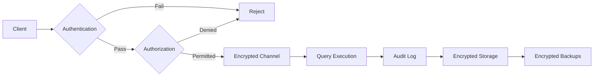

# Chapter 18:

> **Prev:** [Chapter 17distributed-db](17-distributed-db.md) | **Next:** [Chapter 19performance-tuning](19-performance-tuning.md) Database Security

## Learning Objectives

- Understand the database security threat landscape
- Implement authentication and authorization mechanisms
- Prevent SQL injection attacks through defensive coding
- Configure encryption at rest and in transit
- Audit database activity for compliance
- Apply row-level security and data masking
- Understand GDPR and privacy regulations

## Chapter at a Glance

| Topic | Key Insight | Practical Takeaway |
|-------|-------------|-------------------|
| **Authentication** | Username/password, Kerberos, certificates | Use multi-factor authentication for all database access |
| **Authorization** | GRANT/REVOKE with role-based access control | Follow the principle of least privilege |
| **Encryption** | Transparent Data Encryption (TDE) + TLS | Encrypt at rest AND in transit — never one without the other |
| **SQL Injection** | Malicious input alters query structure | Always use parameterized queries (prepared statements) |
| **Auditing** | Log all DDL, DML, and login attempts | Enable audit logging with centralized SIEM integration |
| **Backup Security** | Encrypted backups with restricted access | Test restore from encrypted backups regularly |

## Chapter Roadmap




## Theory


### 18.1 The Database Security Landscape

Databases store an organization's most valuable asset — data. Security breaches can lead to:

- **Financial loss:** Fines (GDPR: up to 4% of global revenue), fraud
- **Reputation damage:** Loss of customer trust
- **Legal liability:** Lawsuits, regulatory action
- **Operational disruption:** Ransomware, data destruction

**Threat Categories:**

| Threat | Example | Impact |
|--------|---------|--------|
| SQL Injection | `' OR 1=1 --` | Data exfiltration |
| Credential theft | Stolen DB passwords | Full database access |
| Privilege escalation | User gets admin rights | Unauthorized access |
| Insider threat | Employee exports customer data | Data leak |
| Network eavesdropping | Unencrypted connection | Credential/data theft |
| Backup compromise | Stolen backup tapes | Offline data access |
| Social engineering | DBA tricked into revealing password | Credential compromise |
| Ransomware | Encrypt database files | Data unavailability |


> **One-Sentence Takeaway:** Database authentication verifies user identity through passwords, Kerberos, certificates, or multi-factor methods.

### 18.2 Authentication

Authentication verifies the identity of a user or application connecting to the database.

**Password Authentication:**

```sql
-- PostgreSQL: Create user with password
CREATE USER app_user WITH PASSWORD 'StrongP@ssw0rd!';

-- Always enforce password complexity
-- Use SCRAM-SHA-256 (PostgreSQL 10+) for secure password storage
SET password_encryption = 'scram-sha-256';

-- MySQL
CREATE USER 'app_user'@'192.168.1.%' IDENTIFIED BY 'StrongP@ssw0rd!';
```

**Certificate-Based Authentication:**

```sql
-- PostgreSQL: Certificate authentication
-- pg_hba.conf:
-- hostssl all all 0.0.0.0/0 cert clientcert=1

CREATE USER ssl_user;
-- User must present valid client certificate matching common name
```

**LDAP/Active Directory Integration:**

```sql
-- PostgreSQL with LDAP
-- pg_hba.conf:
-- host all all 0.0.0.0/0 ldap ldapserver=ldap.example.com ldapprefix="cn=" ldapsuffix=",dc=example,dc=com"

-- MySQL with LDAP
CREATE USER 'external_user' IDENTIFIED WITH auth_ldap_simple
  AS 'uid=app_user,ou=People,dc=example,dc=com';
```

**Multi-Factor Authentication:**

- Increasingly supported via PAM modules or connection poolers (PgBouncer)
- Combine database password with client certificate, TOTP, or SSH key

**Best Practices:**
- Never use default or blank passwords
- Rotate passwords regularly (or use short-lived credentials via vaults)
- Use separate credentials for each application
- Revoke credentials immediately when personnel leave
- Use connection pooling with credential management (PgBouncer, ProxySQL)


> **One-Sentence Takeaway:** Authorization controls what authenticated users can do using GRANT/REVOKE with role-based access control (RBAC).

### 18.3 Authorization and Access Control

**RBAC (Role-Based Access Control):**

```sql
-- PostgreSQL: Create roles and grant privileges
CREATE ROLE read_only;
CREATE ROLE read_write;
CREATE ROLE admin;

-- Grant privileges to roles
GRANT SELECT ON ALL TABLES IN SCHEMA public TO read_only;
GRANT INSERT, UPDATE, DELETE ON ALL TABLES IN SCHEMA public TO read_write;
GRANT ALL PRIVILEGES ON ALL TABLES IN SCHEMA public TO admin;

-- Assign roles to users
GRANT read_only TO alice;       -- Alice can only read
GRANT read_write TO bob;        -- Bob can read and write
GRANT admin TO carol;           -- Carol is admin

-- Column-level permissions (PostgreSQL)
GRANT SELECT (id, name, email) ON users TO support_team;
REVOKE SELECT (credit_card, ssn) ON users FROM support_team;
```

**MySQL:**

```sql
-- MySQL: User-level privileges
CREATE USER 'analyst'@'%' IDENTIFIED BY 'password';
GRANT SELECT ON company.* TO 'analyst'@'%';
GRANT SELECT, INSERT, UPDATE ON company.orders TO 'analyst'@'%';

-- Revoke granular access
REVOKE SELECT (ssn), SELECT (salary) ON company.employees FROM 'analyst'@'%';
```

**Principle of Least Privilege:**
- Grant the minimum permissions needed
- Prefer role-based grants over per-user grants
- Regularly audit and revoke unused permissions
- Never use superuser accounts for application connections

**Default-Deny:**

```sql
-- PostgreSQL: Revoke all from public
REVOKE ALL ON SCHEMA public FROM PUBLIC;
REVOKE ALL ON ALL TABLES IN SCHEMA public FROM PUBLIC;

-- Then explicitly grant only what's needed
GRANT USAGE ON SCHEMA public TO app_role;
GRANT SELECT, INSERT, UPDATE ON orders TO app_role;
```


> **One-Sentence Takeaway:** Encryption at rest (TDE) protects data files; encryption in transit (TLS) protects network communication.

### 18.4 SQL Injection

SQL injection is the most critical database security vulnerability. It occurs when user input is directly concatenated into SQL queries.

**Vulnerable Code (NEVER do this):**

```python
# BAD — vulnerable to SQL injection
user_input = request.GET["username"]  # User enters: ' OR '1'='1
query = f"SELECT * FROM users WHERE username = '{user_input}'"
cursor.execute(query)

# Now: SELECT * FROM users WHERE username = '' OR '1'='1'
# Returns ALL users!
```

**Malicious Input Examples:**

```sql
-- Input: ' OR 1=1 --
SELECT * FROM users WHERE username = '' OR 1=1 --' AND password = 'x'
-- Returns all users (comments out password check)

-- Input: '; DROP TABLE users; --
SELECT * FROM users WHERE username = ''; DROP TABLE users; --'
-- Deletes entire table

-- Input: ' UNION SELECT credit_card FROM payments --
SELECT * FROM users WHERE username = '' UNION SELECT credit_card FROM payments --'
-- Data exfiltration via UNION

-- Blind SQL injection (boolean-based)
-- Input: ' OR (SELECT COUNT(*) FROM users) > 0 --
-- If page returns normally, attacker knows table exists
```

**Defensive Measures:**

**1. Parameterized Queries (Prepared Statements) — BEST:**

```python
# Python with psycopg2 — SAFE
cursor.execute(
    "SELECT * FROM users WHERE username = %s AND password = %s",
    (username, password)
)

# Python with SQLAlchemy — SAFE
result = session.query(User).filter(
    User.username == username,
    User.password == password
).all()

# Java with JDBC — SAFE
PreparedStatement ps = conn.prepareStatement(
    "SELECT * FROM users WHERE username = ? AND password = ?"
);
ps.setString(1, username);
ps.setString(2, password);
ResultSet rs = ps.executeQuery();

# Node.js with pg — SAFE
const result = await client.query(
    'SELECT * FROM users WHERE username = $1 AND password = $2',
    [username, password]
);
```

**2. Stored Procedures:**

```sql
CREATE OR REPLACE FUNCTION get_user(p_username TEXT, p_password TEXT)
RETURNS TABLE(id INT, username TEXT, email TEXT) AS $$
BEGIN
    RETURN QUERY
    SELECT id, username, email FROM users
    WHERE username = p_username AND password_hash = crypt(p_password, password_hash);
END;
$$ LANGUAGE plpgsql SECURITY DEFINER;
```

**3. Input Validation (defense in depth):**

```python
import re

def sanitize_username(username):
    # Whitelist approach: only allow alphanumeric
    if not re.match(r'^[a-zA-Z0-9_]+$', username):
        raise ValueError("Invalid username")
    return username
```

**4. Least Privilege for Application User:**

```sql
-- App user should NOT have DROP or TRUNCATE permissions
CREATE ROLE app_user LOGIN PASSWORD 'app_password';
GRANT SELECT, INSERT, UPDATE ON orders TO app_user;
GRANT SELECT, INSERT, UPDATE ON customers TO app_user;
-- NO DROP, NO TRUNCATE, NO CREATE
```

**5. Query Monitoring (detect injection attempts):**

```sql
-- Log all queries for analysis
ALTER DATABASE mydb SET log_statement = 'all';

-- Detect suspicious patterns
SELECT query, calls, total_time FROM pg_stat_statements
WHERE query ~* '(union.*select|drop|truncate|exec|xp_cmdshell|--|;)';
```


> **One-Sentence Takeaway:** SQL injection exploits unsanitized user input — parameterized queries are the definitive defense.

### 18.5 Encryption

**Encryption at Rest:**

```sql
-- PostgreSQL: pgcrypto extension for column-level encryption
CREATE EXTENSION IF NOT EXISTS pgcrypto;

-- Encrypt sensitive data
INSERT INTO users (username, ssn)
VALUES ('bob', pgp_sym_encrypt('123-45-6789', 'encryption_key'));

-- Decrypt when needed
SELECT username, pgp_sym_decrypt(ssn, 'encryption_key') AS ssn
FROM users WHERE id = 1;

-- Key management: Use a vault (HashiCorp Vault, AWS KMS)
-- Never hardcode keys in application code or database functions
```

**MySQL:**

```sql
-- MySQL: AES encryption
INSERT INTO users (username, ssn)
VALUES ('bob', AES_ENCRYPT('123-45-6789', 'encryption_key'));

SELECT username, AES_DECRYPT(ssn, 'encryption_key') AS ssn
FROM users WHERE id = 1;
```

**Transparent Data Encryption (TDE):** Encrypt entire database files at the filesystem level.

```sql
-- SQL Server: TDE
CREATE DATABASE ENCRYPTION KEY
  WITH ALGORITHM = AES_256
  ENCRYPTION BY SERVER CERTIFICATE MyServerCert;

ALTER DATABASE MyDatabase SET ENCRYPTION ON;

-- Oracle: TDE
-- Column-level
CREATE TABLE employees (
  emp_id NUMBER,
  ssn VARCHAR2(11) ENCRYPT USING 'AES256'
);

-- Tablespace-level
CREATE TABLESPACE secure_ts
  DATAFILE 'secure01.dbf' SIZE 100M
  ENCRYPTION USING 'AES256' DEFAULT STORAGE(ENCRYPT);
```

**Encryption in Transit:**

```sql
-- PostgreSQL: Force SSL connections
-- postgresql.conf:
ssl = on
ssl_cert_file = 'server.crt'
ssl_key_file = 'server.key'
ssl_ca_file = 'root.crt'

-- pg_hba.conf: Require SSL for all connections
hostssl all all 0.0.0.0/0 md5

-- MySQL: Force SSL
-- my.cnf:
[mysqld]
ssl-ca = /path/to/ca.pem
ssl-cert = /path/to/server-cert.pem
ssl-key = /path/to/server-key.pem
require_secure_transport = ON

-- Client connection string (verify server identity)
psql "host=db.example.com port=5432 dbname=mydb sslmode=verify-full sslrootcert=root.crt"
```


> **One-Sentence Takeaway:** Database auditing logs all privileged operations and access attempts for compliance and forensic investigation.

### 18.6 Auditing

**Logging Database Activity:**

```sql
-- PostgreSQL: Audit log via configuration
-- postgresql.conf:
log_statement = 'ddl'       -- Log schema changes
log_duration = on           -- Log query duration
log_connections = on        -- Log all connections
log_disconnections = on     -- Log all disconnections
log_line_prefix = '%t %u %d %r '  -- Timestamp, user, database, host

-- MySQL: General query log (caution — high volume)
SET GLOBAL general_log = ON;

-- Better: MySQL Audit Plugin (Enterprise)
INSTALL PLUGIN audit_log SONAME 'audit_log.so';
```

**pgaudit (PostgreSQL Extension):**

```sql
-- Load pgaudit extension
CREATE EXTENSION IF NOT EXISTS pgaudit;

-- Configure audit
SET pgaudit.log = 'write,ddl,role';
SET pgaudit.log_level = 'notice';
SET pgaudit.log_relation = ON;
SET pgaudit.log_catalog = OFF;

-- Now all DDL, DML writes, and role changes are logged with:
-- AUDIT: SESSION,1,1,DDL,CREATE TABLE,,,CREATE TABLE employees(...),<not logged>
```

**Database Activity Monitoring (DAM):** Third-party tools that monitor database traffic in real-time:

- **Imperva SecureSphere:** Analyzes SQL traffic, blocks injection
- **Guardium:** IBM's DAM solution
- **DataSunrise:** Database firewall with audit

**UNIFIED AUDIT (Oracle 12c+):**

```sql
-- Create unified audit policy
CREATE AUDIT POLICY sensitive_data_access
  ACTIONS SELECT ON employees.salary
  ACTIONS SELECT ON customers.credit_card
  WHEN 'SYS_CONTEXT(''USERENV'',''SESSION_USER'') != ''ADMIN'''
  EVALUATE PER SESSION;

-- Enable policy
AUDIT POLICY sensitive_data_access;

-- View audit trail
SELECT * FROM unified_audit_trail
  WHERE unified_audit_policies = 'SENSITIVE_DATA_ACCESS';
```


> **One-Sentence Takeaway:** Database security requires defense in depth — authentication, authorization, encryption, auditing, and secure backups.

### 18.7 Row-Level Security

SQL databases can enforce access control based on row properties.

**PostgreSQL Row-Level Security (RLS):**

```sql
-- Create a table with sensitive data
CREATE TABLE customer_data (
    customer_id INT,
    region TEXT,
    revenue DECIMAL,
    contact_name TEXT,
    ssn TEXT
);

-- Enable RLS
ALTER TABLE customer_data ENABLE ROW LEVEL SECURITY;

-- Create policies
CREATE POLICY region_isolation ON customer_data
    FOR ALL
    USING (region = current_setting('app.region'));

CREATE POLICY manager_access ON customer_data
    FOR SELECT
    USING (current_user IN (SELECT user_name FROM regional_managers WHERE region = region));

-- Now users only see rows matching their region

-- Example: User in 'EU' region
SET app.region = 'EU';
SELECT * FROM customer_data;
-- Only shows rows where region = 'EU'
```

**SQL Server Row-Level Security:**

```sql
-- Create predicate function
CREATE FUNCTION dbo.fn_security_predicate(@region SYSNAME)
    RETURNS TABLE
    WITH SCHEMABINDING
AS
    RETURN SELECT 1 AS result
    WHERE @region = USER_NAME()
    OR USER_NAME() = 'admin';

-- Create security policy
CREATE SECURITY POLICY RegionFilter
    ADD FILTER PREDICATE dbo.fn_security_predicate(region)
    ON dbo.customer_data;
```

> **One-Sentence Takeaway:** Row-level security restricts which rows a user can query based on their identity or role, enabling multi-tenant data isolation.


### 18.8 Dynamic Data Masking

Hide sensitive data from non-privileged users.

**SQL Server Dynamic Data Masking:**

```sql
CREATE TABLE employees (
    emp_id INT,
    name VARCHAR(100),
    email VARCHAR(100) MASKED WITH (FUNCTION = 'email()'),
    ssn VARCHAR(11) MASKED WITH (FUNCTION = 'partial(0,"XXX-XX-",4)'),
    salary DECIMAL(10,2) MASKED WITH (FUNCTION = 'default()')
);

-- Unmasked view (admin):
SELECT * FROM employees;
-- emp_id: 1, name: Alice, email: alice@example.com, ssn: 123-45-6789, salary: 120000

-- Masked view (regular user):
SELECT * FROM employees;
-- emp_id: 1, name: Alice, email: aXXX@XXXX.com, ssn: XXX-XX-6789, salary: 0.00
```

**PostgreSQL: Custom masking via views:**

```sql
-- Create a masked view
CREATE VIEW employees_public AS
SELECT
    emp_id,
    name,
    CASE WHEN current_user IN ('hr_dept', 'admin') THEN email
         ELSE regexp_replace(email, '(.)(.*)(@.*)', '\1***\3') END AS email_masked,
    CASE WHEN current_user IN ('hr_dept', 'admin') THEN ssn
         ELSE 'XXX-XX-' || substring(ssn, 8, 4) END AS ssn_masked
FROM employees;

-- Grant access to view, not base table
REVOKE ALL ON employees FROM PUBLIC;
GRANT SELECT ON employees_public TO PUBLIC;
```

> **One-Sentence Takeaway:** Dynamic data masking hides sensitive data from non-privileged users at query time without altering the underlying storage.


### 18.9 Backup Security

Backups are a frequent target for attackers. Secure them:

```sql
-- pg_dump with encryption
pg_dump mydb | gpg --symmetric --cipher-algo AES256 -o backup.sql.gpg

-- MySQL with encryption
mysqldump --all-databases | gzip | openssl enc -aes-256-cbc -out backup.sql.gz.enc

-- Best practices:
-- 1. Encrypt all backups (at rest and in transit)
-- 2. Store backups offsite (geographically separate)
-- 3. Test restore procedures regularly
-- 4. Limit access to backup files (IAM/bucket policies)
-- 5. Use immutable storage (S3 Object Lock)
-- 6. Rotate encryption keys
```

> **One-Sentence Takeaway:** Backup security requires encrypted backup files, restricted storage access, and regular restore testing to ensure recoverability.


### 18.10 GDPR and Data Privacy

**GDPR Principles (applies to EU personal data):**
1. **Lawfulness, fairness, transparency:** Tell users what data you collect and why
2. **Purpose limitation:** Only collect data for specified purposes
3. **Data minimization:** Collect only necessary data
4. **Accuracy:** Keep data accurate and up to date
5. **Storage limitation:** Delete data when no longer needed
6. **Integrity and confidentiality:** Secure data appropriately
7. **Accountability:** Demonstrate compliance

**Database Implementation:**

```sql
-- Data minimization: Mask or pseudo-anonymize personal data
CREATE VIEW analytics_users AS
SELECT
    id,
    age_range(CASE WHEN age >= 18 THEN age ELSE NULL END) AS age_group,
    substring(email, 1, 1) || '@' || split_part(email, '@', 2) AS anonymized_email,
    CASE WHEN current_setting('app.purpose') = 'analytics'
         THEN NULL ELSE city
    END AS location
FROM users;

-- Right to be forgotten (GDPR Article 17)
-- Option 1: Hard delete
DELETE FROM users WHERE email = 'user@example.com';

-- Option 2: Anonymization (keep record but remove identifiers)
UPDATE users SET
    email = 'deleted-' || id || '@example.com',
    name = 'Deleted User',
    phone = NULL,
    address = NULL
WHERE id = 42;

-- Data retention: Automatically expire old data
DELETE FROM raw_logs WHERE created_at < NOW() - INTERVAL '90 days';

-- Use PostgreSQL TTL pattern (no native TTL):
CREATE VIEW active_sessions AS
SELECT * FROM sessions WHERE last_access > NOW() - INTERVAL '30 minutes';
```

> **One-Sentence Takeaway:** GDPR compliance for databases requires data anonymization, the right to be forgotten, and audit trails for all personal data access.


## Examples

**Example 18.1: Complete Security Setup**

```sql
-- 1. Create roles hierarchy
CREATE ROLE app_readonly;
CREATE ROLE app_readwrite;
CREATE ROLE app_admin;

-- 2. Grant table-level permissions
GRANT SELECT ON ALL TABLES IN SCHEMA public TO app_readonly;
GRANT INSERT, UPDATE, DELETE ON orders, order_items, customers TO app_readwrite;
GRANT ALL PRIVILEGES ON ALL TABLES IN SCHEMA public TO app_admin;

-- 3. Create application user (least privilege)
CREATE USER web_app WITH PASSWORD 'secure_password';
GRANT app_readwrite TO web_app;

-- 4. Create admin user
CREATE USER db_admin WITH PASSWORD 'admin_password';
GRANT app_admin TO db_admin;

-- 5. Create reporting user (read-only)
CREATE USER reporting WITH PASSWORD 'report_password';
GRANT app_readonly TO reporting;

-- 6. Enable RLS for multi-tenant data
ALTER TABLE customer_orders ENABLE ROW LEVEL SECURITY;
CREATE POLICY tenant_isolation ON customer_orders
    USING (tenant_id = current_setting('app.tenant_id')::INT);
```

**Example 18.2: SQL Injection Safe Coding**

```python
import psycopg2
from psycopg2 import sql

def get_user_orders(user_id, status=None):
    conn = psycopg2.connect("dbname=mydb user=web_app")
    cur = conn.cursor()

    # SAFE: Using parameterized query
    if status:
        cur.execute("""
            SELECT order_id, total, status, created_at
            FROM orders
            WHERE user_id = %s AND status = %s
            ORDER BY created_at DESC
        """, (user_id, status))
    else:
        cur.execute("""
            SELECT order_id, total, status, created_at
            FROM orders
            WHERE user_id = %s
            ORDER BY created_at DESC
        """, (user_id,))

    # SAFE: For dynamic identifiers (table/column names), use SQL composition
    column = "order_id"  # Must be validated, not from user input
    query = sql.SQL("SELECT {} FROM orders WHERE user_id = %s").format(
        sql.Identifier(column)
    )
    cur.execute(query, (user_id,))

    return cur.fetchall()
```

**Example 18.3: Audit Trail Implementation**

```sql
-- Create audit table
CREATE TABLE audit_log (
    id BIGSERIAL PRIMARY KEY,
    user_name TEXT,
    table_name TEXT,
    operation TEXT,      -- INSERT, UPDATE, DELETE
    old_data JSONB,
    new_data JSONB,
    query TEXT,
    ip_address INET,
    changed_at TIMESTAMPTZ DEFAULT NOW(),
    application TEXT
);

-- Create audit trigger function
CREATE OR REPLACE FUNCTION audit_trigger()
RETURNS TRIGGER AS $$
BEGIN
    INSERT INTO audit_log (
        user_name, table_name, operation,
        old_data, new_data, query, ip_address, application
    ) VALUES (
        session_user,
        TG_TABLE_NAME,
        TG_OP,
        CASE WHEN TG_OP IN ('UPDATE', 'DELETE')
             THEN row_to_json(OLD)::JSONB ELSE NULL END,
        CASE WHEN TG_OP IN ('INSERT', 'UPDATE')
             THEN row_to_json(NEW)::JSONB ELSE NULL END,
        current_query(),
        inet_client_addr(),
        current_setting('app.name', TRUE)
    );
    RETURN NEW;
END;
$$ LANGUAGE plpgsql SECURITY DEFINER;

-- Apply audit trigger to sensitive tables
CREATE TRIGGER audit_customers
    AFTER INSERT OR UPDATE OR DELETE ON customers
    FOR EACH ROW EXECUTE FUNCTION audit_trigger();

CREATE TRIGGER audit_payments
    AFTER INSERT OR UPDATE OR DELETE ON payments
    FOR EACH ROW EXECUTE FUNCTION audit_trigger();
```

## 💡 Pro Tips

1. **Parameterized queries are non-negotiable** — no amount of input validation or escaping is safer than prepared statements with bound parameters. This is the #1 rule of database security.
2. **Least privilege means column-level grants** — do not grant SELECT * to application users if they only need 3 columns. Every extra column is a potential data leak.
3. **Encryption at rest is not a silver bullet** — it protects against physical theft but does not protect against SQL injection or authorized user misuse.
4. **Audit logs are useless if not reviewed** — enable auditing and set up automated alerts for suspicious patterns (mass deletes, after-hours access, privilege escalation).
5. **Row-Level Security (RLS) is underused** — instead of filtering in WHERE clauses in every query, define RLS policies that automatically restrict rows based on the user's role or tenant ID.

## One-Sentence Takeaways

- **18.1:** Database security requires defense in depth — layers of authentication, authorization, encryption, and auditing.
- **18.2:** SQL injection is the most critical database vulnerability — it is entirely preventable with parameterized queries.
- **18.3:** Authentication verifies identity (who you are); authorization determines access (what you can do).
- **18.4:** Encryption at rest (TDE, column-level) and in transit (SSL/TLS) protects data from physical compromise.
- **18.5:** Row-level security and dynamic data masking provide fine-grained access control beyond table-level GRANTs.
- **18.6:** Auditing is essential for compliance (GDPR, HIPAA, PCI-DSS) and breach detection.
- **18.7:** Backup security — encryption, access control, and regular restore testing — is the last line of defense.

## Concept Comparison Table

| Security Layer | Protection | Implementation |
|---------------|-----------|----------------|
| **Authentication** | Prevents unauthorized access | Passwords, certificates, OAuth, LDAP, MFA |
| **Authorization** | Limits what authorized users can do | GRANT/REVOKE, roles, RLS policies |
| **Encryption at Rest** | Protects data on disk | TDE, column-level encryption, filesystem encryption |
| **Encryption in Transit** | Protects data on the wire | SSL/TLS, certificate verification |
| **Auditing** | Detects and records activity | Database audit logs, triggers, SIEM integration |
| **Network Security** | Restricts database access | Firewalls, VPCs, private subnets, IP whitelists |
| **Backup Security** | Protects recovery data | Encrypted backups, access control, off-site storage |

| Vulnerability | Impact | Prevention |
|--------------|--------|------------|
| **SQL Injection** | Data theft, deletion, modification | Parameterized queries, ORM, input validation |
| **Weak Authentication** | Unauthorized access | Strong passwords, MFA, certificate auth |
| **Unencrypted Data** | Data breach via physical theft | TDE, column encryption |
| **Insider Threat** | Authorized user abuses access | Least privilege, RLS, auditing |
| **Unsecured Backups** | Data breach via backup theft | Encrypted backups, access control |

## Quick Reference

| Security Best Practice | Why | How |
|----------------------|-----|-----|
| **Parameterized queries** | Prevents SQL injection 100% | Use placeholders (%s, $1, ?) with bound parameters |
| **Least privilege** | Minimizes breach impact | GRANT only needed columns/rows; use roles |
| **SSL/TLS enforcement** | Prevents network sniffing | `sslmode=require`, disable non-TLS connections |
| **Regular patching** | Fixes known vulnerabilities | Stay current with DBMS security releases |
| **Audit logging** | Detects breaches | Enable logging on sensitive tables + alerts |
| **Encryption at rest** | Physically protects data | Enable TDE or column-level encryption |
| **Backup encryption** | Protects recovery data | Encrypt backup files; test restore periodically |

## Cross-Application Matrix

| Security Technique | Applied In | Why It Matters |
|-------------------|-----------|----------------|
| **Parameterized Queries** | All web applications | Only reliable defense against SQL injection |
| **Row-Level Security** | Multi-tenant SaaS | Each tenant sees only their own data automatically |
| **Column Encryption** | Healthcare (HIPAA), Finance (PCI) | Protects sensitive fields (SSN, credit card numbers) |
| **Transparent Data Encryption** | Enterprise databases | Protects backup files and disk theft |
| **GRANT/REVOKE + Roles** | Multi-user systems | Manage permissions at scale without per-user grants |
| **Audit Logs** | Compliance-required environments | Meet GDPR, HIPAA, PCI-DSS audit requirements |
| **Connection Pooling + SSL** | All production deployments | Secure, efficient database connections |

## Chapter Quiz

1. The most effective defense against SQL injection is:
   a) Input validation
   b) Parameterized queries
   c) Escaping special characters
   d) WAF (Web Application Firewall)

2. Least privilege means:
   a) Granting all permissions and removing only dangerous ones
   b) Granting the minimum permissions needed for a task
   c) Using a single admin account for all operations
   d) Only using SELECT statements

3. Transparent Data Encryption (TDE) protects against:
   a) SQL injection
   b) Physical theft of storage media
   c) Authorized user misuse
   d) Network sniffing

4. Row-Level Security (RLS) is used to:
   a) Encrypt individual rows
   b) Automatically filter rows based on user context
   c) Create indexes on rows
   d) Compress row data

5. Which is NOT a recommended backup security practice?
   a) Encrypt backup files
   b) Test restore procedures
   c) Store unencrypted backups for faster recovery
   d) Control access to backup storage

6. SSL/TLS in database connections protects against:
   a) SQL injection
   b) Network sniffing (man-in-the-middle)
   c) Disk failure
   d) Authentication bypass

7. Database auditing is primarily used for:
   a) Performance tuning
   b) Detecting and recording security-relevant activities
   c) Query optimization
   d) Data compression

8. Which of the following is an SQL injection attack?
   a) `SELECT * FROM users WHERE id = 1 OR 1=1`
   b) `GRANT ALL ON users TO attacker`
   c) `DROP TABLE users`
   d) `ALTER TABLE users ADD COLUMN backdoor`

**Answers:** 1-b, 2-b, 3-b, 4-b, 5-c, 6-b, 7-b, 8-a

## Summary

- Database security requires defense in depth: authentication, authorization, encryption, auditing.
- SQL injection is the most critical risk — always use parameterized queries.
- Least privilege: grant minimum permissions needed, never use superuser for apps.
- Encryption at rest (TDE, column-level) and in transit (SSL/TLS) protects data.
- Row-level security and dynamic data masking provide fine-grained access control.
- Auditing is essential for compliance and breach detection.
- GDPR requires data minimization, right to be forgotten, and retention policies.
- Backups must be encrypted, tested, and stored securely.

## Exercises

### Basic

1. Explain the principle of least privilege in database security. Give an example of a good vs. poor permission setup for an e-commerce application user.

2. What is SQL injection? Write an example of vulnerable code and its safe equivalent using parameterized queries.

3. What is the difference between encryption at rest and encryption in transit? When is each needed?

4. Create a PostgreSQL user with SELECT-only access on the `orders` table.

### Intermediate

5. Design a role hierarchy for a hospital database with: doctors (read/write patient records), nurses (read patient records, update vitals), administrators (read billing data), and auditors (read-only everything). Show the SQL to create roles, grant permissions, and assign users.

6. Implement row-level security for a multi-tenant SaaS application. Each tenant should only see their own data. Show the RLS policy and explain how it works at query time.

7. Write a SQL injection attack and defense walkthrough:
   - Show the vulnerable query
   - Demonstrate three different injection payloads
   - Show the corrected parameterized version
   - Explain why the parameterized version is safe

8. What is the difference between dynamic data masking and encryption? When would you use each? Can a user bypass data masking?

### Advanced

9. Design a complete database security audit system that:
   - Logs all DDL changes (schema modifications)
   - Logs all DML on sensitive tables (customers, payments)
   - Logs all failed login attempts
   - Provides a query interface for the security team to search audit logs
   - Implements audit log retention and rotation
   - Prevents tampering with audit logs (append-only)
   Show the schema, triggers, and queries.

10. Implement a key management system for column-level encryption:
    - Use a master key stored in an external vault (HashiCorp Vault or AWS KMS)
    - Generate data encryption keys per table/column
    - Rotate keys without re-encrypting all data (envelope encryption)
    - Handle key loss recovery
    Show the architecture, SQL functions, and key lifecycle.

11. GDPR's "right to be forgotten" (Article 17) requires deletion of personal data on request. But in a relational database, deleting a user's data may violate referential integrity and destroy analytics data. Design a strategy that:
    - Removes personally identifiable information (PII)
    - Preserves aggregate analytics and business records
    - Maintains referential integrity
    - Supports audit requirements
    - Works at scale (millions of users)
    Compare hard delete, soft delete, and anonymization approaches.
