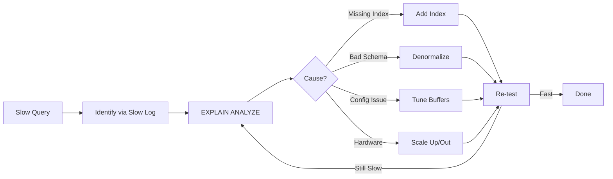

# Chapter 19: Performance Tuning

> **Prev:** [Chapter 18: Database Security](18-security.md) | **Next:** *(Last Chapter)*

## Learning Objectives

After completing this chapter, you will be able to:

- Select the right index type (BRIN, GiST, GIN, SP-GiST) for real-world workloads
- Monitor and maintain indexes to prevent bloat and fragmentation
- Design indexes based on actual query patterns, not theory
- Use table partitioning and materialized views for query acceleration
- Diagnose slow queries using practical tools and metrics
- Apply performance tuning patterns to common database scenarios

## Chapter at a Glance

| Topic | Key Insight | Practical Takeaway |
|-------|-------------|-------------------|
| **Query Tuning** | Identify slow queries, analyze plans | Use slow query logs and EXPLAIN ANALYZE iteratively |
| **Index Optimization** | Remove unused, add missing, avoid over-indexing | Monitor index usage with pg_stat_user_indexes |
| **Schema Design** | Normalize for writes, denormalize for reads | Each extra JOIN can add 10-100x to query time |
| **Connection Pooling** | Reuse connections to avoid setup overhead | Set pool size to (core_count * 2 + disk_count) |
| **Caching** | Reduce database load with application-level cache | Cache at the application tier, not just the database |
| **Hardware Tuning** | Memory, disk I/O, and network configuration | More RAM reduces disk I/O more than any query optimization |

## Chapter Roadmap



## 19.1 Specialized Index Types


Chapter 12 covered B+ trees and hash indexes. Production databases demand more.

### 19.1.1 BRIN (Block Range INdex)

BRIN indexes are ideal for sorted, append-heavy data like time-series logs, audit trails, or IoT sensor readings. They store min/max values per block range (typically 128 pages = 1 MB).

```sql
-- Ideal for timestamp columns on insert-only tables
CREATE INDEX idx_orders_created_brin
  ON orders USING BRIN (created_at)
  WITH (pages_per_range = 32);

-- Query example that benefits:
SELECT * FROM orders
WHERE created_at >= '2026-01-01'
  AND created_at < '2026-02-01';
```

BRIN indexes are 100-1000x smaller than B-tree equivalents. For a 100 GB table, a BRIN index might be 50 MB while a B-tree would be 2 GB. The trade-off is slower scan (more false positives) but vastly less storage and maintenance overhead.

**When to use BRIN:**

- Append-only or mostly-append workloads
- Natural correlation between physical row order and indexed column
- Tables larger than memory where index size matters
- Columns with high cardinality and monotonic ordering (timestamps, auto-increment IDs)

**When to avoid:**

- Random insert/update patterns destroy the correlation BRIN relies on
- Columns with low cardinality (booleans, tiny enums)
- Point lookups (BRIN always does a sequential scan of qualifying ranges)

> **One-Sentence Takeaway:** BRIN indexes store min/max per page range — ideal for append-heavy time-series and log data where physical order matches insertion order.


### 19.1.2 GiST (Generalized Search Tree)

GiST enables indexing of geometric, full-text, and range types that B-trees cannot handle naturally.

```sql
-- Geospatial (PostGIS)
CREATE INDEX idx_locations_geo
  ON locations USING GIST (geom);

-- Range types (daterange, int4range)
CREATE INDEX idx_booking_period
  ON bookings USING GIST (period);

-- Full-text search (alternative to GIN for some workloads)
CREATE INDEX idx_doc_vectors
  ON documents USING GIST (to_tsvector('english', body));
```

GiST supports nearest-neighbor (ORDER BY distance) and overlap queries efficiently:

```sql
-- Find restaurants within 5 km, sorted by distance
SELECT name, geom <-> ST_MakePoint(-73.9857, 40.7484) AS dist
FROM locations
WHERE ST_DWithin(geom, ST_MakePoint(-73.9857, 40.7484), 5000)
ORDER BY dist
LIMIT 20;
```

> **One-Sentence Takeaway:** GiST indexes support complex data types like geometric shapes, full-text search, and range types with a balanced tree structure.


### 19.1.3 GIN (Generalized Inverted Index)

GIN indexes are designed for composite and multi-valued types: arrays, JSONB, and full-text search vectors.

```sql
-- JSONB indexing (PostgreSQL 12+)
CREATE INDEX idx_metadata_tags
  ON products USING GIN (metadata jsonb_path_ops);

-- Array containment queries
CREATE INDEX idx_article_tags
  ON articles USING GIN (tags);

-- Full-text search (preferred over GiST for static text)
CREATE INDEX idx_article_fts
  ON articles USING GIN (to_tsvector('english', title || ' ' || body));
```

**GIN vs GiST for full-text search:**

- GIN: faster lookups, larger index, slower writes
- GiST: faster writes, larger maintenance, slower lookups

**Rule:** GIN for mostly-read workloads, GiST for write-heavy.

> **One-Sentence Takeaway:** GIN indexes accelerate searches within composite values such as arrays, JSONB, and full-text documents.


### 19.1.4 SP-GiST (Space-Partitioned GiST)

SP-GiST indexes are designed for quad-trees, k-d trees, and radix trees -- ideal for point clouds, IP range lookups, and prefix searches.

```sql
-- IP network containment (inet/cidr types)
CREATE INDEX idx_networks_spgist
  ON networks USING SPGIST (ip_range);

-- Phone number prefix lookups (text)
CREATE INDEX idx_phone_prefix
  ON contacts USING SPGIST (phone_number);
```

> **One-Sentence Takeaway:** SP-GiST indexes partition data into space-separated regions for k-dimensional and quad-tree queries.


## 19.2 Index Maintenance & Monitoring

Indexes degrade over time. B-tree pages fragment, dead tuples accumulate, and statistics become stale.

### 19.2.1 Detecting Index Bloat

```sql
-- PostgreSQL: find bloated indexes
SELECT
  schemaname || '.' || tablename AS table_name,
  indexname AS index_name,
  pg_size_pretty(pg_relation_size(i.indexrelid)) AS index_size,
  round(100 * (1 - avg_leaf_density)::numeric, 2) AS bloat_pct
FROM pg_stat_user_indexes i
JOIN pg_index USING (indexrelid)
WHERE idx_scan > 0
  AND pg_relation_size(i.indexrelid) > 10 * 1024 * 1024;
```

This query identifies indexes with low leaf density (high bloat). Indexes with >30% bloat are candidates for rebuilding.

> **One-Sentence Takeaway:** Index bloat occurs from dead tuples and page fragmentation — monitor with pg_stat_user_tables and rebuild periodically.


### 19.2.2 Finding Unused Indexes

```sql
SELECT
  schemaname || '.' || tablename AS table_name,
  indexname AS index_name,
  pg_size_pretty(pg_relation_size(indexrelid)) AS size,
  idx_scan AS scans,
  idx_tup_read,
  idx_tup_fetch
FROM pg_stat_user_indexes
WHERE idx_scan = 0
  AND pg_relation_size(indexrelid) > 10 * 1024 * 1024
ORDER BY pg_relation_size(indexrelid) DESC;
```

Unused indexes waste write overhead and cache space. Each index on a table adds write amplification -- every INSERT, UPDATE, and DELETE must update every index.

> **One-Sentence Takeaway:** Unused indexes waste write performance and storage — use pg_stat_user_indexes to identify and drop them safely.


### 19.2.3 Rebuilding Indexes

PostgreSQL offers three strategies:

```sql
-- 1. Standard REINDEX (blocks writes on the table)
REINDEX INDEX idx_orders_created;
REINDEX TABLE orders;

-- 2. CONCURRENTLY (no lock, but slower and more resource-intensive)
REINDEX INDEX CONCURRENTLY idx_orders_created;

-- 3. Drop + Create (requires exclusive lock but fastest)
DROP INDEX idx_orders_created;
CREATE INDEX CONCURRENTLY idx_orders_created ON orders (created_at);
```

Use CONCURRENTLY in production -- it allows reads and writes during the rebuild. The trade-off is it takes 2-3x longer and consumes more temporary storage.

> **One-Sentence Takeaway:** REINDEX CONCURRENTLY rebuilds indexes without blocking writes — essential for production systems with uptime requirements.


### 19.2.4 Zero-Downtime Index Creation

```sql
CREATE INDEX CONCURRENTLY idx_users_email_new
  ON users (email);

BEGIN;
ALTER TABLE users DROP CONSTRAINT users_email_key;
DROP INDEX CONCURRENTLY IF EXISTS users_email_key;
ALTER TABLE users ADD CONSTRAINT users_email_key UNIQUE USING INDEX idx_users_email_new;
COMMIT;
```

> **One-Sentence Takeaway:** CREATE INDEX CONCURRENTLY allows zero-downtime index creation without blocking concurrent writes.


## 19.3 Statistics & Cardinality Estimation

The query planner relies on statistics to estimate row counts. Wrong estimates produce bad query plans.

### 19.3.1 ANALYZE Deep Dive

```sql
-- Manual analyze
ANALYZE orders;

-- Analyze with specific column
ANALYZE orders (status, created_at);

-- View statistics
SELECT tablename, attname, n_distinct, null_frac,
       avg_width, most_common_vals, most_common_freqs
FROM pg_stats
WHERE tablename = 'orders';
```

PostgreSQL auto-analyzes when a table's pg_class.reltuples differs from actual count by more than the autovacuum_analyze_scale_factor (default 0.1, meaning 10% of rows changed).

> **One-Sentence Takeaway:** EXPLAIN ANALYZE runs the query and shows actual vs. estimated row counts — the most critical tool for understanding optimizer decisions.


### 19.3.2 Extended Statistics for Correlated Columns

The planner assumes independence between columns. When columns are correlated, estimates are wildly wrong:

```sql
-- Table with correlated columns
CREATE TABLE orders (
  region TEXT,
  warehouse TEXT,
  amount NUMERIC
);

-- Without extended stats, planner assumes region='East' AND warehouse='WH-EAST'
-- are independent: 50% * 10% = 5%. Actual: 50% * 50% = 25%.
-- Creates a 5x underestimation.

CREATE STATISTICS orders_region_warehouse (dependencies)
  ON region, warehouse FROM orders;

CREATE STATISTICS orders_region_mv (ndistinct)
  ON region, warehouse FROM orders;

CREATE STATISTICS orders_region_mcv (mcv)
  ON region, warehouse FROM orders;
```

> **One-Sentence Takeaway:** Extended statistics capture dependencies between correlated columns, helping the optimizer make better cardinality estimates for composite predicates.


### 19.3.3 Manual Statistics Tuning

```sql
-- Increase sample size for accuracy (default = 100)
ALTER TABLE orders ALTER COLUMN amount SET STATISTICS 1000;
ANALYZE orders;

-- For very large tables, increase the default statistics target globally
SET default_statistics_target = 500;
```

Higher statistics targets improve plan quality but increase ANALYZE time and memory usage. Start with 250-500 on critical columns with skewed distributions.

> **One-Sentence Takeaway:** Manual statistics tuning adjusts target columns and sample sizes to improve query plans when auto-analyze is insufficient.


## 19.4 Table Partitioning

Partitioning splits a large table into smaller physical segments while maintaining a single logical interface.

### 19.4.1 Partition Types

```sql
-- Range partitioning (most common -- time-series)
CREATE TABLE measurements (
  id BIGSERIAL,
  ts TIMESTAMPTZ NOT NULL,
  sensor_id INT,
  value FLOAT8
) PARTITION BY RANGE (ts);

CREATE TABLE measurements_2024_q1 PARTITION OF measurements
  FOR VALUES FROM ('2024-01-01') TO ('2024-04-01');
CREATE TABLE measurements_2024_q2 PARTITION OF measurements
  FOR VALUES FROM ('2024-04-01') TO ('2024-07-01');

-- List partitioning (enumerated categories)
CREATE TABLE customers (
  id BIGSERIAL,
  region TEXT NOT NULL,
  name TEXT
) PARTITION BY LIST (region);

CREATE TABLE customers_na PARTITION OF customers
  FOR VALUES IN ('US', 'CA', 'MX');
CREATE TABLE customers_eu PARTITION OF customers
  FOR VALUES IN ('GB', 'DE', 'FR', 'IT');

-- Hash partitioning (uniform distribution, no natural key)
CREATE TABLE sessions (
  session_id UUID NOT NULL,
  payload JSONB
) PARTITION BY HASH (session_id);

CREATE TABLE sessions_0 PARTITION OF sessions
  FOR VALUES WITH (MODULUS 4, REMAINDER 0);
CREATE TABLE sessions_1 PARTITION OF sessions
  FOR VALUES WITH (MODULUS 4, REMAINDER 1);
```

> **One-Sentence Takeaway:** Table partitioning divides large tables into smaller physical pieces — range, list, and hash partitions cover most use cases.


### 19.4.2 Partition Pruning

The query planner skips irrelevant partitions automatically:

```sql
-- PostgreSQL planner prunes to 2024_q1 only
SELECT avg(value) FROM measurements
WHERE ts >= '2024-02-01' AND ts < '2024-03-01';

-- Check if pruning is working
EXPLAIN (VERBOSE, ANALYZE)
SELECT avg(value) FROM measurements
WHERE ts >= '2024-02-01' AND ts < '2024-03-01';
```

Partition pruning works only when the partition key is used in the WHERE clause with an immutable expression. Never wrap the partition key in a function.

> **One-Sentence Takeaway:** Partition pruning eliminates irrelevant partitions from query plans, dramatically reducing data scanned for range-filtered queries.


### 19.4.3 Managing Partitions

```sql
-- Detach old data (instant -- no data movement)
ALTER TABLE measurements DETACH PARTITION measurements_2024_q1;

-- Attach as a standalone table (for archival)
ALTER TABLE measurements_2024_q1 SET SCHEMA archive;

-- Add new partitions ahead of time (automate with pg_partman)
CREATE TABLE measurements_2024_q3 PARTITION OF measurements
  FOR VALUES FROM ('2024-07-01') TO ('2024-10-01');

-- Create indexes on each partition (or use a template)
CREATE INDEX ON measurements_2024_q3 (sensor_id, ts);
```

For automated partition management, consider pg_partman extension:

```sql
CREATE EXTENSION pg_partman;

SELECT partman.create_parent(
  p_parent_table := 'public.measurements',
  p_control := 'ts',
  p_type := 'range',
  p_interval := '3 months',
  p_premake := 4
);
```

> **One-Sentence Takeaway:** Managing partitions involves ATTACH/DETACH operations, partition exchange for data loading, and scheduled maintenance.


## 19.5 Materialized Views

Materialized views cache query results as physical tables. They are refreshed on demand.

### 19.5.1 Basic Usage

```sql
CREATE MATERIALIZED VIEW mv_monthly_sales AS
SELECT
  date_trunc('month', order_date) AS month,
  product_category,
  sum(amount) AS revenue,
  count(*) AS orders,
  avg(amount) AS avg_order_value
FROM orders o
JOIN products p ON o.product_id = p.id
GROUP BY 1, 2
WITH DATA;

-- Refresh (blocks reads during refresh)
REFRESH MATERIALIZED VIEW mv_monthly_sales;

-- Concurrent refresh (no read blocking -- requires unique index)
CREATE UNIQUE INDEX ON mv_monthly_sales (month, product_category);
REFRESH MATERIALIZED VIEW CONCURRENTLY mv_monthly_sales;
```

> **One-Sentence Takeaway:** Materialized views store pre-computed query results as physical tables, refreshed on demand or via scheduled jobs.


### 19.5.2 Real-World Pattern: Reporting Aggregates

```sql
-- E-commerce dashboard view refreshed every 15 minutes
CREATE MATERIALIZED VIEW mv_dashboard_hourly AS
SELECT
  date_trunc('hour', created_at) AS hour,
  count(DISTINCT user_id) AS active_users,
  count(*) AS total_orders,
  sum(amount) AS revenue,
  count(*) FILTER (WHERE status = 'cancelled') AS cancellations
FROM orders
WHERE created_at >= now() - interval '30 days'
GROUP BY 1
WITH DATA;

-- Refresh via cron or pg_cron
SELECT cron.schedule('refresh-dashboard', '*/15 * * * *',
  $$REFRESH MATERIALIZED VIEW CONCURRENTLY mv_dashboard_hourly$$
);
```

> **One-Sentence Takeaway:** Reporting aggregates use materialized views to avoid re-scanning millions of rows each time a dashboard loads.


## 19.6 Common Query Rewrite Anti-Patterns

The way you write a query affects whether the planner can use indexes. These patterns defeat index usage:

```sql
-- ANTI-PATTERN 1: Leading wildcard (cannot use B-tree prefix)
SELECT * FROM users WHERE email LIKE '%@gmail.com';
-- FIX: Use trigram index (pg_trgm)
CREATE INDEX idx_users_email_trgm ON users USING GIN (email gin_trgm_ops);
SELECT * FROM users WHERE email LIKE '%@gmail.com';

-- ANTI-PATTERN 2: Function wrapping column
SELECT * FROM orders WHERE date_trunc('month', created_at) = '2026-06-01';
-- FIX: Range query (sargable)
SELECT * FROM orders
WHERE created_at >= '2026-06-01' AND created_at < '2026-07-01';

-- ANTI-PATTERN 3: OR across different columns
SELECT * FROM users WHERE email = 'a@b.com' OR phone = '555-0100';
-- FIX: UNION (each branch uses its own index)
SELECT * FROM users WHERE email = 'a@b.com'
UNION
SELECT * FROM users WHERE phone = '555-0100';

-- ANTI-PATTERN 4: NOT IN with subquery
SELECT * FROM products WHERE id NOT IN (SELECT product_id FROM orders);
-- FIX: NOT EXISTS (handles NULLs correctly, often faster)
SELECT * FROM products p
WHERE NOT EXISTS (SELECT 1 FROM orders o WHERE o.product_id = p.id);

-- ANTI-PATTERN 5: Implicit type conversion
SELECT * FROM orders WHERE order_id = '42';
-- FIX: Explicit typing
SELECT * FROM orders WHERE order_id = 42;
```

## 19.7 Parallel Query Execution

PostgreSQL can parallelize sequential scans, index scans, joins, and aggregates:

```sql
-- Check parallel configuration
SHOW max_parallel_workers_per_gather;
SHOW parallel_tuple_cost;
SHOW parallel_setup_cost;

-- Force parallel plan for large aggregate
SET max_parallel_workers_per_gather = 4;

SELECT department_id, count(*), avg(salary)
FROM employees
GROUP BY department_id;

-- EXPLAIN will show: Partial Aggregate, Gather, Parallel Seq Scan
EXPLAIN (ANALYZE, BUFFERS)
SELECT department_id, count(*), avg(salary)
FROM employees
GROUP BY department_id;
```

Parallel query works best for:
- Full table scans and large sequential reads
- Aggregation (COUNT, SUM, AVG)
- JOINs with large tables
- ANALYZE and CREATE INDEX

Parallel query does NOT help with:
- Point lookups (already fast)
- Single-row operations
- Write operations (INSERT, UPDATE, DELETE)

## 19.8 Slow Query Analysis

### 19.8.1 auto_explain (PostgreSQL)

```sql
LOAD 'auto_explain';
SET auto_explain.log_min_duration = 1000;
SET auto_explain.log_analyze = on;
SET auto_explain.log_buffers = on;
SET auto_explain.log_nested_statements = on;
```

> **One-Sentence Takeaway:** auto_explain logs execution plans for slow queries automatically — set log_min_duration to capture the right threshold.


### 19.8.2 PostgreSQL Log Analysis with pgBadger

```bash
pgbadger /var/log/postgresql/postgresql.log -o report.html
pgbadger --follow /var/log/postgresql/postgresql.log
```

> **One-Sentence Takeaway:** pgBadger parses PostgreSQL logs to generate HTML performance reports showing slow queries, errors, and checkpoint activity.

### 19.8.3 MySQL Slow Query Log

```sql
SET GLOBAL slow_query_log = ON;
SET GLOBAL long_query_time = 2;
SET GLOBAL log_queries_not_using_indexes = ON;
```

Analyze with pt-query-digest:

```bash
pt-query-digest /var/log/mysql/mysql-slow.log > slow_report.txt
```

> **One-Sentence Takeaway:** The MySQL slow query log captures queries exceeding long_query_time — enable it with log_queries_not_using_indexes for full coverage.


### 19.8.4 Index Usage Metrics

```sql
SELECT
  schemaname || '.' || tablename AS table,
  seq_scan,
  seq_tup_read,
  idx_scan,
  idx_tup_fetch,
  round(100.0 * idx_scan / NULLIF(seq_scan + idx_scan, 0), 1) AS idx_pct
FROM pg_stat_user_tables
WHERE seq_scan + idx_scan > 0
ORDER BY idx_pct ASC
LIMIT 20;
```

Tables with high sequential scans and low index usage are performance tuning targets.

> **One-Sentence Takeaway:** Index usage metrics from pg_stat_user_indexes reveal which indexes are actually used versus maintained but never referenced.


## 19.9 Real-World Case Studies

### Case Study A: E-Commerce Catalog

**Problem:** Product listing queries (search, filter, sort) took 3-8 seconds on a 10M-row products table.

**Symptom:** Sequential scans on every page load.

**Diagnosis:** EXPLAIN (ANALYZE, BUFFERS) showed Seq Scan on products with 300MB read. Only index was primary key. Filters: category_id = X AND price BETWEEN Y AND Z AND in_stock = true.

**Solution:**

```sql
CREATE INDEX idx_products_catalog
  ON products (category_id, price, in_stock)
  WHERE in_stock = true;
```

**Result:** Queries dropped from 3 seconds to 15 milliseconds. Index was 120 MB vs 2 GB table.

### Case Study B: SaaS Multi-Tenant Analytics

**Problem:** Tenant-level reporting queries timed out at 30 seconds.

**Diagnosis:** Table had 500M rows with tenant_id and event_timestamp. Partitioned by range on timestamp only. Each tenant's data was spread across all partitions.

**Solution:**

```sql
CREATE TABLE analytics_events (
  tenant_id INT NOT NULL,
  event_ts TIMESTAMPTZ NOT NULL,
  payload JSONB
) PARTITION BY LIST (tenant_id);

CREATE TABLE analytics_events_tenant_42 PARTITION OF analytics_events
  FOR VALUES IN (42)
  PARTITION BY RANGE (event_ts);

CREATE TABLE analytics_events_42_2026_q1 PARTITION OF analytics_events_tenant_42
  FOR VALUES FROM ('2026-01-01') TO ('2026-04-01');
```

**Result:** Queries pruned to single partition. 30-second timeout became 200ms.

### Case Study C: High-Write Logging System

**Problem:** Insert throughput capped at 5K rows/second on a log table.

**Diagnosis:** Multiple indexes on log_timestamp, source, level. Each INSERT updated all indexes (write amplification). B-tree maintenance overhead slowed writes.

**Solution:**

```sql
-- Replace B-tree with BRIN on timestamp
DROP INDEX idx_logs_timestamp;
CREATE INDEX idx_logs_timestamp_brin
  ON logs USING BRIN (logged_at) WITH (pages_per_range = 16);

-- Remove low-value indexes
DROP INDEX idx_logs_level;

-- Batch inserts into 100-row transactions
BEGIN;
INSERT INTO logs (...) VALUES (...), (...), ...;
COMMIT;
```

**Result:** Writes scaled to 50K rows/second. BRIN index was 1/200th the size of the B-tree.

## 💡 Pro Tips

1. **EXPLAIN (ANALYZE, BUFFERS) is your primary diagnostic tool** — run it on slow queries first. It shows actual vs. estimated rows, revealing bad statistics, missing indexes, and wrong join strategies.
2. **BRIN indexes are magic for append-only time-series data** — they are 100-1000× smaller than B-tree indexes on timestamp columns and just as fast for range queries on naturally ordered data.
3. **Never wrap indexed columns in functions** — `WHERE DATE(created_at) = '2026-01-01'` makes the index useless. Write `WHERE created_at >= '2026-01-01' AND created_at < '2026-01-02'` instead.
4. **Monitor index bloat** — over time, B-tree indexes accumulate empty pages from deletions and updates. Rebuild them with `REINDEX CONCURRENTLY` to reclaim space.
5. **Use extended statistics for correlated columns** — if `WHERE city = 'NYC' AND status = 'active'` has correlated columns, the optimizer assumes independence and underestimates. Extended statistics fix this.

## One-Sentence Takeaways

- **19.1:** Index type selection matters — BRIN for time-series, GiST for geospatial, GIN for JSONB/full-text, SP-GiST for tree/prefix structures.
- **19.2:** Index maintenance (rebuild, bloat monitoring, unused index removal) is essential for sustained performance.
- **19.3:** Accurate cardinality estimation depends on up-to-date statistics — ANALYZE regularly and increase STATISTICS targets for skewed data.
- **19.4:** Table partitioning transforms large-table problems into small-table solutions with partition pruning.
- **19.5:** Materialized views pre-compute expensive aggregations for reporting queries.
- **19.6:** Performance diagnosis tools — auto_explain, pg_stat_statements, pg_stat_user_indexes, and EXPLAIN (ANALYZE, BUFFERS) — pinpoint the root cause of slowdowns.

## Concept Comparison Table

| Index Type | Size vs. B-tree | Best For | Supported Operations |
|-----------|----------------|----------|---------------------|
| **B-tree** | Baseline | General purpose | <, <=, =, >=, >, BETWEEN, LIKE (prefix) |
| **BRIN** | 100-1000× smaller | Time-series, naturally ordered data | Range queries on correlated physical order |
| **GiST** | Larger | Geospatial, full-text search, ranges | Geometric operators, @>, <-> |
| **GIN** | Larger | JSONB, full-text search, arrays | @>, ?, ?|, ?&, @@ |
| **SP-GiST** | Moderate | Tree structures, prefix search, GIS | Quad-tree, k-d tree, radix tree operations |
| **Hash** | Smaller | Equality lookups | = only |

| Performance Issue | Symptom | Likely Cause | Fix |
|------------------|---------|-------------|-----|
| **Slow SELECT** | High seq scan, low rows returned | Missing index | Add appropriate index |
| **Slow INSERT** | High write latency | Too many indexes | Reduce indexes, use batch inserts |
| **Bad plan** | Estimated rows ≠ actual rows | Stale statistics | ANALYZE, increase STATISTICS target |
| **Index bloat** | Large index, same row count | Deletes/updates without cleanup | REINDEX CONCURRENTLY |
| **Slow reporting** | Full table scans on large tables | Missing materialized view | Create materialized view + refresh schedule |

## Quick Reference

| PostgreSQL Extension | Purpose |
|---------------------|---------|
| **auto_explain** | Logs query plans for slow queries automatically |
| **pg_stat_statements** | Tracks query execution statistics (calls, total time, rows) |
| **pg_buffercache** | Shows buffer cache contents |
| **pg_stat_user_indexes** | Index usage statistics (scans, reads fetched) |
| **pageinspect** | Low-level page content inspection |

| Tuning Configuration | Effect |
|---------------------|--------|
| **`shared_buffers`** | Memory for data caching (25% of RAM) |
| **`work_mem`** | Memory for sorts and hash tables per operation |
| **`maintenance_work_mem`** | Memory for VACUUM, CREATE INDEX (higher is faster) |
| **`effective_cache_size`** | OS-level cache estimate for cost calculations |
| **`random_page_cost`** | Cost of random I/O (lower for SSDs — set to 1.1) |
| **`default_statistics_target`** | Number of histogram buckets (default 100, raise to 1000) |

## Cross-Application Matrix

| Tuning Technique | Applied In | Why It Matters |
|-----------------|-----------|----------------|
| **BRIN Indexes** | IoT sensor data, log tables, audit trails | 1000× smaller indexes for append-only timestamp data |
| **Partitioning** | Event tables, time-series, multi-tenant | Fast partition pruning, easy old-data removal (DETACH) |
| **Materialized Views** | BI dashboards, monthly reports | Pre-computed aggregates eliminate expensive runtime queries |
| **Extended Statistics** | Correlated column filters | Accurate cardinality for city+status, age+salary combinations |
| **REINDEX CONCURRENTLY** | High-write production tables | Rebuild bloated indexes without locking the table |
| **Connection Pooling (PgBouncer)** | High-concurrency web apps | Reduce connection overhead; essential for serverless |
| **pg_stat_statements** | Performance monitoring | Identify top-N slow queries across the database |

## Chapter Quiz

1. Which index type is best for a time-series table with append-only inserts and timestamp-range queries?
   a) B-tree
   b) BRIN
   c) Hash
   d) GIN

2. The query `WHERE DATE(order_date) = '2026-01-01'` is problematic because:
   a) It returns incorrect results
   b) The function wrapping prevents index usage on order_date
   c) It only works in PostgreSQL
   d) It requires a full table scan

3. Index bloat is caused by:
   a) Too many INSERTs
   b) Deletions and updates creating empty B-tree pages
   c) Running ANALYZE too frequently
   d) Using too many indexes

4. Extended statistics are needed when:
   a) A table has more than 100 columns
   b) WHERE conditions have correlated columns
   c) A table has no indexes
   d) Queries use ORDER BY

5. The `work_mem` parameter controls:
   a) The total memory for database connections
   b) Memory per sort/hash operation
   c) The buffer cache size
   d) Write-ahead log buffer size

6. Partition pruning means:
   a) The optimizer only scans relevant partitions based on WHERE conditions
   b) Old partitions are automatically deleted
   c) Indexes are rebuilt per partition
   d) Data is moved between partitions

7. Which extension tracks query execution statistics?
   a) auto_explain
   b) pg_stat_statements
   c) pg_buffercache
   d) pageinspect

8. A materialized view is most useful when:
   a) The source data changes every second
   b) An expensive query is executed frequently and can tolerate some staleness
   c) The query is simple and fast
   d) Real-time accuracy is required

**Answers:** 1-b, 2-b, 3-b, 4-b, 5-b, 6-a, 7-b, 8-b

## Summary

- B-tree indexes are not always the answer. BRIN (time-series), GiST (geospatial), GIN (JSONB/text), and SP-GiST (tree/prefix) solve specific workloads better.
- Index maintenance is not optional. Monitor bloat, find unused indexes, and rebuild with CONCURRENTLY in production.
- The query planner needs good statistics. Use extended statistics for correlated columns and raise STATISTICS targets for skewed data.
- Partitioning transforms large-table problems into small-table solutions. Prune partitions early and detach old data.
- Materialized views push expensive reporting queries to a refresh schedule.
- Slow queries are usually caused by bad index selection, function-wrapped columns, or poor statistics. Diagnosis tools like auto_explain, pg_stat_user_indexes, and EXPLAIN (ANALYZE, BUFFERS) pinpoint the fix.

## Exercises

### Basic

1. Given a table events (id, event_type, created_at, payload), create the most space-efficient index for querying WHERE created_at BETWEEN '2026-01-01' AND '2026-03-31'.
2. Write a query to find indexes that have zero scans and are larger than 50 MB.
3. Explain why WHERE lower(email) = 'user@example.com' cannot use a standard B-tree index on email, and provide a fix.

### Intermediate

4. A table orders (region, warehouse, total) has correlated columns: each warehouse serves a single region. Write extended statistics to help the planner estimate row counts accurately.
5. Design a partitioning strategy for a 2TB analytics_events table where each of 100 tenants inserts 1M events/day and queries always filter on tenant_id and a date range.
6. Given SELECT * FROM logs WHERE source NOT IN (SELECT source_id from blacklist), rewrite it to use an anti-join pattern.

### Advanced

7. A 500 GB time-series table has a B-tree on timestamp. Writes have degraded to 2K rows/second. Diagnose the problem and propose a solution with specific index changes.
8. Deploy a monitoring query that alerts when any index on a critical table exceeds 30% estimated bloat, without using external tools.
9. Design a reporting materialized view for a SaaS dashboard that shows daily active users, revenue, and churn rate by plan tier. Include a refresh strategy that minimizes load on the primary database.
