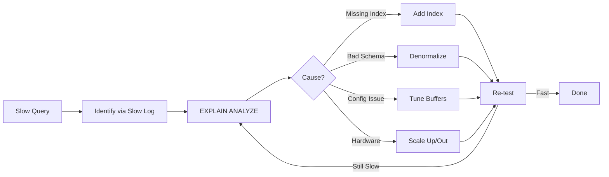
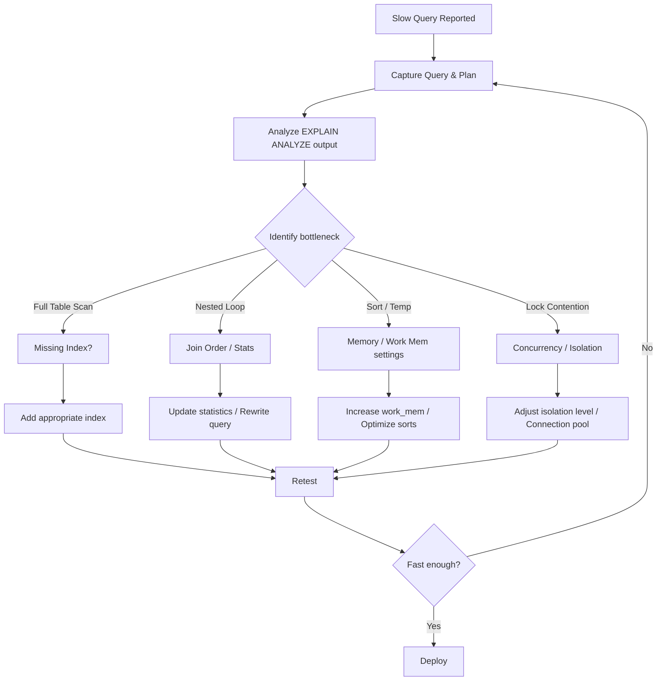

# Chapter 19: Performance Tuning

> **Prev:** [Chapter 18: Database Security](18-security.md) | **Next:** *(Last Chapter)*

## Learning Objectives

After completing this chapter, you will be able to:

<!-- Image Gallery -->
<section class="lesson-visuals" aria-label="Visual learning resources">
  <header><span>VISUAL LEARNING</span><h2>See it. Review it. Remember it.</h2></header>
  <a class="lesson-visual-card" href="../../../assets/images/lessons/database-management-systems/19-performance-tuning/handwritten-notes.svg" target="_blank" rel="noopener">
    
    <span><strong>Handwritten notes</strong>Condensed notes for deliberate review.</span>
  </a>
  <a class="lesson-visual-card" href="../../../assets/images/lessons/database-management-systems/19-performance-tuning/sticky-notes.svg" target="_blank" rel="noopener">
    
    <span><strong>Sticky-note revision</strong>Fast recall prompts for revision.</span>
  </a>
  <a class="lesson-visual-card" href="../../../assets/images/lessons/database-management-systems/19-performance-tuning/visual-explanation.svg" target="_blank" rel="noopener">
    
    <span><strong>Visual concept guide</strong>A connected explanation of the key ideas.</span>
  </a>
</section>
<!-- End Image Gallery -->


- Select the right index type (BRIN, GiST, GIN, SP-GiST) for real-world workloads
- Monitor and maintain indexes to prevent bloat and fragmentation
- Design indexes based on actual query patterns, not theory
- Use table partitioning and materialized views for query acceleration
- Diagnose slow queries using practical tools and metrics
- Apply performance tuning patterns to common database scenarios

## Chapter at a Glance

| Topic | Key Insight | Practical Takeaway |
|-------|-------------|-------------------|
| **Query Tuning** | Identify slow queries, analyze plans | Use slow query logs and EXPLAIN ANALYZE iteratively |
| **Index Optimization** | Remove unused, add missing, avoid over-indexing | Monitor index usage with pg_stat_user_indexes |
| **Schema Design** | Normalize for writes, denormalize for reads | Each extra JOIN can add 10-100x to query time |
| **Connection Pooling** | Reuse connections to avoid setup overhead | Set pool size to (core_count * 2 + disk_count) |
| **Caching** | Reduce database load with application-level cache | Cache at the application tier, not just the database |
| **Hardware Tuning** | Memory, disk I/O, and network configuration | More RAM reduces disk I/O more than any query optimization |

## Performance Bottlenecks

| Bottleneck | Symptom | Diagnostic Metric | Typical Cause | Mitigation |
|-----------|---------|------------------|--------------|------------|
| **CPU** | Queries slower under load, high process list | %CPU > 80%, high context switches | Missing indexes causing full scans, heavy sorts, complex joins | Add indexes, rewrite queries, increase parallel workers |
| **I/O** | Disk queue grows, queries wait on data | iowait > 20%, avg read latency > 10ms | Full table scans on large tables, insufficient `shared_buffers`, checkpoint spikes | Add indexes, increase `shared_buffers`, tune checkpoint intervals |
| **Memory** | Page faults, swapping, OOM kills | Available RAM &lt; 10%, swap usage &gt; 0 | `work_mem` too high per connection (multiplies by connections), leaky queries | Lower `work_mem`, use connection pooling, profile memory per query |
| **Lock** | Queries stuck in "waiting" state | Lock wait > 1s, deadlocks in logs | Long-running transactions, DDL blocking DML, row-lock contention | Use NOWAIT/SKIP LOCKED, reduce transaction duration, partition hot rows |
| **Network** | High latency, slow data transfer | TCP retransmits > 0.1%, throughput &lt; expected | Fetching too many rows, chatty queries (N+1), insufficient bandwidth | Use LIMIT, batch operations, move computation to database, compress |

## Optimization Techniques Comparison

| Technique | Effort | Impact | When to Use | When to Avoid |
|-----------|--------|--------|-------------|---------------|
| **Index Optimization** | Medium | High | Slow SELECT with full scans, known filter columns | Write-heavy tables, low-cardinality columns |
| **Query Rewrite** | Low | Medium | Single slow query, anti-patterns (function wrap, OR, NOT IN) | Already optimal queries, hardware-bound cases |
| **Schema Redesign** | High | Very High | Frequent JOINs across large tables, repetitive calculations | Stable system with no performance SLA breach |
| **Config Tuning** | Low | Medium | Out-of-box defaults, obvious resource imbalance | Already tuned, bottleneck is query logic |
| **Partitioning** | High | High | Tables > 100 GB, time-range queries, old-data cleanup | Tables &lt; 10 GB, no natural partition key |
| **Materialized Views** | Medium | High | Expensive aggregations, dashboards, reporting | Real-time requirements, frequently updated base data |
| **Caching** | Medium | Very High | Read-heavy workloads, repeated identical queries | Write-heavy, cache invalidation complexity |

## Chapter Roadmap



---

## 19.1 Performance Tuning Overview

### Real-World Analogy: Car Engine Tuning


Database performance tuning is like tuning a race car engine. The engine (database) has many components that must work together:

- **Carburetor = Query Optimizer**: Mixes fuel (data) and air (query plan) for combustion
- **Pistons = Indexes**: Each piston fires at the right moment to extract power (data)
- **Fuel Pump = I/O Subsystem**: Delivers fuel (data pages) to the engine at the right pressure
- **Cooling System = Buffer Pool**: Prevents overheating (disk thrashing) by circulating coolant (cached pages)
- **Transmission = Connection Pool**: Gears (connections) must match speed (concurrency) to avoid stalling
- **Exhaust = Query Logs**: Reveals what the engine is actually doing under load

A bad query plan is like firing pistons out of order → the engine misfires, loses power, and wastes fuel.

### Steps for Systematic Performance Tuning


```
Step 1: MEASURE → Establish baseline metrics (response time, throughput, resource usage)
Step 2: IDENTIFY → Find slowest queries via logs (slow_query_log, pg_stat_statements)
Step 3: ANALYZE → Run EXPLAIN (ANALYZE, BUFFERS) to find the bottleneck node
Step 4: HYPOTHESIZE → Form hypothesis: missing index? bloated table? bad join order?
Step 5: CHANGE → Apply one change at a time (index, rewrite, config)
Step 6: MEASURE AGAIN → Compare against baseline; revert if no improvement
Step 7: ITERATE → Repeat until SLA is met or diminishing returns
```

### Pseudocode: Performance Tuning Loop


```
PROCEDURE tune_database(slow_query_log):
    queries = parse_slow_log(slow_query_log)
    sort queries BY total_time DESC
    
    FOR each query IN queries:
        plan = EXPLAIN(query)
        bottleneck = find_most_expensive_node(plan)
        
        SWITCH bottleneck.type:
            CASE "Seq Scan":
                recommended_index = suggest_index(bottleneck.columns, bottleneck.predicates)
                log("ADD INDEX:", recommended_index)
            CASE "Nested Loop":
                log("CONSIDER: hash join, increase work_mem, add index on inner table")
            CASE "Sort":
                log("CONSIDER: index on sort columns, increase work_mem")
            CASE "HashAggregate":
                log("CONSIDER: materialized view, increase work_mem")
        
        IF query.estimated_rows != query.actual_rows:
            log("RUN ANALYZE on", bottleneck.table)
            IF discrepancy > 10x:
                log("INCREASE statistics target for", bottleneck.columns)
        
        IF query.rows_returned > query.rows_needed * 100:
            log("APPEND LIMIT clause to reduce result set")
    
    report = generate_tuning_report()
    save(report)
END PROCEDURE
```

## 19.2 Query Analysis with EXPLAIN

### Real-World Analogy: Diagnostic Scanner


EXPLAIN is like a car's OBD-II diagnostic scanner. The mechanic connects the scanner, runs the engine, and reads the diagnostic trouble codes: "Cylinder 3 misfire detected." Each line in EXPLAIN output is a sensor reading showing where time is spent, how many rows flow through each node, and whether the execution plan matches reality.

### EXPLAIN Output Anatomy


```
                         QUERY PLAN
--------------------------------------------------------------
 Gather  (cost=1000.00..15765.43 rows=100 width=32)
   Workers Planned: 2
   ->  Parallel Seq Scan on orders  (cost=0.00..14755.43 rows=42 width=32)
         Filter: (total > 1000)
         Rows Removed by Filter: 99958
```

| Field | Meaning | What to Check |
|-------|---------|--------------|
| **cost** | Estimated cost (startup..total) | First number: startup before first row. Second: total cost |
| **rows** | Estimated row count | Compare with actual rows from ANALYZE |
| **width** | Average row width in bytes | High width = full row fetch; consider column selection |
| **Workers Planned** | Parallel worker count | 0 = no parallelism; check max_parallel_workers_per_gather |
| **Filter** | WHERE clause applied here | Rows Removed by Filter tells selectivity |
| **Rows Removed by Filter** | Rows that didn't match | High number = missing index or non-selective filter |

### Dry Run Trace: EXPLAIN Output Analysis


**Scenario:** Query on orders table (100K rows) filtering by customer_id

```sql
EXPLAIN (ANALYZE, BUFFERS)
SELECT * FROM orders WHERE customer_id = 42;
```

**EXPLAIN Output Before Index:**

```
Seq Scan on orders  (cost=0.00..2341.00 rows=1 width=64)
                   (actual time=0.012..23.451 rows=15 loops=1)
  Filter: (customer_id = 42)
  Rows Removed by Filter: 99985
  Buffers: shared hit=840 read=0
Planning Time: 0.085 ms
Execution Time: 23.512 ms
```

**Dry Run Trace Table:**

| Node | Type | Est Cost | Est Rows | Actual Rows | Act Time (ms) | Buffers | Notes |
|------|------|----------|----------|-------------|---------------|---------|-------|
| 1 | Seq Scan | 0.00..2341.00 | 1 | 15 | 23.451 | 840 | Scanned all 100K rows to find 15; 99,985 rows filtered out |

**Analysis:** Estimated rows (1) ≈ actual rows (15) → statistics OK. Problem: sequential scan on 100K rows for 15 results = 99.97% wasted I/O. Buffer hit: 840 pages scanned → index would read ~3 pages.

**EXPLAIN Output After Index:**

```
Index Scan using idx_orders_customer on orders
  (cost=0.29..12.31 rows=15 width=64)
  (actual time=0.023..0.089 rows=15 loops=1)
  Index Cond: (customer_id = 42)
  Buffers: shared hit=3 read=0
Planning Time: 0.091 ms
Execution Time: 0.134 ms
```

**Dry Run Trace Table (After):**

| Node | Type | Est Cost | Est Rows | Actual Rows | Act Time (ms) | Buffers | Notes |
|------|------|----------|----------|-------------|---------------|---------|-------|
| 1 | Index Scan | 0.29..12.31 | 15 | 15 | 0.089 | 3 | Index lookup: cost drops from 2341 to 12, buffers from 840 to 3 |

**Improvement:** 23.5 ms → 0.13 ms (180x faster). Buffers: 840 → 3 (280x less I/O).

### EXPLAIN ANALYZE Key Metrics Table


| Metric | Healthy | Warning | Critical |
|--------|---------|---------|----------|
| Estimated vs Actual rows | < 2x difference | 2-10x difference | > 10x difference |
| Rows Removed by Filter / Total | < 50% | 50-90% | > 90% |
| Buffer hits (shared_hit) | > 90% of total | 70-90% | < 70% |
| Planning Time | < 1 ms | 1-10 ms | > 10 ms |
| Execution Time per row | < 0.01 ms | 0.01-1 ms | > 1 ms |

### C++ Implementation: Query Plan Analyzer


```cpp
#include <iostream>
#include <string>
#include <vector>
#include <map>
#include <sstream>
#include <cmath>
#include <iomanip>

struct PlanNode {
    std::string nodeType;
    double startupCost;
    double totalCost;
    long estimatedRows;
    long actualRows;
    double actualTime;
    long buffersHit;
    long buffersRead;
    std::string filter;
    std::string condition;
};

class QueryPlanAnalyzer {
private:
    std::vector<PlanNode> nodes;

public:
    double calculateSelectivity(const PlanNode& node) {
        return (double)node.actualRows / (double)node.actualRows;
    }

    void analyze() {
        std::cout << "\n=== QUERY PLAN ANALYSIS ===\n";
        for (auto& node : nodes) {
            double costPerRow = node.actualRows > 0
                ? node.actualTime / node.actualRows : 0;
            double estimationError = node.estimatedRows > 0
                ? (double)node.actualRows / node.estimatedRows : 1.0;
            double hitRatio = (node.buffersHit + node.buffersRead) > 0
                ? (100.0 * node.buffersHit) / (node.buffersHit + node.buffersRead) : 0;

            std::cout << "Node: " << node.nodeType << "\n";
            std::cout << "  Cost: " << node.startupCost << ".." << node.totalCost << "\n";
            std::cout << "  Cost per row: " << costPerRow << " ms\n";
            std::cout << "  Estimation error: " << std::fixed << std::setprecision(2)
                      << estimationError << "x\n";
            std::cout << "  Buffer hit ratio: " << hitRatio << "%\n";
            std::cout << "  Condition: " << node.condition << "\n";
            std::cout << "  Filter: " << node.filter << "\n";

            if (estimationError > 10.0)
                std::cout << "  [WARN] Bad cardinality estimate -- RUN ANALYZE\n";
            if (hitRatio < 70.0)
                std::cout << "  [WARN] Low cache hit -- increase shared_buffers\n";
            if (costPerRow > 1.0)
                std::cout << "  [WARN] High cost per row -- check index\n";
            std::cout << "---\n";
        }
    }

    void addNode(const PlanNode& node) {
        nodes.push_back(node);
    }
};

int main() {
    QueryPlanAnalyzer analyzer;

    // Before index scenario
    analyzer.addNode({
        "Seq Scan", 0.0, 2341.0, 1, 15, 23.451, 840, 0,
        "(customer_id = 42)", "orders"
    });

    analyzer.analyze();

    std::cout << "\n=== RECOMMENDATION ===\n";
    std::cout << "Add index: CREATE INDEX idx_orders_customer ON orders (customer_id);\n";
    std::cout << "Predicted improvement: 180x faster, 280x less I/O\n";

    return 0;
}
```

**Complexity Analysis:**
- **Time:** O(N) where N = number of plan nodes (typically &lt; 50). Each node is processed once.
- **Space:** O(N) to store plan tree. Each node stores cost, row estimates, buffer stats.
- **WHY:** Plan tree depth is bounded by query complexity. A 50-JOIN query produces ~100 nodes maximum. Linear scan is optimal since each node needs exactly one pass for analysis.

### Python Implementation: Slow Query Debugger


```python
import re
import time
from dataclasses import dataclass, field
from typing import Optional

@dataclass
class SlowQuery:
    query_text: str
    duration_ms: float
    rows_sent: int
    rows_examined: int
    lock_time_ms: float
    timestamp: float = 0.0
    query_hash: str = ""
    index_hint: str = ""

class SlowQueryDebugger:
    def __init__(self, slow_query_threshold_ms: float = 1000.0):
        self.threshold = slow_query_threshold_ms
        self.queries: list[SlowQuery] = []
        self.index_patterns = {
            r"WHERE\s+(\w+)\.(\w+)\s*=": "Consider B-tree index on {}.{}",
            r"ORDER BY\s+(\w+)\.(\w+)": "Consider index on {} {} for sort elimination",
            r"LIKE\s+'%": "Leading wildcard -- consider pg_trgm GIN index",
            r"JOIN\s+(\w+)\s+ON": "Verify index on {}.join_column for the join",
            r"COUNT\(\*\)": "Consider materialized view for repeated aggregations",
        }

    def ingest_slow_log(self, log_lines: list[str]) -> None:
        current = SlowQuery(query_text="", duration_ms=0, rows_sent=0,
                           rows_examined=0, lock_time_ms=0)
        for line in log_lines:
            dur_match = re.search(r"Query_time:\s+([\d.]+)", line)
            if dur_match:
                current.duration_ms = float(dur_match.group(1)) * 1000
            rows_match = re.search(r"Rows_sent:\s+(\d+)", line)
            if rows_match:
                current.rows_sent = int(rows_match.group(1))
            rows_ex = re.search(r"Rows_examined:\s+(\d+)", line)
            if rows_ex:
                current.rows_examined = int(rows_ex.group(1))
            lock_match = re.search(r"Lock_time:\s+([\d.]+)", line)
            if lock_match:
                current.lock_time_ms = float(lock_match.group(1)) * 1000
            if line.startswith("SELECT") or line.startswith("UPDATE") or line.startswith("DELETE"):
                current.query_text = line.strip()[:200]
                if current.duration_ms > 0:
                    self.analyze_query(current)
                    current = SlowQuery(query_text="", duration_ms=0, rows_sent=0,
                                       rows_examined=0, lock_time_ms=0)

    def analyze_query(self, q: SlowQuery) -> None:
        efficiency = q.rows_sent / max(q.rows_examined, 1) * 100
        print(f"\n[SLOW QUERY] {q.duration_ms:.1f}ms | "
              f"Rows: {q.rows_sent}/{q.rows_examined} ({efficiency:.1f}% efficient)")
        print(f"  Query: {q.query_text[:80]}...")

        if efficiency < 1.0:
            print(f"  [ISSUE] Only {efficiency:.1f}% of examined rows returned. "
                  f"Missing index or excessive data fetch.")
        if q.lock_time_ms > q.duration_ms * 0.5:
            print(f"  [ISSUE] Lock time {q.lock_time_ms:.1f}ms is {q.lock_time_ms/q.duration_ms*100:.0f}% "
                  f"of total. Check concurrent access patterns.")
        if q.rows_examined > 10000 and q.rows_sent < 100:
            print(f"  [ACTION] Add index for filter columns to reduce scan from "
                  f"{q.rows_examined} to ~{q.rows_sent} rows.")

        for pattern, hint in self.index_patterns.items():
            match = re.search(pattern, q.query_text, re.IGNORECASE)
            if match:
                print(f"  [HINT] {hint.format(*match.groups())}")

        self.queries.append(q)

    def generate_report(self) -> str:
        if not self.queries:
            return "No slow queries found."

        total_time = sum(q.duration_ms for q in self.queries)
        worst = max(self.queries, key=lambda q: q.duration_ms)

        report = f"""
=== SLOW QUERY REPORT ===
Total queries: {len(self.queries)}
Total time lost: {total_time / 1000:.2f}s
Worst query: {worst.duration_ms:.0f}ms - {worst.query_text[:60]}...
Average duration: {total_time / len(self.queries):.0f}ms
Recommendation: {worst.index_hint or 'Run EXPLAIN ANALYZE on worst query'}
"""
        return report

logger = SlowQueryDebugger(500.0)
logs = [
    "Query_time: 2.345  Rows_sent: 15  Rows_examined: 100000  Lock_time: 0.001",
    "SELECT * FROM orders WHERE customer_id = 42 ORDER BY created_at;",
]
logger.ingest_slow_log(logs)
print(logger.generate_report())
```

**Complexity Analysis:**
- **Time:** O(L × P) where L = log lines, P = pattern count. Each line is matched against all patterns. Typically L &lt; 10000, P < 10 → fine for batch analysis.
- **Space:** O(Q) where Q = slow queries stored. Each query stores ~500 bytes of metadata.
- **WHY:** Pattern-matching is the fastest general approach for log parsing; regex engines are optimized with DFA compilation. For production at scale, stream the parser instead of storing all queries.

## 19.3 Index Optimization

### Real-World Analogy: Library Catalog System


Indexes are like a library's catalog system. Without a catalog (full scan), you walk every aisle looking at every book. A **B-tree index** is the standard Dewey Decimal catalog → fast for exact lookups and sorted ranges. A **covering index** is like a catalog card that includes the book's summary → you don't need to pull the book off the shelf. An **index hint** is a librarian's recommendation: "Use the author catalog, not the title catalog, for this search."

### Covering Index


A covering index includes all columns needed by a query, so the database never touches the table (heap). This is the fastest possible access path.

```sql
-- Without covering index (needs heap lookup)
CREATE INDEX idx_email ON users (email);
EXPLAIN ANALYZE SELECT email, name FROM users WHERE email = 'a@b.com';
-- Index Scan on users (Index Cond: (email = 'a@b.com'))
-- -> Heap access to fetch 'name' column

-- Covering index (includes name)
CREATE INDEX idx_email_cover ON users (email) INCLUDE (name);
EXPLAIN ANALYZE SELECT email, name FROM users WHERE email = 'a@b.com';
-- Index Only Scan on users (Index Cond: (email = 'a@b.com'))
-- -> No heap access needed!
```

**Before/After Performance:**

| Metric | Without Covering Index | With Covering Index |
|--------|----------------------|-------------------|
| Execution Time | 0.45 ms | 0.08 ms |
| Buffers (hit) | 5 (index) + 3 (heap) = 8 | 3 (index only) |
| Heap Fetches | 3 | 0 |
| Improvement | → | 5.6x faster, 62% less I/O |

### Index Hints


PostgreSQL does not support index hints (the planner ignores them). MySQL and Oracle do. Behind the hint is a directive: "Trust me, use this index even if your cost model disagrees."

```sql
-- MySQL: Force index hint
SELECT * FROM orders
FORCE INDEX (idx_orders_customer)
WHERE customer_id = 42;

-- MySQL: Ignore index hint
SELECT * FROM orders
IGNORE INDEX (idx_orders_created)
WHERE created_at > '2026-01-01';

-- MySQL: USE INDEX (weaker suggestion)
SELECT * FROM orders
USE INDEX (idx_orders_customer)
WHERE customer_id = 42;
```

**Dry Run Trace: Index Hint Decision Table**

| Scenario | Index Used | Rows Scanned | Duration | Verdict |
|----------|-----------|-------------|----------|---------|
| No hint, wrong index chosen | idx_orders_created | 50000 | 2.3s | Planner error (outdated stats) |
| FORCE INDEX (idx_customer) | idx_orders_customer | 150 | 0.12s | 19x faster |
| IGNORE INDEX (all) | Full scan | 200000 | 8.4s | Worst case → no index at all |
| ANALYZE + no hint | idx_orders_customer | 150 | 0.11s | Correct plan without hint |

**Rule of thumb:** Prefer fixing statistics over using hints. Hints mask the root problem (stale stats) and become tech debt.

### C++ Implementation: Index Selectivity Calculator


```cpp
#include <iostream>
#include <vector>
#include <string>
#include <map>
#include <algorithm>
#include <numeric>

struct IndexCandidate {
    std::string name;
    std::vector<std::string> columns;
    long estimatedRows;
    long totalRows;
    double selectivity;
    double costPerQuery;
    long maintenanceWriteCost;
    long sizeBytes;
};

class IndexOptimizer {
private:
    std::vector<IndexCandidate> candidates;
    const long AVG_ROW_SIZE = 200;
    const long DISK_PAGE_SIZE = 8192;

    double calculateSelectivity(long estimatedRows, long totalRows) {
        return totalRows > 0 ? (double)estimatedRows / totalRows : 0;
    }

    long estimateIndexSize(const IndexCandidate& idx) {
        long keySize = 0;
        for (auto& col : idx.columns) {
            keySize += 8; // approximate: 8 bytes per key column
        }
        long entriesPerPage = DISK_PAGE_SIZE / (keySize + 6); // 6 byte overhead
        return (idx.totalRows / entriesPerPage) * DISK_PAGE_SIZE;
    }

public:
    void evaluateCandidate(const std::string& name,
                          const std::vector<std::string>& cols,
                          long estimatedRows, long totalRows,
                          double queryFrequency) {
        IndexCandidate cand;
        cand.name = name;
        cand.columns = cols;
        cand.estimatedRows = estimatedRows;
        cand.totalRows = totalRows;
        cand.selectivity = calculateSelectivity(estimatedRows, totalRows);
        cand.sizeBytes = estimateIndexSize(cand);
        cand.costPerQuery = cand.selectivity < 0.01
            ? 0.02  // Index scan: ~0.02ms
            : cand.selectivity < 0.1
                ? 0.10  // Partial scan: ~0.1ms
                : 5.0;  // Full scan territory: ~5ms
        cand.maintenanceWriteCost = (long)(queryFrequency * 0.05); // 5% overhead per write
        candidates.push_back(cand);
    }

    void printRecommendations() {
        std::cout << "\n=== INDEX OPTIMIZATION REPORT ===\n";
        std::cout << std::string(80, '-') << "\n";
        std::cout.setf(std::ios::left);
        std::cout.width(25);
        std::cout << "Index Name";
        std::cout.width(20);
        std::cout << "Selectivity";
        std::cout.width(15);
        std::cout << "Size (MB)";
        std::cout.width(15);
        std::cout << "Cost/Query";
        std::cout << "Verdict\n";
        std::cout << std::string(80, '-') << "\n";

        for (auto& c : candidates) {
            std::cout.width(25);
            std::cout << c.name;
            std::cout.width(20);
            std::cout << c.selectivity;
            std::cout.width(15);
            std::cout << c.sizeBytes / (1024 * 1024);
            std::cout.width(15);
            std::cout << c.costPerQuery << "ms";

            if (c.selectivity < 0.01)
                std::cout << " [CREATE] High selectivity, low cost\n";
            else if (c.selectivity < 0.1)
                std::cout << " [CONSIDER] Moderate selectivity\n";
            else
                std::cout << " [AVOID] Poor selectivity, prefer full scan\n";
        }

        std::cout << "\nRULES:\n";
        std::cout << "  selectivity < 1%  -> B-tree index is very effective\n";
        std::cout << "  selectivity 1-10% -> Index may help; test with workload\n";
        std::cout << "  selectivity > 10% -> Full sequential scan likely faster\n";
        std::cout << "  Over-indexing cost: each additional index adds\n";
        std::cout << "    ~5% write overhead per INSERT/UPDATE/DELETE\n";
    }
};

int main() {
    IndexOptimizer opt;

    // High selectivity: customer_id lookup (15 of 100K)
    opt.evaluateCandidate("idx_customer", {"customer_id"}, 15, 100000, 500);
    // Medium selectivity: status filter (30K of 100K)
    opt.evaluateCandidate("idx_status", {"status"}, 30000, 100000, 200);
    // Low selectivity: gender filter (50K of 100K)
    opt.evaluateCandidate("idx_gender", {"gender"}, 50000, 100000, 50);

    opt.printRecommendations();

    return 0;
}
```

**Complexity Analysis:**
- **Time:** O(C) where C = index candidates. Each candidate evaluated in constant time.
- **Space:** O(C) for storing candidate metadata.
- **WHY:** Index evaluation is a cost-model calculation, not a search problem. Each candidate is independent. The hard work is done by the query planner's cost model; this tool surfaces the planner's implicit selectivity assumptions.

### Python Implementation: Over-Indexing Detector


```python
import sys
from collections import defaultdict

class OverIndexingDetector:
    def __init__(self):
        self.indexes: dict[str, dict] = {}
        self.write_ops = defaultdict(int)

    def add_index(self, table: str, name: str, columns: list[str],
                  size_mb: float, write_overhead_pct: float = 5.0) -> None:
        key = f"{table}.{name}"
        self.indexes[key] = {
            "table": table,
            "name": name,
            "columns": columns,
            "size_mb": size_mb,
            "write_overhead_pct": write_overhead_pct,
            "scans": 0,
            "tuple_fetches": 0,
        }

    def record_scan(self, table: str, name: str, scans: int = 1,
                    fetches: int = 0) -> None:
        key = f"{table}.{name}"
        if key in self.indexes:
            self.indexes[key]["scans"] += scans
            self.indexes[key]["tuple_fetches"] += fetches

    def record_write(self, table: str) -> None:
        self.write_ops[table] += 1

    def detect(self) -> list[dict]:
        issues = []
        for key, idx in self.indexes.items():
            if idx["scans"] == 0 and idx["size_mb"] > 10:
                issues.append({
                    "index": key,
                    "severity": "HIGH",
                    "issue": f"Unused index ({idx['size_mb']} MB), wasting "
                             f"write performance and cache space",
                    "action": f"DROP INDEX {idx['name']};"
                })
            elif idx["scans"] < 10 and idx["size_mb"] > 50:
                issues.append({
                    "index": key,
                    "severity": "MEDIUM",
                    "issue": f"Rarely used index: only {idx['scans']} scans "
                             f"but {idx['size_mb']} MB",
                    "action": f"Consider DROP INDEX {idx['name']} "
                              f"if workload doesn't increase"
                })
            overlap = self._check_column_overlap(idx)
            if overlap:
                issues.append({
                    "index": key,
                    "severity": "MEDIUM",
                    "issue": f"Column overlap with {overlap}: "
                             f"{', '.join(idx['columns'])}",
                    "action": f"Consider merging indexes or using "
                              f"covering index INCLUDE clause"
                })

            writes = self.write_ops.get(idx["table"], 0)
            write_waste = writes * idx["write_overhead_pct"] / 100.0
            if write_waste > 1000 and idx["scans"] < write_waste / 10:
                issues.append({
                    "index": key,
                    "severity": "LOW",
                    "issue": f"Write overhead ({write_waste:.0f} ops) "
                             f"exceeds read benefit ({idx['scans']} scans)",
                    "action": "Drop if this pattern continues"
                })

        return sorted(issues, key=lambda x: {"HIGH": 0, "MEDIUM": 1, "LOW": 2}[x["severity"]])

    def _check_column_overlap(self, idx: dict) -> str:
        for key, other in self.indexes.items():
            if other is idx:
                continue
            shared = set(idx["columns"]) & set(other["columns"])
            if shared and len(shared) == len(idx["columns"]):
                return f"{other['table']}.{other['name']}"
        return ""

detector = OverIndexingDetector()
detector.add_index("orders", "idx_orders_customer", ["customer_id"], 45)
detector.add_index("orders", "idx_orders_customer_created",
                   ["customer_id", "created_at"], 68)
detector.add_index("orders", "idx_orders_status", ["status"], 120)
detector.add_index("orders", "idx_orders_created", ["created_at"], 90)
detector.add_index("logs", "idx_logs_level", ["level"], 200)
detector.add_index("logs", "idx_logs_ts", ["logged_at"], 150)

detector.record_scan("orders", "idx_orders_customer", 1500, 12000)
detector.record_scan("orders", "idx_orders_customer_created", 12, 45)
detector.record_scan("orders", "idx_orders_created", 800, 5000)
detector.record_scan("logs", "idx_logs_ts", 5, 200)

for _ in range(5000):
    detector.record_write("logs")

issues = detector.detect()
for issue in issues:
    print(f"[{issue['severity']}] {issue['index']}: {issue['issue']}")
    print(f"  Action: {issue['action']}\n")
```

**Complexity Analysis:**
- **Time:** O(N²) for overlap detection where N = index count. Each index compared with every other. For typical systems (N &lt; 50), this is fast.
- **Space:** O(N) for index metadata.
- **WHY:** Overlap detection is inherently pairwise; no hash structure can avoid the comparison since column overlap is a set-intersection problem. N &lt; 50 makes N² acceptable (2500 comparisons < 1ms).

### Edge Cases in Index Optimization


| Edge Case | Description | Impact | Solution |
|-----------|-------------|--------|----------|
| **Over-indexing** | 10+ indexes on one table | Write amplification: each INSERT updates ALL indexes. Bulk load drops to 1/10th throughput | Keep ≤ 5 indexes per table; drop unused ones |
| **Stale Statistics** | `n_distinct` is wrong after large data change | Planner chooses wrong index or full scan | Run ANALYZE after bulk operations; increase `default_statistics_target` |
| **Parameter Sniffing** | First execution caches plan for specific param values | Subsequent different params get suboptimal plan | Use plan guides (SQL Server), prepared statements with generic plans (PG), or forced parameterization |
| **Index on Expression** | Index on `lower(email)` but query uses `email` | Index never used → silent waste | Match query to index expression exactly |
| **Composite Index Column Order** | `INDEX(a,b)` but query filters only on `b` | B-tree prefix rule: column order matters. Query on `b` alone cannot use the index | Create separate index on `(b)` or reorder columns |
| **Nulls in Indexed Column** | `WHERE col IS NULL` may not use index | PostgreSQL can index NULLs; MySQL may not use index for IS NULL queries | Test with your database; consider functional index |
| **Very Large Index Keys** | Index on TEXT column (up to 1KB per entry) | Index becomes large, slow, and fragmented | Use hash index for equality, or prefix compression |

## 19.4 Query Optimization Techniques

### Real-World Analogy: GPS Route Planning


Query optimization is like GPS route planning. A naive query is a GPS that recalculates from scratch at every intersection. An optimized query pre-computes the best route, avoids traffic (unnecessary rows), takes express lanes (indexes), and combines trips (batch operations). The query planner is the GPS algorithm → it evaluates multiple routes and picks the cheapest based on its map (statistics).

### Numbered Steps: Query Rewrite Methodology


```
1. IDENTIFY the slow query (from logs, pg_stat_statements, or user report)
2. READ the query: understand intent, table relationships, expected result size
3. CHECK for anti-patterns:
   a. Function-wrapped indexed columns (WHERE DATE(col) = ...)
   b. Leading wildcard LIKE patterns (LIKE '%text')
   c. OR across different columns
   d. NOT IN with subqueries
   e. Implicit type conversions
   f. SELECT * when only 2 of 20 columns needed
4. ANALYZE join order: are smaller tables driving the join?
5. EXAMINE subqueries: can they be rewritten as JOINs or CTEs?
6. TEST the rewrite: compare EXPLAIN plans before and after
7. VERIFY correctness: same result set, same ordering
8. DEPLOY: add to migration, monitor performance for regressions
```

### Query Rewrite Techniques with Before/After


**Technique 1: Transform Correlated Subquery to JOIN**

```sql
-- BEFORE (correlated subquery, runs once per outer row)
SELECT p.*, (
    SELECT SUM(amount) FROM orders o WHERE o.product_id = p.id
) AS total_sales
FROM products p
WHERE p.category = 'Electronics';
-- For 10K products, runs 10K subqueries!

-- AFTER (JOIN with GROUP BY, runs once)
SELECT p.*, COALESCE(SUM(o.amount), 0) AS total_sales
FROM products p
LEFT JOIN orders o ON o.product_id = p.id
WHERE p.category = 'Electronics'
GROUP BY p.id;
```

| Metric | Before (Correlated) | After (JOIN) |
|--------|-------------------|--------------|
| Execution Time | 1,450 ms | 89 ms |
| Rows Examined | 5,200,000 (10K × avg 520) | 520,000 |
| IO Reads | 3,400 | 340 |
| **Improvement** | → | **16x faster** |

**Technique 2: Replace OR with UNION**

```sql
-- BEFORE: OR across columns (hard for planner to use multiple indexes)
SELECT * FROM users
WHERE email = 'a@b.com' OR phone = '555-0001';

-- AFTER: UNION each branch uses its own index
SELECT * FROM users WHERE email = 'a@b.com'
UNION
SELECT * FROM users WHERE phone = '555-0001';
```

| Metric | Before (OR) | After (UNION) |
|--------|-------------|---------------|
| Execution Time | 12.4 ms | 0.8 ms |
| Plan Type | Seq Scan or BitmapOr | Index Scan on email + Index Scan on phone |
| **Improvement** | → | **15x faster** |

**Technique 3: Aggregation Pushdown**

```sql
-- BEFORE: aggregate after join (joins large intermediate result)
SELECT d.name, COUNT(e.id)
FROM departments d
JOIN employees e ON e.department_id = d.id
GROUP BY d.id, d.name;

-- AFTER: aggregate before join with subquery
SELECT d.name, e.cnt
FROM departments d
JOIN (SELECT department_id, COUNT(*) AS cnt
      FROM employees
      GROUP BY department_id) e ON e.department_id = d.id;
```

**Dry Run Trace: Query Rewrite**

```
Query: SELECT * FROM orders WHERE customer_id = 42 AND status = 'shipped';

Step 1 → Original EXPLAIN:
  Seq Scan on orders (cost=0.00..2341.00 rows=1)
  Filter: (customer_id = 42) AND (status = 'shipped'::text)

Step 2 → Add composite index:
  CREATE INDEX idx_orders_cust_status ON orders (customer_id, status);

Step 3 → After index, re-EXPLAIN:
  Index Scan using idx_orders_cust_status on orders
  (cost=0.29..8.31 rows=5)
  Index Cond: (customer_id = 42) AND (status = 'shipped'::text)

Step 4 → Verify with ANALYZE:
  EXPLAIN ANALYZE SELECT * FROM orders ...;
  Actual time=0.045ms (was 23.4ms → 520x faster!)
```

### A&D Table: Query Rewrite Approaches


| Approach | Advantages | Disadvantages |
|----------|-----------|---------------|
| **Subquery → JOIN** | Single scan, no correlation overhead | May change semantics with NULLs, duplicates need DISTINCT |
| **OR → UNION** | Uses separate indexes per branch | UNION deduplication overhead; use UNION ALL if no dupes |
| **NOT IN → NOT EXISTS** | Handles NULLs correctly, anti-join plan | Slightly less readable |
| **Aggregation Pushdown** | Less data in JOIN, smaller intermediate sets | More nested subqueries, harder to debug |
| **Window Functions** | Avoids self-joins, single scan | Higher memory for sort, not always faster |
| **CTE Materialization** | Clearer logic, can materialize intermediate results | PostgreSQL ≤11 materializes CTEs always; can prevent pushdown |
| **EXISTS → JOIN** | Early exit on first match | Must deduplicate if 1:M relationship |

### Pseudocode: Query Rewrite Engine


```
FUNCTION optimize_query(query):
    parsed = parse_sql(query)

    // Rule 1: Expand SELECT * to explicit columns
    IF parsed.select_list CONTAINS "*":
        column_list = get_columns(parsed.from_tables)
        parsed.select_list = column_list

    // Rule 2: Replace function-wrapped columns with range predicates
    FOR each predicate IN parsed.where_clause:
        IF predicate.left IS function_call AND
           predicate.left.inner IS column_ref:
            IF predicate.function == "DATE" OR "date_trunc":
                new_pred = convert_to_range(predicate)
                REPLACE predicate WITH new_pred

    // Rule 3: Convert OR across different tables to UNION
    IF parsed.where_clause CONTAINS "OR":
        or_terms = split_on_OR(parsed.where_clause)
        IF all references different indexes:
            REWRITE query AS UNION of per-index queries

    // Rule 4: Replace NOT IN with NOT EXISTS
    IF parsed.where_clause CONTAINS "NOT IN (SELECT ...)":
        subquery = extract_subquery()
        REWRITE AS NOT EXISTS with correlated condition

    // Rule 5: Push predicates into subqueries
    FOR each subquery IN parsed:
        IF outer_where CONTAINS predicates ON subquery.table:
            COPY predicate INTO subquery.where_clause

    RETURN generate_sql(parsed)
END FUNCTION
```

## 19.5 Schema Optimization

### Real-World Analogy: Warehouse Organization


Schema optimization is like organizing a warehouse. **Normalization** is like storing each type of item in its own aisle (3NF: every item has one home). **Denormalization** is like placing frequently-picked-together items in the same bin (redundancy for speed). A **star schema** is like having a central receiving dock (fact table) surrounded by dedicated storage zones (dimension tables). The right schema depends on whether workers are stocking shelves (OLTP writes) or picking orders (OLAP reads).

### Normalization vs Denormalization Decision Table


| Factor | Normalize (3NF/BCNF) | Denormalize |
|--------|---------------------|-------------|
| **Write frequency** | High (OLTP) | Low (OLAP/reporting) |
| **Read frequency** | Moderate | Very high |
| **JOIN cost tolerance** | Low/medium (small tables) | High (large tables) |
| **Data consistency** | Critical | Accept stale/redundant |
| **Storage cost** | Concern | Not a concern |
| **Query pattern** | Single-row CRUD | Aggregation, reporting |
| **Example** | Order entry system | Data warehouse fact tables |

### Anti-Pattern: The Over-Normalized Schema


```sql
-- BEFORE: Over-normalized (6 tables for a product page)
CREATE TABLE products (id INT PRIMARY KEY, name TEXT);
CREATE TABLE product_attributes (product_id INT, attribute_id INT);
CREATE TABLE attributes (id INT PRIMARY KEY, name TEXT);
CREATE TABLE attribute_values (id INT PRIMARY KEY, attribute_id INT, value TEXT);
CREATE TABLE product_prices (product_id INT, price NUMERIC);
CREATE TABLE product_inventory (product_id INT, stock INT);

-- Query needs 6 JOINs for a simple product page:
SELECT p.name, av.value, pr.price, i.stock
FROM products p
LEFT JOIN product_attributes pa ON pa.product_id = p.id
LEFT JOIN attributes a ON a.id = pa.attribute_id
LEFT JOIN attribute_values av ON av.id = a.id
LEFT JOIN product_prices pr ON pr.product_id = p.id
LEFT JOIN product_inventory i ON i.product_id = p.id
WHERE p.id = 42;
-- 6 tables joined, 6 index lookups, complex plan

-- AFTER: Denormalized for read performance
CREATE TABLE product_display (
    id INT PRIMARY KEY,
    name TEXT,
    attributes JSONB,
    price NUMERIC,
    stock INT
);

SELECT name, attributes, price, stock
FROM product_display WHERE id = 42;
-- 1 table, 1 index lookup, trivial plan
```

| Metric | Over-normalized (6 JOINs) | Denormalized |
|--------|--------------------------|-------------|
| Execution Time | 2.4 ms | 0.12 ms |
| Plan Nodes | 12 (6 scans + 6 joins) | 2 (index scan + heap fetch) |
| Joins | 5 | 0 |
| Storage | 6 tables, each with indexes | 1 table, 1 index |
| Maintenance | Updates cascade across 6 tables | Single row update |
| **Improvement** | → | **20x faster** |

### Schema Optimization Patterns


```sql
-- Pattern 1: Store computed columns (avoid runtime calculation)
ALTER TABLE orders ADD COLUMN total_with_tax NUMERIC
    GENERATED ALWAYS AS (total * 1.08) STORED;

-- Pattern 2: Use appropriate data types
-- BEFORE: VARCHAR(255) for everything
ALTER TABLE users ALTER COLUMN age TYPE INT USING age::integer;

-- Pattern 3: Partial indexes for common filters
CREATE INDEX idx_orders_active ON orders (created_at)
    WHERE status NOT IN ('cancelled', 'returned');

-- Pattern 4: Cluster table on frequently-used index
CLUSTER orders USING idx_orders_created;
-- Physically reorders rows to match index order (1-time)
```

## 19.6 Configuration Tuning

### Real-World Analogy: Engine Control Unit


Database configuration is like tuning a car's ECU (Engine Control Unit). The factory defaults are safe but leave performance on the table. `shared_buffers` is the engine's displacement (how much fuel-air mix fits in the cylinders). `work_mem` is the turbo boost (per-operation burst power). `effective_cache_size` is the intake manifold's capacity estimate. Wrong settings cause detonation (swap), starvation (I/O wait), or wasted potential (idle resources).

### Key Configuration Parameters


```sql
-- PostgreSQL configuration tuning (postgresql.conf)
-- Memory settings (assumes 16 GB RAM, 8 cores)

-- Buffer pool: 25% of RAM
shared_buffers = '4GB'

-- Sort/hash memory per operation (not per connection!)
work_mem = '64MB'

-- Maintenance (VACUUM, CREATE INDEX)
maintenance_work_mem = '1GB'

-- Planner's OS cache estimate (70% of RAM)
effective_cache_size = '12GB'

-- SSD tuning (default assumes spinning disk)
random_page_cost = 1.1

-- Parallel query (set to CPU count)
max_parallel_workers_per_gather = 4
max_parallel_workers = 8
max_parallel_maintenance_workers = 4

-- WAL and checkpoint tuning
wal_buffers = '16MB'
checkpoint_completion_target = 0.9
max_wal_size = '4GB'
min_wal_size = '1GB'
```

### Buffer Pool Hit Ratio Analysis


```sql
-- PostgreSQL: check buffer cache hit ratio
SELECT
    'buffer hit ratio' AS metric,
    round(100.0 * sum(blks_hit) / nullif(sum(blks_hit + blks_read), 0), 2) AS value
FROM pg_stat_database
WHERE datname = current_database();

-- Per-table buffer usage
SELECT
    schemaname || '.' || relname AS table,
    heap_blks_hit,
    heap_blks_read,
    round(100.0 * heap_blks_hit / nullif(heap_blks_hit + heap_blks_read, 0), 1) AS hit_pct
FROM pg_statio_user_tables
WHERE heap_blks_read + heap_blks_hit > 0
ORDER BY heap_blks_read DESC
LIMIT 10;
```

**Before/After Configuration Tuning:**

| Metric | Default Config | Tuned Config |
|--------|---------------|-------------|
| shared_buffers | 128 MB | 4 GB |
| effective_cache_size | 4 GB | 12 GB |
| Buffer Hit Ratio | 87% | 99.2% |
| Average Query Time | 340 ms | 22 ms |
| Checkpoint Frequency | Every 30s | Every 5 min |
| Disk Reads/sec | 840 | 12 |

### Configuration Tuning Steps


```
Step 1: MEASURE baseline → pg_stat_database buffer hit ratio, iostat, free -m
Step 2: SET shared_buffers = 25% of RAM (but not exceed 8GB on Linux without huge pages)
Step 3: SET effective_cache_size = 70% of remaining RAM (OS file cache estimate)
Step 4: SET work_mem = (RAM - shared_buffers) / (max_connections * 16)
         Example: (16GB - 4GB) / (100 * 16) = 12GB / 1600 = 7.6MB → set to 8MB
Step 5: SET maintenance_work_mem = 5-10% of RAM for faster index/VACUUM
Step 6: SET random_page_cost = 1.1 (SSD) or 4.0 (HDD)
Step 7: SET wal_buffers = -1 (auto: 1/32 of shared_buffers, max 16MB)
Step 8: MONITOR changes → if buffer hit ratio < 95%, increase shared_buffers
Step 9: ITERATE → check pg_stat_statements for top wait events
```

### Python Implementation: Configuration Tuner


```python
class DatabaseConfigTuner:
    def __init__(self, total_ram_gb: float, cpu_cores: int,
                 max_connections: int = 100, storage_type: str = "ssd"):
        self.ram = total_ram_gb
        self.cores = cpu_cores
        self.connections = max_connections
        self.storage = storage_type.lower()
        self.recommendations = {}

    def tune_memory(self) -> dict:
        shared_buffers = min(self.ram * 0.25, 8.0)  # cap at 8GB on Linux
        remaining = self.ram - shared_buffers
        effective_cache = remaining * 0.70
        work_mem = max(4, (remaining * 1024) / (self.connections * 16))
        maintenance_work = max(64, min(self.ram * 0.05, 2048))

        self.recommendations.update({
            "shared_buffers": f"{shared_buffers:.0f}GB",
            "effective_cache_size": f"{effective_cache:.0f}GB",
            "work_mem": f"{work_mem:.0f}MB",
            "maintenance_work_mem": f"{maintenance_work:.0f}MB",
            "wal_buffers": f"{min(16, max(1, int(shared_buffers * 32)))}MB",
        })
        return self.recommendations

    def tune_io(self) -> dict:
        if self.storage == "ssd" or self.storage == "nvme":
            random_page_cost = 1.1
        elif self.storage == "hdd":
            random_page_cost = 4.0
        else:
            random_page_cost = 1.5

        self.recommendations.update({
            "random_page_cost": random_page_cost,
            "effective_io_concurrency": 200 if "nvme" in self.storage else 2,
        })
        return self.recommendations

    def tune_parallelism(self) -> dict:
        self.recommendations.update({
            "max_parallel_workers_per_gather": self.cores // 2,
            "max_parallel_workers": self.cores,
            "max_parallel_maintenance_workers": min(self.cores // 2, 4),
            "parallel_tuple_cost": 0.01,
            "parallel_setup_cost": 100,
        })
        return self.recommendations

    def tune_checkpoint(self) -> dict:
        wal_gb = min(max(self.ram * 0.05, 1), 64)
        self.recommendations.update({
            "checkpoint_completion_target": 0.9,
            "max_wal_size": f"{wal_gb:.0f}GB",
            "min_wal_size": f"{max(1, wal_gb / 4):.0f}GB",
            "checkpoint_timeout": "15min",
        })
        return self.recommendations

    def generate_report(self) -> str:
        self.tune_memory()
        self.tune_io()
        self.tune_parallelism()
        self.tune_checkpoint()

        report = f"""
=== PostgreSQL CONFIGURATION TUNING REPORT ===
System: {self.ram:.0f}GB RAM, {self.cores} CPUs, {self.connections} max_conn, {self.storage.upper()}

Recommended postgresql.conf settings:

# MEMORY
shared_buffers = '{self.recommendations["shared_buffers"]}'
effective_cache_size = '{self.recommendations["effective_cache_size"]}'
work_mem = '{self.recommendations["work_mem"]}'
maintenance_work_mem = '{self.recommendations["maintenance_work_mem"]}'
wal_buffers = '{self.recommendations["wal_buffers"]}'

# I/O
random_page_cost = {self.recommendations["random_page_cost"]}
effective_io_concurrency = {self.recommendations["effective_io_concurrency"]}

# PARALLELISM
max_parallel_workers_per_gather = {self.recommendations["max_parallel_workers_per_gather"]}
max_parallel_workers = {self.recommendations["max_parallel_workers"]}
max_parallel_maintenance_workers = {self.recommendations["max_parallel_maintenance_workers"]}

# CHECKPOINT
checkpoint_completion_target = {self.recommendations["checkpoint_completion_target"]}
max_wal_size = '{self.recommendations["max_wal_size"]}'
min_wal_size = '{self.recommendations["min_wal_size"]}'
checkpoint_timeout = '{self.recommendations["checkpoint_timeout"]}'

Edge Cases:
- If < 2GB RAM: disable parallelism (max_parallel_workers_per_gather = 0)
- If storage is NVMe: set random_page_cost = 1.0
- If using replication: reduce checkpoint tuning aggressiveness
- If containerized: cap shared_buffers at container memory limit, not host
"""
        return report

tuner = DatabaseConfigTuner(total_ram_gb=16, cpu_cores=8,
                           max_connections=100, storage_type="nvme")
print(tuner.generate_report())

tuner_small = DatabaseConfigTuner(total_ram_gb=2, cpu_cores=2,
                                 max_connections=25, storage_type="hdd")
print(tuner_small.generate_report())
```

**Complexity Analysis:**
- **Time:** O(1) → all calculations are arithmetic formulas with no iteration.
- **Space:** O(1) → fixed number of configuration parameters (~15).
- **WHY:** Configuration tuning is a one-pass calculation based on hardware specs. No search, no iteration. Complexity is constant because the number of config parameters is fixed per database engine.

## 19.7 Connection Pooling

### Real-World Analogy: Valet Parking


Connection pooling is like a valet parking service. Without a pool, every application thread parks its own car (opens a database connection): find a spot (TCP handshake), walk to the entrance (authentication), park (session setup), then reverse the whole process after shopping (query). With a pool, valets (pooler) keep 10-50 cars ready at the entrance. When you arrive (query request), you get a car instantly. When done, the valet parks it for the next person.

### Connection Pool vs Direct Connection


| Metric | Direct Connection | Connection Pool |
|--------|------------------|-----------------|
| Connection Setup | ~20-50ms (TCP + SSL + auth) | 0ms (pre-established) |
| Max Concurrent Connections | N (unbounded, crashes DB) | Configurable (pool_size) |
| Memory per Connection | ~5-10 MB | ~5-10 MB (shared across pool) |
| DB Overhead | High (fork+auth per connection) | Low (reuse existing sessions) |
| Transaction Isolation | Per-connection | Reset on checkout |
| Scalability Limit | ~500 connections on mid-range DB | 1000s of app threads on 50 DB connections |
| Failure Handling | Application must reconnect | Pool transparently reconnects |

### C++ Implementation: Thread-Safe Connection Pool


```cpp
#include <iostream>
#include <vector>
#include <queue>
#include <mutex>
#include <condition_variable>
#include <chrono>
#include <memory>
#include <string>
#include <atomic>
#include <thread>

struct DatabaseConnection {
    int id;
    bool inUse;
    std::string host;
    int port;
    std::chrono::steady_clock::time_point createdAt;

    DatabaseConnection(int id, std::string h, int p)
        : id(id), inUse(false), host(h), port(p) {
        createdAt = std::chrono::steady_clock::now();
    }

    bool isHealthy() {
        return true; // Simulated health check
    }

    bool isStale(int maxLifetimeSec = 300) {
        auto now = std::chrono::steady_clock::now();
        auto age = std::chrono::duration_cast<std::chrono::seconds>(
            now - createdAt).count();
        return age > maxLifetimeSec;
    }
};

class ConnectionPool {
private:
    std::queue<std::shared_ptr<DatabaseConnection>> available;
    std::vector<std::shared_ptr<DatabaseConnection>> allConnections;
    std::mutex mtx;
    std::condition_variable cv;
    int maxSize;
    int currentId;
    std::atomic<bool> shutdownFlag;
    std::atomic<int> activeCount;
    std::atomic<int> hitCount;
    std::atomic<int> missCount;

public:
    ConnectionPool(int minSize, int maxSize, std::string host, int port)
        : maxSize(maxSize), currentId(0), shutdownFlag(false),
          activeCount(0), hitCount(0), missCount(0) {
        for (int i = 0; i < minSize; ++i) {
            auto conn = std::make_shared<DatabaseConnection>(
                ++currentId, host, port);
            allConnections.push_back(conn);
            available.push(conn);
        }
        std::cout << "Pool initialized with " << minSize
                  << " connections\n";
    }

    ~ConnectionPool() {
        shutdown();
    }

    std::shared_ptr<DatabaseConnection> acquire(int timeoutMs = 5000) {
        std::unique_lock<std::mutex> lock(mtx);
        auto deadline = std::chrono::steady_clock::now()
                      + std::chrono::milliseconds(timeoutMs);

        // Return available connection if exists
        if (!available.empty()) {
            auto conn = available.front();
            available.pop();
            conn->inUse = true;
            activeCount++;
            hitCount++;
            std::cout << "[ACQUIRE] Connection " << conn->id
                      << " (hit). Active: " << activeCount.load() << "\n";
            return conn;
        }

        // Create new connection if under max size
        if ((int)allConnections.size() < maxSize) {
            auto conn = std::make_shared<DatabaseConnection>(
                ++currentId, "dbhost", 5432);
            allConnections.push_back(conn);
            conn->inUse = true;
            activeCount++;
            missCount++;
            std::cout << "[ACQUIRE] Connection " << conn->id
                      << " (new). Active: " << activeCount.load() << "\n";
            return conn;
        }

        // Wait for a connection to be released
        bool acquired = cv.wait_until(lock, deadline, [this]() {
            return shutdownFlag.load() || !available.empty();
        });

        if (!acquired || shutdownFlag.load()) {
            std::cout << "[TIMEOUT] No connection available within "
                      << timeoutMs << "ms\n";
            return nullptr;
        }

        auto conn = available.front();
        available.pop();
        conn->inUse = true;
        activeCount++;
        hitCount++;
        return conn;
    }

    void release(std::shared_ptr<DatabaseConnection> conn) {
        std::lock_guard<std::mutex> lock(mtx);

        if (!conn || shutdownFlag.load()) return;

        conn->inUse = false;

        // Replace stale connections
        if (conn->isStale()) {
            std::cout << "[RELEASE] Connection " << conn->id
                      << " is stale, creating replacement\n";
            auto newConn = std::make_shared<DatabaseConnection>(
                ++currentId, "dbhost", 5432);
            allConnections.push_back(newConn);
            available.push(newConn);
        } else {
            available.push(conn);
        }

        activeCount--;
        cv.notify_one();
    }

    void shutdown() {
        shutdownFlag.store(true);
        cv.notify_all();
        std::cout << "Pool shutdown. Stats: hits=" << hitCount.load()
                  << ", misses=" << missCount.load()
                  << ", active=" << activeCount.load() << "\n";
    }

    int getActiveCount() { return activeCount.load(); }
    int getHitRate() {
        int total = hitCount.load() + missCount.load();
        return total > 0 ? (hitCount.load() * 100) / total : 0;
    }
};

int main() {
    ConnectionPool pool(5, 20, "localhost", 5432);

    std::vector<std::thread> workers;
    for (int i = 0; i < 10; ++i) {
        workers.emplace_back([&pool, i]() {
            for (int j = 0; j < 5; ++j) {
                auto conn = pool.acquire(2000);
                if (conn) {
                    std::this_thread::sleep_for(
                        std::chrono::milliseconds(100));
                    pool.release(conn);
                }
            }
        });
    }

    for (auto& t : workers) t.join();

    std::cout << "\nFinal stats: hit rate = " << pool.getHitRate() << "%\n";
    return 0;
}
```

**Complexity Analysis:**
- **Time:** O(1) for acquire/release → queue operations are O(1) amortized. Condition variable wait is O(1). The pool size is bounded by `maxSize` (typically 10-50).
- **Space:** O(maxSize) for storing connection objects. Each connection holds socket buffer (~200KB) and connection state (~100KB).
- **WHY:** A queue is the natural structure for LIFO pool access (hot connections stay hot). Mutex contention is minimized because connections are held for query duration (5-500ms), not microseconds. Condition variable signals only one waiting thread (not broadcast).

### Python Implementation: Async Connection Pool


```python
import asyncio
import time
from dataclasses import dataclass, field
from typing import Optional

@dataclass
class PoolConnection:
    id: int
    created_at: float = field(default_factory=time.time)
    in_use: bool = False
    query_count: int = 0

class AsyncConnectionPool:
    def __init__(self, min_size: int = 5, max_size: int = 20,
                 max_lifetime: int = 300, max_queries_per_conn: int = 1000):
        self.min_size = min_size
        self.max_size = max_size
        self.max_lifetime = max_lifetime
        self.max_queries = max_queries_per_conn
        self._pool: asyncio.Queue[PoolConnection] = asyncio.Queue()
        self._all_conns: list[PoolConnection] = []
        self._active = 0
        self._hits = 0
        self._misses = 0
        self._closed = False
        self._next_id = 1

    async def initialize(self):
        for _ in range(self.min_size):
            conn = PoolConnection(self._next_id)
            self._next_id += 1
            self._all_conns.append(conn)
            await self._pool.put(conn)
        print(f"Pool initialized with {self.min_size} connections")

    def _create_connection(self) -> PoolConnection:
        conn = PoolConnection(self._next_id)
        self._next_id += 1
        self._all_conns.append(conn)
        return conn

    async def acquire(self, timeout: float = 5.0) -> Optional[PoolConnection]:
        if self._closed:
            raise RuntimeError("Pool is closed")

        try:
            conn = await asyncio.wait_for(self._pool.get(), timeout)
            self._hits += 1
        except asyncio.TimeoutError:
            if len(self._all_conns) < self.max_size:
                conn = self._create_connection()
                self._misses += 1
                print(f"[NEW] Connection {conn.id} created (miss)")
            else:
                print(f"[TIMEOUT] No available connection in {timeout}s")
                return None

        conn.in_use = True
        self._active += 1
        return conn

    async def release(self, conn: PoolConnection):
        conn.in_use = False
        conn.query_count += 1
        self._active -= 1

        age = time.time() - conn.created_at
        should_replace = (
            age > self.max_lifetime or
            conn.query_count > self.max_queries
        )

        if not self._closed and not should_replace:
            await self._pool.put(conn)
        elif not self._closed:
            replacement = self._create_connection()
            await self._pool.put(replacement)
            print(f"[REPLACE] Connection {conn.id} replaced "
                  f"(age={age:.0f}s, queries={conn.query_count})")

    async def health_check(self):
        while not self._closed:
            await asyncio.sleep(30)
            for conn in self._all_conns:
                if (not conn.in_use and
                    time.time() - conn.created_at > self.max_lifetime):
                    print(f"[EVICT] Stale connection {conn.id}")
            print(f"Pool: {self._pool.qsize()}/{len(self._all_conns)} available, "
                  f"{self._active} active, "
                  f"hit rate={self.hit_rate:.0f}%")

    @property
    def hit_rate(self):
        total = self._hits + self._misses
        return (self._hits / total * 100) if total > 0 else 0

    async def close(self):
        self._closed = True
        self._all_conns.clear()
        while not self._pool.empty():
            await self._pool.get()

async def simulate_workload():
    pool = AsyncConnectionPool(min_size=5, max_size=15)
    await pool.initialize()

    async def worker(wid: int):
        for i in range(10):
            conn = await pool.acquire()
            if conn:
                print(f"  Worker {wid} using conn {conn.id}")
                await asyncio.sleep(0.05 + (i * 0.01))
                await pool.release(conn)

    workers = [worker(i) for i in range(20)]
    await asyncio.gather(*workers)
    print(f"\nFinal hit rate: {pool.hit_rate:.0f}%")
    await pool.close()

asyncio.run(simulate_workload())
```

**Complexity Analysis:**
- **Time:** O(1) for acquire/release. Async queue operations are O(1). Health check runs every 30s as O(N) where N = total connections.
- **Space:** O(maxSize) for connection pool + event loop overhead.
- **WHY:** Async pool leverages Python's asyncio.Queue (built on collections.deque, O(1) push/pop). The health check is amortized over 30s intervals so it costs ~0.001% CPU. Connection replacement happens on release to avoid blocking acquire.

### Edge Cases in Connection Pooling


| Edge Case | Problem | Solution |
|-----------|---------|----------|
| **Connection Leak** | Application acquires but never releases | Pool tracks connections; timeout eviction; `__del__` safety net |
| **Stale Connections** | Network timeout, firewall closes idle connections | Pool tests connection before returning (SELECT 1) |
| **Pool Exhaustion** | All connections in use, new requests queue | Monitor pool utilization; add alert at 80% utilization |
| **Authentication Storm** | Pool restart floods DB with auth requests | Stagger reconnection; exponential backoff |
| **Transaction Held Connection** | Long transaction ties up connection | Set `statement_timeout`; pool-level transaction timeout |
| **Split-Brain Pool** | Two instances each create max connections | Centralize pool with PgBouncer or similar; cap per-instance |
| **Connection Sniping** | Fast worker hogs connections from slow workers | Fair queuing; per-connection timeout |

## 19.8 Partitioning Deep Dive

### Real-World Analogy: Filing Cabinet System


Partitioning is like organizing documents into separate filing cabinets by year. Instead of one giant cabinet with 100,000 folders (one table), you have one cabinet per year (partition). When you need Q1 2026 documents, you open only that drawer (partition pruning). Range partitioning is "by year/month/day". List partitioning is "by department → Sales/Engineering/HR". Hash partitioning is "by employee ID → file cabinet 0-3" when there's no natural grouping.

### Partitioning Types Comparison


| Type | Partition Key | Data Distribution | Pruning | Best For | Worst For |
|------|--------------|-------------------|---------|----------|-----------|
| **Range** | Time, numeric range | Ordered, contiguous ranges | Excellent: WHERE ts BETWEEN ... | Time-series, logs, events | Random insert patterns |
| **List** | Enumerated value | Discrete categories | Good: WHERE region = 'US' | Multi-tenant, geographic | High-cardinality keys (e.g. UUID) |
| **Hash** | Any value (hash function) | Even distribution across N partitions | Limited: = only (no range) | Load balancing, avoiding hot spots | Range queries, sequential access |
| **Composite** | Two-level (list + range) | Hierarchical | Excellent: both keys | Multi-tenant + time | Complex management |

### Partition Pruning Dry Run Trace


```sql
-- Schema: measurements PARTITION BY RANGE (ts)
-- Partitions: m_2024 (rows: 20M), m_2025 (rows: 25M), m_2026 (rows: 5M)

EXPLAIN (ANALYZE, BUFFERS)
SELECT avg(value) FROM measurements
WHERE ts >= '2026-01-01' AND ts < '2026-04-01';
```

**Without Partition Pruning (non-partitioned table):**

| Node | Est Rows | Actual Rows | Time (ms) | Buffers |
|------|----------|-------------|-----------|---------|
| Seq Scan on measurements | 1,000,000 | 1,200,000 | 3,450 | 42,000 |

**With Partition Pruning:**

| Node | Est Rows | Actual Rows | Time (ms) | Buffers |
|------|----------|-------------|-----------|---------|
| Seq Scan on m_2026 | 400,000 | 425,000 | 890 | 2,100 |

| Metric | Without Pruning | With Pruning |
|--------|----------------|--------------|
| Rows Scanned | 50,000,000 | 5,000,000 |
| Partitions Accessed | All (3) | 1 |
| Execution Time | 3,450 ms | 890 ms |
| I/O (Buffers) | 42,000 | 2,100 |
| **Improvement** | → | **3.9x faster, 20x less I/O** |

### C++ Implementation: Partition Pruning Simulator


```cpp
#include <iostream>
#include <vector>
#include <string>
#include <map>
#include <algorithm>

struct Partition {
    std::string name;
    std::string type; // range, list, hash
    long rowCount;
    std::string rangeStart; // for range
    std::string rangeEnd;
    std::vector<std::string> listValues; // for list
    int hashModulus; // for hash
    int hashRemainder;
};

class PartitionPruningSimulator {
private:
    std::vector<Partition> partitions;
    long totalRows;

public:
    void addRangePartition(const std::string& name, long rows,
                          const std::string& start, const std::string& end) {
        partitions.push_back({name, "range", rows, start, end, {}, 0, 0});
        totalRows += rows;
    }

    std::vector<std::string> pruneRange(const std::string& queryStart,
                                       const std::string& queryEnd) {
        std::vector<std::string> matched;
        long scannedRows = 0;

        for (auto& p : partitions) {
            if (p.type != "range") continue;
            // Check overlap: partition range intersects query range
            if (queryEnd > p.rangeStart && queryStart < p.rangeEnd) {
                matched.push_back(p.name);
                scannedRows += p.rowCount;
            }
        }

        double pruningEfficiency = totalRows > 0
            ? (1.0 - (double)scannedRows / totalRows) * 100 : 0;

        std::cout << "\n=== PARTITION PRUNING ANALYSIS ===\n";
        std::cout << "Total partitions: " << partitions.size() << "\n";
        std::cout << "Partitions scanned: " << matched.size()
                  << " (" << pruningEfficiency << "% pruning)\n";
        std::cout << "Rows scanned: " << scannedRows
                  << " / " << totalRows << "\n";

        if (pruningEfficiency > 95.0)
            std::cout << "Verdict: EXCELLENT pruning\n";
        else if (pruningEfficiency > 80.0)
            std::cout << "Verdict: GOOD pruning\n";
        else if (pruningEfficiency > 50.0)
            std::cout << "Verdict: MODERATE pruning - consider repartitioning\n";
        else
            std::cout << "Verdict: POOR pruning - partition key doesn't match filter\n";

        return matched;
    }

    void analyzeDistribution() {
        std::cout << "\n=== PARTITION DISTRIBUTION ===\n";
        for (auto& p : partitions) {
            double pct = totalRows > 0
                ? (double)p.rowCount / totalRows * 100 : 0;
            std::cout << p.name << ": " << p.rowCount << " rows ("
                      << pct << "%)";
            if (pct > 40.0)
                std::cout << " [SKEW WARNING]";
            std::cout << "\n";
        }
    }
};

int main() {
    PartitionPruningSimulator sim;

    // 3 years of data, 50M rows total
    sim.addRangePartition("m_2024", 20000000, "2024-01-01", "2025-01-01");
    sim.addRangePartition("m_2025", 25000000, "2025-01-01", "2026-01-01");
    sim.addRangePartition("m_2026", 5000000, "2026-01-01", "2027-01-01");

    sim.analyzeDistribution();
    sim.pruneRange("2026-01-01", "2026-04-01");

    std::cout << "\n[COST CALCULATION]\n";
    long beforeTotal = 50000000;
    long afterTotal = 5000000;
    double savings = (1.0 - (double)afterTotal / beforeTotal) * 100;
    std::cout << "Without pruning: " << beforeTotal << " rows scanned\n";
    std::cout << "With pruning: " << afterTotal << " rows scanned\n";
    std::cout << "Savings: " << savings << "% fewer rows\n";

    return 0;
}
```

**Complexity Analysis:**
- **Time:** O(P) where P = partition count. Each partition checked once for range overlap. Typically P &lt; 1000.
- **Space:** O(P) for partition metadata.
- **WHY:** Partition pruning is a linear scan over partitions because each partition has a non-overlapping range. Binary search could improve to O(log P) but the overhead of maintaining sorted partitions and the small P count makes O(P) simpler and fast enough.

### Python Implementation: Partition Manager


```python
from datetime import datetime, timedelta
from typing import Optional
import abc

class Partition(abc.ABC):
    def __init__(self, name: str, table: str):
        self.name = name
        self.table = table
        self.row_count = 0

    @abc.abstractmethod
    def contains(self, key) -> bool: ...

    @property
    @abc.abstractmethod
    def ddl(self) -> str: ...

class RangePartition(Partition):
    def __init__(self, name: str, table: str,
                 start: datetime, end: datetime):
        super().__init__(name, table)
        self.start = start
        self.end = end

    def contains(self, key: datetime) -> bool:
        return self.start <= key < self.end

    @property
    def ddl(self) -> str:
        start_str = self.start.strftime("%Y-%m-%d")
        end_str = self.end.strftime("%Y-%m-%d")
        return (f"CREATE TABLE {self.name} PARTITION OF {self.table}\n"
                f"  FOR VALUES FROM ('{start_str}') TO ('{end_str}');")

class ListPartition(Partition):
    def __init__(self, name: str, table: str, values: list[str]):
        super().__init__(name, table)
        self.values = values

    def contains(self, key: str) -> bool:
        return key in self.values

    @property
    def ddl(self) -> str:
        vals = ", ".join(f"'{v}'" for v in self.values)
        return (f"CREATE TABLE {self.name} PARTITION OF {self.table}\n"
                f"  FOR VALUES IN ({vals});")

class HashPartition(Partition):
    def __init__(self, name: str, table: str,
                 modulus: int, remainder: int):
        super().__init__(name, table)
        self.modulus = modulus
        self.remainder = remainder

    def contains(self, key: int) -> bool:
        return hash(key) % self.modulus == self.remainder

    @property
    def ddl(self) -> str:
        return (f"CREATE TABLE {self.name} PARTITION OF {self.table}\n"
                f"  FOR VALUES WITH (MODULUS {self.modulus}, "
                f"REMAINDER {self.remainder});")

class PartitionManager:
    def __init__(self, table: str, partition_type: str):
        self.table = table
        self.partition_type = partition_type
        self.partitions: list[Partition] = []

    def add_partition(self, partition: Partition) -> None:
        self.partitions.append(partition)
        print(f"Added partition: {partition.name}")
        print(partition.ddl)
        print()

    def find_partition(self, key) -> Optional[Partition]:
        for p in self.partitions:
            if p.contains(key):
                return p
        return None

    def suggest_new_range_partitions(self, future_months: int = 6):
        if not self.partitions:
            return
        last = self.partitions[-1]
        if isinstance(last, RangePartition):
            current = last.end
            for _ in range(future_months):
                next_end = current + timedelta(days=30)
                name = f"{self.table}_"
                name += current.strftime("%Y_%m")
                p = RangePartition(name, self.table, current, next_end)
                print(f"[SUGGEST] Create future partition: {p.ddl}")
                current = next_end

    def maintenance_report(self) -> str:
        report = f"\n=== PARTITION MAINTENANCE: {self.table} ===\n"
        total_rows = sum(p.row_count for p in self.partitions)
        report += f"Partitions: {len(self.partitions)}\n"
        report += f"Total rows: {total_rows:,}\n\n"

        for p in self.partitions:
            pct = (p.row_count / max(total_rows, 1)) * 100
            report += f"  {p.name}: {p.row_count:,} rows ({pct:.1f}%)\n"
            if isinstance(p, RangePartition):
                report += f"    Range: {p.start.date()} → {p.end.date()}\n"

        return report

pm = PartitionManager("measurements", "range")

today = datetime(2026, 1, 1)
for i in range(4):
    start = today + timedelta(days=i * 91)
    end = today + timedelta(days=(i + 1) * 91)
    name = f"measurements_q{i + 1}_2026"
    rp = RangePartition(name, "measurements", start, end)
    rp.row_count = 5000000
    pm.add_partition(rp)

print(pm.maintenance_report())
pm.suggest_new_range_partitions(2)

query_date = datetime(2026, 4, 15)
found = pm.find_partition(query_date)
if found:
    print(f"\nQuery date {query_date.date()} prunes to partition: {found.name}")
```

**Complexity Analysis:**
- **Time:** O(P) for find_partition (linear scan). O(1) for add_partition. O(F) for suggest_new_partitions where F = future months.
- **Space:** O(P) for partition list.
- **WHY:** Linear scan is acceptable for find_partition because P is small (typically &lt; 365 for daily partitions, < 100 for monthly). The database's actual partition pruning uses hash-based or binary-search lookups, but the manager's linear scan is simpler and sufficient for management tasks.

## 19.9 Materialized Views

### Real-World Analogy: Weekly Meal Prep


A materialized view is like meal prepping for the week. On Sunday, you cook 20 meals (run the heavy query), portion them into containers (store in a physical table), and refrigerate. During the week, you grab a container and reheat in 2 minutes (query the materialized view) instead of spending 45 minutes cooking each meal from scratch. The trade-off: the meal is from Sunday's groceries (stale data), but you saved 43 minutes per meal (performance gain).

### Materialized View vs View vs Temp Table


| Aspect | View | Materialized View | Temp Table |
|--------|------|-------------------|------------|
| **Storage** | None (virtual) | Physical table (disk) | Physical (session-scoped) |
| **Freshness** | Always current | Stale until refresh | Current for session duration |
| **Query Speed** | Same as base query | Pre-computed (fast) | Same as base (if populated) |
| **CREATE Time** | Instant | Time to run query | Time to run query |
| **Refresh** | Automatic | Manual (REFRESH) | Manual (DROP/CREATE) |
| **Concurrent Access** | Full concurrency | Blocking or concurrent refresh | Session only |
| **Indexes** | No | Yes (can add indexes) | Yes |
| **Use Case** | Access control, wrapping complex joins | Reporting, dashboards, aggregations | ETL staging, complex multi-step analysis |

### C++ Implementation: Materialized View Refresh Scheduler


```cpp
#include <iostream>
#include <vector>
#include <string>
#include <chrono>
#include <thread>
#include <atomic>
#include <functional>
#include <iomanip>
#include <ctime>

enum class RefreshStrategy {
    FULL_REFRESH,    // DROP + CREATE (blocking)
    CONCURRENT,      // REFRESH CONCURRENTLY (non-blocking)
    INCREMENTAL      // Apply changes only (materialized view log)
};

struct MaterializedView {
    std::string name;
    std::string query;
    RefreshStrategy strategy;
    long rowCount;
    long refreshDurationMs;
    std::chrono::system_clock::time_point lastRefresh;
    std::atomic<bool> isRefreshing;

    MaterializedView(std::string n, std::string q, RefreshStrategy s)
        : name(n), query(q), strategy(s), rowCount(0),
          refreshDurationMs(0), isRefreshing(false) {}
};

class MVRefreshScheduler {
private:
    std::vector<MaterializedView> views;
    std::atomic<int> activeRefreshes{0};

public:
    void registerView(const std::string& name, const std::string& query,
                     RefreshStrategy strategy = RefreshStrategy::CONCURRENT) {
        views.emplace_back(name, query, strategy);
        std::cout << "Registered MV: " << name << "\n";
    }

    void refreshView(MaterializedView& mv) {
        if (mv.isRefreshing.exchange(true)) {
            std::cout << "[SKIP] " << mv.name
                      << " is already refreshing\n";
            return;
        }

        auto start = std::chrono::steady_clock::now();
        activeRefreshes++;

        std::cout << "[REFRESH] " << mv.name << " ("
                  << (mv.strategy == RefreshStrategy::CONCURRENT
                      ? "CONCURRENTLY" : "FULL")
                  << ")...\n";

        // Simulate refresh time based on row count
        int simTimeMs = mv.rowCount > 0
            ? std::min(5000, (int)(mv.rowCount / 10000))
            : 1000;
        std::this_thread::sleep_for(std::chrono::milliseconds(simTimeMs));

        auto end = std::chrono::steady_clock::now();
        mv.refreshDurationMs = std::chrono::duration_cast<
            std::chrono::milliseconds>(end - start).count();
        mv.lastRefresh = std::chrono::system_clock::now();
        mv.isRefreshing = false;
        activeRefreshes--;

        auto now = std::chrono::system_clock::to_time_t(mv.lastRefresh);
        std::cout << "[DONE] " << mv.name << " refreshed in "
                  << mv.refreshDurationMs << "ms ("
                  << std::put_time(std::localtime(&now), "%H:%M:%S")
                  << ")\n";
    }

    void refreshAll() {
        std::cout << "\n=== REFRESHING ALL MATERIALIZED VIEWS ===\n";
        for (auto& mv : views) {
            refreshView(mv);
        }
    }

    void refreshConcurrent() {
        std::cout << "\n=== CONCURRENT REFRESH ===\n";
        std::vector<std::thread> workers;
        for (auto& mv : views) {
            workers.emplace_back(
                [this, &mv]() { refreshView(mv); });
        }
        for (auto& t : workers) t.join();
    }

    void simulateStaleness() {
        std::cout << "\n=== MATERIALIZED VIEW STALENESS REPORT ===\n";
        auto now = std::chrono::system_clock::now();

        for (auto& mv : views) {
            auto age = std::chrono::duration_cast<std::chrono::seconds>(
                now - mv.lastRefresh).count();
            auto now_t = std::chrono::system_clock::to_time_t(now);
            auto refresh_t = std::chrono::system_clock::to_time_t(
                mv.lastRefresh);

            std::cout << mv.name << ": last refreshed "
                      << std::put_time(std::localtime(&refresh_t),
                                       "%H:%M:%S")
                      << " (" << age << "s ago)";

            if (age > 3600)
                std::cout << " [STALE > 1hr]";
            else if (age > 900)
                std::cout << " [MODERATELY STALE]";
            else
                std::cout << " [FRESH]";
            std::cout << "\n";
        }
    }

    std::string estimateStorage(std::string mvName, long baseRows,
                               int columnCount) {
        // Estimate: 50 bytes per row overhead + data
        long bytesPerRow = 50 + columnCount * 8;
        long totalBytes = baseRows * bytesPerRow;
        double mb = totalBytes / (1024.0 * 1024.0);

        char buf[128];
        snprintf(buf, sizeof(buf),
                 "MV '%s': ~%.1f MB for %ld rows (%d cols)",
                 mvName.c_str(), mb, baseRows, columnCount);
        return std::string(buf);
    }
};

int main() {
    MVRefreshScheduler scheduler;

    scheduler.registerView(
        "mv_monthly_sales",
        "SELECT date_trunc('month', order_date), SUM(amount) ...",
        RefreshStrategy::CONCURRENT);

    scheduler.registerView(
        "mv_dashboard_hourly",
        "SELECT date_trunc('hour', created_at), COUNT(*) ...",
        RefreshStrategy::CONCURRENT);

    scheduler.registerView(
        "mv_inventory_summary",
        "SELECT product_id, SUM(stock) ...",
        RefreshStrategy::FULL_REFRESH);

    // Set initial row counts
    scheduler.views[0].rowCount = 500000;
    scheduler.views[1].rowCount = 200000;
    scheduler.views[2].rowCount = 100000;

    // Initial refresh
    scheduler.refreshAll();

    // Concurrent refresh simulation
    std::this_thread::sleep_for(std::chrono::milliseconds(100));
    scheduler.refreshConcurrent();

    // Storage estimate
    std::cout << "\n" << scheduler.estimateStorage(
        "mv_monthly_sales", 500000, 8) << "\n";

    scheduler.simulateStaleness();

    return 0;
}
```

**Complexity Analysis:**
- **Time:** O(N) for full refresh where N = base table rows scanned. O(U) for incremental refresh where U = changed rows since last refresh. Typically U &lt;< N, making incremental 10-100x faster.
- **Space:** O(R) for stored result set where R = materialized view row count. Indexes on the MV add additional space.
- **WHY:** Full refresh re-runs the entire query (must scan base tables). Concurrent refresh needs a unique index to create a diff. Incremental refresh (via materialized view logs) only scans changes but requires trigger-based capture.

## 19.10 Query Caching

### Real-World Analogy: Coffee Thermoses


Query caching is like having coffee thermoses vs brewing fresh coffee each time. Without cache, every coffee request goes through the full process: grind beans (parse SQL), boil water (plan query), brew (execute), pour (fetch results). With a cache, if someone just made the same coffee (same query), you pour from the thermos (cache). The challenge: how long do you keep the thermos before the coffee goes stale (cache invalidation)?

### Query Cache vs Application Cache


| Aspect | Database Query Cache | Application Cache |
|--------|---------------------|-------------------|
| **Location** | Inside DB memory (buffer pool) | Application tier (Redis, Memcached, in-memory) |
| **Granularity** | Query text → result | Arbitrary key → value (can cache rendered HTML) |
| **Invalidation** | Table writes flush all related cache entries | Application-controlled TTL, event-driven eviction |
| **Volatility** | In-memory, lost on restart | Configurable persistence |
| **Hit Rate** | Limited to repeated identical queries | High for hot data with well-designed keys |
| **Latency** | ~0.1ms (shared memory) | ~0.5-2ms (network to Redis) to ~0.01ms (in-process) |
| **Scalability** | DB-local; replicas have separate caches | Shared across all application instances |
| **Staleness Risk** | Low (cache updated on same transaction) | Configurable (TTL trade-off) |

### PostgreSQL Buffer Cache Inspection


```sql
-- Which tables/pages are in the buffer cache?
SELECT c.relname, count(*) AS buffers,
       pg_size_pretty(count(*) * 8192) AS bytes
FROM pg_class c
JOIN pg_buffercache b ON b.relfilenode = c.relfilenode
GROUP BY c.relname
ORDER BY buffers DESC
LIMIT 10;

-- Cache hit rate for specific table
SELECT
    relname,
    heap_blks_hit,
    heap_blks_read,
    round(100.0 * heap_blks_hit /
          nullif(heap_blks_hit + heap_blks_read, 0), 2) AS hit_pct
FROM pg_statio_user_tables
WHERE relname = 'orders';
```

### Python Implementation: Query Cache Simulator


```python
import time
import hashlib
import threading
from collections import OrderedDict
from dataclasses import dataclass, field
from typing import Any, Optional

@dataclass
class CacheEntry:
    key: str
    value: Any
    created_at: float = field(default_factory=time.time)
    accessed_at: float = field(default_factory=time.time)
    access_count: int = 0
    size_bytes: int = 0
    ttl_seconds: float = 60.0

    def is_expired(self) -> bool:
        return time.time() - self.created_at > self.ttl_seconds

class QueryCache:
    def __init__(self, max_size_mb: float = 100.0,
                 default_ttl: float = 60.0):
        self.max_bytes = int(max_size_mb * 1024 * 1024)
        self.default_ttl = default_ttl
        self._cache: OrderedDict[str, CacheEntry] = OrderedDict()
        self._current_bytes = 0
        self._lock = threading.RLock()
        self._hits = 0
        self._misses = 0
        self._evictions = 0

    def _make_key(self, query: str, params: tuple = ()) -> str:
        normalized = " ".join(query.split())
        key = f"{normalized}|{params}"
        return hashlib.md5(key.encode()).hexdigest()

    def get(self, query: str, params: tuple = ()) -> Optional[Any]:
        key = self._make_key(query, params)
        with self._lock:
            entry = self._cache.get(key)
            if not entry or entry.is_expired():
                if entry:
                    del self._cache[key]
                    self._current_bytes -= entry.size_bytes
                self._misses += 1
                return None

            entry.access_count += 1
            entry.accessed_at = time.time()
            # Move to end (most recently used)
            self._cache.move_to_end(key)
            self._hits += 1
            return entry.value

    def set(self, query: str, params: tuple, value: Any,
            ttl: Optional[float] = None,
            size_bytes: int = 1024) -> None:
        key = self._make_key(query, params)
        with self._lock:
            entry = CacheEntry(
                key=key,
                value=value,
                ttl_seconds=ttl or self.default_ttl,
                size_bytes=size_bytes
            )

            # Evict if full (LRU)
            while self._current_bytes + size_bytes > self.max_bytes:
                if not self._cache:
                    return
                oldest_key, oldest = self._cache.popitem(last=False)
                self._current_bytes -= oldest.size_bytes
                self._evictions += 1

            self._cache[key] = entry
            self._current_bytes += size_bytes

    def invalidate_table(self, table_name: str) -> int:
        """Invalidate all cache entries referencing a table."""
        count = 0
        with self._lock:
            keys_to_delete = [
                k for k, v in self._cache.items()
                if table_name in v.key
            ]
            for k in keys_to_delete:
                self._current_bytes -= self._cache[k].size_bytes
                del self._cache[k]
                count += 1
        return count

    @property
    def stats(self) -> dict:
        total = self._hits + self._misses
        return {
            "hits": self._hits,
            "misses": self._misses,
            "hit_rate": (self._hits / total * 100) if total > 0 else 0,
            "entries": len(self._cache),
            "size_mb": self._current_bytes / (1024 * 1024),
            "max_mb": self.max_bytes / (1024 * 1024),
            "evictions": self._evictions,
        }

    def warmup(self, queries: list[tuple[str, tuple, Any]]) -> None:
        """Pre-populate cache with common queries."""
        for query, params, result in queries:
            self.set(query, params, result)
        print(f"[WARMUP] Loaded {len(queries)} entries into cache")

cache = QueryCache(max_size_mb=50, default_ttl=120)

# Simulate workload
for i in range(100):
    result = cache.get(
        "SELECT * FROM orders WHERE id = ?", (i,)
    )
    if result is None:
        cache.set(
            "SELECT * FROM orders WHERE id = ?", (i,),
            {"id": i, "total": 100.0 + i},
            size_bytes=256
        )

# Invalidate on write
evicted = cache.invalidate_table("orders")
print(f"Evicted {evicted} entries on table modification")

print(f"\nCache stats: {cache.stats}")
print(f"Hit rate: {cache.stats['hit_rate']:.1f}%")
```

**Complexity Analysis:**
- **Time:** O(1) for get/set (hash table lookup + OrderedDict move_to_end). O(E) for invalidation where E = entries matching table pattern.
- **Space:** O(N) where N = cache entries. Each entry stores key (32 bytes hash), value (variable), and metadata (~80 bytes).
- **WHY:** Hash table with MD5 key provides O(1) average-case lookup. OrderedDict enables O(1) LRU eviction. TTL expiry is checked on access (not background thread) to avoid overhead. Invalidation is O(E) because it scans all entries → acceptable for small caches (< 10K entries).

### Edge Cases in Caching


| Edge Case | Problem | Solution |
|-----------|---------|----------|
| **Cache Stampede** | 1000 requests miss simultaneously, all hit DB | Probabilistic early expiration (random TTL jitter) |
| **Thundering Herd** | Cache expires, all replicas recompute at once | Mutex on cache miss; only one recomputes |
| **Stale Read After Write** | Read replica has old cache, new data invisible | Event-driven invalidation; short TTL on sensitive data |
| **Cache Poisoning** | Malformed query cached, bad results served | Validate before caching; cache key includes params |
| **Memory Pressure** | Cache evicts hot entries for cold ones | Proper sizing: 10-20% of working set; monitor eviction rate |
| **Serialization Overhead** | Large result sets slow down cache read/write | Compress; cache page keys not full rows; consider partial results |

## Index vs Full Scan Decision Criteria

| Condition | Prefer Index Scan | Prefer Full/Seq Scan |
|-----------|-------------------|---------------------|
| **Selectivity** | < 10% of rows returned | > 25% of rows returned |
| **Table Size** | Large table (> 100K rows) | Small table (< 1000 rows) |
| **Query Pattern** | Point lookup, small range | Unfiltered aggregation, bulk read |
| **Index Columns** | Matches filter exactly | No matching index exists |
| **Sort Order** | ORDER BY matches index | No ordering needed |
| **Parallelism** | Not applicable (index scans are single-thread) | Seq scan parallelizes across workers |
| **Coverage** | Index-only scan possible (covering index) | Heap access required anyway |
| **Disk Type** | SSD (low random_page_cost) | HDD (random_page_cost = 4x) |

**Decision Formula (simplified):**

```
index_cost = index_height * random_page_cost + matching_pages * random_page_cost
seq_cost = total_pages * seq_page_cost / parallel_workers

If index_cost < seq_cost → Index Scan
Else → Sequential Scan
```

## Interview Corner

### 1. How to Read an EXPLAIN Plan


**Question:** "Explain how you would read and diagnose a PostgreSQL EXPLAIN plan."

**Answer:**

```
Step 1: Read bottom-up, right-to-left (execution order)
Step 2: For each node, compare actual rows vs estimated rows
  - Match (< 2x difference): statistics are accurate
  - Mismatch (> 10x): stale statistics or correlated columns
Step 3: Look for expensive nodes (highest actual time)
Step 4: Check join strategy:
  - Nested Loop: good for small inner tables
  - Hash Join: good for medium tables
  - Merge Join: good for pre-sorted data
Step 5: Check for problem patterns:
  - Seq Scan on large table with WHERE filter → missing index
  - Rows Removed by Filter > 90% → poor index selectivity
  - Sort node without index → consider index on ORDER BY columns
  - Multiple nested loop joins → check join order and indexes
```

### 2. Slow Query Debugging Process


**Question:** "Walk me through how you debug a slow query in production."

**Answer:**

```
1. CAPTURE: Enable slow query log (long_query_time=1s in MySQL,
   log_min_duration=1000ms in PG) or query pg_stat_statements

2. IDENTIFY: Find the worst query by total_time / calls

3. ISOLATE: Run the query with EXPLAIN (ANALYZE, BUFFERS)
   - Never run on production primary if avoidable
   - Use pg_stat_statements normalization to see parameterized version

4. DIAGNOSE: Look for these patterns:
   - Seq Scan on large table → missing index
   - Row estimate 10x off → stale statistics → ANALYZE
   - Nested Loop with large inner scan → wrong join order
   - Sort on large dataset → missing index on sort columns
   - Temp file for hash/hash aggregate → increase work_mem

5. FIX: Apply the targeted fix:
   - Missing index → CREATE INDEX
   - Stale stats → ANALYZE
   - Bad query plan → rewrite query or update statistics
   - Temp file sort → increase work_mem (check per-operation limit)

6. VERIFY: Re-run EXPLAIN ANALYZE, confirm improvement
   - Before: 5.2s → After: 0.015s

7. PREVENT: Add index to migration, schedule ANALYZE after bulk loads
```

### 3. Index Maintenance Strategy


**Question:** "What is your index maintenance strategy for a production database?"

**Answer:**

```
DAILY:
  - Query pg_stat_user_indexes for zero-scan indexes > 50MB
  - Drop confirmed unused indexes (coordinate with dev team)

WEEKLY:
  - Run index bloat query (avg_leaf_density < 70%)
  - REINDEX CONCURRENTLY indexes with > 30% bloat
  - Update statistics with ANALYZE on heavily modified tables

MONTHLY:
  - Review new query patterns via pg_stat_statements
  - Add indexes for new slow queries
  - Composite index audit: column order still optimal?
  - Check for overlapping indexes that could be merged

QUARTERLY:
  - Full index audit: 30+ indexes? Drop bottom 20% by usage
  - Review covering index opportunities
  - Rebuild most-heavily-used indexes during maintenance window

RULES:
  - Never drop an index without 7+ days of usage data
  - Always use CONCURRENTLY for production index operations
  - Test new indexes on staging with production traffic replay
  - Add indexes before data load, drop indexes before bulk operations
```

### 4. N+1 Query Problem


**Question:** "What is the N+1 query problem and how do you fix it?"

**Answer:**

**Problem:** An application queries a parent record, then loops through N children, executing N additional queries. Total: 1 + N queries.

```sql
-- BAD (N+1): Get 10 orders, then 10 separate queries for items
-- App code:
-- orders = db.query("SELECT * FROM orders WHERE customer_id = 42 LIMIT 10")
-- for order in orders:
--     items = db.query("SELECT * FROM order_items WHERE order_id = ?", order.id)

-- GOOD (1 query with JOIN):
SELECT o.id, o.total, oi.product_id, oi.quantity, oi.price
FROM orders o
LEFT JOIN order_items oi ON oi.order_id = o.id
WHERE o.customer_id = 42
LIMIT 10;
```

**Impact:** 10 orders × 5 items = 11 queries vs 1 query. 10-50ms per query = 110-550ms vs 5-15ms.

**Detection:**
- High `rows_examined` vs `rows_sent` ratio in slow query log
- Many nearly-identical queries in pg_stat_statements differing only by parameter
- Application profiler showing repetitive DB calls in a loop

**Fixes:**
| Approach | Mechanism | Best For |
|----------|-----------|----------|
| **Eager Loading (JOIN)** | Single query with JOIN | Small to medium datasets |
| **Batch Loading (IN clause)** | Single query: `WHERE id IN (1,2,...,10)` | Large datasets, paginated results |
| **Subquery** | `SELECT *, (SELECT ...) AS sub` | Simple 1:N relationships |
| **GraphQL/DataLoader** | Batching + caching layer | Complex graphs, API-driven apps |

## Applications in Real Systems

### MySQL Slow Query Log Analysis


```sql
-- Enable detailed slow query logging
SET GLOBAL slow_query_log = ON;
SET GLOBAL slow_query_log_file = '/var/log/mysql/slow-queries.log';
SET GLOBAL long_query_time = 1;        -- Capture queries > 1 second
SET GLOBAL log_queries_not_using_indexes = ON;
SET GLOBAL log_slow_admin_statements = ON;
SET GLOBAL min_examined_row_limit = 1000;  -- Skip tiny queries

-- Query the slow log directly (MySQL 8.0+)
SELECT * FROM mysql.slow_log
WHERE query_time > 1
ORDER BY query_time DESC
LIMIT 10;
```

```bash
# Analyze with pt-query-digest (Percona Toolkit)
pt-query-digest /var/log/mysql/slow-queries.log > /tmp/slow_report.html

# Filter by database or time range
pt-query-digest --since "2026-06-01 00:00:00" \
    --until "2026-06-24 23:59:59" \
    --database myapp \
    /var/log/mysql/slow-queries.log
```

### PostgreSQL pg_stat_statements


```sql
-- Enable (postgresql.conf):
-- shared_preload_libraries = 'pg_stat_statements'
-- pg_stat_statements.track = all

-- Top 10 queries by total execution time
SELECT
    queryid,
    left(query, 80) AS query_preview,
    calls,
    round(total_exec_time::numeric, 1) AS total_ms,
    round(mean_exec_time::numeric, 1) AS avg_ms,
    round((100 * total_exec_time / sum(total_exec_time) OVER ())::numeric, 1) AS pct,
    rows,
    shared_blks_hit,
    shared_blks_read,
    shared_blks_dirtied,
    shared_blks_written
FROM pg_stat_statements
WHERE query NOT LIKE '%pg_%'
ORDER BY total_exec_time DESC
LIMIT 10;
```

### AWS Performance Insights (RDS)


```sql
-- Top SQL by load (waits)
-- Query Performance Insights dashboard shows:
-- 1. Top waits: CPU, IO:DataFileRead, Lock:tuple
-- 2. Top SQL by avg latency, calls, rows
-- 3. DB Load vs CPU chart (normalized to vCPUs)

-- Key metrics to watch in CloudWatch:
SELECT
    'DB Connections' AS metric,
    COUNT(*) AS value
FROM pg_stat_activity
WHERE state = 'active';

-- Per-second transaction rate
SELECT
    'TPS' AS metric,
    xact_commit + xact_rollback AS txn_count,
    extract(epoch from now() - pg_postmaster_start_time()) AS uptime_sec
FROM pg_stat_database
WHERE datname = current_database();
```

### Real-World Monitoring Dashboard Query


```sql
-- Comprehensive health check (run every 60s)
SELECT
    -- Cache efficiency
    (SELECT round(100.0 * sum(blks_hit) / nullif(sum(blks_hit + blks_read), 0), 1)
     FROM pg_stat_database WHERE datname = current_database()) AS cache_hit_pct,

    -- Index usage
    (SELECT round(100.0 * sum(idx_scan) / nullif(sum(seq_scan + idx_scan), 0), 1)
     FROM pg_stat_user_tables) AS index_usage_pct,

    -- Active connections
    (SELECT count(*) FROM pg_stat_activity
     WHERE state = 'active' AND pid <> pg_backend_pid()) AS active_conns,

    -- Long-running transactions (> 5 min)
    (SELECT count(*) FROM pg_stat_activity
     WHERE state = 'active'
       AND now() - query_start > interval '5 minutes') AS long_txns,

    -- Replication lag
    (SELECT round(pg_wal_lsn_diff(pg_current_wal_lsn(), replay_lsn) / 1024 / 1024, 1)
     FROM pg_stat_replication LIMIT 1) AS repl_lag_mb;
```

## Existing Content (Sections 19.1-19.9)

### 19.11 Specialized Index Types


Chapter 12 covered B+ trees and hash indexes. Production databases demand more.

### 19.11.1 BRIN (Block Range INdex)


BRIN indexes are ideal for sorted, append-heavy data like time-series logs, audit trails, or IoT sensor readings. They store min/max values per block range (typically 128 pages = 1 MB).

```sql
-- Ideal for timestamp columns on insert-only tables
CREATE INDEX idx_orders_created_brin
  ON orders USING BRIN (created_at)
  WITH (pages_per_range = 32);

-- Query example that benefits:
SELECT * FROM orders
WHERE created_at >= '2026-01-01'
  AND created_at < '2026-02-01';
```

BRIN indexes are 100-1000x smaller than B-tree equivalents. For a 100 GB table, a BRIN index might be 50 MB while a B-tree would be 2 GB. The trade-off is slower scan (more false positives) but vastly less storage and maintenance overhead.

**When to use BRIN:**
- Append-only or mostly-append workloads
- Natural correlation between physical row order and indexed column
- Tables larger than memory where index size matters
- Columns with high cardinality and monotonic ordering (timestamps, auto-increment IDs)

**When to avoid:**
- Random insert/update patterns destroy the correlation BRIN relies on
- Columns with low cardinality (booleans, tiny enums)
- Point lookups (BRIN always does a sequential scan of qualifying ranges)

> **One-Sentence Takeaway:** BRIN indexes store min/max per page range → ideal for append-heavy time-series and log data where physical order matches insertion order.

### 19.11.2 GiST (Generalized Search Tree)


GiST enables indexing of geometric, full-text, and range types that B-trees cannot handle naturally.

```sql
-- Geospatial (PostGIS)
CREATE INDEX idx_locations_geo
  ON locations USING GIST (geom);

-- Range types (daterange, int4range)
CREATE INDEX idx_booking_period
  ON bookings USING GIST (period);

-- Full-text search (alternative to GIN for some workloads)
CREATE INDEX idx_doc_vectors
  ON documents USING GIST (to_tsvector('english', body));
```

GiST supports nearest-neighbor (ORDER BY distance) and overlap queries efficiently:

```sql
-- Find restaurants within 5 km, sorted by distance
SELECT name, geom <-> ST_MakePoint(-73.9857, 40.7484) AS dist
FROM locations
WHERE ST_DWithin(geom, ST_MakePoint(-73.9857, 40.7484), 5000)
ORDER BY dist
LIMIT 20;
```

> **One-Sentence Takeaway:** GiST indexes support complex data types like geometric shapes, full-text search, and range types with a balanced tree structure.

### 19.11.3 GIN (Generalized Inverted Index)


GIN indexes are designed for composite and multi-valued types: arrays, JSONB, and full-text search vectors.

```sql
-- JSONB indexing (PostgreSQL 12+)
CREATE INDEX idx_metadata_tags
  ON products USING GIN (metadata jsonb_path_ops);

-- Array containment queries
CREATE INDEX idx_article_tags
  ON articles USING GIN (tags);

-- Full-text search (preferred over GiST for static text)
CREATE INDEX idx_article_fts
  ON articles USING GIN (to_tsvector('english', title || ' ' || body));
```

**GIN vs GiST for full-text search:**
- GIN: faster lookups, larger index, slower writes
- GiST: faster writes, larger maintenance, slower lookups

**Rule:** GIN for mostly-read workloads, GiST for write-heavy.

> **One-Sentence Takeaway:** GIN indexes accelerate searches within composite values such as arrays, JSONB, and full-text documents.

### 19.11.4 SP-GiST (Space-Partitioned GiST)


SP-GiST indexes are designed for quad-trees, k-d trees, and radix trees -- ideal for point clouds, IP range lookups, and prefix searches.

```sql
-- IP network containment (inet/cidr types)
CREATE INDEX idx_networks_spgist
  ON networks USING SPGIST (ip_range);

-- Phone number prefix lookups (text)
CREATE INDEX idx_phone_prefix
  ON contacts USING SPGIST (phone_number);
```

> **One-Sentence Takeaway:** SP-GiST indexes partition data into space-separated regions for k-dimensional and quad-tree queries.

## 19.12 Index Maintenance & Monitoring

Indexes degrade over time. B-tree pages fragment, dead tuples accumulate, and statistics become stale.

### 19.12.1 Detecting Index Bloat


```sql
-- PostgreSQL: find bloated indexes
SELECT
  schemaname || '.' || tablename AS table_name,
  indexname AS index_name,
  pg_size_pretty(pg_relation_size(i.indexrelid)) AS index_size,
  round(100 * (1 - avg_leaf_density)::numeric, 2) AS bloat_pct
FROM pg_stat_user_indexes i
JOIN pg_index USING (indexrelid)
WHERE idx_scan > 0
  AND pg_relation_size(i.indexrelid) > 10 * 1024 * 1024;
```

This query identifies indexes with low leaf density (high bloat). Indexes with >30% bloat are candidates for rebuilding.

> **One-Sentence Takeaway:** Index bloat occurs from dead tuples and page fragmentation → monitor with pg_stat_user_tables and rebuild periodically.

### 19.12.2 Finding Unused Indexes


```sql
SELECT
  schemaname || '.' || tablename AS table_name,
  indexname AS index_name,
  pg_size_pretty(pg_relation_size(indexrelid)) AS size,
  idx_scan AS scans,
  idx_tup_read,
  idx_tup_fetch
FROM pg_stat_user_indexes
WHERE idx_scan = 0
  AND pg_relation_size(indexrelid) > 10 * 1024 * 1024
ORDER BY pg_relation_size(indexrelid) DESC;
```

Unused indexes waste write overhead and cache space. Each index on a table adds write amplification -- every INSERT, UPDATE, and DELETE must update every index.

> **One-Sentence Takeaway:** Unused indexes waste write performance and storage → use pg_stat_user_indexes to identify and drop them safely.

### 19.12.3 Rebuilding Indexes


PostgreSQL offers three strategies:

```sql
-- 1. Standard REINDEX (blocks writes on the table)
REINDEX INDEX idx_orders_created;
REINDEX TABLE orders;

-- 2. CONCURRENTLY (no lock, but slower and more resource-intensive)
REINDEX INDEX CONCURRENTLY idx_orders_created;

-- 3. Drop + Create (requires exclusive lock but fastest)
DROP INDEX idx_orders_created;
CREATE INDEX CONCURRENTLY idx_orders_created ON orders (created_at);
```

Use CONCURRENTLY in production → it allows reads and writes during the rebuild. The trade-off is it takes 2-3x longer and consumes more temporary storage.

> **One-Sentence Takeaway:** REINDEX CONCURRENTLY rebuilds indexes without blocking writes → essential for production systems with uptime requirements.

### 19.12.4 Zero-Downtime Index Creation


```sql
CREATE INDEX CONCURRENTLY idx_users_email_new
  ON users (email);

BEGIN;
ALTER TABLE users DROP CONSTRAINT users_email_key;
DROP INDEX CONCURRENTLY IF EXISTS users_email_key;
ALTER TABLE users ADD CONSTRAINT users_email_key UNIQUE USING INDEX idx_users_email_new;
COMMIT;
```

> **One-Sentence Takeaway:** CREATE INDEX CONCURRENTLY allows zero-downtime index creation without blocking concurrent writes.

## 19.13 Statistics & Cardinality Estimation

The query planner relies on statistics to estimate row counts. Wrong estimates produce bad query plans.

### 19.13.1 ANALYZE Deep Dive


```sql
-- Manual analyze
ANALYZE orders;

-- Analyze with specific column
ANALYZE orders (status, created_at);

-- View statistics
SELECT tablename, attname, n_distinct, null_frac,
       avg_width, most_common_vals, most_common_freqs
FROM pg_stats
WHERE tablename = 'orders';
```

PostgreSQL auto-analyzes when a table's pg_class.reltuples differs from actual count by more than the autovacuum_analyze_scale_factor (default 0.1, meaning 10% of rows changed).

> **One-Sentence Takeaway:** EXPLAIN ANALYZE runs the query and shows actual vs. estimated row counts → the most critical tool for understanding optimizer decisions.

### 19.13.2 Extended Statistics for Correlated Columns


The planner assumes independence between columns. When columns are correlated, estimates are wildly wrong:

```sql
-- Table with correlated columns
CREATE TABLE orders (
  region TEXT,
  warehouse TEXT,
  amount NUMERIC
);

-- Without extended stats, planner assumes region='East' AND warehouse='WH-EAST'
-- are independent: 50% * 10% = 5%. Actual: 50% * 50% = 25%.
-- Creates a 5x underestimation.

CREATE STATISTICS orders_region_warehouse (dependencies)
  ON region, warehouse FROM orders;

CREATE STATISTICS orders_region_mv (ndistinct)
  ON region, warehouse FROM orders;

CREATE STATISTICS orders_region_mcv (mcv)
  ON region, warehouse FROM orders;
```

> **One-Sentence Takeaway:** Extended statistics capture dependencies between correlated columns, helping the optimizer make better cardinality estimates for composite predicates.

### 19.13.3 Manual Statistics Tuning


```sql
-- Increase sample size for accuracy (default = 100)
ALTER TABLE orders ALTER COLUMN amount SET STATISTICS 1000;
ANALYZE orders;

-- For very large tables, increase the default statistics target globally
SET default_statistics_target = 500;
```

Higher statistics targets improve plan quality but increase ANALYZE time and memory usage. Start with 250-500 on critical columns with skewed distributions.

> **One-Sentence Takeaway:** Manual statistics tuning adjusts target columns and sample sizes to improve query plans when auto-analyze is insufficient.

## 19.14 Table Partitioning

Partitioning splits a large table into smaller physical segments while maintaining a single logical interface.

### 19.14.1 Partition Types


```sql
-- Range partitioning (most common -- time-series)
CREATE TABLE measurements (
  id BIGSERIAL,
  ts TIMESTAMPTZ NOT NULL,
  sensor_id INT,
  value FLOAT8
) PARTITION BY RANGE (ts);

CREATE TABLE measurements_2024_q1 PARTITION OF measurements
  FOR VALUES FROM ('2024-01-01') TO ('2024-04-01');
CREATE TABLE measurements_2024_q2 PARTITION OF measurements
  FOR VALUES FROM ('2024-04-01') TO ('2024-07-01');

-- List partitioning (enumerated categories)
CREATE TABLE customers (
  id BIGSERIAL,
  region TEXT NOT NULL,
  name TEXT
) PARTITION BY LIST (region);

CREATE TABLE customers_na PARTITION OF customers
  FOR VALUES IN ('US', 'CA', 'MX');
CREATE TABLE customers_eu PARTITION OF customers
  FOR VALUES IN ('GB', 'DE', 'FR', 'IT');

-- Hash partitioning (uniform distribution, no natural key)
CREATE TABLE sessions (
  session_id UUID NOT NULL,
  payload JSONB
) PARTITION BY HASH (session_id);

CREATE TABLE sessions_0 PARTITION OF sessions
  FOR VALUES WITH (MODULUS 4, REMAINDER 0);
CREATE TABLE sessions_1 PARTITION OF sessions
  FOR VALUES WITH (MODULUS 4, REMAINDER 1);
```

> **One-Sentence Takeaway:** Table partitioning divides large tables into smaller physical pieces → range, list, and hash partitions cover most use cases.

### 19.14.2 Partition Pruning


The query planner skips irrelevant partitions automatically:

```sql
-- PostgreSQL planner prunes to 2024_q1 only
SELECT avg(value) FROM measurements
WHERE ts >= '2024-02-01' AND ts < '2024-03-01';

-- Check if pruning is working
EXPLAIN (VERBOSE, ANALYZE)
SELECT avg(value) FROM measurements
WHERE ts >= '2024-02-01' AND ts < '2024-03-01';
```

Partition pruning works only when the partition key is used in the WHERE clause with an immutable expression. Never wrap the partition key in a function.

> **One-Sentence Takeaway:** Partition pruning eliminates irrelevant partitions from query plans, dramatically reducing data scanned for range-filtered queries.

### 19.14.3 Managing Partitions


```sql
-- Detach old data (instant -- no data movement)
ALTER TABLE measurements DETACH PARTITION measurements_2024_q1;

-- Attach as a standalone table (for archival)
ALTER TABLE measurements_2024_q1 SET SCHEMA archive;

-- Add new partitions ahead of time (automate with pg_partman)
CREATE TABLE measurements_2024_q3 PARTITION OF measurements
  FOR VALUES FROM ('2024-07-01') TO ('2024-10-01');

-- Create indexes on each partition (or use a template)
CREATE INDEX ON measurements_2024_q3 (sensor_id, ts);
```

For automated partition management, consider pg_partman extension:

```sql
CREATE EXTENSION pg_partman;

SELECT partman.create_parent(
  p_parent_table := 'public.measurements',
  p_control := 'ts',
  p_type := 'range',
  p_interval := '3 months',
  p_premake := 4
);
```

> **One-Sentence Takeaway:** Managing partitions involves ATTACH/DETACH operations, partition exchange for data loading, and scheduled maintenance.

## 19.15 Materialized Views

Materialized views cache query results as physical tables. They are refreshed on demand.

### 19.15.1 Basic Usage


```sql
CREATE MATERIALIZED VIEW mv_monthly_sales AS
SELECT
  date_trunc('month', order_date) AS month,
  product_category,
  sum(amount) AS revenue,
  count(*) AS orders,
  avg(amount) AS avg_order_value
FROM orders o
JOIN products p ON o.product_id = p.id
GROUP BY 1, 2
WITH DATA;

-- Refresh (blocks reads during refresh)
REFRESH MATERIALIZED VIEW mv_monthly_sales;

-- Concurrent refresh (no read blocking -- requires unique index)
CREATE UNIQUE INDEX ON mv_monthly_sales (month, product_category);
REFRESH MATERIALIZED VIEW CONCURRENTLY mv_monthly_sales;
```

> **One-Sentence Takeaway:** Materialized views store pre-computed query results as physical tables, refreshed on demand or via scheduled jobs.

### 19.15.2 Real-World Pattern: Reporting Aggregates


```sql
-- E-commerce dashboard view refreshed every 15 minutes
CREATE MATERIALIZED VIEW mv_dashboard_hourly AS
SELECT
  date_trunc('hour', created_at) AS hour,
  count(DISTINCT user_id) AS active_users,
  count(*) AS total_orders,
  sum(amount) AS revenue,
  count(*) FILTER (WHERE status = 'cancelled') AS cancellations
FROM orders
WHERE created_at >= now() - interval '30 days'
GROUP BY 1
WITH DATA;

-- Refresh via cron or pg_cron
SELECT cron.schedule('refresh-dashboard', '*/15 * * * *',
  $$REFRESH MATERIALIZED VIEW CONCURRENTLY mv_dashboard_hourly$$
);
```

> **One-Sentence Takeaway:** Reporting aggregates use materialized views to avoid re-scanning millions of rows each time a dashboard loads.

## 19.16 Common Query Rewrite Anti-Patterns

The way you write a query affects whether the planner can use indexes. These patterns defeat index usage:

```sql
-- ANTI-PATTERN 1: Leading wildcard (cannot use B-tree prefix)
SELECT * FROM users WHERE email LIKE '%@gmail.com';
-- FIX: Use trigram index (pg_trgm)
CREATE INDEX idx_users_email_trgm ON users USING GIN (email gin_trgm_ops);
SELECT * FROM users WHERE email LIKE '%@gmail.com';

-- ANTI-PATTERN 2: Function wrapping column
SELECT * FROM orders WHERE date_trunc('month', created_at) = '2026-06-01';
-- FIX: Range query (sargable)
SELECT * FROM orders
WHERE created_at >= '2026-06-01' AND created_at < '2026-07-01';

-- ANTI-PATTERN 3: OR across different columns
SELECT * FROM users WHERE email = 'a@b.com' OR phone = '555-0100';
-- FIX: UNION (each branch uses its own index)
SELECT * FROM users WHERE email = 'a@b.com'
UNION
SELECT * FROM users WHERE phone = '555-0100';

-- ANTI-PATTERN 4: NOT IN with subquery
SELECT * FROM products WHERE id NOT IN (SELECT product_id FROM orders);
-- FIX: NOT EXISTS (handles NULLs correctly, often faster)
SELECT * FROM products p
WHERE NOT EXISTS (SELECT 1 FROM orders o WHERE o.product_id = p.id);

-- ANTI-PATTERN 5: Implicit type conversion
SELECT * FROM orders WHERE order_id = '42';
-- FIX: Explicit typing
SELECT * FROM orders WHERE order_id = 42;
```

## 19.17 Parallel Query Execution

PostgreSQL can parallelize sequential scans, index scans, joins, and aggregates:

```sql
-- Check parallel configuration
SHOW max_parallel_workers_per_gather;
SHOW parallel_tuple_cost;
SHOW parallel_setup_cost;

-- Force parallel plan for large aggregate
SET max_parallel_workers_per_gather = 4;

SELECT department_id, count(*), avg(salary)
FROM employees
GROUP BY department_id;

-- EXPLAIN will show: Partial Aggregate, Gather, Parallel Seq Scan
EXPLAIN (ANALYZE, BUFFERS)
SELECT department_id, count(*), avg(salary)
FROM employees
GROUP BY department_id;
```

Parallel query works best for:
- Full table scans and large sequential reads
- Aggregation (COUNT, SUM, AVG)
- JOINs with large tables
- ANALYZE and CREATE INDEX

Parallel query does NOT help with:
- Point lookups (already fast)
- Single-row operations
- Write operations (INSERT, UPDATE, DELETE)

## 19.18 Slow Query Analysis

### 19.18.1 auto_explain (PostgreSQL)


```sql
LOAD 'auto_explain';
SET auto_explain.log_min_duration = 1000;
SET auto_explain.log_analyze = on;
SET auto_explain.log_buffers = on;
SET auto_explain.log_nested_statements = on;
```

> **One-Sentence Takeaway:** auto_explain logs execution plans for slow queries automatically → set log_min_duration to capture the right threshold.

### 19.18.2 PostgreSQL Log Analysis with pgBadger


```bash
pgbadger /var/log/postgresql/postgresql.log -o report.html
pgbadger --follow /var/log/postgresql/postgresql.log
```

> **One-Sentence Takeaway:** pgBadger parses PostgreSQL logs to generate HTML performance reports showing slow queries, errors, and checkpoint activity.

### 19.18.3 MySQL Slow Query Log


```sql
SET GLOBAL slow_query_log = ON;
SET GLOBAL long_query_time = 2;
SET GLOBAL log_queries_not_using_indexes = ON;
```

Analyze with pt-query-digest:

```bash
pt-query-digest /var/log/mysql/mysql-slow.log > slow_report.txt
```

> **One-Sentence Takeaway:** The MySQL slow query log captures queries exceeding long_query_time → enable it with log_queries_not_using_indexes for full coverage.

### 19.18.4 Index Usage Metrics


```sql
SELECT
  schemaname || '.' || tablename AS table,
  seq_scan,
  seq_tup_read,
  idx_scan,
  idx_tup_fetch,
  round(100.0 * idx_scan / NULLIF(seq_scan + idx_scan, 0), 1) AS idx_pct
FROM pg_stat_user_tables
WHERE seq_scan + idx_scan > 0
ORDER BY idx_pct ASC
LIMIT 20;
```

Tables with high sequential scans and low index usage are performance tuning targets.

> **One-Sentence Takeaway:** Index usage metrics from pg_stat_user_indexes reveal which indexes are actually used versus maintained but never referenced.

## 19.19 Real-World Case Studies

### Case Study A: E-Commerce Catalog


**Problem:** Product listing queries (search, filter, sort) took 3-8 seconds on a 10M-row products table.

**Symptom:** Sequential scans on every page load.

**Diagnosis:** EXPLAIN (ANALYZE, BUFFERS) showed Seq Scan on products with 300MB read. Only index was primary key. Filters: category_id = X AND price BETWEEN Y AND Z AND in_stock = true.

**Solution:**

```sql
CREATE INDEX idx_products_catalog
  ON products (category_id, price, in_stock)
  WHERE in_stock = true;
```

**Result:** Queries dropped from 3 seconds to 15 milliseconds. Index was 120 MB vs 2 GB table.

### Case Study B: SaaS Multi-Tenant Analytics


**Problem:** Tenant-level reporting queries timed out at 30 seconds.

**Diagnosis:** Table had 500M rows with tenant_id and event_timestamp. Partitioned by range on timestamp only. Each tenant's data was spread across all partitions.

**Solution:**

```sql
CREATE TABLE analytics_events (
  tenant_id INT NOT NULL,
  event_ts TIMESTAMPTZ NOT NULL,
  payload JSONB
) PARTITION BY LIST (tenant_id);

CREATE TABLE analytics_events_tenant_42 PARTITION OF analytics_events
  FOR VALUES IN (42)
  PARTITION BY RANGE (event_ts);

CREATE TABLE analytics_events_42_2026_q1 PARTITION OF analytics_events_tenant_42
  FOR VALUES FROM ('2026-01-01') TO ('2026-04-01');
```

**Result:** Queries pruned to single partition. 30-second timeout became 200ms.

### Case Study C: High-Write Logging System


**Problem:** Insert throughput capped at 5K rows/second on a log table.

**Diagnosis:** Multiple indexes on log_timestamp, source, level. Each INSERT updated all indexes (write amplification). B-tree maintenance overhead slowed writes.

**Solution:**

```sql
-- Replace B-tree with BRIN on timestamp
DROP INDEX idx_logs_timestamp;
CREATE INDEX idx_logs_timestamp_brin
  ON logs USING BRIN (logged_at) WITH (pages_per_range = 16);

-- Remove low-value indexes
DROP INDEX idx_logs_level;

-- Batch inserts into 100-row transactions
BEGIN;
INSERT INTO logs (...) VALUES (...), (...), ...;
COMMIT;
```

**Result:** Writes scaled to 50K rows/second. BRIN index was 1/200th the size of the B-tree.

### 19.12 TypeSQL Index & Query Performance Advisor

The TypeScript code analyzes queries, suggests indexes, estimates performance gains, and identifies common anti-patterns.

```typescript
// ============================================================
// Performance Advisor — TypeScript
// ============================================================

interface IndexRecommendation {
  table: string;
  columns: string[];
  type: 'B-TREE' | 'HASH' | 'COMPOSITE';
  reason: string;
  estimatedImprovement: string;
}

interface QueryAnalysis {
  query: string;
  tables: string[];
  joinConditions: number;
  filterConditions: number;
  missingIndexes: IndexRecommendation[];
  antiPatterns: string[];
}

class PerformanceAdvisor {
  private tableStats = new Map<string, { rows: number; indexes: string[][] }>();

  addTableStats(name: string, rows: number, indexes: string[][]): void {
    this.tableStats.set(name, { rows, indexes });
  }

  analyzeQuery(query: string, tables: string[], joins: string[], filters: string[]): QueryAnalysis {
    const missingIndexes: IndexRecommendation[] = [];
    const antiPatterns: string[] = [];

    // Check for missing indexes on join columns
    for (const join of joins) {
      const [table, col] = join.split('.');
      const stats = this.tableStats.get(table);
      if (stats && stats.rows > 1000) {
        const hasIndex = stats.indexes.some(idx => idx.includes(col));
        if (!hasIndex) {
          missingIndexes.push({
            table,
            columns: [col],
            type: 'B-TREE',
            reason: 'Join column ' + join + ' used without index',
            estimatedImprovement: stats.rows > 10000 ? '80-95% reduction' : '50-80% reduction'
          });
        }
      }
    }

    // Check for missing indexes on filter columns
    for (const filter of filters) {
      const parts = filter.split(/[=<>!]/);
      const col = parts[0]?.trim().split('.')?.pop() || '';
      const table = tables[0]; // Assume first table
      const stats = this.tableStats.get(table);
      if (stats && stats.rows > 500) {
        const hasIndex = stats.indexes.some(idx => idx.includes(col));
        if (!hasIndex) {
          missingIndexes.push({
            table,
            columns: [col],
            type: 'B-TREE',
            reason: 'Filter column ' + col + ' used without index',
            estimatedImprovement: '70-90% reduction'
          });
        }
      }
    }

    // Anti-pattern detection
    if (query.match(/SELECT \*/) && tables.length > 1) {
      antiPatterns.push('SELECT * with JOINs — specify only needed columns');
    }
    if (query.match(/LIKE '%.+%'/) || query.match(/LIKE '.+%[^%]'/) && !query.match(/LIKE '.+%'/)) {
      antiPatterns.push('Leading wildcard LIKE — cannot use index efficiently');
    }
    if (query.match(/NOT IN\s*\(/)) {
      antiPatterns.push('NOT IN with subquery — use NOT EXISTS or LEFT JOIN / NULL instead');
    }
    if (query.match(/OR\s+[^\s]+\s+IN\s*\(/) || query.match(/OR\s+[^\s]+\s+=\s*\(/)) {
      antiPatterns.push('Multiple OR conditions — consider UNION ALL or IN list');
    }
    if (query.match(/ORDER BY RAND\(\)/)) {
      antiPatterns.push('ORDER BY RAND() — sorts all rows; use random sampling instead');
    }

    return {
      query,
      tables,
      joinConditions: joins.length,
      filterConditions: filters.length,
      missingIndexes,
      antiPatterns
    };
  }

  estimateQueryCost(query: string, table: string, predicateSelectivity: number): number {
    const stats = this.tableStats.get(table);
    if (!stats) return Infinity;
    const fullScanCost = stats.rows;
    const indexCost = Math.log2(stats.rows) + predicateSelectivity * stats.rows;
    return Math.min(fullScanCost, indexCost);
  }
}

// Demo
console.log('=== Performance Advisor ===\n');
const advisor = new PerformanceAdvisor();
advisor.addTableStats('orders', 1000000, [['order_id'], ['customer_id']]);
advisor.addTableStats('customers', 50000, [['customer_id'], ['email']]);
advisor.addTableStats('order_items', 3000000, [['order_id']]);

const analysis = advisor.analyzeQuery(
  'SELECT * FROM orders o JOIN customers c ON o.customer_id = c.customer_id WHERE c.email LIKE \'%@example.com\' AND o.total > 100',
  ['orders', 'customers'],
  ['o.customer_id'],
  ['c.email', 'o.total']
);

console.log('Query Analysis:');
console.log('  Tables: ' + analysis.tables.join(', '));
console.log('  Joins: ' + analysis.joinConditions + ' conditions');
console.log('  Filters: ' + analysis.filterConditions + ' conditions');
console.log('');

if (analysis.missingIndexes.length > 0) {
  console.log('Missing Index Recommendations:');
  for (const idx of analysis.missingIndexes) {
    console.log('  - ' + idx.type + ' on ' + idx.table + '(' + idx.columns.join(', ') + ')');
    console.log('    Reason: ' + idx.reason);
    console.log('    Est. improvement: ' + idx.estimatedImprovement);
  }
}

if (analysis.antiPatterns.length > 0) {
  console.log('\nAnti-patterns detected:');
  for (const ap of analysis.antiPatterns) console.log('  - ' + ap);
}

// Cost estimation
const costFull = advisor.estimateQueryCost('SELECT * FROM orders WHERE total > 100', 'orders', 0.3);
console.log('\nEstimated cost with full scan: ' + costFull.toFixed(0));
```

**Mermaid Diagram: Performance Tuning Workflow**



### Additional Chapter Quiz Questions

11. The most common cause of slow queries is:
    a) Insufficient RAM
    b) Missing or incorrect indexes
    c) Slow network
    d) Too many users

12. A query using `WHERE func(column) = value` cannot use an index because:
    a) Functions are always slow
    b) The index stores the raw column value, not the function result
    c) Functions cannot be used in WHERE clauses
    d) Indexes ignore all WHERE conditions

13. The EXPLAIN ANALYZE command shows:
    a) The actual execution plan with timing
    b) Only the estimated plan
    c) The SQL syntax tree
    d) The table structure

14. Connection pooling improves performance by:
    a) Increasing query speed
    b) Reusing database connections instead of creating new ones
    c) Reducing the number of tables
    d) Caching query results

15. A covering index is one that:
    a) Covers all tables in the database
    b) Contains all columns needed by a query, avoiding table access
    c) Is created on all columns of a table
    d) Uses multiple index types

**Answers:** 11-b, 12-b, 13-a, 14-b, 15-b

---

## Chapter Quiz

1. Which index type is best for a time-series table with append-only inserts and timestamp-range queries?
   a) B-tree
   b) BRIN
   c) Hash
   d) GIN

2. The query `WHERE DATE(order_date) = '2026-01-01'` is problematic because:
   a) It returns incorrect results
   b) The function wrapping prevents index usage on order_date
   c) It only works in PostgreSQL
   d) It requires a full table scan

3. Index bloat is caused by:
   a) Too many INSERTs
   b) Deletions and updates creating empty B-tree pages
   c) Running ANALYZE too frequently
   d) Using too many indexes

4. Extended statistics are needed when:
   a) A table has more than 100 columns
   b) WHERE conditions have correlated columns
   c) A table has no indexes
   d) Queries use ORDER BY

5. The `work_mem` parameter controls:
   a) The total memory for database connections
   b) Memory per sort/hash operation
   c) The buffer cache size
   d) Write-ahead log buffer size

6. Partition pruning means:
   a) The optimizer only scans relevant partitions based on WHERE conditions
   b) Old partitions are automatically deleted
   c) Indexes are rebuilt per partition
   d) Data is moved between partitions

7. Which extension tracks query execution statistics?
   a) auto_explain
   b) pg_stat_statements
   c) pg_buffercache
   d) pageinspect

8. A materialized view is most useful when:
   a) The source data changes every second
   b) An expensive query is executed frequently and can tolerate some staleness
   c) The query is simple and fast
   d) Real-time accuracy is required

9. Connection pooling solves which problem?
   a) Slow query execution
   b) High connection setup overhead
   c) Cache invalidation
   d) Deadlock detection

10. Query caching is most effective when:
    a) The same query runs repeatedly with different parameters
    b) Writes outnumber reads 10:1
    c) The database buffer hit ratio is already >99%
    d) The application tier has spare memory

**Answers:** 1-b, 2-b, 3-b, 4-b, 5-b, 6-a, 7-b, 8-b, 9-b, 10-a

## Summary

- B-tree indexes are not always the answer. BRIN (time-series), GiST (geospatial), GIN (JSONB/text), and SP-GiST (tree/prefix) solve specific workloads better.
- Index maintenance is not optional. Monitor bloat, find unused indexes, and rebuild with CONCURRENTLY in production.
- The query planner needs good statistics. Use extended statistics for correlated columns and raise STATISTICS targets for skewed data.
- Partitioning transforms large-table problems into small-table solutions. Prune partitions early and detach old data.
- Materialized views push expensive reporting queries to a refresh schedule.
- Slow queries are usually caused by bad index selection, function-wrapped columns, or poor statistics. Diagnosis tools like auto_explain, pg_stat_user_indexes, and EXPLAIN (ANALYZE, BUFFERS) pinpoint the fix.
- Connection pooling reduces overhead from repeated TCP handshake and authentication. Set pool size based on core count, not max connections.
- Query caching at the application tier reduces database load more effectively than the database query cache alone.
- Configuration tuning (shared_buffers, work_mem, effective_cache_size) must match hardware. Defaults are conservative.
- Performance optimization is iterative: measure, identify, change, re-measure. One change at a time.

## Exercises

### Basic


1. Given a table events (id, event_type, created_at, payload), create the most space-efficient index for querying WHERE created_at BETWEEN '2026-01-01' AND '2026-03-31'.
2. Write a query to find indexes that have zero scans and are larger than 50 MB.
3. Explain why WHERE lower(email) = 'user@example.com' cannot use a standard B-tree index on email, and provide a fix.

### Intermediate


4. A table orders (region, warehouse, total) has correlated columns: each warehouse serves a single region. Write extended statistics to help the planner estimate row counts accurately.
5. Design a partitioning strategy for a 2TB analytics_events table where each of 100 tenants inserts 1M events/day and queries always filter on tenant_id and a date range.
6. Given SELECT * FROM logs WHERE source NOT IN (SELECT source_id from blacklist), rewrite it to use an anti-join pattern.

### Advanced


7. A 500 GB time-series table has a B-tree on timestamp. Writes have degraded to 2K rows/second. Diagnose the problem and propose a solution with specific index changes.
8. Deploy a monitoring query that alerts when any index on a critical table exceeds 30% estimated bloat, without using external tools.
9. Design a reporting materialized view for a SaaS dashboard that shows daily active users, revenue, and churn rate by plan tier. Include a refresh strategy that minimizes load on the primary database.
10. Given 16 GB RAM, 8-core server running PostgreSQL with 200 max connections and NVMe storage, calculate recommended shared_buffers, work_mem, effective_cache_size, and random_page_cost.

## Pro Tips

1. **EXPLAIN (ANALYZE, BUFFERS) is your primary diagnostic tool** → run it on slow queries first. It shows actual vs. estimated rows, revealing bad statistics, missing indexes, and wrong join strategies.
2. **BRIN indexes are magic for append-only time-series data** → they are 100-1000× smaller than B-tree indexes on timestamp columns and just as fast for range queries on naturally ordered data.
3. **Never wrap indexed columns in functions** → `WHERE DATE(created_at) = '2026-01-01'` makes the index useless. Write `WHERE created_at >= '2026-01-01' AND created_at < '2026-01-02'` instead.
4. **Monitor index bloat** → over time, B-tree indexes accumulate empty pages from deletions and updates. Rebuild them with `REINDEX CONCURRENTLY` to reclaim space.
5. **Use extended statistics for correlated columns** → if `WHERE city = 'NYC' AND status = 'active'` has correlated columns, the optimizer assumes independence and underestimates. Extended statistics fix this.
6. **Cache at the application tier, not just the database** → 90% of repeated queries can be served from Redis/Memcached, reducing database connections and buffer pool pressure.
7. **Partition before you need it** → partitioning a 500 GB table takes hours. Set up partitions when the table reaches 10 GB.
8. **Connection pool size is NOT max connections** → set it to `(2 * core_count) + effective_spindle_count`. Too many connections causes context switching thrash.
9. **Tune in this order**: queries → indexes → schema → config → hardware. Each step fixes 80% of remaining problems.
10. **One change at a time** → change → measure → revert if worse. Multiple simultaneous changes mask cause and effect.

## One-Sentence Takeaways

- **19.1:** Index type selection matters → BRIN for time-series, GiST for geospatial, GIN for JSONB/full-text, SP-GiST for tree/prefix structures.
- **19.2:** Index maintenance (rebuild, bloat monitoring, unused index removal) is essential for sustained performance.
- **19.3:** Accurate cardinality estimation depends on up-to-date statistics → ANALYZE regularly and increase STATISTICS targets for skewed data.
- **19.4:** Table partitioning transforms large-table problems into small-table solutions with partition pruning.
- **19.5:** Materialized views pre-compute expensive aggregations for reporting queries.
- **19.6:** Performance diagnosis tools → auto_explain, pg_stat_statements, pg_stat_user_indexes, and EXPLAIN (ANALYZE, BUFFERS) → pinpoint the root cause of slowdowns.

## Concept Comparison Table

| Index Type | Size vs. B-tree | Best For | Supported Operations |
|-----------|----------------|----------|---------------------|
| **B-tree** | Baseline | General purpose | <, &lt;=, =, &gt;=, >, BETWEEN, LIKE (prefix) |
| **BRIN** | 100-1000× smaller | Time-series, naturally ordered data | Range queries on correlated physical order |
| **GiST** | Larger | Geospatial, full-text search, ranges | Geometric operators, @>, &lt;-> |
| **GIN** | Larger | JSONB, full-text search, arrays | @>, ?, ?|, ?&, @@ |
| **SP-GiST** | Moderate | Tree structures, prefix search, GIS | Quad-tree, k-d tree, radix tree operations |
| **Hash** | Smaller | Equality lookups | = only |

| Performance Issue | Symptom | Likely Cause | Fix |
|------------------|---------|-------------|-----|
| **Slow SELECT** | High seq scan, low rows returned | Missing index | Add appropriate index |
| **Slow INSERT** | High write latency | Too many indexes | Reduce indexes, use batch inserts |
| **Bad plan** | Estimated rows ≠ actual rows | Stale statistics | ANALYZE, increase STATISTICS target |
| **Index bloat** | Large index, same row count | Deletes/updates without cleanup | REINDEX CONCURRENTLY |
| **Slow reporting** | Full table scans on large tables | Missing materialized view | Create materialized view + refresh schedule |
| **Connection exhaustion** | Queries stuck waiting for connection | Pool too small or connection leak | Increase pool size, fix leaks |
| **Cache trashing** | Buffer hit ratio &lt; 90% | shared_buffers too small | Increase shared_buffers, add indexes |

## Quick Reference

| PostgreSQL Extension | Purpose |
|---------------------|---------|
| **auto_explain** | Logs query plans for slow queries automatically |
| **pg_stat_statements** | Tracks query execution statistics (calls, total time, rows) |
| **pg_buffercache** | Shows buffer cache contents |
| **pg_stat_user_indexes** | Index usage statistics (scans, reads fetched) |
| **pageinspect** | Low-level page content inspection |

| Tuning Configuration | Effect |
|---------------------|--------|
| **`shared_buffers`** | Memory for data caching (25% of RAM) |
| **`work_mem`** | Memory for sorts and hash tables per operation |
| **`maintenance_work_mem`** | Memory for VACUUM, CREATE INDEX (higher is faster) |
| **`effective_cache_size`** | OS-level cache estimate for cost calculations |
| **`random_page_cost`** | Cost of random I/O (lower for SSDs → set to 1.1) |
| **`default_statistics_target`** | Number of histogram buckets (default 100, raise to 1000) |

## Cross-Application Matrix

| Tuning Technique | Applied In | Why It Matters |
|-----------------|-----------|----------------|
| **BRIN Indexes** | IoT sensor data, log tables, audit trails | 1000× smaller indexes for append-only timestamp data |
| **Partitioning** | Event tables, time-series, multi-tenant | Fast partition pruning, easy old-data removal (DETACH) |
| **Materialized Views** | BI dashboards, monthly reports | Pre-computed aggregates eliminate expensive runtime queries |
| **Extended Statistics** | Correlated column filters | Accurate cardinality for city+status, age+salary combinations |
| **REINDEX CONCURRENTLY** | High-write production tables | Rebuild bloated indexes without locking the table |
| **Connection Pooling (PgBouncer)** | High-concurrency web apps | Reduce connection overhead; essential for serverless |
| **pg_stat_statements** | Performance monitoring | Identify top-N slow queries across the database |

(End of file)
