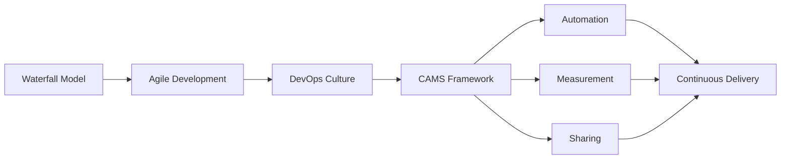

# Chapter 1: Introduction to DevOps

> **Next:** [Advanced Git](./02-git.md)

---

## Learning Objectives

- Define DevOps and its core philosophical pillars (CAMS: Culture, Automation, Measurement, Sharing).
- Trace the historical evolution from traditional Waterfall to Agile and then to DevOps.
- Explain the "Wall of Confusion" and how DevOps breaks down silos between Development and Operations.
- Identify the stages of the DevOps lifecycle and the tools commonly associated with each.

---

## Chapter at a Glance

| Topic | Key Insight | Practical Takeaway |
|-------|-------------|-------------------|
| Culture, Automation, Measurement, Sharing | CAMS model defines DevOps core philosophy | Assess team culture before adopting DevOps tools |
| Waterfall to Agile to DevOps | Evolution from linear to iterative to collaborative | Start with Agile if not already adopted |
| Wall of Confusion | Siloed Dev and Ops create friction and delays | Align incentives through shared goals and metrics |
| DevOps Lifecycle | Continuous loop of Plan-Code-Build-Test-Release-Deploy | Map your current workflow to identify gaps |

## Chapter Roadmap

## Theory

### The Core of DevOps

> **Pro Tip:** Start your DevOps journey by measuring current lead times and deployment frequencies.
DevOps is not a software tool or a specific job title, but a cultural and professional movement that stresses communication, collaboration, and integration between software developers and information technology operations professionals. It aims to automate the process of software delivery and infrastructure changes. The core principles are often summarized by the CAMS model:
- **Culture:** People and process first.
- **Automation:** Removing manual toil and human error.
- **Measurement:** Data-driven decision making.
- **Sharing:** Open feedback loops and shared responsibility.

### The Historical Evolution

> **Warning:** Don't try to adopt all DevOps practices at once. Focus on CI/CD first.
Traditional software development followed the Waterfall model, where requirements, design, implementation, and testing occurred in linear, isolated phases. This led to long release cycles and misaligned incentives. Agile improved this by introducing iterative development and customer feedback. DevOps extends Agile principles beyond the "ready for deployment" stage into the production environment, ensuring that the software is not only "done" but also "running" reliably.

### Breaking the Silos

> **Remember:** DevOps is about people and process first. Tools are enablers, not solutions.
In traditional organizations, developers were incentivized to deliver features quickly, while operations were incentivized to maintain stability (often by resisting change). This created the "Wall of Confusion." DevOps aligns these incentives by making both teams responsible for the end-to-end delivery and stability of the service.

---

## Examples

> **One-Sentence Takeaway:** DevOps is a cultural movement bridging development and operations through shared responsibility.

### Example 1: The Traditional Deployment Model
In a traditional setup, a developer writes code, passes a ZIP file to an operator via a ticket, and the operator manually configures the server.
- **Step-by-step:**
  1. Dev completes feature.
  2. Dev creates manual documentation for deployment.
  3. Dev opens a support ticket.
  4. Ops reads ticket (days later).
  5. Ops manually installs dependencies.
  6. Ops encounters error because Dev used a different Java version.
- **Expected output:** A failed or delayed deployment with high tension between teams.
- **What the example demonstrates:** The fragility of manual handoffs and the need for automation and shared context.

### Example 2: The DevOps Collaborative Approach
In a DevOps culture, the Dev and Ops teams work together to create an automated deployment pipeline.
- **Step-by-step:**
  1. Dev and Ops define the environment as code (Docker/Terraform).
  2. Dev commits code to a shared repository.
  3. Automated CI server runs tests.
  4. Automated CD server deploys to a staging environment that matches production.
- **Expected output:** A successful, repeatable deployment with minimal manual intervention.
- **What the example demonstrates:** How integrated tools and shared responsibility lead to faster, more reliable releases.

---

## Summary

## Concept Comparison Table

| Concept | Description |
|---------|-------------|
| Waterfall | Linear sequential model with distinct phases |
| Agile | Iterative development with customer feedback cycles |
| DevOps | Collaborative culture bridging Dev and Ops teams |
| CAMS | Culture, Automation, Measurement, Sharing framework |
| Silos | Isolated teams with misaligned incentives |

## Quick Reference

| Topic | Key Points |
|-------|------------|
| CAMS Model | Culture, Automation, Measurement, Sharing |
| DevOps Goal | Faster delivery with high reliability |
| Key Enabler | Automation supported by cultural change |
| Primary Challenge | Breaking down organizational silos |

## Cross-Application Matrix

| Domain | Application |
|--------|-------------|
| Web | CI/CD pipelines for rapid feature delivery |
| Cloud | Automated infrastructure provisioning |
| Enterprise | Cross-team collaboration and shared metrics |
| Embedded | DevOps for IoT firmware update pipelines |
| Startup | Lean DevOps with minimal overhead |

## Chapter Quiz

Question 1: What does CAMS stand for?
**A)** Collaboration, Automation, Metrics, Sharing **B)** Culture, Automation, Measurement, Sharing **C)** Culture, Agility, Monitoring, Security **D)** Code, Automation, Metrics, Standards  **Answer: B)** Culture, Automation, Measurement, Sharing

Question 2: What is the 'Wall of Confusion'?
**A)** A network security barrier **B)** The communication gap between Dev and Ops teams **C)** A type of firewall configuration **D)** A database deadlock scenario  **Answer: B)** The communication gap between Dev and Ops teams

Question 3: Which extends Agile into production operations?
**A)** Scrum **B)** Waterfall **C)** DevOps **D)** Kanban  **Answer: C)** DevOps

Question 4: Which is NOT a pillar of DevOps?
**A)** Automation **B)** Measurement **C)** Documentation **D)** Sharing  **Answer: C)** Documentation

## Summary

- DevOps is a cultural shift aimed at bridging the gap between development and operations teams.
- The CAMS model (Culture, Automation, Measurement, Sharing) provides a framework for DevOps implementation.
- DevOps evolved from Agile to include the operational aspects of the software lifecycle.
- The primary goal of DevOps is to increase the velocity of delivery while maintaining high reliability and stability.
- Automation is a key enabler but must be supported by a culture of trust and shared responsibility.

---

## Exercises

### Review Questions
1. What are the four pillars of the CAMS model?
2. Explain the difference between Agile and DevOps.
3. What is the "Wall of Confusion" in a software organization?
4. How does DevOps change the incentives for a software developer?

### Application Problems
1. Design a hypothetical CAMS strategy for a small startup that currently has one developer and one system administrator.
2. Identify three manual tasks in a typical software release process that should be prioritized for automation.
3. Propose a metric that could be used to measure "Culture" or "Sharing" in a team.

### Challenge Problem
1. Analyze a case study of a major company (e.g., Netflix or Amazon) and explain how their organizational structure supports DevOps principles compared to a traditional hierarchical organization.
