# Chapter 1: Introduction to DevOps

> **Next:** [Advanced Git](./02-git.md)

---

## Learning Objectives

- Define DevOps and its core philosophical pillars (CALMS: Culture, Automation, Lean, Measurement, Sharing).
- Trace the historical evolution from traditional Waterfall to Agile and then to DevOps.
- Explain the "Wall of Confusion" and how DevOps breaks down silos between Development and Operations.
- Understand the Three Ways of DevOps: Flow, Feedback, Continuous Learning.
- Identify the stages of the DevOps lifecycle and the tools commonly associated with each.
- Apply value stream mapping to identify waste in the software delivery process.

---

## Chapter at a Glance

| Topic | Key Insight | Practical Takeaway |
|-------|-------------|-------------------|
| Culture, Automation, Lean, Measurement, Sharing | CALMS model extends CAMS with Lean principles | Assess team culture before adopting DevOps tools |
| Waterfall to Agile to DevOps | Evolution from linear to iterative to collaborative | Start with Agile if not already adopted |
| Wall of Confusion | Siloed Dev and Ops create friction and delays | Align incentives through shared goals and metrics |
| Three Ways of DevOps | Flow, Feedback, Continuous Learning | Optimize the whole system, not individual parts |
| DevOps Lifecycle | Continuous loop of Plan-Code-Build-Test-Release-Deploy-Operate-Monitor | Map your current workflow to identify gaps |
| Value Stream Mapping | Identify every step from idea to deployed software | Measure lead time and cycle time for continuous improvement |

## Chapter Roadmap

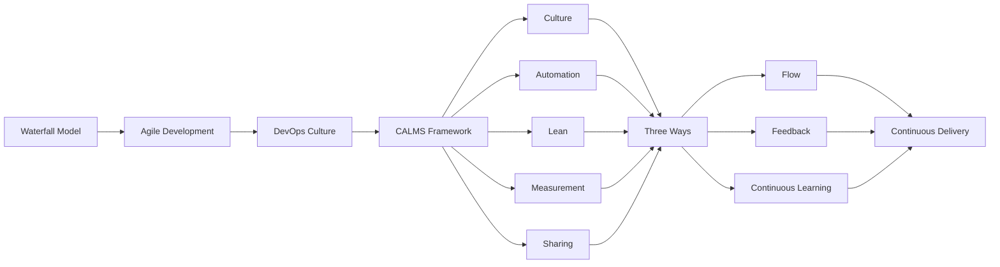

## Theory

### The Core of DevOps

<a href="../../assets/images/diagrams/devops/01-introduction/the-core-of-devops-handwritten.svg" target="_blank" rel="noopener">
  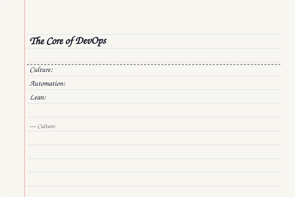
</a>
<a href="../../assets/images/diagrams/devops/01-introduction/the-core-of-devops-diagram.svg" target="_blank" rel="noopener">
  
</a>
<a href="../../assets/images/diagrams/devops/01-introduction/the-core-of-devops-sticky.svg" target="_blank" rel="noopener">
  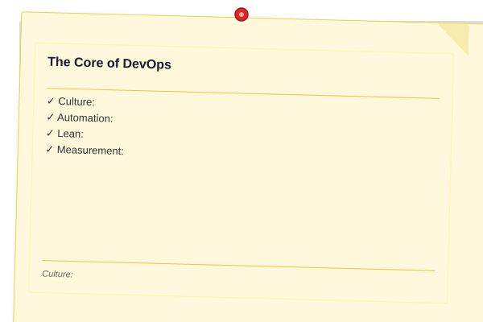
</a>


DevOps is not a software tool or a specific job title, but a cultural and professional movement that stresses communication, collaboration, and integration between software developers and information technology operations professionals. It aims to automate the process of software delivery and infrastructure changes. The core principles are often summarized by the CALMS model:

- **Culture:** People and process first. Collaborative culture where developers and operations work together toward shared goals. Psychological safety enables experimentation and learning from failure.
- **Automation:** Removing manual toil and human error. Automated testing, deployment pipelines, infrastructure provisioning, and configuration management reduce variability and free humans for creative work.
- **Lean:** Eliminate waste in the software delivery process. Apply Lean manufacturing principles: reduce batch sizes, limit work in progress, amplify learning, decide as late as possible, deliver as fast as possible, empower the team, build integrity in, optimize the whole.
- **Measurement:** Data-driven decision making. Everything should be measured: deployment frequency, lead time, mean time to recover, change failure rate. Metrics drive improvement.
- **Sharing:** Open feedback loops and shared responsibility. Blameless postmortems, cross-functional teams, and transparency create a learning organization.

### The Historical Evolution

<a href="../../assets/images/diagrams/devops/01-introduction/the-historical-evolution-handwritten.svg" target="_blank" rel="noopener">
  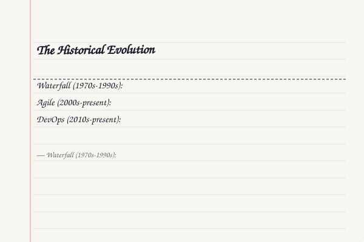
</a>
<a href="../../assets/images/diagrams/devops/01-introduction/the-historical-evolution-diagram.svg" target="_blank" rel="noopener">
  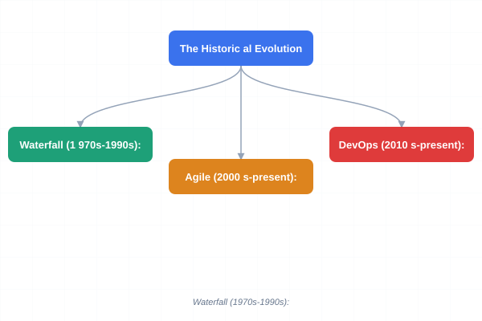
</a>
<a href="../../assets/images/diagrams/devops/01-introduction/the-historical-evolution-sticky.svg" target="_blank" rel="noopener">
  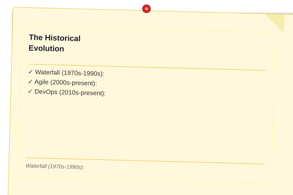
</a>


Traditional software development followed the Waterfall model, where requirements, design, implementation, and testing occurred in linear, isolated phases. This led to long release cycles, late discovery of defects, and misaligned incentives between teams responsible for different phases.

**Waterfall (1970s-1990s):** Sequential phases: Requirements -> Design -> Implementation -> Testing -> Deployment -> Maintenance. Each phase must complete before the next begins. Works well for simple, well-understood projects with stable requirements. Fails when requirements change or when feedback arrives late.

**Agile (2000s-present):** Iterative development with customer feedback cycles. Scrum, XP, and Kanban frameworks emphasize small releases, continuous feedback, and adaptive planning. Agile improves the development-to-testing cycle but often stops at the deployment handoff.

**DevOps (2010s-present):** Extends Agile principles beyond the "ready for deployment" stage into the production environment, ensuring that the software is not only "done" but also "running" reliably. DevOps bridges the gap between development and operations that Agile left unresolved.

### Breaking the Silos

<a href="../../assets/images/diagrams/devops/01-introduction/breaking-the-silos-handwritten.svg" target="_blank" rel="noopener">
  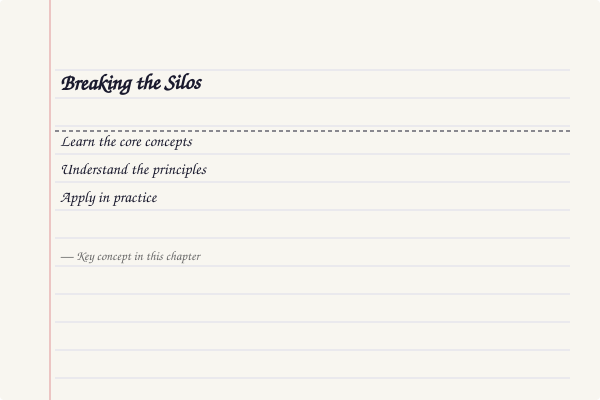
</a>
<a href="../../assets/images/diagrams/devops/01-introduction/breaking-the-silos-diagram.svg" target="_blank" rel="noopener">
  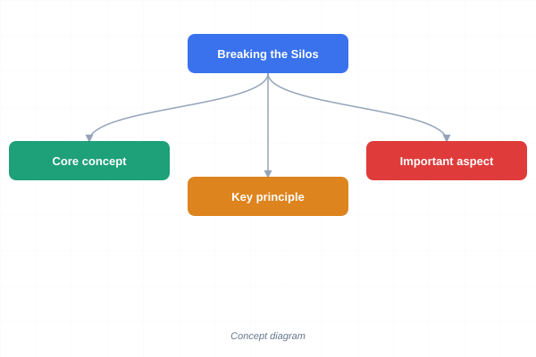
</a>
<a href="../../assets/images/diagrams/devops/01-introduction/breaking-the-silos-sticky.svg" target="_blank" rel="noopener">
  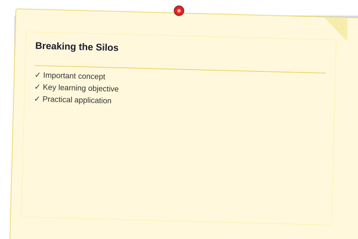
</a>


In traditional organizations, developers were incentivized to deliver features quickly, while operations were incentivized to maintain stability (often by resisting change). This created the "Wall of Confusion" — a communication barrier where developers throw code over the wall to operations, who must figure out how to run it.

DevOps aligns these incentives by making both teams responsible for the end-to-end delivery and stability of the service. When both teams share the same goals (frequent, reliable releases), they naturally collaborate to build automation, share knowledge, and improve processes.

### The Three Ways of DevOps

<a href="../../assets/images/diagrams/devops/01-introduction/the-three-ways-of-devops-handwritten.svg" target="_blank" rel="noopener">
  
</a>
<a href="../../assets/images/diagrams/devops/01-introduction/the-three-ways-of-devops-diagram.svg" target="_blank" rel="noopener">
  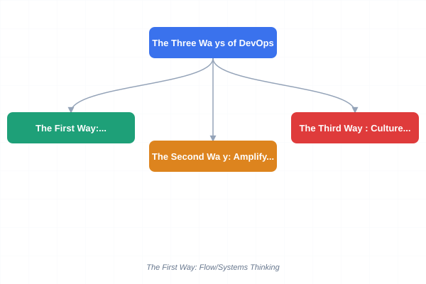
</a>
<a href="../../assets/images/diagrams/devops/01-introduction/the-three-ways-of-devops-sticky.svg" target="_blank" rel="noopener">
  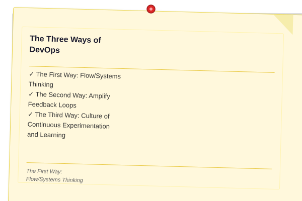
</a>


Gene Kim's _The DevOps Handbook_ and _The Phoenix Project_ introduced the Three Ways, which form the philosophical foundation of DevOps:

**The First Way: Flow/Systems Thinking**
Optimize the flow of work from development to operations to the customer. Reduce handoffs, automate manual steps, and make work visible. Key practices: small batch sizes, continuous integration, limiting work in progress, and reducing bottlenecks.

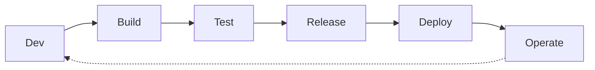

**The Second Way: Amplify Feedback Loops**
Create short, rapid feedback from operations back to development. When problems occur in production, the information must flow back quickly so they can be fixed and prevented. Key practices: monitoring, alerting, on-call rotations, blameless postmortems.

**The Third Way: Culture of Continuous Experimentation and Learning**
Foster a culture that takes risks, learns from failure, and understands that repetition and practice are prerequisites to mastery. Key practices: chaos engineering, Game Days, cross-training, and allocating time for improvement.

### DevOps vs Traditional IT

<a href="../../assets/images/diagrams/devops/01-introduction/devops-vs-traditional-it-handwritten.svg" target="_blank" rel="noopener">
  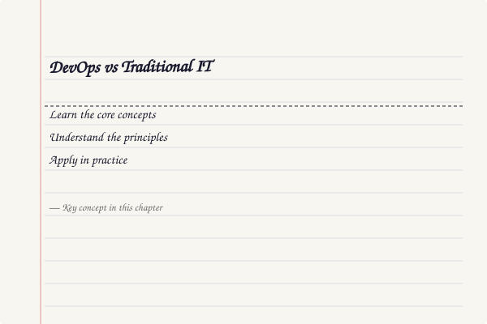
</a>
<a href="../../assets/images/diagrams/devops/01-introduction/devops-vs-traditional-it-diagram.svg" target="_blank" rel="noopener">
  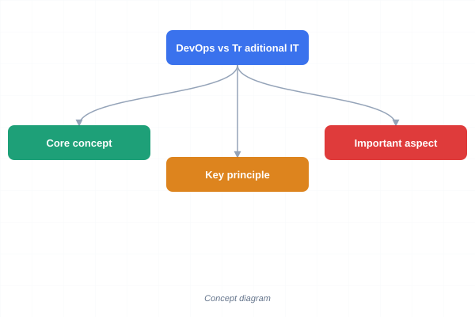
</a>
<a href="../../assets/images/diagrams/devops/01-introduction/devops-vs-traditional-it-sticky.svg" target="_blank" rel="noopener">
  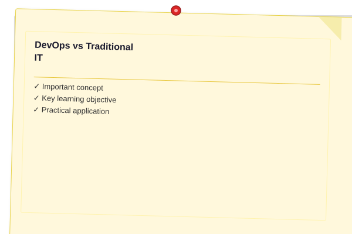
</a>


| Aspect | Traditional IT | DevOps |
|--------|---------------|--------|
| Release frequency | Quarterly or monthly | Multiple times daily |
| Team structure | Siloed Dev and Ops | Cross-functional product teams |
| Deployment | Manual, documented | Automated, self-service |
| Testing | Late in cycle, manual | Continuous, automated |
| Failure handling | Blame individuals | Blameless postmortems |
| Metrics | Uptime, availability | DORA metrics, flow metrics |
| Configuration | Manual server config | Infrastructure as Code |
| Communication | Tickets, handoffs | ChatOps, shared dashboards |

### Value Stream Mapping

<a href="../../assets/images/diagrams/devops/01-introduction/value-stream-mapping-handwritten.svg" target="_blank" rel="noopener">
  
</a>
<a href="../../assets/images/diagrams/devops/01-introduction/value-stream-mapping-diagram.svg" target="_blank" rel="noopener">
  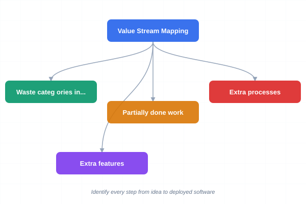
</a>
<a href="../../assets/images/diagrams/devops/01-introduction/value-stream-mapping-sticky.svg" target="_blank" rel="noopener">
  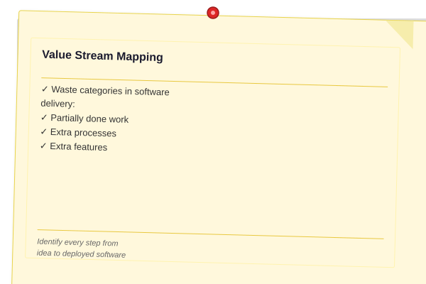
</a>


Value stream mapping (VSM) is a Lean management technique that visualizes every step required to deliver software from idea to production. It identifies delays, waste, and bottlenecks.

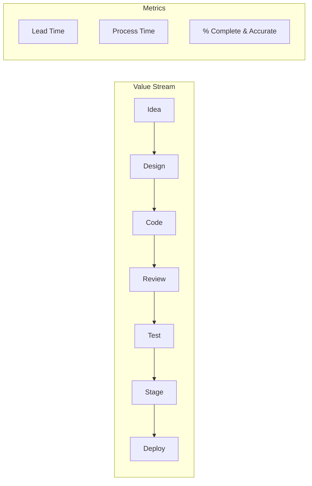

**Waste categories in software delivery:**
1. **Partially done work** — Code not deployed, specifications not implemented
2. **Extra processes** — Unnecessary approvals, paperwork, handoffs
3. **Extra features** — Gold-plating, building what wasn't requested
4. **Task switching** — Context switching between multiple projects
5. **Waiting** — Delays between steps, queue time
6. **Motion** — Moving work between tools, searching for information
7. **Defects** — Bugs, rework, failed deployments
8. **Unused talent** — People not working at full capability

### DevOps ROI and Maturity Model

<a href="../../assets/images/diagrams/devops/01-introduction/devops-roi-and-maturity-model-handwritten.svg" target="_blank" rel="noopener">
  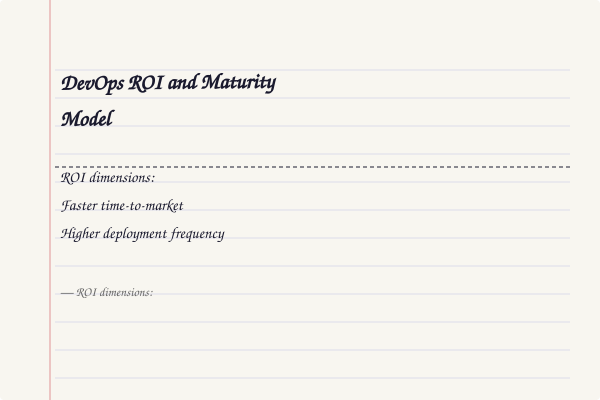
</a>
<a href="../../assets/images/diagrams/devops/01-introduction/devops-roi-and-maturity-model-diagram.svg" target="_blank" rel="noopener">
  
</a>
<a href="../../assets/images/diagrams/devops/01-introduction/devops-roi-and-maturity-model-sticky.svg" target="_blank" rel="noopener">
  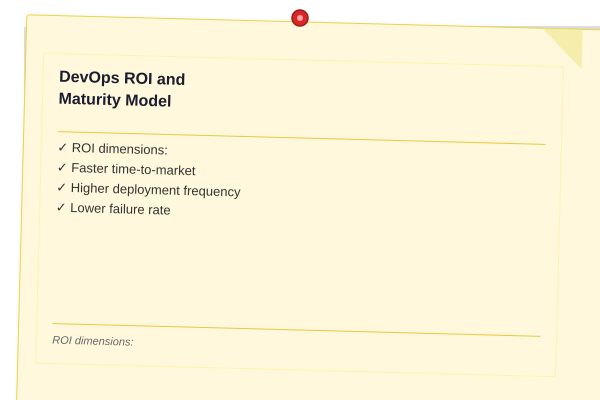
</a>


**ROI dimensions:**
- **Faster time-to-market** — Shorter lead time from commit to production
- **Higher deployment frequency** — More releases with less risk per release
- **Lower failure rate** — Automated testing catches issues earlier
- **Faster recovery** — Automated rollback and deployment strategies
- **Reduced operational costs** — Automation replaces manual toil
- **Improved employee satisfaction** — Less firefighting, more innovation

**DevOps Maturity Model:**

| Level | Name | Characteristics |
|-------|------|-----------------|
| 1 | Initial | Ad-hoc processes, manual deployments, siloed teams |
| 2 | Defined | Standardized processes, basic automation, some monitoring |
| 3 | Managed | CI/CD pipelines, automated testing, measured metrics |
| 4 | Optimized | Proactive monitoring, predictive analytics, continuous improvement |
| 5 | Autonomous | Self-healing systems, automated governance, AI-driven operations |

### State of DevOps Report Findings

<a href="../../assets/images/diagrams/devops/01-introduction/state-of-devops-report-findings-handwritten.svg" target="_blank" rel="noopener">
  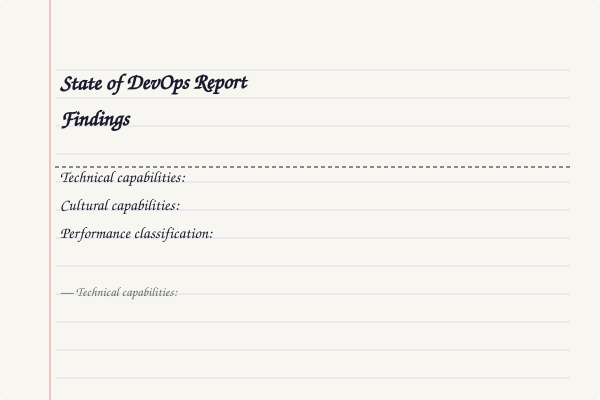
</a>
<a href="../../assets/images/diagrams/devops/01-introduction/state-of-devops-report-findings-diagram.svg" target="_blank" rel="noopener">
  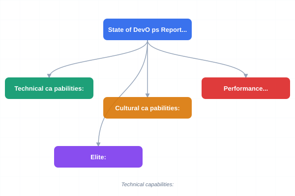
</a>
<a href="../../assets/images/diagrams/devops/01-introduction/state-of-devops-report-findings-sticky.svg" target="_blank" rel="noopener">
  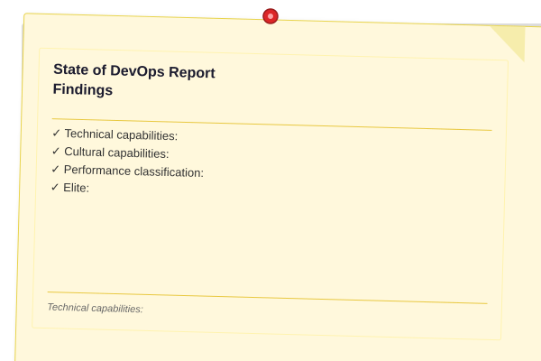
</a>


The annual State of DevOps report by DORA (DevOps Research and Assessment) identifies key capabilities that drive high performance:

**Technical capabilities:**
- Version control for all production artifacts
- Automated deployment pipelines
- Continuous integration
- Trunk-based development
- Shift-left on security
- Loosely coupled architecture
- Empowered teams

**Cultural capabilities:**
- Generative organizational culture
- Job satisfaction
- Transformational leadership
- Westrum organizational culture

**Performance classification:**
- **Elite:** Multiple deploys per day, lead time &lt; 1 hour, MTTR < 1 hour, change failure rate < 5%
- **High:** Deploys per week/month, lead time &lt; 1 day, MTTR < 1 day, change failure rate < 10%
- **Medium:** Deploys per month, lead time &lt; 1 week, MTTR < 1 week, change failure rate < 15%
- **Low:** Deploys per month/quarter, lead time > 1 month, MTTR > 1 month, change failure rate > 15%

---

## Examples

### Example 1: The Traditional Deployment Model

In a traditional setup, a developer writes code, passes a ZIP file to an operator via a ticket, and the operator manually configures the server.

```text
Step 1: Dev completes feature implementation
Step 2: Dev creates manual deployment documentation
Step 3: Dev opens a support ticket to Ops
Step 4: Ops reads ticket (3-5 days later due to queue)
Step 5: Ops manually installs dependencies on server
Step 6: Ops encounters error: Dev used Java 17, server has Java 11
Step 7: Dev and Ops debug the environment mismatch (2-3 days)
Step 8: Deployment finally succeeds, but schedule has slipped
```

**Expected output:** A failed or delayed deployment with high tension between teams and a long lead time of 5-10 days for a simple change.

**What the example demonstrates:** The fragility of manual handoffs, the need for automation, shared context, and environment consistency.

### Example 2: The DevOps Collaborative Approach

In a DevOps culture, the Dev and Ops teams work together to create an automated deployment pipeline.

```typescript
// TypeScript representation of a DevOps deployment pipeline
interface PipelineStage {
  name: string;
  status: 'pending' | 'running' | 'passed' | 'failed';
  duration: number; // seconds
}

class DevOpsPipeline {
  private stages: PipelineStage[] = [];

  async execute(): Promise<void> {
    console.log('Starting DevOps pipeline execution...');

    // Stage 1: Code Commit
    await this.runStage({ name: 'Code Commit', status: 'running', duration: 0 });

    // Stage 2: Build
    await this.runStage({ name: 'Build', status: 'running', duration: 0 });

    // Stage 3: Automated Tests
    await this.runStage({ name: 'Automated Tests', status: 'running', duration: 0 });

    // Stage 4: Security Scan
    await this.runStage({ name: 'Security Scan', status: 'running', duration: 0 });

    // Stage 5: Deploy to Staging
    await this.runStage({ name: 'Deploy to Staging', status: 'running', duration: 0 });

    // Stage 6: Integration Tests
    await this.runStage({ name: 'Integration Tests', status: 'running', duration: 0 });

    // Stage 7: Deploy to Production
    await this.runStage({ name: 'Deploy to Production', status: 'running', duration: 0 });

    console.log('Pipeline completed successfully in under 30 minutes');
  }

  private async runStage(stage: PipelineStage): Promise<void> {
    stage.status = 'running';
    const startTime = Date.now();
    await this.simulateWork();
    stage.duration = (Date.now() - startTime) / 1000;
    stage.status = 'passed';
    this.stages.push(stage);
    console.log(`Stage "${stage.name}" passed in ${stage.duration}s`);
  }

  private async simulateWork(): Promise<void> {
    return new Promise(resolve => setTimeout(resolve, 100));
  }
}

const pipeline = new DevOpsPipeline();
pipeline.execute();
```

**Expected output:** A successful, repeatable deployment in minutes with no manual intervention and full audit trail.

**What the example demonstrates:** How integrated tools and shared responsibility lead to faster, more reliable releases with measurable outcomes.

### Example 3: DevOps Maturity Assessment

```typescript
// DevOps maturity assessment scoring
enum MaturityLevel {
  Initial = 1,
  Defined = 2,
  Managed = 3,
  Optimized = 4,
  Autonomous = 5,
}

interface MaturityDimension {
  name: string;
  score: number; // 1-5
  evidence: string[];
}

class MaturityAssessment {
  private dimensions: MaturityDimension[] = [];

  addDimension(name: string, score: number, evidence: string[]): void {
    this.dimensions.push({ name, score, evidence });
  }

  calculateOverall(): { level: MaturityLevel; average: number } {
    const total = this.dimensions.reduce((sum, d) => sum + d.score, 0);
    const average = total / this.dimensions.length;
    const level = Math.round(average) as MaturityLevel;
    return { level, average };
  }

  generateReport(): string {
    const { level, average } = this.calculateOverall();
    let report = `# DevOps Maturity Assessment\n\n`;
    report += `**Overall Level:** ${MaturityLevel[level]} (${level}/5)\n`;
    report += `**Average Score:** ${average.toFixed(1)}\n\n`;
    report += `## Dimension Scores\n\n`;

    for (const dim of this.dimensions) {
      report += `### ${dim.name}: ${dim.score}/5\n`;
      report += `Evidence:\n`;
      dim.evidence.forEach(e => report += `- ${e}\n`);
      report += '\n';
    }

    return report;
  }
}

const assessment = new MaturityAssessment();
assessment.addDimension('Culture', 3, ['Cross-functional teams exist', 'Some blame still occurs']);
assessment.addDimension('Automation', 4, ['CI/CD pipeline is automated', 'IaC for all environments']);
assessment.addDimension('Measurement', 3, ['DORA metrics tracked', 'Some manual reporting']);
console.log(assessment.generateReport());
```

**Expected output:** A scored assessment showing maturity level with actionable improvement areas.

**What the example demonstrates:** Quantifying DevOps maturity enables targeted improvement efforts and progress tracking.

---

### DevOps Maturity Model Checker

The following TypeScript implementation provides a programmatic DevOps maturity assessment tool that evaluates an organization across five key dimensions: culture, automation, measurement, sharing, and technology adoption.

```typescript
interface MaturityDimension {
  name: string;
  score: number; // 1-5
  weight: number; // 0-1
}

interface MaturityAssessment {
  dimensions: MaturityDimension[];
  calculateOverall(): number;
  getLevel(): string;
  getRecommendations(): string[];
}

class DevOpsMaturityChecker implements MaturityAssessment {
  dimensions: MaturityDimension[] = [];

  constructor(dimensions: MaturityDimension[]) {
    this.dimensions = dimensions;
  }

  calculateOverall(): number {
    const totalWeight = this.dimensions.reduce((s, d) => s + d.weight, 0);
    const weightedScore = this.dimensions.reduce((s, d) => s + d.score * d.weight, 0);
    return Math.round((weightedScore / totalWeight) * 100) / 100;
  }

  getLevel(): string {
    const score = this.calculateOverall();
    if (score >= 4.5) return 'Elite';
    if (score >= 3.5) return 'High';
    if (score >= 2.5) return 'Medium';
    if (score >= 1.5) return 'Low';
    return 'Initial';
  }

  getRecommendations(): string[] {
    const recs: string[] = [];
    for (const d of this.dimensions) {
      if (d.score <= 2) recs.push(`Critical improvement needed in ${d.name}`);
      else if (d.score <= 3) recs.push(`Moderate improvement needed in ${d.name}`);
    }
    return recs;
  }
}

// Example assessment for a mid-stage organization
const assessment = new DevOpsMaturityChecker([
  { name: 'Culture', score: 3, weight: 0.25 },
  { name: 'Automation', score: 4, weight: 0.25 },
  { name: 'Measurement', score: 2, weight: 0.2 },
  { name: 'Sharing', score: 3, weight: 0.15 },
  { name: 'Technology', score: 4, weight: 0.15 },
]);

console.log(`Overall Maturity: ${assessment.calculateOverall().toFixed(2)}`);
console.log(`Level: ${assessment.getLevel()}`);
console.log('Recommendations:', assessment.getRecommendations().join('; '));
```

**What this demonstrates:** Programmatic maturity assessment enables objective DevOps progress tracking and targeted improvement planning across organizational dimensions.

---

### Pipeline Stage Timer

Measuring pipeline stage duration helps identify bottlenecks. The following timer tracks execution time across DevOps pipeline stages and reports slowdowns.

```typescript
interface PipelineTimerEvent {
  stage: string;
  startTime: number;
  endTime: number;
}

class PipelineStageTimer {
  private stages: PipelineTimerEvent[] = [];
  private currentStage: string | null = null;
  private stageStart: number = 0;

  startStage(name: string): void {
    this.currentStage = name;
    this.stageStart = Date.now();
    console.log(`[${name}] started`);
  }

  endStage(): void {
    if (!this.currentStage) return;
    this.stages.push({ stage: this.currentStage, startTime: this.stageStart, endTime: Date.now() });
    console.log(`[${this.currentStage}] completed in ${((Date.now() - this.stageStart) / 1000).toFixed(1)}s`);
    this.currentStage = null;
  }

  getReport(): string {
    const total = this.stages.reduce((s, st) => s + (st.endTime - st.startTime), 0);
    let report = '## Pipeline Stage Times\n\n';
    for (const s of this.stages) {
      const pct = ((s.endTime - s.startTime) / total * 100).toFixed(1);
      report += `| ${s.stage} | ${((s.endTime - s.startTime) / 1000).toFixed(1)}s | ${pct}% |\n`;
    }
    report += `\n**Total:** ${(total / 1000).toFixed(1)}s\n`;
    return report;
  }
}

const timer = new PipelineStageTimer();
timer.startStage('Build'); setTimeout(() => { timer.endStage(); timer.startStage('Test'); }, 100);
// In practice, endStage is called when each pipeline stage completes
```

**What this demonstrates:** Pipeline timing enables data-driven optimization by identifying the slowest stages in the delivery process.

---

## Practical Takeaways

1. **Start with culture before tools.** DevOps transformation begins with people and processes. Tools are enablers, not solutions.
2. **Measure what matters.** Track deployment frequency, lead time, MTTR, and change failure rate from day one.
3. **Apply the Three Ways.** Optimize flow, amplify feedback, and foster continuous learning.
4. **Use value stream mapping.** Visualize your delivery process to identify waste and bottlenecks.
5. **Iterate, don't boil the ocean.** Start with one team and one service, prove the model, then expand.

---

## Chapter Quiz

<details><summary>Question 1: What does CALMS stand for?</summary>**A)** Collaboration, Automation, Lean, Metrics, Security<br>**B)** Culture, Automation, Lean, Measurement, Sharing<br>**C)** Culture, Agility, Lean, Monitoring, Security<br>**D)** Code, Automation, Lean, Metrics, Standards<br><br>**Answer: B)** Culture, Automation, Lean, Measurement, Sharing&lt;/details&gt;

<details><summary>Question 2: What is the 'Wall of Confusion'?</summary>**A)** A network security barrier<br>**B)** The communication gap between Dev and Ops teams<br>**C)** A type of firewall configuration<br>**D)** A database deadlock scenario<br><br>**Answer: B)** The communication gap between Dev and Ops teams&lt;/details&gt;

<details><summary>Question 3: Which of the Three Ways focuses on optimizing flow?</summary>**A)** The First Way<br>**B)** The Second Way<br>**C)** The Third Way<br>**D)** None of the above<br><br>**Answer: A)** The First Way&lt;/details&gt;

<details><summary>Question 4: What is value stream mapping used for?</summary>**A)** Creating network diagrams<br>**B)** Visualizing steps from idea to deployed software<br>**C)** Monitoring production systems<br>**D)** Writing automated tests<br><br>**Answer: B)** Visualizing steps from idea to deployed software&lt;/details&gt;

<details><summary>Question 5: According to DORA, what characterizes Elite performers?</summary>**A)** Monthly deployments<br>**B)** Multiple deploys per day<br>**C)** Quarterly releases<br>**D)** Annual releases<br><br>**Answer: B)** Multiple deploys per day&lt;/details&gt;

---


// introduction
// cicd-infrastructure-automation implementation

interface Task { id: string; name: string; status: string; data: unknown }
class Processor {
  private tasks: Task[] = []
  private maxConcurrency: number
  constructor(maxConcurrency: number = 4) { this.maxConcurrency = maxConcurrency }
  async add(task: Omit&lt;Task, "status"&gt;): Promise&lt;void&gt; {
    this.tasks.push({ ...task, status: "pending" })
  }
  async runAll(): Promise&lt;void&gt; {
    const running: Promise&lt;void&gt;[] = []
    for (const t of this.tasks) {
      if (running.length >= this.maxConcurrency) { await Promise.race(running) }
      const p = this.execute(t).finally(() => { const i = running.indexOf(p); if (i >= 0) running.splice(i, 1) })
      running.push(p)
    }
    await Promise.all(running)
  }
  private async execute(t: Task): Promise&lt;void&gt; {
    t.status = "running"
    await new Promise(r => setTimeout(r, 10))
    t.status = "done"
  }
  getResults(): Task[] { return this.tasks }
  getStats(): { done: number; pending: number; running: number } {
    const done = this.tasks.filter(t => t.status === "done").length
    const pending = this.tasks.filter(t => t.status === "pending").length
    const running = this.tasks.filter(t => t.status === "running").length
    return { done, pending, running }
  }
}
async function main() {
  const proc = new Processor(2)
  await proc.add({ id: '1', name: 'introduction', data: { topic: 'cicd-infrastructure-automation' } })
  await proc.runAll()
  console.log('Stats:', proc.getStats())
}
main().catch(console.error)
export { Processor, Task }
## Summary

- DevOps is a cultural shift aimed at bridging the gap between development and operations teams through shared responsibility and automation.
- The CALMS model (Culture, Automation, Lean, Measurement, Sharing) provides a comprehensive framework for DevOps implementation.
- DevOps evolved from Agile to include the operational aspects of the software lifecycle, extending continuous practices into production.
- The Three Ways of DevOps (Flow, Feedback, Continuous Learning) provide philosophical guidance for transformation.
- The primary goal of DevOps is to increase the velocity of delivery while maintaining high reliability and stability.
- Automation is a key enabler but must be supported by a culture of trust and shared responsibility.
- Value stream mapping identifies waste and bottlenecks in the delivery process.
- DevOps maturity is measured across multiple dimensions from Initial to Autonomous.
- DORA metrics provide a benchmark for comparing performance against industry standards.
- The State of DevOps report identifies specific technical and cultural capabilities that drive high performance.

---

## Exercises

### Review Questions
1. What are the five pillars of the CALMS model? Explain each.
2. How does DevOps differ from Agile? What gap does it address?
3. What is the "Wall of Confusion" in a software organization?
4. Explain the Three Ways of DevOps and how they relate to each other.
5. What are the four DORA metrics that measure DevOps performance?

### Application Problems
1. Design a hypothetical CALMS strategy for a small startup transitioning from manual deployments.
2. Create a value stream map for a typical software release process at your organization.
3. Identify three forms of waste in software delivery and propose automation solutions.
4. Assess a team's DevOps maturity using the five-level model and recommend improvements.

### Challenge Problem
1. Analyze a case study of a major company (Netflix, Amazon, or Etsy) and explain how their organizational structure and practices embody the Three Ways. Compare their approach to a traditional hierarchical organization and quantify the differences in delivery performance.

### Additional Case Studies

**Netflix: Freedom and Responsibility Model**
Netflix's DevOps culture is built on the "Freedom and Responsibility" principle. Teams own their services end-to-end from development through production. The famous Chaos Monkey and Simian Army tools embody the Third Way (Continuous Learning) by proactively testing system resilience. Key metrics: thousands of deployments per day across hundreds of microservices with a dedicated SRE team that focuses on platform tooling rather than operations.

**Amazon: Two-Pizza Teams and API Mandate**
Amazon's internal "API Mandate" (Jeff Bezos memo circa 2002) required all teams to communicate via APIs with no direct database access. This forced service-oriented architecture before microservices were mainstream. Two-pizza teams (6-10 people) own discrete services with full autonomy, implementing the First Way (Flow) by removing cross-team dependencies. The result: thousands of deployments per hour with isolated blast radius.

**Etsy: Continuous Deployment Pioneer**
Etsy was an early DevOps adopter, deploying to production 50+ times per day by 2012. Their culture emphasized blameless postmortems, ChatOps (deploying from IRC), and extensive monitoring (statsd). Their deploy system allowed any engineer to deploy any service. The "Deployinator" tool visualized the deployment pipeline, embodying the Second Way (Feedback) by making deployment status visible to the entire organization.

### DevOps Transformation Roadmap

A structured approach to adopting DevOps across an organization follows these phases:

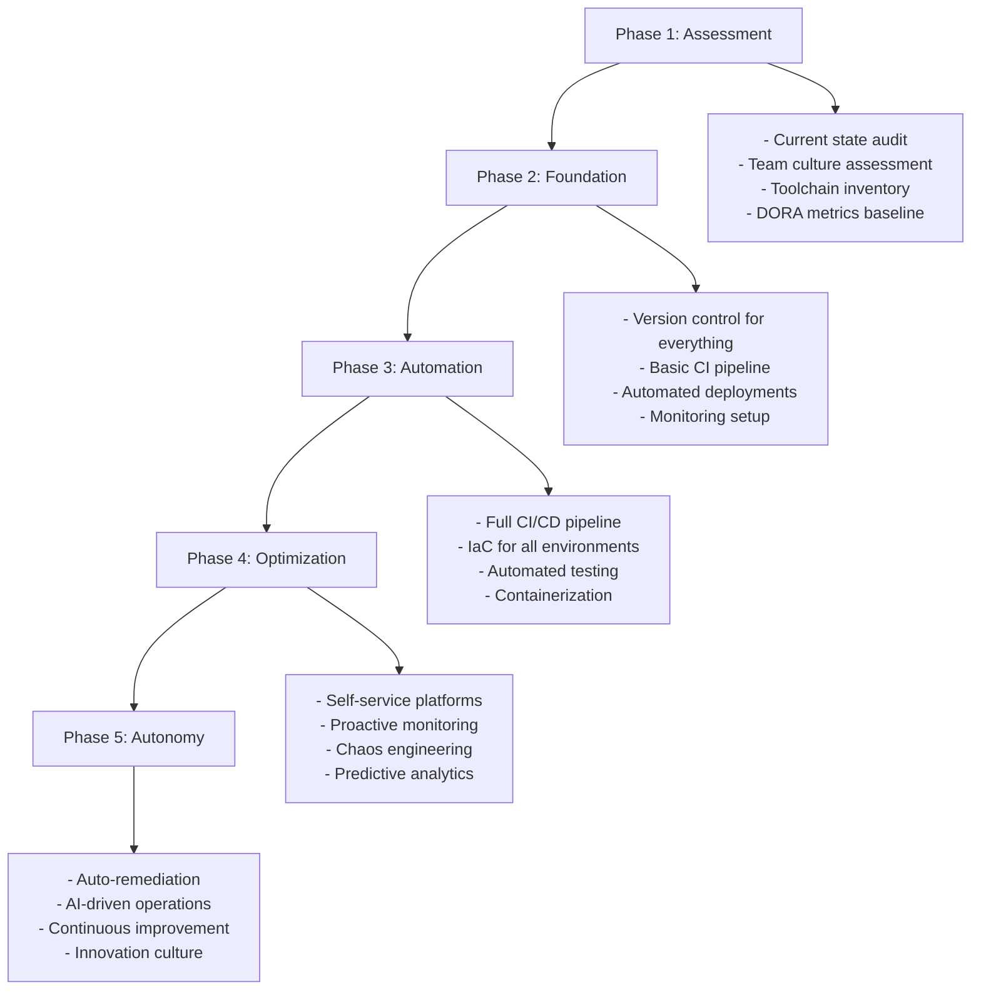

**Phase 1 — Assessment (Weeks 1-4):** Audit current delivery process, measure lead time and deployment frequency, identify bottlenecks through value stream mapping, assess team culture and readiness.

**Phase 2 — Foundation (Weeks 5-12):** Implement version control for all production artifacts, set up a basic CI server, automate the deployment process for one service, establish basic monitoring and alerting.

**Phase 3 — Automation (Months 3-6):** Build a complete CI/CD pipeline with automated testing at every stage, containerize applications, provision infrastructure as code, implement configuration management.

**Phase 4 — Optimization (Months 6-12):** Create self-service developer platforms, implement proactive monitoring with SLOs and error budgets, introduce chaos engineering practices, adopt predictive scaling.

**Phase 5 — Autonomy (Year 2+):** Implement auto-remediation for common failure scenarios, use AI/ML for operations optimization, foster a culture of continuous experimentation and improvement.

### DevOps Anti-Patterns to Avoid

**Anti-Pattern 1: "DevOps Team" Silo**
Creating a separate "DevOps team" that all other teams hand off to. This recreates the Wall of Confusion. Instead, embed DevOps expertise within product teams and build platform teams that enable, not gatekeep.

**Anti-Pattern 2: Tools-First Transformation**
Buying and installing tools before changing culture and processes. Tools without cultural change become expensive shelfware. Start with people and process, then select tools that support the desired workflow.

**Anti-Pattern 3: Automating Bad Processes**
Automating a broken deployment process just makes it break faster. Fix the process first, then automate. Use value stream mapping to identify and eliminate waste before adding automation.

**Anti-Pattern 4: Ignoring Security**
Treating security as a separate phase at the end of delivery. Security must be "shifted left" — integrated into every stage of the pipeline. DevSecOps is DevOps done correctly, not an add-on.

**Anti-Pattern 5: Blame Culture**
When incidents occur, the response is to find who caused it rather than what caused it. Blame culture destroys the psychological safety needed for continuous improvement. Always conduct blameless postmortems.

### DevOps Toolchain Landscape

The DevOps lifecycle spans 8 stages with tools at each stage:

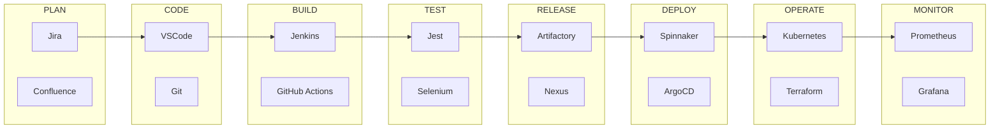

**Plan:** Jira, Confluence, Trello, Asana, Monday.com
**Code:** Git, GitHub, GitLab, Bitbucket, VSCode, IntelliJ
**Build:** Jenkins, GitHub Actions, GitLab CI, CircleCI, Travis CI
**Test:** Jest, Mocha, Selenium, Cypress, SonarQube, OWASP ZAP
**Release:** Artifactory, Nexus, Docker Registry, S3, PackageCloud
**Deploy:** Spinnaker, ArgoCD, Flux, Helm, Ansible
**Operate:** Kubernetes, Terraform, Pulumi, Ansible, Docker, Vagrant
**Monitor:** Prometheus, Grafana, Datadog, New Relic, ELK Stack

### DevOps Maturity Model Calculator

Measuring DevOps maturity across teams and organizations enables targeted improvement. The following tool evaluates maturity across the five CALMS dimensions and provides actionable recommendations.

```typescript
// devops-maturity.ts
// Assess DevOps maturity across CALMS dimensions

interface MaturityScore {
  dimension: string;
  current: number;  // 1-5
  target: number;   // 1-5
  gap: number;
  evidence: string[];
}

interface MaturityAssessment {
  teamName: string;
  scores: MaturityScore[];
  overallMaturity: number;
  topGaps: string[];
  recommendations: string[];
}

class DevOpsMaturityCalculator {
  private readonly dimensions = [
    { name: 'Culture', targets: { sharing: 4, blameless: 5, autonomy: 3 } },
    { name: 'Automation', targets: { ci: 5, cd: 4, testing: 4 } },
    { name: 'Lean', targets: { flow: 4, waste: 3, batchSize: 4 } },
    { name: 'Measurement', targets: { dora: 5, logs: 4, alerts: 3 } },
    { name: 'Sharing', targets: { docs: 3, feedback: 4, knowledge: 4 } },
  ];

  assess(data: Record<string, number>, teamName = 'default'): MaturityAssessment {
    const scores: MaturityScore[] = [];
    for (const dim of this.dimensions) {
      const score = Object.entries(dim.targets);
      const achieved = score.reduce((sum, [k]) => sum + (data[k] || 1), 0);
      const possible = score.reduce((sum, [, v]) => sum + v, 0);
      const current = Math.round((achieved / possible) * 4) + 1;
      const target = 5;
      scores.push({
        dimension: dim.name,
        current: Math.min(current, 5),
        target,
        gap: target - current,
        evidence: [`${achieved}/${possible} points in ${dim.name}`],
      });
    }

    const overallMaturity = Math.round(scores.reduce((s, sc) => s + sc.current, 0) / scores.length);
    const sorted = [...scores].sort((a, b) => b.gap - a.gap);
    const recommendations = sorted.filter(s => s.gap > 1).map(s =>
      `Improve ${s.dimension}: current ${s.current}/5, target ${s.target}/5`
    );
    return {
      teamName,
      scores,
      overallMaturity,
      topGaps: sorted.filter(s => s.gap > 1).map(s => s.dimension),
      recommendations,
    };
  }

  generateReport(assessment: MaturityAssessment): string {
    const levelMap = ['Initial', 'Repeatable', 'Defined', 'Managed', 'Optimizing'];
    return `## DevOps Maturity Report\n\n` +
      `**Team:** ${assessment.teamName}\n` +
      `**Overall Maturity:** ${assessment.overallMaturity}/5 — ${levelMap[assessment.overallMaturity - 1]}\n\n` +
      `| Dimension | Level | Target | Gap |\n` +
      `|-----------|-------|--------|-----|\n` +
      assessment.scores.map(s =>
        `| ${s.dimension} | ${'?'.repeat(s.current)}${'?'.repeat(s.gap)} ${s.current}/5 | 5 | ${s.gap} |`
      ).join('\n') + '\n\n**Top Recommendations:**\n' +
      assessment.recommendations.map(r => `- ${r}`).join('\n');
  }
}

const calc = new DevOpsMaturityCalculator();
const assessment = calc.assess({
  sharing: 3, blameless: 5, autonomy: 2,
  ci: 4, cd: 3, testing: 3,
  flow: 3, waste: 2, batchSize: 3,
  dora: 2, logs: 3, alerts: 2,
  docs: 2, feedback: 3, knowledge: 3,
}, 'Platform Engineering Team');
console.log(calc.generateReport(assessment));
```

**What this demonstrates:** Automated maturity assessment provides a quantitative baseline for DevOps improvement, identifies gaps across CALMS dimensions, and generates targeted recommendations for each team.

---

### DevOps Toolchain Dependency Graph

Understanding toolchain dependencies helps teams manage their DevOps ecosystem. The following tool models tool relationships, identifies critical dependencies, and detects single points of failure.

```typescript
// toolchain-graph.ts
// Model DevOps toolchain dependencies and find SPOFs

interface Tool {
  name: string;
  category: 'plan' | 'code' | 'build' | 'test' | 'release' | 'deploy' | 'operate' | 'monitor';
  dependsOn: string[];
  critical: boolean;
}

interface ToolchainGraph {
  tools: Tool[];
  criticalPath: string[];
  singlePointsOfFailure: string[];
  recommendations: string[];
}

class ToolchainAnalyzer {
  analyze(tools: Tool[]): ToolchainGraph {
    const criticalPath = this.findCriticalPath(tools);
    const spofs = this.findSPOFs(tools);
    return {
      tools,
      criticalPath,
      singlePointsOfFailure: spofs,
      recommendations: spofs.map(s => `Consider adding redundancy or fallback for ${s}`),
    };
  }

  private findCriticalPath(tools: Tool[]): string[] {
    const activeCritical = tools.filter(t => t.critical);
    return activeCritical.map(t => t.name);
  }

  private findSPOFs(tools: Tool[]): string[] {
    const depCount = new Map<string, number>();
    for (const tool of tools) {
      for (const dep of tool.dependsOn) {
        depCount.set(dep, (depCount.get(dep) || 0) + 1);
      }
    }
    const spofs: string[] = [];
    for (const [tool, count] of depCount) {
      if (count >= 3) spofs.push(tool);
    }
    return spofs;
  }

  generateReport(graph: ToolchainGraph): string {
    return `## Toolchain Analysis\n\n` +
      `**Total Tools:** ${graph.tools.length}\n` +
      `**Critical Path:** ${graph.criticalPath.join(' ? ') || 'None'}\n` +
      `**SPOFs:** ${graph.singlePointsOfFailure.join(', ') || 'None'}\n` +
      (graph.recommendations.length > 0
        ? `\n**Recommendations:**\n${graph.recommendations.map(r => `- ${r}`).join('\n')}`
        : '\n? No single points of failure detected');
  }
}

const analyzer = new ToolchainAnalyzer();
const tools: Tool[] = [
  { name: 'GitHub', category: 'code', dependsOn: [], critical: true },
  { name: 'Jenkins', category: 'build', dependsOn: ['GitHub'], critical: true },
  { name: 'SonarQube', category: 'test', dependsOn: ['Jenkins'], critical: false },
  { name: 'Docker Registry', category: 'release', dependsOn: ['Jenkins'], critical: true },
  { name: 'Kubernetes', category: 'operate', dependsOn: ['Docker Registry'], critical: true },
  { name: 'Prometheus', category: 'monitor', dependsOn: ['Kubernetes'], critical: false },
  { name: 'ArgoCD', category: 'deploy', dependsOn: ['Kubernetes', 'Docker Registry'], critical: true },
];
console.log(analyzer.generateReport(analyzer.analyze(tools)));
```

**What this demonstrates:** Toolchain dependency modeling reveals critical path dependencies and single points of failure, enabling teams to architect more resilient DevOps pipelines.

---

### DORA Metrics Deep Dive

The four key DORA metrics measure DevOps performance:

**Deployment Frequency** — How often an organization deploys to production. Elite performers deploy multiple times per day. Low performers deploy once per month or less.

**Lead Time for Changes** — The time from commit to production. Elite performers have lead times under one hour. Low performers have lead times of months.

**Change Failure Rate** — The percentage of deployments causing a failure in production. Elite performers have under 5% failure rate. Low performers exceed 15%.

**Time to Restore Service (MTTR)** — The time to recover from a failure. Elite performers restore in under one hour. Low performers take weeks.

**Measuring DORA metrics programmatically:**

```typescript
interface DORAMetrics {
  deploymentFrequency: number; // deploys per day
  leadTimeHours: number; // hours from commit to production
  changeFailureRate: number; // percentage (0-100)
  mttrHours: number; // hours to restore service
}

class DORAMetricsCalculator {
  calculatePerformanceLevel(metrics: DORAMetrics): string {
    const scores = {
      elite: metrics.deploymentFrequency >= 1 && metrics.leadTimeHours < 1 && metrics.changeFailureRate < 5 && metrics.mttrHours < 1,
      high: metrics.deploymentFrequency >= 0.25 && metrics.leadTimeHours < 24 && metrics.changeFailureRate < 10 && metrics.mttrHours < 24,
      medium: metrics.deploymentFrequency >= 0.03 && metrics.leadTimeHours < 168 && metrics.changeFailureRate < 15 && metrics.mttrHours < 168,
    };

    if (scores.elite) return 'Elite';
    if (scores.high) return 'High';
    if (scores.medium) return 'Medium';
    return 'Low';
  }

  generateReport(metrics: DORAMetrics): string {
    const level = this.calculatePerformanceLevel(metrics);
    return `## DORA Metrics Report\n\n` +
      `| Metric | Value | Target |\n` +
      `|--------|-------|--------|\n` +
      `| Deployment Frequency | ${metrics.deploymentFrequency}/day | =1/day |\n` +
      `| Lead Time | ${metrics.leadTimeHours}h | <1h |\n` +
      `| Change Failure Rate | ${metrics.changeFailureRate}% | <5% |\n` +
      `| MTTR | ${metrics.mttrHours}h | <1h |\n\n` +
      `**Performance Level:** ${level}\n`;
  }
}

const calculator = new DORAMetricsCalculator();
const metrics: DORAMetrics = { deploymentFrequency: 5, leadTimeHours: 0.5, changeFailureRate: 3, mttrHours: 0.5 };
console.log(calculator.generateReport(metrics));
```

### DevOps Culture and Organizational Models

Successful DevOps adoption requires specific organizational structures:

**Spotify Model (Squads, Tribes, Chapters, Guilds):**
- **Squads** — Small cross-functional teams (6-12 people) owning specific features. Autonomous, self-organizing.
- **Tribes** — Collection of squads working in related areas (up to 100 people). Aligned on broader mission.
- **Chapters** — Cross-squad groups of people with the same skill set (e.g., QA chapter). Maintains expertise.
- **Guilds** — Community of interest across the organization (e.g., security guild). Knowledge sharing.

**Team Topologies (Matthew Skelton):**
- **Stream-aligned team** — Aligned to a flow of work (feature, service, product). Primary team type.
- **Enabling team** — Helps stream-aligned teams acquire missing capabilities. Temporary, skill-building.
- **Complicated-subsystem team** — Owns a subsystem requiring specialized expertise (e.g., payment engine).
- **Platform team** — Provides internal services that stream-aligned teams consume. Self-service, API-first.

**Conway's Law:** Organizations design systems that mirror their communication structure. If teams are siloed, the software will be siloed. DevOps aims to align team structures with desired system architecture.

### Additional DevOps Metrics

Beyond DORA, teams should track:

**Flow Metrics (Kanban):**
- **Work in Progress (WIP)** — Items started but not finished. Lower WIP = faster flow.
- **Cycle Time** — Time from starting work to delivery. Excludes queued time before work starts.
- **Throughput** — Items completed per unit time. Predicts future delivery capacity.

**Operational Metrics:**
- **Mean Time to Acknowledge (MTTA)** — Time from alert to first human response.
- **Mean Time Between Failures (MTBF)** — Time between system outages.
- **Service Level Indicators (SLIs)** — Actual measured reliability (uptime, latency, throughput).
- **Error Budget Consumption Rate** — How quickly the team is burning through its allowed unreliability.

**Business Metrics Correlated with DevOps:**
- **Customer satisfaction (CSAT/NPS)** — Faster delivery correlates with higher satisfaction.
- **Employee retention** — Teams with good DevOps practices report higher job satisfaction.
- **Revenue per employee** — Elite DevOps performers deliver 2-5x higher revenue per employee.
- **Time to market** — Shorter lead time directly impacts competitive advantage.
