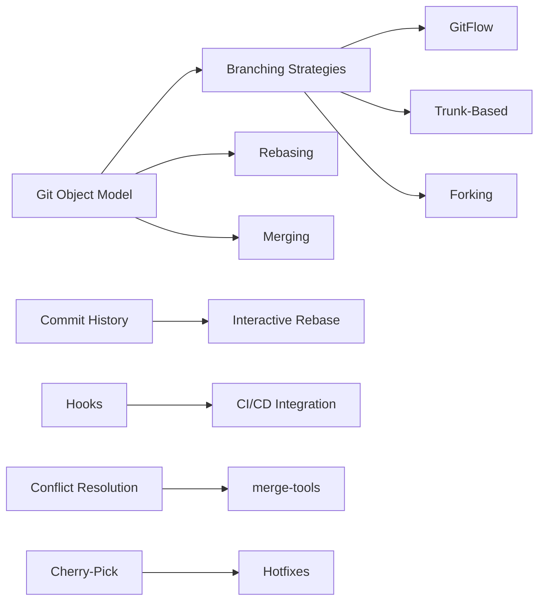
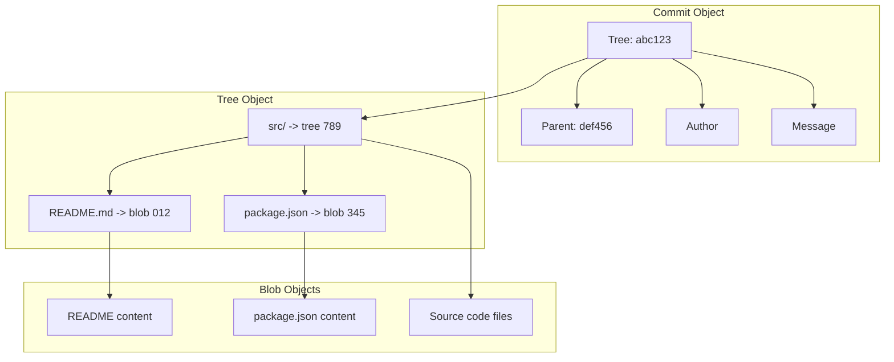

# Chapter 2: Advanced Git

> **Prev:** [Introduction](./01-introduction.md) | **Prev Section:** [Linux Basics](./02-linux-basics.md)

---

## Learning Objectives

- Understand Git's internal object model (blobs, trees, commits, tags).
- Master branching and merging strategies for collaborative development.
- Implement workflows like GitFlow, trunk-based development, and forking.
- Use interactive rebasing for clean commit history.
- Resolve complex merge conflicts.
- Set up Git hooks for automation.

---

## Chapter at a Glance

| Topic | Key Insight | Practical Takeaway |
|-------|-------------|-------------------|
| Git Internals | Objects and references | Understanding SHA hashes demystifies Git |
| Branching | Lightweight pointers to commits | Branches are cheap — create them freely |
| Merging | Fast-forward vs 3-way merges | Choose strategy based on team workflow |
| Rebasing | Linearizing commit history | Rebase feature branches, merge main branches |
| GitFlow | Structured release management | Good for versioned releases, bad for continuous delivery |
| Trunk-Based | Short-lived feature branches | Best for CI/CD and DevOps pipelines |
| Hooks | Client and server-side automation | Enforce policies, run checks automatically |
| Conflict Resolution | Understanding diff3 and merge tools | Use `rerere` for recurring conflicts |
| Cherry-Picking | Selective commit application | Useful for hotfixes across branches |

## Chapter Roadmap



## Theory

### Git Object Model

Git is fundamentally a content-addressable filesystem with a VCS interface. Every Git object is identified by its SHA-1 hash and stored in `.git/objects/`.

**Four object types:**

**Blob:** Stores file content. Named by SHA-1 of the content. Does not store the filename — that's in the tree. Two files with identical content share the same blob.

**Tree:** Stores directory listings — filenames, permissions, and references to blobs or subtrees. Analogous to a filesystem directory.

**Commit:** Snapshot of the entire repository at a point in time. Contains:
- Pointer to the root tree object
- Parent commit(s)
- Author and committer (name, email, timestamp)
- Commit message

**Tag:** A named reference to a specific commit. Annotated tags store metadata and can be signed with GPG.



**References (refs):** Pointers to commits stored in `.git/refs/`:
- `refs/heads/main` — Local branch pointer
- `refs/remotes/origin/main` — Remote tracking branch
- `refs/tags/v1.0` — Tag pointer
- `HEAD` — Current branch or commit

**The staging area (index):** Stored in `.git/index`. When you run `git add`, Git creates blob objects and updates the index with the new tree structure. When you run `git commit`, Git creates a commit object pointing to the staged tree.

### Branching Strategies

**GitFlow (Vincent Driessen, 2010):**
- `main` — Production-ready code
- `develop` — Integration branch for features
- `feature/*` — Branched from `develop`
- `release/*` — Branched from `develop` when preparing release
- `hotfix/*` — Branched from `main` for critical fixes

GitFlow works well for projects with scheduled releases and multiple concurrent versions. It is overly complex for continuous delivery.

**Trunk-Based Development:**
- All developers commit to a single branch (`main` or `trunk`)
- Feature branches are short-lived (hours to a day)
- Feature toggles hide incomplete work
- Releases are tagged off `main`

Trunk-based development is the recommended approach for DevOps teams practicing CI/CD. It reduces merge complexity and ensures everyone integrates continuously.

**Forking Workflow:**
- Each developer has a personal fork of the main repository
- Changes flow between forks via pull requests
- Maintained primarily in open-source projects

### Merging vs Rebasing

**Fast-forward merge:** When the target branch hasn't diverged, Git simply moves the pointer forward. No merge commit.

```text
Before:  A---B---C (main)
               \
                D---E (feature)
After:   A---B---C---D---E (main)
```

**Three-way merge:** When branches have diverged, Git creates a merge commit with two parents.

```text
Before:  A---B---C---F (main)
               \
                D---E (feature)
After:   A---B---C---F---M (main)
               \         /
                D---E---/
```

**Rebasing:** Reapplies commits from one branch onto another, creating a linear history.

```text
Before:  A---B---C (main)
               \
                D---E (feature)
After:   A---B---C---D'---E' (feature)
```

Rebasing rewrites history — never rebase shared/published branches.

### Interactive Rebase

Interactive rebase (`git rebase -i HEAD~N`) enables editing commits before applying. Options per commit:

- `pick` — Use as-is
- `reword` — Change commit message
- `edit` — Amend commit content
- `squash` — Combine with previous commit
- `fixup` — Combine but discard message
- `drop` — Remove commit
- `exec` — Run a shell command

### Cherry-Picking

Cherry-picking applies a specific commit to the current HEAD:

```text
git cherry-pick <commit-hash>
git cherry-pick -x <commit-hash>  # Adds source reference
```

### Git Hooks

Hooks are scripts that run automatically at specific Git lifecycle events. They live in `.git/hooks/` and must be executable.

**Client-side hooks (run on developer machine):**
- `pre-commit` — Check code style, run linters
- `prepare-commit-msg` — Edit default commit message
- `commit-msg` — Validate commit message format
- `pre-push` — Run tests before pushing
- `post-merge` — Reindex after merge

**Server-side hooks (run on remote repository):**
- `pre-receive` — Enforce policies on incoming pushes
- `update` — Per-branch policy enforcement
- `post-receive` — Trigger CI/CD, deployments, notifications

**Example pre-commit hook:**

```bash
#!/bin/bash
set -euo pipefail

# Check for debug statements
if grep -rn "console.log" src/ --include="*.ts" | grep -v "// OK"; then
    echo "ERROR: Remove console.log statements before committing"
    exit 1
fi

# Run formatter
npx prettier --check src/

# Run linter
npx eslint src/
```

### Conflict Resolution

When Git cannot automatically merge, it marks conflict markers:

```text
<<<<<<< HEAD
Current change in main
=======
Incoming change in feature
>>>>>>> feature/branch
```

**Effective strategies:**
1. Use `git diff` to understand conflict boundaries
2. Use `git mergetool` with a visual tool (vimdiff, beyond compare)
3. Use `diff3` conflict style: `git config --global merge.conflictstyle diff3`
4. Enable `rerere` (reuse recorded resolution): `git config --global rerere.enabled true`
5. For large conflicts, break resolution into smaller chunks

### DevOps-Specific Git Patterns

**Semantic commit messages:**
```text
feat(api): add user authentication endpoint
fix(db): correct connection pool leak
chore(deps): update lodash to 4.17.21
docs(readme): update deployment instructions
ci(pipeline): parallelize test runs
refactor(core): extract payment validation
test(auth): add unit tests for JWT token
```

**Conventional Commits specification:** Structure as `<type>(<scope>): <description>`. Enables automated changelog generation, semantic versioning, and release notes.

**Git blame and bisect:**
```text
git blame -L 10,30 src/app.ts           # Line-level attribution
git bisect start                        # Binary search for bug introduction
git bisect bad                          # Current commit is bad
git bisect good v1.0                    # v1.0 was good
git bisect run npm test                 # Automated bisection
```

**Git worktrees for parallel work:**
```text
git worktree add ../hotfix hotfix-branch
git worktree list
git worktree remove ../hotfix
```

---

## Examples

### Example 1: Git Internal Object Inspection

```typescript
// Simulating Git's object storage model
import { createHash } from 'crypto';

interface GitObject {
  type: 'blob' | 'tree' | 'commit' | 'tag';
  content: string;
  hash: string;
}

class GitObjectStore {
  private objects: Map<string, GitObject> = new Map();

  hashContent(type: string, content: string): string {
    const raw = `${type} ${content.length}\0${content}`;
    return createHash('sha1').update(raw).digest('hex');
  }

  createBlob(content: string): string {
    const hash = this.hashContent('blob', content);
    this.objects.set(hash, { type: 'blob', content, hash });
    return hash;
  }

  createTree(entries: Array<{ mode: string; name: string; hash: string }>): string {
    let content = '';
    for (const entry of entries) {
      content += `${entry.mode} ${entry.name}\0${Buffer.from(entry.hash, 'hex').toString('binary')}`;
    }
    const hash = this.hashContent('tree', content);
    this.objects.set(hash, { type: 'tree', content, hash });
    return hash;
  }

  createCommit(tree: string, parent: string | null, message: string): string {
    let content = `tree ${tree}\n`;
    if (parent) content += `parent ${parent}\n`;
    content += `author Dev Ops <devops@example.com> ${Date.now()} +0000\n`;
    content += `committer Dev Ops <devops@example.com> ${Date.now()} +0000\n\n`;
    content += `${message}\n`;
    const hash = this.hashContent('commit', content);
    this.objects.set(hash, { type: 'commit', content, hash });
    return hash;
  }
}

const store = new GitObjectStore();
const readmeHash = store.createBlob('# My Project\n');
const srcTree = store.createTree([
  { mode: '100644', name: 'index.ts', hash: store.createBlob('console.log("hello");') },
]);
const mainTree = store.createTree([
  { mode: '100644', name: 'README.md', hash: readmeHash },
  { mode: '040000', name: 'src', hash: srcTree },
]);
const commitHash = store.createCommit(mainTree, null, 'Initial commit');
console.log(`Commit hash: ${commitHash}`);
```

### Example 2: Branch Management Workflow

```typescript
// Simulating branching and merging operations
interface Commit {
  hash: string;
  message: string;
  parent: string | null;
}

class GitRepository {
  private commits: Map<string, Commit> = new Map();
  private branches: Map<string, string> = new Map();
  private HEAD: string | null = null;

  commit(message: string): string {
    const hash = `c${this.commits.size + 1}`;
    const parent = this.HEAD;
    const c: Commit = { hash, message, parent };
    this.commits.set(hash, c);
    this.HEAD = hash;
    return hash;
  }

  createBranch(name: string): void {
    this.branches.set(name, this.HEAD!);
  }

  checkoutBranch(name: string): void {
    this.HEAD = this.branches.get(name)!;
  }

  fastForwardMerge(branch: string): boolean {
    const targetHead = this.branches.get(branch)!;
    // Check if current HEAD is ancestor of target
    let current: string | null = targetHead;
    while (current) {
      if (current === this.HEAD) {
        this.HEAD = targetHead;
        return true;
      }
      current = this.commits.get(current)?.parent ?? null;
    }
    return false;
  }

  log(): Commit[] {
    const history: Commit[] = [];
    let current: string | null = this.HEAD;
    while (current) {
      history.push(this.commits.get(current)!);
      current = this.commits.get(current)?.parent ?? null;
    }
    return history;
  }
}

const repo = new GitRepository();
repo.commit('Initial commit');
repo.createBranch('feature/login');
repo.commit('Add README');

repo.checkoutBranch('feature/login');
repo.commit('Add login form');
repo.commit('Implement auth logic');

console.log('Feature branch history:');
repo.log().forEach(c => console.log(`  ${c.hash}: ${c.message}`));

repo.checkoutBranch('main');
repo.fastForwardMerge('feature/login');
console.log('\nAfter merge, main history:');
repo.log().forEach(c => console.log(`  ${c.hash}: ${c.message}`));
```

### Example 3: Git Hook Implementation

```typescript
// Git commit-msg hook implementation for conventional commit validation
interface CommitMessage {
  type: string;
  scope: string | null;
  description: string;
}

function parseCommitMessage(message: string): CommitMessage | null {
  const pattern = /^(feat|fix|docs|style|refactor|perf|test|build|ci|chore|revert)(\([\w.-]+\))?:\s(.+)$/;
  const match = message.match(pattern);
  if (!match) return null;
  return {
    type: match[1],
    scope: match[2]?.replace(/[()]/g, '') ?? null,
    description: match[3],
  };
}

function validateConventionalCommit(message: string): string[] {
  const errors: string[] = [];
  const parsed = parseCommitMessage(message);

  if (!parsed) {
    return ['Invalid format. Use: <type>(<scope>): <description>'];
  }

  const validTypes = ['feat', 'fix', 'docs', 'style', 'refactor', 'perf', 'test', 'build', 'ci', 'chore', 'revert'];
  if (!validTypes.includes(parsed.type)) {
    errors.push(`Invalid type: ${parsed.type}`);
  }

  if (parsed.description.length > 72) {
    errors.push('Description exceeds 72 characters');
  }

  if (parsed.description.endsWith('.')) {
    errors.push('Description should not end with period');
  }

  return errors;
}

const testMessages = [
  'feat(auth): add login endpoint',
  'added cool stuff',
  'fix(db): correct connection pool leak',
];

for (const msg of testMessages) {
  const errors = validateConventionalCommit(msg);
  if (errors.length > 0) {
    console.log(`REJECTED: "${msg}"`);
    errors.forEach(e => console.log(`  - ${e}`));
  } else {
    console.log(`ACCEPTED: "${msg}"`);
  }
}
```

---

## Practical Takeaways

1. **Use trunk-based development for CI/CD.** Short-lived branches keep integration pain low.
2. **Squash merge feature branches.** Keep `main` history clean with one commit per feature.
3. **Write descriptive commit messages.** Use conventional commits for automated tooling.
4. **Never rebase shared branches.** It rewrites history and breaks other developers' clones.
5. **Use `rerere` for recurrent conflicts.** Git remembers how you resolved conflicts before.
6. **Automate with hooks.** Pre-commit hooks catch issues before they reach CI/CD.

---

## Chapter Quiz

<details><summary>Question 1: What are the four Git object types?</summary>**A)** Head, Branch, Tag, Commit<br>**B)** Blob, Tree, Commit, Tag<br>**C)** File, Directory, Snapshot, Reference<br>**D)** Index, Working, Staging, Remote<br><br>**Answer: B)** Blob, Tree, Commit, Tag</details>

<details><summary>Question 2: What does `git rebase -i` allow you to do?</summary>**A)** Force push to remote<br>**B)** Edit commit history interactively<br>**C)** Merge two branches<br>**D)** Create a new branch<br><br>**Answer: B)** Edit commit history interactively</details>

<details><summary>Question 3: Why should you not rebase shared branches?</summary>**A)** It causes merge conflicts<br>**B)** It rewrites history, breaking other clones<br>**C)** It is slower than merging<br>**D)** It creates duplicate commits<br><br>**Answer: B)** It rewrites history, breaking other clones</details>

<details><summary>Question 4: When does a three-way merge occur?</summary>**A)** When branches have diverged<br>**B)** When merging two unrelated repositories<br>**C)** When using rebase instead of merge<br>**D)** When pushing to a remote<br><br>**Answer: A)** When branches have diverged</details>

<details><summary>Question 5: What is the purpose of `git rerere`?</summary>**A)** Revert resolved changes<br>**B)** Reuse recorded resolution of conflicts<br>**C)** Reset remote repository<br>**D)** Remove redundant entries<br><br>**Answer: B)** Reuse recorded resolution of conflicts</details>

---

## Summary

- Git's object model consists of blobs (file content), trees (directory listings), commits (snapshots), and tags (named references).
- Branching strategies range from GitFlow (complex, release-oriented) to trunk-based (simple, CI/CD-friendly).
- Merging creates merge commits; rebasing linearizes history but rewrites commits.
- Interactive rebasing enables squashing, rewording, and reordering commits before sharing.
- Git hooks automate policy enforcement at commit, push, and receive stages.
- Cherry-picking applies individual commits across branches for hotfixes.
- Semantic commit messages enable automated changelog and version management.
- Understanding Git internals demystifies the tool and improves troubleshooting.

---

## Exercises

### Review Questions
1. How does Git store file content? What determines whether two identical files share storage?
2. What is the difference between `git merge` and `git rebase`?
3. When would you use GitFlow over trunk-based development?
4. How do conventional commit messages enable automation?
5. What is the difference between client-side and server-side Git hooks?

### Application Problems
1. Create a Git pre-commit hook that runs ESLint and Prettier checks.
2. Simulate a merge conflict resolution scenario with two branches diverging on the same file.
3. Design a branching strategy for a service that needs to support v1, v2, and v3 simultaneously while deploying daily.
4. Write a script that uses `git bisect` to find a bug introduced in a range of commits.

### Challenge Problem
1. Build a complete Git workflow automation system that: enforces conventional commits via pre-commit hook, automatically generates a changelog from commit messages, runs CI/CD via post-receive hook, creates release tags with annotated messages, and prevents force-push to `main` via server-side hooks. Implement the system as a set of scripts and configuration files.
