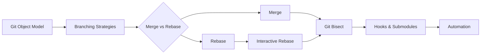

# Chapter 2: Advanced Git

> **Previous:** [Introduction to DevOps](./01-introduction.md) | **Next:** [Linux Fundamentals](./02-linux-basics.md)

## Learning Objectives

By the end of this chapter, students will be able to:

1. Evaluate and select appropriate branching strategies for different project contexts
2. Differentiate between merge and rebase and apply each correctly
3. Perform interactive rebase to clean up commit history
4. Use git bisect to identify the commit that introduced a regression
5. Implement git hooks for automation and policy enforcement
6. Manage submodules, signed commits, and large file storage

## Chapter at a Glance

| Topic | Key Insight | Practical Takeaway |
|-------|-------------|-------------------|
| Git Object Model | DAG of blobs, trees, commits, tags with SHA-1 hashes | Understanding objects is essential for advanced Git operations |
| Branching Strategies | Git Flow, GitHub Flow, GitLab Flow, Trunk-Based | Match strategy to release cadence and team size |
| Merge vs Rebase | Preserves history vs linearizes it | Rebase local work before push; merge after |
| Git Bisect | Binary search for regression commits | Automate with git bisect run for efficient debugging |
| Git Hooks | Client-side and server-side automation scripts | Use .githooks directory for team-wide hooks |

## Chapter Roadmap

## Theory

### 2.1 Git Object Model

> **Pro Tip:** Use git bisect run with your test suite to automatically find regression commits overnight.

Git stores data as a directed acyclic graph of objects. Four object types exist: blobs (file contents), trees (directory listings), commits (snapshots referencing root tree, parent commits, author, committer, and message), and annotated tags (references to commits with metadata). References (branches, tags, HEAD) are pointers to specific commits. Understanding this model is essential for mastering advanced Git operations.

Each commit is identified by a SHA-1 hash of its contents, including parent hashes. This means the commit graph is tamper-evident: changing any historical commit changes all descendant hashes.

### 2.2 Branching Strategies

> **Warning:** Rebasing shared branches rewrites history and causes chaos for collaborators. Follow the golden rule.

**Git Flow** — Proposed by Vincent Driessen in 2010. Uses two long-running branches: `main` (production-ready code) and `develop` (integration branch). Supporting branches include `feature/*` (new features, branch from develop, merge back to develop), `release/*` (release preparation, branch from develop, merge to main and develop), and `hotfix/*` (urgent production fixes, branch from main, merge to main and develop). Git Flow is well-suited for versioned software with scheduled releases but introduces complexity and overhead for continuous delivery.

**GitHub Flow** — A simpler model proposed by GitHub. Maintains a single long-running `main` branch. Features are developed on short-lived branches, submitted as pull requests, reviewed, and merged. Branches are deleted after merge. GitHub Flow works well for continuous delivery where every merge to main can be deployed. It does not support release branches or hotfix branches explicitly.

**GitLab Flow** — Combines elements of both. Adds environment branches (`staging`, `production`) that track deployments, and feature branches with merge requests. Introduces upstream-downstream relationships for forked contributions. Supports multiple environments through environment branches rather than release branches.

**Trunk-Based Development** — Developers commit directly to a shared trunk (main) or use very short-lived feature branches (fewer than 2 days). Frequent small commits avoid merge conflicts. Requires robust feature flags to manage incomplete features. Trunk-based development is associated with high-performing teams and is required for continuous deployment.

### 2.3 Merge vs Rebase

> **Remember:** The golden rule of rebasing: never rebase commits that have been pushed to a shared repository.

**Merging** — `git merge feature` creates a new commit that has two parents, preserving the complete history of both branches. This accurately represents what happened but can create non-linear history with many merge commits.

**Rebasing** — `git rebase main` replays commits from the current branch onto the tip of main, creating new commits with different hashes. This produces a linear history but rewrites history, which is dangerous for shared branches.

The golden rule of rebasing: never rebase commits that have been pushed to a shared repository. Rebase local work before pushing; merge after pushing. The choice between merge and rebase reflects a philosophical difference: merge preserves reality, rebase presents an idealized narrative.

### 2.4 Interactive Rebase

Interactive rebase (`git rebase -i HEAD~n`) opens an editor with instructions for each commit in the range: `pick` (keep as is), `reword` (change message), `edit` (amend commit), `squash` (combine into previous commit), `fixup` (squash discarding message), `drop` (remove). This enables cleaning up a feature branch before merging:

- Squash WIP commits into coherent logical units
- Reword unclear commit messages
- Drop commits that were experimental or wrong
- Reorder commits for logical clarity

Interactive rebase is a cornerstone of clean Git history, which improves code review effectiveness and project archaeology.

### 2.5 Git Bisect

`git bisect` performs a binary search through the commit graph to find the exact commit that introduced a bug. The user marks a known-good commit and a known-bad commit, then Git checks out the midpoint commit. The user tests the commit and marks it good or bad. Within log2(n) steps, Git identifies the first commit where the bug appeared.

Automation via `git bisect run` passes a script that returns exit code 0 (good) or 1-127 (bad). For example, `git bisect run make test` runs the test suite at each checkpoint. This is invaluable for regression hunting in large codebases.

### 2.6 Git Hooks

Git hooks are scripts that execute at specific points in the Git workflow. Hooks reside in `.git/hooks/` and are not version-controlled by default. Team-wide hooks can be managed through a `.githooks/` directory configured via `git config core.hooksPath .githooks`.

Client-side hooks:
- `pre-commit` — Run linters, formatters, and secret scanners before commit is recorded
- `prepare-commit-msg` — Edit the default commit message
- `commit-msg` — Validate commit message format
- `pre-push` — Run tests before pushing

Server-side hooks:
- `pre-receive` — Validate incoming pushes (e.g., enforce linear history)
- `update` — Per-branch policy enforcement
- `post-receive` — Trigger CI, notifications, deployments

Tools like Husky and pre-commit manage hook installation and versioning across teams.

### 2.7 Submodules

Submodules embed one Git repository within another at a specific commit. `git submodule add <url> <path>` registers the submodule in `.gitmodules` and records the pinned commit in the parent repository. Submodules enable managing dependencies that are under active development but add complexity:

- `git clone --recurse-submodules` clones with all submodules
- `git submodule update --remote` updates to latest commit on tracked branch
- Detached HEAD state is normal in submodules; making changes requires checking out a branch

Alternatives include subtree merging and package managers.

### 2.8 Signed Commits and Tags

Git supports cryptographic signing of commits and tags using GPG or SSH keys. Signed commits verify the identity of the author. Configuration requires generating a key pair, adding the public key to Git hosting, and configuring Git: `git config commit.gpgsign true` and `git config user.signingkey <key-id>`.

GitHub displays signed commits with a verified badge. Signed tags (`git tag -s`) provide assurance for release artifacts.

### 2.9 Git Large File Storage (LFS)

Git LFS replaces large files in the repository with text pointers while storing the actual file content on a remote server. This prevents repository bloat from binary files. `git lfs track "*.psd"` registers file patterns. The `git lfs migrate` command rewrites history to move previously committed large files into LFS. LFS is essential for game development, machine learning datasets, and any repository with binary artifacts.

### 2.10 Git Workflow Automation

Git aliases, scripting, and automation frameworks reduce repetitive operations. Examples include:

- Automation scripts that enforce branch naming conventions
- CI/CD integration that validates commit history
- Automation that synchronizes issue tracker state with commit references
- Scripts that automate release branch creation and version bumping

## Summary

## Concept Comparison Table

| Concept | Description |
|---------|-------------|
| Git Flow | Two long-running branches with feature/release/hotfix branches |
| GitHub Flow | Single main branch with short-lived feature branches |
| Trunk-Based Dev | Direct commits to main with very short branches |
| Merge | Preserves full history with merge commits |
| Rebase | Linearizes history by replaying commits |

## Quick Reference

| Topic | Key Points |
|-------|------------|
| Git Object Model | Blobs, trees, commits, tags in a DAG |
| Branch Strategy | Git Flow, GitHub Flow, GitLab Flow, Trunk-Based |
| Golden Rule | Never rebase shared branches |
| Interactive Rebase | reword, squash, fixup, drop, edit |
| Bisect Automation | git bisect run with test script |

## Cross-Application Matrix

| Domain | Application |
|--------|-------------|
| Web | Branch-based feature development with PR reviews |
| Cloud | GitOps workflows with trunk-based deployment |
| Enterprise | Git Flow for scheduled release cycles |
| Embedded | Submodules for dependency management |

## Chapter Quiz

Question 1: What's the golden rule of rebasing?
**A)** Always rebase before every push **B)** Never rebase commits pushed to a shared repo **C)** Rebase only on Fridays **D)** Always squash commits during rebase  **Answer: B)** Never rebase commits pushed to a shared repo

Question 2: Which branching strategy is recommended for CI/CD?
**A)** Git Flow **B)** Trunk-Based Development **C)** Feature Branch **D)** Release Branch  **Answer: B)** Trunk-Based Development

Question 3: What does interactive rebase NOT allow?
**A)** Squash commits **B)** Reword messages **C)** Drop commits **D)** Merge conflict resolution  **Answer: D)** Merge conflict resolution

## Summary

Advanced Git proficiency is foundational to DevOps practice. Branching strategies must align with delivery cadence and team size. Merge and rebase serve different purposes and must be applied deliberately. Interactive rebase, bisect, hooks, and submodules are powerful tools when understood properly. Signed commits and Git LFS address security and scale concerns. Git remains the most widely adopted version control system in professional software engineering.

## Exercises

### Review Questions

1. Compare Git Flow and trunk-based development across: branch lifetime, merge frequency, suitability for CI/CD, and team coordination overhead.
2. Explain the golden rule of rebasing. Why does rebasing shared branches cause problems?
3. How does git bisect determine its search path? What is the worst-case number of bisect steps for 10,000 commits?
4. List three client-side Git hooks and describe appropriate automation for each.
5. When should Git LFS be used instead of standard Git commits?

### Application Problems

1. Initialize a Git repository, create five commits with intentional WIP-style messages. Use interactive rebase to squash two commits, reword one message, and reorder two commits. Document the sequence of commands.
2. Create a pre-commit hook that rejects commits with "TODO" or "FIXME" in staged files. Install it via `.githooks/` directory. Demonstrate it working with a test commit.
3. Set up a repository with GPG-signed commits. Export your public key. Create a repository with a signed tag. Verify both the commit and tag signatures.

### Challenge Problem

Design a branching strategy for a team of 12 engineers practicing continuous delivery with daily deployments. The team maintains three active releases simultaneously (v2.x, v3.x, v4.x). Production hotfixes occur approximately twice per month. The system processes PCI-compliant financial data requiring audit trails for all code changes. Propose a branching model, specify merge strategies, define the commit message convention, specify hook-based enforcement mechanisms, and describe how the hotfix process flows through your model. Justify each design decision with reference to the constraints.
