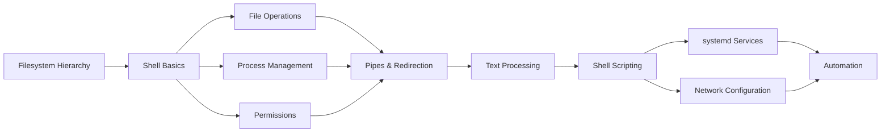

# Chapter 2: Linux Basics for DevOps

> **Next:** [Advanced Git](./02-git.md)

---

## Learning Objectives

- Understand the Linux filesystem hierarchy and navigate it effectively.
- Master essential command-line operations for file management, process control, and system administration.
- Understand file permissions, users, and groups.
- Use pipes, redirection, and text processing tools.
- Write and debug shell scripts for automation.
- Configure networking and manage services with systemd.

---

## Chapter at a Glance

| Topic | Key Insight | Practical Takeaway |
|-------|-------------|-------------------|
| Filesystem Hierarchy | Standard directory layout (FHS) | Know where configs, logs, and binaries live |
| Command Line | Core utilities for daily DevOps work | `grep`, `awk`, `sed`, `find` are indispensable |
| Permissions | Read/write/execute for user/group/other | Use `chmod`, `chown`, `umask` daily |
| Pipes and Redirection | Chain commands together | Build pipelines like `ps aux | grep | awk` |
| Shell Scripting | Automate repetitive tasks | Parameterize scripts for CI/CD |
| systemd | Service management and boot process | `systemctl` for all service operations |

## Chapter Roadmap



## Theory

### Filesystem Hierarchy Standard (FHS)

Linux follows the Filesystem Hierarchy Standard, which defines the directory structure:

| Directory | Purpose |
|-----------|---------|
| `/` | Root directory, base of the filesystem |
| `/bin` | Essential user command binaries (e.g., `ls`, `cp`) |
| `/sbin` | System administration binaries (e.g., `fdisk`, `mkfs`) |
| `/etc` | System-wide configuration files |
| `/var` | Variable data (logs, databases, spools) |
| `/tmp` | Temporary files (cleared on reboot) |
| `/home` | Personal directories for users |
| `/root` | Home directory for root user |
| `/usr` | Secondary hierarchy for user utilities and applications |
| `/opt` | Optional third-party software packages |
| `/proc` | Virtual filesystem for process and kernel information |
| `/dev` | Device files representing hardware |

Understanding this hierarchy is crucial for DevOps work because logs live in `/var/log`, configs in `/etc`, and executables in `/usr/bin`. When writing automated scripts or configuring CI/CD agents, knowing where to find and place files is fundamental.

### Essential Command-Line Operations

**Navigation and File Operations:**
- `pwd` — Print working directory
- `ls -la` — List all files with details
- `cd ~/project` — Change directory
- `cp -r src/ dest/` — Copy recursively
- `mv old new` — Move or rename
- `rm -rf dir/` — Remove directory recursively (dangerous)
- `mkdir -p a/b/c` — Create nested directories
- `touch file.txt` — Create empty file or update timestamp
- `find /path -name "*.log"` — Search for files

**File Viewing:**
- `cat file` — Display entire file
- `less file` — Scroll through file (press `q` to quit)
- `head -20 file` — First 20 lines
- `tail -f file` — Follow file in real-time (crucial for logs)
- `nl file` — Numbered lines

**Process Management:**
- `ps aux` — All processes with details
- `top` or `htop` — Interactive process viewer
- `kill -9 PID` — Force kill process
- `pgrep -f pattern` — Search processes by name
- `pkill -f pattern` — Kill processes by pattern
- `nice -n 10 command` — Run with lower priority

**System Information:**
- `uname -a` — Kernel version and system info
- `df -h` — Disk space usage
- `du -sh /path` — Directory size
- `free -h` — Memory usage
- `uptime` — System uptime and load average
- `lscpu` — CPU information

### File Permissions

Every file and directory has three permission sets (owner, group, others) with three modes (read, write, execute).

```text
-rwxr-xr--  1 user group  1024 Jun 24 10:00 script.sh
|  |  |  |
|  |  |  └─ Others: read only (r--)
|  |  └──── Group: read and execute (r-x)
|  └─────── Owner: read, write, execute (rwx)
└────────── File type (- for file, d for directory)
```

**Numeric permissions (octal):**
- `r` = 4, `w` = 2, `x` = 1
- `chmod 755 file` = owner rwx (7), group r-x (5), others r-x (5)
- `chmod 644 file` = owner rw- (6), group r-- (4), others r-- (4)

**Common commands:**
```text
chmod 755 script.sh     # Make script executable
chown user:group file   # Change owner and group
umask 022               # Default permissions for new files
chmod +x script.sh      # Add execute permission
chmod -R 755 directory/  # Recursively set permissions
```

### Pipes, Redirection, and Streams

Linux uses three standard I/O streams:
- **stdin** (0) — Input to command
- **stdout** (1) — Normal output
- **stderr** (2) — Error output

**Redirection operators:**
```text
command > file      # Redirect stdout to file (overwrite)
command >> file     # Redirect stdout to file (append)
command 2> file     # Redirect stderr to file
command &> file     # Redirect both stdout and stderr
command < file      # Read stdin from file
command << EOF      # Here document (inline input)
```

**Pipes** connect stdout of one command to stdin of another:
```text
ps aux | grep nginx | awk '{print $2}'
cat access.log | cut -d' ' -f1 | sort | uniq -c | sort -rn | head -10
```

### Text Processing Power Tools

**`grep` — Pattern searching:**
```text
grep "ERROR" app.log                    # Find lines containing ERROR
grep -v "DEBUG" app.log                 # Exclude DEBUG lines
grep -i "warning" app.log               # Case-insensitive
grep -r "TODO" src/                     # Recursive search in directory
grep -E "ERROR|FATAL" app.log           # Extended regex (multiple patterns)
grep -c "pattern" file                  # Count matches
grep -A 5 -B 5 "ERROR" log              # 5 lines after and before match
```

**`sed` — Stream editor:**
```text
sed -i 's/old/new/g' file               # Replace all occurrences in-place
sed -n '/ERROR/p' log                   # Print only ERROR lines
sed '/^#/d' config                      # Delete comment lines
sed '1,10d' file                        # Delete first 10 lines
sed 's/  */,/g' data                    # Convert spaces to commas
```

**`awk` — Pattern scanning and processing:**
```text
awk '{print $1}' file                   # Print first column
awk -F: '{print $1, $3}' /etc/passwd   # Use : as delimiter
awk '$3 > 100 {print $1}' data          # Conditional print
awk '{sum+=$1} END {print sum}' file    # Sum column values
awk 'NR==FNR {a[$1]; next} $1 in a' f1 f2  # Join two files
```

### Shell Scripting

Shell scripts automate repetitive tasks. They are essential for CI/CD pipelines, deployment scripts, and system administration.

**Basic script structure:**
```bash
#!/bin/bash
set -euo pipefail  # Strict mode: exit on error, undefined vars, pipe failures

# Variables
PROJECT_DIR="/var/www/app"
BACKUP_DIR="/backups/$(date +%Y%m%d)"
LOG_FILE="/var/log/deploy.log"

# Functions
log() {
    echo "[$(date '+%Y-%m-%d %H:%M:%S')] $1" >> "$LOG_FILE"
}

cleanup() {
    log "Cleaning up temporary files..."
    rm -rf /tmp/deploy-*
}

# Trap for cleanup on exit
trap cleanup EXIT

# Main
log "Starting deployment..."
mkdir -p "$BACKUP_DIR"
if cp -r "$PROJECT_DIR" "$BACKUP_DIR"; then
    log "Backup created successfully"
else
    log "ERROR: Backup failed"
    exit 1
fi
```

**Key scripting patterns:**
- **Parameter expansion:** `${VAR:-default}`, `${VAR:?error message}`
- **Arrays:** `arr=(a b c)`, `${arr[@]}`, `${#arr[@]}`
- **Conditionals:** `if, elif, else, case`
- **Loops:** `for i in list; do done`, `while read line; do done`
- **Exit codes:** `$?` for last command status
- **Command substitution:** `$(command)` or `` `command` ``

### systemd Service Management

Modern Linux uses systemd for service management, boot process, and logging.

**Common `systemctl` commands:**
```text
systemctl start nginx          # Start a service
systemctl stop nginx           # Stop a service
systemctl restart nginx        # Restart a service
systemctl status nginx         # Check service status
systemctl enable nginx         # Start on boot
systemctl disable nginx        # Disable auto-start
systemctl reload nginx         # Reload configuration
systemctl daemon-reload        # Reload unit files after change
```

**Creating a systemd unit file (`/etc/systemd/system/myapp.service`):**
```ini
[Unit]
Description=My Application Service
After=network.target postgresql.service
Wants=postgresql.service

[Service]
Type=simple
User=myapp
Group=myapp
WorkingDirectory=/opt/myapp
ExecStart=/usr/bin/node /opt/myapp/server.js
Restart=on-failure
RestartSec=5
Environment=NODE_ENV=production
LimitNOFILE=65536

[Install]
WantedBy=multi-user.target
```

**Journald logging:**
```text
journalctl -u nginx              # Service-specific logs
journalctl -u nginx --since "1 hour ago"
journalctl -u nginx -f           # Follow log in real-time
journalctl --disk-usage          # Check log size
journalctl --vacuum-size=500M    # Limit log size
```

### Network Configuration

```text
ip addr              # Show network interfaces and IPs
ip route             # Show routing table
ss -tulpn            # Show listening ports and processes
netstat -tulpn       # (Legacy) Show network connections
ping -c 4 host       # Test connectivity
traceroute host      # Trace network path
nslookup domain      # DNS lookup
curl -v URL          # HTTP request with debugging
wget URL             # Download file
nc -zv host port     # Test TCP port connectivity
```

### Package Management

**Debian/Ubuntu (APT):**
```text
apt update                      # Update package index
apt upgrade                     # Upgrade all packages
apt install nginx               # Install package
apt remove nginx                # Remove package
apt autoremove                  # Remove unused dependencies
dpkg -l | grep nginx            # List installed packages
```

**RHEL/CentOS/Fedora (YUM/DNF):**
```text
yum update                      # Update all packages
yum install nginx               # Install package
yum remove nginx                # Remove package
rpm -qa | grep nginx            # List installed packages
```

---

## Examples

### Example 1: Log Analysis Pipeline

A common DevOps task is analyzing application logs to diagnose issues.

```bash
#!/bin/bash
set -euo pipefail

LOG_FILE="/var/log/app/error.log"
REPORT_FILE="/tmp/error_report.txt"

echo "=== Error Analysis Report ===" > "$REPORT_FILE"
echo "Generated: $(date)" >> "$REPORT_FILE"
echo "" >> "$REPORT_FILE"

# Top 10 most common error messages
echo "Top 10 Error Messages:" >> "$REPORT_FILE"
grep -E "ERROR|FATAL" "$LOG_FILE" | \
    sed 's/.*\[ERROR\] //' | \
    sed 's/.*\[FATAL\] //' | \
    sort | uniq -c | sort -rn | head -10 >> "$REPORT_FILE"

echo "" >> "$REPORT_FILE"

# Error count by hour
echo "Errors by Hour (last 24h):" >> "$REPORT_FILE"
awk '{print $2}' "$LOG_FILE" | \
    cut -d: -f1 | \
    sort | uniq -c | sort -k2 >> "$REPORT_FILE"

echo "" >> "$REPORT_FILE"

# Endpoint-level error breakdown
echo "Errors by Endpoint:" >> "$REPORT_FILE"
grep -oP '\[route: \K[^\]]+' "$LOG_FILE" | \
    sort | uniq -c | sort -rn >> "$REPORT_FILE"

cat "$REPORT_FILE"
```

### Example 2: Deployment Rollback Script

```bash
#!/bin/bash
set -euo pipefail

APP_DIR="/var/www/myapp"
BACKUP_DIR="/backups/myapp"
RELEASE="$1"

if [ -z "$RELEASE" ]; then
    echo "Usage: $0 <release-tag>"
    exit 1
fi

echo "Rolling back to release: $RELEASE"

# Verify backup exists
if [ ! -d "$BACKUP_DIR/$RELEASE" ]; then
    echo "ERROR: Release $RELEASE not found in $BACKUP_DIR"
    exit 1
fi

# Create a backup of current state before rollback
CURRENT_BACKUP="/backups/pre-rollback-$(date +%Y%m%d_%H%M%S)"
cp -r "$APP_DIR" "$CURRENT_BACKUP"

# Perform rollback
rm -rf "$APP_DIR"/*
cp -r "$BACKUP_DIR/$RELEASE"/* "$APP_DIR"

# Restart service
systemctl restart myapp

# Verify health
sleep 5
HEALTH=$(curl -s -o /dev/null -w "%{http_code}" http://localhost:8080/health)
if [ "$HEALTH" = "200" ]; then
    echo "Rollback to $RELEASE successful"
else
    echo "ERROR: Health check failed after rollback"
    exit 1
fi
```

### Example 3: Resource Monitoring Script

```bash
#!/bin/bash
set -euo pipefail

THRESHOLD_CPU=80
THRESHOLD_MEM=90
ALERT_EMAIL="ops@example.com"

check_resources() {
    local cpu_usage mem_usage disk_usage

    cpu_usage=$(top -bn1 | grep "Cpu(s)" | awk '{print $2}' | cut -d. -f1)
    mem_usage=$(free | grep Mem | awk '{print int($3/$2 * 100)}')
    disk_usage=$(df -h / | awk 'NR==2 {print int($5)}')

    echo "CPU: ${cpu_usage}% | MEM: ${mem_usage}% | DISK: ${disk_usage}%"

    if [ "$cpu_usage" -gt "$THRESHOLD_CPU" ]; then
        echo "ALERT: CPU at ${cpu_usage}%" | mail -s "CPU Alert" "$ALERT_EMAIL"
    fi

    if [ "$mem_usage" -gt "$THRESHOLD_MEM" ]; then
        echo "ALERT: Memory at ${mem_usage}%" | mail -s "Memory Alert" "$ALERT_EMAIL"
    fi

    # Find top CPU consumers
    echo ""
    echo "Top 5 CPU consumers:"
    ps aux --sort=-%cpu | head -6 | awk '{print $2, $11, $3"%"}'
}

check_resources
```

### Example 4: Automated Backup with Rotation

```bash
#!/bin/bash
set -euo pipefail

BACKUP_SRC="/var/lib/postgresql/12/main"
BACKUP_DST="/backups/postgres"
RETENTION_DAYS=30
TIMESTAMP=$(date +%Y%m%d_%H%M%S)
BACKUP_FILE="$BACKUP_DST/pg_backup_$TIMESTAMP.tar.gz"

# Create backup
tar -czf "$BACKUP_FILE" -C "$(dirname $BACKUP_SRC)" "$(basename $BACKUP_SRC)"

# Verify backup integrity
if ! tar -tzf "$BACKUP_FILE" >/dev/null 2>&1; then
    echo "ERROR: Backup corruption detected"
    rm -f "$BACKUP_FILE"
    exit 1
fi

# Remove backups older than retention period
find "$BACKUP_DST" -name "pg_backup_*.tar.gz" -mtime "+$RETENTION_DAYS" -delete

echo "Backup completed: $BACKUP_FILE"
echo "Size: $(du -h "$BACKUP_FILE" | cut -f1)"
```

---

## Practical Takeaways

1. **Learn the find-grep-awk pipeline.** It's the single most powerful pattern for DevOps work.
2. **Master `set -euo pipefail` in every script.** It prevents silent failures.
3. **Use `journalctl` over raw log files.** systemd's journal provides better filtering.
4. **Always trap cleanup.** Scripts should never leave the system in an inconsistent state.
5. **Use `systemctl` commands.** Learn `start`, `stop`, `restart`, `status`, `enable`, `disable`, `reload`, and `daemon-reload`.

---

## Chapter Quiz

<details><summary>Question 1: What does the `set -euo pipefail` do in a bash script?</summary>**A)** Enables debugging mode<br>**B)** Exits on error, undefined variables, and pipe failures<br>**C)** Sets environment variables<br>**D)** Configures logging<br><br>**Answer: B)** Exits on error, undefined variables, and pipe failures</details>

<details><summary>Question 2: Which command shows all listening ports and their associated processes?</summary>**A)** `ps aux`<br>**B)** `ss -tulpn`<br>**C)** `netstat -r`<br>**D)** `ip addr`<br><br>**Answer: B)** `ss -tulpn`</details>

<details><summary>Question 3: What does `chmod 755` mean?</summary>**A)** Owner can read/write/execute, everyone else can read/execute<br>**B)** Everyone can read/write/execute<br>**C)** Owner can read/execute, everyone else can read<br>**D)** Owner can read/write, group can read, others can read<br><br>**Answer: A)** Owner can read/write/execute, everyone else can read/execute</details>

<details><summary>Question 4: What is the purpose of a systemd unit file?</summary>**A)** To define how a service is managed<br>**B)** To configure the kernel<br>**C)** To set environment variables<br>**D)** To schedule cron jobs<br><br>**Answer: A)** To define how a service is managed</details>

<details><summary>Question 5: How do you permanently prevent a service from starting on boot?</summary>**A)** `systemctl stop nginx`<br>**B)** `systemctl disable nginx`<br>**C)** `systemctl mask nginx`<br>**D)** `systemctl reset nginx`<br><br>**Answer: B)** `systemctl disable nginx`</details>

---

## Summary

- The Linux filesystem hierarchy (FHS) standardizes where configuration, log, and binary files reside.
- Core command-line tools (`grep`, `awk`, `sed`, `find`) form the foundation of DevOps automation.
- File permissions control access at owner, group, and other levels using read/write/execute flags.
- Pipes and redirection chain commands into powerful data processing pipelines.
- Shell scripting with strict mode (`set -euo pipefail`) creates reliable automation scripts.
- systemd manages services, processes, and logging across modern Linux distributions.
- Network tools (`ss`, `curl`, `ping`) enable connectivity and service health checks.
- Package managers like APT and YUM handle software installation and updates.
- Log analysis pipelines combine multiple text processing tools for operational insights.

---

## Exercises

### Review Questions
1. What is the FHS standard and why is it important?
2. Explain the difference between `stdout` and `stderr` redirection.
3. How do you make a bash script executable from the command line?
4. What is the difference between `systemctl enable` and `systemctl start`?
5. How would you find the 10 largest files in a directory?

### Application Problems
1. Write a bash script that monitors disk usage and sends an alert when usage exceeds 90%.
2. Create a systemd unit file for a Node.js application that depends on PostgreSQL.
3. Build a log analysis pipeline that extracts all 5xx errors from an access log.
4. Write a deployment script that backs up the current version, deploys new code, and supports rollback.

### Challenge Problem
1. Write a complete bash framework for automated deployment that includes: pre-deployment checks (disk space, service health), backup creation, zero-downtime deployment (blue-green or canary), health verification after deploy, and automatic rollback on failure. The script should log everything to syslog and send notifications via both email and webhook.
