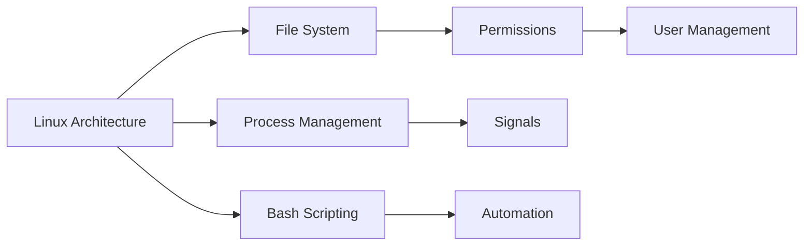

# Chapter 2: Linux Fundamentals for DevOps

> **Previous:** [Advanced Git](./02-git.md) | **Next:** [Version Control with Git](./03-version-control.md)

---

## Learning Objectives


- Navigate the Linux file system using standard CLI tools.
- Manage users, permissions, and groups to ensure system security.
- Understand and manipulate Linux processes and signals.
- Use package managers (APT/YUM) to install and manage software.
- Write basic Bash scripts to automate routine tasks.

---


## Chapter at a Glance

| Topic | Key Insight | Practical Takeaway |
|-------|-------------|-------------------|
| Linux Architecture | Kernel, Shell, and Userspace layers | Shell proficiency is essential for DevOps automation |
| File System Hierarchy | /etc, /var, /bin, /home standard directories | Know where configuration and log files live |
| Permissions System | Owner/Group/Others with rwx bits | Use octal notation (755, 644) for concise permissions |
| Process Management | PID lifecycle, fork/exec, signals | Use SIGTERM first, SIGKILL as last resort |
| Bash Scripting | Variables, conditionals, loops, functions | Automate repetitive tasks with reusable scripts |

## Chapter Roadmap



## Theory

### The Linux Architecture and Shell

> **Pro Tip:** Master the pipe operator (|) and redirection (> and >>) -- they form the backbone of Unix automation.
Linux is the backbone of DevOps because of its stability, security, and powerful command-line interface (CLI). The architecture consists of the Kernel (the core), the Shell (the interface), and Userspace applications. The Shell (usually Bash) allows DevOps engineers to interact with the OS through commands, which is essential for automation.

### File System and Permissions

> **Remember:** Linux treats everything as a file. This includes devices, sockets, and processes.
Linux treats everything as a file. Understanding the directory structure (e.g., `/etc` for config, `/var` for logs, `/bin` for binaries) is crucial. Permissions are managed using a tri-partite system: Owner, Group, and Others. Each category has Read (r), Write (w), and Execute (x) bits.
- **Notation:** `-rwxr-xr--` (754 in octal) means owner has all permissions, group can read and execute, others can only read.

### Process Management

> **Warning:** Be careful with 
m -rf / as root. Always double-check before running destructive commands.
A process is a running instance of a program. Every process has a unique PID (Process ID).
- **Life Cycle:** Processes are created using `fork()` and replaced using `exec()`.
- **States:** Running, Sleeping, Stopped, or Zombie.
- **Signals:** Commands like `kill` send signals to processes (e.g., `SIGTERM` for graceful shutdown, `SIGKILL` for immediate termination).

---

## Examples

> **One-Sentence Takeaway:** Linux CLI proficiency is the foundation skill for all DevOps engineering work.

### Example 1: Managing Permissions
A DevOps engineer needs to ensure a log directory is writable by the web server but not by other users.
- **Step-by-step:**
  1. Create a directory: `mkdir /var/www/logs`
  2. Change ownership to the `www-data` user: `chown www-data:www-data /var/www/logs`
  3. Set permissions so only owner and group can write: `chmod 775 /var/www/logs`
- **Expected output:** `ls -ld /var/www/logs` shows `drwxrwxr-x`.
- **What the example demonstrates:** Applying the principle of least privilege using standard Linux tools.

### Example 2: Basic Automation Script
Automating the backup of a configuration directory.
- **Step-by-step:**
  1. Create a script `backup.sh`:
     ```bash
     #!/bin/bash
     TIMESTAMP=$(date +%Y%m%d_%H%M%S)
     tar -czf /backups/etc_backup_$TIMESTAMP.tar.gz /etc
     echo "Backup completed at $TIMESTAMP"
     ```
  2. Make it executable: `chmod +x backup.sh`
  3. Run it: `./backup.sh`
- **Expected output:** A compressed archive in `/backups/` and a success message.
- **What the example demonstrates:** Using variables and system commands in Bash to create reusable automation.

---

## Summary

## Concept Comparison Table

| Concept | Description |
|---------|-------------|
| Bash | Default shell, powerful for scripting and interactive use |
| Permissions | rwx bits for Owner/Group/Others (e.g., 755) |
| Process | Running instance of a program with unique PID |
| Signal | Async notification to processes (SIGTERM, SIGKILL) |
| Package Manager | APT (Debian) vs YUM (RHEL) for software mgmt |

## Quick Reference

| Topic | Key Points |
|-------|------------|
| File Permissions | rwx divided into Owner/Group/Others |
| Key Directories | /etc (config), /var (logs), /bin (binaries) |
| Process Signals | SIGTERM(15), SIGKILL(9), SIGHUP(1) |
| Package Mgmt | apt install/remove (Debian), yum install/remove (RHEL) |
| Bash Automation | #!/bin/bash, variables, loops, functions |

## Cross-Application Matrix

| Domain | Application |
|--------|-------------|
| Web | Configuring Nginx and web server permissions |
| Cloud | Managing cloud VM instances via SSH |
| Enterprise | Centralized user and permission management |
| Container | Dockerfile RUN commands use Linux CLI |

## Chapter Quiz

<details><summary>Question 1: What does permission 755 mean?</summary>**A)** Owner: rwx, Group: r-x, Others: r-x<br>**B)** Owner: rwx, Group: rwx, Others: r-x<br>**C)** Owner: r-x, Group: r-x, Others: r-x<br>**D)** Owner: rwx, Group: r-x, Others: ---<br><br>**Answer: A)** Owner: rwx, Group: r-x, Others: r-x</details>

<details><summary>Question 2: Which signal should be sent first to stop a process?</summary>**A)** SIGKILL<br>**B)** SIGTERM<br>**C)** SIGHUP<br>**D)** SIGSTOP<br><br>**Answer: B)** SIGTERM</details>

<details><summary>Question 3: Where are configuration files typically stored in Linux?</summary>**A)** /var<br>**B)** /bin<br>**C)** /etc<br>**D)** /home<br><br>**Answer: C)** /etc</details>


## Summary

- Linux is the primary operating system for servers and cloud infrastructure in DevOps.
- The command line interface (CLI) is the fundamental tool for server management and automation.
- File permissions (rwx) are essential for securing system resources and applications.
- Process management allows engineers to monitor and control system performance and stability.
- Bash scripting provides a simple yet powerful way to automate repetitive tasks and glue tools together.

---

## Exercises

### Review Questions
1. What is the difference between `/bin` and `/sbin`?
2. Explain the meaning of the permission `744` in Linux.
3. What is a "Zombie" process?
4. How do you find the PID of a running process named "nginx"?

### Application Problems
1. Write a command to find all files in `/var/log` that are larger than 100MB.
2. Create a user named `deployer` and add them to a group named `devops`.
3. Write a one-liner to kill all processes owned by the user `testuser`.

### Challenge Problem
1. Write a Bash script that monitors a specific log file and sends an alert (echoes a message) whenever the word "ERROR" appears in real-time.
