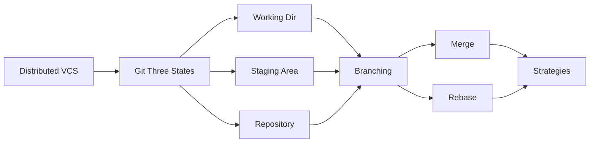

# Chapter 3: Version Control with Git

> **Previous:** [Linux Fundamentals](./02-linux-basics.md) | **Next:** [Build Tools and Packaging](./03-build-tools.md)

---

## Learning Objectives

- Explain the importance of version control in the DevOps lifecycle.
- Master basic Git operations: init, add, commit, push, pull.
- Manage branching and merging to support parallel development.
- Implement common branching strategies like GitFlow and Trunk-Based Development.
- Resolve merge conflicts efficiently.

---

## Chapter at a Glance

| Topic | Key Insight | Practical Takeaway |
|-------|-------------|-------------------|
| Distributed Model | Full local copy of repository history | Offline work and faster operations |
| Three States of Git | Working Directory, Staging Area, Repository | Stage changes deliberately for clean commit history |
| Branching and Merging | Lightweight pointers for parallel development | Create branches for every feature or fix |
| Branching Strategies | GitFlow vs Trunk-Based Development | Choose strategy based on release cadence |
| Merge Conflicts | Occur when same file lines are modified | Communicate with team to minimize conflict frequency |

## Chapter Roadmap

## Theory

### The Distributed Model

> **Pro Tip:** Stage related changes separately using git add -p to keep commits atomic and focused.
Unlike centralized version control systems, Git is distributed. Every developer has a full copy of the project history on their local machine. This enables offline work, faster operations, and robust redundancy.

### The Three States of Git

> **Remember:** git status and git log --oneline --graph are your most frequently used commands.
Git manages files in three main areas:
1.  **Working Directory:** Where you modify files.
2.  **Staging Area (Index):** Where you mark files to be included in your next commit.
3.  **Repository (.git folder):** Where Git stores the metadata and object database for your project.

### Branching and Merging

> **Warning:** Avoid committing large binary files, credentials, or generated artifacts to Git repositories.
Branches are lightweight pointers to commits. They allow teams to work on features, fixes, and experiments in isolation.
- **Merge:** Combining history from one branch into another.
- **Rebase:** Re-applying commits on top of another base tip, creating a linear history.

### Branching Strategies
- **GitFlow:** Uses permanent branches (`main`, `develop`) and short-lived branches (`feature`, `release`, `hotfix`). Good for scheduled releases.
- **Trunk-Based Development:** All developers work on a single branch (`main`). Changes are small and integrated frequently. Essential for Continuous Integration.

---

## Examples

> **One-Sentence Takeaway:** Git is a distributed version control system where every developer has a full history copy.

### Example 1: Basic Workflow
Starting a new project and making the first commit.
- **Step-by-step:**
  1. Initialize: `git init`
  2. Add file: `git add README.md`
  3. Commit: `git commit -m "Initial commit"`
  4. Link remote: `git remote add origin <url>`
  5. Push: `git push -u origin main`
- **Expected output:** Files are tracked and uploaded to the remote server.
- **What the example demonstrates:** The fundamental "add-commit-push" cycle.

### Example 2: Feature Branching and Merging
Working on a new feature without affecting the main code.
- **Step-by-step:**
  1. Create branch: `git checkout -b feature/login`
  2. Modify `auth.js` and commit.
  3. Switch back: `git checkout main`
  4. Merge feature: `git merge feature/login`
  5. Delete branch: `git branch -d feature/login`
- **Expected output:** The changes from the feature branch are now in `main`.
- **What the example demonstrates:** Using branches to isolate work and integrate it safely.

---

## Summary

## Concept Comparison Table

| Concept | Description |
|---------|-------------|
| DVCS | Full history on every developer machine |
| CVCS | Centralized server with working copies |
| Staging Area | Intermediate area for preparing commits |
| Working Directory | Current file system state |
| Repository | Stored object database in .git folder |

## Quick Reference

| Topic | Key Points |
|-------|------------|
| Basic Workflow | init, add, commit, push, pull |
| Branching | checkout -b, merge, rebase, branch -d |
| Three States | Working, Staging, Repository |
| Strategies | GitFlow, Trunk-Based, GitHub Flow |
| Conflict Resolution | Accept yours/theirs or manual merge |

## Cross-Application Matrix

| Domain | Application |
|--------|-------------|
| Web | Track website source code changes |
| Cloud | GitOps with automated deployment from Git |
| Enterprise | Multi-team collaboration with access control |
| Embedded | Firmware version tracking |

## Chapter Quiz

Question 1: What are the three states of Git?
**A)** Local, Remote, Branch **B)** Working Directory, Staging Area, Repository **C)** Dev, Test, Prod **D)** Add, Commit, Push  **Answer: B)** Working Directory, Staging Area, Repository

Question 2: What is a key benefit of Git's distributed model?
**A)** Requires constant internet connection **B)** Every developer has full project history locally **C)** Only one person can work at a time **D)** No need for branching  **Answer: B)** Every developer has full project history locally

Question 3: Which branching strategy is ideal for Continuous Integration?
**A)** GitFlow **B)** Trunk-Based Development **C)** Feature Branching only **D)** Release Branching  **Answer: B)** Trunk-Based Development

## Summary

- Version control is the "Single Source of Truth" for all DevOps automation.
- Git is the industry standard distributed version control system.
- Understanding the staging area is key to making clean, atomic commits.
- Branching is cheap and should be used frequently to isolate changes.
- Selecting the right branching strategy is critical for team velocity and release stability.
- Git history should be treated as a professional record of the project's evolution.

---

## Exercises

### Review Questions
1. What is the difference between `git pull` and `git fetch`?
2. Why is the Staging Area useful?
3. What is a "Fast-forward" merge?
4. Explain the difference between `git merge` and `git rebase`.

### Application Problems
1. You accidentally committed a large binary file. How do you remove it from the latest commit before pushing?
2. Create a `.gitignore` file for a Python project that ignores the `venv` folder and `__pycache__`.
3. Simulate a merge conflict by editing the same line in two different branches and attempting to merge them.

### Challenge Problem
1. Describe how you would implement Trunk-Based Development in a team of 50 developers to ensure that the `main` branch is always in a deployable state.
