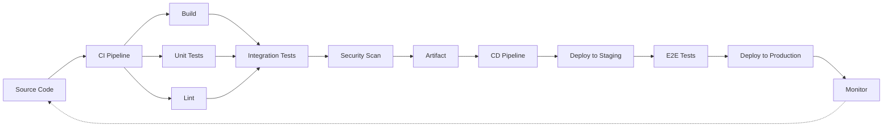
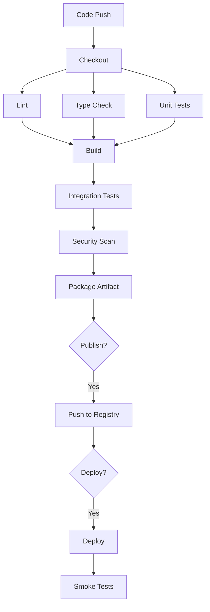
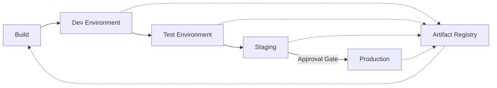

# Chapter 4: CI/CD

> **Prev:** [Build Tools](./03-build-tools.md)
> **Next:** [Continuous Integration](./04-continuous-integration.md)

---

## Learning Objectives

- Understand the concepts and benefits of Continuous Integration and Continuous Delivery/Deployment.
- Distinguish between CI, CD, and Continuous Deployment.
- Design CI/CD pipelines for TypeScript/Node.js projects.
- Configure automated build, test, and deployment stages.
- Implement pipeline security, artifact management, and environment promotion.
- Master pipeline optimization strategies (caching, parallelism, conditional stages).

---

## Chapter at a Glance

| Topic | Key Insight | Practical Takeaway |
|-------|-------------|-------------------|
| CI vs CD vs Continuous Deployment | Each expands automation scope | CI = test integration, CD = deploy to staging, Cont. Deploy = auto to prod |
| Pipeline Stages | Sequential and parallel execution | Structure pipelines as code for auditability |
| Build Stage | From source to artifact | Always produce immutable artifacts |
| Test Stage | Unit, integration, end-to-end | Run fast tests first (fail fast) |
| Deploy Stage | Environment promotion | Use the same artifact through all environments |
| Artifact Management | Binary storage and versioning | Store every version for traceability |
| Pipeline Security | Secrets, signing, scanning | Never store secrets in pipeline configs |
| Optimization | Caching, parallelism, conditional steps | Measure pipeline time and optimize bottlenecks |

## Chapter Roadmap



## Theory

### CI vs CD vs Continuous Deployment

<a href="../../../assets/images/diagrams/devops/04-cicd/ci-vs-cd-vs-continuous-deployment-handwritten.svg" target="_blank" rel="noopener">
  
</a>
<a href="../../../assets/images/diagrams/devops/04-cicd/ci-vs-cd-vs-continuous-deployment-diagram.svg" target="_blank" rel="noopener">
  
</a>
<a href="../../../assets/images/diagrams/devops/04-cicd/ci-vs-cd-vs-continuous-deployment-sticky.svg" target="_blank" rel="noopener">
  
</a>


**Continuous Integration (CI):**
- Developers merge code to main branch multiple times daily
- Each merge triggers automated build and tests
- Catches integration issues early
- Core practice: trunk-based development with short-lived branches

**Continuous Delivery (CD):**
- Builds on CI: every passing build is potentially deployable
- Automated deployment to staging/production-like environments
- Manual approval gate for production
- Core practice: deployment pipeline with environment promotion

**Continuous Deployment:**
- Every passing build is automatically deployed to production
- No manual approval gate
- Requires comprehensive testing, feature flags, and monitoring
- Core practice: automated rollback and canary releases

### Pipeline Architecture

<a href="../../../assets/images/diagrams/devops/04-cicd/pipeline-architecture-handwritten.svg" target="_blank" rel="noopener">
  
</a>
<a href="../../../assets/images/diagrams/devops/04-cicd/pipeline-architecture-diagram.svg" target="_blank" rel="noopener">
  
</a>
<a href="../../../assets/images/diagrams/devops/04-cicd/pipeline-architecture-sticky.svg" target="_blank" rel="noopener">
  
</a>


A typical CI/CD pipeline has sequential and parallel stages:



### Pipeline as Code

<a href="../../../assets/images/diagrams/devops/04-cicd/pipeline-as-code-handwritten.svg" target="_blank" rel="noopener">
  
</a>
<a href="../../../assets/images/diagrams/devops/04-cicd/pipeline-as-code-diagram.svg" target="_blank" rel="noopener">
  
</a>
<a href="../../../assets/images/diagrams/devops/04-cicd/pipeline-as-code-sticky.svg" target="_blank" rel="noopener">
  
</a>


Pipeline definitions should be version-controlled alongside the application code:

**GitHub Actions:**

```yaml
name: CI/CD Pipeline

on:
  push:
    branches: [main]
  pull_request:
    branches: [main]

env:
  NODE_VERSION: '20'

jobs:
  test:
    runs-on: ubuntu-latest
    services:
      postgres:
        image: postgres:16
        env: { POSTGRES_PASSWORD: test }
    steps:
      - uses: actions/checkout@v4
      - uses: actions/setup-node@v4
        with: { node-version: '${{ env.NODE_VERSION }}' }
      - run: npm ci
      - run: npm run lint
      - run: npm run typecheck
      - run: npm test
      - run: npm run test:integration

  build:
    needs: [test]
    runs-on: ubuntu-latest
    steps:
      - uses: actions/checkout@v4
      - run: npm ci
      - run: npm run build
      - uses: actions/upload-artifact@v4
        with: { name: build, path: dist/ }

  deploy:
    needs: [build]
    runs-on: ubuntu-latest
    environment: production
    steps:
      - uses: actions/download-artifact@v4
        with: { name: build }
      - run: ./deploy.sh
```

### Pipeline Stages in Detail

<a href="../../../assets/images/diagrams/devops/04-cicd/pipeline-stages-in-detail-handwritten.svg" target="_blank" rel="noopener">
  
</a>
<a href="../../../assets/images/diagrams/devops/04-cicd/pipeline-stages-in-detail-diagram.svg" target="_blank" rel="noopener">
  
</a>
<a href="../../../assets/images/diagrams/devops/04-cicd/pipeline-stages-in-detail-sticky.svg" target="_blank" rel="noopener">
  
</a>


**Source Stage:**
- Checkout code from version control
- Resolve submodules if applicable
- Validate branch naming convention

**Build Stage:**
- Install dependencies (`npm ci`)
- Run TypeScript type check (`tsc --noEmit`)
- Lint code (`eslint`)
- Run unit tests (fast tests first)
- Build and bundle
- Generate build artifacts

**Test Stage:**
- Integration tests (database, API, message queue)
- End-to-end tests (playwright, cypress)
- Performance/load tests (k6, artillery)
- Visual regression tests
- Accessibility tests

**Security Stage:**
- Dependency scanning (`npm audit`, Snyk)
- SAST (static analysis, CodeQL)
- Secret scanning
- Container scanning
- License compliance

**Package Stage:**
- Build Docker image
- Push to container registry
- Tag with commit SHA and version
- Sign artifacts

**Deploy Stage:**
- Deploy to staging environment
- Run smoke/health tests
- Manual approval for production (CD)
- Deploy to production (canary, blue-green, rolling)
- Monitor deployment health

### Artifact Management

<a href="../../../assets/images/diagrams/devops/04-cicd/artifact-management-handwritten.svg" target="_blank" rel="noopener">
  
</a>
<a href="../../../assets/images/diagrams/devops/04-cicd/artifact-management-diagram.svg" target="_blank" rel="noopener">
  
</a>
<a href="../../../assets/images/diagrams/devops/04-cicd/artifact-management-sticky.svg" target="_blank" rel="noopener">
  
</a>


Artifacts are the immutable output of the build stage.

**Best practices:**
- Artifacts should never be modified after creation
- Include build metadata (commit SHA, build number, timestamp)
- Store in a centralized artifact repository
- Use content-addressable storage when possible
- Establish retention policies (e.g., keep last 30 days)

**Artifact types:**
- Compiled binaries and bundles
- Docker images
- npm packages
- Deployment packages (ZIP, tarball)
- Test reports and coverage data
- SBOM (Software Bill of Materials)

### Pipeline Security

<a href="../../../assets/images/diagrams/devops/04-cicd/pipeline-security-handwritten.svg" target="_blank" rel="noopener">
  
</a>
<a href="../../../assets/images/diagrams/devops/04-cicd/pipeline-security-diagram.svg" target="_blank" rel="noopener">
  
</a>
<a href="../../../assets/images/diagrams/devops/04-cicd/pipeline-security-sticky.svg" target="_blank" rel="noopener">
  
</a>


**Secret management:**
- Use the CI platform's secret store (GitHub secrets, GitLab CI variables)
- Never hardcode secrets in pipeline configuration
- Rotate secrets regularly
- Use OIDC for cloud provider authentication instead of long-lived keys

```yaml
# GitHub Actions with OIDC
jobs:
  deploy:
    permissions:
      id-token: write
      contents: read
    steps:
      - uses: aws-actions/configure-aws-credentials@v4
        with:
          role-to-assume: arn:aws:iam::123456:role/GitHubActionsDeployRole
          aws-region: us-east-1
```

**Supply chain security:**
- Verify dependency integrity (lock files, checksums)
- Sign artifacts with GPG or Sigstore
- Generate SBOM for each build
- Scan for known vulnerabilities
- Pin base images to specific digests

### Pipeline Optimization

<a href="../../../assets/images/diagrams/devops/04-cicd/pipeline-optimization-handwritten.svg" target="_blank" rel="noopener">
  
</a>
<a href="../../../assets/images/diagrams/devops/04-cicd/pipeline-optimization-diagram.svg" target="_blank" rel="noopener">
  
</a>
<a href="../../../assets/images/diagrams/devops/04-cicd/pipeline-optimization-sticky.svg" target="_blank" rel="noopener">
  
</a>


**Caching:**
- `node_modules` caching
- Build output caching
- Docker layer caching
- Test result caching (Jest `--cache`)

**Parallelism:**
- Parallel test execution across shards
- Parallel lint + type check + build
- Parallel integration tests in isolated containers

**Conditional execution:**
- Skip CI on documentation changes
- Only run certain jobs on specific branches
- Path filters for monorepo projects

```yaml
# Path filter example
jobs:
  backend:
    on:
      push:
        paths: ['backend/**', 'shared/**']
  frontend:
    on:
      push:
        paths: ['frontend/**', 'shared/**']
```

**Pipeline efficiency metrics:**
- Pipeline duration (total time from trigger to completion)
- Time to feedback (time until test results)
- Cache hit rate
- Queue wait time
- Resource utilization

### Environment Promotion

<a href="../../../assets/images/diagrams/devops/04-cicd/environment-promotion-handwritten.svg" target="_blank" rel="noopener">
  
</a>
<a href="../../../assets/images/diagrams/devops/04-cicd/environment-promotion-diagram.svg" target="_blank" rel="noopener">
  
</a>
<a href="../../../assets/images/diagrams/devops/04-cicd/environment-promotion-sticky.svg" target="_blank" rel="noopener">
  
</a>


Artifacts should flow unchanged through environments:



**Promotion gates:**
- **Dev:** Automatic on every commit
- **Test:** Automatic after CI passes
- **Staging:** Automatic after integration tests
- **Production:** Manual approval or automated after staging health check

### Rollback Strategies

<a href="../../../assets/images/diagrams/devops/04-cicd/rollback-strategies-handwritten.svg" target="_blank" rel="noopener">
  
</a>
<a href="../../../assets/images/diagrams/devops/04-cicd/rollback-strategies-diagram.svg" target="_blank" rel="noopener">
  
</a>
<a href="../../../assets/images/diagrams/devops/04-cicd/rollback-strategies-sticky.svg" target="_blank" rel="noopener">
  
</a>


**Rollback by redeployment:** Deploy the previous known-good artifact.
**Rollback by revert:** Revert the git commit and deploy.
**Rollback by feature flag:** Toggle off the feature in production.

---

## Examples

### Example 1: Pipeline Configuration Generator

```typescript
interface PipelineJob {
  name: string;
  steps: string[];
  needs?: string[];
  environment?: string;
  parallel?: boolean;
}

interface PipelineConfig {
  name: string;
  on: string[];
  jobs: PipelineJob[];
}

class PipelineGenerator {
  private config: PipelineConfig;

  constructor(name: string, branches: string[]) {
    this.config = { name, on: branches, jobs: [] };
  }

  addJob(job: PipelineJob): void {
    this.config.jobs.push(job);
  }

  generate(): string {
    let yaml = `name: ${this.config.name}\n\non:\n`;

    for (const branch of this.config.on) {
      yaml += `  push:\n    branches: [${branch}]\n`;
    }

    yaml += '\njobs:\n';

    for (const job of this.config.jobs) {
      yaml += `  ${this.sanitizeJobName(job.name)}:\n`;
      yaml += `    runs-on: ubuntu-latest\n`;

      if (job.needs && job.needs.length > 0) {
        yaml += `    needs: [${job.needs.join(', ')}]\n`;
      }

      if (job.environment) {
        yaml += `    environment: ${job.environment}\n`;
      }

      yaml += '    steps:\n';
      yaml += '      - uses: actions/checkout@v4\n';

      for (const step of job.steps) {
        yaml += `      - run: ${step}\n`;
      }

      yaml += '\n';
    }

    return yaml;
  }

  private sanitizeJobName(name: string): string {
    return name.toLowerCase().replace(/[^a-z0-9]/g, '_');
  }
}

const gen = new PipelineGenerator('My App Pipeline', ['main', 'develop']);

gen.addJob({ name: 'Lint and TypeCheck', steps: ['npm ci', 'npm run lint', 'npm run typecheck'] });
gen.addJob({ name: 'Unit Tests', steps: ['npm ci', 'npm test'], needs: ['Lint and TypeCheck'] });
gen.addJob({ name: 'Build', steps: ['npm ci', 'npm run build'], needs: ['Unit Tests'] });
gen.addJob({ name: 'Deploy Staging', steps: ['./deploy.sh staging'], needs: ['Build'], environment: 'staging' });
gen.addJob({ name: 'Deploy Production', steps: ['./deploy.sh production'], needs: ['Deploy Staging'], environment: 'production' });

console.log(gen.generate());
```

### Example 2: Pipeline Execution Engine

```typescript
interface Stage {
  name: string;
  executor: () => Promise<StageResult>;
  timeout: number;
  retries: number;
  dependencies: string[];
}

interface StageResult {
  passed: boolean;
  duration: number;
  output: string;
}

class Pipeline {
  private stages: Map<string, Stage> = new Map();
  private results: Map<string, StageResult> = new Map();
  private startTime: number = 0;

  addStage(stage: Stage): void {
    this.stages.set(stage.name, stage);
  }

  async execute(): Promise<boolean> {
    this.startTime = Date.now();
    console.log('???  Starting pipeline execution\n');

    const order = this.resolveExecutionOrder();
    let allPassed = true;

    for (const batch of order) {
      const results = await Promise.all(
        batch.map(name => this.executeStage(name))
      );

      for (const result of results) {
        if (!result.passed) {
          allPassed = false;
          console.log(`? Stage failed: ${result.name}`);
        }
      }

      if (!allPassed) {
        console.log('\n? Pipeline failed: halting execution');
        return false;
      }
    }

    const totalTime = ((Date.now() - this.startTime) / 1000).toFixed(2);
    console.log(`\n? Pipeline passed in ${totalTime}s`);
    return true;
  }

  private async executeStage(name: string): Promise<StageResult & { name: string }> {
    const stage = this.stages.get(name)!;
    console.log(`  ??  ${name}...`);

    const start = Date.now();
    try {
      const result = await Promise.race([
        stage.executor(),
        new Promise<StageResult>((_, reject) =>
          setTimeout(() => reject(new Error('Timeout')), stage.timeout)
        ),
      ]);
      this.results.set(name, result);
      const duration = ((Date.now() - start) / 1000).toFixed(2);
      console.log(`  ? ${name} passed (${duration}s)`);
      return { ...result, name };
    } catch (error) {
      const duration = ((Date.now() - start) / 1000).toFixed(2);
      console.log(`  ? ${name} failed (${duration}s): ${error}`);
      return { passed: false, duration: Date.now() - start, output: String(error), name };
    }
  }

  private resolveExecutionOrder(): string[][] {
    const visited = new Set<string>();
    const order: string[][] = [];

    const visit = (name: string, depth: number): void => {
      if (visited.has(name)) return;
      visited.add(name);

      const stage = this.stages.get(name);
      if (!stage) return;

      for (const dep of stage.dependencies) {
        visit(dep, depth);
      }

      if (!order[depth]) order[depth] = [];
      order[depth].push(name);
    };

    for (const name of this.stages.keys()) {
      visit(name, 0);
    }

    return order.filter(batch => batch.length > 0);
  }
}

// Simulate pipeline
const pipeline = new Pipeline();
pipeline.addStage({
  name: 'Lint', executor: async () => ({ passed: true, duration: 2000, output: 'No lint errors' }),
  timeout: 30000, retries: 0, dependencies: [],
});
pipeline.addStage({
  name: 'Unit Tests', executor: async () => ({ passed: true, duration: 5000, output: '42 tests passed' }),
  timeout: 60000, retries: 1, dependencies: ['Lint'],
});
pipeline.addStage({
  name: 'Build', executor: async () => ({ passed: true, duration: 8000, output: 'Build artifact created' }),
  timeout: 120000, retries: 0, dependencies: ['Unit Tests'],
});
pipeline.addStage({
  name: 'Deploy', executor: async () => ({ passed: true, duration: 10000, output: 'Deployed to prod' }),
  timeout: 180000, retries: 2, dependencies: ['Build'],
});

pipeline.execute();
```

### Example 3: Pipeline Metrics Collector

```typescript
interface PipelineMetrics {
  pipelineId: string;
  commitSha: string;
  branch: string;
  duration: number;
  stageCount: number;
  passed: boolean;
  cacheHitRate: number;
  stages: StageMetric[];
}

interface StageMetric {
  name: string;
  duration: number;
  passed: boolean;
  cached: boolean;
}

class PipelineMetricsCollector {
  private metrics: PipelineMetrics[] = [];

  record(metrics: PipelineMetrics): void {
    this.metrics.push(metrics);
  }

  getAverageDuration(last: number = 10): number {
    const recent = this.metrics.slice(-last);
    return recent.reduce((sum, m) => sum + m.duration, 0) / recent.length;
  }

  getSuccessRate(last: number = 50): number {
    const recent = this.metrics.slice(-last);
    const passed = recent.filter(m => m.passed).length;
    return passed / recent.length;
  }

  identifySlowStages(): Map<string, number> {
    const stageTimes = new Map<string, number[]>();

    for (const metric of this.metrics) {
      for (const stage of metric.stages) {
        if (!stageTimes.has(stage.name)) {
          stageTimes.set(stage.name, []);
        }
        stageTimes.get(stage.name)!.push(stage.duration);
      }
    }

    const avgTimes = new Map<string, number>();
    for (const [name, times] of stageTimes) {
      avgTimes.set(name, times.reduce((a, b) => a + b, 0) / times.length);
    }

    return avgTimes;
  }

  generateReport(): string {
    const avgDuration = this.getAverageDuration();
    const successRate = this.getSuccessRate();
    const slowStages = this.identifySlowStages();

    let report = '# Pipeline Performance Report\n\n';
    report += `## Overview\n\n`;
    report += `- **Total runs:** ${this.metrics.length}\n`;
    report += `- **Avg duration:** ${(avgDuration / 1000).toFixed(1)}s\n`;
    report += `- **Success rate:** ${(successRate * 100).toFixed(1)}%\n\n`;

    report += `## Stage Performance\n\n`;
    report += `| Stage | Avg Time | \n`;
    report += `|-------|----------|\n`;

    const sortedStages = [...slowStages.entries()].sort((a, b) => b[1] - a[1]);
    for (const [name, avgTime] of sortedStages) {
      report += `| ${name} | ${(avgTime / 1000).toFixed(1)}s |\n`;
    }

    return report;
  }
}

const collector = new PipelineMetricsCollector();
collector.record({
  pipelineId: '1', commitSha: 'abc123', branch: 'main', duration: 45000,
  stageCount: 4, passed: true, cacheHitRate: 0.8,
  stages: [
    { name: 'Lint', duration: 5000, passed: true, cached: false },
    { name: 'Test', duration: 15000, passed: true, cached: true },
    { name: 'Build', duration: 20000, passed: true, cached: false },
    { name: 'Deploy', duration: 5000, passed: true, cached: false },
  ],
});
console.log(collector.generateReport());
```

---

### CI Pipeline Config Generator

Generating CI pipeline configurations programmatically ensures consistency across projects. The following generator creates GitHub Actions workflow configurations from a declarative schema.

```typescript
interface JobDefinition {
  name: string;
  runsOn: string;
  steps: { name: string; run: string }[];
  needs?: string[];
  environment?: string;
}

interface WorkflowConfig {
  name: string;
  on: string[];
  jobs: JobDefinition[];
}

class CIConfigGenerator {
  generateStandardWorkflow(language: string): WorkflowConfig {
    const baseSteps = [
      { name: 'Checkout code', run: 'actions/checkout@v4' },
      { name: 'Setup Node.js', run: 'actions/setup-node@v4' },
    ];

    const testSteps = [
      { name: 'Install dependencies', run: 'npm ci' },
      { name: 'Run linter', run: 'npm run lint' },
      { name: 'Run tests', run: 'npm test' },
    ];

    const buildSteps = [
      { name: 'Build project', run: 'npm run build' },
    ];

    return {
      name: `${language} CI Pipeline`,
      on: ['push', 'pull_request'],
      jobs: [
        { name: 'lint-and-test', runsOn: 'ubuntu-latest', steps: [...baseSteps, ...testSteps] },
        { name: 'build', runsOn: 'ubuntu-latest', steps: [...baseSteps, ...buildSteps], needs: ['lint-and-test'] },
      ],
    };
  }

  toYAML(config: WorkflowConfig): string {
    let yaml = `name: ${config.name}\n\non:\n`;
    for (const trigger of config.on) yaml += `  ${trigger}: [branches: [main]]\n`;
    yaml += '\njobs:\n';
    for (const job of config.jobs) {
      yaml += `  ${job.name}:\n    runs-on: ${job.runsOn}\n`;
      if (job.needs) yaml += `    needs: [${job.needs.join(', ')}]\n`;
      yaml += '    steps:\n';
      for (const step of job.steps) yaml += `      - name: ${step.name}\n        run: ${step.run}\n`;
    }
    return yaml;
  }
}

const generator = new CIConfigGenerator();
const workflow = generator.generateStandardWorkflow('TypeScript');
console.log(generator.toYAML(workflow));
```

**What this demonstrates:** Programmatic CI configuration generation standardizes pipeline definitions across projects, reducing manual configuration drift and onboarding time.

---

### Pipeline Cost Estimator

Understanding CI/CD pipeline costs enables informed infrastructure decisions. The following tool estimates runner costs, cache savings, and optimization ROI.

```typescript
// pipeline-cost.ts
// Estimate CI/CD pipeline execution costs

interface RunnerConfig {
  type: string;
  costPerMinute: number;
  computeUnits: number;
}

interface PipelineRun {
  runner: string;
  durationMinutes: number;
  cacheHit: boolean;
  stageBreakdown: { name: string; durationMinutes: number }[];
}

interface CostReport {
  totalCost: number;
  monthlyEstimate: number;
  cacheSavings: number;
  optimizationPotential: number;
  recommendations: string[];
}

class PipelineCostEstimator {
  private readonly runners: RunnerConfig[] = [
    { type: 'github-ubuntu', costPerMinute: 0.008, computeUnits: 2 },
    { type: 'github-windows', costPerMinute: 0.016, computeUnits: 4 },
    { type: 'github-macos', costPerMinute: 0.08, computeUnits: 3 },
    { type: 'self-hosted', costPerMinute: 0.003, computeUnits: 4 },
    { type: 'gitlab-saas-linux', costPerMinute: 0.01, computeUnits: 2 },
    { type: 'gitlab-saas-macos', costPerMinute: 0.07, computeUnits: 3 },
  ];

  estimate(runs: PipelineRun[], dailyRunCount: number = 50): CostReport {
    let totalCost = 0;
    let totalMinutes = 0;
    let cacheSavings = 0;

    for (const run of runs) {
      const runner = this.runners.find(r => r.type === run.runner) || this.runners[0];
      const runCost = run.durationMinutes * runner.costPerMinute;
      totalCost += runCost;
      totalMinutes += run.durationMinutes;
      if (run.cacheHit) cacheSavings += runCost * 0.6;
    }

    const avgRunCost = runs.length > 0 ? totalCost / runs.length : 0;
    const monthlyEstimate = avgRunCost * dailyRunCount * 22;

    // Calculate optimization potential
    const slowestStage = runs.flatMap(r => r.stageBreakdown)
      .sort((a, b) => b.durationMinutes - a.durationMinutes)[0];

    const recommendations: string[] = [
      totalMinutes > 30 ? 'Consider self-hosted runners for cost savings' : 'Runner costs are within acceptable range',
      cacheSavings > 0 ? `Cache saves ~$${cacheSavings.toFixed(2)} per build — maintain cache hygiene` : 'Enable caching to reduce costs',
      slowestStage ? `Optimize "${slowestStage.name}" stage (${slowestStage.durationMinutes}min) with parallel execution` : '',
    ].filter(Boolean);

    return {
      totalCost: Math.round(totalCost * 100) / 100,
      monthlyEstimate: Math.round(monthlyEstimate * 100) / 100,
      cacheSavings: Math.round(cacheSavings * 100) / 100,
      optimizationPotential: Math.round(totalCost * 0.3 * 100) / 100,
      recommendations,
    };
  }

  compareRunners(runs: PipelineRun[]): { runner: string; monthlyCost: number }[] {
    return this.runners.map(r => ({
      runner: r.type,
      monthlyCost: Math.round(runs.reduce((s, run) => s + run.durationMinutes * r.costPerMinute, 0) * 22 * 100) / 100,
    })).sort((a, b) => a.monthlyCost - b.monthlyCost);
  }
}

const estimator = new PipelineCostEstimator();
const sampleRun: PipelineRun = {
  runner: 'github-ubuntu', durationMinutes: 12, cacheHit: true,
  stageBreakdown: [
    { name: 'lint', durationMinutes: 1 }, { name: 'test', durationMinutes: 5 },
    { name: 'build', durationMinutes: 4 }, { name: 'deploy', durationMinutes: 2 },
  ],
};

const report = estimator.estimate([sampleRun], 50);
console.log(`Monthly cost: $${report.monthlyEstimate} | Savings: $${report.cacheSavings}`);
report.recommendations.forEach(r => console.log(`- ${r}`));
console.log('Runner comparison:', estimator.compareRunners([sampleRun]).slice(0, 3));
```

**What this demonstrates:** Pipeline cost modeling enables data-driven decisions about runner selection, caching strategy, and optimization ROI for CI/CD infrastructure.

---

### Release Gate Orchestrator

Release gates ensure quality and compliance before production deployments. The following tool models approval workflows, quality checks, and automatic rollback triggers.

```typescript
// release-gate.ts
// Model and orchestrate release gates

type GateResult = 'pass' | 'fail' | 'skip';

interface GateCheck {
  name: string;
  type: 'automated' | 'manual' | 'time-window' | 'compliance';
  run(): Promise<GateResult>;
  timeoutMs: number;
}

interface ReleaseGate {
  stage: string;
  checks: GateCheck[];
  approvalRequired: boolean;
  approvers: string[];
  rollbackOnFail: boolean;
}

class GateOrchestrator {
  private gates: ReleaseGate[] = [];

  addGate(gate: ReleaseGate): void {
    this.gates.push(gate);
  }

  async execute(from: string, to: string): Promise<{ passed: boolean; failedGates: string[]; duration: number }> {
    const start = Date.now();
    const relevantGates = this.gates.filter(g => g.stage === to);
    const failedGates: string[] = [];

    for (const gate of relevantGates) {
      console.log(`?? Gate: ${to} — ${gate.checks.length} check(s)`);

      for (const check of gate.checks) {
        const result = await Promise.race([
          check.run(),
          new Promise<GateResult>(resolve => setTimeout(() => resolve('fail'), check.timeoutMs)),
        ]);

        if (result === 'fail') {
          failedGates.push(check.name);
          console.log(`  ? ${check.name}: FAILED`);
          if (gate.rollbackOnFail) {
            console.log(`  ??  Rollback triggered for ${from} ? ${to}`);
          }
        } else {
          console.log(`  ? ${check.name}: ${result}`);
        }
      }

      if (gate.approvalRequired) {
        console.log(`  ?? Manual approval required from: ${gate.approvers.join(', ')}`);
      }
    }

    return {
      passed: failedGates.length === 0,
      failedGates,
      duration: Date.now() - start,
    };
  }

  generateReport(result: { passed: boolean; failedGates: string[]; duration: number }): string {
    return `## Release Gate Report\n\n` +
      `**Status:** ${result.passed ? '? PASSED' : '? FAILED'}\n` +
      `**Duration:** ${(result.duration / 1000).toFixed(1)}s\n` +
      (result.failedGates.length > 0 ? `**Failed Gates:** ${result.failedGates.join(', ')}\n` : '');
  }
}

const orchestrator = new GateOrchestrator();
orchestrator.addGate({
  stage: 'staging',
  checks: [
    { name: 'Unit tests pass', type: 'automated', run: async () => 'pass', timeoutMs: 120000 },
    { name: 'No critical vulnerabilities', type: 'automated', run: async () => 'pass', timeoutMs: 60000 },
    { name: 'Integration tests pass', type: 'automated', run: async () => 'pass', timeoutMs: 300000 },
  ],
  approvalRequired: false, approvers: [], rollbackOnFail: true,
});

orchestrator.addGate({
  stage: 'production',
  checks: [
    { name: 'Staging smoke tests', type: 'automated', run: async () => 'pass', timeoutMs: 60000 },
    { name: 'Load test within threshold', type: 'automated', run: async () => 'pass', timeoutMs: 180000 },
    { name: 'Security scan passed', type: 'automated', run: async () => 'pass', timeoutMs: 120000 },
  ],
  approvalRequired: true, approvers: ['sre-team-lead', 'engineering-manager'], rollbackOnFail: true,
});

orchestrator.execute('staging', 'production').then(r => console.log(orchestrator.generateReport(r)));
```

**What this demonstrates:** Automated release gate orchestration enforces quality and compliance checkpoints, ensures proper approvals, and enables automatic rollback on failure.

---

## Practical Takeaways

1. **Fail fast.** Run the fastest tests first so broken builds are caught immediately.
2. **Immutable artifacts.** Build once, promote the same artifact through all environments.
3. **Pipeline as code.** Version-control your pipeline definition; never click-configure CI.
4. **Cache aggressively.** Cache node_modules, build output, Docker layers, and test results.
5. **Monitor pipeline health.** Track duration, success rate, and cache hit rates over time.
6. **Secure secrets.** Use OIDC for cloud auth and never log secret values.

---

## Chapter Quiz

<details><summary>Question 1: What is the difference between Continuous Delivery and Continuous Deployment?</summary>**A)** They are the same thing<br>**B)** CD requires manual approval for production; Continuous Deployment does not<br>**C)** Continuous Deployment requires more tests<br>**D)** CD only applies to mobile apps<br><br>**Answer: B)** CD requires manual approval for production; Continuous Deployment does not&lt;/details&gt;

<details><summary>Question 2: Why should artifacts be built once and promoted?</summary>**A)** It saves build time<br>**B)** It guarantees the exact same binary in all environments<br>**C)** It uses less storage<br>**D)** It reduces network traffic<br><br>**Answer: B)** It guarantees the exact same binary in all environments&lt;/details&gt;

<details><summary>Question 3: What is the purpose of pipeline caching?</summary>**A)** Store secrets<br>**B)** Speed up subsequent runs by reusing unchanged work<br>**C)** Archive old builds<br>**D)** Reduce the number of stages<br><br>**Answer: B)** Speed up subsequent runs by reusing unchanged work&lt;/details&gt;

<details><summary>Question 4: Which authentication method is preferred for CI/CD cloud access?</summary>**A)** Long-lived access keys stored in secrets<br>**B)** OIDC with short-lived tokens<br>**C)** Username and password<br>**D)** SSH keys<br><br>**Answer: B)** OIDC with short-lived tokens&lt;/details&gt;

<details><summary>Question 5: What does "fail fast" mean in pipeline design?</summary>**A)** Run expensive tests first<br>**B)** Run fast tests first to quickly identify failures<br>**C)** Always fail on the first step<br>**D)** Fail all jobs at once<br><br>**Answer: B)** Run fast tests first to quickly identify failures&lt;/details&gt;

---


// cicd
// cicd-infrastructure-automation implementation

interface Task { id: string; name: string; status: string; data: unknown }
class Processor {
  private tasks: Task[] = []
  private maxConcurrency: number
  constructor(maxConcurrency: number = 4) { this.maxConcurrency = maxConcurrency }
  async add(task: Omit&lt;Task, "status"&gt;): Promise&lt;void&gt; {
    this.tasks.push({ ...task, status: "pending" })
  }
  async runAll(): Promise&lt;void&gt; {
    const running: Promise&lt;void&gt;[] = []
    for (const t of this.tasks) {
      if (running.length >= this.maxConcurrency) { await Promise.race(running) }
      const p = this.execute(t).finally(() => { const i = running.indexOf(p); if (i >= 0) running.splice(i, 1) })
      running.push(p)
    }
    await Promise.all(running)
  }
  private async execute(t: Task): Promise&lt;void&gt; {
    t.status = "running"
    await new Promise(r => setTimeout(r, 10))
    t.status = "done"
  }
  getResults(): Task[] { return this.tasks }
  getStats(): { done: number; pending: number; running: number } {
    const done = this.tasks.filter(t => t.status === "done").length
    const pending = this.tasks.filter(t => t.status === "pending").length
    const running = this.tasks.filter(t => t.status === "running").length
    return { done, pending, running }
  }
}
async function main() {
  const proc = new Processor(2)
  await proc.add({ id: '1', name: 'cicd', data: { topic: 'cicd-infrastructure-automation' } })
  await proc.runAll()
  console.log('Stats:', proc.getStats())
}
main().catch(console.error)
export { Processor, Task }
## Summary

- CI ensures code from multiple developers integrates correctly by building and testing on every commit.
- CD extends CI by automatically deploying to staging environments and providing a manual gate for production.
- Continuous Deployment fully automates production releases with no human approval.
- Pipelines as code (GitHub Actions, GitLab CI) are version-controlled alongside the application.
- Each pipeline stage (build, test, security, package, deploy) serves a specific quality gate purpose.
- Artifacts should be built once and promoted unchanged through environments.
- Pipeline security relies on OIDC, secret management, and dependency scanning.
- Optimization through caching, parallelism, and conditional execution reduces pipeline duration.

---

## Exercises

### Review Questions
1. What is the difference between CI, CD, and Continuous Deployment?
2. Why must artifacts be built once and promoted across environments?
3. How does pipeline caching work and what should be cached?
4. What security measures should every pipeline implement?
5. How do you implement "fail fast" in a multi-stage pipeline?

### Application Problems
1. Design a CI/CD pipeline for a TypeScript API service with PostgreSQL dependency.
2. Configure a GitHub Actions workflow with parallel lint, test, and build stages.
3. Implement an artifact promotion strategy from dev to staging to production.
4. Create a rollback procedure that redeploys the previous production artifact.

### Challenge Problem
1. Design and implement a complete CI/CD system for a microservices architecture with 8 TypeScript services. Requirements: monorepo with path-based change detection, parallel build of affected services only, artifact versioning and storage with retention policy, environment promotion (dev ? staging ? prod) with approval gates, automated rollback on failed health checks, SBOM generation and dependency scanning at build time, and a pipeline performance dashboard tracking duration, success rate, and cache efficiency across the last 100 runs.
