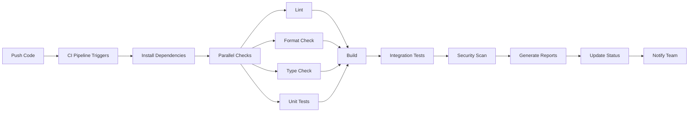
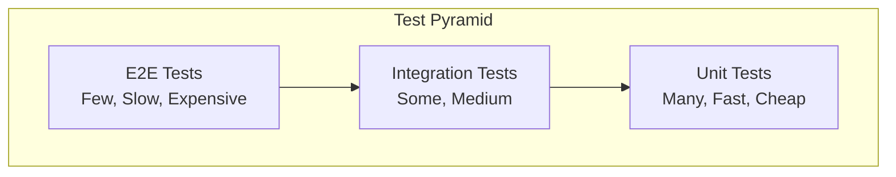
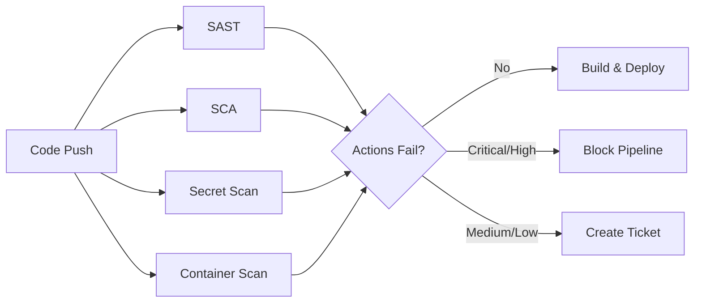

# Chapter 4: Continuous Integration

> **Prev:** [CI/CD](./04-cicd.md)
> **Next:** [Containerization](./05-containerization.md)

---

## Learning Objectives

- Understand the principles and practices of Continuous Integration.
- Set up automated build and test triggers on every code push.
- Design comprehensive test suites (unit, integration, end-to-end).
- Implement code quality gates (linting, coverage, static analysis).
- Configure CI for monorepos and microservices.
- Master CI optimization, artifact handling, and reporting.

---

## Chapter at a Glance

| Topic | Key Insight | Practical Takeaway |
|-------|-------------|-------------------|
| CI Principles | Integrate early and often | Every push triggers automated verification |
| Test Pyramid | Unit > Integration > E2E | Write many fast unit tests, few slow E2E tests |
| Quality Gates | Automated checks before merge | Block merges that reduce quality |
| CI for Monorepos | Detect changed packages | Only build and test affected code |
| Build Artifacts | Immutable outputs | Every CI run produces a versioned artifact |
| CI Reporting | Test results, coverage, timing | Make CI results visible to the whole team |

## Chapter Roadmap



## Theory

### Core Principles of CI

Continuous Integration is built on five essential practices:

1. **Maintain a single source repository.** Every team member commits to the same main branch frequently.
2. **Automate the build.** Scripts should compile, package, and verify without manual intervention.
3. **Make the build self-testing.** Automated tests should validate correctness after every build.
4. **Everyone commits to main every day.** Short-lived branches reduce integration complexity.
5. **Keep the build fast.** Feedback in minutes, not hours.

### The Test Pyramid

The test pyramid guides where to invest testing effort:



**Unit tests (70-80%):** Test individual functions, methods, and classes in isolation. Mock external dependencies. Fast execution (milliseconds each).

**Integration tests (15-20%):** Test interactions between components — database queries, API endpoints, service-to-service communication. Verify real behavior of integrated parts.

**E2E tests (5-10%):** Test complete user workflows from UI to database. Slow and brittle. Cover critical paths only.

### Test Execution Strategy

**Fast feedback loops:**
- Unit tests run on every commit (pre-push hook)
- Integration tests run after unit tests pass
- E2E tests run on merge to main or scheduled nightly

**Test parallelization:**
- Split test files across multiple CI runners
- Use test sharding (Jest `--shard`)
- Run independent test suites in parallel

### Code Quality Gates

Quality gates prevent low-quality code from being merged:

| Gate | Tool | Enforcement |
|------|------|-------------|
| Linting | ESLint | PR must pass |
| Formatting | Prettier | PR must pass |
| Type checking | TypeScript | PR must pass |
| Unit test coverage | Jest/istanbul | Minimum 80% |
| Integration tests | Supertest | PR must pass |
| Security scan | CodeQL, Snyk | No critical vulnerabilities |
| Bundle size | size-limit | Must not exceed threshold |
| Dependency audit | npm audit | No known vulnerabilities |

### CI for Monorepos

Monorepos require smart CI that only builds changed packages:

**Approach 1: Path filtering:**
```yaml
jobs:
  api:
    on:
      push:
        paths: ['packages/api/**']
  web:
    on:
      push:
        paths: ['packages/web/**']
```

**Approach 2: Dependency graph analysis:**
```text
# Determine affected packages
npx nx affected:test --base=main
npx nx affected:build --base=main
```

**Approach 3: Manual configuration with check scripts:**
```typescript
function getChangedPackages(): string[] {
  // Get changed files from git diff
  // Map files to packages
  // Return affected package names
}
```

### CI Reporting

Effective CI provides visibility into build health:

**Status badges:** Show latest build status in README
**Test reports:** HTML or XML reports with pass/fail details
**Coverage reports:** Line, branch, function coverage with trends
**Performance charts:** Build duration trends over time
**Notifications:** Slack/email/Discord on build failures

**Example CI report structure:**
```text
Build #1234 - main - abc1234
Status: ? Passed
Duration: 2m 34s
Tests: 247 passed, 3 skipped, 0 failed
Coverage: 87.3% (+0.2%)
Lint: 0 errors, 0 warnings
Dependencies: up to date
```

### Handling Flaky Tests

Flaky tests pass or fail nondeterministically. Strategies:

1. **Quarantine:** Move flaky tests to a separate suite, don't block the build
2. **Retry:** Retry failed tests once (but flag them for investigation)
3. **Fix or delete:** Either fix the root cause or remove the test
4. **Isolation:** Ensure tests don't share state or rely on timing

**Flaky test detection:**
```typescript
function detectFlakyTests(testResults: TestResult[][]): string[] {
  const flaky: string[] = [];
  // A test is flaky if it passes sometimes and fails sometimes
  // across multiple runs on the same code
  return flaky;
}
```

### CI Pipeline Optimization

Optimizing CI pipelines reduces feedback time and infrastructure costs:

**Caching strategies:**
```yaml
# npm cache with fallback keys
- name: Cache node_modules
  uses: actions/cache@v4
  with:
    path: ~/.npm
    key: npm-${{ hashFiles('package-lock.json') }}-${{ runner.os }}
    restore-keys: |
      npm-${{ runner.os }}-
      npm-
```

**Parallel execution patterns:**
```yaml
# Matrix builds for parallel execution across environments
jobs:
  test:
    strategy:
      matrix:
        node: [18, 20, 22]
        os: [ubuntu-latest, windows-latest]
    steps:
      - run: npm test

  lint:
    steps:
      - run: npm run lint

  security:
    steps:
      - run: npm audit
```

**Conditional execution:**
```typescript
function optimizePipeline(steps: PipelineStep[]): PipelineStep[] {
  // Skip expensive steps when only docs change
  if (changedFiles.every(f => f.endsWith('.md'))) {
    return steps.filter(s => !s.expensive);
  }
  // Run all steps for production branch
  return steps;
}
```

### Artifact Management and Versioning

Every CI run should produce versioned, immutable artifacts:

| Artifact Type | Storage | Retention | Use Case |
|--------------|---------|-----------|----------|
| **Build output** | S3/GCS/Azure Blob | 30-90 days | Deployment packages |
| **Docker images** | Container registry | Immutable tags | Containerized deployments |
| **Test reports** | CI platform | 90 days | Audit trail |
| **Coverage reports** | Codecov/SonarQube | Per-project history | Quality trending |
| **SBOM** | S3 + registry | Indefinite | Supply chain compliance |

```typescript
interface Artifact {
  name: string;
  version: string;
  sha256: string;
  type: 'container' | 'binary' | 'report' | 'sbom';
  metadata: Record<string, string>;
}

class ArtifactManager {
  private artifacts: Artifact[] = [];

  createArtifact(name: string, version: string, type: Artifact['type']): Artifact {
    const artifact: Artifact = {
      name,
      version,
      sha256: crypto.createHash('sha256').update(`${name}@${version}`).digest('hex'),
      type,
      metadata: {
        buildNumber: process.env.CI_BUILD_NUMBER || 'local',
        commitSha: process.env.GITHUB_SHA || 'unknown',
        builtAt: new Date().toISOString(),
      },
    };
    this.artifacts.push(artifact);
    return artifact;
  }

  generateBom(): string {
    return this.artifacts.map(a =>
      `${a.sha256}  ${a.name}:${a.version} (${a.type})`
    ).join('\n');
  }
}
```

### Security Scanning in CI

Integrating security tools into CI catches vulnerabilities before deployment:



**SAST (Static Application Security Testing):** Analyzes source code for security vulnerabilities (SQL injection, XSS, command injection) without executing the code.

**SCA (Software Composition Analysis):** Scans dependencies for known vulnerabilities (npm audit, Snyk, Dependabot).

**Secret detection:** Scans for hardcoded credentials, API keys, and tokens (GitHub secret scanning, TruffleHog).

```typescript
interface ScanResult {
  type: 'sast' | 'sca' | 'secret' | 'container';
  severity: 'critical' | 'high' | 'medium' | 'low';
  description: string;
  location: string;
}

class SecurityGate {
  evaluate(results: ScanResult[]): { passed: boolean; blocked: ScanResult[] } {
    const blocked = results.filter(r =>
      r.severity === 'critical' || r.severity === 'high'
    );
    return {
      passed: blocked.length === 0,
      blocked,
    };
  }
}
```

### CI Services and Infrastructure

**Self-hosted runners:**
- Full control over environment
- No per-minute costs
- Maintenance overhead
- Suitable for compliance requirements

**Cloud-hosted runners:**
- GitHub Actions, GitLab CI, Circle CI, Jenkins Cloud
- Zero maintenance
- Scale automatically
- Pay per usage

**Containerized CI:**
- CI runs in containers matching production environment
- Consistent behavior across local dev and CI
- Easy dependency management

---

## Examples

### Example 1: Complete CI Pipeline Configuration

```typescript
interface CITestConfig {
  nodeVersion: string;
  maxWorkers: number;
  coverageThreshold: number;
  lintEnabled: boolean;
  integrationTests: boolean;
  e2eTests: boolean;
  cacheDependencies: boolean;
}

class CIPipelineConfig {
  private config: CITestConfig;

  constructor(config: CITestConfig) {
    this.config = config;
  }

  generateGitHubActions(): string {
    return `name: CI Pipeline

on:
  push:
    branches: [main, develop]
  pull_request:
    branches: [main]

jobs:
  ci:
    runs-on: ubuntu-latest
    strategy:
      matrix:
        node: [${this.config.nodeVersion}]

    steps:
      - uses: actions/checkout@v4
      - uses: actions/setup-node@v4
        with:
          node-version: \${{ matrix.node }}
      ${this.generateCacheStep()}
      - run: npm ci
      ${this.generateLintStep()}
      - run: npm run typecheck
      - run: npm test -- --maxWorkers=${this.config.maxWorkers} --coverage --coverageThreshold='{"global":{"lines":${this.config.coverageThreshold}}}'
      ${this.generateIntegrationTestStep()}
      - run: npm run build
      - uses: actions/upload-artifact@v4
        with:
          name: build-\${{ github.sha }}
          path: dist/
      - name: Upload coverage
        uses: codecov/codecov-action@v4
        with:
          token: \${{ secrets.CODECOV_TOKEN }}
`;
  }

  private generateCacheStep(): string {
    if (!this.config.cacheDependencies) return '';
    return `
      - name: Cache node_modules
        uses: actions/cache@v3
        with:
          path: ~/.npm
          key: ${{ runner.os }}-node-${{ hashFiles('**/package-lock.json') }}
          restore-keys: |
            ${{ runner.os }}-node-`;
  }

  private generateLintStep(): string {
    if (!this.config.lintEnabled) return '';
    return `- run: npm run lint`;
  }

  private generateIntegrationTestStep(): string {
    if (!this.config.integrationTests) return '';
    return `- run: npm run test:integration`;
  }
}

const config = new CIPipelineConfig({
  nodeVersion: '20',
  maxWorkers: 4,
  coverageThreshold: 80,
  lintEnabled: true,
  integrationTests: true,
  e2eTests: false,
  cacheDependencies: true,
});

console.log(config.generateGitHubActions());
```

### Example 2: Test Harness with Coverage Enforcement

```typescript
interface TestCase {
  name: string;
  fn: () => Promise<boolean>;
  category: 'unit' | 'integration' | 'e2e';
  timeout: number;
}

interface TestResult {
  name: string;
  passed: boolean;
  duration: number;
  error?: string;
}

interface CoverageReport {
  totalLines: number;
  coveredLines: number;
  percentage: number;
  thresholds: Record<string, number>;
}

class TestRunner {
  private tests: TestCase[] = [];
  private results: TestResult[] = [];
  private coverage: CoverageReport = { totalLines: 0, coveredLines: 0, percentage: 0, thresholds: {} };

  addTest(test: TestCase): void {
    this.tests.push(test);
  }

  setCoverageReport(report: CoverageReport): void {
    this.coverage = report;
  }

  async run(): Promise<boolean> {
    console.log('?? Starting test execution...\n');
    let allPassed = true;
    let passed = 0;
    let failed = 0;

    for (const test of this.tests) {
      const start = Date.now();
      try {
        const result = await Promise.race([
          test.fn(),
          new Promise<boolean>((_, reject) =>
            setTimeout(() => reject(new Error('Test timeout')), test.timeout)
          ),
        ]);
        const duration = Date.now() - start;
        this.results.push({ name: test.name, passed: result, duration });
        if (result) {
          passed++;
          console.log(`  ? ${test.name} (${duration}ms)`);
        } else {
          allPassed = false;
          failed++;
          console.log(`  ? ${test.name} (${duration}ms)`);
        }
      } catch (error) {
        allPassed = false;
        failed++;
        this.results.push({ name: test.name, passed: false, duration: Date.now() - start, error: String(error) });
        console.log(`  ? ${test.name} - ${error}`);
      }
    }

    this.printSummary(passed, failed);

    // Check coverage threshold
    if (this.coverage.percentage > 0) {
      const threshold = this.coverage.thresholds.lines || 80;
      if (this.coverage.percentage < threshold) {
        console.log(`? Coverage ${this.coverage.percentage}% below threshold ${threshold}%`);
        allPassed = false;
      } else {
        console.log(`? Coverage ${this.coverage.percentage}% meets threshold ${threshold}%`);
      }
    }

    return allPassed;
  }

  private printSummary(passed: number, failed: number): void {
    const total = this.tests.length;
    console.log(`\n?? Results: ${passed}/${total} passed`);
    if (failed > 0) console.log(`? ${failed} tests failed`);
    console.log(`??  Total: ${this.results.reduce((s, r) => s + r.duration, 0)}ms`);
  }
}

const runner = new TestRunner();

runner.addTest({
  name: 'UserService.createUser should return user object',
  fn: async () => true,
  category: 'unit',
  timeout: 5000,
});

runner.addTest({
  name: 'Database connection should execute query',
  fn: async () => true,
  category: 'integration',
  timeout: 10000,
});

runner.setCoverageReport({
  totalLines: 1000,
  coveredLines: 873,
  percentage: 87.3,
  thresholds: { lines: 80, branches: 75, functions: 80 },
});

runner.run();
```

### Example 3: CI Result Notifier

```typescript
interface BuildResult {
  buildNumber: number;
  branch: string;
  commitSha: string;
  status: 'passed' | 'failed' | 'running';
  duration: number;
  testResults: { passed: number; failed: number; skipped: number };
  coverage: number;
  author: string;
}

class CINotifier {
  async notify(results: BuildResult): Promise<void> {
    const message = this.formatMessage(results);

    // Post to Slack
    await this.postToSlack(message);

    // Update GitHub commit status
    await this.updateCommitStatus(results);

    // Send email on failure
    if (results.status === 'failed') {
      await this.sendFailureEmail(results);
    }
  }

  private formatMessage(result: BuildResult): string {
    const statusEmoji = result.status === 'passed' ? '?' : '?';
    const duration = (result.duration / 1000).toFixed(1);

    return [
      `${statusEmoji} Build #${result.buildNumber} ${result.status}`,
      `Branch: ${result.branch} (${result.commitSha.slice(0, 7)})`,
      `Duration: ${duration}s`,
      `Tests: ${result.testResults.passed} passed, ${result.testResults.failed} failed, ${result.testResults.skipped} skipped`,
      `Coverage: ${result.coverage}%`,
      `Author: ${result.author}`,
    ].join('\n');
  }

  private async postToSlack(message: string): Promise<void> {
    // Mock Slack webhook call
    console.log('?? Slack notification sent');
    console.log(message);
  }

  private async updateCommitStatus(result: BuildResult): Promise<void> {
    // Mock GitHub API call
    console.log(`???  Commit status updated: ${result.commitSha} = ${result.status}`);
  }

  private async sendFailureEmail(result: BuildResult): Promise<void> {
    // Mock email sending
    console.log(`?? Failure email sent to ${result.author}`);
  }
}

const notifier = new CINotifier();
notifier.notify({
  buildNumber: 1234,
  branch: 'main',
  commitSha: 'abc123def456',
  status: 'failed',
  duration: 154000,
  testResults: { passed: 243, failed: 4, skipped: 3 },
  coverage: 82.1,
  author: 'dev@example.com',
});
```

---

### Parallel Stage Scheduler

Efficient parallel execution in CI/CD pipelines reduces overall build time. The following scheduler models stage dependencies and computes optimal parallel schedules.

```typescript
interface Stage {
  id: string;
  duration: number; // seconds
  dependencies: string[];
}

interface Schedule {
  order: string[][]; // parallel stages at each level
  totalDuration: number;
  criticalPath: string[];
}

class ParallelStageScheduler {
  schedule(stages: Stage[]): Schedule {
    const depMap = new Map<string, string[]>();
    const durationMap = new Map<string, number>();
    stages.forEach(s => { depMap.set(s.id, s.dependencies); durationMap.set(s.id, s.duration); });

    const levels: string[][] = [];
    const scheduled = new Set<string>();

    while (scheduled.size < stages.length) {
      const ready = stages.filter(s => !scheduled.has(s.id) && s.dependencies.every(d => scheduled.has(d))).map(s => s.id);
      if (ready.length === 0) break;
      levels.push(ready);
      ready.forEach(r => scheduled.add(r));
    }

    const criticalPath = this.findCriticalPath(stages, depMap, durationMap);
    const totalDuration = criticalPath.reduce((s, id) => s + (durationMap.get(id) || 0), 0);

    return { order: levels, totalDuration, criticalPath };
  }

  private findCriticalPath(stages: Stage[], depMap: Map<string, string[]>, durationMap: Map<string, number>): string[] {
    const earliestStart = new Map<string, number>();
    const parents = new Map<string, string>();

    for (const stage of stages) {
      let maxStart = 0;
      let maxParent = '';
      for (const dep of stage.dependencies) {
        const depEnd = (earliestStart.get(dep) || 0) + (durationMap.get(dep) || 0);
        if (depEnd > maxStart) { maxStart = depEnd; maxParent = dep; }
      }
      earliestStart.set(stage.id, maxStart);
      if (maxParent) parents.set(stage.id, maxParent);
    }

    let lastStage = '';
    let lastEnd = 0;
    for (const stage of stages) {
      const end = (earliestStart.get(stage.id) || 0) + (durationMap.get(stage.id) || 0);
      if (end > lastEnd) { lastEnd = end; lastStage = stage.id; }
    }

    const path: string[] = [];
    let current = lastStage;
    while (current) {
      path.unshift(current);
      current = parents.get(current) || '';
    }
    return path;
  }
}

const scheduler = new ParallelStageScheduler();
const stages: Stage[] = [
  { id: 'lint', duration: 30, dependencies: [] },
  { id: 'unit', duration: 45, dependencies: [] },
  { id: 'build', duration: 60, dependencies: ['lint'] },
  { id: 'integration', duration: 120, dependencies: ['unit', 'build'] },
  { id: 'e2e', duration: 180, dependencies: ['integration'] },
  { id: 'deploy', duration: 30, dependencies: ['e2e'] },
];

const schedule = scheduler.schedule(stages);
console.log('Parallel levels:', schedule.order.map(l => `[${l.join(', ')}]`).join(' -> '));
console.log('Critical path:', schedule.criticalPath.join(' -> '));
console.log('Total duration:', schedule.totalDuration, 's');
```

**What this demonstrates:** Parallel stage scheduling minimizes CI/CD pipeline wall-clock time by identifying independent stages that can execute concurrently.

---

### Test Flakiness Detector and Quarantine System

Flaky tests erode trust in CI pipelines. The following tool tracks test results across runs, identifies flaky tests using statistical analysis, and automatically quarantines unreliable tests.

```typescript
// flakiness-detector.ts
// Detect and quarantine flaky CI tests

interface TestRun {
  testName: string;
  passed: boolean;
  durationMs: number;
  timestamp: Date;
  runnerId: string;
}

interface FlakinessScore {
  testName: string;
  passRate: number;
  runCount: number;
  durationVariance: number;
  score: number;
  verdict: 'stable' | 'suspect' | 'flaky' | 'quarantine';
}

class FlakinessDetector {
  private history: TestRun[] = [];

  record(run: TestRun): void {
    this.history.push(run);
  }

  analyze(window: number = 20): FlakinessScore[] {
    const byTest = new Map<string, TestRun[]>();
    for (const run of this.history) {
      if (!byTest.has(run.testName)) byTest.set(run.testName, []);
      byTest.get(run.testName)!.push(run);
    }

    const scores: FlakinessScore[] = [];
    for (const [testName, runs] of byTest) {
      const recent = runs.slice(-window);
      const passCount = recent.filter(r => r.passed).length;
      const passRate = recent.length > 0 ? passCount / recent.length : 1;
      const avgDuration = recent.reduce((s, r) => s + r.durationMs, 0) / Math.max(recent.length, 1);
      const variance = recent.length > 1
        ? Math.sqrt(recent.reduce((s, r) => s + (r.durationMs - avgDuration) ** 2, 0) / recent.length) / avgDuration
        : 0;

      const flakinessPenalty = 1 - passRate;
      const durationPenalty = Math.min(variance, 1) * 0.3;
      const score = flakinessPenalty + durationPenalty;

      let verdict: 'stable' | 'suspect' | 'flaky' | 'quarantine';
      if (score < 0.05 && runs.length >= 10) verdict = 'stable';
      else if (score < 0.2) verdict = 'suspect';
      else if (score < 0.4) verdict = 'flaky';
      else verdict = 'quarantine';

      scores.push({ testName, passRate, runCount: runs.length, durationVariance: Math.round(variance * 100) / 100, score: Math.round(score * 100) / 100, verdict });
    }

    return scores.sort((a, b) => b.score - a.score);
  }

  quarantine(scores: FlakinessScore[]): FlakinessScore[] {
    return scores.filter(s => s.verdict === 'quarantine' || s.verdict === 'flaky');
  }

  generateReport(scores: FlakinessScore[]): string {
    const stable = scores.filter(s => s.verdict === 'stable').length;
    const flaky = scores.filter(s => s.verdict === 'flaky' || s.verdict === 'quarantine').length;

    return `## Flakiness Analysis Report\n\n` +
      `**Tests analyzed:** ${scores.length} | **Stable:** ${stable} | **Flaky/Quarantined:** ${flaky}\n\n` +
      `| Test | Pass Rate | Variance | Score | Verdict |\n` +
      `|------|-----------|----------|-------|---------|\n` +
      scores.map(s => `| ${s.testName} | ${(s.passRate * 100).toFixed(0)}% | ${s.durationVariance} | ${s.score} | ${s.verdict} |`).join('\n');
  }
}

const detector = new FlakinessDetector();
const tests = ['UserService.getUser', 'AuthService.login', 'PaymentService.process', 'SearchService.query'];
tests.forEach((test, ti) => {
  for (let i = 0; i < 25; i++) {
    const isFlaky = ti === 0 || ti === 2;
    detector.record({
      testName: test, runnerId: `runner-${i % 3}`,
      passed: isFlaky ? Math.random() > 0.4 : Math.random() > 0.02,
      durationMs: isFlaky ? 100 + Math.random() * 900 : 50 + Math.random() * 50,
      timestamp: new Date(),
    });
  }
});

const scores = detector.analyze();
console.log(detector.generateReport(scores));
console.log('\nQuarantined:', detector.quarantine(scores).map(s => s.testName));
```

**What this demonstrates:** Statistical flakiness detection identifies unreliable tests, quantifies their instability through pass rate and duration variance, and enables automatic quarantine to restore CI pipeline trust.

---

### Build Failure Classifier and Triage Engine

Quickly classifying build failures speeds up developer resolution time. The following tool categorizes failures by root cause and routes them to the appropriate team.

```typescript
// build-failure-classifier.ts
// Classify and triage CI build failures

interface BuildFailure {
  id: string;
  stage: string;
  errorMessage: string;
  exitCode: number;
  commitSha: string;
  author: string;
  timestamp: Date;
  logSnippet: string;
}

interface FailureClassification {
  failure: BuildFailure;
  category: 'compilation' | 'test' | 'dependency' | 'infrastructure' | 'config' | 'lint' | 'unknown';
  confidence: number;
  suggestedTeam: string;
  priority: 'p0' | 'p1' | 'p2';
}

class FailureClassifier {
  private patterns: { regex: RegExp; category: FailureClassification['category']; team: string; priority: 'p0' | 'p1' | 'p2' }[] = [
    { regex: /TS\d{4}|TypeError|cannot find module|TS2304/, category: 'compilation', team: 'platform', priority: 'p1' },
    { regex: /FAIL|AssertionError|expected.*to.*equal|test.*failed/i, category: 'test', team: 'dev', priority: 'p1' },
    { regex: /npm ERR|could not resolve|cannot find package|404.*Not Found/i, category: 'dependency', team: 'platform', priority: 'p2' },
    { regex: /Cannot connect|ECONNREFUSED|ETIMEOUT|ENOTFOUND/, category: 'infrastructure', team: 'infra', priority: 'p0' },
    { regex: /ESLint|prettier|formatting|lint/i, category: 'lint', team: 'dev', priority: 'p2' },
    { regex: /Missing(.*)config|invalid(.*)config|yaml.*invalid/i, category: 'config', team: 'platform', priority: 'p1' },
  ];

  classify(failure: BuildFailure): FailureClassification {
    for (const pattern of this.patterns) {
      if (pattern.regex.test(failure.errorMessage) || pattern.regex.test(failure.logSnippet)) {
        return {
          failure, category: pattern.category,
          confidence: 0.85, suggestedTeam: pattern.team,
          priority: pattern.priority,
        };
      }
    }
    return {
      failure, category: 'unknown', confidence: 0.3,
      suggestedTeam: 'platform', priority: 'p2',
    };
  }

  batchClassify(failures: BuildFailure[]): {
    byCategory: Map<string, number>;
    byTeam: Map<string, number>;
    details: FailureClassification[];
  } {
    const details = failures.map(f => this.classify(f));
    const byCategory = new Map<string, number>();
    const byTeam = new Map<string, number>();

    for (const d of details) {
      byCategory.set(d.category, (byCategory.get(d.category) || 0) + 1);
      byTeam.set(d.suggestedTeam, (byTeam.get(d.suggestedTeam) || 0) + 1);
    }

    return { byCategory, byTeam, details };
  }

  generateReport(result: { byCategory: Map<string, number>; byTeam: Map<string, number>; details: FailureClassification[] }): string {
    return `## Build Failure Classification\n\n` +
      `**By Category:**\n` +
      [...result.byCategory.entries()].map(([c, n]) => `  - ${c}: ${n}`).join('\n') + '\n\n' +
      `**By Team:**\n` +
      [...result.byTeam.entries()].map(([t, n]) => `  - ${t}: ${n}`).join('\n') + '\n';
  }
}

const classifier = new FailureClassifier();
const failures: BuildFailure[] = [
  { id: 'b1', stage: 'compile', errorMessage: 'TS2304: Cannot find name "Request"', exitCode: 1, commitSha: 'abc', author: 'alice', timestamp: new Date(), logSnippet: 'src/server.ts(42): error TS2304' },
  { id: 'b2', stage: 'test', errorMessage: 'FAIL tests/api.test.ts - expected 200 to equal 401', exitCode: 1, commitSha: 'def', author: 'bob', timestamp: new Date(), logSnippet: 'AssertionError: expected 200 to equal 401' },
  { id: 'b3', stage: 'deploy', errorMessage: 'Cannot connect to docker daemon at unix:///var/run/docker.sock', exitCode: 1, commitSha: 'ghi', author: 'charlie', timestamp: new Date(), logSnippet: 'Error: Cannot connect to the Docker daemon' },
];

console.log(classifier.generateReport(classifier.batchClassify(failures)));
```

**What this demonstrates:** Automated build failure classification reduces mean-time-to-resolution by identifying root cause categories and routing failures to the right team with appropriate priority.

---

## Practical Takeaways

1. **Every push triggers CI.** No exceptions. If the build breaks, fixing it is the top priority.
2. **Keep the build under 10 minutes.** Long builds discourage frequent commits.
3. **Unit tests first.** Fast, reliable unit tests catch the majority of regressions.
4. **Enforce quality gates in CI, not in IDE.** Don't rely on developers running checks locally.
5. **Quarantine flaky tests immediately.** A flaky test destroys trust in the entire CI system.
6. **Make CI results visible.** Dashboard, Slack bot, or build monitor in the team area.

---

## Chapter Quiz

<details><summary>Question 1: What is the optimal shape of the test pyramid?</summary>**A)** Many E2E, some integration, few unit<br>**B)** Many unit, some integration, few E2E<br>**C)** Equal numbers of each<br>**D)** Only E2E tests<br><br>**Answer: B)** Many unit, some integration, few E2E&lt;/details&gt;

<details><summary>Question 2: What should happen when a CI build fails?</summary>**A)** The team continues working on new features<br>**B)** Fixing the build is the top priority<br>**C)** The broken commit is automatically reverted<br>**D)** The build is ignored until release day<br><br>**Answer: B)** Fixing the build is the top priority&lt;/details&gt;

<details><summary>Question 3: How should flaky tests be handled?</summary>**A)** Ignore them<br>**B)** Quarantine them and fix the root cause<br>**C)** Retry them 10 times<br>**D)** Delete them immediately<br><br>**Answer: B)** Quarantine them and fix the root cause&lt;/details&gt;

<details><summary>Question 4: What is the recommended maximum CI build time?</summary>**A)** 1 minute<br>**B)** 10 minutes<br>**C)** 30 minutes<br>**D)** 60 minutes<br><br>**Answer: B)** 10 minutes&lt;/details&gt;

<details><summary>Question 5: What does affected:build do in a monorepo CI?</summary>**A)** Builds all packages<br>**B)** Only builds packages affected by changed code<br>**C)** Builds the entire dependency tree<br>**D)** Skips the build entirely<br><br>**Answer: B)** Only builds packages affected by changed code&lt;/details&gt;

---


// cicd
// cicd-infrastructure-automation implementation

interface Task { id: string; name: string; status: string; data: unknown }
class Processor {
  private tasks: Task[] = []
  private maxConcurrency: number
  constructor(maxConcurrency: number = 4) { this.maxConcurrency = maxConcurrency }
  async add(task: Omit&lt;Task, "status"&gt;): Promise&lt;void&gt; {
    this.tasks.push({ ...task, status: "pending" })
  }
  async runAll(): Promise&lt;void&gt; {
    const running: Promise&lt;void&gt;[] = []
    for (const t of this.tasks) {
      if (running.length >= this.maxConcurrency) { await Promise.race(running) }
      const p = this.execute(t).finally(() => { const i = running.indexOf(p); if (i >= 0) running.splice(i, 1) })
      running.push(p)
    }
    await Promise.all(running)
  }
  private async execute(t: Task): Promise&lt;void&gt; {
    t.status = "running"
    await new Promise(r => setTimeout(r, 10))
    t.status = "done"
  }
  getResults(): Task[] { return this.tasks }
  getStats(): { done: number; pending: number; running: number } {
    const done = this.tasks.filter(t => t.status === "done").length
    const pending = this.tasks.filter(t => t.status === "pending").length
    const running = this.tasks.filter(t => t.status === "running").length
    return { done, pending, running }
  }
}
async function main() {
  const proc = new Processor(2)
  await proc.add({ id: '1', name: 'cicd', data: { topic: 'cicd-infrastructure-automation' } })
  await proc.runAll()
  console.log('Stats:', proc.getStats())
}
main().catch(console.error)
export { Processor, Task }
## Summary

- Continuous Integration is the practice of merging code changes frequently, with each merge automatically built and tested.
- The test pyramid guides investment: 70-80% unit tests, 15-20% integration, 5-10% E2E.
- Quality gates (lint, coverage, type check, security) automate code review standards.
- Monorepo CI requires smart change detection to avoid building unchanged packages.
- Fast feedback (<10 minutes) encourages frequent commits and rapid iteration.
- Flaky tests must be quarantined and fixed to maintain CI trust.
- CI results should be visible and actionable for the entire team.

---

## Exercises

### Review Questions
1. What are the five essential practices of CI?
2. Why should unit tests outnumber integration and E2E tests?
3. How do you handle a flaky test in CI?
4. What is the purpose of CI quality gates?
5. How does monorepo CI differ from single-repo CI?

### Application Problems
1. Design a CI pipeline for a TypeScript project with unit tests, integration tests, linting, coverage enforcement, and build artifact generation.
2. Create a strategy for test parallelization across multiple CI runners.
3. Implement a flaky test detection system that tracks test results across runs.
4. Configure a monorepo CI setup that only builds and tests affected packages.
5. Extend the `CIPipelineConfig` class to support: security scanning steps (SAST, SCA, secret scan) with configurable severity thresholds, matrix testing across 3 Node.js versions and 2 operating systems, and conditional pipeline stages that skip when only documentation files change. Generate the complete GitHub Actions YAML.
6. Implement an `ArtifactVersionManager` that: derives version from git tags (semver), auto-increments patch version for non-tagged commits on main, appends build metadata (`+build.123`) for CI builds, and stores artifacts in a versioned S3-like path structure: `artifacts/{name}/{version}/{file}`.

### Challenge Problem
1. Design and implement a comprehensive CI system for a TypeScript monorepo with 12 packages. Include: dependency graph-based change detection for selective builds, parallel test execution with sharding and load balancing, quality gate enforcement (lint, type check, 85% coverage, no critical vulnerabilities), artifact versioning and publishing, flaky test detection and quarantine with automated issue creation, and a CI health dashboard tracking build time trends, test count trends, coverage trends, and cache hit rate.
