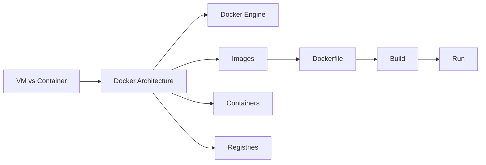

# Chapter 5: Containerization with Docker

> **Previous:** [Continuous Integration (CI)](./04-continuous-integration.md) | **Next:** [Docker](./05-docker.md)

---

## Learning Objectives

- Explain the difference between Virtual Machines and Containers.
- Understand the core components of Docker: Engine, Images, Containers, and Registries.
- Write a Dockerfile to package a simple application.
- Manage container lifecycles using the Docker CLI.
- Use Docker Volumes and Networks for data persistence and communication.

---


## Chapter at a Glance

| Topic | Key Insight | Practical Takeaway |
|-------|-------------|-------------------|
| Containers vs VMs | OS-level vs hardware-level virtualization | Containers share host kernel for lightweight isolation |
| Docker Architecture | Engine, Images, Containers, Registries | Understand each component for effective Docker use |
| Dockerfile | FROM, RUN, COPY, CMD instructions | Multi-stage builds reduce final image size significantly |
| Container Lifecycle | Build, run, stop, remove, exec | Use docker ps and docker logs for debugging |

## Chapter Roadmap



## Theory


### Containers vs. Virtual Machines

> **Pro Tip:** Order Dockerfile instructions by cacheability: put rarely-changing steps (package installs) before code COPY.
Containers provide operating-system-level virtualization. Unlike Virtual Machines (VMs), which include a full guest OS, containers share the host's kernel and isolate only the application and its dependencies. This makes containers significantly lighter, faster to start, and more portable.

### The Docker Architecture

> **Remember:** Each Dockerfile instruction creates a new layer. Combining RUN commands with && reduces layer count.
- **Docker Engine:** The background process (daemon) that manages Docker objects.
- **Docker Image:** A read-only template with instructions for creating a Docker container. Images are built in layers.
- **Docker Container:** A runnable instance of an image.
- **Docker Registry:** A service (like Docker Hub) that stores and distributes Docker images.

### Dockerfile: The Blueprint

> **Warning:** Never store secrets in Dockerfiles or environment variables. Use Docker secrets or BuildKit.
A Dockerfile is a text document that contains all the commands a user could call on the command line to assemble an image. Key instructions include:
- `FROM`: Sets the base image.
- `RUN`: Executes commands in a new layer.
- `COPY`: Copies files from the host to the image.
- `CMD`: Specifies the default command to run when the container starts.

---

## Examples

> **One-Sentence Takeaway:** Containers share the host kernel and are significantly lighter than virtual machines.

### Example 1: Packaging a Node.js App
Creating a portable environment for a web application.
- **Step-by-step:**
  1. Create a `Dockerfile`:
     ```dockerfile
     FROM node:16-alpine
     WORKDIR /app
     COPY package*.json ./
     RUN npm install
     COPY . .
     EXPOSE 3000
     CMD ["node", "app.js"]
     ```
  2. Build: `docker build -t my-web-app .`
  3. Run: `docker run -p 8080:3000 my-web-app`
- **Expected output:** The app is accessible at `http://localhost:8080`.
- **What the example demonstrates:** How to package an app and its environment into a single unit.

### Example 2: Using Multi-stage Builds
Optimizing image size by separating build and runtime environments.
- **Step-by-step:**
  1. Modify `Dockerfile`:
     ```dockerfile
     # Stage 1: Build
     FROM golang:1.18 AS builder
     WORKDIR /app
     COPY . .
     RUN go build -o myapp
     
     # Stage 2: Run
     FROM alpine:latest
     WORKDIR /root/
     COPY --from=builder /app/myapp .
     CMD ["./myapp"]
     ```
- **Expected output:** A very small final image containing only the compiled binary.
- **What the example demonstrates:** Efficient image construction for production environments.

---

## Summary

## Concept Comparison Table

| Concept | Description |
|---------|-------------|
| Virtual Machine | Full guest OS with hypervisor, heavy and slow to start |
| Container | OS-level virtualization, shares host kernel, lightweight |
| Docker Image | Read-only layered template for containers |
| Docker Container | Runnable instance of an image |
| Docker Registry | Storage and distribution service for images |

## Quick Reference

| Topic | Key Points |
|-------|------------|
| FROM | Sets base image for the Dockerfile |
| RUN | Executes commands in a new layer |
| COPY | Copies files from host to image |
| CMD | Default command when container starts |
| docker build | Builds image from Dockerfile |

## Cross-Application Matrix

| Domain | Application |
|--------|-------------|
| Web | Package web apps with consistent environments |
| Cloud | Standard deployment unit for all cloud providers |
| Enterprise | Microservice packaging and isolation |
| Embedded | Containerized IoT application deployment |

## Chapter Quiz

<details><summary>Question 1: Why are containers faster than VMs?</summary>**A)** They use hardware virtualization<br>**B)** They share the host kernel<br>**C)** They include a full guest OS<br>**D)** They use slower storage<br><br>**Answer: B)** They share the host kernel</details>

<details><summary>Question 2: What does the FROM instruction do in a Dockerfile?</summary>**A)** Sets the entrypoint command<br>**B)** Specifies base image<br>**C)** Copies files<br>**D)** Exposes a port<br><br>**Answer: B)** Specifies base image</details>

<details><summary>Question 3: What is a Docker layer?</summary>**A)** A network configuration<br>**B)** A filesystem change created by each instruction<br>**C)** A container log<br>**D)** A volume mount<br><br>**Answer: B)** A filesystem change created by each instruction</details>


## Summary

- Containerization provides a consistent environment across development, testing, and production.
- Docker is the most popular platform for building, sharing, and running containers.
- Images are built in layers, allowing for efficient caching and distribution.
- Dockerfiles automate the creation of images, ensuring reproducibility.
- Containers are ephemeral; data that must persist should be stored in Docker Volumes.

---

## Exercises

### Review Questions
1. Why are containers faster than virtual machines?
2. What is the purpose of the `EXPOSE` instruction in a Dockerfile?
3. How do you list all running containers on your system?
4. What is a Docker Layer and how does it relate to caching?

### Application Problems
1. Create a Dockerfile for a static website using `nginx` as the base image.
2. Write a command to start a MySQL container with a persistent volume for the database data.
3. You have a container that is crashing on startup. How would you inspect its logs?

### Challenge Problem
1. Design a strategy for managing environment-specific configurations (e.g., database URLs for dev vs. prod) when using the same Docker image across different environments.
