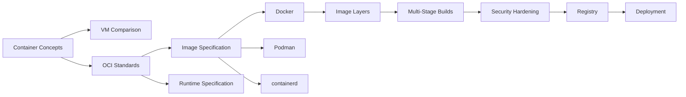
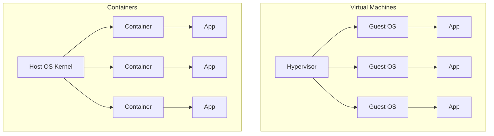
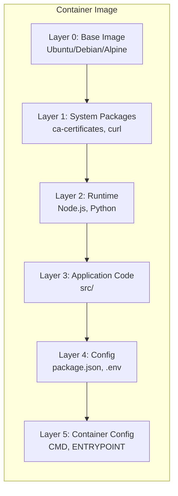
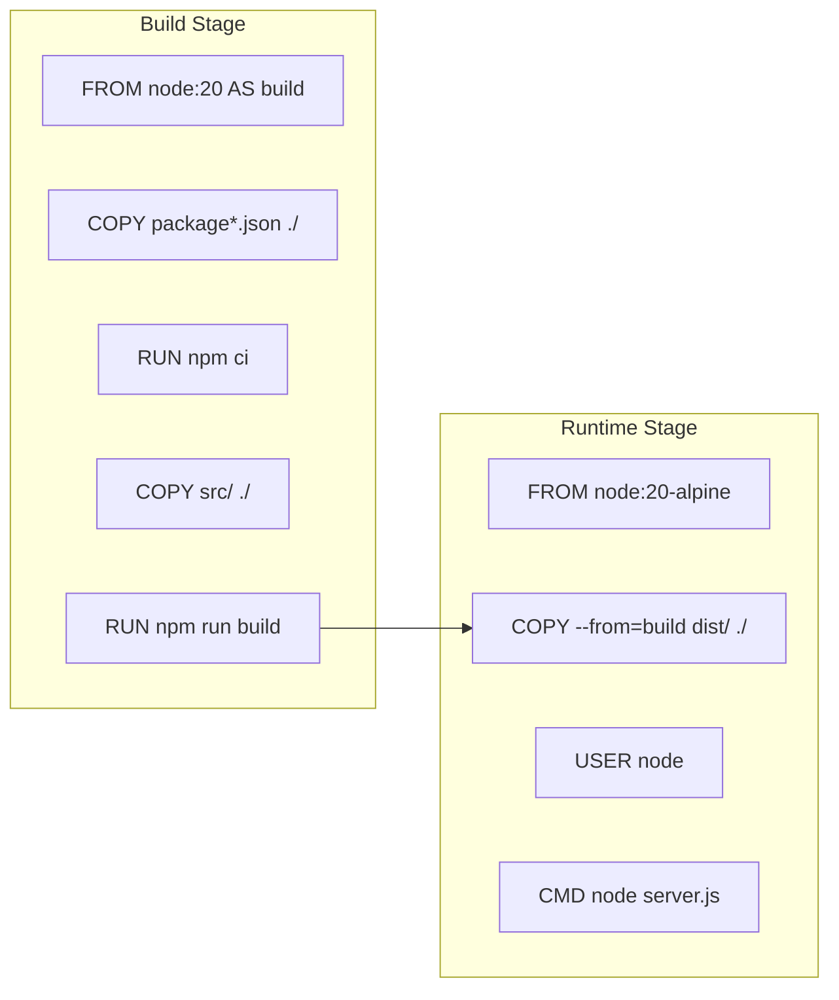
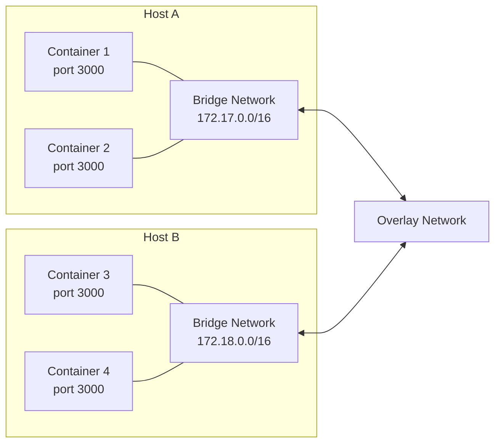

# Chapter 5: Containerization

> **Prev:** [CI/CD](./04-continuous-integration.md)
> **Next:** [Docker](./05-docker.md)

---

## Learning Objectives

- Understand containerization concepts and how containers differ from virtual machines.
- Explain the benefits of containers for DevOps: consistency, lightweight isolation, and fast startup.
- Understand the container ecosystem: Docker, containerd, OCI standards, and container runtimes.
- Design multi-stage builds for smaller and more secure images.
- Implement container security best practices.
- Understand image layering and caching for efficient builds.

---

## Chapter at a Glance

| Topic | Key Insight | Practical Takeaway |
|-------|-------------|-------------------|
| Containers vs VMs | Shared kernel vs hypervisor | Containers are lighter but share the host OS |
| OCI Standards | Open Container Initiative | Ensures portability across container runtimes |
| Image Layers | Union filesystem (OverlayFS) | Layer ordering affects caching and rebuild speed |
| Multi-Stage Builds | Separate build from runtime | Produces tiny production images |
| Container Security | Least privilege, no root | Run as non-root user, read-only root filesystem |
| Resource Limits | CPU, memory, disk constraints | Prevent noisy neighbor problems |
| Container Registry | Store and distribute images | Use immutable tags (SHA digest) |

## Chapter Roadmap



## Theory

### Containers vs Virtual Machines

<a href="../../../assets/images/diagrams/devops/05-containerization/containers-vs-virtual-machines-handwritten.svg" target="_blank" rel="noopener">
  
</a>
<a href="../../../assets/images/diagrams/devops/05-containerization/containers-vs-virtual-machines-diagram.svg" target="_blank" rel="noopener">
  
</a>
<a href="../../../assets/images/diagrams/devops/05-containerization/containers-vs-virtual-machines-sticky.svg" target="_blank" rel="noopener">
  
</a>


The fundamental difference is kernel architecture:



| Aspect | Virtual Machine | Container |
|--------|----------------|-----------|
| Kernel | Each VM has its own OS kernel | All containers share the host kernel |
| Startup | Minutes (OS boot) | Milliseconds (process start) |
| Size | GB (full OS image) | MB (app + dependencies) |
| Isolation | Hardware-level isolation | Namespace + cgroup isolation |
| Resource overhead | High (full OS per VM) | Minimal (only app process) |
| Portability | VM image format | OCI image standard |

### OCI Standards

<a href="../../../assets/images/diagrams/devops/05-containerization/oci-standards-handwritten.svg" target="_blank" rel="noopener">
  
</a>
<a href="../../../assets/images/diagrams/devops/05-containerization/oci-standards-diagram.svg" target="_blank" rel="noopener">
  
</a>
<a href="../../../assets/images/diagrams/devops/05-containerization/oci-standards-sticky.svg" target="_blank" rel="noopener">
  
</a>


The Open Container Initiative defines two core specifications:

**Image Specification (image-spec):**
- Defines how container images are built and structured
- Images consist of a manifest, config file, and layer tarballs
- Content-addressable storage via digest (SHA-256)

**Runtime Specification (runtime-spec):**
- Defines how containers are executed
- Configures namespaces, cgroups, mounts, capabilities
- Defines the lifecycle (create, start, stop, delete)

**OCI-compliant runtimes:**
- runc (reference implementation, used by Docker)
- crun (C-based, faster than runc)
- Youki (Rust-based)
- Kata Containers (VM-based isolation)

### Container Image Layers

<a href="../../../assets/images/diagrams/devops/05-containerization/container-image-layers-handwritten.svg" target="_blank" rel="noopener">
  
</a>
<a href="../../../assets/images/diagrams/devops/05-containerization/container-image-layers-diagram.svg" target="_blank" rel="noopener">
  
</a>
<a href="../../../assets/images/diagrams/devops/05-containerization/container-image-layers-sticky.svg" target="_blank" rel="noopener">
  
</a>


Container images are built as a stack of read-only layers on top of a union filesystem (OverlayFS):



Each Dockerfile instruction creates a new layer. Layers are cached and reused across builds:

**Layer caching rules:**
- If a layer's instructions and context haven't changed, Docker reuses the cached layer
- If a layer changes, all subsequent layers must be rebuilt
- Order matters: place infrequently changing instructions first (system deps, package install)
- Place frequently changing instructions last (application code)

### Multi-Stage Builds

<a href="../../../assets/images/diagrams/devops/05-containerization/multi-stage-builds-handwritten.svg" target="_blank" rel="noopener">
  
</a>
<a href="../../../assets/images/diagrams/devops/05-containerization/multi-stage-builds-diagram.svg" target="_blank" rel="noopener">
  
</a>
<a href="../../../assets/images/diagrams/devops/05-containerization/multi-stage-builds-sticky.svg" target="_blank" rel="noopener">
  
</a>


Multi-stage builds use multiple FROM statements to separate the build environment from the runtime environment:



**Benefits:**
- Tiny production images (no build tools, no dev dependencies)
- No source code in production images
- Reduced attack surface
- Faster deployments with smaller images

### Container Security

<a href="../../../assets/images/diagrams/devops/05-containerization/container-security-handwritten.svg" target="_blank" rel="noopener">
  
</a>
<a href="../../../assets/images/diagrams/devops/05-containerization/container-security-diagram.svg" target="_blank" rel="noopener">
  
</a>
<a href="../../../assets/images/diagrams/devops/05-containerization/container-security-sticky.svg" target="_blank" rel="noopener">
  
</a>


**Principle of least privilege:**
- Run as non-root user (never as root inside container)
- Drop unnecessary Linux capabilities
- Use read-only root filesystem
- Don't run SSH daemons in containers

**Image scanning:**
- Scan for known vulnerabilities (Trivy, Snyk, Grype)
- Use minimal base images (distroless, alpine)
- Pin base images to specific digests
- Regularly rebuild images (even with same code) to pick up security patches

**Runtime security:**
- Set resource limits (CPU, memory)
- Use seccomp profiles to restrict syscalls
- Use AppArmor/SELinux for mandatory access control
- Disable privilege escalation (`--security-opt no-new-privileges`)

### Container Networking and Communication

<a href="../../../assets/images/diagrams/devops/05-containerization/container-networking-and-communication-handwritten.svg" target="_blank" rel="noopener">
  
</a>
<a href="../../../assets/images/diagrams/devops/05-containerization/container-networking-and-communication-diagram.svg" target="_blank" rel="noopener">
  
</a>
<a href="../../../assets/images/diagrams/devops/05-containerization/container-networking-and-communication-sticky.svg" target="_blank" rel="noopener">
  
</a>


Containers communicate through various network models:



**Network modes:**
- **Bridge:** Default isolated network with internal DNS
- **Host:** Container uses host network stack directly
- **Overlay:** Multi-host networking for orchestration platforms
- **Macvlan:** Assign MAC addresses for direct network attachment

**Communication patterns:**
- **Sidecar proxy:** Envoy, Linkerd for service mesh
- **Ambassador:** Proxy container that brokers external connections
- **Adapter:** Normalizes container output to monitoring systems

### Container Runtime Deep Dive

<a href="../../../assets/images/diagrams/devops/05-containerization/container-runtime-deep-dive-handwritten.svg" target="_blank" rel="noopener">
  
</a>
<a href="../../../assets/images/diagrams/devops/05-containerization/container-runtime-deep-dive-diagram.svg" target="_blank" rel="noopener">
  
</a>
<a href="../../../assets/images/diagrams/devops/05-containerization/container-runtime-deep-dive-sticky.svg" target="_blank" rel="noopener">
  
</a>


Container runtimes implement the OCI runtime specification and can be categorized by isolation level:

| Runtime | Type | Isolation | Performance | Use Case |
|---------|------|-----------|-------------|----------|
| runc | Standard | Namespace/cgroup | Native | General-purpose containers |
| crun | Standard (C) | Namespace/cgroup | ~30% faster than runc | High-density deployments |
| Youki | Standard (Rust) | Namespace/cgroup | Comparable to crun | Memory-safe runtime |
| Kata Containers | VM-based | Lightweight VM | ~10% overhead | Multi-tenant security |
| gVisor | Sandboxed | Application kernel | ~30-50% overhead | Untrusted workloads |
| Firecracker | MicroVM | Lightweight VM | Near-native | AWS Lambda/Fargate |

**Choosing a runtime:**
- Standard workloads with trusted containers ? `runc` or `crun`
- Multi-tenant SaaS with untrusted code ? `Kata Containers`
- Serverless/functions with fast startup ? `Firecracker`
- High-security environments with untrusted images ? `gVisor`

### Container Storage Patterns

<a href="../../../assets/images/diagrams/devops/05-containerization/container-storage-patterns-handwritten.svg" target="_blank" rel="noopener">
  
</a>
<a href="../../../assets/images/diagrams/devops/05-containerization/container-storage-patterns-diagram.svg" target="_blank" rel="noopener">
  
</a>
<a href="../../../assets/images/diagrams/devops/05-containerization/container-storage-patterns-sticky.svg" target="_blank" rel="noopener">
  
</a>


Container storage follows ephemeral-by-default with options for persistence:

| Pattern | Description | Persistence | Use Case |
|---------|-------------|-------------|----------|
| Ephemeral | Container's writable layer | Lost on restart | Stateless apps |
| Volume mount | Docker-managed storage | Survives restart | Databases, stateful apps |
| Bind mount | Host directory mapped in | Host-persistent | Development hot-reload |
| tmpfs | In-memory storage | Lost on restart | Secrets, cache |
| CSI (Container Storage Interface) | Plugin-based storage for orchestrators | Orchestrator-managed | Production stateful workloads |

**Container storage best practices:**
- Separate compute from storage — use managed databases instead of database containers
- Use persistent volumes for logs that must survive container restarts
- Avoid storing secrets in container images — use secret injection mechanisms
- Configure storage quotas per container to prevent disk exhaustion
- Use ReadWriteMany volumes for shared file access across replicas

### Container Registries

<a href="../../../assets/images/diagrams/devops/05-containerization/container-registries-handwritten.svg" target="_blank" rel="noopener">
  
</a>
<a href="../../../assets/images/diagrams/devops/05-containerization/container-registries-diagram.svg" target="_blank" rel="noopener">
  
</a>
<a href="../../../assets/images/diagrams/devops/05-containerization/container-registries-sticky.svg" target="_blank" rel="noopener">
  
</a>


Registries store and distribute container images:

| Registry | Type | Features |
|----------|------|----------|
| Docker Hub | Public/Private | Most popular, automated builds |
| GitHub Container Registry | Integrated with GitHub | Free for public images |
| Amazon ECR | AWS | IAM integration |
| Google Artifact Registry | GCP | Cloud-native |
| Azure Container Registry | Azure | ACR tasks |
| Harbor | Self-hosted | Vulnerability scanning, replication |

**Tagging strategies:**
- Immutable tags: `v1.0.0`, `sha-abc1234`
- Mutable tags: `latest`, `stable` (use carefully)
- Best practice: always reference by digest in production

---

## Examples

### Example 1: Multi-Stage Build for TypeScript Application

```dockerfile
# Stage 1: Build
FROM node:20-alpine AS builder

WORKDIR /app

# Install dependencies first (caching optimization)
COPY package.json package-lock.json ./
RUN npm ci --only=production && \
    npm ci --only=dev

# Copy source and build
COPY tsconfig.json ./
COPY src/ ./src/
RUN npm run build

# Stage 2: Production runtime
FROM node:20-alpine AS production

# Security: create non-root user
RUN addgroup -S appgroup && adduser -S appuser -G appgroup

WORKDIR /app

# Copy only production dependencies and built output
COPY package.json package-lock.json ./
RUN npm ci --only=production && \
    npm cache clean --force

COPY --from=builder /app/dist ./dist

# Security: non-root user
USER appuser

# Security: read-only filesystem
# (enable at runtime with --read-only --tmpfs /tmp)

EXPOSE 3000

HEALTHCHECK --interval=30s --timeout=3s --start-period=5s --retries=3 \
  CMD wget --no-verbose --tries=1 --spider http://localhost:3000/health || exit 1

CMD ["node", "dist/server.js"]
```

### Example 2: Container Security Scanner

```typescript
import { execSync } from 'child_process';

interface Vulnerability {
  id: string;
  severity: 'CRITICAL' | 'HIGH' | 'MEDIUM' | 'LOW';
  package: string;
  installedVersion: string;
  fixedVersion: string;
  description: string;
}

interface ScanResult {
  image: string;
  vulnerabilities: Vulnerability[];
  passed: boolean;
}

class ContainerSecurityScanner {
  async scanImage(imageName: string, tag: string): Promise<ScanResult> {
    console.log(`?? Scanning ${imageName}:${tag}...`);

    // Simulated Trivy scan integration
    const results: Vulnerability[] = [
      {
        id: 'CVE-2024-1234',
        severity: 'HIGH',
        package: 'lodash',
        installedVersion: '4.17.20',
        fixedVersion: '4.17.21',
        description: 'Prototype pollution in lodash',
      },
    ];

    const criticalCount = results.filter(v => v.severity === 'CRITICAL').length;
    const highCount = results.filter(v => v.severity === 'HIGH').length;

    // Fail on CRITICAL or HIGH vulnerabilities
    const passed = criticalCount === 0 && highCount === 0;

    return { image: `${imageName}:${tag}`, vulnerabilities: results, passed };
  }

  generateReport(result: ScanResult): string {
    let report = `# Container Security Scan Report\n\n`;
    report += `**Image:** ${result.image}\n`;
    report += `**Status:** ${result.passed ? '? PASSED' : '? FAILED'}\n\n`;

    if (result.vulnerabilities.length === 0) {
      report += 'No vulnerabilities found.\n';
      return report;
    }

    report += `| Severity | Package | Installed | Fixed | CVE |\n`;
    report += `|----------|---------|-----------|-------|----|\n`;

    for (const v of result.vulnerabilities) {
      const sev = v.severity === 'CRITICAL' ? '??' :
                  v.severity === 'HIGH' ? '??' :
                  v.severity === 'MEDIUM' ? '??' : '?';
      report += `| ${sev} ${v.severity} | ${v.package} | ${v.installedVersion} | ${v.fixedVersion} | ${v.id} |\n`;
    }

    if (!result.passed) {
      report += '\n## Action Required\n\n';
      report += 'Fix all CRITICAL and HIGH vulnerabilities before deploying to production.\n';
    }

    return report;
  }
}

const scanner = new ContainerSecurityScanner();
const result = await scanner.scanImage('myapp', 'latest');
console.log(scanner.generateReport(result));
```

### Example 3: Dockerfile Generator

```typescript
type BaseImage = 'node' | 'python' | 'go' | 'rust' | 'nginx' | 'alpine';
type PackageManager = 'npm' | 'yarn' | 'pip' | 'cargo';

interface DockerfileConfig {
  base: BaseImage;
  version: string;
  port: number;
  packageManager: PackageManager;
  buildCommand: string;
  startCommand: string;
  hasDevDependencies: boolean;
  useMultiStage: boolean;
}

class DockerfileGenerator {
  generate(config: DockerfileConfig): string {
    if (config.useMultiStage) {
      return this.generateMultiStage(config);
    }
    return this.generateSingleStage(config);
  }

  private generateMultiStage(config: DockerfileConfig): string {
    const lines: string[] = [];

    // Build stage
    lines.push(`FROM ${config.base}:${config.version}-alpine AS builder`);
    lines.push('');
    lines.push('WORKDIR /app');
    lines.push('');
    lines.push('COPY package*.json ./');
    lines.push(`RUN ${config.packageManager} ci`);
    lines.push('');
    lines.push('COPY . .');
    lines.push(`RUN ${config.buildCommand}`);
    lines.push('');

    // Production stage
    lines.push(`FROM ${config.base}:${config.version}-alpine`);
    lines.push('');
    lines.push('RUN addgroup -S appgroup && adduser -S appuser -G appgroup');
    lines.push('');
    lines.push('WORKDIR /app');
    lines.push('');
    lines.push('COPY --from=builder /app/dist ./dist');
    lines.push('COPY --from=builder /app/node_modules ./node_modules');
    lines.push('');
    lines.push('USER appuser');
    lines.push('');
    lines.push(`EXPOSE ${config.port}`);
    lines.push('');
    lines.push(`CMD ["${config.startCommand}"]`);

    return lines.join('\n');
  }

  private generateSingleStage(config: DockerfileConfig): string {
    const lines: string[] = [];

    lines.push(`FROM ${config.base}:${config.version}-alpine`);
    lines.push('');
    lines.push('RUN addgroup -S appgroup && adduser -S appuser -G appgroup');
    lines.push('');
    lines.push('WORKDIR /app');
    lines.push('');
    lines.push('COPY package*.json ./');
    lines.push(`RUN ${config.packageManager} ci${config.hasDevDependencies ? '' : ' --only=production'}`);
    lines.push('');
    lines.push('COPY . .');
    lines.push(`RUN ${config.buildCommand}`);
    lines.push('');
    lines.push('USER appuser');
    lines.push('');
    lines.push(`EXPOSE ${config.port}`);
    lines.push('');
    lines.push(`CMD ["${config.startCommand}"]`);

    return lines.join('\n');
  }
}

const gen = new DockerfileGenerator();
const dockerfile = gen.generate({
  base: 'node',
  version: '20',
  port: 3000,
  packageManager: 'npm',
  buildCommand: 'npm run build',
  startCommand: 'node dist/server.js',
  hasDevDependencies: true,
  useMultiStage: true,
});
console.log(dockerfile);
```

---

### Container Layer Cache Analyzer

Docker layer caching is critical for fast builds in CI/CD. The following tool analyzes Dockerfile layers, detects cache invalidation points, and recommends layer ordering optimizations.

```typescript
interface DockerLayer {
  instruction: string;
  content: string;
  estimatedSizeBytes: number;
  cacheKey: string;
  cacheable: boolean;
}

interface LayerCacheReport {
  layers: DockerLayer[];
  invalidatedLayers: number;
  totalBuildTime: number; // estimated seconds
  optimizationAdvice: string[];
}

class LayerCacheAnalyzer {
  analyze(dockerfile: string): LayerCacheReport {
    const lines = dockerfile.split('\n');
    const layers: DockerLayer[] = [];
    const optimizationAdvice: string[] = [];

    for (const line of lines) {
      const trimmed = line.trim();
      if (trimmed.startsWith('FROM')) {
        layers.push({ instruction: 'FROM', content: trimmed, estimatedSizeBytes: 200_000_000, cacheKey: trimmed, cacheable: true });
      } else if (trimmed.startsWith('RUN')) {
        const cacheable = !trimmed.includes('apt-get update') && !trimmed.includes('npm install');
        if (!cacheable) optimizationAdvice.push(`Combine RUN commands that change frequently: "${trimmed.substring(0, 50)}..."`);
        layers.push({ instruction: 'RUN', content: trimmed, estimatedSizeBytes: 50_000_000, cacheKey: trimmed.substring(0, 80), cacheable });
      } else if (trimmed.startsWith('COPY') || trimmed.startsWith('ADD')) {
        layers.push({ instruction: trimmed.split(' ')[0], content: trimmed, estimatedSizeBytes: 10_000_000, cacheKey: trimmed, cacheable: false });
        optimizationAdvice.push(`COPY/ADD changes invalidate all subsequent layers. Move "${trimmed}" later in the Dockerfile`);
      }
    }

    let firstInvalidIndex = layers.findIndex(l => !l.cacheable);
    if (firstInvalidIndex === -1) firstInvalidIndex = layers.length;
    const invalidatedLayers = layers.length - firstInvalidIndex - 1;
    const totalBuildTime = layers.length * 5 + invalidatedLayers * 10;

    return { layers, invalidatedLayers, totalBuildTime, optimizationAdvice };
  }

  recommendOptimalOrdering(layers: DockerLayer[]): DockerLayer[] {
    const sorted = [...layers];
    sorted.sort((a, b) => {
      const cacheOrder = (l: DockerLayer) => l.cacheable ? 0 : l.instruction === 'COPY' ? 2 : 1;
      return cacheOrder(a) - cacheOrder(b);
    });
    return sorted;
  }
}

const dockerfile = `FROM node:20-alpine
RUN apk add --no-cache curl
COPY package*.json ./
RUN npm ci
COPY . .
RUN npm run build`;

const analyzer = new LayerCacheAnalyzer();
const report = analyzer.analyze(dockerfile);
console.log(`Invalidated layers: ${report.invalidatedLayers}`);
console.log(`Est. build time: ${report.totalBuildTime}s`);
console.log('Advice:', report.optimizationAdvice.join('; '));
```

**What this demonstrates:** Layer cache analysis identifies build bottlenecks and recommends Dockerfile restructuring for faster CI/CD pipeline execution.

---

### Container Image Vulnerability Scanner Integration

Security scanning is a critical gate in container CI/CD pipelines. The following tool integrates with Trivy-compatible output, correlates vulnerabilities with image layers, and enforces policy gates.

```typescript
// image-scanner.ts
// Container vulnerability scanning and policy enforcement

interface Vulnerability {
  id: string;
  package: string;
  severity: 'CRITICAL' | 'HIGH' | 'MEDIUM' | 'LOW';
  installedVersion: string;
  fixedVersion: string;
  layerIndex: number;
}

interface ScanResult {
  image: string;
  tag: string;
  vulnerabilities: Vulnerability[];
  totalBySeverity: Record<string, number>;
  scanTimestamp: Date;
}

interface VulnerabilityPolicy {
  maxCritical: number;
  maxHigh: number;
  maxMedium: number;
  blockOnCritical: boolean;
  blockOnHigh: boolean;
  exemptVulnerabilities: string[];
}

interface PolicyResult {
  passed: boolean;
  violations: string[];
  summary: string;
}

class ContainerSecurityScanner {
  private policy: VulnerabilityPolicy;

  constructor(policy: VulnerabilityPolicy) {
    this.policy = policy;
  }

  evaluate(result: ScanResult): PolicyResult {
    const violations: string[] = [];
    const filtered = result.vulnerabilities.filter(v => !this.policy.exemptVulnerabilities.includes(v.id));

    const critical = filtered.filter(v => v.severity === 'CRITICAL');
    const high = filtered.filter(v => v.severity === 'HIGH');
    const medium = filtered.filter(v => v.severity === 'MEDIUM');

    if (critical.length > this.policy.maxCritical) {
      violations.push(`Found ${critical.length} critical vulnerabilities (max ${this.policy.maxCritical})`);
    }
    if (high.length > this.policy.maxHigh) {
      violations.push(`Found ${high.length} high vulnerabilities (max ${this.policy.maxHigh})`);
    }
    if (medium.length > this.policy.maxMedium) {
      violations.push(`Found ${medium.length} medium vulnerabilities (max ${this.policy.maxMedium})`);
    }

    if (this.policy.blockOnCritical && critical.length > 0) {
      violations.push('Build blocked: critical vulnerabilities present and blockOnCritical is enabled');
    }
    if (this.policy.blockOnHigh && high.length > 0) {
      violations.push('Build blocked: high vulnerabilities present and blockOnHigh is enabled');
    }

    const passed = violations.length === 0;
    return {
      passed,
      violations,
      summary: passed ? '? Security scan passed all policies' : `? ${violations.length} policy violation(s)`,
    };
  }

  generateReport(result: ScanResult, policyResult: PolicyResult): string {
    return `## Container Security Scan Report\n\n` +
      `**Image:** ${result.image}:${result.tag}\n` +
      `**Scanned at:** ${result.scanTimestamp.toISOString()}\n` +
      `**Vulnerabilities:** CRITICAL: ${result.totalBySeverity['CRITICAL'] || 0}, HIGH: ${result.totalBySeverity['HIGH'] || 0}, MEDIUM: ${result.totalBySeverity['MEDIUM'] || 0}, LOW: ${result.totalBySeverity['LOW'] || 0}\n\n` +
      `**Policy Result:** ${policyResult.passed ? '? PASSED' : '? BLOCKED'}\n` +
      (policyResult.violations.length > 0 ? policyResult.violations.map(v => `- ${v}\n`).join('') : '') + '\n' +
      (result.vulnerabilities.length > 0
        ? `| ID | Package | Severity | Fixed |\n|----|---------|----------|-------|\n` +
          result.vulnerabilities.slice(0, 10).map(v => `| ${v.id} | ${v.package} | ${v.severity} | ${v.fixedVersion} |`).join('\n') +
          (result.vulnerabilities.length > 10 ? `\n... and ${result.vulnerabilities.length - 10} more` : '')
        : 'No vulnerabilities found');
  }

  suggestRemediation(vulns: Vulnerability[]): string[] {
    const byPackage = new Map<string, Vulnerability[]>();
    for (const v of vulns) {
      if (!byPackage.has(v.package)) byPackage.set(v.package, []);
      byPackage.get(v.package)!.push(v);
    }

    return [...byPackage.entries()].map(([pkg, vs]) => {
      const maxSev = vs.sort((a, b) =>
        ['CRITICAL', 'HIGH', 'MEDIUM', 'LOW'].indexOf(a.severity) -
        ['CRITICAL', 'HIGH', 'MEDIUM', 'LOW'].indexOf(b.severity)
      )[0];
      return `${pkg}: upgrade to fix ${vs.length} vulnerability(ies), highest severity ${maxSev.severity}`;
    });
  }
}

const scanner = new ContainerSecurityScanner({
  maxCritical: 0, maxHigh: 3, maxMedium: 10, blockOnCritical: true, blockOnHigh: false, exemptVulnerabilities: ['CVE-2024-0001'],
});

const scanResult: ScanResult = {
  image: 'myapp', tag: 'v1.2.3', scanTimestamp: new Date(),
  totalBySeverity: { CRITICAL: 1, HIGH: 4, MEDIUM: 8, LOW: 15 },
  vulnerabilities: [
    { id: 'CVE-2025-1234', package: 'openssl', severity: 'CRITICAL', installedVersion: '1.1.1', fixedVersion: '1.1.1u', layerIndex: 2 },
    { id: 'CVE-2025-5678', package: 'node', severity: 'HIGH', installedVersion: '18.0.0', fixedVersion: '18.19.1', layerIndex: 3 },
  ],
};

const policyResult = scanner.evaluate(scanResult);
console.log(scanner.generateReport(scanResult, policyResult));
console.log('\nRemediation:', scanner.suggestRemediation(scanResult.vulnerabilities));
```

**What this demonstrates:** Container vulnerability scanning with policy enforcement provides automated security gates, blocks builds with unacceptable risk, and generates remediation guidance for development teams.

---

### Container Registry Cleanup and Retention Manager

Container registries accumulate image bloat over time, increasing costs and attack surface. The following tool implements retention policies, garbage collection, and cost analysis.

```typescript
// registry-cleanup.ts
// Manage container registry retention and cleanup

interface ImageTag {
  name: string;
  digest: string;
  created: Date;
  sizeMB: number;
  pulledCount: number;
  lastPulled: Date | null;
}

interface RetentionPolicy {
  maxTagsPerImage: number;
  maxAgeDays: number;
  minRequiredTags: number;
  keepLatest: number;
  tagsToPreserve: string[];
}

interface CleanupPlan {
  tagsToDelete: ImageTag[];
  reclaimedSizeMB: number;
  afterCount: number;
  estimatedSavings: number;
}

class RegistryCleanupManager {
  constructor(private policy: RetentionPolicy) {}

  planCleanup(tags: ImageTag[]): CleanupPlan {
    const sorted = [...tags].sort((a, b) => b.created.getTime() - a.created.getTime());
    const preserveTags = this.policy.tagsToPreserve || [];
    const toDelete: ImageTag[] = [];

    // Always keep preserved tags
    const preserved = sorted.filter(t => preserveTags.some(p => t.name.startsWith(p)));
    const candidates = sorted.filter(t => !preserveTags.some(p => t.name.startsWith(p)));

    // Keep the latest N tags
    const kept = candidates.slice(0, this.policy.keepLatest);
    const deletable = candidates.slice(this.policy.keepLatest);

    for (const tag of deletable) {
      const ageDays = (Date.now() - tag.created.getTime()) / (1000 * 60 * 60 * 24);
      if (ageDays > this.policy.maxAgeDays) {
        toDelete.push(tag);
      }
    }

    // Enforce max tags limit
    const totalKept = preserved.length + kept.length + (deletable.length - toDelete.length);
    if (totalKept > this.policy.maxTagsPerImage) {
      const excess = totalKept - this.policy.maxTagsPerImage;
      const extraDeletable = deletable.filter(t => !toDelete.includes(t)).reverse().slice(0, excess);
      toDelete.push(...extraDeletable);
    }

    const reclaimedSizeMB = toDelete.reduce((s, t) => s + t.sizeMB, 0);
    const afterCount = tags.length - toDelete.length;

    return {
      tagsToDelete: toDelete,
      reclaimedSizeMB: Math.round(reclaimedSizeMB),
      afterCount,
      estimatedSavings: Math.round(reclaimedSizeMB * 0.10), // ~$0.10/GB/month storage cost
    };
  }

  generateReport(plan: CleanupPlan): string {
    return `## Registry Cleanup Plan\n\n` +
      `**To delete:** ${plan.tagsToDelete.length} tags\n` +
      `**Space reclaimed:** ${plan.reclaimedSizeMB}MB (˜ $${plan.estimatedSavings}/month)\n` +
      `**After cleanup:** ${plan.afterCount} tags\n\n` +
      plan.tagsToDelete.slice(0, 20).map(t =>
        `- ${t.name} (${t.sizeMB}MB, ${Math.round((Date.now() - t.created.getTime()) / 86400000)} days old)`
      ).join('\n') +
      (plan.tagsToDelete.length > 20 ? `\n... and ${plan.tagsToDelete.length - 20} more` : '');
  }
}

const cleanupManager = new RegistryCleanupManager({
  maxTagsPerImage: 10, maxAgeDays: 90, minRequiredTags: 3, keepLatest: 5, tagsToPreserve: ['latest', 'stable', 'v1', 'v2'],
});

const tags: ImageTag[] = Array.from({ length: 30 }, (_, i) => ({
  name: i === 0 ? 'latest' : `v1.0.${i}`,
  digest: `sha256:${i.toString(16).padStart(64, '0')}`,
  created: new Date(Date.now() - i * 15 * 86400000),
  sizeMB: 50 + Math.floor(Math.random() * 150),
  pulledCount: Math.floor(Math.random() * 1000),
  lastPulled: Math.random() > 0.3 ? new Date(Date.now() - Math.random() * 30 * 86400000) : null,
}));

console.log(cleanupManager.generateReport(cleanupManager.planCleanup(tags)));
```

**What this demonstrates:** Automated registry cleanup policies prevent image bloat, reduce storage costs, and ensure compliance with retention requirements through programmable lifecycle management.

---

## Practical Takeaways

1. **Always use multi-stage builds.** Separate build dependencies from runtime for smaller, more secure images.
2. **Pin base image versions and digests.** Never use `latest` in production pipelines.
3. **Run as non-root.** Create a dedicated user inside the container for least privilege.
4. **Optimize layer ordering.** Put infrequently changing layers first for better cache utilization.
5. **Scan images for vulnerabilities.** Integrate Trivy or Snyk into your CI pipeline.
6. **Set resource limits.** Prevent containers from exhausting host resources.

---

## Chapter Quiz

<details><summary>Question 1: What is the main difference between containers and VMs?</summary>**A)** Containers are slower than VMs<br>**B)** Containers share the host kernel; VMs have their own kernel<br>**C)** VMs use less disk space<br>**D)** Containers cannot run Linux<br><br>**Answer: B)** Containers share the host kernel; VMs have their own kernel&lt;/details&gt;

<details><summary>Question 2: What is the purpose of multi-stage builds?</summary>**A)** Build multiple images at once<br>**B)** Separate build dependencies from runtime for smaller images<br>**C)** Run multiple containers simultaneously<br>**D)** Speed up the build process<br><br>**Answer: B)** Separate build dependencies from runtime for smaller images&lt;/details&gt;

<details><summary>Question 3: What is the OCI responsible for?</summary>**A)** Defining container image and runtime standards<br>**B)** Distributing Docker images<br>**C)** Providing container hosting<br>**D)** Managing container networks<br><br>**Answer: A)** Defining container image and runtime standards&lt;/details&gt;

<details><summary>Question 4: Why should containers run as non-root?</summary>**A)** It's faster<br>**B)** It reduces the attack surface if the container is compromised<br>**C)** Root cannot access the network<br>**D)** Non-root users have better logging<br><br>**Answer: B)** It reduces the attack surface if the container is compromised&lt;/details&gt;

<details><summary>Question 5: Why should you order Dockerfile instructions from least to most frequently changing?</summary>**A)** It makes the file easier to read<br>**B)** It maximizes Docker layer caching efficiency<br>**C)** It reduces the number of layers<br>**D)** It improves runtime performance<br><br>**Answer: B)** It maximizes Docker layer caching efficiency&lt;/details&gt;

---


// containerization
// cicd-infrastructure-automation implementation

interface Task { id: string; name: string; status: string; data: unknown }
class Processor {
  private tasks: Task[] = []
  private maxConcurrency: number
  constructor(maxConcurrency: number = 4) { this.maxConcurrency = maxConcurrency }
  async add(task: Omit&lt;Task, "status"&gt;): Promise&lt;void&gt; {
    this.tasks.push({ ...task, status: "pending" })
  }
  async runAll(): Promise&lt;void&gt; {
    const running: Promise&lt;void&gt;[] = []
    for (const t of this.tasks) {
      if (running.length >= this.maxConcurrency) { await Promise.race(running) }
      const p = this.execute(t).finally(() => { const i = running.indexOf(p); if (i >= 0) running.splice(i, 1) })
      running.push(p)
    }
    await Promise.all(running)
  }
  private async execute(t: Task): Promise&lt;void&gt; {
    t.status = "running"
    await new Promise(r => setTimeout(r, 10))
    t.status = "done"
  }
  getResults(): Task[] { return this.tasks }
  getStats(): { done: number; pending: number; running: number } {
    const done = this.tasks.filter(t => t.status === "done").length
    const pending = this.tasks.filter(t => t.status === "pending").length
    const running = this.tasks.filter(t => t.status === "running").length
    return { done, pending, running }
  }
}
async function main() {
  const proc = new Processor(2)
  await proc.add({ id: '1', name: 'containerization', data: { topic: 'cicd-infrastructure-automation' } })
  await proc.runAll()
  console.log('Stats:', proc.getStats())
}
main().catch(console.error)
export { Processor, Task }
## Summary

- Containers provide lightweight, isolated environments that share the host kernel, unlike VMs which include a full guest OS.
- The OCI defines standards for container images and runtimes, ensuring portability across platforms.
- Container images are built from read-only layers that enable caching and efficient storage.
- Multi-stage builds separate the build environment from the runtime, producing minimal production images.
- Container security requires running as non-root, dropping capabilities, scanning for vulnerabilities, and setting resource limits.
- Registries store and distribute images; use immutable tags based on SHA digests for production deployments.

---

### Container Runtime Security

Beyond image security, runtime container security enforces constraints on running containers:

**Linux Capabilities:** Fine-grained privileges instead of root:
```dockerfile
# Drop all capabilities, add only what's needed
RUN setcap cap_net_bind_service=+ep /usr/local/bin/app
```
```yaml
# Docker Compose capability control
services:
  app:
    cap_drop:
      - ALL
    cap_add:
      - NET_BIND_SERVICE
      - NET_ADMIN
```

**Seccomp Profiles:** Restrict system calls available to the container:
```text
# Default Docker seccomp profile blocks 44 of 300+ syscalls
# Custom profile — allow only specific syscalls
{
  "defaultAction": "SCMP_ACT_ERRNO",
  "architectures": ["SCMP_ARCH_X86_64"],
  "syscalls": [
    {"names": ["accept4", "bind", "connect", "execve", "exit", "exit_group", "fstat", "getdents64", "mmap", "openat", "read", "write"], "action": "SCMP_ACT_ALLOW"}
  ]
}
```

**AppArmor/SELinux:** Mandatory Access Control labels:
```yaml
# Kubernetes security context
securityContext:
  runAsNonRoot: true
  runAsUser: 1000
  capabilities:
    drop: ["ALL"]
  seccompProfile:
    type: RuntimeDefault
  appArmorProfile:
    type: RuntimeDefault
```

```typescript
// Container security benchmarking
interface SecurityBenchmark {
  category: string;
  check: string;
  passed: boolean;
  severity: 'critical' | 'high' | 'medium' | 'low';
}

class ContainerSecurityBenchmarker {
  runBenchmarks(): SecurityBenchmark[] {
    return [
      { category: 'User', check: 'Running as non-root user', passed: true, severity: 'critical' },
      { category: 'Capabilities', check: 'All capabilities dropped except NET_BIND_SERVICE', passed: true, severity: 'high' },
      { category: 'Filesystem', check: 'Root filesystem read-only', passed: false, severity: 'medium' },
      { category: 'Network', check: 'No host network mode', passed: true, severity: 'high' },
      { category: 'Seccomp', check: 'Seccomp profile applied', passed: true, severity: 'medium' },
      { category: 'Resources', check: 'Memory limit set to 512MB', passed: true, severity: 'medium' },
      { category: 'Secrets', check: 'No secrets in environment variables', passed: false, severity: 'critical' },
    ];
  }

  generateReport(): string {
    const results = this.runBenchmarks();
    const passed = results.filter(r => r.passed).length;
    const failed = results.filter(r => !r.passed);

    let report = `# Container Security Benchmark Report\n\n`;
    report += `**Score:** ${passed}/${results.length} checks passed\n\n`;

    failed.forEach(f => report += `? [${f.severity.toUpperCase()}] ${f.category}: ${f.check}\n`);
    report += '\n';
    results.filter(r => r.passed).forEach(p => report += `? [${p.severity.toUpperCase()}] ${p.category}: ${p.check}\n`);

    return report;
  }
}
```

## Exercises

### Review Questions
1. How do containers achieve isolation without a hypervisor?
2. What are the benefits and tradeoffs of multi-stage builds?
3. How does Docker layer caching work and how can you optimize it?
4. What security hardening measures should every container implement?
5. What is the difference between OCI image spec and runtime spec?

### Application Problems
1. Write a multi-stage Dockerfile for a TypeScript application that produces a minimal production image.
2. Create a security scanning CI step that fails builds on critical vulnerabilities.
3. Design an image tagging strategy that supports traceability and rollback.
4. Implement resource limits for a containerized application running alongside other services.
5. Write a TypeScript function that simulates OverlayFS layer merging. Given a list of layers (each represented as a `Map<string, string>` of file path to content), implement merge and diff operations. Show that upper layers shadow lower layers for the same file path.
6. Using the ContainerSecurityScanner class, extend it to support: vulnerability exception management (allow specific CVEs with expiration), a CVSS score threshold configuration (fail builds above 7.0), and HTML report generation with color-coded severity levels.

### Challenge Problem
1. Design a complete container strategy for a microservices architecture with 6 TypeScript services. Include: multi-stage Dockerfiles for each service (optimized for caching), a Docker Compose file for local development, a CI pipeline that builds, scans, and pushes images with immutable tags, a registry cleanup policy (keep last 30 days of images), a security hardening checklist applied to all images, and a base image update strategy to regularly rebuild images with security patches.
