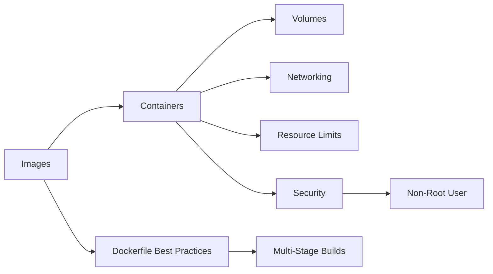

# Chapter 5: Docker

> **Previous:** [Containerization with Docker](./05-containerization.md) | **Next:** [Docker Compose](./06-docker-compose.md)

## Learning Objectives


By the end of this chapter, students will be able to:

1. Differentiate between Docker images and containers and explain the layered filesystem
2. Construct optimized Dockerfiles using multi-stage builds and layer caching
3. Manage container networking, volumes, and resource constraints
4. Apply Docker security best practices including non-root execution and read-only filesystems
5. Use Dockerfile linters to detect configuration issues


## Chapter at a Glance

| Topic | Key Insight | Practical Takeaway |
|-------|-------------|-------------------|
| Images vs Containers | Read-only layered templates vs running instances | Layered filesystem enables efficient caching |
| Dockerfile Best Practices | Official base images, multi-stage builds, layer caching | Order instructions by change frequency |
| Volumes and Mounts | Volumes, bind mounts, tmpfs for data persistence | Use volumes for production data, bind mounts for dev |
| Docker Networking | Bridge, host, overlay, macvlan drivers | Choose network driver based on isolation needs |
| Docker Security | Non-root user, read-only FS, capability dropping | Apply security hardening for production containers |

## Chapter Roadmap



## Theory

### 5.1 Images vs Containers

> **Pro Tip:** Use .dockerignore to exclude node_modules, .git, and build artifacts from the build context.

A **Docker image** is a read-only template containing instructions for creating a container. Images consist of layers, each representing a filesystem change (a RUN command, a COPY operation, a chmod change). Layers are cached and reused across images. An image includes the application code, runtime, libraries, environment variables, and configuration files.

A **container** is a running instance of an image. Containers leverage the host kernel through operating-system-level virtualization. Each container runs as an isolated process in user space. Containers share the host kernel but have their own filesystem, network stack, process tree, and resource limits.

The layered filesystem is fundamental to Docker's efficiency. Each instruction in a Dockerfile creates a new layer. Docker uses a union filesystem (overlay2 by default) to present a single coherent filesystem from these layers. Write operations in a running container create an ephemeral container layer that is discarded when the container stops.

### 5.2 Dockerfile Best Practices

> **Warning:** Docker containers run as root by default. Always use the USER directive to create a non-root user.

**Use Official Base Images** — Official images from Docker Hub are maintained by upstream teams and are regularly scanned for vulnerabilities. Pin specific versions rather than using `latest`.

**Order Instructions by Cacheability** — Docker caches each layer. Instructions that change frequently (COPY of source code) should come after instructions that change rarely (installing system packages). This maximizes cache reuse.

**Multi-Stage Builds** — Use multiple FROM statements in a single Dockerfile. Early stages contain build tooling (compilers, SDKs, package managers). The final stage copies only the runtime artifacts. This dramatically reduces image size.

```dockerfile
# Build stage
FROM node:20-slim AS builder
WORKDIR /app
COPY package*.json ./
RUN npm ci
COPY . .
RUN npm run build

# Runtime stage
FROM node:20-alpine
WORKDIR /app
COPY --from=builder /app/dist ./dist
COPY --from=builder /app/node_modules ./node_modules
EXPOSE 3000
USER node
CMD ["node", "dist/index.js"]
```

**Minimize Layers** — Combine related RUN commands with `&&` and clean up package manager caches in the same layer. Each RUN instruction adds a layer; fewer layers means smaller images and faster pulls.

**Metadata** — Use LABEL instructions for maintainer, version, license, and other metadata. HEALTHCHECK defines the command Docker uses to determine if the container is healthy.

### 5.3 Layer Caching

> **Remember:** Layer caching is your friend. Place frequently changed instructions (COPY of source code) at the end.

Docker builds each layer and caches the result. On subsequent builds, if the build context and instruction haven't changed, Docker reuses the cached layer. This dramatically accelerates builds.

Cache invalidation occurs when:
- The instruction changes (different package version, different commands)
- The file content in a COPY changes
- A preceding layer is invalidated (all subsequent layers must rebuild)

Use `.dockerignore` to exclude unnecessary files from the build context (node_modules, .git, build artifacts). This reduces context size and prevents cache invalidation from irrelevant changes.

### 5.4 Docker Compose

Docker Compose defines multi-container applications in a YAML file. It manages building, networking, and running related containers as a unit. Compose is essential for development environments and local testing.

```yaml
services:
  app:
    build: .
    ports:
      - "3000:3000"
    depends_on:
      - db
  db:
    image: postgres:16
    environment:
      POSTGRES_PASSWORD: ${DB_PASSWORD}
    volumes:
      - pgdata:/var/lib/postgresql/data

volumes:
  pgdata:
```

### 5.5 Volumes and Bind Mounts

**Volumes** — Managed by Docker, stored in `/var/lib/docker/volumes/`. Preferred for persistent data. Support volume drivers (NFS, cloud storage). Named volumes are easy to back up and share across containers.

**Bind Mounts** — Map a host directory into the container. Useful for development (hot-reloading) and sharing host configuration files. Less portable than volumes and depend on host filesystem structure.

**tmpfs Mounts** — Stored in memory only. Used for sensitive data that should not persist (secrets, temporary processing data).

### 5.6 Docker Networking

Docker provides several network drivers:

- **bridge** — Default. Isolated network for containers on the same host. Containers communicate via IP addresses or service names (with embedded DNS).
- **host** — Container uses the host's network stack directly. No network isolation. Higher performance but reduced isolation.
- **overlay** — Multi-host networking for Docker Swarm. Enables containers on different hosts to communicate securely.
- **macvlan** — Assigns MAC addresses to containers, making them appear as physical devices on the network.
- **none** — No networking. For isolation-only containers.
- **ipvlan** — Similar to macvlan but uses the same MAC address with multiple IP addresses.

### 5.7 Resource Constraints

Containers should always specify resource limits to prevent resource starvation:

```bash
docker run --memory="512m" --cpus="1.5" --memory-reservation="256m" nginx
```

Resource types:
- **CPU** — `--cpus` (core count), `--cpuset-cpus` (specific cores)
- **Memory** — `--memory` (hard limit), `--memory-reservation` (soft limit)
- **Disk I/O** — `--device-read-bps`, `--device-write-bps`
- **Restart Policies** — `--restart no|on-failure[:max-retries]|always|unless-stopped`

### 5.8 Docker Security

Security is critical for production container deployments.

**Non-Root User** — Containers run as root by default. Create a user in the Dockerfile and switch with USER directive. This limits the impact of container escape vulnerabilities.

**Read-Only Root Filesystem** — Use `--read-only` flag. Write directories for temporary data are mounted as tmpfs volumes. Prevents attackers from modifying the container filesystem.

**Secrets Management** — Docker supports build secrets (BuildKit) and runtime secrets. Build secrets enable using credentials during build without embedding them in the image.

```dockerfile
# BuildKit syntax for secrets
RUN --mount=type=secret,id=npmrc \
    cp /run/secrets/npmrc ~/.npmrc
```

**Capability Dropping** — Docker containers start with a reduced set of Linux capabilities. Further restrict with `--cap-drop=ALL` then add only necessary capabilities with `--cap-add=NET_BIND_SERVICE`.

**Image Scanning** — Scan images for vulnerabilities before deployment. Trivy, Docker Scout, and Snyk provide CVE scanning integrated with CI/CD.

### 5.9 Dockerfile Linters

Hadolint parses Dockerfiles, applies best-practice rules, and returns warnings. It integrates with Dockerfile syntax checking, shell script analysis in RUN commands, and label conventions.

```bash
# Lint a Dockerfile
hadolint Dockerfile

# With severity filtering
hadolint --failure-threshold error Dockerfile
```

## Summary

## Concept Comparison Table

| Concept | Description |
|---------|-------------|
| Image | Read-only layered template for creating containers |
| Container | Running instance of an image with isolated process |
| Volume | Docker-managed persistent storage in /var/lib/docker/volumes |
| Bind Mount | Host directory mapped into the container |
| tmpfs Mount | In-memory storage for temporary data |

## Quick Reference

| Topic | Key Points |
|-------|------------|
| Dockerfile Key | FROM, RUN, COPY, CMD, EXPOSE, USER |
| Volumes | docker volume create, -v flag |
| Networks | bridge(default), host, overlay, macvlan |
| Resources | --memory, --cpus, --restart |
| Security | USER, --read-only, --cap-drop, image scanning |

## Cross-Application Matrix

| Domain | Application |
|--------|-------------|
| Web | Development environments with hot-reload |
| Cloud | Consistent deployment across environments |
| Enterprise | Isolated microservice deployments |
| ML | Reproducible model training environments |

## Chapter Quiz

<details><summary>Question 1: How does multi-stage builds help?</summary>**A)** Runs builds in parallel<br>**B)** Separates build and runtime to reduce image size<br>**C)** Improves network performance<br>**D)** Increases container security<br><br>**Answer: B)** Separates build and runtime to reduce image size</details>

<details><summary>Question 2: What is the purpose of the USER instruction?</summary>**A)** Create a user account<br>**B)** Switch to non-root user for security<br>**C)** Set container hostname<br>**D)** Configure user authentication<br><br>**Answer: B)** Switch to non-root user for security</details>

<details><summary>Question 3: Which network driver enables multi-host communication?</summary>**A)** bridge<br>**B)** host<br>**C)** overlay<br>**D)** none<br><br>**Answer: C)** overlay</details>


## Summary

Docker provides lightweight, consistent application packaging through operating-system-level virtualization. Images are layered, immutable templates; containers are running instances with isolated processes. Multi-stage builds produce minimal production images. Layer caching accelerates iterative development. Volumes persist data; networks connect containers. Resource constraints prevent resource starvation. Security practices including non-root users, read-only filesystems, capability dropping, and image scanning reduce attack surface. Dockerfile linters enforce best practices automatically.

## Exercises

### Review Questions

1. How does Docker's layered filesystem work? What happens to changed files at runtime?
2. Explain the cache invalidation rules for Docker builds. Why does instruction order matter?
3. Compare volumes, bind mounts, and tmpfs mounts. When should each be used?
4. What are the security risks of running containers as root? How should non-root execution be configured?
5. How does Docker overlay networking enable multi-host communication?

### Application Problems

1. Create a Dockerfile for a Python Flask application that uses multi-stage builds. The build stage installs dev dependencies and runs tests. The runtime stage uses `python:3.12-slim`. Include a non-root user, HEALTHCHECK, and LABEL instructions. Run hadolint and resolve any warnings.
2. Set up a three-service application with Docker Compose: a Node.js API, a PostgreSQL database, and a Redis cache. Configure volumes for database persistence, environment variables for credentials, depends_on with health conditions, and resource limits.
3. Build a Docker image for a Go application using the `golang:1.22` build image and `alpine:3.19` runtime. Measure the image size with and without multi-stage builds. Verify layer count and hash with `docker history`.

### Challenge Problem

Design a container security strategy for a PCI-compliant e-commerce platform. The platform consists of 20 microservices (Node.js, Go, Python), a PostgreSQL database, Redis caching, and Kafka messaging. Requirements: non-root execution everywhere, no hardcoded secrets in images, vulnerability scanning in CI/CD, read-only root filesystem for stateless services, and capability dropping. Produce a Dockerfile template with annotations for each security decision, a Docker Compose overlay for production with security configurations, a set of Hadolint rules adapted for PCI compliance, and describe the image signing strategy for supply chain integrity.
