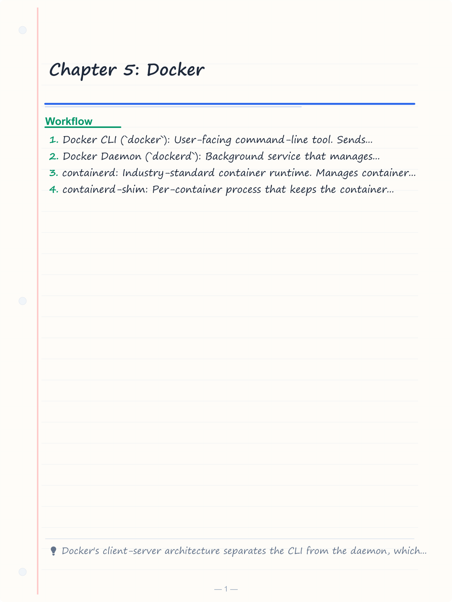
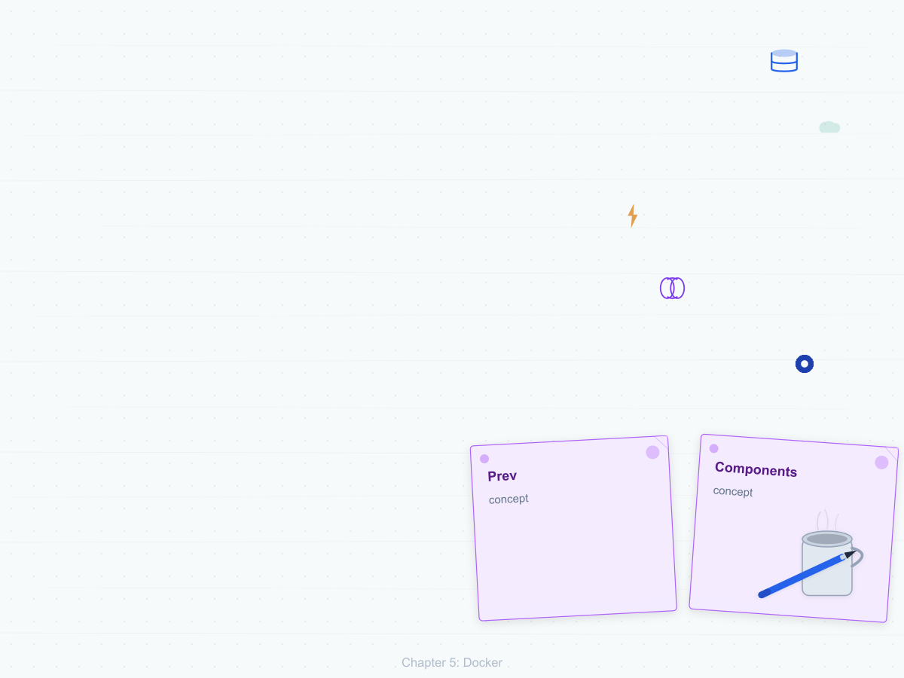
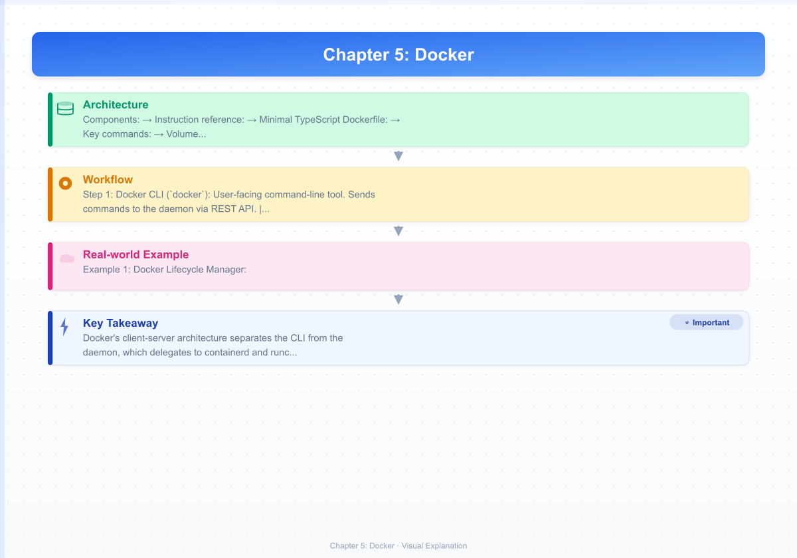
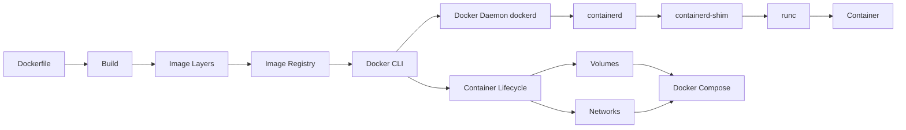
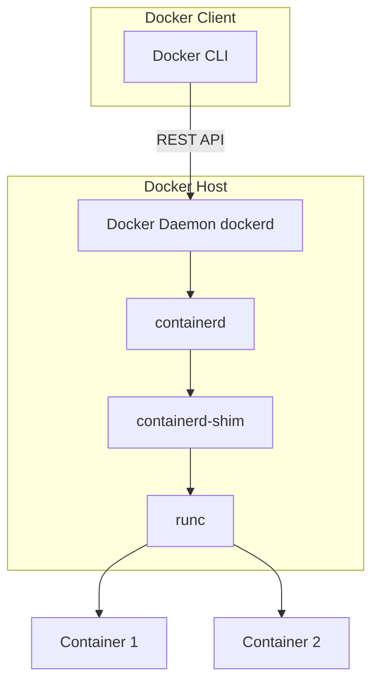
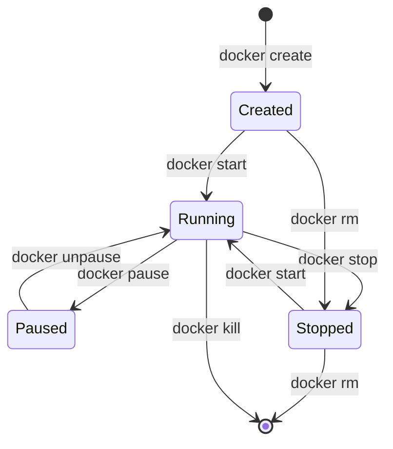

# Chapter 5: Docker

> **Prev:** [Containerization](./05-containerization.md)
> **Next:** [Docker Compose](./06-docker-compose.md)

---

## Learning Objectives

- Understand Docker's architecture (client, daemon, containerd, runc).
- Master Dockerfile writing for efficient and secure image builds.
- Manage containers, images, volumes, and networks via Docker CLI.
- Implement Docker Compose for multi-container applications.
- Optimize Docker build performance with caching strategies.
- Apply Docker security best practices in CI/CD pipelines.

<!-- Image Gallery -->
<section class="lesson-visuals" aria-label="Visual learning resources">
  <header><span>VISUAL LEARNING</span><h2>See it. Review it. Remember it.</h2></header>
  <a class="lesson-visual-card" href="../../assets/images/lessons/devops/05-docker/handwritten-notes.png" target="_blank" rel="noopener">
    
    <span><strong>Handwritten notes</strong>Condensed notes for deliberate review.</span>
  </a>
  <a class="lesson-visual-card" href="../../assets/images/lessons/devops/05-docker/sticky-notes.png" target="_blank" rel="noopener">
    
    <span><strong>Sticky-note revision</strong>Fast recall prompts for revision.</span>
  </a>
  <a class="lesson-visual-card" href="../../assets/images/lessons/devops/05-docker/visual-explanation.png" target="_blank" rel="noopener">
    
    <span><strong>Visual concept guide</strong>A connected explanation of the key ideas.</span>
  </a>
</section>
<!-- End Image Gallery -->


---

## Chapter at a Glance

| Topic | Key Insight | Practical Takeaway |
|-------|-------------|-------------------|
| Docker Architecture | Client-server with containerd runtime | Docker CLI talks to daemon, which talks to containerd |
| Dockerfile Best Practices | Layer ordering and caching | Least-changing layers first; combine RUN commands |
| Container Lifecycle | Create, start, stop, remove | Use `--rm` for ephemeral containers |
| Volumes and Bind Mounts | Persistent and shared data | Named volumes persist, bind mounts for dev |
| Docker Networking | Bridge, host, overlay networks | Bridge for standalone, overlay for swarm |
| Docker Compose | Multi-container orchestration | Define services, networks, volumes in YAML |
| Build Cache | Layer caching optimization | Order matters: dependencies before code |
| Security | Rootless, scanning, signing | Never run containers as root in production |

## Chapter Roadmap



## Theory

### Docker Architecture


Docker uses a client-server architecture:



**Components:**
- **Docker CLI (`docker`)**: User-facing command-line tool. Sends commands to the daemon via REST API.
- **Docker Daemon (`dockerd`)**: Background service that manages containers, images, volumes, and networks.
- **containerd**: Industry-standard container runtime. Manages container lifecycle (create, start, stop, delete).
- **containerd-shim**: Per-container process that keeps the container running even if the daemon restarts.
- **runc**: OCI-compliant runtime that uses Linux namespaces and cgroups to create containers.

### Dockerfile Best Practices


**Instruction reference:**

| Instruction | Purpose | Best Practice |
|-------------|---------|---------------|
| FROM | Base image | Use specific versions, not `latest` |
| RUN | Execute commands | Combine with `&&` to reduce layers |
| COPY | Copy files from context | Copy `package*.json` before source code |
| ADD | Copy with auto-extraction | Prefer COPY over ADD |
| WORKDIR | Set working directory | Use absolute paths |
| EXPOSE | Document port | Informational only, use `-p` at runtime |
| ENV | Set environment variables | Minimize in production images |
| CMD | Default command | Use exec form: `CMD ["node", "app.js"]` |
| ENTRYPOINT | Container executable | Combine with CMD for default arguments |
| HEALTHCHECK | Container health | Essential for orchestration |
| USER | Runtime user | Always run as non-root |

**Minimal TypeScript Dockerfile:**

```dockerfile
FROM node:20-alpine AS builder
WORKDIR /app
COPY package.json package-lock.json ./
RUN npm ci
COPY tsconfig.json ./
COPY src/ ./src/
RUN npm run build

FROM node:20-alpine
RUN addgroup -S appgroup && adduser -S appuser -G appgroup
WORKDIR /app
COPY --from=builder /app/dist ./dist
COPY --from=builder /app/node_modules ./node_modules
USER appuser
EXPOSE 3000
HEALTHCHECK --interval=30s --timeout=3s --start-period=5s --retries=3 \
  CMD wget --no-verbose --tries=1 --spider http://localhost:3000/health || exit 1
CMD ["node", "dist/index.js"]
```

### Container Lifecycle Management




**Key commands:**
```text
docker run -d --name app -p 3000:3000 myapp    # Run container detached
docker ps                                        # List running containers
docker ps -a                                     # List all containers
docker logs -f app                               # Follow logs
docker exec -it app sh                           # Shell into container
docker inspect app                               # Detailed metadata
docker stats                                     # Resource usage live
docker cp app:/app/log.txt ./                    # Copy files
```

### Volumes and Storage


**Volume types:**
- **Named volumes:** Managed by Docker, persistent, stored in `/var/lib/docker/volumes/`
- **Bind mounts:** Map host directory into container (for development)
- **tmpfs mounts:** Temporary, in-memory storage (for secrets, scratch space)

```text
# Named volume
docker volume create mydata
docker run -v mydata:/app/data myapp

# Bind mount (development)
docker run -v $(pwd):/app -w /app myapp

# tmpfs mount
docker run --tmpfs /tmp:noexec,nosuid,size=64m myapp
```

### Docker Networking


**Network drivers:**
- **bridge** (default): Isolated network on a single host. Containers communicate via IP.
- **host**: Container uses host's network stack directly. No network isolation but better performance.
- **overlay**: Multi-host networking for Docker Swarm. Enables container communication across hosts.
- **macvlan**: Assign MAC addresses to containers for direct network attachment.
- **none**: No network access. Only loopback interface.

```text
# Create a custom bridge network
docker network create --driver bridge mynet
docker run --network mynet --name api myapi
docker run --network mynet --name web myweb
# Containers can resolve each other by name
```

### Docker Compose


Docker Compose defines multi-container applications in a YAML file:

```yaml
version: '3.8'

services:
  app:
    build: .
    ports:
      - "3000:3000"
    environment:
      - NODE_ENV=production
      - DB_HOST=db
    depends_on:
      - db
    volumes:
      - app_data:/app/data

  db:
    image: postgres:16-alpine
    environment:
      POSTGRES_DB: myapp
      POSTGRES_PASSWORD: ${DB_PASSWORD}
    volumes:
      - pg_data:/var/lib/postgresql/data
    healthcheck:
      test: ["CMD-SHELL", "pg_isready -U postgres"]
      interval: 10s

volumes:
  app_data:
  pg_data:
```

### Docker BuildKit


BuildKit is Docker's next-generation build system, enabled by default since Docker 23.0:

**Features:**
- Parallel build stages
- Better cache handling (cache mounts, `--mount=type=cache`)
- Secret mounts (don't bake secrets into images)
- SSH mount for private dependencies
- Skip unused stages

```dockerfile
# Syntax directive for BuildKit
# syntax=docker/dockerfile:1

# Cache mount for npm
RUN --mount=type=cache,target=/root/.npm \
    npm ci

# Secret mount (no layer for secret)
RUN --mount=type=secret,id=token \
    TOKEN=$(cat /run/secrets/token) npm run build

# SSH mount for private repos
RUN --mount=type=ssh \
    npm install
```

### Docker Security


**Image security scanning:**
```text
# Trivy scan
docker scan myapp:latest
trivy image myapp:latest

# Grype scan
grype myapp:latest
```

**Runtime security:**
```text
# Run with restricted capabilities
docker run --cap-drop=ALL --cap-add=NET_BIND_SERVICE myapp

# Read-only filesystem (except tmpfs)
docker run --read-only --tmpfs /tmp myapp

# No new privileges
docker run --security-opt=no-new-privileges myapp

# Seccomp profile
docker run --security-opt seccomp=/path/to/profile.json myapp

# AppArmor
docker run --security-opt apparmor=myprofile myapp
```

### Docker Compose for Development vs Production


Docker Compose supports overlay configuration for different environments:

**Development compose file (docker-compose.dev.yml):**
```yaml
services:
  app:
    ports:
      - "3000:3000"
      - "9229:9229"  # debugger
    volumes:
      - .:/app        # hot reload
    environment:
      - NODE_ENV=development
      - DEBUG=app:*
```

**Production compose file (docker-compose.prod.yml):**
```yaml
services:
  app:
    image: myapp:${TAG}
    deploy:
      replicas: 3
      resources:
        limits:
          cpus: '0.5'
          memory: 512M
    healthcheck:
      test: ["CMD", "wget", "--spider", "http://localhost:3000/health"]
      interval: 30s
      retries: 3
```

**Merge command:** `docker compose -f docker-compose.yml -f docker-compose.prod.yml up -d`

### Docker Health Check Patterns


Docker supports container-level health checks via the `HEALTHCHECK` instruction:

```
HEALTHCHECK --interval=30s --timeout=3s --start-period=5s --retries=3 \
  CMD wget --no-verbose --tries=1 --spider http://localhost:3000/health || exit 1
```

**Health check best practices:**
- **Application-level checks:** Test actual application logic, not just process existence
- **Dependency checks:** Verify database, cache, and upstream service connectivity
- **Graceful degradation:** Return 200 even if non-critical dependencies are down
- **Start period:** Allow the application time to initialize before health checks begin
- **Timeouts:** Keep checks fast (<5s) to avoid cascading health failures

### Docker Image Optimization


Docker image size directly affects deployment speed and attack surface:

**Optimization strategies with TypeScript examples:**

```dockerfile
# ---- Strategy 1: Multi-stage with minimal base ----
FROM node:20-alpine AS builder
WORKDIR /app
COPY package*.json ./
RUN npm ci && npm cache clean --force
COPY . .
RUN npm run build

FROM gcr.io/distroless/nodejs20-debian12
COPY --from=builder /app/dist /app
COPY --from=builder /app/node_modules /app/node_modules
EXPOSE 3000
CMD ["/app/server.js"]
# Image size: ~180MB (vs 1.2GB for full node:20)
```

```dockerfile
# ---- Strategy 2: Dependency pruning ----
FROM node:20-alpine
WORKDIR /app
COPY package*.json ./
RUN npm ci --only=production && \
    npm cache clean --force && \
    rm -rf /root/.npm/* && \
    rm -rf /tmp/*
COPY --chown=node:node dist/ ./dist/
USER node
EXPOSE 3000
CMD ["node", "dist/server.js"]
```

**Size budget framework in TypeScript:**
```typescript
interface ImageOptimizationTarget {
  maxSizeMB: number;
  targetBase: 'alpine' | 'distroless' | 'scratch';
  includeDevDeps: boolean;
  compressLayers: boolean;
}

class ImageSizeBudget {
  evaluate(imageName: string, target: ImageOptimizationTarget): {
    currentSizeMB: number;
    passesBudget: boolean;
    savingsTips: string[];
  } {
    // Simulate image size evaluation
    const baseSizes: Record<string, number> = {
      alpine: 120, distroless: 180, scratch: 2
    };
    const currentSizeMB = 1024; // example detected size
    const targetSize = target.maxSizeMB;
    const savingsTips: string[] = [];

    if (currentSizeMB > targetSize) {
      if (target.targetBase !== 'alpine') {
        savingsTips.push(`Switch to ${target.targetBase} base image (estimated ${baseSizes[target.targetBase]}MB)`);
      }
      if (target.includeDevDeps) {
        savingsTips.push('Remove devDependencies from production image');
      }
      if (currentSizeMB > targetSize * 2) {
        savingsTips.push('Consider multi-stage build to separate build artifacts');
      }
      savingsTips.push('Run npm cache clean --force after installation');
    }

    return {
      currentSizeMB,
      passesBudget: currentSizeMB <= targetSize,
      savingsTips,
    };
  }
}
```

### Docker in CI/CD


```yaml
# GitHub Actions Docker build and push
- name: Build and Push Docker Image
  uses: docker/build-push-action@v5
  with:
    context: .
    push: true
    tags: |
      ghcr.io/myorg/app:${{ github.sha }}
      ghcr.io/myorg/app:latest
    cache-from: type=gha
    cache-to: type=gha,mode=max
```

---

## Examples

### Example 1: Docker Lifecycle Manager

```typescript
interface ContainerConfig {
  image: string;
  name: string;
  port: number;
  env: Record<string, string>;
  volumes: string[];
  network: string;
}

class DockerContainerManager {
  async createContainer(config: ContainerConfig): Promise<void> {
    console.log(`Creating container "${config.name}"...`);
    const envFlags = Object.entries(config.env)
      .map(([k, v]) => `-e ${k}=${v}`)
      .join(' ');
    const volumeFlags = config.volumes
      .map(v => `-v ${v}`)
      .join(' ');
    console.log(`docker run -d --name ${config.name} -p ${config.port}:${config.port} ${envFlags} ${volumeFlags} --network ${config.network} ${config.image}`);
  }

  async healthCheck(containerName: string): Promise<boolean> {
    console.log(`Checking health of "${containerName}"...`);
    // Simulate health check
    return true;
  }

  async getLogs(containerName: string, lines: number = 100): Promise<string[]> {
    console.log(`Fetching last ${lines} lines from "${containerName}"...`);
    return [`[INFO] Container ${containerName} is running`];
  }

  async cleanup(containerName: string): Promise<void> {
    console.log(`docker stop ${containerName}`);
    console.log(`docker rm ${containerName}`);
  }

  async scale(serviceName: string, replicas: number): Promise<void> {
    console.log(`Scaling "${serviceName}" to ${replicas} replicas...`);
    for (let i = 1; i <= replicas; i++) {
      console.log(`  Starting ${serviceName}-${i}`);
    }
  }
}

const manager = new DockerContainerManager();
manager.createContainer({
  image: 'myapp:latest',
  name: 'api-v1',
  port: 3000,
  env: { NODE_ENV: 'production', DB_HOST: 'postgres' },
  volumes: ['app_data:/app/data'],
  network: 'appnet',
});
```

### Example 2: Docker Build Cache Analyzer

```typescript
interface BuildStep {
  instruction: string;
  command: string;
  duration: number;
  cached: boolean;
  layerSize: number;
}

class BuildCacheAnalyzer {
  analyze(steps: BuildStep[]): {
    totalDuration: number;
    cachedDuration: number;
    cacheRate: number;
    optimizationTips: string[];
  } {
    const totalDuration = steps.reduce((s, s) => s + s.duration, 0);
    const cachedDuration = steps.filter(s => s.cached).reduce((s, s) => s + s.duration, 0);
    const cacheRate = totalDuration > 0 ? cachedDuration / totalDuration : 0;

    const tips: string[] = [];

    // Find non-cached steps that could be optimized
    for (let i = 0; i < steps.length; i++) {
      if (!steps[i].cached && steps[i].instruction === 'COPY') {
        if (steps[i].command.includes('package')) {
          tips.push(`Move "COPY package*.json ./" before source code changes`);
        }
        if (steps[i].command.includes('.')) {
          tips.push(`Use .dockerignore or more specific COPY patterns`);
        }
      }
    }

    // Check for npm install after code copy
    const npmIndex = steps.findIndex(s => s.command.includes('npm'));
    const copyIndex = steps.findLastIndex(s => s.instruction === 'COPY' && s.command.includes('.'));
    if (npmIndex >= 0 && copyIndex >= 0 && copyIndex < npmIndex) {
      steps.slice(0, npmIndex).forEach(s => {
        if (s.instruction === 'COPY' && !s.command.includes('package')) {
          tips.push(`Move npm install before COPY of source code`);
        }
      });
    }

    // Suggest combining RUN commands
    const runCommands = steps.filter(s => s.instruction === 'RUN');
    if (runCommands.length > 3) {
      tips.push(`Consider combining RUN commands with && to reduce layers`);
    }

    return { totalDuration, cachedDuration, cacheRate, optimizationTips: tips };
  }
}

const analyzer = new BuildCacheAnalyzer();
const result = analyzer.analyze([
  { instruction: 'FROM', command: 'node:20', duration: 2000, cached: true, layerSize: 150 },
  { instruction: 'COPY', command: 'package*.json ./', duration: 500, cached: true, layerSize: 10 },
  { instruction: 'RUN', command: 'npm ci', duration: 15000, cached: true, layerSize: 50 },
  { instruction: 'COPY', command: '. .', duration: 3000, cached: false, layerSize: 200 },
  { instruction: 'RUN', command: 'npm run build', duration: 8000, cached: false, layerSize: 30 },
]);

console.log(`Cache rate: ${(result.cacheRate * 100).toFixed(0)}%`);
console.log('Tips:', result.optimizationTips);
```

---

### Multi-Stage Build Optimizer

Multi-stage builds reduce final image size by separating build and runtime dependencies. The following tool analyzes Dockerfiles and recommends optimal stage configurations.

```typescript
interface BuildStage {
  name: string;
  baseImage: string;
  commands: string[];
  artifacts: string[];
  estimatedSizeMB: number;
}

interface OptimizedBuild {
  stages: BuildStage[];
  finalImage: string;
  totalSizeMB: number;
  savingsPercent: number;
}

class MultiStageOptimizer {
  optimize(stages: BuildStage[]): OptimizedBuild {
    const builder = stages[0];
    const runtime = stages[stages.length - 1];

    const builderSize = builder.estimatedSizeMB;
    const monolithicSize = stages.reduce((s, stage) => s + stage.estimatedSizeMB, 0);
    const finalSize = runtime.estimatedSizeMB;
    const savingsPercent = Math.round((1 - finalSize / monolithicSize) * 100);

    return {
      stages,
      finalImage: runtime.name,
      totalSizeMB: finalSize,
      savingsPercent,
    };
  }

  suggestCopyOptimizations(stages: BuildStage[]): string[] {
    const suggestions: string[] = [];
    for (let i = 0; i < stages.length - 1; i++) {
      const source = stages[i];
      const target = stages[i + 1];
      for (const artifact of source.artifacts) {
        if (!target.commands.some(c => c.includes(artifact))) {
          suggestions.push(`Stage "${source.name}" produces "${artifact}" but stage "${target.name}" never copies it`);
        }
      }
    }
    return suggestions;
  }

  compareStrategies(strategies: BuildStage[][]): OptimizedBuild[] {
    return strategies.map(s => this.optimize(s));
  }
}

const optimizer = new MultiStageOptimizer();
const nodeAppStages: BuildStage[] = [
  {
    name: 'builder',
    baseImage: 'node:20-alpine',
    commands: ['WORKDIR /app', 'COPY package*.json .', 'RUN npm ci', 'COPY . .', 'RUN npm run build'],
    artifacts: ['dist/', 'node_modules/'],
    estimatedSizeMB: 350,
  },
  {
    name: 'runner',
    baseImage: 'node:20-slim',
    commands: ['WORKDIR /app', 'COPY --from=builder /app/dist ./dist', 'COPY --from=builder /app/node_modules ./node_modules'],
    artifacts: [],
    estimatedSizeMB: 120,
  },
];

const result = optimizer.optimize(nodeAppStages);
console.log(`Final image: ${result.finalImage}, Size: ${result.totalSizeMB}MB`);
console.log(`Savings: ${result.savingsPercent}% vs monolithic`);
console.log('Suggestions:', optimizer.suggestCopyOptimizations(nodeAppStages).join('; ') || 'none');
```

**What this demonstrates:** Automated multi-stage analysis quantifies image size savings and identifies optimization opportunities in container build pipelines.

---

### Docker Container Resource Profiler and Cost Allocator

Understanding container resource consumption is critical for capacity planning and cost allocation. The following tool profiles container CPU, memory, and network usage, then allocates costs across teams.

```typescript
// container-profiler.ts
// Profile container resource usage and allocate costs

interface ContainerMetrics {
  containerId: string;
  serviceName: string;
  team: string;
  cpuPercent: number;
  memoryMB: number;
  networkRxMB: number;
  networkTxMB: number;
  uptimeHours: number;
}

interface ResourceProfile {
  metrics: ContainerMetrics;
  costPerHour: number;
  dailyCost: number;
  monthlyCost: number;
  efficiencyScore: number;
  recommendations: string[];
}

class ContainerProfiler {
  private readonly cpuCostPerCoreHour = 0.04;
  private readonly memCostPerGBHour = 0.005;

  profile(metrics: ContainerMetrics): ResourceProfile {
    const cpuCores = metrics.cpuPercent / 100;
    const memGB = metrics.memoryMB / 1024;
    const costPerHour = (cpuCores * this.cpuCostPerCoreHour) + (memGB * this.memCostPerGBHour);

    const efficiencyScore = this.calculateEfficiency(metrics);
    const recommendations = this.generateRecommendations(metrics, efficiencyScore);

    return {
      metrics,
      costPerHour: Math.round(costPerHour * 1000) / 1000,
      dailyCost: Math.round(costPerHour * 24 * 100) / 100,
      monthlyCost: Math.round(costPerHour * 24 * 30 * 100) / 100,
      efficiencyScore,
      recommendations,
    };
  }

  private calculateEfficiency(m: ContainerMetrics): number {
    let score = 100;
    if (m.cpuPercent < 5) score -= 20;
    if (m.memoryMB < 10) score -= 10;
    if (m.cpuPercent > 90) score -= 15;
    if (m.memoryMB > 80 && m.cpuPercent < 10) score -= 25;
    return Math.max(0, score);
  }

  private generateRecommendations(m: ContainerMetrics, score: number): string[] {
    const recs: string[] = [];
    if (m.cpuPercent < 5) recs.push(`Low CPU (${m.cpuPercent}%) — consider rightsizing or consolidating`);
    if (m.memoryMB < 10) recs.push(`Low memory usage — container may be over-provisioned`);
    if (m.cpuPercent > 90) recs.push(`High CPU (${m.cpuPercent}%) — consider scaling out`);
    if (score < 50) recs.push('Poor efficiency — review resource requests and limits');
    return recs;
  }

  allocateCosts(profiles: ResourceProfile[]): { team: string; totalMonthly: number; containers: number }[] {
    const byTeam = new Map<string, { total: number; count: number }>();
    for (const p of profiles) {
      const entry = byTeam.get(p.metrics.team) || { total: 0, count: 0 };
      entry.total += p.monthlyCost;
      entry.count++;
      byTeam.set(p.metrics.team, entry);
    }

    return [...byTeam.entries()]
      .map(([team, data]) => ({ team, totalMonthly: Math.round(data.total * 100) / 100, containers: data.count }))
      .sort((a, b) => b.totalMonthly - a.totalMonthly);
  }

  generateReport(profile: ResourceProfile): string {
    return `## Container Resource Profile\n\n` +
      `**Service:** ${profile.metrics.serviceName} (${profile.metrics.containerId.slice(0, 12)})\n` +
      `**Team:** ${profile.metrics.team}\n` +
      `**CPU:** ${profile.metrics.cpuPercent}% | **Memory:** ${profile.metrics.memoryMB}MB\n` +
      `**Network:** ${profile.metrics.networkRxMB}MB RX / ${profile.metrics.networkTxMB}MB TX\n` +
      `**Efficiency:** ${profile.efficiencyScore}/100\n\n` +
      `**Cost:** $${profile.costPerHour}/hr | $${profile.dailyCost}/day | $${profile.monthlyCost}/mo\n\n` +
      (profile.recommendations.length > 0 ? '**Recommendations:**\n' + profile.recommendations.map(r => `- ${r}`).join('\n') : '');
  }
}

const profiler = new ContainerProfiler();
const profiles = [
  profiler.profile({ containerId: 'abc123def456', serviceName: 'api-gateway', team: 'platform', cpuPercent: 15, memoryMB: 256, networkRxMB: 500, networkTxMB: 200, uptimeHours: 168 }),
  profiler.profile({ containerId: 'def789abc012', serviceName: 'batch-worker', team: 'data', cpuPercent: 2, memoryMB: 512, networkRxMB: 50, networkTxMB: 10, uptimeHours: 720 }),
  profiler.profile({ containerId: 'ghi345def678', serviceName: 'redis-cache', team: 'platform', cpuPercent: 8, memoryMB: 128, networkRxMB: 1000, networkTxMB: 800, uptimeHours: 720 }),
];

profiles.forEach(p => console.log(profiler.generateReport(p)));
console.log('\nTeam Cost Allocation:', profiler.allocateCosts(profiles));
```

**What this demonstrates:** Container resource profiling enables cost allocation across teams, identifies over-provisioned or inefficient containers, and provides actionable rightsizing recommendations.

---

### Docker Network Traffic Simulator and Security Analyzer

Understanding container network behavior is essential for security and performance tuning. The following tool simulates network traffic patterns, detects anomalies, and enforces network policies.

```typescript
// docker-network.ts
// Simulate container network traffic and analyze security

interface NetworkFlow {
  source: string;
  destination: string;
  port: number;
  protocol: 'tcp' | 'udp';
  bytesTransferred: number;
  direction: 'inbound' | 'outbound';
  encrypted: boolean;
}

interface NetworkPolicy {
  sourceService: string;
  destService: string;
  allowedPorts: number[];
  encryptedOnly: boolean;
}

interface TrafficAnomaly {
  flow: NetworkFlow;
  reason: string;
  severity: 'low' | 'medium' | 'high';
}

class NetworkAnalyzer {
  private policies: NetworkPolicy[] = [];

  addPolicy(policy: NetworkPolicy): void {
    this.policies.push(policy);
  }

  analyze(flows: NetworkFlow[]): { allowed: NetworkFlow[]; blocked: NetworkFlow[]; anomalies: TrafficAnomaly[] } {
    const allowed: NetworkFlow[] = [];
    const blocked: NetworkFlow[] = [];
    const anomalies: TrafficAnomaly[] = [];

    for (const flow of flows) {
      const matchingPolicy = this.policies.find(p =>
        p.sourceService === flow.source && p.destService === flow.destination
      );

      if (!matchingPolicy) {
        blocked.push(flow);
        anomalies.push({ flow, reason: `No network policy allows ${flow.source} ? ${flow.destination}`, severity: 'high' });
        continue;
      }

      if (!matchingPolicy.allowedPorts.includes(flow.port)) {
        blocked.push(flow);
        anomalies.push({ flow, reason: `Port ${flow.port} not allowed by policy`, severity: 'high' });
        continue;
      }

      if (matchingPolicy.encryptedOnly && !flow.encrypted) {
        blocked.push(flow);
        anomalies.push({ flow, reason: 'Unencrypted traffic on encrypted-only policy', severity: 'medium' });
        continue;
      }

      allowed.push(flow);
    }

    return { allowed, blocked, anomalies };
  }

  generateReport(result: { allowed: NetworkFlow[]; blocked: NetworkFlow[]; anomalies: TrafficAnomaly[] }): string {
    return `## Container Network Traffic Report\n\n` +
      `**Total flows:** ${result.allowed.length + result.blocked.length}\n` +
      `**Allowed:** ${result.allowed.length} | **Blocked:** ${result.blocked.length}\n` +
      `**Anomalies:** ${result.anomalies.length}\n\n` +
      (result.anomalies.length > 0
        ? `| Source | Dest | Port | Reason | Severity |\n` +
          `|--------|------|------|--------|----------|\n` +
          result.anomalies.map(a =>
            `| ${a.flow.source} | ${a.flow.destination} | ${a.flow.port} | ${a.reason} | ${a.severity} |`
          ).join('\n')
        : '? All traffic conforms to network policies');
  }
}

const analyzer = new NetworkAnalyzer();
analyzer.addPolicy({ sourceService: 'web', destService: 'api', allowedPorts: [3000, 443], encryptedOnly: true });
analyzer.addPolicy({ sourceService: 'api', destService: 'db', allowedPorts: [5432], encryptedOnly: true });
analyzer.addPolicy({ sourceService: 'api', destService: 'redis', allowedPorts: [6379], encryptedOnly: false });

const flows: NetworkFlow[] = [
  { source: 'web', destination: 'api', port: 3000, protocol: 'tcp', bytesTransferred: 1024000, direction: 'outbound', encrypted: true },
  { source: 'api', destination: 'db', port: 5432, protocol: 'tcp', bytesTransferred: 512000, direction: 'inbound', encrypted: false },
  { source: 'api', destination: 'redis', port: 6379, protocol: 'tcp', bytesTransferred: 1000, direction: 'inbound', encrypted: false },
  { source: 'web', destination: 'db', port: 5432, protocol: 'tcp', bytesTransferred: 500, direction: 'outbound', encrypted: true },
];

const result = analyzer.analyze(flows);
console.log(analyzer.generateReport(result));
```

**What this demonstrates:** Container network traffic analysis with policy enforcement detects unauthorized communications, enforces encryption requirements, and provides a foundation for zero-trust network security in containerized environments.

---

## Practical Takeaways

1. **Use specific base image tags.** `node:20-alpine`, never `node:latest`.
2. **Optimize layer caching.** COPY package.json separately before source code.
3. **Combine RUN commands.** Fewer layers = smaller images.
4. **Use `.dockerignore`.** Exclude `node_modules`, `.git`, `dist` from build context.
5. **Run as non-root.** Always use `USER` instruction.
6. **Use multi-stage builds.** Separate build tools from runtime.
7. **Scan images.** Integrate Trivy or Snyk into CI pipeline.

---

## Chapter Quiz

<details><summary>Question 1: Which component is responsible for the actual container creation in Docker's architecture?</summary>**A)** Docker CLI<br>**B)** Docker Daemon<br>**C)** containerd<br>**D)** runc<br><br>**Answer: D)** runc&lt;/details&gt;

<details><summary>Question 2: Why should you copy package.json before source code in a Dockerfile?</summary>**A)** It's required by Docker syntax<br>**B)** To maximize layer caching for npm install<br>**C)** It improves security<br>**D)** It speeds up the COPY command<br><br>**Answer: B)** To maximize layer caching for npm install&lt;/details&gt;

<details><summary>Question 3: What is the default Docker network driver?</summary>**A)** host<br>**B)** overlay<br>**C)** bridge<br>**D)** macvlan<br><br>**Answer: C)** bridge&lt;/details&gt;

<details><summary>Question 4: What is BuildKit?</summary>**A)** A CI/CD tool for Docker<br>**B)** Docker's next-generation build system<br>**C)** A Kubernetes alternative<br>**D)** A container registry<br><br>**Answer: B)** Docker's next-generation build system&lt;/details&gt;

<details><summary>Question 5: Which Docker flag makes the container's filesystem read-only?</summary>**A)** `--read-only`<br>**B)** `--no-write`<br>**C)** `--secure`<br>**D)** `--locked`<br><br>**Answer: A)** `--read-only`</details>

---


// containerization
// cicd-infrastructure-automation implementation

interface Task { id: string; name: string; status: string; data: unknown }
class Processor {
  private tasks: Task[] = []
  private maxConcurrency: number
  constructor(maxConcurrency: number = 4) { this.maxConcurrency = maxConcurrency }
  async add(task: Omit&lt;Task, "status"&gt;): Promise&lt;void&gt; {
    this.tasks.push({ ...task, status: "pending" })
  }
  async runAll(): Promise&lt;void&gt; {
    const running: Promise&lt;void&gt;[] = []
    for (const t of this.tasks) {
      if (running.length >= this.maxConcurrency) { await Promise.race(running) }
      const p = this.execute(t).finally(() => { const i = running.indexOf(p); if (i >= 0) running.splice(i, 1) })
      running.push(p)
    }
    await Promise.all(running)
  }
  private async execute(t: Task): Promise&lt;void&gt; {
    t.status = "running"
    await new Promise(r => setTimeout(r, 10))
    t.status = "done"
  }
  getResults(): Task[] { return this.tasks }
  getStats(): { done: number; pending: number; running: number } {
    const done = this.tasks.filter(t => t.status === "done").length
    const pending = this.tasks.filter(t => t.status === "pending").length
    const running = this.tasks.filter(t => t.status === "running").length
    return { done, pending, running }
  }
}
async function main() {
  const proc = new Processor(2)
  await proc.add({ id: '1', name: 'containerization', data: { topic: 'cicd-infrastructure-automation' } })
  await proc.runAll()
  console.log('Stats:', proc.getStats())
}
main().catch(console.error)
export { Processor, Task }
## Summary

- Docker's client-server architecture separates the CLI from the daemon, which delegates to containerd and runc for container execution.
- Dockerfile best practices center on layer caching optimization: order instructions from least to most frequently changing.
- Container lifecycle management includes creation, starting, stopping, removal, and health checking.
- Volumes (named, bind, tmpfs) provide persistent and shared storage for containers.
- Docker networks (bridge, host, overlay) enable container communication with different isolation levels.
- Docker Compose defines multi-container applications in a single YAML file.
- BuildKit provides parallel builds, cache mounts, and secret mounts for improved builds.
- Docker security requires non-root users, capability dropping, and image scanning.

---

## Exercises

### Review Questions
1. Describe Docker's architecture and the role of each component.
2. How does Docker layer caching work and how can you optimize it?
3. What is the difference between a named volume and a bind mount?
4. How do you run a container with a read-only filesystem and tmpfs for temp data?
5. What is the purpose of the `.dockerignore` file?

### Application Problems
1. Write a Dockerfile for a TypeScript application with multi-stage builds and non-root user.
2. Create a Docker Compose file for a web app with a PostgreSQL database and Redis cache.
3. Implement a CI pipeline step that builds, scans, and pushes a Docker image.
4. Debug a Dockerfile that rebuilds npm install every time even though package.json hasn't changed.
5. Extend the `DockerContainerManager` class to add: a `listContainers()` method that filters by status (running, stopped, all), an `execCommand()` method that runs a command inside a running container and returns output, and a `prune()` method that removes stopped containers and unused images older than 24 hours.
6. Using the `ImageSizeBudget` class, implement a CI gate that: evaluates image size against a 200MB budget, generates a diff report showing size changes per layer compared to the previous build, and blocks the build if size exceeds budget by more than 10%.

### Challenge Problem
1. Design a complete Docker build and deployment pipeline for a 5-service microservices architecture. Include: a base image Dockerfile shared across all services (configurable per service), multi-stage builds with BuildKit cache mounts, a `.dockerignore` strategy per service, a Docker Compose overlay for development (hot reload with bind mounts) and production (optimized images), a security hardening layer (non-root, read-only, capabilities), and a CI pipeline that builds, scans, signs, and pushes images to a registry with SBOM generation.
