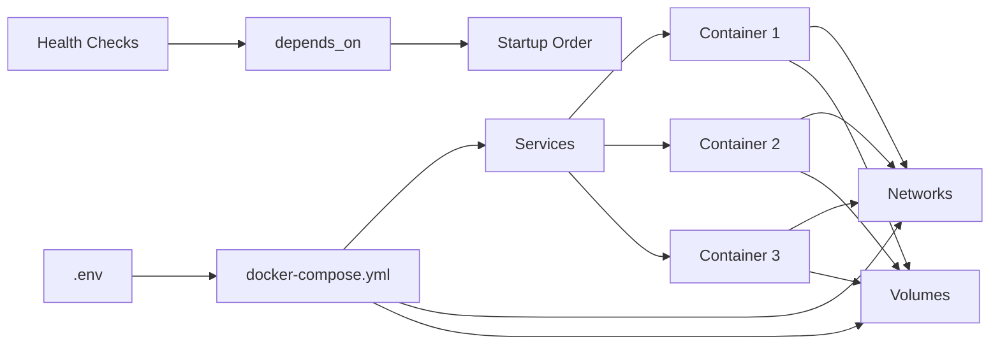

# Chapter 6: Docker Compose

> **Prev:** [Docker](./05-docker.md)
> **Next:** [Orchestration](./06-orchestration.md)

---

## Learning Objectives

- Understand Docker Compose for defining and running multi-container applications.
- Structure compose files with services, networks, and volumes.
- Use environment variables, configs, and secrets in Compose.
- Implement health checks, dependency ordering, and resource limits.
- Apply Compose for development, testing, and production environments.
- Extend and override compose files for different environments.

---

## Chapter at a Glance

| Topic | Key Insight | Practical Takeaway |
|-------|-------------|-------------------|
| Compose File Structure | Services, networks, volumes | The three YAML top-level keys |
| Service Configuration | Image, build, ports, env, volumes | Define each container's full configuration |
| Networking | Automatic DNS resolution | Services communicate by service name |
| Volume Management | Named volumes and bind mounts | Named volumes survive container restarts |
| Environment Variables | Substitute variables in compose | Use `.env` file for environment-specific values |
| Health Checks | Dependency ordering with depends_on | Wait for dependencies before starting |
| Profiles | Group services for specific scenarios | Activate services with --profile flag |
| Extends | Reuse common configurations | Avoid duplication across compose files |

## Chapter Roadmap



## Theory

### Compose File Structure

A Docker Compose file has three top-level keys:

```yaml
version: '3.8'

services:
  # Define each container here

networks:
  # Define custom networks here

volumes:
  # Define named volumes here
```

### Service Configuration Reference

```yaml
services:
  app:
    build:                      # Build from Dockerfile
      context: .
      dockerfile: Dockerfile
      args:
        - BUILD_ENV=production
    image: myapp:latest         # Or use pre-built image
    container_name: myapp
    ports:
      - "3000:3000"             # host:container
      - "443:443"
    expose:
      - "3000"                  # Internal port only
    environment:                # Environment variables
      NODE_ENV: production
      DB_HOST: db
    env_file: ./config/app.env # Or load from file
    volumes:
      - app_data:/app/data      # Named volume
      - ./src:/app/src          # Bind mount (dev)
      - /tmp:/tmp               # Host path
    depends_on:
      - db
      - redis
    healthcheck:
      test: ["CMD", "curl", "-f", "http://localhost:3000/health"]
      interval: 30s
      timeout: 10s
      retries: 3
      start_period: 10s
    restart: unless-stopped
    deploy:
      replicas: 3
      resources:
        limits:
          cpus: '0.5'
          memory: 512M
        reservations:
          cpus: '0.25'
          memory: 256M
    networks:
      - frontend
      - backend
    dns:
      - 8.8.8.8
    extra_hosts:
      - "host.docker.internal:host-gateway"
    user: "node"
    working_dir: /app
    command: node dist/index.js
    entrypoint: ["/entrypoint.sh"]
    labels:
      - "app.name=myapp"
      - "app.environment=production"
    logging:
      driver: json-file
      options:
        max-size: "10m"
        max-file: "3"
```

### Networking in Compose

By default, Compose creates a single network for all services. Each service can reach others by service name:

```yaml
networks:
  frontend:
    driver: bridge
    ipam:
      config:
        - subnet: 172.20.0.0/16
  backend:
    driver: bridge
    internal: true   # No external access
```

**DNS resolution:** Services resolve to their container IP by service name (e.g., `http://api:3000`).

### Dependency Ordering

`depends_on` controls startup order. With health checks, Compose waits for the dependency to be healthy:

```yaml
services:
  app:
    depends_on:
      db:
        condition: service_healthy
      redis:
        condition: service_started
```

### Profiles

Profiles enable conditional service activation:

```yaml
services:
  app:
    image: myapp
    profiles: ["dev"]         # Only starts with --profile dev

  db:
    image: postgres:16
    # No profile — always starts

  mailhog:
    image: mailhog/mailhog
    profiles: ["dev", "test"]
```

Run: `docker compose --profile dev up`

### Compose Override Files

Split configuration across files for different environments:

- `docker-compose.yml` — Base configuration
- `docker-compose.override.yml` — Development overrides (auto-loaded)
- `docker-compose.prod.yml` — Production overrides
- `docker-compose.test.yml` — Test overrides

```text
# Development (override auto-loaded)
docker compose up

# Production
docker compose -f docker-compose.yml -f docker-compose.prod.yml up

# Test
docker compose -f docker-compose.yml -f docker-compose.test.yml run test
```

### Environment Variables

**Variable substitution in compose file:**
```yaml
services:
  db:
    image: postgres:16
    environment:
      POSTGRES_DB: ${DB_NAME:-myapp}
      POSTGRES_USER: ${DB_USER}
      POSTGRES_PASSWORD: ${DB_PASSWORD}
```

**`.env` file (auto-loaded):**
```text
DB_NAME=myapp
DB_USER=admin
DB_PASSWORD=secret123
```

**Variable precedence:**
1. Shell environment variables (highest)
2. `.env` file
3. Compose file defaults (`:-`)
4. Empty (lowest)

### Resource Management

**CPU and memory limits:**
```yaml
services:
  app:
    deploy:
      resources:
        limits:
          cpus: '0.50'       # 50% of one CPU
          memory: 256M
        reservations:
          cpus: '0.25'
          memory: 128M
```

---

## Examples

### Example 1: Full-Stack Application Compose File

```yaml
version: '3.8'

name: myapp

services:
  postgres:
    image: postgres:16-alpine
    container_name: myapp-db
    environment:
      POSTGRES_DB: ${DB_NAME:-myapp}
      POSTGRES_USER: ${DB_USER:-myapp}
      POSTGRES_PASSWORD: ${DB_PASSWORD:?error}
    volumes:
      - pgdata:/var/lib/postgresql/data
      - ./db/init:/docker-entrypoint-initdb.d
    ports:
      - "${DB_PORT:-5432}:5432"
    healthcheck:
      test: ["CMD-SHELL", "pg_isready -U ${DB_USER:-myapp} -d ${DB_NAME:-myapp}"]
      interval: 5s
      timeout: 5s
      retries: 5
      start_period: 10s
    networks:
      - backend
    restart: unless-stopped

  redis:
    image: redis:7-alpine
    container_name: myapp-redis
    command: redis-server --appendonly yes --requirepass ${REDIS_PASSWORD}
    volumes:
      - redisdata:/data
    healthcheck:
      test: ["CMD", "redis-cli", "ping"]
      interval: 5s
      timeout: 3s
      retries: 5
    networks:
      - backend
    restart: unless-stopped

  api:
    build:
      context: ./api
      dockerfile: Dockerfile
      target: production
    container_name: myapp-api
    environment:
      NODE_ENV: production
      DB_HOST: postgres
      DB_PORT: 5432
      DB_NAME: ${DB_NAME:-myapp}
      DB_USER: ${DB_USER:-myapp}
      DB_PASSWORD: ${DB_PASSWORD}
      REDIS_HOST: redis
      REDIS_PASSWORD: ${REDIS_PASSWORD}
      JWT_SECRET: ${JWT_SECRET}
    depends_on:
      postgres:
        condition: service_healthy
      redis:
        condition: service_healthy
    ports:
      - "${API_PORT:-3000}:3000"
    networks:
      - frontend
      - backend
    restart: unless-stopped
    deploy:
      resources:
        limits:
          cpus: '0.5'
          memory: 256M

  web:
    build:
      context: ./web
      dockerfile: Dockerfile
      target: production
    container_name: myapp-web
    environment:
      API_URL: http://api:3000
    depends_on:
      - api
    ports:
      - "${WEB_PORT:-80}:80"
    networks:
      - frontend
    restart: unless-stopped

  nginx:
    image: nginx:alpine
    container_name: myapp-nginx
    volumes:
      - ./nginx/nginx.conf:/etc/nginx/nginx.conf:ro
      - ./nginx/ssl:/etc/nginx/ssl:ro
    ports:
      - "80:80"
      - "443:443"
    depends_on:
      - web
      - api
    networks:
      - frontend
    restart: unless-stopped

networks:
  frontend:
    driver: bridge
  backend:
    driver: bridge
    internal: true

volumes:
  pgdata:
  redisdata:
```

### Example 2: Development Compose Override

```yaml
# docker-compose.override.yml
version: '3.8'

services:
  api:
    build:
      target: development
    volumes:
      - ./api/src:/app/src:ro
      - ./api/package.json:/app/package.json
      - ./api/tsconfig.json:/app/tsconfig.json
    environment:
      NODE_ENV: development
    command: npm run dev

  web:
    build:
      target: development
    volumes:
      - ./web/src:/app/src:ro
    environment:
      NODE_ENV: development
    command: npm run dev

  mailhog:
    image: mailhog/mailhog
    ports:
      - "8025:8025"    # Web UI
      - "1025:1025"    # SMTP
    networks:
      - backend

  adminer:
    image: adminer
    ports:
      - "8080:8080"
    networks:
      - backend
```

### Example 3: TypeScript Compose Validator

```typescript
import { readFileSync } from 'fs';
import { parse } from 'yaml';

interface ComposeService {
  image?: string;
  build?: any;
  ports?: string[];
  environment?: Record<string, string>;
  depends_on?: Record<string, { condition: string }> | string[];
  volumes?: string[];
  healthcheck?: any;
  restart?: string;
}

interface ComposeFile {
  version: string;
  services: Record<string, ComposeService>;
  networks?: Record<string, any>;
  volumes?: Record<string, any>;
}

class ComposeValidator {
  private errors: string[] = [];
  private warnings: string[] = [];

  validate(content: string): boolean {
    let compose: ComposeFile;
    try {
      compose = parse(content) as ComposeFile;
    } catch {
      this.errors.push('Invalid YAML syntax');
      return false;
    }

    if (!compose.services) {
      this.errors.push('No services defined');
      return false;
    }

    for (const [name, service] of Object.entries(compose.services)) {
      this.validateService(name, service, compose.services);
    }

    this.printReport();
    return this.errors.length === 0;
  }

  private validateService(
    name: string,
    service: ComposeService,
    allServices: Record<string, ComposeService>,
  ): void {
    if (!service.image && !service.build) {
      this.errors.push(`Service "${name}": must specify image or build`);
    }

    if (service.restart && !['no', 'always', 'on-failure', 'unless-stopped'].includes(service.restart)) {
      this.errors.push(`Service "${name}": invalid restart policy "${service.restart}"`);
    }

    if (service.ports) {
      for (const port of service.ports) {
        const match = port.match(/^(\d+):(\d+)$/);
        if (!match) {
          this.warnings.push(`Service "${name}": port mapping "${port}" is unusual`);
        }
      }
    }

    if (service.depends_on) {
      const deps = Array.isArray(service.depends_on)
        ? service.depends_on
        : Object.keys(service.depends_on);

      for (const dep of deps) {
        if (!allServices[dep]) {
          this.errors.push(`Service "${name}": depends_on "${dep}" not defined`);
        }
      }
    }

    if (service.volumes) {
      for (const vol of service.volumes) {
        if (vol.includes(':') && !vol.startsWith('.') && !vol.startsWith('/')) {
          this.warnings.push(`Service "${name}": volume "${vol}" uses a named volume — ensure it is declared`);
        }
      }
    }
  }

  private printReport(): void {
    if (this.errors.length > 0) {
      console.log('? Validation failed:\n');
      this.errors.forEach(e => console.log(`  ERROR: ${e}`));
    }
    if (this.warnings.length > 0) {
      console.log('\n??  Warnings:\n');
      this.warnings.forEach(w => console.log(`  WARNING: ${w}`));
    }
    if (this.errors.length === 0) {
      console.log('? Compose file is valid');
    }
  }
}

const validator = new ComposeValidator();
const composeContent = readFileSync('docker-compose.yml', 'utf-8');
validator.validate(composeContent);
```

---

### Service Dependency Graph Analyzer

Docker Compose applications often have complex inter-service dependencies. The following tool visualizes and validates the service dependency graph, detecting circular dependencies and identifying critical paths.

```typescript
interface ComposeService {
  name: string;
  dependsOn: string[];
  ports: string[];
  volumes: string[];
  healthcheck?: HealthCheckConfig;
}

interface HealthCheckConfig {
  test: string[];
  interval: string;
  timeout: string;
  retries: number;
}

interface DependencyAnalysis {
  services: ComposeService[];
  circularDependencies: string[][];
  criticalPath: string[];
  startOrder: string[];
}

class DependencyAnalyzer {
  analyze(services: ComposeService[]): DependencyAnalysis {
    const depMap = new Map<string, string[]>();
    services.forEach(s => depMap.set(s.name, s.dependsOn));

    const circularDependencies = this.findCircular(depMap);
    const startOrder = this.topologicalSort(depMap);
    const criticalPath = this.findCriticalPath(services, depMap);

    return { services, circularDependencies, criticalPath, startOrder };
  }

  private findCircular(depMap: Map<string, string[]>): string[][] {
    const cycles: string[][] = [];
    const visited = new Set<string>();
    const recStack = new Set<string>();

    const dfs = (node: string, path: string[]) => {
      visited.add(node);
      recStack.add(node);
      for (const dep of depMap.get(node) || []) {
        if (!visited.has(dep)) dfs(dep, [...path, dep]);
        else if (recStack.has(dep)) cycles.push([...path.slice(path.indexOf(dep)), dep]);
      }
      recStack.delete(node);
    };

    depMap.forEach((_, node) => { if (!visited.has(node)) dfs(node, [node]); });
    return cycles;
  }

  private topologicalSort(depMap: Map<string, string[]>): string[] {
    const visited = new Set<string>();
    const order: string[] = [];

    const visit = (node: string) => {
      if (visited.has(node)) return;
      visited.add(node);
      for (const dep of depMap.get(node) || []) visit(dep);
      order.push(node);
    };

    depMap.forEach((_, node) => visit(node));
    return order;
  }

  private findCriticalPath(services: ComposeService[], depMap: Map<string, string[]>): string[] {
    const depths = new Map<string, number>();

    const computeDepth = (node: string): number => {
      if (depths.has(node)) return depths.get(node)!;
      const deps = depMap.get(node) || [];
      const maxDepth = deps.length === 0 ? 0 : Math.max(...deps.map(d => computeDepth(d))) + 1;
      depths.set(node, maxDepth);
      return maxDepth;
    };

    services.forEach(s => computeDepth(s.name));

    const maxDepth = Math.max(...depths.values(), 0);
    return [...depths.entries()].filter(([, d]) => d === maxDepth).map(([n]) => n);
  }
}

const analyzer = new DependencyAnalyzer();
const services: ComposeService[] = [
  { name: 'traefik', dependsOn: [], ports: ['80:80', '443:443'], volumes: ['/var/run/docker.sock'] },
  { name: 'postgres', dependsOn: [], ports: ['5432:5432'], volumes: ['pgdata:/var/lib/postgresql/data'] },
  { name: 'redis', dependsOn: [], ports: ['6379:6379'], volumes: [] },
  { name: 'api', dependsOn: ['postgres', 'redis'], ports: ['3000:3000'], volumes: [] },
  { name: 'frontend', dependsOn: ['api'], ports: ['80:80'], volumes: [] },
];

const analysis = analyzer.analyze(services);
console.log('Start order:', analysis.startOrder.join(' -> '));
console.log('Critical path:', analysis.criticalPath.join(' -> '));
console.log('Circular deps:', analysis.circularDependencies.length > 0 ? analysis.circularDependencies : 'none');
```

**What this demonstrates:** Dependency graph analysis ensures correct service startup order, identifies blocking paths, and prevents circular dependency issues in multi-service Compose applications.

---

### Compose Config Generator from TypeScript Types

Generating Docker Compose configurations programmatically from TypeScript type definitions ensures consistency across environments and reduces manual YAML editing errors.

```typescript
// compose-config-gen.ts
// Generate Docker Compose YAML from TypeScript types

interface ComposeServiceConfig {
  name: string;
  image: string;
  build?: { context: string; dockerfile: string; args?: Record<string, string> };
  ports?: string[];
  environment?: Record<string, string>;
  envFile?: string;
  volumes?: string[];
  dependsOn?: { service: string; condition?: 'service_started' | 'service_healthy' }[];
  healthcheck?: { test: string[]; interval: string; timeout: string; retries: number; startPeriod: string };
  networks?: string[];
  restart?: 'always' | 'unless-stopped' | 'on-failure' | 'no';
  deploy?: { replicas?: number; resources?: { limits?: { cpus?: string; memory?: string }; reservations?: { cpus?: string; memory?: string } } };
  profiles?: string[];
}

interface ComposeNetworkConfig {
  name: string;
  driver?: 'bridge' | 'overlay' | 'host' | 'none';
  internal?: boolean;
  external?: boolean;
}

interface ComposeVolumeConfig {
  name: string;
  driver?: 'local' | 'nfs';
  external?: boolean;
}

interface ComposeProject {
  name: string;
  version: string;
  services: ComposeServiceConfig[];
  networks?: ComposeNetworkConfig[];
  volumes?: ComposeVolumeConfig[];
}

class ComposeConfigGenerator {
  generate(project: ComposeProject): string {
    let yaml = `name: ${project.name}\n\nservices:\n`;

    for (const svc of project.services) {
      yaml += `  ${svc.name}:\n`;
      yaml += `    image: ${svc.image}\n`;
      if (svc.build) {
        yaml += `    build:\n      context: ${svc.build.context}\n`;
        yaml += `      dockerfile: ${svc.build.dockerfile}\n`;
        if (svc.build.args) {
          yaml += '      args:\n';
          for (const [k, v] of Object.entries(svc.build.args)) yaml += `        ${k}: "${v}"\n`;
        }
      }
      if (svc.ports && svc.ports.length > 0) {
        yaml += '    ports:\n';
        svc.ports.forEach(p => yaml += `      - "${p}"\n`);
      }
      if (svc.environment && Object.keys(svc.environment).length > 0) {
        yaml += '    environment:\n';
        for (const [k, v] of Object.entries(svc.environment)) yaml += `      ${k}: "${v}"\n`;
      }
      if (svc.envFile) yaml += `    env_file: ${svc.envFile}\n`;
      if (svc.volumes && svc.volumes.length > 0) {
        yaml += '    volumes:\n';
        svc.volumes.forEach(v => yaml += `      - ${v}\n`);
      }
      if (svc.dependsOn && svc.dependsOn.length > 0) {
        yaml += '    depends_on:\n';
        for (const dep of svc.dependsOn) {
          if (dep.condition) yaml += `      ${dep.service}:\n        condition: ${dep.condition}\n`;
          else yaml += `      - ${dep.service}\n`;
        }
      }
      if (svc.healthcheck) {
        yaml += '    healthcheck:\n';
        yaml += `      test: ${JSON.stringify(svc.healthcheck.test)}\n`;
        yaml += `      interval: ${svc.healthcheck.interval}\n`;
        yaml += `      timeout: ${svc.healthcheck.timeout}\n`;
        yaml += `      retries: ${svc.healthcheck.retries}\n`;
        yaml += `      start_period: ${svc.healthcheck.startPeriod}\n`;
      }
      if (svc.restart) yaml += `    restart: ${svc.restart}\n`;
      if (svc.deploy) {
        yaml += '    deploy:\n';
        if (svc.deploy.replicas) yaml += `      replicas: ${svc.deploy.replicas}\n`;
        if (svc.deploy.resources) {
          yaml += '      resources:\n';
          if (svc.deploy.resources.limits) {
            yaml += '        limits:\n';
            if (svc.deploy.resources.limits.cpus) yaml += `          cpus: "${svc.deploy.resources.limits.cpus}"\n`;
            if (svc.deploy.resources.limits.memory) yaml += `          memory: "${svc.deploy.resources.limits.memory}"\n`;
          }
          if (svc.deploy.resources.reservations) {
            yaml += '        reservations:\n';
            if (svc.deploy.resources.reservations.cpus) yaml += `          cpus: "${svc.deploy.resources.reservations.cpus}"\n`;
            if (svc.deploy.resources.reservations.memory) yaml += `          memory: "${svc.deploy.resources.reservations.memory}"\n`;
          }
        }
      }
      if (svc.profiles && svc.profiles.length > 0) yaml += `    profiles: [${svc.profiles.join(', ')}]\n`;
      yaml += '\n';
    }

    if (project.networks && project.networks.length > 0) {
      yaml += 'networks:\n';
      for (const net of project.networks) {
        yaml += `  ${net.name}:\n`;
        if (net.driver) yaml += `    driver: ${net.driver}\n`;
        if (net.internal !== undefined) yaml += `    internal: ${net.internal}\n`;
        if (net.external !== undefined) yaml += `    external: ${net.external}\n`;
      }
    }

    if (project.volumes && project.volumes.length > 0) {
      yaml += 'volumes:\n';
      for (const vol of project.volumes) {
        yaml += `  ${vol.name}:\n`;
        if (vol.driver) yaml += `    driver: ${vol.driver}\n`;
      }
    }

    return yaml;
  }

  generateProductionConfig(): ComposeProject {
    return {
      name: 'myapp-prod', version: '3.8',
      services: [
        {
          name: 'api', image: 'myapp/api:latest',
          ports: ['3000:3000'],
          environment: { NODE_ENV: 'production', DB_HOST: 'postgres', REDIS_HOST: 'redis' },
          dependsOn: [{ service: 'postgres', condition: 'service_healthy' }, { service: 'redis', condition: 'service_started' }],
          healthcheck: { test: ['CMD', 'curl', '-f', 'http://localhost:3000/health'], interval: '30s', timeout: '10s', retries: 3, startPeriod: '15s' },
          restart: 'unless-stopped', networks: ['frontend', 'backend'],
          deploy: { replicas: 3, resources: { limits: { cpus: '0.5', memory: '512M' }, reservations: { cpus: '0.25', memory: '256M' } } },
        },
        {
          name: 'postgres', image: 'postgres:16-alpine',
          environment: { POSTGRES_DB: 'myapp', POSTGRES_PASSWORD: '${DB_PASSWORD}' },
          volumes: ['pgdata:/var/lib/postgresql/data'],
          healthcheck: { test: ['CMD-SHELL', 'pg_isready -U myapp'], interval: '10s', timeout: '5s', retries: 5, startPeriod: '30s' },
          restart: 'always', networks: ['backend'],
        },
        {
          name: 'redis', image: 'redis:7-alpine',
          volumes: ['redisdata:/data'],
          healthcheck: { test: ['CMD', 'redis-cli', 'ping'], interval: '10s', timeout: '5s', retries: 5, startPeriod: '10s' },
          restart: 'always', networks: ['backend'],
        },
      ],
      networks: [
        { name: 'frontend', driver: 'bridge' },
        { name: 'backend', driver: 'bridge', internal: true },
      ],
      volumes: [{ name: 'pgdata' }, { name: 'redisdata' }],
    };
  }

  generateDevConfig(base: ComposeProject): ComposeProject {
    return {
      ...base, name: `${base.name}-dev`,
      services: base.services.map(s => ({
        ...s,
        ports: s.ports?.map(p => p.replace(':3000', ':3001')),
        environment: { ...s.environment, NODE_ENV: 'development', DEBUG: 'true' },
        volumes: [...(s.volumes || []), './src:/app/src'],
        deploy: undefined,
        profiles: ['dev'],
      })),
    };
  }
}

const gen = new ComposeConfigGenerator();
const prod = gen.generateProductionConfig();
console.log('=== Production Config ===\n' + gen.generate(prod));
console.log('=== Dev Override ===\n' + gen.generate(gen.generateDevConfig(prod)));
```

**What this demonstrates:** Programmatic Compose config generation ensures type-safe, consistent, and well-documented Docker Compose configurations across development and production environments.

---

## Practical Takeaways

1. **Use `.env` files for environment-specific values.** Never hardcode secrets in compose files.
2. **Define health checks on all services.** `depends_on` with `condition: service_healthy` ensures reliable startup order.
3. **Use override files for environments.** Base + override pattern avoids duplication.
4. **Internal networks for backend services.** Use `internal: true` for database and cache networks.
5. **Set resource limits.** Prevent containers from consuming all host resources.
6. **Name your Compose project.** Use `name: myproject` for predictable container naming.

---

## Chapter Quiz

<details><summary>Question 1: How do services in a Compose file resolve each other?</summary>**A)** By IP address only<br>**B)** By service name (DNS)<br>**C)** By container ID<br>**D)** By hostname in environment variables<br><br>**Answer: B)** By service name (DNS)&lt;/details&gt;

<details><summary>Question 2: What is the purpose of `depends_on` with `condition: service_healthy`?</summary>**A)** To start services in alphabetical order<br>**B)** To wait until the dependency's health check passes before starting<br>**C)** To share health status across services<br>**D)** To restart unhealthy services<br><br>**Answer: B)** To wait until the dependency's health check passes before starting&lt;/details&gt;

<details><summary>Question 3: How do you load the `.env` file in Docker Compose?</summary>**A)** It must be explicitly loaded with `--env-file`<br>**B)** It is auto-loaded from the project directory<br>**C)** Environment variables cannot be used in Compose<br>**D)** It must be sourced in the shell first<br><br>**Answer: B)** It is auto-loaded from the project directory&lt;/details&gt;

<details><summary>Question 4: What does the `internal: true` network option do?</summary>**A)** Makes the network faster<br>**B)** Prevents external network access, providing isolation for backend services<br>**C)** Enables IPv6<br>**D)** Connects to the host network<br><br>**Answer: B)** Prevents external network access, providing isolation for backend services&lt;/details&gt;

<details><summary>Question 5: How do you start only specific services from a compose file?</summary>**A)** `docker compose start service1 service2`<br>**B)** `docker compose up --profile dev`<br>**C)** `docker compose run service1`<br>**D)** All of the above<br><br>**Answer: D)** All of the above&lt;/details&gt;

---


// docker compose
// cicd-infrastructure-automation implementation

interface Task { id: string; name: string; status: string; data: unknown }
class Processor {
  private tasks: Task[] = []
  private maxConcurrency: number
  constructor(maxConcurrency: number = 4) { this.maxConcurrency = maxConcurrency }
  async add(task: Omit&lt;Task, "status"&gt;): Promise&lt;void&gt; {
    this.tasks.push({ ...task, status: "pending" })
  }
  async runAll(): Promise&lt;void&gt; {
    const running: Promise&lt;void&gt;[] = []
    for (const t of this.tasks) {
      if (running.length >= this.maxConcurrency) { await Promise.race(running) }
      const p = this.execute(t).finally(() => { const i = running.indexOf(p); if (i >= 0) running.splice(i, 1) })
      running.push(p)
    }
    await Promise.all(running)
  }
  private async execute(t: Task): Promise&lt;void&gt; {
    t.status = "running"
    await new Promise(r => setTimeout(r, 10))
    t.status = "done"
  }
  getResults(): Task[] { return this.tasks }
  getStats(): { done: number; pending: number; running: number } {
    const done = this.tasks.filter(t => t.status === "done").length
    const pending = this.tasks.filter(t => t.status === "pending").length
    const running = this.tasks.filter(t => t.status === "running").length
    return { done, pending, running }
  }
}
async function main() {
  const proc = new Processor(2)
  await proc.add({ id: '1', name: 'docker compose', data: { topic: 'cicd-infrastructure-automation' } })
  await proc.runAll()
  console.log('Stats:', proc.getStats())
}
main().catch(console.error)
export { Processor, Task }
## Summary

- Docker Compose defines multi-container applications in YAML with services, networks, and volumes.
- Services communicate by name within Compose networks.
- `depends_on` with health check conditions ensures correct startup ordering.
- Profiles enable conditional service activation for different scenarios.
- Override files extend base configuration for environment-specific needs.
- Environment variables are auto-loaded from `.env` files.
- Resource limits prevent containers from exhausting host resources.
- Health checks provide startup dependencies and runtime monitoring.

---

### Compose Debugging and Troubleshooting

Common Docker Compose debugging techniques:

```bash
# View service logs in real-time
docker compose logs -f api

# Check container resource usage
docker compose stats

# Debug inside a running service
docker compose exec api sh

# Rebuild without cache for stubborn build issues
docker compose build --no-cache api

# Validate compose file syntax
docker compose config

# Check port mappings
docker compose port api 3000

# Visualize the dependency graph
docker compose config --services

# Force recreate containers (not reuse)
docker compose up --force-recreate

# Tear down completely (including volumes)
docker compose down -v
```

**Common issues and fixes:**

| Problem | Symptom | Solution |
|---------|---------|----------|
| Port conflict | `port already allocated` | Change host port or stop conflicting container |
| Volume permission | `Permission denied` | Ensure container user matches host UID |
| DNS resolution | `Service name not found` | Ensure services share a network `docker compose network` |
| Health check timeout | Service never healthy | Increase `start_period` and `interval` |
| Cache invalidation | Stale build | `docker compose build --no-cache` |
| Environment missing | `$VAR undefined` | Check `.env` file location and variable names |

## Exercises

### Review Questions
1. What are the three top-level keys in a Docker Compose file?
2. How do you ensure a service waits for its database to be ready?
3. What is the difference between a base compose file and an override file?
4. How do profiles work in Docker Compose?
5. How can you restrict a service to use at most 256MB of memory?

### Application Problems
1. Write a Docker Compose file for a Node.js API with PostgreSQL and Redis, including health checks.
2. Create a development override that enables hot reload and a debug port.
3. Configure separate frontend and backend networks with different isolation levels.
4. Implement a profile-based setup where only core services run in production, but dev tools (adminer, mailhog) are available with `--profile dev`.

### Challenge Problem
1. Design a complete Docker Compose architecture for a 6-service e-commerce platform including: an API gateway (Traefik/Nginx with SSL), a TypeScript API service with hot-reload in dev, PostgreSQL with automated backup init script, Redis for caching and session storage, a React frontend served through Nginx, a background worker for async job processing, a shared network architecture (public DMZ, internal App, private Data networks), a configurable profile system (minimal: api+db only, standard: everything, dev: +hot-reload+tools), and a CI validation step that lints and validates the compose files.
