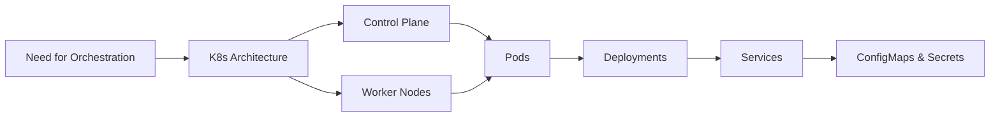

# Chapter 6: Container Orchestration with Kubernetes

> **Previous:** [Docker Compose](./06-docker-compose.md) | **Next:** [Kubernetes Basics](./07-kubernetes.md)

---

## Learning Objectives


- Define container orchestration and explain why it is necessary for large-scale applications.
- Understand the high-level architecture of Kubernetes (Control Plane vs. Worker Nodes).
- Identity core Kubernetes objects: Pods, Services, Deployments, and Namespaces.
- Deploy a multi-container application using YAML manifests.
- Explain how Kubernetes manages self-healing, scaling, and service discovery.

---


## Chapter at a Glance

| Topic | Key Insight | Practical Takeaway |
|-------|-------------|-------------------|
| Orchestration Need | Manage hundreds of containers across multiple servers | Automation eliminates manual container management |
| K8s Architecture | Control Plane (API, etcd, Scheduler) + Worker Nodes | Control plane manages; workers run workloads |
| Core Objects | Pods, Deployments, Services, ConfigMaps | Pods are ephemeral; Deployments manage lifecycle |
| Self-Healing | Desired state reconciliation ensures reliability | Controllers continuously adjust to match desired state |
| Service Discovery | Services provide stable endpoints for Pods | Use Services for load-balanced pod access |

## Chapter Roadmap



## Theory

### The Need for Orchestration

> **Pro Tip:** Use kubectl explain to learn about any Kubernetes resource's schema directly from the CLI.
While Docker is great for managing individual containers, managing hundreds of containers across multiple servers is complex. Container Orchestrators like Kubernetes (K8s) automate the deployment, scaling, and management of containerized applications.

### Kubernetes Architecture

> **Remember:** Pods are ephemeral. Never rely on a specific Pod's IP address--always use Services.
- **Control Plane:** The "brains" of the cluster. Includes the API Server (interface), etcd (store), Scheduler (placement), and Controller Manager (health).
- **Worker Nodes:** Where the applications run. Includes the Kubelet (agent), Kube-proxy (networking), and Container Runtime (e.g., Docker/containerd).

### Core K8s Objects

> **Warning:** etcd is the single source of truth for cluster state. Always back it up regularly.
1.  **Pod:** The smallest deployable unit. One or more containers sharing a network and storage.
2.  **Deployment:** A higher-level object that manages Pods. It handles rolling updates and scaling.
3.  **Service:** An abstraction that defines a logical set of Pods and a policy to access them (Load Balancing).
4.  **ConfigMap/Secret:** Decoupling configuration data from the container image.

---

## Examples

> **One-Sentence Takeaway:** Container orchestration automates deployment, scaling, and management of containerized applications.

### Example 1: Creating a Deployment
Running three replicas of a web server.
- **Step-by-step:**
  1. Create `web-deployment.yaml`:
     ```yaml
     apiVersion: apps/v1
     kind: Deployment
     metadata:
       name: nginx-deployment
     spec:
       replicas: 3
       selector:
         matchLabels:
           app: nginx
       template:
         metadata:
           labels:
             app: nginx
         spec:
           containers:
           - name: nginx
             image: nginx:1.14.2
             ports:
             - containerPort: 80
     ```
  2. Apply: `kubectl apply -f web-deployment.yaml`
- **Expected output:** Kubernetes creates 3 Pods running Nginx.
- **What the example demonstrates:** Declarative management of application state.

### Example 2: Exposing an App via a Service
Making the Nginx deployment accessible to the outside world.
- **Step-by-step:**
  1. Create `web-service.yaml`:
     ```yaml
     apiVersion: v1
     kind: Service
     metadata:
       name: nginx-service
     spec:
       selector:
         app: nginx
       ports:
         - protocol: TCP
           port: 80
           targetPort: 80
       type: LoadBalancer
     ```
  2. Apply: `kubectl apply -f web-service.yaml`
- **Expected output:** An external IP address is assigned to the service.
- **What the example demonstrates:** Service discovery and load balancing in a dynamic cluster.

---

## Summary

## Concept Comparison Table

| Concept | Description |
|---------|-------------|
| Pod | Smallest deployable unit (one or more containers) |
| Deployment | Manages Pod replicas with rolling updates |
| Service | Stable network endpoint for Pods |
| ConfigMap | Non-sensitive configuration key-value store |
| Secret | Sensitive data stored as base64-encoded values |

## Quick Reference

| Topic | Key Points |
|-------|------------|
| Control Plane | API Server, etcd, Scheduler, Controller Manager |
| Worker Node | Kubelet, kube-proxy, container runtime |
| Core Object | Pod, Deployment, Service, ConfigMap, Secret |
| Self-Healing | Controllers reconcile desired vs actual state |
| Service Types | ClusterIP, NodePort, LoadBalancer |

## Cross-Application Matrix

| Domain | Application |
|--------|-------------|
| Web | Scalable web application deployments |
| Cloud | Multi-cloud container orchestration |
| Enterprise | Microservice platform management |
| ML | Distributed model training on K8s |

## Chapter Quiz

<details><summary>Question 1: What is the role of etcd in Kubernetes?</summary>**A)** Run containers<br>**B)** Store cluster state<br>**C)** Schedule pods<br>**D)** Load balance traffic<br><br>**Answer: B)** Store cluster state</details>

<details><summary>Question 2: What is the smallest deployable unit in Kubernetes?</summary>**A)** Container<br>**B)** Pod<br>**C)** Service<br>**D)** Node<br><br>**Answer: B)** Pod</details>

<details><summary>Question 3: Why use a Deployment instead of creating Pods directly?</summary>**A)** Deployments are faster<br>**B)** Deployments manage Pod lifecycle and self-healing<br>**C)** Pods cannot run Deployments<br>**D)** Deployments use less memory<br><br>**Answer: B)** Deployments manage Pod lifecycle and self-healing</details>


## Summary

- Kubernetes (K8s) is an open-source platform for orchestrating containerized workloads.
- K8s provides a declarative way to define the "Desired State" of your infrastructure.
- The Control Plane manages the cluster, while Worker Nodes run the actual containers.
- Pods are ephemeral, but Services provide stable network identities.
- Deployments ensure that the specified number of Pods are always running (self-healing).

---

## Exercises

### Review Questions
1. What is the role of the `etcd` component in Kubernetes?
2. Why should you use a Deployment instead of creating Pods directly?
3. What is the difference between a `ClusterIP` and a `LoadBalancer` service?
4. Explain the concept of "Self-healing" in Kubernetes.

### Application Problems
1. Write a YAML manifest for a Pod that runs a Redis container.
2. Scale your Nginx deployment from 3 to 10 replicas using the `kubectl scale` command.
3. Update the image version in your deployment and observe the "Rolling Update" process.

### Challenge Problem
1. Imagine a scenario where a node in your cluster fails. Describe in detail how Kubernetes ensures that the applications running on that node remain available.
