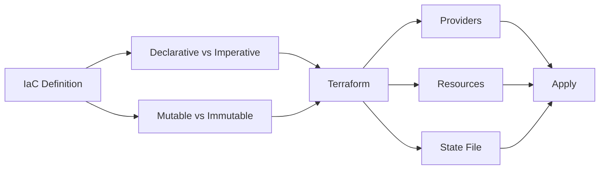

# Chapter 7: Infrastructure as Code (IaC)

> **Previous:** [Kubernetes Basics](./07-kubernetes.md) | **Next:** [Kubernetes Advanced](./08-k8s-advanced.md)

---

## Learning Objectives

- Define Infrastructure as Code (IaC) and its benefits over manual configuration.
- Distinguish between Mutable and Immutable infrastructure.
- Understand the declarative vs. imperative approach to infrastructure management.
- Use Terraform to provision resources on a cloud provider.
- Explain the importance of state files and providers in Terraform.

---


## Chapter at a Glance

| Topic | Key Insight | Practical Takeaway |
|-------|-------------|-------------------|
| IaC Definition | Managing infrastructure through version-controlled code | Eliminates manual configuration and environment drift |
| Mutable vs Immutable | Update in place vs replace with new | Immutable provides consistency and easy rollbacks |
| Declarative vs Imperative | Define desired state vs specify steps | Declarative is more predictable and idempotent |
| Terraform Core | Providers, Resources, State File | State file is critical and must be protected |

## Chapter Roadmap



## Theory


### What is Infrastructure as Code?

> **Pro Tip:** Always use 	erraform plan before 	erraform apply to preview changes and avoid surprises.
Infrastructure as Code is the management of infrastructure (networks, virtual machines, load balancers, and connection topology) in a descriptive model, using the same versioning as the DevOps team uses for source code. IaC ensures that the same environment is provisioned every time.

### Immutable vs. Mutable Infrastructure

> **Warning:** The Terraform state file contains sensitive information. Never commit it to Git.
- **Mutable Infrastructure:** Servers are updated in place. Over time, servers can diverge from their original configuration (Configuration Drift).
- **Immutable Infrastructure:** Instead of updating an existing server, a new one is provisioned from a common image, and the old one is destroyed. This ensures consistency and easier rollbacks.

### Declarative vs. Imperative

> **Remember:** Terraform is declarative--you define the end state, not the steps to reach it.
- **Imperative:** You define the steps to reach the desired state (e.g., "Step 1: Create VM, Step 2: Install App").
- **Declarative:** You define the desired end state, and the tool determines how to get there (e.g., "I want 5 VMs with this App installed"). Terraform is primarily declarative.

### Terraform Core Concepts
- **Providers:** Plugins that interact with cloud providers (AWS, Azure, GCP), SaaS providers, and other APIs.
- **Resources:** The components of your infrastructure (e.g., an EC2 instance, a VPC).
- **State File:** A local or remote file that tracks the current state of the managed infrastructure. It maps real-world resources to your configuration.

---

## Examples

> **One-Sentence Takeaway:** Infrastructure as Code manages infrastructure through version-controlled, machine-readable definition files.

### Example 1: Provisioning an AWS S3 Bucket
Defining a simple storage resource in HCL (HashiCorp Configuration Language).
- **Step-by-step:**
  1. Create `main.tf`:
     ```hcl
     provider "aws" {
       region = "us-west-2"
     }
     
     resource "aws_s3_bucket" "my_bucket" {
       bucket = "my-unique-devops-bucket-2023"
       acl    = "private"
     }
     ```
  2. Initialize: `terraform init`
  3. Plan: `terraform plan`
  4. Apply: `terraform apply`
- **Expected output:** Terraform creates the S3 bucket in the specified AWS region.
- **What the example demonstrates:** Using a provider and resource to manage cloud infrastructure.

### Example 2: Using Variables and Outputs
Making configurations reusable and extracting data.
- **Step-by-step:**
  1. Define variables in `variables.tf`:
     ```hcl
     variable "bucket_name" {
       type    = string
       default = "my-default-bucket"
     }
     ```
  2. Use in `main.tf`: `bucket = var.bucket_name`
  3. Define output in `outputs.tf`:
     ```hcl
     output "bucket_arn" {
       value = aws_s3_bucket.my_bucket.arn
     }
     ```
- **Expected output:** Terraform prompts for a bucket name or uses the default, and prints the ARN after creation.
- **What the example demonstrates:** Enhancing modularity and observability in IaC.

---

## Summary

## Concept Comparison Table

| Concept | Description |
|---------|-------------|
| IaC | Infrastructure defined as version-controlled code |
| Mutable | Servers updated in place, prone to drift |
| Immutable | Replace rather than modify, consistent state |
| Declarative | Define desired end state (Terraform) |
| Imperative | Specify exact steps to execute |

## Quick Reference

| Topic | Key Points |
|-------|------------|
| Terraform Core | Providers, Resources, State, Variables |
| Commands | init, plan, apply, destroy, fmt, validate |
| State | Maps config to real resources, critical data |
| Providers | AWS, Azure, GCP, Kubernetes, Helm, GitHub |
| Best Practice | Remote state with locking, never commit state |

## Cross-Application Matrix

| Domain | Application |
|--------|-------------|
| Web | Provision web servers and load balancers |
| Cloud | Multi-cloud infrastructure management |
| Enterprise | Compliant infrastructure with policy enforcement |
| Container | Kubernetes cluster provisioning |

## Chapter Quiz

<details><summary>Question 1: What is configuration drift?</summary>**A)** Database connection timeout<br>**B)** Servers diverging from original configuration over time<br>**C)** Network packet loss<br>**D)** Application crash<br><br>**Answer: B)** Servers diverging from original configuration over time</details>

<details><summary>Question 2: What command previews Terraform changes?</summary>**A)** terraform preview<br>**B)** terraform plan<br>**C)** terraform show<br>**D)** terraform validate<br><br>**Answer: B)** terraform plan</details>

<details><summary>Question 3: What is stored in terraform.tfstate?</summary>**A)** Application source code<br>**B)** Mapping of real resources to configuration<br>**C)** User credentials<br>**D)** Terraform binary<br><br>**Answer: B)** Mapping of real resources to configuration</details>


## Summary

- Infrastructure as Code (IaC) eliminates manual configuration and prevents environment drift.
- Immutable infrastructure improves reliability by replacing resources rather than modifying them.
- Terraform uses a declarative approach, allowing you to focus on the desired state.
- The Terraform State file is a critical component that must be protected and shared carefully (e.g., via S3 with locking).
- Providers allow Terraform to manage a vast array of services through a unified language.

---

## Exercises

### Review Questions
1. Why is Configuration Drift a problem in DevOps?
2. What is the difference between `terraform plan` and `terraform apply`?
3. What information is stored in the `terraform.tfstate` file?
4. Explain the difference between "Imperative" and "Declarative" code.

### Application Problems
1. Write a Terraform configuration to create a Virtual Private Cloud (VPC) with one public subnet.
2. How would you use Terraform to scale a cluster of virtual machines from 2 to 5?
3. You have existing resources created manually. How can you bring them under Terraform management?

### Challenge Problem
1. Describe the security risks of storing Terraform state files in a public Git repository and propose a secure alternative for a team environment.
