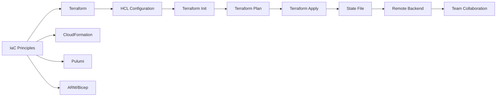
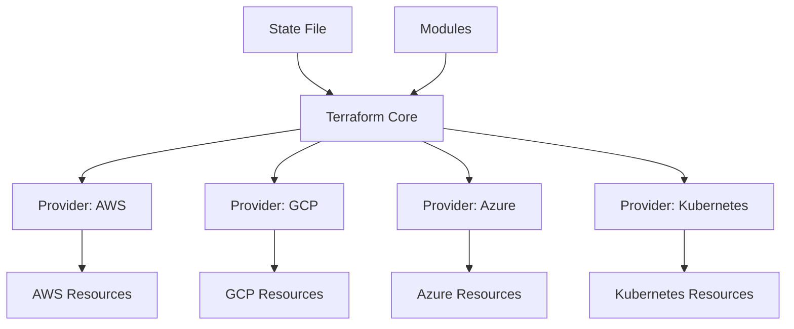

# Chapter 7: Infrastructure as Code

> **Prev:** [Orchestration](./06-orchestration.md)
> **Next:** [Kubernetes](./07-kubernetes.md)

---

## Learning Objectives

- Understand Infrastructure as Code (IaC) principles and benefits.
- Differentiate between declarative and imperative infrastructure management.
- Master Terraform for provisioning cloud resources.
- Understand configuration drift and state management.
- Implement modular, reusable infrastructure components.
- Apply IaC security and collaboration best practices.

---

## Chapter at a Glance

| Topic | Key Insight | Practical Takeaway |
|-------|-------------|-------------------|
| IaC Principles | Define infrastructure in code | Version-controlled, repeatable, auditable |
| Declarative vs Imperative | What vs How | Declarative is preferred; specifies desired state |
| Terraform | HCL-based provisioning | State file tracks real-world resources |
| State Management | Terraform state | Store state remotely, lock for collaboration |
| Modules | Reusable components | Encapsulate common patterns (VPC, cluster) |
| Drift Detection | Configuration deviation | Terraform plan detects drift from desired state |
| Secret Management | Never hardcode secrets | Use vault, SSM, or encrypted variables |
| Testing IaC | Validate before apply | Plan review, lint, policy as code (Sentinel) |

## Chapter Roadmap



## Theory

### What is Infrastructure as Code?

Infrastructure as Code (IaC) is the practice of managing and provisioning infrastructure through machine-readable definition files, rather than manual configuration or interactive tools.

**Benefits:**
- **Reproducibility:** The same configuration always produces the same infrastructure
- **Version control:** Track changes, review diffs, roll back changes
- **Automation:** No manual clicking in cloud consoles
- **Consistency:** No configuration drift across environments
- **Documentation:** Configuration files serve as living documentation
- **Speed:** Provision complete environments in minutes, not days

### Declarative vs Imperative

| Aspect | Declarative | Imperative |
|--------|-------------|------------|
| Approach | Define desired state | Define step-by-step commands |
| Example | Terraform, CloudFormation | Shell scripts, Ansible (ad-hoc) |
| Idempotent | Yes | Not automatically |
| Drift detection | Built-in | Manual |
| Learning curve | Moderate | Lower |
| Flexibility | Constrained by provider | Unlimited |

### Terraform Architecture

Terraform uses a plugin-based architecture with providers for each infrastructure platform:



**Key Terraform commands:**
```text
terraform init          # Initialize working directory, download providers
terraform plan          # Show changes without applying
terraform apply         # Create/update infrastructure
terraform destroy       # Destroy managed infrastructure
terraform fmt           # Format HCL files
terraform validate      # Check configuration validity
terraform state list    # List resources in state
terraform state rm      # Remove resource from state
```

### Terraform Configuration

```hcl
# Configure the provider
provider "aws" {
  region = var.aws_region
}

# Create a VPC
resource "aws_vpc" "main" {
  cidr_block           = "10.0.0.0/16"
  enable_dns_hostnames = true

  tags = {
    Name        = "${var.project_name}-vpc"
    Environment = var.environment
  }
}

# Define variables
variable "aws_region" {
  description = "AWS region"
  type        = string
  default     = "us-east-1"
}

variable "project_name" {
  type        = string
  description = "Project name for resource naming"
}

variable "environment" {
  type        = string
  description = "Environment (dev, staging, prod)"
}

# Output values
output "vpc_id" {
  value       = aws_vpc.main.id
  description = "The VPC ID"
}

output "vpc_cidr" {
  value       = aws_vpc.main.cidr_block
  description = "The VPC CIDR block"
}
```

### State Management

Terraform state maps configuration to real-world resources. It's critical for correctness.

**Remote state backends:**
- AWS S3 + DynamoDB (locking)
- Azure Storage Account
- Google Cloud Storage
- Terraform Cloud/Enterprise
- HashiCorp Consul

```hcl
terraform {
  backend "s3" {
    bucket         = "myorg-terraform-state"
    key            = "prod/network/terraform.tfstate"
    region         = "us-east-1"
    dynamodb_table = "terraform-state-lock"
    encrypt        = true
  }
}
```

**State locking:** Prevents concurrent modifications that could corrupt state.
**State isolation:** Separate state files per environment and per component.

### Modules

Modules are reusable, composable infrastructure components:

```hcl
# modules/vpc/main.tf
resource "aws_vpc" "this" {
  cidr_block = var.cidr_block
  tags       = var.tags
}

# modules/vpc/variables.tf
variable "cidr_block" { type = string }
variable "tags"       { type = map(string) }

# modules/vpc/outputs.tf
output "vpc_id" { value = aws_vpc.this.id }

# Using the module
module "vpc" {
  source      = "./modules/vpc"
  cidr_block  = "10.0.0.0/16"
  tags        = { Name = "myapp-vpc", Environment = "prod" }
}
```

### Configuration Drift

Drift occurs when real-world infrastructure differs from the configuration:

**Causes:** Manual changes via console, API, or CLI
**Detection:** `terraform plan` shows differences
**Remediation:** `terraform apply` restores desired state

**Import existing resources:**
```text
terraform import aws_instance.web i-1234567890abcdef0
```

### IaC Security

**Secrets in IaC:**
- Never hardcode secrets in configuration files
- Use variable files that are .gitignored
- Use secrets management: AWS SSM, HashiCorp Vault, Azure Key Vault
- Encrypt state files (always use remote backend with encryption)

```hcl
# Fetch secret from AWS Secrets Manager
data "aws_secretsmanager_secret" "db_password" {
  name = "prod/db/password"
}

data "aws_secretsmanager_secret_version" "current" {
  secret_id = data.aws_secretsmanager_secret.db_password.id
}

resource "aws_db_instance" "main" {
  password = data.aws_secretsmanager_secret_version.current.secret_string
}
```

**Policy as Code:**
```hcl
# Sentinel policy example
main = rule {
  all tfplan.resources.aws_security_group as _, sg {
    sg.applied.tags contains "Environment"
  }
}
```

### IaC Testing

**Terraform testing approaches:**

1. **`terraform validate`** — Syntax checks
2. **`terraform fmt --check`** — Formatting compliance
3. **TFLint** — Best practice linting
4. **Checkov/Terrascan** — Security policy scanning
5. **Terratest** — Integration testing with Go
6. **Plan review** — Manual review of `terraform plan` output in PRs

### CI/CD for IaC

```yaml
# GitHub Actions for Terraform
jobs:
  terraform:
    steps:
      - uses: actions/checkout@v4
      - uses: hashicorp/setup-terraform@v3
      - run: terraform fmt -check
      - run: terraform init
      - run: terraform validate
      - run: terraform plan -out=tfplan
      - run: terraform apply tfplan  # Only on merge to main
```

### Multi-Environment Strategy

```hcl
# environments/dev/main.tf
module "infrastructure" {
  source      = "../../modules/infrastructure"
  environment = "dev"
  instance_type = "t3.micro"
  min_size    = 1
  max_size    = 3
}

# environments/prod/main.tf
module "infrastructure" {
  source      = "../../modules/infrastructure"
  environment = "prod"
  instance_type = "t3.medium"
  min_size    = 3
  max_size    = 20
}
```

---

## Examples

### Example 1: Complete Terraform Configuration for ECS

```typescript
// Generating Terraform configuration programmatically
interface ECSConfig {
  projectName: string;
  environment: string;
  region: string;
  containerImage: string;
  containerPort: number;
  cpu: number;
  memory: number;
  desiredCount: number;
}

class TerraformGenerator {
  generate(config: ECSConfig): string {
    return `# Terraform configuration for ${config.projectName} (${config.environment})
# Generated by IaC Pipeline

terraform {
  required_version = ">= 1.6"
  required_providers {
    aws = {
      source  = "hashicorp/aws"
      version = "~> 5.0"
    }
  }
  backend "s3" {
    bucket         = "${config.projectName}-terraform-state"
    key            = "${config.environment}/ecs/terraform.tfstate"
    region         = "${config.region}"
    dynamodb_table = "terraform-state-lock"
    encrypt        = true
  }
}

provider "aws" {
  region = "${config.region}"
}

# ECS Cluster
resource "aws_ecs_cluster" "main" {
  name = "${config.projectName}-${config.environment}"

  setting {
    name  = "containerInsights"
    value = "enabled"
  }

  tags = {
    Name        = "${config.projectName}-cluster"
    Environment = config.environment
  }
}

# Task Definition
resource "aws_ecs_task_definition" "app" {
  family                   = "${config.projectName}-${config.environment}"
  network_mode            = "awsvpc"
  requires_compatibilities = ["FARGATE"]
  cpu                     = "${config.cpu}"
  memory                  = "${config.memory}"
  execution_role_arn      = aws_iam_role.ecs_execution.arn

  container_definitions = jsonencode([
    {
      name      = "${config.projectName}"
      image     = "${config.containerImage}"
      essential = true
      portMappings = [
        {
          containerPort = config.containerPort
          protocol      = "tcp"
        }
      ]
      environment = [
        { name = "NODE_ENV", value = config.environment }
      ]
      logConfiguration = {
        logDriver = "awslogs"
        options = {
          "awslogs-group"         = "/ecs/${config.projectName}"
          "awslogs-region"        = config.region
          "awslogs-stream-prefix" = config.environment
        }
      }
    }
  ])
}

# ECS Service
resource "aws_ecs_service" "app" {
  name            = "${config.projectName}-${config.environment}"
  cluster         = aws_ecs_cluster.main.id
  task_definition = aws_ecs_task_definition.app.arn
  desired_count   = config.desiredCount
  launch_type     = "FARGATE"

  network_configuration {
    subnets         = module.vpc.private_subnet_ids
    security_groups = [aws_security_group.ecs_tasks.id]
  }

  load_balancer {
    target_group_arn = aws_lb_target_group.app.arn
    container_name   = "${config.projectName}"
    container_port   = config.containerPort
  }
}

# Auto Scaling
resource "aws_appautoscaling_target" "ecs" {
  service_namespace  = "ecs"
  resource_id        = "service/${aws_ecs_cluster.main.name}/${aws_ecs_service.app.name}"
  scalable_dimension = "ecs:service:DesiredCount"
  min_capacity       = 1
  max_capacity       = 10
}

resource "aws_appautoscaling_policy" "cpu" {
  name               = "${config.projectName}-cpu-scaling"
  policy_type        = "TargetTrackingScaling"
  resource_id        = aws_appautoscaling_target.ecs.resource_id
  scalable_dimension = aws_appautoscaling_target.ecs.scalable_dimension
  service_namespace  = aws_appautoscaling_target.ecs.service_namespace

  target_tracking_scaling_policy_configuration {
    predefined_metric_specification {
      predefined_metric_type = "ECSServiceAverageCPUUtilization"
    }
    target_value = 70
  }
}

# Outputs
output "cluster_name" {
  value = aws_ecs_cluster.main.name
}

output "service_name" {
  value = aws_ecs_service.app.name
}`;
  }
}

const gen = new TerraformGenerator();
console.log(gen.generate({
  projectName: 'myapp',
  environment: 'production',
  region: 'us-east-1',
  containerImage: 'myapp:latest',
  containerPort: 3000,
  cpu: 512,
  memory: 1024,
  desiredCount: 3,
}));
```

### Example 2: Terraform State Explorer

```typescript
interface TerraformResource {
  address: string;
  type: string;
  name: string;
  provider: string;
  values: Record<string, any>;
}

interface TerraformState {
  version: number;
  resources: TerraformResource[];
  backend: { type: string; config: Record<string, any> };
}

class StateExplorer {
  constructor(private state: TerraformState) {}

  findResources(type: string): TerraformResource[] {
    return this.state.resources.filter(r => r.type === type);
  }

  findResource(address: string): TerraformResource | undefined {
    return this.state.resources.find(r => r.address === address);
  }

  getProviderBreakdown(): Record<string, number> {
    const breakdown: Record<string, number> = {};
    for (const r of this.state.resources) {
      breakdown[r.provider] = (breakdown[r.provider] || 0) + 1;
    }
    return breakdown;
  }

  getTypeBreakdown(): Record<string, number> {
    const breakdown: Record<string, number> = {};
    for (const r of this.state.resources) {
      breakdown[r.type] = (breakdown[r.type] || 0) + 1;
    }
    return breakdown;
  }

  generateReport(): string {
    const providerBreakdown = this.getProviderBreakdown();
    const typeBreakdown = this.getTypeBreakdown();
    const totalResources = this.state.resources.length;

    let report = '# Terraform State Report\n\n';
    report += `## Summary\n\n`;
    report += `- **Total resources:** ${totalResources}\n`;
    report += `- **State version:** ${this.state.version}\n`;
    report += `- **Backend:** ${this.state.backend.type}\n\n`;

    report += `## Provider Breakdown\n\n`;
    for (const [provider, count] of Object.entries(providerBreakdown)) {
      report += `- ${provider}: ${count} resources\n`;
    }

    report += `\n## Resource Type Breakdown\n\n`;
    for (const [type, count] of Object.entries(typeBreakdown).sort((a, b) => b[1] - a[1])) {
      report += `- ${type}: ${count}\n`;
    }

    return report;
  }
}

// Example state
const state: TerraformState = {
  version: 4,
  resources: [
    { address: 'aws_vpc.main', type: 'aws_vpc', name: 'main', provider: 'aws', values: { cidr_block: '10.0.0.0/16' } },
    { address: 'aws_subnet.public', type: 'aws_subnet', name: 'public', provider: 'aws', values: { cidr_block: '10.0.1.0/24' } },
    { address: 'aws_security_group.web', type: 'aws_security_group', name: 'web', provider: 'aws', values: {} },
  ],
  backend: { type: 's3', config: { bucket: 'tf-state', key: 'prod/network.tfstate' } },
};

const explorer = new StateExplorer(state);
console.log(explorer.generateReport());
```

---

### Resource Dependency Graph Builder

Understanding resource dependencies is critical for safe Terraform changes. The following implementation builds a dependency graph from Terraform state and detects potential impact zones before modifications.

```typescript
interface ResourceNode {
  address: string;
  type: string;
  dependencies: string[];
}

interface DependencyGraph {
  nodes: Map<string, ResourceNode>;
  adjacencyList: Map<string, string[]>;
}

class DependencyGraphBuilder {
  buildGraph(resources: ResourceNode[]): DependencyGraph {
    const nodes = new Map<string, ResourceNode>();
    const adjacencyList = new Map<string, string[]>();

    for (const r of resources) {
      nodes.set(r.address, r);
      adjacencyList.set(r.address, r.dependencies);
    }

    return { nodes, adjacencyList };
  }

  findImpactZone(graph: DependencyGraph, target: string): string[] {
    const visited = new Set<string>();
    const queue = [target];
    visited.add(target);

    while (queue.length > 0) {
      const current = queue.shift()!;
      for (const [addr, deps] of graph.adjacencyList) {
        if (!visited.has(addr) && deps.includes(current)) {
          visited.add(addr);
          queue.push(addr);
        }
      }
    }

    return Array.from(visited);
  }

  detectCycles(graph: DependencyGraph): string[][] {
    const cycles: string[][] = [];
    const visited = new Set<string>();
    const recStack = new Set<string>();

    const dfs = (node: string, path: string[]) => {
      visited.add(node);
      recStack.add(node);

      for (const dep of graph.adjacencyList.get(node) || []) {
        if (!visited.has(dep)) dfs(dep, [...path, dep]);
        else if (recStack.has(dep)) cycles.push([...path.slice(path.indexOf(dep)), dep]);
      }

      recStack.delete(node);
    };

    for (const addr of graph.adjacencyList.keys()) {
      if (!visited.has(addr)) dfs(addr, [addr]);
    }

    return cycles;
  }
}

// Example: VPC, subnets, security groups, and EC2 instances
const resources: ResourceNode[] = [
  { address: 'aws_vpc.main', type: 'aws_vpc', dependencies: [] },
  { address: 'aws_subnet.public', type: 'aws_subnet', dependencies: ['aws_vpc.main'] },
  { address: 'aws_security_group.web', type: 'aws_security_group', dependencies: ['aws_vpc.main'] },
  { address: 'aws_instance.web', type: 'aws_instance', dependencies: ['aws_subnet.public', 'aws_security_group.web'] },
  { address: 'aws_eip.web', type: 'aws_eip', dependencies: ['aws_instance.web'] },
];

const builder = new DependencyGraphBuilder();
const graph = builder.buildGraph(resources);
console.log('Impact zone for aws_vpc.main:', builder.findImpactZone(graph, 'aws_vpc.main'));
console.log('Cycles detected:', builder.detectCycles(graph));
```

**What this demonstrates:** Dependency graph analysis enables safe Terraform refactoring by identifying all resources affected by a change and preventing circular dependencies.

---

### State Drift Remediation Scheduler

Configuration drift is inevitable in production environments. The following tool detects drift between desired and actual states, then schedules and executes remediation actions.

```typescript
interface DesiredState {
  resource: string;
  properties: Record<string, string>;
}

interface ActualState {
  resource: string;
  properties: Record<string, string>;
  lastChecked: Date;
}

interface DriftItem {
  resource: string;
  property: string;
  expected: string;
  actual: string;
  severity: 'low' | 'medium' | 'high';
}

class DriftRemediationScheduler {
  detect(expected: DesiredState[], actual: ActualState[]): DriftItem[] {
    const drifts: DriftItem[] = [];
    for (const exp of expected) {
      const act = actual.find(a => a.resource === exp.resource);
      if (!act) {
        drifts.push({ resource: exp.resource, property: 'exists', expected: 'true', actual: 'false', severity: 'high' });
        continue;
      }
      for (const [key, val] of Object.entries(exp.properties)) {
        if (act.properties[key] !== val) {
          const sev = key === 'cidr_block' || key === 'instance_type' ? 'high' : key === 'tags' ? 'low' : 'medium';
          drifts.push({ resource: exp.resource, property: key, expected: val, actual: act.properties[key] || '', severity: sev });
        }
      }
    }
    return drifts;
  }

  prioritize(drifts: DriftItem[]): DriftItem[] {
    const order = { high: 0, medium: 1, low: 2 };
    return [...drifts].sort((a, b) => order[a.severity] - order[b.severity]);
  }

  generatePlan(drifts: DriftItem[]): string {
    const grouped = this.prioritize(drifts);
    return `## Drift Remediation Plan\n${grouped.map(d => `| ${d.resource} | ${d.property} | ${d.expected} | ${d.actual} | ${d.severity} |`).join('\n')}`;
  }
}

const remediator = new DriftRemediationScheduler();
const drifts = remediator.detect(
  [{ resource: 'aws_vpc.main', properties: { cidr_block: '10.0.0.0/16', enable_dns_support: 'true' } }],
  [{ resource: 'aws_vpc.main', properties: { cidr_block: '10.0.0.0/24', enable_dns_support: 'true' }, lastChecked: new Date() }]
);
console.log(remediator.generatePlan(drifts));
```

**What this demonstrates:** Automated drift detection and remediation scheduling maintains infrastructure alignment with desired configurations, preventing configuration drift accumulation.

---

## Practical Takeaways

1. **Always use remote state with locking.** Never share local state files across a team.
2. **Separate state per environment and component.** `dev/network`, `prod/network`, `dev/app`, `prod/app`.
3. **Review `terraform plan` output before every apply.** It shows exactly what will change.
4. **Use modules for reusable patterns.** VPC, cluster, database as composable modules.
5. **Never hardcode secrets.** Use a secrets manager or encrypted variables.
6. **Run IaC in CI/CD.** Plan in PRs, apply on merge to main.

---

## Chapter Quiz

<details><summary>Question 1: What is the primary benefit of declarative IaC over imperative?</summary>**A)** It is faster to execute<br>**B)** It automatically detects and corrects drift from desired state<br>**C)** It requires less code<br>**D)** It supports more providers<br><br>**Answer: B)** It automatically detects and corrects drift from desired state</details>

<details><summary>Question 2: Why should Terraform state be stored remotely?</summary>**A)** It's faster<br>**B)** For team collaboration and state locking<br>**C)** Remote state is automatically encrypted<br>**D)** It reduces costs<br><br>**Answer: B)** For team collaboration and state locking</details>

<details><summary>Question 3: What does `terraform plan` do?</summary>**A)** Applies changes to infrastructure<br>**B)** Shows what changes will be made without applying them<br>**C)** Destroys all resources<br>**D)** Initializes the working directory<br><br>**Answer: B)** Shows what changes will be made without applying them</details>

<details><summary>Question 4: What is configuration drift?</summary>**A)** Planned infrastructure changes<br>**B)** Difference between desired configuration and actual infrastructure<br>**C)** Terraform version mismatch<br>**D)** Provider API changes<br><br>**Answer: B)** Difference between desired configuration and actual infrastructure</details>

<details><summary>Question 5: What is the purpose of Terraform modules?</summary>**A)** Speed up execution<br>**B)** Create reusable, composable infrastructure components<br>**C)** Reduce the size of state files<br>**D)** Add new features to providers<br><br>**Answer: B)** Create reusable, composable infrastructure components</details>

---

## Summary

- Infrastructure as Code enables reproducible, version-controlled, automated infrastructure management.
- Declarative IaC (Terraform, CloudFormation) specifies desired state and automatically handles drift.
- Terraform uses HCL to define providers, resources, variables, and outputs with state tracking.
- Remote state backends (S3 + DynamoDB) enable team collaboration with state locking.
- Modules encapsulate reusable infrastructure patterns across environments.
- Configuration drift detection via `terraform plan` identifies manual changes.
- Secrets must never be hardcoded; use vault solutions and encrypted state.
- IaC benefits from CI/CD integration with plan reviews and policy-as-code scanning.

---

## Exercises

### Review Questions
1. What is the difference between declarative and imperative IaC?
2. Why is Terraform state important and how should it be managed?
3. How do Terraform modules promote reusability?
4. What is configuration drift and how is it detected?
5. How should secrets be handled in Terraform configurations?

### Application Problems
1. Write a Terraform module that creates a VPC with public and private subnets.
2. Configure a remote backend with S3 and DynamoDB for state locking.
3. Create a Terraform configuration that deploys an ECS Fargate service.
4. Implement a CI/CD pipeline that runs `terraform plan` in PRs and `terraform apply` on merge.

### Challenge Problem
1. Design a complete IaC strategy for a multi-service infrastructure with: modular Terraform components (VPC, ECS cluster, RDS database, Redis, ALB), separate state files per environment and per component, remote state with locking and encryption, secrets management via AWS SSM Parameter Store, policy-as-code scanning (Checkov) in CI/CD pipeline, multi-environment configuration (dev/staging/prod) with variable overrides, automated drift detection and notification, and a state backup and recovery procedure.
