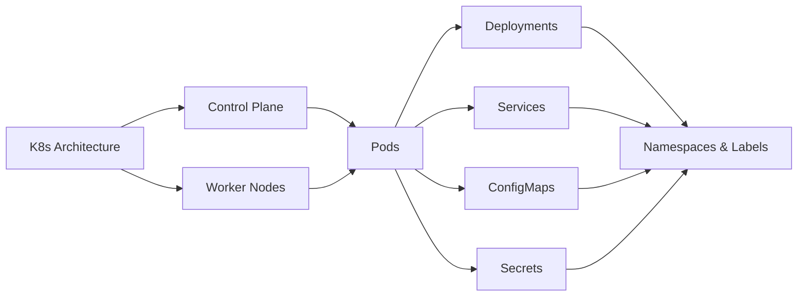

# Chapter 7: Kubernetes Basics

> **Previous:** [Container Orchestration with Kubernetes](./06-orchestration.md) | **Next:** [Infrastructure as Code (IaC)](./07-infrastructure-as-code.md)

## Learning Objectives


By the end of this chapter, students will be able to:

1. Describe Kubernetes architecture including control plane components and node components
2. Deploy and manage Pods using Deployments with different update strategies
3. Configure Services of each type for network access to applications
4. Manage configuration and sensitive data using ConfigMaps and Secrets
5. Use Namespaces, labels, and selectors for resource organization
6. Apply annotations for metadata and tool integration


## Chapter at a Glance

| Topic | Key Insight | Practical Takeaway |
|-------|-------------|-------------------|
| K8s Architecture | Control Plane and Worker Node components | API Server is the front door for all cluster operations |
| Pods | One or more containers sharing network and storage | Use multi-container Pods for tightly coupled processes |
| Deployments | Declarative Pod management with rolling updates | Always use Deployments for stateless applications |
| Services | ClusterIP, NodePort, LoadBalancer, ExternalName | Match Service type to access requirements |
| ConfigMaps & Secrets | Configuration separation from images | Secrets are base64 encoded, not truly secure by default |
| Namespaces & Labels | Virtual cluster partitions and metadata | Labels enable flexible resource selection |

## Chapter Roadmap



## Theory

### 7.1 Kubernetes Architecture

> **Pro Tip:** Always set both requests and limits for Pod resources. CPU and memory guarantees prevent resource starvation.

Kubernetes (K8s) is an open-source container orchestration platform that automates deployment, scaling, and management of containerized applications. A Kubernetes cluster consists of control plane nodes and worker nodes.

**Control Plane Components**:
- **kube-apiserver** — The front door to the cluster. All administrative requests and component communication pass through the API server. It validates and processes RESTful requests, updating the cluster state in etcd.
- **etcd** — Distributed key-value store that holds the complete cluster state. Consistency is maintained through the Raft consensus algorithm. etcd is the source of truth for all Kubernetes objects.
- **kube-scheduler** — Watches for newly created Pods with no assigned node and selects a suitable node to run them. Scheduling decisions consider resource requirements, constraints, affinity rules, data locality, and workload priorities.
- **kube-controller-manager** — Runs controller processes that regulate cluster state. Each controller watches the API server for desired state and takes action to move current state toward desired state. Core controllers include the Node Controller, Replication Controller, Deployment Controller, and ServiceAccount Controller.
- **cloud-controller-manager** — Interfaces with cloud provider APIs to manage load balancers, nodes, and routes.

**Worker Node Components**:
- **kubelet** — The primary node agent. It ensures containers specified in PodSpecs are running and healthy. Kubelet registers nodes with the API server and reports node status.
- **kube-proxy** — Network proxy that maintains network rules on nodes. It implements service abstraction by routing traffic to the appropriate Pods.
- **Container Runtime** — The software that runs containers (containerd, CRI-O, Docker Engine via cri-dockerd). Kubernetes uses the Container Runtime Interface (CRI) for runtime abstraction.

### 7.2 Pods

> **Remember:** Services select Pods by labels. Ensure your Pod labels match the Service selector exactly.

A Pod is the smallest deployable unit in Kubernetes. It represents one or more containers that share network namespace, storage volumes, and lifecycle. Containers in the same Pod communicate via localhost and share the same IP address.

```yaml
apiVersion: v1
kind: Pod
metadata:
  name: webapp
  labels:
    app: webapp
    tier: frontend
spec:
  containers:
    - name: nginx
      image: nginx:1.25
      ports:
        - containerPort: 80
      resources:
        requests:
          memory: "64Mi"
          cpu: "250m"
        limits:
          memory: "128Mi"
          cpu: "500m"
```

Pods are ephemeral. Direct Pod creation is rare; higher-level controllers (Deployments, StatefulSets) manage Pod lifecycle.

### 7.3 Deployments

> **Warning:** Secrets in etcd are only base64 encoded. Enable encryption at rest for production clusters.

A Deployment provides declarative updates for Pods and ReplicaSets. It manages rollout, rollback, scaling, and self-healing.

**Update Strategies**:
- **RollingUpdate** (default) — Replaces Pods incrementally. Parameters: `maxSurge` (excess Pods during update, default 25%), `maxUnavailable` (maximum unavailable Pods, default 25%).
- **Recreate** — Terminates all existing Pods before creating new ones. Used when application cannot tolerate multiple versions running simultaneously.

```yaml
apiVersion: apps/v1
kind: Deployment
metadata:
  name: api
spec:
  replicas: 3
  strategy:
    type: RollingUpdate
    rollingUpdate:
      maxSurge: 1
      maxUnavailable: 0
  selector:
    matchLabels:
      app: api
  template:
    metadata:
      labels:
        app: api
    spec:
      containers:
        - name: api
          image: myapp:v2.0.0
          readinessProbe:
            httpGet:
              path: /ready
              port: 8080
            initialDelaySeconds: 5
          livenessProbe:
            httpGet:
              path: /health
              port: 8080
            periodSeconds: 10
```

### 7.4 Services

A Service provides stable networking for a set of Pods with a consistent IP address and DNS name. It enables service discovery and load balancing.

**Service Types**:
- **ClusterIP** (default) — Exposes the Service on an internal cluster IP. Accessible only within the cluster.
- **NodePort** — Opens a specific port on every node's IP. Traffic on NodePort:Port is forwarded to the Service.
- **LoadBalancer** — Provisions an external load balancer (cloud provider) that routes traffic to the Service.
- **ExternalName** — Returns a CNAME record for an external DNS name.

```yaml
apiVersion: v1
kind: Service
metadata:
  name: api
spec:
  type: ClusterIP
  selector:
    app: api
  ports:
    - port: 80
      targetPort: 8080
      protocol: TCP
```

### 7.5 ConfigMap and Secret

ConfigMaps store non-sensitive configuration as key-value pairs. Secrets store sensitive data (base64-encoded).

```yaml
apiVersion: v1
kind: ConfigMap
metadata:
  name: app-config
data:
  NODE_ENV: production
  LOG_LEVEL: info
  config.yaml: |
    database:
      pool: 10
---
apiVersion: v1
kind: Secret
metadata:
  name: app-secrets
type: Opaque
data:
  DB_PASSWORD: cGFzc3dvcmQ=
```

Pods consume ConfigMaps and Secrets as environment variables or mounted volumes. Secrets are stored in etcd and can be encrypted at rest. For production, external secret stores (Vault, AWS Secrets Manager) integrated via CSI drivers or external-secrets operator provide better security.

### 7.6 Namespaces

Namespaces partition a cluster into virtual sub-clusters. They provide:
- Resource isolation and access control
- DNS naming scopes (`service.namespace.svc.cluster.local`)
- Resource quota boundaries
- Environment separation (dev, staging, production) within a single cluster

```bash
kubectl create namespace staging
kubectl config set-context staging --namespace=staging
```

Resource quotas and LimitRange objects enforce resource consumption limits per namespace.

### 7.7 Labels and Selectors

Labels are key-value metadata attached to objects. Selectors filter objects by labels. They form the foundation of Kubernetes object relationships.

```yaml
metadata:
  labels:
    app: api
    version: v2
    environment: staging
    tier: backend
```

Selectors in Services, Deployments, and other controllers use label matching to identify target Pods. Three selector types exist: equality-based (`=`, `!=`), set-based (`in`, `notin`, `exists`), and matchLabels/matchExpressions.

### 7.8 Annotations

Annotations attach arbitrary metadata to objects. Unlike labels, annotations are not queryable for selection. They store tooling metadata, build information, contact details, or configuration hints for controllers.

```yaml
metadata:
  annotations:
    deployment.kubernetes.io/revision: "1"
    sidecar.istio.io/inject: "true"
    prometheus.io/scrape: "true"
    prometheus.io/port: "8080"
```

## Summary

## Concept Comparison Table

| Concept | Description |
|---------|-------------|
| Pod | One or more containers sharing network and storage |
| Deployment | Declarative Pod management with updates |
| Service | Stable endpoint with load balancing |
| ConfigMap | Non-sensitive config via key-value pairs |
| Secret | Base64-encoded sensitive data in etcd |

## Quick Reference

| Topic | Key Points |
|-------|------------|
| Control Plane | API Server, etcd, Scheduler, Controller Manager |
| Worker | Kubelet, kube-proxy, container runtime |
| Services | ClusterIP(internal), NodePort, LoadBalancer(external) |
| ConfigMap | Environment variables or mounted files |
| Labels | Key-value metadata for resource selection |

## Cross-Application Matrix

| Domain | Application |
|--------|-------------|
| Web | Deploy and scale web applications |
| Cloud | Multi-cloud workload portability |
| Enterprise | Microservice platform with RBAC |
| ML | GPU-accelerated training jobs |

## Chapter Quiz

<details><summary>Question 1: What does etcd use for consistency?</summary>**A)** Paxos<br>**B)** Raft consensus algorithm<br>**C)** Two-phase commit<br>**D)** Quorum-based voting<br><br>**Answer: B)** Raft consensus algorithm</details>

<details><summary>Question 2: Which Service type exposes pods via every node's IP?</summary>**A)** ClusterIP<br>**B)** NodePort<br>**C)** LoadBalancer<br>**D)** ExternalName<br><br>**Answer: B)** NodePort</details>

<details><summary>Question 3: What is a label selector used for?</summary>**A)** Authentication<br>**B)** Identifying and grouping Kubernetes objects<br>**C)** Load balancing configuration<br>**D)** Logging configuration<br><br>**Answer: B)** Identifying and grouping Kubernetes objects</details>


## Summary

Kubernetes provides a comprehensive platform for container orchestration. The control plane manages cluster state through the API server, etcd, scheduler, and controllers. Pods are the atomic deployment unit. Deployments manage Pod lifecycle with rolling updates. Services provide stable networking with load balancing. ConfigMaps and Secrets manage configuration. Namespaces partition the cluster. Labels enable flexible object selection. This foundation supports advanced patterns covered in the next chapter.

## Exercises

### Review Questions

1. What is the role of etcd in a Kubernetes cluster? What consistency protocol does it use?
2. How does a Deployment controller know when a rolling update is complete?
3. Compare ClusterIP, NodePort, and LoadBalancer Service types. When is each appropriate?
4. Why are Secrets considered only marginally secure in their default form?
5. How do labels differ from annotations in purpose and usage?

### Application Problems

1. Deploy a two-tier application (Node.js API + PostgreSQL) using Deployments and Services. Configure environment variables from ConfigMap (non-sensitive) and Secret (database password). Expose the API via a LoadBalancer Service.
2. Create a rolling update deployment with 5 replicas. Update the image and observe the rollout status. Perform a rollback using `kubectl rollout undo`. Verify Pod versions before and after.
3. Configure readiness and liveness probes for a web application. Induce a failure to observe how Kubernetes handles an unhealthy container.

### Challenge Problem

Design a multi-tenant Kubernetes cluster for an organization with three teams (platform, data, and applications) sharing a single cluster. Each team requires resource quotas, network isolation, and namespace separation. The platform team manages system-level components (ingress, monitoring). Define the namespace structure, RBAC bindings, resource quotas per namespace, network policies for inter-namespace access, and label conventions. The design must support 15 microservices across the application team and 10 data processing jobs across the data team. Specification should include applicable YAML configurations.
