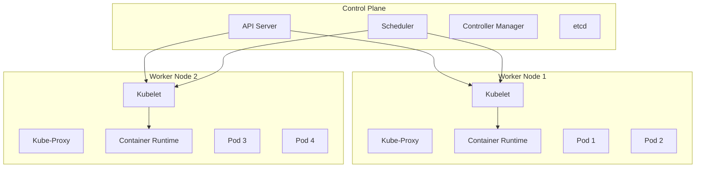

# Chapter 7: Kubernetes

> **Prev:** [Infrastructure as Code](./07-infrastructure-as-code.md)
> **Next:** [Configuration Management](./08-configuration-management.md)

---

## Learning Objectives

- Understand Kubernetes architecture (control plane, nodes, pods).
- Master Kubernetes primitives: Pods, Deployments, Services, ConfigMaps, Secrets.
- Configure networking, storage, and ingress for applications.
- Implement health checks, resource management, and autoscaling.
- Manage configuration and secrets securely.
- Deploy and manage applications using kubectl.

---

## Chapter at a Glance

| Topic | Key Insight | Practical Takeaway |
|-------|-------------|-------------------|
| Architecture | Control plane + worker nodes | Master manages state; nodes run workloads |
| Pods | Smallest deployable unit | One or more containers sharing network/storage |
| Deployments | Declarative pod management | Drives rolling updates and self-healing |
| Services | Stable network endpoint | Load balances across pods |
| ConfigMaps | Configuration decoupling | Inject config without rebuilding images |
| Secrets | Sensitive data storage | Base64 encoded, encrypted at rest |
| Ingress | External HTTP routing | Path and host-based routing with TLS |
| Storage | Persistent volumes | PVC abstracts storage provisioning |

## Chapter Roadmap



## Theory

### Kubernetes Architecture

**Control Plane (Master):**
- **API Server (kube-apiserver):** Front-end to the control plane. Exposes the Kubernetes API. All communication (kubectl, SDKs, internal components) goes through the API server.
- **etcd:** Distributed key-value store. The single source of truth for cluster state. Stores all configuration, state, and metadata.
- **Scheduler (kube-scheduler):** Watches for unscheduled pods and assigns them to nodes based on resource requirements, constraints, affinity rules, and data locality.
- **Controller Manager (kube-controller-manager):** Runs controller processes (Node Controller, Replication Controller, Endpoints Controller, Service Account Controller). Each controller watches the API server for desired state and drives current state towards it.

**Worker Nodes:**
- **Kubelet:** Agent running on each node. Ensures containers are running in a pod (health, liveness).
- **Kube-Proxy:** Network proxy. Maintains network rules for service traffic routing (iptables, IPVS).
- **Container Runtime:** Runs containers (containerd, CRI-O, Docker).

### Pods

A pod is the smallest and simplest Kubernetes object. It represents a single instance of a running process.

```yaml
apiVersion: v1
kind: Pod
metadata:
  name: myapp-pod
  labels:
    app: myapp
    tier: frontend
spec:
  containers:
    - name: myapp-container
      image: nginx:1.25
      ports:
        - containerPort: 80
      resources:
        requests:
          cpu: "250m"
          memory: "128Mi"
        limits:
          cpu: "500m"
          memory: "256Mi"
```

**Multi-container pods (sidecar pattern):**
```yaml
spec:
  containers:
    - name: app
      image: myapp:latest
    - name: sidecar
      image: fluentd:latest  # Log forwarding
```

### Deployments

A Deployment provides declarative updates for Pods and ReplicaSets.

```yaml
apiVersion: apps/v1
kind: Deployment
metadata:
  name: myapp-deployment
spec:
  replicas: 3
  selector:
    matchLabels:
      app: myapp
  strategy:
    type: RollingUpdate
    rollingUpdate:
      maxSurge: 1
      maxUnavailable: 0
  template:
    metadata:
      labels:
        app: myapp
    spec:
      containers:
        - name: myapp
          image: myapp:1.0.0
          ports:
            - containerPort: 3000
          readinessProbe:
            httpGet:
              path: /health
              port: 3000
            initialDelaySeconds: 5
            periodSeconds: 10
          livenessProbe:
            httpGet:
              path: /health
              port: 3000
            initialDelaySeconds: 15
            periodSeconds: 20
```

### Services

A Service exposes a set of pods as a network service:

```yaml
apiVersion: v1
kind: Service
metadata:
  name: myapp-service
spec:
  selector:
    app: myapp
  ports:
    - protocol: TCP
      port: 80
      targetPort: 3000
  type: ClusterIP  # Default: internal cluster access
```

**Service types:**
- **ClusterIP:** Internal IP (default). Reachable only within the cluster.
- **NodePort:** Exposes on each node's IP at a static port (30000-32767).
- **LoadBalancer:** Creates an external cloud load balancer.
- **ExternalName:** Returns a CNAME record.

### Ingress

Ingress manages external HTTP/HTTPS access to services:

```yaml
apiVersion: networking.k8s.io/v1
kind: Ingress
metadata:
  name: myapp-ingress
  annotations:
    nginx.ingress.kubernetes.io/rewrite-target: /
spec:
  ingressClassName: nginx
  tls:
    - hosts:
        - myapp.example.com
      secretName: myapp-tls
  rules:
    - host: myapp.example.com
      http:
        paths:
          - path: /api
            pathType: Prefix
            backend:
              service:
                name: api-service
                port:
                  number: 80
          - path: /
            pathType: Prefix
            backend:
              service:
                name: web-service
                port:
                  number: 80
```

### ConfigMaps and Secrets

**ConfigMap:** Non-confidential configuration data:

```yaml
apiVersion: v1
kind: ConfigMap
metadata:
  name: app-config
data:
  NODE_ENV: production
  API_URL: http://api.default.svc.cluster.local
  app.yaml: |
    key: value
    nested:
      setting: true
```

**Secret:** Confidential data (base64 encoded, encrypted at rest):

```yaml
apiVersion: v1
kind: Secret
metadata:
  name: app-secrets
type: Opaque
data:
  DB_PASSWORD: cGFzc3dvcmQxMjM=  # base64 of "password123"
```

### Storage

**PersistentVolume (PV):** Cluster storage resource provisioned by an administrator.
**PersistentVolumeClaim (PVC):** Request for storage by a user.

```yaml
apiVersion: v1
kind: PersistentVolumeClaim
metadata:
  name: data-pvc
spec:
  accessModes:
    - ReadWriteOnce
  resources:
    requests:
      storage: 10Gi
  storageClassName: standard

# Pod using the PVC
spec:
  containers:
    - name: app
      image: myapp
      volumeMounts:
        - name: data
          mountPath: /app/data
  volumes:
    - name: data
      persistentVolumeClaim:
        claimName: data-pvc
```

### Autoscaling

**Horizontal Pod Autoscaler (HPA):**
```yaml
apiVersion: autoscaling/v2
kind: HorizontalPodAutoscaler
metadata:
  name: myapp-hpa
spec:
  scaleTargetRef:
    apiVersion: apps/v1
    kind: Deployment
    name: myapp
  minReplicas: 3
  maxReplicas: 20
  metrics:
    - type: Resource
      resource:
        name: cpu
        target:
          type: Utilization
          averageUtilization: 70
```

### kubectl Cheatsheet

```text
kubectl get pods                          # List pods
kubectl get deployments                   # List deployments
kubectl get services                      # List services
kubectl get nodes                         # List nodes
kubectl logs -f pod-name                  # Follow pod logs
kubectl exec -it pod-name -- sh           # Shell into pod
kubectl apply -f deployment.yaml          # Create/update resource
kubectl delete -f deployment.yaml         # Delete resource
kubectl describe pod pod-name             # Detailed pod info
kubectl port-forward pod-name 8080:80     # Forward port to local
kubectl top pods                          # Pod resource usage
kubectl get events --sort-by='.lastTimestamp'  # Recent events
kubectl rollout status deployment/myapp   # Check rollout status
kubectl rollout undo deployment/myapp     # Rollback deployment
```

---

## Examples

### Example 1: Complete Application Deployment

```typescript
interface K8sResource {
  apiVersion: string;
  kind: string;
  metadata: { name: string; labels?: Record<string, string> };
  spec: any;
}

class KubernetesDeploymentGenerator {
  generate(namespace: string, app: string, image: string, replicas: number): K8sResource[] {
    return [
      this.generateNamespace(namespace),
      this.generateDeployment(app, namespace, image, replicas),
      this.generateService(app, namespace),
      this.generateConfigMap(app, namespace),
      this.generateHPA(app, namespace),
    ];
  }

  private generateNamespace(name: string): K8sResource {
    return {
      apiVersion: 'v1',
      kind: 'Namespace',
      metadata: { name, labels: { environment: name } },
      spec: {},
    };
  }

  private generateDeployment(app: string, ns: string, image: string, replicas: number): K8sResource {
    return {
      apiVersion: 'apps/v1',
      kind: 'Deployment',
      metadata: { name: app, namespace: ns, labels: { app } },
      spec: {
        replicas,
        selector: { matchLabels: { app } },
        strategy: {
          type: 'RollingUpdate',
          rollingUpdate: { maxSurge: 1, maxUnavailable: 0 },
        },
        template: {
          metadata: { labels: { app } },
          spec: {
            containers: [{
              name: app,
              image,
              ports: [{ containerPort: 3000 }],
              resources: {
                requests: { cpu: '250m', memory: '256Mi' },
                limits: { cpu: '500m', memory: '512Mi' },
              },
              envFrom: [
                { configMapRef: { name: `${app}-config` } },
              ],
              readinessProbe: {
                httpGet: { path: '/health', port: 3000 },
                initialDelaySeconds: 5,
                periodSeconds: 10,
              },
              livenessProbe: {
                httpGet: { path: '/health', port: 3000 },
                initialDelaySeconds: 15,
                periodSeconds: 20,
              },
            }],
          },
        },
      },
    };
  }

  private generateService(app: string, ns: string): K8sResource {
    return {
      apiVersion: 'v1',
      kind: 'Service',
      metadata: { name: app, namespace: ns },
      spec: {
        selector: { app },
        ports: [{ protocol: 'TCP', port: 80, targetPort: 3000 }],
        type: 'ClusterIP',
      },
    };
  }

  private generateConfigMap(app: string, ns: string): K8sResource {
    return {
      apiVersion: 'v1',
      kind: 'ConfigMap',
      metadata: { name: `${app}-config`, namespace: ns },
      data: {
        NODE_ENV: ns,
        LOG_LEVEL: ns === 'production' ? 'info' : 'debug',
      },
    };
  }

  private generateHPA(app: string, ns: string): K8sResource {
    return {
      apiVersion: 'autoscaling/v2',
      kind: 'HorizontalPodAutoscaler',
      metadata: { name: app, namespace: ns },
      spec: {
        scaleTargetRef: { apiVersion: 'apps/v1', kind: 'Deployment', name: app },
        minReplicas: 3,
        maxReplicas: 20,
        metrics: [{
          type: 'Resource',
          resource: { name: 'cpu', target: { type: 'Utilization', averageUtilization: 70 } },
        }],
      },
    };
  }

  toYAML(resources: K8sResource[]): string {
    return resources.map(r => JSON.stringify(r, null, 2)).join('\n---\n');
  }
}

const gen = new KubernetesDeploymentGenerator();
const resources = gen.generate('production', 'api-service', 'myapp:1.0.0', 5);
console.log(gen.toYAML(resources));
```

### Example 2: Kubernetes Resource Checker

```typescript
interface ResourceStatus {
  name: string;
  kind: string;
  namespace: string;
  status: string;
  ready: string;
  restarts: number;
  age: string;
}

class ClusterHealthChecker {
  private resources: ResourceStatus[] = [];

  addResource(resource: ResourceStatus): void {
    this.resources.push(resource);
  }

  checkHealth(): { healthy: boolean; issues: string[] } {
    const issues: string[] = [];

    for (const r of this.resources) {
      if (r.status === 'CrashLoopBackOff') {
        issues.push(`? ${r.kind}/${r.name} in CrashLoopBackOff (restarted ${r.restarts}x)`);
      }
      if (r.status === 'Pending') {
        issues.push(`??  ${r.kind}/${r.name} is pending`);
      }
      if (r.status === 'ImagePullBackOff') {
        issues.push(`? ${r.kind}/${r.name} ImagePullBackOff`);
      }
      if (r.restarts > 5) {
        issues.push(`??  ${r.kind}/${r.name} has restarted ${r.restarts} times`);
      }
    }

    return { healthy: issues.length === 0, issues };
  }

  generateSummary(): string {
    const { healthy, issues } = this.checkHealth();

    const byNamespace = this.resources.reduce((acc, r) => {
      acc[r.namespace] = (acc[r.namespace] || 0) + 1;
      return acc;
    }, {} as Record<string, number>);

    let report = '# Kubernetes Cluster Summary\n\n';
    report += `## Overview\n\n`;
    report += `- **Status:** ${healthy ? '? Healthy' : '? Issues detected'}\n`;
    report += `- **Total resources:** ${this.resources.length}\n`;
    report += `- **Namespaces:** ${Object.keys(byNamespace).length}\n\n`;

    report += `## Resources by Namespace\n\n`;
    for (const [ns, count] of Object.entries(byNamespace)) {
      report += `- ${ns}: ${count} resources\n`;
    }

    if (issues.length > 0) {
      report += `\n## Issues\n\n`;
      issues.forEach(i => report += `${i}\n`);
    }

    return report;
  }
}

const checker = new ClusterHealthChecker();
checker.addResource({ name: 'api', kind: 'Deployment', namespace: 'prod', status: 'Running', ready: '3/3', restarts: 0, age: '7d' });
checker.addResource({ name: 'web', kind: 'Deployment', namespace: 'prod', status: 'Running', ready: '2/2', restarts: 0, age: '7d' });
checker.addResource({ name: 'cache', kind: 'Pod', namespace: 'prod', status: 'CrashLoopBackOff', ready: '0/1', restarts: 12, age: '2h' });

console.log(checker.generateSummary());
```

---

### Pod Scheduling Simulator

Understanding pod scheduling decisions helps debug placement issues and optimize cluster utilization. The following simulator models the Kubernetes scheduling algorithm.

```typescript
interface NodeResources {
  name: string;
  cpuCapacity: number; // millicores
  memoryCapacity: number; // MiB
  cpuAllocated: number;
  memoryAllocated: number;
  labels: Record<string, string>;
  taints: Taint[];
}

interface Taint {
  key: string;
  value: string;
  effect: 'NoSchedule' | 'PreferNoSchedule' | 'NoExecute';
}

interface PodSpec {
  name: string;
  cpuRequest: number;
  memoryRequest: number;
  nodeSelector?: Record<string, string>;
  tolerations?: Taint[];
  affinity?: Affinity;
}

interface Affinity {
  nodeSelectorTerms?: { matchExpressions: { key: string; operator: string; values: string[] }[] }[];
}

interface SchedulingResult {
  podName: string;
  scheduled: boolean;
  nodeName?: string;
  reason?: string;
}

class SchedulerSimulator {
  schedule(pod: PodSpec, nodes: NodeResources[]): SchedulingResult {
    const filtered = nodes.filter(node => {
      if (pod.nodeSelector) {
        for (const [k, v] of Object.entries(pod.nodeSelector)) {
          if (node.labels[k] !== v) return false;
        }
      }
      for (const taint of node.taints) {
        if (taint.effect === 'NoSchedule') {
          const tolerated = pod.tolerations?.some(t => t.key === taint.key && t.value === taint.value);
          if (!tolerated) return false;
        }
      }
      const cpuAvail = node.cpuCapacity - node.cpuAllocated;
      const memAvail = node.memoryCapacity - node.memoryAllocated;
      return cpuAvail >= pod.cpuRequest && memAvail >= pod.memoryRequest;
    });

    filtered.sort((a, b) => {
      const scoreA = (a.cpuCapacity - a.cpuAllocated) / a.cpuCapacity + (a.memoryCapacity - a.memoryAllocated) / a.memoryCapacity;
      const scoreB = (b.cpuCapacity - b.cpuAllocated) / b.cpuCapacity + (b.memoryCapacity - b.memoryAllocated) / b.memoryCapacity;
      return scoreB - scoreA;
    });

    if (filtered.length === 0) {
      return { podName: pod.name, scheduled: false, reason: 'No nodes match scheduling constraints' };
    }

    return { podName: pod.name, scheduled: true, nodeName: filtered[0].name };
  }

  simulateBatch(pods: PodSpec[], nodes: NodeResources[]): SchedulingResult[] {
    const results: SchedulingResult[] = [];
    const mutableNodes = nodes.map(n => ({ ...n }));
    for (const pod of pods) {
      const result = this.schedule(pod, mutableNodes);
      if (result.scheduled && result.nodeName) {
        const node = mutableNodes.find(n => n.name === result.nodeName)!;
        node.cpuAllocated += pod.cpuRequest;
        node.memoryAllocated += pod.memoryRequest;
      }
      results.push(result);
    }
    return results;
  }
}

const scheduler = new SchedulerSimulator();
const nodes: NodeResources[] = [
  { name: 'node-1', cpuCapacity: 4000, memoryCapacity: 8192, cpuAllocated: 2000, memoryAllocated: 4096, labels: { 'disk': 'ssd' }, taints: [] },
  { name: 'node-2', cpuCapacity: 4000, memoryCapacity: 8192, cpuAllocated: 3800, memoryAllocated: 7000, labels: { 'disk': 'hdd' }, taints: [{ key: 'gpu', value: 'true', effect: 'NoSchedule' }] },
];

const pods: PodSpec[] = [
  { name: 'web-app', cpuRequest: 500, memoryRequest: 1024, nodeSelector: { 'disk': 'ssd' } },
  { name: 'batch-job', cpuRequest: 2000, memoryRequest: 4096 },
  { name: 'gpu-worker', cpuRequest: 1000, memoryRequest: 2048, tolerations: [{ key: 'gpu', value: 'true', effect: 'NoSchedule' }] },
];

console.log(JSON.stringify(scheduler.simulateBatch(pods, nodes), null, 2));
```

**What this demonstrates:** Pod scheduling simulation helps predict deployment behavior, identify resource bottlenecks, and optimize node configurations before actual scheduling.

---

### Kubernetes Manifest Generator and Validator

Generating Kubernetes manifests programmatically ensures consistency, reduces YAML errors, and enables template reuse across environments.

```typescript
// k8s-manifest-gen.ts
// Generate and validate Kubernetes manifests

interface ContainerSpec {
  name: string;
  image: string;
  ports: number[];
  env: Record<string, string>;
  resources: { requests: { cpu: string; memory: string }; limits: { cpu: string; memory: string } };
  healthProbe?: { path: string; port: number; initialDelay: number; period: number };
  volumeMounts?: { name: string; mountPath: string }[];
}

interface DeploymentConfig {
  name: string;
  namespace: string;
  replicas: number;
  containers: ContainerSpec[];
  volumes?: { name: string; configMap?: string; persistentVolumeClaim?: string }[];
  labels: Record<string, string>;
  strategy: 'rollingUpdate' | 'recreate';
  maxSurge?: number;
  maxUnavailable?: number;
}

interface ServiceConfig {
  name: string;
  namespace: string;
  type: 'ClusterIP' | 'NodePort' | 'LoadBalancer';
  ports: { port: number; targetPort: number; name?: string }[];
  selector: Record<string, string>;
}

interface IngressConfig {
  name: string;
  namespace: string;
  host: string;
  tlsSecret?: string;
  rules: { path: string; serviceName: string; servicePort: number }[];
  annotations: Record<string, string>;
}

class K8sManifestGenerator {
  generateDeployment(config: DeploymentConfig): object {
    return {
      apiVersion: 'apps/v1',
      kind: 'Deployment',
      metadata: { name: config.name, namespace: config.namespace, labels: config.labels },
      spec: {
        replicas: config.replicas,
        strategy: {
          type: config.strategy,
          rollingUpdate: config.strategy === 'rollingUpdate'
            ? { maxSurge: config.maxSurge || 1, maxUnavailable: config.maxUnavailable || 0 }
            : undefined,
        },
        selector: { matchLabels: config.labels },
        template: {
          metadata: { labels: config.labels },
          spec: {
            containers: config.containers.map(c => ({
              name: c.name,
              image: c.image,
              ports: c.ports.map(p => ({ containerPort: p })),
              env: Object.entries(c.env).map(([k, v]) => ({ name: k, value: v })),
              resources: c.resources,
              livenessProbe: c.healthProbe ? { httpGet: { path: c.healthProbe.path, port: c.healthProbe.port }, initialDelaySeconds: c.healthProbe.initialDelay, periodSeconds: c.healthProbe.period } : undefined,
              readinessProbe: c.healthProbe ? { httpGet: { path: c.healthProbe.path, port: c.healthProbe.port }, initialDelaySeconds: c.healthProbe.initialDelay, periodSeconds: c.healthProbe.period } : undefined,
              volumeMounts: c.volumeMounts,
            })),
            volumes: config.volumes?.map(v => ({
              name: v.name,
              configMap: v.configMap ? { name: v.configMap } : undefined,
              persistentVolumeClaim: v.persistentVolumeClaim ? { claimName: v.persistentVolumeClaim } : undefined,
            })),
          },
        },
      },
    };
  }

  generateService(config: ServiceConfig): object {
    return {
      apiVersion: 'v1', kind: 'Service',
      metadata: { name: config.name, namespace: config.namespace },
      spec: { type: config.type, ports: config.ports, selector: config.selector },
    };
  }

  generateIngress(config: IngressConfig): object {
    return {
      apiVersion: 'networking.k8s.io/v1', kind: 'Ingress',
      metadata: { name: config.name, namespace: config.namespace, annotations: config.annotations },
      spec: {
        tls: config.tlsSecret ? [{ hosts: [config.host], secretName: config.tlsSecret }] : undefined,
        rules: [{ host: config.host, http: { paths: config.rules.map(r => ({ path: r.path, pathType: 'Prefix', backend: { service: { name: r.serviceName, port: { number: r.servicePort } } } })) } }],
      },
    };
  }

  validate(manifest: object): string[] {
    const warnings: string[] = [];
    const doc = manifest as Record<string, any>;
    if (!doc.apiVersion) warnings.push('Missing apiVersion');
    if (!doc.kind) warnings.push('Missing kind');
    if (doc.kind === 'Deployment' || doc.kind === 'StatefulSet') {
      const containers = doc.spec?.template?.spec?.containers || [];
      containers.forEach((c: any, i: number) => {
        if (!c.resources?.requests?.cpu) warnings.push(`Container ${c.name || i} missing CPU request`);
        if (!c.resources?.limits?.cpu) warnings.push(`Container ${c.name || i} missing CPU limit`);
        if (!c.livenessProbe) warnings.push(`Container ${c.name || i} missing liveness probe`);
        if (!c.readinessProbe) warnings.push(`Container ${c.name || i} missing readiness probe`);
      });
    }
    return warnings;
  }
}

const gen = new K8sManifestGenerator();
const deploy = gen.generateDeployment({
  name: 'api-server', namespace: 'production', replicas: 3,
  containers: [{ name: 'api', image: 'myapp/api:1.0.0', ports: [3000, 9090], env: { NODE_ENV: 'production', DB_URL: 'postgres://db:5432' }, resources: { requests: { cpu: '250m', memory: '256Mi' }, limits: { cpu: '500m', memory: '512Mi' } }, healthProbe: { path: '/health', port: 3000, initialDelay: 5, period: 10 } }],
  labels: { app: 'api', tier: 'backend' }, strategy: 'rollingUpdate', maxSurge: 1, maxUnavailable: 0,
});

const svc = gen.generateService({ name: 'api-service', namespace: 'production', type: 'ClusterIP', ports: [{ port: 80, targetPort: 3000 }], selector: { app: 'api' } });
const ingress = gen.generateIngress({ name: 'api-ingress', namespace: 'production', host: 'api.example.com', tlsSecret: 'api-tls', rules: [{ path: '/api', serviceName: 'api-service', servicePort: 80 }], annotations: { 'kubernetes.io/ingress.class': 'nginx' } });

console.log('Deployment warnings:', gen.validate(deploy));
console.log('Service:', JSON.stringify(svc, null, 2));
console.log('Ingress:', JSON.stringify(ingress, null, 2));
```

**What this demonstrates:** Programmatic manifest generation ensures consistent, best-practice-conforming Kubernetes resources with built-in validation for common configuration gaps.

---

### Pod Disruption Budget Analyzer

Pod Disruption Budgets (PDBs) protect application availability during voluntary disruptions. The following tool analyzes PDB configurations, computes disruption tolerance, and validates migration safety.

```typescript
// pdb-analyzer.ts
// Analyze Pod Disruption Budget configurations

interface PDBConfig {
  name: string;
  namespace: string;
  selector: Record<string, string>;
  minAvailable?: number;
  maxUnavailable?: number;
}

interface PodDistribution {
  nodeName: string;
  zone: string;
  phase: 'Running' | 'Pending';
}

interface DisruptionAnalysis {
  pdb: PDBConfig;
  currentReplicas: number;
  allowedDisruptions: number;
  currentDisruptions: number;
  disruptionBudget: number;
  safeToDrain: boolean;
  riskLevel: 'safe' | 'caution' | 'risky';
  recommendations: string[];
}

class PDBAnalyzer {
  analyze(pdb: PDBConfig, pods: PodDistribution[]): DisruptionAnalysis {
    const matchingPods = pods.filter(p => p.phase === 'Running');
    const currentReplicas = matchingPods.length;
    const minAvailable = pdb.minAvailable ?? (currentReplicas - (pdb.maxUnavailable || 1));
    const maxUnavailable = pdb.maxUnavailable ?? (currentReplicas - (pdb.minAvailable || 1));

    const allowedDisruptions = currentReplicas - minAvailable;
    const currentDisruptions = 0; // baseline

    const byNode = new Map<string, number>();
    for (const pod of matchingPods) byNode.set(pod.nodeName, (byNode.get(pod.nodeName) || 0) + 1);
    const podsOnSingleNode = [...byNode.entries()].filter(([, count]) => count > allowedDisruptions).length;

    let riskLevel: 'safe' | 'caution' | 'risky';
    let recommendations: string[] = [];

    if (allowedDisruptions >= 2 || currentReplicas <= 2) {
      riskLevel = 'safe';
    } else if (allowedDisruptions === 1) {
      riskLevel = 'caution';
      recommendations.push('Only 1 pod can be disrupted at a time — rolling updates will be slow');
      if (podsOnSingleNode > 0) recommendations.push(`${podsOnSingleNode} node(s) run more than allowed disruptions — consider pod anti-affinity`);
    } else {
      riskLevel = 'risky';
      recommendations.push('Zero disruptions allowed — consider increasing minAvailable or adding replicas');
    }

    if (podsOnSingleNode > 0 && allowedDisruptions > 0) {
      recommendations.push(`Spread pods across nodes — ${podsOnSingleNode} node(s) are single points of failure`);
    }

    return {
      pdb, currentReplicas, currentDisruptions,
      allowedDisruptions: Math.max(0, allowedDisruptions),
      disruptionBudget: allowedDisruptions,
      safeToDrain: allowedDisruptions > 0,
      riskLevel, recommendations,
    };
  }

  simulateDrain(analysis: DisruptionAnalysis, nodeName: string, podsOnNode: number): { canDrain: boolean; survivingReplicas: number; impact: string } {
    const newDisrupted = podsOnNode;
    const survivingReplicas = analysis.currentReplicas - newDisrupted;
    const canDrain = survivingReplicas >= (analysis.pdb.minAvailable || 1);
    return {
      canDrain,
      survivingReplicas,
      impact: canDrain ? 'Safe to drain' : `Draining would reduce replicas below minAvailable (${analysis.pdb.minAvailable})`,
    };
  }

  generateReport(analysis: DisruptionAnalysis): string {
    return `## PDB Analysis: ${analysis.pdb.name}\n\n` +
      `**Namespace:** ${analysis.pdb.namespace} | **Selector:** ${JSON.stringify(analysis.pdb.selector)}\n` +
      `**Current Replicas:** ${analysis.currentReplicas} | **Min Available:** ${analysis.pdb.minAvailable ?? 'auto'}\n` +
      `**Allowed Disruptions:** ${analysis.allowedDisruptions} | **Risk:** ${analysis.riskLevel}\n` +
      `**Safe to drain node?** ${analysis.safeToDrain ? '? Yes' : '? No'}\n\n` +
      (analysis.recommendations.length > 0 ? '**Recommendations:**\n' + analysis.recommendations.map(r => `- ${r}`).join('\n') : '');
  }
}

const analyzer = new PDBAnalyzer();
const analysis = analyzer.analyze({ name: 'api-pdb', namespace: 'prod', selector: { app: 'api' }, minAvailable: 2 },
  [
    { nodeName: 'node-1', zone: 'us-east-1a', phase: 'Running' },
    { nodeName: 'node-1', zone: 'us-east-1a', phase: 'Running' },
    { nodeName: 'node-2', zone: 'us-east-1b', phase: 'Running' },
    { nodeName: 'node-3', zone: 'us-east-1c', phase: 'Running' },
  ],
);

console.log(analyzer.generateReport(analysis));
console.log('Drain simulation:', analyzer.simulateDrain(analysis, 'node-1', 2));
```

**What this demonstrates:** PDB analysis ensures application availability during node drains and rolling updates, identifies misconfigured disruption budgets, and validates migration safety.

---

## Practical Takeaways

1. **Use namespaces for environment isolation.** Separate dev, staging, prod with RBAC per namespace.
2. **Define resource requests and limits on every container.** Prevents noisy neighbor issues.
3. **Always set health checks.** Readiness probes control traffic, liveness probes restart unhealthy pods.
4. **Use Deployments, not bare Pods.** Deployments provide self-healing, scaling, and rolling updates.
5. **Store config in ConfigMaps, secrets in Secrets.** Never bake configuration into container images.
6. **Use `kubectl apply`, never `kubectl create`.** Apply enables declarative management.

---

## Chapter Quiz

<details><summary>Question 1: Which component stores the cluster state in Kubernetes?</summary>**A)** API Server<br>**B)** Scheduler<br>**C)** etcd<br>**D)** Controller Manager<br><br>**Answer: C)** etcd&lt;/details&gt;

<details><summary>Question 2: What is the smallest deployable unit in Kubernetes?</summary>**A)** Container<br>**B)** Pod<br>**C)** Deployment<br>**D)** Service<br><br>**Answer: B)** Pod&lt;/details&gt;

<details><summary>Question 3: What does a readiness probe determine?</summary>**A)** Whether the pod should be restarted<br>**B)** Whether the pod should receive traffic<br>**C)** Whether the node is healthy<br>**D)** Whether the image is available<br><br>**Answer: B)** Whether the pod should receive traffic&lt;/details&gt;

<details><summary>Question 4: Which Service type exposes a pod externally via a cloud load balancer?</summary>**A)** ClusterIP<br>**B)** NodePort<br>**C)** LoadBalancer<br>**D)** ExternalName<br><br>**Answer: C)** LoadBalancer&lt;/details&gt;

<details><summary>Question 5: What is the purpose of a PersistentVolumeClaim?</summary>**A)** Claim a node for a pod<br>**B)** Request storage resources from the cluster<br>**C)** Claim an IP address<br>**D)** Reserve CPU resources<br><br>**Answer: B)** Request storage resources from the cluster&lt;/details&gt;

---


// infrastructure as code
// cicd-infrastructure-automation implementation

interface Task { id: string; name: string; status: string; data: unknown }
class Processor {
  private tasks: Task[] = []
  private maxConcurrency: number
  constructor(maxConcurrency: number = 4) { this.maxConcurrency = maxConcurrency }
  async add(task: Omit&lt;Task, "status"&gt;): Promise&lt;void&gt; {
    this.tasks.push({ ...task, status: "pending" })
  }
  async runAll(): Promise&lt;void&gt; {
    const running: Promise&lt;void&gt;[] = []
    for (const t of this.tasks) {
      if (running.length >= this.maxConcurrency) { await Promise.race(running) }
      const p = this.execute(t).finally(() => { const i = running.indexOf(p); if (i >= 0) running.splice(i, 1) })
      running.push(p)
    }
    await Promise.all(running)
  }
  private async execute(t: Task): Promise&lt;void&gt; {
    t.status = "running"
    await new Promise(r => setTimeout(r, 10))
    t.status = "done"
  }
  getResults(): Task[] { return this.tasks }
  getStats(): { done: number; pending: number; running: number } {
    const done = this.tasks.filter(t => t.status === "done").length
    const pending = this.tasks.filter(t => t.status === "pending").length
    const running = this.tasks.filter(t => t.status === "running").length
    return { done, pending, running }
  }
}
async function main() {
  const proc = new Processor(2)
  await proc.add({ id: '1', name: 'infrastructure as code', data: { topic: 'cicd-infrastructure-automation' } })
  await proc.runAll()
  console.log('Stats:', proc.getStats())
}
main().catch(console.error)
export { Processor, Task }
## Summary

- Kubernetes architecture separates the control plane (API Server, etcd, Scheduler, Controller Manager) from worker nodes (Kubelet, Kube-Proxy, Container Runtime).
- Pods are the smallest deployable unit, containing one or more containers with shared networking and storage.
- Deployments provide declarative pod management with rolling updates, self-healing, and scaling.
- Services provide stable network endpoints with load balancing across pods.
- ConfigMaps and Secrets decouple configuration from container images.
- Ingress controllers route external HTTP/HTTPS traffic to internal services.
- Persistent Volumes and Claims provide storage abstraction.
- kubectl is the primary CLI for managing Kubernetes resources.

---

### Resource Quotas and Limit Ranges

Multi-tenant Kubernetes clusters require resource governance to prevent one team from starving others:

**ResourceQuota:** Enforces aggregate resource consumption per namespace:
```yaml
apiVersion: v1
kind: ResourceQuota
metadata:
  name: team-compute-quota
spec:
  hard:
    requests.cpu: "10"
    requests.memory: 20Gi
    limits.cpu: "20"
    limits.memory: 40Gi
    persistentvolumeclaims: 5
    pods: 20
    services: 10
```

**LimitRange:** Sets default resource requests/limits per pod:
```yaml
apiVersion: v1
kind: LimitRange
metadata:
  name: default-limits
spec:
  limits:
    - default:
        cpu: "500m"
        memory: 512Mi
      defaultRequest:
        cpu: "200m"
        memory: 256Mi
      type: Container
```

**Admission controllers** enforce these policies at pod creation time. `kubectl describe quota` and `kubectl describe limitrange` verify active constraints.

## Exercises

### Review Questions
1. Describe the components of the Kubernetes control plane and their roles.
2. What is the difference between a readiness probe and a liveness probe?
3. How does a Service select which pods to route traffic to?
4. What is the difference between a ConfigMap and a Secret?
5. How does a HorizontalPodAutoscaler work?

### Application Problems
1. Write a Kubernetes deployment manifest for a Node.js app with health checks and resource limits.
2. Create a Service and Ingress configuration that routes `/api/*` to an API service and `/*` to a web service.
3. Configure a ConfigMap and Secret for a multi-environment deployment.
4. Implement an HPA that scales based on CPU utilization between 3 and 20 replicas.

### Challenge Problem
1. Design a complete Kubernetes deployment for a 5-service microservices application. Include: namespaces per environment, Deployments with rolling update strategies and health checks, Services (ClusterIP internal, LoadBalancer for web), Ingress with TLS and path-based routing, ConfigMaps and Secrets for configuration, HPA with CPU-based autoscaling, PersistentVolumeClaims for stateful services, and a `kubectl` deployment script that applies all resources in the correct order.
