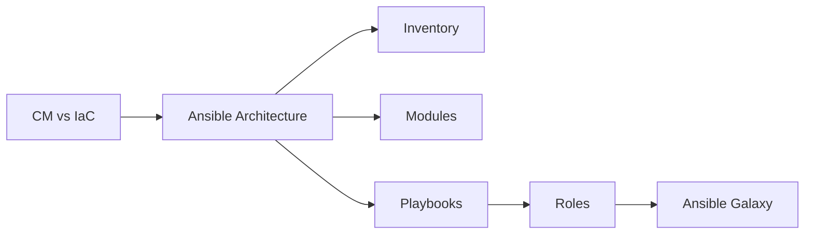

# Chapter 8: Configuration Management with Ansible

> **Previous:** [Kubernetes Advanced](./08-k8s-advanced.md) | **Next:** [Continuous Delivery](./09-cicd.md)

---

## Learning Objectives


- Explain the role of Configuration Management in the DevOps toolchain.
- Understand the Agentless architecture of Ansible.
- Master the core components of Ansible: Inventory, Playbooks, Modules, and Roles.
- Write an Ansible Playbook to automate the configuration of a web server.
- Use Ansible Galaxy to leverage community-contributed roles.

---


## Chapter at a Glance

| Topic | Key Insight | Practical Takeaway |
|-------|-------------|-------------------|
| CM vs IaC | CM manages software config; IaC provisions resources | Terraform for cloud resources, Ansible for OS config |
| Ansible Architecture | Agentless, push-based via SSH/WinRM | No agent software required on managed nodes |
| Key Components | Inventory, Modules, Playbooks, Roles | Idempotency ensures safe repeated execution |
| Templates and Variables | Jinja2 templating for dynamic configuration | Template configuration files for environment-specific values |

## Chapter Roadmap



## Theory

### What is Configuration Management?

> **Pro Tip:** Use --check mode for dry-runs before applying Ansible playbooks to production servers.
Configuration Management (CM) is the process of maintaining computer systems, servers, and software in a desired, consistent state. While IaC (like Terraform) focuses on the "what" (the hardware/VMs), CM (like Ansible) focuses on the "how" (the software/configuration inside those VMs).

### Ansible’s Architecture

> **Remember:** Ansible modules are idempotent--they check current state before making changes.
Ansible is "Agentless." It does not require any special software to be installed on the managed nodes. Instead, it uses standard SSH (for Linux) or WinRM (for Windows) to push small programs called "Ansible Modules" to the nodes, execute them, and then remove them.

### Key Components

> **Warning:** SSH key management is critical for Ansible. Use an SSH agent or ansible-vault for keys.
1.  **Inventory:** A list of managed nodes (IP addresses or hostnames) organized into groups.
2.  **Modules:** The "tools" in the Ansible toolkit. They perform specific tasks like installing a package, copying a file, or restarting a service.
3.  **Playbooks:** YAML files that describe a series of steps to be executed on a group of hosts.
4.  **Idempotency:** An important property of Ansible modules. Running the same module multiple times with the same parameters will not change the system after the first successful execution.

---

## Examples

> **One-Sentence Takeaway:** Configuration management focuses on software installation and configuration inside provisioned servers.

### Example 1: Installing Apache on Ubuntu
A simple playbook to ensure a web server is running.
- **Step-by-step:**
  1. Create `inventory.ini`:
     ```ini
     [webservers]
     192.168.1.10
     ```
  2. Create `setup_web.yml`:
     ```yaml
     - name: Configure Web Server
       hosts: webservers
       become: yes
       tasks:
         - name: Install Apache
           apt:
             name: apache2
             state: present
         - name: Ensure Apache is started
           service:
             name: apache2
             state: started
             enabled: yes
     ```
  3. Run: `ansible-playbook -i inventory.ini setup_web.yml`
- **Expected output:** Ansible connects via SSH, installs Apache, and starts the service.
- **What the example demonstrates:** Using an inventory and a playbook to manage remote state.

### Example 2: Using Templates for Configuration
Customizing the index page using Jinja2 templates.
- **Step-by-step:**
  1. Create a template `index.html.j2`:
     ```html
     <h1>Welcome to {{ ansible_hostname }}</h1>
     ```
  2. Add a task to the playbook:
     ```yaml
     - name: Deploy custom index page
       template:
         src: index.html.j2
         dest: /var/www/html/index.html
     ```
- **Expected output:** The web server displays a page with its own hostname.
- **What the example demonstrates:** Dynamic configuration using variables and templates.

---

## Summary

## Concept Comparison Table

| Concept | Description |
|---------|-------------|
| Infrastructure Provisioning | Creates cloud resources (VPCs, VMs, DBs) |
| Configuration Management | Installs and configures software on servers |
| Agentless | No agent required (Ansible, Salt SSH) |
| Agent-Based | Continuous agent on nodes (Puppet, Chef) |
| Idempotency | Same input always produces same output |

## Quick Reference

| Topic | Key Points |
|-------|------------|
| Ansible Key | Inventory, Playbooks, Modules, Roles |
| Architecture | Control Node, Managed Nodes, SSH/WinRM |
| Idempotency | Check before change, safe repeated runs |
| Templates | Jinja2, variables, facts, filters |
| Best Practice | --check mode, ansible-vault, Galaxy roles |

## Cross-Application Matrix

| Domain | Application |
|--------|-------------|
| Web | Configure web servers and load balancers |
| Cloud | Configure cloud VM instances after provision |
| Enterprise | Compliance configuration at scale |
| Container | Configure container host operating systems |

## Chapter Quiz

<details><summary>Question 1: What is Ansible's architecture?</summary>**A)** Agent-based with continuous agent<br>**B)** Agentless via SSH/WinRM<br>**C)** Pull-based with client agent<br>**D)** Database-driven configuration<br><br>**Answer: B)** Agentless via SSH/WinRM</details>

<details><summary>Question 2: What does idempotency mean in Ansible?</summary>**A)** Running playbook once produces one result<br>**B)** Running playbook multiple times produces same result<br>**C)** Playbook runs in reverse<br>**D)** Modules can only run once<br><br>**Answer: B)** Running playbook multiple times produces same result</details>

<details><summary>Question 3: Where are community Ansible roles shared?</summary>**A)** Docker Hub<br>**B)** Ansible Galaxy<br>**C)** npm Registry<br>**D)** PyPI<br><br>**Answer: B)** Ansible Galaxy</details>


## Summary

- Configuration Management ensures consistency across a large number of servers.
- Ansible's agentless approach makes it easy to adopt and manage.
- Idempotency ensures that Ansible playbooks are safe to run repeatedly.
- YAML-based playbooks are human-readable and can be version-controlled like any other code.
- Ansible Galaxy provides a vast library of pre-built roles for common software stacks.

---

## Exercises

### Review Questions
1. Why is an agentless architecture beneficial?
2. What is the difference between an Ansible "Module" and a "Playbook"?
3. What does "Idempotency" mean in the context of Ansible?
4. How does Ansible connect to a remote Linux server?

### Application Problems
1. Create an Ansible playbook that creates a user named `ansible_user` and adds their SSH key to `authorized_keys`.
2. Write an inventory file that groups servers into `production` and `staging` environments.
3. Use the `copy` module to transfer a local configuration file to a remote server.

### Challenge Problem
1. Compare and contrast Ansible with an imperative tool like a Bash script. Why is Ansible better suited for managing hundreds of servers?
